# 第四章. 现代化 .NET 应用程序到无服务器

*无服务器* 这个术语在软件工程界可能会引起混淆。如何在没有服务器的情况下运行 web 应用程序？这真的只是一种营销用语吗？从某种意义上说，是的。无服务器计算是指将后端系统架构为使用托管服务而不是手动配置服务器的广义术语。无服务器应用程序在后端系统上确实“无服务器”，就像您的智能手机的无线充电器是“无线”的一样。无线充电器仍然有线；它从充电器出来，插入到主电源插座，将能量从您的墙上传输到您的桌子上。 *无线* 部分只是充电器与您的手机之间的接口。无服务器计算中的 “无服务器” 一词的使用方式相同。是的，有服务器，但它们都由 AWS 在幕后进行管理。服务器就像是将您的无线充电器插入到墙上的主电源电缆。另一侧，即我们作为开发者可见的部分，在部署和运行代码时，不涉及任何服务器的配置或管理，因此是 *无服务器* 的。

您很可能已经在某些任务中使用了无服务器计算。考虑三种流行的服务器类型：

+   Web 服务器

+   电子邮件服务器

+   文件服务器

其中后两者，我们一直在用托管的无服务器解决方案替换。如果你曾通过 API 调用向 Mailchimp、Mailgun、SendGrid、SparkPost 或亚马逊的简单电子邮件服务 (SES) 发送电子邮件，那么你已经使用过无服务器的电子邮件解决方案。对于许多组织来说，运行 SMTP 服务器的时代，无论是内部还是云端，已经彻底过去了。文件服务器也正在逐渐过时，被无服务器文件存储解决方案取代。许多现代 web 应用程序完全依赖云原生服务，例如亚马逊简单存储服务 (S3) 作为其主要文件存储机制。这个列表中的最后一块石头就是 web 服务器。在本章中，我们将向您展示如何将您的 .NET web 服务器替换为无服务器、云原生实现，并说明这对您编写代码的方式意味着什么。

# 一个无服务器 Web 服务器

Web 服务器是一台计算机，可以是物理的也可以是虚拟的，永久连接到互联网，随时准备响应 HTTP(S) 请求。在 web 服务器内部，一个 HTTP 请求的生命周期涉及许多步骤，并执行由许多不同方编写的代码来读取、转换和执行每个请求。在这段旅程的中途，有你这位应用开发者编写的代码。

为了复制 Web 服务器的功能，我们需要一种在托管和按需基础上运行该自定义逻辑的方法。AWS 为我们提供了几种方法来实现这一点；我们将看看“App Runner”，这是一种允许我们部署完全托管的容器化应用程序而无需担心服务器的服务。AWS Fargate 是另一种基于按使用付费定价模型运行 Web 服务器的无服务器解决方案。这些服务将您的 Web 服务以无服务器方式部署到云中。但是，我们可以更进一步，将服务本身拆分为独立部署到云中的个体函数。为此，我们将需要函数即服务（FaaS）。

诸如 AWS Lambda 之类的 FaaS 解决方案是由事件触发的无状态计算容器。您上传要在事件发生时运行的代码，云提供商将为您处理资源的配置、执行，然后解除配置。这带来了两个主要优势：

+   在*函数执行期间*，FaaS 允许您的代码缩减至零。您只支付您使用的资源，而不是介于期间的未使用时间。这意味着您可以编写遵循真正的按使用付费定价模型的应用程序，仅支付每次函数执行的费用，而不是期间未使用的时间。

+   FaaS 迫使您考虑关注点分离，并对您编写应用程序的方式施加限制，这通常会导致更好的代码。

缺点源于实现 FaaS 解决方案所需的额外工作量。考虑一下 Rich Hickley 的这句话：

> 简单是一项艰苦的工作。但是，它会有巨大的回报。那些拥有真正简单系统的人——由真正简单部件组成的系统，将能够以最少的工作量产生最大的变化。他将会击败你。他将花更多时间在前期简化事务上，从长远来看，他将会把你的碗擦干净，因为他将有能力在你挣扎着推动大象时改变事物。
> 
> Rich Hickey，Clojure 编程语言的创作者

简单，就代码编写 FaaS 而言，意味着以*纯函数*为中心思想，并遵循单一职责原则。函数应接收一个值对象，执行一个动作，然后返回一个值对象。一个遵循这种模式的良好示例是字符串的`Reverse()`函数：

```cs
public static string Reverse(string str)
{
    char[] charArray = str.ToCharArray();
    Array.Reverse( charArray );
    return new string( charArray );
}
```

这个函数满足称为“纯函数”的两个要求：

+   它对于给定的输入始终返回相同的输出。

+   它没有副作用；它不会改变任何静态变量或可变引用参数，也不需要函数范围之外的状态持久性。

这些都是编写 FaaS 函数所需的特性。由于 FaaS 函数是响应事件运行的，你希望保持第一点的真实性，以便句子“当发生 X 事件时，执行 Y”对于每次事件 X 的发生都保持真实。你还需要保持你的函数无状态（第二点）。这既是在托管的 FaaS 上运行函数的限制，也是其特征。因为 AWS 可以并且会在执行函数期间取消分配资源，所以无法共享静态变量。如果你希望在 FaaS 函数中持久化数据，你必须有意地将其持久化到共享存储区域，例如保存到数据库或 Redis 缓存中。

将您的代码架构为没有副作用的无状态函数可能是一个需要纪律的挑战。它迫使您思考如何编写您的逻辑以及每个代码区域可以真正控制的范围。它还迫使您考虑关注点分离。

当多个 FaaS 函数使用事件连接在一起，并增加其他无服务器服务（如消息队列和 API 网关），就有可能构建一个能够执行传统 Web API 功能的后端应用程序。这使您可以编写完全托管在 AWS 上的无服务器后端应用程序。更妙的是，您可以在 C#中完成所有这些！AWS 提供了许多服务，可以用作这种无服务器应用程序的构建块。让我们看看其中一些组件。

# 选择 AWS 上的.NET 无服务器组件

我们将向您介绍 AWS 中一些最有用的无服务器服务，以及如何在您的代码中使用[AWS SDK for .NET](https://aws.amazon.com/sdk-for-net)的各种包与这些服务进行交互。让我们逐步构建一个无服务器 Web 应用程序，随着每个引入的新概念而增加功能。

想象一下，我们是一家软件开发咨询公司，正在招聘周围最优秀的 C#开发人员！为了让他们申请，我们希望他们访问我们的网站，在那里他们将找到一个 HTML 表单，允许他们上传他们的简历作为 PDF 文件。提交此表单将把他们的 PDF 简历发送到我们的 API，将其保存到文件服务器，并发送电子邮件给我们的招聘团队，请他们审核。我们将其称为无服务器 C#简历上传器。图 4-1 显示了架构的高级概述。

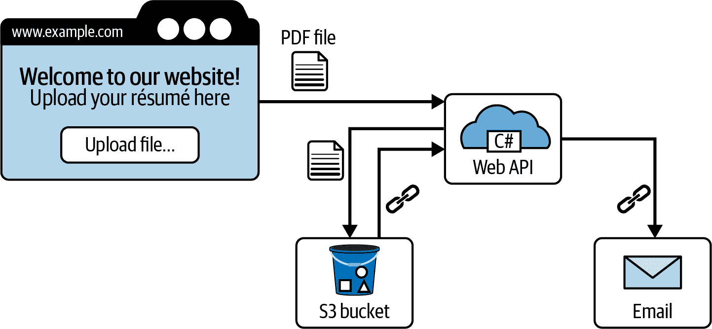

###### 图 4-1\. 无服务器 C#简历上传器架构

我们后端的当前实现使用 Web API 控制器动作来接受 PDF 文件上传，将其保存到云存储，并向我们的招聘团队发送电子邮件。代码如下：

```cs
[ApiController]
[Route("[controller]")] public class ApplicationController : ControllerBase
{
    private readonly IStorageService _storageService;
    private readonly IEmailService _emailService;

    public ApplicationController(IStorageService storageService,
                                 IEmailService emailService)
    {
        _storageService = storageService;
        _emailService = emailService;
    }
 [HttpPost]
    public async Task<IActionResult> SaveUploadedResume()
    {
        Request.EnableBuffering();
        using var fileStream = new MemoryStream();
        using var reader = new StreamReader(fileStream);
        await Request.Body.CopyToAsync(fileStream); 

        var storedFileUrl = await _storageService.Upload(fileStream); 

        await _emailService.Send("recruitment@example.com",
            $"Somebody has uploaded a resume! Read it here: {storedFileUrl}"); 

        return Ok();
    }
}
```


从请求中读取上传的文件。


将其保存到云存储中。


向我们的招聘团队发送一封电子邮件，其中包含指向该文件的链接。

`IStorageService`的代码如下：

```cs
public class AwsS3StorageService : IStorageService
{
    const string BucketName = "csharp-examples-bucket";

    public async Task<string> Upload(Stream stream)
    {
        var fileName = Guid.NewGuid().ToString() + ".pdf"; 

        using var s3Client = new AmazonS3Client(RegionEndpoint.EUWest2);

        await s3Client.PutObjectAsync(new PutObjectRequest()
        {
            InputStream = stream,
            BucketName = BucketName,
            Key = fileName,
        }); 

        var url = s3Client.GetPreSignedURL(new GetPreSignedUrlRequest()
        {
            BucketName = BucketName,
            Key = fileName,
            Expires = DateTime.UtcNow.AddMinutes(10)
        }); 

        return url;
    }
}
```


创建一个唯一的 S3 键名。


将文件上传到 S3。


生成一个指向我们新文件的预签名 URL。¹

使用`AWSSDK.S3` NuGet 包将文件保存到 AWS S3 存储桶中。在此示例中，存储桶名为`csharp-examples-bucket`²，文件将通过`Guid.NewGuid()`获得一个唯一键。

我们示例中的第二个服务是`IEmailService`，它使用 AWS SES 向我们的招聘团队发送电子邮件。此实现使用 AWS SDK 中的另一个 NuGet 包称为`Amazon.SimpleEmail`：

```cs
public class AwsSesEmailService : IEmailService
{
    public async Task Send(string emailAddress, string body)
    {
        using var emailClient = new AmazonSimpleEmailServiceClient(
                                                RegionEndpoint.EUWest1);

        await emailClient.SendEmailAsync(new SendEmailRequest
        {
            Source = "from@example.com",
            Destination = new Destination
            {
                ToAddresses = new List<string> { emailAddress }
            },
            Message = new Message
            {
                Subject = new Content("Email Subject"),
                Body = new Body { Text = new Content(body) }
            }
        });
    }
}
```

我们将在本章剩余的示例中使用这两个实现。如前所述，通过将 PDF 文件保存在 S3 中并通过 SES 发送电子邮件，我们已经在文件存储和电子邮件服务中使用了无服务器解决方案。因此，让我们也摆脱这个 Web 服务器，并将我们的控制器动作移至托管云函数。

## 使用 AWS Lambda 和 C#进行开发

AWS 的 FaaS 产品称为 Lambda。AWS Lambda 由亚马逊的 CTO Werner Vogels 于 2014 年推出，以下总结我们认为非常恰当地概括了 AWS Lambda 背后的动机和价值：

> 这里的重点是事件。事件可能由触发这些事件的 Web 服务驱动。您会编写一些代码，比如 JavaScript，这些代码会在不需要为其提供硬件的情况下运行。
> 
> Werner Vogels

自 2014 年以来，AWS Lambda 在采纳率和功能上都有了巨大的增长。他们添加了越来越多的事件选项来触发您的函数，如 Lambda@Edge，在最接近用户的 CDN 服务器上运行您的函数（即“边缘计算”），自定义运行时，用于库的共享内存层称为“Lambda 层”，以及对我们至关重要的是，在 x86_64 和 ARM64 CPU 架构上内置对.NET 的支持。

AWS 提供了很多在 C#中编写 Lambda 函数和重构现有代码以便部署到 AWS Lambda 的示例。下面是一个快速示例，利用`Amazon.Lambda.Templates` NuGet 包中的模板创建并部署一个简单的 C# Lambda 函数。该包包含了可以在.NET Core CLI 的`dotnet new`命令中使用的项目模板：

```cs
dotnet new -i Amazon.Lambda.Templates

dotnet new lambda.EmptyFunction --name SingleCSharpLambda
```

这将创建一个名为*SingleCSharpLambda*的文件夹，其中包含用于你的函数的源代码和测试项目。示例函数位于名为*Function.cs*的文件中。

```cs
[assembly: LambdaSerializer(typeof(Amazon.Lambda.Serialization.SystemTextJson.
 DefaultLambdaJsonSerializer))]

namespace SingleCSharpLambda
{
    public class Function
    {
        public string FunctionHandler(string input, ILambdaContext context)
        {
            LambdaLogger.Log("Hello from" + context.FunctionName);

            return input?.ToUpper();
        }
    }
}
```

模板创建了一个带有公共函数`FunctionHandler(input, context)`的类。这是每个 C# Lambda 函数在 AWS Lambda 中的入口点方法签名。两个参数分别是输入参数，其形状将根据我们将 Lambda 函数挂钩到的任何事件确定，以及`ILambdaContext context`，由 AWS 在执行时生成，包含有关当前执行 Lambda 函数的信息。

我们还在上一个模板函数中添加了一行打印日志消息的代码，以便我们在 AWS 上运行时可以检查其执行情况。这里的静态类`LambdaLogger`属于`Amazon.Lambda.Core`包，这是我们模板中添加的一部分。你也可以在这里使用`Console.WriteLine()`；AWS 会将任何写入`stdout`或`stderr`的调用发送到与函数关联的 CloudWatch 日志流。³

现在我们可以开始部署我们的函数到 AWS 了。如果你还没有安装它们，现在是获取[AWS Lambda .NET 全局工具](https://oreil.ly/k0wcz)的好时机。全局工具是一种特殊类型的 NuGet 包，你可以从`dotnet`命令行执行：

```cs
dotnet tool install -g Amazon.Lambda.Tools
```

然后部署你的函数：

```cs
dotnet lambda deploy-function SingleCSharpLambda
```

如果在*aws-lambda-tools-defaults.json*配置文件中还没有设置，将会要求你提供 AWS 区域和 IAM 角色的 ARN，用于函数执行时使用的角色。IAM 角色可以由`Amazon.Lambda.Tools`工具动态创建，包括所需的所有权限。你可以访问[IAM 控制台](https://console.aws.amazon.com/iamv2)查看和编辑这个（或其他任何）IAM 角色的权限。

图 4-2 展示了我们在部署的 AWS 管理控制台中的示例函数。你可以直接从下一个屏幕的测试选项卡中，在控制台中测试该函数。

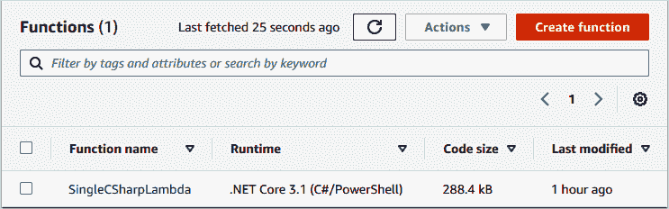

###### 图 4-2\. AWS Lambda 控制台中的函数列表

这个测试窗口（显示在图 4-3 中）允许你输入一些 JSON 数据作为我们之前定义的`input`参数传递给你的函数。由于我们在`FunctionHandler(string input, ILambdaContext context)`中声明了输入值为*string*类型，我们应该将其更改为任意字符串，并且可以在管理控制台中直接测试函数。

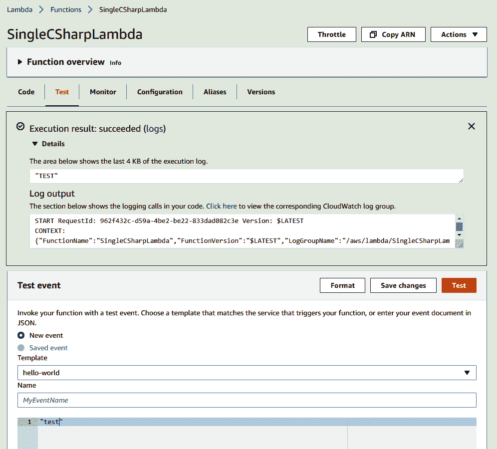

###### 图 4-3\. 测试你的部署 Lambda 函数

您的执行结果将被插入到页面中，包括内联的“日志输出”窗口，也显示在 图 4-3 中。这使您能够快速查找和调试 Lambda 函数中的错误，并进行手动测试。

### C# 简历示例：AWS Lambda

现在我们对 AWS Lambda 比较熟悉了，让我们将其应用到无服务器示例中。我们将从 C# 简历上传示例中获取我们的 Web API 控制器，并将其转换为 AWS Lambda 函数。任何 Web API 控制器都可以借助 AWS 的一个称为 Amazon.Lambda.AspNetCoreServer.Hosting 的包部署到 AWS Lambda 中。该包使得将 .NET 控制器包装成 API Gateway 调用的 Lambda 函数变得简单。

###### 注意

API Gateway 是 AWS 的一项服务，使得构建由 Lambda 函数组成的 API 成为可能。它提供了 HTTP 请求和 Lambda 函数之间的管道，允许您配置一组单独的 Lambda 函数，以在 API Gateway 中配置的 API 路由上运行 `GET`、`PUT`、`POST`、`PATCH` 和 `DELETE` 请求。在本例中，我们使用 API Gateway 将路由 `POST: https://our-api/Application` 映射到一个 Lambda 函数上。

要使用这种方法将 ASP .NET 应用程序部署到 AWS Lambda，请安装 Amazon.Lambda.AspNetCoreServer 包，然后在应用程序的服务集合中添加对 `AddAWSLambdaHosting()` 的调用。⁴ 这允许 API Gateway 和 AWS Lambda 在 Lambda 上运行时充当 Web 服务器：

```cs
var builder = WebApplication.CreateBuilder(args);

builder.Services.AddRazorPages();

// Add AWS Lambda support. builder.Services.AddAWSLambdaHosting(LambdaEventSource.HttpApi); 

app.MapRazorPages();

var app = builder.Build();
```


这是我们需要添加的唯一一行。

就像我们在 “使用 AWS Lambda 和 C# 进行开发” 中所做的那样，使用我们的新类作为入口点将此 Lambda 函数部署到 AWS。我们将不得不为设置创建一个 JSON 文件。如果您安装了 Visual Studio 和 AWS Toolkit for Visual Studio，则可以尝试一些模板项目，这些项目演示了如何配置此 JSON 文件，因此我们建议您试一试。但是，在我们这里的示例中，我们只是直接将其部署到 AWS Lambda。

```cs
dotnet lambda deploy-function UploadNewResume
```

图 4-4 显示了如果在您的 JSON 文件中没有配置所有这些设置，`dotnet lambda deploy-function` 将为您提供的步骤。对于 IAM 角色，我们需要创建一个带有适当策略的角色，以执行简历上传功能所需的所有操作（保存到 S3、通过 SES 发送电子邮件），同时调用 Lambda 函数并创建 CloudWatch 日志组。

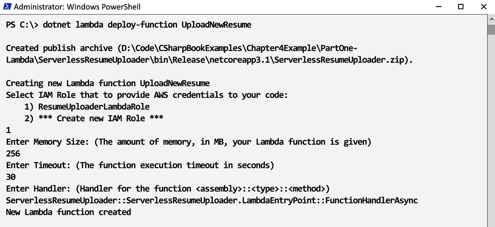

###### 图 4-4\. 在控制台中执行 `dotnet lambda deploy-function`

接下来我们需要创建一个 API 网关服务，将我们的 Lambda 函数连接到外部世界。在本章后面，我们将探索 AWS 无服务器应用模型（SAM）——这是一种创建和管理无服务器资源（如 API 网关）的绝佳方式，使用可提交到源代码控制的模板文件。但现在，我们建议使用 AWS 管理控制台创建 API 网关服务，如 图 4-5 所示。

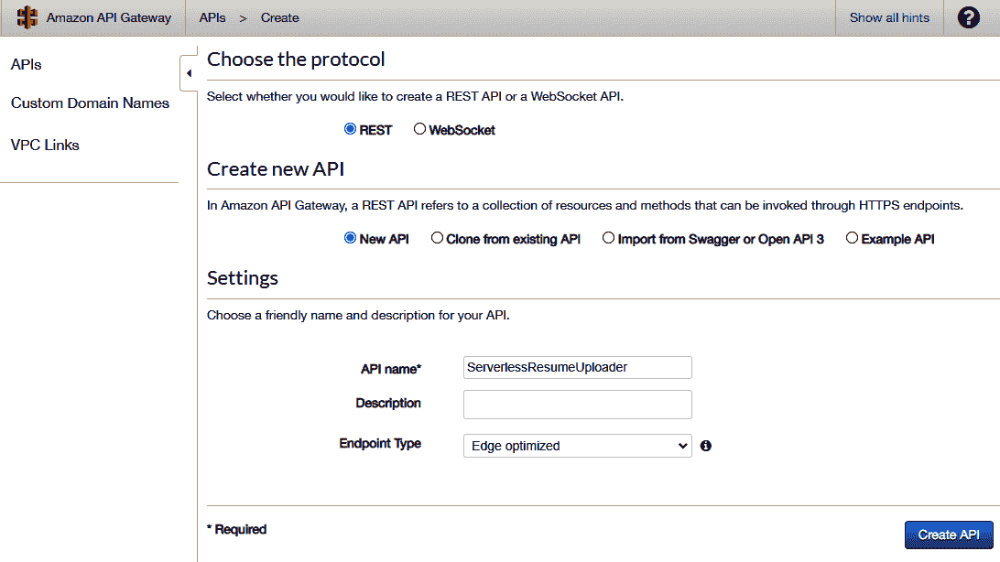

###### 图 4-5\. 在 API 网关控制台中创建 API

AWS 管理控制台是探索和熟悉这些托管 AWS 服务的各种设置和选项的好方法，因此当您需要将这些设置保留在模板文件中时，您可以在脑海中找到一个锚点，了解所有组件如何配合。

图 4-6 显示了我们如何设置一个带有 Lambda 函数代理的 API 网关服务，将所有路由转发到我们刚刚部署的 AWS Lambda 函数 `UploadNewResume`。您可以通过控制台中的 `TEST` 工具（在 图 4-6 左侧显示）测试此功能，或者更好的方法是，通过向 API 网关服务的公共 URL 发送实际的 HTTP `POST` 请求，并将 PDF 文件放在请求体中。您可以在管理控制台的阶段设置中找到 API 网关的 URL。例如，我的 API 网关实例具有 ID `xxxlrx74l3`，位于 `eu-west-2` 区域。要将简历上传到我们的 API，我们可以使用 `curl` 执行 `POST` 请求：

```cs
curl https://xxxlrx74l3.execute-api.eu-west-2.amazonaws.com/Prod/Application
 --data-binary @MyResumeFile.pdf
```

这将上传我们的 PDF 文件到 API 网关，API 网关将其传递给我们的 Lambda 函数，在其中，我们的代码将其保存到 S3 并发送电子邮件。

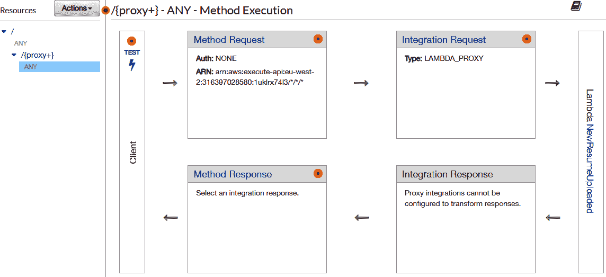

###### 图 4-6\. API 网关 Lambda 代理设置

所有这些都是通过将我们的 API 控制器封装在 `APIGatewayProxyFunction` 类中，并部署为 AWS Lambda 云函数来实现的。接下来，我们将探讨在我们的应用程序中添加多个 Lambda 函数以执行更复杂和细粒度任务时可能出现的可能性。

## 使用 AWS Step Functions 进行开发

到此时为止，我们已经将 Web API 控制器部署到 Lambda 函数，并将其连接到 API Gateway，以便通过 HTTP 请求调用它。接下来，让我们考虑如何真正利用我们的新函数作为服务执行模型。还记得我们谈过的 FaaS 强制您更注重关注点分离吗？我们示例中的函数正在做很多事情。这通常是任何语言中 API 控制器动作的情况，不仅仅是 C# —— 它们倾向于同时承担多个责任。我们的 `UploadNewResume()` 做的不仅仅是简单地上传简历；它还在给招聘团队发邮件，并创建一个新文件名。如果我们想要进一步解锁无服务器和 FaaS 的某些灵活性，我们需要将这些操作拆分为它们自己的函数。AWS 有一个非常好的工具，用于管理涉及多个 Lambda 函数（以及更多内容）的工作流程，它被称为 AWS Step Functions。

AWS Step Functions 在工作流程中的步骤之间提供了抽象。我们可以看一下前面示例中的控制器动作，并看看其中多少代码只是管道工作：

```cs
[HttpPost]
public async Task<IActionResult> SaveUploadedResume()
{
    Request.EnableBuffering();
    using var fileStream = new MemoryStream();
    using var reader = new StreamReader(fileStream);
    await Request.Body.CopyToAsync(fileStream); 

    var storedFileUrl = await _storageService.Upload(fileStream); 

    await _emailService.Send("recruitment@example.com",
        $"Somebody has uploaded a resume! Read it here: {storedFileUrl}"); 

    return Ok(); 
}
```


在内存流之间移动比特。


执行存储服务上的函数。


在电子邮件服务上执行函数。


创建 HTTP 响应，状态码为 200。

这个函数做了四件事情，虽然没有特别复杂的一项，但*所有*都构成了我们后端 API 的业务逻辑（或“工作流”）。它也并没有真正尊重单一责任原则。该函数被称为 `SaveUploadedResume()`，所以你可以认为它的单一责任应该是将简历文件插入到 S3 中。那么，为什么它还要发送电子邮件和构建 HTTP 响应呢？

如果你要为这个函数编写单元测试，最好能简单地覆盖所有你期望在“保存上传的简历”时遇到的情况。然而，你必须考虑模拟电子邮件传播以及在单元测试中执行 API 控制器动作所需的样板代码。这增加了函数的范围，并增加了需要测试的内容数量，最终增加了修改此代码片段时涉及的摩擦力。

如果我们能将这个函数的范围减小到真正只有一个职责（保存简历），并将电子邮件和 HTTP 相关问题分离出去，那不是很好吗？

使用 AWS Step Functions，您可以将工作流程的部分或全部移出您的代码并放入配置文件中。Step Functions 使用一种名为 [Amazon States Language](https://oreil.ly/nmxp3) 的专有 JSON 对象格式来构建它称为*状态机*的内容。AWS Step Functions 中的这些状态机由事件触发，并通过定义文件中配置的步骤流动，执行任务并沿着工作流传递数据，直到达到结束状态。

在下一节中，我们将重构我们的 Serverless C# 简历上传应用程序以使用 Step Functions，但可以简要地说，使用 Step Functions 的主要优势之一是能够将应用程序的*管道*开发与单个函数分开。Figure 4-7 是来自 AWS 管理控制台中 AWS Step Functions 部分的屏幕截图，显示了执行该状态机的操作，“执行事件历史”部分展示了这次执行状态机操作达到结束状态的过程。

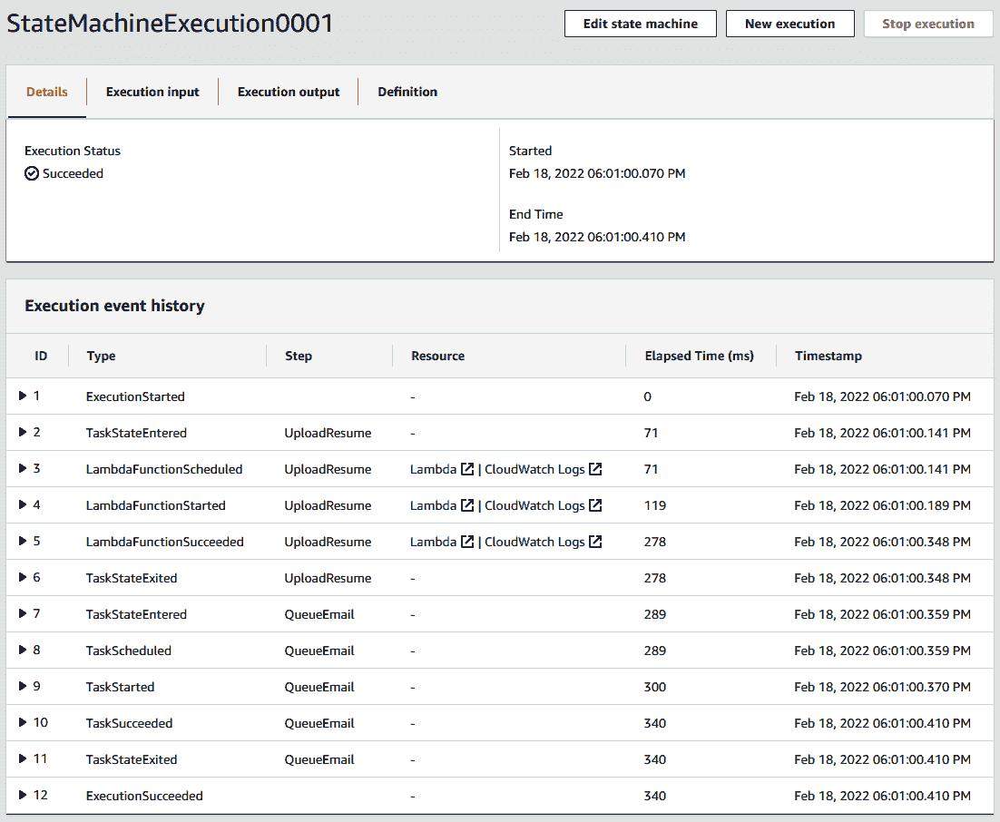

###### 图 4-7\. Step Functions 在管理控制台中的执行日志

### C# 简历上传示例：Step Functions

为了演示我们可以如何使用 AWS Step Functions，让我们将在我们简历上传示例的前一部分创建的 AWS Lambda 函数拆分为多个 Lambda 函数。`UploadNewResume` Lambda 函数可以负责将文件上传到 S3，然后我们有第二个 Lambda 函数来发送电子邮件（`EmailRecruitment`）。HTTP 部分也可以完全抽象并由 API Gateway 处理。这使得我们在这两个函数开发、测试和部署后仍能更灵活地修改或优化后端的工作流程：

```cs
[assembly: LambdaSerializer(
    typeof(Amazon.Lambda.Serialization.SystemTextJson.
            DefaultLambdaJsonSerializer))]

namespace ServerlessResumeUploader
{
    public class LambdaFunctions
    {
        private readonly IStorageService _storageService
                                            = new AwsS3StorageService();
        private readonly IEmailService _emailService
                                            = new AwsSesEmailService();

        
        public async Task<StepFunctionsState> UploadNewResume(
            StepFunctionsState state, ILambdaContext context)
        {
            byte[] bytes = Convert.FromBase64String(state.FileBase64);
            using var memoryStream = new MemoryStream(bytes);

            state.StoredFileUrl = await _storageService.Upload(memoryStream);

            state.FileBase64 = null;

            return state;
        }

        
        public async Task<StepFunctionsState> EmailRecruitment(
            StepFunctionsState state, ILambdaContext context)
        {
            await _emailService.Send("recruitment@example.com",
            $"Somebody uploaded a resume! Read here: {state.StoredFileUrl}\n\n" +
            $"...and check out their GitHub profile: {state.GithubProfileUrl}");

            return state;
        }
    }
}
```


第一个 Lambda 函数接收文件并保存到 S3。


第二个 Lambda 函数向我们的招聘团队发送包含文件链接的电子邮件。

你可以看到这段代码与本章早些时候的`ApplicationController`代码非常相似，只是已经重构为`LambdaFunctions`类上的两个方法。这将部署为两个独立的 AWS Lambda 函数，它们使用相同的二进制文件，这是部署多个共享代码的 Lambda 函数的一种常见方式。实际的上传和发送电子邮件再次由`AwsS3StorageService`和`AwsSesEmailService`执行；然而，我们不再使用依赖注入了。⁵

对于这两个函数，需要注意的是，现在的第一个参数是`state`，它们都属于`StepFunctionsState`类型。AWS Step Functions 通过在每个任务之间传递一个状态对象（在本例中，任务是一个函数）来执行您的工作流。这些函数会向状态添加或删除属性。我们先前函数的状态如下：

```cs
public class StepFunctionsState
{
    public string FileBase64 { get; set; }

    public string StoredFileUrl { get; set; }
}
```

当这个`state`输入被传递给第一个函数`UploadNewResume()`时，它将具有来自我们前端 HTTP `POST`请求的 API Gateway 设置的`state.FileBase64`。该函数将把这个文件保存到 S3，然后设置`state.StoredFileUrl`，然后将状态对象传递给下一个函数。它还会从状态对象中清除`state.FileBase64`。在 AWS Step Functions 中，状态对象在每个步骤之间传递，由于这个 base64 字符串可能会很大，我们可以在读取后将其设置为 null，以减少传递的状态对象的大小。

我们可以像以前一样将这两个函数部署到 AWS Lambda 上；但是，这一次我们需要为每个函数指定`--function-handler`参数。*函数处理程序*是我们代码中作为 Lambda 入口点的 C#函数，正如我们之前在“使用 AWS Lambda 和 C#开发”中看到的：

```cs
dotnet lambda deploy-function UploadNewResume
    --function-handler ServerlessResumeUploader::ServerlessResumeUploader.
    LambdaFunctions::UploadNewResume

dotnet lambda deploy-function EmailRecruitment
    --function-handler ServerlessResumeUploader::ServerlessResumeUploader.
    LambdaFunctions::EmailRecruitment
```

如果我们进入 AWS Step Functions，我们可以创建一个新的状态机，并将这两个 Lambda 函数以及 API Gateway 连接起来。AWS 管理控制台确实为我们提供了一个图形用户界面来构建这些工作流程；然而，作为工程师，我们将在 Amazon States 语言的 JSON 文件中编写它。这也有一个关键的好处，即利用一个可以检入源代码控制的纯文本 JSON 文件，为我们提供了一个出色的*基础设施即代码（IaC）*部署模型。这里我们简单工作流的 JSON 配置如下：

```cs
{
  "Comment": "Resume Uploader State Machine",
  "StartAt": "SaveUploadedResume",
  "States": {
    "SaveUploadedResume": {
      "Type": "Task",
      "Resource": "arn:aws:lambda:eu-west-2:00000000:function:UploadNewResume",
      "Next": "EmailRecruitment"
    },
    "EmailRecruitment": {
      "Type": "Task",
      "Resource": "arn:aws:lambda:eu-west-2:00000000:function:EmailRecruitment",
      "End": true
    }
  }
}
```

Lambda 函数的 Amazon 资源名称（ARN）可以在管理控制台的 AWS Lambda 部分找到，它允许我们从 AWS 的任何地方引用这些 Lambda 函数。如果我们将前面的 JSON 复制到 AWS Step Functions 状态机的定义中，您可以在控制台中看到它为我们创建了工作流程的图形表示。本章后面的图 4-11 展示了这个图形的样子。

此示例的最后一步是将我们状态机的启动连接到 API Gateway。之前，API Gateway 被配置为将所有请求代理到我们的 AWS Lambda 函数，现在我们希望在 API Gateway 中指定确切的路由，并将其转发到我们的 Step Functions 工作流程。如图 4-8 所示，设置了一个名为 `/applications` 的 `POST` 端点，AWS 服务设定为“Step Functions”。您还可以在图 4-8 中看到，我们已将内容处理设置为“必要时转换为文本”。这是我们简历上传示例中特定的选项。因为我们将以原始二进制形式 `POST` PDF 文件到我们的 API，此选项告诉 API Gateway 将其转换为 Base64 文本。然后可以轻松地将其添加到我们的状态对象中（如前面展示的 `StepFunctionsState.cs`），并在 AWS Step Functions 工作流程的 Lambda 函数之间传递。

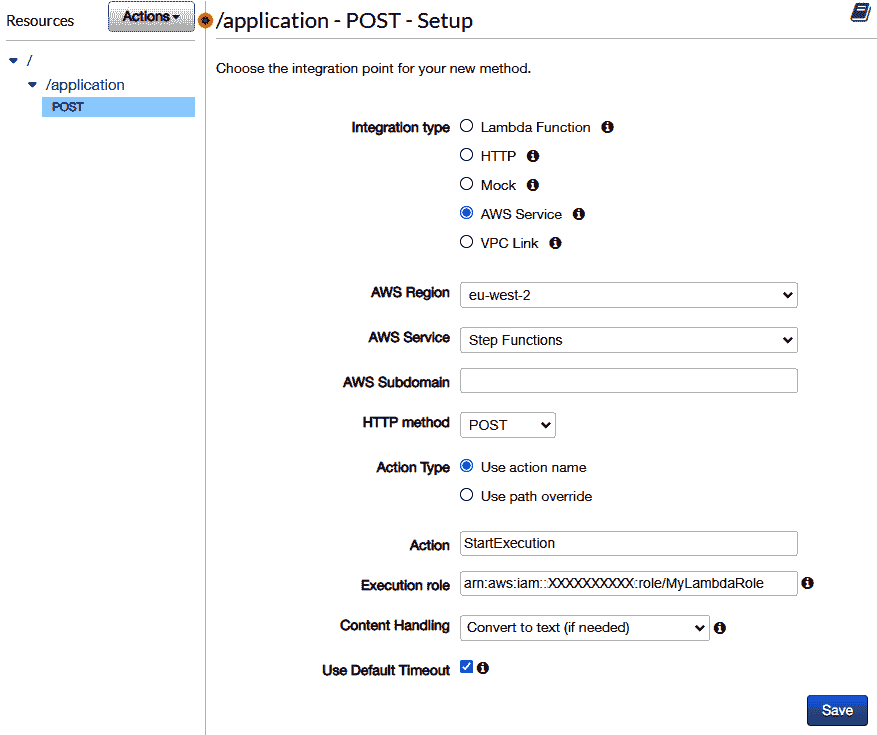

###### 图 4-8\. 触发 Step Functions 的 API Gateway 配置

最后，我们可以在 API 网关中设置一些请求映射，将请求转换为告知 AWS Step Functions 要执行哪个状态机的 JSON 对象。如图 4-9 所示，这是一个链接到 *application/pdf* 内容类型头部的映射模板。

现在我们已经准备好向我们的 API 发送文件，并观察 Step Functions 工作流的执行：

```cs
curl https://xxxlrx74l3.execute-api.eu-west-2.amazonaws.com/Prod/Application
 --data-binary @MyResumeFile.pdf
```

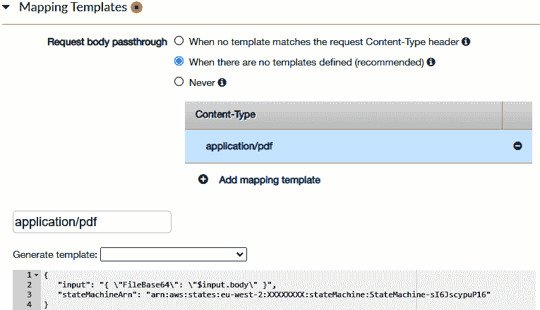

###### 图 4-9\. PDF 文件的内容类型映射

如果我们在管理控制台的 AWS Step Functions 状态机的执行选项卡中导航，我们将能够看到此上传触发我们状态机的执行。如图 4-10 所示，展示了执行过程的可视化表示，您可以通过单击最新执行来查看此图表。

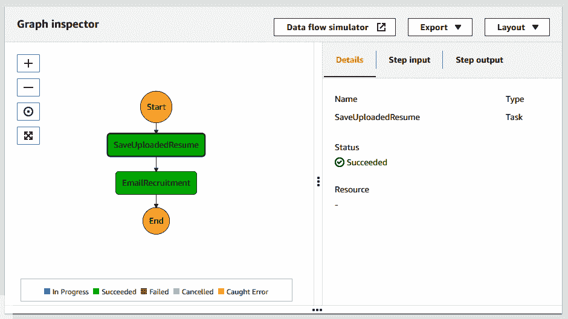

###### 图 4-10\. 我们状态机的成功执行

我们承认，这似乎是为了保存文件到 S3 并发送电子邮件而做的大量工作。到这一步，您可能会想，这究竟有什么意义？难道只是为了将我们的工作流程抽象成一个 JSON 文件？重构所有这些并部署到 AWS Step Functions 的目的在于，现在我们有了更灵活和可扩展的起点。现在我们可以做一些非常酷的事情，而无需接触我们部署的两个 Lambda 函数。例如，为什么不利用 AWS Textract 读取 PDF 文件并提取候选人的 GitHub 个人资料？这就是我们接下来将要做的事情。

### C# 简历上传示例：AWS Textract

这是一种功能，不久之前编码起来可能会非常复杂，但是通过 Step Functions 和 AWS Textract，我们可以很容易地添加此功能，甚至无需将额外的第三方库引入到我们的现有代码中，甚至不需要重新编译它：

```cs
public async Task<StepFunctionsState> LookForGithubProfile(
    StepFunctionsState state, ILambdaContext context)
{
    using var textractClient =
            new AmazonTextractClient(RegionEndpoint.EUWest2);

    var s3ObjectKey = Regex.Match(state.StoredFileUrl,
                "amazonaws\\.com\\/(.+?(?=\\.pdf))").Groups[1].Value + ".pdf";

    var detectResponse = await textractClient.DetectDocumentTextAsync(
        new DetectDocumentTextRequest
    {
        Document = new Document
        {
            S3Object = new S3Object
            {
                Bucket = AwsS3StorageService.BucketName,
                Name = s3ObjectKey,
            }
        }
    });

    state.GithubProfileUrl = detectResponse.Blocks
            .FirstOrDefault(x => x.BlockType == BlockType.WORD &&
                                 x.Text.Contains("github.com"))
            ?.Text;

    return state;
}
```


AmazonTextractClient 可在 AWSSDK.Textract NuGet 包中找到，并允许我们轻松调用 AWS Textract。

###### 提示

Textract 是 AWS 提供的众多机器学习服务之一。它们还提供 AWS Comprehend 用于对文本进行自然语言处理，以及 Amazon Rekognition 用于图像标记。所有这些服务都采用按使用量付费的模式，并可以从 Lambda 函数中调用，就像我们在这里使用 AWS Textract 一样。

这里有另一个 C# Lambda 函数的代码，它将接收与我们所有功能中一直在使用的相同状态对象，并将 PDF 文件发送到 Textract。从这个函数的响应中，我们将得到从 PDF 文件中提取的文本块数组。如果任何这些文本块包含字符串“github.com”，我们将其添加到我们的状态对象中，以供稍后的 Lambda 函数使用。例如，这允许我们在发送的电子邮件中包含它：

```cs
public async Task<StepFunctionsState> EmailRecruitment(StepFunctionsState state,
                                                       ILambdaContext context)
{
    await _emailService.Send("recruitment@example.com",
    $"Somebody uploaded a resume! Read it here: {state.StoredFileUrl}\n\n" +
    $"...check out their GitHub profile: {state.GithubProfileUrl}");

    return state;
}
```


存储的文件 URL 仍然留在从第一个函数保存到 S3 的状态对象中。


此新领域是在 PDF 中的 GitHub 网址被 Textract 发现时，通过 `LookForGithubProfile()` 添加的。

我们可以将新的 `LookForGithubProfile()` 函数部署为第三个 AWS Lambda，并将其添加到我们的状态机 JSON 中。我们还在这里添加了一个错误处理程序，调用一个函数通知我们上传简历时出现错误。使用 Amazon States Language JSON 定义，可以创建复杂路径和工作流中的许多不同步骤和方式。Figure 4-11 在 AWS 管理控制台中显示了这一切，左侧是我们的定义 JSON，右侧是工作流的视觉表示。

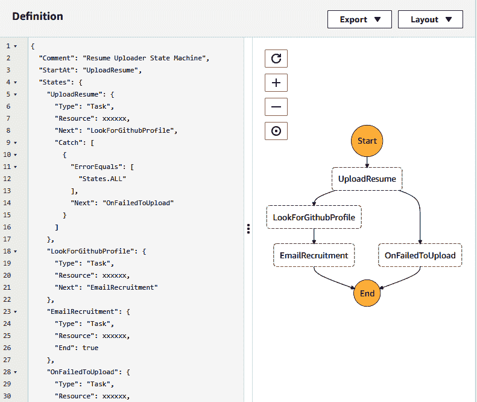

###### 图 4-11\. AWS Step Functions 中的工作流定义和图形表示

我们还可以更新我们的架构图表，删除 Figure 4-1 中显示的 Web 服务器，并将应用程序完全无服务器化，如 Figure 4-12 所示。

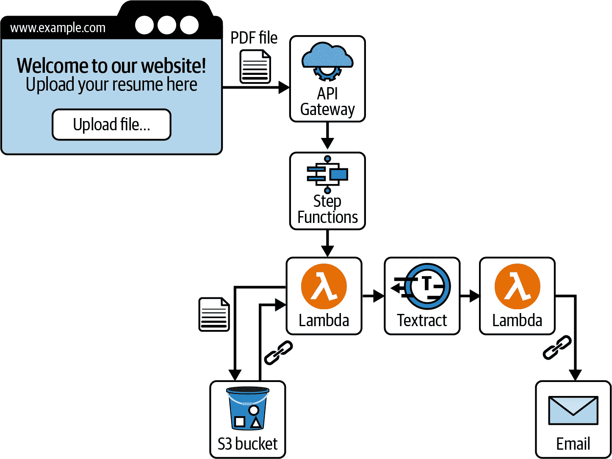

###### 图 4-12\. 无服务器 C# 简历上传器架构

现在我们有一个真正的无服务器应用程序，其中各个组件可以独立开发、测试和部署。但是，如果我们不想依赖 AWS Step Functions 来将所有这些逻辑绑定在一起怎么办？

## 使用 SQS 和 SNS 进行开发

AWS Step Functions 不是在 AWS Lambda 调用和其他无服务器服务之间进行通信的唯一方式。在 AWS Step Functions 存在很久之前，我们已经有了消息队列和发布/订阅模式。这是 AWS 提供的两种服务之一：

Amazon Simple Notification Service (SNS)

SNS 是发布/订阅模式的分布式实现。订阅者可以附加到 SNS 通道（称为“主题”），当消息发布时，所有订阅者将立即收到通知。在 SNS 的任何给定主题上可以有多个订阅者监听发布的消息，并且支持多种端点，如电子邮件和短信，以及触发 Lambda 函数或发起 HTTP 请求。

Amazon 简单队列服务（SQS）

SQS 是 AWS 的消息队列。消息不会直接推送给订阅者，而是添加到队列中并在那里存储一段时间（最多 14 天）。消息接收者以适合他们的速率轮询队列，根据需要读取并删除队列中的消息。SQS 队列使得延迟操作或批处理消息直到订阅者准备好处理它们成为可能。

这两个服务使我们可以从“消息”和“事件”的角度思考，这些是构建无服务器系统的重要概念。它们将允许我们在我们的示例系统中实现发布者/订阅者模式。

### C# 简历上传示例：SQS

想象一下我们在 Serverless C# 简历上传应用程序中可以如何利用 SQS 或 SNS。我们知道用户可以通过 API Gateway 将他们的简历上传到我们的 API，并将其存储在 S3 中，然后使用 Textract 读取候选人的 GitHub 档案。如果不是立即发送电子邮件给招聘团队，而是将消息添加到队列中怎么样？这样，我们可以每天早上运行一次作业，并发送一封包含队列中过去 24 小时内所有消息的电子邮件。这可能会让我们的招聘团队更容易一次性阅读所有当天的简历，而不是分散在一整天内进行。我们可以在不必触及其余代码的情况下完成所有这些吗？而不必重建、重新测试或重新部署整个应用程序？是的，以下是如何实现的。

由于我们正在使用 AWS Step Functions，我们可以简单地在定义 JSON 文件中创建一个任务，将消息发布到 SQS 队列中。我们不需要另一个 Lambda 函数来执行此操作；相反，我们可以直接在 JSON 中指定消息正文，然后更新我们的状态引擎定义。这里有一个名为 `"QueueEmail"` 的任务，它将消息发布到我们设置的名为 `UploadedResumeFiles` 的 SQS 队列，通过其 ARN 引用如下：

```cs
{
  "Comment": "Resume Uploader State Machine",
  "StartAt": "SaveUploadedResume",
  "States": {
    "SaveUploadedResume": {
      "Type": "Task",
      "Resource": "arn:aws:lambda:eu-west-2:00000000:function:UploadNewResume",
      "Next": "QueueEmail"
    },
    "QueueEmail": {
      "Type": "Task",
      "Resource": "arn:aws:states:::sqs:sendMessage",
      "Parameters": {
        "QueueUrl": "https://sqs.eu-west-2.amazonaws.com/UploadedResumeFiles",
        "MessageBody": {
          "StoredFileUrl.$": "$.StoredFileUrl"
        }
      },
      "End": true
    }
  }
}
```

现在，当文件上传触发状态机时，`EmailRecruitment` Lambda 将不会被执行；我们只会收到一个发布到队列的消息。现在我们只需要编写一个新的 AWS Lambda 函数，每天运行一次，读取队列中的所有消息，并发送包含所有文件 URL 的电子邮件。这样的 Lambda 的代码可能如下所示：

```cs
public async Task<string> BatchEmailRecruitment(object input, ILambdaContext c)
{
    using var sqsClient = new AmazonSQSClient(RegionEndpoint.EUWest2);
    var messageResponse = await sqsClient.ReceiveMessageAsync(
        new ReceiveMessageRequest()
        {
            QueueUrl = queueUrl,
            MaxNumberOfMessages = 10
        });

    var stateObjects =
        messageResponse.Messages.Select(msg => Deserialize(msg.Body));

    var listOfFiles =
        string.Join("\n\n", stateObjects.Select(x => x.StoredFileUrl));

    await _emailService.Send("recruitment@example.com", 
        $"You have {messageResponse.Messages.Count} new resumes to review!\n\n"
         + listOfFiles);

    await sqsClient.DeleteMessageBatchAsync(new DeleteMessageBatchRequest() 
    {
        QueueUrl = queueUrl,
        Entries = messageResponse.Messages.Select(x =>
                    new DeleteMessageBatchRequestEntry()
        {
            Id = x.MessageId,
            ReceiptHandle = x.ReceiptHandle
        }).ToList()
    });

    return "ok";
}
```


连接到 SQS 队列并读取一批消息。


将状态对象中发布的文件 URL 连接起来。


发送包含所有链接的一封电子邮件。


删除队列中的消息——这不会自动发生。

每天触发此 Lambda 可以使用 AWS EventBridge，如图 4-13 所示。这个“添加触发器”表单可以从 AWS 管理控制台中我们新 Lambda 函数的“函数概述”窗口访问。

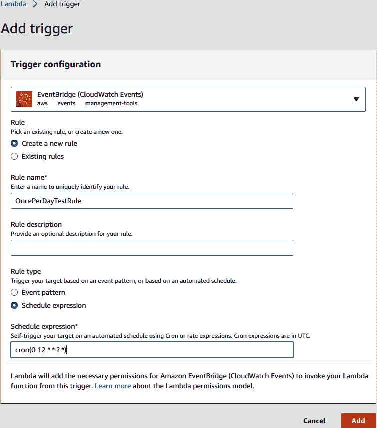

###### 图 4-13\. 将计划的 EventBridge 触发器添加到 Lambda 函数

现在我们的系统每天会发送一封电子邮件，其中包含队列中所有简历的链接，就像图 4-14 中一样。

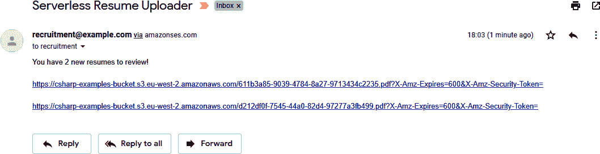

###### 图 4-14\. 从我们的定期 Lambda 函数发送的电子邮件

通过添加 SQS 队列，我们在运行时修改了系统的行为，并通过将所有链接汇总到每日电子邮件中来改善其提供的服务。然而，所有这些仍然是由对我们的 API 的 HTTP 请求启动的。接下来，我们将探讨一些其他类型的事件，这些事件可以触发逻辑和函数在我们的状态引擎中运行。

## 使用 AWS 触发器开发事件驱动系统

想象一下，你与一个有着一个出色的应用想法并希望你为其构建的人交谈。⁶ 你让他们描述功能，他们说了这样一些内容：

“当用户上传照片时，我希望通知他们的关注者；当他们发送电子邮件到我的支持邮箱时，我希望打开一个支持工单。”

这些“当 X 发生时，执行 Y”语句描述了一个*事件驱动系统*。所有系统在底层都是事件驱动的；问题是，对于许多后端应用程序来说，这些事件只是 HTTP 请求。与其说“当用户上传照片时，我希望通知他们的关注者”，我们通常实现的是“当我们的服务器接收到一个 HTTP 消息，指示用户上传了照片时，通知他们的关注者”。

这是可以理解的；在无服务器计算出现之前，你真正能实现这一点的唯一方法是监听 API 上的 HTTP 事件。但如果我们能够去掉这一额外步骤，并实现我们的架构响应*实时事件*而不是某些中介实现细节，比如 HTTP 请求，那不是更好吗？

这是事件驱动无服务器系统的核心理念。您执行函数并触发工作流，以解决问题时真正有意义的变化。不是编写一个应用程序来监听人类的操作，然后发送 HTTP 请求到 API 来触发效果，而是让 AWS 完成所有这些工作，并直接将事件附加到操作上。在前面的示例中，您可以监听 S3 中的`s3:ObjectCreated:Post`事件，并在事件发生时运行您的代码，完全绕过 API 步骤。

### C# 简历上传示例：事件驱动

让我们最后再次访问我们的无服务器简历上传器。如果您回顾图 4-12，您会看到 PDF 文件通过 API Gateway 从我们的网站发送到步函数任务。没有必要让 API Gateway 存在；这只是一个实现细节，允许我们的前端在上传文件时轻松进行 HTTP 调用。如果我们完全摆脱这个 API 并允许网站直接将文件上传到 S3 存储桶，那该有多好？这也将允许我们放弃我们的`UploadNewResume`Lambda 函数，并且在保留系统所有功能的同时删除我们不再需要的代码，这是软件开发中最令人愉悦的事情之一。

通过消除 API 步骤并让前端直接将文件上传到 S3，我们还为我们的系统开辟了新的可能性。例如，除了在我们的*网站*上传简历外，如果我们想接受发送到*application@ouremail.com*的简历呢？使用 SES，相对简单地连接一个电子邮件转发器，该转发器将提取附加的 PDF 文件并保存到 S3。然后，这将触发后端相同的工作流程，因为我们已将逻辑连接到了 S3 事件，而不是某个中介的 HTTP API 调用。语句“当我们在 S3 中看到一个新的 PDF 文件时，启动我们的工作流程”对我们正在解决的业务问题变得更加自然。实际上，PDF 文件如何进入其中已经不再重要，因为我们的系统以相同的方式做出反应。

关于直接将 PDF 文件上传到 S3 的问题，我们有几种选择。如果我们已经在前端使用[AWS Amplify](https://docs.amplify.aws)⁷，那么我们可以使用存储模块和`"protected"`上传方法，在我们的 S3 存储桶中基于已认证用户的 Cognito 身份限制访问路径：

```cs
amplify add storage
```

前端 JavaScript 用于将文件上传到 S3 的代码如下：

```cs
import Amplify, { Auth, Storage } from 'aws-amplify';

Amplify.configure({ Storage: { AWSS3: {
            bucket: '<bucket-name>'
        } } });

async function uploadFile(fileName, file) {
    await Storage.put(fileName, file, { level: 'protected',
            contentType: file.type });
}
```

即使没有 AWS Amplify 和前端上的经过身份验证的用户，我们仍然可以通过 [预签名 URL](https://oreil.ly/AXPDg) 直接上传到 S3 存储桶。这种情况下的过程是在 API 网关后面创建一个 Lambda 函数，当执行时将调用 `AmazonS3Client.GetPreSignedURL()` 并将其返回给前端以用于上传文件。在这种场景中仍然存在 API，但此 API 的 *功能* 更符合执行一项通用任务。毕竟，您可以使用预签名 URL 在前端上传其他类型的文件，并将多个 Step Function 工作流连接到每个文件上传中。

一旦您的前端直接将文件上传到 S3 而不是通过 Web API 发送它们，可以直接在 S3 存储桶配置的“属性”选项卡中的管理控制台中添加触发器，如 图 4-15 所示。

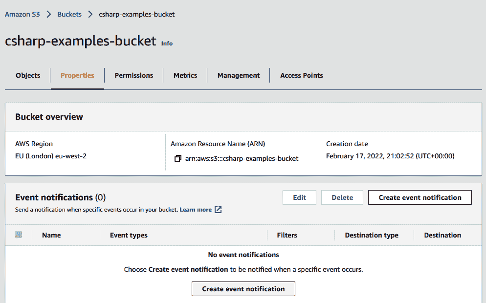

###### 图 4-15\. 向 S3 存储桶添加事件通知

将 Step Functions 状态引擎作为此事件的目标，并且我们的事件驱动、无服务器、C# 简历上传服务的最终形式完成了！最终的架构显示在 图 4-16 中。

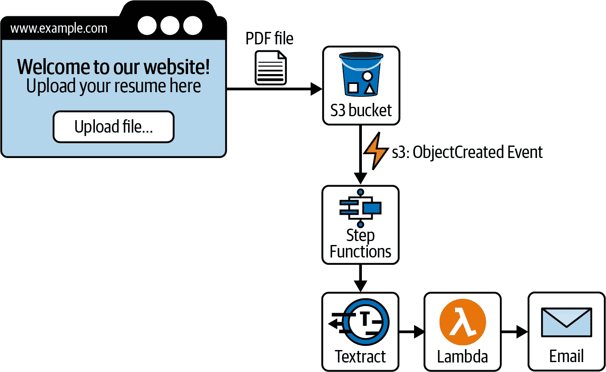

###### 图 4-16\. 我们简历上传示例的最终事件驱动架构

正如您所见，我们现在拥有一个简洁、描述性和 *事件驱动* 的系统，足以允许我们在不引入错误或其他问题的风险的情况下扩展或修改工作流的各个部分。最后需要考虑的是如何在一个地方管理所有这些运作中的部分并轻松配置它们。

# 无服务器应用程序模型（SAM）

到目前为止，我们一直通过登录 AWS 管理控制台并在 UI 中点击来进行所有配置更改。这对于实验是可以的，但并不是特别适合运行生产系统的方法。一次错误的点击可能导致应用程序的部分中断。这就是基础设施即代码（IaC）可以提供帮助的地方。

IaC 是通过可机器读取的定义文件配置您的无服务器基础设施的过程。CloudFormation 是 AWS 上使用的 IaC 工具，允许您将整个云配置保留在 YAML 或 JSON 文件中。几乎可以在 CloudFormation 模板中对 AWS 中的所有内容进行建模，从 DNS 设置到 S3 存储桶属性再到 IAM 角色和权限。当需要更改设置时，您只需在 CloudFormation 模板中更改值，并告知 AWS 应用这些更改到您的资源上。其最明显的优势是您可以将模板 JSON/YAML 文件检入版本控制，并像对待任何其他代码更改一样进行代码审查、审核和在沙盒/测试环境中测试。

但是，CloudFormation 的一个缺点是它可能会非常复杂和冗长。由于在 AWS 资源中有大量可供修改的设置，当尝试配置由多个 Lambda 函数、消息队列和 IAM 角色组成的无服务器系统时，CloudFormation 模板可能会变得难以管理。有各种工具可以在 CloudFormation 周围添加抽象层，并帮助配置无服务器系统。像 Serverless Framework 和 Serverless Application Model（SAM）这样的工具就是为解决这个问题而创建的。

你可以将 SAM 看作是在 CloudFormation 之上的一层，将无服务器应用程序的最相关设置置于前沿。你可以在[AWS SAM 文档](https://oreil.ly/4fEfH)找到 SAM 的完整规范，但为了给你一个概览，这里是我们 C#简历上传系统的 SAM YAML 文件的一部分：

```cs
AWSTemplateFormatVersion: '2010-09-09'
Transform: AWS::Serverless-2016-10-31
Description: Resume Uploader Serverless C# Application.
Resources:
  SaveUploadedResumeLambda:
    Type: AWS::Lambda::Function
    Properties:
      Handler: ServerlessResumeUploader::ServerlessResumeUploader.
      LambdaFunctions::SaveUploadedResume
      Role: arn:aws:iam::0000000000:role/ResumeUploaderLambdaRole
      Runtime: dotnetcore3.1
      MemorySize: 256
      Timeout: 30
  LookForGithubProfileLambda:
    Type: AWS::Lambda::Function
    Properties:
      Handler: ServerlessResumeUploader::ServerlessResumeUploader.
      LambdaFunctions::LookForGithubProfile
      Role: arn:aws:iam::0000000000:role/ResumeUploaderLambdaRole
      Runtime: dotnetcore3.1
      MemorySize: 256
      Timeout: 30
```

你可以看到我们如何定义了`SaveUploadedResumeLambda`和`LookForGithubProfileLambda` Lambda 函数，在我们的 C#代码中指出了入口点，并为它们配置了执行的内存、超时和权限设置。

像这样在 SAM 文件中配置了基础设施后，你可以轻松地为测试或分段环境部署新环境。你从代码审查中受益，并且你可以像处理应用程序代码一样为你的*资源*创建自动化部署流水线。

# 结论

无服务器计算允许你构建复杂但灵活和可扩展的解决方案，采用按需付费的定价模型，并可以缩减至零。就个人而言，每当我们需要快速构建以验证想法、解决业务问题或预算有限时，我们都会使用无服务器执行模型。因为你只为所使用的付费，基于 AWS Lambda 的无服务器架构可以是构建最小可行产品（MVP）或部署移动应用程序后端的极低成本方式。AWS 每个月提供了高达 100 万次的 Lambda 执行免费额度，这对于使创业初期脱离理念阶段或测试产品进行 Beta 测试可能足够了。本章介绍的其他服务也都有非常慷慨的免费套餐，允许你尝试各种想法和架构而不会损害财务。

虽然如此，使用无服务器架构并不会自动降低系统运行成本。您需要考虑设计应用程序，避免不必要地大量调用 AWS Lambda。仅仅因为两个函数可以分别作为两个独立的 Lambda，并不总是意味着从成本和性能角度来看它们**应该**这样。进行实验和测量。如果您的应用程序架构不是为了有效利用每次调用而设计的，那么在高负载时，函数即服务也可能显得很昂贵。因为您每次执行都要付费，所以在非常高的调用量下，您可能会发现成本远远超过简单在 EC2 或 Elastic Beanstalk 上运行`dotnet`进程的成本。无服务器的成本应始终与其他优势（如可扩展性）进行权衡。

灵活性是无服务器架构的另一个巨大优势，正如本章的示例所展示的那样。在我们的无服务器 C# 简历上传器的每个步骤中，我们通过进行非常小的更改——大多数情况下甚至无需重新部署其余的应用程序——彻底改变了其某一部分的架构。您系统中各部分之间的这种分离使得系统的扩展变得更加容易，并且解锁了开发团队内人才的多样化。无服务器架构中没有规定个别组件的版本、技术甚至编程语言。您是否曾想过尝试 F#？使用构建在 AWS Lambda 上的系统，没有任何阻碍您在 F# Lambda 中编写最新功能并将其植入到您的无服务器架构中。需要将一些 HTTP 调用路由到第三方 API 吗？如果需要，您可以直接通过 API Gateway 进行代理，而无需在代码中创建接口和“管道”。通过采用 IaC 工具（如 SAM 或第三方框架如 Serverless Framework 和 Terraform），您可以自动化对基础架构的更改，并在基础架构配置本身上运行代码审查、拉取请求和自动化测试管道。对于无服务器系统的拉取请求通常由两个更改组成：一个简单、易于审查的 AWS Lambda 和一个 SAM/Terraform/CloudFormation 模板条目，显示该 Lambda 如何与系统的其余部分集成。

# 批判性思维讨论问题

+   在构建 AWS 上的 FaaS 服务时，使用函数式编程风格的优势是什么？

+   朋友告诉您，AWS Lambda 的速度比另一个开源的 FaaS 框架稍慢，因此他们不打算使用它。通过不使用 AWS Lambda，他们可能会错过 AWS 上的更大优势是什么？

+   为什么 AWS Step Functions 中的执行事件历史是该服务中最关键的特性之一？

+   描述一个架构，其中 Amazon SQS 是全球规模平台中至关重要的组件之一。

+   SQS 和 SNS 之间的关键区别是什么？

# 练习

+   构建一个 AWS Lambda 函数，从 SQS 队列触发器中拉取消息。

+   构建一个 AWS Lambda 函数，接受来自 SNS 主题的消息。

+   构建一个 AWS Lambda 函数，通过 S3 触发器打印放置在存储桶中的文件名称。

+   构建一个 AWS Step Function，在第一个 AWS Lambda 中接受有效负载“hello”，并在第二个 AWS Lambda 函数中返回有效负载“goodbye”。

+   使用 AWS CloudShell 并使用 AWS CLI 调用 AWS Lambda 函数或 AWS Step Function。

¹ 预签名 URL 是指向 S3 资源的链接，可从任何地方匿名下载内容（即输入到浏览器窗口中）。此 URL 是使用发出此请求的 IAM 角色的身份验证权限预签名的。这有效地允许您与分享此预签名 URL 的任何人共享对受保护 S3 资源的访问权限。

² S3 存储桶名称在区域内所有 AWS 帐户中是唯一的。因此，您可能会发现您想要的存储桶名称不可用，因为它已被其他 AWS 帐户使用。您可以通过在存储桶名称前加上您的产品或组织名称来避免这种情况。

³ CloudWatch 是 AWS 提供的一项服务，为您的整个云基础设施提供日志记录和监控。AWS Lambda 连接到 CloudWatch 并发布日志消息，您可以从 CloudWatch 控制台查看这些消息，或将其集成到另一个 AWS 服务中。

⁴ 这种方法使用了在.NET 6 中引入的配置最小 API 样式和 ASP .NET 应用程序。Amazon.Lambda.AspNetCoreServer 也支持基于较早.NET Core 版本构建的.NET 应用程序；但是，配置略有不同，并涉及实现 Amazon.Lambda.AspNetCoreServer.APIGatewayProxyFunction。更多信息请参阅[Amazon.Lambda.AspNetCoreServer](https://oreil.ly/gmY9K)。

⁵ 在 C#中，可以通过手动编码设置或使用第三方库实现 AWS Lambda 函数的依赖注入。然而，您可能经常发现，这些函数非常简单，实际上不需要使用它进行装饰。

⁶ 成为软件开发人员的一个缺点是这种情况经常发生，不管您是否请求。

⁷ AWS Amplify 是一个用于移动和 Web 应用程序的前端框架，允许我们快速围绕无服务器 AWS 服务（如 S3 简单存储服务）构建用户界面。
