# 第五章\. .NET 的容器化

认识容器的一种方式是将其视为技术革命。想象一下内燃机，它在改变社会对交通方式使用的方式上取得了长足进步。但现在，随着电动汽车的普及，正在发生一场新的变革！与虚拟机相比，容器也是如此。您一会儿就会明白我们的意思。

随着技术的进步，用于交通的机器经历了多次变革。¹ 目前，引擎创新的下一波浪潮围绕电动汽车展开。电动汽车更快、扭矩更大、续航更长，并且允许新的加油方式，无需访问燃料库，因为它们可以通过太阳或电网充电。电动汽车创造了一种新的汽车加油方式，例如在家中、工作中或在旅途中停车时充电。电动汽车的发展紧密结合着自动驾驶或半自动驾驶汽车的建设。新技术促使了新的工作方式。

几十年来，计算机的发展经历了类似的进展，如图 5-1 所示。² 计算机已经演变成更小、更便携的计算单元，目前体现为容器。这些新的计算单元为新的工作方式铺平了道路。容器提供了将应用程序的代码、配置和依赖项打包成单一实体的标准方式。容器在主机操作系统中运行，但作为轻量级、资源隔离的进程运行，确保快速、可靠、可重复和一致的部署。

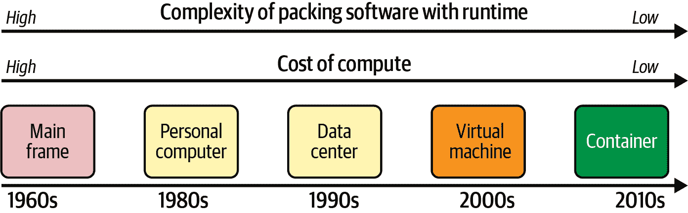

###### 图 5-1\. 计算技术的技术进步

在我们深入讨论如何在 AWS 上使用容器服务之前，我们首先需要更详细地讨论容器，从容器和 Docker 的概述开始，后者是一个用于设计、交付和执行应用程序的开放平台。首先，让我们更深入地了解容器。

# 容器简介

容器的关键创新在于能够将软件解决方案所需的运行时与代码一起打包。由于现代容器技术，用户可以运行`docker run`命令来执行解决方案，而不必担心安装任何软件。同样，开发人员可以查看`Dockerfile`，查看需要运行代码和运行时的详细信息，如图 5-2 所示。在此示例中，GitHub 作为中央的“真相源”，存储了部署应用程序所需的每个组件。`Dockerfile`定义了运行时。基础设施即代码（IaC）描述了云配置，如网络和负载均衡。构建系统配置文件指定了软件项目构建和部署的过程。

###### 注意

容器优势的一个很好的例子是使用 Docker 单行命令运行[Docker Hub SQL Server](https://oreil.ly/OuNbY)。以下示例展示了如何启动运行 SQL Express 版本的`mssql-server`实例：

```cs
docker run -e "ACCEPT_EULA=Y" \
    -e "SA_PASSWORD=ABC!1234!pass" \
    -e "MSSQL_PID=Express" \
    -p 1433:1433 -it \
    -d mcr.microsoft.com/mssql/server:2019-latest
```

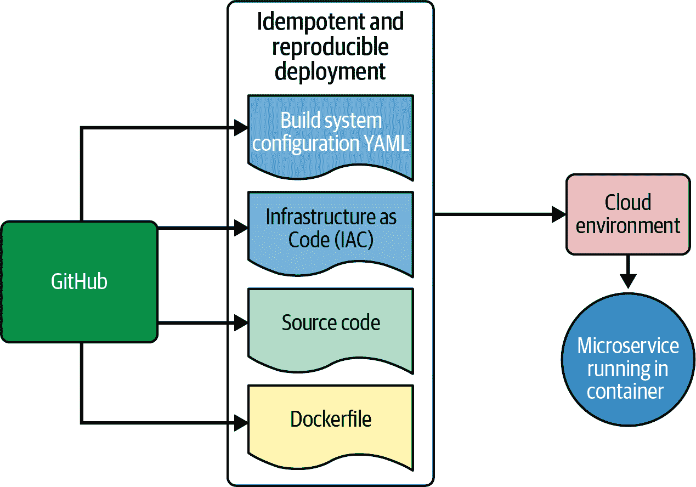

###### 图 5-2\. 可复现的基于容器的部署

虚拟机继承了物理数据中心的遗产。从某种意义上说，虚拟机是物理数据中心计算技术的复制。但是如果你看看容器，它是一种全新的思考和工作方式。基础设施定义、运行时定义、源代码和构建服务器配置可以全部在同一个项目中。由于这种新的工作方式，软件开发项目的生命周期有了新的透明度。

###### 注意

并非所有项目都将 IaC、构建配置、Dockerfile 和源代码保存在同一个存储库中。这些资产可以存在于多个仓库，也可以存在于单个仓库中。

如果你看看虚拟机，就不清楚它内部安装了什么软件和配置。虚拟机的另一个显著缺点是启动时间长，因为启动虚拟机可能需要几分钟时间。³如果你要部署微服务或使用负载均衡器和虚拟机的 Web 应用程序，你必须设计解决这些限制。通过基于容器的服务，您可以依靠使用 ECS 在几秒钟内部署成千上万个容器实例，⁴因此通过容器部署事物有相当大的优势。

让我们来看看另一种启动容器的方式——桌面与云的对比。Docker 环境是桌面上进行本地实验的理想环境。它允许你上传或下载容器，从而使你能够开始使用独立容器或使用 Kubernetes 工作流程，如图 5-3 所示。Dockerfile 使用存储在容器注册表中的基础只读镜像。本地开发工作流程涉及构建一个可写新容器，开发人员将在其中构建、测试、运行，并最终通过将其推送到容器注册表来部署容器。

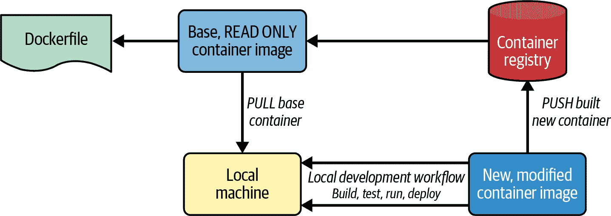

###### 图 5-3\. 容器工作流程

在转向云之前，这是一个很好的地方，可以在此处玩弄你的想法。同样，开发人员可以下载由 AWS 的领域专家构建的容器，并在本地环境中执行它们。⁵

一旦您决定要做什么并在本地进行了一些实验后，自然而然地，您可以进入 AWS 环境，并开始以云原生方式与这些容器进行交互。从 AWS Cloud9 开始是一个很好的实验容器的方法。您可以在云开发环境中构建容器，保存环境，然后将该容器部署到 ECR。您还可以通过启动虚拟机来实验容器，然后在该虚拟机上进行构建过程。

另一个选项是使用 Docker 工具和 Visual Studio 在本地进行开发。让我们接下来讨论 Docker。

## Docker 简介

Docker 是一个用于管理容器生命周期的开源平台。它允许开发人员将应用程序打包并开发为 Docker 容器镜像，由 Dockerfile 定义，并运行在外部或本地开发的容器化应用程序。Docker 的一个更受欢迎的方面是其容器注册表 Docker Hub，它允许与容器进行协作。

###### 注意

除了 [Docker 容器镜像格式](https://oreil.ly/IsKxP) 外，还有其他容器镜像格式，比如 [Open Container Initiative (OCI) 规范](https://oreil.ly/IetNb)。

Docker 容器解决了什么问题？操作系统、运行时和代码包装在构建的容器镜像中。这一行动解决了一个历史悠久的非常复杂的问题。有一个著名的段子说，“在我的机器上可以运行！”虽然这经常被当作一个玩笑来说明部署软件的复杂性，但没有容器将运行时与代码一起打包，很难验证本地开发解决方案在分发到生产环境时是否会表现相同。容器解决了这个确切的问题。如果代码在容器中运行良好，那么容器配置文件将像任何其他类型的代码一样检查源代码库。

###### 注意

现代应用程序最佳实践通常包括 IaC，它会同时配置环境和容器。在这篇关于亚马逊内部最佳实践的[博文](https://oreil.ly/dPm35)中，作者指出对于容器化应用程序，通过相同的 CI/CD 发布流水线部署代码更被认为是最佳实践。

容器已经存在了相当长的时间，但是以不同的形式存在。现代容器的一种形式是 Solaris Containers，于 2004 年发布。它允许您 telnet 到一个关机的机器，通过 Lights Out Management (LOM) 卡片响应命令，告诉它启动。然后它会从网络启动一个没有操作系统的机器，并通过 ssh 和 vim 文本编辑器创建新的容器，这些容器也从网络引导启动。

从那时起，容器继续改进并支持额外的工作流程，如持续交付和将代码与运行时打包在一起。Docker 是最流行的容器格式。在 图 5-4 中，注意生态系统在实践中的运作方式。Docker 的两个主要组成部分是 [Docker Desktop](https://oreil.ly/gfcmt) 和 [Docker Hub](https://oreil.ly/iNGPb)。对于 Docker Desktop，本地开发工作流程包括访问 Linux 容器运行时、开发工具、Docker 应用程序本身以及可选的 Kubernetes 安装。对于 Docker Hub，有私有和公共容器仓库、容器镜像的自动构建、团队和组织等协作功能，以及认证镜像。

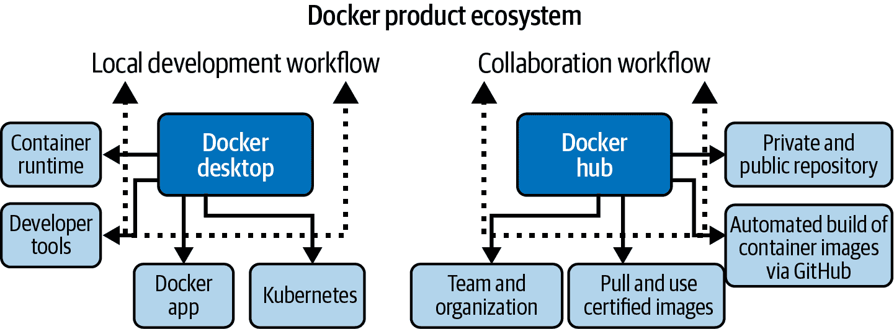

###### 图 5-4\. Docker 生态系统

###### 注意

现代容器的另一个创新是从*基础镜像*继承的概念。基础镜像允许您利用开发人员在各种领域（如 Python、.NET 或 Linux）的专业知识来构建您的容器。此外，它们节省了开发人员从头开始组装整个镜像的时间和精力。

接下来，让我们深入了解 Docker 生态系统。

## Docker 生态系统

Docker 的运作方式是通过提供一个确定的方法来运行你的代码。多个 AWS 服务与 [Docker](https://aws.amazon.com/docker) 容器镜像配合工作。这些服务包括 [Amazon ECS（Amazon 弹性容器服务）](https://aws.amazon.com/ecs)，以及 [Amazon ECR（弹性容器注册表）](https://aws.amazon.com/ecr)，一个安全的容器镜像仓库。值得注意的还有 [Amazon EKS（弹性 Kubernetes 服务）](https://aws.amazon.com/eks)，这是一个托管的容器服务，支持 Kubernetes 应用，以及 AWS App Runner，一个用于容器化应用程序的 PaaS，在本章节后面会详细讨论，最后还有 AWS Lambda。

桌面应用程序包含容器运行时，允许容器执行。它还编排本地开发工作流程，包括使用 [Kubernetes](https://github.com/kubernetes/kubernetes)，这是一个来自 Google 的用于管理容器化应用程序的开源系统。

接下来，让我们讨论 Docker Hub 如何与 Docker Desktop 和其他容器开发环境交互。就像 [`git`](https://git-scm.com) 源代码生态系统有本地开发工具如 [Vim](https://www.vim.org)，[eMacs](https://www.gnu.org/software/emacs)，[Visual Studio Code](https://code.visualstudio.com)，或者 [Xcode](https://developer.apple.com/xcode) 与之配合一样，Docker Desktop 与 Docker 容器一起工作，支持本地使用和开发。

当开发人员在本地环境之外使用`git`进行协作时，通常会使用类似[GitHub](https://github.com)或[GitLab](https://about.gitlab.com)等平台与其他方沟通并共享代码。[Docker Hub](https://hub.docker.com)的工作方式类似。Docker Hub 允许开发人员共享 Docker 容器，这些容器可以作为构建新解决方案和下载完整解决方案（如 SQL 服务器镜像）的基础映像。

这些由专家构建的基础映像已经获得高质量认证，例如来自 Microsoft 的[官方 ASP.NET Core Runtime](https://oreil.ly/nx7Qm)。这个过程允许开发人员利用特定软件组件的专家知识，并改进其容器的整体质量。这个概念类似于使用另一位开发者开发的库而不是自己编写它。

###### 注意

就像一个软件库，Dockerfile 允许您将实现绑定到现有版本，并在封装的环境中运行。

接下来，让我们深入探讨 Docker 容器与虚拟机的比较。

## 容器与虚拟机？

表 5-1 提供了容器和虚拟机之间差异的高级分解。

表 5-1\. 容器与虚拟机

| 类别 | 容器 | 虚拟机 |
| --- | --- | --- |
| 大小 | MB | GB |
| 速度 | 几毫秒启动 | 几分钟启动 |
| 可组合性 | 源代码作为文件 | 基于映像的构建过程 |

###### 注意

注意除了 Docker 容器外，还有其他容器，包括 Windows 和 Linux 的替代品。Docker 是最流行的格式，为了本章的目的，假设所有对容器的引用都将是 Docker 容器。

容器的核心优势在于它们更小、可组合且启动更快。虚拟机在需要复制物理数据中心范例的场景中表现出色。例如，将运行在物理数据中心中的 Web 应用程序移动到基于云的虚拟机中而不改变代码。让我们看一些真实世界的例子，容器如何帮助项目顺利运行：

开发人员分享本地项目

开发人员可以使用`.NET` Web 应用程序进行开发，使用`Blazor`（稍后在本章中讨论的一个示例）。Docker 容器镜像处理了底层操作系统的安装和配置。另一位团队成员可以检出代码并使用`docker run`来运行项目。这个过程消除了配置笔记本电脑以正确运行软件项目可能需要数天的问题。

数据科学家与另一所大学的研究人员分享 Jupyter 笔记本

一位与[Jupyter 风格笔记本](https://jupyter.org)一起工作的数据科学家希望与多个依赖于 C、Julia、Fortran、R 和 Python 代码的复杂数据科学项目分享。他们将运行时打包为 Docker 容器镜像，消除了在分享此类项目时几周来回的问题。

一位机器学习工程师在生产机器学习模型中进行负载测试

一位机器学习工程师构建了一个新的机器学习模型，并将其部署到生产环境中。此前，他们担心在承诺之前准确测试新模型的准确性。该模型推荐产品给付费客户以购买可能喜欢的额外产品。如果模型不准确，可能会给公司带来大量收入损失。在此示例中使用容器部署 ML 模型，可以将模型部署到一小部分客户。一开始可以从只有 10%开始，并且如果出现问题，可以快速回滚模型。如果模型表现良好，可以迅速替换现有模型。

最后，容器的其他场景包括构建微服务、进行持续集成、数据处理以及作为服务的容器（CaaS）。让我们在下一节中深入探讨其中一些主题。

# 使用 AWS 容器兼容服务进行开发

.NET 开发人员可以通过多种方式在 AWS 上部署容器，包括 AWS Lambda、Amazon ECS、Amazon EKS 和 AWS App Runner。深入了解最新容器服务的一个好的起点是[AWS 容器文档](https://aws.amazon.com/containers)。除其他内容外，它还涵盖了 AWS 提供的当前容器服务的高级概述和日常使用案例。

选择最佳的抽象取决于开发人员希望在共享责任模型的哪个级别[⁶]。接下来，让我们使用完全云原生的工作流程与 Cloud9 和 AWS 容器服务深入探讨这些容器场景。

## 使用 Cloud9 和 AWS 容器服务进行.NET 开发

空间站是一艘停留在地球低轨道的太空飞船，允许宇航员在太空中度过时间、在实验室进行研究或为前往新目的地的未来旅行做准备。同样，如果你是云开发人员，为云开发的最佳地方就是云！

Cloud9 是一种基于云的开发工具，与 AWS 深度集成，并在浏览器中运行。这项技术从传统的软件工程开发实践中彻底出发，因为它开启了许多新的工作方式。

以下是 Cloud9 在云开发中如此出色的几个原因：

靠近 AWS 资源

如果您在咖啡店里，复制文件到云中或从云中复制文件可能会很有挑战性，但是如果您使用 Web 浏览器 IDE，响应时间并不重要，因为 IDE 就在与 AWS 内的服务器通信的旁边。这个优势在构建容器时非常有用，因为您可以快速地推送容器映像到 Amazon ECR。

与生产环境几乎相同的开发环境

另一件方便的事情是能够在与运行环境相同的操作系统中开发代码。Cloud9 运行最新版本的 Amazon Linux，因此没有部署上的意外。

专门的云 IDE

Cloud9 具有专门的 IDE 功能，这些功能只存在于 AWS 云 IDE 中。例如，能够浏览 S3 存储桶，调用 AWS Lambda 函数，并与其他具有对 AWS 账户访问权限的开发者进行配对编程。

要开始，请在 AWS 控制台中搜索并创建一个新的 Cloud9 环境，选择该服务，并为实例的名称提供一个有用的描述，如图 5-5 所示。值得注意的是，在幕后，EC2 实例运行 Cloud9，您可以通过 AWS EC2 控制台访问它，以进行像增加存储大小或更改网络设置的修改。

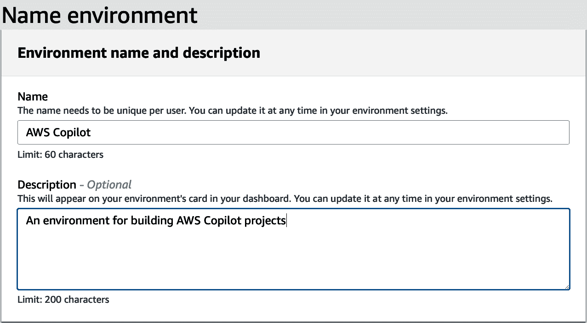

###### 图 5-5\. 启动 Cloud9

接下来，配置一台性能足够的机器，因为您将使用这个环境构建容器，如图 5-6 所示。

###### 注意

值得一提的是，因为 Cloud9[没有额外费用](https://oreil.ly/LVHeF)，成本驱动因素是 EC2。选择一个适当的实例大小以节省成本。

一旦 Cloud9 环境加载完成，接下来需要[安装.NET 6](https://oreil.ly/8JRNY)：

```cs
sudo rpm -Uvh \
https://packages.microsoft.com/config/centos/7/packages-microsoft-prod.rpm
sudo yum -y update
sudo yum install dotnet-sdk-6.0
```

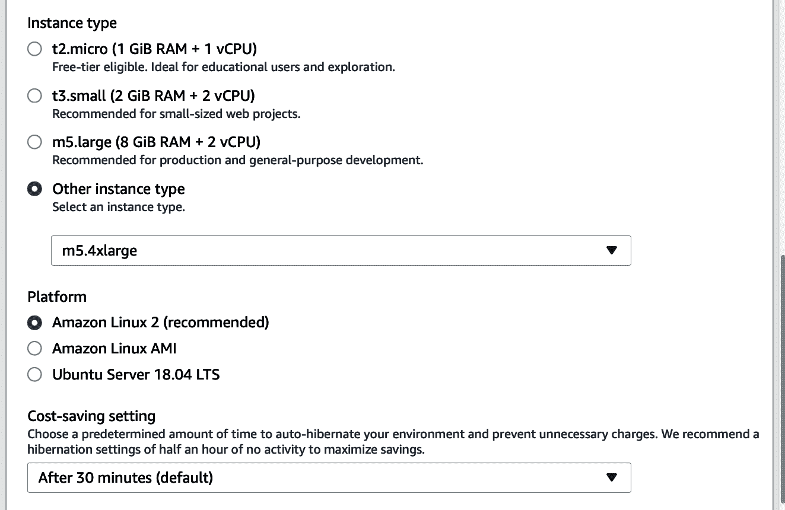

###### 图 5-6\. 选择 Cloud9 实例

接下来，通过创建一个简单的控制台应用程序来测试环境是很有必要的：

```cs
dotnet new console -o hello \
    && cd hello \
    && dotnet run

//Output of command below
The template "Console App" was created successfully.

Processing post-creation actions...
Running 'dotnet restore' on /home/ec2-user/environment/hello/hello.csproj...
  Determining projects to restore...
  Restored /home/ec2-user/environment/hello/hello.csproj (in 122 ms).
Restore succeeded.

Hello, World!
```

这个测试命令是使用`dotnet`命令行界面工作的，允许创建一个新的“控制台应用程序”，无需使用 Visual Studio。

# 在 Lambda 上容器化.NET 6

容器支持的另一个服务是 AWS Lambda。一个很好的参考点是[AWS Lambda Dockerfile](https://gallery.ecr.aws/lambda/dotnet)。此文档包含了如何构建目标为.NET 6 运行时的 AWS Lambda 的指令。另一个很好的资源是[官方.NET 6 在 AWS 上的支持](https://oreil.ly/BSuv3)。查看无服务器章节，获取更多关于构建 AWS Lambda 的见解。

要构建容器，首先需要调整 Cloud9 环境的大小。让我们接下来解决这个问题。

### 调整大小

AWS Cloud9 在被配置时有一个最小的磁盘空间，当与容器一起工作时，磁盘空间可能会迅速填满。调整环境大小并清理不需要的旧容器映像是很有必要的。您可以参考 AWS 提供的 Bash 脚本，轻松地调整[Cloud9 的大小](https://oreil.ly/kcDFE)。

您可以在[这里找到脚本的副本](https://oreil.ly/m4wgR)。要运行它，请执行以下命令，它将实例的大小调整为 50 GB：

```cs
chmod +x resize.sh
./resize.sh 50
```

在您的系统上运行后，您将看到以下输出。请注意，挂载点`/dev/nvme0n1p1`现在有`41G`可用空间：

```cs
ec2-user:~/environment/dot-net-6-aws (main) $ df -h
Filesystem      Size  Used Avail Use% Mounted on
devtmpfs         32G     0   32G   0% /dev
tmpfs            32G     0   32G   0% /dev/shm
tmpfs            32G  536K   32G   1% /run
tmpfs            32G     0   32G   0% /sys/fs/cgroup
/dev/nvme0n1p1   50G  9.6G   41G  20% /
tmpfs           6.3G     0  6.3G   0% /run/user/1000
tmpfs           6.3G     0  6.3G   0% /run/user/0
```

接下来，让我们构建一个容器化的.NET 6 API。

## 容器化的.NET 6 API

另一种开发.NET 6 的方法是构建一个使用像 AWS ECS 或 AWS App Runner 这样的容器服务部署的微服务。这两种方法都提供了一种高效的方式来部署 API，几乎不费吹灰之力。要开始，请首先在 Cloud9 中创建一个新的 Web API 项目：

```cs
dotnet new web -n WebServiceAWS
```

在 Cloud9 环境中运行此代码将生成以下输出：

```cs
ec2-user:~/environment/dot-net-6-aws (main) $ dotnet new web -n WebServiceAWS
The template "ASP.NET Core Empty" was created successfully.
Processing post-creation actions...
Running 'dotnet restore' on ...WebServiceAWS/
Determining projects to restore...
Restored /home/ec2-user/environment/dot-net-6-aws/WebServiceAWS/
Restore succeeded.
```

让我们通过添加稍微复杂的路由来改变从`dotnet`工具生成的默认代码，以进一步理解构建容器化 API 的过程。你可以在 ASP.NET Core[这里](https://oreil.ly/bkU8x)找到更多关于路由的信息。请注意，这段代码与其他高级语言如 Node、Ruby、Python 或 Swift 非常相似：

```cs
var builder = WebApplication.CreateBuilder(args);
var app = builder.Build();
app.MapGet("/", () => "Home Page");
app.MapGet("/hello/{name:alpha}", (string name) => $"Hello {name}!");
app.Run();
```

现在您可以通过进入目录并使用`dotnet run`来运行此代码：

```cs
cd WebServiceAWS && dotnet run
```

在 AWS Cloud9 中输出看起来像这样。请注意，看到 Cloud9 环境的完整内容根路径是多么有帮助，这样可以轻松地托管多个项目并在它们之间切换：

```cs
ec2-user:~/environment/dot-net-6-aws (main) $ cd WebServiceAWS && dotnet run
Building...
info: Microsoft.Hosting.Lifetime[14]
      Now listening on: https://localhost:7117
info: Microsoft.Hosting.Lifetime[14]
      Now listening on: http://localhost:5262
info: Microsoft.Hosting.Lifetime[0]
      Application started. Press Ctrl+C to shut down.
      Content root path: /home/ec2-user/environment/dot-net-6-aws/WebServiceAWS/
```

您可以在图 5-7 中看到输出；请注意，您可以在代码旁边并排切换终端。

通过`dotnet`命令行界面进行此测试。有两个独立的`curl`命令：第一个`curl`命令调用主页，第二个`curl`命令调用路由`/hello/aws`。

###### 注意

“HTTP”URL 在两个`curl`命令中都可以工作，但“HTTPS”将返回无效的证书问题。

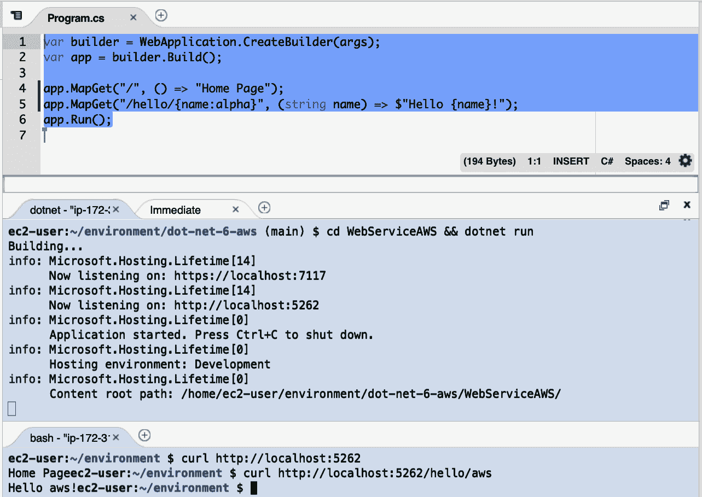

###### 图 5-7\. Cloud9 与 ASP.NET

项目在本地工作后，让我们继续将代码容器化。

## 为项目容器化

现在让我们将项目转换为使用注册到 Amazon ECR 的容器。一旦注册到服务支持容器的地方，我们的代码将部署到服务上。我们的示例是 AWS App Runner，但也可以是 Amazon ECS、Amazon EKS 或 Amazon Batch 等 AWS 上的许多容器服务。为此，请在项目文件夹中创建一个 Dockerfile：

```cs
FROM mcr.microsoft.com/dotnet/sdk:6.0 AS build 
WORKDIR /src
COPY ["WebServiceAWS.csproj", "./"]
RUN dotnet restore "WebServiceAWS.csproj"
COPY . .
WORKDIR "/src/."
RUN dotnet build "WebServiceAWS.csproj" -c Release -o /app/build
FROM build AS publish
RUN dotnet publish "WebServiceAWS.csproj" -c Release -o /app/publish
FROM mcr.microsoft.com/dotnet/aspnet:6.0 AS base
WORKDIR /app
EXPOSE 8080
ENV ASPNETCORE_URLS=http://+:8080
WORKDIR /app
COPY --from=publish /app/publish .
ENTRYPOINT ["dotnet", "WebServiceAWS.dll"] 
```


请注意，此容器拉取了.NET 6 运行时，配置了正确的端口并构建了项目。


最后，为`.dll`创建一个入口点。

现在使用以下命令构建此容器：

```cs
docker build . -t web-service-dotnet:latest
```

您可以使用`docker image ls`查看容器。输出应该类似于以下内容：

```cs
web-service-dotnet  latest  3c191e7643d5   38 seconds ago   208MB
```

要运行它，请执行以下操作：

```cs
docker run -p 8080:8080 web-service-dotnet:latest
```

输出应该类似于以下结果：

```cs
 listening on: {address}"}}
{"EventId":0,"LogLevel":"Information","Category"..}
{"EventId":0,"LogLevel":"Information","Category"...
...{contentRoot}"}}
```

现在通过 `curl` 调用它：`curl http://localhost:8080/hello/aws` 如 图 5-8 所示。请注意，AWS Cloud9 提供了一个简单但功能强大的云开发环境，具有专门为在 AWS 平台上开发而设计的特色功能。

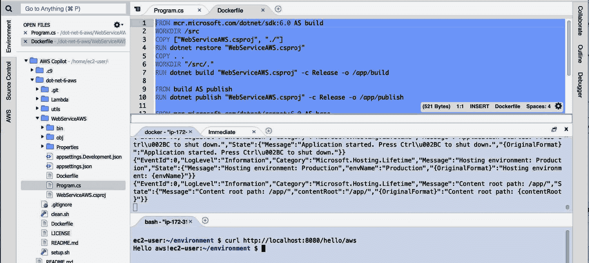

###### 图 5-8\. 容器化的 .NET 6 Web API

接下来，让我们讨论 ECR 及其如何在 AWS 上启用许多新的工作流程。

## Amazon Elastic Container Registry

在容器新世界的一个关键组成部分是一个针对您使用的云进行优化的容器注册表。它安全地允许快速部署深度集成的云服务。Amazon Elastic Container Registry（ECR）具有强大的容器策略所需的核心服务，如 图 5-9 所示。

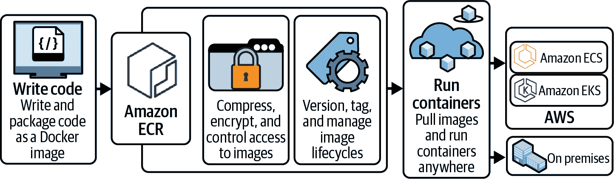

###### 图 5-9\. Amazon ECR

ECR 使得像在 Cloud9（或 CloudShell）中开发，然后通过 AWS CodeBuild 自动推送容器到 ECR（Elastic Container Registry）这样的工作流程成为可能。这个构建过程触发了一个连续交付管道到 AWS App Runner，如 图 5-10 所示。

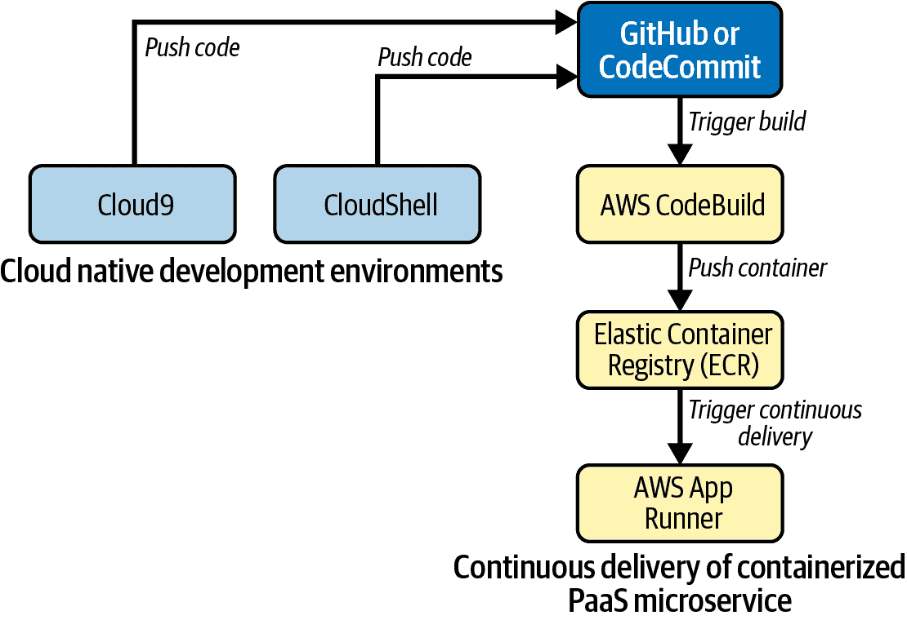

###### 图 5-10\. Amazon ECR 到 App Runner 架构

通过转到 AWS 控制台并搜索 ECR 创建一个新的 ECR 仓库。您可以如 图 5-11 所示创建一个新的仓库来使用此 ECR 服务。

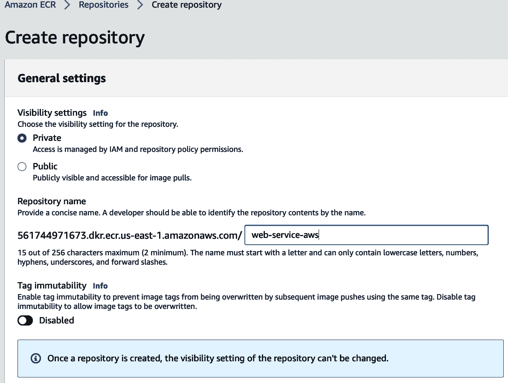

###### 图 5-11\. 创建 ECR 仓库

接下来，点击仓库（位于 web-service-aws 仓库页面右上角），查找推送此容器到 ECR 所需的命令，如 图 5-12 所示。

###### 注意

这些命令可以轻松集成到 AWS CodeBuild 管道中，以供稍后进行持续交付，方法是将它们添加到 *buildspec.yml* 文件，并创建一个新的 AWS CodeBuild 管道，该管道与 GitHub 或 AWS CodeCommit 等源仓库通信。

接下来，在您的本地 AWS Cloud9 环境中运行 ECR 推送命令。它们会与 图 5-12 类似。我们将此仓库命名为 web-service-aws，在推送到 ECR 的构建命令中反映出来。

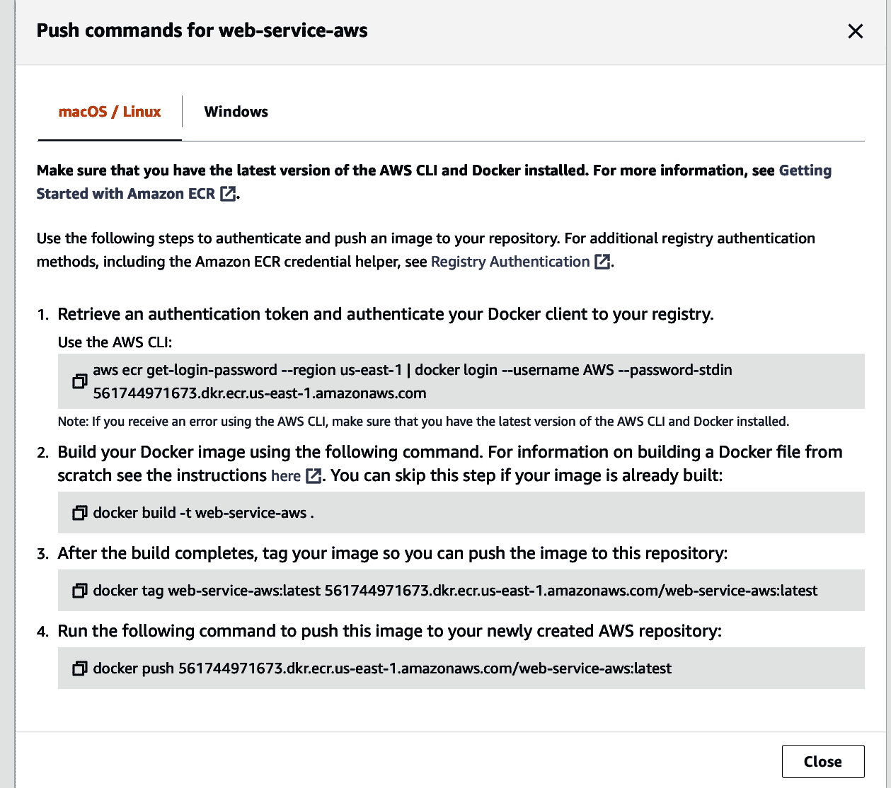

###### 图 5-12\. 推送到 ECR 仓库

现在，如 图 5-13 所示检查镜像。

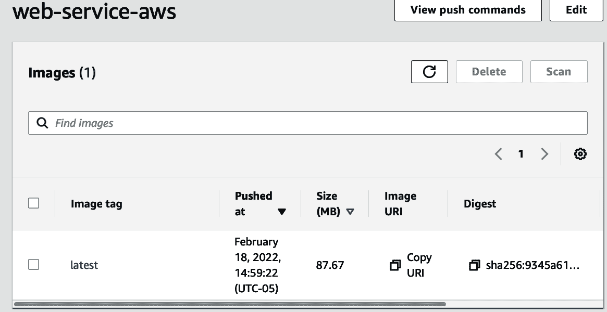

###### 图 5-13\. 检查创建的镜像

###### 注意

注意，AWS App Runner 服务名称无需链接到容器名称或 ECR 中的存储库。

有了 ECR 托管我们的容器，让我们讨论使用能够自动部署的服务。

## App Runner

AWS App Runner 是一种引人注目的 PaaS 服务，它解决了一个复杂的问题，创建了一个安全的微服务，并将其简单化，如图 5-14 所示。它通过允许开发人员直接从 ECR 部署容器，为开发人员提供了便利。此外，它将监听 ECR 存储库，当在那里部署了新映像时，会触发 AWS App Runner 的新版本部署。

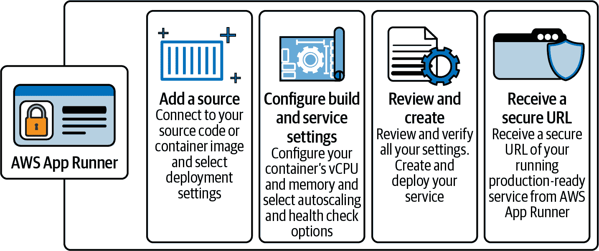

###### 图 5-14\. AWS App Runner

将一个容器化的.NET 6 Web API 从 Amazon ECR 部署为 AWS App Runner 微服务只需要很少的工作。首先，打开 AWS App Runner，并选择您之前构建的容器映像，如图 5-15 所示。

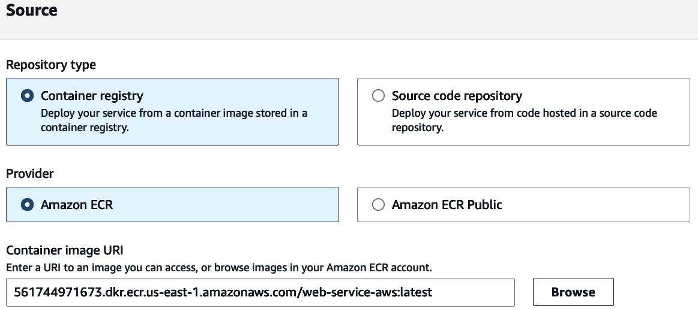

###### 图 5-15\. 选择 ECR 映像

接下来，选择部署过程，可以是手动或自动，如图 5-16 所示。通常，开发生产应用程序的开发人员会选择自动部署，因为它将使用 ECR 作为真实数据源设置持续交付。当初次尝试服务时，手动部署可能是最佳选择。

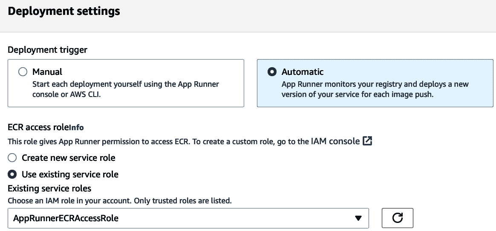

###### 图 5-16\. 选择 App Runner 部署过程

###### 注意

请注意，在部署过程中使用了现有的 App Runner，它赋予了 App Runner 从 ECR 拉取映像的能力。如果您尚未设置 IAM 角色，请选择该复选框以创建新的服务角色。您可以参考[官方 App Runner 文档](https://oreil.ly/EEHs2)详细了解您的设置选项。

现在选择容器公开的端口；这将与.NET 6 应用程序的 Dockerfile 配置的端口匹配。在我们的案例中，这是`8080`，如图 5-17 所示。

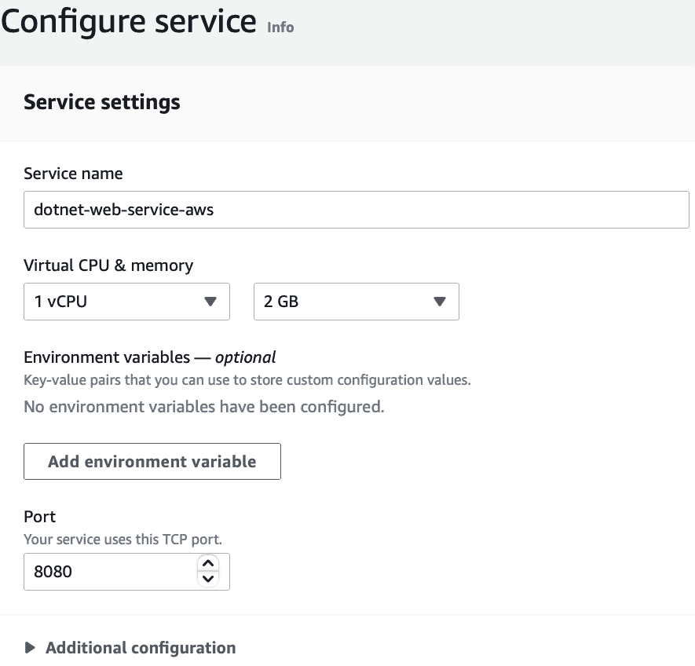

###### 图 5-17\. 选择 App Runner 端口

###### 注意

注意，此配置使用了默认设置。您可能希望配置许多选项，包括设置环境变量、健康检查配置和自动缩放配置。您可以参考[最新文档](https://oreil.ly/q6zg8)了解如何执行这些操作的详细信息。

最后，在创建服务后，请如图 5-18 所示观察服务。这一步显示了服务正在部署，我们可以通过观察事件日志逐步查看其激活过程。

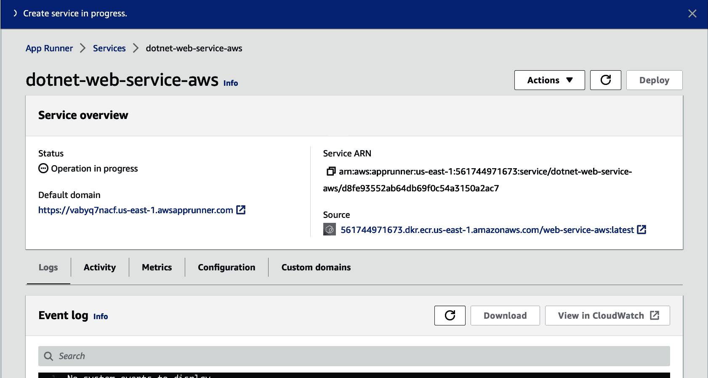

###### 图 5-18\. 观察 AWS App Runner 服务

###### 注意

服务首次部署后，您可以通过选择部署按钮手动“重新部署”应用程序。在 ECR 的情况下，这将手动部署存储库中的最新映像。同样，任何对 ECR 的新推送将由于自动部署配置的启用而触发该映像的重新部署。

服务运行后，切换到 AWS CloudShell 并在 CloudShell 或 Cloud9 终端中运行以下 `curl` 命令来调用 API，如 图 5-19 所示。您还可以从支持 `curl` 命令和 Web 浏览器的任何终端调用 API。

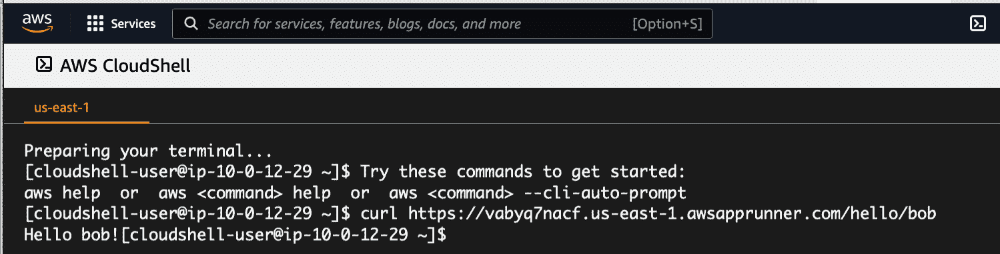

###### 图 5-19\. `curl` 运行服务

###### 注意

您还可以观看从零开始容器化 .NET 6 应用程序的演示，链接在 [YouTube](https://oreil.ly/qdD9B) 或 [O’Reilly](https://oreil.ly/K7GHw)。该项目的源代码位于 [此存储库](https://github.com/noahgift/dot-net-6-aws)。

# 使用 Amazon ECS 管理容器服务

处理容器时的一个重要考虑因素是它们运行的位置。例如，在您的桌面或像 Cloud9 这样的云开发环境中，启动容器并使用 Docker Desktop 等工具进行实验非常简单。然而，在现实世界中，部署变得更加复杂，这正是 AWS 托管容器服务在创建强大的部署目标中发挥重要作用的地方。

在 AWS 平台上提供的两种全面的端到端解决方案，用于管理规模化容器的选项是 Amazon 弹性 Kubernetes 服务（Amazon EKS）和 Amazon 弹性容器服务（Amazon ECS）。接下来让我们详细讨论自家研发的 Amazon 解决方案 ECS。

Amazon ECS 是一个完全托管的容器编排服务，是计算选项的中心枢纽，如 图 5-20 所示。从存储构建的容器镜像的 ECR 开始，ECS 服务允许使用容器镜像定义应用程序，并结合计算选项。最后，ECS 根据 AWS 最佳实践无缝扩展您的应用程序，例如弹性和可用性。

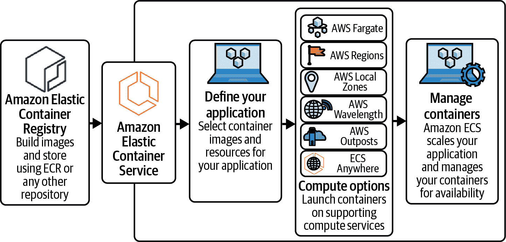

###### 图 5-20\. ECS

对于 .NET 开发人员，有两种常见的 ECS 部署方式。第一种是 [AWS Copilot](https://oreil.ly/LYFrv)，第二种是 [AWS .NET 部署工具](https://oreil.ly/uBdJZ)。较新的 .NET 部署工具的优势在于它还可以部署到 App Runner 和 Beanstalk。

此外，ECS 支持三个关键用例。让我们详细解释一下：

混合场景

使用 Amazon ECS Anywhere 构建容器，并在任何地方运行。

批处理场景

在 AWS 服务中协调批处理，包括 EC2、Fargate 和 Spot 实例。

扩展 Web 场景

使用 Amazon 最佳实践构建和部署可扩展的 Web 应用程序。

###### 注意

Amazon ECS 支持 Linux 以及 [Windows 容器](https://oreil.ly/BehOC)。请注意以下关于 Windows 容器的要点：首先，它们支持使用 EC2 和 Fargate 启动类型的任务。此外，并非所有适用于 Linux 容器的任务定义参数都适用于 Windows 容器。最后，Windows 容器实例所需的存储空间比 Linux 容器多。

开始使用 ECS 的最佳方式是通过 .NET 部署工具 [AWS .NET deployment tool for the .NET CLI](https://oreil.ly/IdeWu)。让我们列举此工具的关键功能：

无服务器部署

使用此工具通过 [AWS Fargate](https://aws.amazon.com/fargate) 部署到 AWS Elastic Beanstalk 或 Amazon ECS。

云原生 Linux 部署

此实现部署基于 .NET Core 2.1 及更高版本并面向 Linux 的云原生 .NET 应用程序。

部署实用 .NET 应用程序

许多 .NET 实用程序具有部署功能，包括 ASP.NET Core Web 应用程序、Blazor WebAssembly 应用程序、长时间运行的服务应用程序和定时任务。

###### 注意

AWS Fargate 是一种技术，您可以与 Amazon ECS 一起使用，无需管理服务器或 Amazon EC2 实例的集群即可运行容器。有了这项技术，您不再需要为运行容器而提供、配置或扩展虚拟机集群。

让我们使用 `dotnet aws deploy` 部署到 ECS Fargate。我们可以利用 AWS Cloud9 和 [Blazor](https://oreil.ly/5W2FA) 进行这项工作。首先，让我们更新工具，确保启用最新版本的部署工具。由于此工具正在积极开发中，经常使用以下命令进行更新是最佳实践：

```cs
dotnet tool update -g aws.deploy.tools
```

现在观察完整的软件开发生命周期，如 图 5-21 所示。

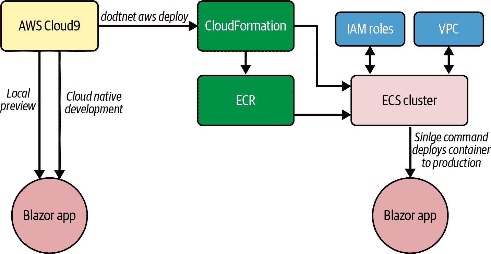

###### 图 5-21\. ECS 和 Cloud9 软件开发生命周期

要创建新的 Blazor 应用程序，请使用以下命令：

```cs
dotnet new blazorserver -o BlazorApp -f net6.0
```

接下来，进入 Blazor 目录：

```cs
cd BlazorApp
```

您可以通过以下 `dotnet` 命令在端口 8080 上运行应用程序：

```cs
dotnet run --urls=http://localhost:8080
```

选择在应用程序运行时如 图 5-22 所示的预览功能，以在 IDE 中作为网页查看它。

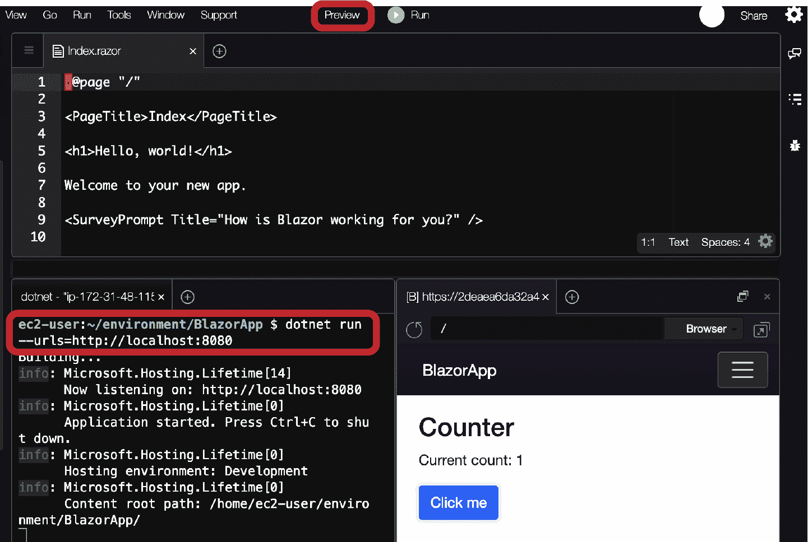

###### 图 5-22\. Cloud9 中的 Blazor

###### 注意

注意 AWS Cloud9 使用端口 8080、8081 或 8082 进行 [预览](https://oreil.ly/bZQi8)。

现在我们知道应用程序在本地运行正常，让我们在部署到 AWS 之前通过 Cloud9 IDE 编辑 Index.razor 页面为以下内容：

```cs
@page "/"
<PageTitle>Index</PageTitle>
<h1>Hello, AWS dotnet aws deploy!</h1>
Welcome to your new app.
```

另外，在项目目录中创建一个包含以下内容的 Dockerfile。此步骤允许自定义 ECS 运行时：

```cs
FROM mcr.microsoft.com/dotnet/sdk:6.0 AS build
WORKDIR /src
COPY ["BlazorApp.csproj", "./"]
RUN dotnet restore "BlazorApp.csproj"
COPY . .
RUN dotnet publish "BlazorApp.csproj" -c Release -o /app/publish
FROM mcr.microsoft.com/dotnet/aspnet:6.0 AS base
WORKDIR /app
EXPOSE 80
EXPOSE 443
WORKDIR /app
COPY --from=build /app/publish
ENTRYPOINT ["dotnet", "BlazorApp.dll"]
```

最后，在完成这些步骤之后，现在是时候在新的 Cloud9 终端中使用以下命令部署到 ECS Fargate：

```cs
dotnet aws deploy
```

在提示时，您会看到几个选项，应选择与 ASP.NET Core App to Amazon ECS using Fargate 相关的数字，如下面（截断）的代码输出所示。根据您环境的条件，数字可能会有所不同，因此请选取与 Fargate 相关的数字。

```cs
Recommended Deployment Option
1: ASP.NET Core App to Amazon ECS using Fargate...
```

对于接下来的提示，您应选择“Enter”以使用除 `Desired Task Count: 3` 外的默认选项，应将其更改为单个任务或 1\. 此过程将启动容器推送到 ECR 并随后部署到 ECS。

###### 注意

注意，当在云端开发环境中使用容器时，常见问题之一是容器空间不足。解决这个问题的一个简单粗暴的方法是定期使用命令`docker rmi -f $(docker images -aq)`删除所有本地容器镜像。

部署完成后，我们可以使用从`deploy`命令生成的 URL 测试应用程序，如图 5-23 所示。

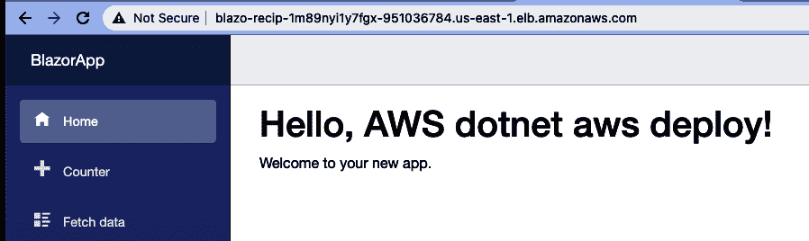

###### 图 5-23\. Blazor 部署到 ECS Fargate

###### 注意

您可以在[YouTube](https://youtu.be/Xs9vGM3U2Ek)或[O'Reilly 平台](https://oreil.ly/ScFrj)上观看完整的部署过程演示。示例的源代码可以在[GitHub](https://oreil.ly/v9O1N)上找到。

部署成功测试后，最好先列出部署信息，使用以下命令：`dotnet aws list-deployments`。接下来，您可以删除堆栈`dotnet aws delete-deployment *<stack-name>*`来清理您的堆栈。

###### 注意

在将 Blazor 部署到 Fargate 时需要注意的一点是，您需要进行以下一项更改以避免出现错误：

+   创建一个单一任务，而不是默认的三个任务。

+   在 EC2 目标组中打开[粘性](https://oreil.ly/vELfc)。

现在我们的 ECS 示例已经完成，让我们结束本章并讨论接下来的步骤。

# 结论

新技术为解决问题开辟了新的途径。云计算通过虚拟化提供了近乎无限的计算和存储能力，允许更复杂的技术在其上构建。其中之一就是容器技术，并且在 AWS 上有许多先进的服务集成。

新技术常常以非直观的方式打开新的工作方式。我们介绍了 AWS Cloud9 如何通过与 AWS 生态系统的深度集成，为使用容器提供了一种新而激动人心的工作方式。这种深度集成包括访问高性能的计算、存储和网络，超出了典型家庭或工作桌面提供的能力。您可能会发现 Cloud9 是传统 Visual Studio 工作流程的可靠补充，使您能够更高效地完成一些开发任务。

对于 .NET 开发者来说，掌握容器技术是最好的投资之一。本章介绍了容器的基础知识，并作为后续建立更复杂解决方案的基础。在下一章中，我们将进一步扩展这些主题，探讨在 AWS 上的 DevOps。涉及的 DevOps 主题包括 AWS Code Build、AWS Code Pipeline，以及如何与 GitHub Actions、TeamCity 和 Jenkins 等第三方服务器集成。在阅读该章之前，您可能需要通过批判性思维讨论和练习讨论。

# 批判性思维讨论问题

+   如何管理容器镜像的大小？

+   对于小型初创公司，哪种 AWS 容器服务是最好的选择？

+   对于大量使用容器进行批量计算的大型公司来说，最佳的 AWS 容器服务是什么？

+   使用 Amazon Linux 2 部署.NET 6 的优势是什么？

+   使用 Amazon Linux 2 部署.NET 6 的劣势是什么？

# 练习

+   将本章中构建的容器化项目通过 AWS CodeBuild 进行持续交付部署。⁷

+   构建一个目标为.NET 6 的 AWS Lambda 容器，并将其部署到 AWS。

+   使用 Cloud9 调用您部署的 AWS Lambda 函数。

+   构建另一个使用.NET 6 和 Amazon Linux 2 的容器，并将其推送到 ECR。

+   构建一个 Console App 命令行工具，目标为.NET 6，并使用 AWS SDK 调用 AWS Comprehend，并将其推送到公共 ECR 仓库。

¹ 在他的书 *How Innovation Works: And Why It Flourishes in Freedom*（HarperCollins）中，Matt Ridley 指出：“内燃机的故事展示了创新的典型特征：长期且深刻的前史，以失败为特征；短期则以经济性改进为特征，同时伴随专利和竞争。”

² Isaacson 指出，个人计算机创造的一个巨大推动力是对主机上更多时间的渴望。（Walter Isaacson. *The Innovators: How a Group of Hackers, Geniuses, and Geeks Created the Digital Revolution*. New York: Simon & Schuster, 2014.）

³ 根据[AWS 的说法](https://oreil.ly/zuKS9)，一个实例重新启动通常需要“几分钟完成”。

⁴ 您可以在这篇[AWS 博客文章](https://oreil.ly/tmh5o)中了解有关容器启动时间高级功能的更多信息。

⁵ 一个很好的例子是[AWS Lambda Runtime Interface Emulator](https://oreil.ly/17yhY)工作流程。根据 AWS 的说法，“Lambda Runtime Interface Emulator 是 Lambda 运行时和扩展 API 的代理，允许客户以容器映像打包的方式在本地测试他们的 Lambda 函数。”

⁶ AWS 根据服务提供多个级别的[共享责任](https://oreil.ly/MEQRN)。

⁷ 您可以参考[*buildspec.yml*文件](https://github.com/noahgift/dot-net-6-aws)获取想法。
