# 第六章 DevOps

行业专业人士共识认为，云计算使新的工作流程成为可能。例如，像无服务器计算这样的云原生解决方案以事件驱动的方式开辟了新的架构解决方案。同样，云计算的弹性能力支持虚拟化存储、网络和计算。DevOps 是一种将软件开发和运营最佳实践结合起来的理想方法，是利用这些新工作流程的理想方法之一。

本章的中心焦点是识别 DevOps 对充分利用云计算的重要性。它涵盖了在 AWS 上开始使用 DevOps 以及根植于日本文化中的支持 DevOps 的原则。

# 在 AWS 上开始使用 DevOps

在 AWS 上开始使用 DevOps 的理想方式是了解[AWS 如何看待 DevOps](https://oreil.ly/UAhEl)：“结合了文化哲学、实践和工具的组合，提高组织交付应用程序和服务的能力。”在实践中，这意味着 AWS 提供了支持 DevOps 高速工作流程的托管服务。

在 DevOps 的表面下，有一个明确的历史趋势，即支持 DevOps 崛起的最佳组织实践。让我们接下来讨论这些概念。

## DevOps 背后的原则是什么？

DevOps 的核心是日语词汇*改善*（Kaizen），意为“改进”或“改变为更好”。在《*丰田方式*》第二版（O’Reilly）中，杰弗里·K·利克提到，二战后，丰田开发了一个融合了这种改善哲学的精益生产系统。最终，这一哲学使丰田成为汽车制造质量的领导者之一。

丰田生产方式的核心原则之一是组装线工人将停止移动的生产线来修正异常。另一种描述这一过程的方式是计划-执行-检查-执行（PDCA）循环，如图 6-1 所示。首先需要确定问题；接下来尝试解决方案，分析结果，如果解决了问题则实施修正，或者重复整个 PDCA 过程。

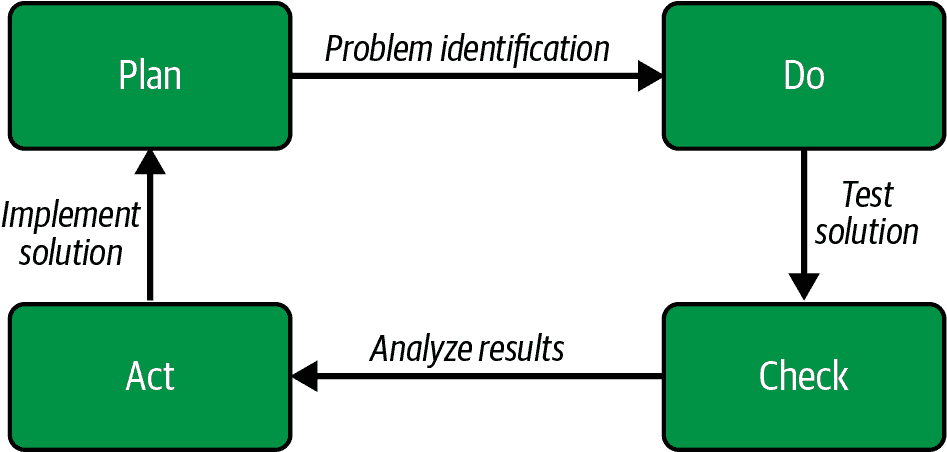

###### 图 6-1\. 计划-执行-检查-执行生命周期

本质上，PDCA 是作为制造业务实践实施的科学方法。

###### 注意

根据*大英百科全书*，[科学方法](https://oreil.ly/MP7G4)是“在科学中使用的数学和实验技术。更具体地说，它是用于构建和测试科学假设的技术。”

与 Kaizen 和科学方法相关的是在调试问题的根本原因时使用的“五个为什么”技术。这种技术的工作方式如下。首先，您确定一个问题。接下来，您问“为什么”，当您得到答案时，再次问为什么，直到最终通过第五次，您找到问题的根本原因并找到解决方案。 “五个为什么”的起源具有历史血统，可以追溯到丰田生产系统，并且它与持续改进系统的概念非常契合。在 图 6-2 中，AWS 的一个真实场景展示了五个调试阶段。

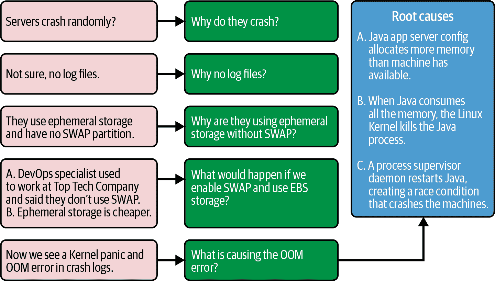

###### 图 6-2\. 使用“五个为什么”调试生产系统

###### 注意

儿童在使用“五个为什么”技术时非常擅长，这就是为什么他们会问诸如“为什么天空是蓝色？”这样简单而实际的问题，接着是下一个问题。采用与儿童问问题方式相同的方式来使用“五个为什么”技术，是一个非常有效的方法来进入正确的思维框架。

请注意，一系列问题最终导致了一个相当简单的修复，即不同的机器配置，即使用 EBS 存储，启用交换分区，并配置 Java 进程的内存约束以匹配服务器上的资源。

正如您所见，DevOps 不是一夜之间发明的。DevOps 源自几个世纪以来对批判性思维的改进，从几个世纪前的科学方法到最近的改善和日本汽车工业的 Kaizen。在 DevOps 的核心是古老的科学方法的概念，即提出“为什么”。日本汽车工业将这一理念精炼为提出“为什么”的方法论，结合制造业中的持续改进。DevOps 是这一持续改进制造方法论在软件工程领域的进一步完善，现在非常适合云原生开发。现在我们知道 DevOps 的起源，让我们讨论 AWS 平台上的最佳实践。

## AWS DevOps 最佳实践

开始使用 AWS 最佳实践的理想位置是 [“在 AWS 上介绍 DevOps”](https://oreil.ly/dfLzx) 的 AWS 白皮书。内部列出了六个最佳实践：

持续集成（CI）

DevOps 的核心是持续集成系统。开发人员定期将更改合并到中央源代码存储库，在那里自动化测试运行在代码上。您可以在 图 6-3 中看到 CI 周围的工作流程。在一个环境中的开发人员，也许是笔记本电脑或 Cloud9 工作区，推送更改到源代码仓库，触发构建，测试代码，并允许其合并。稍后，第二个开发人员将这些改进拉入他们的新本地环境的检出。请注意这里与 Kaizen 的概念的联系，或者说持续改进，因为每次构建服务器测试更改时，系统都可以提高源代码的质量。

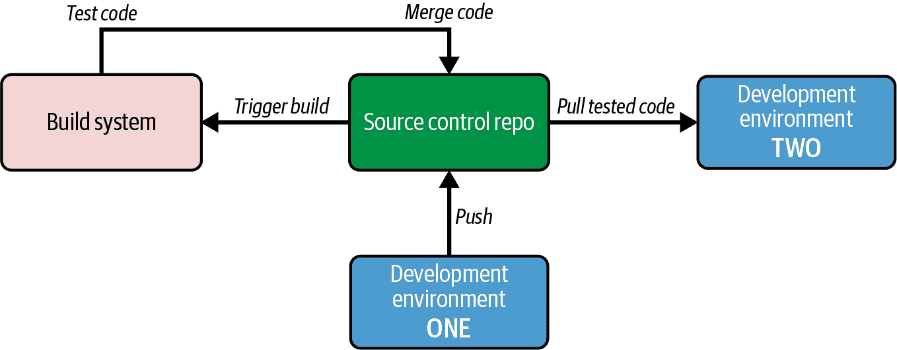

###### 图 6-3\. 持续集成工作流

持续交付 (CD)

持续交付通过自动测试推送到仓库的软件并为发布到任意数量的环境做准备来构建在持续集成概念之上。在 图 6-4 中，您将看到由 CI 建立的基础。现在，随着 IaC 的添加，它可以自动部署基础设施和现有软件，整个系统可以无缝地部署到新环境，因为整个过程是自动化的。在 CD 工作流中，容器是部署的一个补充方面，因为它们与代码和基础设施的部署并行工作。改进的自动部署再次发挥了改进的作用。每次对源代码仓库的提交都会为系统添加改进，由于更改很容易进行，这鼓励频繁的小幅度增强。

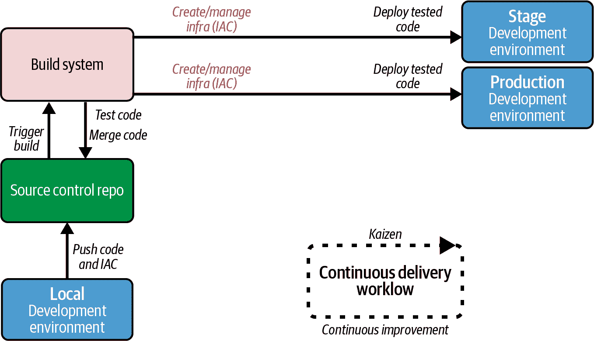

###### 图 6-4\. 持续交付工作流

基础设施即代码 (IaC)

IaC 是软件开发的最佳实践，描述了将基础设施的规划和管理作为代码提交到仓库中。观察 图 6-5，IaC 工作流可以执行许多有价值的操作，超出了最初创建基础设施的范围。IaC 的一些用例包括进行幂等更改和通过删除整个堆栈高效地清理实验。

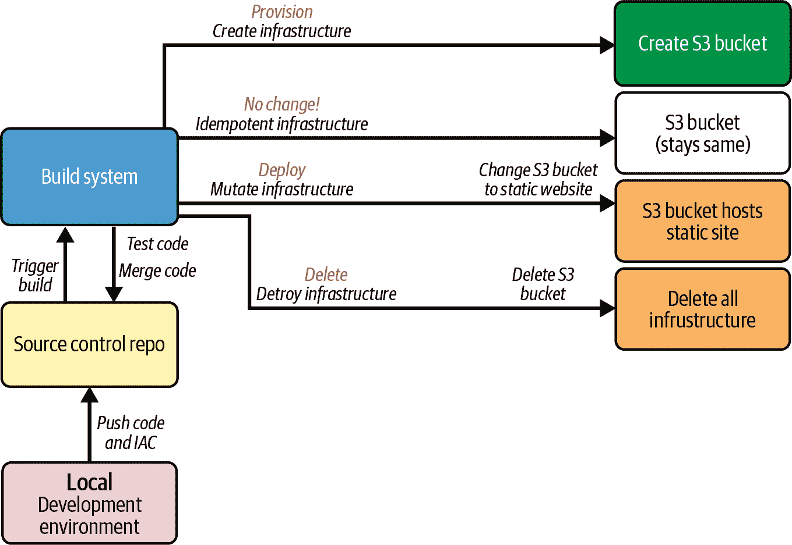

###### 图 6-5\. 基础设施即代码工作流

###### 注意

*Idempotent* 是 DevOps 中经常使用的词汇，因为能够重复执行相同的操作并始终保持相同状态非常重要。一个杰出的 idempotent 部署流程的例子是 IaC 创建具有只读权限的 S3 存储桶。无论这段代码运行多少次，结果都将是相同的：一个具有只读权限的 S3 存储桶。

idempotent actions 的概念在 DevOps 中非常重要，因为自动化的敏捷工作流依赖于无论运行多少次都具有相同效果的自动化操作。一个出色的数学基础的例子就是将一系列数字乘以零。结果始终为零，无论乘以零的是什么数字。

监控和日志

用于软件系统的数据科学是思考监控和日志的独特方式。使用基础设施和部署的应用程序的数据来确定需要采取的操作是非常重要的。在 图 6-6 中，服务器发送系统级和应用程序级日志、指标和来自监控代理的数据到 AWS CloudWatch，数据在那里被集中并分发到仪表板、警报、搜索和自动化见解。

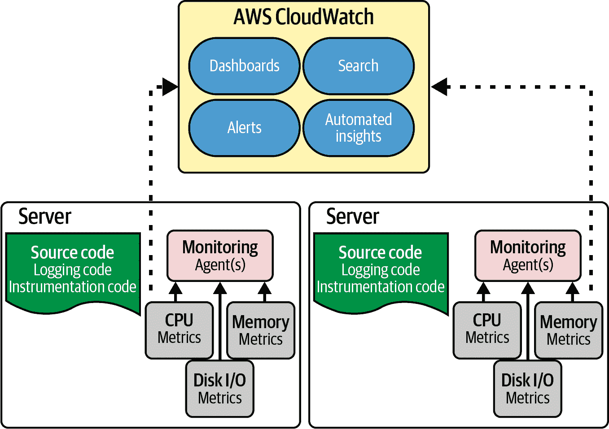

###### 图 6-6\. 监控和日志是软件系统的数据科学

通信与协作

DevOps 是一种行为，而不是一个要在清单上勾选的特定任务。因此，当团队通过沟通和协作来实施 DevOps 实践时，会产生最佳结果。在图 6-7 中，我们看到沟通嵌入到 DevOps 生命周期的每一个步骤中，从代码本身及其周围的对话，到从生产系统发出的警报进入聊天频道。还要注意可能的人类互动，例如拉取请求、推送到生产环境以及在生产中监控应用程序。

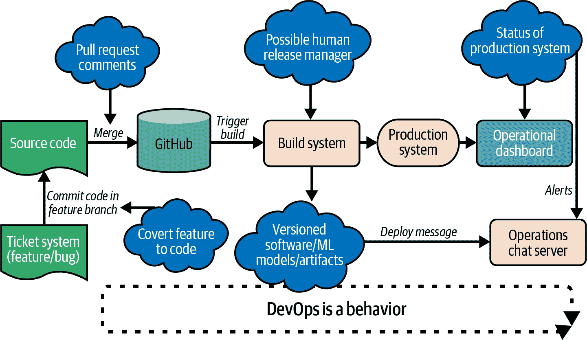

###### 图 6-7\. DevOps 的沟通和协作

安全性

安全需要在构建软件系统的每个级别进行集成。此外，持续集成和交付系统需要严格的访问控制治理，因为它们将软件交付到生产环境。在图 6-8 中，请注意在 AWS 云上充分架构的系统中的多层安全性。这个系统包括了防火墙规则分层到 VPC 中，以防止未经授权的网络访问，并且利用最小特权原则来控制策略，以保护系统安全。数据传输和静态数据的加密加固了环境，以防止数据泄露。最后，通过 AWS CloudTrail 审计所有安全事件，并为访问 AWS 控制台添加了双因素认证，进一步增强了保护措施。

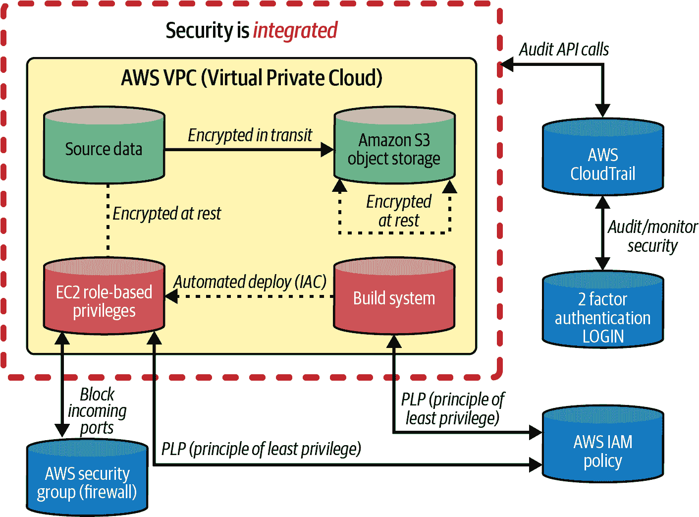

###### 图 6-8\. DevOps 安全集成

在 AWS 云上设计现代解决方案时，这些核心的 DevOps 原则至关重要。让我们更深入地探讨 AWS 平台上特定的 CI/CD（持续集成和持续交付）服务。

# 在 AWS 上使用 CI/CD 进行开发

AWS 管理的多个服务处理 CI/CD，但其中两个关键服务是[AWS CodeBuild](https://aws.amazon.com/codebuild)和[CodePipeline](https://aws.amazon.com/codepipeline)。让我们深入了解它们的工作方式。

## AWS 代码部署服务

AWS CodePipeline、AWS CodeBuild、AWS CodeCommit 和 AWS CodeDeploy 是 AWS 上深度集成的服务，并包括互补的工作流程。AWS CodePipeline 是一个完全自动化软件发布的持续集成和持续交付（CI/CD）托管服务。AWS CodeBuild 是一个完全托管的构建服务，处理构建过程的各个组成部分，包括测试、构建和发布软件包。AWS CodeDeploy 是一个托管服务，自动化代码部署到任何实例，包括 EC2 实例或本地服务器。最后，AWS CodeCommit 是一个完全托管的代码托管服务，类似于 GitHub 或 GitLab。

让我们看一下 AWS CodePipeline 在图 6-9 中的流程，并注意它是如何从左到右流动的：源码、构建、测试、暂存、然后是生产。这个工作流程完整地包括了运行在 AWS 上的项目的生命周期。

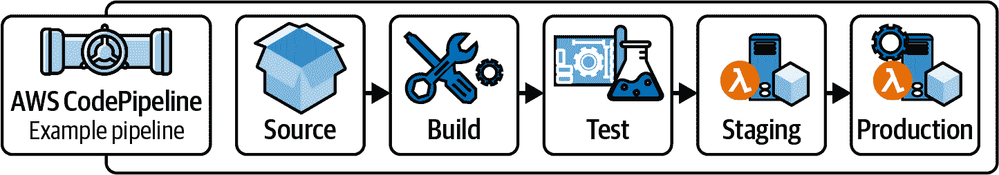

###### Figure 6-9\. CodePipeline 工作流程

接下来，如果你在 AWS 控制台中输入 **`CodePipeline`**，弹出的界面如 Figure 6-10 所示，将这些真实世界的步骤映射到 AWS 平台上软件部署过程中的不同阶段。

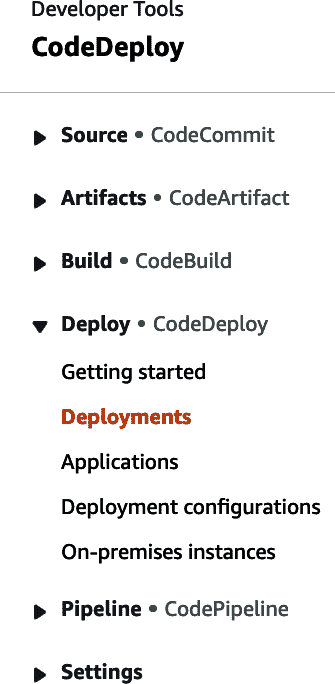

###### Figure 6-10\. CodePipeline 界面

既然我们已经简要介绍了使用 AWS CodeBuild 在 Chapter 5 中持续交付 .NET 6 应用程序，让我们看看如何使用 AWS CodeBuild 持续部署 [Hugo 网站](https://gohugo.io)。AWS 是通过 Amazon S3、Amazon Route 53 和 Amazon CloudFront 托管静态网站的常见部署目标，如 Figure 6-11 所示。AWS CodeBuild 非常适合这些站点的部署机制。你可以登录 AWS CodeBuild，设置一个新的构建项目，并告诉它使用 [*buildspec.yml*](https://oreil.ly/KNRop)。

###### 注意

Hugo 是一种独特的静态网站托管技术，用 [Go 编程语言](https://go.dev) 编写，每页构建速度 <1ms。你不需要使用 Go 来使用 Hugo；你可以用 [Markdown 语言](https://oreil.ly/uF0Tk) 写网站页面。Hugo 的构建速度和在 Markdown 中编写页面的便利性使其成为 S3 静态网站的优秀技术选择。

一旦 GitHub 接收到变更事件，CodeBuild 就会在容器中运行安装：

1.  它会获取在 *buildspec.yml* 中指定的 Hugo 版本。

1.  它会构建 Hugo 页面。由于 Go 语言的速度快，数千个 Hugo 页面可以在亚秒内渲染完毕。

1.  HTML 页面会同步到 Amazon S3。

因为这个同步过程在 AWS 内部运行，所以速度也非常快。

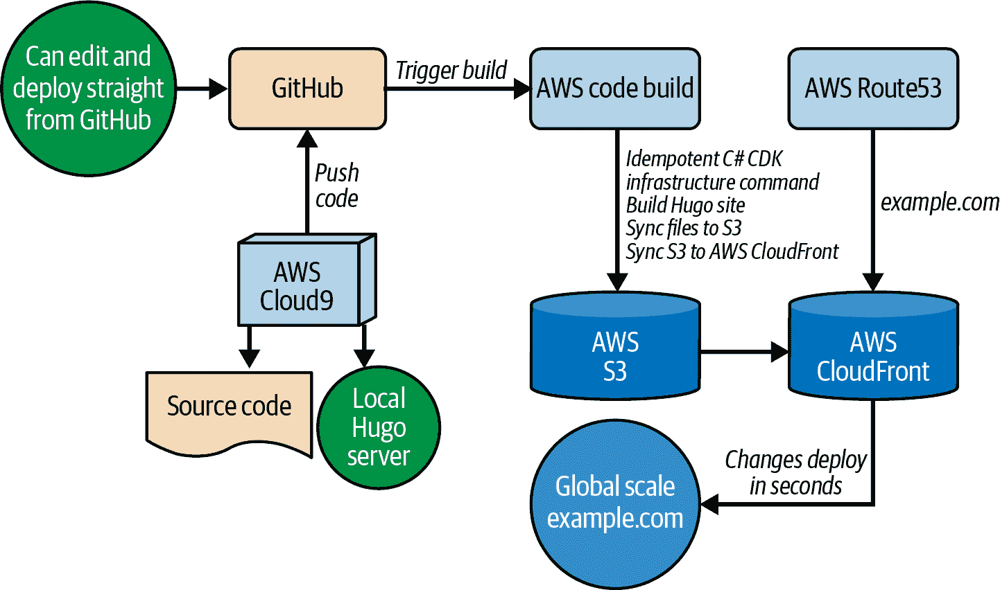

###### Figure 6-11\. Hugo 在 AWS 上的持续部署

下面是一个 AWS *buildspec.yml* 的更模板化版本，你可以用适合你项目的值替换模板化的值：

```cs
version: 0.1

environment_variables:
  plaintext:
    HUGO_VERSION: "0.42"

phases:
  install:
    commands:
      - cd /tmp
      - wget https://github.com/gohugoio/hugo/releases/\
      download/v${HUGO_VERSION}/hugo_${HUGO_VERSION}_Linux-64bit.tar.gz
      - tar -xzf hugo_${HUGO_VERSION}_Linux-64bit.tar.gz
      - mv hugo /usr/bin/hugo
      - cd -
      - rm -rf /tmp/*
  build:
    commands:
      - rm -rf public
      - hugo
  post_build:
    commands:
      - aws s3 sync public/ s3://<yourwebsite>.com/ --region us-west-2 --delete
      - aws s3 cp s3://<yourwebsite>.com/\
      s3://<yourwebsite>.com/ --metadata-directive REPLACE \
        --cache-control 'max-age=604800' --recursive
      - aws cloudfront create-invalidation --distribution-id=<YOURID> --paths '/*'
      - echo Build completed on `date`
```

###### 注意

你可以在 YouTube 上观看完整的 Hugo 持续交付过程的视频 [here](https://oreil.ly/UjqS0)，也可以在 Pragmatic AI Labs 的 Hugo 网站上查看相关笔记 [website](https://oreil.ly/saRAN)。

现在我们对纯 AWS 构建解决方案有了更多了解，让我们讨论一下如何在 AWS 上使用第三方构建服务器来处理 .NET。

## 集成第三方构建服务器

不仅可以使用 AWS 构建服务器构建和部署 .NET 到 AWS，而且还支持包括 [Jenkins](https://www.jenkins.io)、[Azure DevOps](https://oreil.ly/wwt7c) 和 [GitHub Actions](https://docs.github.com/en/actions) 在内的第三方构建服务器，让我们主要关注 GitHub Actions，因为它是最广泛使用的托管构建服务。

###### 注意

你可以观看在 [YouTube](https://youtu.be/6OkcNWGA6FY) 上设置 C# xUnit 项目与 GitHub Actions 的视频教程。

在使用 GitHub Actions 构建解决方案时，一个理想的代码解决方案是使用 [GitHub CodeSpaces](https://oreil.ly/YH0i2)，如在 Figure 6-12 中所示。仓库的代码位于[这里](https://oreil.ly/BlklG)，通过选择绿色的 Code 按钮，我们可以启动一个具有干净的 Visual Studio 界面的 16 核工作区。

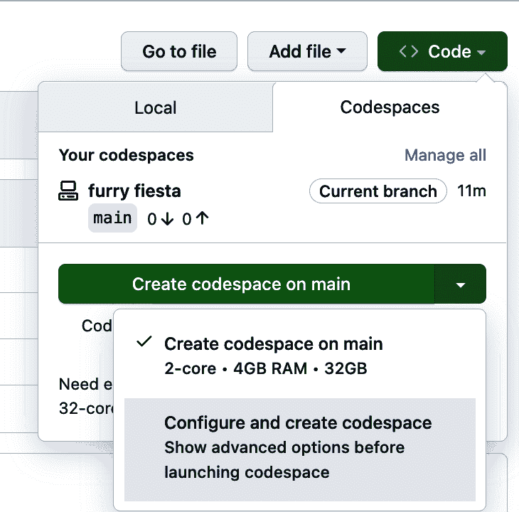

###### Figure 6-12\. GitHub CodeSpaces

###### 注意

GitHub CodeSpaces 是一项付费服务，允许在基于 web 的开发环境中进行开发。如果你的组织无法访问此服务，一个替代选择是 AWS Cloud9，它具有许多相似的功能，但优势在于深度集成 AWS。

注意，我们在路径 *.github/workflows* 中创建了一个名为 *dotnet.yml* 的文件，其中包含了构建和测试项目的整个工作流程，如 Figure 6-13 所示。

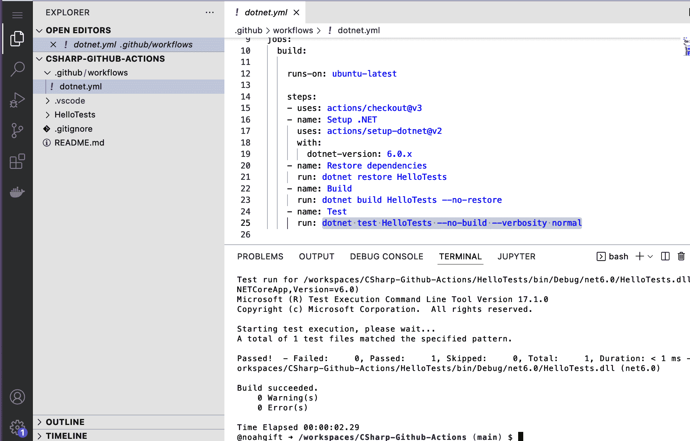

###### Figure 6-13\. GitHub CodeSpaces 工作流程

*dotnet.yml* 显示的关键步骤是恢复依赖项、构建项目，然后测试项目：

```cs
name: .NET
on:
  push:
    branches: [ "main" ]
jobs:
  build:
    runs-on: ubuntu-latest
    steps:
    - uses: actions/checkout@v3
    - name: Setup .NET
      uses: actions/setup-dotnet@v2
      with:
        dotnet-version: 5.0.x
    - name: Restore dependencies 
      run: dotnet restore
    - name: Build 
      run: dotnet build --no-restore
    - name: Test 
      run: dotnet test --no-build --verbosity normal
```


恢复依赖项。


构建项目。


测试项目。

要为项目创建结构，首先创建一个目录并 `cd` 进入其中：

```cs
mkdir HelloTests && cd HelloTests
```

接下来，使用 `dotnet new xunit` 创建项目。最后，将以下代码块粘贴到你的源代码文件中。让我们分析一下代码的功能：

```cs
using Xunit;

namespace MyFirstUnitTests
{
    public class UnitTest1
    {
 [Fact] 
        public void PassingTest()
        {
            Assert.Equal(4, Add(2, 2));
        }
        int Add(int x, int y) 
        {
            return x + y;
        }
    }
}
```


`[Fact]` 块是测试 `add` 函数的单元测试


存在一个名为 `Add` 的“内联”方法，我们在其上运行测试。

要运行此项目，执行以下操作：

1.  安装依赖项：`dotnet restore`。

1.  构建项目：`dotnet build --no-restore`。

1.  测试项目：`dotnet test --no-build --verbosity normal`。

你可以在 Figure 6-14 中看到最终的输出，显示了 GitHub Actions 的成功运行。整个工作流程之所以如此有用，是因为它如何轻松地为项目添加步骤，比如部署到 AWS。AWS 的一篇有帮助的博文展示了如何从 GitHub Actions 部署代码到 AWS 的详细示例。

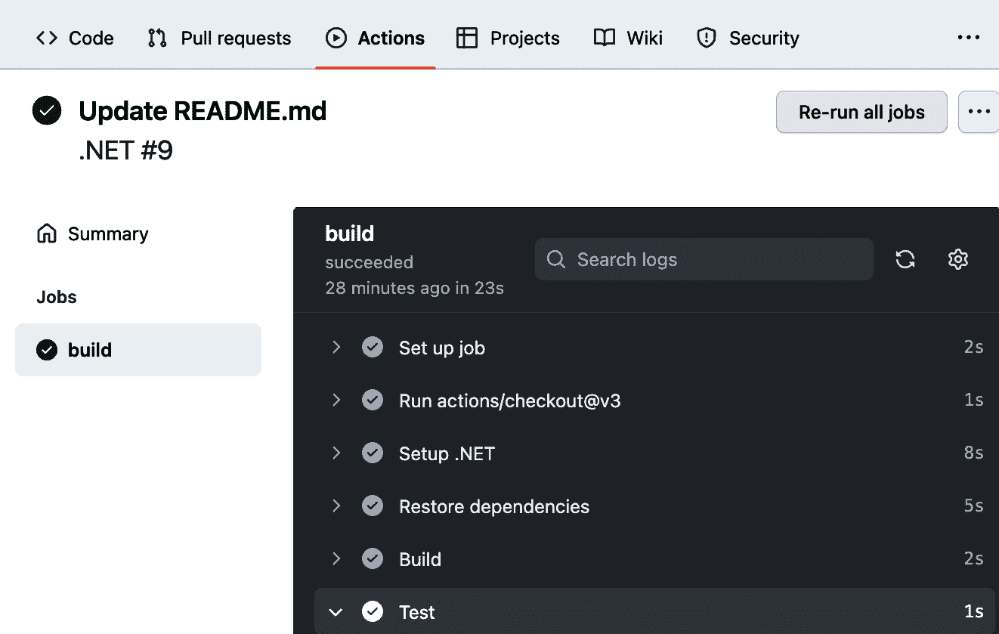

###### Figure 6-14\. GitHub Actions 构建过程

###### 注意

还值得注意的是，许多 AWS 服务或工具都内置了自动流水线：

AWS App Runner

[AWS App Runner](https://oreil.ly/mIA74) 具有从 GitHub 自动部署的功能。当你将 App Runner 连接到你的代码仓库或容器镜像注册表时，App Runner 可以在更新源代码或容器镜像时自动构建和部署你的应用程序。

AWS Copilot

[AWS Copilot](https://oreil.ly/YQVjZ)可以为您配置多个部署环境，如测试和生产环境。此外，Copilot 还可以设置 CI/CD 管道以自动部署。

# 合作伙伴产品集成

值得注意的是，有许多优秀的第三方合作伙伴产品选择，包括 Jenkins、TeamCity、Azure DevOps 和 Terraform。强调 AWS CodeDeploy 与合作伙伴产品集成的最佳地方是[AWS 文档的“与合作伙伴产品和服务集成”部分](https://oreil.ly/cof1J)。以下是突出显示的资源：

Jenkins

Jenkins 是一个开源的构建系统的瑞士军刀，并且 AWS 提供出色的支持。Jenkins 的一个关键优势是能够在 AWS 上挂载网络文件系统，并将其与您的构建和部署流程集成。您可以阅读有关如何使用[AWS App2Container 设置 CI/CD 流水线](https://oreil.ly/es2pf)，以及如何使用[AWS CodeBuild 与 Jenkins 集成](https://oreil.ly/MEAe7)。

TeamCity

TeamCity 是许多经验丰富和新手.NET 开发人员喜爱的经典构建系统。使用 TeamCity 的团队可以使用[AWS CodeDeploy Runner 插件](https://oreil.ly/RisFO)直接部署到 AWS。

Azure DevOps

AWS App2Container 已与[Microsoft Azure DevOps 集成](https://oreil.ly/sKTWK)。[AWS Toolkit for Azure DevOps](https://aws.amazon.com/vsts)允许您在不离开现有的构建/发布管道的情况下部署.NET 代码到 AWS。

Terraform

HashiCorp 已经与[AWS CodeDeploy](https://oreil.ly/NhcdI)集成，使开发人员不仅可以使用[Terraform CDK in C#](https://www.terraform.io/cdktf)，还可以使用像[Consul](https://oreil.ly/MoiAW)这样的产品。

现在您已经了解了如何与包括 GitHub Actions 在内的第三方合作伙伴集成进行测试，让我们来讨论 IaC。

# 在 AWS 上进行 IaC 开发

IaC 是定义基础架构并进行维护的代码。在 AWS 平台上，容器和 IaC 是互补的技术。请注意，在图 6-15 中，GitHub 包含项目的关键元素，包括构建系统文件、IaC 文件、源代码和 Dockerfile。

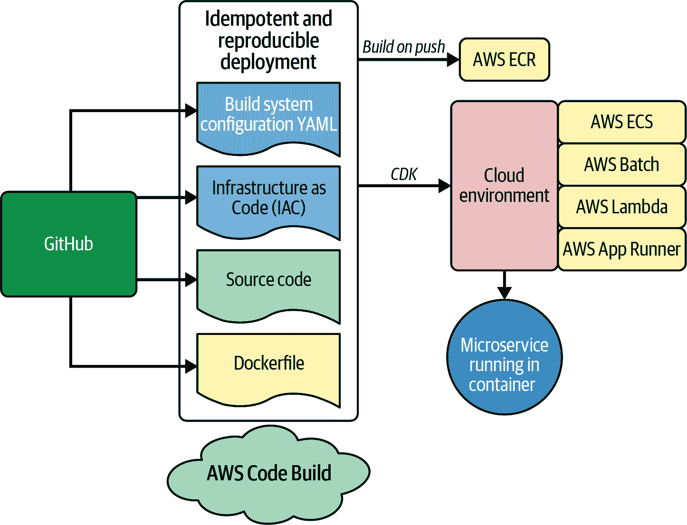

###### 图 6-15\. AWS 风格的容器化 DevOps

在许多场景中，您可以在单个存储库中定义容器化微服务的所有元素，从而便于在本地或新环境中进行调试和构建。IaC 使部分工作流程变得可能。让我们来谈谈 AWS 的 IaC 解决方案 Cloud Development Kit (CDK)如何帮助实现这一点。

# 在 C#中使用 AWS CDK 开发

[AWS CDK](https://aws.amazon.com/cdk) 是由 AWS 支持的开源项目。它提供了许多好处，包括更快的开发和[丰富的示例](https://oreil.ly/xrLwb)。在 AWS CDK 中，部署的基本单位称为*堆栈*。例如，要创建代表“开发”和“生产”环境的两个堆栈，可以使用以下 C#代码：

```cs
var app = new App();

new MyFirstStack(app, "dev");
new MySecondStack(app, "prod");

app.Synth();
```

要合成一个堆栈，您可以运行 `cdk synth dev`。在幕后，这将[创建 CloudFormation 模板](https://oreil.ly/UtxOT)。

###### 注意

值得注意的是，[构造](https://oreil.ly/l2j1s) 是 AWS CDK 应用程序的基本构建块，包含构建资源（比如 S3 存储桶）所需的一切。[构造中心](https://constructs.dev)包含 600 多个.NET CDK 构造，并且是构建高效解决方案的推荐资源，符合 AWS 最佳实践。

您可以查看在 Figure 6-16 中定义的概念。CDK 的核心思想是编写代码，然后将其转换为基础设施，因为基础设施是一种虚拟资源。请注意，C#语言编译成[CloudFormation](https://oreil.ly/pBAiY)，然后为资源提供支持。

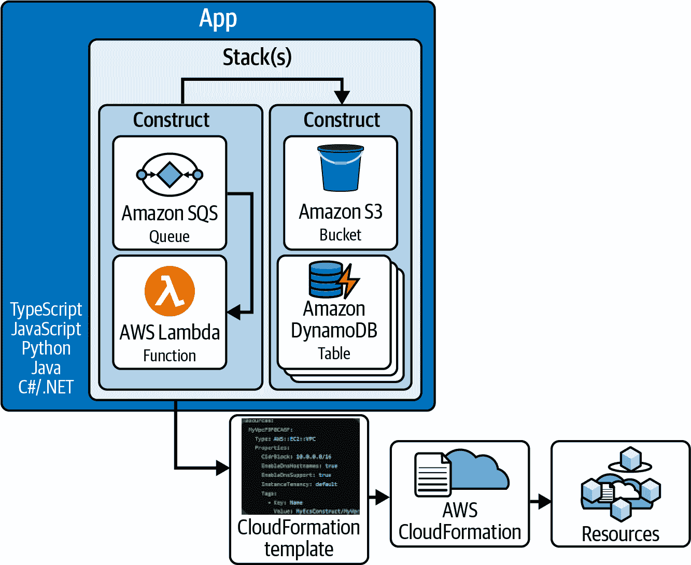

###### 图 6-16\. CDK 架构

###### 注意

[AWS CloudFormation](https://oreil.ly/lfNIR) 是一种基础设施即代码（IaC）的形式，允许您通过将基础设施视为 JSON 或 YAML 中编写的代码来管理 AWS 资源。一些开发者更喜欢 CDK 而不是常规的 CloudFormation，因为它需要更少的代码来构建相同的解决方案。此外，您可以使用您喜爱的语言，比如 C#，来创建解决方案。这篇[博客文章](https://oreil.ly/CMBVE)是使用 CloudFormation 和.NET 的完美示例。

在实际操作中，开发者可以使用 CDK 的两种方法之一。第一种方法是使用 C#编写 CDK，其中包括许多精彩的示例在[.NET Workshop 页面](https://oreil.ly/acwT1)上。第二种方法是使用高级抽象，它为您生成 CDK 代码，比如 `dotnet aws deploy`。

AWS 部署工具中的一个例子是部署[Blazor WebAssembly 应用程序](https://oreil.ly/O9AfD)。关键思想是您必须运行 `dotnet aws deploy`。

例如，在您的开发环境中，您可以执行以下操作：

1.  安装或更新 `dotnet` AWS 部署工具：`dotnet tool install -g aws.deploy.tools`。

1.  创建一个新的 Blazor WebAssembly 应用程序：`dotnet new blazorserver -o BlazorApp --no-https && BlazorApp`。

1.  最后，通过运行命令 `dotnet aws deploy` 进行部署。

您可以参考[Github](https://oreil.ly/RUgOb)上的最新文档，了解使用此部署过程的最新选项。

###### 注意

除了 CDK 之外，还有其他 IaC 解决方案。其中较为流行的之一是[Terraform](https://www.terraform.io/cdktf)，它具有支持 C#的 CDKTF 或云开发工具包。另一个解决方案提供者是 Pulumi，你可以在这里找到一个关于如何发布[C# Lambda 的很好的例子](https://oreil.ly/3y4NQ)。

最后要指出的是，一些 AWS 工具可以自动创建和部署 CDK 项目。例如，[AWS .NET CLI 的部署工具](https://oreil.ly/ZmsmQ)和 AWS Toolkit for Visual Studio 的[Publish to AWS 功能](https://oreil.ly/jXtPb)。此外，通过[CDK 部署项目](https://oreil.ly/WHjKB)，您可以添加额外的 AWS 资源，如 Amazon SQS 队列、Amazon DynamoDB 表等。

现在我们对基础设施即代码有了一个概述，让我们总结一下我们在本章中涵盖的所有内容。

# 结论

本章涵盖了 DevOps 的历史起源，包括日本汽车工业持续改进的历史。现代 DevOps 的核心是对云的拥抱。云计算使自动化、测试和部署速度进一步耦合。一个这种集成的例子是 IaC，这是 DevOps 工作流的完美工具。DevOps 还通过在软件工程的生命周期关键点上进行人类交互，从代码审查通过拉取请求到与发布经理在生产软件发布上的工作，实现了最佳化。

我们还涵盖了 AWS 如何看待 DevOps 以及在 AWS 上的 DevOps 最佳实践。然后我们使用了构建系统，如 AWS CodeBuild 和第三方系统，如 GitHub Actions。AWS 对每个组件有紧密集成，并可以替换任何第三方工具，如果您的组织选择或与其集成。

最后，我们以 IaC 结束了这一章，这是 DevOps 基础设施自动化的重要工具。我们展示了如何使用 AWS .NET 部署工具对静态网站进行一行命令部署到 AWS S3。这个工具将 CDK 集成并将其作为自动化生命周期的一部分，功能非常强大。

本章的重要收获是 AWS 认真对待 DevOps，并提供一整套托管服务和最佳实践，使您能够构建可维护和敏捷的解决方案。接下来在第七章，我们将讨论.NET 的日志记录、监控和仪表化，这进一步建立在我们对 DevOps 的基础知识之上。在转向该章之前，尝试一些批判性思维的问题和例子，以进一步巩固您对 DevOps 的理解。

# 批判性思维讨论问题

+   你对 DevOps 的定义是什么，以及如何利用它来增强组织的成果？

+   使用[.NET AWS CDK 框架](https://oreil.ly/6xBjV)定义 AWS 上的云应用资源的优势是什么？

+   哪种 [AWS 部署策略](https://oreil.ly/MRqXj) 最符合您组织的最佳工作方式？

+   为任何 AWS 部署使用 [AWS CloudTrail](https://oreil.ly/aa2ID) 的重要性是什么？

+   使用 AWS CodeCommit 相比第三方源代码托管服务的优势是什么？

# 练习

+   使用 AWS CodeBuild 部署一个静态 S3 站点，使用 [AWS CDK in C#](https://oreil.ly/TK8X2)。

+   使用 GitHub Actions 为 .NET 6 项目设置持续集成工作流程，以便在提交后自动测试代码。

+   使用 AWS CodeBuild 为 .NET 6 项目设置持续集成工作流程。

+   在 [csharp](https://oreil.ly/JIHP3) 存储库中找到一个 CDK 应用程序示例，并将其部署到您的 AWS 环境。

+   持续部署您自己的 Hugo 网站，并使用自己开发的 CMS 在 AWS 上发布关于 .NET 的博客。
