# 第七章：用于.NET 的日志记录、监控和仪器设备

回到 2007 年，当人们正在安装他们的任天堂 Wii 并梦想拥有苹果革命性的新触摸屏手机时，詹姆斯作为一名毕业软件工程师开始了他的第一份工作。然而，当时他并不是在今天工作的基于 Web 的 SaaS 应用程序中工作，而是开始了一段为生产线、油井、游轮和军事编写工业控制软件的工程师职业生涯。在当时詹姆斯有机会参与的所有奇怪和令人兴奋的项目中，最有趣的是为过山车设计控制系统软件。让我们告诉你那是如何工作的。

这是一个主题公园游乐设施，有多辆装有四个人的汽车沿着典型的过山车轨道行驶。每辆汽车从车站发出，沿着链条驱动的斜坡爬升到轨道顶部，然后在重力作用下滚下来，形成激烈而令人兴奋，最重要的是*安全*的乘车体验。

操控过山车的代码非常简单：软件读取由乘车操作员按下的“GO”按钮的输入。然后，这会命令刹车释放，将车辆从车站发送到斜坡的起始区块。在那里，软件不再需要进一步的控制输入，车辆会被链条升降机制抓住，带到斜坡顶部，然后在轨道上发车。隐藏在轨道下的刹车则会重新装备，准备在车辆返回时轻轻停车。

当然，多辆汽车同时在过山车轨道上飞驰，很容易看出可能出现的问题。如果其中一辆卡住了呢？如果一辆车没有足够的动力爬到顶端，或者轨道上的故障导致它减速或停止了呢？多辆车在轨道上行驶可能会带来实际的危险，甚至可能危及人类生命。如果一辆车停下来，我们就必须停止所有的乘车，直到工程师被派出去修理问题。因此，我们在整个轨道上都安装了传感器和紧急制动装置。我们编写了代码来检测车辆进入轨道周围的“区块”，就像铁路信号系统防止碰撞那样运作。我们在一排中放置了多个传感器，以在轨道周围的多个点测量车辆的速度。¹ 每个速度传感器、运动检测器、紧急制动装置、*备用*紧急制动装置，所有这些都必须在软件中编码。所有这些代码的量远远超过了我们实际操作乘车所需的代码量。过山车控制系统上运行的代码中，95% 是监控、记录、报警和触发紧急制动。

您的分布式基于云的系统就像过山车一样。执行主要功能可能需要的代码量很少，但是可能出错的事情种类繁多，您可能需要为了维护对用户的高级别服务而将更多复杂性加入系统中。

在本章中，我们将讨论在 AWS 中可以构建、配置或简单启用的内容，这些内容将提高我们监控基于云的应用程序的能力。我们将访问的大多数服务并非特定于 .NET；然而，AWS 为我们即将涵盖的许多工具提供了 .NET SDK。这有助于您深入挖掘 C# 源代码，以识别错误或性能瓶颈的原因。我们将从介绍在管理控制台上最重要的页面开始，当涉及到日志记录和监控时：CloudWatch。

# AWS CloudWatch

[AWS CloudWatch](https://aws.amazon.com/cloudwatch) 是 AWS 提供的一个允许您监控、分析和响应由您的 AWS 资源生成的事件的服务（或者说一系列服务）。如果您在 AWS 上部署了一些代码并运行它们，您可能会使用 CloudWatch 进行监控。图 7-1 展示了 AWS CloudWatch 的四个核心支柱：收集、监控、响应和分析。这些支柱共同工作，使您能够迭代地提高系统的可用性和可伸缩性。

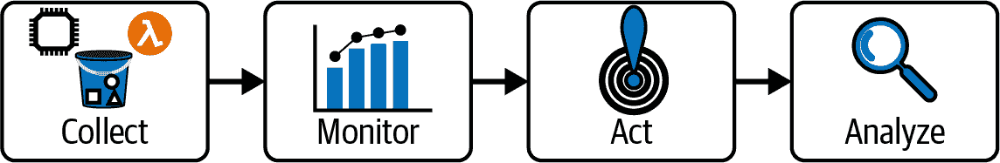

###### 图 7-1. AWS CloudWatch 的四个支柱

您可以*收集* AWS 服务发出的日志事件，通过仪表板和指标*监控*它们，通过警报*响应*异常情况，并定期*分析*您的应用程序，以进行架构改进。这四个支柱在 图 7-1 中以一行显示；然而，更准确地说它是一个反馈循环。对日志和指标的分析将允许您改进收集日志的内容，并精调何时触发警报，从而引导您对资源进行更改。这样做的好处是确保系统在最有效的资源余量下运行。您将能够分配足够的资源以保持性能在期望范围内，但不会过度增加成本。

## 收集 CloudWatch 日志

CloudWatch 从您部署到 AWS 的服务中收集和存储日志消息。许多 AWS 服务会原生地发布包含有关该服务执行信息的 CloudWatch 日志消息。您也可以手动设置日志收集，或者如本章所示，可以使用 AWS .NET SDK 程序化地发布日志消息。

一些原生发布日志到 CloudWatch 的 AWS 服务包括：

API 网关

可配置为发送错误、请求和响应参数、载荷和执行跟踪。

弹性 Beanstalk

您的 Elastic Beanstalk 应用程序的应用程序和系统日志文件可以在 CloudWatch 中读取。

AWS CodeBuild

发送所有云构建的完整详细构建日志。

Amazon Cognito

认证和用户管理指标可以发送到 CloudWatch。

Route 53

亚马逊的域名系统（Domain Name System，DNS）服务可配置记录 DNS 查询等内容。

AWS Lambda

Lambda 函数会自动设置发送指标和执行日志到 CloudWatch。

简单通知服务（Simple Notification Service，SNS）

从 SNS 发送的手机短信（SMS）会自动记录。

这些只是一些示例；AWS 的绝大多数服务都会发布日志消息，要么完全自动，要么稍作配置。要查看可以发布日志到 CloudWatch 的 AWS 服务的完整列表，请访问 AWS 文档页面 [“AWS services that publish logs to CloudWatch”](https://oreil.ly/dlbYK)。接下来，我们将详细探讨其中一些服务的日志记录。

### 来自 AWS Lambda 函数的日志

在 “使用 AWS Lambda 和 C# 开发” 的示例中，我们使用 .NET CLI 创建了一个新的 AWS Lambda 函数：

```cs
dotnet lambda deploy-function SingleCSharpLambda
```

如果你遵循这个步骤，你可能已经注意到，除了创建函数外，CLI 还创建了一个 IAM 执行角色，Lambda 函数将在该角色下执行。如果你在 IAM 管理控制台导航到这个执行角色，你会看到默认权限策略之一是 AWSLambdaBasicExecutionRole.² 这个角色由 AWS 管理，旨在为任何新的 Lambda 函数授予权限，以创建日志组、创建流并将日志消息发布到 CloudWatch。Figure 7-2 展示了此策略中包含的策略 JSON。

任何发布日志消息到 AWS CloudWatch 的服务必须在授予这些权限的 IAM 角色下运行。通过它们的名称，这些权限向我们介绍了 CloudWatch 日志记录中的三个重要概念。

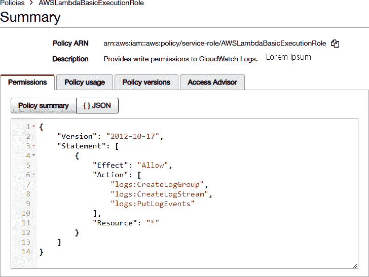

###### 图 7-2\. 每个新 Lambda 函数添加的 CloudWatch 权限

### 组、流和事件

CloudWatch 将日志消息（或“事件”）存储在流中，然后按发送它们的服务或实例对每组流进行分组。例如，如果我们记录来自 Lambda 函数执行的消息，则每次 Lambda 调用的事件流将写入同一个 *日志流*。多个并发的 Lambda 函数调用将创建单独的日志流；然而，这些流仍将被分组在同一个 *日志组* 下。在这种情况下，日志组对应于单个 Lambda 函数。因此，在 CloudWatch 控制台中，您将为每个 Lambda、EC2 实例、S3 存储桶、CodeBuild 项目或任何您正在记录的服务拥有一个日志组。在每个日志组下将有多个流，每个流包含多条消息。图 7-3 展示了 AWS Lambda 函数调用的日志消息。您可以通过 CloudWatch 管理控制台中的“日志”部分浏览组、流和日志。如果安装了 AWS Toolkit for Visual Studio，还可以直接在 Visual Studio 中查看 CloudWatch 日志。在 AWS Explorer 窗口中导航到 CloudWatch Logs，右键单击日志组，然后选择“查看日志流”。

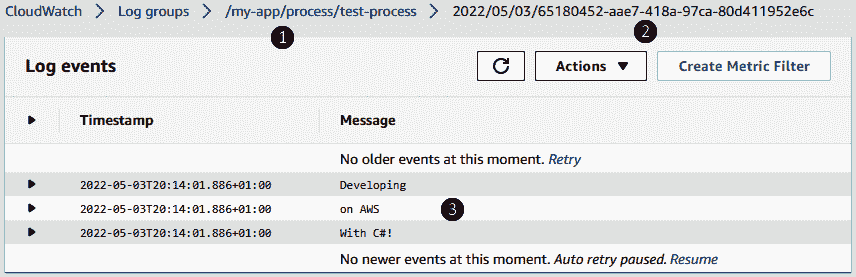

###### 图 7-3\. (1) CloudWatch 日志组，(2) 日志流，和 (3) 日志事件消息

现在我们对 CloudWatch 日志事件的存储和访问有了一些了解，让我们看看如何利用这一点来使用 CloudWatch 保存应用程序中的自定义日志消息。

### 发送 C# 日志

默认情况下，AWS Lambda 将转发对 `Console.WriteLine()` 的所有调用到 CloudWatch，但是您还可以通过 AWSSDK.CloudWatchLogs NuGet 包直接从我们的 C# 应用程序向 CloudWatch 推送日志，该包是 AWS SDK for .NET 的一部分。安装该包后，创建一个新的 .NET 6 控制台应用程序来记录测试消息，如 示例 7-1 所示。

##### 示例 7-1\. Program.cs

```cs
using TestCloudWatchLogPublishing;

await using (var logger = await CloudWatchLogger.CreateNew())
{
    logger.WriteLine("Developing");
    logger.WriteLine("on AWS");
    logger.WriteLine("With C#!");
}
```

由于我们尚未创建 `TestCloudWatchLogPublishing.CloudWatchLogger` 类，因此编译将失败，但是您可以看到我们在这里所做的一切只是创建一个新的日志记录器实例并写入几行日志。此示例中的 `using` 块作为一种方便的方式，用于将我们的日志记录器实例限定在几行代码中。消息将被批处理，然后在调用最后一行的 `DisposeAsync()` 方法时刷新（发送到 CloudWatch）。³

这里是我们的 `TestCloudWatchLogPublishing.CloudWatchLogger` 类的代码，它将日志消息批处理并发送到 AWS CloudWatch：

```cs
using Amazon.CloudWatchLogs;
using Amazon.CloudWatchLogs.Model;

namespace TestCloudWatchLogPublishing;

public class CloudWatchLogger : IAsyncDisposable
{
    const string LogGroup = "/my-app/process/test-process"; 

    private readonly AmazonCloudWatchLogsClient _client;
    private readonly string _logStreamName;
    private readonly List<InputLogEvent> _logs = new List<InputLogEvent>(); 

    public CloudWatchLogger(AmazonCloudWatchLogsClient client, string name)
    {
        _client = client;
        _logStreamName = name;
    }

    public async static Task<CloudWatchLogger> CreateNew()
    {
        var client = new AmazonCloudWatchLogsClient();

        var logStreamName = DateTime.UtcNow.ToString("yyyy/MM/dd/")
                            + Guid.NewGuid().ToString(); 

        await client.CreateLogStreamAsync(new CreateLogStreamRequest 
        {
            LogGroupName = LogGroup,
            LogStreamName = logStreamName
        });

        return new CloudWatchLogger(client, logStreamName);
    }

    public void WriteLine(string message)
    {
        _logs.Add(new InputLogEvent
        {
            Message = message,
            Timestamp = DateTime.Now
        });
    }

    public async ValueTask DisposeAsync()
    {
        await _client.PutLogEventsAsync(new PutLogEventsRequest 
        {
            LogEvents = _logs,
            LogGroupName = LogGroup,
            LogStreamName = _logStreamName
        });
    }
}
```


在我们的示例中，日志组名称只是硬编码的。在部署此代码到 AWS 期间，我们很可能希望通过环境变量来创建一个新的日志组。


日志消息将写入此列表，然后在类被销毁时“刷新”。


日志流应具有唯一的名称。我们在前面加上日期前缀，以便于排序。


每个日志记录器类的实例都会创建一个新的日志流。


所有批量日志消息都会使用 AWS SDK 中的`P⁠u⁠t⁠L⁠o⁠g⁠E⁠v⁠e⁠n⁠t⁠s​A⁠s⁠y⁠n⁠c⁠(⁠)`方法发送到 CloudWatch。

运行此控制台应用程序时，查看 [AWS 管理控制台](https://oreil.ly/067XH) 中的日志，将显示 图 7-3 中的输出。

###### 提示

在本地运行 .NET 应用程序时，AWS SDK 会在一系列位置查找您的 AWS 凭据，以便连接到 AWS 并将日志消息发布到 CloudWatch。在 Windows 环境中，有一个名为*SDK Store*的 JSON 文件，位于*%USERPROFILE%\AppData\Local\AWSToolkit\RegisteredAccounts.json*，或者您可以使用共享的 AWS 凭据文件。有关配置本地连接到 AWS 的所有可用选项的信息，请访问[此文档页面](https://oreil.ly/O57Zy)。

在前面的示例中，我们直接使用了`CloudWatchLogger`，但是由于 AWS Lambda 能够将对`Console.WriteLine()`的调用转发到 CloudWatch，因此我们还可以使用任何流行的 .NET 日志包写入控制台，然后允许 AWS Lambda 为我们转发到 CloudWatch。

例如，这里是一个 Serilog 的配置，添加了一个`Serilog.Sinks.Console`日志汇，AWS Lambda 将发送到 CloudWatch：

```cs
{
  "Serilog": {
    "Using": [ "Serilog.Sinks.Console" ],
    "MinimumLevel": "Debug",
    "WriteTo": [
      { "Name": "Console" }
    ],
    "Properties": {
      "Application": "SerilogLoggingInLambda"
    }
  }
}
```

我们可以将此 JSON 保存到我们的*appsettings.json*文件中，并且通过安装了 Serilog 和 Serilog.Sinks.Console 包，我们的 Lambda 函数将向 CloudWatch 发送日志。

您可以在 [AWS Logging .NET0](https://oreil.ly/PYPL1) 的 GitHub 仓库中找到用于使用其他流行的第三方日志库的插件。

## 指标

到目前为止，我们只查看了捕获单个事件的日志消息。这对于调试应用程序的执行和捕获特定事件非常有用，但是为了长期监视和分析系统，我们还需要捕获指标。

*度量*是在一定时间内对特定数据点的测量。例如，您可能有一个记录每个 HTTP 请求响应时间的应用程序，并决定测量*每分钟*的*平均*响应时间。每分钟平均 HTTP 响应时间的度量是一个指标，它允许您绘制类似于图 7-4 的时间序列。您可以在 CloudWatch 管理控制台的指标 → 所有指标下创建和探索建议的指标。

还可以使用 AWSSDK.CloudWatch NuGet 包中的 `AmazonCloudWatchClient` 类从您的 C# 代码中发布自定义度量数据点。⁴

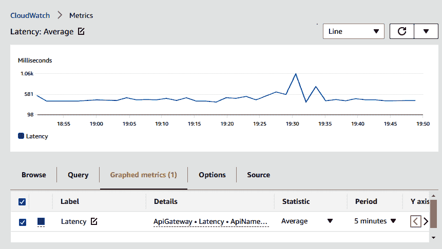

###### 图 7-4\. API 网关平均延迟度量

示例 7-2 将当前在您的本地计算机上运行的进程数发送到 CloudWatch：

##### 示例 7-2\. Program.cs

```cs
using Amazon.CloudWatch;
using Amazon.CloudWatch.Model;
using System.Diagnostics;

var client = new AmazonCloudWatchClient();

await client.PutMetricDataAsync(new Amazon.CloudWatch.Model.PutMetricDataRequest
{
    Namespace = "MyApplication",
    MetricData = new List<MetricDatum>
    {
        new MetricDatum
        {
            MetricName = "ProcessCount",
            Value = Process.GetProcesses().Length,
        }
    }
});
```

您可以在图 7-5 中看到重复运行此操作的结果。请注意，CloudWatch 自动为我们创建了命名空间“MyApplication”和度量“ProcessCount”。

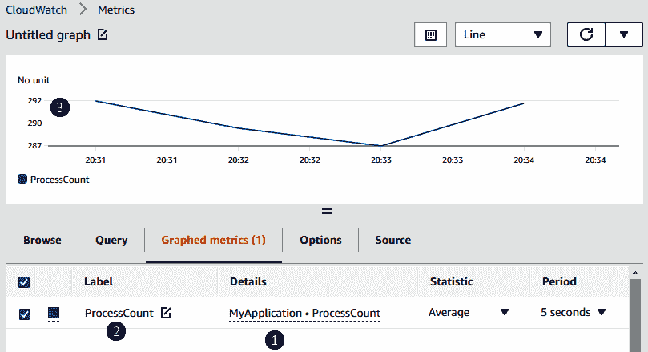

###### 图 7-5\. (1) 发送带有命名空间的自定义度量结果，(2) 度量名称，以及 (3) 运行进程数

现在我们的度量数据进入 CloudWatch，接下来我们将看看如何构建 CloudWatch 仪表板以便一目了然地监视我们的系统。随后，我们将看看如何设置警报，以在度量超过一定阈值时触发。

## 使用 CloudWatch 仪表板监控

仪表板允许您一目了然地监视您的 AWS 资源。您可以通过创建自定义仪表板，选择要快速高效监视的关键指标，一次监视整个 AWS 帐户中的多个资源。CloudWatch 为您的 AWS 服务生成*自动*仪表板，您可以将其用作创建自己仪表板的起点。

转到管理控制台中的 CloudWatch → 仪表板 → 自动仪表板，查看可用的自动仪表板。您可以从自动仪表板中将小部件添加到新的自定义仪表板，或者通过选择每个小部件的上下文菜单中的“查看指标”来查看和调整底层指标查询。图 7-6 显示了为我们的简单存储服务 (S3) 存储桶生成的自定义仪表板。您可以查看存储桶大小和对象数量的趋势。

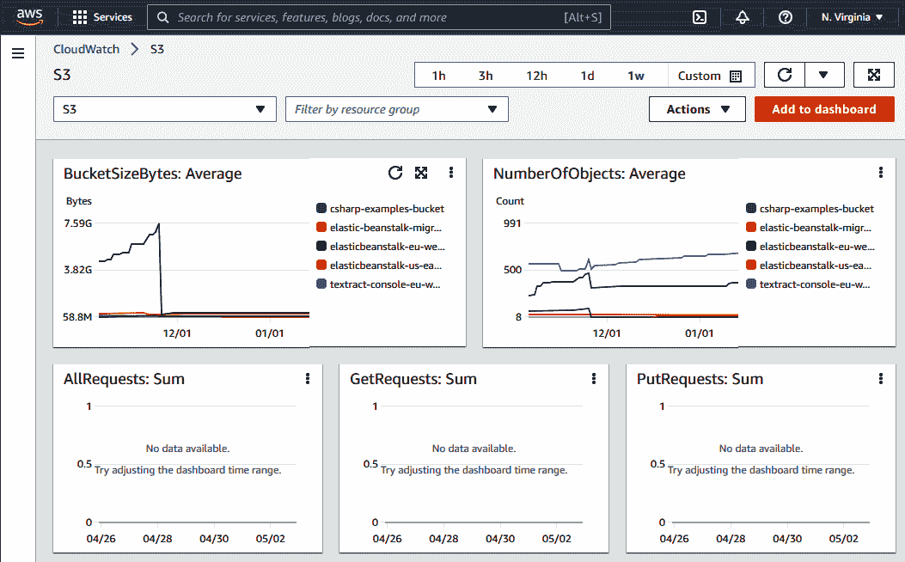

###### 图 7-6\. 简单存储服务 (S3) 存储桶的自动 CloudWatch 仪表板

仪表板允许您随时间可视化指标的变化，但如果您希望在指标达到某个值时实际执行一些操作呢？在图 7-6 中，您可以看到我们的一个 S3 存储桶的`BucketSizeBytes`值在长时间内缓慢增长（第一个图表上突然下降的锯齿线）。如果我们希望的话，我们可以设置一个上限，即在这个 S3 存储桶中存储的字节数上限，可能出于成本考虑，然后在存储桶大小超过此限制时执行某些操作。为此，我们使用 CloudWatch 告警。

### 云监控告警

我们在本章中介绍了监控软件，它保证了过山车的安全运行。在工业控制软件中，例如过山车，如果某个输入读取值在预定的阈值之外超过一定秒数，它将触发告警。在工业应用中，这些告警将连接到发出响亮的听得见的警报声的物理警报，通知附近的操作员条件超出正常范围。例如，可能是温度设定点低于或高于几秒钟，或者是离散输入，如激光束被切断。在您的分布式 AWS 系统中，您可以配置告警以在您认为“正常”的限制之外时触发。告警的目的是触发操作，可以是系统管理员手动操作，也可以是通过触发系统内功能自动执行。

在 CloudWatch 中，您可以为任何单个指标、从多个指标派生的表达式甚至其他告警配置告警。告警可以处于三种可能的状态之一：

OK

此告警的指标在定义的范围内，并且未触发。

IN ALARM

指标超出定义的范围，告警被触发。

INSUFFICIENT_DATA

目前没有足够的数据来确定告警状态。

让我们为我们在图 7-5 中创建的自定义指标添加一个告警。为此，请在管理控制台中导航至 CloudWatch 并创建告警，选择 MyApplication → Metrics with no dimensions → ProcessCount 作为要监视的指标。在图 7-5 的示例中，我们的自定义指标报告了 287 到 292 个进程，因此我们可以将告警阈值设置为 290，这将使测试变得容易。在下一个屏幕上选择“创建新主题”，以便 AWS 创建一个新的简单通知服务（SNS）主题。我们在“使用 SQS 和 SNS 进行开发”中介绍了 SNS；它是一个允许发布者和订阅者分别创建和侦听事件的服务。对于此告警的目的，当`ProcessCount`指标超过我们的 290 阈值时，我们将向 SNS 发布一条消息，触发告警。

图 7-7 显示了我们创建并等待几分钟以使其具有足够数据以退出*INSUFFICIENT_DATA*状态后的警报。从这个图表可以看出，我们在 290 处有一条水平线，表示这是我们将触发警报的阈值。

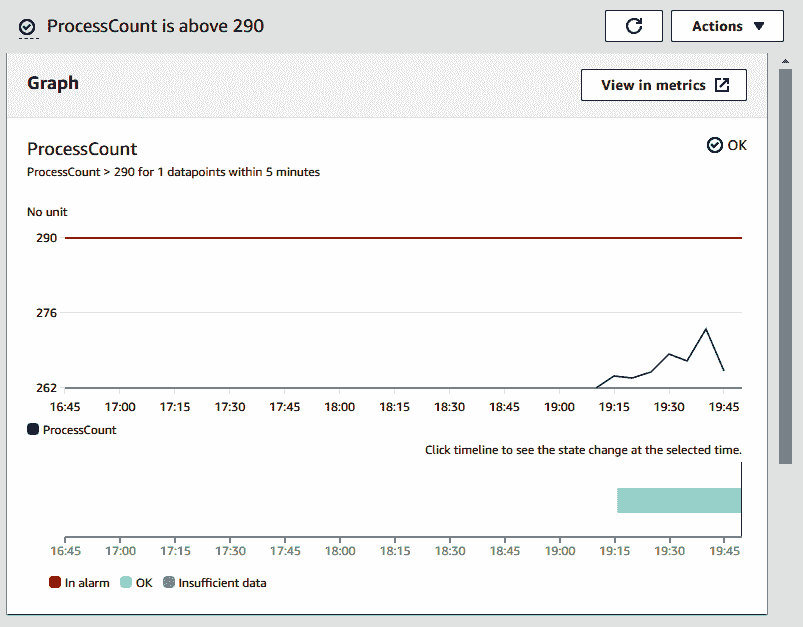

###### 图 7-7\. CloudWatch 警报监控我们的自定义指标

我们在本节开头提到，您还可以配置警报以触发多个指标。这可以通过指标数学来实现，我们将在接下来详细讨论。

### 指标数学

指标是随时间变化的数据点，因此您可以在相同的时间段内对它们执行算术运算。CloudWatch 使您能够使用多种表达式将多个指标组合成一个。在本书中无法涵盖所有内容；然而，您可以在[这里](https://oreil.ly/2oYRC)找到所有函数和表达式的完整列表。

利用这些算术函数对我们的指标进行操作，我们可以创建*新*的指标，这些指标既可以添加到仪表板中，也可以用于触发警报。在图 7-8 中，我们通过将我们早期示例中的`ProcessCount`与另一个记录本地机器 CPU 使用率的自定义指标相结合，创建了一个新的表达式。这允许我们为*每个进程的平均 CPU*创建一个新指标，输入到图 7-8 中表格中可自定义的“标签”字段。

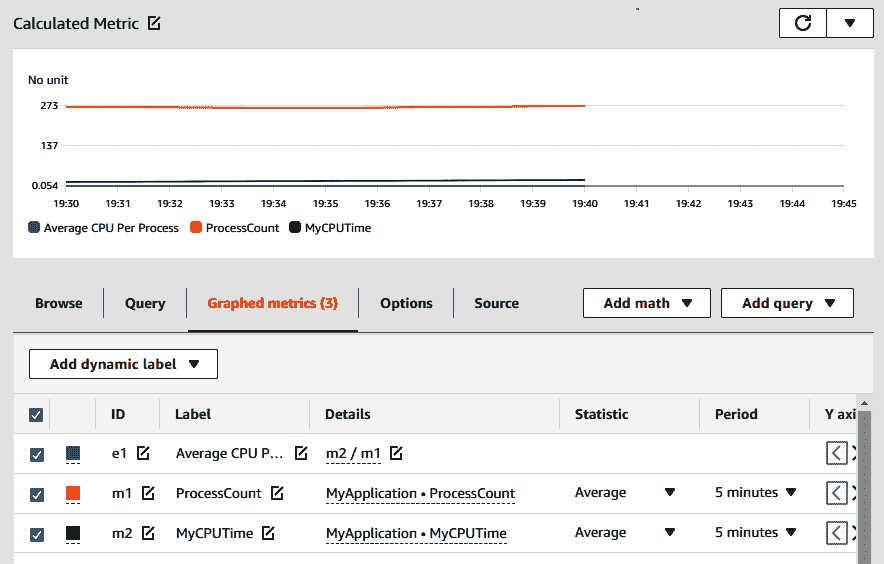

###### 图 7-8\. 使用指标数学创建的平均每个进程 CPU 指标

我们从上面的添加数学上下文菜单选项中创建了这个表达式，并选择了“以空表达式开始”。在这个例子中，表达式是 `m2 / m1`，其中 `m1` 和 `m2` 是列表中我们两个自定义指标的默认标识符。您可以通过编辑表格中的“ID”字段查看/更改此指标 ID，如图 7-8 中所示。

通过使用指标数学，我们可以创建复杂的图表和警报条件，以监控系统内部的任何参数。在指标数学中甚至有一个`IF(condition, trueValue, falseValue)`条件，允许我们执行诸如过滤时间序列中的数据点等操作。也许我们想要在系统重新启动后或软件更新期间过滤掉前 10 分钟的数据点，这是可能的，通过在 AWS CloudWatch 中使用指标数学构建新的指标表达式。

### CloudWatch 异常检测

还可以使用称为*异常检测*的功能触发 CloudWatch 警报。这是一种机器学习算法，持续监视您的度量，并通过一系列*预期值*确定正常基线。如果度量超出此范围太远，就可以触发警报。CloudWatch 异常检测使用您的度量的历史值来评估每小时、每日和每周模式。这使其能够生成预期值范围，即使是那些随着时间自然变化以遵循正常模式的度量，例如与应用程序使用模式相关的度量。要基于异常检测创建 CloudWatch 警报，请查看警报配置中的“云监控控制台”下的“异常检测”选项（https://oreil.ly/Ag1Tq）。

接下来，我们将从度量指标转移到使用名为 X-Ray 的 AWS 服务跟踪代码执行路径。

# 使用 X-Ray 进行分布式跟踪

AWS X-Ray 是一个为您的云托管应用程序提供端到端跟踪的服务，使您能够深入了解代码执行方式。例如，您可以为 HTTP 请求设置 X-Ray 跟踪，并查看该 HTTP 请求导致的任何下游服务调用的执行路径。这使您能够在云中运行应用程序时调试应用程序，帮助您理解任何问题的根本原因。您还可以使用 AWS X-Ray 查找代码执行路径中的性能瓶颈。

要利用 AWS X-Ray 提供的工具，您需要设置您的服务以发布跟踪事件到 X-Ray。X-Ray 跟踪事件可以自动配置为许多本地 AWS 服务，如 AWS Lambda 和 DynamoDB。在 Lambda 函数上启用跟踪只需在管理控制台中为任何 Lambda 函数切换“Active tracing”开关（显示在图 7-9）。

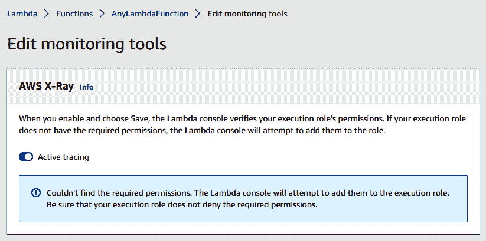

###### 图 7-9\. 可以在许多本地 AWS 服务的配置设置中启用 X-Ray

如果您的基础架构由 Infrastructure as Code（IaC）框架控制，例如“无服务器应用程序模型（SAM）”，则可以在配置中启用活动跟踪，以便在部署资源更改时设置。以下是启用 Lambda 函数上 X-Ray 的 SAM 配置；我们在属性对象中添加了`Tracing:Active`：

```cs
AWSTemplateFormatVersion: '2010-09-09'
Transform: AWS::Serverless-2016-10-31
Description: My Lambda function with X-Ray active tracing enabled
Resources:
  MyLambdaFunction:
    Type: AWS::Lambda::Function
    Properties:
      Handler: MyApp::MyApp.Function::Handler
      Runtime: dotnet6
      Tracing: Active
```

并非所有的 AWS 服务都可以像这样启用；然而，对于这些服务，我们有使用.NET SDK 的选项。

## 使用.NET SDK 设置 X-Ray

当启用像 AWS Lambda 这样的本地服务的 X-Ray 时，只需切换一个开关即可（如 图 7-9 所示）。但是，如果你的代码运行在 EC2 容器中（包括 Elastic Beanstalk）或者 App Runner 上，则需要手动配置一些内容。你需要安装或启用 X-Ray 守护程序，该守护程序在后台运行于你的 EC2 实例上，收集 X-Ray 跟踪消息，并将它们批量处理并发送到 AWS X-Ray。此外，你还需要在你的 C# 代码中使用 X-Ray SDK 来将跟踪消息发送给守护程序。

在 EC2 实例上，你可以通过以下命令下载并安装 X-Ray 守护程序，以便在启动实例时自动运行：

```cs
#!/bin/bash
curl https://s3.us-east-2.amazonaws.com/aws-xray-assets.us-east-2/
xray-daemon/aws-xray-daemon-3.x.rpm -o /home/ec2-user/xray.rpm
sudo yum install -y /home/ec2-user/xray.rpm
```

如果你使用 Elastic Beanstalk，你可以在管理控制台的配置 → 软件设置 → X-Ray 守护程序下启用它。在使用 AWS Toolkit for Visual Studio 发布应用程序时，在发布页面上也有一个选项。在发布应用程序到 Elastic Beanstalk 时勾选“启用 AWS X-Ray 跟踪支持”，AWS Toolkit 将会为你启用守护程序。

你也可以在本地开发机上运行 X-Ray 守护程序进程。你可以通过访问 [X-Ray 设置指南](https://oreil.ly/Spc0P) 来获取在 Windows、Linux、Mac OS 甚至 Docker 容器中本地运行守护程序的指南。

安装了守护程序后，你就可以在应用程序中使用 X-Ray SDK 将跟踪消息发送到 X-Ray。要做到这一点，请首先安装 NuGet 包 AWSXRayRecorder，然后将以下三行代码添加到你的 .NET 6 Web 应用程序的 *Program.cs* 文件中：

```cs
using Amazon.XRay.Recorder.Core;
using Amazon.XRay.Recorder.Handlers.AwsSdk;

AWSXRayRecorder.InitializeInstance(); 

AWSSDKHandler.RegisterXRayForAllServices(); 

// ... 
app.UseXRay("ElasticBeanstalkAppExample"); 

app.Run();
```


为这个应用程序初始化 AWS X-Ray 记录器。


如果你在应用程序中使用 AWS SDK 调用其他 AWS 服务，请添加此行代码。这将允许 X-Ray 通过这些下游服务跟踪请求。


在你的 Web 应用程序路由中添加 X-Ray 跟踪。名称“ElasticBeanstalkAppExample”将用于在 X-Ray 中标识此应用程序。

添加这三行代码将为进入您的 Web 应用程序的每个 HTTP 请求发送跟踪消息到 X-Ray。您将能够测量请求的持续时间，包括任何对下游 AWS 服务的同步调用。X-Ray 有一个称为 “segments” 的概念，它们是代码执行路径的可测量部分。整个 HTTP 请求是父 “segment”，而此请求作为其一部分进行的任何下游调用将作为 “subsegments”。您还可以使用 X-Ray SDK 配置自己的子段，以测量代码的自定义部分的时间。在下面的示例中，我们为控制器动作内代码的持续时间设置了一个子段。然后我们从我们的代码中调用了一个名为 `TracedLambdaFunction` 的 AWS Lambda 函数。X-Ray 也将为该 Lambda 调用创建一个子段。

##### 示例 7-3\. Program.cs

```cs
[HttpPost]
public async Task<IActionResult> InvokedMyTracedLambda()
{
    AWSXRayRecorder.Instance.BeginSubsegment("Executing Controller Action");

    var lambdaClient = new AmazonLambdaClient(Amazon.RegionEndpoint.EUWest2);
    await lambdaClient.InvokeAsync(new Amazon.Lambda.Model.InvokeRequest
    {
        FunctionName = "TracedLambdaFunction"
    });

    AWSXRayRecorder.Instance.EndSubsegment();

    return Ok();
}
```

我们将能够在 CloudWatch 管理控制台的 X-Ray traces 部分查看此示例的跟踪结果。图 7-10\. 展示了此控制器方法的跟踪结果。您可以看到 Lambda 函数执行花费了 2.45 秒返回。我们在控制器动作中设置的子段，使用 `AWSXRayRecorder.Instance.BeginSubsegment(...)`，花费了 2.67 秒，整个 HTTP 请求花费了 2.76 秒。

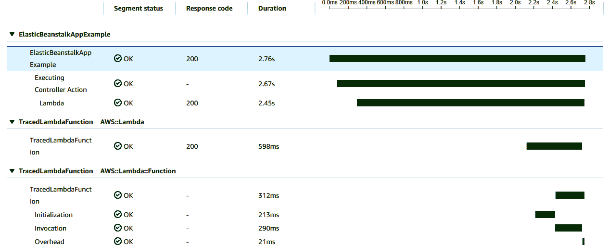

###### 图 7-10\. 我们 Web 应用程序控制器调用的跟踪视图

使用 X-Ray 追踪，您可以快速找出代码中的性能瓶颈，并相应地重构或重新设计代码路径。通过为您的应用程序和服务添加跟踪功能，X-Ray 还启用了另一个功能，即 *服务映射*。

## X-Ray 服务映射

现在，服务映射位于 AWS CloudWatch 管理控制台的 X-Ray traces 部分，它是所有启用了 X-Ray 的服务及其交互的可视化展示。⁵ Figure 7-11 展示了先前示例的服务映射。你可以看到，我们有我们的 Web 应用 ElasticBeanstalkAppExample，它调用了名为 `TracedLambdaFunction` 的 Lambda 函数。因为我们在 Web 应用中使用了 X-Ray SDK，并调用了 `AWSSDKHandler.RegisterXRayForAllServices()`，X-Ray 能够确定此 Lambda 调用来自我们部署到 Elastic Beanstalk 的 .NET Web 应用程序内部。

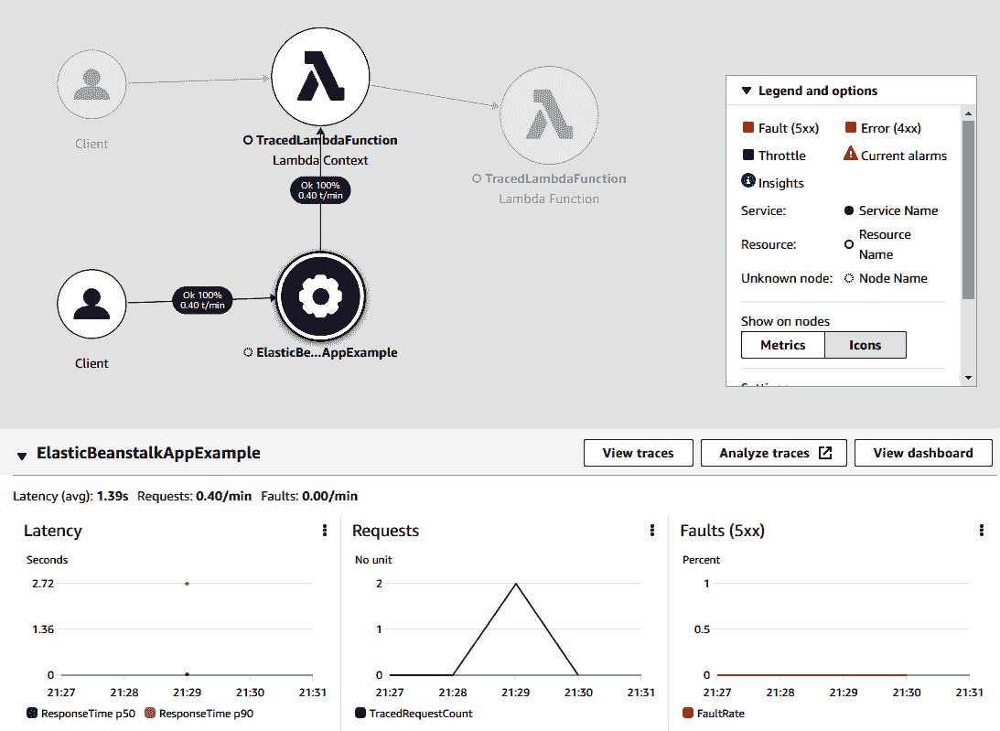

###### 图 7-11\. X-Ray 可以在许多原生 AWS 服务的配置设置中启用

您可以在服务映射界面中单击服务，跟踪它们的执行路径，并查看延迟和 5xx 错误率等性能指标。在 Figure 7-11 中，我们选择了 “ElasticBeanstalkAppExample”。

下面我们将看看如何在 OpenTelemetry 中使用 X-Ray，这是一个开源的可观测性框架，为跨多个云提供商（包括 AWS）提供了一个通用的工具框架。

## OpenTelemetry 和 App Runner

对于之前使用的所有服务，我们一直在使用 X-Ray SDK 和/或简单地利用内置的 X-Ray 追踪功能，例如在 AWS Lambda 中。还可以使用 OpenTelemetry 与 X-Ray 一起发送跟踪信息，以减少供应商锁定。如果您希望从容器化应用程序（例如在 Amazon ECS 或 Amazon EKS 上运行的应用程序）中利用 X-Ray 追踪，则可以采用此解决方案。

在您的代码库中添加了 OpenTelemetry SDK 后，可以使用[AWS OpenTelemetry 发行版](https://aws.amazon.com/otel)来仪器化您的 .NET 应用程序并将指标发送到 X-Ray。您可以通过访问[开始使用 .NET SDK 进行跟踪仪器化](https://oreil.ly/xGe4T)了解有关为您的 .NET Core/6+ 应用程序设置 OpenTelemetry 的更多信息。

# 资源健康和合成金丝雀

如果您已经在 CloudWatch 管理控制台周围探索过，那么您可能已经访问了应用程序监控部分。在这个主题下，有几项来自 AWS 的服务帮助我们监控资源。让我们快速浏览其中的两项：资源健康和合成金丝雀。

资源健康视图以前是 ServiceLens 的一部分，显示您所有运行中 EC2 主机的健康和性能数据。您可以通过从三个维度选择来自定义视图：CPU 利用率、内存利用率和状态检查。管理控制台窗口将为当前区域中的每个 EC2 主机显示彩色方块块。这为您提供了一个易于阅读和访问的视图，显示大多数或所有主机的警报状态。⁶

合成金丝雀是 CloudWatch 应用程序监控部分中的另一个强大工具。在系统监控中，“金丝雀”是一种活跃的监控技术，它使用脚本或其他定期任务定期探测系统的状态。⁷

您可以使用提供的模板（或“蓝图”）在 AWS 中创建多种类型的金丝雀：

+   心跳监控

+   API 金丝雀

+   坏链检查器

+   金丝雀记录器

+   GUI 工作流构建器

+   可视化监控

合成金丝雀的理念是复制模拟您的应用程序将要为用户执行的实际使用情况。例如，API 金丝雀可以配置为对您的 API 进行系列请求，模拟前端在正常操作下执行的操作。

当创建您的金丝雀时，可以通过选择“使用 AWS X-Ray 追踪我的服务”轻松集成合成与 X-Ray。有关配置和熟悉 X-Ray，请参阅“使用 X-Ray 进行分布式追踪”。

# 使用 AWS CloudTrail 进行安全审计

到目前为止，我们一直在 AWS CloudWatch 中查看日志，监视您部署的服务以查找并修复问题。然而，在我们离开日志记录和监视主题之前，让我们简要了解一下 AWS 为账户审计提供的功能。

CloudTrail 是 AWS 的一个服务，记录您账户中对 AWS API 的所有请求，并记录下发出请求的用户。这些 API 请求可以从任何地方进行，包括通过 AWS CLI、管理控制台或来自 AWS SDK（例如 AWS SDK for .NET）的 SDK。您甚至可以在 CloudTrail 中监视另一个 AWS 服务发出的请求。CloudTrail 在 AWS 管理控制台中有其自己的部分，因此要访问它并查看您的审计日志，请在搜索栏中搜索“CloudTrail”。

###### 提示

对于 Google Chrome 用户，您可以使用 ALT+S（Mac 上的 Option+S）随时将焦点移动到 AWS 管理控制台中的搜索栏。管理控制台的另一个方便的功能是搜索结果中每个服务旁边的收藏夹“星号”。单击此按钮将导致指向该服务的链接永久显示在管理控制台窗口的标题栏中，并且在您浏览各种 AWS 服务时保持不变。

要开始使用 CloudTrail，请点击“创建跟踪”，并进行设置以配置跟踪的属性，主要是名称和用于存储日志的 S3 存储桶。您可以选择监视任何或所有这些事件类型：

管理事件

在您的 AWS 资源上执行的操作，例如将策略附加到 IAM 角色或在 EC2 中创建子网。

数据事件

对资源实例执行的操作。数据事件包括删除、创建或更新 S3 对象、DynamoDB 记录和执行 Lambda 函数。

洞察事件

当 AWS 检测到您帐户上的异常活动时，AWS 会记录这些事件。它们监视 AWS API 上的写操作，并使用数学模型来检测操作和/或错误的异常水平。

创建跟踪后，AWS 将开始向 S3 存储桶记录日志，并且您可以在管理控制台中查看和分析您的审计日志。

# 实际示例：一个 CloudWatch 断路器

在本章中，我们已经探讨了 AWS CloudWatch 中的一些可用功能。我们已经研究了从 C#应用程序向 CloudWatch 收集日志、指标、跟踪和发送自定义指标数据。我们还研究了监控仪表板，并设置当指标超出预定阈值时触发警报的功能。让我们通过一个跨越本章涵盖的多个概念的示例来将所有这些联系起来。在此示例中，我们将使用无服务器 AWS 组件和 CloudWatch 实现熔断器模式。

###### 注意

断路器是一个处理应用程序某部分故障的成熟架构模式，引入逻辑来在检测到故障时回退到次要行为。这有助于防止故障传播到下游组件，并允许您即使在一个组件失败时也能维持一定级别的服务向应用程序用户提供。您可以观看一个关于如何实施这种模式的动画示例，链接在[YouTube](https://youtu.be/e5pnfD0rudY)。

为了在 AWS 上实施断路器模式，我们首先需要一个可能出现故障的应用程序。在此示例中，我们有一个网站希望向所有访问者显示最新的货币兑换率。在这种情况下，从 USD 到 GBP 的汇率将来自一个外部 API，我们将每次有人加载我们的网页时调用该 API。由于货币在全球范围内交易，汇率会波动，因此通过每次页面加载时调用此 API，我们可以确保向我们的网站访问者展示最新的汇率。图 7-12 展示了我们如何从网站进行这种汇率查询调用。该调用通过我们控制的 API Gateway 实例代理，并直接传递到我们用于检索最新汇率的第三方服务。

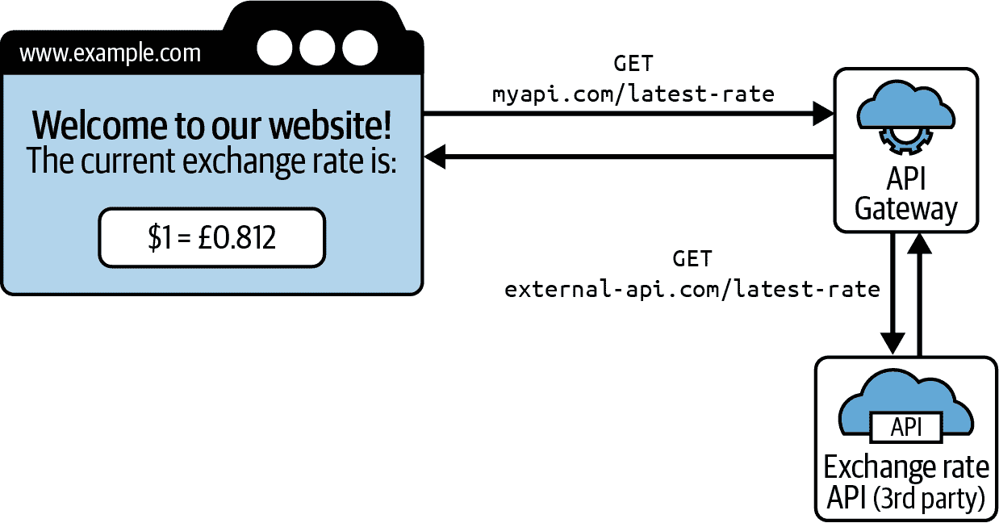

###### 图 7-12\. 外部 API 调用通过 API Gateway 代理到我们的网站

设置一个简单的 API Gateway 代理到第三方 API 的 CloudFormation 模板将是：

```cs
Resources:
  ExchangeRateApi:
    Type: AWS::ApiGatewayV2::Api
    Properties:
      Name: ExchangeRateApi
      ProtocolType: HTTP

  ExternalERServiceIntegration:
    Type: "AWS::ApiGatewayV2::Integration"
    Properties:
      ConnectionType: INTERNET
      IntegrationType: HTTP_PROXY
      IntegrationMethod: GET
      IntegrationUri: https://api.example.com/exchange-rate/
      PayloadFormatVersion: 1.0
      ApiId: !Ref ExchangeRateApi
      RequestParameters:
        "overwrite:header.apikey": "{{API-KEY}}"

  LatestRoute:
    Type: 'AWS::ApiGatewayV2::Route'
    Properties:
      ApiId: !Ref ExchangeRateApi
      RouteKey: 'GET /latest'
      AuthorizationType: NONE
      Target: !Join
        - /
        - - integrations
          - !Ref ExternalERServiceIntegration
```

## 会发生什么问题？

每次访问者加载我们的网页时调用此第三方 API，可以很好地显示最新的值；但是，我们现在严重依赖于一个我们不拥有或控制的 API 的可用性。如果这个第三方服务崩溃或开始响应缓慢会发生什么？目前，我们 API 调用的响应时间与外部 API 的响应时间成正比。如果这个外部 API 开始响应非常缓慢，我们的 API 网关调用也将如此，我们的用户将不得不等待他们期望的汇率出现在网站上。也许他们最终会看到一个超时错误，而不是他们预期的 USD 到 GBP 汇率。那我们该怎么办呢？

使用 CloudWatch 我们可以监控此端点的延迟，并设置一个警报，在外部 API 开始响应缓慢时触发。转到 CloudWatch 管理控制台，并为我们 API 网关资源上的*延迟*指标创建一个新警报，如图 7-13 所示。

###### 警告

在 API 网关中启用“详细路由指标”，以获取每个路由的延迟时间，如图 7-13 所示。

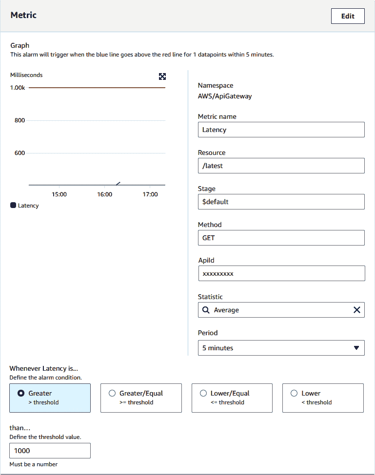

###### 图 7-13\. 配置我们 API 网关资源延迟的新警报

对于我们的警报通知动作，我们将设置一个 SNS 主题，并将其链接到名为 `TriggerCircuitBreaker` 的 Lambda 函数。接下来我们将创建这个 Lambda 函数。

## 断开电路

现在我们有了一种方法来检测外部 API 的延迟增加，我们需要决定如何保持我们的应用程序运行。对于我们的示例网站，我们已经做出了业务决策，即如果汇率查找 API 的响应不够快，我们将从我们的分布式内存缓存中返回一个 *缓存* 汇率。也许我们有另一个 Lambda 函数定期运行并将当前汇率保存到此缓存中。对于我们的分布式缓存，我们可以使用 [Amazon ElastiCache](https://aws.amazon.com/elasticache)，它允许我们同时使用 Redis 和 Memcached，这两种极其流行的开源内存存储。在 图 7-14 中，您可以看到我们已经配置了我们的 API 网关，使用了第二个“备用”集成，该集成调用一个 Lambda 函数从缓存中检索最新的汇率。

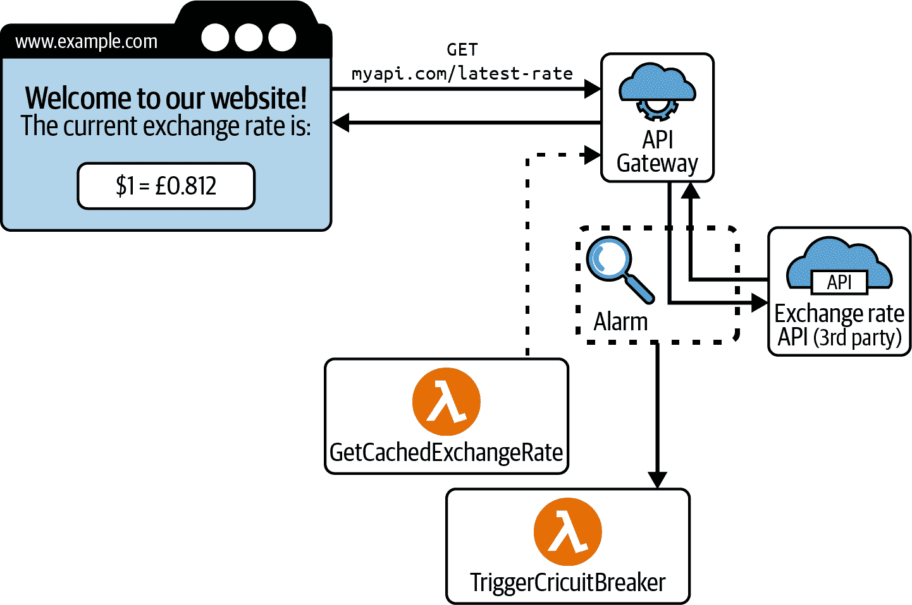

###### 图 7-14\. 将额外的 AWS Lambda 集成添加到 API 网关作为备用

我们的断路器可以通过检测第三方 API 的高延迟并将我们的 API 网关切换到使用此备用集成来运行。这不会影响我们的网站，因为前端的 API 调用仍然进入网关，但我们不再将这些调用代理到我们的第三方服务，而是发送到 Lambda 函数 `GetCachedExchangeRate`。

在 API 网关中进行这种切换可以通过一个简单的 C# Lambda 函数完成，使用 NuGet 包 AWSSDK.ApiGatewayV2 中的 `AmazonApiGatewayV2Client`：

```cs
using System.Threading.Tasks;
using Amazon.ApiGatewayV2;
using Amazon.ApiGatewayV2.Model;
using Amazon.Lambda.Core;
using Amazon.Lambda.Serialization.SystemTextJson;

[assembly: LambdaSerializer(typeof(DefaultLambdaJsonSerializer))]

namespace TriggerCircuitBreaker
{
    public class Function
    {
        public async Task FunctionHandler(object input, ILambdaContext context)
        {
            const string apiGatewayId = "abcabc";
            const string exchangeRateRouteId = "defdef";
            const string fallbackIntegrationId = "xyzxyz";

            var apiGatewayClient = new AmazonApiGatewayV2Client();

            await apiGatewayClient.UpdateRouteAsync(new UpdateRouteRequest
            {
                RouteId = exchangeRateRouteId,
                ApiId = apiGatewayId,
                Target = $"integrations/{fallbackIntegrationId}"
            });
        }
    }
}
```

在这里，我们已经为我们的 API 网关实例、路由和集成硬编码了 ID；然而，当然可以从环境变量中读取或者在运行时使用 `AmazonApiGatewayV2Client` 的方法查找它们。

## 重置触发状态

通过在 API 网关中切换集成，我们已经为用户在网站上提供了一些信息。这可能不是最新的汇率，但应该足够新，关键是，我们已经防范了一个不可预测的慢第三方 API。接下来要考虑的是，当 API 不再经历高延迟时，我们如何重置我们的断路器。

断路器模式提供了一种解决方案，一旦初始条件得到解决，就会定期测试我们的外部 API，这是通过“半开放状态”进行的。我们可以创建另一个 Lambda 函数来执行此操作：

```cs
using System.Collections.Generic;
using System.Diagnostics;
using System.Net.Http;
using System.Threading.Tasks;
using Amazon.CloudWatch;
using Amazon.CloudWatch.Model;
using Amazon.Lambda.Core;
using Amazon.Lambda.Serialization.SystemTextJson;

[assembly: LambdaSerializer(typeof(DefaultLambdaJsonSerializer))]

namespace ProbeExchangeRateEndpoint
{
    public class Function
    {
        public async Task FunctionHandler(object input, ILambdaContext context)
        {

            var watch = Stopwatch.StartNew();

            var response = await new HttpClient()
                          .GetAsync("https://external-api.com/latest-rate");

            response.EnsureSuccessStatusCode();

            watch.Stop();

            var cloudWatch = new AmazonCloudWatchClient();
            await cloudWatch.PutMetricDataAsync(new PutMetricDataRequest
            {
                Namespace = "CircuitBreakerExample",
                MetricData = new List<MetricDatum>
                {
                    new MetricDatum
                    {
                        MetricName = "ExchangeRateProbeLatency",
                        Value = watch.ElapsedMilliseconds
                    }
                }
            });

        }
    }
}
```

在这里，我们有一个函数，它调用我们的第三方汇率 API 并测量响应时间。然后将其作为名为“ExchangeRateProbeLatency”的自定义指标发送回 CloudWatch。然后，我们可以设置第二个警报来跟踪这个新的指标，使用*低于*阈值。在 CloudWatch 的警报配置窗口中，还有一个“数据点到警报”的设置，我们可以利用它。设置这个（在 图 7-15 中显示）将导致我们的警报在我们的探测 API 的 10 次调用中有超过允许的最大延迟时被触发。

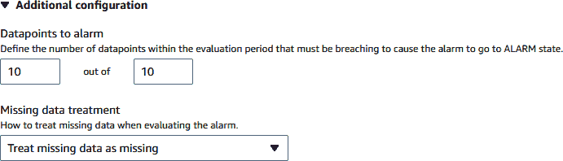

###### 图 7-15\. 数据点到报警配置

最后，在 图 7-16 中，这是我们整个示例作为流程图的呈现。我们正在使用 EventBridge 规则来调度调用 `ProbeExchangeRateEndpoint` Lambda 函数，直到延迟降低到可接受水平。

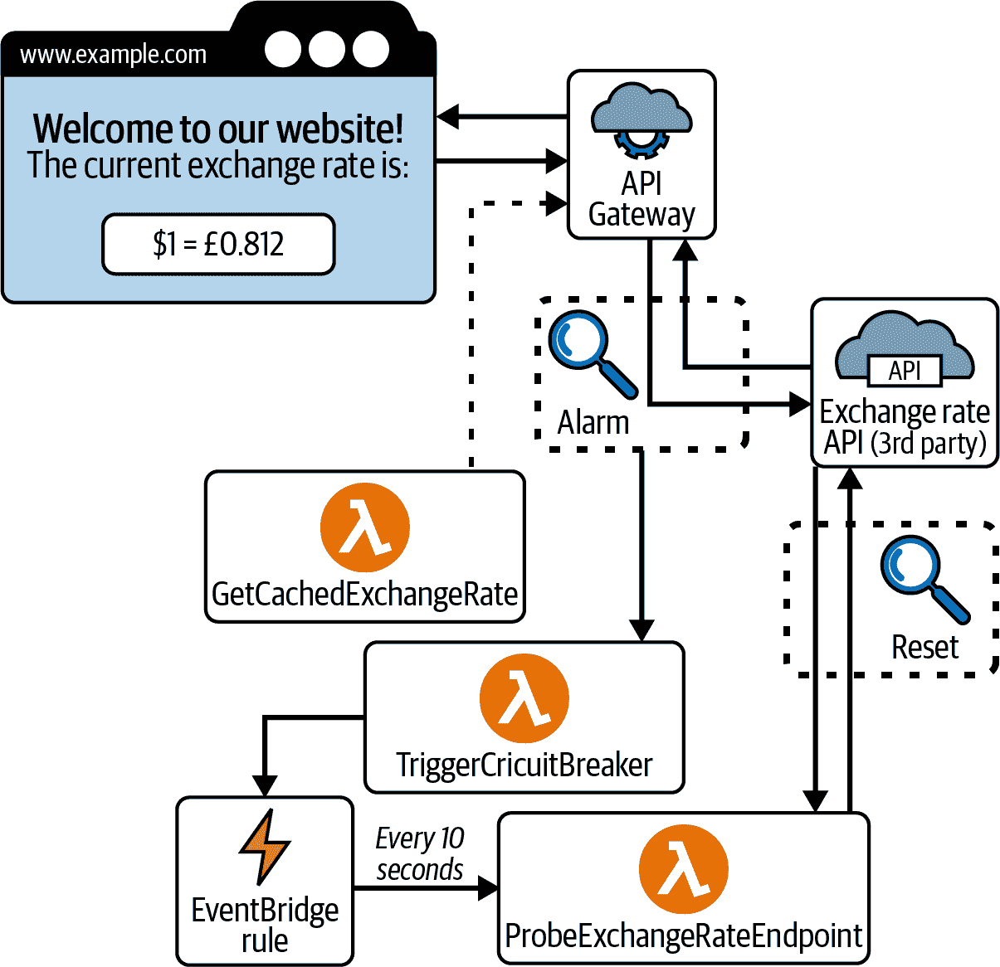

###### 图 7-16\. 带有探测和重置的断路器流程图

# 结论

没有系统是完美设计或配置的。系统随时间演化，并且随着应用规模的变化，您将需要修改服务间通信的方式。对于从只有少数用户开始，有时以指数方式增长到全球服务数千用户的增长系统来说，这一点尤其重要。当应用程序规模小的时候做出的架构决策可能会在采用增加时阻碍性能。随着用户规模的扩展，您还将更多地了解服务的使用模式，因为更多的用户提供了关于应用程序使用情况和瓶颈出现位置的详细见解。

因此，非常重要的是要有日志记录、监控和仪表化，以便您可以观察这些变化并迅速、高效地响应，并且在您的处置中拥有最大量的有用数据。对于运维工程师、站点可靠性工程师、DevOps 和安全工程师来说，AWS CloudWatch 是一组非常强大的工具，可以为您提供所需的数据，如果投入足够的时间来充分利用它。

对于本书的最后一章，我们将回到应用程序代码中，深入探讨 AWS SDK for .NET。我们还将查看一些能够使与 AWS 交互更加自然和与开发工作流程更加集成的 Visual Studio 工具。

# 批判性思维讨论问题

+   工程经理为什么会说日志记录、监控和仪表化对软件工程至关重要？

+   描述 AWS CloudWatch 的四大支柱的另一种方式是什么？

+   在构建和部署 AWS Lambda 服务时，您应该关注的三个或四个最重要的度量指标是什么？

+   类似 X-Ray 这样的服务解决了哪些现实世界的问题？

+   如何使用 AWS CloudTrail 进行安全审计以帮助防止公司遭受勒索软件攻击？

# 练习

+   构建一个 C# 控制台应用程序，查询 AWS CloudTrail。

+   将自定义 CloudWatch 日志写入构建 .NET 项目的 AWS CodeBuild 作业中。

+   记录进入 API Gateway 的 `POST` 请求到一个 .NET Web 服务的 AWS CloudTrail。

+   记录进入 Elastic Beanstalk 的 `POST` 请求到一个 .NET Web 服务的 AWS CloudTrail。

+   构建一个 C# 控制台应用程序，用于查找 AWS CloudTrail 事件中的异常情况。

¹ 乘客的体重会极大地影响重力下过山车车辆的速度。如果你看到四个成年人坐在儿童过山车的车里可能会看起来很有趣，但这辆车进站时增加的动量确实可以测试制动系统的强度。

² 尽管被称为 “AWSLambdaBasicExecutionRole”，但实际上这不是一个角色，而是一个 *策略* —— 一组权限设置，可以应用于角色以授予或拒绝对某些资源的访问。

³ IAsyncDisposable 接口是在 C# 8.0 中引入的，允许我们通过在 “using” 语句之前添加 “await” 来调用异步代码中的 `DisposeAsync()` 方法。

⁴ AWSSDK.CloudWatch 和 AWSSDK.CloudWatchLogs 是两个不同的包，具有不同的客户端；如果您需要向 CloudWatch 发布自定义日志消息 *和* 自定义指标数据点，则需要这两个包。

⁵ Service Map 以前是通过 AWS 称为 “Service Lens” 的产品访问的，因此您可能会在在线文档中找到它作为该产品的一部分的引用。

⁶ 您可以使用资源健康窗口在一个视图中查看多达 500 个主机。

⁷ “Canary” 这个术语有着相当阴暗的历史。在电子气体探测器出现之前的日子里，以及动物福利权利出现之前，金丝雀会被放进煤矿的笼子里挂在正在作业的区域。如果这只鸟在矿井中受到有毒气体的影响而死亡，工人们会注意到可怜鸟的死亡，并将其视为发出警报并撤离的信号。
