# 第八章：使用 AWS C# SDK 进行开发

本书始终通过多种方式与您的开发机器进行 AWS 交互。我们一直在使用[AWS 管理控制台](https://aws.amazon.com/console)，并且通过在 Cloud9 上和本地安装 CLI 来使用 AWS CLI。在本章中，我们将介绍一些工具和集成，提供第三种集成和控制 AWS 服务的方式，通过您可能已经熟悉的集成开发环境（IDEs）：Visual Studio 和 Visual Studio Code。这两个 IDE 都有 AWS 扩展，允许您查询 AWS 资源，本章我们将对两者进行详细介绍。

在查看了 AWS 的 UI 工具包的一些特性后，我们还将更详细地了解 AWS C# SDK。在本书的整个过程中，我们已广泛使用 SDK，因此您应该对其基础知识很熟悉，但这些 NuGet 包的功能远不止这些。

最后，我们将通过探索 AWS 中的一些人工智能（AI）服务及如何在.NET 中利用这些服务来结束本书。所以让我们直接进入话题，讨论 AWS Toolkit for Visual Studio 以及如何设置您的 Visual Studio 工作流，使得部署到 AWS 感觉无缝。

# 深入使用 AWS Toolkit for Visual Studio

AWS Toolkit 是一个扩展，通过各种 AWS 相关功能增强了 Visual Studio 界面。工具包的目标是使 Visual Studio 在 AWS 中的集成感与其在微软云服务中的原生集成感一样强。安装了工具包后，您可以使用与“发布”工作流相同的方式快速部署代码到多种 AWS 服务上，这种工作流您可能已经非常熟悉了。

工具包添加了菜单选项、上下文菜单选项、项目模板和 AWS 资源管理器窗口，本章我们将对所有这些功能进行介绍。

## 配置 Visual Studio 以使用 AWS Toolkit

我们在"使用 Visual Studio 与 AWS 和 AWS Toolkit for Visual Studio"中简要介绍了工具包的安装，因此简要回顾一下：您可以在[Visual Studio Marketplace](https://oreil.ly/CuWwr)找到工具包扩展，或者通过 AWS 的[AWS Toolkit for Visual Studio](https://aws.amazon.com/visualstudio)网页找到，后者还包含指南和文档的链接，帮助您充分利用 Visual Studio 中的 AWS 功能。

工具包有三个版本，适用于五个版本的 Visual Studio，请确保下载适合您版本的正确*.msi*安装文件。

+   AWS Toolkit for Visual Studio 2013–2015

+   AWS Toolkit for Visual Studio 2017–2019

+   AWS Toolkit for Visual Studio 2022

本书中的示例将使用 AWS Toolkit for Visual Studio 2022；但是，较早版本的 Visual Studio 屏幕并没有根本不同。

安装扩展并打开 Visual Studio 后，您将看到如图 8-1 所示的入门页面。

在我们可以从 Visual Studio 连接到 AWS 之前，我们需要使用一些 AWS 凭据配置工具包，以便它可以代表我们向 AWS 服务发出 API 调用。工具包使用存储在 AWS 凭据文件中的访问密钥和秘密密钥来配置，存储在方括号中的配置文件下。例如：

```cs
[default]
aws_access_key_id = <your-access-key>
aws_secret_access_key = <your-secret-key>
```

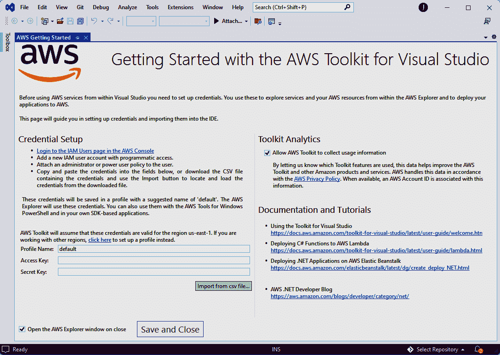

###### 图 8-1\. 使用 AWS Toolkit 入门

如果您的计算机已经存储了凭据，那么您可以跳过此步骤，因为工具包将在 Visual Studio 内自动获取它们。如果您尚未存储凭据，则可以创建 IAM 用户并下载凭据，然后导入到图 8-1 中的凭据设置部分。

一旦您在计算机上存储了凭据，您就可以开始在 Visual Studio 内探索 AWS Toolkit 的功能，而最好的起点就是 AWS 资源管理器，可以通过新的“工具” → “AWS 资源管理器”菜单选项访问（图 8-2）。

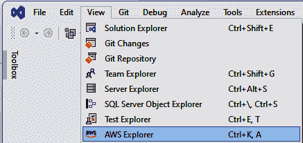

###### 图 8-2\. AWS 资源管理器菜单选项

我们在本书开始时介绍了 AWS 资源管理器；你可以在图 1-14 中看到资源管理器窗口的示例，位于“在 Visual Studio 中使用 AWS 和 AWS Toolkit for Visual Studio”下。除了 AWS 资源管理器外，工具包还安装了几个 AWS 特定的项目模板和蓝图。这些不仅可以加速新项目的创建，还可以用来尝试不同的 AWS 部署模型。

## AWS 的项目模板

通过在*项目类型*过滤器中选择“AWS”，从新安装的项目模板中选择一个。这些项目模板适用于基于 AWS Lambda 构建的应用程序，就像我们在本书中许多示例中所涵盖的那样。

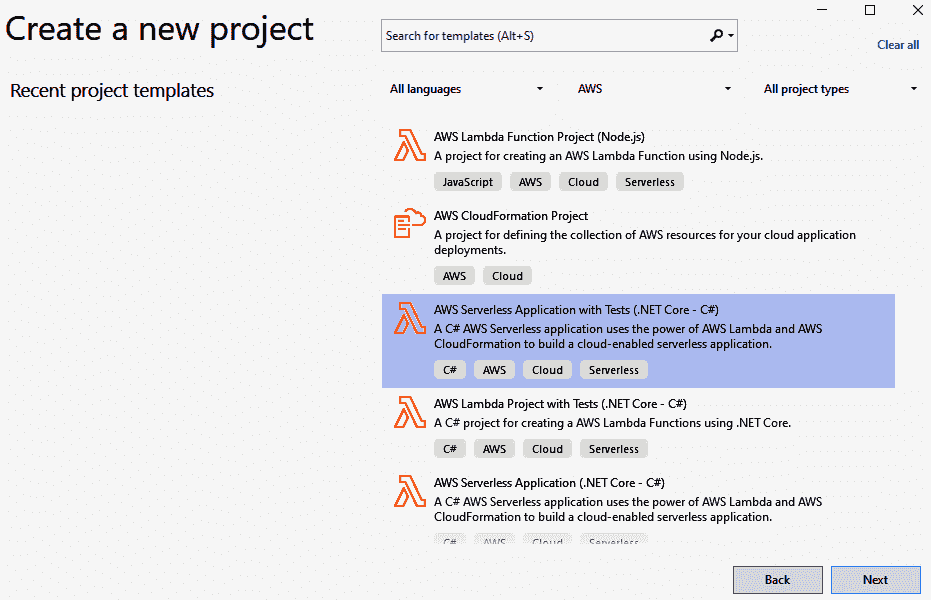

###### 图 8-3\. Visual Studio 中的项目模板

如果选择模板“AWS 无服务器应用程序与测试（.NET Core - C#）”，那么我们将在下一步选择屏幕上再次选择，从中可以选择 AWS 称为“蓝图”的内容。这些蓝图可以进一步配置模板项目，以最好地反映您正在创建的项目。在这种情况下（图 8-4），我们在前一步中选择了无服务器应用程序，因此我们可以为无服务器应用程序提供几种不同的蓝图选项。

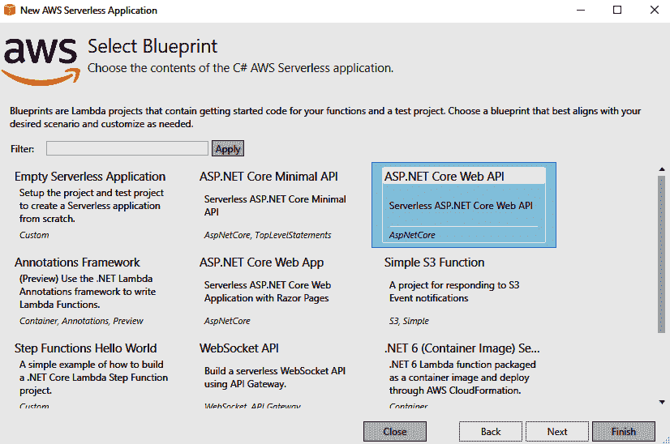

###### 图 8-4\. AWS 项目蓝图

选择 ASP.NET Core Web API 蓝图，然后单击“完成”以创建我们将在下一个示例中使用的项目。

## 从 Visual Studio 发布到 AWS

从我们从蓝图创建的无服务器 ASP.NET Core Web API 项目开始，让我们打开解决方案资源管理器并访问一些已创建的文件：

serverless.template

此文件是我们资源的 Serverless Application Model (SAM) 模板。这个文件允许我们从一个文件中配置我们的基础设施，可以提交到版本控制中。我们在 “Serverless Application Model (SAM)” 中介绍了 SAM。

AWSServerless1.Tests

此测试项目已创建，包括 *ValuesControllerTests.cs* 中的单个单元测试，作为撰写我们的 API 单元测试的起点。此 AWS 蓝图中包含的测试项目使用了 [xUnit](https://xunit.net) 作为 NuGet 依赖项引入。

aws-lambda-tools-defaults.json

这将保存我们项目的发布设置。在下一步添加的设置将作为默认值保存到此文件中，因此您无需每次重新输入它们。

从此蓝图创建的新项目已准备好立即发布 — 我们无需进行任何更改。我们可以使用 AWS Toolkit 直接从 Visual Studio 发布此无服务器项目。要执行此操作，请右键单击项目名称并选择其中一个“发布到 AWS…”选项。如您在 图 8-5 中所见，AWS Toolkit 已添加了两个新的菜单项，供您用于发布项目。

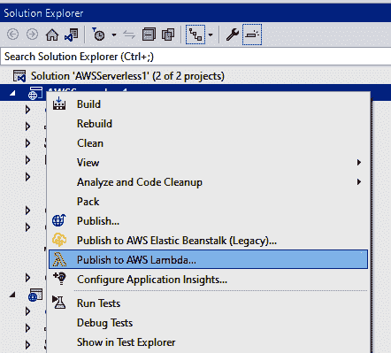

###### 图 8-5\. 工具包新增的发布选项

无论您选择如何发布您的应用程序，工具包都将使用之前描述的 *serverless.template* 文件为您的项目创建一个 CloudFormation 栈，然后构建并将您的代码推送到 AWS。

## Visual Studio Code 的 AWS Toolkit

Visual Studio Code 的崛起简直是如同流星一般的。从 2016 年公开发布到 2022 年被超过 [70% 的专业软件开发人员](https://oreil.ly/KJeur) 使用，很明显，Visual Studio Code 在开发行业中取代了其他 IDE。C# 开发人员通常将其视为 Visual Studio 的轻量替代品，因此在 2019 年，AWS 宣布发布了他们的 [AWS Toolkit for Visual Studio Code](https://oreil.ly/spYbP)。

VS Code 工具包包括在 Visual Studio 中找到的 AWS Explorer 版本，允许您从侧边栏的新“AWS”菜单选项下浏览和与您的 AWS 服务交互。图 8-6 显示了 VSCode 中的 AWS Explorer 允许您浏览和与您的资源交互的方式。

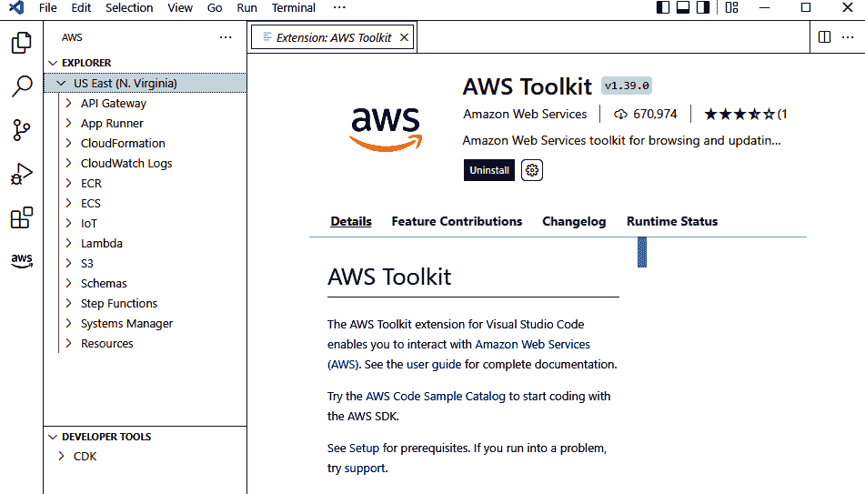

###### 图 8-6\. Visual Studio Code 中的 AWS Explorer

安装工具包就像在 Visual Studio Code 的扩展市场中搜索“AWS Toolkit”一样简单（在 Windows 上为 Ctrl+Shift+X，或在 macOS 上为 ⌘-Shift-X）。

与 AWS Toolkit for Visual Studio 类似，VS Code 扩展使用存储在*~/.aws/credentials*（Linux 或 macOS）或*%USERPROFILE%\.aws\credentials*（Windows）下的 AWS 凭证配置文件。您可以通过打开命令面板（在 Windows 上是 Ctrl+Shift+P，或在 macOS 上是⌘-Shift-P）并选择 AWS: Choose AWS Profile 来选择要使用的配置文件。这将显示选择配置文件的选项，或者如果您没有保存任何配置文件，则可以在 Visual Studio Code 内设置一个。

除了 AWS 资源管理器（图 8-6），AWS Toolkit for Visual Studio Code 还提供了一系列可以从命令面板中调用的 AWS 命令。只需搜索“AWS:”即可显示所有带有此前缀的命令。其中一些显示在图 8-7 中。

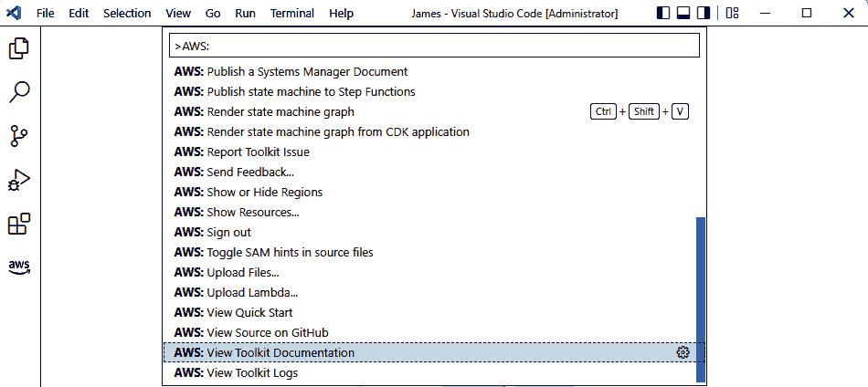

###### 图 8-7. 在 VS Code 中的 AWS 命令

这就是我们对 AWS Toolkits 的 Visual Studio 和 Visual Studio Code 的概述。接下来，让我们快速看一下 Rider 的 AWS Toolkit。

## Rider 的 AWS Toolkit

最后要了解的 AWS Toolkit 扩展是为 JetBrains Rider 提供的。[Rider 的 AWS Toolkit](https://aws.amazon.com/rider)提供类似于我们在此处看到的其他 IDE 工具包的功能，包括一个 AWS Lambda 项目模板，可以集成到 Rider 的“新项目”对话框中，并创建一个简单的`Hello World`项目和测试项目。

AWS Toolkit for Rider 还支持在 Docker 容器内本地运行 AWS Lambda，允许您从 Rider 内部调试 AWS Lambda。在解决方案中的*template.yaml*文件上还有一个新的“Deploy Serverless Application”上下文菜单项，允许您从 Rider 内部部署 Lambda 函数。

在本章的接下来部分，我们将更详细地查看 AWS .NET SDK，并回顾一些 C#内容。

# SDK 主要功能

[AWS .NET SDK](https://aws.amazon.com/sdk-for-net)是一个包含 300 多个 NuGet 包的集合，可让您轻松从运行在.NET 上的应用程序中调用 AWS 服务。SDK 库可以导入到任何.NET 项目中，并且可以从您的代码中进行身份验证调用各种 AWS API。

###### 提示

您可以在[.NET on AWS on GitHub](https://github.com/aws/dotnet)页面上探索更多工具、库和其他资源，该页面包含 AWS 维护的所有开源工具的 GitHub 存储库链接，包括 AWS .NET SDK。

所有 SDK 库都遵循包装 AWS API 调用的服务客户端的通用模式。这些客户端在 SDK 中使用强类型的请求和响应类来实现，可供您的 C#代码使用。一个示例是来自[AWSSDK.S3](https://oreil.ly/xuwoj)包的`AmazonS3Client`客户端类：

```cs
var s3Client = new AmazonS3Client(Amazon.RegionEndpoint.USEast1);

await s3Client.CopyObjectAsync(
        sourceBucket,
        sourceKey,
        destinationBucket,
        destinationKey
);
```

这里我们正在 AWS 简单存储服务 (S3) 存储桶上调用`copy-object`来复制一个键到另一个键。我们首先创建服务客户端的新实例（在本例中为`AmazonS3Client`），并使用一些配置值（`AmazonS3Config`）。然后，使用服务客户端的实例，我们调用方法`CopyObjectAsync()`的异步版本。上述代码片段相当于从 AWS 命令行调用以下内容：

```cs
aws s3api copy-object --copy-source <source-bucket> --key <key> --bucket <dest>
```

大多数 AWS 服务遵循此模式，因为所有 AWS 服务客户端都继承自基类[`Amazon.Runtime.AmazonServiceClient`](https://oreil.ly/5b17a)。这使得所有 AWS 服务客户端对象都能访问共享功能，如凭据管理、日志记录、度量、重试和超时，本章后面将详细介绍其中一些功能。

## AWS .NET SDK 中的身份验证

要调用 AWS API，您需要向 AWS .NET SDK 传递凭据。有几种方法可以实现这一点，不同的方法适用于不同的场景。例如，如果您在本地运行代码以进行开发，您可能希望使用存储在 AWS 配置文件中的访问密钥和秘密密钥进行身份验证。然而，当您部署代码到 AWS 时，可以使用为特定 EC2 实例、App Runner 或执行代码的 AWS Lambda 函数配置的 IAM 用户。

当您使用服务客户端时，AWS .NET SDK 会按以下顺序查找凭据：

1.  凭据传递给服务客户端对象的构造函数，例如`new AmazonS3Client(awsAccessKeyId, awsSecretAccessKey)`。

1.  本地计算机上的命名凭据配置文件，如前文所述，配置文件名称来自 *appsettings.{env}.json* 中的配置，有关详细信息请参见“配置 Visual Studio 以使用 AWS Toolkit”。

1.  本地计算机上带有名称的凭据配置文件，配置文件名称存储在名为`AWS_PROFILE`的环境变量中。

1.  如果存在带有名称`[default]`的命名凭据配置文件。

1.  存储在环境变量`AWS_ACCESS_KEY_ID`、`AWS_SECRET_ACCESS_KEY`和`AWS_SESSION_TOKEN`中的访问密钥、秘密密钥和会话令牌。

1.  仅在环境变量`AWS_ACCESS_KEY_ID`和`AWS_SECRET_ACCESS_KEY`中包含访问密钥和秘密密钥。

1.  EC2 任务、EC2 实例或其他 .NET 代码执行环境本地的 IAM 角色。

配置 AWS SDK 的最简单和最灵活的方式，也是能够最好地管理不同环境下多个凭据的方式，是使用 *appsettings.{env}.json* 文件，并通过`AWSSDK.Extensions.NETCore.Setup`加载，接下来我们将详细了解它。

## 使用 AWS SDK 进行依赖注入

依赖注入是.NET 应用程序中极为常见的模式，它允许你在一个地方配置所有的依赖关系，并将它们注入到你的.NET 控制器或其他服务中，实现控制反转（IoC）。如果你对依赖注入和 IoC 不太熟悉，可以在[YouTube](https://oreil.ly/rk9Ql)上找到简要概述。

从.NET Core 开始的各个版本支持依赖注入作为框架的一部分，使用在`Microsoft.Extensions.DependencyInjection`中找到的类。服务（依赖项）在项目的*Program.cs*或*Startup.cs*文件中与容器注册。在这里，在我们的.NET 6 *Program.cs*文件中，将`MyDependency`的实现注册为接口`IMyDependency`的一部分：

```cs
var builder = WebApplication.CreateBuilder(args);
builder.Services.AddControllers();

// Add a dependency to the DI container
builder.Services.AddScoped<IMyDependency, MyDependency>();
```

当我们在.NET 中使用 AWS SDK 时，我们可以使用类似的语法将 AWS 服务客户端添加到.NET 依赖注入容器中，借助 NuGet 包 AWSSDK.Extensions.NETCore.Setup 的帮助。这个包允许我们做两件重要的事情：注册 AWS 服务客户端作为依赖关系，并使用*appsettings.json*文件来存储我们的 AWS 配置，正如之前提到的那样。

要加载配置设置，请将 AWSSDK.Extensions.NETCore.Setup NuGet 包添加到您的.NET Core / 6+项目中，然后将以下两行代码添加到您的服务注册代码中：

```cs
var awsOptions = builder.Configuration.GetAWSOptions();

builder.Services.AddDefaultAWSOptions(awsOptions);
```

或者，如果您使用`Startup`类，那么代码看起来会像这样：

```cs
public class Startup
{
    public Startup(IConfiguration configuration)
    {
        Configuration = configuration;
    }

    public IConfiguration Configuration { get; }

    public void ConfigureServices(IServiceCollection services)
    {
        services.AddControllers();

        var awsOptions = Configuration.GetAWSOptions();

        services.AddDefaultAWSOptions(awsOptions); 
    }

    public void Configure(IApplicationBuilder app, IWebHostEnvironment env)
    {
        // ...
    }
}
```


添加配置设置以供所有已解析的服务客户端使用。

您可以使用您的*appsettings.<env>.json*设置文件引用您的 AWS 凭证配置文件的名称，以及其他设置。这允许您在每个环境下使用不同的 AWS 凭证，连接到 AWS 下不同 IAM 用户的角色和权限与该环境定制的内容。一个使用名为“my-profile-name”的本地配置文件*appsettings.Development.json*的示例如下：

```cs
{
  "AWS": {
    "Region": "us-east-1",
    "Profile": "my-profile-name"
  },
  "MyKey": "My appsettings.json Value"
}
```

在 AWS 节点下的设置映射到类`Amazon.AWSConfigs`，你可以在[Amazon.AWSConfigs 的文档](https://oreil.ly/38DIi)中找到所有可用属性的完整列表。

一旦您在依赖注入容器中添加了默认的 AWS 选项，您可以开始注册 AWS 服务客户端作为应用程序中的依赖关系使用。来自 AWS SDK 的服务客户端将有一个具体的类和一个您可以针对其注册的接口。这使您可以轻松地为单元测试模拟接口，或以其他方式修改您的应用程序的行为，而不需要修改任何调用逻辑。以下是一个使用`AWSSDK.Lambda`中的`AmazonLambdaClient`服务客户端的示例。该客户端允许我们从我们的 C#代码调用 AWS Lambda 上的函数：

```cs
var awsOptions = builder.Configuration.GetAWSOptions();

builder.Services.AddDefaultAWSOptions(awsOptions);

services.AddAWSService<IAmazonLambda>(); 
```


使用接口注册 AWS Lambda 服务客户端。在运行时，这将作为`AmazonLambdaClient`的实例注入。

有了这个服务注册后，你可以通过构造函数将其注入到 .NET 控制器中：

```cs
[Route("api/[controller]")]
public class ExampleController : ControllerBase
{
    private readonly IAmazonLambda _lambdaClient;

    public ExampleController(IAmazonLambda lambdaClient)
    {
        _lambdaClient = lambdaClient;
    }

    public async Task DoSomething()
    {
        await _lambdaClient.InvokeAsync(new Amazon.Lambda.Model.InvokeRequest
        {
            FunctionName = "MyLambdaFunction",
            InvocationType = InvocationType.Event
        });
    }
}
```

注意我们在代码中仅引用抽象 `IAmazonLambda` 并调用 `IAmazonLambda.InvokeAsync(...)` 来调用 AWS Lambda 函数。这使我们能够通过模拟 `IAmazonLambda` 来单元测试上面的 `DoSomething()` 方法，要么通过实现此接口的模拟版本，要么使用 [Moq](https://nugetmusthaves.com/Package/Moq) 等工具自动实现。

使用的凭证来调用 AWS Lambda 并调用我们的函数将通过在 *appsettings.{env}.json* 文件中引用的配置文件中的凭证进行检索，这允许我们为每个环境和/或本地开发用户配置单独的凭证。

## 重试和超时

由于 AWS SDK 中的方法通过网络对 AWS API 进行 HTTP 调用，因此总会有可能出现问题和调用失败的可能性。所有 SDK 服务客户端继承自的基本 `AmazonServiceClient` 类包括管理重试功能。可以通过在服务客户端配置上设置两个属性来配置重试行为：

重试模式

设置为 `Amazon.Runtime.RequestRetryMode` 枚举中的三个值之一：`Legacy`、`Standard` 或 `Adaptive`。

MaxErrorRetry

在 SDK 服务客户端中失败调用之前重试的次数。

你可以在创建任何 AWS 服务客户端的新实例时单独设置这些值，例如：

要继续之前依赖注入的示例，你可能希望为应用程序中使用的所有服务客户端全局设置它们。你可以通过设置环境变量 `AWS_RETRY_MODE` 和 `AWS_MAX_ATTEMPTS`，或者像这样向 AWS 配置文件添加配置键来完成这一点：

```cs
[default]
retry_mode = Adaptive
[profile profile-name]
region = eu-west-2
```

###### 注意

AWS 配置文件位于你的凭证文件 *~/.aws/credentials*（Linux 或 macOS）或 *%USERPROFILE%\.aws\credentials*（Windows）旁边。

这些值将加载到你的 AWS 选项对象的 `AWSOptions.DefaultClientConfig` 属性中：

```cs
var awsOptions = builder.Configuration.GetAWSOptions();

// Default retry mode and max error setting for all service clients
var retryMode = awsOptions.DefaultClientConfig.RetryMode;
var maxErrorRetry = awsOptions.DefaultClientConfig.MaxErrorRetry;

builder.Services.AddDefaultAWSOptions(awsOptions);

services.AddAWSService<IAmazonLambda>();
```

从这里，我们可以使用或修改代码中的值来微调 AWS SDK 中的重试执行方式。

## 分页器

除了重试和超时，SDK 服务客户端还包括用于返回大量数据数组的服务的分页功能。对于支持它的服务来说，分页是一个非常好的功能，它使用基于对象的新方法替代了继续令牌方法。

首先，让我们看看如何在没有分页器的情况下分页大结果集，通过使用 `request.ContinuationToken` 属性。我们在响应中有一个继续令牌时，会在 `do...while` 循环中调用 `s3Client.ListObjectsV2Async(...)`：

```cs
public static async IAsyncEnumerable<string>
        GetAllPaginatedKeys(this IAmazonS3 s3Client, string bucketName)
{
    string? continuationToken = null;
    do
    {
        var response = await s3Client.ListObjectsV2Async(
            new ListObjectsV2Request
            {
                BucketName = bucketName,
                ContinuationToken = continuationToken
            });

        foreach (var responseObject in response.S3Objects)
        {
            yield return responseObject.Key;
        }
        continuationToken = response.NextContinuationToken;
    }
    while (continuationToken != null);
}
```

这很好；但是，尽管我们从返回`IAsyncEnumerable<T>`获得了优势，要做像链接多个页面结果这样简单的事情仍然需要大量代码。自 AWS SDK for .NET 版本 3.5 以来，我们现在可以在`IAmazonS3`接口上访问`Paginators`属性。¹ 这里是同样的方法，但使用分页器。注意调用`Paginators.ListObjectsV2`是*同步*的，而调用`listObjectsV2Paginator.S3Objects`是异步的。第一次调用封装了我们的请求对象，但直到我们遍历分页器上的`S3Objects`属性时，才实际调用 API：

```cs
public static async IAsyncEnumerable<string>
        GetAllPaginatedKeys(this IAmazonS3 s3Client, string bucketName)
{
    var listObjectsV2Paginator = s3Client.Paginators.ListObjectsV2(
        new ListObjectsV2Request
        {
            BucketName = bucketName
        });

    await foreach (var s3Object in listObjectsV2Paginator.S3Objects)
    {
        yield return s3Object.Key;
    }
}
```

此示例中的分页器返回`IPaginatedEnumerable<S3Object>`，它继承自`IAsyncEnumerable<S3Object>`，允许我们通过`await foreach`进行遍历。

这结束了我们对 AWS SDK for .NET 的介绍，以及您如何充分利用 AWS 在其服务客户端类中包含的常用功能。接下来，我们将通过它们的各种 AI 作为服务（AIaaS）产品，来看看 AWS 如何将 AI 引入您的 C#代码库。

# 使用 AWS AI 服务

在 AWS 中使用高级 AI 服务是一个自然的下一步。使用 AWS 平台的巨大优势之一是可用的高级 AI 和 ML 服务。这些服务允许开发人员快速构建解决方案，涵盖从计算机视觉到自然语言处理等多种服务。这里是[AWS 上的 AI 服务完整列表](https://oreil.ly/oxoiD)。在本章中，我们将探索其中的两个 AI 服务：亚马逊理解和亚马逊识别。这些服务使用预训练的机器学习模型分析文本和图像，分别进行处理。理解和识别可以覆盖典型.NET 应用程序可能需要的许多 AI 用途。

## AWS 理解

让我们通过使用亚马逊理解服务开始探索这些 AI 服务。亚马逊理解是一种利用自然语言处理（NLP）来发现文档内容关键洞察的服务。这种能力对于希望在报告中检测客户情感的公司可能至关重要。您可以同时处理一个或多个文档。可用的服务包括以下项目：

实体

亚马逊理解返回文档实体，包括人物、地点和位置等名词。

关键短语

亚马逊理解从关键文档中提取关键短语以解释文档内容。

PII

此功能检测到[个人可识别信息（PII）](https://oreil.ly/GjsXC)的存在。

语言

此功能可以成功地将文档中的主要语言分类为多达 100 种语言。

情绪

此功能检测文档的情感倾向，包括积极的、中性的、消极的或混合的情绪。

语法

此函数提取文档中的词性，从形容词到名词等各种词汇。

在 AWS 上启动任何 AI 服务的最佳方法之一是使用 AWS CloudShell 命令行。让我们从可以粘贴到 CloudShell Bash 终端的代码片段开始。该命令使用了 `aws` 开头，接着是服务名 `comprehend`，然后是服务的功能 `detect-sentiment`：

```cs
aws comprehend detect-sentiment \
    --language-code "en" \
    --text "I love C#."
```

Figure 8-8 中显示的输出返回了一个包含 `SentimentScore` 的 JSON 负载，即文本的情感。

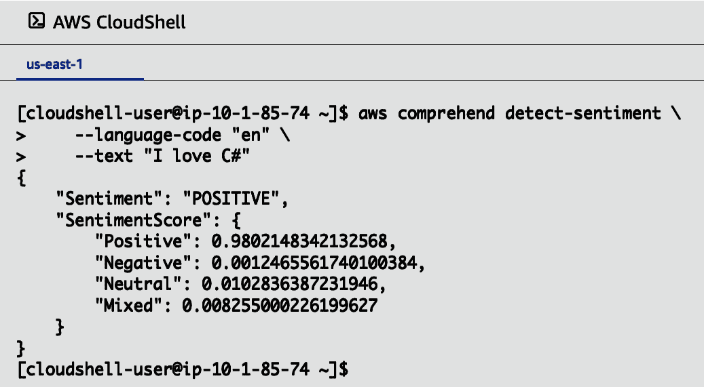

###### 图 8-8\. 异步列出存储桶

另一种探索此 API 的方法是通过动态地将网站上的文本输入到我们的 CLI 中。此步骤通过使用 `lynx` 实现。让我们运行这个命令来帮助我们确定维基百科上关于阿尔伯特·爱因斯坦的情感：

1.  首先，安装 `lynx`：

    ```cs
    sudo yum install lynx
    ```

1.  接下来，获取阿尔伯特·爱因斯坦的页面并将其导入到 less 中以便探索：

    ```cs
    lynx -dump https://en.wikipedia.org/wiki/Albert_Einstein | less
    ```

1.  通过使用 `wc -l`，我们得到行数统计：

    ```cs
    lynx -dump https://en.wikipedia.org/wiki/Albert_Einstein | wc -l
    ```

1.  要获取字节数，可以使用 `wc --bytes`：

    ```cs
    lynx -dump https://en.wikipedia.org/wiki/Albert_Einstein | wc \
     --bytes
    ```

    结果显示：

    ```cs
    432232
    ```

如果运行 `aws comprehend detect-sentiment help`，它只能处理 5000 字节。因此，我们需要截断输出。通过 `head` 进行截断，然后将其分配给 Bash 的 `TEXT` 变量：

```cs
TEXT=`lynx -dump https://en.wikipedia.org/wiki/Albert_Einstein | head -c 5000`
```

接下来，使用 `$TEXT` 的命令输出显示，维基百科围绕阿尔伯特·爱因斯坦的内容通常是 `NEUTRAL`，积极情感占 34%：

```cs
aws comprehend detect-sentiment --language-code "en" --text "$TEXT"
{
    "Sentiment": "NEUTRAL",
    "SentimentScore": {
        "Positive": 0.3402811586856842,
        "Negative": 0.0033634265419095755,
        "Neutral": 0.6556956768035889,
        "Mixed": 0.0006596834864467382
    }
}
```

Bash 命令行也常用于构建一个解决方案，并迅速转入另一个常见操作。在下面的示例中，我们切换到从同一块维基百科文本中检测实体。请注意，我们使用 `--output text` 利用 Bash 的强大功能来过滤输出：

```cs
aws comprehend detect-entities \
    --language-code "en" \
    --text "$TEXT" \
    --output text | head
```

命令的输出显示以下实体：

```cs
ENTITIES    20     29     0.632317066192627     Wikipedia          ORGANIZATION
ENTITIES    126    141    0.9918091297149658    Albert Einstein    PERSON
ENTITIES    151    160    0.7205400466918945    Wikipedia          ORGANIZATION
ENTITIES    230    236    0.9783479571342468    German             OTHER
ENTITIES    256    264    0.9940117001533508    Einstein           PERSON
ENTITIES    305    313    0.9899683594703674    Einstein           PERSON
ENTITIES    341    356    0.9821130633354187    Albert Einstein    PERSON
ENTITIES    379    394    0.990595817565918     Albert Einstein    PERSON
ENTITIES    401    409    0.814979076385498     Einstein           PERSON
ENTITIES    410    414    0.9937220215797424    1921               DATE
```

我们还可以进一步计算使用 Bash 找到的唯一实体的数量。下面的 Bash 管道将实体列转换为小写，然后格式化以便轻松计数不常见的出现。虽然不完美，但足以证明如何在进入 C# 之前使用 Bash 原型 API：

```cs
aws comprehend detect-entities \
    --language-code "en" \
    --text "$TEXT" \
    --output text \
    | cut -f 5 \
    | tr -cd "[:alpha:][:space:]" \
    | tr ' [:upper:]' '\n[:lower:]' \
    | tr -s '\n' \
    | sort \
    | uniq -c \
    | sort -nr -k 1 \
    | head
```

Bash 管道的输出显示我们发现了几个值得进一步探索的实体，至少是从提取的文本的初始部分来看。

```cs
     12 einstein
      9 of
      6 university
      4 german
      4 empire
      4 Albert
      3 kingdom
      2 Zurich
      2 wrttemberg
      2 Wikipedia
```

###### 注意

您还可以观看如何使用 Bash 从头开始提取实体的操作步骤，链接在 [O’Reilly](https://oreil.ly/NzKhQ) 或 [YouTube](https://oreil.ly/DwlYG) 上。

完成这些探索后，让我们开始用 C# 编写解决方案。

再次选择 Visual Studio 控制台应用程序，并按照 Figure 8-9 中所示的步骤通过 NuGet 安装 Comprehend。

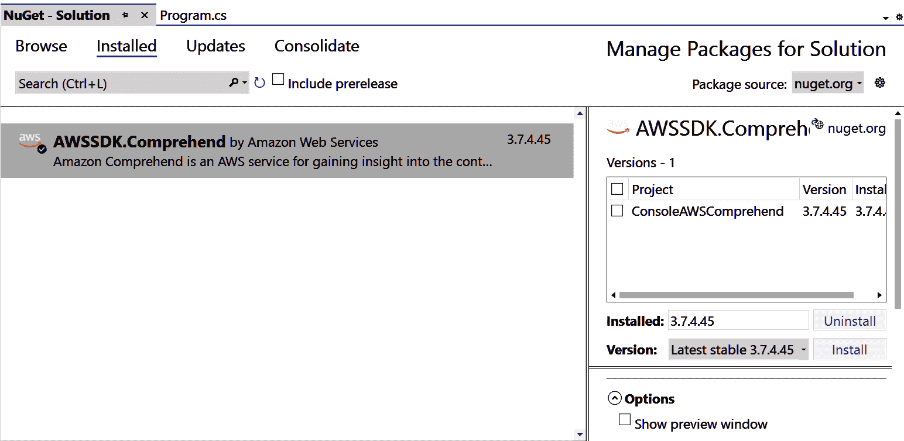

###### 图 8-9\. NuGet Comprehend 安装

使用 AWSSDK.Comprehend 包中服务类的 `DetectSentimentAsync()` 方法进行情感检测如下所示：

```cs
using Amazon;
using Amazon.Comprehend;
using Amazon.Comprehend.Model;

// Display title
Console.WriteLine("AWS AI API Sentiment Detector" + Environment.NewLine);

// Ask for phrase
Console.WriteLine("Type in phrase for analysis" + Environment.NewLine);
var phrase = Console.ReadLine();

// Detect Sentiment
var comprehendClient = new AmazonComprehendClient(RegionEndpoint.EUWest1);
Console.WriteLine("Calling DetectSentiment");

var detectSentimentResponse = await
comprehendClient.DetectSentimentAsync(
new DetectSentimentRequest()
{
    Text = phrase,
    LanguageCode = "en"
});
Console.WriteLine(detectSentimentResponse.Sentiment);
Console.WriteLine("Done");
```

运行控制台应用程序并输入一些文本，如 Figure 8-10 所示，显示我们的陈述是 `MIXED` 情感。

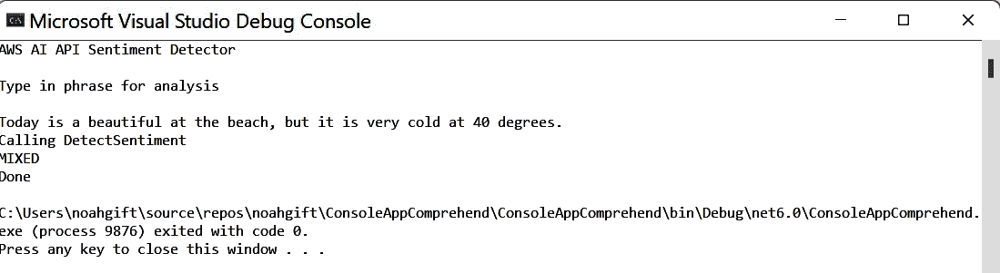

###### 图 8-10\. Comprehend 控制台应用的输出

###### 注

您还可以观看使用 C# 和 AWS Comprehend 的实例在 [O’Reilly](https://oreil.ly/bNhVs) 或 [YouTube](https://youtu.be/zhiNMmg8FxA) 上的演示。

本例中使用了 `DetectSentimentAsync()` 来检测文本的 *情感*（整体情绪）；然而，我们也可以通过调用 `client.DetectEntities()` 在文本中执行实体检测。AWS 在图像中也提供了实体检测服务，名为 AWS Rekognition。

## AWS Rekognition

Rekognition 是 AWS 的计算机视觉服务，适用于图像和视频。它提供了多个预训练的机器学习模型，以满足不同的图像识别需求，所有这些都可以通过易于使用的 API 在 .NET SDK 中使用，并采用按使用量付费的模式定价。您可以在 AWS 管理控制台中搜索“Rekognition”，点击“尝试演示”按钮，尝试使用自己的图像测试该服务。从这里，您可以上传来自您的设备的图像（或选择 AWS 提供的示例图像），并从预训练模型中选择一个。图 8-11 显示了 *标签检测* 算法的结果，正如您所见，AWS Rekognition 识别出这张图像中有 98.1% 的可能性是一只猫。²

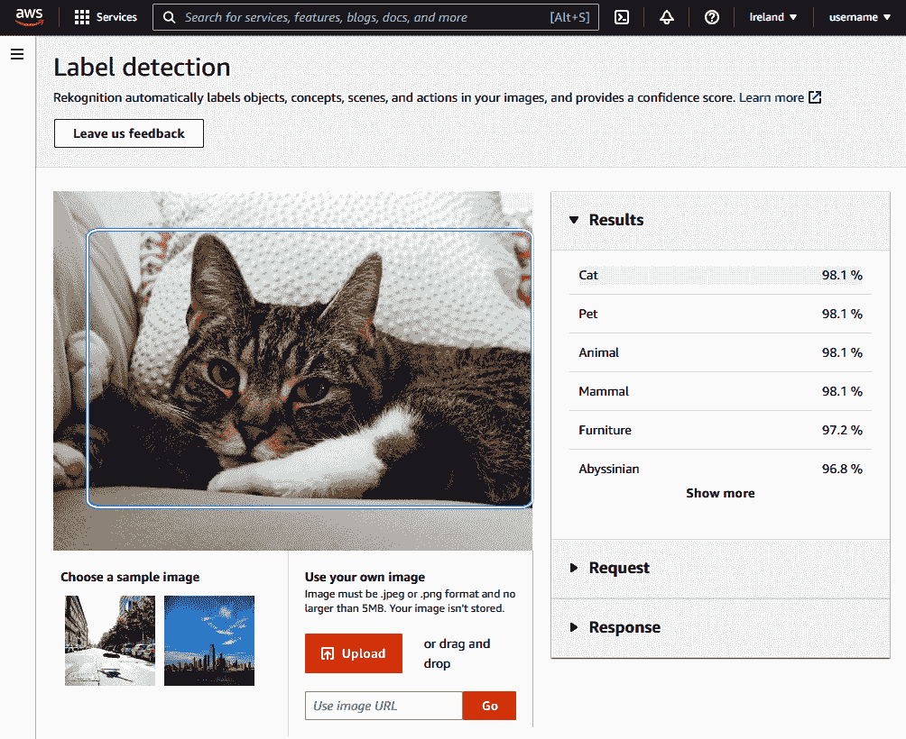

###### 图 8-11\. 通过管理控制台测试 Rekognition

从您的 C# 代码中调用 AWS Rekognition 就像安装 AWSSDK.Rekognition NuGet 包并利用 `Amazon.Rekognition.AmazonRekognitionClient` 服务类来调用 API 一样简单。您可以在本章早些部分看到的任何方式中注入或实例化这个服务类；在本例中，我们已经通过 `services.AddAWSService<IAmazonRekognition>();` 进行了注册：

```cs
using Amazon.Rekognition;
using Amazon.Rekognition.Model;
using Microsoft.AspNetCore.Mvc;

namespace AwsRekognitionExample.Controllers;

[Route("api/[controller]")]
public class ImageController
{
    private readonly IAmazonRekognition _rekognition;

    public ImageController(IAmazonRekognition rekognition)
    {
        _rekognition = rekognition;
    }

 [HttpGet]
    public async Task<string> GetFirstLabel()
    {
        var response = await _rekognition.DetectLabelsAsync(
            new DetectLabelsRequest
            {
                Image = new Image()
                {
                    S3Object = new S3Object()
                    {
                        Name = "cat.jpg",
                        Bucket = "photos-bucket",
                    },
                },
                MaxLabels = 10,
                MinConfidence = 75F,
            });

        return response.Labels.FirstOrDefault()?.Name ?? "None";
    }
}
```

在这个例子中，我们正在调用 `IAmazonRekognitionDetectLabelsAsync(...)` 并传递一个指向 S3 存储桶中图像的引用。Rekognition API 的工作方式是从 S3 存储桶加载图像数据，而不是在 HTTP 调用中接受图像数据来调用函数。在云原生 AWS 应用程序中，保存像图片这样的大数据文件到 S3，然后调用 AWS Rekognition 是一个良好的模式，因为它允许您设计一个事件驱动的系统。如果需要首先上传图像，您可以像我们在 “C# 简历上传示例：事件驱动” 中所做的那样利用 S3 触发器。

# 批判性思维讨论问题

+   在生产代码中调用 AWS SDK 的超时，会有哪些实际后果？

+   在生产系统中使用重试通信 AWS SDK 会有哪些实际后果？

+   使用 AWS SDK 进行异步通信可以启用哪些新的工作流程？

+   在生产系统中，哪些架构模式最具成本效益，以避免重复的 API 调用？

+   .NET 与 AWS 结合给您带来了哪些独特的优势？

# 练习

+   如果您尚未设置 AWS Toolkit for Visual Studio，请进行设置，并使用它创建一个新的 S3 存储桶，在存储桶内创建一个文件夹，最后从您的桌面上传图像或文件。

+   扩展 AWS Rekognition 示例，并将其转换为部署在 AWS App Runner 上的 Web 服务。

+   扩展 AWS Comprehend 示例，并将其转换为部署在 AWS App Runner 上的 Web 服务。

+   创建一个展示完全掌握.NET 在 AWS 上的作品集项目，展示端到端的开发技能，包括 IaC 和前端。

# 结论

在本书中我们已经多次使用了“云原生”这个术语，而且您在实际应用中也无疑遇到过它，但是让我们想一想它真正意味着什么以及为什么它很重要。云原生代码要么完全在云中运行，要么至少是为云进行了优化。通过以在 AWS 上专用运行代码的意图来编写我们的代码，我们可以更深入地与 AWS 服务集成，例如消息队列、数据库、日志记录和报告。如果我们的 C#代码是“云原生”的（即单词“本地”的词典定义），我们可以编写代码以最大程度地利用其周围的服务。当然，这其中存在一些权衡。如果您将应用程序架构为仅使用 AWS Lambda 函数，则本地开发将更加困难。如果您在每个执行路径中越来越多地集成 AWS X-Ray 跟踪以进行性能监控，则复杂性可能会呈指数增长。不过，通过性能、灵活性和通常情况下的成本获得的优势通常远远超过这些缺点。

请记住，无论您喜欢在 Visual Studio、VS Code 还是 Cloud9 中进行开发，都有适合您的 C# AWS 工作流程。自 Visual Studio 2008 以来，AWS Toolkit for Visual Studio 已经以一种形式或另一种形式存在，并定期更新以跟上 AWS 和 Visual Studio 本身的增强。工具包的最新版本甚至正在推出一种新的“发布到 AWS”体验，旨在使您将代码发布到云更加简单，允许您在将来要使用的环境中快速测试代码：云端。对于我们来说，我们喜欢 Cloud9，因为它可以无缝集成到 AWS 服务中，并且可以通过任何具有 Web 浏览器的地方进行访问。基于 Web 的集成开发环境并非人人都适合，但是如果您经常更换开发设备或使用便携或借用设备进行开发，那么能够从云中的任何地方访问您的代码可能会改变游戏规则。

亚马逊网络服务是全球范围内使用最广泛的云平台，自 2008 年以来一直在云中支持.NET。通过提供超过 200 种服务，从可以为任何想象的任务创建的简单 Windows 虚拟机，到本章中访问的机器学习服务，AWS 支持 485 种实例类型的.NET，255 种不同的适用于 Windows 工作负载的 AMI，以及 40 种预配置了.NET 或 SQL Server 的不同 Linux AMI。这意味着从您的 C#代码库部署到 AWS 并与之集成从未如此简单过。

在本书中，我们涵盖了许多您可以在应用程序中利用 AWS 的方式，但还有许多我们没有时间涉及的方式。有开源的.NET 工具，适用于 AWS CodeBuild 的 Windows 示例，用于利用物联网（IoT）服务的 MQTT 客户端，以及仅用于机器学习的 20 多种 AWS 服务。在这些服务中，AWS SageMaker 是一项允许您训练和部署自己的 ML 模型的服务，这个话题本身就足以填写一整本书。

然而，我们所涵盖的内容应该为您进入亚马逊的云服务提供了一个入口，并帮助您规划您的.NET 代码库的下一阶段开发。无论是迁移、容器化还是从头开始重写，我们希望这些页面上的主题能够为您提供足够的思考。

¹ 此处的示例仅使用了简单存储服务（S3）客户端；然而，这个同样适用于许多不同的 AWS 服务客户端，这些服务可能返回大量项目的方法上有`Paginators`属性。

² 我们几乎在没有包含詹姆斯的猫的照片的情况下完成了这本书。
