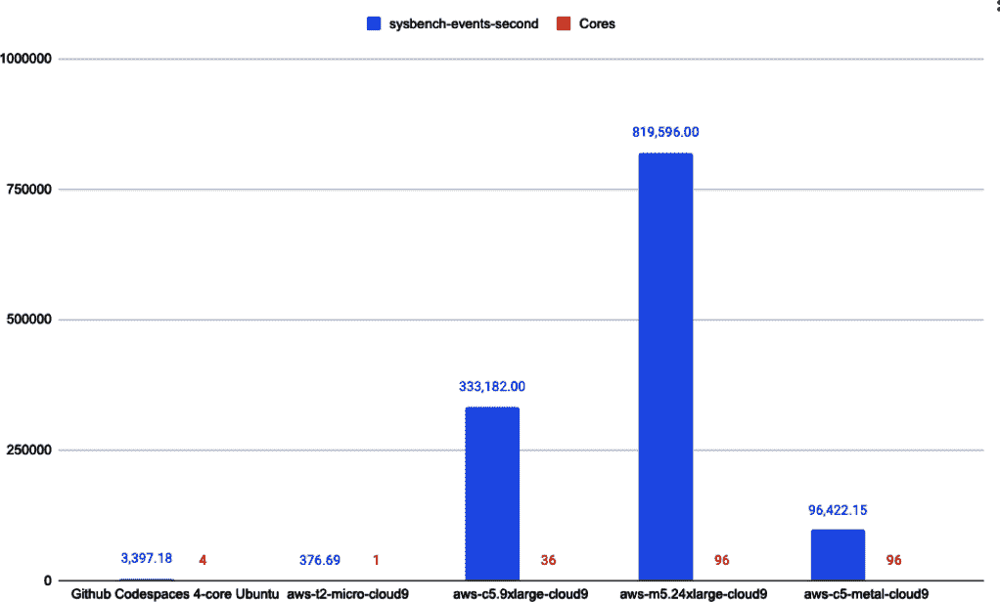

# 附录 A. AWS 的基准测试

深入了解 AWS 的一种方法是对不同机器的性能进行基准测试。 AWS 的价值之一是能够使用许多不同的服务和其他抽象化方法来以最有效的方式解决问题。 您可以在这个[基准测试的示例 GitHub 仓库](https://github.com/noahgift/benchmarking-aws)中查看许多代码示例。 请注意，从 1 核心到 36 核心再到 96 核心的 sysbench 基准测试显示了显著差异，如图 A-1 所示。



###### 图 A-1\. AWS 实例的基准测试

当您的组织确定在 Amazon Linux 2 上运行 .NET Core 的正确机器时，最好进行一些初始基准测试。 要在 Amazon Linux 2 上以可重复的方式运行这些基准测试，可以参考这个[`Makefile`](https://oreil.ly/IF5rR)。 请注意，`sysbench` 只需要两行来安装和运行 `./benchmark.sh` 脚本。

实际的基准测试脚本如下：

```cs
#!/usr/bin/env bash
CPU=`python -c "import multiprocessing as mp;print(f'{mp.cpu_count()}')"`
echo "Running with CPU Count and Threads: " $CPU
sysbench cpu --threads=$CPU run
```

`makefile` 命令可以作为 `make benchmark-sysbench-amazon` 运行：

```cs
benchmark-sysbench-amazon:
	#install sysbench
	curl -s https://packagecloud.io/install/repositories/akopytov/\
	sysbench/script.rpm.sh | sudo bash
	sudo yum -y install sysbench
	#run CPU benchmark
	./benchmark.sh
```

基准测试脚本使用“单行命令”来确定可用的核心数，然后将其传递给 CPU 基准测试：

```cs
#!/usr/bin/env bash

CPU=`python -c "import multiprocessing as mp;print(f'{mp.cpu_count()}')"`
echo "Running with CPU Count and Threads: " $CPU
sysbench cpu --threads=$CPU run
```

像[Cinebench](https://oreil.ly/ROql2)这样的免费工具可用于对 Windows 操作系统进行基准测试。 在实际部署应用程序的环境中执行多次测量，包括操作系统级别的基准测试和应用程序负载测试，总是一个好主意。
