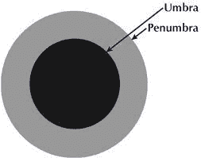

# 第一章：介绍

如果您之前学过很多编程 - 无论是 C#、Visual BASIC、Python 还是其他任何语言 - 那么您学到的很可能都是围绕着目前最主流的编程范式 - 面向对象编程。

面向对象编程已经存在了相当长的时间。确切的日期存在争议，但很可能是在 50 年代末 60 年代初某个时候发明的。

面向对象编码是围绕着将数据片段 - 称为属性 - 和功能包装成称为*类*的逻辑代码块的想法，这些类被用作从中实例化*对象*的模板。它涉及更多内容：继承，多态性，虚拟和抽象方法。诸如此类的各种东西。

然而，这并不是一本面向对象编程的书。事实上，如果您已经对面向对象有所了解，那么放下您已经掌握的知识，您可能会从本书中获得更多收获。

我在本书中要描述的是一种作为面向对象的替代的编程风格 - 函数式编程。尽管最近几年函数式编程开始得到一些主流认可，但它实际上和面向对象一样古老 - 甚至可能更古老。它基于数学原理，这些原理在 19 世纪末至 20 世纪 50 年代间由各种人开发，并自 1960 年代以来一直是一些编程语言的特征。

在本书中，我将向您展示如何在 C#中实现它，而无需学习全新的编程语言。

在我们开始编写代码之前，我想先讨论一下函数式编程本身。它是什么？我们为什么要感兴趣？最佳使用时机是什么？所有这些都是非常重要的问题。

# 什么是函数式编程？

函数式编程中有一些基本概念，其中许多概念名称相对晦涩，但实际上并不难理解。我会尽量在这里简单地阐述它们。

# 它是一种语言，一个 API，还是什么？

不，函数式编程不是 Nuget 中的语言或第三方插件库，它是一种*范式*。我指的是什么？虽然有更正式的范式定义，但我认为它是一种*编程风格*。就像吉他可以作为同样的乐器，但可以演奏许多，甚至是完全不同的音乐风格一样，一些编程语言也支持不同的工作风格。

函数式编程与面向对象编码一样古老，甚至可能更古老。我稍后会详细讨论其起源，但现在只需知道它并不新鲜，其理论不仅先于面向对象，而且大部分也先于计算机行业本身。

还值得注意的是，您可以像混合摇滚和爵士乐一样结合编程范式。它们不仅可以结合，而且有时候您可以利用每种范式的最佳特性来产生更好的最终结果。

编程范式有多种多样¹，但为简单起见，我只讨论现代编程中最常见的两种：

命令式

这在相当长的一段时间内是唯一的编程范式。过程化和面向对象（OO）属于此类。这些编程风格更直接地指导执行环境执行详细的步骤，即哪个变量包含哪些中间步骤，以及如何逐步详细执行过程。这通常是学校/大学/工作中教授的编程方式。

声明式

在这种编程范式中，我们不太关心如何精确实现目标，代码更接近描述最终过程中所需的内容，而细节（包括执行步骤的顺序等）更多地留在执行环境的控制中。这是函数式编程所属的类别。SQL 也属于此类，因此在某些方面，函数式编程更接近 SQL 而不是 OO。在编写 SQL 语句时，你不关心操作的顺序（实际上并不是 SELECT 然后 WHERE 然后 ORDER BY），也不关心数据转换的具体细节，你只需编写一个有效描述所需输出的脚本。这些也是函数式 C#的一些目标，因此那些具有与 SQL Server 或其他关系数据库的背景的人可能会发现一些相关的想法更容易理解。

除了这些之外，还有许多其他编程范式，但它们远超出本书的范围。公平地说，除了这两种以外，大多数都相当隐晦，因此你不太可能在短时间内遇到它们。

## 函数式编程的特性

在接下来的几节中，我将讨论函数式编程的每一个特性，以及它们对开发者的实际意义。

### 不可变性

如果某物体能够*改变*，那么它也可以说是*变异*，就像一个少年变异忍者²。另一种说法是，某物体可以变异，这意味着它是*可变的*。另一方面，如果某物体根本不能改变，那么它是*不可变的*。

在编程中，这指的是变量在定义时设置其值，并且在此后永远不可更改。如果需要新值，则应基于旧值创建一个新变量。这是函数式代码中所有变量的处理方式。

这与命令式代码略有不同，但最终会产生更接近数学运算的程序，鼓励良好的结构和更可预测的、因此*更健壮*的代码。

`.NET`中`DateTime`和`String`都是不可变数据结构。你可能*认为*你已经改变了它们，但在幕后，每个改变都在堆栈上创建了一个新项。这就是为什么大多数新开发者在`For`循环中连接字符串时会被提醒，以及为什么你绝对不应该这样做的原因。

### 高阶函数

这些是作为变量传递的函数。这可以是作为局部变量、函数的参数或函数的返回值。`Func<T,TResult>`或`Action<T>`委托类型就是这种情况的完美示例。

如果您不熟悉这些委托，这是它们的简要工作原理。

它们都是以变量形式存储的函数。它们都接受一组泛型类型，这些类型表示它们的参数和返回类型（如果有的话）。`Func`和`Action`之间的区别在于`Action`不返回任何值 - 即它是一个不包含`return`关键字的`void`函数。在`Func`中列出的最后一个泛型类型是它的返回类型。

这些函数：

```cs
// Given parameters 10 and 20, this would output the following string:
// "10 + 20 = 30"
public string ComposeMessage(int a, int b)
{
 return a + " + " + b + " = " + (a + b);
}

public void LogMessage(string a)
{
 this.Logger.LogInfo("message received: " + a);
}
```

可以像这样重写为委托类型：

```cs
Func<int, int, string> ComposeMessage =
 (a, b) => a + " + " + b + " = " + (a + b);

Action<string> LogMessage = a =>
 this.Logger.LogInfo($"message received: {x}");
```

这些委托类型可以像普通函数一样被调用：

```cs
var message = ComposeMessage(10, 20);
LogMessage(message);
```

使用这些委托类型的一个重大优势是它们存储在可以在代码库中传递的变量中。它们可以作为其他函数的参数或返回类型包含在内。正确使用时，它们是 C#中更强大的特性之一。

使用函数式编程技术，委托类型可以组合在一起，从较小的功能构建块中创建更大、更复杂的函数。就像乐高积木一样，将它们放在一起来组成一个*千年隼号*模型，或者你喜欢的其他任何东西。这就是为什么这种编程范式被称为**函数式**编程的真正原因，因为我们用*函数*来构建我们的应用程序，而不是像名字所暗示的那样，其他范式中的代码不起作用。如果它们没有作用，为什么会有人使用它们呢？

实际上 - 对你来说的一个经验法则。如果有疑问，函数式编程的答案几乎肯定是“函数、函数和更多函数”。

###### 注意

有两种可调用的代码模块。函数和方法。区别在于函数总是返回一个值，但方法不返回。在 C#中，函数返回某种数据，而方法的返回类型是`void`。方法几乎不可避免地涉及副作用，因此在我们的代码中应尽量避免使用它们 - 除非无法避免。日志记录可能是方法的一个使用示例，这不仅是无法避免的，而且对于良好的生产代码也是必不可少的。

### 表达式而非语句

这里需要一些定义。

*表达式*是评估为值的离散代码单元。我是什么意思？

在其最简单的形式中，这些是表达式：

```cs
const int exp1 = 6;
const int exp2 = 6 * 10;
```

我们也可以传递值来形成我们的表达式，所以这也是其中之一：

```cs
public int AddTen(int x) => x + 10;
```

这也是。它执行一个操作 - 即评估一个布尔值，但最终用于返回一个 `bool`，所以它是一个表达式：

```cs
public bool IsTen(int x) => x == 10;
```

如果纯粹用于确定要返回的值，你还可以将三元 `if` 语句视为表达式：

```cs
var randomNumber = this._rnd.Generate();
var message = randomNumber == 10
 ? "It was ten"
 : "it wasn't ten";
```

另一个快速的经验法则 - 如果一行代码有一个等号，那么它很可能是一个表达式，因为它正在为某个东西赋值。在这条规则中存在一些灰色地带。对其他函数的调用可能会有各种意想不到的后果。但把它记在心里还是个不错的主意。

*语句* 另一方面是一些不评估数据的代码片段。这些更像是一个指令，告诉执行环境通过关键字如 `if`、`where`、`for`、`foreach` 等改变执行顺序，或者调用不返回任何东西的函数 - 由此暗示进行某种操作。像这样：

```cs
this._thingDoer.GoDoSomething();
```

还有一个经验法则³，如果没有等号，那肯定是一个语句。

#### 基于表达式的编程

如果有帮助的话，回想一下你在学校时的数学课。还记得在得出最终答案时你必须写出的那些计算过程吗？基于表达式的编程就像那样。

每一行都是一个完整的计算，建立在一个或多个前面的行基础之上。通过编写基于表达式的代码，你在函数运行时留下了你的工作成果，一劳永逸。除了其他好处外，这样做更容易调试，因为你可以回顾所有先前的值，并且知道它们没有被循环的先前迭代或其他任何因素更改。

这可能看起来像是一个不可能完成的任务，几乎就像是让你绑起手臂来编程一样。但完全有可能，而且并不一定困难。在 C# 中，大多数工具已经有了大约十年的历史，而且还有许多更有效的结构。

这里是一个我所说的例子：

```cs
public decimal CalculateHypotenuse(decimal b, decimal c)
{
 var bSquared = b * b;
 var cSquared = c * c;
 var aSquared = bSquared + cSquared;
 var a = Math.Sqrt(aSquared);
 return a;
}
```

现在严格来说，你可以将它写成一行，但看起来可能不那么美观和易读易懂，对吧？为了保存所有中间变量，我也可以像这样写：

```cs
public decimal CalculateHypotenuse(decimal b, decimal c)
{
 var returnValue = b * b;
 returnValue += c * c;
 returnValue = Math.Sqrt(returnValue);
 return returnValue;
}
```

这里的问题在于没有变量名会使得阅读起来有点困难，并且所有的中间值都会丢失 - 如果存在 bug，我们必须逐步检查每个阶段的 `returnValue`。而在基于表达式的解决方案中，所有的工作都保留在原地。

在这种方式下工作一段时间后，回到旧方式实际上会显得有些奇怪，甚至有些笨拙和累赘。

### 引用透明性

这听起来像是一个简单概念的可怕名称。在函数式编程中有一个叫做“纯函数”的概念。这些函数具有以下属性：

+   它们不会对函数外的任何东西进行更改。不会更新状态，不会存储文件，等等。

+   给定相同的参数值集合，无论系统处于什么状态，它们始终返回完全相同的结果。无论如何，没有例外。

+   它们不会有任何意外的副作用。抛出异常也包括在内。

这些术语源自这样一个观念：给定相同的输入，总是得到相同的输出，因此在计算中，您基本上可以用函数调用交换最终值，只要这些输入存在。例如：

```cs
var addTen = (int x) => x + 10;
var twenty = addTen(10);
```

使用参数为 10 调用 addTen 将始终计算为 20，没有任何异常。在这么简单的函数中也不可能存在任何副作用。因此，可以在原则上将对 addTen(10) 的引用替换为常量值 20 而没有副作用。这就是引用透明度。

这里是一些纯函数：

```cs
public int Add(int a, int b) => a + b;

public string SayHello(string name) => "Hello " +
 (string.IsNullOrWhitespace(name)
  ? "I don't believe we've met.  Would you like a Jelly Baby?"
  : name);
```

注意不能发生任何副作用（我确保字符串包含了空检查），函数外部没有任何改变，只生成并返回了一个新值。

这里是这些相同函数的不纯版本：

```cs
public void Add(int a) => this.total += a; // Alters state

public string SayHello() => "Hello " + this.Name;
// Reads from state instead of a parameter value
```

在这两种情况下，都引用了当前类的属性，这超出了函数本身的范围。Add 函数甚至修改了该状态属性。SayHello 函数也没有空检查。所有这些因素意味着我们不能将这些函数视为“纯”的。

这些如何？

```cs
public string SayHello() => "Hello " + this.GetName();

public string SayHello2(Customer c)
{
 c.SaidHelloTo = true;
 return "Hello " + (c?.Name ?? "Unknown Person");
}

public string SayHello3(string name) =>
 DateTime.Now + " - Hello " + (name ?? "Unknown Person");
```

这些都不太可能是纯的。

SayHello 依赖于函数本身之外的功能。我并不确切知道 `GetName()` 做了什么⁴。如果它只是返回一个常量，那么我们*可以*认为 `SayHello()` 是纯的。另一方面，如果它在数据库表中进行查找，那么可能会出现缺少数据或丢失网络数据包导致抛出错误，这些都是意外副作用的例子。如果必须使用函数来检索名称，我会考虑使用 `Func<T, TResult>` 委托来安全地将功能注入到我们的 SayHello 函数中。

SayHello2 修改了传入的对象 - 这是使用该函数的一个明显副作用。通过引用传递对象并像这样修改它们在面向对象编程中并不罕见，但在函数式编程中绝对不会这样做。我可能会通过将对象属性的更新和打招呼的处理分离为不同的函数来使其成为纯函数。

SayHello3 使用了 `DateTime.Now`，每次使用时返回不同的值。这与纯函数的完全相反。修复的一种简单方法是在函数中添加一个 `DateTime` 参数，并将该值传递进去。

引用透明度是显著增加功能代码可测试性的特征之一。这意味着必须使用其他技术来跟踪状态，稍后我会详细说明。

在我们的应用程序中，尤其是一旦我们不得不与外界，用户或一些不遵循函数范式的第三方库进行交互时，我们的“纯度”存在一定的限制。在这里或那里，我们总是不得不做出妥协。

在这一点上，我通常喜欢引用一个比喻。影子有两部分：本影和半影⁵。本影是影子的实心黑暗部分，事实上大部分影子都是本影。半影是围绕外部的灰色模糊圆圈，是影子和非影子相遇的部分，一个渐变为另一个的部分。在 C#应用程序中，我想象纯粹代码区域是本影，而妥协区域是半影。我的任务是最大化纯粹区域，并尽可能减少非纯粹区域。



如果你想要这种架构模式的更正式定义，Gary Bernhardt 曾在演讲中称其为功能核心，命令式外壳⁶。

### 递归

如果你不理解这个，请参见：递归，否则请参见：说真的，递归

### 说真的，递归

递归几乎存在于编程的整个历史中。它是一个调用自身以实现无限（但希望不是无限的）循环的函数。这对于曾经编写过用于遍历文件夹结构或编写高效排序算法的人来说应该是熟悉的。

递归函数通常分为两部分：

+   条件，用于确定是否应再次调用函数，或者是否已达到最终状态（例如已找到我们正在计算的值，没有子文件夹可探索等）。

+   返回语句，它要么返回最终值，要么引用同一个函数，具体取决于最终状态条件的结果。

这里是一个非常简单的递归加法⁷：

```cs
public int AddUntil(int startValue, int endValue)
{
	if (startValue >= endValue)
		return startValue;
	else
		return AddUntil(startValue + 1, endValue);
}
```

尽管上述例子很愚蠢，但请注意，我从未更改任何参数整数的值。递归函数的每次调用都使用基于其自身接收的值的参数值。这是*不可变性*的另一个例子 - 我没有改变变量中的值，而是使用基于接收到的值的表达式调用函数。

递归是函数式编程用作替代 While 和 ForEach 语句的方法之一。然而，在 C#中存在一些性能问题。稍后将会有一个章节来更详细地讨论递归，但现在请谨慎使用，并跟随我的步伐。一切将会变得清晰...​

### 模式匹配

在 C# 中，这基本上就是带有“加速”条纹的 `Switch` 语句。不过，F# 将这个概念推向了更深的层次。在几个版本后，我们已经在 C# 中实现了这一概念，C# 8 中引入的 `Switch` 表达式就是我们自己的本地实现，而 Microsoft 团队一直在不断增强它。

它可以根据对象的类型和属性改变执行路径，可以用来减少一组大量嵌套的 if 语句，例如这样：

```cs
public int NumberOfDays(int month, bool isLeapYear)
{
 if(month == 2)
 {
  if(isLeapYear)
   return 29;
  else
   return 28;
 }
 if(month == 1 || month == 3 || month == 5 || month == 7 ||
  month == 8 || month == 10 || month == 12)
   return 31;
  else
   return 30;
}
```

简化为几行，像这样：

```cs
public int NumberOfDays(int month, bool isLeapYear) =>
	(month, isLeapYear) switch
	{
		{ month: 2, isLeapYear: true } => 29,
		{ month: 2 } => 28,
		{ month: 1 or 3 or 5 or 7 or 8 or 10 or 12 } => 31,
		_ => 31
	};
```

这是一个令人难以置信且强大的特性，也是我最喜欢的事情之一⁸。

在接下来的几章中会有许多这样的例子，如果你对看到更多关于这一切的内容感兴趣的话，可以跳过。

此外，对于那些仍在使用旧版本的 C# 的人来说，有实现这一方法的方式，稍后我将展示一些技巧。

### 无状态的

面向对象的代码通常有一组状态对象，它们表示一个过程 - 真实的或虚拟的。这些状态对象定期更新，以保持与它们所代表的内容同步。例如像这样的东西：

```cs
public class DoctorWho
{
	public int NumberOfStories { get; set; }
	public int CurrentDoctor { get; set; }
	public string CurrentDoctorActor { get; set; }
	public int SeasonNumber { get; set; }
}

public class DoctorWhoRepository
{
	private DoctorWho State;

	public DoctorWhoRepository(DoctorWho initialState)
	{
		this.State = initialState;
	}

	public void AddNewSeason(int storiesInSeason)
	{
		this.State.NumberOfStories += storiesInSeason;
		this.State.SeasonNumber++;
	}

	public void RegenerateDoctor(string newActorName)
	{
		this.State.CurrentDoctor++;
		this.State.CurrentDoctorActor = newActorName;
	}
}
```

好吧，如果你想要进行函数式编程，就永远不要再做那种事了。没有一个中心状态对象的概念，也没有修改其属性的概念，就像上面的代码示例中一样。

真的吗？感觉像是最纯粹的疯狂，不是吗？严格来说，确实有一个状态，但更多地是系统的 emergent property。

任何曾经使用 React-Redux 的人已经接触过状态的函数式方法（这反过来又受到函数式编程语言 *Elm* 的启发）。在 Redux 中，应用程序状态是一个不可变对象，不进行更新，而是由开发者定义一个函数，该函数接受旧状态、一个命令和任何必要的参数，然后基于旧状态返回一个新的状态对象。在 C# 9 中引入 Record 类型后，这个过程变得非常容易。稍后我会详细讨论这个问题。但现在，关于如何重构其中一个存储库函数以函数方式运行的简单版本，可能会是这样：

```cs
  public DoctorWho RegenerateDoctor(DoctorWho oldState, string newActorName)
  {
    return new DoctorWho
    {
      NumberOfStories = oldState.NumberOfStories,
      CurrentDoctor = oldState.CurrentDoctor + 1,
      CurrentDoctorActor = newActorName,
      SeasonNumber = oldState.SeasonNumber
    };
  }
```

显然，在外部使用时，它的使用方式会有所不同。事实上，现在称其为存储库可能有点错误。稍后我将更多地讨论编写无状态对象代码所需的策略。希望这足以让你了解函数式代码的工作方式。

# 烘焙蛋糕

如果你想对这些范式之间的差异稍微高级一点的描述。这是它们如何都能制作蛋糕⁹：

## 一个命令式的蛋糕

这不是真正的 C# 代码，只是一种 .NET 主题的伪代码，用来给这个虚构的问题提供命令式解决方案的印象。

```cs
Oven.SetTemperatureInCentigrade(180);
for(int i=0; i < 3; i++)
{
	bowl.AddEgg();
	bool isEggBeaten = false;
	while(!isEggBeaten)
	{
		Bowl.BeatContents();
		isEggBeaten = Bowl.IsStirred();
	}
}
for(int i == 0; i < 12; i++)
{
	OvenTray.Add(paperCase[i]);
	OvenTray.AddToCase(bowl.TakeSpoonfullOfContents());
}
Oven.Add(OvenTray);
Thread.PauseMinutes(25);
Oven.ExtractAll();
```

对我来说，这代表了典型的复杂的命令式代码。有很多小的短暂变量用来跟踪状态。它也非常关注事情的精确顺序。更像是给一个完全没有智能的机器人的指令，需要一切都明确指出。

## 一个声明式的蛋糕

下面是一个完全虚构的声明式代码可能如何解决同样问题的例子：

```cs
  Oven.SetTemperatureInCentigrade(180);
  var cakeBatter = EggBox.Take(3)
    .Each(e => Bowl.Add(e)
                   .Then(b =>
                       b.While(x => !x.IsStirred, x.BeatContents())
                     )
                   )
          .DivideInto(12)
      .Each(cb =>
        OvenTray.Add(PaperCaseBox.Take(1).Add(cb))
      );
```

如果你对函数式编程不熟悉，现在看起来可能有些奇怪和不寻常，但在这本书的过程中，我将解释这一切是如何工作的，其好处是什么，以及如何在 C#中自己实现这一切。

不过，值得注意的是，这里没有状态跟踪变量，也没有`If`或`While`语句。我甚至不确定操作的顺序一定是什么，但这并不重要，因为系统会按需完成任何必要的步骤。

这更像是给一个稍微聪明一点的机器人的指令。至少可以自己思考一下，至少在过程式代码中可以通过组合一个 While 循环和一些状态跟踪代码行来存在“直到某种状态存在”的指令。

# 函数式编程从何而来？

我想先澄清一件事，尽管有些人可能会这么认为，函数式编程已经存在很久了。*真的* 很久了 - 至少从计算的角度来看是这样。我的观点是 - 它不像是最新潮的 JavaScript 框架，今年很火，明年就可能过时了。它比所有现代编程语言甚至计算本身都要古老。函数式编程比我们任何人都要早，而且很可能在我们都退休之后仍然存在。我稍微有些强调的观点是，投资时间和精力来学习和理解它是值得的。即使有一天你发现自己不再在 C#中工作，大多数其他编程语言都在不同程度上支持函数式概念（JavaScript 在某种程度上甚至超越了大多数语言的梦想），因此这些技能在你职业生涯的其余部分仍然很重要。

在我继续本节之前，有一个小提示 - 我不是数学家。我喜欢数学，它是我在学校、大学和大学里最喜欢的科目之一，但最终会有一个更高层次的理论数学，即使是我自己也会眼花缭乱，头疼。话虽如此，我会尽力简要地谈谈函数式编程究竟来自哪里。实际上，它来自于那个理论数学的世界。

大多数人能够提及的函数式编程历史上的第一位人物通常是哈斯克尔·布鲁克斯·柯里（1900-1982 年），一位美国数学家，他现在有至少三种以他命名的编程语言，以及函数式概念“柯里化”（稍后详述）。他的工作是在称为“组合逻辑”的东西上进行的 - 一种涉及以 lambda（或箭头）表达式形式编写函数，然后组合它们以创建更复杂逻辑的数学概念。这是函数式编程的基础。尽管柯里并不是第一个研究这个问题的人，但他是在他的数学前辈撰写的论文和书籍之后。

+   阿隆佐·丘奇（1903-1955 年，美国人） - 正是丘奇创造了我们今天在 C#等语言中使用的“Lambda 表达式”这一术语。

+   摩西·绍恩菲克尔（1888-1942 年，俄罗斯人） - 绍恩菲克尔撰写了有关组合逻辑的论文，这是哈斯克尔·柯里工作的基础之一。

+   弗里德里希·弗雷格（1848-1925 年，德国人） - 可以说是首个描述我们现在称之为柯里化的概念的人。尽管很重要要正确地归功于发现者，但弗雷格并不完全拥有同样的影响力。

第一批函数式编程语言是：

+   IPL（信息处理语言），由艾伦·纽厄尔（1927-1992 年，美国人）、克利夫·肖（1922-1991 年，美国人）和赫伯特·西蒙（1916-2001 年，美国人）于 1956 年开发。

+   LISP（LISt Processor），由约翰·麦卡锡（1927-2011 年，美国人）于 1958 年开发。据说，LISP 至今仍有一些忠实的粉丝，并且在一些企业中仍在生产使用。不过我个人从未见过直接的证据。

有趣的是，这两种语言都不被称为“纯”函数式语言。像 C#、Java 和许多其他语言一样，它们采用了一种混合的方法，不像现代的“纯”函数式语言，如 Haskell 和 Elm。

我不想过多地谈论（尽管有趣的）函数式编程的历史，但希望从我展示的内容中很明显，它有着悠久而辉煌的传统。

# 还有谁在进行函数式编程？

正如我之前所说，函数式编程已经存在了一段时间，不只是.NET 开发人员对其表现出兴趣。相反，许多其他语言比.NET 提供了更长时间的函数式范式支持。

我说支持是指它提供了在函数式范式中实现代码的能力。这大致有两种风味：

纯函数式语言

旨在让开发人员专门编写函数式代码。所有变量都是不可变的，提供了柯里化、高阶函数等功能。这些语言可能也能实现一些面向对象的特性，但这显然不是开发团队的首要关注点。

混合或多范式语言

这两个术语可以完全互换使用。它们描述了能够在两种或更多范式中编写代码的编程语言。通常同时支持的范式是功能性和面向对象的。可能不存在任何支持范式的完美实现。通常情况下，面向对象可能完全支持，但并非所有功能性的特性都可用。

## 纯功能性编程语言

现在有超过十几种纯功能语言，这里简要介绍今天使用最广泛的三种：

Haskell

Haskell 在银行业被广泛使用。对于任何真正想深入掌握功能性编程的人来说，它经常被推荐作为一个很好的起点。这可能确实如此，但老实说，我没有时间和精力去学习一门我在日常工作中根本不打算使用的完整编程语言。

如果你真的有兴趣在在工作前先成为一个功能范式的专家，那么请务必去寻找 Haskell 的内容。一个经常推荐的资源是 Miran Lipovača 的《Learn You a Haskell For Great Good》¹¹。我自己从未读过这本书，但我的朋友们读过并称赞它很棒。

Elm

Elm 似乎最近有些流行起来，即使只是因为 Elm 在 UI 中执行更新的系统已被许多其他项目采纳和实施，包括 ReactJS。这种“Elm 架构”是我想留到后面章节讨论的内容。

Elixir

基于与 Erlang 相同的虚拟机的通用编程语言。它在工业界非常流行，甚至每年都有自己的会议。

PureScript

PureScript 编译成 JavaScript，因此可以用于创建功能性的前端代码，以及服务器端代码和在等距编程环境中创建桌面应用程序——例如 Node.JS，它允许在客户端和服务器端使用同一种语言。

## 学习一门纯功能语言是否值得？

至少在目前，面向对象在绝大多数软件开发世界中占主导地位，功能性范式则是后来才需要学习的。我不排除将来可能会有所改变，但目前至少我们处于这种情况中。

我听到有人争论说，从面向对象来看，最好先学习其纯形式的功能性编程，然后再回来将这些学习应用在 C#中。

如果这是你想做的事情，那就去做吧。愉快地享受吧。我毫不怀疑这是一个值得的努力。

对我来说，这个观点让我想起了我们这里曾经有的那些老师，他们坚持认为孩子们应该学习拉丁语，因为作为许多欧洲语言的根源，拉丁语的知识可以很容易地转移到法语、意大利语、西班牙语等。

我在某种程度上不同意这一点¹²。与拉丁语不同，纯函数式语言不一定是*困难*的，尽管它们与面向对象开发非常不同。事实上，与面向对象相比，FP 的概念要少得多。话虽如此，那些在整个职业生涯中深度参与面向对象开发的人可能会发现调整更为困难。

然而，拉丁语和纯函数式语言的相似之处在于它们代表了更纯粹、祖先的形式。它们在少数专业兴趣领域之外的价值都很有限。

学习拉丁语几乎完全是*无用*的，除非你对法律、古典文学、古代历史等感兴趣。学习现代法语或意大利语更有用得多。它们远比拉丁语易学，而且你可以*现在*用它们去访问美丽的地方并与那里的友好人士交流。比利时也有一些很棒的法语漫画。去看看吧，我会等你的。

同样地，很少有地方会真正将纯函数式语言用于生产。你将会花费大量时间完全改变你的工作方式，并最终学习一门你可能永远不会在自己的业余代码之外使用的语言。我已经做这个工作很长时间了，到目前为止，我从未遇到过一家公司在实际生产中使用比 C# 更先进的东西。

C# 的美妙之处在于它支持面向对象*和*函数式风格的代码，因此您可以根据需要在它们之间切换。您可以在同一个代码库中舒适地使用其中一个范式或另一个范式的许多特性，而无需任何惩罚。这两种范式可以在同一代码库中相对轻松地并存，因此您可以以适合自己的节奏从纯面向对象转向函数式，反之亦然。

纯函数式语言中是不可能的，即使 C# 中有很多函数式特性是不可能的。

## 那么 F# 呢？我应该学习 F# 吗？

这可能是我经常被问到的最常见的问题。那么 F# 呢？它并不是一种纯函数式语言，但是它更接近于正确实现这种范式而不是 C#。它拥有各种各样的函数式特性，可以直接使用，并且编码简单且性能出色 - 为什么不使用呢？

在回答这个问题之前，我总是喜欢检查房间里的出口情况。F# 有一群热情的用户，他们可能都比我聪明¹³。但是……

这不是因为 F# 难学。从我看来，它确实容易学习，如果你完全是编程新手，那它很可能比 C# 更容易学习。

并不是说 F# 不会带来商业利益，因为我真诚地相信它会。

并不是说 F# 不能做任何其他语言能做的事情。它肯定可以。我见过一些关于如何制作全栈 F# Web 应用程序的令人印象深刻的演讲。

这是一个专业决定。在我去过的每个国家，至少找到 C#开发者并不困难。如果我要把大型开发者大会的每个与会者的名字都放在帽子里，随机抽取一个，那么这个人很可能能够专业地编写 C#代码。如果团队决定投资于 C#代码库，那么保持团队中有足够工程师来保持代码的良好维护，让业务相对满意，将不会是一件艰难的事情。

另一方面，了解 F#的开发人员相对较少。我认识的不多。通过在代码库中加入 F#，你可能会依赖团队确保始终有足够的了解 F#的人可用，否则可能会冒一些代码难以维护的风险，因为了解该语言的人数不多。

我应该指出，风险并不像引入全新技术那样高，比如说 Node.JS。F#仍然是一种.NET 语言，编译成相同的中间语言。你甚至可以在同一个解决方案中轻松引用 F#项目和 C#项目。然而，对于大多数.NET 开发者来说，这仍然是一种完全陌生的语法。

随着时间的推移，我坚定地希望这种情况会有所改变。我非常喜欢我所看到的 F#，并且我很愿意做更多相关工作。如果我的老板告诉我，已经做出了采纳 F#的业务决定，我会第一个欢呼！

事实是，目前这种情况并不是真正的可能性。谁知道未来会带来什么变化。也许这本书的将来版本将不得不进行大幅修改，以适应突然兴起的对 F#的热爱，但就目前而言，我看不到这种情况在近期会发生。

我建议先试读这本书。如果你喜欢所见的内容，也许 F#可能会是你下一个函数式编程之旅的目的地。

## 多范式语言

可能可以认为除了纯函数式语言之外的所有语言都是某种形式的混合语言。换句话说，至少可以实现一些函数式编程范式的一些方面。这可能是真的，但我只是简要地看一下一些完全或大部分可以实现这一特性的语言，并且这些语言团队明确提供了这一功能。

JavaScript

JavaScript 当然几乎就像编程语言的狂野西部，几乎任何事情都可以用它来实现，并且它在函数式编程方面表现得非常出色。可以说它在函数式编程方面表现得比面向对象编程还要好。如果你想了解如何正确地使用 JS 进行函数式编程，请查看 Douglas Crockford 的《JavaScript: The Good Parts》以及他的一些在线讲座（例如[`www.youtube.com/watch?v=_DKkVvOt6dk`](https://www.youtube.com/watch?v=_DKkVvOt6dk)）。

Python

Python 迅速成为了开源社区的最爱编程语言，就在过去的几年里。让我惊讶的是它竟然存在于 80 年代末期！Python 支持高阶函数，并提供了一些库：*itertools* 和 *functools*，以允许进一步实现函数式特性。

Java

Java 平台对函数式特性的支持与.NET 相同。此外，还有一些分支项目，如 Scala、Clojure 和 Kotlin，提供的函数式特性远远超过了 Java 语言本身。

F#

我已经在前一节中详细讨论过这个问题，所以现在我不会再多说了。这是.NET 更纯粹的函数式风格语言。C#和 F#库之间也可以进行互操作性，因此您可以使用两者的最佳功能来构建项目。

C#

微软自从早期就慢慢地添加了对函数式编程的支持。可以说，委托协变性和 C# 2.0 中的匿名方法的引入可能被认为是支持函数式范式的第一个项目。事情真正开始启动是在接下来的一年，当 C# 3.0 引入我认为是迄今为止添加到 C#中的最具变革性的功能之一时- LINQ。

我稍后会详细讨论它，但 LINQ 深深植根于函数式范式，并且是我们开始编写 C#函数式代码的最佳工具之一。事实上，C#团队明确规定，每个发布的 C#版本都应比之前的版本更加支持函数式编程。驱使这一决定的因素有很多，其中之一就是 F#，它经常向.NET 运行时团队请求 C#最终也会从中受益的新的函数式特性。

# 函数式编程的好处

我希望你拿起这本书是因为你已经对函数式编程心生兴趣，并且想要立即开始。对于团队讨论是否在工作中使用它，本节可能会有所帮助。

## 简洁

尽管不是函数式编程的特性，但我最喜欢的许多好处之一就是它看起来多么简洁和优雅，与面向对象或命令式代码相比。

其他代码风格更关注于*如何*做某事的低级细节，以至于有时候甚至需要大量的代码来弄清楚这个*某事*到底是什么。函数式编程更注重描述*需要什么*。为了实现这个目标，精确地更新哪些变量以及何时更新这些变量的细节不是我们关心的重点。

我曾经与一些开发者讨论过这个问题，他们不喜欢减少与数据处理底层的参与度的想法，但我个人更愿意让执行环境来处理这个问题，这样我就少了一件需要关心的事情。

这似乎是一个小事情，但我真的很喜欢函数式代码相对于命令式替代方法的简洁性。开发者的工作是一项困难的工作¹⁴，我们经常要处理需要快速掌握的复杂代码库。如果你很难理解一个函数到底做了什么，那么企业为支付你的这个费用，而不是编写新代码而损失的钱会越多。函数式代码通常以接近自然语言的方式描述正在完成的工作。这也使得查找错误变得更容易，进而节省了企业的时间和金钱。

## 可测试

很多人称函数式编程的一个最喜欢的特性是它的测试性。事实上，它确实如此。如果你的代码库不能接近 100%地进行测试，那么有可能你没有正确地遵循这种编程范式。

测试驱动开发（TDD）和行为驱动开发（BDD）现在是重要的专业实践。这些是编程技术，首先为生产代码编写自动化单元测试，然后编写确保测试通过的实际代码。它倾向于产生设计更好、更健壮的代码。函数式编程能够很好地支持这些实践。这反过来导致了更好的代码库和生产中更少的错误。

## 健壮

功能性编程不仅仅是为了更健壮的代码库而设计的。它内部有结构，可以有效地防止错误发生。

或者它们会阻止任何进一步的意外行为，从而更容易准确报告问题。在函数式编程中不存在 NULL 的概念。这单独就可以避免大量可能的错误，同时减少需要编写的自动化测试数量。

## 可预测

函数式代码从代码块的开头开始，按照顺序逐步执行。完全按照一种易于遵循的代码流程。这是过程式代码无法做到的。它有循环和分支语句。函数式代码只有单一且易于跟随的代码流。

如果正确执行，甚至不会有任何的 Try/Catch 块。我经常发现，这些块在处理操作顺序不可预测的代码时，是最严重的问题之一。如果 Try 块的范围不小并且与 Catch 紧密耦合，有时候它会像是盲目地把一块石头扔到空中一样。谁知道它会落在哪里，谁或者什么会接住它。谁能说这样的程序流中可能会出现什么意外行为呢。

在我的职业生涯中，不正确设计的 Try/Catch 块是我观察到的许多生产中意外行为的根源，这是一个在函数式范式中根本不存在的问题。

函数式代码仍然可能存在不正确的错误处理，但函数式编程的本质会阻止它。

## 更好地支持并发

在软件开发领域有两个近年来变得非常重要的新发展：

容器化

这是由 Docker 和 Kubernetes 等产品提供的。这个概念是，应用程序不再在传统服务器上运行¹⁵，而是在部署时由脚本生成的一种类似迷你虚拟机（VM）的东西。虽然不完全相同，没有硬件仿真，但从用户角度来看，结果大致相同。它解决了“在我的机器上可以工作”的问题，这对许多开发人员来说非常熟悉。许多公司的软件基础设施包括将许多相同应用程序的实例堆叠在一组容器中，所有这些容器都在处理相同的输入源。无论是队列、用户请求还是其他内容。托管它们的环境甚至可以根据需求调整活动容器的数量。

无服务器

这对.NET 开发人员可能很熟悉，例如 Azure Functions 或 AWS Lambdas。这不是部署到传统的 Web 服务器（如 IIS）的代码，而是作为一个单独的函数存在于云托管环境中。这允许与容器相同类型的自动扩展，同时还可以进行微级优化，这样可以在更关键的功能上花费更多资金，在输出较长的功能上花费较少资金。

在这两种技术中，都大量利用并发处理；即多个相同功能的实例同时在相同的输入源上工作。就像.NET 的异步功能，但应用范围更广。

任何异步操作的问题往往发生在共享资源上，无论是内存状态还是字面上的共享物理或基于软件的外部资源。

函数式编程不使用状态，因此线程、容器或无服务器函数之间不能共享状态。

当正确实现时，遵循函数式范式可以更轻松地实现这些非常需求的技术特性，而不会在生产中产生任何意外行为。

## 减少代码噪音

在音频处理中，有一个称为*信噪比*的概念。这是根据信号（您要听的东西）的音量级别与噪音（嘶嘶声、爆裂声、隆隆声或背景中的其他声音）之间的比率来衡量录音的清晰度。

在编码中，*信号*是代码块的业务逻辑 - 它实际上试图完成的事情。代码的*做什么*。

*噪音* 是为了完成目标而必须编写的所有样板代码。例如 For 循环定义，If 语句，这种东西。

相比过程化代码，整洁、简明的函数式编程大大减少了样板代码，因此具有更好的信号噪音比。

这不仅仅是对开发者的好处。稳健、易于维护的代码库意味着企业在维护和增强方面需要花费更少的金钱。

# 最适合使用函数式编程的地方

函数式编程可以做任何其他范式可以做的事情，但它在某些领域更为强大和有益，并且在其他领域中可能需要妥协并引入一些面向对象的特性，或者稍微放松函数式范式的规则。至少在 .NET 中，必须进行妥协，因为任何基础类或附加库都倾向于按照面向对象的范式编写。这不适用于纯函数式语言。

函数式编程在高度可预测的场景中表现良好。例如，数据处理模块 - 将数据从一种形式转换为另一种形式的函数。处理来自用户或数据库的数据的业务逻辑类，然后将其传递到其他地方进行渲染。类似这样的东西。

函数式编程的无状态性质使其成为并发系统的重要推动因素 - 如高度异步的代码库，或者多个处理器同时监听同一输入队列的地方。当没有共享状态时，几乎不可能出现资源争用问题。

如果你的团队正在考虑使用无服务器应用程序 - 例如 Azure Functions，那么函数式编程出于同样的原因可以很好地实现这一点。

对于高度商业关键的系统，考虑使用函数式编程是值得的，因为这种范式的工作方式使得生成的代码比采用面向对象范式编写的应用程序更少出错，更加健壮。如果系统在发生未处理的异常或无效输入时不能崩溃或失败（即意外终止），那么函数式编程可能是最佳选择。

# 在哪些情况下应考虑使用其他编程范式？

当然，你并不一定需要这样做。函数式可以做任何事情，但有几个领域可能值得寻找其他范式 - 纯粹在 C# 上下文中。再次提到，C# 是一种混合语言，因此许多范式可以根据开发者的需求并存并行。我当然知道我更喜欢哪一个！

与外部实体的交互是需要考虑的一个领域。输入输出、用户输入、第三方应用程序、Web API 等。这些都无法成为纯函数（即没有副作用的函数），因此必须进行妥协。从 NuGet 包导入的第三方模块也是如此。甚至有一些较旧的 Microsoft 库在功能上也无法与函数式编程兼容。这在.NET Core 中仍然适用。如果你想看一个具体的例子，请看看.NET 中的`SmtpClient`或`MailMessage`类。

在 C#世界中，如果性能是你项目唯一、最重要的关注点，甚至超越了可读性和模块化，那么遵循函数式范式可能并不是最好的选择。函数式 C#代码的性能并不一定差，但也不一定是最优的解决方案。

我会认为函数式编程的好处远远超过了任何轻微的性能损失，在当今，大多数时候很容易通过投入更多硬件（适当的虚拟或物理硬件）来解决应用程序的问题，而这往往比开发、测试、调试和维护以命令式编码方式编写的代码所需的额外开发时间要便宜一个数量级。例如，在开发要部署到某种移动设备上的代码时，性能至关重要，因为内存有限且无法更新。

# 我们能走多远？

不幸的是，在 C#中完全实现函数式范式是不可能的。其中有各种原因，包括语言的向后兼容性需求以及对依然是强类型语言的限制。

本书的目的不是向你展示如何做所有的事情，而是展示什么是可能和不可能的边界。我还会特别关注那些在维护生产代码库的人。这最终是一个关于函数式编码风格的实用、务实的指南。

# Monad – 现在不要担心这个

Monad 通常被认为是函数式编程的恐怖故事。在维基百科上查看定义，你会看到一串奇怪的字母，包括 Fs、Gs、箭头以及比你当地图书馆书架下找到的还要多的括号。这些正式的定义即使现在我也觉得完全看不懂。说到底，我是一个工程师，不是数学家。

Douglas Crockford 曾经说过，Monad 的诅咒在于，一旦你掌握了理解它的能力，你就失去了解释它的能力。所以我不会详细解释。它们可能会在本书的某个地方显现出来，尤其是在不太可能的时间。

别担心，一切都会好起来的。我们会一起克服所有困难的。相信我...​

# 概要

在这个*使用 C#进行函数式编程*的激动人心的第一部分中，我们的强大而令人敬畏的英雄 - 你 - 勇敢地学到了什么是函数式编程，以及为什么值得学习。

对函数式范式的重要特性进行了初步简短的介绍：

+   不可变性

+   高阶函数

+   更倾向于表达式而不是语句

+   引用透明度

+   递归

+   模式匹配

+   无状态

有关函数式编程最适用的领域以及是否需要讨论是否纯粹使用它的讨论。

我们还探讨了使用函数式范式编写应用程序的许多许多优点。

在下一集的激动人心的情节中，我们将开始探讨你可以在这里、现在使用 C#所能做的事情。不需要新的第三方库或 Visual Studio 扩展。只需一些纯正的 C#和一点点智慧。

翻页后再回来听更多关于它的内容。同样的.NET 时间，同样的.NET 频道¹⁶。

¹ 包括香草，以及我个人最喜欢的 - 香蕉

² 当我在 90 年代在英国长大时，它们是英雄海龟。我想电视工作人员试图避免“忍者”一词的暴力联想。尽管如此，他们仍然让我们经常看到我们的英雄们在他们的反派身上使用锋利的刀具

³ 必须感谢函数式编程大师马克·西曼([*https://blog.ploeh.dk/*](https://blog.ploeh.dk/))给了我这些方便的规则。

⁴ 因为我为了这个例子而编造了这个

⁵ 好吧，艺术家，我知道实际上有大约 12 个，但这对我的比喻已经足够了

⁶ 有关这个主题的讨论在这里可以找到：[*https://www.destroyallsoftware.com/screencasts/catalog/functional-core-imperative-shell*](https://www.destroyallsoftware.com/screencasts/catalog/functional-core-imperative-shell)

⁷ 不要在生产代码中使用这个特定的例子。我为了解释的目的保持简单

⁸ 由于某种原因，茱莉·安德鲁斯不接我电话，讨论更新的.NET 版本的她著名歌曲之一

⁹ 有些创意上的自由

¹⁰ 比如“我搞不定这个该死的代码！”

¹¹ 可以免费在线阅读[*http://www.learnyouahaskell.com*](http://www.learnyouahaskell.com)。告诉他们是我推荐的

¹² 虽然我**正在**学习拉丁语。 Insipiens sum. Huiusmodi res est ioci facio.

¹³ 特别感谢 F# 高手 Ian Russell，在本书的 F# 内容中提供了帮助。谢谢你，Ian！

¹⁴ 至少这是我们告诉我们的经理们的

¹⁵ 虚拟或者其他方式

¹⁶ 或者书籍，如果我们想挑剔的话
