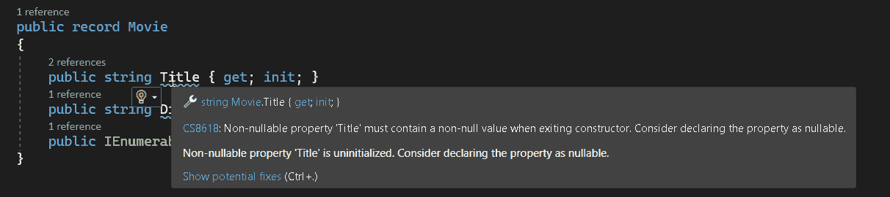
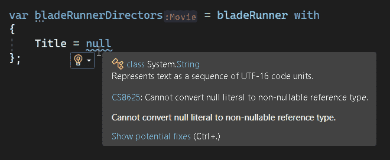

# 第三章：C# 7 及以后的函数式编程

我不确定具体是在何时做出决定将 C# 设计为混合面向对象/函数式语言。最初的基础工作是在 C# 3 中奠定的。那时引入了 Lambda 表达式和匿名类型等特性，后来成为 .NET 3.5 中 LINQ 的一部分。

然后，在相当长的一段时间内，关于函数式特性并没有什么新东西。事实上，直到 2017 年 C# 7 发布之后，函数式编程似乎再次对 C# 团队变得相关起来。

从 C# 7 开始，每个版本的 C# 都包含了一些新的、令人兴奋的内容，以更多函数式编码的方式，这种趋势目前看来并没有停止的迹象！

在上一章中，我们看了一些几乎可以在野外使用的任何 C# 代码库中实现的函数式特性。在本章中，我们将抛弃这种假设，看看如果你的代码库允许使用最新的特性或至少自 C# 7 以来发布的特性，你可以使用哪些功能。

# 元组

元组在 C# 7 中被引入。Nuget 包存在以允许一些旧版本的 C# 使用它们。它们基本上是一种快速且简单的属性集合方式，而无需创建和维护一个类。

如果你有几个属性想要在一个地方暂时保留一会儿，然后立即处理掉，元组非常适合。

如果你有多个对象想要在选择操作之间传递，或者想要在一个操作中传入或传出多个项，那么你可以使用元组。

这是使用元组的一个例子：

```cs
 var filmIds = new[]
 {
     4665,
     6718,
     7101
 };

// Turns each int element of the filmIds array
// into a tuple containing the film and cast list
// as separate properties

 var filmsWithCast = filmIds.Select(x => (
     film: GetFilm(x),
     castList: GetCastList(x)
 ));

// 'x' here is a tuple, and it's now being converted to a string

var renderedFilmDetails = filmsWithCast.Select(x =>
 "Title: " + x.film.Title +
 "Director: " + x.film.Director +
 "Cast: " + string.Join(", ", x.castList));
```

在我的例子中，我使用元组来配对每个给定电影 ID 的两个查找函数的数据，这意味着我可以运行后续的选择操作，将一对对象简化为单个返回值。

# 模式匹配

Switch 语句已经存在比今天大多数仍在工作的开发者还要久远。它们有它们的用途，但在所能做的事情上相当有限。函数式编程将这一概念提升了几个层次。这就是模式匹配的作用。

C# 7 开始引入这一功能到 C# 语言中，并在后续版本中进行了多次增强，未来很可能还会增加更多功能。

模式匹配是节省大量工作的一种绝佳方式。为了让你明白我的意思，我现在将展示一些过程式代码，并展示模式匹配在几个不同版本的 C# 中是如何实现的。

## 过程化银行账户

举个例子，让我们想象一个经典的面向对象的示例 - 银行账户。我将创建一组银行账户类型，每种类型都有不同的规则来计算利息金额。这些并不是真实银行业务，完全出自我的想象。

这些是我的规则：

+   标准银行账户通过将余额乘以账户的利率来计算利息

+   余额为 10,000 或更少的高级银行账户是标准银行账户

+   余额超过 10,000 的高级银行账户应用了一个额外奖励利率增强的利率

+   百万富翁的银行账户，他们拥有的钱比一个十进制可以容纳的最大值还要多（这是一个非常非常大的数字 - 大约 8*10²⁸，所以他们肯定非常富有。你认为如果我要求他们一点钱，他们会愿意借给我吗？我需要一双新鞋）。他们有一个溢出余额属性，用于添加所有那些他们拥有的超过最大十进制值的钱，这些钱无法像我们这些平民一样存储在标准余额属性中。他们需要根据两个余额计算利息。

+   大富翁玩家的银行账户。他们经过“前进”时会额外得到 200。我没有实现“直接去监狱”逻辑，一天只有那么多时间。

这些是我的类：

```cs
 public class StandardBankAccount
 {
     public decimal Balance { get; set; }
     public decimal InterestRate { get; set; }
 }

 public class PremiumBankAccount : StandardBankAccount
 {
     public decimal BonusInterestRate { get; set; }
 }

 public class MillionairesBankAccount : StandardBankAccount
 {
     public decimal OverflowBalance { get; set; }
 }

 public class MonopolyPlayersBankAccount : StandardBankAccount
 {
     public decimal PassingGoBonus { get; set; }
 }
```

对于银行账户实现计算利息功能的过程化方法 - 或者我认为的“长式”方法，可能会像这样：

```cs
 public decimal CalculateNewBalance(StandardBankAccount sba)
 {
   // If real type of object is PremiumBankAccount
   if (sba.GetType() == typeof(PremiumBankAccount))
   {
     // cast to correct type so we can access the Bonus interest
     var pba = (PremiumBankAccount)sba;
     if (pba.Balance > 10000)
     {
         return pba.Balance * (pba.InterestRate + pba.BonusInterestRate);
     }
   }

  // if real type of object is a Millionaire's bank account
  if(sba.GetType() == typeof(MillionairesBankAccount))
  {
    // cast to the correct type so we can get access to the overflow
    var mba = (MillionairesBankAccount)sba;
    return (mba.Balance * mba.InterestRate) +
             (mba.OverflowBalance * mba.InterestRate)
  }

    // if real type of object is a Monopoly Player's bank account
  if(sba.GetType() == typeof(MonopolyPlayersBankAccount))
  {
    // cast to the correct type so we can get access to the bonus
    var mba = (MonopolyPlayersBankAccount)sba;
    return (mba.Balance * mba.InterestRate) +
             mba.PassingGoBonus
  }

   // no special rules apply
   return sba.Balance * sba.InterestRate;
 }
```

与过程化代码一样，上面的代码不太简洁，可能需要一点时间来理解其意图。一旦系统投入生产，如果添加了许多新规则，它也很容易被滥用。

面向对象的方法要么使用接口，要么使用多态性 - 即创建一个带有 CalculateNewBalance 函数的抽象基类。问题在于，现在逻辑分散在许多地方，而不是包含在一个易于阅读的函数中。

在接下来的部分中，我将展示每个后续版本的 C#是如何处理这个问题的。

## C# 7 中的模式匹配

C# 7 为我们提供了解决这个问题的两种不同方法。首先是新的`is`运算符 - 一种比以前可用的检查类型更方便的方式。`is`运算符还可以用于自动将源变量转换为正确的类型。

我们更新后的源码将看起来像这样：

```cs
 public decimal CalculateNewBalance(StandardBankAccount sba)
 {
     // If real type of object is PremiumBankAccount
     if (sba is PremiumBankAccount pba)
     {
         if (pba.Balance > 10000)
         {
             return pba.Balance * (pba.InterestRate + pba.BonusInterestRate);
         }
     }

     // if real type of object is a Millionaire's bank account
     if(sba is MillionairesBankAccount mba)
     {
        return (mba.Balance * mba.InterestRate) +
                (mba.OverflowBalance * mba.InterestRate);
     }

     // if real type of object is a Monopoly Player's bank account
     if(sba is MonopolyPlayersBankAccount mba)
     {
       return (mba.Balance * mba.InterestRate) +
                mba.PassingGoBonus;
     }
     // no special rules apply
     return sba.Balance * sba.InterestRate;
 }
```

请注意上述代码示例中，使用`is`运算符，我们还可以自动将源变量包装成正确类型的新局部变量。

这不错，有点更加优雅，我们也节省了一些冗余的行数，但我们可以做得更好，这就是 C# 7 的另一个特性介入的地方 - 类型切换。

```cs
 public decimal CalculateNewBalance(StandardBankAccount sba)
 {
   switch (sba)
   {
      case PremiumBankAccount pba when pba.Balance > 10000:
        return pba.Balance * (pba.InterestRate + pba.BonusInterestRate);
      case MillionairesBankAccount mba:
        return (mba.Balance * mba.InterestRate) +
                 (mba.OverflowBalance & mba.InterestRate);
      case MonopolyPlayersBankAccount mba:
        return (mba.Balance * mba.InterestRate) + PassingGoBonus;
      default:
        return sba.Balance * sba.InterestRate;
   }
 }
```

挺酷，对吧？模式匹配似乎是近年来 C#中最发达的功能之一。正如我即将展示的，自此以来的每个主要 C#版本都在其上继续添加功能。

# C# 8 中的模式匹配

C# 8 中的事情有了进展，基本上是相同的概念，但有了一个新的、更新的匹配语法，更接近 JSON，或者说是一个 C# 对象初始化表达式。任意数量的子句可以放在对象检查的大括号内，而默认情况现在由 *_* 丢弃字符表示。

```cs
 public decimal CalculateNewBalance(StandardBankAccount sba) =>
   sba switch
   {
     PremiumBankAccount { Balance: > 10000 } pba => pba.Balance *
                     (pba.InterestRate + pba.BonusInterestRate),
     MillionairesBankAccount mba => (mba.Balance * mba.InterestRate) +
                 (mba.OverflowBalance & mba.InterestRate);
     MonopolyPlayersBankAccount mba =>
                (mba.Balance * mba.InterestRate) + PassingGoBonus;
     _ => sba.Balance * sba.InterestRate
   };
 }
```

此外，switch 现在**也**可以是一个表达式，你可以将其用作小型单用途函数的主体，具有出乎意料的丰富功能。这意味着它也可以存储在 Func 委托中，以便可能作为高阶函数传递。

这是一个使用老童年游戏的例子：剪刀、石头、布。在美国被称为石头、纸、剪刀，在日本被称为石头、纸、剪刀。在以下示例中，我创建了一个 `Func` 委托，并制定了以下规则：

1.  两名玩家同时画出相同的 = 平局

1.  剪刀胜纸

1.  石头胜纸

1.  石头胜剪刀

这个函数具体确定了从*我的*角度对我的想象对手的结果是什么。

```cs
public enum SPS
{
	Scissor,
	Paper,
	Stone
}

public enum GameResult
{
	Win,
	Lose,
	Draw
}

var calculateMatchResult = (SPS myMove, SPS theirMove) =>
	(myMove, theirMove) switch
	{
		_ when myMove == theirMove => GameResult.Draw,
		( SPS.Scissor, SPS.Paper) => GameResult.Win,
		( SPS.Paper, SPS.Stone ) => GameResult.Win,
		(SPS.Stone, SPS.Scissor) => GameResult.Win,
		_ => GameResult.Lose
	};
```

将其存储在 'Func<SPS,SPS>' 类型的变量中后，我可以将其传递到任何需要它的地方。

这可以作为函数的参数，以便在运行时可以注入功能：

```cs
public string formatGames(IEnumerable<(SPS,SPS)> game, Func<SPS,SPS,Result) calc) =>
string.Join("\r\n", game.Select((x, i) => "Game " + i + ": " + calc(x.Item1,x.Item2).ToString());
```

如果我想要测试该函数的逻辑而不将实际逻辑放入其中，我可以轻松地从测试方法中注入自己的 `Func`，这样我就不必关心真实逻辑是什么——可以在其他专门的测试中进行测试。

这是使结构更加有用的又一个小改进。

# C# 9 中的模式匹配

在 C# 9 中没有添加重大内容，但有几个不错的小功能。现在在模式列表的大括号内部，`is` 表达式的 `and` 和 `not` 关键字可以工作了，并且如果不需要其属性，则不再需要一个用于转换类型的局部变量。

虽然不是突破性的，但这确实继续减少必要的样板代码量，并为我们提供了更多表达性更强的语法片段。

我在下一个示例中加入了一些更多的规则，使用这些功能。现在有两类带有不同特殊利率水平的 PremiumBankAccounts，还有一种用于已关闭账户的银行账户类型，不应该产生任何利息¹。

```cs
 public decimal CalculateNewBalance(StandardBankAccount sba) =>
   sba switch
   {
     PremiumBankAccount { Balance: > 10000 and <= 20000 } pba => pba.Balance *
                         (pba.InterestRate + pba.BonusInterestRate),
     PremiumBankAccount { Balance: > 20000 } pba => pba.Balance *
                  (pba.InterestRate + pba.BonusInterestRate * 1.25M),
     MillionairesBankAccount mba => (mba.Balance * mba.InterestRate) +
                 (mba.OverflowBalance + mba.InterestRate),
     MonopolyPlayersBankAccount {CurrSquare: not "InJail" } mba =>
                (mba.Balance * mba.InterestRate) + mba.PassingGoBonus;
     ClosedBankAccount => 0,
     _ => sba.Balance * sba.InterestRate
   };
 }
```

还不错，对吧？

# C# 10 中的模式匹配

像 C# 9 一样，C# 10 只是增加了另一个不错的节省时间和样板的功能。用于比较属于正在检查的类型的子对象属性的简单语法。

```cs
 public decimal CalculateNewBalance(StandardBankAccount sba) =>
   sba switch
   {
     PremiumBankAccount { Balance: > 10000 and <= 20000 } pba =>
		pba.Balance * (pba.InterestRate + pba.BonusInterestRate),
     MillionairesBankAccount mba =>
		(mba.Balance * mba.InterestRate) + (mba.OverflowBalance + mba.InterestRate),
     MonopolyPlayersBankAccount {CurrSquare: not "InJail" } mba =>
		(mba.Balance * mba.InterestRate) + PassingGoBonus,
     MonopolyPlayersBankAccount {Player.FirstName: "Simon" } mba =>
		(mba.Balance * mba.InterestRate) + (mba.PassingGoBonus / 2),
     ClosedBankAccount => 0,
     _ => sba.Balance * sba.InterestRate
   };
```

在这个有些愚蠢的例子中，现在可以在通过 Monopoly 时排除所有的“Simon”们赚取这么多钱。可怜的我。

我建议此时再花点时间检查上面的函数。想象一下，如果不作为模式匹配表达式完成，将需要编写多少行代码！事实上，它**从技术上讲**仅包括一行代码。一…真的很长…行代码，有很多 NewLines 使其可读。尽管如此，这个观点仍然适用。

# C# 11

C# 11 包含了一个新的模式匹配功能，可能使用范围有些有限，但当符合其条件时将会非常有用。

.NET 团队已经添加了基于 Enumerable 内容进行匹配甚至将其解构为单独变量的能力。

让我们想象我们正在创建一个非常简单的基于文本的冒险游戏。当我很小的时候，这些东西很流行。冒险游戏是通过键入命令来玩的。想象一下像 Monkey Island 这样的东西，但没有图形，只有文本。你必须更多地依靠自己的想象力。

第一个任务是从用户那里接收输入并决定他们试图做什么。在英语命令中，动词通常作为句子的第一个词。“GO WEST”，“KILL THE GOBLIN”，“EAT THE SUSPICIOUS-LOOKING MUSHROOM”。这里的相关动词是 GO、KILL 和 EAT 分别。

这是我们如何使用 C# 11 模式匹配的方式：

```cs
var verb = input.Split(" ") switch
{
 ["GO", "TO",.. var rest] => this.actions.GoTo(rest),
 ["GO", .. var rest] => this.actions.GoTo(rest),
 ["EAT", .. var rest] => this.actions.Eat(rest),
 ["KILL", .. var rest] => this.actions.Kill(rest)
};
```

上述开关表达式中的“..”表示“我不在乎数组中的其他内容，请忽略它”。在其后放置一个变量用于包含除了那些特别匹配的部分之外的数组中的其他所有内容。

在我上面的示例中，如果我输入文本“GO WEST”，那么 GoTo 操作将以单元素数组["WEST"]作为参数调用，因为“GO”是匹配的一部分。

这是另一种很好的使用方式。想象我正在将人们的姓名处理成数据结构，我想要其中 3 个是 FirstName、LastName 和一个数组 - MiddleNames（我只有一个中间名，但很多人有多个）。

```cs
public class Person
{
	public string FirstName { get; set; }
	public IEnumerable<string> MiddleNames { get; set; }
	public string LastName { get; set; }
}

// The real name of Doctor Who actor, Sylvester McCoy
var input = "Percy James Patrick Kent-Smith".Split(" ");

var sylv = new Person
{
	FirstName = input.First(),
	MiddleNames = input is [_, .. var mns, _] ? mns : Enumerable.Empty<string>(),
	LastName = input.Last()
};
```

在此示例中，Person 类被实例化为：

FirstName = “Percy”, LastName = “Kent-Smith”, MiddleNames = [ “James”, “Patrick” ]

我不确定我会找到很多使用场景，但当我找到时，它可能会让我非常兴奋。这是一个非常强大的功能。

## 区分联合

我不确定这是否是我们将来在 C# 中会得到的东西。我知道目前 Nuget 上至少有两个尝试来实现这个概念：

1.  Harry McIntyre 的 OneOf ([*https://github.com/mcintyre321/OneOf*](https://github.com/mcintyre321/OneOf))

1.  Kim Hugener-Olsen 的 Sundew.DiscriminatedUnions ([*https://github.com/sundews/Sundew.DiscriminatedUnions*](https://github.com/sundews/Sundew.DiscriminatedUnions))

我在第六章详细讨论了区分联合及其在 C# 中的实现方式，如果您想了解更多，请跳转到那里。

简言之：它们是一种可能是几种类型之一的类型。它们在 F# 中可以本地使用，但是截至目前 C# 并没有这些功能，而它们是否会被添加还不得而知。

与此同时，在 GitHub 上正在进行讨论（[*https://github.com/dotnet/csharplang/issues/113*](https://github.com/dotnet/csharplang/issues/113)），并且已存在提案（[*https://github.com/dotnet/csharplang/blob/main/proposals/discriminated-unions.md*](https://github.com/dotnet/csharplang/blob/main/proposals/discriminated-unions.md)）。

我不知道有任何严肃的计划将它们添加到 C# 12 中，所以现在我们只能继续观望！

## 活动模式

这是我可以预见到的一个 F# 特性很快会被添加到 C# 中。这是对模式匹配的增强，允许在表达式的左侧“模式”部分执行函数。这是一个 F# 的例子：

```cs
let (|IsDateTime|_|) (input:string) =
    let success, value = DateTime.TryParse input
    if success then Some value else None

let tryParseDateTime input =
    match input with
    | IsDateTime dt -> Some dt
    | _ -> None
```

F# 开发者能够做的事情，例如这个例子，是提供自己的自定义函数，以便放在表达式的左侧“模式”部分。

在这里，“IsDateTime”是自定义函数，定义在第一行。它接受一个字符串，并且如果解析成功则返回一个值，如果解析失败则返回一个类似于空结果的值。

模式匹配表达式“tryParseDateTime”使用 IsDateTime 作为模式，如果从 IsDateTime 返回了一个值，则选择模式匹配表达式中的该情况，并返回生成的 DateTime。

不要过多担心 F# 语法的复杂性，我不指望你在这里学习这些。有其他的 F# 书籍，你可能会选择一本或多本来了解。

1.  由 Isaac Abraham 撰写的《Get Programming with F#》（Manning）

1.  由 Ian Russell 编写的《Essential F#》（[*https://leanpub.com/essential-fsharp*](https://leanpub.com/essential-fsharp)）

1.  由 Scott Wlaschin 编写的《F# for Fun and Profit》（[*https://fsharpforfunandprofit.com/*](https://fsharpforfunandprofit.com/)）

这两个 F# 功能是否会在以后的 C# 版本中提供还有待观察，但是 C# 和 F# 共享一个通用语言运行时，因此它们被移植过来并非不可能。

## 只读结构体

我这里不打算详细讨论结构体，还有其他优秀的书籍详细讲述了 C# 的特性。从 C# 的角度来看，它们的优点在于它们是按值在函数之间传递的，而不是按引用 - 即传递的是一个副本，原始对象保持不变。传统的面向对象技术是将一个对象传递到一个函数中，以便在那里修改它，违背了函数式程序员的原则。我们基于类实例化一个对象，然后再也不改变它。

结构体已存在很长时间了，虽然它们是按值传递的，但仍然可以修改其属性，因此它们并非完全不可变。至少直到 C# 7.2。

现在，可以向结构体定义添加只读修饰符，在设计时强制所有结构体属性为只读。任何尝试向属性添加设置器将导致编译器错误。

由于所有属性都被强制为只读，在 C# 7.2 中，所有属性都需要包含在构造函数中才能设置。看起来像这样：

```cs
public readonly struct Movie
{
    public string Title { get; private set; };
    public string Directory { get; private set; };
    public IEnumerable<string> Cast { get; private set; };

    public Movie(string title, string directory, IEnumerable<string> cast)
    {
        this.Title = title;
        this.Directory = directory;
        this.Cast = cast;
    }
}

var bladeRunner = new Movie(
        "Blade Runner",
        "Ridley Scott",
        new []
        {
            "Harrison Ford",
            "Sean Young"
        }
);
```

这仍然有点笨拙，迫使我们在每次向结构体添加属性时更新构造函数，但这仍然比没有强化要好。

还值得讨论的是，我已经在结构体中添加了一个列表的情况：

```cs
public readonly struct Movie
{
    public readonly string Title;
    public readonly string Directory;
    public readonly IList<string> Cast;

    public Movie(string title, string directory, IList<string> cast)
    {
        this.Title = title;
        this.Directory = directory;
        this.Cast = cast;
    }
}

var bladeRunner = new Movie(
        "Blade Runner",
        "Ridley Scott",
        new []
        {
            "Harrison Ford",
            "Sean Young"
        }
);

bladeRunner.Cast.Add(("Edward James Olmos"));
```

这将编译，并且应用程序将运行，但当调用`Add()`函数时将抛出错误。结构体的只读性质被强制执行是件好事，但我不喜欢必须担心另一个潜在的未处理异常。

但是开发人员现在可以添加只读修饰符以澄清意图，这将防止任何可能避免的可变性添加到结构体中。即使这意味着还必须有另一层错误处理。

## 仅初始化的设置器

C# 9 引入了一种新的自动属性类型。我们已经有了`Get`和`Set`，但现在还有`Init`。

如果您有一个附有`Get`和`Set`的类属性，这意味着可以随时检索或替换该属性。

如果它有`Get`和`Init`，则在对象实例化时可以设置其值，但之后不能再更改。

这意味着我们的只读结构体（以及我们所有的类）现在可以以稍微更美观的语法进行实例化，然后处于只读状态：

```cs
 public readonly struct Movie
 {
     public string Title { get; init; }
     public string Director { get; init;  }
     public IEnumerable<string> Cast { get; init; }
 }

 var bladeRunner = new Movie
    {
        Title = "Blade Runner",
        Director = "Ridley Scott",
        Cast = new []
        {
            "Harrison Ford",
            "Sean Young"
        }
    };
```

这意味着我们不必再维护一个复杂的构造函数（即一个为每个属性都有参数的构造函数 - 可能会有几十个），以及属性本身，这消除了恼人的样板代码的潜在来源。

尽管如此，我们仍然面临异常抛出的问题，当尝试修改列表和子对象时。

## 记录类型

在 C# 9 中，自从模式匹配之后，我的最爱之一 - 记录类型。如果你还没有机会自己尝试过这些，那么请尽快尝试一下。它们非常棒。

表面上看，它们看起来与结构体相似。在 C# 9 中，记录类型基于类，因此通过引用传递。

自 C# 10 及以后，这种情况不再适用，记录现在更像是结构体，这意味着它们可以按值传递。然而，与结构体不同的是，没有只读修饰符，因此不可变性必须由开发人员来强制执行。这是“银翼杀手”代码的更新版本：

```cs
public record Movie
{
    public string Title { get; init; }
    public string Director { get; init;  }
    public IEnumerable<string> Cast { get; init; }
}

var bladeRunner = new Movie
   {
       Title = "Blade Runner",
       Director = "Ridley Scott",
       Cast = new []
       {
           "Harrison Ford",
           "Sean Young"
       }
   };
```

它看起来并没有那么不同，对吧？然而，记录真正独特之处在于当你想创建一个修改过的版本时。让我们假设一下，在我们的 C# 10 应用程序中，我们想为《银翼杀手》导演剪辑版创建一个新的电影记录³。就我们的目的而言，这完全相同，只是有一个不同的标题。为了节省定义数据，我们会从原始记录中直接复制数据，但进行一处修改。如果是使用只读结构体，我们必须像这样做：

```cs
 public readonly struct Movie
 {
     public string Title { get; init; }
     public string Director { get; init;  }
     public IEnumerable<string> Cast { get; init; }
 }

var bladeRunner = new Movie
    {
        Title = "Blade Runner",
        Director = "Ridley Scott",
        Cast = new []
        {
            "Harrison Ford",
            "Sean Young"
        }
    };

var bladeRunnerDirectors = new Movie
{
    Title = $"{bladeRunner.Title} - The Director's Cut",
    Director = bladeRunner.Director,
    Cast = bladeRunner.Cast
};
```

这遵循函数式编程范式，并不算太糟糕，但如果我们想要强制不可变性，我们必须在应用程序中包含另一大堆样板代码。

如果我们有类似需要根据用户交互或某种外部依赖定期更新的状态对象，那么这变得很重要。使用只读结构体方法，我们将不得不进行大量属性复制。

记录类型为我们提供了一个绝对惊艳的新关键字 - `with`。这是一种快捷方便的方法，可以创建一个现有记录的副本，并进行修改。使用记录类型的《银翼杀手》导演剪辑版的更新代码如下所示：

```cs
 public record Movie
 {
     public string Title { get; init; }
     public string Director { get; init;  }
     public IEnumerable<string> Cast { get; init; }
 }

var bladeRunner = new Movie
    {
        Title = "Blade Runner",
        Director = "Ridley Scott",
        Cast = new []
        {
            "Harrison Ford",
            "Sean Young"
        }
    };

var bladeRunnerDirectors = bladeRunner with
{
    Title = $"{bladeRunner.Title} - The Director's Cut"
};
```

酷吧？使用记录类型可以节省大量的样板代码。

我最近用函数式 C# 写了一个文本冒险游戏。我创建了一个名为 GameState 的中心记录类型，包含玩家迄今为止的所有进展。我使用了一个庞大的模式匹配语句来判断玩家本回合的操作，并使用简单的 **with** 语句通过返回修改后的副本来更新状态。这是编写状态机的一种优雅方式，通过去除大量无趣的样板代码，大大澄清了意图。

记录的一个很棒的特性是，你甚至可以简单地用一行来定义它们，像这样：

```cs
public record Movie(string Title, string Director, IEnumerable<string> Cast);
```

使用这种定义风格创建 Movie 的实例不能使用花括号，必须使用一个函数：

```cs
var bladeRunner = new Movie(
"Blade Runner",
"Ridley Scott",
new[]
{
	"Harrison Ford",
	"Sean Young"
});
```

请注意，除非使用类似这样的构造标记，否则必须按顺序提供所有属性：

```cs
var bladeRunner = new Movie(
	Cast: new[]
	 {
		"Harrison Ford",
		"Sean Young"
	},
	Director: "Ridley Scott",
	Title: "Blade Runner");
```

你*仍然*必须提供所有属性，但可以按任意顺序放置它们。这对你有多大好处呢……

你更喜欢哪种语法是个人偏好问题。在大多数情况下，它们是等效的。

## 可空引用类型

尽管听起来不像是一种新类型，就像记录类型一样。这实际上是一种编译器选项，是在 C# 8 中引入的。这个选项在 CSPROJ 文件中设置，就像这个摘录中的一样：

```cs
 <PropertyGroup>
   <TargetFramework>net6.0</TargetFramework>
   <Nullable>enable</Nullable>
   <IsPackable>false</IsPackable>
 </PropertyGroup>
```

如果你更喜欢使用 UI，则选项也可以在项目属性的“构建”部分中设置。

严格来说，启用空引用类型功能并不会改变编译器生成的代码行为，但它确实会在 IDE 和编译器中添加一组额外的警告，以帮助避免可能将 NULL 赋值的情况。以下是一些被添加到我的电影记录类型中的警告，提醒我属性可能会为 NULL：



如果我试图将《银翼杀手导演剪辑版》的标题设置为 NULL，那么会出现另一个例子：



请记住，这些只是编译器警告。代码仍将执行而没有任何错误。它只是指导您编写代码，减少包含空引用异常的可能性 - 这只能是一件好事。

避免使用 NULL 值通常是一个良好的实践，无论是否进行功能编程。NULL 被称为“十亿美元的错误”。它是由托尼·霍尔在 60 年代中期发明的，自那时以来，它一直是生产中错误的主要原因之一。将一个对象传递到某些意外地变成 NULL 的地方。这会导致空引用异常，而在你遇到第一个这样的异常之前，你在这个行业中也不需要有很长时间！

将 NULL 作为一个值添加到您的代码库中会增加不必要的复杂性，并引入潜在错误的另一个来源。这就是为什么值得注意编译器警告，并尽可能避免在您的代码库中使用 NULL。

如果某个值有很好的理由应为 NUL，则可以通过像这样添加 *?* 字符到属性中来实现：

```cs
 public record Movie
 {
     public string? Title { get; init; }
     public string? Director { get; init;  }
     public IEnumerable<string>? Cast { get; init; }
 }
```

唯一考虑在我的代码库中故意添加可空属性的情况是第三方库需要它。即使如此，我也不会允许可空被持久化到我的代码中 - 我可能会把它藏在某个地方，让解析外部数据的代码能看到它，然后将其转换为更安全、更受控的结构，以传递给系统的其他部分。

# 未来

在撰写本文时，C# 11 已经发布并作为 .NET 7 的一部分已经得到了很好的确认。.NET 8 和 C# 12 的计划刚刚开始制定，但尚不清楚它们将包含什么 - 如果有的话 - 对功能编程人员来说可能会有一些新的东西可以做更多的功能编程。

# 总结

在本章中，我们查看了自从功能编程开始集成到 C# 3 和 4 以来发布的所有 C# 特性。我们研究了它们是什么，如何使用它们，以及为什么值得考虑。

广义上来说，这些可以分为两类：

+   模式匹配，在 C#中实现为一种高级形式的 switch 语句，允许编写非常强大且节省代码的逻辑，简洁明了。我们看到每个 C#版本都为开发者贡献了更多的模式匹配特性。

+   不可变性，即变量一旦实例化就无法修改的能力。出于向后兼容性的原因，真正的不可变性在 C#中很难实现，但 C#正在新增一些特性，如只读结构体和记录类型，使开发者可以更轻松地以一种容易假装不可变性存在的方式工作，而无需向应用程序添加大量繁琐的样板代码。

在下一章中，我们将进一步探讨一些方法，展示如何以新颖的方式使用 C#的现有特性，以丰富您的函数式编程工具箱。

¹ 坦率地说，任何银行都不会提供这种服务。

² *C# in a Nutshell* 这本书也是由 O’Reilly 出版的，也是不错的选择。

³ 在我看来，远远优于戏剧性的版本。
