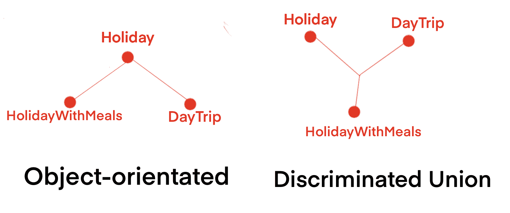
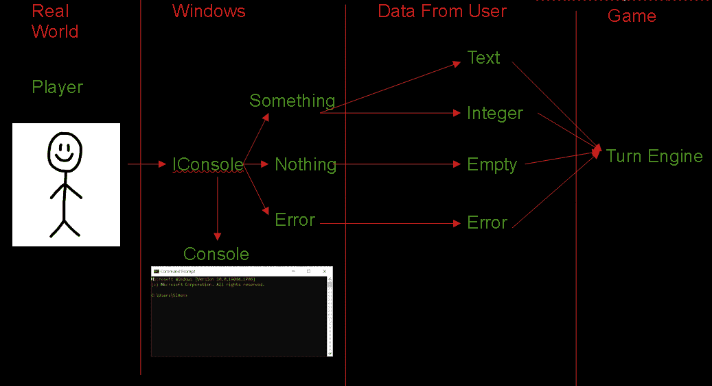

# 第六章：区分联合

区分联合（DUs）是一种定义类型（或在 OO 世界中的类）的方式，实际上是一组不同类型中的一种。在任何给定时刻，必须在使用之前检查 DU 实例的类型。

F#本地支持 DUs，并且这是 F#开发人员广泛使用的功能。尽管与 C#共享一个公共运行时，并且该功能理论上可用，但目前只有计划在某个时候将其引入 C#中 - 但不确定如何或何时。在此期间，我们可以用抽象类粗略模拟它们，这就是我将在本章中讨论的技术。

本章是我们首次涉足一些更高级的函数式编程领域。本书的前几章更侧重于开发者如何聪明工作，而不是辛苦工作。我们还探讨了如何减少样板文件，并使代码更健壮和可维护。

区分联合¹是一种编程结构，也可以做到这一点，但不仅仅是一个简单的扩展方法，或者是一个单行修复以消除一些样板文件。DUs 更接近于设计模式的概念 - 因为它们有一个结构，并且需要围绕它实现一些逻辑。

# 假日时间

让我们想象一个老式的面向对象问题，我们正在为度假套餐创建一个系统。你知道的 - 旅行社为您安排旅行、住宿等等。我会让你想象一下你要去的美丽目的地。就我个人而言，我非常喜欢希腊群岛。

```cs
public class Holiday
{
 public int Id { get; set; }
 public Location Destination { get; set; }
 public Location DepartureAirport { get; set; }
 public DateTime StartDate { get; set; }
 public int DurationOfStay { get; set; }
}

public class HolidayWithMeals : Holiday
{
 public int NumberOfMeals { get; set; }
}
```

现在想象一下，我们正在为客户创建一个账户页面²，我们想列出他们迄今为止购买的所有东西。实际上并不那么困难。我们可以使用一些相对较新的`is`语句来构建必要的字符串。以下是我们可以做的一种方式：

```cs
public string formatHoliday(Holiday h) =>
 "From: " + h.DepartureAirport.Name + Environment.NewLine +
 "To: " + h.Destination.Name + Environment.NewLine +
 "Duration: " + h.DurationOfStay + " Day(s)" +
 (
  h is HolidayWithMeals hm
   ? Environment.NewLine + "Number of Meals: " + hm.NumberOfMeals
   : string.Empty
 );
```

如果我想快速引入一些功能性思想来改进这个问题，我可以考虑引入一个分支组合子（见上一章），基本类型是假日，子类型是带有餐饮的假日。本质上是相同的东西，但多了一个或两个额外的字段。

如果…公司启动了一个项目。现在，他们将开始提供与度假无关的其他类型的服务。他们还将开始提供不涉及酒店、航班或其他任何类似事物的日游。也许是伦敦的塔桥入口³，或者是巴黎的埃菲尔铁塔的快速游览。无论你喜欢什么。世界是你的。

对象看起来会像这样：

```cs
public class DayTrip
{
 public int Id { get; set; }
 public DateTime DateOfTrip { get; set; }
 public Location Attraction { get; set; }
 public bool CoachTripRequired { get; set; }
}
```

但问题是，如果我们想要从一个假日对象继承来表示这种新情况，这是行不通的。我见过一些人采取的方法是将所有字段合并在一起，以及一个布尔值来指示应该查看哪些字段。

类似这样：

```cs
public class CustomerOffering
{
  public int Id { get; set; }
  public Location Destination { get; set; }
  public Location DepartureAirport { get; set; }
  public DateTime StartDate { get; set; }
  public int DurationOfStay { get; set; }
  public bool CoachTripRequired { get; set; }
  public bool IsDayTrip { get; set; }
}
```

这是一个糟糕的想法，原因有几个。首先，你违反了接口隔离原则。无论它真正是哪种类型，你都在强制它保存对它来说无关的字段。我们还将“Destination”和“Attraction”的概念重复了一遍，以及这里的“DateOfTrip”和“StartDate”，以避免重复，但这意味着我们失去了一些使处理日行程代码有意义的术语。

另一个选择是将它们作为完全独立的对象类型保留，彼此之间没有任何关系。尽管如此，这样做会失去一个很好的特性，即能够通过简洁的方式遍历每个对象。我们无法按日期顺序在单个表中列出所有内容。必须有多个表。

所有这些可能性似乎都不太好。但这正是 DUs 以优化解决方案应对问题的地方。在下一节中，我将向你展示如何使用它们来提供最佳解决方案。

# 使用鉴别联合的节日

在 F# 中，你可以像这样为我们的客户提供示例创建一个联合类型：

```cs
type CustomerOffering =
 | Holiday
 | HolidayWithMeals
 | DayTrip
```

这意味着你可以实例化一个新的 CustomerOffering 实例，但有三种不同的类型，每种类型可能有其自己完全不同的属性。

这是我们在 C# 中可以接近这种方法的方式：

```cs
public abstract class CustomerOffering
{
 public int Id { Get; set; }
}

public class Holiday : CustomerOffering
{
 public Location Destination { get; set; }
 public Location DepartureAirport { get; set; }
 public DateTime StartDate { get; set; }
 public int DurationOfStay { get; set; }
}

public class HolidayWithMeals : Holiday
{
 public int NumberOfMeals { get; set; }
}

public class DayTrip : CustomerOffering
{
 public DateTime DateOfTrip { get; set; }
 public Location Attraction { get; set; }
 public bool CoachTripRequired { get; set; }
}
```

表面上看，它似乎与类集合的第一个版本并没有完全不同，但有一个重要的区别。基类是抽象的 - 你实际上不能创建一个 CustomerOffering 类。它不是一个具有一个顶级父类的类族树，而是所有子类都是不同的，但在层次结构中是相等的。

这里有一个类层次结构图，可以更清晰地显示两种方法之间的区别：



DayTrip 类在任何情况下都不必符合与 Holiday 类有关的任何概念。DayTrip 完全是自己的东西。这意味着它可以使用与其自身业务逻辑完全相符的属性名称，而不必追溯 Holiday 的一些属性。换句话说 - DayTrip 不是 Holiday 的**扩展**，而是其**替代品**。

这还意味着你可以有所有 CustomerOfferings 的单个数组，尽管它们之间差异很大。无需分开的数据源。

我们可以在代码中处理一个 CustomerOffering 对象数组，使用模式匹配语句：

```cs
public string formatCustomerOffering(CustomerOffering c) =>
 c switch
 {
  HolidayWithMeals hm => this.formatHolidayWithMeal(hm),
  Holiday h => this.formatHoliday(h),
  DayTrip dt => this.formatDayTrip(tp)
 };
```

这简化了接收鉴别联合的所有代码，并产生了更具描述性的代码，更准确描述函数的所有可能结果。

# 薛定谔的联合

如果你想要一个关于这些工作原理的类比，想想可怜的薛定谔的猫。这是奥地利物理学家厄温·薛定谔提出的一个思想实验，旨在突出量子力学中的悖论。这个想法是，给定一个包含一只猫和一个有 50-50 几率衰变的放射性同位素的盒子，这会杀死猫。关键是，根据量子物理学，直到有人打开盒子检查猫时，猫同时处于生和死的两种状态。这意味着猫同时是活着和死的。

这也意味着，如果薛定谔先生将他的猫/同位素盒子邮寄给一个朋友，他们会得到一个可能包含两种状态之一的盒子，直到他们打开它，他们不知道是哪种状态。当然，邮政服务是什么样子的，猫到达时可能已经死了*无论如何*。这就是为什么你真的不应该在家里尝试这个。相信我，我不是医生，也不在电视上扮演医生。

这就是歧视性联合的工作原理。一个返回的值，但可能存在于两种或更多状态中。在检查之前，你不知道它是哪种状态。

如果一个类不关心它的状态，你甚至可以将其传递给它的下一个目的地而不打开它。

作为代码的薛定谔的猫可能看起来像这样：

```cs
public abstract class SchrödingersCat { }

public class AliveCat : SchrödingersCat { }

public class DeadCat : SchrödingersCat { }
```

我希望你现在清楚歧视性联合实际上**是**什么。我将在本章的其余部分演示一些它们**的**示例。

# 命名约定

让我们想象一个用于从个体组件中写出人名的代码模块。如果你有一个传统的英国名字，就像我的名字一样，那么这就相当简单。一个用于写我的名字的类看起来会像这样：

```cs
public class BritishName
{
 public string FirstName { get; set; }
 public IEnumerable<string> MiddleNames { get; set; }
 public string LastName { get; set; }
 public string Honorific { get; set; }
}

var simonsName = new BritishName
{
 Honorific = "Mr.",
 FirstName = "Simon",
 MiddleNames = new [] { "John" },
 LastName = "Painter
};
```

渲染代码将会像这样简单：

```cs
public string formatName(BritishName bn) =>
 bn.Honorific + " " bn.FirstName + " " + string.Join(" ", bn.MiddleNames) +
 " " + bn.LastName;
// Results in "Mr Simon John Painter"
```

全部完成了，对吧？好吧，这适用于传统的英国名字，但中国名字呢？它们的书写顺序与英国名字不同。中国名字的书写顺序是<姓><名>，许多中国人还有一个“字” - 一个西式名字，专业上使用。

让我们以传奇演员、导演、作家、特技演员、歌手和全能人类 - 成龙为例。他的真实姓名是房仕龙。在这组名字中，他的姓氏是房。他的个人姓名（通常在英语中称为名字或基督教名）是仕龙。成龙是他从很小就用的一个敬称。这种名字风格与我上面创建的 formatName 函数根本不奏效。

我*可能*会稍微修改数据使其工作。类似这样：

```cs
var jackie = new BritishName
{
 Honorific = "Xiānsheng", // equivalent of "Mr."
 FirstName = "Fang",
 LastName = "Shilong"
}
// results in "xiānsheng Fang Shilong"
```

所以，很好，这样才能正确按顺序写出他的两个官方名称。但他的谦称呢？没有东西写出来。另外，“先生”的中文等价词 - 先生⁷ - 实际上在名字**之后**，所以这实际上相当糟糕 - 即使我们试图重新使用现有的字段。

我们可以向代码中添加大量的`if`语句来检查所描述的人员的国籍，但如果我们尝试扩展以包括超过 2 种国籍，这种方法很快就会变成噩梦。

再次强调，更好的方法是使用带标签的联合体来表示根本不同的数据结构，以一种能够反映它们试图表示的事物实际情况的形式。

```cs
public abstract class Name { }

public class BritishName : Name
{
 public string FirstName { get; set; }
 public IEnumerable<string> MiddleNames { get; set; }
 public string LastName { get; set; }
 public string Honorific { get; set; }
}

public class ChineseName : Name
{
 public string FamilyName { get; set; }
 public string GivenName { get; set; }
 public string Honorific { get; set; }
 public string CourtesyName { get; set; }
}
```

在我的想象场景中，可能为每种名称类型分别存在独立的数据源 - 每个都有自己的架构。也许每个国家都有一个 Web API？

使用这个联合体，我们实际上可以创建一个包含我和成龙的名字数组⁸

```cs
var names = new Name[]
{
 new BritishName
 {
  Honorific = "Mr.",
  FirstName = "Simon",
  MiddleNames = new [] { "John" },
  LastName = "Painter"
 },
 new ChineseName
 {
  Honorific = "Xiānsheng",
  FamilyName = "Fang",
  GivenName = "Shilong",
  CourtestyName = "Jackie"
 }
}
```

然后，我可以通过模式匹配表达式扩展我的格式化函数：

```cs
public string formatName(Name n) =>
 n switch
 {
  BritishName bn => bn.Honorific + " " bn.FirstName + " "
     + string.Join(" ", bn.MiddleNames) + " " + bn.LastName,
  ChineseName cn => cn.FamilyName + " " + cn.GivenName + " " +
     cn.Honorific + " \"" + cn.CourtesyName + "\""
 };

var output = string.Join(Environment.NewLine, names);
// output =
// Mr. Simon John Painter
// Fang Shilong Xiānsheng "Jackie"
```

同样的原则可以应用于世界任何地方的任何风格的命名，给定的字段名称将始终对该国家有意义，并且始终以正确的样式显示，而不是重新使用现有字段。

# 数据库查找

我通常会考虑在 C#中将带标签的联合体作为接口定义的函数的返回类型的情况。

我特别可能在查找数据源的查找函数中使用这种技术的领域。假设你想在某种系统中找到某人的详细信息。该函数将接受一个整数 Id 值，并返回一个 Person 记录。

至少通常会发现人们这样做。像这样的东西：

```cs
public Person  GetPerson(int id)
{
 // Fill in some code here.  Whatever data
 // store you want to use.  Except mini-disc.
}
```

但是如果你仔细想想，返回一个`Person`对象只是函数可能的*一种*返回状态。

如果输入了一个不存在的人员 Id，会怎么样？你*可以*返回`Null`，我想，但这并不描述实际发生的情况。如果有一个处理过的`Exception`导致没有返回任何东西呢？`Null`并没有告诉你返回它的*原因*。

另一种可能性是引发`Exception`。这可能不是你的代码的错，但如果存在网络问题或其他问题，这种情况确实可能发生。在这种情况下，你会返回什么？

而不是返回一个没有解释的`Null`并强制代码库的其他部分处理它，或者在其中包含异常等元数据字段的替代返回类型对象，我们可以创建一个带标签的联合体：

```cs
public abstract class PersonLookupResult
{
 public int Id { get; set; }
}

public class PersonFound : PersonLookupResult
{
 public Person Person { get; set; }
}

public class PersonNotFound : PersonLookupResult
{

}

public class ErrorWhileSearchingPerson : PersonLookupResult
{
 public Exception Error { get; set; }
}
```

所有这些意味着我们现在可以从我们的 GetPersonById 函数中返回一个单一的类，告诉使用该类的代码一个已返回这三种状态之一，但已经确定是哪一个。不需要对返回的对象应用逻辑来确定它是否起作用，这些状态完全描述了需要处理的每种情况。

函数看起来可能像这样：

```cs
public PersonLookupResult  GetPerson(int id)
{
 try
 {
  var personFromDb = this.Db.Person.Lookup(id);
  return personFromDb == null
   ? new PersonNotFound { Id = id }
   : new PersonFound
    {
     Person = personFromDb,
     Id = id
    };
 }
 catch(Exception e)
 {
  return new ErrorWhileSearchingPerson
  {
   Id = id,
   Error = e
  }
 }
}
```

再次消耗它就是使用模式匹配表达式确定要做什么：

```cs
public string DescribePerson(int id)
{
 var p = this.PersonRepository.GetPerson(id);
 return p switch
 {
  PersonFound pf => "Their name is " + pf.Name,
  PersonNotFound _ => "Person not found",
  ErrorWhileSearchingPerson e => "An error occurred" + e.Error.Message
 };
}
```

# 发送电子邮件

上一个示例适用于期望返回值的情况，但如果没有返回值呢？假设我写了一些代码给客户或家人发送电子邮件，但不想自己写信息⁹。

我不期望有任何回报，但如果发生错误，我可能想知道，所以这一次我特别关心的只有两种状态。

我会这样完成它：

```cs
public abstract class EmailSendResult
{

}

public class EmailSuccess : EmailSendResult
{

}

public class EmailFailure : EmailSendResult
{
 pubic Exception Error { get; set; }
}
```

在代码中使用这个类可能会是这样：

```cs
public EmailSendResult SendEmail(string recipient, string message)
{
 try
 {
  this.AzureEmailUtility.SendEmail(recipient, message);
  return new EmailSuccess();
 }
 catch(Exception e)
 {
  return new EmailFailure
  {
   Error = e
  };
 }
}
```

在代码库中的其他地方使用函数会是这样：

```cs
var result = this.EmailTool.SendEmail("Season's Greetings", "Hi, Uncle John.  How's it going?");

var messageToWriteToConsole = result switch
{
 EmailFailure ef => "An error occurred sending the email: " + ef.Error.Message,
 EmailSuccess _ => "Email send successful",
 _ => "Unknow Response"
};

this.Console.WriteLine(messageToWriteToConsole);
```

这意味着我可以再次从函数中返回错误消息和失败状态，但没有任何地方依赖于不需要的属性。

# 控制台输入

有一段时间我产生了一个疯狂的想法，通过将一款使用 HP Timeshare BASIC 编写的旧文本游戏转换成功能式的 C#，来尝试我的函数式编程技能。

游戏名叫《俄勒冈之旅》，可以追溯到 1975 年。难以置信，竟然比我还要老！甚至比《星球大战》还要老。事实上，它甚至早于显示器问世，当时必须在看起来像打字机的设备上进行游戏。在那些日子里，代码中的“print”意味着真的要打印！

游戏代码最关键的一点是定期从用户那里获取输入。大多数时候需要一个整数 - 要么是从列表中选择一个命令，要么是输入购买货物的数量。其他时候，接收文本并确认用户输入的内容也很重要 - 就像在打猎小游戏中，用户需要尽快输入“BANG”以模拟精确击中目标。

我*本可以*在代码库中有一个模块，从控制台返回原始用户输入。这意味着整个代码库中每个需要整数值的地方都需要进行检查，然后解析成整数，然后再继续实际需要的逻辑。

使用歧视联合更明智的想法是，用于表示游戏逻辑识别的不同状态，并将必要的整数检查代码保留在一个地方。

像这样：

```cs
public abstract class UserInput
{

}

public class TextInput : UserInput
{
 public string Input { get; set; }
}

public class IntegerInput : UserInput
{
 public int Input { get; set; }
}

public class NoInput : UserInput
{
}

public class ErrorFromConsole : UserInput
{
 public Exception Error { get; set; }
}
```

老实说，我不太确定控制台可能出现什么错误，但我认为排除这种可能性并不明智，尤其是因为这是我们应用代码无法控制的事物。

这里的想法是，我逐渐从代码库之外的不纯净区域转移到其内部的纯净控制区域。就像一个多阶段气闸一样。



谈到控制台超出我们控制范围... 如果我们希望保持尽可能函数化的代码库，最好将其隐藏在接口后面，这样我们可以在测试时注入模拟，并将代码的非纯净区域推迟一些。

就像这样：

```cs
public interface IConsole
{
 UserInput ReadInput(string userPromptMessage);
}

public class ConsoleShim : IConsole
{
 public UserInput ReadInput(string userPromptMessage)
 {
  try
  {
   Console.WriteLine(userPromptMessage);
   var input = Console.ReadLine();
   return new TextInput
   {
    Input = input
   };
  }
  catch(Exception e)
  {
   return new ErrorFromConsole
   {
    Error = e
   };
  }
 }
}
```

那是与用户互动的最基本表示方式。因为这是一个具有副作用的系统区域，我希望尽可能将其保持小巧。

之后，我创建了另一层，但这次实际上对从玩家接收到的文本应用了一些逻辑：

```cs
public class UserInteraction
{
 private readonly IConsole _console;
 public UserInteraction(IConsole console)
 {
  this._console = console;
 }

public UserInput GetInputFromUser(string message)
{
	var input = this._console.ReadInput(message);
	var returnValue = input switch
	{
		TextInput x when string.IsNullOrWhiteSpace(x.Input) =>
		 new NoInput(),
		TextInput x when int.TryParse(x.Input, out var _)=>
		 new IntegerInput
		 {
			 Input = int.Parse(x.Input)
		 },
		TextInput x => new TextInput
		{
			Input = x.Input
		}
	};

	return returnValue;
}
}
```

这意味着，如果我想提示用户输入，并保证他们给了我一个整数，现在编写代码就非常容易了：

```cs
public int GetPlayerSpendOnOxen()
{
 var input = this.UserInteraction.GetInputFromUser("How much do you want to spend on Oxen?");
 var returnValue = input switch
 {
  IntegerInput ii => ii.Input,
  _ => {
   this.UserInteraction.WriteMessage("Try again");
   return GetPlayerSpendOnOxen();
  }
 };

 return returnValue;
}
```

在这个代码块中，我正在提示玩家输入。然后，我检查它是否是我预期的整数 - 基于已经通过区分联合进行的检查。如果是整数，很好。任务完成，返回该整数。

如果不是整数，则需要提示玩家再试一次，然后再次调用此函数，递归地。我可以更详细地介绍捕获和记录接收到的任何错误，但我认为这已经充分演示了原则。

还要注意，这个函数中不需要 Try/Catch。这已经由更低层次的函数处理了。

在我的俄勒冈之旅转换中，有许多许多地方需要检查整数的这段代码。想象一下，通过将整数检查包装到返回对象的结构中，我节省了多少代码！

# 通用联合

所有迄今为止的区分联合均完全特定于情况。在结束本章之前，我想讨论一些创建完全通用、可重复使用版本的几个选项。

首先，让我再强调一下 - 我们不能像 F#中的人们那样轻松、即兴地声明区分联合。我们无法做到这一点。抱歉。我们能做的最好的就是尽可能地模拟它，以某种样板代码作为平衡。

这里有几种你可以使用的功能结构。顺便说一句，下一章节将介绍更高级的使用方式。敬请期待。

## 或许

如果你使用区分联合来表示函数可能未找到数据的情况，那么 Maybe 结构可能适合你。

实现看起来像这样：

```cs
public abstract class Maybe<T>
{
}

public class Something<T> : Maybe<T>
{
 public Something(T value)
 {
  this.Value = value;
 }

 public T Value { get; init; }
}

public class Nothing<T> : Maybe<T>
{

}
```

你基本上是在将 Maybe 抽象作为另一个类的包装器使用，实际上是你的函数返回的类，但通过这种方式包装它，你向外界表明可能并不一定会返回任何东西。

下面是你可以如何用于返回单个对象的函数：

```cs
public Maybe<DoctorWho> GetDoctor(int doctorNumber)
{
 try
 {
   using var conn = this._connectionFactory.Make();
  // Dapper query to the db
  var data = conn.QuerySingleOrDefault<Doctor>(
   "SELECT * FROM [dbo].[Doctors] WHERE DocNum = @docNum",
   new { docNum = doctorNumber });
   return data == null
    ? new Nothing<DoctorWho>();
    : new Something<DoctorWho>(data);
 }
catch(Exception e)
{
 this.logger.LogError(e, "An error occurred getting doctor " + doctorNumber);
 return new Nothing<DoctorWho>();
}

}
```

你会像这样使用它：

```cs
// William Hartnell.  He's the best!
var doc = this.DoctorRepository.GetDoctor(1);
var message = doc switch
{
 Something<DoctorWho> s => "Played by " + s.Value.ActorName,
 Nothing<DoctorWho> _ => "Unknown Doctor"
};
```

这并不特别有效地处理错误情况。一个 Nothing 状态至少可以防止未处理的异常发生，并且我们正在记录，但没有任何有用的内容传递给最终用户。

## Result

Maybe 的一个替代方案是 Result，它表示函数可能抛出错误而不是返回任何内容。它可能看起来像这样：

```cs
public abstract class Result<T>
{
}

public class Success : Result<T>
{
 public Success<T>(T value)
 {
  this.Value = value;
 }

 public T Value { get; init; }
}

public class Failure<T> : Result<T>
{
 public Failure(Exception e)
 {
  this.Error = e;
 }

 public Exception Error { get; init; }
}
```

现在，“获取医生”的函数的 Result 版本看起来是这样的：

```cs
public Result<DoctorWho> GetDoctor(int doctorNumber)
{
 try
 {
   using var conn = this._connectionFactory.Make();
  // Dapper query to the db
  var data = conn.QuerySingleOrDefault<Doctor>(
   "SELECT * FROM [dbo].[Doctors] WHERE DocNum = @docNum",
   new { docNum = doctorNumber });
   return new Success<DoctorWho>(data);
 }
catch(Exception e)
{
 this.logger.LogError(e, "An error occurred getting doctor " + doctorNumber);
 return new Failure<DoctorWho>(e);
}

}
```

你可能考虑使用它，就像这样：

```cs
// Sylvester McCoy.  He's the best too!
var doc = this.DoctorRepository.GetDoctor(7);
var message = doc switch
{
 Success<DoctorWho> s when s.Value == null => "Unknown Doctor!",
 Success<DoctorWho> s2 => "Played by " + s2.Value.ActorName,
 Failure<DoctorWho> e => "An error occurred: " e.Error.Message
};
```

现在，我正在处理歧视联盟的一个可能状态中的错误场景，但是 null 检查的负担落到了接收函数。

## Maybe vs Result

在这一点上一个非常合理的问题是，哪一个更好使用？Maybe 还是 Result？

Maybe 提供了一个状态，通知用户没有找到任何数据，消除了空检查的需要，但实际上悄悄地吞噬了错误。这比未处理的异常要好，但可能会导致未报告的错误。

Result 优雅地处理错误，但增加了接收函数检查 null 的负担。

我个人的偏好？这可能不严格符合这些结构的标准定义，但我将它们结合成一个。我通常有一个 3 状态的 Maybe - Something，Nothing，Error。它可以处理代码库可以抛出的几乎所有情况。

这将是我个人解决问题的方式：

```cs
public abstract class Maybe<T>
{
}

public class Something<T> : Maybe<T>
{
 public Something(T value)
 {
  this.Value = value;
 }

 public T Value { get; init; }
}

public class Nothing<T> : Maybe<T>
{

}

public class Error<T> : Maybe<T>
{
 public Error(Exception e)
 {
  this.CapturedError = e;
 }

 public Exception CapturedError { get; init; }
}
```

我会这样使用它：

```cs
public Maybe<DoctorWho> GetDoctor(int doctorNumber)
{
 try
 {
   using var conn = this._connectionFactory.Make();
  // Dapper query to the db
  var data = conn.QuerySingleOrDefault<Doctor>(
   "SELECT * FROM [dbo].[Doctors] WHERE DocNum = @docNum",
   new { docNum = doctorNumber });
   return data == null
    ? new Nothing<DoctorWho>();
    : new Something<DoctorWho>(data);
 }
catch(Exception e)
{
 this.logger.LogError(e, "An error occurred getting doctor " + doctorNumber);
 return new Error<DoctorWho>(e);
}

}
```

这意味着接收函数现在可以使用模式匹配表达式优雅地处理所有三种状态：

```cs
// Peter Capaldi.  The other, other best Doctor!
var doc = this.DoctorRepository.GetDoctor(12);
var message = doc switch
{
 Nothing<DoctorWho> _ => "Unknown Doctor!",
 Something<DoctorWho> s => "Played by " + s.Value.ActorName,
 Error<DoctorWho> e => "An error occurred: " e.Error.Message
};
```

这使我能够对任何给定的场景提供完整的响应集，当从需要连接到冷、黑、饥饿狼充斥的程序之外的世界返回时，轻松地允许更多信息化的响应返回给最终用户。

在我们完成这个话题之前，这里是我如何使用同样的结构来处理一个返回类型为 Enumerable 的情况：

```cs
public Maybe<IEnumerable<DoctorWho>> GetAllDoctors()
{
 try
 {
   using var conn = this._connectionFactory.Make();
  // Dapper query to the db
  var data = conn.Query<Doctor>(
   "SELECT * FROM [dbo].[Doctors]");
   return data == null || !data.Any()
    ? new Nothing<IEnumerable<DoctorWho>>();
    : new Something<IEnumerable<DoctorWho>>(data);
 }
catch(Exception e)
{
 this.logger.LogError(e, "An error occurred getting doctor " + doctorNumber);
 return new Error<IEnumerable<DoctorWho>>(e);
}

}
```

这使我可以处理来自函数的响应，就像这样：

```cs
// Great chaps.  All of them!
var doc = this.DoctorRepository.GetAllDoctors();
var message = doc switch
{
 Nothing<IEnumerable<DoctorWho>> _ => "No Doctors found!",
 Something<IEnumerable<DoctorWho>> s => "The Doctors were played by: " +
  string.Join(Environment.NewLine, s.Value.Select(x => x.ActorName),
 Error<IEnumerable<DoctorWho>> e => "An error occurred: " e.Error.Message
};
```

再一次，既优雅又完美，一切都被考虑进去了。这是我在日常编码中经常使用的方法，我希望在阅读本章后，你也能这样做！

## Either

Something 和 Result - 以某种形式 - 现在通用地处理了从函数返回的可能行为不确定的情况。那么在你可能想要返回两种或更多完全不同类型的情况下怎么办？

这就是 Either 类型的用处。语法可能不是最好的，但它确实有效。

```cs
public abstract class Either<T1, T2>
{

}

public class Left<T1, T2> : Either<T1, T2>
{
 public Left(T1 value)
 {
  Value = value;
 }

 public T1 Value { get; init; }
}

public class Right<T1, T2> : Either<T1, T2>
{
 public Right(T2 value)
 {
  Value = value;
 }

 public T2 Value { get; init; }
}
```

我可以用它来创建一个可以左右移动的类型，就像这样：

```cs
public Either<string, int> QuestionOrAnswer() =>
 new Random().Next(1, 6) >= 4
  ? new Left<string, int>("What do you get if you mulitply 6 by 9?")
  : new Right<string, int>(42);

var data = QuestionOrAnswer();
var output = data switch
{
 Left<string, int> l => "The ultimate question was: " + l.Value,
 Right<string, int> r => "The ultimate answer was: " + r.Value.ToString()
};
```

当然，你可以扩展它，以包含三种或更多不同的可能类型。我不太确定你会怎么称呼它们，但这肯定是可能的。唯一比较麻烦的是，你必须在很多地方包含所有通用类型的引用。不过至少它是有效的……

# 结论

本章我们讨论了可辨别联合体（Discriminated Unions）。它们究竟是什么，如何使用以及作为代码特性它们是多么强大。

可辨别联合体（Discriminated Unions）可以大大减少样板代码，并利用一种数据类型来描述系统的所有可能状态，这种方式极大地鼓励接收函数适当地处理它们。

可辨别联合体（Discriminated Unions）在 C# 中的实现并不像在 F# 或其他函数式语言中那样简单，但在 C# 中也有可能实现。

在下一章中，我将探讨一些更高级的函数概念，这将使可辨别联合体（Discriminated Unions）提升到一个新的水平！

¹ 请允许我向大家保证，尽管被称为“可辨别联合体”，它们与任何人对爱情和/或婚姻的看法或工会组织没有任何联系。

² 我没告诉过你吗？我们现在是旅游业务员了，你我！我们将向毫不知情的顾客推销廉价假期，直到我们富有和满足地退休。或者继续做我们现在正在做的事情。无论哪种方式，都行。

³ 这不是伦敦桥，你所想到的那个著名的。伦敦桥在别的地方。事实上，在亚利桑那州。不，真的。查一下吧。

⁴ 注：从未有人这样做过。我不知道有一只猫曾因量子力学而被牺牲过。

⁵ 不知怎么地。我从来没有真正理解过它的这一部分。

⁶ 哇，这将是多么糟糕的生日礼物啊。谢谢你，薛定谔！

⁷ “先生” - 它字面上意思是“出生较早的人”。有趣的是，如果你用日语写同样的字母，它会发音为“Sensei”。我是个书呆子 - 我喜欢这样的东西！

⁸ 悲伤的是，这是我与他真实接触的最接近的机会。如果你还没有看过他的香港电影，请务必看一些！我建议从《警察故事》系列开始。

⁹ 开个玩笑，朋友们，诚实的！请不要把我从你们的圣诞卡名单上划掉！
