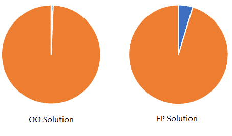

# 第十一章：实用函数式 C#

我不仅仅是一个漂亮的面孔¹，每天我还在虚拟 IT 煤矿工作，多年来，我也有幸在各种活动中花费了大量时间谈论这个主题²。在讲话时，有几个问题经常出现。

最常见的实际上是“为什么我们不直接使用 F#”。参见“关于 F# 的问题？我应该学习 F# 吗？”以了解我对这个特定问题的回答。这几乎每次我演讲时都会被问到，这也是我提供如此详细答案的原因之一。

奇怪的是，第二个最常见的问题是解释单子（我在第七章中有所描述）。希望在达到这一点后，你现在已经成为一个专家了。

在这些之后，下一个最常见的问题是关于性能的。有一种普遍的观念，即在生产代码中，与面向对象（OO）相比，C# 中的函数式编程效率低下。我想在书的这一部分，谈论一下性能问题，以及在采用日常生活中的函数式 C# 之前是否需要关注这个问题。或者，至少是涉及到 .NET 代码的日常生活。对我来说，这两件事有很大的重叠。

# 函数式 C# 和性能

现在，我将继续看看函数式 C# 和性能。为此，我需要一些代码作为测试主题，可以将其与命令式代码（即面向对象编程所属的编程范式）进行比较。

现在，我是年度编码活动“编程之旅”的忠实粉丝³，在他们 2015 年首次活动中发表的第一个挑战经常是我向人们推荐的一个很好的例子，展示了函数式思维如何产生影响。

问题在于：

输入是一个严格由字符 *(* 和 *)* 组成的字符串⁴。这些字符代表电梯的运动。一个 *(* 表示上升一层，一个 *)* 表示下降一层。我们从地面层开始，不用字母 *G*，而是用数字 0 表示，这意味着我们可以专门使用整数值表示当前楼层，负数表示地面以下的楼层。

这有两个部分，非常适合用于性能测试。第一部分是运行一系列指令并计算最终楼层。第二部分是找出哪个输入字符串的字符可以使你到达楼层 -1（即地下室）。

这里有一个例子给你。给定输入字符串 "((((“，我们先上升 3 层，然后下降 5 层，然后再上升 4 层。

对于第一部分，答案是 2，我们最终停留在的楼层，因为 3-5+4 = 2。

对于第二部分，答案是 6 - 第 7 个字符首先使我们处于-1 楼，但数组位置是 6，因为它是基于零的数组。

这两个谜题是明确和不定循环的绝佳示例，谜题提供的输入足够大（超过 7,000 个字符），这将导致代码需要一段时间才能运行。足够让我收集一些统计数据。

如果您关心剧透，请在继续之前前往页面⁵ 并解决谜题。只需知道，如果您使用功能性方法，您可以在一行中解决它！

好吧，现在警告剧透，这一节之后，我将进入一个完全剧透的解决方案，这个 - 目前 8 岁 - 谜题。

## 基线 - 一种命令式解决方案

在我准备好的各种功能性解决方案中看性能之前，我首先要看的是在命令式解决方案中性能是如何的。这是一种科学实验，为了是一个适当的实验，我们需要一个控制。一个基线，用来比较所有功能结果。

对于性能测量，我正在使用 Benchmark.NET。对于那些不熟悉这个工具的人来说，它在某些方面类似于单元测试，不同之处在于它将比较同一段代码的几个版本之间的性能。它运行相同的代码多次，以获得像运行时间和内存使用量之类的平均值。

以下完全使用命令式风格编码的两个谜题的解决方案。

```cs
// i.e. the definite loop
public int GetFinalFloorNumber(string input)
{
 var floor = 0;
 foreach(var i in input)
 {
  if(i == '(')
   floor++;
  else
   i--;
 }
 return floor;
}

// i.e. the indefinte loop
public int WhichCharacterEntersBasement(string input)
{
 var floor = 0;
 var charNo = 0;

 foreach(var i in input)
 {
  charNo++;
  if(i == '(')
   floor++;
  else
   floor--;

  if(floor == -1)
   return charNo;
 }
}
```

可能有更好的解决方案，但我觉得这个可以。

## 性能结果

现在这些测试是在我开发者的笔记本上针对一个 7,000 字符的输入进行的，因此在尝试复制此实验时，您可能看到的实际数字可能会有所不同。接下来几节的主要目的是比较相同测试设置的结果。

### 命令式基准结果

由于我的必须使用它的结果：

表 11-1。面向对象的性能结果

| 循环类型 | 平均花费时间 | 时间花费标准偏差 | 内存分配 |
| --- | --- | --- | --- |
| 明确 | 10.59μs^(a) | 0.108μs | 24b |
| 不定 | 2.226μs | 0.0141μs | 24b |
| ^(a) 这些是微秒。 |

尽管任务的规模很大，实际所需时间确实非常短。不错。不定循环更快，但您会预期到这一点 - 它不需要循环整个输入字符串。

在接下来的几节中，我将逐个 FP 实现每种循环类型，并看看这对性能有何影响。

### 明确循环解决方案

我确实说过可以在一行中解决这个问题，不是吗？虽然是一行相当长的代码，但还是一行。这是我的一行：

```cs
public int GetFinalFloorNumber(string input) =>
 input.Sum(x => x switch
 {
  '(' => 1,
  _ => -1
 });
```

我在其中放了一些换行符以便阅读，但技术上它仍然是单行！

我们正在进行一个`Sum`聚合方法，它根据当前字符在每次迭代中添加 1 或-1。请记住，在 C#中，`string`既是一小段文本*又*是一个数组，这就是为什么我可以像这样对它应用 LINQ 操作的原因。

这会对性能产生什么影响？我们来看看。

表 11-2. 求和聚合性能结果

| 解决方案 | 平均耗时 | 耗时标准偏差 | 分配内存 |
| --- | --- | --- | --- |
| 命令式基线 | 10.59μs | 0.108μs | 24b |
| 求和聚合 | 60.75μs | 0.38μs | 56b |

这里的性能确实更差，无法避免这一事实。这只是 LINQ 的开箱即用，因此即使使用 Microsoft 提供的工具之一，我们仍然不如命令式代码高效。

你觉得呢，现在我该放弃吗？不太可能！我还有几件事情想尝试。

如果我们将`char`→ `int`转换的过程分开成两行会有什么不同吗？

```cs
public int GetFinalFloorNumber(string input) =>
 input.Select(x => x == '(' ? 1 : -1).Sum();
```

这会有任何影响吗？

表 11-3. 选择然后求和聚合性能结果

| 解决方案 | 平均耗时 | 耗时标准偏差 | 分配内存 |
| --- | --- | --- | --- |
| 命令式基线 | 10.59μs | 0.108μs | 24b |
| 选择/求和聚合 | 84.89μs | 0.38μs | 112b |

嗯，实际上情况更糟。好吧，试试将其转换为另一种数据结构，比如字典，它具有出色的读取速度。

```cs
public int GetFinalFloorNumber(string input)
{
 var grouped = input.GroupBy(x => x).ToDictionary(x => x.Key, x => x.Count());
 var answer = grouped['('] - grouped[')'];
 return answer;
}
```

这次我正在创建一个`Grouping`，其中每个可能的`char`值是其中的一个`Group`。在我们的示例中，将只有两个带有`*`（或`）*的键的`Group`。一旦我获得了分组，我就从一个分组中减去另一个分组的大小，以获得最终的楼层（即从总向下移动次数中减去总向上移动次数）。

表 11-4. 选择然后求和聚合性能结果

| 解决方案 | 平均耗时 | 耗时标准偏差 | 分配内存 |
| --- | --- | --- | --- |
| 命令式基线 | 10.59μs | 0.108μs | 24b |
| 分组/字典聚合 | 93.86μs | 0.333μs | 33.18Kb |

不仅如此，分配的内存量还很可怕。

我仍然想尝试一个无限循环，还有一些其他事情，在我总结我对所有这些的看法之前。但目前来说 - 我觉得情况没有看起来那么糟糕。继续阅读以了解我的意思。

## 无限循环解决方案

现在我要试试几种解决无限循环谜题的方法 - 即输入字符串的哪个字符首先将我们带到地板-1。我不能说那会在哪里，但我们需要循环直到满足条件。

首先，我一直听说在 C#中递归是一个坏主意，如果你重视你的堆栈的话。让我们看看情况会有多糟糕。这是问题的递归解决方案：

```cs
public int WhichCharacterEntersBasement(string input)
{
 int GetBasementFloor(string s, int currentFloor = 0, int currentChar = 0) =>
  currentFloor == -1
   ? currentChar
   : GetBasementFloor(s[1..], s[0] ==
    '(' ? currentFloor + 1 : currentFloor - 1, currentChar + 1);

 return GetBasementFloor(input);

}
```

美好、整洁和紧凑。但性能损失如何？

表 11-5\. 递归循环性能结果

| 解决方案 | 平均时间花费 | 时间花费标准偏差 | 内存分配 |
| --- | --- | --- | --- |
| 命令基准 | 2.226μs | 0.0141μs | 24b |
| 递归循环 | 1,030ms | 4.4733μs | 20.7Mb |

这实在是相当震惊。请注意，这些时间结果是以*毫*秒计算的，而不是*微*秒。那是差了一千倍。内存使用量也太大，无法存储在旧软盘盒上。

你现在有了你需要的证据，如果需要的话，递归在 C#中是一个*非常*糟糕的想法。除非你确切知道你在做什么，否则我会完全避免它。

那么非递归的函数式解决方案呢？这些需要某种妥协。让我们从 “跳板操作” 中使用我的`IterateUntil`函数开始。这对性能有什么影响？

这是我的代码：

```cs
public int WhichCharacterEntersBasement(string input)
{
 var startingInput = new FloorState
 {
  InputString = input,
  CurrentChar = 0,
  CurrentFloor = 0
 };

 var returnValue = startingInput.IterateUntil(x =>
  x with
 {
  CurrentChar = x.CurrentChar + 1,
  CurrentFloor = x.InputString[x.CurrentChar] ==
   '(' ? x.CurrentFloor + 1 : x.CurrentFloor - 1
 }
, x => x.CurrentFloor == -1);

return returnValue.CurrentChar;

}

public record FloorState
{
 public string InputString { get; set; }
 public int CurrentFloor { get; set; }
 public int CurrentChar { get; set; }
}
```

这次我需要一些跟踪状态的东西。我正在尝试一种`record`类型，因为它们已经被提供给我们，允许编写更多功能代码。那么结果如何：

表 11-6\. 跳板操作性能结果

| 解决方案 | 平均时间花费 | 时间花费标准偏差 | 内存分配 |
| --- | --- | --- | --- |
| 命令基准 | 2.226μs | 0.0141μs | 24b |
| 跳板操作 | 24.050μs | 0.3215μs | 55.6Kb |

这次并不那么令人震惊，但仍然比命令式版本差。操作过程中存储的内存量仍然相当大。

如果我把`record`替换为微软提供的之前的函数式结构 - 元组，那会提高性能吗？

```cs
public int WhichCharacterEntersBasement(string input)
{
 var startingInput = (InputString: input, CurrentFloor: 0, CurrentChar: 0);

 var (_, _, currentChar) = startingInput.IterateUntil(x =>
 (
  x.InputString,
  x.InputString[x.CurrentChar] ==
   '(' ? x.CurrentFloor + 1 : x.CurrentFloor - 1,
  x.CurrentChar + 1
 ), x => x.CurrentFloor == -1);

 return currentChar;
}
```

不幸的是，这看起来并不那么友好。我喜欢`record`带给我们的可爱的语法糖，但如果性能是我们的目标，那么可读性和可维护性可能就要在其祭坛上牺牲了。

如果你看一下表 11-7，你会看到性能如何：

表 11-7\. 使用元组的跳板操作性能结果

| 解决方案 | 平均时间花费 | 时间花费标准偏差 | 内存分配 |
| --- | --- | --- | --- |
| 命令基准 | 2.226μs | 0.0141μs | 24b |
| 使用元组的跳板操作 | 17.132μs | 0.0584μs | 24b |

实际上这个相当明显更好。花费的时间仍然稍微差了一点，但分配的内存数量实际上完全相同！

我想要测试的最后一个测试是我在 “自定义迭代器” 中展示的自定义`Enumerable`选项。它与使用元组进行跳板操作的比较如何⁶

```cs
public class LiftEnumerable : IEnumerable<int>
{
 private readonly string _input;

 public LiftEnumerable(string input)
 {
  this._input = input;
 }

 public IEnumerator<int> GetEnumerator() => new LifeEnumerator(this._input);

 IEnumerator IEnumerable.GetEnumerator() => GetEnumerator();
}

public class LifeEnumerator : IEnumerator<int>
{
 private int _currentFloorNumber = 0;
 private int _currentCharacter = -1;
 private readonly string input;

 public LifeEnumerator(string input)
 {
  this.input = input;
 }

 public bool MoveNext()
 {
  var startingFloorNumber = this._currentFloorNumber;

  this._currentCharacter++;
  this._currentFloorNumber = startingFloorNumber == -1 ? -1 : this.input[this._currentCharacter] == '(' ? this._currentFloorNumber + 1 : this._currentFloorNumber - 1;

  return startingFloorNumber != -1;
 }

 public void Reset()
 {
  this._currentCharacter= -1;
  this._currentFloorNumber = 0;
 }

 public int Current => this._currentCharacter + 1;

 object IEnumerator.Current => Current;

 public void Dispose()
 {
 }
}

// The actual code call
public int WhichCharacterEntersBasement(string input)
{
 var result = new LiftEnumerable(input).Select(x => x);
 return result.Last();
}
```

这是一大堆代码，但它是否更高效呢？

表 11-8\. 自定义 Enumerable 性能结果

| 解决方案 | 平均时间花费 | 时间花费标准偏差 | 内存分配 |
| --- | --- | --- | --- |
| 命令基准 | 2.226μs | 0.0141μs | 24b |
| 自定义 Enumerable | 24.033μs | 0.1072μs | 136b |

这个版本的执行时间与使用 `record` 的 Trampolining 示例几乎相同，但在这个版本中分配了更多的数据。情况并不太糟，但仍然远远没有递归版本那么糟糕。

我们另一个选择是尝试将 F# 与 C# 互操作，以确保在 C# 无法正常运行时获得功能代码。让我们来看看这个选项。

## 与 F# 的互操作性能

实际上，可以在 F# 项目中编写代码，并在 C# 中引用它，就像它只是另一个 .NET 库一样。这是一个相当简单的过程，我会为您详细介绍。

在 Visual Studio 解决方案中创建一个新的项目，但选择下拉菜单中的 F# 而不是 C# 库。

您可以在您的 C# 代码中引用 F# 项目。请注意，除非单独编译 F# 项目，否则您编写的代码在 C# 中不可见。我不确定为什么会这样，但这是一个必要的步骤。

由于这是一本 C# 书籍，我不会详细介绍如何编写 F#，但看到如果我们绝对需要完全功能性的代码而不必与函数式 C# 的限制妥协时，性能将如何比较是很有趣的。

如果你感兴趣，这里有一个解决问题的 F# 方案——如果你不明白它如何工作也不用担心。我在这里呈现它作为一种珍品，而不是你需要学习的东西⁷。

```cs
module Advent =
 let calculateFinalFloor start input =
  input
  |> Seq.fold (fun acc c -> match c with | '(' -> acc+1 | ')' -> acc-1  | _ -> acc) start

 let whichStepIsTheBasement start input =
  input
  |> Seq.scan (fun acc c -> match c with | '(' -> acc+1 | ')' -> acc-1  | _ -> acc) start
  |> Seq.findIndex(fun i -> i = -1)
```

这段代码纯粹是函数式的。`Seq` 是 F# 中 `Enumerable` 的等效物，因此由于这两种类型的惰性加载特性，这里有一些很好的效率节省特性在起作用。

那么性能如何呢？F# 的高性能特性是否会因在 C# 通道上的引用而受到抵消？让我们看看表 11-9 的结果……

表 11-9\. F# 互操作性能结果

| 循环类型 | 解决方案 | 平均时间 | 时间标准偏差 | 内存分配 |
| --- | --- | --- | --- | --- |
| 确定性 | 命令基线 | 10.59μs | 0.108μs | 24b |
| 确定性 | F# 互操作 | 63.63μs | 0.551μs | 326b |
| 不确定性 | 命令基线 | 2.226μs | 0.0141μs | 24b |
| 不确定性 | F# 互操作 | 32.873μs | 0.1002μs | 216b |

结果仍然较差，但只差了几倍。如果您希望选择这条路线，这是一个可行的选择。但这将意味着首先学习 F#，而这远远超出了本书的范围。至少你知道将来有这个选择。

## 外部因素和性能

信不信由你，迄今为止我们看到的一切实际上都是与在 C# 代码之外与世界进行任何形式的交互相比显得不那么重要。让我给你展示一下我是什么意思。

在下一个实验中，我修改了原始 OO 基线函数和 FP 解决方案的最高效版本，即使用元组的版本。我将它们设置为不接受任何输入字符串，而是从存储在本地 Windows 文件系统中的文件中加载*相同*数据。从功能上看，我有相同的输入和相同的结果，但现在涉及到文件操作。

这会带来怎样的不同呢？好吧，表 11-10 恰好包含了答案...​

表 11-10。文件处理性能结果

| 循环类型 | 解决方案 | 平均耗时 | 耗时标准差 | 分配的内存 |
| --- | --- | --- | --- | --- |
| 确定 | 命令基线 | 10.59μs | 0.108μs | 24b |
| 确定 | 带文件的命令式 | 380.21μs | 15.187μs | 37.8Kb |
| 确定 | 带文件的 FP | 450.28μs | 9.169μs | 37.9Kb |
| 不确定 | 命令基线 | 2.226μs | 0.0141μs | 24b |
| 不确定 | 带文件的命令式 | 326.006μs | 1.7735μs | 37.8Kb |
| 不确定 | 带文件的 FP | 366.010μs | 2.2281μs | 93.22Kb |

这怎么样？函数式解决方案仍然需要更长的时间，但差异比例要小得多。当我们将内存中的 FP 解决方案与使用元组的确定循环与命令式等效进行比较时，FP 版本完成所需的时间大约是确定循环的 8.5 倍。当我们比较包含文件加载的两个版本时，所需时间的比例差仅约为 1.2 倍。并不是那么多。

想象一下，如果有 HTTP 调用到 Web API 或建立在网络上的数据库连接？我可以向你保证，所花费的时间会比我们在这里看到的要糟糕得多。

如果可以的话，请加入我，我们将在下一节中总结这些实验得出的结论。

# 这一切意味着什么？

首先 - 不可避免的事实是，函数式 C#比写得好的面向对象代码效率低。就是这样。

我们还可以证明，如果可能的话，尽可能紧凑地保持纯 LINQ 操作是函数式特性中最有效的。如果需要某种状态对象，则元组目前是最佳选择。不过，这假设性能是我们代码的最重要目标。总是这样吗？这完全取决于你试图实现什么，以及你的客户是谁。

如果你计划制作一个拥有高清 3D 图形的精致 VR 应用程序，那么老实说，你最好完全远离函数式编程。对于这样的事情，你需要尽可能地从代码中挤出每一丝性能，甚至更多。

那么其他人呢？我在许多不同的公司工作过，我会说在几乎所有这些公司中，对我开发工作的许多驱动因素中，性能并不一定是最关键的。

我大多数工作的是为公司内部员工设计的定制 Web 应用程序，作为他们日常工作负载的一部分。每当有需求交到我手上时，通常更重要的是快速完成并发布到生产环境，而不是花时间担心性能。

即使应用程序出现了减速问题，如今也很容易在 Azure 或 AWS 上点击按钮，添加额外的虚拟 RAM 芯片到虚拟服务器，问题基本上就解决了。

但是那旧的可恶的 RAM 芯片对业务的成本又如何？

嗯，怎么样？让我这样告诉你。函数式风格的 C# 比面向对象的等效方案更容易理解、修改和维护。我们可以更快地进行更改并发布，并且第一次就能确保一切顺利无错误地运行。

鉴于这一事实，对公司造成的成本更大的是什么？多一个虚拟 RAM 芯片，还是因为你做所有额外开发工作而导致的每小时时间成本，以及解决本不必要的 bug，否则这些 bug 将最终进入生产环境？

如果没有其他，函数式的 C# 更加愉快的开发体验，确保工作环境能让每个人都开心，这难道不重要吗？

无论如何 - 即使我谈到了可能需要更多 RAM 的潜在需求，我们真的需要它吗？

在本章前面我做过的实验中，你可以看到，尽管函数式解决方案比面向对象的等效方案需要更多时间 - 但一旦我们涉及文件操作，其比例差异实际上并不是很大。几乎不足以开始担心。

这里是两种使用文件作为输入的解决方案的性能结果。每个饼图的两个部分分别表示加载文件所需的时间和处理已加载数据所需的时间。



###### 图 11-1\. 使用文件操作进行性能测试的比较

当你换个角度看时，情况并不那么糟糕，是吗？除非你真的正在处理每个性能损失都有财务后果的项目。如果是这样，我建议你放下这本书，转而拿起一本关于*高性能 .NET 代码*的书籍。这类书有几本。

如果你对性能不那么专注，而更愿意使用易于维护的更优雅的代码，那么我建议任何性能上的微小损失都是值得付出的代价，以便以这种风格编写代码。

就像往常一样，这取决于你。你个人的编码偏好。你工作环境的限制以及你所在团队的情况。当然，还有你试图开发的东西。

你是成年人⁸，所以我会让你自己决定。

在本章的第二部分中，我将考虑在生产环境中使用功能化 C# 时可能遇到的几个实际问题，以及对每个问题的看法。

# 功能化的 C# 关注点与问题

好了，时间不等人。让我们开始吧。第一个问题，请！

## 我应该将我的代码库做多功能化吗？

功能化的 C# 的一个美妙之处在于，功能性内容并不是框架的一部分。你可以选择多少功能化程度，这个滑动尺度可以任意调整。

你可以决定使整个代码库变得功能化。或者限制在一个项目中。一个类。一个函数。或者 - 必要时 - 一行代码。在同一个函数中混合功能性和非功能性是可行的。我可能不会这样做。但关键是你*可以*。

我不是纯粹主义者。我理解在生产环境中，除了使代码完全符合你的期望之外，还有各种其他问题需要考虑。

不仅是*在哪里*应该是功能化，还有到*何种程度*。你想全面采用。使用部分应用，单子，辨识联合和其他内容。或者 - 你可能只是觉得用大量的 LINQ 替换`While`循环。也可以。你感觉舒服就好。没有必要觉得自己是事业的叛徒。我们是开发者，不是犹太人民阵线⁹。

另一个考虑因素是你的同事对功能性有多舒适。请考虑，无论你的功能性代码有多么美好，它仍然需要团队维护。我会认为单子类型并不是很难理解，但在他们准备好支持包含这些代码之前，你仍然需要说服每个人学会如何使用它们。即使这可能符合他们的最佳利益。

你可以引马到水，但那…​

正如我一直在说的 - 最终，你必须问自己一个问题，“我想要达到什么目标？”。一旦你诚实地回答了这个问题，你的决策过程应该相对容易。

你可以在办公室四处放几本这本书。看看会发生什么。我不知道你在出版日期之后多久开始阅读这本书，但甚至有可能我仍然在。随时可以让人们联系我提问。

## 我应该如何组织一个功能化的 C# 解决方案？

在类和文件夹中，与现有的 OO C# 项目基本相同。严格来说，类并*不*是一个功能概念。如果你看看 F# 项目，它们根本不一定有类。

你可以把所有的代码放在模块中，但它们并不完全相同。它们是 F# 开发者将代码分组的便捷方式。更像是 C# 的命名空间。模块本身没有功能含义。

另一方面，在 C#中，*必须*有类。没有其他办法，所以这仍然是你必须做的事情。

在纯函数式风格的 C#中，你可以使每个类和函数都是静态的。不过，如果你这样做了，我确信你在某个地方会遇到实际问题¹⁰，特别是当你必须尝试与 Nuget 或内置的 Microsoft 类之一进行交互时。

缺乏依赖注入也会使单元测试变得更加困难。像 Haskell 这样的语言通过使用各种 Monad 来解决这个问题。不过，在 C#中，我会让你的生活变得简单，只需使用标准类和一个 IoC 容器，希望你已经在使用了。

## 如何在应用程序之间共享我的函数方法？

我维护一组充满类和扩展方法的函数库，这些库提供了我想在代码中使用的所有 Monad、Discriminiated Unions 和其他有用的扩展方法的实现。通常我在解决方案中有一个名为“Common”的单独项目，我会把任何通用的东西放在那里。这样它就可以在代码库的某个地方使用，但在我继续工作时我不一定要再看一遍。

我的 Common 项目的内容目前是从一个解决方案复制到另一个解决方案。

在工作中的某个时候，我们计划建立我们自己的 Nuget 本地实例，当我们这样做时，我们可能会将 Common 项目设置为可消耗的 Nuget 包。这将使分发错误修复、改进、新功能等变得容易。不过，目前来说，每次复制大部分时间都能正常工作。

## 你点了这个披萨吗？

Erm，我不太确定。看起来像是放了凤尾鱼，所以可能不适合我。我点了一份肉盛宴。让我去和利亚姆确认一下，我觉得那可能是他的。5 秒，我马上回来...

## 如何说服我的团队成员也这样做？

很好的问题。当你弄清楚如何始终如一地做到这一点时，告诉我你是如何做到的。

我已经在这个主题上发表演讲很长时间了，对函数式编程的反应似乎分为几类：

+   天啊！这是开发的圣杯！我要更多！

+   这有点有趣，但我想我会继续按照我一直以来的方式工作，谢谢。

+   这太糟糕了。噢！

我无法给你任何关于每个阵营有多少人的真实统计数据，但我感觉大约是第一组和最后一组中的人数很少，而中间的大多数人。

鉴于这种情况，作为函数式编程倡导者，我们的工作是试图说服他们改变他们的方式。请记住，大多数人类都是习惯于习惯的生物，不太愿意像那样对他们的日常生活进行巨大的改变 - 除非有一个很好的理由。

还要看你工作的地方以及项目的约束条件是什么。如果你正在创建每一个内存位都至关重要的移动应用程序，或者为 VR 设备上的 3D 图形系统创建代码，你可能会发现功能性编程很难推广。

如果你不这样做，可能会有一种可能性，你可以通过谈论这些好处来说服每个人。只是不要变成一个功能性编程的乏味人物。可能会有一个时刻，显而易见地，大家都没有兴趣。在那一点上，最好暂时停止，并希望通过消耗战赢得长期的胜利，而不是通过大胆的正面进攻。

我要关注的好处，大致按降序排列，是：

+   可靠性 - 功能性应用程序往往更加健壮。失败的可能性较小。功能性编程还极大地促进了单元测试。因此，遵循这种范式，你最终将获得更高质量的产品，失败率更低。这将为公司节省大量时间，避免在生产中解决 bug 所需的时间。

+   开发速度 - 一旦你熟悉了这种范式，使用功能性范式编写代码通常更快、更容易！由于功能性代码的结构方式，增强功能特别容易。我会谈论在初始开发阶段能够节省的时间和金钱。

+   微软支持 - 这是.NET 团队的一个明确目标，即支持功能性范式。谈谈这种编程风格并不是在滥用.NET，实际上是*使用*它的本意。大部分情况下……

+   易于学习 - 希望你现在读到这本书的这一点后，会有这种感觉。我不觉得功能性编程很难学，至少一旦你摒弃了所有的正式定义和听起来吓人的术语。事实上，采用 FP 所需学习的内容*比*新开发者完全学习面向对象范式所需的要少。我会向所有人保证，学习的负担并不大。

+   挑选并选择 - 还要提到，你可以根据需要采纳这种范式的多少。这并不意味着你需要放弃你的旧代码库，转移到完全不同的代码库上。你可以从重构一个单一函数开始小规模尝试，你甚至可能不选择使用单子（虽然我认为你应该！）。

+   这并不新鲜！ - 最终可能值得讨论功能性范式的年龄。许多公司可能不愿意采纳一个尚未证明能够持续足够时间值得投资的新潮技术。这是一个合理的担忧，但 FP 作为软件开发概念首次使用于 1960 年代，并且其根源可以追溯到 19 世纪末期。它在生产环境中已经被证明了无数次。

我真的*不会*立即开始谈论单子的三大法则、F#、柯里化或类似的事情。尽量让一切尽可能熟悉。

除了自己谈论它，这里还有这本书，以及许多其他关于这个主题的好书。接下来的一节中，我会推荐我最喜欢的那些书。

## 在我的解决方案中包含 F# 项目值得吗？

由你决定。在性能方面，据我所知并没有真正的问题。

最好的用法可能是考虑将代码库中深层次、基于规则的部分制作为 F#。这些函数基于一组业务需求将数据从一种形式转换为另一种形式。

F# 很可能会使那些部分更加整洁、更加健壮和更加高效。

如果你追求的是函数式编程，它将比 C# 能做的事情更加功能强大。

我唯一考虑的事情是你的团队是否愿意支持它。如果他们愿意 - 太好了。去做吧。如果不愿意，与他们一起讨论。这种决定需要大家一起做出。

如果你的团队对 C# 不太熟悉，至少可以安心的是大部分的函数式编程范式在 C# 中仍然存在。

## 函数式编码会解决我所有的问题吗？

取决于你面临的问题是什么？

函数式编程不太可能改善你的扑克游戏，或在你需要时为你冲杯咖啡。

它肯定会为你提供一个更好的代码库，在生产中运行更佳，并且未来支持起来也更容易。

对于一个下定决心写糟糕代码的人，或者某天懒惰并犯错，这仍然是可能的。地球上没有什么¹¹可以阻止这种情况发生。除了强制执行自动化测试、代码审查和手动质量检查之类的常规方法。这些方法从开发行业开始就一直存在。

然而，函数式风格的编码将使问题更容易*发现*。它简洁的风格使得一眼就能看出一个函数实际*做了*什么，以及它是否真正做到了其名称所暗示的。

如前面本章中所述，函数式编程也不会是解决你编码需求中*最*高效的解决方案，但它足够接近，除非绝对的性能极限对你很重要，否则它很可能是完全合适的。

这些都不会帮助你解决任何常规项目管理问题。对于需求不明确的问题，你得自己和你信任的任何业务分析师解决。

函数式编程会让你看起来很酷。孩子们甚至可能在你路过时向你竖起大拇指。这就是函数式编程的街头声誉。真实事实。

## 康纳利、摩尔还是克雷格？

以上都不是，我是蒂莫西·道尔顿的铁杆粉丝。他值得更多关注。

## 通过函数式思考问题

这并不是一种编写软件的唯一方式，就像没有*一种*软件开发方式一样。不过，如果有帮助的话，我会简要描述我的过程。

我会首先思考你尝试编写的代码的*逻辑*步骤。我是说，试着将其分解为你与他人讨论工作时会描述的步骤。即“首先我会做 X，然后我会做 Y，然后 Z”。这并不是一种你可以特别适用于面向对象风格代码的工作方式，但实际上却是分解函数式代码的最佳方式。

然后，我会根据这些步骤编写每一段函数式代码。

同时，在任何可能的情况下，我建议将你正在处理的任何内容作为`Enumerable`的一部分，无论是基本类型、复杂对象还是`Func`委托。函数式编程在运行类似于 T-SQL 的基于列表的操作时往往最为有效。

我建议不要让函数链变得太长。在开发过程中，你需要有机会检查复杂计算的先前步骤，以确保一切按你的期望工作。这也让你有机会为每个阶段的过程应用有意义的名称。

函数式编程非常支持单元测试，因此我建议尽可能将整个过程分解为尽可能多的小函数，并确保你已经尽可能彻底地测试了每一个函数。

如果你有能力逻辑上分解步骤，那么尽可能充分利用它。

# 结论

本章是一个两面性的游戏。

在第一部分中，我们考虑了函数式代码性能差的神话，并希望在某种程度上揭开它。我们看到这是一个真实的现象，但与你的代码中的任何 I/O 量相比，其差异微不足道。

在第二部分中，我们考虑了工业环境中函数式编程的一些更深奥的哲学问题。

函数式编程将在《你死我活》第十二章中回归。届时，我将探讨使用 Nuget 第三方包进行函数式编程的选项。

¹ 好吧，我甚至都不是那样，但请让我保留我的幻想，好吗！

² 不然我会让家人听我吹牛。

³ 网站链接在此处：[*https://adventofcode.com/*](https://adventofcode.com/)。每天两个编码挑战，为期 24 天，直到圣诞节。我从未能够实时完成这样的事件，但这些都是极好的难题。

⁴ 或者“lift”，对于我的同胞们来说

⁵ 你可以在此找到它：[*https://adventofcode.com/2015/day/1*](https://adventofcode.com/2015/day/1)，玩得开心！

⁶ 现在，快速十次说出**那**个词！我敢你试试看！

⁷ 再次感谢 F#大师 Ian Russell 提供的这段代码。

⁸ 可能吧。如果你不是这样，而且你读到了这么远，那么你将在生活中取得成功！

⁹ 分离者！

¹⁰ 彩虹之上？

¹¹ 或许这也毫无意义，但谁知道呢…​
