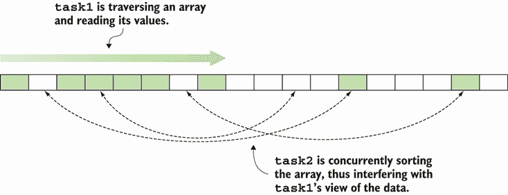
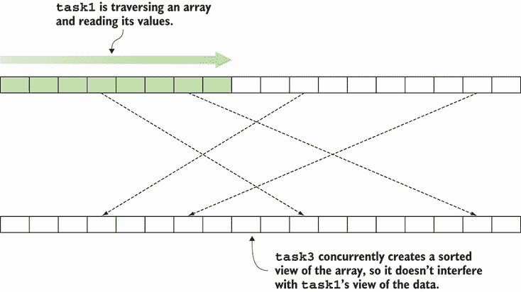

# 1 介绍函数式编程

本章涵盖

+   函数式编程的好处和原则

+   C# 语言的函数式特性

+   使用记录和模式匹配进行类型驱动程序

函数式编程（FP）是一种编程*范式*：一种不同于你可能习惯的主流命令式范式的思考程序的方式。因此，学习以函数式思考是具有挑战性的，但也是非常有益的。我的目标是，在阅读这本书之后，你将永远以不同的眼光看待代码！

学习过程可能是一段颠簸的旅程。你可能会从对看似晦涩或无用的概念感到沮丧，到当你脑海中有所领悟，能够用几行优雅的函数式代码替换一大堆命令式代码时的兴奋。本章将解答你在开始这段旅程时可能有的疑问。函数式编程究竟是什么？我为什么要关心？我能在 C#中进行函数式编程吗？这值得付出努力吗？

## 1.1 这个东西叫什么函数式编程？

函数式编程（FP）究竟是什么？从高层次来看，它是一种强调函数同时避免状态变化的编程风格。这个定义已经包含两个基本概念：

+   函数作为一等值

+   避免状态变化

让我们看看这些意味着什么。

在 REPL 中运行代码片段

随着你阅读本章和书中的代码片段，我鼓励你在 REPL 中输入它们。*REPL*（读取-评估-打印-循环）是一个命令行界面，允许你通过输入语句来实验语言，并立即获得反馈。你可能想尝试我展示的示例的一些变体；通过实际代码的实验来弄脏你的手将让你更快地学习。

如果你使用 Visual Studio，可以通过转到视图 > 其他窗口 > C#交互式来启动 REPL。或者，你可以使用 LINQPad。不幸的是，在撰写本文时，这些选项仅在 Windows 上可用。在其他操作系统上，你可以使用`csi`命令，尽管它不是功能最丰富的。

### 1.1.1 函数作为一等值

在一个将函数作为一等值的语言中，你可以将它们用作其他函数的输入或输出，你可以将它们赋值给变量，并将它们存储在集合中。换句话说，你可以对函数执行所有可以对任何其他类型的值执行的操作。

例如，将以下列表的内容输入到 REPL 中。

列表 1.1 使用函数作为一等值的简单示例

```
var triple = (int x) => x * 3;             ❶

var range = Enumerable.Range(1, 3);        ❷

var triples = range.Select(triple);        ❸

triples // => [3, 6, 9]
```

❶ 定义一个返回给定整数三倍的函数

❷ 创建一个包含值 `[1,` `2,` `3]` 的列表

❸ 将 `triple` 应用到范围内的所有值

在这个例子中，你调用`Select`（`IEnumerable`上的扩展方法），给它传递范围和`triple`函数作为参数。这创建了一个新的`IEnumerable`，它包含通过将`triple`函数应用于输入范围中的每个元素而获得的所有元素。

注意，在 C# 10 之前，你需要像这样显式声明`triple`的委托类型：

```
[source,csharp]

Func<int, int> triple = x => x * 3;
```

列表 1.1 中的代码演示了函数在 C#中确实是第一等值，因为你可以将乘以 3 的函数分配给变量`triple`，并将其作为`Select`的参数。在整个书中，您将看到将函数视为值可以使您编写强大而简洁的代码。

### 1.1.2 避免状态突变

如果我们遵循函数式范式，我们应该完全避免状态突变：一旦创建，对象*永远不会*改变，变量也不应该被重新分配（因此，实际上，它们在名称上只是*变量*）。术语*突变*表示值在原地被更改，更新存储在内存中的某个位置的价值。例如，以下代码创建并填充了一个数组，然后它原地更新了数组中的一个值：

```
int[] nums = { 1, 2, 3 };
nums[0] = 7;

nums // => [7, 2, 3]
```

这种更新也被称为*破坏性更新*，因为更新之前存储的值被破坏。在函数式编程中，应该始终避免这种更新。（纯函数式语言根本不允许原地更新。）

依据这个原则，排序或过滤列表不应该原地修改列表，而应该创建一个新的、适当过滤或排序的列表，而不影响原始列表。将以下列表中的代码输入到 REPL 中，以查看使用 LINQ 的`Where`和`OrderBy`函数排序或过滤列表时会发生什么。

列表 1.2 函数式方法：`Where`和`OrderBy`创建新的列表

```
var isOdd = (int x) => x % 2 == 1;
int[] original = { 7, 6, 1 };

var sorted = original.OrderBy(x => x);
var filtered = original.Where(isOdd);

original // => [7, 6, 1]      ❶
sorted   // => [1, 6, 7]      ❷
filtered // => [7, 1]         ❷
```

❶ 原始列表不受影响。

❷ 排序和过滤产生了新的列表。

如您所见，原始列表不受排序或过滤操作的影响，这些操作产生新的`IEnumerable`s。让我们看看以下列表中的反例。如果你有一个数组，你可以通过调用它的`Sort`方法原地对其进行排序。

列表 1.3 非函数式方法：`List<T>.Sort`原地排序列表

```
int[] original = { 5, 7, 1 };
Array.Sort(original);

original // => [1, 5, 7]
```

在这种情况下，排序后，原始顺序被破坏。我们将在下面看到这是为什么有问题。

注意：你在.NET 库中看到函数式和非函数式方法的原因是历史性的：`Array.Sort`早于 LINQ，LINQ 标志着向函数式方向的一个决定性转变。

### 1.1.3 编写具有强保证的程序

在我们刚刚讨论的两个概念中，函数作为一等值最初似乎更有趣，我们将在第二章集中讨论它。但在我们继续之前，我想简要说明避免状态突变为什么也非常有益——它消除了由可变状态引起的许多复杂性。

让我们来看一个例子。（我们将在更详细地回顾这些主题，所以如果你现在对某些内容不清楚，请不要担心。）将以下列表中的代码输入到 REPL 中。

列表 1.4 从并发过程中修改状态

```
using static System.Linq.Enumerable;                 ❶
using static System.Console;                         ❶

var nums = Range(-10000, 20001).Reverse().ToArray();
// => [10000, 9999, ... , -9999, -10000]

var task1 = () => WriteLine(nums.Sum());
var task2 = () => { Array.Sort(nums); WriteLine(nums.Sum()); };

Parallel.Invoke(task1, task2);                       ❷
// prints: 5004 (or another unpredictable value)
//         0
```

❶ 允许你无需完全限定即可调用 `Range` 和 `WriteLine`

❷ 并行执行两个任务

在这里，你定义 `nums` 为介于 10,000 和 -10,000 之间的所有整数的数组；它们的总和显然应该是 0。然后你创建两个任务：

+   `task1` 计算并打印总和。

+   `task2` 首先对数组进行排序，然后计算并打印总和。

如果独立运行，每个任务都能正确地计算总和。但是，当你并行运行这两个任务时，`task1` 得出的结果是不正确且不可预测的。这很容易理解。当 `task1` 读取数组中的数字以计算总和时，`task2` 正在重新排列数组中的元素。这有点像在别人翻页的同时阅读一本书：你会读到一些混乱的句子！这在图 1.1 中有图形表示。



图 1.1 就地修改数据可能会给并发线程提供一个错误的数据视图。

如果我们使用 LINQ 的 `OrderBy` 方法，而不是就地排序列表，会怎样呢？让我们来看一个例子。

```
var task3 = () => WriteLine(nums.OrderBy(x => x).Sum());
Parallel.Invoke(task1, task3);

// prints: 0
//         0
```

如你所见，使用 LINQ 的函数式实现即使在并行执行任务时也能给出可预测的结果。这是因为 `task3` 并没有修改原始数组，而是创建了一个完全新的数据视图，该视图已排序：`task1` 和 `task3` 并发地从原始数组中读取，但并发读取不会导致任何不一致，如图 1.2 所示。



图 1.2 函数式方法：创建原始结构的新的修改版本

这个简单的例子说明了更广泛的真理：当开发者在命令式风格（显式地修改程序状态）编写应用程序，后来引入并发（由于新需求或提高性能的需要）时，他们不可避免地会面临大量工作，并可能遇到一些难以解决的错误。如果一个程序从一开始就是以函数式风格编写的，那么并发通常可以免费添加或以大大减少的努力来实现。我们将在第三章和第十一章中更详细地讨论状态修改和并发。现在，让我们回到我们对函数式编程（FP）的概述。

尽管大多数人都会同意将函数视为一等值并避免状态修改是函数式编程（FP）的基本原则，但它们的运用引发了一系列实践和技术，因此关于哪些技术应该被认为是基本并包含在本书中的讨论是有争议的。我鼓励你对此问题采取实用主义的方法，并尝试将 FP 理解为 *一套工具*，你可以使用这些工具来解决你的编程任务。随着你学习这些技术，你将开始从不同的角度看待问题：你将开始以函数式的方式思考。

现在我们已经有了函数式编程的工作定义，让我们来看看 C#语言本身及其对函数式编程技术的支持。

函数式与面向对象？

我经常被要求比较和对比函数式编程与面向对象编程（OOP）。这并不简单，主要是因为对 OOP 应该是什么样子的假设存在冲突。

理论上，面向对象编程（OOP）的基本原则（封装、数据抽象等）与函数式编程的原则是正交的，因此没有理由认为这两种范式不能结合。

然而，在实践中，大多数面向对象（OO）开发者在其方法实现中严重依赖命令式风格，就地修改状态并使用显式控制流；他们在大型设计中使用面向对象设计，在小型设计中使用命令式编程。真正的问题是命令式与函数式编程之间的对比。

另一个有趣的问题是函数式编程（FP）与面向对象编程（OOP）在构建大型、复杂应用程序方面的区别。构建复杂应用程序的困难艺术依赖于以下原则。它们通常是有效的，无论所讨论的组件是函数、类还是应用程序：

+   *模块化*——软件应由离散、可重用的组件组成。

+   *关注点分离*——每个组件应该只做一件事。

+   *分层*——高级组件可以依赖于低级组件，但反之则不然。

+   *松耦合*——一个组件不应该了解它所依赖的组件的内部细节；因此，对组件的更改不应影响依赖于它的组件。

这些原则也绝不是面向对象的特定，因此可以使用相同的原理来构建函数式风格的应用程序。区别将在于组件是什么以及它们公开的 API。在实践中，对纯函数（我们将在第三章中讨论）和可组合性（第七章）的函数式强调使实现某些设计目标变得容易得多.^a

^a 关于为什么命令式风格的面向对象编程是（而不是解决）程序复杂性的原因的更深入讨论，请参阅本·莫斯利和彼得·马克斯（2006 年 11 月）撰写的文章“Out of the Tar Pit”，网址为[`mng.bz/xXK7`](http://mng.bz/xXK7)。

## 1.2 C#语言有多函数式？

函数确实是 C#中的一等值，如前文示例所示。实际上，C#从语言的最早期版本开始就支持函数作为一等值，通过`Delegate`类型，随后引入的 lambda 表达式使语法支持更加完善。我们将在第二章中回顾这些语言特性。

在类型推断方面，有一些怪癖和限制，我们将在第十章中讨论，但总的来说，对函数作为一等值的支持相当不错。

至于支持避免原地更新的编程模型，这个领域的根本要求是语言必须具备垃圾回收功能。因为你创建了现有数据结构的修改版本，而不是在原地更新它们的值，所以你希望旧版本在需要时被垃圾回收。同样，C# 满足了这一要求。

理想情况下，语言还应该*阻止*原地更新。长期以来，这是 C# 最大的不足：默认情况下所有内容都是可变的，而且没有简单的方法来定义不可变类型，这在函数式编程风格中是一个障碍。但随着 C# 9 中记录的引入，这一切都发生了改变。正如你在 1.2.3 节中将会看到的，记录允许你定义自定义的不可变类型，而不需要任何样板代码；实际上，定义记录比定义“普通”类还要简单。

由于随着时间的推移添加了这些特性，C# 9 为许多函数式技术提供了良好的语言支持。在这本书中，你将学习如何利用这些特性，并解决任何不足。接下来，我们将回顾一些与 FP 特别相关的 C# 语言特性。

### 1.2.1 LINQ 的函数式特性

当 C# 3 发布时，伴随着 .NET Framework 3.5 版本的推出，它包含了一系列受函数式语言启发的特性，包括 LINQ 库 (`System.Linq`) 以及一些新的语言特性，这些特性使得你可以使用 LINQ 做更多的事情。这些特性包括扩展方法、lambda 表达式和表达式树。

LINQ 确实是一个函数式库（正如你可能注意到的，我之前使用 LINQ 来说明 FP 的两个原则）。随着你在这本书中的进展，LINQ 的函数式特性将变得更加明显。

LINQ 为列表（或更普遍地，对“序列”，因为 `IEnumerable` 的实例在技术上应该被称为）上的许多常见操作提供了实现，其中最常见的是映射、排序和过滤，请参阅“序列的常见操作”侧边栏。以下是一个结合所有三个操作的示例：

```
Enumerable.Range(1, 100).
   Where(i => i % 20 == 0).
   OrderBy(i => -i).
   Select(i => $"{i}%")
// => ["100%", "80%", "60%", "40%", "20%"]
```

注意到 `Where`、`OrderBy` 和 `Select` 都接受函数作为参数，并且不会修改给定的 `IEnumerable`，而是返回一个新的 `IEnumerable`。这说明了你之前看到的 FP 的两个原则。

LINQ 不仅简化了内存中对象的查询（LINQ to Objects），还简化了各种其他数据源，如 SQL 表和 XML 数据。C# 程序员已经将 LINQ 作为处理列表和关系数据的标准工具集（这占典型代码库中相当大的比例）。从积极的一面来看，这意味着你将已经对函数式库的 API 有了一定的了解。

另一方面，当与其他类型一起工作时，C# 程序员通常坚持使用流程控制语句的命令式风格来表示程序的预期行为。因此，我所看到的多数 C# 代码库都是函数式风格（当处理 `IEnumerable` 和 `IQueryable` 时）和命令式风格（当处理其他所有内容时）的混合体。

这意味着，尽管 C# 程序员了解使用 LINQ 等函数式库的好处，但他们并没有足够接触 LINQ 的设计原则，以在他们的设计中利用这些技术。这正是本书旨在解决的问题。

序列上的常见操作

LINQ 库包含许多执行常见序列操作的方法，如下所示：

+   *映射*——给定一个序列和一个函数，映射会产生一个新的序列，其元素是通过将给定的函数应用于原序列中的每个元素获得的（在 LINQ 中，这是通过 `Select` 方法实现的）：

    ```
    Enumerable.Range(1, 3).Select(i => i * 3) // => [3, 6, 9]
    ```

+   *过滤*——给定一个序列和一个谓词，过滤会产生一个新的序列，包含所有满足谓词的原序列元素（在 LINQ 中，这是通过 `Where` 实现的）：

    ```
    Enumerable.Range(1, 10).Where(i => i % 3 == 0) // => [3, 6, 9]
    ```

+   *排序*——给定一个序列和一个键选择函数，排序会产生一个序列，其中原序列的元素按键排序（在 LINQ 中，这是通过 `OrderBy` 和 `OrderByDescending` 实现的）：

    ```
    Enumerable.Range(1, 5).OrderBy(i => -i) // => [5, 4, 3, 2, 1]
    ```

### 1.2.2 编程函数式的简写语法

C# 6、C# 7 和 C# 10 并不是革命性的发布，但它们包含了许多较小的语言特性，这些特性结合起来提供了更符合语法的语法，从而为函数式编程提供了更好的体验。以下列表展示了这些特性的一些示例。

列表 1.5 与函数式编程相关的 C# 习惯用法

```
using static System.Math;                       ❶

public record Circle(double Radius)
{
   public double Circumference                  ❷
      => PI * 2 * Radius;                       ❷

   public double Area
   {
      get
      {
         double Square(double d) => Pow(d, 2);  ❸
         return PI * Square(Radius);
      }
   }
}
```

❶ 使用 `using static` 允许无限定访问 `System.Math` 的静态成员，如 `PI` 和 `Pow`。

❷ 表达式属性

❸ 局部函数是在另一个方法中声明的函数。

使用 `using static` 指令导入静态成员

C# 6 中引入的 `using static` 指令允许你导入一个类的静态成员（在列表 1.5 中，是 `System.Math` 类）。因此，在这个例子中，你可以直接调用 `Math` 的 `PI` 和 `Pow` 成员，无需进一步限定：

```
using static System.Math;

public double Circumference
   => PI * 2 * Radius;
```

这为什么重要呢？在函数式编程（FP）中，我们更喜欢那些行为仅依赖于输入参数的函数，因为我们可以独立地推理和测试这些函数（与实现通常与实例变量交互的实例方法形成对比）。这些函数在 C# 中实现为静态方法，因此 C# 中的函数式库主要由静态方法组成。

`using static` 允许你更轻松地使用此类库。在 C# 10 中，这一点尤为明显，其中 `global using static` 允许你在整个项目中提供函数。尽管过度使用这些指令可能导致命名空间污染，但合理使用可以使代码更清晰、易读。

使用表达式体成员的更简洁的函数

我们使用`=>`引入的*表达式体*来声明`Circumference`属性，而不是使用通常的由花括号包围的*语句体*：

```
public double Circumference
   => PI * 2 * Radius;
```

注意这与列表 1.5 中的`Area`属性相比要简洁得多！

在 FP 中，我们倾向于编写许多简单的函数，其中许多是一行代码，然后将这些函数组合成更复杂的流程。表达式体方法允许你以最小的语法噪声来完成这项工作。当你想要编写一个返回函数的函数时，这一点尤为明显——你将在本书中看到很多这种情况。

表达式体语法是在 C# 6 中为方法和属性获取器引入的。在 C# 7 中，它被推广到也适用于构造函数、析构函数、获取器和设置器。

在函数内声明函数

编写许多简单的函数意味着许多函数只从一个位置调用。C# 允许你通过在另一个函数的作用域内声明一个函数来明确这一点。实际上有两种方法可以做到这一点；我偏爱的方法是使用委托：

```
[source,csharp]

get
{
   var square = (double d) => Pow(d, 2);
   return PI * square(Radius);
}
```

此代码使用 lambda 表达式来表示函数，并将其分配给`square`变量。（在 C# 10 中，编译器推断`square`的类型为`Func<double, double>`，因此你可以使用`var`关键字来声明它。）我们将在第二章中更深入地探讨 lambda 表达式和委托。

另一种可能性是使用*局部函数*，这实际上是在方法内部声明的函数——这是一个在 C# 7 中引入的特性。

```
get
{
   double Square(double d) => Pow(d, 2);
   return PI * Square(Radius);
}
```

由于这个原因，lambda 表达式和局部函数都可以引用封装作用域内的变量，编译器实际上为每个局部函数生成一个类。为了减轻可能的影响，如果局部函数不需要访问封装作用域中的变量，就像在这个例子中一样，C# 8 允许你将局部函数声明为`static`，如下所示：

```
static double Square(double d) => Pow(d, 2);
```

如果你从标记为`static`的局部函数中引用封装作用域中的变量，你会得到一个编译器错误。

### 1.2.3 对元组的语言支持

C# 7 引入了创建和消费元组的新轻量级语法，类似于许多其他语言中的语法。这是 C# 7 中引入的最重要特性。¹

在实践中元组有何用途，为什么它们与 FP 相关？在 FP 中，我们倾向于将任务分解成小的函数。你可能会得到一个数据类型，它的唯一目的是捕获一个函数返回的信息，并且另一个函数期望作为输入。为这样的结构定义专用类型是不切实际的，这些结构并不对应于有意义的领域抽象。这就是元组发挥作用的地方。

让我们来看一个例子。假设你有一个货币对标识符，例如 EURUSD，它标识了欧元/美元的汇率，你希望将其拆分为两部分：

+   *基础货币*（EUR）

+   *报价货币*（USD）

为了做到这一点，你可以定义一个通用函数，该函数在给定的索引处拆分字符串。以下示例展示了此操作：

```
public static (string, string)                    ❶
   SplitAt(this string s, int at)
   => (s.Substring(0, at), s.Substring(at));      ❷

var (baseCcy, quoteCcy) = "EURUSD".SplitAt(3);    ❸
baseCcy  // => "EUR"
quoteCcy // => "USD"
```

❶ 将元组声明为方法的返回类型

❷ 构建一个元组

❸ 解构元组

此外，你还可以为元组的元素分配有意义的名称。这允许你像属性一样查询它们：

```
public static (string Base, string Quote)    ❶
   AsPair(this string ccyPair)
   => ccyPair.SplitAt(3);

var pair = "EURUSD".AsPair();
pair.Base  // => "EUR"                       ❷
pair.Quote // => "USD"                       ❷
```

❶ 为返回的元组元素分配名称

❷ 通过名称访问元素

让我们看看另一个例子。你知道你可以使用`Where`与谓词一起过滤列表中的值：

```
var nums = Enumerable.Range(0, 10);
var even = nums.Where(i => i % 2 == 0);

even // => [0, 2, 4, 6, 8]
```

如果你想知道满足谓词的元素以及那些不满足的元素，以便分别处理它们，我可以定义一个名为`Partition`的方法，该方法返回包含两个列表的元组：

```
var (even, odd) = nums.Partition(i => i % 2 == 0);

even // => [0, 2, 4, 6, 8]
odd  // => [1, 3, 5, 7, 9]
```

正如这些示例所示，元组语法允许你优雅地编写和消费需要返回多个值的函数。没有必要定义一个专门的数据类型来组合这些值。

### 1.2.4 模式匹配和记录类型

在本书第一版出版后出现的 C# 8 和 9 版本，为我们带来了两个直接受函数式语言启发的功能：

+   *模式匹配*—允许你使用`switch`关键字来匹配不仅特定的值，还包括数据的形状，最重要的是其类型

+   *记录*—无需样板代码的不可变类型，具有内置的创建修改版本的支持

提示：附录展示了如果你在使用遗留代码并且被限制在较旧的 C# 版本中，如何使用模式匹配和不可变类型。

我将通过一个实际示例来展示如何使用这些功能。如果你曾经从事过电子商务，你可能遇到过评估客户购买时需要支付的增值税（VAT）的需求。²

假设你被要求编写一个函数来估算客户在订单上需要支付的增值税。增值税的逻辑和金额取决于物品寄送的国家，当然，还有购买金额。因此，我们正在寻找实现一个名为`Vat`的函数，该函数将根据一个`Order`和买家的`Address`计算一个`decimal`（税额）。假设以下要求：

+   对于运往意大利和日本的商品，将分别收取 22% 和 8% 的固定税率增值税。

+   德国对食品产品收取 8% 的增值税，对所有其他产品收取 20% 的增值税。

+   美国对所有产品收取固定的税率，但每个州的税率各不相同。

在继续阅读之前，你可能想花一点时间思考一下你将如何着手处理这个任务。

以下列表展示了如何使用记录类型来模拟一个`Order`。为了简化问题，我假设一个`Order`不能包含不同类型的`Product`。

列表 1.6 位置记录

```
record Product(string Name, decimal Price, bool IsFood);    ❶

record Order(Product Product, int Quantity)                 ❷
{
   public decimal NetPrice => Product.Price * Quantity;
}
```

❶ 一个没有主体的记录以分号结尾。

❷ 记录可以有带有附加成员的主体。

注意，您只需一行就可以定义`Product`类型！编译器为您生成构造函数、属性获取器和几个便利方法，例如`Equals`、`GetHashCode`和`ToString`。

注意：C# 9 中的记录是引用类型，但 C# 10 允许您通过简单地写入`record struct`而不是仅`record`来使用记录语法定义值类型。有些令人惊讶的是，记录结构是可变的，如果您想使其不可变，必须将您的结构声明为`readonly` `record` `struct`。

以下列表显示了如何实现第一个业务规则，该规则适用于具有固定增值税率的意大利和日本等国家。

列表 1.7 在值上执行模式匹配

```
static decimal Vat(Address address, Order order)
   => Vat(RateByCountry(address.Country), order);

static decimal RateByCountry(string country)
   => country switch
   {
      "it" => 0.22m,
      "jp" => 0.08m,
      _ => throw new ArgumentException($"Missing rate for {country}")
   };

static decimal Vat(decimal rate, Order order)
   => order.NetPrice * rate;
```

在这里，我定义了`RateByCountry`来映射国家代码到它们各自的增值税率。注意与传统的使用`case`、`break`和`return`的笨拙的`switch`语句相比，`switch`表达式的简洁语法。这里我们只是匹配`country`的*值*。

还要注意，列表 1.7 中的代码假设存在一个具有`Country`属性的`Address`类型。它可以定义如下：

```
record Address(string Country);
```

那么，组成地址的其他字段，如街道、邮政编码等呢？不，我没有忘记或为了简单起见而省略它们。因为我们只需要这个计算的国家信息，所以拥有只封装我们在这个上下文中需要的信息的`Address`类型是合法的。您可以在不同的组件中有一个不同的、更丰富的`Address`定义，并在需要时定义两者之间的转换。 

让我们继续并添加将货物运往德国的实现。作为提醒，德国对食品产品征收 8%的税，对所有其他产品征收 20%的税。以下列表中的代码显示了如何添加此规则。

列表 1.8 在模式匹配表达式中解构记录

```
static decimal Vat(Address address, Order order)
   => address switch
   {
      Address("de") => DeVat(order),
      Address(var country) => Vat(RateByCountry(country), order),
   };

static decimal DeVat(Order order)
   => order.NetPrice * (order.Product.IsFood ? 0.08m : 0.2m);
```

我们现在在`Vat`函数中添加了一个`switch`表达式。在每种情况下，给定的`Address`都会被解构，使我们能够根据其`Country`的值进行匹配。在第一种情况下，我们将其与字面值"de"进行匹配；如果匹配成功，我们调用德国的增值税计算，`DeVat`。在第二种情况下，值被分配给`country`变量，我们按照之前的方法检索该国的税率。注意，可以将`switch`表达式的子句简化如下：

```
static decimal Vat(Address address, Order order)
   => address switch
   {
      ("de") _ => DeVat(order),
      (var country) _ => Vat(RateByCountry(country), order),
   };
```

因为`address`的类型已知为`Address`，所以可以省略类型。在这个例子中，必须为匹配表达式包含一个变量名；这里我们使用一个丢弃的变量，即下划线字符。如果正在解构的对象至少有两个字段，则不需要这样做。³

属性模式

之前的列表展示了如何通过解构地址来匹配字段的值，这被称为*位置模式*。现在，假设您的`Address`类型更复杂，包括大约六个字段。在这种情况下，位置模式会变得嘈杂，因为您需要为每个字段包含一个变量名（至少是一个丢弃变量）。

这正是*属性模式*更适合的地方。以下代码展示了如何通过匹配属性值来进行匹配：

```
static decimal Vat(Address address, Order order) 
   => address switch 
   { 
      { Country: "de" } => DeVat(order), 
      { Country: var c } => Vat(RateByCountry(c), order), 
   }; 
```

这种语法的好处是，如果您后来向`Address`添加了额外的字段，您不需要做任何改变。一般来说，属性模式最适合您的典型面向对象实体，而位置模式最适合非常简单的对象，其定义不太可能改变（如 2D 点），或者与特定模式匹配场景建模的对象，如当前示例中的简化`Address`类型。

现在是关于美国的。在这里，我们也需要知道订单将发送到哪个州，因为不同的州有不同的税率。您可以按照以下方式建模：

```
record Address(string Country);
record UsAddress(string State) : Address("us");
```

也就是说，我们创建了一个专门的数据类型来表示美国地址。这扩展了`Address`，因为它有额外的数据。（在我看来，这比在`Address`中添加一个`State`属性并将其设置为`null`对于大多数国家来说更好。）现在，我们可以像以下列表所示那样完成我们的需求。

列表 1.9 通过类型进行模式匹配

```
static decimal Vat(Address address, Order order)
   => address switch
   {
      UsAddress(var state) => Vat(RateByState(state), order),
      ("de") _ => DeVat(order),
      (var country) _ => Vat(RateByCountry(country), order),
   };

static decimal RateByState(string state)
   => state switch
   {
      "ca" => 0.1m,
      "ma" => 0.0625m,
      "ny" => 0.085m,
      _ => throw new ArgumentException($"Missing rate for {state}")
   };
```

`RateByState`的实现与`RateByCountry`类似。更有趣的是`Vat`中的模式匹配。我们现在可以匹配`UsAddress`类型，提取出该州的税率。

TIP 本节说明了 C#支持的最常见（也是最有用）的模式。此外，您可以使用关系模式来匹配，例如，匹配所有大于 100 的值，或者使用逻辑模式来组合多个其他模式。有关完整规范，请访问[`docs.microsoft.com/en-us/dotnet/csharp/language-reference/operators/patterns`](https://docs.microsoft.com/en-us/dotnet/csharp/language-reference/operators/patterns)。

我们已经完成了！整个代码只有 40 多行，大多数函数都是单行代码，我们需求中的三个情况在顶层`switch`表达式的相应情况中得到了清晰的表达。我们还没有必要对函数进行复杂的操作（目前还没有）。我们也不需要像面向对象程序员那样创建一个具有多个实现的接口（将这个问题视为*策略模式*的完美候选），可能的话。相反，我们只是使用了一种*类型驱动*的方法，这种方法展示了如何在静态类型函数式语言中使用记录和模式匹配。

生成的代码不仅简洁，而且可读性和可扩展性都很强。您可以看到，任何程序员都很容易添加针对其他国家的规则或根据需要修改现有规则。

## 1.3 你将在本书中学到什么

在本章中，你已经看到了 FP 和 C# 的基本概念，以及允许你在函数式风格中编程的特性。本书不假设你对函数式编程有任何先前的了解。它假设你非常了解 .NET 和 C#（或者，作为替代，类似 Java、Swift 或 Kotlin 这样的语言）。本书是关于函数式编程的，而不是关于 C# 的。阅读完这本书后，你将能够

+   使用高阶函数以更少的代码实现更多功能，并减少重复

+   使用纯函数编写易于测试和优化的代码

+   编写易于消费且准确描述程序行为的 API

+   使用专用类型以优雅和可预测的方式处理可空性、系统错误和验证规则

+   编写可测试、模块化的代码，无需 IoC 容器的开销即可组合

+   以函数式风格编写 Web API

+   使用简单、声明性的代码编写复杂的程序，利用高级函数处理序列或值流中的元素

+   阅读和理解为函数式语言编写的文献

## 摘要

+   函数式编程（FP）是一种强大的范式，可以帮助你使代码更加简洁、可维护、表达性强、健壮、可测试，并且对并发友好。

+   FP 与面向对象编程（OOP）不同，它侧重于函数而不是对象，侧重于数据转换而不是状态突变。

+   FP 可以被视为一系列基于两个基本原则的技术集合：

    +   函数是一等值。

    +   应避免就地更新。

+   C# 是一种多范式语言，它稳步地融合了函数式特性，让你能够享受到在函数式风格编程中的好处。

* * *

¹ C# 7 的元组取代了笨拙的 C# 4 前辈，后者在性能上不佳，在语法上不吸引人，其元素通过名为 `Item1`、`Item2` 等的属性访问。除了新的语法外，元组的底层实现也发生了变化。旧的元组由 `System.Tuple` 类支持，它们是不变引用类型。新的元组由 `System.ValueTuple` 结构支持。作为结构，它们在函数间传递时会被复制，但它们是可变的，因此你可以在方法内更新它们的成员，这是元组预期的不可变性和性能考虑之间的折衷。

² 增值税（VAT）也被称为 *销售税* 或 *消费税*，具体取决于你所在的国家。

³ 问题在于在 C# 中 `("de")` 与 `"de"` 是相同的，所以编译器会认为你是在匹配一个 `string`，而不是具有单个字符串字段的对象。
