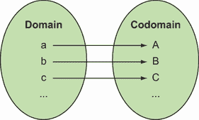
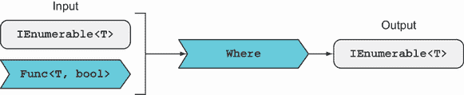
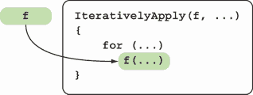
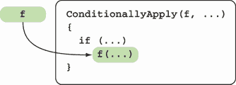
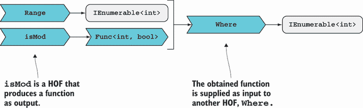
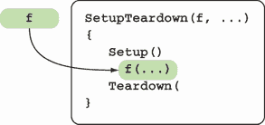

# 2 以函数思维

本章涵盖

+   数学与编程中的函数

+   在 C#中表示函数

+   利用高阶函数

在第一章中，你看到了将函数视为一等值是函数式编程（FP）的一个原则。这允许程序员提高标准，编写由其他函数参数化或创建的函数。这些被称为*高阶函数*（HOFs）；它们确实提高了我们程序中的抽象级别，使我们能够用更少的代码做更多的事情。

但在我们深入探讨高阶函数（HOFs）之前，让我们退一步，看看我们所说的函数是什么意思：在数学和编程术语中它们是什么。然后我们将查看 C#提供的各种结构来表示函数。

## 2.1 函数究竟是什么？

在本节中，我将阐明我所说的*函数*的意思。我将从数学上对这个词的使用开始，然后转向 C#提供的各种表示函数的语言结构。这将为你提供一些基本的概念性和实用性工具，以便你可以开始以函数式的方式编码。

### 2.1.1 函数作为映射

在数学中，函数是两个集合之间的映射，分别称为*定义域*和*值域*。也就是说，给定定义域中的一个元素，函数会从值域中产生一个元素。这就是全部。无论映射是基于某种公式还是完全任意，都没有关系。

在这种意义上，函数是一个完全抽象的数学对象，函数产生的值完全由其输入决定。你会发现，在编程中的函数并不总是这样。

例如，想象一个函数将小写字母映射到它们的大写对应字母，如图 2.1 所示。在这种情况下，定义域是集合{*a, b, c, ...*}，值域是集合{*A, B, C, ...*}。（当然，也存在定义域和值域是同一集合的函数；你能想到一个例子吗？）



图 2.1 数学函数简单来说就是一个映射。它将一个集合（定义域）的元素映射到另一个集合（值域）的元素。

这与编程函数有何关联？在静态类型语言如 C#中，*类型*代表集合（定义域和值域）。例如，如果你在图 2.1 中编写函数，你可以使用`char`来表示定义域和值域。那么你的函数类型可以写成

```
char → char
```

函数将`char`映射到`char`，或者等价地，给定一个`char`，它产生一个`char`。

定义域和值域的类型构成了函数的*接口*，也称为其*类型*或*签名*。你可以将其视为一份合同：函数签名声明，给定定义域中的一个元素，它将产生值域中的一个元素。¹ 这听起来可能非常明显，但你将在第四章中看到，在现实中，违反签名合同的例子比比皆是。

接下来，让我们看看 C# 语言特性，这些特性使我们能够表示函数。这里的意思是，不仅限于数学函数，还包括我们在日常编程中提到的函数。

### 2.1.2 在 C# 中表示函数

C# 中有几个语言结构可以用来表示函数：

+   方法（包括局部方法）

+   代理

+   Lambda 表达式

+   字典

如果您对这些内容非常熟悉，请跳到第 2.2 节；否则，这里有一个快速回顾。

方法

方法是 C# 中函数最常见和惯用的表示形式。例如，`System.Math` 类包含表示许多常见数学函数的方法。当以函数式编程时，我们倾向于几乎只使用仅依赖于其输入参数的静态方法——它们不引用封装的静态类中的任何字段或属性，因此，您可以将其视为独立存在，就像处理数学函数一样。

我们在第 1.2.2 节中讨论了局部函数。它们实际上是方法内部声明的方法。如果您有一个执行特定任务的功能，并且您只需要在一个地方调用它，它可能是一个局部函数的候选。真正使您能够以函数式风格编程的结构是代理和 lambda 表达式，所以让我们继续讨论这些。

代理

代理是类型安全的函数指针。这里的 `类型安全` 意味着代理是强类型的。函数的输入和输出值的类型在编译时已知，并且一致性由编译器强制执行。

创建代理是一个两步过程：首先声明代理类型，然后提供实现。（这与编写 `interface` 然后实例化实现该接口的 `class` 类似。）

第一步是通过使用 `delegate` 关键字并提供代理的签名来完成的。例如，以下列表显示了包含在 .NET 基类库中的 `Comparison<T>` 代理的定义。

列表 2.1 声明代理

```
namespace System
{
   public delegate int Comparison<in T>(T x, T y);
}
```

如您所见，`Comparison<T>` 接收两个 `T`。然后它产生一个 `int`，表示哪个更大。

一旦您有了代理类型，您可以通过提供实现来实例化它。以下列表显示了这种方法。

列表 2.2 实例化和使用代理

```
var list = Enumerable.Range(1, 10).Select(i => i * 3).ToList();
list // => [3, 6, 9, 12, 15, 18, 21, 24, 27, 30]

Comparison<int> alphabetically = (l, r)                ❶
   => l.ToString().CompareTo(r.ToString());            ❶

list.Sort(alphabetically);                             ❷
list // => [12, 15, 18, 21, 24, 27, 3, 30, 6, 9]
```

❶ 提供 `Comparison` 的实现

❷ 将 `Comparison` 代理作为 `Sort` 的参数使用

如您所见，代理只是一个 *对象*（在技术意义上）表示一个操作；在这种情况下，是一个比较操作。像任何其他对象一样，您可以将代理用作另一个方法的参数，如列表 2.2 所示。代理是使函数在 C# 中成为一等值的语言特性。

Func 和 Action 代理

.NET 包含几个可以表示几乎所有函数类型的代理家族：

+   `Func<R>`——表示一个不接受任何参数并返回类型为 `R` 的结果的函数

+   `Func<T1, R>`—表示一个接受类型为 `T1` 的参数并返回类型为 `R` 的结果的函数

+   `Func<T1, T2, R>`—表示一个接受 `T1` 和 `T2` 并返回 `R` 的函数

等等。这些委托代表各种 *arity*（参见“函数 arity”侧边栏）的函数。

自从引入 `Func` 以来，使用自定义委托的情况变得很少。例如，而不是这样声明一个自定义委托

```
delegate Greeting Greeter(Person p);
```

你可以直接使用

```
Func<Person, Greeting>
```

在这个示例中定义的 `Greeter` 类型与 `Func<Person, Greeting>` 相当或兼容。在两种情况下，它都是一个接受 `Person` 并返回 `Greeting` 的函数。在实践中，这意味着你可以定义一个 `Greeter` 并将其传递给期望 `Func<Person, Greeting>` 的方法，反之亦然，而编译器不会有任何抱怨。

有一个类似的委托家族来表示 *actions*，即没有返回值的函数，例如 `void` 方法：

+   `Action`—表示没有输入参数的操作

+   `Action<T1>`—表示具有类型为 `T1` 的输入参数的操作

+   `Action<T1, T2>` 等等—表示具有多个输入参数的操作

.NET 的发展趋势是远离自定义委托，转而使用更通用的 `Func` 和 `Action` 委托。例如，考虑谓词的表示方式：²

+   在 .NET 2 中，引入了 `Predicate<T>` 委托。例如，`FindAll` 方法用于过滤 `List<T>`，期望一个 `Predicate<T>`。

+   在 .NET 3 中，`Where` 方法，也用于过滤，但定义为更通用的 `IEnumerable<T>`，不接收 `Predicate<T>`，而只接收 `Func<T, bool>`。

这两种函数类型是等效的。推荐使用 `Func` 以避免出现代表相同函数签名的委托类型过多的情况，但仍然可以说自定义委托的表达能力更强。在我看来，`Predicate<T>` 比起 `Func<T, bool>` 更能传达意图，并且更接近于口语。

函数 arity

*Arity* 是一个有趣的词，指的是一个函数接受的参数数量。例如

+   一个 *零元* 函数不接受任何参数。

+   一个 *一元* 函数接受一个参数。

+   一个 *二进制* 函数接受两个参数。

+   一个 *三元* 函数接受三个参数。

等等。实际上，所有函数都可以被视为一元函数，因为传递 *n* 个参数相当于传递一个 *n* 元组作为唯一的参数。例如，加法（就像任何其他二元算术运算）是一个其定义域为所有数字对的函数。

Lambda 表达式

Lambda 表达式，简称 *lambdas*，用于声明内联函数。以下列表演示了使用 lambda 对数字列表进行字母排序。

列表 2.3 使用 lambda 表达式声明内联函数

```
var list = Enumerable.Range(1, 10).Select(i => i * 3).ToList();
list // => [3, 6, 9, 12, 15, 18, 21, 24, 27, 30]

list.Sort((l, r) => l.ToString().CompareTo(r.ToString()));
list // => [12, 15, 18, 21, 24, 27, 3, 30, 6, 9]
```

如果你的函数很短，并且你不需要在其他地方重用它，lambda 表达式提供了最吸引人的表示法。此外，请注意，在列表 2.3 中，编译器不仅推断 `l` 和 `r` 为 `int` 类型，而且还根据提供的 lambda 与 `Sort` 方法期望的 `Comparison<int>` 委托类型兼容，将 lambda 转换为该类型。

与方法一样，委托和 lambda 表达式可以访问它们声明的范围内的变量。这在利用 *闭包* 时尤其有用，如下面的列表所示。³

列表 2.4 一个访问封装作用域中变量的 lambda 表达式

```
var days = Enum.GetValues(typeof(DayOfWeek)).Cast<DayOfWeek>();
// => [Sunday, Monday, Tuesday, Wednesday, Thursday, Friday, Saturday]

IEnumerable<DayOfWeek> daysStartingWith(string s)
   => days.Where(d => d.ToString().StartsWith(s));     ❶

daysStartingWith("S") // => [Sunday, Saturday]
```

❶ 在 lambda 中引用 `s` 变量，从而将其捕获在闭包中

在这个例子中，`Where` 期望一个函数，该函数接受一个 `DayOfWeek` 并返回一个 `bool`。实际上，由 lambda 表达式表示的函数也使用了 `pattern` 的值，该值通过闭包捕获来计算其结果。

这很有趣。如果你用更数学的眼光看待 lambda 表达式表示的函数，你可能会说它实际上是一个二元函数，它接受一个 `DayOfWeek` *和* 一个 `string`（模式）作为输入，并产生一个 `bool`。然而，作为程序员，我们通常主要关注函数签名，所以你可能会更倾向于将其视为一个从 `DayOfWeek` 到 `bool` 的单参数函数。两种观点都是有效的：函数必须符合其单参数签名，但它依赖于两个值来完成其工作。

匿名方法

为了完整性，我应该提到，C# 2 引入了一个名为 *匿名方法* 的功能。这允许你创建一个类似于这样的委托：

```
Comparison<int> alphabetically = delegate (int l, int r)
{
   return l.ToString().CompareTo(r.ToString());
};
```

当 lambda 表达式提供了更简洁的语法来执行相同操作时，C# 3 取代了匿名方法。匿名方法作为语言的遗迹特征幸存下来，但它们的用法是不被鼓励的。在 C# 功能的上下文中，术语 *匿名函数* 既指匿名方法也指 lambda 表达式。

字典

字典也适当地被称为映射（或哈希表）。它们是提供函数直接表示的数据结构。它们实际上包含了对 *键*（来自定义域的元素）到 *值*（对应于值域的元素）的关联。

我们通常将字典视为数据，所以改变一下视角，将它们视为函数是有益的。字典适合表示完全任意的函数，其中映射无法计算但 *必须* 完全存储。例如，以下列表显示了如何将布尔值映射到法语中的名称。

列表 2.5 完全表示函数的字典

```
var frenchFor = new Dictionary<bool, string>
{
   [true] = "Vrai",
   [false] = "Faux",
};

frenchFor[true]   ❶
// => "Vrai"
```

❶ 函数应用是通过查找来执行的。

函数可以用字典表示的事实也使得通过在字典中存储计算结果而不是每次都重新计算来优化计算密集型函数成为可能。这种技术称为 *记忆化*。

为了方便起见，在本书的其余部分，我将使用术语 *函数* 来指代函数的 C# 表示之一。请记住，这并不完全符合该术语的数学定义。你将在第三章中了解更多关于数学函数和编程函数之间差异的信息。

## 2.2 高阶函数（HOFs）

现在你已经了解了什么是 FP，我们也回顾了该语言的函数特性，是时候开始探索一些具体的函数技术了。我们将从函数作为一等值的最重要好处开始——它们让你能够定义高阶函数（HOFs）。

HOFs 是接受其他函数作为输入或返回函数作为输出或两者都有的函数。我将假设你已经在使用 HOFs 方面有所了解，例如使用 LINQ。在这本书中，我们将大量使用 HOFs，所以本节应该作为一个复习，并可能介绍一些你可能不太熟悉的 HOFs 用例。

高阶函数（HOFs）很有趣，本节中的大多数示例都可以在 REPL 中运行。确保你在这个过程中尝试一些自己的变体。

### 2.2.1 依赖于其他函数的函数

一些 HOFs 将其他函数作为参数并按顺序调用它们以完成工作，这有点像一家公司可能将一些工作分包给另一家公司。你已经在本章前面看到了一些这样的 HOFs 的例子，包括 `Sort`（`List` 上的一个实例方法）和 `Where`（`IEnumerable` 上的一个扩展方法）。

当使用 `Comparison` 委托调用 `List.Sort` 时，这是一个表示“好吧，我会自己排序，只要你告诉我如何比较我所包含的任意两个元素”的方法。`Sort` 执行排序任务，但调用者可以决定使用什么逻辑进行比较。

同样，`Where` 执行过滤任务，调用者决定什么逻辑决定一个元素是否应该被包含。你可以将 `Where` 的类型用如图 2.2 所示的图形表示。



图 2.2 `Where` 是一个接受谓词函数作为输入的高阶函数。它使用谓词来决定哪些元素应包含在返回的列表中。

以下列表显示了 `Where` 的理想化实现。⁴

列表 2.6 `Where`，一个迭代应用给定谓词的高阶函数

```
public static IEnumerable<T> Where<T>
   (this IEnumerable<T> ts, Func<T, bool> predicate)
{

   foreach (T t in ts)       ❶
      if (predicate(t))      ❷
         yield return t;
}
```

❶ 遍历列表是 `Where` 的一个实现细节。

❷ 决定哪些项目被包含的标准由调用者决定。

`Where` 方法负责过滤逻辑。调用者提供 *谓词*，这是基于该谓词对 `IEnumerable` 进行过滤的标准。

如您所见，HOFs 可以帮助在逻辑难以轻易分离的情况下分离关注点。`Where`和`Sort`是迭代应用的例子——HOF 对集合中的每个元素重复应用给定的函数。

粗略地看，这可以理解为您传递了一个函数作为参数，其代码最终将在 HOF 体内的循环体中执行。这是您仅通过传递静态数据无法做到的。一般方案如图 2.3 所示。



图 2.3 重复应用作为参数提供的函数的 HOF

可选执行是 HOF 的另一个很好的候选。这在您只想在特定条件下调用给定的函数时很有用，如图 2.4 所示。



图 2.4 条件应用作为参数提供的函数的 HOF

例如，想象一种从缓存中查找元素的方法。可以提供一个委托，并在缓存未命中时调用它。以下列表显示了如何实现这一点。

列表 2.7 可选调用的 HOF

```
class Cache<T> where T : class
{
   public T Get(Guid id) => //...
   public T Get(Guid id, Func<T> onMiss)
      => Get(id) ?? onMiss();
}
```

`onMiss`中的逻辑可能涉及昂贵的操作，如数据库调用。您不希望这种操作被不必要地执行。

前面的例子说明了接受函数作为输入并使用它来执行任务或计算值的 HOF。这可能是最常见的 HOF 模式，有时也被称为*控制反转*，其中 HOF 的调用者通过提供函数来决定*做什么*，而函数通过调用给定的函数来决定*何时做*。让我们看看 HOF 在其他哪些场景中很有用。

### 2.2.2 适配器函数

一些 HOF 根本不*应用*给定的函数，而是返回一个与作为参数提供的函数以某种方式相关的新的函数。例如，假设您有一个执行整数除法的函数：

```
var divide = (int x, int y) => x / y;
divide(10, 2) // => 5
```

你想改变参数的顺序，使除数排在第一位。这可以看作是一个更一般问题的特例：改变参数的顺序。你可以编写一个通用的 HOF，通过交换其参数的顺序来修改任何二元函数：

```
static Func<T2, T1, R> SwapArgs<T1, T2, R>(this Func<T1, T2, R> f)
   => (t2, t1) => f(t1, t2);
```

从技术上讲，更准确的说法是`SwapArgs`返回一个新的函数，该函数以相反的顺序调用给定的函数。但在直观层面上，我发现认为我得到了原始函数的修改版本更容易。现在你可以通过应用`SwapArgs`来修改原始的除法函数：

```
var divideBy = divide.SwapArgs();
divideBy(2, 10) // => 5
```

玩这种类型的 HOF 会导致一个有趣的想法，即函数不是一成不变的：如果您不喜欢函数的接口，您可以通过另一个提供更适合您需求的接口的函数来调用它。这就是为什么我称这些为*适配器函数*。⁵

### 2.2.3 创建其他函数的函数

有时你会编写主要目的是创建其他函数的函数。你可以把它们看作 *函数工厂*。以下示例使用 lambda 过滤一个数字序列，只保留能被 2 整除的数字：

```
var range = Enumerable.Range(1, 20);

range.Where(i => i % 2 == 0)
// => [2, 4, 6, 8, 10, 12, 14, 16, 18, 20]
```

如果你想要更通用的东西，比如能够过滤出能被任何数字 *n* 整除的数字，你可以定义一个函数，它接受 *n* 并生成一个合适的谓词，用于评估任何给定的数字是否可以被 *n* 整除：

```
Func<int, bool> isMod(int n) => i => i % n == 0;
```

我们之前还没有看过这样的 HOF。它接受一些静态数据并返回一个函数。让我们看看如何使用它：

```
using static System.Linq.Enumerable;

Range(1, 20).Where(isMod(2)) // => [2, 4, 6, 8, 10, 12, 14, 16, 18, 20]
Range(1, 20).Where(isMod(3)) // => [3, 6, 9, 12, 15, 18]
```

注意，你不仅获得了通用性，还提高了可读性！在这个例子中，你使用 `isMod` HOF 生成一个函数，然后将它作为输入传递给另一个 HOF，`Where`，如图 2.5 所示。



图 2.5 在这里，我们将 `IsMod` 定义为一个 HOF，它返回一个函数，告诉我们一个数字是否可以被某个给定的值整除。然后我们使用生成的谓词作为 `Where` 的输入。

你将在本书中看到更多关于 HOF 的用法。最终，你会把它们当作普通函数来看待，忘记它们是高阶的。现在让我们看看这些如何在更接近日常开发的场景中使用。

## 2.3 使用 HOF 避免重复

HOF 的另一个常见用途是封装设置和清理操作。例如，与数据库交互需要一些设置来获取和打开连接，并在交互后进行清理以关闭连接并将其返回到底层连接池。以下列表展示了这在代码中的样子。

列表 2.8 带有设置和清理的数据库连接

```
string connString = "myDatabase";

var conn = new SqlConnection(connString));    ❶
conn.Open();                                  ❶

// interact with the database...

conn.Close();                                 ❷
conn.Dispose();                               ❷
```

❶ 设置：获取并打开连接

❷ 清理：关闭并释放连接

设置和清理总是相同的，无论你是读取还是写入数据库，或者执行一个或多个操作。前面的代码通常使用如下 `using` 块编写：

```
using (var conn = new SqlConnection(connString))
{
   conn.Open();
   // interact with the database...
}
```

这既简短又好，但本质上仍然是相同的。⁶ 考虑以下列表，展示了一个简单的 `DbLogger` 类，它包含一些与数据库交互的方法。`Log` 方法插入给定的日志消息，而 `GetLogs` 方法检索自给定日期以来的所有日志。

列表 2.9 设置/清理逻辑的重复

```
using Dapper;                                               ❶

public class DbLogger
{
   string connString;                                       ❷

   public void Log(LogMessage msg)
   {
      using (var conn = new SqlConnection(connString))      ❸
      {
         conn.Execute("sp_create_log", msg                  ❹
            , commandType: CommandType.StoredProcedure);    ❹
      }                                                     ❺
   }

   public IEnumerable<LogMessage> GetLogs(DateTime since)
   {
      var sql = "SELECT * FROM [Logs] WHERE [Timestamp] > @since";
      using (var conn = new SqlConnection(connString))      ❻
      {
         return conn.Query<LogMessage>(sql                  ❼
            , new {since = since});                         ❼
      }                                                     ❽
   }
}
```

❶ 将 `Execute` 和 `Query` 作为扩展方法暴露在连接上

❷ 假设这是在构造函数中设置的。

❸ 设置

❹ 将 `LogMessage` 持久化到数据库

❺ 作为 `Dispose` 部分执行清理

❻ 设置

❼ 查询数据库并反序列化结果

❽ 清理

详细理解代码不是必需的。该代码使用 Dapper ([`github.com/StackExchange/dapper-dot-net`](https://github.com/StackExchange/dapper-dot-net))，这是 ADO.NET 之上的一个薄层，允许您通过简单的 API 与数据库交互：

+   `Query`——查询数据库并返回反序列化的 `LogMessage`s

+   `Execute`——运行存储过程并返回受影响的行数，我们忽略它

重要的是要注意，这两种方法有一些重复；即设置和拆除逻辑。我们能消除这种重复吗？

注意：在实际场景中，我建议你始终异步执行 I/O 操作。在这个例子中，`GetLogs` 应该真正调用 `QueryAsync` 并返回 `Task<IEnumerable<LogMessage>>`)。但是异步增加了复杂性，这在尝试学习 FP 的挑战性概念时并不 helpful。出于教学目的，我将在第十六章讨论异步。

如你所见，`Dapper` 提供了一个令人愉悦的 API，它甚至会在必要时打开连接。但你仍然需要创建连接，一旦完成，你应该尽快将其释放。因此，数据库调用的“肉”最终被设置和拆除的相同代码片段所包围。让我们看看如何通过将设置和拆除逻辑提取到 HOF 中来避免这种重复。

你正在编写一个执行设置和拆除的函数，并且参数化中间要执行的操作。这是一个完美的 HOF 场景，因为你可以用一个函数来表示中间的逻辑。⁷ 从图形上看，它看起来像图 2.6。



图 2.6 一个封装在设置和拆除逻辑之间的给定函数的 HOF

因为连接设置和拆除比 `DbLogger` 更通用，所以它们可以被提取到一个新的 `ConnectionHelper` 类中。下面的列表提供了一个例子。

列表 2.10 将数据库连接的设置和拆除封装到 HOF 中

```
using System.Data;
using System.Data.SqlClient;

public static class ConnectionHelper
{
   public static R Connect<R>
      (string connString, Func<IDbConnection, R> f)
   {
      using (var conn = new SqlConnection(connString))   ❶
      {
         conn.Open();                                    ❶
         return f(conn);                                 ❷
      }                                                  ❸
   }
}
```

❶ 设置

❷ 中间发生的事情现在是参数化的。

❸ 拆除

`Connect` 函数执行设置和拆除，并且它通过中间要执行的操作进行参数化。函数体的签名很有趣；它接受一个 `IDbConnection`（通过它将与数据库交互）并返回一个泛型对象 `R`。在我们看到的用例中，`R` 在查询的情况下将是 `IEnumerable<LogMessage>`，在插入的情况下将是 `int`。

你现在可以在 `DbLogger` 中使用 `Connect` 函数，如下所示：

```
using Dapper;
using static ConnectionHelper;

public class DbLogger
{
   string connString;

   public void Log(LogMessage message)
      => Connect(connString, c => c.Execute("sp_create_log"
         , message, commandType: CommandType.StoredProcedure));

   string sql = @"SELECT * FROM [Logs] WHERE [Timestamp] > @since";

   public IEnumerable<LogMessage> GetLogs(DateTime since)
      => Connect(connString
         , c => c.Query<LogMessage>(sql, new {since = since}));
}
```

你已经消除了 `DbLogger` 中的重复，因此 `DbLogger` 就不再需要知道创建、打开或释放连接的细节。到现在为止，我希望你同意 HOF 是强大的工具，尽管过度使用可能会使代码难以理解。在适当的时候使用 HOF，但要注意可读性：使用短的 lambda 表达式、清晰的命名和有意义的缩进。

## 练习

我建议你花时间做练习，并在过程中想出一些自己的。GitHub 上的代码示例存储库（[`mng.bz/10Pj`](http://mng.bz/10Pj)）包括占位符，这样你就可以用最少的设置工作编写、编译和运行你的代码。它还包括你可以对照检查结果的解决方案：

1.  浏览 `System.Linq.Enumerable` 的方法（[`mng.bz/PX6n`](http://mng.bz/PX6n)）。哪些是高阶函数（HOFs）？你认为哪些暗示了给定函数的迭代应用？

1.  编写一个否定给定谓词的函数：当给定的谓词评估为 `true` 时，结果函数评估为 `false`，反之亦然。

1.  编写一个使用快速排序对 `List<int>` 进行排序的方法，返回一个新的列表而不是就地排序。

1.  将之前的实现泛化以接受 `List<T>` 和 `Comparison<T>` 委托。

## 摘要

+   数学函数简单地定义了两个集合之间的映射。

+   你可以使用方法、委托、lambda 表达式和字典在 C# 中表示函数。

+   函数式编程（FP）利用高阶函数（HOFs），这些函数接受其他函数作为输入或输出；因此，语言需要将函数作为一等值。

* * *

¹ 在面向对象（OO）的层面上，接口是这一想法的扩展：一组具有相应输入和输出类型或更精确地说，方法（本质上就是函数）的方法，这些方法将 `this`（当前实例）作为隐式参数。

² 一个 *谓词* 是一个函数，给定一个值（比如说，一个整数），告诉你它是否满足某些条件（比如说，它是否是偶数）。

³ 一个 *闭包* 是 lambda 表达式本身及其声明的上下文的组合（lambda 出现的作用域中所有可用的变量）。

⁴ 此实现功能上是正确的，但它缺少 LINQ 实现中的错误检查和优化。

⁵ 在面向对象（OOP）中，著名的适配器模式可以看作是将适配函数的思想应用于对象的接口。

⁶ 它更短，因为 `Dispose` 在退出 `using` 块时被调用，这将反过来调用 `Close`。它更好，因为交互被包裹在一个 `try/finally` 块中，所以即使在 `using` 块的主体中抛出异常，连接也会被释放。

⁷ 因此，你可能会听到这种模式被不优雅地称为“中间的洞”。
