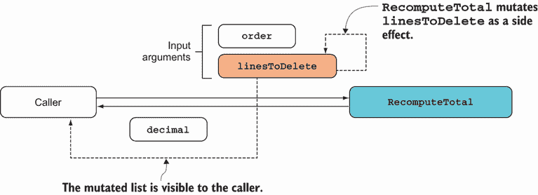
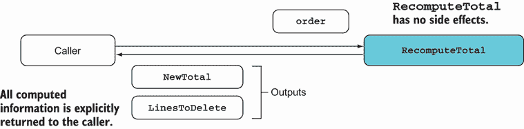
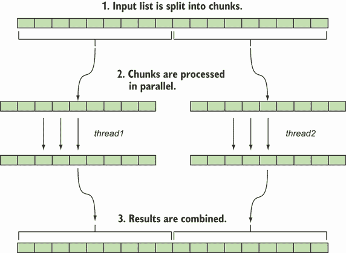
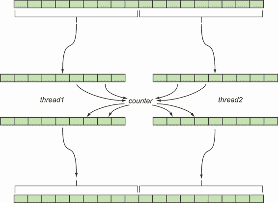
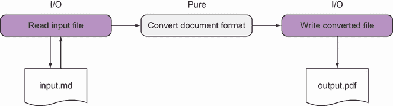
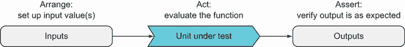
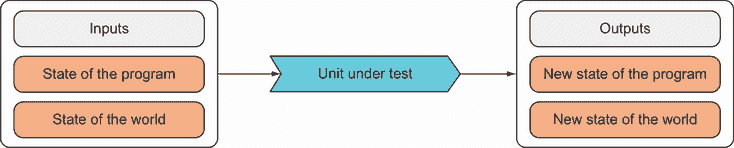

# 3 为什么函数纯净性很重要

本章涵盖

+   什么使一个函数纯净或不纯净

+   为什么在并发场景中纯净性很重要

+   纯净性与可测试性的关系

+   减少代码的不纯净痕迹

这章最初的名称是“纯净的不可抗拒魅力。”但如果它真的如此不可抗拒，我们就会有更多的函数式程序员，对吧？你看，函数式程序员是**纯净函数**的忠实粉丝：没有副作用的功能。在本章中，你将看到这究竟意味着什么，以及为什么纯净函数具有一些非常令人向往的特性。

不幸的是，这种对纯净函数的迷恋部分原因是为什么函数式编程作为一门学科已经与行业脱节。很快你就会意识到，在大多数现实世界的应用中，几乎没有纯净性。然而，纯净性在现实世界中仍然相关，正如我希望在本章中展示的那样。

我们将从探讨什么使一个函数纯净（或不纯净）开始，然后你将看到纯净性如何影响程序的可测试性和甚至正确性，尤其是在并发场景中。我希望到本章结束时，你会发现纯净性如果不是**不可抗拒**，至少也是**绝对值得记住**的。

## 3.1 什么是函数纯净性？

在第二章中，你看到数学函数是完全抽象的实体。尽管一些编程函数是数学函数的近似表示，但这通常并非如此。你经常希望一个函数在屏幕上打印某些内容，处理一个文件，或者与另一个系统交互。简而言之，你经常希望函数**做**一些事情，产生**副作用**。数学函数根本不做这样的事情；它们只返回一个值。

第二个重要的区别是：数学函数存在于真空中，因此它们的结果严格由它们的参数决定。我们用来表示函数的编程结构，另一方面，都可以访问一个**上下文**：一个实例方法可以访问实例字段，一个 lambda 可以访问封闭作用域中的变量，许多函数可以访问完全超出程序范围的事物，例如系统时钟、数据库或远程服务等。

这种上下文的存在，其界限并不总是清晰界定，以及它可能包含程序控制之外变化的事物，意味着编程中函数的行为比数学中的函数更复杂，难以分析。这导致了**纯净**和**不纯净**函数之间的区别。

### 3.1.1 纯净性与副作用

纯净函数与数学函数非常相似：它们除了根据输入值计算输出值之外，不做任何事情。表 3.1 对比了纯净和不纯净函数。

表 3.1 纯净函数的要求

| 纯净函数 | 不纯净函数 |
| --- | --- |
| 输出完全取决于输入参数。 | 除了输入参数之外的其他因素可能影响输出。 |
| 无副作用 | 可有副作用 |

为了阐明这个定义，我们必须精确地定义什么是副作用。如果一个函数执行以下任何一项操作，那么它被认为是有副作用的：

+   *修改全局状态*—这里的全局意味着任何在函数作用域之外可见的状态。例如，一个私有实例字段被认为是全局的，因为它可以从类中的所有方法中看到。

+   *修改其输入参数*—调用者传递的参数实际上是一种函数与其调用者共享的状态。如果一个函数修改了它的任何一个参数，那么这就是对调用者可见的副作用。

+   *抛出异常*—你可以独立地推理纯函数；然而，如果一个函数抛出异常，那么调用它的结果取决于上下文。也就是说，它取决于函数是在`try`-`catch`块中调用。

+   *执行任何 I/O 操作*—这包括程序与外部世界的任何交互，包括从控制台、文件系统或数据库中读取或写入，以及与应用程序边界之外的任何进程交互。

总结来说，纯函数没有副作用，它们的输出完全由它们的输入决定。请注意，这两个条件都必须满足：

+   *没有副作用的函数仍然可能是非纯的。* 也就是说，从全局可变状态读取的函数很可能会产生依赖于其输入之外因素的输出。

+   *一个输出完全取决于其输入的函数也可以是非纯的。* 它仍然可能具有副作用，例如更新全局可变状态。

纯函数的确定性特性（对于相同的输入总是返回相同的输出）有一些有趣的后果。纯函数易于测试和推理。¹

此外，输出仅取决于输入的事实意味着求值的顺序并不重要。无论你现在还是以后计算函数的结果，结果都不会改变。这意味着你的程序中完全由纯函数组成的部分可以通过多种方式优化：

+   *并行化*—不同的线程并行执行任务。

+   *惰性求值*—仅在需要时计算值。

+   *记忆化*—缓存函数的结果，使其只计算一次。

另一方面，使用这些技术与非纯函数一起可能会导致相当棘手的错误。出于这些原因，函数式编程倡导者建议尽可能优先使用纯函数。

### 3.1.2 管理副作用的方法

好的，让我们尽可能使用纯函数。但是，这总是可能的吗？是否有可能？嗯，如果你看一下被认为是副作用的事项列表，它是一个相当混杂的集合，因此管理副作用的方法取决于所讨论的副作用类型。

修改输入参数是最容易的。这种副作用总是可以避免的，我将在下面演示这一点。总是避免抛出异常也是可能的。我们将在第八章和第十四章中查看不抛出异常的错误处理。

编写程序（甚至是具有状态的程序）而不进行状态修改也是可能的。你可以编写任何程序而不必修改状态。²这对于一个面向对象程序员来说可能是一个令人惊讶的认识，需要真正的思维转变。在第 3.2 节中，我将向你展示一个简单的例子，说明避免状态修改如何使你能够轻松并行化一个函数。在后面的章节中，你将学习各种技术来处理更复杂的任务，而不依赖于状态修改。

最后，我将在第 3.3 节中讨论如何管理 I/O。通过学习这些技术，你将能够隔离或避免副作用，从而利用纯函数的优势。

### 3.1.3 避免修改参数

你可以将函数签名视为一个合同：函数接收一些输入并返回一些输出。当函数修改其参数时，这会混淆水，因为调用者依赖于这个副作用发生，尽管这并没有在函数签名中声明。因此，我认为在*任何*编程范式中修改参数都是一个坏主意。尽管如此，我反复遇到一些实现，它们做的是类似的事情：

```
decimal RecomputeTotal(Order order, List<OrderLine> linesToDelete)
{
   var result = 0m;
   foreach (var line in order.OrderLines)
      if (line.Quantity == 0) linesToDelete.Add(line);
      else result += line.Product.Price * line.Quantity;
   return result;
}
```

`RecomputeTotal`方法旨在在修改订单中项目数量时被调用。它重新计算订单的总价值，并且作为副作用，将数量变为零的订单行添加到给定的`linesToDelete`列表中。这如图 3.1 所示。



图 3.1 `RecomputeTotal`修改了其输入，并且调用者依赖于这个副作用。

这之所以是一个糟糕的想法，是因为该方法的行为现在与调用者的行为紧密耦合：调用者依赖于该方法执行其副作用，而调用者依赖于调用者初始化列表。因此，每个方法都必须了解另一个方法的实现细节，这使得无法独立地推理代码。

警告：使用会修改其参数的方法存在另一个问题，如果你将参数的类型从`class`改为`struct`，你会得到截然不同的行为，因为当在函数间传递时，结构体会被复制。

你可以通过将所有计算出的信息返回给调用者来轻松避免这种副作用。重要的是要认识到，该方法实际上正在计算两份数据：订单的新总计和可以删除的行列表。你可以通过返回一个元组来使这一点明确。重构后的代码如下：

```
(decimal NewTotal, IEnumerable<OrderLine> LinesToDelete)
   RecomputeTotal(Order order)
   => (order.OrderLines.Sum(l => l.Product.Price * l.Quantity)
     , order.OrderLines.Where(l => l.Quantity == 0));
```

图 3.2 表示这个重构版本，看起来更简单。毕竟，现在它只是一个普通的函数，接受一些输入并返回输出。



图 3.2 `RecomputeTotal`重构为显式返回其计算的所有信息

依据这个原则，你总是可以以这种方式构建你的代码，使得函数永远不会改变它们的输入参数。实际上，通过始终使用不可变对象——一旦创建就不能更改的对象——来强制执行这一点将是理想的。我们将在第十一章中详细讨论这一点。

## 3.2 通过避免状态突变来启用并行化

在本节中，我将向你展示一个简单场景，说明为什么纯函数始终可以并行化，而不纯函数则不能。想象一下，你想将字符串列表格式化为编号列表：

+   标准化大小写。

+   每个项目前应有一个计数器。

要做到这一点，你可以定义一个`ListFormatter`类，以下是其用法：

```
var shoppingList = new List<string>
{
   "coffee beans",
   "BANANAS",
   "Dates"
};

new ListFormatter()
   .Format(shoppingList)
   .ForEach(WriteLine);

// prints: 1\. Coffee beans
//         2\. Bananas
//         3\. Dates
```

以下列表显示了一个可能的`ListFormatter`实现。

列表 3.1 结合纯函数和不纯函数的列表格式化器

```
static class StringExt
{
   public static string ToSentenceCase(this string s)       ❶
      => s == string.Empty
         ? string.Empty
         : char.ToUpperInvariant(s[0]) + s.ToLower()[1..];
}

class ListFormatter
{
   int counter;

   string PrependCounter(string s) => $"{++counter}. {s}";  ❷

   public List<string> Format(List<string> list)
      => list
         .Select(StringExt.ToSentenceCase)                  ❸
         .Select(PrependCounter)                            ❸
         .ToList();
}
```

❶ 纯函数

❷ 不纯函数（它会改变全局状态）。

❸ 纯函数和不纯函数可以类似地应用。

关于纯度，有几个要点需要注意：

+   `ToSentenceCase`是纯函数（其输出严格由输入决定）。因为其计算只依赖于输入参数，所以可以无问题地将其定义为静态的。³

+   `PrependCounter`会增加计数器，所以它是不纯的。因为它依赖于实例成员（计数器），所以你不能将其定义为静态的。

+   在`Format`方法中，你使用`Select`将两个函数应用到列表中的项上，不考虑其纯度。这并不理想，正如你很快就会学到的。事实上，理想情况下应该有一个规则，即`Select`应该仅与纯函数一起使用。

如果你正在格式化的列表足够大，并行执行字符串操作是否有意义？运行时是否会决定这样做以进行优化？我们将在下一节中解决这些问题。

### 3.2.1 纯函数并行化良好

给定足够大的数据集进行处理，通常并行处理是有利的，尤其是在处理是 CPU 密集型且数据片段可以独立处理时。纯函数可以很好地并行化，并且通常对使并发困难的问题免疫。（关于并发和并行性的复习，请参阅“并发和并行性的意义和类型”侧边栏）。

我将通过尝试使用`ListFormatter`并行化我们的列表格式化函数来阐述这一点。比较以下两个表达式：

```
list.Select(ToSentenceCase).ToList()
list.AsParallel().Select(ToSentenceCase).ToList()
```

第一个表达式使用`System.Linq.Enumerable`中定义的`Select`方法将纯函数`ToSentenceCase`应用于列表中的每个元素。第二个表达式类似，但它使用 Parallel LINQ (PLINQ)提供的方法。⁴ `AsParallel`将列表转换为`ParallelQuery`。因此，`Select`解析为`ParallelEnumerable`中定义的实现，它将`ToSentenceCase`应用于列表中的每个项目，但现在是在并行执行的。

列表被分成块，然后启动几个线程来处理每个块。当调用`ToList`时，结果被收集到一个单独的列表中。图 3.3 展示了这个过程。



图 3.3 列表中的数据并行处理

如您所预期，这两个表达式会产生相同的结果，但一个按顺序执行，另一个则并行执行。这很好。只需调用一次`AsParallel`，您就可以几乎免费地获得并行化。

为什么几乎免费？为什么您必须明确指示程序并行化操作？为什么运行时不应该像确定垃圾回收的最佳时机一样，确定并行化操作是一个好主意？

答案是运行时不了解函数的足够信息，无法做出是否并行化可能会改变程序流程的明智决定。由于它们的属性，纯函数始终可以并行应用，但运行时不了解正在应用的函数是否是纯函数。

并发的意义和类型

*并发*是同时进行几件事情的一般概念。更正式地说，并发是指程序在另一个任务完成之前启动一个任务，以便不同的任务在重叠的时间窗口内执行。在以下几种情况下可能会发生并发：

+   *异步*——您的程序执行*非阻塞*操作。例如，它可以通过 HTTP 发起对远程资源的请求，然后在等待响应的同时继续执行其他任务。这有点像您发送电子邮件后继续生活而不等待回复。

+   *并行性*——您的程序通过将工作分解成任务，每个任务在单独的核心上执行，利用多核机器的硬件来同时执行任务。这有点像在淋浴时唱歌：您实际上同时做了两件事。

+   *多线程*——一种软件实现，允许不同的线程并发执行。即使在一个单核机器上运行，多线程程序看起来也能同时做几件事情。这有点像通过各种即时通讯窗口与不同的人聊天，尽管您实际上是在来回切换。最终结果是您同时进行多个对话。

同时做几件事情可以提高性能。这也意味着执行顺序没有保证，因此并发可能是困难的根源，尤其是在多个任务同时尝试更新某些共享可变状态时。（在后面的章节中，你将看到 FP 如何通过完全避免共享可变状态来解决这个问题。）

### 3.2.2 并行化不纯函数

你已经看到你可以成功地将纯函数`ToSentenceCase`并行化。让我们看看如果你天真地并行化不纯的`PrependCounter`函数会发生什么：

```
list.AsParallel().Select(PrependCounter).ToList()
```

如果你现在创建一个包含一百万个项目的列表，并使用天真地并行化的格式化程序进行格式化，你会发现列表中的最后一个项目不是以 1,000,000 开头，而是以一个较小的数字开头。如果你已经下载了代码示例，你可以通过运行以下命令来亲自尝试：

```
cd Examples
dotnet build
dotnet run NaivePar
```

输出将以类似以下内容结束

```
932335\. Item999998
932336\. Item999999
932337\. Item1000000
```

因为`PrependCounter`增加了`counter`变量，并行版本将会有多个线程读取和更新计数器，如图 3.4 所示。众所周知，`++`不是一个原子操作，因为没有锁定机制，我们将丢失一些更新，并最终得到一个错误的结果。



图 3.4 当并行处理列表时，多个线程并发访问计数器。

如果你有一些多线程经验，这听起来可能很熟悉。因为多个进程同时读取和写入计数器，一些更新会丢失。当然，你可以在增加计数器时使用锁或`Interlocked`类来修复这个问题。但这样做会降低性能，抵消了并行计算带来的部分收益。此外，锁定是一个我们希望在函数式编程中避免的命令式构造。

让我们总结一下。与默认可以并行化的纯函数不同，不纯函数不是直接可以并行化的。而且由于并行执行是非确定性的，你可能会遇到一些情况，其中你的结果是正确的，而另一些情况则不是（你不想遇到的错误类型）。

了解你的函数是否是纯的可以帮助你理解这些问题。此外，如果你在开发时考虑到纯度，那么如果你决定并行化执行，这将更容易。

### 3.2.3 避免状态突变

避免并发更新的潜在问题的一个可能方法是在源头上解决问题；一开始就不使用共享状态。如何做到这一点因场景而异，但我会向你展示一个解决方案，它使我们能够并行格式化列表。

让我们回到起点，看看是否有一个不涉及修改的顺序解决方案。如果，不是更新一个运行计数器，而是生成所有需要的计数器值的列表，然后从给定的列表和计数器列表中配对项目，会怎样？对于整数列表，你可以使用 `Enumerable` 上的便利方法 `Range`，如下所示。

列表 3.2 生成整数范围

```
Enumerable.Range(1, 3)
// => [1, 2, 3]
```

在函数式编程（FP）中，对两个并行列表进行配对操作很常见。这被称为 `Zip`。`Zip` 接受两个列表进行配对，并应用到一个配对上的函数。以下列表显示了一个示例。

列表 3.3 使用 `Zip` 结合并行列表中的元素

```
Enumerable.Zip(
   new[] {1, 2, 3},
   new[] {"ichi", "ni", "san"},
   (number, name) => $"In Japanese, {number} is: {name}")

// => ["In Japanese, 1 is: ichi",
//     "In Japanese, 2 is: ni",
//     "In Japanese, 3 is: san"]
```

你可以使用 `Range` 和 `Zip` 重新编写列表格式化程序，如下所示。

列表 3.4 重构为仅使用纯函数的列表格式化程序

```
using static System.Linq.Enumerable;

static class ListFormatter
{
   public static List<string> Format(List<string> list)
   {
      var left = list.Select(StringExt.ToSentenceCase);
      var right = Range(1, list.Count);
      var zipped = Zip(left, right, (s, i) => $"{i}. {s}");
      return zipped.ToList();
   }
}
```

在这里，你使用应用了 `ToSentenceCase` 的列表作为 `Zip` 的左侧。右侧是用 `Range` 构建的。`Zip` 的第三个参数是配对函数：如何处理每一对项目。因为 `Zip` 可以用作扩展方法，你可以使用更流畅的语法编写 `Format` 方法：

```
public static List<string> Format(List<string> list)
   => list
      .Select(StringExt.ToSentenceCase)
      .Zip(Range(1, list.Count), (s, i) => $"{i}. {s}")
      .ToList();
```

在这次重构之后，`Format` 是纯函数，可以安全地将其定义为静态。但使其并行化怎么样？这很简单，因为 PLINQ 提供了一个与并行查询一起工作的 `Zip` 实现。以下列表提供了一个列表格式化的并行实现。

列表 3.5 一个并行执行的纯实现

```
using static System.Linq.ParallelEnumerable;                  ❶

static class ListFormatter
{
   public static List<string> Format(List<string> list)
      => list.AsParallel()                                    ❷
         .Select(StringExt.ToSentenceCase)
         .Zip(Range(1, list.Count), (s, i) => $"{i}. {s}")
         .ToList();
}
```

❶ 使用 `ParallelEnumerable` 暴露的 `Range`

❷ 将原始数据源转换为并行查询

这几乎与顺序版本相同；只有两个区别。首先，使用`AsParallel`将给定的列表转换为`ParallelQuery`，这样之后的所有操作都是并行执行的。其次，`using static`的变化使得`Range`现在指的是`ParallelEnumerable`中定义的实现（这返回一个`ParallelQuery`，这是`Zip`并行版本所期望的）。其余部分与顺序版本相同，`Format`的并行版本仍然是一个纯函数。

在这种情况下，通过完全删除状态更新，可以启用并行执行，但这并不总是这种情况，也并不总是这么容易。但到目前为止你看到的想法让你在处理与并行性相关的问题时处于更好的位置，更普遍地说，是并发问题。

静态方法的理由

当方法内部所需的所有变量都作为输入提供（或静态可用）时，你可以将方法定义为静态。本章包含将实例方法重构为静态方法的几个示例。

你可能会对此感到不安，尤其是如果你（像我一样）看到程序因为过度使用静态类而变得难以测试和维护。如果静态方法执行以下任一操作，它们可能会引起问题：

+   *修改静态字段*—这些实际上是最全局的变量。它们可以从任何可以看到静态类的代码中更新，导致耦合和不可预测的行为。

+   *执行 I/O*—在这种情况下，受威胁的是可测试性。如果方法`A`依赖于静态方法`B`的 I/O 行为，那么无法对`A`进行单元测试。

注意，这两种情况都意味着一个不纯的函数。另一方面，当一个函数是纯函数时，它可以安全地被标记为静态。作为一个一般准则

+   将纯函数设为静态

+   避免可变静态字段

+   避免直接调用执行 I/O 的静态方法

随着你更多地以函数式的方式编码，你的更多函数将是纯函数。这意味着你的更多代码可能会在静态类中，而不会引起与滥用静态类相关的问题。

## 3.3 纯度与可测试性

在上一节中，你看到了纯度在并发场景中的相关性。因为副作用与状态突变有关，我们可以移除突变，结果得到的纯函数可以无问题地并行运行。

现在我们将探讨执行 I/O 操作的函数以及纯度与单元测试的相关性。单元测试必须是*可重复的*（如果测试通过，它应该在任何时间、任何机器、是否有连接等情况下都通过）。这与我们要求纯函数必须是确定性的要求密切相关。

我的目标是利用你对单元测试的知识来帮助你理解纯度的相关性，并消除纯度只具有理论兴趣的观念。你的经理可能不在乎你是否编写纯函数，但他们可能非常关注良好的测试覆盖率。

### 3.3.1 隔离 I/O 效果

与突变不同，你无法避免与 I/O 相关的副作用。虽然突变是实现细节，但 I/O 通常是必需的。以下是一些有助于阐明为什么执行 I/O 的函数永远不能是纯函数的例子：

+   一个接受 URL 并返回该 URL 资源的函数，在远程资源发生变化时会产生不同的结果，或者如果连接不可用，可能会抛出错误。

+   一个接受文件路径和要写入文件的内容的函数，如果目录不存在或程序所在进程没有写权限，可能会抛出错误。

+   一个从系统时钟返回当前时间的函数在任何时刻都会返回不同的结果。

正如你所见，任何对外部世界的依赖都会阻碍函数的纯度，因为世界状态会影响函数的返回值。另一方面，如果你的程序要做任何有用的东西，那么不可避免地需要一些 I/O。即使是仅仅执行计算的纯数学程序，也必须执行一些 I/O 来传达其结果。你的某些代码将不得不是不纯的。

如何在满足执行 I/O 的要求的同时，获得纯净性的好处？你 *隔离* 程序中纯净的计算部分与 I/O。这样，你最小化了 I/O 的足迹，并为程序的纯净部分获得了纯净性的好处。例如，考虑以下代码：

```
using static System.Console;

WriteLine("Enter your name:");
var name = ReadLine();
WriteLine($"Hello {name}");
```

这个简单的程序将 I/O 与可以捕获在纯函数中的逻辑混合在一起，如下所示：

```
static string GreetingFor(string name) => $"Hello {name}";
```

在一些现实世界的程序中，将逻辑与 I/O 分离相对简单。例如，以 Pandoc 这样的文档格式转换器为例，它可以用来将文件从 Markdown 转换为 PDF。当你执行 Pandoc 时，它执行图 3.5 中显示的步骤。



图 3.5 一个易于隔离 I/O 的程序。执行格式转换的核心逻辑可以保持纯净。

程序的计算部分，执行格式转换，可以完全由纯函数组成。执行 I/O 的不纯函数可以调用执行转换的纯函数，但执行转换的函数不能调用任何执行 I/O 的函数，否则它们也会变得不纯。

大多数业务线 (LOB) 应用在 I/O 方面结构更为复杂，因此将程序的纯净计算部分与 I/O 分离是一个相当大的挑战。接下来，我将介绍本书中我们将使用的业务场景，我们将看到我们如何测试一些执行 I/O 的验证。

### 3.3.2 一个业务验证场景

想象你正在为在线银行应用程序编写代码。你的客户端是 Codeland 银行 (BOC)；BOC 的客户可以使用网页或移动设备进行货币转账。在预订转账之前，服务器必须验证请求，如图 3.6 所示。


图 3.6 业务场景：验证转账请求

假设用户发起转账请求是通过一个 `MakeTransfer` 命令来表示的。一个 *命令* 是一个简单的数据传输对象 (DTO)，客户端将其发送给服务器，封装了它想要执行的操作的详细信息。以下列表显示了我们对 `MakeTransfer` 的调用。

列表 3.6 代表发起货币转账请求的 DTO

```
public abstract record Command(DateTime Timestamp);

public record MakeTransfer
(
   Guid DebitedAccountId,               ❶

   string Beneficiary,                  ❷
   string Iban,                         ❷
   string Bic,                          ❷

   DateTime Date,                       ❸
   decimal Amount,                      ❸
   string Reference,                    ❸
   DateTime Timestamp = default
)
   : Command(Timestamp)
{
   internal static MakeTransfer Dummy   ❹
      => new(default, default, default
         , default, default, default, default);
}
```

❶ 识别发送者的账户

❷ 受益人账户的详细信息

❸ 转账的详细信息

❹ 当你不需要填充所有属性时，我们将使用这个来测试。

`MakeTransfer` 的属性通过反序列化客户端的请求来填充，除了 `Timestamp`，它需要由服务器设置。因此，声明了一个初始的 `default` 值。在单元测试时，我们必须手动填充对象，因此有一个 `Dummy` 实例允许你只填充与测试相关的属性，正如你将看到的。

在这种场景中的验证可能相当复杂。为了解释的目的，我们只查看以下验证：

+   表示应执行转账的日期的字段 `Date` 不应该是过去的。

+   受益人银行的标准化标识符 BIC 代码应该是有效的。

我们将从面向对象设计开始。（在第九章中，我展示了针对此场景的更彻底的函数式方法。）遵循单一职责原则，我们将为每个特定的验证编写一个类。让我们草拟一个所有这些验证器类都将实现的简单接口：

```
public interface IValidator<T>
{
   bool IsValid(T t);
}
```

现在我们已经建立了我们的领域特定抽象，让我们从基本实现开始。接下来的列表展示了这是如何完成的。

列表 3.7 实现验证规则

```
using System.Text.RegularExpressions;

public class BicFormatValidator : IValidator<MakeTransfer>
{
   static readonly Regex regex = new Regex("^[A-Z]{6}[A-Z1-9]{5}$");

   public bool IsValid(MakeTransfer transfer)
      => regex.IsMatch(transfer.Bic);
}
public class DateNotPastValidator : IValidator<MakeTransfer>
{
   public bool IsValid(MakeTransfer transfer)
      => (DateTime.UtcNow.Date <= transfer.Date.Date);
}
```

这相当简单。`BicFormatValidator` 中的逻辑是纯的？是的，因为没有副作用，`IsValid` 的结果是确定的。那么 `DateNotPastValidator` 呢？在这种情况下，`IsValid` 的结果取决于当前日期，所以显然答案是：不是！我们面临什么样的副作用？是 I/O：`DateTime.UtcNow` 查询系统时钟，这超出了程序的上下文。

执行 I/O 的函数很难测试。例如，考虑以下测试：

```
[Test]
public void WhenTransferDateIsFuture_ThenValidationPasses()
{
   var sut = new DateNotPastValidator();     ❶
   var transfer = MakeTransfer.Dummy with
   {
      Date = new DateTime(2021, 3, 12)       ❷
   };

   var actual = sut.IsValid(transfer);
   Assert.AreEqual(true, actual);
}
```

❶ `sut` 代表“待测试结构”。

❷ 这个日期曾经是未来的！

这个测试创建了一个 `MakeTransfer` 命令，在 2021-03-12 进行转账。（如果你不熟悉示例中使用的 `with` 表达式语法，我将在第 11.3 节中讨论这个问题。）然后断言该命令应该通过日期非过去的验证。

当我编写这个测试时，它通过了，但当你阅读它时，它将失败，除非你在设置时钟早于 2021-03-12 的机器上运行它。因为实现依赖于系统时钟，所以这个测试是不可重复的。

让我们退一步，看看为什么测试纯函数比测试不纯函数基本更容易。然后，在第 3.4 节中，我们将回到这个例子，看看我们如何将 `DateNotPastValidator` 纳入测试。

### 3.3.3 为什么测试不纯函数很难

当你编写单元测试时，你在测试什么？当然是一个单元，但一个单元究竟是什么呢？无论你测试的是哪个单元，它都是一个函数*或者可以被视为一个函数*。

单元测试需要是隔离的（无 I/O）和可重复的（给定相同的输入，你总是得到相同的结果）。当你使用纯函数时，这些属性是保证的。当你测试一个纯函数时，测试很容易：你只需给它一个输入，并验证输出是否符合预期（如图 3.7 所示）。



图 3.7 测试纯函数很容易：你只需提供输入并验证输出是否符合预期。

如果你使用标准的安排-行动-断言 (AAA) 模式进行单元测试，并且你正在测试的单元是一个纯函数，那么安排步骤包括定义输入值，行动步骤是函数调用，断言步骤包括检查输出是否符合预期。⁵ 如果你为代表性的一组输入值这样做，你可以确信函数按预期工作。

另一方面，如果你正在测试的单元是一个 *不纯* 函数，其行为不仅取决于其输入，还可能取决于程序的状态（任何不是被测试函数局部可变的可变状态）和世界的状态（任何超出程序上下文的内容）。此外，函数的副作用可能导致程序和世界的新状态：例如，

+   日期验证器依赖于现实世界的状态，特别是当前时间。

+   返回 `void` 的方法发送电子邮件没有明确的输出可以断言，但它会导致世界的新状态。

+   设置非局部变量的方法会导致程序的新状态。

因此，你可以将不纯函数视为一个纯函数，它接受其参数、程序和世界的当前状态作为输入，并返回其输出，以及程序和世界的新状态。图 3.8 展示了这一过程。



图 3.8 测试不纯函数。你需要设置和断言的不仅仅是函数的输入和输出。

另一种看待这个问题的方式是，不纯函数除了其参数之外还有隐式输入，或者除了其返回值之外还有隐式输出，或者两者都有。

这如何影响测试？嗯，对于不纯函数，安排阶段不仅必须提供函数的显式输入，还必须设置程序和世界的状态表示。同样，断言阶段不仅必须检查结果，还必须检查预期的变化已发生在程序和世界的状态中。这总结在表 3.2 中。

表 3.2 从功能视角进行单元测试

| AAA 模式 | 功能视角 |
| --- | --- |
| 安排 | 设置被测试函数的（显式和隐式）输入 |
| 行动 | 评估被测试函数 |
| 断言 | 验证（显式和隐式）输出的正确性 |

再次，我们应该在测试方面区分不同类型的副作用：

+   设置程序状态并检查其更新会导致脆弱的测试并破坏封装性。

+   可以使用存根来表示世界状态，这些存根创建一个测试运行的人工世界。

这是一项艰巨的工作，但技术已被充分理解。我们将在下一节探讨这一点。

## 3.4 测试执行 I/O 的代码

在本节中，你将了解我们如何将依赖于 I/O 操作的代码置于测试之下。我将向你展示不同的**依赖注入**方法，对比主流的面向对象方法与更函数式的方法。

为了演示这一点，让我们回到 `DateNotPastValidator` 中的不纯验证，看看我们如何重构代码以使其可测试。以下是对代码的提醒：

```
public class DateNotPastValidator : IValidator<MakeTransfer>
{
   public bool IsValid(MakeTransfer transfer)
      => (DateTime.UtcNow.Date <= transfer.Date.Date);
}
```

问题在于，因为 `DateTime.UtcNow` 访问系统时钟，所以无法编写保证行为一致的测试。⁶ 让我们看看我们如何解决这个问题。

### 3.4.1 面向对象的依赖注入

测试依赖于 I/O 操作的代码的主流技术是在接口中抽象这些操作，并在测试中使用确定性实现。如果你已经熟悉这种方法，请跳到 3.4.2 节。

这种基于**接口**的依赖注入方法被认为是最佳实践，但我已经认为它是一个反模式。这是因为它涉及大量的模板代码。它包括以下步骤，我们将在接下来的章节中更详细地探讨：

1.  定义一个接口，该接口抽象了你想要测试的代码执行的 I/O 操作，并将不纯实现放在实现该接口的类中。

1.  在测试类中，构造函数中要求接口，将其存储在字段中，并按需使用它。

1.  创建并注入一个用于单元测试的存根实现。

1.  引入一些引导逻辑，以便在测试类实例化时在运行时提供不纯实现。

使用接口抽象 I/O

而不是直接调用 `DateTime.UtcNow`，你抽象了对系统时钟的访问。也就是说，你定义了一个接口和一个执行所需 I/O 的实现，如下所示：

```
public interface IDateTimeService
{
   DateTime UtcNow { get; }                     ❶
}

public class DefaultDateTimeService : IDateTimeService
{
   public DateTime UtcNow => DateTime.UtcNow;   ❷
}
```

❶ 在接口中封装不纯行为

❷ 提供默认实现

消费接口

然后你将日期验证器重构为使用此接口而不是直接访问系统时钟。验证器的行为现在**取决于**应该注入的接口实例（通常在构造函数中）。以下列表显示了如何做到这一点。

列表 3.8 重构一个类以使用接口

```
public class DateNotPastValidator : IValidator<MakeTransfer>
{
   private readonly IDateTimeService dateService;

   public DateNotPastValidator
      (IDateTimeService dateService)                     ❶
   {
      this.dateService = dateService;
   }

   public bool IsValid(MakeTransfer transfer)
      => dateService.UtcNow.Date <= transfer.Date.Date;  ❷

}
```

❶ 在构造函数中注入接口

❷ 验证现在依赖于接口。

让我们看看重构后的 `IsValid` 方法：它是一个纯函数吗？嗯，答案是，它**取决于**！当然，这取决于注入的 `IDateTimeService` 的实现：

+   当正常运行时，你会组合你的对象，以便得到检查系统时钟的真正**不纯**实现。

+   当运行单元测试时，你会注入一个假的**纯**实现，该实现执行某些可预测的操作，例如总是返回相同的 `DateTime`，这样你就可以编写可重复的测试。

测试时注入存根

以下列表展示了如何使用这种方法编写测试。

列表 3.9 通过注入可预测的实现进行测试

```
public class DateNotPastValidatorTest
{
   static DateTime presentDate = new DateTime(2021, 3, 12);

   private class FakeDateTimeService : IDateTimeService     ❶
   {
      public DateTime UtcNow => presentDate;
   }

   [Test]
   public void WhenTransferDateIsPast_ThenValidationFails()
   {
      var svc = new FakeDateTimeService();
      var sut = new DateNotPastValidator(svc);              ❷
      var transfer = MakeTransfer.Dummy with
      {
         Date = presentDate.AddDays(-1)
      };
      Assert.AreEqual(false, sut.IsValid(transfer));
   }
}
```

❶ 提供一个纯的、假的实现

❷ 注入假的

即，我们创建了一个存根，一个*假的*实现，与真实实现不同，它有一个确定的结果。

设置依赖项

我们还没有完成，因为我们需要在运行时为`DateNotPastValidator`提供它所依赖的`IDateTimeService`。这可以通过多种方式完成，无论是手动还是借助框架，具体取决于你程序的复杂性和选择的技术。⁷ 在一个 ASP.NET 应用程序中，它可能看起来像这样：

```
public void ConfigureServices(IServiceCollection services)
{
   services.AddTransient<IDateTimeService, DefaultDateTimeService>();
   services.AddTransient<DateNotPastValidator>();
}
```

此代码注册了真实的、不纯的实现`DefaultDateTimeService`，将其与`IDateTimeService`接口关联。因此，当需要`DateNotPastValidator`时，ASP.NET 看到它需要在构造函数中需要一个`IDateTimeService`，并提供了一个`DefaultDateTimeService`的实例。

基于接口方法的陷阱

单元测试非常有价值，以至于开发者愿意承受所有这些努力，即使是为了像`DateTime.UtcNow`这样简单的事情。使用基于接口的方法系统地使用的一个最不希望看到的效果是接口数量的激增，因为你必须为每个具有 I/O 元素的组件定义一个接口。

大多数应用程序都是用每个服务的一个接口来开发的，即使只设想了一个具体的实现。这些被称为*头接口*，它们并不是接口最初设计的目的（与几个不同实现的一个通用合同），但它们被广泛使用。你最终会有更多的文件、更多的间接引用、更多的程序集，以及难以导航的代码。

避免平凡的构造函数

将一个类重构为消费接口（如列表 3.8 所示）的一个问题是需要定义一个平凡的构造函数。这个构造函数所做的只是将输入参数存储在类字段中。在一个足够复杂的应用程序中，这会创建大量的样板代码。

许多语言通过拥有*主构造函数*来节省这种仪式。这个特性对于类来说不可用，但自从 C# 9 以来，你可以使用记录。列表 3.8 中的代码可以重构如下：

```
public record DateNotPastValidator(IDateTimeService DateService)
   : IValidator<MakeTransfer>
{
   private IDateTimeService DateService { get; } = DateService;

   public bool IsValid(MakeTransfer request)
      => DateService.UtcNow.Date <= request.Date.Date;
}
```

位置记录语法自动生成一个构造函数，你可以将其注入所需的`IDateTimeService`和一个名为`DateService`的公共属性。如果你觉得生成的属性污染了类的公共 API，你可以明确指定该属性应该是私有的。前面的代码展示了如何做到这一点。

### 3.4.2 减少样板代码的测试性

我已经讨论了基于接口的依赖注入方法的陷阱。在本小节中，我将向你展示一些更简单的替代方案。具体来说，测试代码不是消费一个接口，而是消费一个函数，有时甚至只是一个值。

将纯净边界向外扩展

我们能否消除整个问题并使一切纯净？不，我们需要检查当前日期。这是一个具有非确定性结果的操作。但有时，我们可以扩展纯净代码的边界。例如，如果你像以下列表中那样重写日期验证器呢？

列表 3.10 注入一个特定的值，而不是接口，使`IsValid`纯净

```
public record DateNotPastValidator(DateTime Today)
   : IValidator<MakeTransfer>
{
   public bool IsValid(MakeTransfer transfer)
      => Today <= transfer.Date.Date;
}
```

我们不是注入一个接口，而是暴露一个可以调用的方法，而是注入一个*值*。现在`IsValid`的实现是纯净的！你实际上已经将读取当前日期的副作用推到了创建验证器的代码中。为了设置创建此验证器的设置，你可能需要使用一些像这样的代码：

```
public void ConfigureServices(IServiceCollection services)
{
   services.AddTransient<DateNotPastValidator>
      (_ => new DateNotPastValidator(DateTime.UtcNow.Date));
}
```

不深入细节，此代码定义了一个函数，每当需要`DateNotPastValidator`时就会调用该函数，在这个函数内部，当前日期创建了一个新实例。请注意，这要求`DateNotPastValidator`是瞬时的；当需要验证传入的请求时，我们会创建一个新的实例。在这种情况下，这是一种合理的行为。

消费一个执行 I/O 的方法而不是一个值，这是一个简单的胜利，可以使你的代码更加纯净，从而更容易测试。当你的逻辑依赖于存储在文件中或特定环境设置中的配置时，这种方法效果很好。但事情并不总是这么简单，所以让我们继续探讨一个更通用的解决方案。

将函数作为依赖项注入

想象一下，当收到`MakeTransfer`请求时，会创建一个包含几个验证器的列表，每个验证器强制执行不同的规则。如果其中一个验证失败，请求就会失败，后续的验证器将不会被调用。

此外，假设查询系统时钟是昂贵的（实际上并不昂贵，但大多数 I/O 操作都是）。你不想每次创建验证器时都这样做，而只想在实际使用时才这样做。你可以通过注入一个函数，而不是一个值，让验证器按需调用这个函数来实现这一点：

```
public record DateNotPastValidator(Func<DateTime> Clock)
   : IValidator<MakeTransfer>
{
   public bool IsValid(MakeTransfer transfer)
      => Clock().Date <= transfer.Date.Date;
}
```

我把注入的函数叫做`Clock`，因为如果不是一个可以调用以获取当前时间的函数，那什么是时钟呢？`IsValid`的实现现在不执行除了`Clock`执行的任何副作用，因此可以很容易地通过注入一个“损坏的时钟”来测试：

```
readonly DateTime today = new(2021, 3, 12);

[Test]
public void WhenTransferDateIsToday_ThenValidatorPasses()
{
   var sut = new DateNotPastValidator(() => today);
   var transfer = MakeTransfer.Dummy with { Date = today };

   Assert.AreEqual(true, sut.IsValid(transfer));
}
```

另一方面，在创建验证器时，你需要传递一个实际查询系统时钟的函数，如下所示：

```
public void ConfigureServices(IServiceCollection services)
{
   services.AddSingleton<DateNotPastValidator>
      (_ => new DateNotPastValidator(() => DateTime.UtcNow.Date));
}
```

注意，因为返回当前日期的函数现在是由验证器调用的，所以不再需要验证器是短暂的。你可以像前面代码片段中展示的那样将其用作单例。

这个解决方案满足了所有条件：验证器现在可以确定性测试，除非需要，否则不会执行任何 I/O，我们也不需要定义任何不必要的接口或简单的类。我们将在第九章中进一步探讨这种方法。

注入一个代表以增加清晰度

如果你选择注入一个函数，你可以考虑走得更远。你可以定义一个委托而不是简单地使用 `Func`：

```
public delegate DateTime Clock();

public record DateNotPastValidator(Clock Clock)
   : IValidator<MakeTransfer>
{
   public bool IsValid(MakeTransfer transfer)
      => Clock().Date <= transfer.Date.Date;
}
```

测试代码保持不变；在设置中，你可以在注册一个 `Clock` 的同时提高清晰度。一旦完成，框架就知道在创建需要 `Clock` 的验证器时使用它：

```
public void ConfigureServices(IServiceCollection services)
{
   services.AddTransient<Clock>(_ => () => DateTime.UtcNow);
   services.AddTransient<DateNotPastValidator>();
}
```

参数化单元测试

无论你使用什么方法来对 `DateNotPastValidator` 进行测试，你都可以使用参数化单元测试。参数化测试允许你使用各种输入值来测试你的代码。它们往往更具有功能性，因为它们让你从输入和输出的角度思考。例如，以下展示了如何测试日期非过去验证在各种情况下的工作情况：

```
[TestCase(+1, ExpectedResult = true)]
[TestCase( 0, ExpectedResult = true)]
[TestCase(-1, ExpectedResult = false)]
public bool WhenTransferDateIsPast_ThenValidatorFails(int offset)
{
   var sut = new DateNotPastValidator(() => presentDate);
   var transfer = MakeTransfer.Dummy with
   {
      Date = presentDate.AddDays(offset)
   };
   return sut.IsValid(transfer);
}
```

此代码使用 NUnit 的 `TestCase` 属性有效地运行了三个测试：今天（相对于硬编码的日期）请求转账、昨天和明天。XUnit 测试框架有 `Theory` 和 `InlineData` 属性，允许你做同样的事情，而在 MSTest 中，它被称为 `DataRow`。

参数化测试的优势在于，你只需调整参数值就可以测试各种场景。客户是否能够请求一年以后的转账？如果不能，你可以添加一条测试来验证这一点，只需一行代码即可：

```
[TestCase(+366, ExpectedResult = false)]
```

注意，现在的测试方法本身就是一个函数：它将给定的参数值映射到 NUnit 可以检查的输出。实际上，它是一个纯函数，因为断言（会抛出异常）已经被推离了测试方法，并由测试框架执行。

参数化测试本质上只是对被测试函数的一个适配器。在这个例子中，测试创建了一个具有硬编码当前日期的人工世界状态。然后，它将测试的输入参数（当前日期与请求转账日期之间的偏移量）映射到一个适当填充的 `MakeTransfer` 对象，该对象作为输入传递给被测试的函数。

## 3.5 纯度与计算的发展

我希望这一章使函数纯度的概念不再神秘，并展示了为什么扩展纯代码的足迹是一个值得追求的目标。这提高了代码的可维护性、性能和可测试性。

软件和硬件的发展也对我们的纯度思考方式产生了重要影响。我们的系统越来越分布式，因此程序的 I/O 部分变得越来越重要。随着微服务架构的普及，我们的程序越来越少地涉及计算，更多地是将计算委托给其他服务，它们通过 I/O 与这些服务进行通信。

这种 I/O 需求的增加意味着纯度更难实现。但它也意味着对异步 I/O 的要求增加。正如你所看到的，纯度有助于你处理并发场景，包括处理异步消息。

硬件进化也很重要：CPU 的速度增长速度不如以前，因此硬件制造商正在转向结合多个处理器和核心。并行化正成为提高计算速度的主要途径，因此需要编写可以很好地并行化的程序。确实，向多核机器的转变是我们目前重新对函数式编程产生兴趣的主要原因之一。

## 练习

编写一个控制台应用程序，计算用户的身体质量指数（BMI）：

1.  提示用户输入他们的身高（以米为单位）和体重（以千克为单位）。

1.  计算 BMI 为体重除以身高²。

1.  输出一条消息：体重过轻（BMI < 18.5）、超重（BMI >= 25）或健康。

1.  将你的代码结构化，使纯部分和不纯部分分离。

1.  对纯部分进行单元测试。

1.  使用基于函数的方法来抽象从控制台读取和写入的操作，对整体工作流程进行单元测试。

因为本章的大部分内容都是关于在实践中看到纯度的概念，我鼓励你调查，将我们讨论的技术应用于你目前正在工作的代码中。你可以在赚钱的同时学到新东西！

1.  找到一个基于列表进行一些非平凡操作的地方（例如搜索`foreach`）。看看这个操作是否可以并行化；如果不能，看看是否可以提取操作的纯部分并并行化这部分。

1.  在你的代码库中搜索 `DateTime.Now` 或 `DateTime.UtcNow` 的用法。如果该区域没有经过测试，请使用本章中描述的基于接口的方法和基于函数的方法将其纳入测试。

1.  在你的代码的其他部分寻找你依赖于没有传递依赖的不纯依赖项的地方。明显的候选者是跨越应用程序边界的静态类，如`ConfigurationManager`或`Environment`。尝试应用基于函数的测试模式。

## 摘要

+   与数学函数相比，编程函数更难推理，因为它们的输出可能取决于除了输入参数之外的变量。

+   副作用包括状态突变、抛出异常和 I/O。

+   没有副作用的函数被称为 *纯函数*。这些函数除了返回一个仅取决于其输入参数的值之外，不做任何其他事情。

+   纯函数比不纯函数更容易优化和测试，并且在并发场景中更可靠。在可能的情况下，你应该优先选择纯函数。

+   与其他副作用不同，I/O 无法避免，但你仍然可以隔离应用程序中执行 I/O 的部分，以减少不纯代码的影响。

* * *

¹ 一些更倾向于理论化的作者展示了如何可以通过代数推理纯函数来证明程序的正确性；例如，参见 Graham Hutton 的 *Programming in Haskell*，第 2 版，剑桥，英国：剑桥大学出版社，2016 年。

² 我应该指出，*完全*避免状态变化并不总是容易的，也不总是实用的。但大多数时候避免状态变化是可行的，这是你应该努力实现的目标。

³ 在许多语言中，你会有这样的独立函数，但在 C# 中，方法需要位于类内部。将静态函数放在哪里主要是一个品味问题。

⁴ PLINQ 是 LINQ 的并行实现。

⁵ AAA 是在单元测试中组织代码的通用模式。根据这个模式，一个测试由三个步骤组成：*arrange* 准备任何先决条件，*act* 执行被测试的操作，*assert* 对获得的结果运行断言。

⁶ 你可以尝试编写一个测试，在填充输入 `MakeTransfer` 时从系统时钟读取。这在大多数情况下可能有效，但在午夜前后有一个小的时间窗口，在这个时间窗口内，当安排测试的输入时，日期与调用 `IsValid` 时的日期不同。实际上，你并不能保证始终一致。此外，我们需要一个可以与任何 I/O 操作一起工作的方法，而不仅仅是访问时钟。

⁷ 在复杂应用程序中手动组合所有类可能变得相当繁琐。为了减轻这种情况，一些框架允许你声明所需接口的实现。这些被称为 IoC 容器，其中 IoC 代表 *控制反转*。
