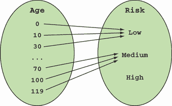
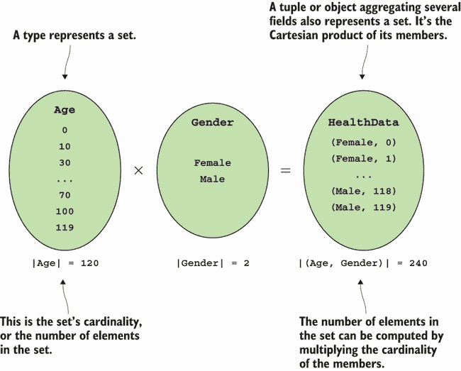

# 4 设计函数签名和类型

本章涵盖

+   设计良好的函数签名

+   对函数输入的精细控制

+   使用 `Unit` 作为 `void` 的更灵活的替代品

我们到目前为止所讨论的原则定义了泛型 FP，无论你是在使用 C# 这样的静态类型语言编程，还是在使用 JavaScript 这样的动态类型语言编程。在本章中，你将学习一些特定于静态类型语言的函数技术。函数及其参数的类型化打开了一系列有趣的考虑。

函数是函数程序的基本构建块，因此正确地获取函数签名至关重要。由于函数签名是在其输入和输出的类型的基础上定义的，因此正确地获取这些类型同样重要。类型设计和函数签名设计实际上是同一枚硬币的两个面。

你可能会认为经过多年的定义类和接口，你知道如何设计你的类型和函数。但结果是，FP 带来了一系列有趣的概念，可以帮助你提高程序的健壮性和 API 的可用性。

## 4.1 设计函数签名

函数的签名告诉了你其输入和输出的类型；如果函数有名称，它还包括函数的名称。随着你更多地以函数方式编程，你会发现你更频繁地查看函数签名。定义函数签名是你在开发过程中的一个重要步骤，通常是你接近问题时做的第一件事。

我将首先介绍一个在 FP 社区中标准的函数签名符号。我们将全书使用它。

### 4.1.1 使用箭头符号编写函数签名

在 FP 中，函数签名通常使用 *箭头符号* 来表达。学习它有很大的好处，因为你会发现它在 FP 的书籍、文章和博客中：它是不同语言的功能程序员使用的通用语言。

假设我们有一个从 `int` 到 `string` 的函数 `f`；它接受一个 `int` 作为输入并返回一个 `string` 作为输出。我们将这样表示其签名：

```
f : int → string
```

在英语中，你会读到 `f` 的类型是 `int` 到 `string`，或者 `f` 接受一个 `int` 并返回一个 `string`。在 C# 中，具有此签名的函数可以赋值给 `Func<int, string>`。

你可能会同意，箭头符号比 C# 类型更易读，这就是为什么我们在讨论签名时会使用它。当我们没有输入或输出（`void` 或 `Unit`）时，我们将使用 `()` 来表示。

让我们看看一些例子。表 4.1 显示了使用箭头符号表达的函数类型与相应的 C# 委托类型以及具有给定签名的函数的 lambda 表达式示例并排展示。

表 4.1 使用箭头符号表达函数签名

| 函数签名 | C# 类型 | 示例 |
| --- | --- | --- |
| `int` `→` `string` | `Func<int, string>` | `(int i) => i.ToString()` |
| `()` `→` `string` | `Func<string>` | `() => "hello"` |
| `int` `→` `()` | `Action<int>` | `(int i) => WriteLine($"gimme {i}")` |
| `()` `→` `()` | `Action` | `() => WriteLine("Hello World!")` |
| `(int, int)` `→` `int` | `Func<int, int, int>` | `(int a, int b) => a + b` |

表格 4.1 的最后一个例子显示了多个输入参数：我们只需用括号将它们分组。括号表示元组，因此实际上我们是在将二元函数表示为一元函数，其输入参数是一个二元元组。

现在，让我们转向更复杂的签名，即那些高阶函数（HOFs）的签名。让我们从以下方法开始，该方法接受一个 `string` 和一个从 `IDbConnection` 到 `R` 的函数，并返回一个 `R`：

```
static R Connect<R>(string connStr, Func<IDbConnection, R> func)
   => // ...
```

你会如何表示这个签名？第二个参数本身就是一个函数，因此它可以表示为 `IDbConnection → R`。HOF 的签名如下所示：

```
(string, (IDbConnection → R)) → R
```

这是相应的 C# 类型：

```
Func<string, Func<IDbConnection, R>, R>
```

箭头语法稍微轻量一些，并且更易于阅读，尤其是在签名的复杂性增加时。

### 4.1.2 签名有多大的信息量？

一些函数签名比其他签名更具表达性，我的意思是它们给我们提供了更多关于函数做什么、允许哪些输入以及我们可以期望什么输出的信息。例如，签名 `()` `→` `()` 完全没有提供任何信息：它可能打印一些文本，增加一个计数器，发射一艘宇宙飞船……谁知道呢？另一方面，考虑以下签名：

```
(IEnumerable<T>, (T → bool)) → IEnumerable<T>
```

花一分钟时间看看你是否能猜出具有此签名的函数做什么。当然，没有看到实际的实现，你无法确切知道，但你可以做出一个有根据的猜测。该函数返回一个 `T` 的列表，并接受一个 `T` 的列表，以及第二个参数，它是一个从 `T` 到 `bool` 的函数，即 `T` 的一个 *断言*。

合理地假设该函数使用 `T` 上的断言来过滤列表中的元素。简而言之，它是一个过滤函数。实际上，这正是 `Enumerable.Where` 的签名。让我们看看另一个例子：

```
(IEnumerable<A>, IEnumerable<B>, ((A, B) → C)) → IEnumerable<C>
```

你能猜出这个函数的作用吗？它返回一个 `C` 的序列，并接受一个 `A` 的序列，一个 `B` 的序列，以及一个从 `A` 和 `B` 计算出 `C` 的函数。合理地假设这个函数将计算应用于两个输入序列的元素，并返回一个包含计算结果的第三个序列。这个函数可能是我们第 3.2.3 节讨论过的 `Enumerable.Zip` 函数。

这两个最后的签名如此具有表达性，以至于你可以对实现做出很好的猜测，这是一个可取的特性。当你编写 API 时，你希望它清晰，如果签名与良好的命名一起表达函数的意图，那就更好了。

当然，函数签名所能表达的内容是有限的。例如，`Enumerable.TakeWhile`是一个遍历给定序列的函数，只要给定的谓词评估为真，就会产生所有元素，它与`Enumerable.Where`具有相同的签名。这很有道理，因为`TakeWhile`也可以被视为一个过滤函数，但它的工作方式与`Where`不同。

总结来说，一些签名比其他签名更具表现力。随着你开发你的 API，尽量让你的签名尽可能具有表现力——这有助于你的 API 被消费，并为你的程序增加鲁棒性。

## 4.2 使用数据对象捕获数据

函数和数据就像硬币的两面：函数消耗数据并产生数据。一个好的 API 需要具有清晰签名的函数和精心设计的用于表示这些函数输入和输出的数据类型。在 FP（与 OOP 不同），在逻辑和数据之间进行区分是自然的：

+   逻辑被编码在函数中。

+   数据通过数据对象被捕获，这些数据对象被用作这些函数的输入和输出。

在本节中，我们将探讨一些设计数据对象的基本思想。然后，我们将继续探讨表示数据缺失（第 4.3 节）或可能的数据缺失（第五章）的相对抽象的概念。

假设你从事人寿保险业务。你需要编写一个函数，根据客户的年龄计算其风险配置文件。风险配置文件将通过一个`enum`来捕获：

```
enum Risk { Low, Medium, High }
```

你和 David 一起结对编程，David 是一名来自动态类型语言的实习生，他尝试实现这个函数。他在 REPL 中用几个输入运行它，以确认它按预期工作：

```
Risk CalculateRiskProfile(dynamic age)
   => (age < 60) ? Risk.Low : Risk.Medium;

CalculateRiskProfile(30) // => Low
CalculateRiskProfile(70) // => Medium
```

虽然在给定的合理输入下，实现似乎可以工作，但你还是对 David 选择`dynamic`作为参数类型感到惊讶。你向他展示他的实现允许客户端代码用`string`调用该函数，导致运行时错误：

```
CalculateRiskProfile("Hello")
// => runtime error: Operator '<' cannot be applied to operands➥
 of type 'string' and 'int'
```

你向 David 解释说，你可以告诉编译器你的函数期望什么类型的输入，这样就可以排除无效的输入。你重写了函数，将输入参数的类型改为`int`：

```
Risk CalculateRiskProfile(int age)
   => (age < 60) ? Risk.Low : Risk.Medium;

CalculateRiskProfile("Hello")
// => compiler error: cannot convert from 'string' to 'int'
```

是否还有改进的空间？

### 4.2.1 原始类型通常不够具体

当你继续测试你的函数时，你会发现实现仍然允许无效的输入：

```
CalculateRiskProfile(-1000) // => Low
CalculateRiskProfile(10000) // => Medium
```

显然，这些不是客户年龄的有效值。那么，什么才是有效的年龄呢？你和业务方进行了讨论，以澄清这一点，他们指出合理的年龄值必须是正数且小于 120。你的第一反应是在你的函数中添加一些验证——如果给定的年龄超出了有效范围，则抛出异常：

```
Risk CalculateRiskProfile(int age)
{
   if (age < 0 || 120 <= age)
      throw new ArgumentException($"{age} is not a valid age");

   return (age < 60) ? Risk.Low : Risk.Medium;
}

CalculateRiskProfile(10000)
// => runtime error: 10000 is not a valid age
```

当你输入这些内容时，你可能会想这相当烦人：

+   你将不得不为验证失败的案例编写额外的单元测试。

+   应用程序的其他区域也需要年龄，因此您可能需要在那些地方也需要进行验证。这可能会导致一些代码重复。

*重复* 通常意味着关注点的分离已被破坏：`CalculateRiskProfile` 函数，它只应关注计算，现在也关注验证。有没有更好的方法？

### 4.2.2 使用自定义类型约束输入

同时，您的同事弗里达，她来自静态类型函数式语言，加入了会议。她看了看您到目前为止的代码，发现问题是您使用 `int` 来表示年龄。她评论说：“您可以让编译器知道您的函数期望什么类型的输入，这样就可以排除无效的输入。”

戴维惊讶地听着，因为这些正是您几分钟前用来夸奖他的话。您不确定她确切的意思，于是她开始实现 `Age`，作为一个只能表示有效年龄值的自定义类型，如下所示。

列表 4.1 仅能使用有效值实例化的自定义类型

```
public struct Age
{
   public int Value { get; }

   public Age(int value)
   {
      if (!IsValid(value))
         throw new ArgumentException($"{value} is not a valid age");

      Value = value;
   }

   private static bool IsValid(int age)
      => 0 <= age && age < 120;
}
```

此实现仍然使用 `int` 作为年龄的底层表示，但构造函数确保 `Age` 类型只能用有效值实例化。

这是一个功能思维的很好例子：`Age` 类型正是为了表示 `CalculateRiskProfile` 函数的域而创建的。现在可以重写如下：

```
Risk CalculateRiskProfile(Age age)
   => (age.Value < 60) ? Risk.Low : Risk.Medium;
```

这种新的实现有几个优点：

+   您确保只能提供有效的值。

+   `CalculateRiskProfile` 不再导致运行时错误。

+   验证年龄值的担忧被 `Age` 类型的构造函数所捕捉，从而消除了在处理年龄时重复验证的需要。

您仍然在 `Age` 构造函数中抛出异常，但我们在第 5.4.3 节中会解决这个问题。然而，仍有改进的空间。

在先前的实现中，我们使用了 `Value` 来提取年龄的底层值，所以我们仍然是在比较两个整数。这有几个问题：

+   读取 `Value` 属性不仅会带来一些噪音，还意味着客户端代码知道了 `Age` 的内部表示，您可能希望在将来更改它。

+   因为您正在进行整数比较，所以如果有人不小心将 `60` 的阈值值更改为 `600`（这是一个有效的 `int` 但不是有效的 `Age`），您将不会受到保护。

您可以通过修改 `Age` 的定义来解决这些问题，如下所示。

列表 4.2 封装年龄的内部表示

```
public class Age
{
   private int Value { get; }                      ❶

   public static bool operator <(Age l, Age r)     ❷
      => l.Value < r.Value;
   public static bool operator >(Age l, Age r)
      => l.Value > r.Value;

   public static bool operator <(Age l, int r)     ❸
      => l < new Age(r);
   public static bool operator >(Age l, int r)
      => l > new Age(r);
}
```

❶ 保持内部表示私有

❷ 比较一个 `Age` 与另一个 `Age` 的逻辑

❸ 为了便于使用，使得可以将一个 `Age` 与一个 `int` 进行比较；首先将 `int` 转换为 `Age`。

现在年龄的内部表示被封装起来，比较逻辑在 `Age` 类中。你可以将你的函数重写如下：

```
Risk CalculateRiskProfile(Age age)
   => (age < 60) ? Risk.Low : Risk.Medium;
```

现在发生的情况是，从值 `60` 构造一个新的 `Age`，以便应用常规验证。（如果这抛出一个运行时错误，那没关系，因为这表明开发者错误；关于这一点，请参阅第八章。）当输入年龄进行比较时，这个比较是在 `Age` 类中进行的，使用你定义的比较运算符。总的来说，代码与之前一样易于阅读，但更健壮。

总结来说，原始类型通常被过于自由地使用（这已经成为 *原始类型迷恋* 的代名词）。如果你需要限制你函数的输入，通常更好的做法是定义一个自定义类型。这遵循了使无效状态不可表示的想法。在前面的例子中，你不能表示超出有效范围的年龄。

`CalculateRiskProfile` 的新实现与其原始实现相同，除了输入类型现在是 `Age`，这确保了数据的有效性并使函数签名更加明确。一个函数式程序员可能会说，现在函数是 *诚实的*。这是什么意思？

### 4.2.3 编写诚实的函数

你可能会听到函数式程序员谈论 *诚实* 或 *不诚实* 的函数。一个诚实的函数简单地说就是它所说的那样：它始终遵守其签名——*总是*。例如，考虑我们在 4.2.2 节中最终得到的函数：

```
Risk CalculateRiskProfile(Age age)
   => (age < 60) => Risk.Low : Risk.Medium;
```

其签名是 `Age` `→` `Risk`，声明，“给我一个 `Age`，我会给你一个 `Risk`。”确实，没有其他可能的输出。¹ 这个函数的行为就像一个数学函数，将域中的每个元素映射到陪域中的一个元素，如图 4.1 所示。



图 4.1 一个诚实的函数正好做其签名所说的：它将输入类型（的）所有可能值映射到输出类型的有效值。这使得你函数的行为可预测，并且你的程序更健壮。

将此与之前的实现进行比较，其看起来如下：

```
Risk CalculateRiskProfile(int age)
{
   if (age < 0 || 120 <= age)
      throw new ArgumentException($"{age} is not a valid age");

   return (age < 60) ? Risk.Low : Risk.Medium;
}
```

记住，签名是一个合同。签名 `int` `→` `Risk` 表示，“给我一个 `int`（`int` 的 232 个可能值中的任何一个），我会返回一个 `Risk`。”但实现并没有遵守其签名，对于它认为无效的输入抛出一个 `ArgumentException`（见图 4.2）。


图 4.2 一个不诚实的函数可能会有在签名中没有考虑到的结果。

这意味着这个函数是 *不诚实* 的——它 *真正* 应该说的是“给我一个 `int`，我 *可能* 返回一个 `Risk`，或者我可能抛出一个异常。”有时有合法的理由导致计算失败，但在这个例子中，限制函数输入，使函数始终返回一个有效值是一个更干净的解决方案。

总结来说，如果一个函数的行为可以通过其签名预测，那么这个函数就是诚实的：

+   它返回声明类型的价值。

+   它不会抛出异常。

+   它永远不会返回`null`。

注意，这些要求比函数纯度要求宽松且正式性较低。值得注意的是，一个执行 I/O 操作的函数仍然可以是诚实的。在这种情况下，其返回类型通常应该传达该函数可能会失败或需要很长时间（例如，通过返回一个包裹在`Exceptional`或`Task`中的结果，我将在第八章和第十六章分别讨论这些内容。）

### 4.2.4 将值组合成复杂的数据对象

你可能需要更多数据来微调你的健康风险计算实现。例如，从统计上看，女性的寿命通常比男性长，因此你可能想要考虑这一点：

```
enum Gender { Female, Male }

Risk CalculateRiskProfile(Age age, Gender gender)
{
   var threshold = (gender == Gender.Female) ? 62 : 60;
   return (age < threshold) ? Risk.Low : Risk.Medium;
}
```

因此，该函数的签名如下：

```
(Age, Gender) → Risk
```

有多少可能的输入值？在这个显然是简化的模型中，`Gender`有 2 个可能的值，`Age`有 120 个值，所以总共有 2 × 120 = 240 个可能的输入。注意，如果你定义一个包含`Age`和`Gender`的元组，可能存在 240 个元组。同样，如果你定义一个类型来存储相同的数据，情况也是如此：

```
readonly record struct HealthData
{
   Age Age;
   Gender Gender;
};
```

无论你是调用接受`Age`和`Gender`的二元函数，还是调用接受`HealthData`的单元函数，都有 240 种不同的输入可能。它们只是包装得略有不同。

之前我说过，类型代表集合，所以`Age`类型代表一个包含 120 个元素的集合，而`Gender`代表一个包含 2 个元素的集合。那么，更复杂的类型，如`HealthData`，它是在前两种类型的基础上定义的，又该如何呢？

实质上，创建一个`HealthData`实例相当于从两个集合`Age`和`Gender`的所有可能组合（笛卡尔积）中选择一个元素。更普遍地说，每次你向类型（或元组）添加一个字段，你就在创建一个笛卡尔积，并为对象可能值的范围增加一个维度，如图 4.3 所示。



图 4.3 对象或元组可以被视为笛卡尔积。

因此，在类型理论中，通过聚合其他类型（无论是在元组、记录、结构或类中）定义的类型被称为*积类型*。相比之下，你有*和类型*。例如，如果类型`A`和`B`是`C`的两个唯一具体实现，那么

*|C| = |A| + |B|*

可能的`C`的数量是所有可能的`A`和所有可能的`B`的总和。（求和类型也被称为*联合类型*、*区分联合*以及许多其他名称。）

这就结束了我们对数据对象设计的简要探索。主要的收获是，你应该以一种方式来建模你的数据对象，这样你就可以精细控制你的函数需要处理的数据范围。计算可能的实例数量可以带来清晰度。一旦你控制了这些简单类型，就很容易将它们聚合为更复杂的数据对象。现在，让我们继续探讨所有类型中最简单的一种：空元组或`Unit`。

## 4.3 使用`Unit`建模数据缺失

我们已经讨论了如何表示数据；那么当没有数据可以表示时怎么办？许多函数被调用是为了它们的副作用，并返回`void`。但是`void`与许多函数式技术不兼容，所以在本节中，我将介绍`Unit`，这是一种我们可以用来表示数据缺失的类型，而不会遇到`void`的问题。

### 4.3.1 为什么`void`不是理想的选择

让我先说明一下为什么`void`不是理想的选择。在第 2.1.2 节中，我们介绍了通用的`Func`和`Action`委托家族。如果它们是通用的，为什么我们需要两个？为什么我们不能使用`Func<Void>`来表示一个不返回任何值的函数，就像我们使用`Func<string>`来表示一个返回`string`的函数一样？问题在于，尽管框架有`System.Void`类型和`void`关键字来表示没有返回值，但`Void`在编译器中受到特殊处理，因此不能用作返回类型。（实际上，它根本不能从 C#代码中使用。）

让我们看看为什么这在实践中可能成为一个问题。假设你需要了解某些操作所需的时间，为此，你编写了一个高阶函数（HOF），它启动计时器，运行给定的函数，然后停止计时器，并打印出一些诊断信息。这是我在第 2.3 节中演示的设置/拆除场景的典型例子。以下是实现代码：

```
public static class Instrumentation
{
   public static T Time<T>(string op, Func<T> f)
   {
      var sw = new Stopwatch();
      sw.Start();

      T t = f();

      sw.Stop();
      Console.WriteLine($"{op} took {sw.ElapsedMilliseconds}ms");
      return t;
   }
}
```

如果你想要读取文件的内容并记录操作所需的时间，你可以使用这个函数：

```
var contents = Instrumentation.Time("reading from file.txt"
   , () => File.ReadAllText("file.txt"));
```

很自然地，你可能会想要使用这个与返回`void`的函数一起。例如，你可能想要测量写入文件所需的时间，所以你希望编写如下代码：

```
Instrumentation.Time("writing to file.txt"
   , () => File.AppendAllText("file.txt", "New content", Encoding.UTF8));
```

问题在于`AppendAllText`返回`void`，因此它不能表示为`Func`。为了使前面的代码正常工作，你需要添加一个`Instrumentation.Time`的重载，它接受一个`Action`：

```
public static void Time(string op, Action act)
{
   var sw = new Stopwatch();
   sw.Start();

   act();

   sw.Stop();

   Console.WriteLine($"{op} took {sw.ElapsedMilliseconds}ms");
}
```

这太糟糕了！你不得不因为`Func`和`Action`委托之间的不兼容性而复制整个实现。（在异步操作的世界中，`Task`和`Task<T>`之间也存在类似的二分法。）你该如何避免这种情况？

### 4.3.2 在`Action`和`Func`之间架起桥梁

如果你打算使用函数式编程，有一个表示*无返回值*的不同表示形式是有用的。我们不会使用特殊的语言构造`void`，而是使用一个特殊值，空元组（也称为`Unit`）。空元组没有成员，因此它只有一个可能的值。因为它不包含任何信息，所以这相当于没有值。

空元组在`System`命名空间中可用。不引人注目的是，它被称为`ValueTuple`，但我会遵循 FP 惯例，称它为`Unit`:²

```
using Unit = System.ValueTuple;
```

技术上，`void`和`Unit`不同之处在于

+   `void`是一个表示空集合的类型；因此，无法创建其实例。

+   `Unit`代表一个包含单个值的集合；因此，任何`Unit`的实例都与任何其他实例等效，并且因此不携带任何信息。

如果你有一个接受`Func`的 HOF，但你想用它与`Action`一起使用，你该如何操作？在第二章中，我介绍了你可以编写*适配器*函数来修改现有函数以适应你的需求的想法。在这种情况下，你想要一种轻松地将`Action`转换为`Func<Unit>`的方法。接下来的列表提供了`ToFunc`函数的定义，它正是这样做的。它包含在我的函数式库`LaYumba .Functional`中，我开发这个库是为了支持本书的教学。

列表 4.3 将`Action`转换为`Func<Unit>`

```
using Unit = System.ValueTuple;             ❶

namespace LaYumba.Functional;               ❷

public static class ActionExt
{
   public static Func<Unit> ToFunc          ❸
       (this Action action)
       => () => { action(); return default; };

   public static Func<T, Unit> ToFunc<T>    ❸
       (this Action<T> action)
       => (t) => { action(t); return default; };

   // more overloads for Action's with more arguments...
}
```

❶ 将空元组别名为`Unit`

❷ 此文件作用域命名空间包括以下所有代码。

❸ 将`Action`转换为返回`Unit`的`Func`的适配器函数

当你用给定的`Action`调用`ToFunc`时，你得到一个`Func<Unit>`。这是一个当被调用时运行`Action`并返回`Unit`的函数。

TIP 此列表包含一个*文件作用域命名空间*，这是 C# 10 中引入的一个特性，用于减少缩进。声明的命名空间适用于文件的内容。

在此基础上，你可以扩展`Instrumentation`类，添加一个接受`Action`、将其转换为`Func<Unit>`并调用与任何`Func<T>`一起工作的现有重载的方法。接下来的列表展示了这种方法。

列表 4.4 不重复的接受`Func`或`Action`的 HOF

```
using LaYumba.Functional;
using Unit = System.ValueTuple;

public static class Instrumentation
{
   public static void Time(string op, Action act)    ❶
      => Time<Unit>(op, act.ToFunc());               ❷

   public static T Time<T>(string op, Func<T> f)
      => // same as before...
}
```

❶ 包含一个接受`Action`的重载

❷ 将`Action`转换为`Func<Unit>`并将其传递给接受`Func<T>`的重载

正如你所见，这使你能够在`Time`的实现中避免重复任何逻辑。你仍然必须公开接受`Action`的重载。但考虑到语言的限制，这是处理`Action`和`Func`的最佳折衷方案。

尽管仅凭这个例子你可能不会完全接受`Unit`，但在这本书中你将看到更多需要`Unit`和`ToFunc`来利用函数式技术的例子。总的来说，

+   使用`void`来表示数据的缺失，这意味着你的函数仅用于副作用调用，不返回任何信息。

+   在需要保持`Func`和`Action`处理一致性时，使用`Unit`作为替代，更灵活的表现形式。

注意：C# 7 引入了元组表示法，允许你编写，例如，`(1,` `"hello")`来表示一个二元元组，所以从逻辑上讲，你可能会期望能够编写`(1)`来表示一元元组，以及`()`来表示零元元组。不幸的是，由于 C#语法中括号的工作方式，这是不可能的：只有包含两个或更多元素的元组才能使用括号编写。因此，在我们的 C#代码中我们将坚持使用`Unit`，而在使用箭头表示法时使用`()`。例如，我将一个`Func<int,` `Unit>`表示为`int` `→` `()`。

## 摘要

+   尽可能使你的函数签名尽可能具体。这使得它们更容易消费且更不容易出错。

+   使你的函数诚实。诚实的函数总是做其签名所说的，并且给定预期的输入类型，它产生预期的输出类型——没有`Exception`s，没有`null`s。

+   使用自定义类型而不是临时的验证代码来约束函数的输入值。

+   当你需要为不返回数据的函数提供一个更灵活的表现形式时，使用`Unit`作为`void`的替代。

* * *

¹ 然而，也存在硬件故障、程序耗尽内存等情况的可能性，但这些不是函数实现的内在属性。

² 直到最近，函数库倾向于定义自己的`Unit`类型，作为一个没有成员的结构体。明显的缺点是这些自定义实现不兼容，因此我呼吁库开发者采用零参数的`ValueTuple`作为`Unit`的标准表示形式。
