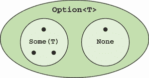
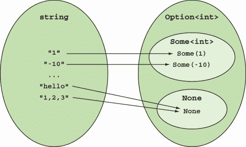

# 5 模拟数据可能不存在的情况

本章涵盖了

+   使用`Option`来表示数据的可能不存在

+   理解为什么`null`是一个糟糕的想法

+   你是否应该使用 C# 8 可空引用类型

在第四章中，我向你介绍了这样一个观点：类型应该精确地表示它们封装的数据，以便编写表达式的函数签名。一个特别棘手的问题是表示可能不可用数据的问题。例如，当你在一个网站上注册时，你通常需要提供你的电子邮件地址，但其他细节，如你的年龄和性别是可选的。网站所有者可能希望处理和分析这些数据*如果它们可用*。

“等等，”你可能正在想，“我们不是用`null`来做这个的吗？”我将在第 5.5 节中讨论`null`，但本章的前一部分，你可以假装`null`不存在，我们必须想出一种方法来表示数据的可能不存在。

当以函数式方式编码时，你永远不使用`null`——*永远不*。相反，FP 使用`Option`类型来表示可选性。我希望向你展示`Option`提供了一种更健壮和更具表达性的表示。如果你以前从未听说过`Option`，我请你暂时放下判断，因为`Option`的附加价值可能直到你看到它在下一两章中使用时才变得明显。

## 5.1 你每天使用的糟糕 API

在.NET 库中，处理表示数据可能不存在的问题并不优雅。想象一下，你去参加一个工作面试，并被要求进行以下测验：

*问题*：这个程序会打印什么？

```
using System;
using System.Collections.Generic;
using System.Collections.Specialized;
using static System.Console;

class IndexerIdiosyncracy
{
   public static void Main()
   {
      try
      {
         var empty = new NameValueCollection();
         var green = empty["green"];             ❶
         WriteLine("green!");

         var alsoEmpty = new Dictionary<string, string>();
         var blue = alsoEmpty["blue"];           ❷
         WriteLine("blue!");
      }
      catch (Exception ex)
      {
         WriteLine(ex.GetType().Name);
      }
   }
}
```

抽空阅读一下代码。注意`NameValueCollection`只是一个从`string`到`string`的映射。¹ 然后，写下你认为程序会打印的内容（确保没有人看着）。现在，你愿意下多少赌注你得到了正确答案？如果你像我一样，有一种挥之不去的感觉，认为作为一个程序员，你应该关心的事情不仅仅是这些烦人的细节，那么本节的其余部分将帮助你看到问题实际上出在 API 本身，而不是你知识不足。

代码使用索引器从两个空集合中检索项目，所以这两个操作都失败了。索引器当然只是普通函数——`[]`语法只是糖衣——所以这两个索引器都是类型为`string` `→` `string`的函数，并且都是不诚实的。我为什么说*不诚实*？

`NameValueCollection`索引器❶如果键不存在则返回`null`。关于`null`实际上是否是`string`，有些争议，但我倾向于说不。² 你给索引器一个完全有效的输入`string`，它返回一个无用的`null`值——而不是签名所声称的。

`Dictionary`索引器❷抛出`KeyNotFoundException`，所以它是一个函数，说“给我一个`string`，我会返回你一个`string`”，而实际上它应该说，“给我一个`string`，我*可能*返回你一个`string`，或者我可能抛出一个异常。”

更糟糕的是，这两个索引器以不一致的方式不诚实。现在你知道了这一点，很容易看出程序打印的内容：

```
green!
KeyNotFoundException
```

.NET 中两个不同的关联集合暴露的接口不一致。谁能想到呢？唯一的办法就是查看文档（无聊）或者偶然发现一个错误（更糟糕）。让我们看看表示数据可能缺失的功能方法。

## 5.2 介绍`Option`类型

`Option`本质上是一个包含值...或者没有值的容器。它就像一个*可能*包含东西的盒子，或者它可能是空的。`Option`的符号定义如下：

```
Option<T> = None | Some(T)
```

让我们看看这意味着什么。`T`是一个类型参数（内部值的类型），所以`Option<int>`可以包含一个`int`。`|`符号表示“或”，所以定义说明`Option<T>`可以是两种情况之一：

+   `None`—表示值缺失的特殊值。如果`Option`没有内部值，我们说`the Option`是`None`。

+   `Some(T)`—一个包装类型为`T`的值的容器。如果`Option`有内部值，我们说`the Option`是`Some`。

（如果你想知道，在`Option<T>`中，我使用尖括号来表示`T`是一个类型参数；在`Some(T)`中，我使用圆括号来表示`Some`是一个函数，它接受一个`T`并返回一个`Option<T>`，包装给定的值。）

从集合的角度来看，`Option<T>`是集合`Some(T)`与单元素集合`None`的并集（见图 5.1）。`Option`是求和类型的一个好例子，我们已经在第 4.2.4 节讨论过。



图 5.1 `Option<T>`是集合`Some<T>`与单元素集合`None`的并集。

如果`bool`有两个可能的值，那么`Some<bool>`也有两个可能的值，但`Option<bool>`有三个可能的值，因为它还包括`None`。同样，`Option<DayOfWeek>`有八个可能的值，等等。

我们将在下一小节中查看实现`Option`，但首先，让我们看看它的基本用法，这样你就熟悉 API 了。我建议你在 REPL 中跟随，但你需要做一些设置，这将在以下侧边栏中描述。

在 REPL 中使用`LaYumba.Functional`库

我开发了自己的功能库`LaYumba.Functional`，以支持本书中许多技术的教学。在 REPL 中尝试`LaYumba.Functional`中包含的构造将很有用。这需要你在 REPL 中导入它：

1.  如果你还没有这样做，请下载并编译来自[`github.com/la-yumba/functional-csharp-code-2`](https://github.com/la-yumba/functional-csharp-code-2)的代码示例。

1.  在你的 REPL 中引用 `LaYumba.Functional` 库。具体如何操作取决于你的设置。在我的系统中（使用 Visual Studio 中的 C# Interactive 窗口，并且代码示例解决方案已打开），我可以通过输入以下内容来实现：

    ```
    #r "functional-csharp-code-2\LaYumba.Functional\bin\Debug\net6.0\
    ➥ LaYumba.Functional.dll"
    ```

1.  在 REPL 中输入以下导入语句：

    ```
    using LaYumba.Functional;
    using static LaYumba.Functional.F;
    ```

设置好之后，你可以创建一些 `Option`：

```
Option<string> _ = None;               ❶

Option<string> john = Some("John");    ❷
```

❶ 创建一个 `None`

❷ 创建一个 `Some`

这很简单！现在你知道了如何创建 `Option`，那么你如何与它们交互呢？在最基本的情况下，你可以通过 `Match` 方法来实现，这是一个执行模式匹配的方法。简单来说，它允许你根据 `Option` 是 `None` 还是 `Some` 来运行不同的代码。

例如，如果你有一个可选的名字，你可以编写一个函数，为该名字返回一个问候语，如果没有提供名字，则返回一个通用消息。在 REPL 中输入以下内容：

```
string Greet(Option<string> greetee)
   => greetee.Match(
      None: () => "Sorry, who?",            ❶
      Some: (name) => $"Hello, {name}");    ❷

Greet(Some("John")) // => "Hello, John"

Greet(None) // => "Sorry, who?"
```

❶ 如果 `greetee` 是 `None`，则 `Match` 评估此函数。

❷ 如果 `greetee` 是 `Some`，则 `Match` 评估此函数，并将 `greetee` 的内部值传递给它。

正如你所见，`Match` 接受两个函数：第一个函数定义在 `None` 的情况下要做什么；第二个函数定义在 `Some` 的情况下要做什么。在 `Some` 的情况下，函数会接收到 `Option` 的内部值。

在前面的 `Match` 调用中，使用了命名参数 `None:` 和 `Some:` 以增加清晰度。可以省略这些参数：

```
string greet(Option<string> greetee)
   => greetee.Match
   (
      () => "Sorry, who?",
      (name) => $"Hello, {name}"
   );
```

通常我会省略它们，因为第一个 lambda 中的空括号 `()` 已经暗示了一个空的容器（即 `None` 状态下的 `Option`），而括号内有参数的括号 `(name)` 则暗示了一个包含值的容器。 （在 `Some` 的情况下，括号是可选的，就像任何一元 lambda 一样，但我保留它们以保持这种图形类比。）

如果现在这一切都有些令人困惑，不要担心；随着我们的深入，一切都会变得清晰。现在，这些是需要记住的事情：

1.  使用 `Some(value)` 将一个值包装到 `Option` 中。

1.  使用 `None` 创建一个空的 `Option`。

1.  使用 `Match` 根据选项的状态执行一些代码。

目前，你可以将 `None` 视为 `null` 的替代品，将 `Match` 视为 `null` 检查的替代品。你将在后续章节中看到为什么使用 `Option` 实际上比使用 `null` 更可取，以及为什么最终你不太需要经常使用 `Match`。

## 5.3 实现 Option

随意跳到第 5.4 节或首次阅读时浏览这一节。首先，重要的是你要理解足够的内容，以便能够 *使用* `Option`。但如果你想看看内部结构，在这一节中，我将向你展示我在 `LaYumba.Functional` 中实现 `Option` 时使用的技巧。这样做是为了向你展示其中几乎没有魔法，以及如何绕过 C# 类型系统的一些限制。你可能想在你跟随的同时将此代码输入到一个空项目中。

### 5.3.1 选项的理想化实现

在许多类型化的函数式编程语言中，`Option` 可以用一行代码定义如下：

```
type Option t = None | Some t
```

在 C# 中最接近的等效方法是以下内容：

```
interface Option<T> { }
record None : Option<T>;
record Some<T>(T Value) : Option<T>;
```

即，我们定义 `Option<T>` 为一个*标记*接口，然后为 `None` 和 `Some<T>` 提供最小实现，表示它们都是有效的 `Option<T>`。`Some<T>` 包含一个 `T`，而 `None` 不包含任何内容。

在这里，我们已经遇到了一个问题：因为 `None` 实际上不包含一个 `T`，我们希望无论 `T` 最终解析为哪种类型，`None` 都是一个有效的 `Option<T>`。不幸的是，C# 编译器不允许这样做，因此为了使代码能够编译，我们需要为 `None` 也提供一个泛型参数。

```
record None<T> : Option<T>;
```

我们现在有一个基本的、可工作的实现。

### 5.3.2 消费一个 `Option`

接下来，我们想要编写使用模式匹配来消费 `Option` 的代码。理想情况下，我希望它看起来像这样：

```
string Greet(Option<string> greetee)
   => greetee switch
   {
      None => "Sorry, who?",
      Some(name) => $"Hello, {name}"
   };
```

不幸的是，这不能编译。如果我们想要满足 C# 中模式匹配的语法，我们需要将代码重写如下：

```
string Greet(Option<string> greetee)
   => greetee switch
   {
      None<string> => "Sorry, who?",
      Some<string>(var name) => $"Hello, {name}"
   };
```

这肯定没有这么优雅（想象一下，如果你有一个比 `string` 更长的类型名），但至少它可以编译。然而，它确实会生成一个编译器警告，指出“switch 表达式没有处理其输入类型的所有可能值。”这是因为，从理论上讲，可能存在其他实现 `Option<string>` 的方法，而我们示例中的 `switch` 表达式并没有考虑到这一点。不幸的是，没有方法可以告诉 C# 我们永远不希望除了 `Some` 和 `None` 之外的其他东西实现 `Option`。

我们可以通过定义自己的适配器函数 `Match` 并包含一个*丢弃模式*来减轻这两个问题。这允许我们进行穷举模式匹配，并给我们一个易于消费的接口：

```
static R Match<T, R>(this Option<T> opt, Func<R> None, Func<T, R> Some)
   => opt switch
   {
      None<T> => None(),
      Some<T>(var t) => Some(t),
      _ => throw new ArgumentException("Option must be None or Some")
   };
```

然后，我们可以像这样消费一个 `Option`：

```
string Greet(Option<string> greetee)
   => greetee.Match
   (
      None: () => "Sorry, who?",
      Some: (name) => $"Hello, {name}"
   );
```

现在我们有一个优雅、简洁的方式来消费一个 `Option`。（注意，我们还需要一个接受两个操作的 `Match` 重载，这样我们就可以根据 `Option` 的状态来*执行某些操作*。这可以通过第 4.3.2 节中描述的方法轻松实现。）

### 5.3.3 创建一个 `None`

让我们继续创建 `Option`。为了显式创建一个 `None`——比如说，为了测试 `Greet` 是否与 `None` 一起工作——我们必须编写以下内容：

```
var greeting = Greet(new None<string>());
```

这并不好。我特别不喜欢我们必须指定 `string` 参数：当我们调用一个方法时，我们希望类型推断来解决我们的泛型参数。理想情况下，我们需要一个可以转换为 `None<T>` 的值，无论 `T` 的类型如何。

虽然你不能用继承来实现这一点，但结果证明你可以用类型转换来实现。为了实现这一点，我们需要定义一个专用、非泛型类型，`NoneType`：

```
struct NoneType { }
```

接下来，我们将 `Option<T>` 改为包括从 `NoneType` 到 `None<T>` 的隐式转换：

```
abstract record Option<T>
{
   public static implicit operator Option<T>(NoneType _)
      => new None<T>();
}
```

这实际上告诉运行时可以在期望 `Option<T>` 的地方使用 `NoneType` 的实例，并指示运行时将 `NoneType` 转换为 `None<T>`。最后，我们包括一个名为 `None` 的便利字段，它存储一个 `NoneType`：

```
public static readonly NoneType None = default;
```

你现在可以通过简单地输入`None`来创建一个`None<T>`：

```
Greet(None) // => "Sorry, who?"
```

这好多了！请注意，这假设`None`字段在作用域内，这可以通过`using static`实现。

在前面的代码片段中，`None`返回一个`NoneType`。由于`Greet`期望一个`Option<string>`，运行时会调用我们在`Option<T>`中定义的隐式转换，这会产生一个`None<string>`。所有这些完成后，你可以忘记`NoneType`的存在，只需编写知道`None`会为期望的`T`返回一个`None<T>`的代码。

### 5.3.4 创建一个 Some

现在来创建一个`Some`。首先，由于`Some`表示值的存在，不应该可能将`null`包装到`Some`中。为了做到这一点，我们不会依赖于编译器为记录生成的自动方法，而是会显式定义构造函数：

```
record Some<T> : Option<T>
{
   private T Value { get; }

   public Some(T value)
      => Value = value ?? throw new ArgumentNullException();

   public void Deconstruct(out T value)
      => value = Value;
}
```

在这里，我也将`Option`的内部值设置为`private`，这样它只能在模式匹配中解构`Option`时访问。然后我们可以定义一个便利函数`Some`，它将给定的值包装成一个`Some`：

```
public static Option<T> Some<T>(T t) => new Some<T>(t);
```

有了这个，我们可以这样创建一个`Some`：

```
Greet(Some("John")) // => "Hello, John"
```

现在我们有了创建`None`和`Some`的简洁语法。为了锦上添花，我还会定义一个从`T`到`Option<T>`的隐式转换：

```
abstract record Option<T>
{
   public static implicit operator Option<T>(T value)
      => value is null ? new None<T>() : new Some<T>(value);
}
```

这意味着`T`可以在期望`Option<T>`的地方使用，并且会自动被包装成一个`Some<T>`——除非它是`null`，在这种情况下它将是一个`None<T>`。这个代码片段让我们免去了显式调用`Some`的需要：

```
Greet(None)   // => "Sorry, who?"
Greet("John") // => "Hello, John"
```

它还允许我们轻松地将返回`null`的函数转换为返回`Option`的函数：

```
var empty = new NameValueCollection();
Option<string> green = empty["green"];

green // => None
```

### 5.3.5 优化`Option`实现

由于许多原因，在我的`LaYumba.Functional`库中，我选择使用稍微不同的方法，并定义`Option`如下所示。

列表 5.1 `Option`的 C#优化实现

```
public struct Option<T>
{
   readonly T? value;                                        ❶
   readonly bool isSome;                                     ❷

   internal Option(T value)                                  ❸
   {
      this.value = value ?? throw new ArgumentNullException();
      this.isSome = true;
   }

   public static implicit operator Option<T>(NoneType _)
      => default;                                            ❹

   public static implicit operator Option<T>(T value)
      => value is null ? None : Some(value);

   public R Match<R>(Func<R> None, Func<T, R> Some)          ❺
       => isSome ? Some(value!) : None();                    ❺
}
```

❶ 被 Some 包裹的值

❷ 表示`Option`是`Some`还是`None`

❸ 构建一个处于`Some`状态的`Option`

❹ 构建一个处于`None`状态的`Option`

❺ 一旦构建了`Option`，与之交互的唯一方式是通过`Match`。

在这个实现中，我并不是使用不同的类型，而是使用*状态*（即`isSome`标志）来表示`Option`是`Some`还是`None`。我提供了一个单构造函数，它创建一个处于`Some`状态的`Option`。这是因为我已经将`Option`定义为结构体，结构体有一个隐式的无参数构造函数，它将所有字段初始化为其默认值。在这种情况下，`isSome`标志被初始化为`false`，表示`Option`是`None`。这个实现有几个优点：

+   性能更好，因为结构体是在栈上分配的。

+   由于是结构体，`Option`不能是`null`。

+   `Option`的`default`值是`None`（在记录中是`null`）。

其他所有内容（`NoneType`、隐式转换和`Match`的接口）与之前讨论的相同。最后，我在`F`类中定义了`Some`函数和`None`值，这使得你可以轻松创建`Option`：

```
namespace LaYumba.Functional;

public static partial class F
{
   public static Option<T> Some<T>(T value) => new Option<T>(value);
   public static NoneType None => default;
}
```

现在你已经看到了拼图的每一块，再看看我之前展示的例子。现在应该更清晰了：

```
using LaYumba.Functional;
using static LaYumba.Functional.F;

string Greet(Option<string> greetee)
   => greetee.Match
   (
      None: () => "Sorry, who?",
      Some: (name) => $"Hello, {name}"
   );

Greet(Some("John")) // => "Hello, John"

Greet(None) // => "Sorry, who?"
```

正如你所见，有几种不同的方法可以在 C#中实现`Option`。我选择了这种特定的实现，因为它从客户端代码的角度提供了最干净的 API。但`Option`是一个概念，而不是特定的实现，所以如果你在另一个库或教程中看到不同的实现，请不要惊慌。³ 它仍然具有`Option`的标志性特征：

+   一个表示值不存在的`None`值

+   一个`Some`函数，它封装一个值，表示存在一个值

+   根据值是否存在来执行代码的方式（在我们的案例中，是`Match`）

`Option`也被称为`Maybe`

不同的函数式框架使用不同的术语来表达类似的概念。`Option`的一个常见同义词是`Maybe`，其中`Some`和`None`状态分别称为`Just`和`Nothing`。

这种命名不一致性在函数式编程（FP）中很常见，这并不利于学习过程。在这本书中，我将尝试展示每个模式或技术最常见的同义词，然后坚持使用一个名称。从现在开始，我将坚持使用`Option`。只需知道，如果你遇到`Maybe`（比如在 JavaScript 或 Haskell 库中），它具有相同的概念。

让我们现在看看一些实际场景，在这些场景中你可以使用`Option`。

## 5.4 作为部分函数的自然结果类型的`Option`

我们讨论了函数如何将一个集合的元素映射到另一个集合，以及类型如何表示这些集合。在总函数和部分函数之间有一个重要的区别：

+   *总函数*—对定义域中的每个元素都进行映射

+   *部分函数*—只对定义域中的某些元素而不是所有元素进行映射

部分函数有问题是，当给定的输入无法计算结果时，不清楚函数应该做什么。`Option`类型提供了一个完美的解决方案来模拟这种情况：如果函数为给定的输入定义了，它返回一个封装结果的`Some`；否则，它返回`None`。让我们看看一些常见的使用场景，我们可以使用这种方法。

### 5.4.1 解析字符串

想象一个解析整数字符串表示的函数。你可以将其建模为一个类型为`string` `→` `int`的函数。这显然是一个部分函数，因为并非所有字符串都是有效的整数表示。事实上，有无限多个字符串无法映射到`int`。

你可以通过让解析函数返回`Option<int>`来提供一个更安全的解析表示。如果给定的`string`无法解析，它将返回`None`，如图 5.2 所示。



图 5.2 使用`Option`传达解析是一个部分函数。对于提供有效整数表示的输入字符串，解析函数将解析的`int`包装到`Some`中。否则，它返回`None`。

签名为`string` `→` `int`的解析函数是部分函数，从签名中不清楚如果你提供一个无法转换为`int`的`string`会发生什么。另一方面，签名为`string` `→` `Option<int>`的解析函数是全函数，因为对于任何给定的字符串，它返回一个有效的`Option<int>`。以下是一个使用 BCL 方法执行繁重工作但公开基于`Option`的 API 的实现：

```
public static class Int
{
   public static Option<int> Parse(string s)
      => int.TryParse(s, out int result)
         ? Some(result) : None;
}
```

本小节中的辅助函数包含在`LaYumba.Functional`中。你可以在 REPL 中尝试它们：

```
Int.Parse("10")    // => Some(10)
Int.Parse("hello") // => None
```

定义了类似的方法来解析字符串到其他常用类型，如双精度浮点数和日期，以及更一般地，将一种形式的数据转换为另一种更严格的形式。

### 5.4.2 在集合中查找数据

在 5.1 节中，我向你展示了某些集合公开的 API 在表示数据缺失方面既不诚实也不一致。要点如下：

```
new NameValueCollection()["green"]
// => null

new Dictionary<string, string>()["blue"]
// => runtime error: KeyNotFoundException
```

基本问题是以下内容。关联集合将键映射到值，因此可以被视为类型`TKey` `→` `TValue`的函数。但是，没有保证集合包含每个可能的键的值，因此查找值是一个部分函数。

通过返回`Option`来建模值的检索是一个更好、更明确的方法。可以编写适配器函数来公开基于`Option`的 API，我通常将这些返回`Option`的函数命名为`Lookup`：

```
Lookup : (NameValueCollection, string) → Option<string>
```

`Lookup`接受一个`NameValueCollection`和一个`string`（键）并返回一个包含值的`Some`，如果键存在，否则返回`None`。以下列表显示了实现。

列表 5.2 将返回`null`的函数改为返回`Option`

```
public static Option<string> Lookup
   (this NameValueCollection collection, string key)
   => collection[key];
```

就这样！表达式`collection[key]`是`string`类型，而声明的返回值是`Option<string>`，因此`string`值将被隐式转换为`Option<string>`，`null`被替换为`None`。我们付出了最小的努力，就从基于`null`的 API 转换到了基于`Option`的 API。

这里是一个`Lookup`的重载版本，它接受一个`IDictionary`。签名类似：

```
Lookup : (IDictionary<K, T>, K) → Option<T>
```

我们可以将`Lookup`函数实现如下：

```
public static Option<T> Lookup<K, T>(this IDictionary<K, T> dict, K key)
   => dict.TryGetValue(key, out T value) ? Some(value) : None;
```

现在我们有一个诚实、清晰且一致的 API 来查询这两个集合：

```
new NameValueCollection().Lookup("green")
// => None

new Dictionary<string, string>().Lookup("blue")
// => None
```

由于你请求的键不在集合中，不再有`KeyNotFoundException`或`NullReferenceException`。我们可以将相同的方法应用于查询其他数据结构。

### 5.4.3 智能构造器模式

在 4.2.2 节中，我们定义了`Age`类型，这是一个比`int`更严格的类型，因为并非所有的`int`都代表有效的年龄。你同样可以用`Option`来建模，如图 5.3 所示。


图 5.3 将`int`转换为`Age`也可以用`Option`来建模。

如果你需要从一个`int`创建一个`Age`，而不是调用必须抛出异常以创建有效实例的构造函数，你可以定义一个返回`Some`或`None`的函数来指示`Age`创建成功。这被称为*智能构造函数*：它之所以智能，是因为它了解一些规则，可以防止创建无效的对象。以下列表展示了这种方法。

列表 5.3 实现`Age`的智能构造函数

```
public struct Age
{
   private int Value { get; }

   public static Option<Age> Create(int age)        ❶
      => IsValid(age) ? Some(new Age(age)) : None;

   private Age(int value)                           ❷
      => Value = value;

   private static bool IsValid(int age)
      => 0 <= age && age < 120;
}
```

❶ 一个智能构造函数返回`Option`

❷ 构造函数现在应该标记为`private`。

如果你现在需要从一个`int`获取`Age`，你会得到`Option<Age>`，这迫使你必须考虑失败的情况。

## 5.5 处理`null`

在本章的开头，我要求你假装 C#中没有`null`，我们必须想出一种表示可选值的方法。真正函数式语言没有`null`，而是用`Option`类型来表示可选值。然而，一些最受欢迎的编程语言，包括 C#，不仅允许`null`的存在，而且将其用作所有引用类型的默认值。在本节中，我将向你展示为什么这是一个问题以及如何解决这个问题。

### 5.5.1 为什么`null`是一个如此糟糕的想法

让我们看看为什么`null`会导致这么多问题。

不严谨的数据建模

在 4.2.4 节中，你看到元组`(Age, Gender)`有(120 × 2) = 240 个可能的值。如果你将这两个值存储在结构体中，情况也是一样的。现在，如果你定义一个类或记录来保存这些值，如下所示

```
record HealthData(Age age, Gender Gender);
```

那么实际上有 241 个可能的值，因为引用类型可以是`null`。如果你将`Age`重构为类，你现在有 121 个可能的`Age`值和 243 个可能的`HealthData`值！`null`不仅污染了数据的数学表示，而且我们还得编写代码来处理所有这些可能的值。

模糊的函数签名

你可能听说过`NullReferenceException`是单个最常见的错误来源。但为什么它如此普遍？我相信答案在于一个基本的不确定性：

+   因为引用类型默认是`null`，你的程序可能会因为编程错误而遇到`null`，其中所需值根本未初始化。

+   有时，`null`被认为是一个合法的值；例如，`NameValueCollection`的作者决定通过返回`null`来表示键不存在是可以的。

由于无法声明`null`值是故意的还是编程错误的后果（至少在 C# 8 的可空引用类型之前是这样，我将在 5.5.3 节中讨论），你经常对如何处理`null`值感到怀疑。你应该允许`null`吗？你应该抛出`ArgumentNullException`？你应该让`NullReferenceException`向上冒泡吗？本质上，每个接受或返回引用类型的函数都是模糊的，因为不清楚`null`值是合法的输入还是输出。

防御性 null 检查

合法`null`和无意`null`之间的歧义不仅会导致错误。它还有一个可能更严重的影响：它会导致防御性编程。为了防止潜在的`NullReferenceException`，开发者会在代码中充斥着`null`检查和对`null`参数的断言。虽然使用这些断言有合理的理由（见 5.5.4 节），但如果在整个代码库中使用，它们会制造很多噪音。

### 5.5.2 通过使用 Option 代替 null 来提高健壮性

解决这些问题的主要步骤是*永远*不要使用`null`作为合法值。相反，使用`Option`来表示可选值。这样，任何`null`的出现都是编程错误的后果。（这意味着你永远不需要检查`null`；只需让`NullReferenceException`向上冒泡。）让我们看看一个例子。

想象你网站上有一个表单，允许人们订阅时事通讯。用户输入他的名字和电子邮件，这会导致`Subscriber`的实例化，然后持久化到数据库中。`Subscriber`定义如下：

```
public record Subscriber
(
   string Name,
   string Email
);
```

当是时候发送时事通讯时，为订阅者计算一个自定义问候语，并将其添加到时事通讯的主体之前：

```
public string GreetingFor(Subscriber subscriber)
   => $"Dear {subscriber.Name.ToUpper()},";
```

所有这些都工作得很好。`Name`不能为`null`，因为它是在注册表单中的必填字段，并且在数据库中不可为空。

几个月后，新订阅者的注册率下降，因此公司决定降低进入门槛，不再要求新订阅者输入他们的名字。姓名字段从表单中删除，数据库也相应进行了修改。

这应该被视为一个*破坏性变更*，因为不再可能对数据进行相同的假设。然而，代码仍然可以顺利编译。当是时候发送时事通讯时，`GreetingFor`在接收到没有`Name`的`Subscriber`时会抛出异常。

到这时，负责在数据库中使姓名可选的人可能和负责维护发送时事通讯代码的人不在同一个团队。代码可能位于不同的存储库中。简而言之，查找`Name`的所有用法可能并不简单。因此，最好明确指出`Name`现在是可选的。也就是说，应该将`Subscriber`更改为

```
public record Subscriber
(
   Option<string> Name,    ❶
   string Email
);
```

❶ `Name`现在被明确标记为可选。

这不仅清楚地传达了`Name`的值可能不可用的信息，还导致`GreetingFor`无法编译。`GreetingFor`以及任何其他访问`Name`属性的代码将需要修改，以考虑值可能不存在的情况。例如，你可能修改如下：

```
public string GreetingFor(Subscriber subscriber)
   => subscriber.Name.Match
   (
      () => "Dear Subscriber,",
      (name) => $"Dear {name.ToUpper()},"
   );
```

通过使用`Option`，你迫使 API 的用户处理没有数据可用的情况。这给客户端代码带来了更大的压力，但有效地消除了`NullReferenceException`发生的可能性。

将`string`更改为`Option<string>`是一个破坏性变更：这样，你是在用编译时错误交换运行时错误，从而使编译的应用程序更加健壮。

### 5.5.3 非空引用类型？

广泛接受的观点是，在语言设计中存在可空类型是一个缺陷。这一点在一定程度上得到了证实，因为 C#的许多版本都引入了处理`null`的新语法，逐渐使语言更加复杂，但从未从根本上解决问题。

C# 8 通过引入一个名为*可空引用类型*（NRT）的功能，对解决这个问题做出了最激进的尝试。考虑到在 C#中引用类型始终是可空的，这个名字可能看起来有些奇怪；其目的是，该功能允许你标记你打算设置为可空的类型，并且编译器会跟踪你如何访问这些类型的实例。例如，NRT 允许你编写

```
#nullable enable           ❶

public record Subscriber
(
   string? Name,           ❷
   string Email            ❸
);
```

❶ 启用后续代码中的 NRT 功能

❷ 一个可空字段

❸ 一个非空字段

这允许你在声明中明确指定哪些值可以是`null`。此外，如果你在未进行`null`检查的情况下取消引用`Name`，你将收到编译器警告，告诉你`Name`可能为`null`：

```
#nullable enable

public string GreetingFor(Subscriber subscriber)
   => $"Dear {subscriber.Name.ToUpper()},";

// => CS8602 Dereference of a possibly null reference
```

表面上看，你可能会认为这个特性取代了`Option`，在某种程度上，它确实如此。然而，当你深入探究时，你会发现一些问题：

+   你需要通过将`Nullable`元素添加到你的项目文件中（或如前所述，在你的文件中添加`#nullable`指令）来显式选择此功能。

+   即使你在项目级别选择了 NRT，仍然可以通过使用`#nullable disable`指令在文件中覆盖此设置。这意味着你不能孤立地推理代码：你现在需要查看不同的地方以确定一个`string`是否可以为空。

+   只有当可空值声明和引用该值的代码都在 NRT 启用上下文中时，编译器警告才会出现，这再次使得孤立地推理代码变得困难。

+   除非你将警告视为错误，否则在将`string`更改为`string?`等更改后，你的代码仍然可以编译，这因此不是破坏性变更，并且在一个有很多警告的代码库中会被忽略。

+   编译器并不能总是跟踪你沿途所做的`null`检查，例如，

    ```
    public string GreetingFor(Subscriber subscriber)
       => IsValid(subscriber)                        ❶
          ? $"Dear {subscriber.Name.ToUpper()},"     ❷
          : "Dear Subscriber";
    ```

    ❶ 检查 `subscriber.Name` 是否不是 `null`

    ❷ 仍然警告你可能正在解引用一个 `null`

    即使 `IsValid` 检查表明 `Name` 不是 `null`，也会导致编译器警告。为了解决这个问题，你必须学习一组不为人知的属性，以防止编译器警告这些 *假阳性*。⁴

+   未标记为可空的字段仍然可能成为 `null`（例如，在反序列化对象时）：

    ```
    #nullable enable

    var json = @"{""Name"":""Enrico"", ""Email"":null}";
    var subscriber = JsonSerializer.Deserialize<Subscriber>(json);

    if (subscriber is not null)
       WriteLine(subscriber.Email.ToLower());
    // => throws NullReferenceException
    ```

+   该特性不允许你在值类型和引用类型之间以统一的方式处理可选性。尽管 `int?` 和 `string?` 等之间的语法相似，但它们是完全不同的：`int?` 是 `Nullable<int>` 的缩写，所以我们有一个包裹 `int` 的结构，与 `Option` 有点相似。另一方面，`string?` 是一个注释，告诉编译器该值可能是 `null`。

注意，当使用 `Option` 类型时，这些限制都不适用。总的来说，尽管我在 NRT 开发初期感到兴奋，但现在我倾向于认为它来得太晚了，太少了。似乎语言团队为这个特性设定了一个大胆的计划，但后来将其稀释，以便用户可以不费太多力气就将现有的代码库迁移到 C# 8。

如果你在一个接受 NRT 并决定在所有地方使用它的团队中工作，或者如果在几年后采用变得普遍，那么 NRT 确实会带来价值。但在写作的时候，如果你在处理各种项目并使用各种库，其中并非所有都使用 NRT，我看不出 NRT 会带来真正的益处。

### 5.5.4 防止 NullReferenceException

根据我们之前讨论的所有内容，在我看来，防止 `null` 值造成破坏的最稳健的方法如下。首先

+   如果你使用 C# 8，启用 NRT。这有助于确保必需值始终被初始化。更重要的是，它向你的代码的消费者传达了意图，这些消费者也启用了 NRT。

+   对于可选值，使用 `Option<T>` 而不是 `T?`。

这意味着，在你的代码的边界内，你可以确信没有任何值是 `null`。你不应该进行任何 `null` 检查，也不应该抛出任何 `ArgumentNullException`。

其次，确定你的代码的边界。这包括

+   你打算发布或跨项目共享的库公开的方法

+   Web API

+   监听来自消息代理或持久队列的消息

在这些边界中，防止 `null` 值渗透进来

+   对于必需值

    +   抛出 `ArgumentNullException`。

    +   返回一个状态码为 400（请求错误）的响应。

    +   拒绝消息。

+   对于可选值，将 `null` 值转换为 `Option`：

    +   在 C# 中，这可以通过隐式转换轻易完成。

    +   如果你的边界涉及反序列化以其他格式发送的数据，你可以将转换逻辑添加到你的格式化器中。

第三，当你使用 .NET 或第三方库时，你还需要防止 `null` 漏入。你在列表 5.2 中看到了如何做到这一点的一个例子，我们在其中定义了 `NameValueCollection` 上的返回 `Option` 的 `Lookup` 方法。

将 JSON `null` 转换为 C# `Option`

为了方便起见，我的 `LaYumba.Functional` 库包含一个与 .NET 的 `System.Text.Json` 兼容的格式化工具，展示了如何将 JSON 对象中的 `null` 转换为 C# 的 `Option` 类型，并将其转换回。以下是如何使用它的一个示例：

```
using System.Text.Json;
using LaYumba.Functional.Serialization.Json;

record Person
(
   string FirstName,
   Option<string> MiddleName,
   string LastName
);

JsonSerializerOptions ops = new()
{
   Converters = { new OptionConverter() }
};

var json = @"{""FirstName"":""Virginia"",
   ""MiddleName"":null, ""LastName"":""Woolf""}";
var deserialized = JsonSerializer.Deserialize<Person>(json, ops);

deserialized.MiddleName // => None

json = @"{""FirstName"":""Edgar"",
   ""MiddleName"":""Allan"", ""LastName"":""Poe""}";
deserialized = JsonSerializer.Deserialize<Person>(json, ops);

deserialized.MiddleName // => Some("Allan")

```

总结来说，当表示一个“可选”的值时，`Option` 应该是你的默认选择。在你的数据对象中使用它来表示属性可能未设置的事实，并在你的函数中用来表示可能不会返回合适值的可能性。除了减少 `NullReferenceException` 的可能性之外，这还将丰富你的模型并使你的代码更具自文档性。在你的函数签名中使用 `Option` 是实现第四章总体建议的一种方式：设计诚实且高度描述性的函数签名，以便调用者可以期待。

在接下来的章节中，我们将探讨如何有效地使用 `Option`。虽然 `Match` 是与 `Option` 交互的基本方式，但我们将从下一章开始构建一个丰富的高级 API。`Option` 将成为你的朋友，不仅当你将其用于程序中时，而且作为一个简单的结构，通过它我将展示许多函数式编程（FP）概念。

## 练习

1.  编写一个泛型 `Parse` 函数，它接受一个字符串并将其解析为 `enum` 的值。它应该可以像以下这样使用：

    ```
    Enum.Parse<DayOfWeek>("Friday")  // => Some(DayOfWeek.Friday)

    Enum.Parse<DayOfWeek>("Freeday") // => None
    ```

1.  编写一个 `Lookup` 函数，它接受一个 `IEnumerable` 和一个谓词，并返回 `IEnumerable` 中与谓词匹配的第一个元素或 `None`，如果没有找到匹配的元素。用箭头符号写出其签名：

    ```
    bool isOdd(int i) => i % 2 == 1;

    new List<int>().Lookup(isOdd)     // => None
    new List<int> { 1 }.Lookup(isOdd) // => Some(1)
    ```

1.  编写一个 `Email` 类型，它包装一个底层的字符串，并强制执行其格式有效。确保包括以下内容：

    +   智能构造函数

    +   隐式转换为字符串，以便可以轻松地与发送电子邮件的典型 API 一起使用

1.  查看在 `System.LINQ.Enumerable` 中定义在 `IEnumerable` 上的扩展方法。⁵ 哪些可能返回空值或抛出某种未找到异常，因此是返回 `Option<T>` 的良好候选？

## 摘要

+   使用 `Option` 类型来表示值的可能缺失。`Option` 可以处于两种状态之一：

    +   `None`，表示值的缺失

    +   `Some`，一个包装非 `null` 值的简单容器

+   要根据 `Option` 的状态有条件地执行代码，使用 `Match` 与你想要在 `None` 和 `Some` 情况下评估的函数。

+   当一个函数无法保证对所有可能的输入都返回有效输出时，使用 `Option` 作为返回值

    +   在集合中查找值

    +   创建需要验证的对象（智能构造函数）

+   确定你代码的边界，并防止任何`null`值渗透进来：

    +   强制必要的值。

    +   将可选值转换为`Option`。

* * *

¹ 在.NET 的早期阶段，`NameValueCollection`被频繁使用，因为通常使用`ConfigurationManager.AppSettings`从`.config`文件中获取配置设置。这已被更近期的配置提供者所取代，因此你可能不会经常遇到`NameValueCollection`，尽管它仍然是.NET 的一部分。

² 事实上，语言规范本身也这么说：如果你将`null`赋值给变量，如`string s = null;`，那么`s is string`评估为`false`。

³ 例如，流行的模拟框架 NSubstitute 包括`Option`的实现。

⁴ 更多详情，请参阅[`mng.bz/10XQ`](http://mng.bz/10XQ)。

⁵ 请参阅 Microsoft 关于可枚举方法的文档：[`mng.bz/PXd8`](http://mng.bz/PXd8)。
