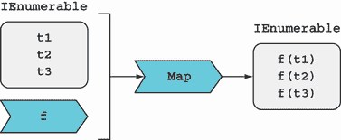
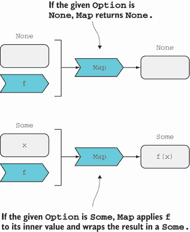
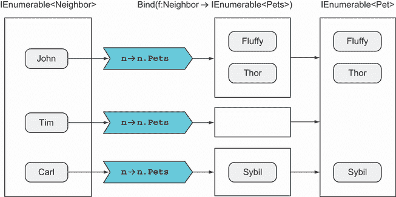
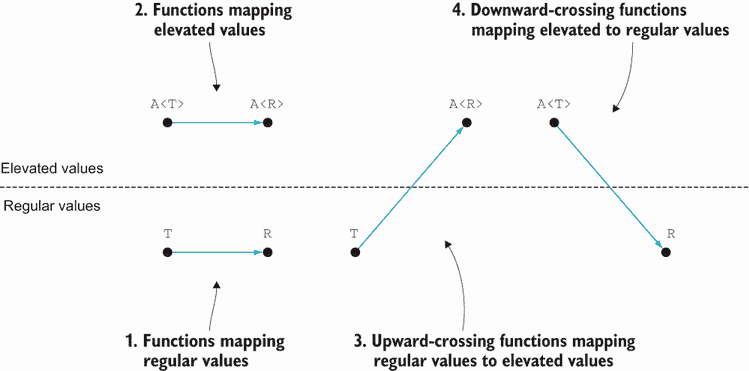
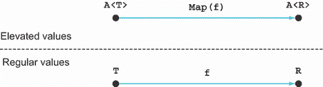
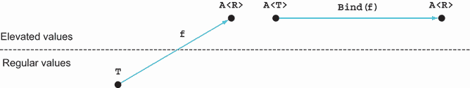

# 6 函数式编程中的模式

本章涵盖

+   核心函数：`Return`、`Map`、`Bind`、`Where`和`ForEach`

+   介绍函子和单子

+   在不同的抽象级别上工作

模式是一种可以应用于解决各种问题的解决方案。在本章中我们将讨论的模式仅仅是函数：在函数式编程中，这些函数非常普遍，以至于它们可以被视为 FP 的*核心函数*。

你可能熟悉其中的一些函数，如`Where`和`Select`（它等同于`Map`），因为你在使用`IEnumerable`时使用过它们。但你会看到相同的操作可以应用于其他结构，从而建立一种模式。我将在本章中用`Option`来说明这一点；其他结构将在接下来的章节中介绍。

如往常一样，我建议你在 REPL 中输入代码并查看这些核心函数如何使用。（你需要导入第五章侧边栏中显示的`LaYumba.Functional`库。）

## 6.1 将函数应用于结构内部值

我们将首先查看的核心函数是`Map`。它接受一个结构和函数，并将函数应用于结构的内部值。¹ 让我们从熟悉的案例开始，其中涉及的结构是一个`IEnumerable`。

### 6.1.1 将函数映射到序列

`IEnumerable`的`Map`实现可以写成如下。

列表 6.1 将函数应用于给定的`IEnumerable`中的每个元素

```
public static IEnumerable<R> Map<T, R>
   (this IEnumerable<T> ts, Func<T, R> f)
{
   foreach (var t in ts)
      yield return f(t);
}
```

`Map`通过将函数`T` `→` `R`应用于源列表中的每个元素，将`T`类型的列表映射到`R`类型的列表。请注意，在这个实现中，结果是通过使用`yield return`语句包装到`IEnumerable`中的。

备注：在 FP 中，使用像`t`这样的变量名来表示类型`T`的值，`ts`来表示`T`的集合，以及`f`（`g`、`h`等）来表示函数是很常见的。在为更具体的场景编码时，你可以使用更具描述性的名称，但当函数像`Map`这样非常通用时，你实际上对值`t`或函数`f`一无所知，变量名就相应地更通用。

图形上，`Map`可以如图 6.1 所示。



图 6.1 在`IEnumerable`上映射一个函数。这个操作产生一个包含将给定函数应用于源列表中每个项的结果的列表。

让我们看看一个简单的用法：

```
using static System.Linq.Enumerable;
using LaYumba.Functional;

var triple = (int x) => x * 3;

Range(1, 3).Map(triple);
// => [3, 6, 9]
```

也许你已经意识到，这正是当你调用 LINQ 的`Select`方法时得到的行为。确实，`Map`可以用`Select`来定义：

```
public static IEnumerable<R> Map<T, R>
   (this IEnumerable<T> ts, Func<T, R> f)
   => ts.Select(f);
```

这可能更有效，因为 LINQ 的`Select`实现针对某些特定的`IEnumerable`实现进行了优化。重点是，我将使用`Map`这个名字而不是`Select`，因为`Map`是 FP 中的标准术语，但你应该将`Map`和`Select`视为同义词。

### 6.1.2 将函数映射到 Option

现在，让我们看看如何为不同的结构定义`Map`：`Option`。就像将函数映射到列表抽象化了列表的结构或实现方式、包含的项目数量以及函数如何应用到每个元素上一样，对于`Option`，我们希望将函数应用到其内部值上，而不需要了解`Option`的状态或实现细节。`IEnumerable`的`Map`签名是

```
(IEnumerable<T>, (T → R)) → IEnumerable<R>
```

要获取`Option`的`Map`签名，我们只需遵循模式，将`IEnumerable`替换为`Option`：

```
(Option<T>, (T → R)) → Option<R>
```

这个签名表明`Map`是给定的

+   一个可能包含`T`的`Option`

+   一个从`T`到`R`的函数

它必须返回一个可能包含`R`的`Option`。你能想到一个实现吗？让我们看看：

+   如果给定的`Option`是`None`，那么就没有`T`可用，也无法计算出一个`R`：你能做的只是返回`None`。

+   另一方面，如果`Option`是`Some`，那么它的内部值是一个`T`，因此你可以将给定的函数应用到它上面，得到一个`R`，然后你可以将其包裹在一个`Some`中。

因此，我们可以定义`Map`，如下列所示。这也在图 6.2 中表示。

列表 6.2 `Option`的`Map`定义

```
public static Option<R> Map<T, R>
(
   this Option<T> optT, 
   Func<T, R> f
)
=> optT.Match
(
   () => None,
   (t) => Some(f(t))
);
```



图 6.2 在`Option`上映射函数

直观地讲，将`Option`视为一种特殊的列表，它可以是空的（`None`）或者恰好包含一个值（`Some`）。如果你从这个角度来看，就会变得很明显，`Option`和`IEnumerable`的`Map`实现是一致的：给定的函数会被应用到结构的所有内部值上。让我们看看一个简单的例子：

```
var greet = (string name) => $"hello, {name}";

Option<string> empty   = None;
Option<string> optJohn = Some("John");

empty.Map(greet);   // => None
optJohn.Map(greet); // => Some("hello, John")
```

这里有一个现实生活中的类比：你有一个可爱的老阿姨，她擅长做苹果派（图 6.3）。她讨厌购物，但天哪，她喜欢做派（单一职责原则）。


图 6.3 你阿姨烤派，但只有当篮子里有苹果时！

你经常在上班的路上在她家门口放下一个装满苹果的篮子，晚上你会发现一个装满新鲜派饼的篮子！你的阿姨也很有幽默感，所以如果你机灵地在她家门口留一个空篮子，你也会得到一个空篮子作为回报。

在这个类比中，篮子代表`Option`。苹果是其内部值，你阿姨的烹饪技巧是应用到苹果上的函数。`Map`是将苹果取出，交给阿姨处理，然后重新装进烤好的派的过程。以下是这个例子在代码中的实现方式：

```
record Apples();
record ApplePie(Apples Apples);

var makePie = (Apples apples) => new ApplePie(apples);

Option<Apples> full  = Some(new Apples());
Option<Apples> empty = None;

full.Map(makePie)  // => Some(ApplePie)
empty.Map(makePie) // => None
```

### 6.1.3 选项如何提高抽象级别

一个非常重要的事情是要意识到`Option`抽象了值是否存在的问题。如果你直接对一个值应用一个函数，你必须确保该值可用。相反，如果你将那个函数`Map`到`Option`上，你实际上并不关心值是否存在——`Map`根据情况应用函数或不应用。

在这一点上可能还不完全清楚，但随着你继续阅读本书，它将变得清晰。现在，让我们看看我能否说明这个想法。在第四章中，我们定义了一个函数，该函数根据`Age`来计算`Risk`，如下所示：

```
Risk CalculateRiskProfile(Age age)
   => (age < 60) ? Risk.Low : Risk.Medium;
```

现在，假设你正在进行一项调查，人们自愿提供一些个人信息并接收一些统计数据。调查参与者由以下定义的`Subject`类来模拟：

```
record Subject
(
   Option<Age> Age,
   Option<Gender> Gender,
   // many more fields...
);
```

一些字段如`Age`被建模为可选的，因为调查参与者可以选择是否披露此信息。这就是你计算特定`Subject`的`Risk`的方式：

```
Option<Risk> RiskOf(Subject subject)
   => subject.Age.Map(CalculateRiskProfile);
```

因为`Risk`是基于主题的年龄，而年龄是可选的，所以计算出的`Risk`也是可选的。你不必担心`Age`是否存在；相反，你可以映射计算风险的函数，并通过返回结果作为`Option`来允许可选性传播。接下来，让我们更一般地看看`Map`。

### 6.1.4 函子的介绍

你已经看到`Map`是一个遵循精确模式的函数，并且它用于将函数应用到结构如`IEnumerable`或`Option`的内部值上。它可以定义许多其他数据结构，包括集合、字典、树等。

让我们推广这个模式。让`C<T>`表示一个泛型*容器*，它封装了类型为`T`的一些内部值。然后`Map`的签名可以推广如下：

```
Map : (C<T>, (T → R)) → C<R>
```

`Map`可以被定义为一个函数，它接受一个容器`C<T>`和一个类型为`(T → R)`的函数*f*。它返回一个容器`C<R>`，该容器封装了将*f*应用到容器内部值的结果。

在函数式编程中，为这种`Map`函数定义类型的类型被称为*函子*。² `IEnumerable`和`Option`是函子，正如你所看到的，你将在书中遇到更多。

对于实际应用来说，我们可以认为任何具有合理`Map`实现的类型都是一种函子。但什么是合理的实现呢？本质上，`Map`应该将一个函数应用到容器内部的值上，并且同样重要的是，它不应该做其他任何事情——`Map`不应该有副作用。³

为什么函子不是一个接口？

如果`Option`和`IEnumerable`都支持`Map`操作，为什么我们不通过接口来捕获这一点？确实，这样做会很不错，但不幸的是，在 C#中这是不可能的。为了说明原因，让我们尝试定义这样一个接口：

```
interface Functor<F<>, T>
{
   F<R> Map<R>(Func<T, R> f);
}

public struct Option<T> : Functor<Option, T>
{
   public Option<R> Map<R>(Func<T, R> f) => // ...
}
```

这无法编译：我们无法使用 `F<>` 作为类型变量，因为与 `T` 不同，它不表示一个类型，而是一个 *类型类别*：一个反过来参数化泛型类型的类型。而且，`Map` 只需返回一个 `Functor` 是不够的。它必须返回与当前实例相同类别的函子。

其他语言（包括 Haskell 和 Scala）支持所谓的 *高阶类型类别*，因此可以使用 *类型类* 来表示这些更通用的接口，但在 C#（甚至 F#）中，我们必须满足于较低层次的抽象，并遵循基于模式的途径.^a

^a 有可能在 C# 类型系统中创造性地使用，并找到类似于类型类的表示，但生成的代码相当复杂，因此不适合本书的意图。

## 6.2 使用 ForEach 执行副作用

在第四章中，我们讨论了 `Func` 和 `Action` 之间的二分法。我们再次遇到这个问题，与 `Map` 相关：`Map` 接受一个 `Func`，如果我们想在给定的结构中为每个值执行一个 `Action`，我们该怎么办？你可能知道 `List<T>` 有一个 `ForEach` 方法，它接受一个 `Action<T>` 并为列表中的每个项目调用它：

```
using static System.Console;

new List<int> { 1, 2, 3 }.ForEach(Write);
// prints: 123
```

这基本上就是我们想要的。让我们将其推广，以便我们可以在任何 `IEnumerable` 上调用 `ForEach`：

```
using System.Collections.Immutable;
using Unit = System.ValueTuple;

public static IEnumerable<Unit> ForEach<T>
   (this IEnumerable<T> ts, Action<T> action)
   => ts.Map(action.ToFunc()).ToImmutableList();
```

代码将 `Action` 转换为返回 `Unit` 的函数，然后依赖于 `Map` 的实现。这仅创建了一个 `Unit` 的惰性评估序列。实际上，我们希望执行副作用；因此，调用了 `ToImmutableList`。使用方法出人意料地简单：

```
Enumerable.Range(1, 5).ForEach(Write);
// prints: 12345
```

现在，让我们看看 `Option` 的 `ForEach` 定义。这是在 `Map` 的基础上定义的，使用将 `Action` 转换为 `Func` 的 `ToFunc` 函数：⁴

```
public static Option<Unit> ForEach<T>
   (this Option<T> opt, Action<T> action)
   => Map(opt, action.ToFunc());
```

`ForEach` 的名称可能有些令人费解——记住，`Option` 至多有一个内部值，所以给定的操作恰好调用一次（如果 `Option` 是 `Some`），或者永远不会调用（如果它是 `None`）。以下是一个使用 `ForEach` 将 `Action` 应用到 `Option` 的示例：

```
var opt = Some("John");

opt.ForEach(name => WriteLine($"Hello {name}"));
// prints: Hello John
```

然而，记住第三章的内容，我们应该旨在将纯逻辑与副作用分离。我们应该使用 `Map` 进行逻辑，使用 `ForEach` 进行副作用，因此最好将前面的代码重写如下：

```
opt.Map(name => $"Hello {name}")
   .ForEach(WriteLine);
```

TIP 尽量使使用 `ForEach` 应用的 `Action` 的作用域尽可能小：使用 `Map` 进行数据转换，使用 `ForEach` 进行副作用。这遵循了通用 FP 理念，即尽可能避免副作用，否则将其隔离。

在 REPL 中花点时间进行实验，看看 `Map` 和 `ForEach` 可以与 `IEnumerable` 和 `Option` 一起使用。以下是一个示例：

```
using static System.Console;
using String = LaYumba.Functional.String;

Option<string> name = Some("Enrico");

name
   .Map(String.ToUpper)
   .ForEach(WriteLine);
// prints: ENRICO

IEnumerable<string> names = new[] { "Constance", "Albert" };

names
   .Map(String.ToUpper)
   .ForEach(WriteLine);

// prints: CONSTANCE
//         ALBERT
```

注意，无论你是处理`Option`还是`IEnumerable`，都可以使用相同的模式。这不是很好吗？现在你可以将`Option`和`IEnumerable`视为*特殊容器*，并且有一组核心函数允许你与之交互。如果你遇到一种新的容器类型，并且定义了`Map`或`ForEach`，你可能会对它们的作用有一个很好的了解，因为你可以识别出这种模式。

注意：在前面的代码中，我使用了`LaYumba.Functional.String`类，它通过静态方法公开了一些常用的`System.String`功能。这允许我将`String.ToUpper`作为一个函数来引用，而无需指定`ToUpper`实例方法所作用的实例，如下所示：`s => s.ToUpper()`。

总结来说，`ForEach`与`Map`类似，但它接受一个`Action`而不是函数，因此它用于执行副作用。让我们继续介绍下一个核心函数。

## 6.3 使用`Bind`链式调用函数

`Bind`是另一个重要的函数，类似于`Map`，但稍微复杂一些。我将通过一个例子来介绍`Bind`的需求。

假设你想要一个简单的程序，该程序从控制台读取用户的年龄并打印出一些相关消息。你还需要错误处理：年龄应该是有效的！

记住，在上一章中，我们定义了`Int.Parse`来解析字符串为`int`。我们还定义了`Age.Create`，一个智能构造函数，它可以从给定的`int`创建一个`Age`实例。这两个函数都返回`Option`：

```
Int.Parse : string → Option<int>
Age.Create : int → Option<Age>
```

让我们看看如果我们用`Map`组合它们会发生什么：

```
string input = Prompt("Please enter your age:");

Option<int> optI = Int.Parse(input);
Option<Option<Age>> ageOpt = optI.Map(i => Age.Create(i));
```

如你所见，我们遇到了一个问题！我们最终得到了一个嵌套的值：`Option`的`Option`的`Age`……我们该如何处理这个嵌套值呢？

### 6.3.1 组合返回`Option`的函数

在这种情况下，`Bind`非常有用。对于`Option`，这是`Bind`的签名：

```
Option.Bind : (Option<T>, (T → Option<R>)) → Option<R>
```

`Bind`接受一个`Option`和一个返回`Option`的函数，并将该函数应用于`Option`的内部值。下面的列表显示了实现。

列表 6.3 `Option`的`Bind`和`Map`实现

```
public static Option<R> Bind<T, R>
(
   this Option<T> optT,
   Func<T, Option<R>> f      ❶
) 
=> optT.Match
(
   () => None,
   (t) => f(t)
);

public static Option<R> Map<T, R>
(
   this Option<T> optT,
   Func<T, R> f              ❷
) 
=> optT.Match
(
   () => None,
   (t) => Some(f(t))
);
```

❶ `Bind`接受一个返回`Option`的函数。

❷ `Map`接受一个普通函数。

前面的列表复制了`Map`的定义，以便你可以看到它们是多么相似。简单来说，`None`情况总是返回`None`，这样就不会应用给定的函数。`Some`情况确实应用了函数；然而，与`Map`不同，没有必要将结果打包进一个`Option`，因为`f`已经返回了一个`Option`。

现在我们来看看如何在解析表示一个人年龄的字符串的例子中应用`Bind`。下面的列表显示了这种表示。

列表 6.4 使用`Bind`组合返回`Option`的两个函数

```
Func<string, Option<Age>> parseAge = s
   => Int.Parse(s).Bind(Age.Create);

parseAge("26");        // => Some(26)
parseAge("notAnAge");  // => None
parseAge("180");       // => None
```

函数 `parseAge` 使用 `Bind` 来组合 `Int.Parse`（它返回一个 `Option<int>`）和 `Age.Create`（它返回一个 `Option<Age>`）。因此，`parseAge` 结合了检查字符串是否表示有效整数的检查，以及检查整数是否是有效年龄值的检查。

现在我们来看一个简单的程序，它从控制台读取年龄并打印出相关消息的上下文：

```
WriteLine($"Only {ReadAge()}! That's young!");

static Age ReadAge()
   => ParseAge(Prompt("Please enter your age")).Match
   ( () => ReadAge(), (age) => age );        ❶

static Option<Age> ParseAge(string s)
   => Int.Parse(s).Bind(Age.Create);         ❷

static string Prompt(string msg)
{
   WriteLine(msg);
   return ReadLine();
}
```

❶ 递归调用自身，直到解析 `age` 失败

❷ 将解析 `string` 为 `int` 和从 `int` 创建 `Age` 结合起来

这里是这个程序的一个示例交互（用户输入以粗体显示）：

```
Please enter your age
> hello
Please enter your age
> 500
Please enter your age
> 45
Only 45! That's young!
```

现在我们来看看 `Bind` 与 `IEnumerable` 的结合方式。

### 6.3.2 使用 `Bind` 平铺嵌套列表

你刚刚看到了如何使用 `Bind` 来避免嵌套 `Option`。同样的想法也适用于列表。但嵌套列表是什么？二维列表！我们需要一个函数，它将对列表应用返回列表的函数。但与其返回一个二维列表，它应该将结果平铺成一个一维列表。

记住 `Map` 会遍历给定的 `IEnumerable` 并对每个元素应用一个函数。`Bind` 类似于 `Map`，但有一个嵌套循环，因为应用 *绑定* 函数也会产生一个 `IEnumerable`。结果列表被平铺成一个一维列表。这可能在代码中更容易理解：

```
public static IEnumerable<R> Bind<T, R>
   (this IEnumerable<T> ts, Func<T, IEnumerable<R>> f)
{
   foreach (T t in ts)
      foreach (R r in f(t))
         yield return r;
}
```

如果你非常熟悉 LINQ，你会认识到这个实现几乎与 `SelectMany` 相同。对于 `IEnumerable`，`Bind` 和 `SelectMany` 是相同的。再次强调，在这本书中，我将使用 `Bind` 这个名字，因为在函数式编程中它是标准的。

让我们用一个例子来看看它的实际应用。假设你有一个邻居列表，每个邻居都有一个宠物列表。你想要一个包含社区中所有宠物的列表：

```
using Pet = System.String;

record Neighbor(string Name, IEnumerable<Pet> Pets);

var neighbors = new Neighbor[]
{
   new (Name: "John", Pets: new Pet[] {"Fluffy", "Thor"}),
   new (Name: "Tim",  Pets: new Pet[] {}),
   new (Name: "Carl", Pets: new Pet[] {"Sybil"}),
};

IEnumerable<IEnumerable<Pet>> nested = neighbors.Map(n => n.Pets);
// => [["Fluffy", "Thor"], [], ["Sybil"]]

IEnumerable<Pet> flat = neighbors.Bind(n => n.Pets);
// => ["Fluffy", "Thor", "Sybil"]
```

注意到使用 `Map` 会产生嵌套的 `IEnumerable`，而 `Bind` 则产生平铺的 `IEnumerable`。（也请注意，无论从哪个角度看前面示例的结果，`Bind` 并不一定比 `Map` 产生更多的项目，这确实使得选择 `SelectMany` 这个名字看起来相当奇怪。）图 6.4 展示了 `Bind` 在 `IEnumerable` 上的图形表示，特别针对邻域示例中的类型和数据。



图 6.4 `Bind` 接受一个源列表和一个为源列表的每个项目返回列表的函数。它返回一个平铺的列表，而 `Map` 返回一个列表的列表。

如你所见，每次函数应用都会产生一个 `IEnumerable`，然后所有应用的结果都被平铺成一个单一的 `IEnumerable`。

### 6.3.3 实际上，它被称为单子

现在我们来泛化 `Bind` 的模式。如果我们用 `C<T>` 来表示包含类型 `T` 的值的一些结构，那么 `Bind` 就会接受容器的一个实例和一个具有签名 `(T → C<R>)` 的函数，并返回一个 `C<R>`。`Bind` 的签名始终是这个形式：

```
Bind : (C<T>, (T → C<R>)) → C<R>
```

你看到，在所有实际用途中，函子是定义了合适的 `Map` 函数的类型，使你能够将函数应用于函子的内部值。同样，*单子* 是定义了 `Bind` 函数的类型，使你能够有效地组合两个（或更多）返回单子的函数，而不会得到嵌套结构。有时你会听到人们谈论 *单子绑定* 来澄清他们不仅仅是在谈论某个名为 `Bind` 的函数，而是在谈论 *那个* 允许类型被视为单子的 `Bind` 函数。

### 6.3.4 `Return` 函数

除了 `Bind` 函数外，单子还必须有一个 `Return` 函数，该函数可以将普通值 `T` 提升或包装成单子值 `C<T>`。有些令人困惑的是，`Return` 函数通常不被称为`Return`，而是根据所讨论的结构采用不同的名称。对于 `Option`，这就是我们在第五章中定义的 `Some` 函数。

`IEnumerable` 的 `Return` 函数是什么？因为有许多 `IEnumerable` 的实现，所以有创建 `IEnumerable` 的许多可能方法。在我的函数式库中，我有一个适合 `IEnumerable` 的 `Return` 函数，称为 `List`。为了坚持函数式原则，`List` 返回一个不可变列表：

```
using System.Collections.Immutable;

public static IEnumerable<T> List<T>(params T[] items)
   => items.ToImmutableList();
```

`List` 函数不仅满足 `Return` 函数的要求，允许我们将简单的 `T` 提升到 `IEnumerable<T>`。此外，多亏了 `params` 参数，它还为我们提供了初始化列表的简洁语法：

```
using static F;

var empty  = List<string>();            // => []
var single = List("Andrej");            // => ["Andrej"]
var many   = List("Karina", "Natasha"); // => ["Karina", "Natasha"]
```

总结来说，单子是一个类型 `M<T>`，对于该类型，定义了以下函数：

```
Return : T → M<T>

Bind   : (M<T>, (T → M<R>)) → M<R>
```

对于类型被视为“正确”的单子，`Bind` 和 `Return` 必须遵守某些属性；这些被称为 *单子定律*。为了避免在本章中过度加载理论，我将把对单子定律的讨论推迟到第 10.3 节。

简而言之，`Return` 应仅执行将 `T` 提升到 `M<T>` 所需的最小工作量，而无需做其他事情。它应该尽可能简单。

### 6.3.5 函子和单子之间的关系

我说过，函子是定义了 `Map` 的类型，而单子是定义了 `Return` 和 `Bind` 的类型。你也看到了，`Option` 和 `IEnumerable` 都是函子 *和* 单子，因为这些函数都定义了。

自然会产生两个问题：每个单子也是函子吗？每个函子也是单子吗？为了回答第一个问题，让我们再次看看我们迄今为止看到的核心函数的签名：

```
Map    : (C<T>, (T → R)) → C<R>

Bind   : (C<T>, (T → C<R>)) → C<R>

Return : T → C<T>
```

如果你有一个 `Bind` 和 `Return` 的实现，你可以用这些实现来编写 `Map`：`Map` 作为输入接受的函数 `T` `→` `R` 可以通过与 `Return` 组合变成一个类型为 `T` `→` `C<R>` 的函数。这个函数反过来可以给 `Bind` 作为输入。

为了让您确信这一点，我在练习中建议您用 `Bind` 和 `Return` 来实现 `Map`。尽管实现是正确的，但它可能不是最优的，所以通常，`Map`会有自己的实现，不依赖于`Bind`。然而，这意味着每个单子也是一个函子。

关于第二个问题，答案是*否*：并非每个函子都是单子。`Bind`不能在`Map`的术语下定义，因此拥有`Map`的实现并不能保证可以定义`Bind`函数。例如，某些类型的树支持`Map`但不支持`Bind`。另一方面，对于本书中我们将讨论的大多数类型，`Map`和`Bind`都可以定义。

## 6.4 使用 Where 过滤值

在第二章中，您看到了使用`Where`来过滤`IEnumerable`值的几个示例。实际上，`Where`也可以为`Option`定义，如下所示。

列表 6.5 过滤 `Option` 的内部值

```
public static Option<T> Where<T>
(
   this Option<T> optT, 
   Func<T, bool> pred
)
=> optT.Match
(
   () => None,
   (t) => pred(t) ? optT : None
);
```

给定一个`Option`和一个谓词，如果给定的`Option`是`Some`，并且其内部值满足给定的谓词，则返回`Some`；否则，返回`None`。再次强调，如果您将`Option`视为最多只有一个元素的列表，这就有意义了。以下是一个简单的用法：

```
bool IsNatural(int i) => i >= 0;
Option<int> ToNatural(string s) => Int.Parse(s).Where(IsNatural);

ToNatural("2")     // => Some(2)
ToNatural("-2")    // => None
ToNatural("hello") // => None
```

在这里，我们使用`Int.Parse`（在 5.4.1 节中定义），它返回一个`Option`，表示字符串是否已正确解析为`int`。然后我们使用`Where`来额外确保值是正数。

这就结束了我们对核心函数的初步探索。在您继续阅读本书的过程中，您将看到更多，但到目前为止描述的函数可以带您走很长的路，您将在下一章中看到这一点。

核心函数的许多名称

学习函数式编程的一个难点是，相同的结构在不同的语言或库中具有不同的名称。这一点对于核心函数来说也是正确的，因此我包括以下表格，以帮助您在其他地方遇到这些同义词时理解它们。

| LaYumba.Functional | LINQ | 常见同义词 |
| --- | --- | --- |
| `Map` | `Select` | `fMap, Project, Lift` |
| `Bind` | `SelectMany` | `FlatMap, Chain, Collect, Then` |
| `Where` | `Where` | `Filter` |
| `ForEach` | `n/a` | `Iter` |
| `Return` | `n/a` | `Pure` |

在编写本书和`LaYumba.Functional`库时，我必须决定为这些函数选择哪些名称，这些选择必然是有些任意的。`ForEach`和`Where`是好的名称，并且在.NET 中是标准的，但如果用于`IEnumerable`之外的函子或单子，`Select`和`SelectMany`将是不好的名称。我选择使用`Map`和`Bind`，它们更通用、更简短，并且在函数式编程文献中是标准的。

## 6.5 使用 Bind 结合 Option 和 IEnumerable

我提到过，看待 `Option` 的方法之一是将其视为一个特殊的列表，可以是空的 (`None`) 或恰好包含一个值 (`Some`)。你可以通过以下方式在代码中表达这一点，使得可以将 `Option` 转换为 `IEnumerable`：

```
public struct Option<T>
{
   public IEnumerable<T> AsEnumerable()
   {
      if (isSome) yield return value!;
   }
}
```

如果 `Option` 是 `Some`，则 resulting `IEnumerable` 产生一个项目；如果它是 `None`，则不产生任何项目。在函子之间映射的函数，如 `AsEnumerable`，被称为 *自然变换*，在实践上非常有用。

`IEnumerable` 通常用于存储数据，而 `Option` 在值不存在时跳过计算，因此它们的意图通常不同。尽管如此，在某些情况下，将它们结合起来是有用的。在某些场景中，你最终会得到一个 `IEnumerable<Option<T>>`（或反之，`Option<IEnumerable<T>>`），并希望将其展平为 `IEnumerable<T>`。

例如，让我们回到调查的例子，其中每个参与者都被模拟为 `Subject`。由于参与者披露年龄是可选的，我们模型 `Subject.Age` 为 `Option<Age>`：

```
record Subject(Option<Age> Age);

IEnumerable<Subject> Population => new[]
{
   new Subject(Age.Create(33)),
   new Subject(None),             ❶
   new Subject(Age.Create(37)),
};
```

❶ 这个人没有披露他们的年龄。

你存储了参与者的详细信息在一个 `IEnumerable<Subject>` 中。现在假设你需要计算参与者的平均年龄。你该如何着手呢？你可以从选择所有 `Age` 的值开始：

```
IEnumerable<Option<Age>> optionalAges = Population.Map(p => p.Age);
// => [Some(Age(33)), None, Some(Age(37))]
```

如果你使用 `Map` 来选择调查者的年龄，你会得到一个选项列表。由于一个 `Option` 可以被视为一个列表，因此 `optionalAges` 可以被视为列表的列表。为了将这种直觉转化为代码，让我们给 `Bind` 添加一些重载，将 `Option` 转换为 `IEnumerable`，这样 `Bind` 就可以像我们在展平嵌套的 `IEnumerable` 一样应用：

```
public static IEnumerable<R> Bind<T, R>
   (this IEnumerable<T> list, Func<T, Option<R>> func)
   => list.Bind(t => func(t).AsEnumerable());

public static IEnumerable<R> Bind<T, R>
   (this Option<T> opt, Func<T, IEnumerable<R>> func)
   => opt.AsEnumerable().Bind(func);
```

尽管根据 FP 理论 `Bind` 应该只作用于一种容器类型，但 `Option` 总是可以 *提升* 到更通用的 `IEnumerable`，这使得这些重载在实践上是有效且非常有用的：

+   我们可以使用第一个重载来获取 `IEnumerable<T>`，其中 `Map` 会给我们一个 `IEnumerable<Option<T>>`，就像当前的调查示例一样。

+   我们可以使用第二个重载来获取 `IEnumerable<T>`，其中 `Map` 会给我们一个 `Option<IEnumerable<T>>`。

在调查场景中，我们现在可以使用 `Bind` 过滤掉所有的 `None` 并获取所有实际给出的年龄列表：

```
var optionalAges = Population.Map(p => p.Age);
// => [Some(Age(33)), None, Some(Age(37))]

var statedAges = Population.Bind(p => p.Age);
// => [Age(33), Age(37)]

var averageAge = statedAges.Map(age => age.Value).Average();
// => 35
```

这允许我们利用 `Bind` 的展平特性来过滤掉所有的 `None` 情况。前面的输出显示了调用 `Map` 和 `Bind` 的结果，以便你可以比较结果。

## 6.6 在不同抽象级别上进行编码

*抽象*（在英语中，不是在面向对象编程中）意味着为了使一个普遍的、共同的特征出现，需要移除不同具体事物的特定特征：一个概念。例如，当你说你“会看到一排房子”或“把你的鸭子排成一排”时，*排*这个概念移除了使鸭子与房子不同的任何东西，只捕捉了它们的空間排列。

像`IEnumerable`和`Option`这样的类型在其核心具有这样的概念抽象：它们内部值的所有特定特征都被抽象掉了。这些类型只捕获了枚举值或值可能不存在的能力。对于大多数泛型类型来说，情况也是如此。让我们尝试概括这一点，以便你所学的 `Option` 可以帮助你理解书中（以及在其他库中）稍后看到的其他构造。

### 6.6.1 常规与提升价值

当你处理像 `IEnumerable<int>` 或 `Option<Employee>` 这样的类型时，你编写的代码比处理像 `int` 或 `Employee` 这样的非泛型类型时处于更高的抽象层次。让我们将我们处理的价值世界分为两类：

+   *常规值*，我们将称之为 `T`。`String`、`int`、`Neighbor` 或 `DayOfWeek` 都是常规值的例子。

+   *提升的价值*，我们将称之为 `A<T>`*。* `Option<int>`、`IEnumerable<string>`、`Func<Neighbor>` 或 `Task<bool>` 都是提升价值的例子。

在这里，提升价值意味着对相应常规类型的抽象。⁵ 这些抽象是使我们能够更好地处理和表示底层类型上的操作的构造。更技术地说，一个 *抽象* 是向底层类型添加效果的一种方式。⁶ 让我们看看一些例子：

+   `Option` 添加了 *可选项* 的效果，这不仅仅是一个 `T`，而是 `T` 的 *可能性*。

+   `IEnumerable` 添加了 *聚合* 的效果，这不仅仅是一个 `T` 或两个，而是一个 `T` 的 *序列*。

+   `Func` 添加了 *惰性* 的效果，这不仅仅是一个 `T`，而是一个可以评估以获得 `T` 的 *计算*。

+   `Task` 添加了 *异步性* 的效果，这不仅仅是一个 `T`，而是一个 *承诺*，在某个时刻你会得到一个 `T`。

如前所述的例子所示，本质上非常不同的东西可以被认为是抽象，所以试图将这个概念放入一个框中是没有什么意义的。更有趣的是看看这些抽象如何被运用。

回到常规与提升价值，你可以将这些不同类型的值可视化如图 6.5 所示。这个图显示了常规类型 `int` 的一个示例，以及一些样本值和相应的抽象 `A<int>`，其中 `A` 可以是任意抽象。将常规值取走并包裹在相应的 `A` 中的箭头代表 `Return` 函数。


图 6.5 `Return` 将常规值提升为提升价值。

### 6.6.2 跨越抽象层次

现在我们有了这种类型的分类，我们可以相应地分类函数。我们有保持在同一抽象层次上的函数，也有跨越抽象层次之间的函数，如图 6.6 所示。⁷



图 6.6 按抽象层次分类的函数

让我们看看几个例子。函数 `(int i) => i.ToString()` 的签名是 `int` `→` `string`，因此它将一个常规类型映射到另一个类型，显然属于第一种类型。

我们一直在使用的 `Int.Parse` 函数的类型是 `string` `→` `Option<int>`，因此它是一个向上交叉函数——第三种类型。斯科特·沃尔申将这些称为 *世界交叉* 函数，因为它们从 *世界* 中的正常值 `T` 转到提升值 `E<T>` 的世界（外星？）。⁸

`Return` 函数，对于任何抽象 `A`，其类型为 `T` `→` `A<T>`，是一个特殊的向上交叉函数，除了向上交叉之外不做任何事情。这就是为什么我将 `Return` 显示为垂直向上箭头，而任何其他向上交叉函数都显示为斜线箭头。

第二种类型的函数保持在抽象内部。例如，以下函数是一个明显的匹配：

```
(IEnumerable<int> ints) => ints.OrderBy(i => i)
```

它的签名形式是 `A<T>` `→` `A<R>`。但我们也应该将任何以 `A<T>` 开始，有额外的参数，并最终以 `A<R>` 结束的函数包含在这个类别中。也就是说，任何应用保持在我们抽象内部的函数；它的签名将是 `(A<T>, ...)` `→` `A<R>`。这包括我们查看过的许多 HOF（高阶函数），如 `Map`、`Bind`、`Where`、`OrderBy` 等。

最后，向下交叉函数，其中我们从一个提升值开始，最终得到一个常规值，包括 `IEnumerable` 的 `Average`、`Sum` 和 `Count`，以及 `Option` 的 `Match`。请注意，给定一个抽象 `A`，并不总是可能定义一个与 `Return` 相对应的向下函数；通常没有垂直向下箭头。你总是可以将 `int` 提升到 `Option<int>`，但你不能 *降低* `Option<int>` 到 `int`。如果它是 `None` 呢？同样，你可以将单个 `Employee` 包装到 `IEnumerable<Employee>` 中，但没有任何明显的方法可以将 `IEnumerable<Employee>` 减少到单个 `Employee`。

### 6.6.3 Map vs. Bind，再次回顾

让我们看看我们如何使用这种分类来更好地理解 `Map` 和 `Bind` 之间的区别。`Map` 接受一个提升值 `A<T>` 和一个 *常规* 函数 `T` `→` `R`，并返回一个类型为 `A<R>` 的提升值，如图 6.7 所示。



图 6.7 以常规值和提升值来解释 `Map`

`Bind` 也接受一个提升值 `A<T>`，然后是一个类型为 `T` `→` `A<R>` 的 *向上交叉* 函数，并返回一个类型为 `A<R>` 的提升值，如图 6.8 所示。



图 6.8 以常规值和提升值来解释 `Bind`

主要区别在于 `Map` 接受一个常规函数，而 `Bind` 接受一个向上交叉函数。如果你使用类型为 `T` `→` `A<R>` 的向上交叉函数与 `Map` 一起使用，你最终会得到一个嵌套的 `A<A<R>>` 类型的值。这通常不是期望的效果，你可能应该使用 `Bind`。请注意，`Map` 和 `Bind` 本身都是操作提升值的函数，因为它们都接受一个 `A<T>` 并产生一个 `A<R>`。

### 6.6.4 在正确的抽象级别上工作

在不同抽象级别上工作的这个想法很重要。如果你总是处理常规值，你可能会陷入低级操作，如 `for` 循环、`null` 检查等。在如此低的抽象级别上工作既低效又容易出错。在同一个抽象级别内工作确实有一个明确的最佳点，如下面的代码片段（来自第一章）所示：

```
Enumerable.Range(1, 100).
   Where(i => i % 20 == 0).
   OrderBy(i => -i).
   Select(i => $"{i}%")
 // => ["100%", "80%", "60%", "40%", "20%"]
```

一旦你使用 `Range` 将常规值转换为 `IEnumerable<int>`，所有后续的计算都保持在 `IEnumerable` 抽象内部。也就是说，保持在同一个抽象级别可以让你很好地组合多个操作——我们将在下一章深入探讨这一点。

如果你处理的是形式为 `A<B<C<D<T>>>>` 的值，其中每个级别都添加了一个抽象，并且难以处理深深埋藏的 `T`，这也存在风险。这一点我将在第十七章中讨论。

在本章中，你看到了一些用于处理 `Option` 和 `IEnumerable` 的核心函数的实现。尽管实现很简单，但你已经看到了这如何为我们提供了一个丰富的 API 来处理 `Option`，就像你习惯于处理 `IEnumerable` 一样。可以为 `Option` 和 `IEnumerable` 定义一些常见操作——适用于不同类型结构的模式。有了这个 API 和对 FP 核心函数的更好理解，你就可以处理更复杂的情况了。

## 练习

1.  实现 `ISet<T>` 和 `IDictionary<K, T>` 的 `Map`。（提示：首先用箭头符号写下签名。）

1.  根据 `Bind` 和 `Return` 实现 `Option` 和 `IEnumerable` 的 `Map`。

1.  使用 `Bind` 和第 5.4.2 节中定义的返回 `Option` 的 `Lookup` 函数来实现 `GetWorkPermit`（如下代码片段所示）。然后丰富实现，使 `GetWorkPermit` 在工作许可证过期时返回 `None`。

1.  使用 `Bind` 来实现 `AverageYearsWorkedAtTheCompany`（如下代码片段所示）。只应包括已离职的员工：

    ```
    Option<WorkPermit> GetWorkPermit(Dictionary<string, Employee> employees
       , string employeeId) => // your implementation here...

    double AverageYearsWorkedAtTheCompany(List<Employee> employees)
       => // your implementation here...

    public record Employee
    (
       string Id,
       Option<WorkPermit> WorkPermit,
       DateTime JoinedOn,
       Option<DateTime> LeftOn
    );

    public record WorkPermit
    (
       string Number,
       DateTime Expiry
    );
    ```

## 摘要

+   类似于 `Option<T>` 和 `IEnumerable<T>` 的结构可以被视为容器或抽象，使你能够更有效地处理类型 `T` 的底层值。

+   你可以区分常规值（例如，`T`）和提升值（如 `Option<T>` 或 `IEnumerable<T>`）。

+   允许你有效地处理提升值的 FP 核心函数包括

    +   `Return`，它将常规值提升到高值

    +   `Map`，将函数应用于结构内的值并返回一个新结构，该结构包装了结果

    +   `ForEach`，是`Map`的副作用变体，它接受一个动作，并为容器内的每个内部值执行该动作

    +   `Bind`，将返回`Option`的函数映射到`Option`上，并将结果扁平化以避免产生嵌套的`Option`，类似地对于`IEnumerable`和其他结构

    +   `Where`，根据给定的谓词过滤结构内的值

+   对于`Map`有定义的类型称为*functor*。对于`Return`和`Bind`有定义的类型称为*monad*。

* * *

¹ 内部值也被称为绑定值。

² 不幸的是，术语“functor”在不同的语境中有不同的含义。在数学中，它标识了被映射的函数；在编程中，它是你可以映射函数的容器。

³ 这不是官方定义，但本质上等价。

⁴ 你可能会问自己，“为什么不直接为`Map`添加一个接受`Action`的重载？”问题在于在这种情况下，当我们调用`Map`而不指定其泛型参数时，编译器无法解析到正确的重载。原因相当技术性：重载解析不考虑输出参数，因此在重载解析时无法区分`Func<T, R>`和`Action<T>`。这种重载的代价是调用`Map`时必须始终指定泛型参数，这又会引起噪音。简而言之，最好的解决方案是引入一个专门的`ForEach`方法。

⁵ 其他作者将高值称为包裹值、放大值等。

⁶ 在这个语境中，“效果”有完全不同的含义，不应与“副作用”混淆。这是不幸的，但却是标准的术语。

⁷ 这种分类并不全面，因为你可以设想更多类别，在这些类别中，应用函数会导致你跳过几个抽象级别，或者从一个抽象类型跳到另一个抽象类型。但这些都可能是你遇到的最常见的函数类型，所以这种分类仍然是有用的。

⁸ 请参阅斯科特的“理解 map 和 apply”文章，链接在此：[`fsharpforfunandprofit.com/posts/elevated-world`](http://fsharpforfunandprofit.com/posts/elevated-world)。
