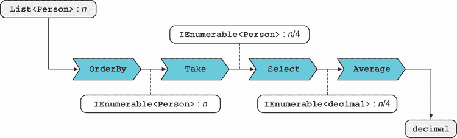
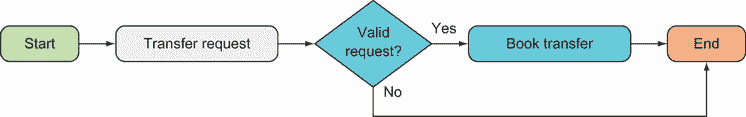
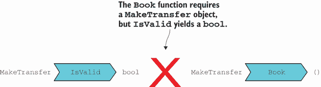
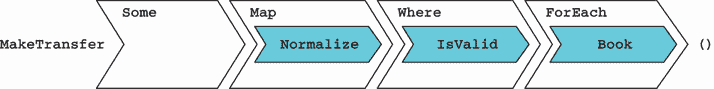
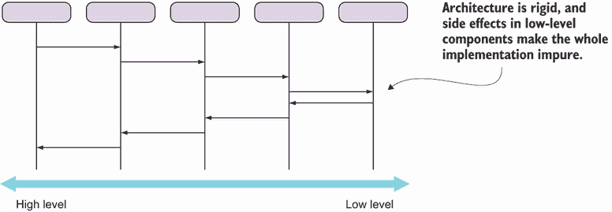
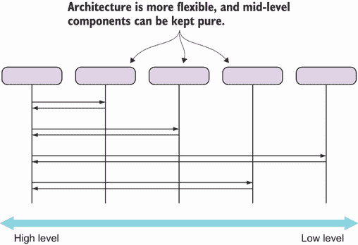
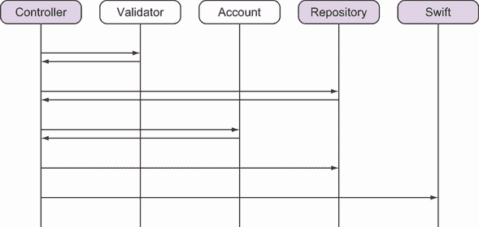

# 7 使用函数组合设计程序

本章涵盖

+   使用函数组合和方法链定义工作流程

+   编写易于组合的函数

+   处理服务器请求的端到端示例

函数组合不仅强大且表达能力强，而且易于使用。它在任何编程风格中都有一定程度的运用，但在函数式编程中，它被广泛使用。例如，你有没有注意到，当你使用 LINQ 处理列表时，你只需几行代码就能完成很多事情？这是因为 LINQ 是一个以组合为设计理念的函数式 API。

在本章中，我们将介绍函数组合的基本概念和技术，并使用 LINQ 来展示其用法。我们还将实现一个端到端的服务器端工作流程，在这个工作流程中，我们将使用第六章中引入的`Option` API。这个示例展示了函数方法的一些思想和好处，因此我们将以对这些内容的讨论结束本章。

## 7.1 函数组合

让我们先回顾一下函数组合及其与方法链的关系。函数组合是任何程序员隐性知识的一部分。它是你在学校学到的数学概念，然后每天都在不经意间使用。让我们快速复习一下定义。

### 7.1.1 快速复习函数组合

给定两个函数*f*和*g*，你可以定义一个函数*h*，它是这两个函数的组合，表示如下：

*h* = *f* · *g*

将*h*应用于值*x*等同于先对*x*应用*g*，然后对结果应用*f*：

*h*(*x*) = (*f* · *g*)(*x*) = *f*(*g*(*x*))

例如，假设你想为在 Manning 工作的人获取电子邮件地址。你可以有一个函数计算本地部分（标识人员），另一个则添加域名：

```
record Person(string FirstName, string LastName);

static string AbbreviateName(Person p)
   => Abbreviate(p.FirstName) + Abbreviate(p.LastName);

static string AppendDomain(string localPart)
   => $"{localPart}@manning.com";

static string Abbreviate(string s)
   => s.Substring(0, Math.Min(2, s.Length)).ToLower();
```

`AbbreviateName`和`AppendDomain`是两个你可以组合以得到一个新的函数，该函数可以生成我假设的合作伙伴的 Manning 电子邮件。请看以下列表。

列表 7.1 定义一个函数为两个现有函数的组合

```
Func<Person, string> emailFor =
   p => AppendDomain(AbbreviateName(p));    ❶

var joe = new Person("Joe", "Bloggs");
var email = emailFor(joe);

email // => jobl@manning.com
```

❶ `emailFor`将`AppendDomain`与`AbbreviateName`组合。

有几点值得注意。首先，你只能组合具有匹配类型的函数：如果你正在组合(*f* · *g*)，那么*g*的输出必须可以赋值给*f*的输入类型。

第二，在函数组合中，函数的顺序与它们执行顺序相反，所以*f* · *g*有时读作“*f*在*g*之后。”例如，在`AppendDomain(AbbreviateName(p))`中，你首先执行最右侧的函数，然后是左侧的函数。这不利于可读性，尤其是当你想组合多个函数时。

C#没有为函数组合提供任何特殊的语法支持，尽管你可以定义一个高阶函数`Compose`来组合两个或多个函数，但这并不会提高可读性。这就是为什么在 C#中，最好求助于方法链。

### 7.1.2 方法链

方法链式语法（即使用 `.` 运算符链式调用多个方法的调用）提供了在 C#中实现函数组合的更可读的方式。给定一个表达式，你可以将其链式调用到任何在表达式的类型上定义的实例或扩展方法。例如，前面的例子需要按以下方式修改：

```
static string AbbreviateName(this Person p)           ❶
   => Abbreviate(p.FirstName) + Abbreviate(p.LastName);

static string AppendDomain(this string localPart)     ❶
    => $"{localPart}@manning.com";
```

❶ `this` 关键字使这成为一个扩展方法

你现在可以将这些方法链式调用以获取某人的电子邮件。以下列表显示了这种方法。

列表 7.2 使用方法链式语法组合函数

```
var joe = new Person("Joe", "Bloggs");
var email = joe.AbbreviateName().AppendDomain();

email // => jobl@manning.com
```

注意现在扩展方法出现的顺序是它们将被执行的顺序。这显著提高了可读性，尤其是在工作流程复杂性增加时（更长的方法名、额外的参数、更多要链式调用的方法），这也是为什么方法链式调用是 C#中实现函数组合的首选方式。

关于扩展方法的常见误解

扩展方法使用 `.` 运算符调用，就像实例方法一样，但其语义与实例方法不同。例如，假设你定义了一个类型 `Circle` 如下：

```
record Circle(Point Center, double Radius);
record Point(double X, double Y);
```

如果你现在将 `Move` 和 `Scale` 定义为 `Circle` 上的实例方法，这意味着 `Circle` *知道* 如何移动/缩放自己或 *负责* 移动自己。这是面向对象看待事物的方式。

在函数式编程（FP）中，另一方面，我们会将这个逻辑放入与它们作用的数据分离的函数中（更多内容请见第 11.4 节）。例如，看看以下内容：

```
static class Geometry                                         ❶
{
   static Circle Move(this Circle c, double x, double y) => new
   (
      Center: new Point(c.Center.X + x, c.Center.Y + y),      ❷
      Radius: c.Radius
   );

   static Circle Scale(this Circle c, double factor) => new
   (
      Center: c.Center,
      Radius: c.Radius * factor                               ❸
   );
}
```

❶ 一个用于处理圆的函数模块

❷ 返回一个被移动的圆

❸ 返回一个被缩放的圆

我们将 `Move` 和 `Scale` 定义为扩展方法的事实使我们能够像这样调用它们：

```
Circle Modify(this Circle c)
   => c
      .Move(10, 10)
      .Scale(2)
```

这与没有扩展方法语法的相应调用等效，但更易读。

```
Circle Modify(this Circle c)
   => Scale(Move(c, 10, 10), 2)
```

深受面向对象编程（OOP）影响的开发者往往将扩展方法视为实例方法；例如，仅仅因为 `Move` 使用了 `this` 修饰符标记了给定的圆，他们倾向于认为 `Move` *属于* `Circle` 或因此 `Circle` *知道* 或 *负责* 移动自己。

这是一个你应该摒弃的误解。在当前示例中，你应该将 `Move` 和 `Scale` 简单地视为处理给定数据的函数；我们使用它们作为扩展方法纯粹是为了可读性。

### 7.1.3 高级世界中的组合

函数组合非常重要，它也应该在高级值的世界中成立。让我们继续当前示例，确定某人的电子邮件地址，但现在我们有一个 `Option<Person>` 作为起始值。你会假设以下内容成立：

```
Func<Person, string> emailFor =
   p => AppendDomain(AbbreviateName(p));       ❶

var opt = Some(new Person("Joe", "Bloggs"));

var a = opt.Map(emailFor);                     ❷

var b = opt.Map(AbbreviateName)                ❸
           .Map(AppendDomain);                 ❸

a.Equals(b) // => true
```

❶ `emailFor` 由 `Append-Domain` 和 `AbbreviateName` 组成。

❷ 映射组合函数

❸ 分步骤映射 `AbbreviateName` 和 `AppendDomain`

无论你是分步映射 `AbbreviateName` 和 `AppendDomain`，还是将它们的组合 `emailFor` 在一个步骤中映射，结果都不应该改变。你应该能够安全地在这两种形式之间重构。

更普遍地，如果 *h* = *f* · *g*，那么将 *h* 映射到函子应该等同于先映射 *g* 到该函子，然后映射 *f* 到结果。这应该适用于任何函子和任何一对函数——这是函子定律之一，因此任何 `Map` 的实现都应该遵守它。¹

如果这听起来很复杂，那可能是因为它描述的是你直觉上认为应该始终明显成立的事情。确实，打破这条定律并不容易，但你可能会想出一个恶作剧般的函子，比如，它保留一个内部计数器，记录 `Map` 被应用了多少次（或者每次调用 `Map` 时以其他方式改变其状态），然后前面的情况就不会成立，因为 `b` 的内部计数会比 `a` 更大。

简而言之，`Map` 应该将函数应用于函子的内部值（或值），而不再做其他任何事情，以确保在处理函子时函数组合保持不变，就像处理正常值时一样。这种方法的优点在于，你可以在任何编程语言中使用任何函数库，并且可以自信地使用任何函子，因为像在前面代码片段中从 `a` 到 `b` 的重构这样的重构将是安全的。

## 7.2 从数据流的角度思考

你可以用函数组合编写整个程序。每个函数以某种方式处理其输入，输出成为下一个函数的输入。当你这样做时，你开始从数据流的角度看待你的程序：程序只是一组函数，数据通过一个函数流到下一个函数。图 7.1 展示了一个线性流——最简单且最有用的类型。


图 7.1 数据通过一系列函数流动

### 7.2.1 使用 LINQ 的可组合 API

在前面的例子中，我们通过使 `AbbreviateName` 和 `AppendDomain` 方法成为扩展方法，使它们可链式调用。这也是 LINQ 设计中采取的方法，如果你查看 `System.Linq.Enumerable`，你会看到它包含了许多用于处理 `IEnumerable` 的扩展方法。让我们看看使用 LINQ 组合函数的一个例子。

假设给定一个群体，你想找到最富有的四分位数（即目标群体中最富有的 25% 的人）的平均收入。你可以编写如下所示的内容。

列表 7.3 通过链式方法在 `Linq.Enumerable` 中定义查询

```
record Person(decimal Earnings);

static decimal AverageEarningsOfRichestQuartile(List<Person> population)
   => population
      .OrderByDescending(p => p.Earnings)
      .Take(population.Count / 4)
      .Select(p => p.Earnings)
      .Average();
```

注意你可以如何干净地使用 LINQ 编写这个查询（与使用控制流语句强制性地编写相同的查询相比）。你可能有一种感觉，内部代码将遍历列表，并且 `Take` 将有一个 `if` 检查来只返回请求的项目数，但你并不真的关心。相反，你可以以扁平工作流的形式安排你的函数调用——一系列指令的线性序列：

1.  对人口进行排序（最富有的人排在顶部）。

1.  只取前 25%。

1.  取每个人的收入。

1.  计算它们的平均值。

注意代码与工作流描述的相似性。让我们从数据流的角度来看它：你可以将 `AverageEarningsOfRichestQuartile` 函数视为一个简单的程序。它的输入是 `List<Person>`，输出是 `decimal`。

此外，`AverageEarningsOfRichestQuartile` 实际上是四个函数的组合，因此输入数据通过四个转换步骤，如图 7.2 所示，逐步转换为输出值。



图 7.2 `AverageEarningsOfRichestQuartile` 函数中的数据流

第一个函数 `OrderByDescending` 保留了数据的类型，并按收入对人口进行排序。第二步也保留了数据的类型，但改变了基数：如果输入的人口由 *n* 个人组成，`Take` 现在只返回 *n*/4 个人。`Select` 保留了基数，但将类型改为 `decimal` 的列表，而 `Average` 再次将类型改为返回单个 `decimal` 值。²

让我们尝试将数据流的概念推广，使其不仅适用于对 `IEnumerable` 的查询，而且适用于一般数据。当你的程序中发生某些有趣的事情（一个请求、鼠标点击，或者简单地程序启动），你可以将这个“某些事情”视为 *输入*。这个输入，即数据，然后通过一系列转换，作为数据通过程序中一系列函数的流动。

### 7.2.2 编写可组合的函数

列表 7.3 中所示的简单 `AverageEarningsOfRichestQuartile` 函数展示了 LINQ 库的设计如何允许你将通用函数组合成特定查询。有些属性使得某些函数比其他函数更易于组合：³

+   *纯函数*——如果你的函数有副作用，它的可重用性就较低。

+   *可链式*——`this` 参数（实例方法中隐式存在，扩展方法中显式存在）使得通过链式组合成为可能。

+   *通用*——函数越具体，可用于组合的情况就越少。

+   *形状保留*——函数保留结构的形状，因此如果它接受 `IEnumerable`，则返回 `IEnumerable`，依此类推。

自然地，函数比操作更易于组合。因为 `Action` 没有输出值，它是一个死胡同，所以它只能位于管道的末尾。

注意，我们使用的 LINQ 函数根据这些标准都得了 100%，除了`Average`，它不具备形状保持性。此外，请注意我们在`Option` API 中定义的核心函数表现良好。

`AverageEarningsOfRichestQuartile`的可组合性如何？嗯，大约 40%：它是纯函数，并且有一个输出值，但它不是一个扩展方法，而且它非常具体。为了演示这一点，看看以下作为单元测试一部分消耗该函数的代码：

```
[TestCase(ExpectedResult = 75000)]
public decimal AverageEarningsOfRichestQuartile()
{
   var population = Range(1, 8)
      .Select(i => new Person(Earnings: i * 10000))
      .ToList();

   return PopulationStatistics
      .AverageEarningsOfRichestQuartile(population);
}
```

测试通过了，但代码也显示`AverageEarningsOfRichestQuartile`不具备其组合的 LINQ 方法的特性：它不可链式调用，而且它非常具体，你几乎不希望重用它。让我们改变这一点：

1.  将其拆分为两个更通用的函数：`AverageEarnings`（这样你可以查询任何人口段的平均收入）和`RichestQuartile`（毕竟，你可能对最富有的四分之一的许多其他属性感兴趣）。

1.  将它们做成扩展方法，以便它们可以链式调用：

```
static decimal AverageEarnings(this IEnumerable<Person> pop)
   => pop.Average(p => p.Earnings);

static IEnumerable<Person> RichestQuartile(this IEnumerable<Person> pop)
   => pop.OrderByDescending(p => p.Earnings)
      .Take(pop.Count / 4);
```

注意进行这种重构是多么容易！这是因为我们重构的函数的组合性质：新函数只是组合了更少的原始构建块。（如果你有一个使用`for`和`if`语句的逻辑实现，重构可能不会这么容易。）你现在可以按如下方式重写测试：

```
[TestCase(ExpectedResult = 75000)]
public decimal AverageEarningsOfRichestQuartile()
   => SamplePopulation
      .RichestQuartile()
      .AverageEarnings();

List<Person> SamplePopulation
   => Range(1, 8)
      .Select(i => new Person(Earnings: i * 10000))
      .ToList();
```

你现在可以看到测试的阅读性有多好了。通过重构为更小的函数和扩展方法语法，你创建了更多可组合的函数和更易读的接口。

提示：如果你组合两个纯函数，结果函数也是纯函数，这为你提供了第三章中讨论的所有好处。因此，主要由纯、可组合函数组成的库（如 LINQ）往往功能强大且易于使用。

在本节中，你看到了 LINQ 如何提供（许多其他事物中）一套易于组合的函数，这些函数与`IEnumerable`一起工作非常有效。接下来，我们将看到如何在使用`Option`时使用声明性、扁平的工作流程。让我们首先明确我们所说的“工作流程”是什么，以及为什么它很重要。

## 7.3 编程工作流程

工作流程是理解和表达应用程序需求的一种强大方式。一个*工作流程*是一系列有意义的操作序列，旨在达到一个期望的结果。例如，烹饪食谱描述了准备菜肴的工作流程。

工作流程可以通过函数组合有效地建模。工作流程中的每个操作都可以由一个函数执行，这些函数可以组合成*函数管道*，执行工作流程，就像你在上一个例子中看到的那样，涉及数据在 LINQ 查询中通过不同的转换流动。

现在我们将查看服务器处理命令的更复杂的工作流程。场景是用户通过 Codeland 银行（BOC）的在线银行应用程序请求进行货币转账。我们只关注服务器端，因此工作流程在服务器接收到转账请求时启动。我们可以为工作流程编写以下规范：

1.  验证请求的转移。

1.  加载账户。

1.  如果账户有足够的资金，则从账户中扣除金额。

1.  将更改持久化到账户中。

1.  通过 SWIFT 网络转账资金。⁴

### 7.3.1 验证的一个简单工作流程

整个货币转账工作流程相当复杂，为了让我们开始，让我们将其简化如下：

1.  验证请求的转移。

1.  预订转移（所有后续步骤）。

假设验证之后的所有步骤都是实际预订转移的子工作流程的一部分，这个子工作流程只有在验证通过的情况下才会被触发（见图 7.3）。



图 7.3 示例工作流程：在处理之前验证请求

让我们尝试实现这个高级工作流程。假设服务器使用 ASP.NET Core 公开 HTTP API，并且已经设置好，以便请求被身份验证并路由到适当的 MVC 控制器（在 9.5.3 节中，我将向您展示如何构建不需要控制器的 Web API），使其成为实现工作流程的入口点：

```
using Microsoft.AspNetCore.Mvc;

public class MakeTransferController : ControllerBase
{
   IValidator<MakeTransfer> validator;

   [HttpPost, Route("api/MakeTransfer")]     ❶
   public void MakeTransfer
      ([FromBody] MakeTransfer transfer)     ❷
   {
      if (validator.IsValid(transfer))
         Book(transfer);
   }

   void Book(MakeTransfer transfer)
      => // actually book the transfer...
}
```

❶ 向此路由的`POST`请求被路由到该方法。

❷ 将请求体反序列化为`MakeTransfer`

请求转移的详细信息被捕获在一个`MakeTransfer`类型中，该类型包含在用户请求的主体中。验证委托给控制器所依赖的服务，该服务实现了此接口：

```
public interface IValidator<T>
{
   bool IsValid(T t);
}
```

现在是更有趣的部分，工作流程本身：

```
public void MakeTransfer([FromBody] MakeTransfer transfer)
{
   if (validator.IsValid(transfer))
      Book(transfer);
}

void Book(MakeTransfer transfer)
   => // actually book the transfer...
```

这就是显式控制流的命令式方法。我总是对使用`if`持谨慎态度：一个单独的`if`可能看起来无害，但如果你开始允许一个`if`，随着额外要求的增加，没有什么可以阻止你拥有数十个嵌套的`if`，随之而来的复杂性使得应用程序易于出错且难以推理。接下来，我们将看看如何使用函数组合来解决这个问题。

### 7.3.2 考虑数据流进行重构

记住我们关于数据通过各种函数流动的想法？让我们尝试将转移请求视为数据通过验证并流入执行转账的`Book`方法。图 7.4 显示了这将如何看起来。


图 7.4 将验证视为数据流中的一个步骤

在类型上有点问题：`IsValid`返回一个布尔值，而`Book`需要一个`MakeTransfer`对象，因此这两个函数不能组合，如图 7.5 所示。



图 7.5 类型不匹配阻止函数组合

此外，我们还需要确保只有当请求数据通过验证后，它才会流入`Book`。这就是`Option`能帮到我们的地方：我们可以使用`None`来表示无效的传输请求，而使用`Some<MakeTransfer>`来表示有效的请求。

注意，在这个过程中，我们正在扩展我们对`Option`赋予的意义。我们不仅将`Some`解释为表示数据的存在，而且表示*有效*数据的存在，就像我们在智能构造器模式中所做的那样。现在，我们可以像以下列表所示那样重写控制器方法。

列表 7.4 使用`Option`表示通过/失败验证

```
public void MakeTransfer([FromBody] MakeTransfer transfer)
   => Some(transfer)
      .Where(validator.IsValid)
      .ForEach(Book);

void Book(MakeTransfer transfer)
   => // actually book the transfer...
```

我们将传输数据提升到`Option`中，并使用`Where`应用`IsValid`谓词；如果验证失败，则返回`None`，在这种情况下，`Book`不会被调用。在这个例子中，`Where`是一个高度可组合的函数，它允许我们将所有东西粘合在一起。这种风格可能不熟悉，但实际上非常易于阅读：“如果传输有效，则保留传输。”

### 7.3.3 组合带来更大的灵活性

一旦你有一个工作流程，就很容易进行更改，比如向工作流程中添加一个步骤。假设你希望在验证之前规范化请求，以便像空白和大小写这样的问题不会导致验证失败。

你会如何做？你需要定义一个执行新步骤的函数，然后将其集成到你的工作流程中。以下列表显示了如何做到这一点。

列表 7.5 向现有工作流程添加新步骤

```
public void MakeTransfer([FromBody] MakeTransfer transfer)
   => Some(transfer)
      .Map(Normalize)             ❶
      .Where(validator.IsValid)
      .ForEach(Book);

MakeTransfer Normalize(MakeTransfer request) => // ...
```

❶ 将新步骤插入到工作流程中

更普遍地说，如果你有一个业务工作流程，你应该旨在通过组合一组函数来表示它，其中*每个函数代表工作流程中的一步*，它们的组合代表工作流程本身。图 7.6 显示了从工作流程步骤到管道函数的一对一转换。


图 7.6 使用函数组合建模线性工作流程

要精确地说，在这种情况下，我们并不是直接组合这些函数——正如你所看到的，签名不允许这样做——而是将它们作为定义在`Option`中的 HOFs（高阶函数）的参数，如图 7.7 所示。



图 7.7 `Option` API 帮助我们组合现有函数。

接下来，让我们看看我们如何实现工作流程的其余部分。

## 7.4 函数域建模简介

域建模意味着为特定业务领域的实体和行为创建表示。在这种情况下，我们需要一个表示将从其中扣除转账资金的银行账户的表示。我们将在第十一章中更详细地探讨域建模，但在当前场景中了解基础知识是很好的。

让我们从一个非常简单的银行账户表示开始，它只捕获账户余额。这足以说明面向对象和函数式方法之间的基本区别。以下列表展示了面向对象实现可能的样子。

列表 7.6 在面向对象编程中，对象同时捕获数据和行为

```
public class Account
{
   public decimal Balance { get; private set; }

   public Account(decimal balance) { Balance = balance; }

   public void Debit(decimal amount)
   {
      if (Balance < amount)
         throw new InvalidOperationException("Insufficient funds");

      Balance -= amount;
   }
}
```

在面向对象编程中，数据和操作都存在于同一个对象中，对象中的方法通常可以修改对象的状态。相比之下，在函数式编程中，数据通过“愚蠢”的数据对象捕获，而行为则编码在函数中，因此我们将它们分开。我们将使用一个只包含状态的 `AccountState` 对象和一个包含与账户交互的函数的静态 `Account` 类。

更重要的是，注意前面 `Debit` 的实现充满了副作用：如果业务验证失败会抛出异常，并且会改变状态。相反，我们将使 `Debit` 成为一个纯函数。而不是修改现有的实例，我们将返回一个新的 `AccountState` 对象，其中包含新的余额。

如果账户上的资金不足，如何避免借记操作？嗯，到现在你应该已经学会了这个技巧！使用 `None` 来表示无效状态并跳过以下计算！以下列表提供了列表 7.6 中代码的函数式对应版本。

列表 7.7 函数式编程分离数据和行为

```
public record AccountState(decimal Balance);                   ❶

public static class Account                                    ❷
{
   public static Option<AccountState> Debit
      (this AccountState current, decimal amount)
      => (current.Balance < amount)
         ? None                                                ❸
         : Some(new AccountState(current.Balance - amount));   ❹

}
```

❶ 一个不可变的记录，只包含数据

❷ 只包含纯逻辑

❸ `None` 在这里表示借记操作失败。

❹ `Some` 将操作结果作为新账户状态包装。

注意列表 7.6 中的面向对象 `Debit` 实现不是可组合的：它有副作用并返回 `void`。列表 7.7 中的函数式对应版本则完全不同：它是一个纯函数并返回一个值，这个值可以用作链中下一个函数的输入。接下来，我们将将其集成到端到端工作流程中。

## 7.5 端到端服务器端工作流程

现在我们已经有了主要工作流程骨架和简单的领域模型，我们准备完成端到端工作流程。我们仍然需要实现 `Book` 函数，它应该执行以下操作：

+   加载账户。

+   如果账户有足够的资金，则从账户中扣除金额。

+   将更改持久化到账户中。

+   通过 SWIFT 网络转账资金。

让我们定义两个服务来捕获数据库和 SWIFT 访问：

```
public interface IRepository<T>
{
   Option<T> Get(Guid id);
   void Save(Guid id, T t);
}

interface ISwiftService
{
   void Wire(MakeTransfer transfer, AccountState account);
}
```

使用这些接口仍然是一个面向对象的模式，但现在让我们坚持使用它（你将在第九章中看到如何只使用函数）。注意 `IRepository.Get` 返回一个 `Option`，以承认对于任何给定的 `Guid`，没有保证找到项目。以下列表显示了完全实现的控制器，包括之前缺失的 `Book` 方法。

列表 7.8 控制器中端到端工作流程的实现

```
public class MakeTransferController : ControllerBase
{
   IValidator<MakeTransfer> validator;
   IRepository<AccountState> accounts;
   ISwiftService swift;

   public void MakeTransfer([FromBody] MakeTransfer transfer)
      => Some(transfer)
         .Map(Normalize)
         .Where(validator.IsValid)
         .ForEach(Book);

   void Book(MakeTransfer transfer)
      => accounts.Get(transfer.DebitedAccountId)
         .Bind(account => account.Debit(transfer.Amount))
         .ForEach(account =>
            {
               accounts.Save(transfer.DebitedAccountId, account);
               swift.Wire(transfer, account);
            });
}
```

让我们看看新添加的 `Book` 方法。注意，`accounts.Get` 返回一个 `Option`（如果找不到具有给定 ID 的账户），`Debit` 也返回一个 `Option`（如果资金不足）。因此，我们使用 `Bind` 组合这两个操作。最后，我们使用 `ForEach` 来执行所需的副作用：保存具有新余额的账户并将资金汇入 SWIFT。

整体解决方案中存在一些明显的不足。首先，我们实际上使用 `Option` 来在过程中出现错误时停止计算，但我们没有向用户提供任何反馈，说明请求是否成功或失败的原因。在第八章中，您将看到如何使用 `Either` 和相关结构来解决这个问题；这允许您捕获错误详情，而不会从根本上改变这里展示的方法。

另一个问题是在保存账户和汇款资金时应该原子化操作：如果过程在中间失败，我们可能会扣除资金而未将其发送到 SWIFT。解决这个问题的方法通常是特定于基础设施的，并不特定于函数式编程。⁵ 既然我已经坦白地说明了缺少什么，让我们来讨论一下好的方面。

### 7.5.1 表达式与语句

当您查看第 7.8 节中的控制器时，应该注意到其中没有 `if` 语句，没有 `for` 语句，等等。事实上，几乎没有任何语句！

函数式风格和命令式风格之间的一个基本区别是，命令式代码依赖于语句；函数式代码依赖于表达式。（关于这些差异的复习，请参阅“表达式、语句、声明”侧边栏。）本质上，表达式具有值；语句没有。虽然函数调用等表达式 *可以* 有副作用，但语句 *只有* 有副作用，因此它们不能组合。

如果您像我们这样通过组合函数来创建工作流程，副作用自然会聚集在工作流程的末尾：例如，`ForEach` 函数没有有用的返回值，所以那里就是管道的终点。这有助于隔离副作用，甚至从视觉上也是如此。

最初，不使用语句进行编程的想法可能相当陌生，但正如本章节和前几章节中的代码所展示的，在 C# 中这是完全可行的。请注意，唯一的语句是最后 `ForEach` 中的两个。这是可以的，因为我们想要有两个副作用——隐藏这一点是没有意义的。

我建议您尝试仅使用表达式进行编码。这并不能保证良好的设计，但它确实促进了更好的设计。

表达式、语句、声明

*表达式* 包括产生值的所有内容，例如这些：

+   如 `123` 或 `"something"` 这样的字面量

+   如 x 这样的变量

+   如 `a || b`、`b ? x : y` 或 `new object()` 这样的运算符和操作数

表达式可以在任何需要值的地方使用；例如，作为函数调用的参数或作为函数的返回值。

*语句*是程序的指令，例如赋值、条件（`if/else`）、循环等。

*调用*被认为是表达式，如果它们产生一个值，例如 `"hello".ToUpper()` 或 `Math.Sqrt(Math.Abs(n) + m)`。如果它们不产生值；也就是说，如果被调用的方法返回 `void`，则被认为是语句。

*声明*（类、方法、字段等）通常被认为是语句，但为了讨论的目的，最好将其视为一个独立的类别。无论你更喜欢语句还是表达式，声明都是同样必要的，因此最好将它们排除在语句与表达式之争之外。

### 7.5.2 声明式与命令式

当我们更喜欢表达式而不是语句时，我们的代码变得更加声明式。它声明了正在计算的内容，而不是指示计算机执行哪些特定操作。换句话说，它是更高层次的，更接近我们与其他人类交流的方式。例如，我们控制器中的顶层工作流程如下所示：

```
=> Some(transfer)
   .Map(Normalize)
   .Where(validator.IsValid)
   .ForEach(Book);
```

折扣掉像 `Map` 和 `Where` 这样的东西，它们本质上在操作之间充当粘合剂，这样读起来就像工作流程的口头、要点定义。这意味着代码更接近于口语，因此更容易理解和维护。让我们在表 7.1 中对比命令式和声明式风格。

表 7.1 比较命令式和声明式风格

| 命令式 | 声明式 |
| --- | --- |
| 告诉计算机做什么（例如，“将此项目添加到此列表”）。 | 告诉计算机你想要什么（例如，“给我所有符合条件的项目”）。 |
| 主要依赖于语句。 | 主要依赖于表达式。 |
| 副作用无处不在。 | 副作用自然地倾向于表达式评估的末尾。^a |
| 语句可以轻松地翻译成机器指令。 | 在将表达式翻译成机器指令的过程中存在更多的间接引用（因此，可能存在更多的优化）。 |

^a 这是因为副作用函数通常不会返回一个可以在进一步评估中使用的值。

另一个值得指出的是，由于声明式代码是更高层次的，很难在没有单元测试的信心下查看实现并看到它是否工作。这实际上是一件好事：通过单元测试来让自己信服比依赖查看代码并看到它看起来像是在做正确的事情的虚假信心要好得多。

### 7.5.3 层次化的函数式方法

我们所探讨的实现为我们展示了以函数组合结构化应用程序的自然方式。在任何合理复杂的应用程序中，我们往往会引入某种形式的*分层*，区分从高级到低级组件的层次结构，其中最高级组件是应用程序的入口点（在我们的例子中是控制器），而最低级的是出口点（在我们的例子中是存储库和 SWIFT 服务）。

不幸的是，我参与过许多项目，其中分层更像是一种诅咒而不是祝福，因为任何操作都需要跨越几个层次。这是因为存在在层之间结构调用调用的倾向，如图 7.8 所示。



图 7.8 层之间交互的无用结构

在这种方法中，存在一个隐含的假设，即层应该只调用相邻的层。这使得架构变得僵化。此外，这意味着整个实现将是非纯的：因为最低级组件有副作用（它们通常访问数据库或外部 API），所以其上的一切也是非纯的——调用非纯函数的函数本身也是非纯的。

在本章展示的方法中，层之间的交互看起来更像图 7.9。



图 7.9 顶层工作流程组合了低级组件公开的函数

高级组件可以依赖于任何低级组件，但反之则不然。这是一种更灵活、更有效的分层方法。在我们的例子中，有一个顶层工作流程，它组合了低级组件公开的函数。这里有几个优点：

+   *您可以在顶级组件中获得清晰的综合工作流程概述*。这并不妨碍您在低级组件中定义子工作流程。

+   *中级组件可以是纯函数的*。在我们的例子中，组件之间的交互看起来像图 7.10。



图 7.10 中级组件可以是纯函数的。

如您所见，领域表示可以（并且应该！）仅由纯函数组成，因为没有与低级组件的交互；它只是基于输入计算结果。其他功能（如验证，取决于验证的内容）也可能如此。因此，这种方法有助于您隔离副作用并便于测试。由于领域模型和其他中级组件是纯函数，因此它们可以很容易地测试，无需模拟。

## 练习

1.  不看任何代码或文档，写出`OrderBy`、`Take`和`Average`函数的类型，这些函数被用来实现`AverageEarningsOfRichestQuartile`。

1.  使用 MSDN 文档检查您的答案：[`mng.bz/MvwD`](http://mng.bz/MvwD)。`Average`与`AverageEarningsOfRichestQuartile`有何不同？

1.  实现一个通用`Compose`函数，它接受两个一元函数并返回这两个函数的组合。

## 摘要

+   函数组合意味着将两个或更多函数组合成一个新的函数，这在函数式编程（FP）中得到了广泛应用。

+   在 C#中，扩展方法语法允许你通过链式调用方法来使用函数组合。

+   如果函数是纯的、可链式调用的且保持形状不变，它们就适合进行组合。

+   工作流是一系列操作，可以通过函数管道在你的程序中有效地表达：每个工作流步骤一个函数，每个函数的输出被传递到下一个函数。

+   LINQ 库提供了一套丰富的易于组合的函数，用于处理`IEnumerable`，你可以从中获得灵感来编写自己的 API。

+   函数式代码偏好表达式而非语句，这与命令式代码不同。

+   依赖于表达式会导致你的代码变得更加声明式，因此更易于阅读。

* * *

¹ 存在第二个甚至更简单的函子法则：如果你在函子`f`上`Map`一个恒等函数（`x` `→` `x`），得到的函子与`f`相同。简单来说，恒等函数应该在函子的提升世界中成立。

² `Average`也会导致整个方法链被评估，因为它是链中唯一的“贪婪”方法。

³ 这些只是一般性指南。总是有可能组合不具有这些特性的函数，但在实践中，这些特性是判断组合这些函数的容易程度和有用性的良好指标。

⁴ SWIFT 是一个银行间网络；就我们而言，它只是一个我们需要与之通信的第三方应用程序。

⁵ 这个问题在分布式架构中很常见且难度较大。如果你在数据库中存储账户，可能会倾向于打开一个数据库事务，在事务中保存账户，转账，并在完成后提交。但如果在转账后但在提交事务之前进程死亡，这仍然不能保护你。一个彻底的解决方案是原子性地创建一个单一的任务，代表这两个操作，并有一个执行这两个操作并在两者都成功执行后删除该任务的进程。这意味着任何操作都可能被多次执行，因此需要为操作提供幂等性。关于这类问题和解决方案的参考文献是 Gregor Hohpe 和 Bobby Woolf 合著的《企业集成模式》（Addison-Wesley，2004 年）。
