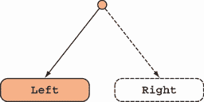
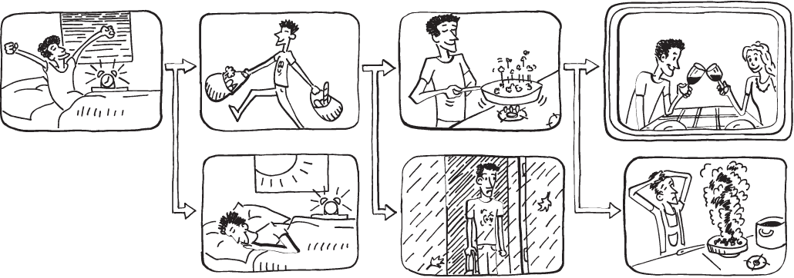
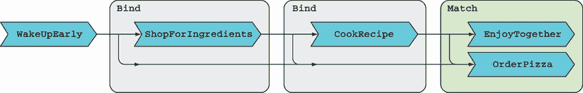
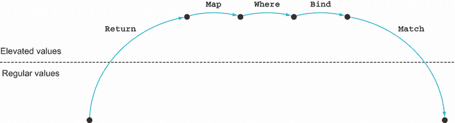
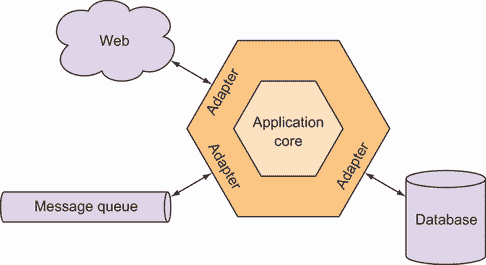
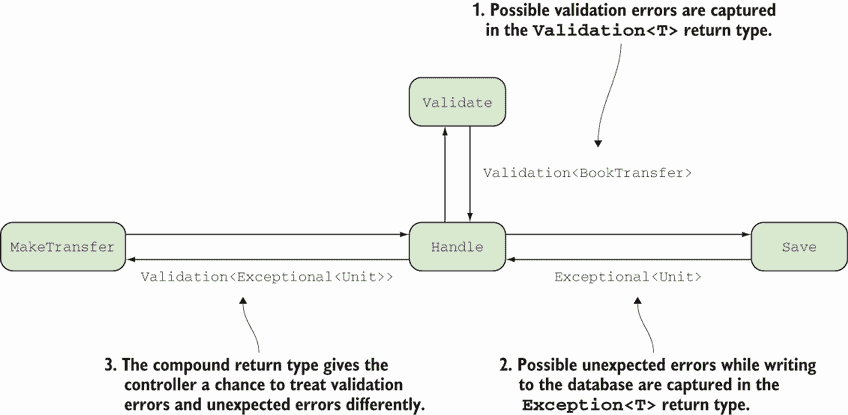

# 8 函数式错误处理

本章涵盖

+   使用 `Either` 表示替代结果

+   连接可能失败的操作

+   区分业务验证和技术错误

错误处理是我们应用程序的重要部分。它也是函数式和命令式编程风格差异显著的一个方面：

+   *命令式编程使用特殊的语句如* `throw` *和* `try-catch`*，这会打断正常的程序流程。* 这引入了在第 3.1.1 节中讨论的副作用。

+   *函数式编程力求最小化副作用，因此通常避免抛出异常。* 相反，如果一个操作可能失败，它应该返回其结果的表示，包括成功或失败的指示，以及（如果成功）其结果或一些错误数据。换句话说，FP 中的错误只是 *负载*。

基于命令式的异常处理方法存在许多问题。有人说过 `throw` 与 `goto` 具有相似的语义，这引发了一个问题：为什么命令式程序员禁止使用 `goto` 但没有禁止 `throw`。¹ 关于何时使用异常和何时使用其他错误处理技术也存在很多混淆。² 我认为函数式方法为复杂的错误处理领域带来了更多的清晰度，我希望通过本章的示例来说服你。

我们将探讨如何将函数式方法付诸实践，以及如何使用函数签名来声明函数可能失败——即通过返回一个在其负载中包含错误信息的类型。然后，错误可以在调用函数中像任何其他值一样被消费。

## 8.1 一种更安全的表示结果的方法

在前面的章节中，你看到可以使用 `Option` 不仅表示值的缺失，也表示有效值的缺失。你可以使用 `Some` 来表示一切顺利，使用 `None` 来表示出错。换句话说，函数式错误处理有时可以通过使用 `Option` 类型来满意地实现。以下是一些示例：

+   *将字符串解析为数字*——返回 `None` 以指示给定的字符串不是数字的有效表示。

+   *从集合中检索一个项目*——返回 `None` 以指示没有找到合适的项。

在这些场景中，函数无法计算有效结果的方式只有一个，即用 `None` 表示。返回 `Option<T>` 而不是 `T` 的函数在其签名中承认操作可能失败。一种看待它的方法是，除了结果 `T` 之外，它们还返回一些额外的负载（即我们 `Option` 实现中的 `isSome` 标志），这表示成功或失败。

如果一个操作有几种可能失败的方式呢？比如，如果 BOC 应用程序收到一个复杂的请求，比如一个转账请求，用户当然需要知道转账是否成功预订，而且在失败的情况下，还需要知道失败的原因。

在这种情况下，`Option`太有限了，因为它不传达任何关于操作失败原因的详细信息。因此，我们需要一种更丰富的方式来表示结果——它包括关于到底出了什么问题的信息。

### 8.1.1 使用`Either`捕获错误细节

对于这个问题的一个经典函数式方法是使用`Either`类型，在操作有两个可能结果的情况下，它捕获了已发生的结果的详细信息。按照惯例，两个可能的结果用`Left`和`Right`表示（如图 8.1 所示），将`Either`生成操作比作一个*分叉点*：事情可以朝一个方向或另一个方向发展。



图 8.1 `Either`表示两种可能的结果之一。它表明计算可能产生`Left`或`Right`。图像描述了一个例子，其中选择了左侧分支。

虽然`Left`和`Right`可以从一个中性的角度来看，但到目前为止，`Either`最常见的使用是表示可能失败的操作的结果，在这种情况下，`Left`用来表示失败，`Right`用来表示成功。所以，记住这个：

+   `Right` = 没问题

+   `Left` = 出了问题

在这种有偏见的接受中，`Either`就像是一个增加了错误信息的`Option`。`Option`可以是`None`或`Some`状态，而`Either`也可以类似地处于`Left`或`Right`状态，如表 8.1 所示。

表 8.1 `Option`和`Either`都可以表示可能的失败。

|  | 失败 | 成功 |
| --- | --- | --- |
| `Option<T>` | `None` | `Some<T>` |
| `Either<L, R>` | `Left<L>` | `Right<R>` |

如果`Option`可以象征性地定义为

```
Option<T> = None | Some(T)
```

那么`Either`可以类似地这样定义：

```
Either<L, R> = Left(L) | Right(R)
```

注意，`Either`有两个泛型参数。它可以处于两种状态之一：

+   `Left(L)`封装了一个类型为`L`的值，捕获了关于错误的详细信息。

+   `Right(R)`封装了一个类型为`R`的值，代表一个成功的结果。

让我们看看基于`Option`的接口如何与基于`Either`的接口不同。想象一下，你正在做一些 DIY，去商店买你需要的一个工具。如果这个商品没有货，一个基于`Option`的店主可能会说，“抱歉，这个商品没有货”——然后就没有然后了。一个基于`Either`的店主会给你更多信息，比如，“我们下周才有货，”或者“这个产品已经停产”；然后你可以根据这些信息做出进一步的决策。

那么一个欺骗性的店主，在库存耗尽后，会卖给你一个看起来和你想要的完全一样的产品，但当你使用它时会在你面前爆炸？这就是图 8.2 描述的异常抛出接口。


图 8.2 你作为客户会喜欢哪个商店？

因为 `Either` 的定义与 `Option` 非常相似，所以可以使用相同的技巧来实现。在我的 `LaYumba.Functional` 库中，我定义了一个类型 `Left<L>`，它可以包装一个 `L` 并可以隐式转换为任何类型 `R` 的 `Either<L, R>`。同样对于 `Right<R>`。为了方便，类型 `L` 和 `R` 的值也可以隐式转换为 `Either<L, R>`。

你可以在代码示例中看到完整的实现，但在这里我不会包括它，因为与第 5.3 节中讨论的 `Option` 的实现相比，没有什么是新的。相反，让我们在 REPL 中玩一玩 `Either`。像往常一样，你需要首先引用 `LaYumba.Functional`：

```
#r "functional-csharp-code-2\LaYumba.Functional\bin\Debug\net6.0\
➥ LaYumba.Functional.dll"

using LaYumba.Functional;
using static LaYumba.Functional.F;
```

现在创建一些 `Either`：

```
Right(12)            ❶
// => Right(12)

Left("oops")         ❷
// => Left("oops")
```

❶ 创建一个处于 `Right` 状态的 `Either`

❷ 创建一个处于 `Left` 状态的 `Either`

这很简单！你使用 `Right` 函数来包装，比如一个 `int` 到 `Right<int>`，它可以隐式转换为任何 `L` 的 `Either<L, int>`（这类似于我如何使用 `NoneType` 在 `None` 状态下创建 `Option`），同样对于 `Left` 也是如此。现在，让我们编写一个使用 `Match` 来根据 `Either` 的状态计算不同值的函数：

```
string Render(Either<string, double> val)
   => val.Match
   (
      Left: l => $"Invalid value: {l}",
      Right: r => $"The result is: {r}"
   );

Render(Right(12d))
// => "The result is: 12"

Render(Left("oops"))
// => "Invalid value: oops"
```

现在你已经知道了如何创建和消费一个 `Either`，让我们看看一个稍微更有趣的例子。想象一个执行简单计算的函数：

*f*(*x*, *y*) → sqrt(*x* / *y*)

为了正确执行计算，我们需要确保 *y* 不为零，并且 *x*/*y* 的比率是非负的。如果这些条件中有一个不满足，我们想知道是哪一个。所以计算返回，比如说，一个 `double` 在快乐路径上，否则返回一个带有错误消息的 `string`。这意味着这个函数的返回类型应该是 `Either<string, double>`——记住，成功的类型是右侧的类型。下面的列表显示了实现。

列表 8.1 使用 `Either` 捕获错误详情

```
using static System.Math;

Either<string, double> Calc(double x, double y)
{
   if (y == 0) return "y cannot be 0";

   if (x != 0 && Sign(x) != Sign(y))
      return "x / y cannot be negative";

   return Sqrt(x / y);
}
```

`Calc` 的签名清楚地声明它将返回一个结构，该结构可以是字符串或双精度浮点数。确实，实现返回的是字符串（错误消息）或双精度浮点数（计算结果）。在任何情况下，返回的值都隐式转换为适当填充的 `Either`。让我们在 REPL 中测试一下：

```
Calc(3, 0)   // => Left("y cannot be 0")
Calc(-3, 3)  // => Left("x / y cannot be negative")
Calc(-3, -3) // => Right(1)
```

因为 `Either` 与 `Option` 非常相似，你可能猜到你在与 `Option` 相关的核心函数将会有 `Either` 的对应函数。让我们找出答案。

### 8.1.2 用于处理 Either 的核心函数

与`Option`一样，我们可以用`Match`来定义`Map`、`ForEach`和`Bind`。因为`Left`情况用于表示失败，所以在`Left`情况下会跳过计算：

```
public static Either<L, RR> Map<L, R, RR>
(
   this Either<L, R> either,
   Func<R, RR> f
)
=> either.Match<Either<L, RR>>
(
   l => Left(l),                  ❶
   r => Right(f(r))
);

public static Either<L, Unit> ForEach<L, R>
   (this Either<L, R> either, Action<R> act)
   => Map(either, act.ToFunc());

public static Either<L, RR> Bind<L, R, RR>
(
   this Either<L, R> either,
   Func<R, Either<L, RR>> f
)
=> either.Match
(
   l => Left(l),                  ❶
   r => f(r)
);
```

❶ 在`Left`情况下，计算被跳过，并将`Left`值传递下去。

这里有一些需要注意的事情。在所有情况下，函数只会在`Either`是`Right`时应用。³ 这意味着如果我们把`Either`看作一个分叉点，那么当我们选择左边的路径时，就会错过所有后续的计算。

还要注意的是，当你使用`Map`和`Bind`时，`R`类型会改变：正如`Option<T>`是`T`上的函子一样，`Either<L, R>`是`R`上的函子，这意味着你可以使用`Map`来对`R`应用函数。另一方面，`L`类型保持不变。

关于`Where`？记住，你可以用谓词调用`Where`，并在它不满足谓词时过滤出`Option`的内部值：

```
Option<int> three = Some(3);

three.Where(i => i % 2 == 0) // => None
three.Where(i => i % 2 != 0) // => Some(3)
```

使用`Either`，你不能这样做。如果条件不满足，应该返回一个`Left`，但由于`Where`需要一个谓词，而谓词只返回布尔值，所以如果谓词失败，就没有可用的`L`类型值。如果你尝试为`Either`实现`Where`，这可能是最容易理解的。

```
public static Either<L, R> Where<L, R>
(
  this Either<L, R> either,
  Func<R, bool> predicate
)
=> either.Match
(
   l => Left(l),
   r => predicate(r)
      : Right(r)
      ? Left(/* now what? I don't have an L */)
);
```

如你所见，如果`Either`是`Right`但它的内部值不满足谓词，你应该返回一个`Left`。然而，没有可用的`L`类型值可以填充一个`Left`。

你刚刚了解到`Where`不如`Map`和`Bind`通用：它只能定义在存在零值的结构中（例如`IEnumerable`的空序列或`Option`的`None`）。对于`Either<L, R>`来说，没有零值，因为`L`是一个任意类型。你只能通过显式创建一个`Left`或通过调用可能返回适当`L`值的函数的`Bind`来使`Either`失败。你将在下一个示例中看到这一点，我将展示一个基于`Option`的实现和一个基于`Either`的实现并排。

### 8.1.3 比较`Option`和`Either`

想象我们正在模拟一个招聘流程。我们将从一个基于`Option`的实现开始，其中`Some(Candidate)`代表已经通过面试流程的候选人，而`None`代表拒绝。下面的列表显示了这种实现。

列表 8.2 基于`Option`的招聘流程实现

```
Func<Candidate, bool> IsEligible;
Func<Candidate, Option<Candidate>> TechTest;
Func<Candidate, Option<Candidate>> Interview;

Option<Candidate> Recruit(Candidate c)
   => Some(c)
      .Where(IsEligible)
      .Bind(TechTest)
      .Bind(Interview);
```

招聘流程首先是一个技术测试，然后是面试。如果测试失败，面试就不会进行。但在测试之前，我们会检查候选人是否有资格。使用`Option`，我们可以用`Where`应用`IsEligible`谓词，这样如果候选人没有资格，后续步骤就不会进行。

现在想象一下，人力资源部门不仅想知道候选人是否通过，还想知道拒绝的原因，因为这项信息允许他们改进招聘流程。我们可以重构为基于`Either`的实现，使用`Rejection`对象捕获拒绝的原因，如下面的列表所示。`Right`类型与之前一样是`Candidate`，而`Left`类型是`Rejection`。

列表 8.3 等价的基于`Either`的实现

```
Func<Candidate, bool> IsEligible;
Func<Candidate, Either<Rejection, Candidate>> TechTest;
Func<Candidate, Either<Rejection, Candidate>> Interview;

Either<Rejection, Candidate> CheckEligibility(Candidate c)   ❶
{
   if (IsEligible(c)) return c;
   else return new Rejection("Not eligible");
}

Either<Rejection, Candidate> Recruit(Candidate c)
   => Right(c)
      .Bind(CheckEligibility)                                ❷
      .Bind(TechTest)
      .Bind(Interview);
```

❶ 将谓词转换为返回`Either`的函数

❷ 使用`Bind`应用`CheckEligibility`

现在，我们需要更明确地表达`IsEligible`测试失败的情况，因此我们将这个谓词转换为一个返回`Either`的函数，即`CheckEligibility`。这为谓词未通过时提供了一个合适的`Left`值（即`Rejection`）。现在我们可以使用`Bind`将`CheckEligibility`组合到工作流程中。

注意到基于`Either`的实现更为冗长。这很合理，因为我们选择`Either`是为了明确地表达失败条件。

## 8.2 连接可能失败的运算

`Either`特别适合表示可能引起从快乐路径偏离的操作链。例如，偶尔你会为你的男朋友或女朋友准备他们最喜欢的菜肴。工作流程可能看起来像这样：

```
  o WakeUpEarly
 / \
L   R ShopForIngredients
   / \
  L   R CookRecipe
     / \
    L   R EnjoyTogether
```

在每一步中，都可能出错：你可能睡过头，你可能醒来时遇到暴风雨，这阻止了你去商店，你可能分心，让一切都烧毁了……简而言之，只有当*一切*顺利时，你才能一起享受快乐的餐点（见图 8.3）。



图 8.3 如果一切按计划进行……

使用`Either`，我们可以模拟前面的工作流程。下面的列表展示了如何实现这一点。

列表 8.4 使用`Bind`连接多个返回`Either`的函数

```
Func<Either<Reason, Unit>> WakeUpEarly;
Func<Either<Reason, Ingredients>> ShopForIngredients;
Func<Ingredients, Either<Reason, Food>> CookRecipe;

Action<Food> EnjoyTogether;
Action<Reason> ComplainAbout;
Action OrderPizza;

WakeUpEarly()
   .Bind(_ => ShopForIngredients())
   .Bind(CookRecipe)
   .Match
   (
      Right: dish => EnjoyTogether(dish),
      Left: reason =>
      {
         ComplainAbout(reason);
         OrderPizza();
      }
   );
```

记住从`Bind`的定义中，如果状态是`Left`，则`Left`值只是被传递下去。在先前的列表中，当我们说`ComplainAbout(reason)`时，`reason`是之前任何步骤中失败的原因：如果我们没有醒来，`ComplainAbout`会接收到那个原因；同样，如果我们没有去购物，等等。

之前的树形图是工作流程的正确、逻辑表示。图 8.4 展示了另一种看待它的方法，这更接近实现细节。



图 8.4 连接返回`Either`的函数

每个函数都返回一个两部分的结构，即`Either`，并通过`Bind`与下一个函数连接。F# 拥护者 Scott Wlaschin 将通过连接多个返回`Either`的函数获得的工作流程比作一个双轨系统：⁴

+   有一个*主轨道*（即快乐路径），从`R1`到`Rn`。

+   在`Left`侧有一个辅助的、*并行轨道*。

+   如果你处于 `Right` 轨道，每次函数应用时，你将要么沿着 `Right` 轨道继续前进，要么被引导到 `Left` 轨道。

+   一旦你处于 `Left` 轨道，你将一直保持在轨道上直到路的尽头。

+   `Match` 是路的尽头，在这里并行轨道的分离发生。

虽然这个“最喜欢的菜肴”例子相当轻率，但它代表了众多编程场景。例如，想象一个无状态服务器，在收到请求后，必须执行以下步骤：

1.  验证请求

1.  从数据库加载模型

1.  对模型进行更改

1.  持久化更改

这些操作中的任何一个都可能失败，并且任何步骤的失败都应阻止工作流程继续。此外，响应可能包含有关请求操作成功或失败详情的信息，并适当地提醒客户端。接下来，我们将看看在这样场景中使用 `Either`。

## 8.3 验证：Either 的完美用例

让我们重新审视请求货币转账的场景，但在这个情况下，我们将处理一个简化的场景，其中客户端明确请求在未来某一天执行转账。应用程序应该执行以下操作：

1.  验证请求

1.  存储转账详情以供将来执行

1.  返回一个表示成功或任何失败详情的响应

我们可以用 `Either` 来模拟操作可能失败的事实。如果转账请求成功存储，就没有有意义的数据返回给客户端，所以 `Right` 类型参数将是 `Unit`。那么 `Left` 类型应该是什么？

### 8.3.1 选择合适的错误表示

让我们看看一些你可以用来捕获错误详情的类型。当你通过 `Map` 或 `Bind` 将函数应用于 `Either` 时，`Right` 类型会改变，但 `Left` 类型保持不变。所以一旦你为 `Left` 选择了一个类型，这个类型在整个工作流程中保持不变。

我在之前的例子中使用了一些 `string`，但这似乎限制性太强；你可能想添加更多关于错误的详细结构化信息。关于 `Exception` 怎么样？它是一个可以扩展为任意丰富子类型的基类。然而，这里的语义是错误的：`Exception` 表示发生了异常。相反，这里我们正在为“常规业务”中的错误进行编码。

我在下一个列表中包含了一个简单的基 `Error` 类型，仅暴露一个 `Message` 属性。你可以为特定错误扩展这个类型。

列表 8.5 表示失败的基础类

```
namespace LaYumba.Functional;

public record Error(string Message);
```

虽然严格来说，`Error` 的表示是领域的一部分，但这是一个足够通用的要求，我已经将这个类型添加到了我的功能库中。我的推荐方法是**为每种错误类型创建一个类型**。例如，下面的列表提供了一些我们需要用来表示一些验证失败情况的错误类型。

列表 8.6 独特类型捕获特定错误的详细信息

```
namespace Boc.Domain;

public sealed record InvalidBicError()
   : Error("The beneficiary's BIC/SWIFT code is invalid");

public sealed record TransferDateIsPastError()
   : Error("Transfer date cannot be in the past");
```

为了方便起见，我们将添加一个静态类，`Errors`。它包含用于创建特定 `Error` 的工厂函数：

```
public static class Errors
{
   public static Error InvalidBic
      => new InvalidBicError();

   public static Error TransferDateIsPast
      => new TransferDateIsPastError();
}
```

这是一个技巧，将有助于我们保持业务决策处的代码更干净，正如你一会儿会看到的。它还提供了良好的文档：`Errors` 有效地为你提供了所有为该领域定义的特定错误的概述。

### 8.3.2 定义基于 `Either` 的 API

假设关于转账请求的详细信息被捕获在一个类型为 `MakeTransfer` 的 DTO 中（见列表 3.6）：这是我们从客户端接收到的，也是我们工作流程的输入数据。我们还可以确定，当没有数据（在成功的情况下）或带有详细信息的错误（在失败的情况下）时，工作流程应返回 `Either<Error, Unit>`。这意味着我们需要实现的主要函数来执行此工作流程具有以下签名：

```
MakeTransfer → Either<Error, Unit>
```

现在我们已经准备好介绍实现的大致框架：

```
public class MakeTransferController : ControllerBase
{
   [HttpPost, Route("transfers/book")]
   public void MakeTransfer([FromBody] MakeTransfer request)
      => Handle(request);

   Either<Error, Unit> Handle(MakeTransfer cmd)
      => Validate(cmd)
         .Bind(Save);                                       ❶

   Either<Error, MakeTransfer> Validate(MakeTransfer cmd)   ❷
      => // TODO: add validation...

   Either<Error, Unit> Save(MakeTransfer cmd)               ❸
      => // TODO: save the request...
}
```

❶ 使用 `Bind` 来链式执行两个可能失败的运算

❷ 使用 `Either` 来承认验证可能会失败

❸ 使用 `Either` 来承认持久化请求可能会失败

`Handle` 方法定义了高级工作流程：首先验证，然后持久化。`Validate` 和 `Save` 都返回 `Either` 来承认运算可能会失败。注意，`Validate` 的返回类型是 `Either<Error, MakeTransfer>`。这意味着我们需要在右侧的 `MakeTransfer` 命令，以便转账数据可用，并可以传递给 `Save`。接下来，让我们添加一些验证。

### 8.3.3 添加验证逻辑

让我们先验证请求的一些简单条件：

+   转账的日期应该在将来。

+   提供的 BIC 代码应该符合正确的格式。⁵

你已经在 3.3.2 节中看到了这个验证的逻辑。然而，当时我们编写了返回布尔值的函数，表示 `MakeTransfer` 是否有效。现在，我们想要返回一个 `Either` 来捕获验证失败的具体细节。

我们可以让一个函数执行每个验证。典型的方案如下：

```
Regex bicRegex = new Regex("[A-Z]{11}");

Either<Error, MakeTransfer> ValidateBic(MakeTransfer transfer)
   => bicRegex.IsMatch(transfer.Bic)
      ? transfer                       ❶
      : Errors.InvalidBic;             ❷
```

❶ 成功：原始请求被封装在 `Either` 的 `Right` 状态中。

❷ 失败：错误被封装在 `Either` 的 `Left` 状态中。

即，每个验证函数都接受一个请求作为输入，并返回 *either*（要么）验证后的命令 *or* 相应的错误。

每个验证函数都是一个跨界函数（从一个普通值 `MakeTransfer` 到一个提升值 `Either<Error, MakeTransfer>`），因此我们可以使用 `Bind` 组合这些函数中的几个。以下列表显示了如何做到这一点。

列表 8.7 使用 `Bind` 链式连接多个验证函数

```
DateTime now;
Regex bicRegex = new Regex("[A-Z]{11}");

Either<Error, Unit> Handle(MakeTransfer transfer)
   => Right(transfer)                             ❶
      .Bind(ValidateBic)                          ❷
      .Bind(ValidateDate)                         ❷
      .Bind(Save);                                ❷

Either<Error, MakeTransfer> ValidateBic(MakeTransfer transfer)
   => bicRegex.IsMatch(transfer.Bic)
      ? transfer
      : Errors.InvalidBic;

Either<Error, MakeTransfer> ValidateDate(MakeTransfer transfer)
   => transfer.Date.Date > now.Date
      ? transfer
      : Errors.TransferDateIsPast;

Either<Error, Unit> Save(MakeTransfer cmd) => //...
```

❶ 将命令提升到 `Either`

❷ 使用 `Bind` 应用所有后续可能失败的运算

总结来说，使用 `Either` 来承认 *一个* 运算可能会失败，并使用 `Bind` 来链式执行 *多个* 可能失败的运算。

现在我们的工作流程已经很好地用`Either`捕获了失败的可能性，我们如何将此信息传达给请求的 HTTP 客户端？我们将在下一节探讨这个问题。

## 8.4 向客户端应用程序表示结果

你现在已经看到了`Option`和`Either`的许多用例。这两种类型都可以看作是表示结果：在`Option`的情况下，`None`可以表示失败；在`Either`的情况下，它是`Left`。我们已经将`Option`和`Either`定义为 C#类型，但在本节中，你将看到如何将它们转换为外部世界。

尽管我们已经为这两种类型定义了`Match`，但我们使用它相当少，而是依赖于`Map`、`Bind`和`Where`来定义工作流程。记住，这里的*关键区别*在于后者在抽象内部工作（你从`Option<T>`开始，并以`Option<R>`结束）。另一方面，`Match`允许你“离开抽象”（你从`Option<T>`开始，并以`R`结束）。图 8.5 展示了这个过程。



图 8.5 使用`Option`和`Either`，`Match`用于离开抽象。

作为一条一般规则，一旦你引入了像`Option`这样的抽象，最好尽可能长时间地坚持使用它。*尽可能长时间*是什么意思？理想情况下，这意味着当你跨越应用边界时，你会离开抽象世界。

设计应用程序时，在应用核心（包含服务和领域逻辑）和外部层（包含一组适配器，通过这些适配器你的应用程序与外部世界交互）之间保持一些分离是良好的实践。你可以将你的应用程序看作是一个橙子，其中皮肤由一层适配器组成，如图 8.6 所示。



图 8.6 应用程序的外部层由适配器组成。

像`Option`和`Either`这样的抽象在应用核心中很有用，但它们可能无法很好地映射到交互应用期望的消息合约。因此，外部层是你需要离开抽象并转换为客户端应用程序期望的表示的地方。

### 8.4.1 暴露类似`Option`的接口

想象一个 API，给定一个*股票代码*（股票或其他金融工具的标识符，例如 AAPL、GOOG 或 MSFT），返回有关请求的金融工具的详细信息。在应用核心中，你已经实现了一个执行此操作的功能；其签名是

```
GetDetails : string → Option<InstrumentDetails>
```

你无法知道给定的股票代码字符串是否确实标识了一个现有的工具，因此你使用了`Option`来建模这种情况。接下来，让我们将此数据暴露给外部世界。你可以通过在 ASP.NET MVC 控制器上定义一个端点来实现这一点。

API 返回，比如说，通过 HTTP 的 JSON（一种不处理 `Option` 的格式和协议），因此控制器需要充当一个适配器，可以将 `Option` 转换为该协议支持的内容。也就是说，如果给定的股票代码没有对应的工具，我们将返回一个状态码为 404（未找到）的 HTTP 响应，如下列表所示。

列表 8.8 将 `None` 映射到状态码 404

```
using Microsoft.AspNet.Mvc;

public class InstrumentsController : ControllerBase
{
   [HttpGet, Route("api/instruments/{ticker}/details")]
   public IActionResult GetInstrumentDetails(string ticker)
      => GetDetails(ticker)
         .Match<IActionResult>
         (
            () => NotFound(),         ❶
            (result) => Ok(result)    ❷
          );

   Option<InstrumentDetails> GetDetails(string ticker) => // ...
}
```

❶ 将 `None` 映射到 404

❷ 将 `Some` 映射到 200

注意，由于 `NotFound` 和 `Ok`（都继承自 `ControllerBase`）返回不同的 `IActionResult` 实现，我们必须显式声明 `IActionResult` 作为 `Match` 的类型参数。

无参数风格

`GetInstrumentDetails` 的主体可以写得更加简洁：

```
=> getInstrumentDetails(ticker)
   .Match<IActionResult>
   (
      None: NotFound,
      Some: Ok
   );
```

（或者甚至可以更简洁地不带参数名称。）

这种省略显式参数的风格有时被称为**无参数风格**，因为省略了数据点。一开始可能会有些令人畏惧，但一旦习惯了，就会更加简洁。

你现在已经看到了如何使用基于 `Option` 的接口来建模工作流程，并通过 HTTP API 暴露它。接下来，让我们看看基于 `Either` 的接口。

### 8.4.2 暴露类似 `Either` 的接口

就像 `Option` 一样，一旦你的值提升到 `Either` 的更高层次，最好一直保持在那里，直到工作流程结束。但所有美好的事物都有尽头，所以你最终需要离开你的应用程序领域，并将你的 `Either` 的表示暴露给外部世界。

让我们回到本章中讨论的银行场景——即客户请求在未来日期进行转账的场景。我们的核心功能返回一个 `Either<Error, Unit>`，我们必须将其转换为，比如说，通过 HTTP 的 JSON。

一种方法与我们刚才查看的 `Option` 类似：我们可以使用 HTTP 状态码 400 来表示我们收到了一个无效请求。以下列表展示了这种方法。

列表 8.9 将 `Left` 映射到状态码 400

```
public class MakeTransferController : ControllerBase
{
   [HttpPost, Route("api/transfers/future")]
   public IActionResult MakeTransfer([FromBody] MakeTransfer transfer)
      => Handle(transfer).Match<IActionResult>
      (
         Left: BadRequest,
         Right: _ => Ok()
      );

   Either<Error, Unit> Handle(MakeTransfer transfer) => // ...
}
```

这有效。唯一的缺点是关于业务验证如何与 HTTP 错误码相关联的约定并不稳固。有些人会争论说 400 表示一个**语法上**错误的请求，而不是像这里这样的**语义上**错误的请求。

在并发情况下，一个在发送时有效的请求在服务器收到时可能不再有效（例如，账户余额可能已经下降）。400 状态码是否传达了这一点？

而不是试图确定哪个 HTTP 状态码最适合特定的错误场景，另一种方法是返回响应中的结果表示。我们将在下一节中探讨这个选项。

### 8.4.3 返回结果 DTO

这种方法涉及始终返回成功的状态码（因为，在底层，响应已被正确接收和处理），以及响应体中任意丰富的结果表示。以下列表显示了一个简单的数据传输对象（DTO），它表示处理请求的结果，包括其左右组件。

列表 8.10 表示响应中序列化结果的 DTO

```
public record ResultDto<T>
{
   public bool Succeeded { get; }
   public bool Failed => !Succeeded;

   public T Data { get; }
   public Error Error { get; }

   internal ResultDto(T data) => (Succeeded, Data) = (true, data);
   internal ResultDto(Error error) => Error = error;
}
```

这个 `ResultDto` 与 `Either` 类似。但与 `Either` 不同，其内部值只能通过高阶函数访问，而 DTO 则将其暴露出来，以便于客户端的序列化和访问。然后我们可以定义一个实用函数，将 `Either` 转换为 `ResultDto`：

```
public static ResultDto<T> ToResult<T>(this Either<Error, T> either)
   => either.Match
   (
      Left: error => new ResultDto<T>(error),
      Right: data => new ResultDto<T>(data)
   );
```

现在，我们只需在我们的 API 方法中公开 `Result` 即可。接下来的列表显示了如何做到这一点。

列表 8.11 将错误详情作为成功响应负载的一部分返回

```
public class MakeTransferController : ControllerBase
{
   Func<MakeTransfer, Either<Error, Unit>> makeTransfer;

   [HttpPost, Route("api/transfers/future")]
   public ResultDto<Unit> MakeTransfer([FromBody] MakeTransfer transfer)
      => makeTransfer(transfer).ToResult();
}
```

总体来说，这种方法意味着你的端点代码更少。更重要的是，这意味着你不需要依赖 HTTP 协议的怪癖来表示结果，而是可以创建最适合你的结构来表示你选择看到的 `Left`。

最后，两种方法都是可行的，并且在实际的 API 中都被使用。你选择哪种方法更多与 API 设计有关，而不是与函数式编程（FP）有关。关键是，当你向客户端应用程序公开可以用 `Either` 在你的应用程序中建模的结果时，你通常必须做出一些选择。

我通过 HTTP API 的例子说明了“降低”抽象中的值，因为这是一个非常常见的需求，但如果你暴露另一种类型的端点，这些概念并不会改变。总的来说，如果你处于橙子的皮层，使用 `Match`；在橙子的核心中保持多汁的抽象。

## 8.5 基于 `Either` 的变体

`Either` 将我们引向功能错误处理的深处。与导致程序“跳”出其正常执行流程并进入堆栈中某处的异常处理块的异常不同，`Either` 维持正常的程序执行流程，并返回结果的表现形式。

`Either` 有很多值得喜欢的地方。也有一些可能的反对意见：

+   `Bind` 不改变 `Left` 类型，那么你如何组合返回不同 `Left` 类型的 `Either` 函数？

+   总是必须指定两个泛型参数使得代码过于冗长。

+   `Either`、`Left` 和 `Right` 的名字太晦涩了。我们能不能有更用户友好的名字？

在本节中，我将解决这些担忧。你会看到如何通过 `Either` 主题的一些变体来减轻这些问题。

### 8.5.1 在不同的错误表示之间切换

正如你所见，`Map` 和 `Bind` 允许你更改 `R` 类型，但不能更改 `L` 类型。尽管具有统一的错误表示方式更可取，但这可能并不总是可能的。如果你编写了一个库，其中 `L` 类型始终为 `Error`，而另一个人编写了一个库，其中它始终为 `string`，你该如何整合这两个库呢？

这实际上可以通过 `Map` 的一个重载来解决，它允许你将函数应用于左值和右值。这个重载接受一个 `Either<L, R>`，然后不是一个是两个函数：一个类型为 `(L → LL)` 的函数，它应用于左值（如果存在），另一个类型为 `(R → RR)` 的函数，它应用于右值，

```
public static Either<LL, RR> Map<L, LL, R, RR>
(
   this Either<L, R> either,
   Func<L, LL> Left,
   Func<R, RR> Right
)
=> either.Match<Either<LL, RR>>
(
   l => F.Left(Left(l)),
   r => F.Right(Right(r))
);
```

这种 `Map` 的变体允许你任意更改两种类型，这样你就可以在 `L` 类型不同的函数之间进行互操作。⁶ 以下是一个示例：

```
Either<string, double> Calc(double x, double y) //...   ❶

Either<Error, int> ToIntIfWhole(double d) //...         ❷

Either<Error, int> Run(double x, double y)
   => Calc(x, y)
      .Map
      (
         Left: msg => Error(msg),                       ❸
         Right: d => d
      )
      .Bind(ToIntIfWhole);
```

❶ `L` 表示 `string`。

❷ `L` 表示 `Error`。

❸ 从 `string` 转换为 `Error`

如果可能的话，最好避免噪音并坚持一致的错误表示。不同的表示方式，尽管如此，并不是一个障碍。

### 8.5.2 Either 的专用版本

让我们来看看在 C# 中使用 `Either` 的其他缺点。

首先，有两个泛型参数会增加代码的噪音。⁷ 例如，想象你想捕获多个验证错误，为此你选择 `IEnumerable<Error>` 作为你的 `Left` 类型。你最终会得到这样的签名：

```
public Either<IEnumerable<Error>, Rates> RefreshRates(string id) //...
```

现在，你必须阅读三个东西（`Either`、`IEnumerable` 和 `Error`），才能到达最有意义的部分——所需的返回类型 `Rates`。与我们在 4.2.3 节中讨论的没有任何关于失败信息的签名相比，这似乎是我们陷入了对立面。

第二，`Either`、`Left` 和 `Right` 的名称过于抽象。软件开发本身就足够复杂，因此我们应该选择最直观的名称。

可以通过使用具有固定类型来表示失败（因此，单个泛型参数）和更友好的名称的更专用版本的 `Either` 来解决这两个问题。请注意，这种 `Either` 的变体很常见，但尚未标准化。你会发现许多不同的库和教程，每个都有自己的术语和行为的小变化。

因此，我认为最好首先让你彻底理解 `Either`，它在文献中无处不在且已建立，这将使你能够掌握你可能会遇到的任何变体。（然后你可以选择最适合你的表示，或者如果你愿意，甚至可以为你自己的结果表示实现自己的类型。）

`LaYumba.Functional` 包含以下两种表示结果的变体：

+   `Validation<T>`——你可以将其视为一个特定于 `IEnumerable<Error>` 的 `Either`：

    ```
    Validation<T> = Invalid(IEnumerable<Error>) | Valid(T)
    ```

    `Validation`类似于`Either`，其中失败情况被固定为`IEnumerable<Error>`，这使得能够捕获多个验证错误。

+   `Exceptional<T>`—在这里，失败被固定为`System.Exception`：

    ```
    Exceptional<T> = Exception | Success(T)
    ```

    `Exceptional`可以用作基于异常的 API 和函数式错误处理之间的桥梁。

表 8.2 展示了这些变化并排。

表 8.2 `Either`的一些特定版本及其状态名称

| 类型 | 成功情况 | 失败情况 | 失败类型 |
| --- | --- | --- | --- |
| `Either<L, R>` | `Right` | `Left` | `L` |
| `Validation<T>` | `Valid` | `Invalid` | `IEnumerable<Error>` |
| `Exceptional<T>` | `Success` | `Exception` | `Exception` |

这些新类型比`Either`有更友好、更直观的名称。而且因为`Left`类型是静态的，它不会使你的方法签名变得杂乱。你将在下一个示例中看到它们的使用。

### 8.5.3 重构为验证和异常处理

让我们回到用户为未来执行预订货币转账的场景。之前，我们用`Either`模拟了包含验证和持久化（两者都可能失败）的简单工作流程。现在，让我们看看使用更具体的`Validation`和`Exceptional`如何改变实现。

执行验证的功能函数应该自然地产生一个`Validation`。在我们的场景中，其类型会是

```
Validate : MakeTransfer → Validation<MakeTransfer>
```

因为`Validation`就像`Either`一样，特定于`Error`类型，验证函数的实现将与之前的基于`Either`的实现相同，除了签名的变化。以下是一个示例：

```
DateTime now;

Validation<MakeTransfer> ValidateDate(MakeTransfer transfer)
   => transfer.Date.Date > now.Date
      ? transfer                      ❶
      : Errors.TransferDateIsPast;    ❷
```

❶ 在“有效”状态下将命令封装在`Validation`中

❷ 在“无效”状态下将一个`Error`封装在`Validation`中

与之前的实现一致，我定义了`Valid`为一个函数，它接受一个`T`并将其提升到`Validation<T>`的“有效”状态，同样对于`Invalid`，它接受一个或多个`Error`。隐式转换也被定义，所以在前面的例子中，你可以省略对`Valid`和`Invalid`的调用。

在基于异常的 API 和函数式错误处理之间架桥

接下来，让我们看看持久化。与验证不同，这里的失败将表明基础设施或配置或另一个技术错误。我们把这些错误视为异常，因此我们可以用`Exceptional`来模拟这种情况：⁸

```
Save : MakeTransfer → Exceptional<Unit>
```

以下列表展示了`Save`实现的可能形式。

列表 8.12 将基于异常的 API 转换为`Exceptional`值

```
string connString;

Exceptional<Unit> Save(MakeTransfer transfer)           ❶
{
   try
   {
      ConnectionHelper.Connect(connString               ❷
         , c => c.Execute("INSERT ...", transfer));     ❷
   }

   catch (Exception ex) { return ex; }                  ❸

   return Unit();                                       ❹
}
```

❶ 返回类型承认异常的可能性。

❷ 将抛出异常的第三方 API 调用封装在`try`中。

❸ 异常将在“异常”状态下隐式转换为并封装在`Exceptional`中。

❹ 返回的`Unit`将在“成功”状态下转换为`Exceptional`。

注意到`try`-`catch`的范围尽可能小：我们希望捕获在连接数据库时可能抛出的任何异常，并立即将其转换为函数式风格，将结果包裹在`Exceptional`中。像往常一样，隐式转换创建了一个适当初始化的`Exceptional`。注意这种模式如何使我们能够从第三方抛出异常的 API 转换到函数式 API，其中错误被处理为负载，错误的可能性反映在返回类型中。

验证失败与技术错误

验证失败和技术错误应该被不同地处理。使用`Validation`和`Exceptional`的好处是它们具有不同的语义含义：

+   `Validation`表示可能违反的业务规则。

+   `Exceptional`表示可能出现的意外技术错误。

我们现在将探讨如何使用这些不同的表示方法来适当地处理每个案例。我们仍然需要将验证和持久性结合起来，这在这里通过`Handle`完成：

```
public class MakeTransferController : ControllerBase
{
   Validation<Exceptional<Unit>> Handle(MakeTransfer transfer)
      => Validate(transfer)                                     ❶
         .Map(Save);                                            ❶

   Validation<MakeTransfer> Validate(MakeTransfer transfer)     ❷
      => ValidateBic(transfer) 
         .Bind(ValidateDate); 

   Validation<MakeTransfer> ValidateBic(MakeTransfer transfer) // ...
   Validation<MakeTransfer> ValidateDate(MakeTransfer transfer) // ...

   Exceptional<Unit> Save(MakeTransfer transfer) // ...
}
```

❶ 结合验证和持久性

❷ 结合各种验证规则的顶级验证函数

因为`Validate`返回一个`Validation`，而`Save`返回一个`Exceptional`，所以我们不能使用`Bind`来组合这些类型。但这是可以的：我们可以使用`Map`，最终得到返回类型`Validation<Exceptional<Unit>>`。这是一个嵌套类型，表示我们正在结合验证的效果（我们可能会得到验证错误而不是期望的返回值）和异常处理的效果（即使验证通过，我们可能仍然会得到异常而不是返回值）。⁹

因此，`Handle`通过“堆叠”两个单子效果来承认操作可能因为业务原因或技术原因而失败。图 8.7 说明了在两种情况下我们如何通过将错误包含在负载中来表达错误。 



图 8.7 在功能错误处理中，错误被视为返回负载的一部分。

要完成端到端场景，我们只需要添加入口点。这是控制器从客户端接收`MakeTransfer`命令的地方，调用之前定义的`Handle`，并将结果`Validation<Exceptional-<Unit>>`转换为发送回客户端的结果。这将在下面的列表中展示。

列表 8.13 验证和异常错误的处理方式

```
public class MakeTransferController : ControllerBase
{
   ILogger<MakeTransferController> logger;

   [HttpPost, Route("api/transfers/book")]
   public IActionResult MakeTransfer([FromBody] MakeTransfer transfer)
      => Handle(transfer).Match                   ❶
      (
         Invalid: BadRequest,                     ❷
         Valid: result => result.Match            ❸
         (
            Exception: OnFaulted,                 ❹
            Success: _ => Ok()
         )
      );

   IActionResult OnFaulted(Exception ex)
   {
      logger.LogError(ex.Message);
      return StatusCode(500, Errors.UnexpectedError);
   }

   Validation<Exceptional<Unit>> Handle(MakeTransfer transfer) //...
}
```

❶ 解包`Validation`内部的值

❷ 如果验证失败，发送 400 状态码

❸ 解包`Exceptional`内部的值

❹ 如果持久性失败，发送 500 状态码

在这里，我们使用两个嵌套的`Match`调用，首先解包`Validation`内部的值，然后是`Exceptional`内部的值：

+   如果验证失败，我们发送一个包含验证错误全部详情的 400 状态码，以便用户可以处理这些问题。

+   另一方面，如果持久化失败，我们不想将详细信息发送给用户。相反，我们返回一个带有更通用错误类型的 500 状态码（这也是记录异常的好地方）。

正如你所看到的，每个相关函数的显式返回类型允许你清楚地区分和定制你如何处理与业务规则相关的失败与与技术问题相关的失败。

总结来说，`Either` 提供了一种明确的功能方式来处理错误，而不引入副作用，这与抛出/捕获异常不同。但正如我们相对简单的银行场景所说明的，使用 `Either` 的专用版本，如 `Validation` 和 `Exceptional`，会导致更具有表达性和可读性的实现。

### 8.5.4 留下异常？

在本章中，你已经对功能错误处理的理念有了坚实的理解。¹⁰ 你可能会觉得这与基于异常的方法有很大的不同，确实如此！

我提到抛出异常会中断正常的程序流程，引入副作用。更实际地说，它使得你的代码更难以维护和推理：如果一个函数抛出异常，分析这种异常对应用程序的影响的唯一方法就是跟踪所有可能的代码路径进入该函数，然后查找堆栈中的第一个异常处理器。在功能错误处理中，错误只是函数返回类型的一部分，因此你仍然可以独立地推理函数。

已经意识到使用异常的负面影响后，一些较新的编程语言，如 Go、Elixir 和 Elm，都接受了这样的观点：错误应该简单地被视为值，因此 `throw` 和 `try`-`catch` 语句的等价物只被很少使用（Elixir）或者根本不包含在语言中（Go、Elm）。C# 包含异常并不意味着你需要使用它们来处理错误；相反，你可以在应用程序中使用功能错误处理，并使用适配器函数将基于异常的 API 调用的结果转换为类似于前面所示 `Exceptional` 的东西。

是否有任何情况下异常仍然有用？我相信是这样的：

+   *开发者错误*——例如，如果你试图从一个空列表中删除一个项目，或者如果你将 `null` 值传递给需要一个值的函数，该函数或列表实现抛出异常是可以接受的。这种异常永远不会被调用代码捕获和处理；它们表明应用程序逻辑有误。

+   *配置错误*——例如，如果一个应用程序依赖于消息总线来连接到其他系统，并且除非连接，否则无法有效地执行任何有用的操作，那么在启动时无法连接到总线应该导致异常。如果缺少像数据库连接字符串这样的关键配置项，也适用同样的情况。这些异常应该在初始化时抛出，并且不打算被捕获（除了可能在最外层的、应用程序范围内的处理程序中），但应该正确地导致应用程序崩溃。

## 练习

1.  编写一个`ToOption`扩展方法，将`Either`转换为`Option`；如果存在，左值将被丢弃。然后编写一个`ToEither`方法，将`Option`转换为具有适当参数的`Either`，如果`Option`为`None`，则可以调用该参数以获取适当的`Left`值。（提示：首先用箭头符号编写函数签名。）

1.  考虑一个工作流程，其中两个或多个返回`Option`的函数使用`Bind`进行链式调用。然后将第一个函数改为返回`Either`。这应该会导致编译失败。`Either`可以转换为`Option`（如你在上一个练习中看到的），因此为`Bind`编写扩展重载。这样，返回`Either`和`Option`的函数可以使用`Bind`进行链式调用，产生一个`Option`。

1.  编写一个具有以下签名的函数

    ```
    TryRun : (() → T) → Exceptional<T>
    ```

    该函数在`try`-`catch`块中运行给定的函数，返回一个适当填充的`Exceptional`。

1.  编写一个具有以下签名的函数

    ```
    Safely : ((() → R), (Exception → L)) → Either<L, R>
    ```

    该函数在`try`-`catch`块中运行给定的函数，返回一个适当填充的`Either`。

## 摘要

+   使用`Either`来表示具有两种不同可能结果的操作的结果，通常是成功或失败。`Either`可以处于两种状态之一：

    +   `Left`表示失败，并包含不成功操作的错误信息。

    +   `Right`表示成功，并包含成功操作的结果。

+   使用与`Option`中已看到的核心函数等效的函数与`Either`进行交互：

    +   `Map`和`Bind`仅在`Either`处于`Right`状态时应用映射/绑定函数；否则，它们只是传递`Left`值。

    +   `Match`允许你分别处理`Right`和`Left`情况。

    +   `Where`不适用；如果你要根据谓词过滤出某些`Right`值，请使用`Bind`代替，提供一个在谓词失败时产生适当`Left`值的函数。

+   `Either`特别适用于将多个验证函数与`Bind`结合使用，或者更一般地，用于将多个可能失败的操作组合在一起。

+   由于`Either`相当抽象，并且由于其两个泛型参数的语法开销，在实践中，最好使用`Either`的特定版本，例如`Validation`和`Exceptional`。

+   当与函子和单子一起工作时，最好使用保持在抽象内部的函数，例如`Map`和`Bind`。尽可能少或尽可能晚地使用向下交叉的`Match`函数。

* * *

¹ 事实上，我认为`throw`比`goto`更糟糕。后者至少跳到了一个定义良好的位置；而`throw`，除非你探索了`throw`发生的代码中所有可能的路径，否则你真的不知道接下来会执行什么代码。

² 这些包括返回一个特殊值来指示错误或返回表示操作结果的物体，这是我在本章中要采取的方法。

³ 这被称为`Either`的*有偏*实现。还有不同的、*无偏*的`Either`实现，它们不用于表示错误/成功分离，而是表示两个同样有效的路径。在实践中，有偏的实现被广泛使用。

⁴ 我鼓励您查看他网站上关于“面向铁路的编程”的文章和视频会议，网址为[`fsharpforfunandprofit.com/rop/`](http://fsharpforfunandprofit.com/rop/)。

⁵ BIC 代码，也称为 SWIFT 代码，是银行分支的标准标识符。

⁶ 由于函数式编程（FP）中的术语并不匮乏，因此定义了这种形式的`Map`的函子被称为*双函子*。其理念是函子有一个内部值，而双函子有两个（或两个中的一个）内部值。双函子可以有`RightMap`（与`Map`相同）、`LeftMap`（将函数映射到左值）和`BiMap`（与刚刚展示的`Map`的重载相同）这样的函数。

⁷ 你可以将其视为`Either`或 C#类型系统的不足。`Either`在可以（几乎）总是推断类型的 ML 语言中成功使用，因此即使复杂的泛型类型也不会给代码带来任何噪音。这是一个经典例子，说明尽管函数式编程的原则是语言无关的，但它们需要根据每种特定语言的优势和劣势进行调整。

⁸ 在这个上下文中，*异常*不一定意味着*很少发生*；它表示技术错误，而不是从业务逻辑的角度来看的错误。

⁹ 记住，这些是单子效应而不是副作用，但在 FP 的术语中，它们简单地被称为*效应*。

¹⁰ 我们将在第三部分中回顾错误处理，背景是惰性和异步，但本章已经涵盖了所有基本方面。
