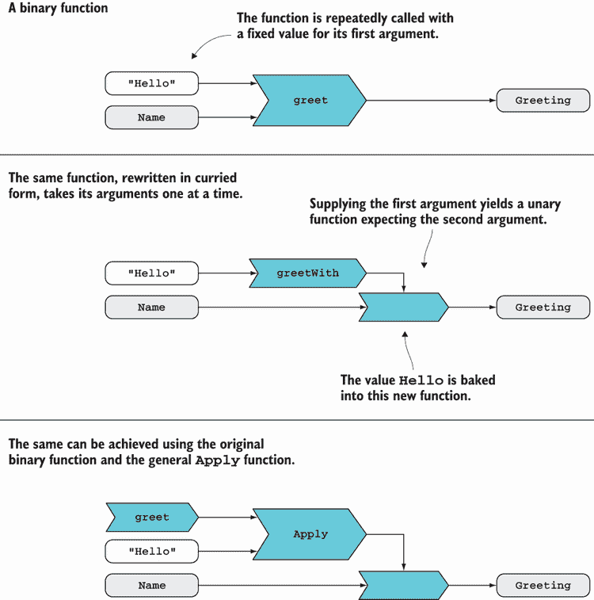
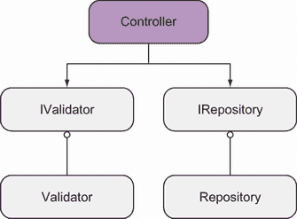
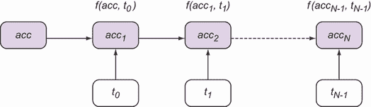

# 9 使用函数构建应用程序的结构

本章涵盖

+   部分应用和柯里化

+   克服方法类型推断的限制

+   模块化和组合应用程序

+   将列表简化为单个值

构建复杂、现实世界的应用程序并非易事。关于这个主题已经写下了整本书，所以这一章绝对不是旨在提供一个全面的视角。我们将关注你可以用来模块化和组合完全由函数组成的应用程序的技术，以及这些技术与通常在面向对象编程中如何实现的结果相比。

我们将逐步实现。首先，你需要了解一个经典但相对低级的函数技术，称为*部分应用*。这项技术允许你编写高度通用的函数，其行为由参数化，然后提供这些参数，获得具有给定参数的更专业化的函数，这些参数已经“固化”在函数中。

然后，我们将探讨如何在实际中应用部分应用来首先指定在启动时可用和纯运行时参数，稍后随着它们的接收而提供。最后，我们将探讨如何进一步采取这种方法，并使用部分应用进行依赖注入，以至于可以完全由函数组成一个应用程序，而不会失去在用对象组合时预期的任何粒度或解耦。

## 9.1 部分应用：分阶段提供参数

想象一下你正在翻新你的房子。你的室内设计师艾达，打电话给弗雷德，她信任的油漆供应商，并告诉她她打算订购的油漆的详细信息，然后派布鲁诺，装饰师，去取所需的油漆量。图 9.1 说明了这个场景。


图 9.1 弗雷德在提供产品之前需要几条信息。这些信息可以由艾达和布鲁诺在不同时间提供。

显然，商店需要知道客户想要购买什么以及需要多少，以便满足请求，在这种情况下，信息是在不同时间点给出的。为什么？好吧，这是 Ada 的责任来选择颜色和品牌（她不会信任布鲁诺记住她确切的选择）。另一方面，布鲁诺的任务是测量表面并计算所需的油漆量。在这个时候，所有必要的信息都可用，布鲁诺可以从供应商那里取走油漆。

我刚才描述的是部分应用的现实生活类比。在编程中，这意味着分阶段向函数提供输入参数。正如我的现实生活例子一样，这与*关注点分离*有关：最好在不同的应用程序生命周期阶段和不同的组件中提供函数所需的参数。

让我们看看代码示例。这里的想法是，你有一个需要几块信息来完成其工作的函数（类似于弗雷德，油漆供应商）。例如，在下面的列表中，我们有 `greet` 函数，它接受一个通用问候语和一个名字，并为给定名字生成个性化的问候语。

列表 9.1 在列表上映射的二进制函数

```
using Name = System.String;
using Greeting = System.String;
using PersonalizedGreeting = System.String;

var greet = (Greeting gr, Name name) => $"{gr}, {name}";

Name[] names = { "Tristan", "Ivan" };

names.Map(n => greet("Hello", n)).ForEach(WriteLine);
// prints: Hello, Tristan
//         Hello, Ivan
```

提示：如果你以前从未使用过部分应用，那么将本节中的示例输入到 REPL 中进行操作，以获得对它如何工作的实际感受是很重要的。

列表 9.1 顶部的 `using` 语句使我们能够给 `string` 类型的特定使用赋予一些语义意义，从而使得函数签名更有意义。你可以更进一步，定义专用类型（如第四章所述），从而确保例如 `PersonalizedGreeting` 不可能意外地作为 `greet` 函数的输入。但就目前的讨论而言，我并不太担心强制执行业务规则——只是关于拥有有意义的、明确的签名，因为我们将会查看很多签名。这是 `greet` 函数的签名：

```
(Greeting, Name) → PersonalizedGreeting
```

然后，我们有一个名字列表，并将 `greet` 映射到列表上，以获得列表中每个名字的问候语。请注意，`greet` 函数始终以“Hello”作为其第一个参数，而第二个参数则随着列表中的每个名字而变化。

这感觉有点奇怪。我们有一个通用的问候语和 *n* 个不同的名字，我们重复了那个问候语 *n* 次。似乎我们是在重复自己。难道不是更好将问候语固定为“Hello”在 `Map` 的作用域之外？这将表达这样一个事实，即决定使用“Hello”作为所有名字的问候语是一个更通用的决策，并且可以首先进行。传递给 `Map` 的函数将只消耗名字。我们如何实现这一点？

在列表 9.1 中，我们无法这样做，因为 `greet` 需要两个参数，而我们使用的是“正常”的函数应用；也就是说，我们以 `greet` 所期望的两个参数来调用 `greet`。（它被称为 *application*，因为我们正在将函数 `greet` 应用到其参数上。）

我们可以通过部分应用来解决此问题。想法是允许一些代码决定通用的问候语，并将其作为第一个参数（就像 Ada 决定颜色那样）传递给 `greet`。这将生成一个新的函数，其中已经内置了“Hello”作为要使用的问候语。然后，其他代码可以调用这个函数，以问候人的名字。

有几种方法可以使这成为可能。你将首先看到如何以一种支持部分应用的方式编写一个特定的函数，然后是如何定义一个通用的 `Apply` 函数，它可以为任何给定的函数启用部分应用。

### 9.1.1 手动启用部分应用

独立提供参数的一种方法是将 `greet` 函数重写如下：

```
var greetWith = (Greeting gr) => (Name name) => $"{gr}, {name}";
```

这个新的函数 `greetWith` 接受一个参数，即通用问候语，并返回一个类型为 `Name` `→` `PersonalizedGreeting` 的新函数。注意，当函数使用其第一个参数 `gr` 被调用时，它被捕获在闭包中，因此“记住”直到返回的函数使用第二个参数 `name` 被调用。你可以这样使用它：

```
var greetFormally = greetWith("Good evening");
names.Map(greetFormally).ForEach(WriteLine);
// prints: Good evening, Tristan
//         Good evening, Ivan
```

我们已经达到了在 `Map` 范围之外修复问候语的目标。注意 `greet` 和 `greetWith` 依赖于相同的实现，但它们的签名不同。让我们比较一下：

```
greet     : (Greeting, Name) → PersonalizedGreeting
greetWith : Greeting → (Name → PersonalizedGreeting)
```

`greet` 接受两个参数并返回一个值。相比之下，`greetWith` 接受一个参数，即 `Greeting`，并返回一个函数，该函数反过来接受一个 `Name` 并返回一个 `PersonalizedGreeting`。

实际上，箭头符号是 *右结合的*：箭头右侧的所有内容都被分组。因此，`greetWith` 签名中的括号是多余的，`greetWith` 的类型通常可以写成以下形式：

```
greetWith : Greeting → Name → PersonalizedGreeting
```

`greetWith` 被称为是 *柯里化* 形式：所有参数都是通过函数调用逐个提供的。

再次强调，`greet` 和 `greetWith` 依赖于相同的实现。变化的是签名以及参数是独立提供的并被捕获在闭包中。这是一个很好的迹象，表明我们应该能够机械地进行部分应用，而无需重写函数。让我们看看如何实现这一点。

### 9.1.2 部分应用的一般化

作为对 `greetWith` 方法所展示方法的更一般替代，我们可以定义一个适配函数，允许你向一个多参数函数提供一个参数，从而生成一个等待接收剩余参数的函数。以下代码片段展示了通用 `Apply` 函数的定义，它将给定值作为第一个参数传递给指定的二元函数：

```
public static Func<T2, R> Apply<T1, T2, R>
(
   this Func<T1, T2, R> f,     ❶
   T1 t1                       ❷
)
=> t2 => f(t1, t2);            ❸
```

❶ 一个二元函数

❷ 第一个参数的值

❸ 返回一个接受原始函数第二个参数的一元函数

`Apply` 接受一个二元函数，对给定的参数进行部分应用，并返回一个接受第二个参数的一元函数。提供的输入参数 `t1` 被捕获在闭包中，产生一个新的函数，当第二个参数提供时，它会调用原始函数 `f`。

我们可以类似地定义 `Apply` 用于更高阶的函数。例如，下面是 `Apply` 对三元函数的定义：

```
public static Func<T2, T3, R> Apply<T1, T2, T3, R>
(
   this Func<T1, T2, T3, R> f,
   T1 t1
)
=> (t2, t3) => f(t1, t2, t3);
```

这个重载接受一个三元函数和一个用作第一个参数的值。它产生一个二元函数，等待剩余的两个参数。可以定义类似的重载用于更高阶的函数，并包含在 `LaYumba.Functional` 中。

注意表达式主体方法和 lambda 表示法如何为我们提供良好的语法支持来定义这种函数转换。这种 `Apply` 的一般定义意味着你不需要手动创建一个像 `greetWith` 这样的函数。相反，你只需使用 `Apply` 给原始的 `greet` 函数提供其第一个参数：

```
var greetInformally = greet.Apply("Hey");
names.Map(greetInformally).ForEach(WriteLine);
// prints: Hey, Tristan
//         Hey, Ivan
```

无论你是使用手动方法还是通用的 `Apply` 函数，你应该开始看到一种模式：我们从一个通用函数（如 `greet`）开始，使用部分应用来创建这个函数的专用版本（如 `greetInformally`）。现在这是一个一元函数，可以传递，使用它的代码甚至不需要意识到这个新函数已经被部分应用。图 9.2 图形总结了我们迄今为止所涵盖的步骤。



图 9.2 比较正常函数应用与部分应用。部分应用允许你分步骤提供参数，以获得内置这些参数并等待后续参数的函数。部分应用可以通过手动操作或使用通用的 `Apply` 函数来启用。

总结来说，部分应用始终是从一般到具体的。它允许你定义通用函数，然后通过提供参数来微调它们的行为。最终，编写这样的通用函数提高了抽象级别，并可能允许更大的代码重用。

### 9.1.3 参数顺序的重要性

`greet` 函数展示了通常良好的参数顺序：更通用的参数，这些参数可能在应用程序的生命周期早期被应用，应该放在前面，然后是更具体的参数。我们在早年就学会了说“你好”，但我们会一直遇到和问候新的人直到变老。

作为一项经验法则，如果你将函数视为一个操作，它的参数通常包括以下内容：

+   该操作将影响的数据。这通常会在后期提供，应该放在最后。

+   一些确定函数将如何操作或函数执行工作所需的依赖项的选项。这些可能需要在早期确定，并应该放在前面。

警告：这种参数顺序有时与我们的扩展方法使用愿望相冲突：不幸的是，我们只能用 `this` 修饰符标记方法参数中的第一个，尽管它可能不是最通用的参数。在这种情况下，你必须选择扩展方法语法或部分应用对你预期的用途是否更可取。

当然，确定参数的最佳顺序并不总是容易。你很快就会看到，即使参数的顺序不符合你的预期用途，你仍然可以使用部分应用。

总结来说，每当您有一个多参数函数，并且希望分离提供不同参数的责任时，您就有很好的理由使用部分应用。然而，在继续使用部分应用的实际用途之前，我们应先解决一个难题。这个问题与类型推断有关，我们将在下一节中解决它。

## 9.2 克服方法解析的怪癖

到目前为止，我们自由地使用了方法、lambda 和委托来表示函数。然而，对于编译器来说，这些都是不同的事物，并且方法的类型推断并不像我们希望的那样好。让我们首先看看事情顺利时会发生什么，比如当我们使用 `Option.Map` 时：

```
Some(9.0).Map(Math.Sqrt) // => 3.0
```

注意，`Map` 有两个类型参数。如果编译器无法推断它们的类型，我们就必须像这样编写前面的代码片段：

```
Some(9.0).Map<double, double>(Math.Sqrt)
```

在这里，名称 `Math.Sqrt` 识别了一个方法，而 `Map` 期望一个类型为 `Func<T, R>` 的委托。更技术地说，`Math.Sqrt` 识别了一个方法组。由于方法重载，可能有多个具有相同名称的方法。编译器足够智能，不仅可以选择正确的重载（在这种情况下，只有一个），还可以推断 `Map` 的类型参数。

这一切都很完美。它使我们不必在方法（或，作为替代，lambda）和委托之间进行转换，也不必指定泛型类型，因为这些可以从方法签名中推断出来。不幸的是，对于需要两个或更多参数的方法，所有这些优点都消失了。

让我们看看如果我们尝试将 `greet` 函数重写为方法会发生什么。在下面的列表中，它被称为 `GreeterMethod`。这是我们想要编写的代码。

列表 9.2 多参数方法类型推断失败

```
PersonalizedGreeting GreeterMethod(Greeting gr, Name name)     ❶
   => $"{gr}, {name}";

Func<Name, PersonalizedGreeting> GreetWith(Greeting greeting)
   => GreeterMethod.Apply(greeting);                           ❷
```

❶ 如果我们将问候函数编写为一个方法...

❷ ...然后这个表达式无法编译。

在这里，我们已经将问候函数编写为一个方法，现在我们想要一个 `GreetWith` 方法来部分应用它到一个特定的问候。不幸的是，这段代码无法编译，因为名称 `GreeterMethod` 识别了一个 `MethodGroup`，而 `Apply` 期望一个 `Func`，编译器并没有为我们进行推断。

局部函数中的类型推断

C# 7 引入了 *局部函数*（在方法作用域内声明的函数），但实际上它们应该被称为 *局部方法*。内部实现上，它们作为方法实现，尽管这没有任何好处（您不能重载它们），所以在类型推断方面，它们与普通方法具有相同的特性。

如果您想使用泛型 `Apply` 为方法提供参数，您必须使用以下列表中的某种形式。您会看到，将多参数方法作为 HOF（高阶函数）的参数使用时，需要复杂的语法。

列表 9.3 将多参数方法作为 HOF 的参数

```
PersonalizedGreeting GreeterMethod(Greeting gr, Name name)
   => $"{gr}, {name}";

Func<Name, PersonalizedGreeting> GreetWith_1(Greeting greeting)
   => FuncExt.Apply<Greeting, Name, PersonalizedGreeting>            ❶
         (GreeterMethod, greeting);

Func<Name, PersonalizedGreeting> GreetWith_2(Greeting greeting)
   => new Func<Greeting, Name, PersonalizedGreeting>(GreeterMethod)  ❷
      .Apply(greeting);
```

❶ 放弃扩展方法语法，并显式提供所有泛型参数

❷ 在调用`Apply`之前，显式地将方法转换为`Func`

我个人认为这两种情况中的语法噪声都是不可接受的。请注意，这些问题是特定于*方法*解析的。如果你使用委托（例如`Func`），这些问题就会消失。以下列表展示了创建委托的不同方式，然后你可以使用`Apply`：

列表 9.4 获取委托实例的不同方式

```
public class TypeInference_Delegate
{
   readonly string separator = ", ";

   // 1\. field
   readonly Func<Greeting, Name, PersonalizedGreeting> GreeterField
      = (gr, name) => $"{gr}, {name}";                              ❶

   // 2\. property
   Func<Greeting, Name, PersonalizedGreeting> GreeterProperty
      => (gr, name) => $"{gr}{separator}{name}";                    ❷

   // 3\. factory
   Func<Greeting, T, PersonalizedGreeting> GreeterFactory<T>()      ❸
      => (gr, t) => $"{gr}{separator}{t}";
}
```

❶ 委托字段的声明和初始化；注意你在这里不能引用`separator`。

❷ 只有 getters 的属性通过`=>`引入其主体。

❸ 作为函数工厂的方法可以有泛型参数。

让我们简要讨论这些选项。声明委托字段似乎是最自然的选择。不幸的是，它并不强大。例如，如果你像列表 9.4 中所示的那样结合声明和初始化，你无法在委托主体中引用任何实例变量，如`separator`。此外，由于字段可以被重新赋值（我们当然不希望在这种情况下这样做），你应该将委托标记为`readonly`。

或者，你可以通过属性公开委托。在公开委托的类中，这相当于只是将`=`替换为`=>`来声明一个只有 getters 的属性。从调用代码的角度来看，这种变化是完全透明的。

但最强大的方式是有一个*工厂方法*：一个仅用于创建你想要的委托的方法。这里的主要区别是，你还可以有泛型参数，这是字段或属性所不可能的。

无论你以何种方式获取委托实例，类型解析都将正常工作，因此，在所有情况下，你可以像这样提供第一个参数：

```
GreeterField.Apply("Hi");
GreeterProperty.Apply("Hi");
GreeterFactory<Name>().Apply("Hi");
```

本节的要点是，如果你想使用接受多参数函数作为参数的高阶函数（HOFs），有时最好放弃使用方法，转而使用`Func`（或者返回`Func`的方法）。虽然`Func`不如方法那样符合惯例，但它们可以节省你显式指定类型参数的语法开销，使代码更易于阅读。

既然你已经了解了部分应用，让我们继续讨论一个相关概念：currying。这是一种假设并可能简化部分应用的技术。

## 9.3 Curried functions: Optimized for partial application

以数学家 Haskell Curry 命名，*currying*是将一个*n*-元函数*f*，它接受参数*t1*，*t2*，...，*tn*，转换为一个一元函数，它接受*t1*并产生一个新的函数，该函数接受*t2*，依此类推，最终在所有参数都给出后返回与*f*相同的结果。换句话说，具有此签名的*n*-元函数

```
(T1, T2, ..., Tn) → R
```

当进行 curry 操作时，具有以下特征：

```
T1 → T2 → ... → Tn → R
```

你在本章的第一节中已经看到了这个例子。这里是一个提醒：

```
var greet = (Greeting gr, Name name) => $"{gr}, {name}";

var greetWith = (Greeting gr) => (Name name) => $"{gr}, {name}";
```

我提到`greetWith`类似于`greet`，但以 curry 形式。确实，比较它们的签名：

```
greet     : (Greeting, Name) → PersonalizedGreeting
greetWith : Greeting → Name → PersonalizedGreeting
```

这意味着你可以像这样调用柯里化的 `greetWith` 函数：

```
greetWith("hello")("world") // => "hello, world"
```

这实际上是两次函数调用，并且它有效地等同于用两个参数调用 `greet`。当然，如果你打算同时传递所有参数，这就没有意义了。但是，当你对部分应用感兴趣时，它就变得很有用。如果一个函数是柯里化的，那么通过调用函数就可以简单地实现部分应用。

```
var greetFormally = greetWith("Good evening");
names.Map(greetFormally).ForEach(WriteLine);
// prints: Good evening, Tristan
//         Good evening, Ivan
```

函数可以像这里的 `greetWith` 一样写成柯里形式；这被称为*手动柯里化*。或者，也可以定义通用的函数，这些函数将接受一个*n*-元函数并将其柯里化。对于二元和三元函数，`Curry` 看起来是这样的：

```
public static Func<T1, Func<T2, R>> Curry<T1, T2, R>
   (this Func<T1, T2, R> f)
    => t1 => t2 => f(t1, t2);

public static Func<T1, Func<T2, Func<T3, R>>> Curry<T1, T2, T3, R>
   (this Func<T1, T2, T3, R> f)
    => t1 => t2 => t3 => f(t1, t2, t3);
```

可以为其他元数的函数定义类似的重载。作为一个练习，请用箭头符号写出前面函数的签名。让我们看看我们如何使用这样一个通用的 `Curry` 函数来柯里化 `greet` 函数：

```
var greetWith = greet.Curry();
var greetNostalgically = greetWith("Arrivederci");

names.Map(greetNostalgically).ForEach(WriteLine);
// prints: Arrivederci, Tristan
//         Arrivederci, Ivan
```

当然，如果你想使用通用的 `Curry` 函数，与 `Apply` 一样，方法解析的注意事项同样适用。

部分应用和柯里化是密切相关的概念，但又是不同的，当你第一次接触它们时，这通常很令人困惑。让我们明确一下这些区别：

+   *部分应用*——你给函数提供的参数少于函数期望的参数，得到一个使用到目前为止提供的参数值特定化的函数。

+   *柯里化*——你没有任何参数；你只是将一个*n*-元函数转换成一个一元函数，可以依次给出参数，最终得到与原始函数相同的结果。

如你所见，柯里化实际上并没有*做*任何事情；相反，它优化了函数以进行部分应用。你可以像我们在本章前面使用通用 `Apply` 函数那样，不进行柯里化就进行部分应用。另一方面，仅仅柯里化本身是没有意义的：你柯里化一个函数（或以柯里形式编写一个函数）是为了更容易地使用部分应用。

部分应用在 FP 中非常常见，以至于在许多函数式语言中，所有函数默认都是柯里化的。因此，在 FP 文献中，箭头符号中的函数签名都是以柯里形式给出的，如下所示：

```
T1 → T2 → ... → Tn → R
```

重要提示：在本书的其余部分，我总是使用柯里符号，即使对于实际上不是柯里化的函数也是如此。

尽管在 C# 中函数默认不是柯里化的，但你仍然可以利用部分应用，通过参数化其行为来编写高度通用且因此广泛可重用的函数。然后你可以使用部分应用来创建你偶尔需要的更具体的函数。如你所见，你可以用不同的方式实现这一点：

+   通过将函数写成柯里形式

+   通过使用 `Curry` 柯里化函数，然后使用后续参数调用柯里化函数

+   通过逐个提供参数使用 `Apply`

你使用哪种技术是个人口味的问题，尽管我个人认为使用 `Apply` 是最直观的。

## 9.4 创建部分应用友好的 API

既然你已经看到了部分应用的基本机制以及如何通过使用 `Func` 而不是方法来绕过类型推断不足，我们可以继续到一个更复杂的场景，在这个场景中我们将使用第三方库和现实世界的需求。

部分应用的一个好场景是当一个函数需要一些在启动时可用且不改变的配置，以及每次调用时都变化的临时参数。在这种情况下，一个引导组件可以提供配置参数，从而获得一个只期望调用特定参数的专用函数。然后，这可以提供给功能最终消费者，从而使其无需了解任何关于配置的信息。

在本节中，我们将探讨这样一个例子：访问 SQL 数据库。想象一个应用程序，像大多数应用程序一样，需要对数据库执行多个查询。让我们从部分应用的角度来考虑这个问题。想象一个用于检索数据的一般函数：

+   它可以被具体化为查询特定的数据库。

+   它可以被进一步具体化为检索特定类型的对象。

+   它可以通过给定的查询和参数进一步具体化。

让我们通过一个简单的例子来探索这个问题。假设我们想要通过 ID 加载一个 `Employee` 或通过姓氏搜索 `Employee`。这些操作可以通过以下签名的函数来捕捉：

```
lookupEmployee          : Guid → Option<Employee>
findEmployeesByLastName : string → IEnumerable<Employee>
```

实现这些函数是我们的高级目标。在低级上，我们将使用 Dapper 库来查询 SQL Server 数据库。¹ 对于检索数据，Dapper 提供了具有以下签名的 `Query` 方法：

```
public static IEnumerable<T> Query<T>
(
   this IDbConnection conn,
   string sqlQuery,
   object param = null,
   SqlTransaction tran = null,
   bool buffered = true
)
```

表 9.1 描述了在调用 `Query` 时我们需要提供的参数，包括类型参数 `T`。在这个例子中，我们将忽略最后两个参数，它们是可选的。

表 9.1 Dapper 的 `Query` 方法参数

| `T` | 应从查询返回的数据中填充的类型。在我们的例子中，这将是一个 `Employee`（Dapper 自动将列映射到字段）。 |
| --- | --- |
| `conn` | 数据库的连接（注意 `Query` 是连接上的扩展方法，但这与部分应用无关）。 |
| `sqlQuery` | 这是你要执行的 SQL 查询的模板，例如 `"SELECT` `*` `FROM EMPLOYEES` `WHERE` `ID` `=` `@Id"`（注意 `@Id` 占位符）。 |
| `param` | 一个其属性用于填充 `sqlQuery` 中占位符的对象。例如，前面的查询需要提供的对象包含一个名为 `Id` 的字段，其值将在 `sqlQuery` 中被评估并渲染，而不是 `@Id`。 |

这是一个关于参数顺序的绝佳例子，因为连接和 SQL 查询可以作为应用程序设置的一部分应用，而 `param` 对象将针对 `Query` 的每次调用而特定。对吗？

噢，实际上，错了！SQL 连接是轻量级对象，应该在查询执行时获取和释放。实际上，正如你可能从第二章中记得的，Dapper 的 API 的标准使用遵循此模式：

```
const string sql = "SELECT 1";

using (var conn = new SqlConnection(connString))
{
   conn.Open();
   var result = conn.Query(sql);
}
```

这意味着我们的第一个参数（连接）不如第二个参数（SQL 模板）通用。但并非一切都已失去。记住，如果你不喜欢你拥有的 API，你可以改变它！这就是适配器函数的作用。²

在本节的其余部分，我们将编写一个更好的支持部分应用的 API，以便创建检索我们感兴趣的数据的专用函数。

### 9.4.1 类型作为文档

虽然 DB 连接必须是短暂的，但用于创建连接的连接字符串在应用程序的生命周期内通常不会改变。它可以在应用程序启动时从配置中读取，之后永远不会改变。因此，连接字符串将是函数检索数据时使用的最一般参数。

让我们应用第 4.2 节中介绍的一个想法（即我们可以使用类型来使我们的代码更具表达性），并为连接字符串创建一个专用类型。以下列表展示了这种方法。

列表 9.5 用于连接字符串的自定义类型

```
public record ConnectionString(string Value)
{
   public static implicit operator string(ConnectionString c) => c.Value;
   public static implicit operator ConnectionString(string s) => new (s);
}
```

当一个字符串不仅仅是字符串，而是数据库连接字符串时，我们将它包装在 `ConnectionString` 中。这可以通过隐式转换轻易完成。例如，在启动时，我们可以从配置中填充它，如下所示：

```
ConnectionString connString = configuration
   .GetSection("ConnectionString").Value;
```

同样的思考方式也适用于 SQL 模板，因此我也定义了一个 `SqlTemplate` 类型，遵循同样的原则。大多数静态类型函数式语言允许你使用一行代码定义自定义类型，基于内置类型，如下所示：

```
type ConnectionString = string
type SqlTemplate = string
```

在 C# 中，这要费点劲，但仍然值得。首先，它使你的函数签名更具意图性：你正在使用类型来记录你的函数做什么。例如，一个函数可以声明它依赖于连接字符串，如下所示。

列表 9.6 使用自定义类型使函数签名更明确

```
public Option<Employee> lookupEmployee
   (ConnectionString conn, Guid id) => //...
```

这比依赖于 `string` 要明确得多。第二个好处是，你现在可以定义 `ConnectionString` 的扩展方法，这在 `string` 上是没有意义的。你将在下一部分看到这一点。

### 9.4.2 数据访问函数的特定化

现在我们已经研究了表示和获取连接字符串的方法，让我们看看执行 DB 查询所需的其他数据，从一般到具体：

+   我们想要检索的数据类型（例如 `Employee`）

+   SQL 查询模板（例如 `"SELECT` `*` `FROM` `EMPLOYEES` `WHERE` `ID` `=` `@Id"`)

+   我们将使用`param`对象来渲染 SQL 模板（例如`new` `{` `Id = "123" }`）

现在是解决方案的核心。我们可以在`ConnectionString`上定义一个扩展方法，它接受我们需要的参数，如下所示。

列表 9.7 一个更适合部分应用的适配函数

```
using Dapper;
using static ConnectionHelper;

public static class ConnectionStringExt
{
   public static Func<object, IEnumerable<T>> Retrieve<T>
   (
      this ConnectionString connStr,                        ❶
      SqlTemplate sql                                       ❶
   )
   => param                                                 ❷
   => Connect(connStr, conn => conn.Query<T>(sql, param));
}
```

❶ 这些值在应用程序启动时可用。

❷ 这个值随着每个查询而变化。

注意，我们依赖于`ConnectionHelper.Connect`，我们在第 2.3 节中实现了它，并且它内部负责打开和释放连接。如果你不记得实现细节没关系；只需注意，在这里，最通用的参数（在整个应用程序生命周期中不会改变的连接字符串）作为第一个参数，而数据库连接本身是短暂的，并且每次查询都会由`Connect`创建一个新的实例。这是先前方法的签名：

```
Retrieve<T> : (ConnectionString, SqlTemplate) → object → IEnumerable<T>
```

函数接收一个连接字符串和一个 SQL 模板。这些值在应用程序启动时已知，因此可以由一个在启动时读取配置以`检索`的组件提供。结果是仍然等待接收一个最终参数：一个包含 SQL 查询参数的对象。例如，这样的函数可以被处理客户端发起的请求的组件使用。希望你现在看到了部分应用与关注点分离之间的关系。

下面的列表显示了如何具体化`Retrieve`以实现我们需要的函数。

列表 9.8 向获取所需签名的函数提供参数

```
ConnectionString conn = configuration
   .GetSection("ConnectionString").Value;

SqlTemplate sel = "SELECT * FROM EMPLOYEES"
   , sqlById = $"{sel} WHERE ID = @Id"
   , sqlByName = $"{sel} WHERE LASTNAME = @LastName";

// queryById : object → IEnumerable<Employee>
var queryById = conn.Retrieve<Employee>(sqlById);                 ❶

// queryByLastName : object → IEnumerable<Employee>
var queryByLastName = conn.Retrieve<Employee>(sqlByName);         ❷

// lookupEmployee : Guid → Option<Employee>
Option<Employee> lookupEmployee(Guid id)                          ❸
   => queryById(new { Id = id }).SingleOrDefault();

// findEmployeesByLastName : string → IEnumerable<Employee>
IEnumerable<Employee> findEmployeesByLastName(string lastName)    ❸
   => queryByLastName(new { LastName = lastName });
```

❶ 连接字符串和 SQL 查询是固定的。

❷ 连接字符串和 SQL 查询是固定的。

❸ 我们打算实现的函数

在这里，我们通过具体化先前定义的`Retrieve`方法来定义`queryById`和`queryByLastName`。现在我们有两个接受`param`对象的单参数函数，它封装了用于替换`SqlTemplate`中占位符的值。

剩下的工作就是定义`lookupEmployee`和`findEmployeesByLastName`，它们具有我们在本节开头设定的签名。这些函数作为适配函数，将它们的输入参数转换为适当填充的`param`对象。

备注：能够给`Retrieve`提供连接字符串并获取一个可以由返回的数据类型参数化的函数将是非常好的。毕竟，我们将使用相同的连接字符串来检索`Employee`和其他实体。不幸的是，C#不允许我们延迟泛型类型参数的解析。

在这个例子中，你看到了我们从一个针对任何 SQL 数据库运行任何查询的极其通用的函数开始，最终得到了高度专业化的函数。请注意，我们没有明确使用`Curry`或`Apply`；相反，`Retrieve`被定义为可以分步骤提供参数。

## 9.5 模块化和组合应用程序

随着应用程序的增长，我们需要对它们进行模块化，并将它们分解成组件。例如，在第八章中，你看到了处理预订转账请求的端到端示例。我们将所有代码放在控制器中，到结束时，控制器的成员列表看起来如下面的列表所示。

列表 9.9 过于负责的控制器？

```
public class MakeTransferController : ControllerBase
{
   DateTime now;
   static readonly Regex regex = new Regex("^[A-Z]{6}[A-Z1-9]{5}$");
   string connString;
   ILogger<MakeTransferController> logger;

   public IActionResult MakeTransfer([FromBody] MakeTransfer request)

   IActionResult OnFaulted(Exception ex)

   Validation<Exceptional<Unit>> Handle(MakeTransfer request)

   Validation<MakeTransfer> Validate(MakeTransfer cmd)
   Validation<MakeTransfer> ValidateBic(MakeTransfer cmd)
   Validation<MakeTransfer> ValidateDate(MakeTransfer cmd)

   Exceptional<Unit> Save(MakeTransfer transfer)
}
```

如果这是一个现实世界的银行应用程序，你将不仅仅有两个规则来检查转账请求的有效性，而是会有几十个规则。你还会处理身份验证和会话管理、仪表化等功能。简而言之，控制器会迅速变得太大，你需要将其分解成具有更多离散责任的不同组件。这使得你的代码更加模块化和易于管理。

模块化的另一个主要动力是代码重用：例如，会话管理或授权的逻辑可能需要由几个控制器使用，因此应该放置在单独的组件中。一旦将应用程序分解成组件，你需要将其重新组合，以便所有必需的组件可以在运行时协作。

在本节中，我们将探讨如何处理模块化以及面向对象和函数式方法在这方面的差异。我们将通过重构 `MakeTransferController` 来说明这一点。

### 9.5.1 面向对象编程中的模块化

在面向对象编程（OOP）中，模块性通常是通过将责任分配给不同的类，并通过接口捕获这些责任来获得的。例如，你可能定义一个 `IValidator` 接口用于验证，以及一个 `IRepository` 接口用于持久化，如下面的列表所示。

列表 9.10 面向对象编程中的接口捕获组件的责任

```
public interface IValidator<T>
{
   Validation<T> Validate(T request);
}

public interface IRepository<T>
{
   Option<T> Lookup(Guid id);
   Exceptional<Unit> Save(T entity);
}
```

控制器将依赖于这些接口来完成其工作，如图 9.3 所示。



图 9.3 在面向对象设计中，高级组件（如 `Controller`）通过接口消费低级组件（如 `Repository`）。

这遵循一种称为 *依赖反转* 的模式，根据该模式，高级组件（如控制器）不是直接消费低级组件，而是通过抽象来消费，这通常被理解为低级组件（如验证器和存储库）实现的接口。³ 这种方法有几个好处：

+   *解耦*—你可以更换存储库实现，将其从写入数据库更改为写入队列，而这不会影响控制器。你只需要更改两者之间的连接方式。

+   *可测试性*—你可以通过注入一个假的 `IRepository` 来对处理器进行单元测试，而无需访问数据库。

与依赖反转相关的高成本也是相当高的：

+   接口的数量激增，增加了样板代码，并使代码难以导航。

+   组合应用程序的启动逻辑通常远非简单。

+   构建用于可测试性的模拟实现可能很复杂。

为了管理这种额外的复杂性，通常会使用第三方框架；即，IoC 容器和模拟框架。如果我们遵循这种方法，控制器的实现最终看起来就像下面列表中所示的那样。

列表 9.11 小规模函数式和大规模面向对象

```
public class MakeTransferController : ControllerBase
{
   IValidator<MakeTransfer> validator;       ❶
   IRepository<MakeTransfer> repository;     ❶

   public MakeTransferController(IValidator<MakeTransfer> validator
      , IRepository<MakeTransfer> repository)
   {
      this.validator = validator;            ❷
      this.repository = repository;          ❷
   }

   [HttpPost, Route("api/transfers/book")]
   public IActionResult TransferOn([FromBody] MakeTransfer transfer)
      => validator.Validate(transfer)        ❸
         .Map(repository.Save)               ❸
         .Match
         (
            Invalid: BadRequest,
            Valid: result => result.Match<IActionResult>
            (
               Exception: _ => StatusCode(500, Errors.UnexpectedError),
               Success: _ => Ok()
            )
         );
}
```

❶ 依赖项是对象。

❷ 依赖项在构造函数中注入。

❸ 消耗依赖项

你可以说，前面的实现在小规模上是功能性的，在大规模上是面向对象的。主要组件（控制器、验证器、存储库）确实是对象，程序行为编码在这些对象的方法上。另一方面，许多功能性概念随后被用于方法的实现以及它们的签名定义中。

在整体面向对象软件架构中使用功能性技术的方法是整合函数式编程（FP）与面向对象编程（OOP）的一种完全有效的方式。也有可能将函数式方法推进到所有行为都被函数捕获的程度。你将在下一部分看到这一点。

### 9.5.2 FP 中的模块化

如果面向对象编程的基本单元是对象，那么在函数式编程中它们就是函数。函数式编程中的模块化是通过将责任分配给函数，然后通过函数组合来实现的。在函数式方法中，我们不需要定义接口，因为函数签名已经提供了我们需要的所有接口。

例如，在第三章中，你看到需要一个知道当前时间的验证器类不需要依赖于服务，而只需依赖于一个返回当前时间的函数。下面的列表提供了一个提醒。

列表 9.12 将函数作为依赖项注入

```
public record DateNotPastValidator(Func<DateTime> Clock)
   : IValidator<MakeTransfer>
{
   public Validation<MakeTransfer> Validate(MakeTransfer transfer)
      => transfer.Date.Date < Clock().Date
         ? Errors.TransferDateIsPast
         : Valid(transfer);
}
```

总的来说，如果时钟不是一个可以调用来获取当前时间的函数，那它是什么呢？但让我们更进一步：为什么你甚至需要`IValidator`接口呢？毕竟，验证器如果不是一个可以用来确定给定对象是否有效的函数，那又是什么呢？让我们改用一个委托来表示验证：

```
// Validator<T> : T → Validation<T>
public delegate Validation<T> Validator<T>(T t);
```

如果我们遵循这种方法，`MakeTransferController`不是依赖于一个`IValidator`对象，而是依赖于一个`Validator`函数。要实现一个`Validator`，你不需要有一个存储依赖项的字段的对象；相反，依赖项可以作为函数参数传递，如下一个列表所示。

列表 9.13 将依赖项作为函数参数传递

```
public static Validator<MakeTransfer> DateNotPast(Func<DateTime> clock)
   => transfer
   => transfer.Date.Date < clock().Date
      ? Errors.TransferDateIsPast
      : Valid(transfer);
```

在这里，`DateNotPast`是一个高阶函数（HOF），它接受一个函数`clock`（它需要知道当前日期的依赖项）并返回一个类型为`Validator`的函数。注意这种方法如何让你免于创建接口、在构造函数中注入它们以及将它们存储在字段中的整个仪式。

让我们看看如何创建一个`Validator`。在启动应用程序时，你会给`DateNotPast`一个从系统时钟读取的函数：

```
Validator<MakeTransfer> val = DateNotPast(() => DateTime.UtcNow());
```

然而，出于测试目的，你可以提供一个返回固定日期的`clock`：

```
var uut = DateNotPast(() => new DateTime(2020, 20, 10));
```

注意，这实际上是一种部分应用：`DateNotPast`是一个二元函数（以柯里化形式），它需要一个`clock`和一个`MakeTransfer`来计算其结果。你在组合应用（或单元测试的*arrange*阶段）时提供第一个参数，在处理传入请求（或单元测试的*act*阶段）时提供第二个参数。

除了验证器之外，`MakeTransferController`还需要一个依赖项来持久化`MakeTransfer`请求数据。如果我们打算使用函数，我们可以用以下签名来表示这一点：

```
MakeTransfer → Exceptional<Unit>
```

再次，我们可以从一个通用的函数开始，该函数使用此签名写入数据库来创建这样一个函数：

```
TryExecute : ConnectionString → SqlTemplate → object → Exceptional<Unit>
```

我们可以用配置中的连接字符串和要执行的命令的 SQL 模板来参数化它。这与你在 9.3 节中看到的`Retrieve`函数类似，所以我在这里省略了全部细节。我们的控制器实现现在将看起来像这样：

```
public class MakeTransferController : ControllerBase
{
   Validator<MakeTransfer> validate;
   Func<MakeTransfer, Exceptional<Unit>> save;

   [HttpPost, Route("api/transfers/book")]
   public IActionResult MakeTransfer([FromBody] MakeTransfer cmd)
      => validate(cmd).Map(save).Match( //...
}
```

如果我们将这种方法推向逻辑结论，我们应该质疑为什么我们还需要控制器，因为所有我们使用的逻辑都可以被捕获在类型为的函数中：

```
MakeTransfer → IResult
```

这是一个接受从 HTTP 请求体反序列化的`MakeTransfer`命令的函数，并返回一个`IResult`，ASP.NET 使用它来适当地填充 HTTP 响应。更确切地说，该函数还需要接受它所依赖的`validate`和`save`函数。以下列表显示了这种方法。

列表 9.14 我们用例的最高级函数

```
using static Microsoft.AspNetCore.Http.Results;    ❶

static Func<MakeTransfer, IResult> HandleSaveTransfer
(
   Validator<MakeTransfer> validate,               ❷
   Func<MakeTransfer, Exceptional<Unit>> save      ❷
)
=> transfer                                        ❸
=> validate(transfer).Map(save).Match
   (
      Invalid: err => BadRequest(err),
      Valid: result => result.Match
      (
         Exception: _ => StatusCode(StatusCodes.Status500InternalServerError),
         Success: _ => Ok()
      )
   );
```

❶ 定义了`Ok`、`BadRequest`等函数，这些函数用于填充`IResult`

❷ 处理命令所需的依赖项

❸ API 接收到的命令

这基本上与我们的`MakeTransferController`方法相同，只是有几个不同之处：

+   *依赖项不是存储在字段中，而是作为参数传递的函数。我们期望在应用程序启动时提供`validate`和`save`，从而得到一个接受`MakeTransfer`的函数，该函数与每个传入请求一起调用。

+   *代码使用像`OK`和`BadRequest`这样的函数来填充`IResult`。这些作为静态方法在`Microsoft.AspNetCore.Http.Results`中公开。相比之下，之前的实现（列表 9.11）使用了从`ControllerBase`继承的同等名称的方法。

现在，我们需要注册这个函数，以便当客户端向相应的路由发送 HTTP 请求时实际被调用。让我们接下来这么做。

### 9.5.3 将函数映射到 API 端点

你可以将 Web API 视为一个函数，它接受 HTTP 请求作为输入，并产生 HTTP 响应作为输出。这样的函数会如何工作？它会查看请求的路由，并将请求传递给相应的函数，因此，一组函数，每个 API 端点一个。从概念上讲，将 API 视为一组函数很容易理解。然而，长期以来，使用 ASP.NET 将这个想法转化为实践并不实用，因为 ASP.NET 优先考虑 MVC 控制器作为创建 Web API 的方式。

这在 .NET 6 中发生了彻底的变化，它包括 *最小 API*，这是一个允许你简单地将函数映射到 API 端点的特性。这代表了一个巨大的转变！多年来，我们在 C# 中有函数式特性，但受限于面向对象的框架，包括 ASP.NET。最小 API 允许你从头开始以函数式风格构建。

提示：如果你不能使用 .NET 6，你仍然可以通过使用名为 Feather HTTP 的包以函数式风格构建 Web API。Feather HTTP 是后来成为 .NET 6 最小 API 的第一个版本。有关如何引用 Feather HTTP 的最新说明，请参阅 [`github.com/featherhttp/framework`](https://github.com/featherhttp/framework)。

使用最小 API，你可以用几行代码就配置一个 Web API。

列表 9.15 配置最小 Web API

```
using Microsoft.AspNetCore.Builder;

var app = WebApplication.Create();          ❶

app.MapGet("/", () => "Hello World!");      ❷

await app.RunAsync();                       ❸
```

❶ 创建一个 Web 应用程序

❷ 配置端点

❸ 开始监听请求

如你所见，你只需创建一个 `WebApplication`，然后使用 `MapGet`、`MapPost` 等方法，提供一个路由以及处理该路由请求的函数。这与在其他语言中非常流行的微 Web 框架相一致。

顶级语句

之前的列表使用了 *顶级语句*，这是 C# 9 中引入的一个特性。你可以有一个包含松散语句的单个文件，这将作为你应用程序的入口点（之前这些语句会被包裹在 `Program.Main` 中）。

如果你正在编写最小 API，将你的 API 配置放在入口点文件中是有意义的，可能使用顶级语句。在这个文件中，你可以将你应用程序的所有端点映射到项目中其他文件中定义的函数。

下面的列表展示了另一个稍微复杂一些的端点。这个端点接收一个 `Todo` 对象并将其保存到数据库中。

列表 9.16 配置 POST 请求

```
app.MapPost("/todos", async
   (
      [FromServices] TodoDbContext db,    ❶
      Todo todo                           ❷
   ) =>
   {
       await db.Todos.AddAsync(todo);     ❸
       await db.SaveChangesAsync();       ❸

       return new StatusCodeResult(204);  ❹
   });
```

❶ 此依赖项必须注册。

❷ 反序列化请求体

❸ 写入数据库

❹ 填充响应

如你所见，最小 API 提供了 MVC 控制器中可用的所有优点（依赖注入、反序列化、处理异步处理等），但形式更为简洁。同样，在我们的 BOC 应用程序中，我们可以简单地将列表 9.14 中定义的处理程序插入到 `WebApplication` 中。然后，应用程序的入口点将看起来像这样：

```
var app = WebApplication.Create();
var handleSaveTransfer = ConfigureSaveTransferHandler(app.Configuration);

app.MapPost("/Transfer/Future", handleSaveTransfer);

await app.RunAsync();
```

剩下的只是实现`ConfigureSaveTransferHandler`，在那里我们设置将在我们的`MakeTransfer`处理程序中使用的依赖项。以下列表显示了此设置。

列表 9.17 为用例连接所需函数

```
static Func<MakeTransfer, IResult>
   ConfigureSaveTransferHandler(IConfiguration config)
{
   ConnectionString connString
      = config.GetSection("ConnectionString").Value;
   SqlTemplate InsertTransferSql = "INSERT ...";

   var save = connString.TryExecute(InsertTransferSql);   ❶

   var validate = DateNotPast(() => DateTime.UtcNow);     ❷

   return HandleSaveTransfer(validate, save);             ❸
}
```

❶ 设置持久性

❷ 设置验证

❸ 将两个合并到主工作流程中

在这里，我们连接了各个部分：我们给我们的通用`TryExecute`提供所有它需要的参数，以便在需要时将`MakeTransfer`保存到数据库中；我们给`DateNotPast`一个时钟；最后，我们将这两个结果函数都传递给我们的逻辑中的主函数（列表 9.14）。

那就结束了！你可以看到我们如何仅使用函数构建整个用例：没有接口，没有存储库——只是函数（一个用于保存数据的函数，一个用于验证的函数，一个用于在处理请求时结合两者的函数）。当你看的时候，它实际上非常干净和简单。

我们仍然只是简单地应用一条验证规则，但在第 9.6 节中，我们将为几个规则提供服务。首先，让我们讨论一下在这个例子中 OO 和功能方法是如何排列的。

### 9.5.4 比较两种方法

在我刚刚展示的功能方法中，所有依赖都作为函数注入。请注意，使用这种方法，你仍然享有与依赖倒置相关的优势：

+   *解耦*—一个函数对其所消费的函数的实现细节一无所知。

+   *可测试性*—当测试这些函数中的任何一个时，你可以简单地传递给它返回可预测结果的函数。

你也减轻了与其面向对象版本中依赖倒置相关的一些问题：

+   你不需要定义任何接口。

+   这使得测试更容易，因为你不需要设置模拟对象。

例如，以下列表展示了本节中开发的用例的测试。注意，当依赖是函数时，可以编写不使用模拟对象的单元测试。

列表 9.18 无模拟对象的单元测试

```
[Test]
public void WhenValid_AndSaveSucceeds_ThenResponseIsOk()
{
   var handler = HandleSaveTransfer
   (
      validate: transfer => Valid(transfer),    ❶
      save: _ => Exceptional(Unit())            ❶
   );

   var result = controller.MakeTransfer(MakeTransfer.Dummy);

   Assert.AreEqual(typeof(OkResult), result.GetType());
}
```

❶ 注入返回可预测结果的函数

到目前为止，功能方法似乎更可取。还有另一个差异需要指出。在 OO 实现（列表 9.10）中，控制器依赖于以下定义的`IRepository`接口：

```
public interface IRepository<T>
{
   Option<T> Lookup(Guid id);
   Exceptional<Unit> Save(T entity);
}
```

但请注意，控制器只使用了`Save`方法。这违反了*接口隔离原则*（ISP），该原则指出，客户端不应该依赖于它们不使用的方法。想法是，仅仅因为你在信任你的 15 岁孩子保管你的房子钥匙，并不意味着他们应该有你的车钥匙。`IRepository`接口实际上应该被拆分为两个单方法接口，控制器应该依赖于一个更小的接口，如下所示：

```
public interface ISaveToRepository<T>
{
   Exceptional<Unit> Save(T entity);
}
```

这进一步增加了应用程序中的接口数量。如果你足够坚持 ISP（接口隔离原则），最终你会得到大量只包含一个方法的接口，这些接口传达的信息与函数签名相同，最终使得仅仅注入函数的方法更简单。

（当然，如果控制器确实需要读取和写入两个函数，那么在函数式风格中，我们就必须注入两个函数，从而增加依赖项的数量。通常，函数式风格更为明确。）

为了完成这个用例的实现，我们需要考虑的不是一条，而是多条验证规则。在面向对象编程（OOP）中，你可以使用一个实现 `IValidator` 的复合验证器，并在内部使用一系列特定的 `IValidator`。但我们要以函数式风格来完成这个任务，并有一个 `Validator` 函数，它内部组合多个 `Validator` 的规则。我们将在下一节中探讨这个问题，但为了做到这一点，我们必须首先退一步，看看将值列表缩减为一个单一值的一般模式。

## 9.6 将列表缩减为一个单一值

将值列表缩减为一个单一值是一个常见的操作，但我们之前还没有讨论过。在函数式编程（FP）的术语中，这个操作被称为 *折叠* 或 *缩减*，这些是在大多数语言或库以及 FP 文献中会遇到的名字。典型地，LINQ 使用不同的名字：`Aggregate`。如果你已经熟悉 `Aggregate`，可以跳过下一个小节。

### 9.6.1 LINQ 的 Aggregate 方法

注意，我们之前使用的大多数与 `IEnumerable` 相关的函数也返回一个 `IEnumerable`。例如，`Map` 接受一个包含 *n* 个项目的列表，并返回另一个包含 *n* 个项目的列表，可能类型不同。`Where` 和 `Bind` 也保持在抽象内部；它们接受一个 `IEnumerable` 并返回一个 `IEnumerable`，尽管元素的数量和类型可能会改变。

`Aggregate` 与这些函数不同，因为它接受一个包含 *n* 个项目的列表，并返回恰好一个项目（就像你可能熟悉的 SQL 聚合函数 `COUNT`、`SUM` 和 `AVERAGE` 一样）。

给定一个 `IEnumerable<T>`，`Aggregate` 接受一个初始值，称为累加器（或种子），以及一个累加函数（一个接受累加器和列表中的元素并返回累加器新值的二元函数）。然后 `Aggregate` 遍历列表，将函数应用于累加器的当前值和列表中的每个元素。`Aggregate` 的签名是

```
IEnumerable<T> → Acc → (Acc → T → Acc) → Acc
```

例如，你可以有一个柠檬的列表，并将其汇总成一杯柠檬汁。累加器是一个空杯子，如果柠檬列表为空，这就是你得到的结果。累加函数接受一个杯子和一个单独的柠檬，并返回一个挤过柠檬的杯子。给定这些参数，`Aggregate` 遍历列表，将每个柠檬挤入杯子中，最后返回包含所有柠檬汁的杯子。

图 9.4 以图形方式展示了它。如果列表为空，`Aggregate` 返回给定的累加器，*acc*。如果它包含一个项目，*t*[0]，它返回将 *f* 应用到 *acc* 和 *t*[0] 的结果；让我们称这个值为 *acc*[1]。如果它包含更多项目，它将计算 *acc*[1]，然后应用 *f* 到 *acc*[1] 和 *t*[1] 以获得 *acc*[2]，依此类推，最终返回 *acc[N]* 作为结果：*acc* 可以看作是一个初始值，在它之上应用列表中的所有值使用给定的函数。



图 9.4 使用 `Aggregate` 将列表缩减为一个单一值

`Sum` 函数（在 LINQ 中可以独立使用）是 `Aggregate` 的一个特例。一个空列表中所有数字的总和是多少？当然是 0！这就是我们的累加器值。二进制函数仅仅是加法，所以我们可以像下面列表所示那样表达 `Sum`。

列表 9.19 `Sum` 作为 `Aggregate` 的特例

```
Range(1, 5).Aggregate(0, (acc, i) => acc + i) // => 15
```

注意，这会展开成以下内容：

```
((((0 + 1) + 2) + 3) + 4) + 5
```

更一般地，`ts.Aggregate(acc, f)` 展开成

```
f(f(f(f(acc, t0), t1), t2), ... tn)
```

`Count` 也可以看作是 `Aggregate` 的一个特例：

```
Range(1, 5).Aggregate(0, (count, _) => count + 1) // => 5
```

注意，累加器的类型不一定是列表项的类型。例如，假设我们有一个项目列表，我们想要将它们添加到一个树中。我们列表中的类型可能是 `T`，而累加器的类型将是 `Tree<T>`。以下列表显示了我们可以从一个空的树作为累加器开始，并在遍历列表时添加每个项目。

列表 9.20 使用 `Aggregate` 创建列表中所有项目的树

```
Range(1, 5).Aggregate(Tree<int>.Empty, (tree, i) => tree.Insert(i))
```

在这个例子中，我假设 `tree.Insert(i)` 返回一个包含新插入值的树。

`Aggregate` 是一个如此强大的方法，以至于我们可以用 `Aggregate` 来实现 `Map`、`Where` 和 `Bind`（我建议作为练习来做）。还有一个不那么通用的重载版本，它不接收累加器参数，而是使用列表的第一个元素作为累加器。这个重载版本的签名是

```
IEnumerable<T> → (T → T → T) → T
```

当使用这个重载版本时，结果类型与列表中元素的类型相同，并且列表不能为空。

### 9.6.2 聚合验证结果

现在你已经知道了如何将值列表缩减为一个单一值，让我们应用这个知识，看看我们如何将验证器列表缩减为一个单一验证器。为了做到这一点，我们需要实现一个具有以下类型的函数

```
IEnumerable<Validator<T>> → Validator<T>
```

注意，因为 `Validator` 本身就是一个函数类型，所以前面的类型展开成这样：

```
IEnumerable<T → Validation<T>> → T → Validation<T>
```

首先，我们需要决定我们希望组合验证如何工作：

+   *快速失败*——如果验证应该优化效率，则组合验证应该在任何一个验证器失败时立即失败，从而最小化资源的使用。如果你从应用程序中以编程方式验证请求，这是一个很好的方法。

+   *收集错误*——您可能希望识别所有被违反的规则，以便在再次请求之前进行修复。当通过表单验证用户请求时，这是一个更好的方法。

快速失败策略更容易实现：每个验证器都返回一个 `Validation`，`Validation` 暴露了一个 `Bind` 函数，该函数仅在状态为 `Valid` 时应用绑定函数（就像 `Option` 和 `Either` 一样），因此我们可以使用 `Aggregate` 遍历验证器列表并将每个验证器绑定到运行结果。以下列表显示了这种方法。

列表 9.21 使用 `Aggregate` 应用列表中的所有验证器

```
public static Validator<T> FailFast<T>
   (IEnumerable<Validator<T>> validators)
   => t
   => validators.Aggregate(Valid(t)
      , (acc, validator) => acc.Bind(_ => validator(t)));
```

注意，`FailFast` 函数接受一个 `Validator` 列表并返回一个 `Validator`：一个期望类型为 `T` 的对象进行验证的函数。在接收到有效的 `t` 后，它使用 `Valid(t)` 作为累加器遍历验证器列表（如果验证器列表为空，则 `t` 是有效的）并将列表中的每个验证器应用到累加器上。从概念上讲，对 `Aggregate` 的调用如下所示：

```
Valid(t)
   .Bind(validators[0]))
   .Bind(validators[1]))
   ...
   .Bind(validators[n - 1]));
```

由于`Validation`中对`Bind`的定义，当验证器失败时，后续的验证器将被跳过，整个验证失败。

并非所有验证的成本都相同。例如，使用正则表达式验证 BIC 代码是否格式正确（如列表 8.7 所示）是便宜的。假设您还需要确保给定的 BIC 代码识别一个现有的银行分支。这可能涉及数据库查找或远程调用一个包含有效代码列表的服务，这显然更昂贵。

为了确保整体验证效率，您需要相应地排序验证者列表。在这种情况下，您需要首先应用（便宜）的正则表达式验证，然后才是（昂贵）的远程查找。

### 9.6.3 收集验证错误

相反的方法是优先考虑*完整性*，包括所有失败的验证的细节。在这种情况下，您不希望失败阻止进一步的计算；相反，您希望确保所有验证器都运行，并且如果有的话，所有错误都被收集。如果您正在验证一个包含许多字段的表单，并且希望用户看到他们需要修复的所有内容以便进行有效提交，这很有用。以下列表显示了我们可以如何重写结合不同验证器的函数。

收集所有失败验证器的错误

```
public static Validator<T> HarvestErrors<T>
   (IEnumerable<Validator<T>> validators)
   => t =>
{
   var errors = validators
      .Map(validate => validate(t))     ❶
      .Bind(v => v.Match(
         Invalid: errs => Some(errs),   ❷
         Valid: _ => None))             ❸
      .ToList();

   return errors.Count == 0             ❹
      ? Valid(t)
      : Invalid(errors.Flatten());
};
```

❶ 独立运行所有验证器

❷ 收集验证错误

❸ 忽略通过验证

❹ 如果没有错误，整体验证通过。

在这里，我们不是使用 `Aggregate`，而是使用 `Map` 将验证器列表映射到对要验证的对象运行验证器的结果。这确保了所有验证器都是独立调用的，我们最终得到一个 `IEnumerable` 的 `Validation`。

然后，我们感兴趣的是收集所有错误。为此，我们使用`Option`。将`Invalid`映射到包含错误的`Some`包装，将`Valid`映射到`None`。记住，从第六章中，`Bind`可以用来从`Option`列表中过滤`None`，这正是我们在下面所做的事情，以获得所有错误的列表。因为每个`Invalid`都包含一个错误列表，所以`errors`实际上是一个列表的列表。在失败的情况下，我们需要将其展平成一个一维列表，并使用它来填充一个`Invalid`。如果没有错误，我们返回正在验证的对象，并用`Valid`包装。⁴

## 练习

1.  二元算术函数的偏应用：

    +   编写一个名为`Remainder`的函数，该函数计算整数除法的余数（适用于负输入值！）。注意参数的预期顺序并不是偏应用最可能需要的顺序（你更有可能偏应用除数）。

    +   编写一个`ApplyR`函数，该函数将给定二进制函数的最右侧参数传递给它。（尽量在不查看`Apply`实现的情况下完成。）以箭头符号表示`ApplyR`的签名，包括柯里化和非柯里化形式。

    +   使用`ApplyR`创建一个函数，该函数返回任何数字除以 5 的余数。

    +   编写一个`ApplyR`的重载版本，将三元函数的最右侧参数传递给它。

1.  三元函数：

    +   定义一个包含三个字段的`PhoneNumber`类：号码类型（家庭、手机等）、国家代码（'it'、'uk'等）和号码。`CountryCode`应该是一个自定义类型，具有到和从`string`的隐式转换。

    +   定义一个三元函数，根据这些字段的值创建一个新的数字。你的工厂函数的签名是什么？

    +   使用偏应用创建一个二元函数，该函数创建一个英国号码，然后再创建一个一元函数，该函数创建一个英国手机号码。

1.  到处都是函数：你可能仍然觉得对象最终比函数更强大。当然，一个日志对象应该公开`Debug`、`Info`和`Error`等相关操作的方法？为了证明这并不一定如此，挑战自己编写一个简单的日志机制（将日志记录到控制台即可），该机制不需要任何类或结构体。你仍然应该能够将一个`Log`值注入到消费者类或函数中，公开`Debug`、`Info`和`Error`操作，如下所示：

    ```
    void ConsumeLog(Log log)
       => log.Info("look! no classes!");
    ```

1.  开放练习：在你的日常编码中，开始更加关注你编写和使用的函数的签名。参数的顺序是否合理；它们是否从一般到具体？是否有某个参数你总是用相同的值调用，以便可以偏应用它？你是否有时编写相同代码的相似变体，并且可以将这些代码泛化成参数化函数？

1.  以`Aggregate`为依据实现`IEnumerable`的`Map`、`Where`和`Bind`。

## 摘要

+   部分应用意味着逐步提供函数的参数，实际上是在每次提供参数时创建一个更专业的函数。

+   柯里化意味着改变函数的签名，使其一次接受一个参数。

+   部分应用允许你通过参数化函数的行为，然后提供参数以获得越来越专业的函数，从而编写高度通用的函数。

+   参数的顺序很重要：你首先给出最左边的参数，这样函数应该从一般到具体声明其参数。

+   当在 C#中处理多参数函数时，方法解析可能会出现问题，并导致语法开销。这可以通过依赖于`Func`而不是方法来克服。

+   你可以通过将它们声明为参数来注入函数所需的依赖项。这允许你完全由函数组成你的应用程序，而不会牺牲关注点的分离、解耦和可测试性。

* * *

¹ Dapper 是一个轻量级的 ORM，因其速度快、使用简单而受到很多欢迎；我们首次在第二章中使用它。你可以在 GitHub 上找到它，网址为[`github.com/StackExchange/dapper-dot-net`](https://github.com/StackExchange/dapper-dot-net)，你可以在那里找到更多文档。

² 我们在第二章中讨论了适配器函数：如果你不喜欢函数的签名，你可以通过定义一个调用另一个函数并公开更适合你需求的接口的函数来改变它。

³ 注意，依赖注入和依赖反转之间有一个区别。*依赖注入*要通用得多：这意味着你正在注入一个类、方法或函数所需的某物。例如，如果你注入一个具体实现、原始值或配置对象，你正在使用依赖注入，但不是依赖反转。*依赖反转*依赖于依赖注入，但反之则不然。

⁴ 实际上，使用我们尚未介绍的应用程序和遍历工具，有更简单的方法来完成这项任务。你将在第十五章中看到这一点。
