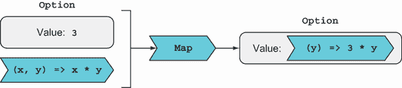
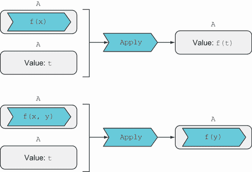

# 10 高效使用多参数函数

本章涵盖

+   使用提升类型与多参数函数一起使用

+   使用 LINQ 语法与任何单调类型

+   基于属性的测试基础

本章的主要目标是教会你如何在 *effectful* 类型世界中使用多参数函数，因此标题中的“effectively”也是一个双关语！记得在 6.6.1 节中，effectful 类型包括 `Option`（添加了可选性效果）、`Exceptional`（异常处理）、`IEnumerable`（聚合）等。在第三部分中，你将看到更多与状态、惰性和异步相关的效果。

随着你更多地使用函数式编程，你将严重依赖这些效果。你可能已经大量使用了 `IEnumerable`。如果你接受 `Option` 和一些 `Either` 变体类型可以为你的程序增加鲁棒性的事实，你很快就会在大部分代码中使用提升类型。

尽管你已经看到了像 `Map` 和 `Bind` 这样的核心函数的强大功能，但你还没有看到一项重要的技术：如何在你的工作流程中集成多参数函数，因为 `Map` 和 `Bind` 都接受单元函数。

结果表明，有两种可能的方法：applicative 和 monadic 方法。我们首先将查看 applicative 方法，它使用 `Apply` 函数（你还没有见过的核心函数）。然后我们将重新审视 monads，你将看到如何使用 `Bind` 与多参数函数，以及 LINQ 语法如何有助于这个领域。然后我们将比较两种方法，并了解为什么在不同的场景中两者都可以很有用。在这个过程中，我还会介绍与 monads 和 applicatives 相关的一些理论，并介绍一种称为 *基于属性的测试* 的单元测试技术。

## 10.1 提升世界中的函数应用

在本节中，我将介绍 *applicative* 方法，该方法依赖于一个新函数 `Apply` 的定义，该函数在提升的世界中执行函数应用。`Apply`，就像 `Map` 和 `Bind` 一样，是 FP 中的核心函数之一。

为了热身，启动 REPL 并像往常一样导入 `LaYumba.Functional` 库。然后，输入以下内容：

```
var doubl = (int i) => i * 2;

Some(3).Map(doubl) // => Some(6)
```

到目前为止，没有什么新东西：你有一个被 `Option` 包裹的数字，你可以使用 `Map` 将单元函数 `doubl` 应用到它上面。现在，假设你有一个 *二元* 函数，比如乘法，并且你有两个数字，每个数字都被 `Option` 包裹。你如何将函数应用到其参数上？

这里是关键概念：柯里化（在第九章中已介绍）允许你将任何 *n*-元函数转换为接受其参数时返回 *(n–1)*-元函数的单元函数。这意味着只要你将函数柯里化，你就可以使用 `Map` 与任何函数一起使用！让我们通过以下列表来实际看看。

列表 10.1 将柯里化函数映射到 `Option`

```
var multiply = (int x) => (int y) => x * y;

var multBy3 = Some(3).Map(multiply);
// => Some(y => 3 * y))
```

记住，当你将一个函数映射到`Option`上时，`Map`会提取`Option`中的值并将其应用于该函数。在上面的列表中，`Map`从`Option`中提取了值`3`，并将其传递给`multiply`函数：`3`替换了变量`x`，得到函数`y` `=>` `3` `*` `y`。让我们看看类型：

```
multiply              : int → int → int
Some(3)               : Option<int>
Some(3).Map(multiply) : Option<int → int>
```

当你映射一个多参数函数时，函数被部分应用于`Option`包裹的参数。让我们从更一般的角度来看这个问题。这是`Map`对于函子`F`的签名：

```
Map : F<T> → (T → R) → F<R>
```

现在想象一下，`R`的类型恰好是`T1` `→` `T2`，因此`R`实际上是一个函数。在这种情况下，签名扩展为

```
F<T> → (T → T1 → T2) → F<T1 → T2>
```

但是看看第二个参数：`T` `→` `T1` `→` `T2`。这是一个柯里化的二元函数。这意味着你可以使用`Map`与任何可变元的函数！为了使调用者免于必须柯里化函数，我的函数库包括接受各种可变元函数的重载的`Map`，并负责柯里化：例如，

```
public static Option<Func<T2, R>> Map<T1, T2, R>
   (this Option<T1> opt, Func<T1, T2, R> func)
   => opt.Map(func.Curry());
```

因此，以下列表中的代码也有效。

列表 10.2：将二元函数映射到`Option`

```
var multiply = (int x, int y) => x * y;

var multBy3 = Some(3).Map(multiply);
multBy3 // => Some(y => 3 * y))
```

现在你已经知道你可以有效地使用`Map`与多参数函数，让我们看看结果值。这是你以前没有见过的东西：一个升高的函数，它是一个被升高类型包裹的函数，如图 10.1 所示。



图 10.1：将二元函数映射到`Option`得到一个被`Option`包裹的单元函数。

升高函数并没有什么特殊之处。函数是值，所以它只是被通常的容器包裹的另一个值。

然而，如何处理一个作为函数的升高的值？现在你有一个被`Option`包裹的单元函数，你如何提供它的第二个参数？如果第二个参数也被`Option`包裹呢？一个粗略的方法是显式地解包两个值，然后将函数应用于参数，如下所示：

```
var multiply = (int x, int y) => x * y;

Option<int> optX = Some(3)
          , optY = Some(4);

var result = optX.Map(multiply).Match
(
   () => None,
   (f) => optY.Match
   (
      () => None,
      (y) => Some(f(y))
   )
);

result // => Some(12)
```

这段代码并不优雅。它将`Option`的升高世界留给函数应用，然后将结果再次提升到`Option`中。是否可以抽象化这一点，并在不离开升高世界的情况下集成多参数函数？这正是`Apply`函数所做的，我们将在下一节中探讨它。

### 10.1.1 理解应用函子

在我们查看为升高值定义`Apply`之前，让我们简要回顾一下在第九章中定义的`Apply`函数，它在常规值的世界中执行部分应用。我们为`Apply`定义了各种重载，它接受一个*n*-元函数和一个参数，并返回将函数应用于参数的结果。签名形式如下

```
Apply : (T → R) → T → R
Apply : (T1 → T2 → R) → T1 → (T2 → R)
Apply : (T1 → T2 → T3 → R) → T1 → (T2 → T3 → R)
```

这些签名表示，“给我一个函数和一个值，我会给你应用函数到值的结果，”无论是函数的返回值还是部分应用的函数。

在提升的世界中，我们需要定义`Apply`的重载，其中输入和输出值被包裹在提升类型中。一般来说，对于任何可以定义`Apply`的函子`A`，`Apply`的签名将采用以下形式

```
Apply : A<T → R> → A<T> → A<R>
Apply : A<T1 → T2 → R> → A<T1> → A<T2 → R>
Apply : A<T1 → T2 → T3 → R> → A<T1> → A<T2 → T3 → R>
```

这就像常规的`Apply`一样，但在提升世界中，它说，“给我一个包裹在`A`中的函数和一个包裹在`A`中的值，我会给你应用函数到值的结果，当然也是包裹在`A`中的。”这在图 10.2 中得到了说明。



图 10.2 `Apply`在提升世界中执行函数应用。

`Apply`的实现必须解包函数，解包值，将函数应用于值，并将结果重新包裹。当我们为函子`A`定义一个合适的`Apply`实现时，这被称为*应用函子*（或简称为*应用*）。以下列表显示了如何为`Option`定义`Apply`，从而使`Option`成为一个应用。

列表 10.3 `Option`的`Apply`实现

```
public static Option<R> Apply<T, R>
(
   this Option<Func<T, R>> optF,
   Option<T> optT
)
=> optF.Match
(
   () => None,
   (f) => optT.Match
   (
      () => None,
      (t) => Some(f(t))                ❶
   )
);

public static Option<Func<T2, R>> Apply<T1, T2, R>
(
   this Option<Func<T1, T2, R>> optF,
   Option<T1> optT
)
=> Apply(optF.Map(F.Curry), optT);     ❷
```

❶ 只有当两个`Option`都是`Some`时才将包裹的函数应用于包裹的值

❷ 将包裹的函数柯里化并调用接受一个包裹一元函数的`Option`的重载

第一个重载是重要的。它接受一个包裹在`Option`中的一元函数及其参数，该参数也包裹在`Option`中。实现仅在两个输入都是`Some`时才将包裹的函数应用于包裹的值，在其他所有情况下返回`None`。

如同往常，需要为包裹函数的各种可变元定义重载。我们可以根据一元版本定义这些重载，就像第二个重载所展示的那样。

现在封装和解封装的低级细节已经处理完毕，让我们看看如何使用二进制函数与`Apply`：

```
var multiply = (int x, int y) => x * y;

Some(3).Map(multiply).Apply(Some(4));
// => Some(12)

Some(3).Map(multiply).Apply(None);
// => None
```

简而言之，如果您有一个包裹在容器中的函数，`Apply`允许您向它提供参数。让我们进一步探讨这个想法。

### 10.1.2 提升函数

在之前的例子中，您已经看到通过将多参数函数映射到提升值（如下所示）将函数提升到容器中：

```
Some(3).Map(multiply)
```

或者，您也可以通过简单地使用容器的`Return`函数将函数提升到容器中，就像使用任何其他值一样。毕竟，包裹的函数并不关心它是如何到达那里的，所以您可以写出这个：

```
Some(multiply)       ❶
   .Apply(Some(3))   ❷
   .Apply(Some(4))   ❷

// => Some(12)
```

❶ 将函数提升到`Option`

❷ 使用`Apply`提供参数

这可以推广到任何可变元的函数。而且，像往常一样，您得到`Option`的安全性，这样如果沿途的任何值是`None`，最终结果也是`None`：

```
Some(multiply)
   .Apply(None)
   .Apply(Some(4))
// => None
```

如您所见，在提升世界中评估二元函数有两种截然不同但等效的方法。您可以在表 10.1 中并排看到这些。

表 10.1 提升世界中实现函数应用的两个等效方法

| 将函数`Map`，然后`Apply`。 | 将函数提升，然后`Apply`。 |
| --- | --- |

|

```
Some(3)
   .Map(multiply)
   .Apply(Some(4))
```

|

```
Some(multiply)
   .Apply(Some(3))
   .Apply(Some(4))
```

|

第二种方式（首先使用 `Return` 提升函数，然后应用参数）更易读、更直观，因为它与常规值世界中的部分应用类似，如表 10.2 所示。

表 10.2 常规值和提升值世界中的部分应用

| 部分应用与常规值 | 部分应用与提升值 |
| --- | --- |

|

```
multiply
   .Apply(3)
   .Apply(4)

   // => 12
```

|

```
Some(multiply)
   .Apply(Some(3))
   .Apply(Some(4))

   // => Some(12)
```

|

无论你是通过使用 `Map` 还是使用 `Return` 提升函数，从结果函子的角度来看都没有关系。这是一个要求，如果适用性被正确实现，它将成立。有时被称为*适用性法则*。¹

### 10.1.3 基于属性的测试简介

我们能否编写一些单元测试来证明我们用来处理 `Option` 的函数满足适用性法则？这种测试（测试实现是否满足某些法则或属性）有特定的技术。它被称为*基于属性的测试*，并且有一个名为 FsCheck 的支持框架可用于在 .NET 中进行基于属性的测试。²

基于属性的测试是参数化单元测试，其断言应适用于*任何*可能的参数值。你编写一个参数化测试，然后让一个框架，例如 FsCheck，重复使用大量随机生成的参数值运行测试。

通过一个例子最容易理解这一点。以下列表展示了适用性法则的属性测试可能的样子。

列表 10.4 展示适用性法则的基于属性的测试

```
using FsCheck.Xunit;
using Xunit;

Func<int, int, int> multiply = (i, j) => i * j;

[Property]                                 ❶
void ApplicativeLawHolds(int a, int b)     ❷
{
   var first = Some(multiply)
       .Apply(Some(a))
       .Apply(Some(b));
   var second = Some(a)
       .Map(multiply)
       .Apply(Some(b));

   Assert.Equal(first, second);
}
```

❶ 标记基于属性的测试

❷ FsCheck 随机生成大量输入值以运行测试。

如果你查看测试方法的签名，你会看到它使用两个 `int` 值进行参数化。但与第三章侧边栏“参数化单元测试”中讨论的参数化测试不同，这里我们没有为参数提供任何值。相反，我们只是用 `FsCheck.Xunit` 中定义的 `Property` 属性装饰测试方法。³ 当你运行测试时，FsCheck 会随机生成大量输入值并使用这些值运行测试。⁴ 这让你免于需要想出样本输入，并给你更大的信心，确保边缘情况被覆盖。

这个测试通过了，但我们正在使用 `int` 作为参数并将它们提升到 `Option` 中，所以它只说明了 `Some` 状态下的行为。我们还应该测试 `None` 发生了什么。我们测试方法的签名应该是

```
void ApplicativeLawHolds(Option<int> a, Option<int> b)
```

我们还希望 FsCheck 能够随机生成 `Option` 的 `Some` 或 `None` 状态，并将它们提供给测试。

如果我们尝试运行这个，FsCheck 将会抱怨它不知道如何随机生成 `Option<int>`。幸运的是，我们可以像以下列表所展示的那样教 FsCheck 如何做到这一点。

列表 10.5 教 FsCheck 创建任意的 `Option`

```
static class ArbitraryOption
{
   public static Arbitrary<Option<T>> Option<T>()
   {
      var gen = from isSome in Arb.Generate<bool>()
                from val in Arb.Generate<T>()
                select isSome && val != null ? Some(val) : None;
      return gen.ToArbitrary();
   }
}
```

FsCheck 知道如何生成原始类型，如 `bool` 和 `int`，因此生成 `Option<int>` 应该很容易：生成一个随机的 `bool`，然后是一个随机的 `int`；如果 `bool` 为假，则返回 `None`；否则，将生成的 `int` 包装到 `Some` 中。这就是前面代码的基本含义——在这个阶段不必担心确切的细节。

现在我们只需要指导 FsCheck 在需要随机 `Option<T>` 时查看 `ArbitraryOption` 类。下面的列表展示了如何做到这一点。

列表 10.6 使用任意 `Option` 参数化的属性测试

```
[Property(Arbitrary = new[] { typeof(ArbitraryOption) })]
void ApplicativeLawHolds(Option<int> a, Option<int> b)
   => Assert.Equal
   (
      Some(multiply).Apply(a).Apply(b),
      a.Map(multiply).Apply(b)
   );
```

当然，FsCheck 现在能够随机生成这个测试的输入，这个测试通过了，并且完美地展示了 applicative 法则。这*证明*我们的实现始终满足 applicative 法则吗？并不完全，因为它只测试了属性对于 `multiply` 函数是成立的，而法则应该对*任何*函数都成立。不幸的是，与数字和其他值不同，随机生成一组有意义的函数是不可能的。但这类基于属性的测试仍然给我们带来了良好的信心——当然比单元测试，即使是参数化的单元测试要好。

基于现实世界的属性测试

基于属性的测试不仅适用于理论内容，还可以有效地应用于业务线（LOB）应用程序。当你有一个不变量时，你可以编写属性测试来捕捉它。

这里有一个非常简单的例子：如果你有一个随机填充的购物车，并且从中随机移除一定数量的商品，修改后的购物车总额必须始终小于或等于原始购物车的总额。你可以从这样的显然微不足道的属性开始，并继续添加属性，直到它们捕捉到你的模型本质。

这在 Scott Wlaschin 的“为属性测试选择属性”文章中得到了很好的展示，该文章可在 [`mng.bz/Zx0A`](http://mng.bz/Zx0A) 找到。

现在我们已经涵盖了 `Apply` 函数的机制，让我们比较一下之前讨论过的其他模式。完成这些后，我们将通过一个更具体的例子来查看 applicatives 的实际应用，以及它们与 monads 的比较。

## 10.2 Functors、applicatives 和 monads

让我们回顾一下你迄今为止看到的三种重要模式：functors、applicatives 和 monads。⁵ 记住，functors 是通过 `Map` 的实现定义的，monads 是通过 `Bind` 和 `Return` 的实现定义的，而 applicatives 是通过 `Apply` 和 `Return` 的实现定义的，如表 10.3 所示。

表 10.3 针对 functors、applicatives 和 monads 的核心函数总结

| 模式 | 必需函数 | 签名 |
| --- | --- | --- |
| Functor | `Map` | `F<T>` `→` `(T` `→` `R)` `→` `F<R>` |
| Applicative | `Return` | `T` `→` `A<T>` |
|  | `Apply` | `A<(T` `→` `R)>` `→` `A<T>` `→` `A<R>` |
| 单子 | `Return` | `T` `→` `M<T>` |
|  | `Bind` | `M<T>` `→` `(T` `→` `M<R>)` `→` `M<R>` |

首先，为什么`Return`是单子和应用函子的要求，而不是函子的要求？你需要一种方法将值`T`放入函子`F<T>`中；否则，你无法创建任何可以对其`Map`函数的东西。实际上，问题在于函子定律（`Map`应该观察的性质）并不依赖于`Return`的定义，而单子和应用函子定律则依赖于。这主要是一个技术问题。

更有趣的是，你可能想知道这三个模式之间的关系。在第七章中，你看到单子比函子更强大。应用函子也比函子更强大，因为你可以用`Return`和`Apply`来定义`Map`。`Map`接受提升的值和常规函数，因此你可以使用`Return`提升函数，然后使用`Apply`将其应用于提升的值。对于`Option`，它看起来像这样：

```
public static Option<R> Map<T, R>
   (this Option<T> opt, Func<T, R> f)
   => Some(f).Apply(opt);
```

任何其他应用函子的实现都将相同，使用相关的`Return`函数而不是`Some`。

最后，单子比应用函子更强大，因为你可以像这样用`Bind`和`Return`来定义`Apply`：

```
public static Option<R> Apply<T, R>
(
   this Option<Func<T, R>> optF,
   Option<T> optT
)
=> optT.Bind(t => optF.Bind(f => Some(f(t))));
```

这使我们能够建立一个层次结构，其中函子是最一般的模式，应用函子位于函子和单子之间。图 10.3 显示了这些关系。

你可以将这看作是一个类图：如果函子是一个接口，应用函子将扩展它。此外，在第九章中，我讨论了`fold`函数，或者如 LINQ 中称为`Aggregate`的函数，这是其中最强大的，因为你可以用它来定义`Bind`。`Foldables`（可以定义`fold`的东西）比单子更强大。


图 10.3 函子、应用函子和单子之间的关系

应用函子不像函子和单子那样常用，那么为什么还要费心呢？结果证明，尽管`Apply`可以用`Bind`来定义，但它通常有自己的实现，这既是为了效率，也是因为`Apply`可以包含在用`Bind`定义`Apply`时丢失的有趣行为。在这本书中，我将展示两个单子，它们的`Apply`实现具有这种有趣的行为：`Validation`（在本章后面）和`Task`（第十六章）。

接下来，让我们回到单子的主题，看看你如何使用多参数函数的`Bind`。

## 10.3 单子定律

现在我将讨论单子定律，这是在第六章中首次介绍术语*单子*时承诺的。如果你对理论不感兴趣，请跳到 10.3.4 节。

记住，单子是一个类型`M`，对于以下函数有定义：

+   `Return`——接受类型`T`的常规值并将其提升为类型`M<T>`的单子值

+   `Bind`——接受一个单子值`m`和一个跨世界函数`f`；从`m`中提取其内部值`t`并将`f`应用于它

`Return`和`Bind`应该具有以下三个属性：

1.  右单位性

1.  左单位性

1.  结合律

对于当前的讨论，我们主要对第三条法则，即结合律感兴趣，但前两条法则足够简单，我们也可以涵盖它们。

### 10.3.1 右侧单位元

右侧单位元的性质表明，如果你将`Return`函数绑定到单子值`m`上，你最终会得到`m`。换句话说，以下应该成立：

```
m == m.Bind(Return)
```

如果你看看前面的等式，在右侧，`Bind`解包了`m`内部的值并应用`Return`，将其重新提升。结果是零并不令人惊讶。下一个列表显示了一个测试，证明了`Option`类型的右侧单位元成立。

列表 10.7 右侧单位元的属性测试

```
[Property(Arbitrary = new[] { typeof(ArbitraryOption) })]
void RightIdentityHolds(Option<object> m)
   => Assert.Equal
   (
      m,
      m.Bind(Some)
   );
```

### 10.3.2 左侧单位元

左侧单位元的性质表明，如果你首先使用`Return`提升`t`，然后`Bind`一个函数`f`到结果，那么这应该等同于将`f`应用到`t`上：

```
Return(t).Bind(f) == f(t)
```

如果你看看这个等式，在左侧你使用`Return`提升`t`，然后`Bind`在将其提供给`f`之前提取它。这个法则表明，这种提升和提取应该没有副作用，并且也不应以任何方式影响`t`。下一个列表显示了一个测试，证明了`IEnumerable`的左侧单位元成立。

列表 10.8 左侧单位元的属性测试

```
Func<int, IEnumerable<int>> f = i => Range(0, i);

[Property] void LeftIdentityHolds(int t)
   => Assert.Equal
   (
      f(t),
      List(t).Bind(f)
   );
```

一起来看，左侧和右侧单位元确保在`Return`中执行的提升操作和作为`Bind`一部分发生的解包是中性操作，它们没有副作用，并且不会扭曲`t`的值或`f`的行为，无论这种包装和解包是在将值提升到单子之前（左侧）还是之后（右侧）发生。我们可以编写一个单子，比如，在内部保持`Bind`被调用的次数计数，或者包含其他副作用。这将违反这个性质。

用更简单的话说，`Return`应该尽可能“愚蠢”：没有副作用，没有条件逻辑，不对给定的`t`进行操作；只需完成满足签名`T` `→` `C<T>`的最小工作。

让我们来看一个反例。以下基于属性的测试据说说明了`Option`的左侧单位元：

```
Func<string, Option<string>> f = s => Some($"Hello {s}");

[Property] void LeftIdentityHolds(string t)
   => Assert.Equal
   (
      f(t),
      Some(t).Bind(f)
   );
```

结果表明，当`t`的值为`null`时，前面的性质失败了。这是因为我们的`Some`实现过于智能，如果给定`null`会抛出异常，而此特定函数`f`是`null`容忍的，并产生`Some("Hello ")`。

如果你希望左侧单位元对任何值都成立，包括`null`，你需要更改`Some`的实现，将`null`提升到`Some`中。但这不是一个好主意，因为这样`Some`会表示存在数据，而实际上并没有。这是一个实用性胜过理论的例子。⁶

### 10.3.3 结合律

现在让我们继续到第三条定律，这是对我们当前讨论最有意义的。我会先提醒一下结合性对加法意味着什么：如果您需要添加两个以上的数字，您如何分组并不重要。也就是说，对于任何数字 `a`、`b` 和 `c`，以下都是正确的：

```
(a + b) + c  ==  a + (b + c)
```

`Bind` 也可以被视为一个二元运算符，可以用符号 `>>=` 表示，这样您就可以用符号 `m >>= f` 来代替 `m.Bind(f)`，其中 `m` 表示一个单调值，而 `f` 是一个跨越世界的函数。符号 `>>=` 是 `Bind` 的相当标准的表示法，它应该能够图形化地反映 `Bind` 所做的操作：提取左操作数的内部值并将其馈送到作为右操作数的函数。

结果表明，`Bind` 在某种意义上也是结合的。您应该能够写出以下等式：

```
(m >>= f) >>= g == m >>= (f >>= g)
```

让我们看看左侧。在这里，您计算第一个 `Bind` 操作，然后使用得到的单调值作为下一个 `Bind` 操作的输入。这将展开为 `m.Bind(f).Bind(g)`，这是我们通常使用 `Bind` 的方式。

现在让我们看看右侧。按照现在的写法，它是语法错误的：`(f >>= g)` 不起作用，因为 `>>=` 期望左操作数是一个单调值，而 `f` 是一个函数。但请注意，`f` 可以展开为其 lambda 形式，`x ⇒ f(x)`，因此您可以按如下方式重写右侧：

```
m >>= (x => f(x) >>= g)
```

`Bind` 的结合性可以用以下等式总结：

```
(m >>= f) >>= g  ==  m >>= (x => f(x) >>= g)
```

或者，如果您愿意，可以写成以下形式：

```
m.Bind(f).Bind(g)  ==  m.Bind(x => f(x).Bind(g))
```

下面的列表展示了如何将此转换为代码。它展示了一个基于属性的测试，说明 `Option` 的实现具有结合性质。

列表 10.9 展示 `Bind` 结合性质对于 `Option` 的基于属性的测试

```
using Double = LaYumba.Functional.Double;      ❶

Func<double, Option<double>> safeSqrt = d
   => d < 0 ? None : Some(Math.Sqrt(d));

[Property(Arbitrary = new[] { typeof(ArbitraryOption) })]
void AssociativityHolds(Option<string> m)
   => Assert.Equal
   (
      m.Bind(Double.Parse).Bind(safeSqrt),
      m.Bind(x => Double.Parse(x).Bind(safeSqrt))
   );
```

❶ 暴露一个返回 `Option` 的 `Parse` 函数

当我们将左侧与 `m.Bind(f).Bind(g)` 结合时，这给出了更易读的语法（我们之前使用的语法）。但如果我们将右侧与 `g` 结合并展开为 lambda 形式，我们得到的是这个：

```
m.Bind(x => f(x).Bind(y => g(y)))
```

有趣的是，在这里 `g` 不仅可以看到 `y`，还可以看到 `x`。这正是您能够在单调流（我指的是通过 `Bind` 连接几个操作的流程）中集成多参数函数的原因。我们接下来会看看这一点。

### 10.3.4 使用多参数函数与 Bind 结合

让我们看看在之前的 `Bind` 调用内部调用 `Bind` 如何允许您集成多参数函数。例如，想象一个乘法，其中两个参数都被包裹在一个 `Option` 中，因为它们必须从字符串中解析出来。在这个例子中，`Int.Parse` 接受一个字符串并返回一个 `Option<int>`：

```
static Option<int> MultiplicationWithBind(string strX, string strY)
   => Int.Parse(strX)
      .Bind(x => Int.Parse(strY)
         .Bind<int, int>(y => multiply(x, y)));
```

这虽然可行，但可读性极差。想象一下，如果你有一个接受三个或更多参数的函数！嵌套调用 `Bind` 使得代码难以阅读，因此你肯定不希望编写或维护这样的代码。你在 10.1.2 节中看到的适用性语法要清晰得多。实际上，有一种更好的语法可以用来编写嵌套的 `Bind` 应用。这种语法被称为 *LINQ*。

## 10.4 使用 LINQ 提高任何单子的可读性

根据上下文，LINQ 的名称用来表示不同的事物：

+   它可以简单地引用 `System.Linq` 库。

+   它可以指一种特殊的类似 SQL 的语法，可以用来表达对各种类型数据的查询。实际上，LINQ 代表 *Language-Integrated Query*。

自然地，这两个是相关的，并且它们都是在 C# 3 中同时引入的。到目前为止，你在本书中看到的 LINQ 库的所有用法都使用了正常方法调用，但有时使用 LINQ 语法可以产生更可读的查询。例如，将表 10.4 中的两个表达式输入到 REPL 中，以查看它们是等价的。

表 10.4 LINQ 是一种用于表达查询的专用语法。

| 正常方法调用 | LINQ 表达式 |
| --- | --- |

|

```
Enumerable.Range(1, 100).
   Where(i => i % 20 == 0).
   OrderBy(i => -i).
   Select(i => $"{i}%")
```

|

```
from i in Enumerable.Range(1, 100)
where i % 20 == 0
orderby -i
select $"{i}%"
```

|

这两个表达式不仅在产生相同结果的意义上是等价的；实际上，它们编译成相同的代码。当 C# 编译器发现 LINQ 表达式时，它会以基于模式的方式将其子句转换为方法调用——你将在下一刻更详细地了解这一点。

这意味着你可以为你的自定义类型实现查询模式，并使用 LINQ 语法与它们一起工作，这可以显著提高可读性。接下来，我们将探讨为 `Option` 实现查询模式。

### 10.4.1 使用 LINQ 与任意函子

最简单的 LINQ 查询具有单个 `from` 和 `select` 子句，它们解析为 `Select` 方法。例如，这里是一个使用范围作为数据源的简单查询：

```
using System.Linq;
using static System.Linq.Enumerable;

from x in Range(1, 4)
select x * 2;
// => [2, 4, 6, 8]
```

`Range(1, 4)` 返回一个包含值 `[1, 2, 3, 4]` 的序列，这是 LINQ 表达式的数据源。然后我们通过将数据源中的每个项目 `x` 映射到 `x * 2` 来创建一个 *投影*，以生成结果。底层发生了什么？

给定一个如前所述的 LINQ 表达式，编译器会查看数据源的类型（在这种情况下，`Range(1, 4)` 的类型为 `RangeIterator`），然后寻找一个名为 `Select` 的实例或扩展方法。编译器使用其正常的方法解析策略，优先考虑作用域中最具体的匹配项，在这种情况下是定义在 `IEnumerable` 上的扩展方法 `Enumerable.Select`。

在表 10.5 中，你可以看到 LINQ 表达式及其翻译并排。注意 `Select` 给出的 lambda 表达式如何结合 `from` 子句中的标识符 `x` 和 `select` 子句中的选择表达式 `x * 2`。

表 10.5 带有一个 `from` 子句的 LINQ 表达式及其解释

|

```
from x in Range(1, 4)
select x * 2
```

|

```
Range(1, 4).
   Select(x => x * 2)
```

|

记得在第六章中，`Select` 是 LINQ 对 FP 中更常见的操作 `Map` 的等价操作。LINQ 的基于模式的处理方法意味着你可以为任何类型定义 `Select`，编译器会在找到该类型作为 LINQ 查询的数据源时使用它。让我们为 `Option` 做这件事：

```
public static Option<R> Select<T, R>
   (this Option<T> opt, Func<T, R> f)
   => opt.Map(f);
```

前面的代码实际上只是将 `Map` 用 `Select` 别名，这是编译器寻找的名称。这就是你能够在简单的 LINQ 表达式中使用 `Option` 所需要的一切！以下是一些示例：

```
from x in Some(12)
select x * 2
// => Some(24)

from x in (Option<int>)None
select x * 2
// => None

(from x in Some(1) select x * 2) == Some(1).Map(x => x * 2)
// => true
```

总结来说，你可以通过提供一个合适的 `Select` 方法，使用任何函子（functor）与单个 `from` 子句进行 LINQ 查询。当然，对于如此简单的查询，LINQ 的表示法实际上并不带来太多好处；标准方法调用甚至可以节省你几个按键。让我们看看更复杂的查询会发生什么。

### 10.4.2 使用任意单子（monads）的 LINQ

让我们看看具有多个 `from` 子句的查询——这些查询结合了多个数据源的数据。以下是一个示例：

```
var chars = new[] { 'a', 'b', 'c' };
var ints = new [] { 2, 3 };

from c in chars
from i in ints
select (c, i)
// => [(a, 2), (a, 3), (b, 2), (b, 3), (c, 2), (c, 3)]
```

如你所见，这有点类似于对两个数据源进行嵌套循环，我们在第 6.3.2 节讨论 `Bind` 时已经提到。实际上，你可以使用 `Map` 和 `Bind` 编写一个等效的表达式，如下所示：

```
chars
   .Bind(c => ints
      .Map(i => (c, i)));
```

或者，等价地，使用标准的 LINQ 方法名（`Select` 代替 `Map`，`SelectMany` 代替 `Bind`）：

```
chars
   .SelectMany(c => ints
      .Select(i => (c, i)));
```

注意，你可以构造一个包含来自两个数据源的数据的结果，因为你封闭了变量 `c`。

你可能会猜测，当查询中存在多个 `from` 子句时，它们会与 `SelectMany` 的相应调用一起解释。你的猜测是正确的，但有一个转折。出于性能原因，编译器不会执行前面的转换，而是转换为具有不同签名的 `SelectMany` 重载：

```
public static IEnumerable<RR> 
SelectMany<T, R, RR>
(
   this IEnumerable<T> source,
   Func<T, IEnumerable<R>> bind,
   Func<T, R, RR> project
)
{
   foreach (T t in source)
      foreach (R r in bind(t))
         yield return project(t, r);
}
```

这意味着这个 LINQ 查询

```
from c in chars
from i in ints
select (c, i)
```

实际上会被翻译为

```
chars.SelectMany(c => ints, (c, i) => (c, i))
```

下面的列表显示了 `SelectMany` 的普通实现（其签名与 `Bind` 相同）和扩展重载（当查询包含两个 `from` 子句并转换为方法调用时将使用）。

列表 10.10 `SelectMany` 的两个重载，LINQ 所需

```
public static IEnumerable<R> SelectMany<T, R>          ❶
(
   this IEnumerable<T> source,
   Func<T, IEnumerable<R>> func
)
{
   foreach (T t in source)
      foreach (R r in func(t))
         yield return r;
}

public static IEnumerable<RR> SelectMany<T, R, RR>     ❷
(
   this IEnumerable<T> source,
   Func<T, IEnumerable<R>> bind,
   Func<T, R, RR> project
)
{
   foreach (T t in source)
      foreach (R r in bind(t))
         yield return project(t, r);
}
```

❶ 普通版本的 `SelectMany`，相当于 `Bind`。

❷ 当翻译包含两个 `from` 子句的查询时使用的扩展重载 `SelectMany`

比较签名。你会看到第二个重载是通过将普通 `SelectMany` 与一个选择函数的调用“压缩”得到的；不是一个常规的选择函数 `T` `→` `R`，而是一个接受两个输入参数（每个数据源一个）的选择函数。

优点是，使用 `SelectMany` 的这个更复杂的重载，不再需要嵌套一个 lambda 表达式在另一个 lambda 表达式内部，从而提高了性能。⁷

扩展的 `SelectMany` 比我们用单子 `Bind` 识别的纯版本更复杂，但它仍然在功能上等同于 `Bind` 和 `Select` 的组合。这意味着我们可以为任何单子定义一个合理的 LINQ 风格的 `SelectMany` 实现。让我们看看 `Option` 的例子：

```
public static Option<RR> SelectMany<T, R, RR>
(
   this Option<T> opt,
   Func<T, Option<R>> bind,
   Func<T, R, RR> project
)
=> opt.Match
(
   () => None,
   (t) => bind(t).Match
   (
      () => None,
      (r) => Some(project(t, r))
   )
);
```

如果你编写了一个包含三个或更多 `from` 子句的表达式，编译器还要求使用纯版本的 `SelectMany`——与 `Bind` 具有相同签名的版本。因此，需要定义 `SelectMany` 的两个重载来满足 LINQ 查询模式。

你现在可以在具有多个 `from` 子句的 `Option` 上编写 LINQ 查询。例如，以下是一个简单的程序，提示用户输入两个整数并计算它们的和，使用返回 `Option` 的函数 `Int.Parse` 来验证输入是否为有效的整数：

```
WriteLine("Enter first addend:");
var s1 = ReadLine();

WriteLine("Enter second addend:");
var s2 = ReadLine();

var result = from a in Int.Parse(s1)
             from b in Int.Parse(s2)
             select a + b;

WriteLine(result.Match
(
   None: () => "Please enter 2 valid integers",
   Some: (r) => $"{s1} + {s2} = {r}"
));
```

以下列表展示了如何将前面示例中的 LINQ 查询与编写相同表达式的替代方法进行比较。

列表 10.11 添加两个可选整数的不同方法

```
// 1\. using LINQ query
from a in Int.Parse(s1)
from b in Int.Parse(s2)
select a + b

// 2\. normal method invocation
Int.Parse(s1)
   .Bind(a => Int.Parse(s2)
      .Map(b => a + b))

// 3\. the method invocation that the LINQ query will be converted to
Int.Parse(s1)
   .SelectMany(a => Int.Parse(s2)
      , (a, b) => a + b)

// 4\. using Apply
Some(new Func<int, int, int>((a, b) => a + b))
   .Apply(Int.Parse(s1)
   .Apply(Int.Parse(s2))
```

毫无疑问，LINQ 在此场景中提供了最易读的语法。`Apply` 与之相比尤其糟糕，因为你必须指定你想要你的投影函数作为 `Func` 使用。⁸ 你可能会觉得使用类似 SQL 的 LINQ 语法来做与查询数据源无关的事情是不熟悉的，但这种用法是完全合法的。LINQ 表达式只是提供了一个方便的语法来处理单子，并且它们是在函数语言中类似构造的基础上构建的。⁹

### 10.4.3 LINQ 子句 let、where 以及其他

除了你迄今为止看到的 `from` 和 `select` 子句之外，LINQ 还提供了一些其他子句。`let` 子句对于存储中间计算结果非常有用。例如，让我们看看以下列表中的程序，它计算直角三角形的斜边长度，并提示用户输入两边的长度。

列表 10.12 使用 `let` 子句与 `Option`

```
using Double = LaYumba.Functional.Double;    ❶

string s1 = Prompt("First leg:")             ❷
     , s2 = Prompt("Second leg:");

var result = from a in Double.Parse(s1)
             let aa = a * a                  ❸
             from b in Double.Parse(s2)
             let bb = b * b                  ❸
             select Math.Sqrt(aa + bb);

WriteLine(result.Match
(
   () => "Please enter two valid numbers",
   (h) => $"The hypotenuse is {h}"
));
```

❶ 提供了一个返回 `Option` 的 `Parse` 函数

❷ 假设 `Prompt` 是一个便利函数，用于从控制台读取用户输入

❸ `let` 子句允许你存储中间结果。

`let` 子句允许你在 LINQ 表达式的范围内定义一个新的变量，例如本例中的 `aa`。为此，它依赖于 `Select`，因此不需要额外的工作来启用 `let` 的使用。¹⁰

你还可以与 `Option` 一起使用的另一个子句是 `where` 子句。这解析为我们已经定义的 `Where` 方法，因此在这种情况下不需要额外的工作。例如，对于斜边长度的计算，你应该检查用户输入不仅是否为有效数字，而且是否为正数。以下列表展示了如何进行此操作。

列表 10.13 使用 `where` 子句与 `Option`

```
string s1 = Prompt("First leg:")
     , s2 = Prompt("Second leg:");

var result = from a in Double.Parse(s1)
             where a >= 0
             let aa = a * a

             from b in Double.Parse(s2)
             where b >= 0
             let bb = b * b
             select Math.Sqrt(aa + bb);

WriteLine(result.Match
(
   () => "Please enter two valid, positive numbers",
   (h) => $"The hypotenuse is {h}"
));
```

如这些示例所示，LINQ 语法允许你简洁地编写查询，这些查询作为对应`Map`、`Bind`和`Where`函数调用的组合将是繁琐的。LINQ 还包含各种其他子句，如`orderby`，你已在之前的示例中看到。这些子句对于集合是有意义的，但在`Option`和`Either`之类的结构中没有对应项。

总结来说，对于任何单子，你可以通过提供`Select`（`Map`）、`SelectMany`（`Bind`）以及`SelectMany`的三元重载的实现来实施 LINQ 查询模式。某些结构可能具有其他可以包含在查询模式中的操作，例如在`Option`的情况下使用`Where`。

现在你已经看到 LINQ 如何为使用多参数函数的`Bind`提供轻量级语法，让我们回到比较`Bind`和`Apply`，不仅基于可读性，还基于实际功能。

## 10.5 当使用 Bind 与 Apply

LINQ 提供了使用`Bind`的良好语法，即使对于多参数函数也是如此——甚至比使用`Apply`进行常规方法调用还要好。我们是否仍然应该关心`Apply`？实际上，在某些情况下，`Apply`可以表现出有趣的行为。其中一种情况是验证；让我们看看原因。

### 10.5.1 使用智能构造函数进行验证

考虑以下`PhoneNumber`类的实现。你能看出其中有什么问题吗？

```
public record PhoneNumber
(
   string Type,
   string Country,
   long Nr
);
```

答案应该就在你的眼前：类型是错误的！这个类允许你创建一个`PhoneNumber`，例如，`Type`等于“绿色”，`Country`等于“幻想国”，`Nr`等于“•10”。

你在第四章中看到，定义自定义类型可以确保无效数据不会悄悄进入你的系统。以下是一个遵循这一理念的`PhoneNumber`类的定义：

```
public record PhoneNumber
{
   public NumberType Type { get; }
   public CountryCode Country { get; }
   public Number Nr { get; }

   public enum NumberType { Mobile, Home, Office }
   public struct Number { /* ... */ }
}

public class CountryCode { /* ... */ }
```

现在的`PhoneNumber`的三个字段都具有特定的类型，这应该确保只能表示有效值。`CountryCode`可能在应用程序的其他地方使用，但剩余的两个类型是特定于电话号码的，因此它们在`PhoneNumber`类内部定义。

我们仍然需要提供一种构建`PhoneNumber`的方法。为此，我们可以定义一个私有构造函数和一个公共工厂函数`Create`：

```
public record PhoneNumber
{
   public static Func<NumberType, CountryCode, Number, PhoneNumber>
   Create = (type, country, number)
      => new(type, country, number);

   PhoneNumber(NumberType type, CountryCode country, Number number)
   {
      Type = type;
      Country = country;
      Nr = number;
   }
}
```

注意，我将`Create`定义为`Func`而不是使用构造函数或方法来帮助类型推断。这已在第 9.2 节中讨论过。

现在假设我们得到了三个原始输入字符串，并且基于它们，我们需要创建一个`PhoneNumber`。每个属性可以独立验证，因此我们可以定义三个具有以下签名的智能构造函数：

```
validCountryCode : string → Validation<CountryCode>
validNumberType  : string → Validation<PhoneNumber.NumberType>
validNumber      : string → Validation<PhoneNumber.Number>
```

这些函数的实现细节并不重要（如果你想知道更多，请参阅代码示例）。关键是`validCountryCode`接受一个`string`并仅在给定的字符串表示有效的`CountryCode`时返回`Valid`状态的`Validation`。其他两个函数类似。

### 10.5.2 使用应用流收集错误

给定三个输入字符串，我们可以在创建`PhoneNumber`的过程中将这些三个函数组合起来，如下所示列表所示。使用应用流，我们可以将`PhoneNumber`的工厂函数提升到`Valid`并应用其三个参数。

列表 10.14 使用应用流的`Validation`

```
Validation<PhoneNumber> CreatePhoneNumber
   (string type, string countryCode, string number)
   => Valid(PhoneNumber.Create)                        ❶
      .Apply(validNumberType(type))                    ❷
      .Apply(validCountryCode(countryCode))            ❷
      .Apply(validNumber(number));                     ❷
```

❶ 将工厂函数提升到`Validation`

❷ 提供参数，每个参数也被包装在一个`Validation`中

如果我们使用的任何函数在验证单个字段时返回`Invalid`，则此函数将返回`Invalid`。让我们看看它在各种不同输入下的行为：

```
CreatePhoneNumber("Mobile", "ch", "123456")
// => Valid(Mobile: (ch) 123456)

CreatePhoneNumber("Mobile", "xx", "123456")
// => Invalid([xx is not a valid country code])

CreatePhoneNumber("Mobile", "xx", "1")
// => Invalid([xx is not a valid country code, 1 is not a valid number])
```

第一个表达式显示了成功创建`PhoneNumber`。在第二个中，我们传递一个无效的国家代码，并得到预期的失败。在第三种情况下，国家和号码都无效，我们得到一个包含两个错误的验证（记住，`Validation`的`Invalid`情况包含一个`IEnumerable<Error>`，正好用于捕获多个错误）。

但两个错误是如何在最终结果中收集的？这是由于`Apply`对`Validation`的实现。查看以下列表。

列表 10.15 `Validation`的`Apply`实现

```
public static Validation<R> Apply<T, R>
(
   this Validation<Func<T, R>> valF,
   Validation<T> valT
)
=> valF.Match
(
   Valid: (f) => valT.Match
   (
      Valid: (t) => Valid(f(t)),                      ❶
      Invalid: (err) => Invalid(err)
   ),
   Invalid: (errF) => valT.Match
   (
      Valid: (_) => Invalid(errF),
      Invalid: (errT) => Invalid(errF.Concat(errT))   ❷
   )
);
```

❶ 如果两个输入都是有效的，则将包装的函数应用于包装的参数，并将结果提升到`Valid`状态的`Validation`中。

❷ 如果两个输入都存在错误，将返回一个处于`Invalid`状态的`Validation`，该状态收集来自`valF`和`valT`的错误。

如我们所预期，`Apply`仅在两个参数都有效时才将包装的函数应用于包装的参数。但，有趣的是，如果两个参数都无效，它将返回一个结合两个参数错误的`Invalid`。

### 10.5.3 使用单子流快速失败

以下列表演示了如何使用 LINQ 创建`PhoneNumber`。

列表 10.16 使用单子流的`Validation`

```
Validation<PhoneNumber> CreatePhoneNumberM
   (string typeStr, string countryStr, string numberStr)
   => from type    in validNumberType(typeStr)
      from country in validCountryCode(countryStr)
      from number  in validNumber(numberStr)
      select PhoneNumber.Create(type, country, number);
```

让我们使用之前相同的测试值运行这个新版本：

```
CreatePhoneNumberM("Mobile", "ch", "123456")
// => Valid(Mobile: (ch) 123456)

CreatePhoneNumberM("Mobile", "xx", "123456")
// => Invalid([xx is not a valid country code])

CreatePhoneNumberM("Mobile", "xx", "1")
// => Invalid([xx is not a valid country code])
```

前两种情况与之前相同，但第三种情况不同：只有第一个验证错误出现。为了了解原因，让我们看看下一个列表中`Bind`的定义（LINQ 查询实际上调用`SelectMany`，但这是以`Bind`为术语实现的）。

列表 10.17 `Validation`的`Bind`实现

```
public static Validation<R> Bind<T, R>
(
   this Validation<T> val,
   Func<T, Validation<R>> f
)
=> val.Match
(
   Invalid: (err) => Invalid(err),
   Valid: (t) => f(t)
);
```

如果给定的单子值是`Invalid`，则不会评估给定的函数。在这个列表中，`validCountryCode`返回`Invalid`，因此`validNumber`永远不会被调用。因此，在单子版本中，我们永远不会有机会累积错误，因为任何错误都会导致后续函数被绕过。如果您想更清楚地理解差异，我们可以比较`Apply`和`Bind`的签名：

```
Apply : Validation<(T  → R)>  → Validation<T>  → Validation<R>
Bind  : Validation<T>  → (T  → Validation<R>)  → Validation<R>
```

使用`Apply`，两个参数都是`Validation`类型；在调用`Apply`之前，`Validation`及其可能包含的错误已经独立评估。因为两个参数的错误都存在，所以在结果值中收集它们是有意义的。

使用`Bind`时，只有第一个参数是`Validation`类型。第二个参数是一个产生`Validation`的函数，但这个函数尚未被评估，所以如果第一个参数是`Invalid`，`Bind`的实现可以完全避免调用该函数。¹¹

因此，`Apply`是关于组合两个独立计算的高级值，而`Bind`是关于序列化产生高级值的计算。因此，单子流允许短路：如果在过程中某个操作失败，后续的操作将被跳过。

我认为`Validation`的情况表明，尽管函数模式和它们的定律看起来很严谨，但仍然有空间以适合特定应用特定需求的方式来设计高级类型。鉴于我的`Validation`实现和当前创建有效`PhoneNumber`的场景，你会使用单子流快速失败，但使用适用性流来收集错误。

总结来说，你已经在高级世界中看到了使用多参数函数的三种方式：好的、坏的、和丑陋的。嵌套调用`Bind`无疑是丑陋的，最好避免。另外两种方式哪一种好或坏取决于你的需求。如果你有一个具有一些期望行为的`Apply`实现，就像你在`Validation`中看到的那样，使用适用性流；否则，使用 LINQ 的单子流。

## 练习

1.  为`Either`和`Exceptional`实现`Apply`。

1.  实现`Either`和`Exceptional`的查询模式。尝试在不查看任何示例的情况下写下`Select`和`SelectMany`的签名。对于实现，只需遵循类型——如果类型检查通过，那么它很可能是正确的！

1.  想出一个场景，其中各种返回`Either`的操作通过`Bind`链式连接。 (如果你缺乏想法，可以使用第八章中的“最喜欢的菜肴”示例。)用 LINQ 表达式重写代码。

## 总结

+   你可以使用`Apply`函数在高级世界中执行函数应用，例如`Option`的世界。

+   多参数函数可以用`Return`提升到高级世界；然后你可以用`Apply`提供参数。

+   可以定义`Apply`的类型被称为*适用性*。适用性比函子更强大，但比单子弱。

+   因为单子更强大，你也可以使用嵌套调用`Bind`来在高级世界中执行函数应用。

+   LINQ 提供了一种轻量级的语法来处理单子，其可读性优于嵌套调用`Bind`。

+   要使用自定义类型与 LINQ 一起使用，你必须实现 LINQ 查询模式，特别是提供具有适当签名的`Select`和`SelectMany`的实现。

+   对于几个 monads，`Bind`具有短路行为（在某些情况下不会应用给定的函数），但`Apply`没有（它不是给定一个函数，而是一个提升的值）。因此，你有时可以将期望的行为嵌入到 applicatives 中，例如在`Validation`的情况下收集验证错误。

+   FsCheck 是一个基于属性的测试框架。它允许你运行一个测试，该测试使用大量随机生成的输入，从而可以高度确信测试的断言对任何输入都成立。

* * *

¹ 在现实中，正确的`Apply`和`Return`实现必须满足四个定律；这些定律本质上意味着恒等函数、函数组合和函数应用在应用世界中与在正常世界中一样工作。我在文本中提到的应用定律是这些定律的结果，并且在重构和实际应用方面比这四个基本定律更重要。在这里我不会详细讨论这四个定律，但如果你想要了解更多，可以查看 Haskell 中应用模块的文档，网址为[`mng.bz/AOBx`](http://mng.bz/AOBx)。此外，你可以在代码示例 LaYumba.Functional.Tests/Option/ApplicativeLaws.cs 中查看说明应用定律的基于属性的测试。

² FsCheck 是用 F#编写的，并且可以免费使用([`github.com/fscheck/FsCheck`](https://github.com/fscheck/FsCheck))。像为其他语言编写的许多类似框架一样，它是从 Haskell 的 QuickCheck 移植过来的。

³ 这也有将基于属性的测试与你的测试框架集成的效果：当你使用`dotnet test`运行测试时，所有基于属性的测试都会运行，以及常规的单元测试。也存在一个`FsCheck.NUnit`包，它公开了 NUnit 的`Property`属性。

⁴ 默认情况下，FsCheck 生成 100 个值，但你也可以自定义输入值的数量和范围。如果你开始认真使用基于属性的测试，能够精细调整生成值的参数变得相当重要。

⁵ 如第六章中“为什么 functor 不是一个接口？”的侧边栏所指出的，一些语言如 Haskell 允许你使用*类型类*来捕获这些模式，类型类类似于接口但更强大。C#的类型系统不支持这些泛型抽象，因此你无法在接口中以惯用方式捕获`Map`或`Bind`。

⁶ 当然，在函数式语言中，你一开始就不会有`null`，所以你不会陷入这个困境。

⁷ LINQ 的设计者注意到，当查询中使用了多个`from`子句时，性能会迅速下降。

⁸ 这是因为 lambda 表达式可以用来表示`Expression`以及`Func`。

⁹ 例如，Haskell 中的`do`块或 Scala 中的`for`推导式。

¹⁰ `let`将新计算的结果存储在元组中，与之前的结果一起。

(11) 当然，你可以提供一个 `Bind` 的实现，它不会执行任何这样的短路操作，而是始终执行绑定的函数并收集任何错误。这是可能的，但它不符合直觉，因为它打破了我们从类似类型如 `Option` 和 `Either` 预期的行为。
