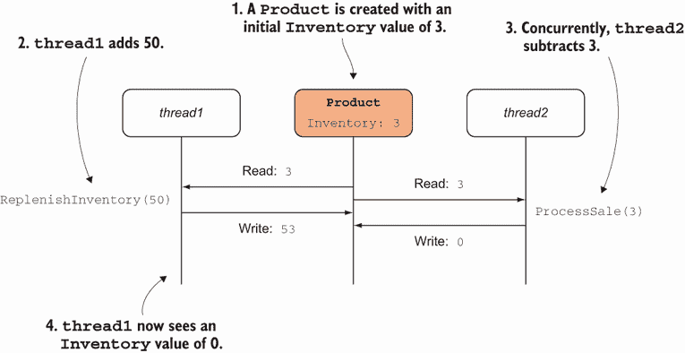
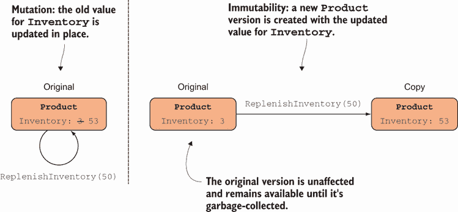
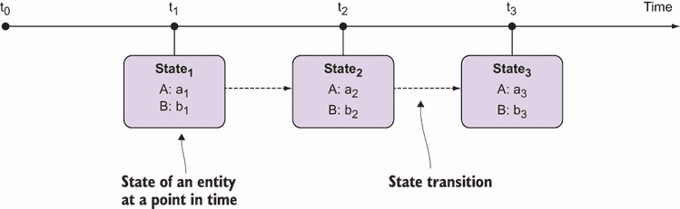
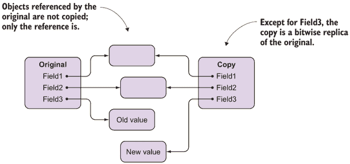
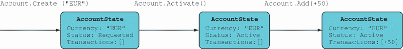

# 11 表示状态和变化

本章涵盖

+   状态变化的陷阱

+   无变化表示

+   强制不可变性

+   分离数据和逻辑

希腊哲学家赫拉克利特说，我们无法两次踏入同一条河流；河流不断变化，所以刚才还在那里的河流已经不再了。许多程序员会不同意，认为这是同一条河流，但其 *状态* 已经改变了。函数式程序员试图忠实于赫拉克利特的思考，并且会随着每一次观察创造一条新的河流。

大多数程序都是用来表示现实世界中的事物和过程的，因为世界不断变化，程序必须以某种方式表示这种变化。问题是 *如何* 表示变化。以命令式风格编写的商业应用程序在其核心具有状态变化：对象代表业务域中的实体，世界的变化通过改变这些对象的状态来建模。

我们将首先研究我们在使用变化时在程序中引入的弱点。然后我们将看到我们如何通过不使用变化来表示变化，以及更实际地，如何在 C# 中强制不可变性。最后，因为我们的程序的大部分数据都存储在数据结构中，我们将介绍函数数据结构背后的概念和技术，这些数据结构也是不可变的。

## 11.1 状态变化的陷阱

*状态变化* 是指在原地更新内存，与之相关的一个重要问题是，对共享可变状态的并发访问是不安全的。你已经在第一章和第三章中看到了由于并发更新导致信息丢失的例子；现在让我们看看一个更面向对象的场景。想象一个具有 `Inventory` 字段的 `Product` 类，表示库存中的单位数量：

```
public class Product
{
   public int Inventory { get; private set; }
   public void ReplenishInventory(int units) => Inventory += units;
   public void ProcessSale(int units) => Inventory -= units;
}
```

如果 `Inventory` 如此示例所示是可变的，并且你有并发线程更新其值，这可能导致 *竞争条件*，结果可能是不可预测的。想象一下，你有一个线程正在补充库存，而另一个线程同时处理一个销售，如图 11.1 所示，减少库存。如果两个线程同时读取值，并且销售线程有最后的更新，你最终会看到库存总体减少。



图 11.1 并发更新导致的数据丢失。两个线程都导致 `Inventory` 值被并发更新，结果导致其中一个更新丢失。

不仅补充库存的更新已经丢失，而且第一个线程现在可能面临一个完全无效的状态：刚刚补充的产品库存为零。

如果你做过一些基本的并发编程，你可能正在想，“简单！你只需要使用`lock`语句将`Inventory`的更新包装在临界区中。”实际上，这个解决方案在这个简单情况下是有效的，但随着系统复杂性的增加，它可能成为一些难以解决的错误的原因。（销售不仅影响库存，还影响销售订单、公司资产负债表等等。）

如果在设置单个变量时可能会出现故障，那么想象一下当一个实体的更新涉及到更新多个字段时会发生什么。例如，想象一下当你更新库存时，你也会设置一个标志来指示产品库存是否不足，如下面的列表所示。

列表 11.1 非原子更新导致的暂时不一致性

```
class Product
{
   int inventory;

   public bool IsLowOnInventory { get; private set; }

   public int Inventory
   {
      get => inventory;
      private set
      {
         inventory = value;
                                      ❶
         IsLowOnInventory = inventory <= 5;
      }
   }
}
```

❶ 此时，从任何读取其属性的线程的角度来看，对象可能处于无效状态。

这段代码定义了一个不变量：当`inventory`为 5 或更少时，`IsLowOnInventory`必须为真。

在单线程设置中，前面的代码没有问题。但在多线程设置中，一个线程可能在另一个线程在`Inventory`已更新但`IsLowOnInventory`尚未更新的窗口期间读取该对象的状态。请注意，如果计算`IsLowOnInventory`的逻辑变得更加昂贵，这个窗口会变宽。在这个窗口期间，不变量可能会被破坏，因此第一个线程会看到对象似乎处于无效状态。这当然会非常罕见，并且几乎不可能重现。这也是竞态条件引起的错误如此难以诊断的部分原因。

事实上，竞态条件已知已导致软件行业中最引人注目的失败之一。如果你有一个具有并发性和状态变化的系统，那么你无法证明该系统没有竞态条件。¹换句话说，如果你想实现并发（鉴于今天对多核处理器和分布式计算的倾向，你几乎没有选择）*并且*对正确性有强保证，那么你不得不放弃状态变化。

缺乏安全的并发访问可能是共享可变状态的最大陷阱，但并非唯一。另一个问题是引入*耦合*的风险——系统不同部分之间的高度相互依赖。在图 11.1 中，`Inventory`是*封装*的，这意味着它只能从类内部设置，根据面向对象理论，这应该给你一种舒适感。但是`Product`类中有多少方法可以设置库存值？有多少代码路径通向这些方法，从而最终影响`Inventory`的值？应用程序的哪些部分可以获取相同的`Product`实例并依赖于`Inventory`的值，以及如果你引入一个导致`Inventory`发生变化的新组件，会有多少部分受到影响？

对于一个非平凡的应用程序，很难完全回答这些问题。这就是为什么即使`inventory`是一个私有字段，只能通过私有设置器来设置，它也符合全局可变状态的定义；据我们所知，它可以通过封装类中的公共方法被程序的任何部分修改。因此，可变状态将读取或更新该状态的各个组件的行为耦合在一起，使得推理整个系统的行为变得困难。

最后，共享可变状态意味着*纯度丧失*。正如第三章所述，修改全局状态（记住，这指的是所有不属于函数本地的状态，包括私有变量）构成了副作用。如果你通过修改系统中的对象来表示世界的变化，你将失去函数纯度的优势。因此，函数式范式总体上不鼓励状态修改。

注意：在本章中，你将学习如何处理不可变数据对象。这是一个重要的技术，但请记住，它并不总是足以表示随时间变化的事物。不可变数据对象可以表示实体在任何给定时间点的状态，有点像电影中的一个镜头，但要表示实体本身，要获得完整的动态画面，你需要进一步抽象，将这些连续状态联系起来。我们将在第十三章、第十五章、第十八章和第十九章中讨论实现这一目标的技巧。

局部修改是可以接受的

并非所有的状态修改都是同样糟糕的。修改局部状态（仅在函数作用域内可见的状态）是不优雅的，但却是良性的。例如，想象以下函数：

```
int Sum(int[] ints)
{
   var result = 0;
   foreach (int i in ints) result += i;
   return result;
}
```

虽然我们在更新`result`，但这从函数的作用域之外是不可见的。因此，这个`Sum`的实现实际上是一个纯函数：它对调用函数来说没有*可观察的*副作用。

自然地，这段代码也是低级的。你通常可以使用内置函数如`Sum`、`Aggregate`等来实现你想要的功能。在实践中，你很少会找到一个合理的理由来修改局部变量。

## 11.2 理解状态、身份和变化

让我们更仔细地看看变化和修改。² 我所说的*变化*是指现实世界中的变化，例如当 50 个单位的股票可供出售时。*修改*意味着数据在原地更新；正如你在`Product`类中看到的，当`Inventory`值被更新时，`Inventory`的旧值就会丢失。

在函数式编程（FP）中，我们不通过修改来表示变化：值不会在原地更新。相反，我们创建新的实例来表示具有所需变化的数据，如图 11.2 所示。当前库存水平为 53 并不抹去它之前是 3 的事实。



图 11.2 在函数式编程中，可以通过创建数据的新版本来表示变化。

在函数式编程（FP）中，我们处理的是*不可变*值：一旦一个值被初始化，它就永远不会被更新。

理解不可变对象

如果你一直用修改来表示变化，当对象的属性更新时创建对象的副本可能会显得反直觉。例如，考虑以下代码：

```
record Product(int Inventory);

static Product ReplenishInventory(Guid id, int units)
{
   Product original = RetrieveProduct(id);
   Product updated = new Product(original.Inventory + units);
   return updated;
}
```

在这段代码中，`Product`是不可变的，所以我们通过创建一个新的`Product`实例来表示新库存的可用性。你可能会觉得这样做有些尴尬，因为现在内存中有两个相互竞争的`Product`实例，其中只有一个准确地代表了现实世界的产品。

注意，在这个例子中，返回的是`updated`实例，而`original`实例超出作用域，因此将被垃圾回收。在许多情况下，过时的实例只是被“遗忘”而不是被覆盖。

但有些情况下，你可能确实希望一个实体的多个视图共存。例如，假设你的雇主为超过 40 美元的订单提供免费运输。你可能希望在用户删除商品之前和之后查看订单，以警告他们是否刚刚失去了免费运输的权利。或者，更新可能是一个内存事务的一部分，如果事务失败，你可能希望将实体回滚到之前的状态。

只有最新或当前的数据视图是有价值的这种观点只是源于主流实践的一种偏见。当你放弃这种观点时，许多新的可能性就会出现。

要细化或重新定义你对变化和修改的直觉，区分变化的事物和不变化的事物是有用的。

### 11.2.1 一些东西永远不会改变

有些东西我们认为是固有的不可变的。例如，你的年龄可能会从 30 岁变成 31 岁，但数字 30 仍然是数字 30，31 仍然是 31。

这在基类库（BCL）中得到了体现，即*所有原始类型都是不可变的*。那么更复杂类型呢？日期是一个很好的例子。3 月 3 日仍然是 3 月 3 日，即使你可能将你的日历中的预约从 3 月 3 日改为 3 月 4 日。这也在 BCL 中得到了反映，即用于表示日期的类型，如`DateTime`是不可变的。³ 你可以通过在 REPL 中输入以下内容来自行验证（如果你没有.NET 6，请使用`DateTime`而不是`DateOnly`）：

```
var momsBirthday = new DateOnly(1966, 12, 13);
var johnsBirthday = momsBirthday;               ❶

// some time goes by...

johnsBirthday = johnsBirthday.AddDays(1);       ❷

johnsBirthday // => 14/12/1966
momsBirthday  // => 13/12/1966                  ❸
```

❶ 约翰和母亲的生日相同。

❷ 你意识到约翰的生日实际上晚了一天。

❸ 母亲的生日没有受到影响。

在前面的例子中，我们首先说母亲和约翰有相同的生日，所以我们给`momsBirthday`和`johnsBirthday`赋相同的值。当我们使用`AddDays`创建一个较晚的日期并将其赋值给`johnsBirthday`时，这不会影响`momsBirthday`。在这个例子中，我们双重保护了日期不被修改：

+   因为`System.DateOnly`是一个结构体，它在赋值时会进行复制，所以`momsBirthday`和`johnsBirthday`是不同的实例。

+   即使`DateOnly`是一个类，并且`momsBirthday`和`johnsBirthday`指向同一个实例，行为仍然相同，因为`AddDays`创建了一个新的实例，而不会影响底层实例。

相反，如果`DateOnly`是一个可变类，并且`AddDays`变异了其实例的天数，那么`momsBirthday`的值将因为更新`johnsBirthday`而更新——或者更准确地说，作为更新`johnsBirthday`的副作用。（想象一下向妈妈解释这是你迟到生日祝福的原因。）

.NET 框架中的不可变类型

这里是.NET 基类库中最常用的不可变类型：

+   `DateTime`、`TimeSpan`、`DateTimeOffset`、`DateOnly`、`TimeOnly`

+   `Delegate`

+   `Guid`

+   `Nullable<T>`

+   `String`

+   `Tuple<T1>`、`Tuple<T1, T2>`、...

+   `Uri`

+   `Version`

此外，所有原始类型都是不可变的。

现在让我们定义一个自定义的不可变类型。比如说我们这样表示一个`Circle`：

```
readonly record struct Circle(Point Center, double Radius);
```

你可能会同意，一个圆应该永远增长或缩小是没有意义的，因为它是一个完全抽象的几何实体。前面的实现通过将结构体声明为`readonly`来反映这一点，这使得它是不可变的。这意味着将无法更新`Radius`和`Center`的值；一旦创建，圆的状态将永远无法改变。⁴

结构体应该是不可变的

注意，我已经将`Circle`定义为值类型。因为值类型在函数之间传递时会被复制，所以结构体应该是不可变的。这不是由编译器强制执行的，所以你可以创建一个可变结构体。事实上，如果你声明一个没有`readonly`修饰符的`record`结构体，你将得到一个可变结构体。

与类不同，你对可变结构体所做的任何更改都会向下传播，但不会向上调用栈传播，这可能导致意外的行为。因此，我建议你始终坚持使用不可变结构体，唯一的例外是有证明的性能需求。

如果你有一个圆，并且想要一个大小是原来两倍的圆，你可以定义函数来根据现有的圆创建一个新的圆。以下是一个例子：

```
static Circle Scale(this Circle c, double factor)
   => c with { Radius = c.Radius * factor };
```

好的，到目前为止，我们还没有使用过变异，这些例子相当直观。数字、日期和几何实体有什么共同之处？它们的值捕捉了它们的身份：它们是*值对象*。如果你改变日期的值……嗯，它标识了一个不同的日期！当我们考虑值和身份不同的事物时，问题就开始了。我们将在下一节探讨这个问题。

### 11.2.2 不使用变异表示变化

许多现实世界的实体会随时间变化：你的银行账户、你的日历、你的联系人列表——所有这些事物都有随时间变化的状态。图 11.3 说明了这个概念。



图 11.3 随时间变化状态的实体

对于这样的实体，它们的身份不是由它们的值来确定的，因为它们的身份保持不变，而它们的值随着时间的推移而变化。相反，它们的身份与不同时间点的不同状态相关联。你的年龄可能会改变，或者你的薪水，但你的身份不会。为了表示这样的实体，程序必须不仅模拟一个实体的状态（这是容易的部分），还要模拟从一个状态到另一个状态的转换，以及通常将身份与实体的当前状态关联起来。

我们讨论了一些为什么突变提供的是一个不完美的状态转换机制的原因。在函数式编程（FP）中，状态不会被突变；它们是快照，就像电影帧一样，代表着一个不断发展的现实，但本身是静态的。

## 11.3 使用记录来捕获领域实体的状态

为了说明 C# 中的不可变数据对象，让我们从 `AccountState` 开始工作，我们将使用它来表示 BOC 应用程序中银行账户的状态。以下列表显示了我们的模型。

列表 11.2 银行账户状态的简单模型

```
public enum AccountStatus
{ Requested, Active, Frozen, Dormant, Closed }

public record AccountState
(
   CurrencyCode Currency,
   AccountStatus Status = AccountStatus.Requested,
   decimal AllowedOverdraft = 0m,
   IEnumerable<Transaction> TransactionHistory = null
);

public record Transaction
(
   decimal Amount,
   string Description,
   DateTime Date
);
```

为了简洁起见，我省略了 `CurrencyCode` 的定义，它只是像我们在 9.4.1 节中看到的 `ConnectionString` 和 `SqlTemplate` 类型一样包装一个字符串值，如 EUR 或 USD。

因为 `AccountState` 有几个字段，并且并不是所有字段在所有时间都有意义，所以我为除了货币字段以外的所有字段提供了合理的默认值。要创建一个 `AccountState`，你实际上只需要它的货币：

```
var newAccount = new AccountState(Currency: "EUR");
```

这将创建一个默认状态为 `Requested` 的 `AccountState`。当你准备好激活账户时，你可以通过使用 `with` 表达式来完成：

```
public static AccountState Activate(this AccountState original)
   => original with { Status = AccountStatus.Active };
```

这将创建一个新的 `AccountState` 实例，包含原始对象的所有值，除了 `Status`，它被设置为新的值。原始对象仍然完好无损：

```
var original = new AccountState(Currency: "EUR");
var activated = original.Activate();

original.Status    // Requested
original.Currency  // "EUR"

activated.Status   // Active
activated.Currency // "EUR"
```

注意，你可以使用设置多个属性的 `with` 表达式：

```
public static AccountState RedFlag(this AccountState original)
   => original with
   {
      Status = AccountStatus.Frozen,
      AllowedOverdraft = 0m
   };
```

使用不可变对象的影响

与不可变对象一起工作意味着每次你的数据需要更改时，你都会创建一个新的、修改后的实例，而不是在原地突变对象。“但这不是非常低效吗？”你可能正在想。

确实，创建修改后的副本以及创建最终需要垃圾回收的更多对象确实会有轻微的性能损失。这也是为什么在缺乏自动内存管理的语言中，函数式编程（FP）不实用的原因。

但是性能影响比你想象的要小，因为修改后的实例是原始对象的浅拷贝。也就是说，原始对象引用的对象没有被复制；只有引用被复制。除了正在更新的字段外，新对象是原始对象的位复制。



例如，当您使用更新的状态创建新的`AccountState`时，交易列表不会被复制。相反，新对象引用原始的交易列表。（这也应该是不可变的，因此不同的实例共享它是可以的。）

`with` 表达式是快速的。当然，就地更新更快，因此在性能和安全之间有一个权衡。创建浅拷贝的性能惩罚在大多数情况下可能可以忽略不计。我的建议是首先考虑安全，然后在需要时进行优化。

接下来，让我们看看我们如何进一步改进这个模型。

### 11.3.1 对记录初始化的细粒度控制

再看看提出的`AccountState`定义（在下面的片段中复制），看看您是否能发现任何潜在的问题：

```
public record AccountState
(
   CurrencyCode Currency,
   AccountStatus Status = AccountStatus.Requested,
   decimal AllowedOverdraft = 0m,
   IEnumerable<Transaction> TransactionHistory = null
);
```

实际上这里有几个问题。一个立即引起注意的事情是交易列表的默认值是`null`。提供默认值的原因是，当创建新账户时，它将没有之前的交易，因此将其作为可选参数是有意义的。但我们也不希望`null`可能引起`NullReferenceException`。其次，这个记录定义允许您通过更改现有账户的货币来创建账户，如下所示：

```
var usdAccount = newAccount with { Currency = "USD" };
```

这没有意义。尽管账户的状态可能从“请求”变为“活动”，一旦以特定货币开设了账户，这种状态就不应该改变。我们希望我们的模型能够表示这一点。让我们看看我们如何解决这两个问题，从后者开始。

只读属性与初始化属性

当您使用位置记录时，编译器会为声明的每个参数创建一个只读的自动属性。这是一个具有`get`和`init`方法的属性；后者是一个 setter，只能在记录实例初始化时调用。如果我们显式地将`Currency`属性声明为公共只读自动属性，就像编译器会生成的那样，它看起来会是这样：

```
public record AccountState
(
   CurrencyCode Currency,
   AccountStatus Status = AccountStatus.Requested,
   decimal AllowedOverdraft = 0m,
   IEnumerable<Transaction> TransactionHistory = null
)
{
   public CurrencyCode Currency { get; init; } = Currency;
}
```

下面的列表将这一点分解，以便您可以看到每个位的意义。

列表 11.3 在位置记录定义中显式定义属性

```
public record AccountState(CurrencyCode Currency /*...*/)
{

   public CurrencyCode Currency     ❶
   {
      get;                          ❷
      init;                         ❸
   }
   =                                ❹
   Currency;                        ❺

}
```

❶ 在这里，`Currency`指的是属性的名称。

❷ 获取属性的值

❸ 仅在记录初始化时设置值

❹ 介绍了属性初始化器

❺ 在这里，`Currency`指的是构造函数参数；这意味着在初始化时，`Currency`属性被设置为`Currency`构造函数参数提供的值。

当你使用 `with` 表达式创建记录的修改版本时，运行时会创建原始记录的副本，然后调用任何你提供新值的属性的 `init` 方法。现在，显式编写属性允许我们覆盖编译器的默认设置；在这种情况下，我们想要通过删除 `init` 方法将 `Currency` 属性定义为只读自动属性：

```
public CurrencyCode Currency { get; } = Currency;
```

然后，尝试创建具有不同货币的账户的修改版本的 `with` 表达式将无法编译，因为没有为副本设置 `Currency` 的 `init` 方法。

不可变对象永远不会改变，因此不可变对象的属性必须是只读或只初始化：

+   如果在创建副本时给属性赋予一个更新值是有意义的，则使用只初始化属性。

+   否则使用只读属性。

正如你所见，编译器生成的位置记录属性是只初始化的，所以如果你想它们是只读的，你需要显式声明它们。

将可选列表初始化为空

现在，让我们回到 `TransactionHistory` 的问题，它在将 `AccountState` 的构造函数参数未传递值时初始化为 `null`。我们真正想要的是有一个空列表作为默认值，因此理想情况下我们想要编写

```
public record AccountState
(
   // ...
   IEnumerable<Transaction> TransactionHistory
      = Enumerable.Empty<Transaction>()
);
```

但这无法编译，因为可选参数的默认值必须是编译时常量。最简洁的解决方案是显式定义 `Transaction-History` 属性并使用属性初始化器，如下所示。

列表 11.4 使用空列表初始化记录

```
public record AccountState
(
   CurrencyCode Currency,
   AccountStatus Status = AccountStatus.Requested,
   decimal AllowedOverdraft = 0m,
   IEnumerable<Transaction> TransactionHistory = null
)
{
   public IEnumerable<Transaction>
      TransactionHistory { get; init; }
      = TransactionHistory                      ❶
         ?? Enumerable.Empty<Transaction>();    ❷
 }
```

❶ 指的是构造函数参数

如果构造函数被给定 `null`，则使用一个空列表

虽然方法参数的默认值必须是编译时常量，但属性初始化器没有这个限制。因此，我们可以在属性初始化器中包含一些逻辑。前面的代码用显式声明替换了自动生成的 `TransactionHistory` 属性；这本质上是在说，“当创建一个新的 `AccountState` 时，使用可选 `TransactionHistory` 构造函数参数提供的值来填充 `TransactionHistory` 属性，但如果它是 `null`，则使用空列表。”

有其他可能的方案：你可以显式定义一个构造函数并在其中包含此逻辑，或者定义一个带有后置字段的完整属性并在属性的 `init` 方法中包含此逻辑。

### 11.3.2 一直不可变

还有一个小调整。为了使一个对象不可变，它的所有成员都必须是不可变的。如果你查看 `AccountState` 的定义，会发现一个陷阱。`TransactionHistory` 被定义为 `IEnumerable<Transaction>`，虽然 `Transaction` 是不可变的，但有许多可变列表实现了 `IEnumerable`。例如，考虑以下代码：

```
var mutableList = new List<Transaction>();

var account = new AccountState
(
   Currency: "EUR",
   TransactionHistory: mutableList
);

account.TransactionHistory.Count() // => 0

mutableList.Add(new(-1000, "Create trouble", DateTime.Now));

account.TransactionHistory.Count() // => 1
```

此代码创建了一个具有可变列表的 `AccountState`；然后它保留对该列表的引用，以便列表仍然可以被修改。因此，我们无法说我们对 `AccountState` 的定义真正不可变。

有两种可能的解决方案。你可以更改类型定义，将 `TransactionHistory` 声明为 `ImmutableList` 而不是 `IEnumerable`。或者，你可以将属性重写为以下列表所示。

列表 11.5 即使给定可变列表，使记录不可变

```
using System.Collections.Immutable;

public record AccountState // ...
{
   public CurrencyCode Currency { get; } = Currency;

   public IEnumerable<Transaction> TransactionHistory { get; init; }
      = ImmutableList.CreateRange
         (TransactionHistory ?? Enumerable.Empty<Transaction>());
}
```

此代码从给定的 `IEnumerable` 创建一个 `ImmutableList`，从而使 `AccountState` 真正不可变。

提示：如果给定一个 `ImmutableList`，`CreateRange` 将直接返回它，这样你就不必使用这种方法承担任何开销。否则，它将创建一个防御性副本，确保对给定列表的任何后续修改都不会影响 `AccountState`。

如果一个账户有一个不可变的交易列表，你如何向列表中添加交易？你不需要。你创建一个新的列表，其中包含新的交易以及所有现有的交易，这将成为新的 `AccountState` 的一部分。以下列表显示了向不可变对象添加子对象涉及创建新的父对象。

列表 11.6 向不可变对象添加子对象

```
using LaYumba.Functional;                              ❶

public static AccountState Add
   (this AccountState account, Transaction trans)
   => account with
   {
      TransactionHistory
         = account.TransactionHistory.Prepend(trans)   ❷
   };
```

❶ 将 `Prepend` 作为 `IEnumerable` 的扩展方法

❷ 一个新的 `IEnumerable`，包括现有值和正在添加的值

注意，在这个特定情况下，我们是在列表中 * prepend* 交易。这是特定领域的；在大多数情况下，你感兴趣的是最新的交易，因此将最新的交易保持在列表的前端是高效的。

每次添加或删除单个元素时都复制列表可能听起来非常低效，但这并不一定是这种情况。我们将在第十二章中讨论原因。

使用 C# 记录的障碍

在本节中，你看到了我们如何有效地使用记录来定义自定义不可变数据类型。然而，记录是 C# 中的新特性，所以当你尝试采用记录时可能会遇到一些障碍。

特别是，如果你使用对象关系映射器（包括 Entity Framework），它使用变更跟踪来查看哪些对象已更改并需要在数据库中更新，或者依赖于空构造函数和可设置属性来填充对象，你可能无法使用记录。另一个障碍可能是序列化。虽然 `System.Text.Json` 支持将记录序列化为 JSON 并从 JSON 反序列化，但其他序列化程序可能还不支持记录。在这种情况下，考虑使用约定不变性（在第九章附录中讨论）。我预计随着时间的推移，记录将变得流行，并最终被所有主要库支持。

## 11.4 分离数据和逻辑

函数式编程（FP）通过将数据与逻辑分离来减少应用程序中的耦合，从而使其更简单、更容易维护。这是我们前面章节中一直遵循的方法：

+   我们在列表 11.2 中定义的`AccountState`只包含数据。

+   如激活账户或添加交易等业务逻辑，是通过函数来模拟的。

我们可以将所有这些函数组合成一个静态的`Account`类，包括创建和更新`AccountState`新版本的逻辑，如下所示。

列表 11.7 包含特定业务逻辑的静态类

```
public static class Account
{
   public static AccountState Create(CurrencyCode ccy) => new(ccy);

   public static AccountState Activate(this AccountState account)
      => account with { Status = AccountStatus.Active };

   public static AccountState Add
      (this AccountState account, Transaction trans)
      => account with
      {
         TransactionHistory
            = account.TransactionHistory.Prepend(trans)
      };
}
```

`Account`是一个静态类，用于表示账户的变化，包括一个工厂函数。而`AccountState`表示在特定时间点的账户状态，`Account`中的函数则表示状态转换。这如图 11.4 所示。



图 11.4 表示实体状态和与逻辑相关的关注点是分开的。在这个例子中，`AccountState`捕获表示账户的数据，而`Account`是一组模拟账户变化的函数。

当我们在高级别编写逻辑时，我们只依赖于`Account`：例如，

```
var onDayOne = Account.Create("USD");
var onDayTwo = Account.Activate(onDayOne);
```

这意味着函数式编程（FP）允许你将表示状态和表示状态转换视为不同的关注点。此外，业务逻辑与数据（`Account`依赖于较低级别的`AccountState`）相比处于更高层次。

命名约定

如果你遵循将逻辑与数据分离的方法，你必须选择一个命名约定来区分数据对象和包含逻辑的类。在这里，我使用了包含逻辑的类名（`Account`）作为类名；这是因为我喜欢在引用无参数函数时保持最佳的可读性：例如，`Account.Activate`在

```
Option<AccountState> Activate(Guid id)
   => GetAccount(id).Map(Account.Activate);
```

另一方面，更冗长的`AccountState`通常可以通过使用`var`来省略。当然，其他命名约定也是可能的。选择最符合逻辑的，并在你的应用程序中保持一致性。

`Account`是一个类，因为 C#语法要求它（除了顶层语句外，你无法在类外声明方法或委托），但从概念上讲，它只是相关函数的集合。这可以被称为*模块*。这些函数不依赖于封装类中的任何状态，因此你可以将它们视为独立的函数，并将类名视为命名空间的一部分。

这种将数据（无生命的）和函数（执行数据转换的函数）之间的分离是函数式编程（FP）的典型特征。这与面向对象编程（OOP）形成鲜明对比，在 OOP 中，对象既包含数据也包含修改这些数据的方法。

将数据与逻辑分离会导致系统更简单、耦合更少，因此更容易理解和维护。在编程分布式系统时，这也是一个合理的选择，因为数据结构需要易于序列化和在应用程序之间传递，而逻辑则位于这些应用程序中。

数据导向编程（DOP）

本章中我讨论的几个想法与 DOP 相关，DOP 是一种倡导通过将逻辑与数据分离来降低应用程序复杂性的范式。FP 和 DOP 是不同的，但它们之间有一些重叠。DOP 的原则是

1.  将逻辑与数据实体分离。

1.  使用不可变数据。

1.  使用泛型结构来表示数据实体。

函数式编程（FP）也提倡使用不可变数据，使用不可变数据和纯函数自然地导致将逻辑与数据实体分离，正如我在本节中演示的那样。FP 和 DOP 之间肯定有一些重叠。

至于第三个原则，DOP 提倡使用泛型结构来表示数据；例如，你不会定义一个具有`Currency`属性的`AccountState`类型，而是会使用一个字典，将账户货币的值映射到`Currency`键，以及其他字段的类似映射.^a 结果表明，你可以仅使用列表、字典和原始数据类型来表示任何形状的数据。

使用泛型结构来表示数据的主要好处是你可以以相应通用的方式处理数据；例如，给定任何形状的两个数据快照，你可以比较它们并查看哪些位发生了变化。你可以合并更改集并查看并发更新是否导致冲突。这非常强大。

显而易见的缺点是你会失去类型安全，因此对于习惯于在静态类型语言（如 C#）中工作的程序员来说，这有点难以推销。

如果你想了解更多关于 DOP 的信息，了解如何通过分离逻辑和数据简化生活，以及为什么使用泛型结构来表示数据实体是有价值的，请参阅 Yehonathan Sharvit 的《数据导向编程》（Manning, 2021）。

^a 如果你想在 C#中采用这种方法，你可能会使用`dynamic`类型来对底层字典进行糖包装。这允许你使用点符号访问字段值。

## 摘要

+   FP 反对状态突变，防止与状态突变相关的一些缺点，如线程不安全、耦合和不纯：

    +   不变的事物用不可变对象来表示。

    +   变化的事物也用不可变对象来表示；这些不可变快照代表了实体在某个特定时刻的状态。变化通过创建一个新的快照并包含所需的变化来表示。

+   使用记录来定义自定义不可变数据类型。

+   要使一个类型不可变，它所有的子类型，包括列表和其他数据结构，也必须是不可变的。

+   通过将数据与逻辑分离，你可以简化你的应用程序并促进松耦合：

    +   使用数据对象（通常是记录）来封装数据。

    +   使用函数（作为无状态静态类中的静态方法实现）来表示业务逻辑。

* * *

¹ 前面的例子提到了多线程，但如果并发源是异步或并行（这些术语在第三章的“并发意义和类型”侧边栏中进行了描述），同样的问题也可能出现。

² 我在本节中讨论的基本技术是函数式编程（FP）中普遍存在的，但我用来解释这些技术的概念和隐喻主要受到了 Clojure 编程语言创造者 Rich Hickey 的启发。

.NET 的创造者从 Java 中汲取了灵感，但在这个案例中，他们还从 Java 的错误中吸取了教训（Java 直到 Java 8 才有可变的日期）。

⁴ 实际上，你仍然可以通过反射来修改只读变量。但将字段设置为只读是一个明确的信号，表明该字段不应该被修改。
