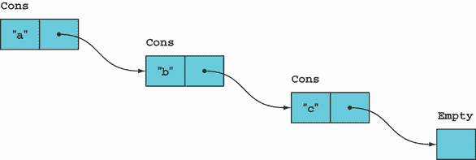
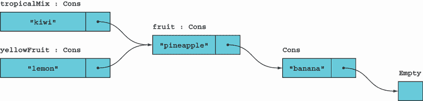
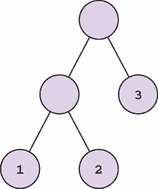
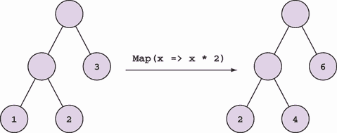
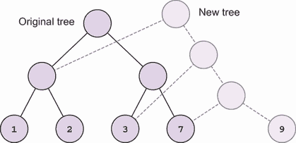

# 12 函数式数据结构简介

本章涵盖

+   函数式数据结构

+   链表

+   二叉树

在第十一章中，你看到了如何创建不可变对象。特别是，第 11.1 节展示了在涉及并发时状态变更的陷阱。当处理集合时，这些陷阱变得更加明显。因为处理大型集合比更新单个对象需要更长的时间，所以发生竞争条件的机会更大（我们在第 1.1.3 节中看到了这个例子）。

现在你已经了解了不可变对象，让我们来看看不可变数据结构设计背后的某些原则。请注意，文献中使用的术语*函数式*数据结构和*不可变*数据结构是可以互换的。¹ 你会发现原则是相同的：毕竟，对象只是临时的数据结构。

如果你只承诺使用不可变数据，所有数据结构也应该是不可变的。例如，你不应该通过改变其结构来向列表中添加元素，而应该创建一个新的列表，包含所需的变化。

这可能最初会让你皱起眉头：“为了向列表中添加一个项目，我需要将所有现有元素复制到一个新的列表中，再加上额外的项目？这是多么低效啊？”

为了让你了解这并不一定是不高效的，让我们看看一些简单的函数式数据结构。你会发现向集合中添加新元素确实会产生一个新的集合，但这并不涉及复制原始集合中的每个项目。

注意：本章中展示的实现是原始的。它们有助于理解基本概念，但不适用于生产环境。对于实际应用，请使用经过验证的库，如`System.Collections.Immutable`。

## 12.1 经典的函数式链表

我们将从经典的函数式链表开始。虽然表面上很简单，但这通常是大多数函数式语言核心库中的基本列表。我们可以用以下方式符号化地描述它：

```
List<T> = Empty | Cons(T, List<T>)
```

换句话说，一个`T`的`List`可以是以下两种情况之一：

+   `Empty`——表示空列表的特殊值

+   `Cons`——由两个值*cons*-tructed 的非空列表：

    +   一个单独的`T`，称为*头*，表示列表中的第一个元素

    +   另一个名为*尾*的`T`列表，表示所有其他元素

尾可以是`Empty`或`Cons`等。因此，`List`是一个*递归类型*的例子：一个用自身定义的类型。这就是我们如何只用两种情况就能应对任何长度的列表。例如，包含`["a",` `"b", "c"]`的列表的结构如下：

```
Cons("a", Cons("b", Cons("c", Empty)))
```



图 12.1 包含值`["a", "b", "c"]`的链表

它可以用图 12.1 中的图形表示，其中每个`Cons`用一个包含值（头）和指向列表其余部分的指针（尾）的框表示。

让我们看看我们如何在 C# 中实现这一点。这些实现包含在源存储库中的 `LaYumba.Functional.Data` 项目中。以下是我用来模拟列表的类型：

```
namespace LaYumba.Functional.Data.LinkedList;

public abstract record List<T>;
internal sealed record Empty<T> : List<T>;
internal sealed record Cons<T>(T Head, List<T> Tail) : List<T>;
```

注意，只有 `List` 类型是公开的。为了与 `List` 交互，我定义了一个 `Match` 方法，它提供了用于模式匹配的优美语法：

```
public static R Match<T, R>
(
   this List<T> list,
   Func<R> Empty,
   Func<T, List<T>, R> Cons
)
=> list switch
{
   Empty<T> => Empty(),
   Cons<T>(var t, var ts) => Cons(t, ts),
   _ => throw new ArgumentException("List can only be Empty or Cons")
};
```

这与我在第 5.3 节中展示的 `Option` 理想化实现非常相似：`Empty` 没有成员（就像 `None` 一样），而 `Cons` 存储列表的元素。`Match` 方法允许你处理这两种情况，从而减少了 `switch` 表达式的语法噪音。

结果表明，你可以用 `Match` 来定义所有常用的列表操作。例如，如果你想知道列表的长度（如下面的列表所示），你会使用 `Match`——空列表显然长度为 0，而非空列表的长度是其尾部长度加 1。

列表 12.1 计算列表的长度

```
public static int Length<T>(this List<T> list)
   => list.Match
   (
      () => 0,                        ❶
      (_, tail) => 1 + tail.Length()  ❷
    );
```

❶ 给 `Match` 的第一个函数处理空列表的情况。

❷ 如果列表不为空，第二个函数将获得列表的头部和尾部。

注意在第一个函数给 `Match` 的函数中，空括号图形上暗示了一个空列表。在第二个函数中，参数包括 `Cons` 的头部和尾部。在大多数情况下，我们在这里会处理头部，然后依赖于列表的递归定义来递归处理尾部。

最后，我提供了一些函数来创建空列表和填充列表。使用 `new Cons("a", new Cons("b", ...)` 明确创建整个结构将非常繁琐，所以我定义了一些用于初始化空列表或填充列表的函数。这些函数如下所示。

列表 12.2 初始化列表的函数

```
public static class LinkedList
{
   public static List<T> List<T>()                 ❶
      => new Empty<T>();                           ❶

   public static List<T> List<T>(T h, List<T> t)   ❷
      => new Cons<T>(h, t);                        ❷

   public static List<T> List<T>(params T[] items) ❸
      => items.Reverse().Aggregate(List<T>()       ❸
         , (tail, head) => List(head, tail));      ❸
}
```

❶ 创建一个空列表

❷ 从头部和尾部创建非空列表

❸ 用于创建具有几个硬编码元素的列表的便利方法

前两个函数只是分别调用 `Empty` 和 `Cons` 的构造函数。列表中的下一个函数是一个便利的列表初始化器。`params` 关键字已经将所有参数收集到一个数组中，所以我们只需要将数组转换成 `Empty` 和 `Cons` 的合适组合。这是通过 `Aggregate` 实现的，使用 `Empty` 作为累加器，并在减少函数中创建一个 `Cons`。因为 `List` 将项目添加到列表的开头，所以我们必须首先反转参数列表。

现在你已经看到了所有构建块，让我们在 REPL 中玩一玩 `List`。你需要导入 `LaYumba.Functional.Data` 集合：

```
#r "functional-csharp-code-2\LaYumba.Functional\bin\Debug\net6.0\
➥ LaYumba.Functional.Data.dll"
```

这里有一些示例，说明你如何在 REPL 中创建列表：

```
using LaYumba.Functional.Data.LinkedList;
using static LaYumba.Functional.Data.LinkedList.LinkedList;

var empty = List<string>();
// => []

var letters = List("a", "b");
// => [a, b]

var taxi = List("c", letters);
// => [c, a, b]
```

这段代码演示了如何创建一个列表，无论是空的还是预先填充的，以及如何通过向现有列表添加单个项目来创建一个 `Cons`。

### 12.1.1 常见列表操作

现在我们来看看我们如何使用这个列表执行一些常见的操作，就像我们习惯于使用 `IEnumerable` 一样。例如，这是 `Map`：

```
public static List<R> Map<T, R>
(
   this List<T> list,
   Func<T, R> f
)
=> list.Match
(
   () => List<R>(),
   (t, ts) => List(f(t), ts.Map(f))
);
```

`Map`接受一个列表和一个要映射到列表上的函数。然后它使用模式匹配。如果列表为空，它返回一个空列表；否则，它将函数应用于头部并递归地将函数映射到尾部，然后返回这两个的`Cons`。

在这里，你可以看到一个常见的命名约定；当一个`Cons`被解构时，它的元素通常被称为`t`（单数，表示头部）和`ts`（复数，表示尾部），因为它们都是类型`T`。（在不需要命名泛型类型的语言中，你会看到`x`和`xs`。）

如果我们有一个整数列表并且想要求和，我们可以按照同样的方式实现：

```
public static int Sum(this List<int> list)
   => list.Match
   (
      () => 0,
      (head, tail) => head + tail.Sum()
   );
```

如你在 9.6 节所知，`Sum`是`Aggregate`的一个特例。让我们看看我们如何为`List`实现更通用的`Aggregate`：

```
public static Acc Aggregate<T, Acc>
(
   this List<T> list,
   Acc acc,
   Func<Acc, T, Acc> f
)
=> list.Match
(
   () => acc,
   (t, ts) => Aggregate(ts, f(acc, t), f)
);
```

再次，我们进行模式匹配，并在`Cons`情况下，将归约函数`f`应用于累加器和头部。然后我们使用新的累加器和列表的尾部递归调用`Aggregate`。

警告 这里展示的实现不是栈安全的。如果列表足够长，它们将导致`StackOverflowException`。

现在我们已经了解了如何处理链表，让我们看看如何进行修改列表的操作。

### 12.1.2 修改不可变列表

假设我们想要向现有的列表中添加一个项目（通过这种方式，我自然是指获得一个包含额外项目的新的列表）。对于单链表，自然的方法是在前面添加项目：

```
public static List<T> Add<T>(this List<T> list, T value)
   => List(value, list);
```

给定一个现有的列表和一个新值，我们构建一个新的列表，其头部是一个包含新值和指向原始列表头部指针的列表节点。就是这样！不需要复制所有元素，因此我们可以以常数时间添加一个元素，只创建一个新对象。以下是我们不可变链表添加元素的示例：

```
var fruit = List("pineapple", "banana");
// => ["pineapple", "banana"]

var tropicalMix = fruit.Add("kiwi");
// => ["kiwi", "pineapple", "banana"]

var yellowFruit = fruit.Add("lemon");
// => ["lemon", "pineapple", "banana"]
```

`fruit`列表以两个项目初始化。然后我们添加第三个水果以获得一个新的列表`tropicalMix`。因为列表是不可变的，我们的原始`fruit`列表没有改变，仍然包含两个项目。这很明显，因为我们可以用它来创建一个新的、只包含黄色水果的列表的新版本。

图 12.2 展示了前述代码中创建的对象的图形表示，并显示在创建带有新项目的新的列表时，原始的`fruit`列表没有被修改（也不需要复制其元素）。



图 12.2 向列表添加项目不会影响原始列表。

想想这在解耦方面的意义：当你有一个不可变列表（以及更一般地，不可变对象）时，你可以暴露它而无需担心其他组件会对数据进行什么操作。他们根本无法对数据进行任何操作！

那么移除一个项目呢？单链表倾向于很好地处理第一个项目，所以我们将移除第一个项目（头部）并返回剩余的列表（尾部）：

```
public static List<T> Tail<T>(this List<T> list)
   => list.Match
   (
      () => throw new IndexOutOfRangeException(),
      (_, tail) => tail
   );
```

再次，我们可以在常数时间内从列表中移除第一个元素，而不改变原始列表。（注意，这是非常少数几个可以合理抛出异常的地方之一，因为在对空列表调用`Tail`是开发者的错误。如果有可能列表为空，正确的实现应该使用`Match`而不是调用`Tail`。）

你可能会发现这些示例相当有限，因为我们只与列表的第一个元素进行了交互。但在实践中，这可以用来覆盖相当多的用例。例如，如果你需要一个栈，这是一个完美的起点。常见的操作如`Map`和`Where`对于长度为*n*的列表来说，时间复杂度都是*O*(n)，就像任何其他列表一样。

你可以定义函数在索引*m*处插入或删除一个元素，这些操作的时间复杂度为*O*(m)，因为它们需要遍历*m*个元素并创建*m*个新的`Cons`对象。如果你经常需要从长列表的末尾添加或删除元素（例如，如果你需要实现一个队列），你会使用不同的数据结构——你习惯的所有数据结构都有不可变的对立面。

### 12.1.3 解构任何`IEnumerable`

注意我们如何能够定义许多有用的操作在我们的简单链表类型中，这些操作都是基于模式匹配的。这是因为通常我们希望空列表的行为与非空列表不同。注意非空情况将列表解构为其头部和尾部。

可以定义具有相同语义的`Match`方法，使其适用于任何`IEnumerable`，可以定义如下：

```
public static Option<T> Head<T>(this IEnumerable<T> list)    ❶
{
   var enumerator = list.GetEnumerator();
   return enumerator.MoveNext()
      ? Some(enumerator.Current)
      : None;
}

public static R Match<T, R>
(
   this IEnumerable<T> list,
   Func<R> Empty,
   Func<T, IEnumerable<T>, R> Otherwise
)
=> list.Head().Match
(
   None: () => Empty(),                                      ❷
   Some: (head) => Otherwise(head, list.Skip(1))             ❸
);
```

❶ 如果列表为空，`Head`返回`None`；否则，列表的头部被包裹在一个`Some`中。

❷ 如果列表为空，调用`Empty`处理程序

❸ 如果列表不为空，调用`Otherwise`处理程序，并传递列表的头部和尾部

这个`Match`的实现包含在`LaYumba.Functional`中。你将在第十三章中看到它在实践中是如何有用的。

## 12.2 二叉树

树也是常见的数据结构。除了链表之外，大多数列表实现都使用树作为其底层表示，因为这允许某些操作更有效地执行。我们只需看看一个基本的二叉树，如下定义：²

```
Tree<T> = Leaf(T) | Branch(Tree<T>, Tree<T>)
```

根据这个定义，树可以是一个`Leaf`，它是一个终端节点并包含一个`T`，或者它可以是一个`Branch`，它是一个非终端节点，包含两个子节点或*子树*。这些可以进一步是叶子或分支，等等递归。就像`List`一样，我将用不同的类型来表示每个情况：

```
public abstract record Tree<T>;
internal record Leaf<T>(T Value) : Tree<T>;
internal record Branch<T>(Tree<T> Left, Tree<T> Right) : Tree<T>;
```

当你遍历树时，你将想要为分支和叶子执行不同的代码，并访问叶子的内部值。我将定义一个`Match`方法，提供一个愉快的 API 来执行模式匹配：

```
public static R Match<T, R>
(
   this Tree<T> tree,
   Func<T, R> Leaf,
   Func<Tree<T>, Tree<T>, R> Branch
)
=> tree switch
{
   Leaf<T>(T val) => Leaf(val),
   Branch<T>(var l, var r) => Branch(l, r),
   _ => throw new ArgumentException("{tree} is not a valid tree")
};
```

你现在可以像往常一样调用`Match`：

```
myTree.Match
(
   Leaf: t => $"It's a leaf containing '{t}'",
   Branch: (left, right) => "It's a branch"
);
```

我还有典型的工厂函数`Leaf`和`Branch`，允许你在 REPL 中创建一个树，如下所示：

```
using static LaYumba.Functional.Data.BinaryTree.Tree;

Branch(
   Branch(Leaf(1), Leaf(2)),
   Leaf(3)
)
```

这将创建一个如下所示的树：



### 12.2.1 常见树操作

现在让我们看看一些常见的操作。与列表一样，我们可以用模式匹配来定义大多数操作。例如，计算树中值的数量可以这样做：

```
public static int Count<T>(this Tree<T> tree)
   => tree.Match
   (
      Leaf: _ => 1,
      Branch: (l, r) => l.Count() + r.Count()
   );
```

树也有*深度*（你需要遍历多少个节点才能从根节点到达最远的叶子节点），同样，你可以使用模式匹配来计算深度：

```
public static int Depth<T>(this Tree<T> tree)
   => tree.Match
   (
      Leaf: _ => 0,
      Branch: (l, r) => 1 + Math.Max(l.Depth(), r.Depth())
   );
```

那么`Map`呢？`Map`应该产生一个与原始树同构的新树，将映射函数应用于原始树中的每个值，如图 12.3 所示。



图 12.3 二叉树的`Map`函数

尽量不要看下面的实现，写下你认为`Map`可能如何工作的方法：

```
public static Tree<R> Map<T, R>
(
   this Tree<T> tree,
   Func<T, R> f
)
=> tree.Match
(
   Leaf: t => Leaf(f(t)),
   Branch: (left, right) => Branch
   (
      Left: left.Map(f),
      Right: right.Map(f)
   )
);
```

在树上实现 `Map`，你进行模式匹配：

+   如果你有一个叶子节点，那么你提取它的值，将函数应用于叶子节点，并将其包裹在一个新的叶子节点中。

+   否则，你创建一个新的分支，其左右子树是将函数映射到原始子树的结果。

定义一个将树中所有值减少到单个值的 `Aggregate` 函数也是合理的：

```
public static Acc Aggregate<T, Acc>
(
   this Tree<T> tree,
   Acc acc,
   Func<Acc, T, Acc> f
)
=> tree.Match
(
   Leaf: t => f(acc, t),
   Branch: (l, r) =>
   {
      var leftAcc = l.Aggregate(acc, f);
      return r.Aggregate(leftAcc, f);
   }
);
```

### 12.2.2 结构共享

更有趣的是，让我们看看一个改变树结构的操作，比如插入一个元素。这可以简单地完成，如下面的列表所示。

列表 12.3 向不可变树添加值

```
public static Tree<T> Insert<T>
(
   this Tree<T> tree, 
   T value
)
=> tree.Match
(
   Leaf: _ => Branch(tree, Leaf(value)),
   Branch: (l, r) => Branch(l, r.Insert(value))
);
```

如同往常，代码使用模式匹配。如果树是叶子节点，它创建一个分支，其两个子节点是叶子节点本身和带有插入值的新的叶子节点。如果它是分支，它将新值插入到右子树中。

例如，如果你从一个包含 `{1, 2, 3, 7}` 的树开始，并插入值 `9`，结果将如图 12.4 所示。正如你所看到的，新树与原始树共享其大部分结构。这是一个更普遍的*结构共享*思想的例子；更新的集合尽可能多地与原始集合共享其结构。



图 12.4 增值后的树与原始树共享部分结构。

插入一个元素到树中需要创建多少新项？与到达叶子节点所需的一样多。如果你从一个包含 *n* 个元素的平衡树开始，³ 插入涉及到创建 log *n* + 2 个对象，这是合理的。⁴

当然，列表 12.3 中的实现最终会导致一个非常不平衡的树，因为它总是向右添加元素。为了保证高效的插入，我们需要改进树表示以包括自我平衡机制。这当然可能，但超出了本介绍的范畴。

## 12.3 结论

开发高效的函数式数据结构是一个庞大而迷人的主题，我们只是触及了皮毛。关于这个主题的参考书是 Chris Okasaki（剑桥大学出版社，1999 年）的《Purely Functional Data Structures》。不幸的是，代码示例是 Standard ML。尽管如此，在本节中，你已经对函数数据结构的内部工作原理和结构共享的概念有所了解，这允许不可变数据结构既安全又高效。

函数式程序在复制数据而不是就地更新数据时可能会遭受一些性能损失，但命令式程序可能必须引入锁定和防御性复制以确保正确性。因此，函数式程序在许多场景中往往表现更好。然而，对于大多数实际应用来说，性能并不是关键问题，而是通过拥抱不可变性而获得的更高可靠性。

## 练习

列表：

1.  实现以下函数以使用本章中定义的单链表`List`：

    +   `InsertAt`在给定索引处插入一个项。

    +   `RemoveAt`移除给定索引处的项。

    +   `TakeWhile`接受一个谓词并遍历列表，直到找到一个不满足谓词的项，然后输出所有项。

    +   `DropWhile`的工作方式类似，但排除了列表前面的所有项。

1.  这四个函数的复杂度是多少？创建新列表需要多少新对象？

1.  `TakeWhile`和`DropWhile`在处理已排序的列表并且希望获取所有大于或小于某个值的项时非常有用。编写实现时，请使用`IEnumerable`而不是`List`。

树：

1.  在本章中展示的二叉树实现中定义`Bind`是否可能？如果是，实现`Bind`；如果不是，解释为什么不可能。（提示：首先编写签名，然后绘制一个二叉树以及如何将返回树的函数应用于树中的每个值。）

1.  实现一个`LabelTree`类型，其中每个节点都有一个类型为`string`的标签和一个子树列表。这可以用来模拟一个典型的导航树或网站中的分类树。

1.  假设你需要给你的导航树添加本地化功能。你被提供了一个`LabelTree`，其中每个标签的值是一个键，以及一个将键映射到网站必须支持的一种语言中的翻译的字典。你需要计算本地化的导航/分类树。（提示：为`LabelTree`定义`Map`。）

1.  对前面的实现进行单元测试。

## 摘要

+   在函数式编程中，集合应该是不可变的，这样现有的集合就不会被修改，而是通过创建带有所需更改的新集合。

+   不可变集合可以既安全又高效，因为更新版本与原始集合共享大部分结构，而不会影响它。

* * *

¹ 不可变数据结构也被称为持久数据结构。在这个上下文中，“持久”一词并不表示持久到某种媒体，而只是指在内存中的持久性：原始数据结构不受创建新版本（如添加或删除元素）的任何操作的影响。此外，将“持久”一词应用于数据结构意味着它对某些操作的运行时间提供某些保证。具体来说，操作在持久数据结构中的效率应该与相应的可变结构中的效率相当，或者至少在同一数量级。这涉及到数据结构和算法设计，所以在这里我将坚持使用术语“不可变/函数式”数据结构/集合。

² 在这里，“二叉”表示每个分支都有两个子树。

³ 如果从根到叶子的所有路径长度相同或最多相差一个，则该树是平衡的。

⁴ 对数的基础将是树的基数（每个节点有多少个子节点）。一个基于列表表示的树的实际实现可能有 32 个基数，这样在插入一百万个对象后，你的树可能仍然只有 4 层的深度。
