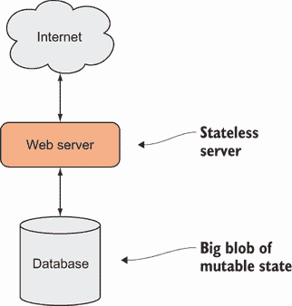
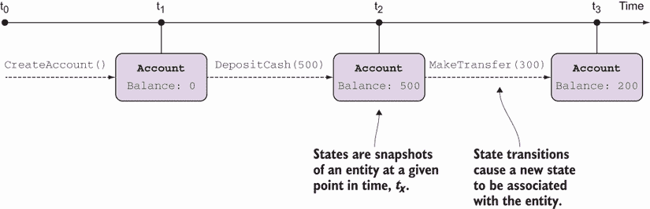
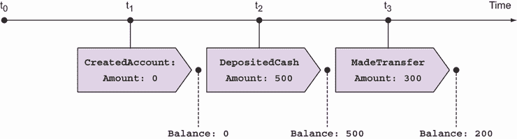
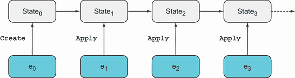
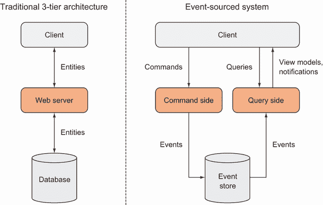
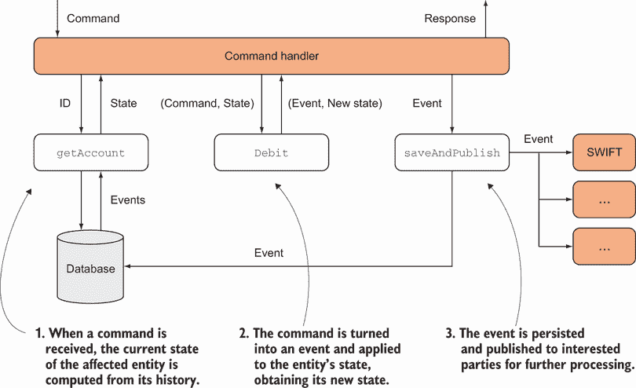
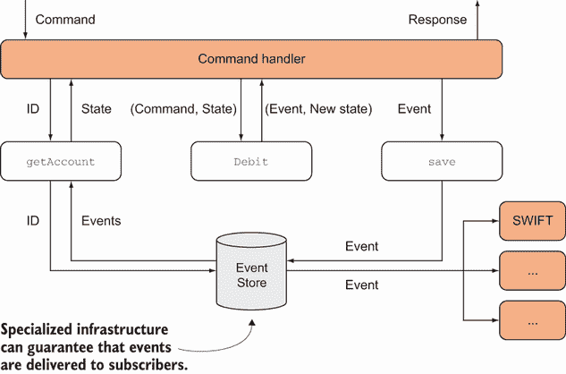
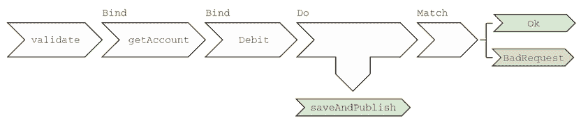
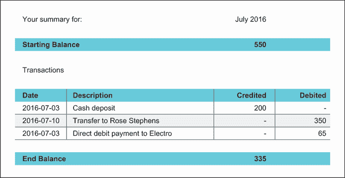

# 13 事件溯源：持久化的函数式方法

本章涵盖

+   关于持久化数据的函数式思考

+   事件溯源的概念和实现

+   事件溯源系统的架构

在第十一章中，您看到在函数式编程中，我们避免修改状态，特别是全局状态。我提到过数据库也是一种状态，因此它也应该是不变的吗？什么？是的，你没有看到这一点吗？从概念上讲，数据库只是一个数据结构。它存储在内存中还是磁盘上，最终只是实现细节。

在第十二章中，您看到了函数式数据结构，尽管不可变，但可以进化：您可以创建任何给定结构的新状态或新视图，这些新状态或新视图基于原始结构，但不会改变原始结构。这个想法（我们通过对象、列表和树来探讨）自然适用于内存数据，也适用于存储数据，这就是我们的应用程序如何在不进行变异的情况下表示变化，甚至在数据库级别也是如此。

目前有两种实现“追加”数据存储的方法：

+   *基于断言的*——将数据库视为一个在给定时间点始终增长的、包含真实事实的集合

+   *基于事件的*——将数据库视为一个在给定时间点始终增长的、包含事件的集合

在这两种情况下，数据永远不会更新或删除，只有追加。¹ 我将在第 13.4 节中更详细地比较这两种方法，但我们将在本章的大部分内容中讨论基于事件的途径，通常称为*事件溯源*（ES）。这是因为它更容易理解和实现，使用各种类型的后端存储，并且在.NET 社区中的采用范围更广。

## 13.1 关于数据存储的函数式思考

今天的大多数服务器应用程序都是*无状态的*：当它们收到请求时，它们从数据库中检索所需的数据，进行一些处理，并持久化相关的更改（见图 13.1）。²



图 13.1 所说的无状态服务器通常依赖于一个称为数据库的大块可变数据。

事实上，无状态服务器方法之所以有效，正是因为状态是如此复杂的一个来源。如果您需要数据时可以从空中（如此说）获取数据，那么许多困难的问题就会消失。本质上，这就是无状态服务器所做的事情。

这也意味着在无状态服务器中相对容易避免状态变异：只需创建新的、更新的数据版本，并将这些版本持久化到数据库中。但如果我们认为在数据库中的值在过程中被更新或删除时我们在开发函数式程序，那我们就自欺欺人。当我们使用 CRUD 方法（就地更新存储的数据）开发应用程序时，我们本质上是在使用数据库作为一个大块的全球可变状态。

### 13.1.1 为什么数据存储应该是追加的

关系型数据库已经使用了大约 40 年。它们是在磁盘空间稀缺的时代被构思的，因此高效使用这些数据库至关重要。通常，只存储当前状态。当客户更改地址时，旧地址会被新地址覆盖——这种思维方式我们至今仍然保留，尽管现在它已经完全过时了。

现在，在大数据时代，情况已经逆转：存储便宜，数据有价值。覆盖数据就像把钱扔出窗外。假设一个客户从他们的购物车中移除一个商品——你该怎么办？你在数据库中删除一行吗？如果你这样做，你刚刚删除了可能有助于确定某些商品为什么没有按预期销售的有价值信息。也许客户经常在购买中途放弃某些商品，并用建议列表中的更便宜的商品替换它们。如果你删除数据，你就永远无法进行这种分析。

这就是为什么只追加存储的想法得到了人们的认可——永不删除或覆盖任何数据，只追加新数据。（例如，想想你用来存储代码的版本控制系统。你在提交新更改时是否会覆盖现有代码？）

只追加存储具有另一个显著的优点：它消除了数据库争用的问题。数据库引擎内部使用锁来确保并发连接修改相同字段时不会相互冲突。例如，想象你有一个电子商务网站，某个特定产品的购买热潮。如果该产品的库存计数被建模为一个数据库单元格中的值，该值在订单提交时更新，那么这将对该单元格造成争用，使数据库访问效率低下。像事件溯源这样的只追加方法可以消除这个问题。让我们看看事件溯源是什么样的。

### 13.1.2 放松并忘记存储状态

在第十一章中，我们探讨的一个重要思想是状态与实体之间的关系。*状态* 是实体在某一时刻的快照；相反，*实体* 是一系列逻辑上相关的状态的序列。*状态转换* 导致新的状态与实体相关联，或者更直观地说，导致实体从一个状态转换到下一个状态。

状态转换是由 *事件* 触发的；例如，你的银行账户会受到存款、取款、银行费用等事件的影响。因此，你的银行账户状态会发生变化，如图 13.2 所示。



图 13.2 实体可以被视为一系列逻辑上相关的状态的序列。实体的身份保持不变，但状态会随着影响实体状态的事件而变化。

作为开发者，我们往往过于关注状态的表示。事实上，我们常常想当然地认为我们必须 *持久化* 状态。但这个隐含的假设是没有根据的：这只是关系型数据库盛行了半个世纪的效果。

通常，我们使用关系型数据库只存储实体的最新状态，覆盖之前的状态。当我们真正需要了解过去时，我们通常使用历史表来存储所有快照。这种方法效率低下，因为我们正在复制快照之间未更改的所有数据，而且它不有效，因为我们必须运行复杂的逻辑来比较两个状态，如果我们想找出导致变化的原因。

事件溯源（ES）将事物颠倒过来：它将重点从状态转移到状态转换。它不存储关于状态的数据，而是存储关于事件的数据。通过重新播放影响实体的所有事件，总是可以重建实体的当前状态。

图 13.3 显示了与图 13.2 相同的信息，但重点已改变。我们不想关注状态：*状态是次要的*。事实上，实体的状态（字面上）是其事件历史的函数。



图 13.3 事件溯源意味着在思考实体时的重点转移。我们不是关注实体的状态，而是关注导致新状态的转换。

给定实体的两个连续状态，很难确定导致转换的事件。相比之下，给定实体的状态和影响该实体的一个事件，很容易确定实体的新状态。因此，在 ES 中，我们持久化捕获事件细节的数据，而不是状态。

## 13.2 事件溯源基础

接下来，我们将看看如何在实践中应用这些想法，通过我们的 BOC 场景来说明。你会看到

+   *事件*被表示为简单的、不可变的数据对象，它们捕捉了发生的事情的细节。

+   *状态*也被表示为不可变的数据对象，尽管它们可能比事件具有更复杂的结构，例如父子关系。

+   *状态转换*被表示为接受状态和事件作为参数并产生新状态的函数。

最后，你将看到如何从实体的事件历史中重新创建实体的状态。

### 13.2.1 事件表示

事件实际上非常简单，是捕获所需信息量最少的数据对象，以忠实代表发生的事情。例如，以下列表显示了一些可能影响银行账户的事件。

列表 13.1 影响银行账户的一些事件

```
public abstract record Event
(
   Guid EntityId,        ❶
   DateTime Timestamp
);

public record CreatedAccount
(
   Guid EntityId,
   DateTime Timestamp,
   CurrencyCode Currency
)
: Event(EntityId, Timestamp);

public record FrozeAccount
(
   Guid EntityId,
   DateTime Timestamp
)
: Event(EntityId, Timestamp);

public record DepositedCash
(
   Guid EntityId,
   DateTime Timestamp,
   decimal Amount,
   Guid BranchId
)
: Event(EntityId, Timestamp);

public record DebitedTransfer
(
   Guid EntityId,
   DateTime Timestamp,

   string Beneficiary,
   string Iban,
   string Bic,

   decimal DebitedAmount,
   string Reference
)
: Event(EntityId, Timestamp);
```

❶ 识别受影响的实体（在这种情况下，是一个账户）

前述事件只是可能影响账户的事件的一个子集（最明显的是，我们遗漏了现金提取和已记入的转账）。但它们足以代表，通过这些例子，你可以了解其他事件是如何处理的。

事件应该是不可变的：它们代表过去发生的事情，过去的事情无法改变。它们被持久化到存储中，因此它们也必须是可序列化的。

### 13.2.2 持续事件

如果你查看列表 13.1 中的示例事件，目的是将它们持久化到数据库中，你会立即注意到所有事件的结构都不同（不同的字段），因此你不能将它们存储在固定格式的结构中，如关系表。存储事件有多种选择。按照事件导向递减的顺序，你应该考虑使用以下选项：

+   一种专门的事件数据库，如 Event Store ([`geteventstore.com`](https://geteventstore.com))，它是专门为事件源系统设计的。

+   一种文档数据库，如 Redis、MongoDB 等。这些存储系统对其存储的数据结构不做任何假设。

+   一种传统的 SQL Server 关系型数据库。

**注意** 无论你使用什么存储来持久化你的事件，通常都被称为**事件存储**。不要将其与本章中始终大写的 Event Store（事件存储）混淆，它是一个包含事件存储和许多相关功能的具体产品。

如果你选择在关系型数据库中存储事件，你需要一个包含一些标题列（如`EntityId`和`Timestamp`）的事件表，这些列是你查询实体事件历史（按时间排序，可能按时间过滤）所必需的。事件负载被序列化为 JSON 字符串并存储在一个宽列中，如表 13.1 所示。

表 13.1 事件数据可以存储在关系型数据库表中。

| EntityId | Timestamp | EventType | Data |
| --- | --- | --- | --- |
| abcd | 2021-07-22 12:40 | CreatedAccount | { "Currency": "EUR" } |
| abcd | 2021-07-30 13:25 | DepositedCash | { "Amount": 500, "BranchId": "BOCLHAYMCKT" } |
| abcd | 2021-08-03 10:33 | DebitedTransfer | { "DebitedAmount": 300, "Beneficiary": "Rose Stephens", ...} |

所有的三种存储选项都是可行的；这取决于你的需求和现有基础设施。如果你的大部分数据已经存储在关系型数据库中，而你只想将某些实体的事件源化，那么使用同一个数据库可能是有意义的，因为它将涉及更少的运营开销。

### 13.2.3 表示状态

我们在第十一章的大部分内容中讨论了如何表示状态，所以我们已经处于一个非常好的位置。但现在我们必须问一个问题，如果我们使用事件进行持久化，这些状态或快照的目的是什么？结果是，我们仍然需要数据实体的状态快照，出于两个完全独立的目的：

+   *我们需要快照来决定如何处理命令。* 例如，如果服务器收到一个转账命令，而账户被冻结或余额不足，那么它必须拒绝该命令。

+   *我们还需要快照来向客户端显示。* 我将它们称为**视图模型**。³

让我们处理第一种快照类型（我们将在 13.3.4 节中查看视图模型）。我们需要一个快照，它只捕获我们为了做出处理命令的决定所需要的内容。以下列表显示了一个这样的对象，它模拟账户状态。

列表 13.2 实体状态的简化模型

```
public sealed record AccountState
(
   CurrencyCode Currency,
   AccountStatus Status = AccountStatus.Requested,
   decimal Balance = 0m,
   decimal AllowedOverdraft = 0m
);
```

你会注意到，这与第十一章中讨论的`AccountState`类型相比有所简化。具体来说，我没有列出交易，因为我假设当前的余额和账户状态足以做出处理任何命令的决定。交易可以显示给用户，但在处理命令时不是必需的。

### 13.2.4 表示状态转换

现在我们来看看状态和事件是如何在状态转换中结合的。一旦你有一个状态和一个事件，你可以通过将事件应用于状态来计算下一个状态。这种计算称为*状态转换*，它是一个具有以下通用形式的函数：

```
state → event → state
```

换句话说，“给我一个状态和一个事件，我将计算事件之后的新状态。”针对我们的场景，这个签名变为

```
AccountState → Event → AccountState
```

在这里，`Event`是我们所有事件从中派生的基类，因此实现必须对事件类型进行模式匹配，然后计算一个新的`AccountState`，并包含相关的更改。

此外，还有一个特殊的状态转换，即账户首次创建时。在这种情况下，我们有一个事件但没有先前的状态，因此签名是这样的：

```
event → state
```

以下列表显示了我们的场景的实现。

列表 13.3 状态转换建模

```
public static class Account
{
   public static AccountState Create(CreatedAccount evt)   ❶
      => new AccountState
      (
         Currency: evt.Currency,
         Status: AccountStatus.Active
      );

   public static AccountState Apply
      (this AccountState acc, Event evt)
      => evt switch                                        ❷
      {
         DepositedCash e
            => acc with { Balance = acc.Balance + e.Amount },

         DebitedTransfer e
            => acc with { Balance = acc.Balance - e.DebitedAmount },

         FrozeAccount
            => acc with { Status = AccountStatus.Frozen },

         _ => throw new InvalidOperationException()        ❸
      };
}
```

❶ `CreatedAccount`是一个特殊情况，因为没有先前的状态。

❷ 根据事件类型执行相关的转换

❸ 丢弃模式匹配任何未定义处理的事件。

第一种方法是创建的特殊情况：它接受一个`CreatedAccount`事件并创建一个新的`AccountState`，该状态包含来自事件的价值。为了简化问题，让我们假设账户一旦创建就可以设置为`Active`状态。

`Apply`方法是对状态转换的更一般化表述，它将通过事件类型进行模式匹配来处理所有其他类型的事件。如果事件是`FrozeAccount`，我们返回一个状态为`Frozen`的新状态；如果事件是`DepositedCash`，我们相应地增加余额，依此类推。在实际应用中，这里会有更多类型的事件。

无限制继承和丢弃模式

列表 13.3 中的`switch`表达式包含强制性的*丢弃模式*，用于处理任何与显式指定的模式不匹配的事件。这里的“强制性”是指，如果你省略它，你将收到编译器警告：没有丢弃模式，编译器无法假设模式匹配是穷尽的。`Event`可能有其他子类，甚至是在其他程序集中定义的、单独编译的子类。

如果丢弃模式匹配，总是抛出异常是明智的。如果你引入了一种新的事件类型，却忘记定义如何处理它，你希望代码失败。

大多数静态类型函数式语言在求和类型上采取不同的方法：当你定义一个求和类型时，你也定义了所有可能的子类型。例如，你可以说一个`List`可以是`Empty`或`Cons`，*没有其他*类型。在 C#中，以这种方式限制继承是不可能的，这导致我为本书中的大多数求和类型定义了`Match`方法。

在你可以穷尽地指定求和类型可能情况的编程语言中，模式匹配变得更加强大。编译器知道你的系统可以处理的所有可能的`Event`类型。这意味着你不再需要丢弃模式，更重要的是，如果你添加了一种新的`Event`类型，编译器会指出处理`Event`的所有地方，从而有效地指导你的开发过程。（你会得到编译器错误，显示你需要处理新情况的地方，而不是从丢弃模式匹配中抛出的运行时错误。）

注意，这种使用数据（例如不同类型的事件或命令）来执行不同逻辑的数据驱动方法与面向对象程序员所珍视的开放封闭原则完全相悖。

### 13.2.5 从过去事件重建当前状态

现在你已经看到了如何表示状态和事件，以及如何将它们与状态转换相结合，你就可以看到如何从影响该实体的过去事件历史中计算实体的当前状态。这在图 13.4 中进行了图形表示。



图 13.4 从事件历史中恢复实体的当前状态

你有一系列影响账户的事件，你想要计算账户的当前状态。以下是需要考虑的三个因素：

+   当你从一个列表开始，并希望最终得到一个单一值时，你使用`Aggregate`。

+   列表中的第一个事件导致账户被创建，而后续事件涉及状态转换。

+   最后一个细节：想象一下，你查询数据库以获取所有关于账户 123 的事件，并得到一个空列表。这意味着该账户没有任何历史，因此实际上它不存在，你应该得到一个`None`。

下面的列表显示了如何从事件历史中计算账户的状态。

列表 13.4 从事件历史中计算实体的状态

```
public static Option<AccountState> From
   (IEnumerable<Event> history)                             ❶
   => history.Match
   (
      Empty: () => None,
      Otherwise: (created, otherEvents) => Some
      (
         otherEvents.Aggregate
         (
            seed: Account.Create((CreatedAccount)created),  ❷
            func: (state, evt) => state.Apply(evt)          ❸
         )
      )
   );
```

❶ 给定事件历史

❷ 从第一个事件创建一个新的账户，将其用作累加器

❸ 应用每个后续事件

让我们先看看签名。我们正在处理一系列事件：实体的历史。这是当你查询给定账户 ID 的所有事件时从数据库中获取的事件列表。我假设这个序列是有序的；最早发生的事件应该在列表的顶部。你必须强制执行这一点，当你从数据库检索事件时，这通常是不需要额外工作的：因为事件在发生时持久化，它们按顺序附加，并且当它们被检索时，这种顺序通常被保留。

我们接着使用在第 12.1.3 节中定义的`Match`方法。这允许你处理空事件历史的情况，在这种情况下，账户实际上不存在，代码返回`None`。这就是为什么`AccountState`的期望返回类型被包裹在`Option`中的原因。

如果列表不为空，它将被分解为其头部和尾部。头部必须是一个`CreatedAccount`事件，而尾部包含所有后续事件。代码从`CreatedAccount`事件计算账户的初始状态，然后将其用作`Aggregate`的累加器，将所有后续事件应用于此初始状态，从而获得当前状态。

注意，如果你想看到账户的当前状态而不是过去任何时刻的状态，这可以通过评估相同的函数但只包括在所需日期之前发生的事件来轻易完成。因此，当需要审计跟踪并需要查看实体随时间变化的情况时，事件源是一个有价值的模型。

现在你已经看到了事件源如何提供一个可行的、只追加的持久化模型，从这个模型中可以轻松地计算出当前或过去的状态，让我们从高层次架构的角度看看事件源系统是什么样的。

## 13.3 事件源系统的架构

事件源系统中的数据流与传统系统中由关系型存储支持的数据流不同。如图 13.5 所示，在面向 CRUD 的系统（创建、读取、更新、删除）中，程序处理实体或，更好的说法，是状态。状态保存在数据库中；服务器检索状态；状态发送到客户端。在*模型*（数据库中存储的数据）和*视图模型*（发送到客户端的数据）之间的转换通常是微小的。



图 13.5 传统系统与事件源系统数据流的高级比较

在事件源系统中，情况相当不同。我们持久化的是事件。但用户不会想看到事件日志，因此我们提供给用户消费的数据必须以有意义的方式结构化。因此，事件源系统可以被干净地分成两个独立的部分——通常，两个独立的服务器应用程序：

+   *命令端*—这一端负责写入数据，主要是由处理从客户端接收到的命令组成。命令首先进行验证，有效的命令会导致事件被持久化和发布。

+   *查询端*—这一端负责读取数据。视图模型由你希望在客户端显示的内容决定，查询端必须从存储的事件中填充这些视图模型。可选地，查询端还可以在新的事件导致视图更改时向客户端发布通知。

命令和查询端的这种自然分离导致组件更小、更专注。它还提供了灵活性：命令和查询端可以是完全独立的应用程序，因此可以独立扩展和部署。当你认为查询端的负载可能远大于命令端时，这很有优势。例如，想想当你访问像 Twitter 或 Facebook 这样的网站时，你发布的数据量与检索的数据量相比是多么的小。

相反，在命令端，你可能需要同步写入以防止并发更改。如果命令端只有一个实例，这将更容易实现。这种分离（被称为*CQRS*，即命令/查询责任分离），允许你轻松扩展数据密集型查询端以满足需求，同时保持较少或甚至只有一个命令端实例。

命令和查询端不必是独立的应用程序。它们可以存在于同一个应用程序中。但如果你使用事件源，这两端之间仍然存在内部分离。让我们看看如何实现它们，从命令端开始。

### 13.3.1 处理命令

命令，如果你愿意，是数据的最早期来源。命令由客户端发送到你的应用程序，并由命令端处理，它必须执行以下操作：

+   验证命令

+   将命令转换为事件

+   持久化事件并将其发布给感兴趣的各方

让我们先比较命令和事件，它们相似但不同：

+   *命令*—代表客户端的请求。由于某些原因，命令可能被忽视或不遵守。也许命令验证失败，或者处理它时系统崩溃。命令应使用祈使句命名，例如`MakeTransfer`或`FreezeAccount`。

+   *事件*—代表已经发生的事情。因此，它们不能失败或被忽视。它们应使用过去时命名，例如`DebitedTransfer`或`FrozeAccount`。在 ES 的上下文中，术语*事件*指的是导致状态转换的事件，因此必须被持久化（如果你有其他更短暂的事件需要持久化，确保你清楚地区分它们）。

除了这些，命令和事件通常捕获相同的信息，从命令创建事件只是逐字段复制（有时会有一些变化）。以下列表提供了一个示例。

列表 13.5 将命令转换为事件

```
using Boc.Domain.Events;                            ❶

namespace Boc.Commands;                             ❷

public abstract record Command(DateTime Timestamp);

public record FreezeAccount
(
   DateTime Timestamp,
   Guid AccountId
)
   : Command(Timestamp)
{
   public FrozeAccount ToEvent() => new             ❸
   (
      EntityId: this.AccountId,
      Timestamp: this.Timestamp
   );
}

// more commands here...
```

❶ 事件是领域定义的一部分。

❷ 命令是高级客户端代码的一部分。

❸ 通过逐字段复制值将命令转换为事件

我为 BOC 应用程序中的每个命令定义了类似的`ToEvent`方法。请注意，事件是在你的领域定义中定义的（因此，`Boc.Domain.Events`命名空间），而命令实际上是客户端代码的一部分（可能，事件可以在你的命令处理代码所依赖的较低级别的程序集上定义）。

事件直接影响单个实体，但事件在你的系统中广播，因此它们可能会触发创建其他事件，这些事件影响其他实体。例如，转账直接影响银行账户，但间接影响银行的现金储备。

接下来，让我们看看命令端的主要工作流程，如图 13.6 所示。



图 13.6 事件源系统的命令端

首先，我将忽略验证和错误处理，这样你可以专注于数据流的基本要素。以下列表显示了命令端的入口点和主要工作流程。

列表 13.6 顶级命令处理工作流程

```
public static void ConfigureMakeTransferEndpoint
(
   WebApplication app,
   Func<Guid, AccountState> getAccount,
   Action<Event> saveAndPublish
)
=> app.MapPost("/Transfer/Make", (MakeTransfer cmd) =>    ❶
{
   var account = getAccount(cmd.DebitedAccountId);        ❷

   var (evt, newState) = account.Debit(cmd);              ❸

   saveAndPublish(evt);                                   ❹

   return Ok(new { newState.Balance });                   ❺
});
```

❶ 处理接收命令

❷ 检索账户

❸ 执行状态转换；返回包含事件和新状态的元组

❹ 持久化事件并向感兴趣方发布

❺ 向客户端返回有关新状态的信息

此代码依赖于两个函数：

+   `getAccount`—检索受影响账户的当前状态（从其事件历史中计算得出，如你在第 13.2.5 节中看到的）

+   `saveAndPublish`—将给定的事件持久化到存储中，并将其发布给任何感兴趣的方

现在来看端点本身。它接收一个执行转账的命令，并使用`getAccount`函数来检索将被扣除的账户的状态。然后，它将检索到的账户状态和命令传递给`Debit`函数，该函数执行状态转换。

`Debit`返回一个包含创建的事件和账户新状态的元组。然后，代码将元组解构为其两个元素：传递给`saveAndPublish`的创建事件，以及用于填充发送回客户端的响应的账户新状态。让我们看看`Debit`函数：

```
public static class Account
{
   public static (Event Event, AccountState NewState) Debit
   (
      this AccountState currentState,
      MakeTransfer transfer
   )
   {
      Event evt = transfer.ToEvent();                      ❶
      AccountState newState = currentState.Apply(evt);     ❷

      return (evt, newState);
   }
}
```

❶ 将命令转换为事件

❷ 计算新状态

`Debit` 将命令转换为事件，并将该事件以及账户的当前状态输入到 `Apply` 函数中，以获得账户的新状态。请注意，这正是当从事件历史中计算账户的当前状态时使用的 `Apply` 函数。⁴ 这确保了状态转换的一致性，无论事件是现在刚刚发生还是过去发生并被重放。

### 13.3.2 处理事件

我们实际上将钱发送给收款人？这是作为 `saveAndPublish` 的一部分完成的：新创建的事件应该传播给相关方。一个专门的服务应该订阅这些事件，并将钱发送到接收银行（通过 SWIFT 或其他银行间平台）。

这可能有助于解释为什么函数被命名为 `saveAndPublish`：这两件事都应该原子性地发生。如果在所有订阅者能够处理事件之前，进程保存了事件然后崩溃，系统可能处于不一致的状态。例如，账户可能被扣除，但钱没有发送到 SWIFT。

如何实现这种原子性有些复杂，并且严格依赖于你针对的基础设施（无论是存储还是事件传播）。例如，如果你使用 Event Store，你可以利用事件流的 *持久* 订阅，这保证了事件至少被发送给订阅者一次（在这个上下文中，“持久”的含义）。

通过使用 Event Store，你可以简化 `saveAndPublish` 中的逻辑，使其只保存事件。事件处理程序随后订阅 Event Store 的事件流，如图 13.7 所示。



图 13.7 事件处理程序可以订阅 Event Store 发布的事件流。

### 13.3.3 添加验证

现在让我们添加验证，以便只有当账户的当前状态允许时，命令才被接受并转换为事件。这将在下面的列表中展示。

列表 13.7 确保只发生有效的转换

```
public static class Account
{
   public static Validation<(Event Event, AccountState NewState)> Debit
      (this AccountState account, MakeTransfer transfer)
   {
      if (account.Status != AccountStatus.Active)
         return Errors.AccountNotActive;

      if (account.Balance - transfer.Amount < account.AllowedOverdraft)
         return Errors.InsufficientBalance;

      Event evt = transfer.ToEvent();
      AccountState newState = account.Apply(evt);

      return (evt, newState);
   }
}
```

在这里，`Debit` 执行一些特定于账户的验证，因此返回类型被包装在 `Validation` 中：

+   如果验证失败，代码将返回一个 `Error`（在这里，我演示了第 8.3.1 节中描述的方法，其中 `Errors` 类公开了可能在你应用程序中发生的每个错误的属性）。

+   如果一切顺利，它将返回一个包含事件和新的状态的元组。

在任何情况下，返回值都隐式提升到适当状态中的 `Validation`。有了这个，让我们回顾主工作流程，如以下列表所示添加验证。

列表 13.8 带验证的命令处理

```
public static void ConfigureMakeTransferEndpoint
(
   WebApplication app,
   Func<MakeTransfer, Validation<MakeTransfer>> validate,
   Func<Guid, Option<AccountState>> getAccount,
   Action<Event> saveAndPublish
)
=> app.MapPost("/Transfer/Make", (MakeTransfer transfer)
   => validate(transfer)
      .Bind(t => getAccount(t.DebitedAccountId)
         .ToValidation($"No account found for {t.DebitedAccountId}"))
      .Bind(acc => acc.Debit(transfer))
      .Do(result => saveAndPublish(result.Event))
      .Match(
         Invalid: errs => BadRequest(new { Errors = errs }),
         Valid: result => Ok(new { result.NewState.Balance })));
```

这个列表有一个新的依赖项 `validate`，它应该执行一些命令的一般验证，例如确保 IBAN 和 BIC 代码格式正确等。

我在 13.2.5 节提到，检索账户应该返回一个 `Option` 来反映请求的账户没有历史记录的情况。在这里，我们使用 `ToValidation` 将 `Option` 转换为 `Validation`，如果给定的 `Option` 是 `None`，则提供一个 `Error` 值使用。（这是我们在 6.5 节中看到的自然变换的另一个例子。）

命令的验证、实体存在的验证以及 `Debit` 中的账户特定验证都被建模为返回 `Validation` 的函数，因此可以与 `Bind` 结合使用。

工作流程的下一步发生在 `Do` 函数内部（见下文侧边栏）。这调用 `saveAndPublish` 并传递 `Debit` 的结果，因此它可以在后续对 `Match` 的调用中可用：工作流程的最终步骤，根据验证的结果向客户端发送适当的响应。

`Do` 函数

你可以在工作流程的中间使用 `Do` 来执行副作用。`Do` 与 `ForEach` 类似，因为它接受一个执行副作用的功能。而 `ForEach` 会丢弃内部值，`Do` 则将值传递下去，使其对后续逻辑可用。`Do` 的实现很简单：

```
public static Validation<T> Do<T>
   (this Validation<T> val, Action<T> action)
{
   val.ForEach(action);
   return val;
}
```

除了使用 `Do`，你也可以使用 `Map`，给它一个执行副作用并返回其输入的功能；然而，最好是明确表示，所以使用 `Do` 来强调正在执行副作用，而将 `Map` 保留用于没有副作用的纯数据转换。

`Do` 也被称为 `Tap` 或 `Tee`。名字`Tee`非常形象。从管道的角度来思考：`Do` 就像一段 T 形的管道（数据从一端进入，同时流向产生副作用的功能和管道中的后续功能，如图所示）。



与 13.6 列表中的初始骨架相比，13.8 列表中的代码增加了验证但没有异常处理。因为 `getAccount` 和 `saveAndPublish` 执行 I/O，它们中的任何一个都可能失败。为了表达这一点，我们需要将 `Validation` 与另一个效果如 `Exceptional` 结合使用。你将在第十八章中看到如何实现这一点。

你现在应该对事件源系统命令方面的工作方式有了相当好的了解。现在让我们看看查询方面。

### 13.3.4 从事件创建数据视图

现在我们已经看到了事件源系统命令方面的功能，让我们看看查询方面。我们再次从客户端开始探索。客户端以最适合用户需求的方式显示数据，服务器旨在提供显示在这些视图中的数据——视图模型。

让我们以银行账户对账单作为一个典型的银行账户视图。它包含了一个给定时间段内发生的交易列表（假设时间段与日历月份相吻合），以及该时间段开始和结束时的余额。图 13.8 展示了一个示例。



图 13.8 银行对账单示例结构

接下来，让我们定义视图模型的结构，包含填充银行对账单所需的数据。我们将有一个父对象 `AccountStatement`，其中包含一系列 `Transaction`，如下所示。

列表 13.9 银行对账单的视图模型

```
public record AccountStatement
(
   int Month,
   int Year,
   decimal StartingBalance,
   decimal EndBalance,
   IEnumerable<Transaction> Transactions
);

public record Transaction
(
    DateTime Date,
    string Description,
    decimal DebitedAmount = 0m,
    decimal CreditedAmount = 0m
);
```

注意，`AccountStatement` 与你在列表 13.2 中看到的 `AccountState` 相关，但完全独立：

+   `AccountState` 用于命令端来处理可能影响账户的命令，因此服务器逻辑确定应包含哪些数据。

+   `AccountStatement` 是查询部分的一部分，因此客户端确定需要哪些数据。

这两种类型都指向同一个实体，但它们可能定义在不同的命名空间、程序集或甚至不同的应用程序中。

接下来，我们需要从给定账户的事件历史中填充这些数据。请注意，我们需要事件的完整历史记录。以下列表显示了一个为给定时间段填充 `AccountStatement` 的函数，该函数基于账户的事件历史。

列表 13.10 填充 `AccountStatement` 视图模型

```
public static AccountStatement Create
(
   int month,                     ❶
   int year,                      ❶
   IEnumerable<Event> events      ❷
)
{
   var startOfPeriod = new DateTime(year, month, 1);
   var endOfPeriod = startOfPeriod.AddMonths(1);

   var (eventsBeforePeriod, eventsDuringPeriod) = events
      .TakeWhile(e => endOfPeriod < e.Timestamp)
      .Partition(e => e.Timestamp <= startOfPeriod);

   var startingBalance = eventsBeforePeriod
      .Aggregate(0m, BalanceReducer);
   var endBalance = eventsDuringPeriod
      .Aggregate(startingBalance, BalanceReducer);

   return new
   (
      Month: month,
      Year: year,
      StartingBalance: startingBalance,
      EndBalance: endBalance,
      Transactions: eventsDuringPeriod.Bind(CreateTransaction)
   );
}
```

❶ 我们想要填充对账单的期间

❷ 账户的完整事件历史

让我们分析一下代码。首先，事件列表被拆分。我们需要在报表期开始之前发生的事件，以便计算报表期开始时的账户余额，以及在该期间发生的事件，以便计算期末余额。

为了计算起始余额，我们使用 0 作为种子值和一个累加器函数（见第 9.6 节）来累加所有先前事件，该函数根据事件如何影响余额来增加或减少余额。以下列表显示了这种方法。

列表 13.11 模型化每个事件如何影响账户余额的累加器

```
static decimal BalanceReducer(decimal bal, Event evt)
   => evt switch
   {
      DepositedCash e => bal + e.Amount,            ❶
      DebitedTransfer e => bal - e.DebitedAmount,   ❶
      _ => bal                                      ❷
    };
```

❶ 影响余额的事件

❷ 其他事件不影响余额，因此此默认子句返回运行余额。

并非所有事件都会影响余额，因此 `switch` 表达式的丢弃模式返回的是运行余额。

为了计算期末余额，可以使用相同的逻辑，但我们将使用起始余额作为种子值，并累加报表期内的所有事件。

现在是交易列表。一些事件（如转账）涉及交易；其他事件（如账户状态的变化）则不涉及。我在一个名为 `CreateTransaction` 的函数中模拟了这一点，该函数从 `Event` 中填充 `Transaction`：

```
static Option<Transaction> CreateTransaction(Event evt)
   => evt switch
   {
      DepositedCash e => new Transaction
      (
         CreditedAmount: e.Amount,
         Description: $"Deposit at {e.BranchId}",
         Date: e.Timestamp.Date
      ),

      DebitedTransfer e => new Transaction
      (
         DebitedAmount: e.DebitedAmount,
         Description: $"Transfer to {e.Bic}/{e.Iban}; {e.Reference}",
         Date: e.Timestamp.Date
      ),

      _ => None
   };
```

不影响账户余额的事件不涉及交易；因此，此函数返回一个`Option`。您可以使用此函数计算所有属于报表的交易。但您可以使用`Bind`而不是`Map`，后者会生成一个`IEnumerable<Option<Transaction>>`，因为`Bind`会过滤掉所有的`None`，正如我们在第 6.5 节中看到的。

如您所见，从事件列表中填充视图模型需要一些工作和思考。涉及的数据转换通常可以通过常规的`Map`、`Bind`和`Aggregate`函数来完成。视图模型始终围绕用户体验为中心，并且与底层表示完全解耦。

如果涉及处理大量事件，填充视图模型可能会很耗时，因此通常需要一些优化来避免每次需要时都重新计算视图模型。一种这样的优化是查询端缓存每个视图模型的当前版本，并在接收到新事件时更新它。在这种情况下，查询端订阅由命令端发布的事件，并在接收到这些事件后更新缓存的版本，并（可选地）将更新的视图模型发布给连接的客户端。

如您所见，如果您想要一个具有关系数据库（或更好）性能特征的事件源模型，则需要做一些额外的工作来预先计算和维护视图模型。一些更复杂的优化包括为查询端设置一个专门的数据库，其中数据以优化的格式存储以供查询。例如，如果您需要查询具有任意过滤器的视图，这可以是一个关系数据库。这种*查询模型*始终是过去事件的副产品，因此，在出现差异的情况下，事件存储始终作为*真相之源*。

## 13.4 比较不可变存储的不同方法

在本章中，您已经对 ES——一种基于事件的数据存储方法——有一个相当全面的概述。您已经看到为什么它本质上是一种函数式技术，以及存储关于状态转换的数据而不是状态提供的一些重要好处。

在本章开头提到的另一种方法是*断言方法*。在某种程度上，它更类似于关系模型，因为您仍然定义实体和属性，这些本质上类似于关系数据库中的行和列。（例如，您可以定义一个具有`Email`属性的`Person`实体。）

你将通过*断言*来修改这个数据库——例如，“从现在开始，ID 为 123 的`Person`的`Email`属性值为 jobl@manning.com。”在未来，这个属性可能与不同的值相关联，但它在特定时间范围内与 jobl@manning.com 的值相关联的事实永远不会被遗忘、覆盖或销毁。在这个模型中，数据库变成了一个不断增长的实情集合。你可以以与查询关系数据库相同的方式查询数据库，但你可以选择查询当前状态或任何时间点的状态。

在基于断言和基于事件的方法中，你得到以下好处：

+   审计跟踪，使得能够查询实体在任何时间点的状态

+   没有数据库冲突，因为数据永远不会被覆盖

这些好处是固有的，因为这两种方法都拥抱不可变性。让我们看看可能影响你在这两种方法之间选择的其他因素。

### 13.4.1 Datomic 与 Event Store

基于断言的方法实际上只有一个实现，那就是 Datomic ([`www.datomic.com/`](http://www.datomic.com/))，除了这里讨论的原则之外，它还实现了其他有趣的设计决策，使其在性能和可扩展性方面具有良好特性。Datomic 是一个专有产品，有一个在可扩展性方面受限的免费版本。自行推出基于断言的存储系统将是一项艰巨的任务。

相反，实现一个事件源系统相对简单：本章已经涵盖了大部分所需内容。你可以使用任何数据库（无论是 NoSQL 还是关系型）作为底层存储来编写有效的实现。对于大规模应用，仍然值得使用专门为 ES 设计的数据库，例如开源的 Event Store。⁵ 简而言之，如果你想使用基于断言的方法，你几乎不得不使用 Datomic；对于 ES，你可能需要或选择使用 Event Store。

由于 Event Store 是用.NET 开发的，它提供了一个.NET 客户端，用于通过 TCP 与存储进行通信，该项目在.NET 社区中具有良好的可见性。Datomic 是用 Clojure 开发的，与.NET 的互操作性不佳。⁶ 这些方面使得 Event Store 更有优势，部分原因是因为这一点，我们在.NET 用户中看到了对 ES（无论是否使用 Event Store）的更广泛采用。

### 13.4.2 你的领域有多少是事件驱动的？

在决定任何技术时，最重要的考虑因素是特定领域的具体需求：一些应用程序本质上是事件驱动的，而另一些则不是。

你如何评估 ES 是否适合你的需求？首先，看看你认为是领域事件的什么。它们有多重要？其次，看看提供的数据类型和参与方消费的数据类型之间是否存在自然差异。

以在线拍卖领域为例进行考虑。一个典型的事件是当客户对某件物品出价时。这个事件会触发变化：客户成为最高出价者，下一次出价的价值提高。另一个重要的事件是当锤子落下时。最高出价者有义务购买该物品，该物品不再出售，等等。这个领域无疑是事件驱动的。

此外，客户端消耗的数据往往与它们产生的数据形状完全不同：大多数客户端产生单个出价，但他们可能消耗包含待售物品细节、迄今为止对该物品的出价历史或他们购买物品列表的数据。因此，用户操作（命令）和它们消耗的数据（查询）之间已经存在自然解耦。ES 是这个领域的自然选择。

与此相反，想象一个能够使保险公司管理其产品的应用程序。你能想到哪些事件？可以创建一项新政策，或者将其退役，或者修改某些参数……但是等等，这些本质上都是 CRUD 操作！你仍然需要一个审计日志，因为一旦修改生效，修改产品特性可能会影响数千份合同。这非常适合基于断言的数据库。

不可变数据存储是未来发展的一个值得关注领域，因为这两种不可变存储方法都为现代应用的需求和挑战提供了重要的回应。

## 摘要

+   关于数据的功能性思考也涵盖了存储。与其修改存储的数据，不如将数据库视为一个大的不可变集合：你可以添加新数据，但永远不能覆盖现有数据。

+   不可变存储主要有两种方法：

    +   *基于事件的*——数据库是一个不断增长的事件集合。

    +   *基于断言的*——数据库是一个不断增长的事实集合。

+   事件源意味着在事件发生时持久化事件数据。实体的状态不需要存储，因为它总是可以计算为影响实体的所有事件的“总和”。

+   事件源系统自然地将读取和写入数据的关注点分开，使得 CQRS 架构能够在以下方面进行分离

    +   *命令端*——命令被接收、验证，并转换为持久化和发布的事件。

    +   *查询端*——事件被组合以创建视图模型，这些模型被提供给客户端，并且可选地缓存以提高性能。

+   事件源系统包括以下组件：

    +   *命令*——简单、不可变的数据对象，封装了来自客户端的请求。

    +   *事件*——简单、不可变的数据对象，捕捉发生了什么。

    +   *状态*——表示实体在某个时间点的状态的数据对象。

    +   *状态转换*——接受状态和事件作为输入并产生新状态的函数。

    +   *视图模型*——用于填充视图的数据对象。它们是从事件计算得出的。

    +   *事件处理器*——这些订阅事件以执行业务逻辑（在命令端）或更新视图模型（在查询端）。

* * *

¹ 关系型数据库的传统功能是 CRUD 操作：创建、读取、更新和删除。数据存储的功能方法是 CRA：创建、读取、追加。

² 无状态服务器易于扩展：您可以拥有无数实例，所有这些实例都可以相互处理请求。相比之下，如果一个服务器是有状态的，并且根据其内部状态以不同的方式处理请求，那么您将限制为单个实例，或者您必须设计一种机制来确保不同的实例表现一致。

³ 在以事件形式存储的数据上运行复杂的分析可能效率低下，因此您也可能出于这个原因决定存储快照。这些快照被称为*投影*，并且随着事件的发生而更新，以便以高效格式查询数据。它们与视图模型在本质上没有区别（更准确地说，您可以将视图模型视为投影），因此在这本书中我不会专门处理投影。

⁴ 其他 ES 的作者可能会允许在这一点上将命令转换为多个事件，但我发现这往往会增加复杂性而没有带来任何真正的益处。相反，我发现命令应该转换为单个事件。当这个事件发布后，下游的事件处理器可以创建其他事件，影响相同的实体，但更频繁地影响其他实体。

⁵ 尽管 Event Store 对.NET 用户特别有吸引力，但它并不是唯一围绕事件流设计的数据库。另一个基于相同原则的堆栈是 Apache Kafka（它管理事件流）和 Samza（一个用于维护从这些流中计算出的视图模型的框架）。

⁶ 截至 2021 年，没有本地的.NET 客户端，因此只能通过 RESTful API 连接到 Datomic，这被认为是过时的。更多信息，请参阅[`docs.datomic.com/on-prem/reference/languages.html`](https://docs.datomic.com/on-prem/reference/languages.html)。
