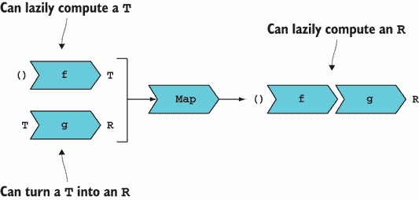
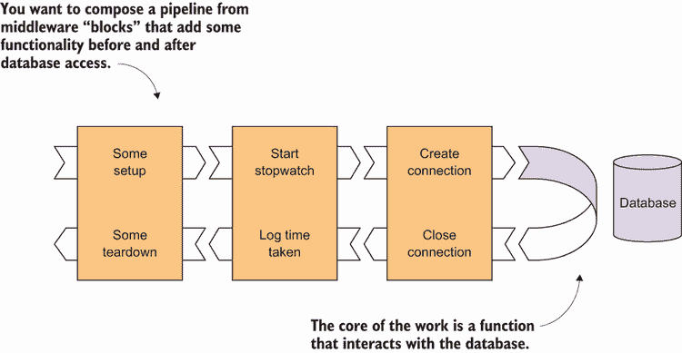
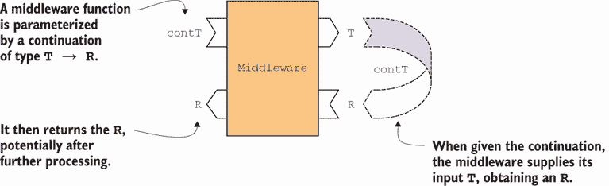
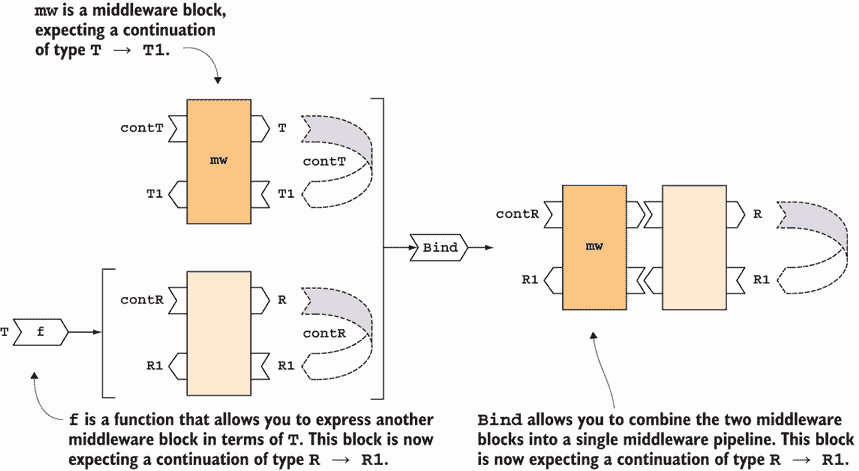
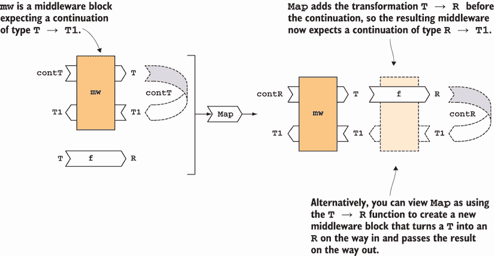

# 14 懒计算、延续和单子组合的美丽

本章涵盖

+   懒计算

+   使用 `Try` 进行异常处理

+   单子组合函数

+   使用延续逃离厄运金字塔

在本章中，你将首先了解为什么有时定义**懒计算**（可能或可能不进行评估的函数）是可取的。然后，你将看到这些函数如何与其他函数独立于它们的评估进行组合。

一旦你对懒计算有了基本的了解，懒计算只是普通的函数，你就会看到相同的技巧可以扩展到除了懒性之外还有其他有用效果的计算。具体来说，你将学习如何使用 `Try` 代理安全地运行可能抛出异常的代码，以及如何组合多个 `Try`。然后，你将学习如何组合带有回调的函数，而不会陷入**回调地狱**。

这些技巧共同之处在于，在所有情况下，你都将函数视为具有某些特定特性的**事物**，并且可以独立于它们的执行进行组合。这需要抽象上的飞跃，但结果是相当强大的。

注意：本章内容具有挑战性，所以如果你在第一次阅读时没有完全理解，请不要气馁。

## 14.1 懒性的美德

计算中的**懒性**意味着将计算推迟到结果需要时。当计算昂贵且其结果可能不需要时，这很有益。

为了引入懒性的概念，考虑以下一个随机选择两个给定元素之一的方法的例子。你可以在 REPL 中尝试它：

```
var rand = new Random();

T Pick<T>(T l, T r) =>
   rand.NextDouble() < 0.5 ? l : r;

Pick(1 + 2, 3 + 4) // => 3, or 7
```

这里值得指出的是，当你调用 `Pick` 时，即使最终只需要其中一个，`1 + 2` 和 `3 + 4` 这两个表达式都会被评估。¹ 因此，程序执行了一些不必要的计算。这是次优的，如果计算足够昂贵，应该避免这种情况。为了防止这种情况，我们可以将 `Pick` 重新编写为不是接受两个值，而是接受两个懒计算；也就是说，可以产生所需值的函数：

```
T Pick<T>(Func<T> l, Func<T> r) =>
   (rand.NextDouble() < 0.5 ? l : r)();

Pick(() => 1 + 2, () => 3 + 4) // => 3, or 7
```

`Pick` 现在首先在两个函数之间进行选择，然后评估其中一个。结果，只执行了一个计算。

总结来说，如果你不确定一个值是否会被需要，并且计算它可能很昂贵，可以通过将值包装在一个计算该值的函数中来懒性地传递该值。

注意：整数加法是一个极快的操作，所以在这个特定的例子中，分配两个 lambda 的成本超过了使计算懒性的好处。这种技术只有在计算密集型操作或执行 I/O 的操作中才是合理的。

接下来，你将看到这种懒 API 在处理 `Option` 时如何有益。

### 14.1.1 用于处理 Option 的懒 API

`Option` API 提供了一些很好的例子，说明了懒性如何有用。让我们看看这些例子。

提供回退 `Option`

想象你有一个返回 `Option` 的操作，并且你想提供一个回退——如果第一个操作返回 `None`，则使用另一个产生 `Option` 的操作。以这种方式组合两个这样的 `Option` 返回函数是常见场景，通过定义如下 `OrElse` 函数来实现：

```
public static Option<T> OrElse<T>
   (this Option<T> left, Option<T> right)
   => left.Match
   (
      () => right,
      (_) => left
   );
```

`OrElse` 简单地返回左边的 `Option` 如果它是 `Some`；否则，它回退到右边的 `Option`。例如，假设你定义了一个从缓存中查找项目的存储库，如果失败，则转到数据库：

```
interface IRepository<T> { Option<T> Lookup(Guid id); }

class CachingRepository<T> : IRepository<T>
{
   IDictionary<Guid, T> cache;
   IRepository<T> db;

   public Option<T> Lookup(Guid id)
      => cache.Lookup(id).OrElse(db.Lookup(id));
}
```

你能在前面的代码中看到问题吗？因为 `OrElse` 总是被调用，其参数总是被评估，这意味着即使项目在缓存中找到，你也会击中数据库。这完全违背了缓存的目的！

这可以通过使用惰性来解决。对于此类场景，我定义了一个 `OrElse` 的重载，它接受一个回退 `Option` 而不是将被评估以产生回退 `Option` 的函数：

```
public static Option<T> OrElse<T>
   (this Option<T> opt, Func<Option<T>> fallback)
   => opt.Match
   (
      None: fallback,    ❶
      Some: _ => opt
   );
```

❶ 仅在 `None` 的情况下评估回退函数

在这个实现中，只有当 `opt` 为 `None` 时，`fallback` 函数才会被评估。（与之前显示的重载相比，其中回退选项 `right` 总是被评估。）你可以相应地修复缓存存储库的实现，如下所示：

```
public Option<T> Lookup(Guid id)
   => cache.Lookup(id).OrElse(() => db.Lookup(id));
```

现在，如果缓存查找返回 `Some`，则仍然会调用 `OrElse`，但不会调用 `db.Lookup`，从而实现所需的行为。

如你所见，为了使表达式的评估是惰性的，你提供的是一个函数，当调用时将评估该表达式。而不是提供 `T`，提供 `Func<T>`。

使用 `||` 运算符作为 `OrElse` 的简洁替代

这里有一个与这个例子相关但与本章主题无关的有趣旁白。C# 允许你重载逻辑运算符，我在 `Option` 的 `|` 上已经做到了这一点：

```
public static Option<T> operator |
(
   Option<T> l,
   Option<T> r
)
=> l.isSome ? l : r;

public static bool operator true(Option<T> opt) => opt.isSome;
public static bool operator false(Option<T> opt) => !opt.isSome;
```

因此，你可以使用短路 `||` 运算符而不是 `OrElse`，并且我们可以将 `Lookup` 函数重写如下：

```
public Option<T> Lookup(Guid id)
   => cache.Lookup(id) || db.Lookup(id));
```

因为 `||` 是短路的，如果左边（从缓存中查找）是 `Some`，则不会评估右边。代码简洁高效，并为我们提供了所需的行为。

提供默认值

当你想要从一个 `Option` 中提取内部值，并提供一个回退值以备 `None` 的情况时，这是一个类似的场景。这个操作称为 `GetOrElse`。例如，你可能需要从配置中查找值，如果没有指定值，则使用默认值：

```
string DefaultApiRoot => "localhost:8000";

string GetApiRoot(IConfigurationRoot config)
   => config.Lookup("ApiRoot").GetOrElse(DefaultApiRoot);
```

假设 `Lookup` 返回一个适当填充的 `Option`，其状态取决于值是否在配置中指定。注意，无论 `Option` 的状态如何，`DefaultApiRoot` 属性都会被评估。

在这种情况下，这是可以的，因为它只是简单地返回一个常量值。但如果 `DefaultApiRoot` 涉及到昂贵的计算，你宁愿只在其需要时执行它，通过传递延迟的默认值。这就是为什么我也提供了两个 `GetOrElse` 的重载：

```
public static T GetOrElse<T>(this Option<T> opt, T defaultValue)
   => opt.Match
   (
      () => defaultValue,
      (t) => t
   );

public static T GetOrElse<T>(this Option<T> opt, Func<T> fallback)
   => opt.Match
   (
      () => fallback(),
      (t) => t
   );
```

第一个重载接受一个常规回退值 `T`，它在调用 `GetOrElse` 时被评估。第二个重载接受一个 `Func<T>`，这是一个仅在必要时才被评估的函数。

何时应该让 API 延迟获取值？

作为指导原则，当一个函数可能不会使用其某些参数时，那些参数应该指定为延迟计算。

在某些情况下，你可能会选择提供两个重载：一个接受一个值作为参数，另一个接受一个延迟计算。然后客户端代码可以决定调用最合适的重载：

+   如果计算值成本足够高，则延迟传递该值（更高效）。

+   如果计算值的成本可以忽略不计，则传递该值（更易读）。

### 14.1.2 组合延迟计算

在本章的剩余部分，你将看到如何组合延迟计算以及为什么这样做是一种强大的技术。我们将从普通的延迟计算 `Func<T>` 开始，然后转向包含一些有用效果的延迟计算，例如处理错误或状态。

你看到了 `Func<T>` 是一种可以调用以获取 `T` 的延迟计算。实际上，`Func<T>` 可以被看作是 `T` 上的函子。记住，函子是你可以对其内部值应用 `Map` 函数的东西。这是怎么可能的？你迄今为止看到的函子都是某种容器。一个函数怎么可能是一个容器，它的内部值是什么？

好吧，你可以把一个函数看作是包含其潜在结果。比如说，`Option<T>` “可能包含”类型为 `T` 的某个值，你可以说 `Func<T>` “可能包含”类型为 `T` 的某个值，或者，也许更准确地说，它包含产生类型为 `T` 的值的潜力。函数的内部值是它在被评估时产生的值。

你可能知道《阿里巴巴和四十大盗》的故事。当擦亮它时，它会产生一个强大的神灯精灵。显然，这样的灯可以包含任何东西：把精灵放进去，你可以擦亮它来得到精灵；把你的祖母放进去，你可以擦亮它来得到祖母。你可以把它看作是一个函子：将一个“变蓝”函数映射到灯上，当你擦亮灯时，你会得到灯的内容变蓝。`Func<T>` 就是这样一种容器，其中擦亮就是函数调用。

实际上，你知道一个函子必须公开一个具有适当签名的 `Map` 方法。如果你遵循函子模式（见第 6.1.4 节），`Func<T>` 的 `Map` 签名将涉及

+   一个输入函子类型为 `()` `→` `T`，这是一个可以被调用以生成 `T` 的函数。让我们称它为 `f`。

+   一个要映射的函数类型为 `T` `→` `R`。让我们称它为 `g`。

+   一个预期的结果类型 `()` `→` `R`，一个可以调用以生成 `R` 的函数。

实现相当简单：调用 `f` 获取一个 `T`，然后将其传递给 `g` 获取一个 `R`，如图 14.1 所示。列表 14.1 展示了相应的代码。



图 14.1 `Func<T>` 的 `Map` 定义

列表 14.1 `Func<T>` 的 `Map` 定义

```
public static Func<R> Map<T, R>
   (this Func<T> f, Func<T, R> g)
   => () => g(f());
```

注意到 `Map` 并没有调用 `f`。它接受一个延迟评估的 `T` 并返回一个延迟评估的 `R`。同时注意，实现只是函数组合。

要看到这个动作，打开 REPL，像往常一样导入 `LaYumba.Functional`，并输入以下内容：

```
var lazyGrandma = () => "grandma";
var turnBlue = (string s) => $"blue {s}";
var lazyGrandmaBlue = lazyGrandma.Map(turnBlue);

lazyGrandmaBlue() // => "blue grandma"
```

为了更好地理解整个计算的延迟性，你可以嵌入一些调试语句：

```
var lazyGrandma = () =>
{
   WriteLine("getting grandma...");
   return "grandma";
};

var turnBlue = (string s) =>
{
   WriteLine("turning blue...");
   return $"blue {s}";
};

var lazyGrandmaBlue = lazyGrandma.Map(turnBlue);  ❶

lazyGrandmaBlue()                                 ❷
// prints: getting grandma...
//         turning blue...
// => "blue grandma"
```

❶ 所有函数尚未被评估。

❷ 所有之前组合的函数现在都被评估了。

正如你所见，函数 `lazyGrandma` 和 `turnBlue` 都是在最后一行才被调用的。这表明你可以在不执行任何操作的情况下构建复杂的逻辑，直到你决定启动它们。

一旦你彻底理解了前面的示例，在 REPL 中进行了实验，并理解了 `Map` 的定义，理解以下列表中显示的 `Bind` 定义将会变得容易。

列表 14.2 `Func<T>` 的 `Bind` 定义

```
public static Func<R> Bind<T, R>
   (this Func<T> f, Func<T, Func<R>> g)
   => () => g(f())();
```

`Bind` 返回一个函数，当评估时，将评估 `f` 以获取一个 `T`，将 `g` 应用到它以获取一个 `Func<R>`，然后评估它以获取结果 `R`。

这一切都很有趣，但它的实际用途究竟有多大？因为函数已经内置到语言中，能够将 `Func` 作为单子处理可能不会给你带来太多。另一方面，知道函数可以像任何其他单子一样组合，我们可以将一些有趣的效果嵌入到函数的行为中。这就是本章剩余部分的内容。

## 14.2 使用 Try 进行异常处理

在第八章中，我展示了如何通过捕获异常并将它们返回在 `Exceptional` 结构中（一个可以包含异常或成功结果的构造）来从基于 `Exception` 的 API 转换为函数式 API。例如，如果你想安全地从 `string` 创建一个 `Uri`，你可以编写如下方法：

```
Exceptional<Uri> CreateUri(string uri)
{
   try { return new Uri(uri); }
   catch (Exception ex) { return ex; }
}
```

这方法可行，但你真的应该为每个可能抛出异常的方法都这样做吗？显然，经过几次尝试和捕获后，你可能会开始觉得所有这些尝试和捕获都是模板代码。我们能将其抽象化吗？

### 14.2.1 表示可能失败的计算

确实可以，使用 `Try`——一个表示可能抛出异常的操作的委托。它被定义为如下：

```
public delegate Exceptional<T> Try<T>();
```

`Try<T>` 只是一个你可以用来表示通常返回 `T` 但可能抛出异常的计算的委托；因此，其返回值被包装在 `Exceptional` 中。

将 `Try` 定义为单独的类型允许你定义针对 `Try` 的特定扩展方法（最重要的是 `Run`），它安全地调用它并返回一个适当填充的 `Exceptional`：

```
public static Exceptional<T> Run<T>(this Try<T> f)
{
   try { return f(); }
   catch (Exception ex) { return ex; }
}
```

`Run` 一次完成 `try`-`catch` 仪式，因此你永远不需要再次编写 `try`-`catch` 语句。将之前的 `CreateUri` 方法重构为使用 `Try`，你可以编写：

```
Try<Uri> CreateUri(string uri) => () => new Uri(uri);
```

注意 `Try` 如何使你能够在不编写任何处理异常的样板代码的情况下定义 `CreateUri`，同时仍然可以通过使用 `Run` 来安全地执行 `CreateUri`。通过在 REPL 中输入以下内容来自行测试：

```
Try<Uri> CreateUri(string uri) => () => new Uri(uri);

CreateUri("http://github.com").Run()
// => Success(http://github.com/)

CreateUri("rubbish").Run()
// => Exception(Invalid URI: The format of the URI could not be...)
```

注意，`CreateUri` 的主体返回一个 `Uri`，但 `Try<Uri>` 被定义为返回一个 `Exceptional<Uri>`。这是可以的，因为我已经定义了从 `T` 到 `Exceptional<T>` 的隐式转换。在这里，错误处理的细节已经被抽象化，因此你可以专注于重要的代码。

作为一种简写符号，如果你不想将 `CreateUri` 定义为一个专用函数，你可以使用在 `F` 中定义的 `Try` 函数，该函数简单地将 `Func<T>` 转换为 `Try<T>`：

```
Try(() => new Uri("http://google.com")).Run()
// => Success(http://google.com/)
```

### 14.2.2 从 JSON 对象中安全地提取信息

现在是有趣的部分——能够组合延迟计算的重要性。如果你有两个（或更多）可能失败的计算，你可以使用 `Bind` 将它们“单调地”组合成一个可能失败的单个计算。例如，想象你有一个表示 JSON 格式的对象的字符串，其结构如下：

```
{
  "Name": "github",
  "Uri": "http://github.com"
}
```

你想要定义一个方法，从 JSON 对象的`Uri`字段中的值创建一个 `Uri`。以下列表显示了进行此操作的不安全方式。

列表 14.3 从 JSON 对象中不安全地提取数据

```
using System.Text.Json;

record Website(string Name, string Uri);

Uri ExtractUri(string json)
{
   var website = JsonSerializer.Deserialize<Website>(json);   ❶

   return new Uri(website.Uri);                               ❷
}
```

❶ 将字符串反序列化为 `Website`

❷ 创建一个 `Uri` 实例

`JsonSerializer.Deserialize` 和 `Uri` 构造函数如果它们的输入格式不正确，都会抛出异常。

让我们使用 `Try` 来确保实现的安全性。我们可以通过将可能抛出异常的方法调用包装到 `Try` 中来开始，如下所示：

```
Try<Uri> CreateUri(string uri) => () => new Uri(uri);
Try<T> Parse<T>(string s) => () => JsonSerializer.Deserialize<T>(s);
```

如同往常，组合返回 `Try` 的多个操作的方式是使用 `Bind`。我们稍后将查看其定义。现在，相信它的工作，让我们使用它来定义一个方法，将前两个操作组合成另一个返回 `Try` 的函数：

```
Try<Uri> ExtractUri(string json)
   => Parse<Website>(json)
      .Bind(website => CreateUri(website.Uri));
```

这可以工作，但可读性并不高。`LaYumba.Functional` 库包括了 `Try` 和所有其他包含的单子的 LINQ 查询模式实现（见侧边栏“关于 LINQ 查询模式的提醒”），因此我们可以通过使用 LINQ 表达式来提高可读性，如下列所示。

列表 14.4 从 JSON 对象中安全地提取数据

```
Try<Uri> ExtractUri(string json) =>
   from website in Parse<Website>(json)    ❶
   from uri in CreateUri(website.Uri)      ❷
   select uri;
```

❶ 将字符串反序列化为 `Website`

❷ 创建一个 `Uri` 实例

列表 14.4 是列表 14.3 中不安全代码的安全对应版本。你可以看到，我们可以在不牺牲可读性的情况下进行重构。让我们向 `ExtractUri` 提供一些样本值，以验证它是否按预期工作：

```
ExtractUri(
   @"{
      ""Name"":""Github"",
      ""Uri"":""http://github.com""
     }")
   .Run()
// => Success(http://github.com/)

ExtractUri("blah!").Run()
// => Exception('b' is an invalid start of a value...)

ExtractUri("{}").Run()
// => Exception(Value cannot be null...)

ExtractUri(
   @"{
      ""Name"":""Github"",
      ""Uri"":""rubbish""
     }")
   .Run()
// => Exception(Invalid URI: The format of the URI...)
```

记住，一切都是惰性的。当你调用`ExtractUri`时，你只是得到一个可以最终执行某些计算的`Try`。直到你调用`Run`之前，实际上什么都没有发生。

### 14.2.3 组合可能失败的计算

现在你已经看到了如何使用`Bind`来组合几个可能失败的计算，让我们看看`Bind`是如何为`Try`定义的。

记住，`Try<T>`就像一个`Func<T>`，我们现在知道调用可能会抛出异常。让我们先快速回顾一下`Func`的`Bind`：

```
public static Func<R> Bind<T, R>
   (this Func<T> f, Func<T, Func<R>> g)
   => () => g(f())();
```

描述这段代码的一种鲁莽的方式是，它首先调用`f`，然后调用`g`。现在我们需要将其修改为与`Try`一起工作。首先，将`Func`替换为`Try`给出了正确的签名。（这通常是工作的一半，因为对于核心函数，如果实现类型检查，通常就能工作。）其次，因为直接调用`Try`可能会抛出异常，我们需要使用`Run`。最后，我们不想在第一个函数失败时运行第二个函数。下面的列表显示了实现。

列表 14.5 `Try<T>`的`Bind`定义

```
public static Try<R> Bind<T, R>
   (this Try<T> f, Func<T, Try<R>> g)
   => ()
   => f.Run()                        ❶
      .Match
      (
         Exception: ex => ex,        ❷
         Success: t => g(t).Run()    ❶
      );
```

❶ 使用`Run`安全地执行每个`Try`

❷ 如果第一个`Try`失败，则不执行第二个

`Bind`接受一个`Try`和一个返回`Try`的函数`g`。然后它返回一个函数，当被调用时，运行`Try`，如果成功，则在结果上运行`g`以获得另一个`Try`，该`Try`也会被运行。

如果我们可以定义`Bind`，我们就可以始终定义`Map`，这通常更简单。我建议你将`Map`作为练习来定义。

LINQ 查询模式的提醒

本章的一个基本思想是你可以使用`Bind`来序列化计算，因此我将展示`Bind`的实现。

为了使用与单子类型（在这种情况下，`Try`）一起的 LINQ 表达式，你还需要实现我在第 10.4.2 节中讨论的 LINQ 查询模式。以下是如何做到这一点的提醒：

+   将`Map`别名为`Select`。

+   将`Bind`别名为`SelectMany`。

+   定义一个额外的`SelectMany`重载，它接受一个二元投影函数。这个额外的重载可以用`Map`和`Bind`来定义，尽管通常可以定义一个更高效的实现。

我不会通过展示所有这些方法实现来弄乱这一章，这些实现可以在代码示例中找到。到现在为止，你已经有了理解它们的工具。

### 14.2.4 单子组合：这意味着什么？

在本章和下一章中，你经常会读到关于*单子组合*计算的内容。这听起来很复杂，但实际上并不复杂，所以让我们揭开它的神秘面纱。

首先，让我们回顾一下“正常”函数组合，这是我在第七章中提到的。假设你有两个函数：

```
f : A → B
g : B → C
```

你可以通过将`f`的输出简单地管道到`g`来组合它们，得到一个函数`A` `→` `C`。现在想象你有了以下函数：

```
f' : A → Try<B>
g' : B → Try<C>
```

这些函数显然不能组合，因为 `f'` 返回一个 `Try<B>`，而 `g'` 期望一个 `B`，但很清楚，你可能希望通过从 `Try<B>` 中提取 `B` 并将其提供给 `g'` 来组合它们。这是单子组合，这正是 `Try` 的 `Bind` 所做的，正如你所看到的。

换句话说，单子组合是一种比函数组合更通用的组合函数的方法，它涉及一些逻辑，该逻辑决定了函数如何组合。这种逻辑在 `Bind` 函数中得到了体现。

有几种这种模式的变体。想象以下函数：

```
f" : A → (B, K)
g" : B → (C, K)
```

我们能否将它们组合成一个新的类型为 `A → (C, K)` 的函数？给定一个 `A`，计算一个 `C` 很容易：在 `A` 上运行 `f"`，从结果元组中提取 `B`，并将其提供给 `g"`)。在这个过程中，我们已经计算了两个 `K`，那么我们应该如何处理它们呢？如果有一种方法可以将两个 `K` 合并成一个 `K`，那么我们可以返回合并后的 `K`。例如，如果 `K` 是一个列表，我们可以返回两个列表的所有元素。如果 `K` 是一个合适的类型，前面形式的功能可以单子组合。²

我将在本书中演示单子组合的函数列在表 14.1 中，但还有许多其他可能的变体。

表 14.1 本书中展示的单子组合计算

| Delegate | 签名 | 部分 | 场景 |
| --- | --- | --- | --- |
| `Try<T>` | `() → T` | 14.2 | 异常处理 |
| `Middleware<T>` | `(T → R)` → `R` | 14.3 | 在给定函数前后添加行为 |
| `Generator<T>` | `int → (T, int)` | 15.2 | 生成随机数据 |
| `StatefulComputation<S, T>` | `S → (T, S)` | 15.3 | 在计算之间保持状态 |

## 14.3 为数据库访问创建中间件管道

在本节中，我将首先展示在某些情况下使用 HOFs 如何导致深度嵌套的回调，亲切地称为“回调地狱”或“末日金字塔”。我将使用数据库访问作为具体场景来说明这个问题，并展示如何利用 LINQ 查询模式来创建平坦的单子工作流程。

本节包含了一些高级材料，这些材料不是理解后续章节所必需的，所以如果你是第一次阅读，请随意跳到第十五章。

### 14.3.1 组合执行设置/清理的函数

在 2.3 节中，你学习了执行一些设置和清理的函数，并使用一个在中间调用的函数进行参数化。一个例子是管理数据库连接的函数，该函数使用一个与数据库交互的函数进行参数化：

```
public static class ConnectionHelper
{
   public static R Connect<R>
      (ConnectionString connString, Func<SqlConnection, R> f)
   {
      using var conn = new SqlConnection(connString);
      conn.Open();
      return f(conn);
   }
}
```

这个函数可以在客户端代码中这样使用：

```
public void Log(LogMessage message)
   => Connect(connString, c => c.Execute("sp_create_log"
      , message, commandType: CommandType.StoredProcedure));
```

让我们定义一个类似的功能，可以在操作前后记录消息：

```
public static class Instrumentation
{
   public static T Trace<T>(ILogger log, string op, Func<T> f)
   {
      log.LogTrace($"Entering {op}");
      T t = f();
      log.LogTrace($"Leaving {op}");
      return t;
   }
}
```

如果你想要使用这两个函数（打开/关闭连接以及跟踪进入/离开块），你将编写如下所示的内容。

列表 14.6 嵌套回调难以阅读

```
public void Log(LogMessage message)
   => Instrumentation.Trace("CreateLog"
      , () => ConnectionHelper.Connect(connString
         , c => c.Execute("sp_create_log"
            , message, commandType: CommandType.StoredProcedure)));
```

这开始变得难以阅读。如果你还想做一些其他的工作设置呢？对于你添加的每个高阶函数（HOF），你的回调会嵌套更深一层，使代码更难以理解。这就是为什么它被称为“灾难金字塔”。

相反，我们理想中希望有一种干净的方式来组合 *中间件管道*，如图 14.2 所示。我们希望在每次访问数据库时添加一些行为（如连接管理、诊断等）。从概念上讲，这与 ASP.NET Core 中处理 HTTP 请求的中间件管道类似。



图 14.2 访问数据库的中间件管道

在一个正常的、*线性*的函数管道中，每个函数的输出都会传递到下一个函数。每个函数都无法控制下游发生的事情。另一方面，中间件管道是 U 形的：每个函数传递一些数据，但也可以说在输出过程中接收一些数据。因此，每个函数都有能力在下游函数之前和之后执行一些操作。

我打算把这些函数或块称为 *中间件*。我们希望能够优雅地组合这样的中间件管道来添加日志记录、计时等功能。但是，因为每个中间件都必须接受一个回调函数作为输入参数（否则，它无法在回调返回后进行干预），我们如何才能摆脱“灾难金字塔”呢？

### 14.3.2 针对灾难金字塔的配方

事实上，我们可以将`Bind`看作是一种针对“灾难金字塔”的配方。例如，你可能记得在第八章中，我们如何使用`Bind`来组合几个返回`Either`的函数：

```
WakeUpEarly()
   .Bind(ShopForIngredients)
   .Bind(CookRecipe)
   .Match
   (
      Left: PlanB,
      Right: EnjoyTogether
   );
```

如果你展开对`Bind`的调用，前面的代码看起来像这样：

```
WakeUpEarly().Match
(
   Left: planB,
   Right: u => ShopForIngredients(u).Match
   (
      Left: planB,
      Right: ingr = CookRecipe(ingr).Match
      (
         Left: planB,
         Right: EnjoyTogether
      )
   )
);
```

你可以看到，`Bind`实际上使我们能够在这个情况下摆脱“灾难金字塔”：同样也适用于`Option`等。但我们能否为我们的中间件函数定义`Bind`？

### 14.3.3 捕捉中间件函数的本质

为了回答这个问题，让我们看看我们的中间件函数的签名，看看我们是否可以识别并以抽象的方式捕捉到一个模式。这些是我们迄今为止看到的函数：

```
Connect : ConnectionString → (SqlConnection → R) → R
Trace : ILogger → string → (() → R) → R
```

让我们再想象一些可能需要使用中间件的例子。我们可以使用一个计时中间件来记录操作所花费的时间，以及另一个开始和提交数据库事务的中间件。签名看起来像这样：

```
Time : ILogger → string → (() → R) → R
Transact : SqlConnection → (SqlTransaction → R) → R
```

`Time`具有与`Trace`相同的签名：它接受一个日志记录器和字符串（正在计时操作的名称）以及被计时的函数。`Transact`类似于`Connect`，但它接受一个用于创建事务的连接和一个消耗事务的函数。

现在我们有了四个合理的用例，让我们看看签名中是否有某种模式：

```
ConnectionString → (SqlConnection → R) → R
ILogger → string → (() → R) → R
SqlConnection → (SqlTransaction → R) → R
```

每个函数都有一些特定于其公开的功能的参数，但肯定有一个模式。如果我们抽象掉这些特定的参数（我们可以通过部分应用提供它们）并只关注显示为粗体的参数，所有函数都有这种形式的签名：

```
(T → R) → R
```

它们都接受一个产生 `R` 的回调函数（尽管，在这个上下文中，它通常被称为 *延续*），并返回一个 `R`（可能是延续返回的 `R` 或其修改版本）。中间件函数的本质是它接受一个类型为 `T → R` 的延续，向其中提供一个 `T` 以获得一个 `R`，并返回一个 `R`，如图 14.3 所示。



图 14.3 一个单独的中间件函数

让我们用一个代表者来捕捉这个本质：

```
// (T → dynamic) → dynamic
public delegate dynamic Middleware<T>(Func<T, dynamic> cont);
```

但等等。为什么它返回的是 `dynamic` 而不是 `R`？

问题在于 `T`（延续的输入）和 `R`（其输出）不是同时知道的。例如，假设你想从一个具有此签名的函数（如 `Connect`）创建一个 `Middleware` 实例：

```
public static R Connect<R>(ConnectionString connString
   , Func<SqlConnection, R> func) // ...
```

`Connect` 接受的延续接受一个 `SqlConnection` 作为输入，因此我们可以使用 `Connect` 来定义一个 `Middleware<SqlConnection>`。这意味着 `Middleware<T>` 中的 `T` 类型变量解析为 `SqlConnection`，但我们还不知道给定的延续会产生什么，因此我们还不能解析 `Connect<R>` 中的 `R` 类型变量。

不幸的是，C# 不允许我们部分应用类型变量，因此使用 `dynamic`。所以尽管在概念上，我们是在考虑组合这种类型的 HOF（高阶函数）

```
(T → R) → R
```

我们实际上是这样建模它们的：

```
(T → dynamic) → dynamic
```

之后，你将看到你仍然可以在不牺牲类型安全的情况下与 `Middleware` 一起工作。

有趣且令人费解的是，`Middleware<T>` 是 `T` 上的一个 monad，其中（记住）`T` 是传递给中间件函数的延续所接受的 *输入* 参数的类型。这似乎不符合直觉。`T` 上的 monad 通常是指包含一个或多个 `T` 的东西。但这里仍然适用：如果一个函数的签名是 `(T → R) → R`，那么它可以向给定的函数 `T → R` 提供一个 `T`，因此它必须包含或以某种方式能够产生一个 `T`。

### 14.3.4 实现中间件的查询模式

是时候学习如何使用 `Bind` 组合两个中间件块了。本质上，`Bind` 将下游中间件块附加到管道中，如图 14.4 所示。



图 14.4 `Bind` 向管道中添加一个中间件块。

`Bind` 的实现简单易写，但不容易完全理解：

```
public static Middleware<R> Bind<T, R>
   (this Middleware<T> mw, Func<T, Middleware<R>> f)
   => cont
   => mw(t => f(t)(cont));
```

我们有一个期望类型为 `(T` `→` `dynamic)` 的后续函数的 `Middleware<T>`。然后有一个函数 `f`，它接受一个 `T` 并生成一个期望类型为 `(R` `→` `dynamic)` 的 `Middleware<R>`。我们得到的结果是一个 `Middleware<R>`，当提供一个后续函数 `cont` 时，它会运行初始中间件，并将一个运行绑定函数 `f` 以获得第二个中间件的函数作为后续函数，然后将其传递给第二个中间件。如果你现在还不完全理解这一点，请不要担心。

现在我们来看看 `Map`：

```
public static Middleware<R> Map<T, R>
   (this Middleware<T> mw, Func<T, R> f)
   => cont
   => mw(t => cont(f(t)));
```

`Map` 接受一个 `Middleware<T>` 和一个从 `T` 到 `R` 的函数 `f`。中间件知道如何创建一个 `T` 并将其提供给接受 `T` 的后续函数。通过应用 `f`，它现在知道如何创建一个 `R` 并将其提供给接受 `R` 的后续函数。你可以将 `Map` 视为在后续函数之前添加一个转换 `T` `→` `R`，或者，作为替代，将其视为向管道添加一个新的设置/清理块，在设置时执行转换，并将结果作为清理传递，如图 14.5 所示。



图 14.5 `Map` 向管道添加一个转换。

最后，一旦我们组合了所需的管道，我们可以通过传递一个后续函数来运行整个管道：

```
Middleware<A> mw;
Func<A, B> cont;

dynamic exp1 = mw(cont);
```

上述代码显示，如果你有一个 `Middleware<A>` 和一个类型为 `A` `→` `B` 的后续函数 `cont`，你可以直接将后续函数提供给中间件。

仍然有一个小问题需要解决。请注意，当我们提供后续函数时，我们得到一个 `dynamic` 返回值，而我们实际上期望得到一个 `B`。为了保持类型安全，我们可以定义一个 `Run` 函数，该函数使用恒等函数作为后续函数来运行管道：

```
public static T Run<T>(this Middleware<T> mw)
   => (T)mw(t => t);
```

因为 `mw` 是一个 `Middleware<T>`（这意味着 `mw` 可以向其后续函数提供类型为 `T` 的值）并且因为在这个情况下后续函数是恒等函数，我们知道后续函数会生成一个 `T`，所以我们有信心将中间件运行的结果转换为 `T` 类型。

当我们想要运行一个管道时，我们不必直接提供后续函数，可以使用 `Map` 来映射后续函数，然后调用 `Run`：

```
Middleware<A> mw;
Func<A, B> cont;

B exp2 = mw.Map(cont).Run()
```

在这里，我们将我们的后续函数 `A` `→` `B` 映射到我们的 `Middleware<A>` 上，得到一个 `Middleware<B>`，然后运行它（使用恒等函数）以获得一个 `B`。请注意，这个片段中的 `exp2` 与上一个片段中的 `exp1` 相同，但我们已经恢复了类型安全。³

让我们通过重构第 2.3 节中的 `DbLogger` 来使用 `Middleware` 而不是高阶函数（HOFs）来实现这一点：

```
public class DbLogger
{
   Middleware<SqlConnection> Connect;

   public DbLogger(ConnectionString connString)
   {
      Connect = f => ConnectionHelper.Connect(connString, f);
   }

   public void Log(LogMessage message) => (
      from conn in Connect
      select conn.Execute("sp_create_log", message
         , commandType: CommandType.StoredProcedure)
   ).Run();
```

在构造函数中，我们实际上使用部分应用将连接字符串烘焙到 `Connect` 函数中，现在它具有正确的签名，可以用作 `Middleware<SqlConnection>`。

在`Log`方法中，我们创建一个包含单个中间件块的管道，该块创建数据库连接。然后我们可以使用 LINQ 语法在调用`Execute`（与数据库交互的主要操作）时引用`conn`（管道运行时将可用的连接）。

当然，我们可以通过只向`Connect`传递一个回调来更简洁地编写`Log`。但这里的关键是避免回调。随着我们向管道中添加更多块，我们只需向我们的 LINQ 理解中添加`from`子句就能做到这一点。你将在下一节看到这一点。

### 14.3.5 添加计时操作的中件

假设我们有一个数据库操作，有时比预期耗时更长，因此我们希望添加另一个中间件来记录数据库访问操作耗时。为此，我们可以定义以下 HOF：

```
public static class Instrumentation
{
   public static T Time<T>(ILogger log, string op, Func<T> f)
   {
      var sw = new Stopwatch();
      sw.Start();

      T t = f();

      sw.Stop();
      log.LogDebug($"{op} took {sw.ElapsedMilliseconds}ms");
      return t;
   }
}
```

`Time`接受三个参数：一个记录器，它将记录诊断消息；`op`，正在执行的操作的名称，它将包含在记录的消息中；以及一个表示正在计时操作功能的函数。

有一个小问题，因为`Time`需要一个`Func<T>`（一个没有输入参数的函数），而我们已经定义了中间件接受的连续形式为`T` `→` `dynamic`（应该始终有一个输入参数）。我们可以像往常一样用`Unit`来弥合这个差距，但这次是在输入端。为此，我定义了一个适配函数，它将接受`Unit`的函数转换为不接受任何参数的函数：

```
public static Func<T> ToNullary<T>(this Func<Unit, T> f)
   => () => f(Unit());
```

在此基础上，我们可以通过以下列表所示的方式，在管道中添加一个用于记录数据库访问时间的块。

列表 14.7 结合计时和连接管理

```
public class DbLogger
{
   Middleware<SqlConnection> Connect;
   Func<string, Middleware<Unit>> Time;

   public DbLogger(ConnectionString connString, ILogger log)
   {
      Connect = f => ConnectionHelper.Connect(connString, f);
      Time = op => f => Instrumentation.Time(log, op, f.ToNullary());
   }

   public void DeleteOldLogs() => (
      from _    in Time("DeleteOldLogs")
      from conn in Connect
      select conn.Execute
         ( "DELETE [Logs] WHERE [Timestamp] < @upTo"
         , new { upTo = 7.Days().Ago() })
   ).Run();
}
```

一旦我们将对`Instrumentation.Time`的调用包装在一个`Middleware`中，我们就可以通过添加一个额外的`from`子句在管道中使用它。请注意，`_`变量将被分配由`Time`返回的`Unit`值。你可以忽略它，但 LINQ 语法不允许你省略它。

### 14.3.6 添加管理数据库事务的中件

作为最后的例子，让我们添加一种管理数据库事务的中间件类型。我们可以将简单的交易管理抽象成一个 HOF，如下所示：

```
public static R Transact<R>
   (SqlConnection conn, Func<SqlTransaction, R> f)
{
   using var tran = conn.BeginTransaction();

   R r = f(tran);
   tran.Commit();

   return r;
}
```

`Transact`接受一个连接和一个函数`f`，该函数消耗事务。假设`f`涉及多个需要原子执行的数据库操作。由于`using`声明是如何被解释的，如果`f`抛出异常，事务将被回滚。以下列表提供了一个将`Transact`集成到管道中的示例。

列表 14.8 提供连接和事务管理的管道

```
Middleware<SqlConnection> Connect(ConnectionString connString)    ❶
   => f => ConnectionHelper.Connect(connString, f);

Middleware<SqlTransaction> Transact(SqlConnection conn)           ❶
   => f => ConnectionHelper.Transact(conn, f);

Func<Guid, int> DeleteOrder(ConnectionString connString)          ❷
   => (Guid id) =>
{
   SqlTemplate deleteLinesSql = "DELETE OrderLines WHERE OrderId = @Id";
   SqlTemplate deleteOrderSql = "DELETE Orders WHERE Id = @Id";

   object param = new { Id = id };

   Middleware<int> deleteOrder =
      from conn in Connect(connString)
      from tran in Transact(conn)
      select conn.Execute(deleteLinesSql, param, tran)
           + conn.Execute(deleteOrderSql, param, tran);

   return deleteOrder.Run();
};
```

❶ 将现有 HOFs 转换为`Middleware`的适配器

❷ 连接字符串被注入。

`Connect`和`Transact`简单地将现有的 HOFs 包装成`Middleware`。`DeleteOrder`以 curried 形式编写，这样我们可以在启动时提供连接字符串，并在运行时提供要删除的订单 ID，如第 9.4 节所述。现在看看有趣的片段——声明为`deleteOrder`的中间件管道：

+   `Connect`定义了一个块，它创建（然后处置）连接。

+   `Transact`定义了另一个块，它消耗连接并创建（然后处置）一个事务。

+   在`select`子句中，我们有两个使用连接和事务的数据库操作，因此将原子执行。因为`Execute`返回一个`int`（受影响的行数），我们可以使用`+`来组合这两个操作。

正如你在前面的章节中已经看到的，正在删除的订单的`Guid`用于填充`param`对象的`Id`字段，因此它替换了 SQL 模板字符串中的`@Id`标记。

一旦中间件函数设置完成，添加或从管道中移除一个步骤只需一行更改。如果你正在记录时间信息，你只想记录数据库操作的时间，还是也想记录获取连接所需的时间？无论哪种情况，你都可以通过简单地更改管道中中间件的顺序来更改它，如下面的代码片段所示：

|

```
from _ in Time("slowQuery")    ❶
from conn in Connect
select conn.Execute(mySlowQuery)
```

❶ 获取连接的时间计入将被记录的时间。 |

```
from conn in Connect
from _ in Time("slowQuery")      ❷
select conn.Execute(mySlowQuery)
```

❷ 只有数据库操作被计时。 |

LINQ 查询的扁平布局使得查看和更改中间件函数的顺序变得容易。当然，这个解决方案也避免了“灾难金字塔”。尽管我已经使用了中间件的想法和相对特定的数据库访问场景来展示它，但连续性的概念更广泛，适用于任何这种形式的函数：⁴

```
(T → R) → R
```

这也意味着我们可以避免定义自定义委托`Middleware`。`Map`、`Bind`和`Run`的定义与这个场景无关，我们可以使用`Func<Func<T, dynamic, dynamic>>`而不是`Middleware<T>`。这甚至可能节省几行代码，因为它消除了创建正确类型委托的需求。我选择`Middleware`作为一个更明确的、特定领域的抽象，但这只是个人偏好。

在本章中，你看到了基于委托的 monads 如`Try`和`Middleware`如何提供强大和表达性的结构。它们允许我们优雅地处理一般问题，如异常处理，以及更具体的场景，如中间件管道。我们将在第十五章中探讨更多场景。

## 摘要

+   惰性意味着将计算推迟到结果需要时。当结果最终可能不需要时，这特别有用。

+   惰性计算可以组合成更复杂的计算，然后按需触发。

+   当处理基于异常的 API 时，您可以使用 `Try` 委托类型。`Run` 函数安全地执行 `Try` 中的代码，并将结果封装在 `Exceptional` 中返回。

+   形式为 `(T → R) → R` 的 HOF（接受回调或 *延续* 的函数）也可以单调组合，使您能够使用扁平 LINQ 表达式而不是深层嵌套的回调。

* * *

¹ 这是因为 C# 是一种具有严格或贪婪求值的语言（表达式在绑定到变量时立即求值）。尽管严格求值更为常见，但也有一些语言，特别是 Haskell，使用惰性求值，因此表达式仅在需要时才求值。

² 在文献中，这被称为 *writer monad*，对于可以始终组合成单个实例的类型称为 *monoids*。

³ 这是因为在计算 `exp2` 时，我们首先计算 `mw.Map(cont)`，这是将 `cont` 与最终将提供的延续组合。然后，通过调用 `Run`，我们提供恒等函数作为延续。得到的延续是 `cont` 和恒等函数的组合，这与提供 `cont` 作为延续完全相同。

⁴ 在文献中，这被称为 *延续 monad*，这再次是一个误称，因为这里的 monad 不是延续，而是接受延续作为输入的计算。
