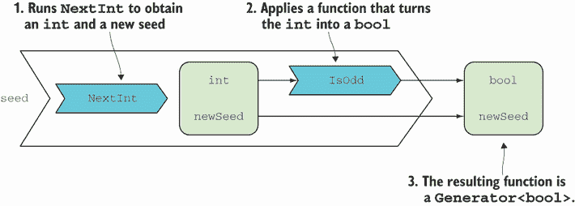
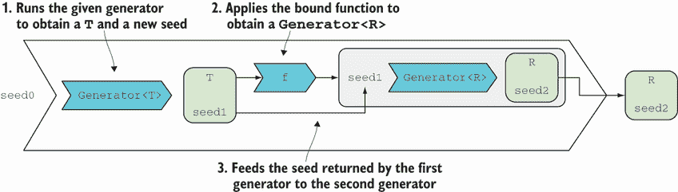
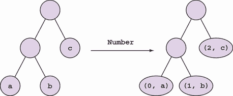

# 15 有状态的程序和有状态的计算

本章涵盖

+   什么是使程序有状态的原因？

+   不突变状态编写有状态的程序

+   生成随机结构

+   编写有状态的计算

从第一章开始，我就一直在反对将状态突变作为一种副作用，几乎在任何情况下都应该避免，你已经看到了几个重构程序以避免状态突变的例子。在本章中，你将看到当保持状态是需求而不是程序实现细节时，函数方法是如何工作的。

但究竟什么是*有状态的*程序呢？它是一个其行为会根据过去的输入或事件而不同的程序。¹ 通过类比，如果有人对你说，“早上好”，你可能会无意识地回应他们。如果那个人立刻又说，“早上好”，你的反应肯定会不同：为什么有人会连续两次说“早上好”？另一方面，无状态的程序会像之前一样无意识地继续回答“早上好”，因为它没有过去输入的概念。每次都像第一次一样。


在本章中，你将看到如何在有状态的函数程序中调和两个看似矛盾的想法——在内存中保持状态和避免状态突变。然后，你将看到如何使用第十四章中学到的技术来组合处理状态的函数。

## 15.1 管理状态的程序

在本节中，你将看到一个简单的命令行程序，它允许用户查找外汇汇率（FX 汇率）。与程序的一个示例交互如下（粗体字母表示用户输入）：

```
Enter a currency pair like 'EURUSD', or 'q' to quit
usdeur
fetching rate...
0.9162
gbpusd
fetching rate...
1.2248
q
```

如果你已经下载了代码示例，你可以亲自尝试：

```
cd Examples
dotnet run CurrencyLookup_Stateless
```

以下列表显示了一个初始的无状态实现。

列表 15.1 简单查找外汇汇率的程序的无状态实现

```
WriteLine("Enter a currency pair like 'EURUSD', or 'q' to quit");
for (string input; (input = ReadLine().ToUpper()) != "Q";)
   WriteLine(RatesApi.GetRate(input));
static class RatesApi
{
   public static decimal GetRate(string ccyPair)
   {
      WriteLine($"fetching rate...");
      // ...                           ❶
    }
}
```

❶ 执行网络请求以获取请求的汇率

你可以忽略`RatesApi.GetRate`的实现细节；我们关心的是它接受一个货币对标识符，例如 EURUSD（欧元/美元），并返回汇率。

程序可以工作，但如果你反复请求相同的货币对，它每次都会执行 HTTP 请求。你可能有很多原因想要避免不必要的远程请求，比如性能、网络使用或每次请求产生的成本。接下来，我们将介绍一个内存缓存来避免查找我们之前已经检索到的汇率。

### 15.1.1 在内存中缓存数据

当我们检索汇率时，我们想在缓存中存储它们，并且只为之前未请求的汇率进行 HTTP 请求，如图 15.1 所示。（在实践中，你希望存储在缓存中的值在一段时间后过期，但为了集中精力在保持状态的本质方面，我将忽略这一要求。）


图 15.1 保持之前检索到的汇率的缓存

当然，作为函数式程序员，我们希望在不进行状态变更的情况下完成这项工作。程序的状态类型将是什么？字典将是一个自然的选择，将每个对标识符（如 EURUSD）映射到相应的汇率。为了确保我们不修改它，让我们将其制作为一个不可变字典：`ImmutableDictionary<string, decimal>`。由于这是一个相当丑陋的类型，我们将它别名为 `Rates` 以使代码更简洁。

以下列表提供了一个实现，它将已检索的汇率存储在缓存中，并且仅在汇率之前未检索到时才调用远程 API。它这样做而不进行状态变更。

列表 15.2 保持汇率缓存的带状态实现

```
using Rates = System.Collections.Immutable              ❶
   .ImmutableDictionary<string, decimal>;               ❶

public class Program
{
   public static void Main()
   {
      WriteLine("Enter a currency pair like 'EURUSD', or 'q' to quit");
      MainRec(Rates.Empty);                             ❷
   }

   static void MainRec(Rates cache)
   {
      var input = ReadLine().ToUpper();
      if (input == "Q") return;

      var (rate, newState) = GetRate(input, cache);     ❸
      WriteLine(rate);
      MainRec(newState);                                ❹
   }

   static (decimal, Rates) GetRate(string ccyPair, Rates cache)
   {
      if (cache.ContainsKey(ccyPair))                   ❺
         return (cache[ccyPair], cache);                ❺

      var rate = RatesApi.GetRate(ccyPair);             ❻

      return (rate, cache.Add(ccyPair, rate));          ❼
   }
}
```

❶ 程序状态的易读名称

❷ 设置初始状态并将控制权传递给 `MainRec`

❸ 同时获取结果以及新状态

❹ 递归地以新状态调用自身

❺ 如果可用，则使用缓存的速率

❻ 执行网络请求

❼ 返回一个包含检索到的汇率和程序更新状态的元组

看看两个 `GetRate` 函数的签名：

```
RatesApi.GetRate : string → decimal
Program.GetRate  : string → Rates → (decimal, Rates)
```

第一个签名是无状态版本；第二个是有状态版本。后者还接受（连同请求的货币对）程序的当前状态，并返回（连同结果汇率）程序的新状态。

重要提示：如果全局变量不能被修改，你必须通过参数传递状态并通过返回值返回。这是编写无状态应用程序而不进行修改的关键。

让我们现在转到 `MainRec`（用于递归），它包含程序的基本控制流程。这里要注意的是，它接受程序当前状态作为输入参数，并将其传递给 `GetRate` 以检索新状态（连同打印的汇率）。它通过以新状态调用自身结束。

最后，`Main` 仅通过程序的初始状态调用 `MainRec`，该初始状态是一个空的缓存。你可以将整个程序执行视为一个循环，其中 `MainRec` 递归地调用自身，并将当前状态版本作为参数传递。

注意，尽管程序中没有全局变量，但它仍然是一个有状态程序。程序在内存中保持一些状态，这会影响程序的操作方式。

通常来说，递归在 C# 中是一个风险业务，因为如果进行了超过约 10,000 次递归调用，它可能会崩溃堆栈。如果你想避免递归定义，可以使用循环代替。以下列表显示了重写的 `Main` 方法，使用循环。

列表 15.3 将递归函数转换为循环

```
public static void Main()
{
   WriteLine("Enter a currency pair like 'EURUSD', or 'q' to quit");
   var state = Rates.Empty;                                          ❶

   for (string input; (input = ReadLine().ToUpper()) != "Q";)
   {
      var (rate, newState) = GetRate(input, state);
      state = newState;                                              ❷
      WriteLine(rate);
   }
}
```

❶ 初始状态

❷ 为下一次迭代重新分配状态变量

在这里，我们不是进行递归调用，而是保持一个局部可变变量 `state`，根据需要将其重新分配为新状态。我们没有修改任何全局状态，所以基本思想仍然成立。

在本章的剩余示例中，我将坚持使用递归版本，我认为它更简洁。在实际应用中，你将想要使用迭代版本以避免栈溢出。

### 15.1.2 测试性和错误处理的重构

你已经看到了如何创建一个不需要突变的状态程序。在继续之前，我想对程序进行一些改进，以便说明一些关于测试性和错误处理的想法，这些想法你在前面的章节中已经看到了。

你会注意到，尽管在状态突变方面没有副作用，但到处都有 I/O 副作用，所以程序根本不可测试。我们可以重构 `GetRate`，使其接受执行 HTTP 请求的函数作为输入参数，遵循第三章中解释的模式：

```
static (decimal, Rates) GetRate
   (Func<string, decimal> getRate, string ccyPair, Rates cache)
{
   if (cache.ContainsKey(ccyPair))
      return (cache[ccyPair], cache);
   var rate = getRate(ccyPair);
   return (rate, cache.Add(ccyPair, rate));
}
```

现在 `GetRate` 除了通过调用给定的委托 `getRate` 可能产生的副作用外，没有其他副作用。因此，通过提供一个具有可预测行为的委托，可以轻松地对这个函数进行单元测试。`MainRec` 同样可以通过注入要调用的函数来进行测试。

接下来，没有任何错误处理：如果你输入一个不存在的货币对名称，程序会崩溃。让我们充分利用 `Try`。首先，我们将无状态的 `GetRate` 方法包装在 `Try` 中：

```
static class RatesApi
{
   public static Try<decimal> TryGetRate(string ccyPair)   ❶
      => () => GetRate(ccyPair);

   static decimal GetRate(string ccyPair) // ...           ❷
}
```

❶ 安全函数返回一个 `Try`。

❷ 不安全版本的工作方式与之前相同。

有状态的计算 `Program.GetRate` 方法现在必须更改其签名，不再接受返回 `decimal` 的函数，而是接受 `Try<decimal>`。相应地，其返回类型也将被 `Try` 包装。以下是修改前后的签名：

```
before : (string → decimal) → string → (decimal, Rates)
after  : (string → Try<decimal>) → string → Try<(decimal, Rates)>
```

以下列表显示了重构后的实现。

列表 15.4 使用 `Try` 进行错误处理的程序重构

```
public class Program
{
   public static void Main()
      => MainRec("Enter a currency pair like 'EURUSD', or 'q' to quit"
         , Rates.Empty);

   static void MainRec(string message, Rates cache)
   {
      WriteLine(message);

      var input = ReadLine().ToUpper();
      if (input == "Q") return;

      GetRate(RatesApi.TryGetRate, input, cache).Run().Match
      (
        ex => MainRec($"Error: {ex.Message}", cache),
        result => MainRec(result.Rate.ToString(), result.NewState)
      );
   }

   static Try<(decimal Rate, Rates NewState)> GetRate
      (Func<string, Try<decimal>> getRate, string ccyPair, Rates cache)
   {
      if (cache.ContainsKey(ccyPair))
         return Try(() => (cache[ccyPair], cache));
      else return from rate in getRate(ccyPair)
         select (rate, cache.Add(ccyPair, rate));
   }
}
```

你可以亲自尝试它：

```
dotnet run CurrencyLookup_StatefulSafe
```

这里是与程序的一个示例交互：

```
Enter a currency pair like 'EURUSD', or 'q' to quit
eurusd
fetching rate...
1.2066
eurusd
1.2066                                                           ❶
rubbish
fetching rate...
Error: The given key 'BISH' was not present in the dictionary.   ❷
q
```

❶ 返回缓存的汇率

❷ 优雅地处理错误

注意我们如何能够相对轻松地添加测试性和错误处理，而没有通过接口、`try`-`catch` 语句等来膨胀实现。相反，我们有了更强大的函数签名，以及通过参数传递的函数之间更明确的关系。

### 15.1.3 有状态的计算

正如你在本节中看到的，如果你想以函数方式（不进行状态突变）处理状态，必须将状态作为输入参数提供给函数，并且影响状态的函数必须将其结果作为它们结果的一部分返回更新后的状态。本章的剩余部分将专注于 *有状态的计算*，这些是与其他状态交互的函数。

注意 *有状态的计算* 是那些接受一个状态（以及可能的其他参数）并返回一个新的状态（以及可能的一个返回值）的函数。它们也被称为 *状态转换*。

状态计算可能出现在有状态和无状态的程序中。你已经看到了一些例子。在前一个场景中，`GetRate` 是一个状态计算，因为它接受一些状态（缓存）以及一个货币对，并返回更新后的状态以及请求的汇率。在第十三章中，静态的 `Account` 类只包含状态计算，每个计算都接受一个 `AccountState`（以及一个命令）并返回一个新的 `AccountState`（以及一个用于存储的事件），尽管在这种情况下，由于结果被包裹在一个 `Validation` 中，事情变得稍微复杂了一些。

如果你想组合几个状态计算（总是将状态传递给函数的过程），从结果中提取它并将其传递给下一个函数可能会变得相当繁琐。幸运的是，状态计算可以通过单子方式组合，从而隐藏状态传递，正如你接下来将看到的。

本章的其余部分包含高级内容，这些内容对于理解以下章节不是必需的，以防你决定跳到下一章。

## 15.2 用于生成随机数据的语言

随机数据有许多合法的实际用途，包括基于属性的测试（我在第十章中讨论过）、负载测试（你生成大量的随机数据，然后对你的系统进行轰炸，以查看其表现如何），以及蒙特卡洛等模拟算法。在这种情况下，我主要感兴趣的是将随机生成作为状态计算组合的一个很好的入门示例。要开始，请在 REPL 中输入以下内容：

```
var r = new Random(100);
r.Next() // => 2080427802
r.Next() // => 341851734
r.Next() // => 1431988776
```

由于你明确地将值 100 作为随机生成器的种子传递，你应该得到**完全相同**的结果。正如你所见，它并不像想象中那么随机。在目前的计算机中，要得到真正的随机性几乎是不可能的；相反，我们使用伪随机生成器，它使用一个打乱算法来决定性地产生一个**看起来**随机的输出。通常情况下，你不想每次都得到相同的值序列，因此 `Random` 实例通常在没有显式种子的情况下初始化；在这种情况下，使用当前时间。

如果 `Random` 是确定性的，它是如何每次调用 `Next` 时产生不同的输出呢？答案是 `Random` 是有状态的：每次你调用 `Next`，`Random` 实例的状态都会更新。换句话说，`Next` 有副作用。

`Next` 在没有输入参数的情况下被调用，并返回一个 `int` 类型的显式输出。但是它有一个隐式输入（`Random` 实例的当前状态），这个输入决定了输出，以及另一个隐式输出，即 `Random` 实例的新状态。这将反过来决定下一次调用 `Next` 的输出。

我们将创建一个无副作用的随机生成器，其中所有输入和输出都是明确的。生成一个数字是一个有状态的计算，因为它需要一个种子，并且还必须生成一个新的种子用于后续的生成。我们不想只生成整数，而是任何类型的值，因此生成器函数的类型可以用以下委托来捕获：

```
public delegate (T Value, int Seed) Generator<T>(int seed);
```

`Generator<T>` 是一个有状态的计算，它接受一个 `int` 值作为种子（状态）并返回一个由生成的 `T` 和一个新种子组成的元组，该种子可以用于生成后续的值。在箭头符号中，`Generator<T>` 的签名如下

```
int → (T, int)
```

要运行一个生成器，我们可以定义以下 `Run` 方法：

```
public static T Run<T>(this Generator<T> gen, int seed)
  => gen(seed).Value;

public static T Run<T>(this Generator<T> gen)
  => gen(Environment.TickCount).Value;
```

第一个重载使用给定的种子运行生成器并返回生成的值，忽略状态。第二个重载使用时钟在每次调用时获取不同的种子值（因此它是非纯净的，不可测试，与第一个重载不同）。接下来，让我们创建一些生成器。

### 15.2.1 生成随机整数

我们需要的基本构建块是一个将种子值打乱成新的 `int` 的生成器。以下列表显示了一种可能的实现。

列表 15.5 返回伪随机数的有状态计算

```
public static Generator<int> NextInt = (seed) =>
{
    seed ^= seed >> 13;
    seed ^= seed << 18;
    int result = seed & 0x7fffffff;
    return (result, result);
};
```

这是一个生成器，当给定一个种子时，将其打乱以获得另一个看似无关的整数。² 然后，它将此值作为结果值和用于后续计算的种子返回。

当你想生成更复杂的值时，事情开始变得有趣。结果证明，如果你可以生成一个随机的 `int`，你可以为任意复杂的类型生成随机值。但让我们从小步开始：知道你可以生成一个随机的 `int`，你将如何编写一个布尔类型等更简单类型的生成器？

### 15.2.2 生成其他原始类型

记住，生成器接受一个种子并返回一个新值（在这种情况下，生成的布尔值）以及一个新种子。`Generator<bool>` 的骨架如下：

```
public static Generator<bool> NextBool = (seed) =>
{
   bool result = // ???
   int newSeed = // ???
   return (result, newSeed);
};
```

我们如何实现它？我们已经有了一个 `int` 的生成器，因此我们可以生成一个 `int` 并根据它是偶数还是奇数返回 true/false。我们还需要返回一个新的种子，为此，我们可以利用生成 `int` 时计算的新种子。本质上，我们正在使用 `NextInt`，将结果 `int` 转换为 `bool` 并重用种子。图 15.2 说明了这一点。



图 15.2 使用 `NextInt` 生成器生成布尔值

实现方式如下：

```
public static Generator<bool> NextBool = (seed) =>
{
   var (i, newSeed) = NextInt(seed);
   return (i % 2 == 0, newSeed);
};
```

现在，让我们换一种不同的方式来思考这个问题。我们在这里所做的是有效地映射一个函数，该函数将 `int` 转换为 `bool`，同时重用现有 `NextInt` 生成器返回的新种子。我们可以将这个模式推广到定义 `Map`：如果你有一个 `Generator<T>` 和一个函数 `f` `: T` `→` `R`，你可以获得一个 `Generator<R>`，如下所示：运行生成器以获得一个 `T` 和一个新种子；应用 `f` 以获得一个 `R`；返回结果 `R` 以及新种子。以下列表显示了 `Map` 的实现。

列表 15.6 `Generator<T>` 的 `Map` 定义

```
public static Generator<R> Map<T, R>
(
   this Generator<T> gen,
   Func<T, R> f
)
=> seed =>                          ❶
{
    var (t, newSeed) = gen(seed);   ❷
    return (f(t), newSeed);         ❸
};
```

❶ `Map` 返回一个生成器，当给定一个种子...

❷ ... 运行给定的生成器 `gen` 以获得一个 `T` 和一个新种子...

❸ ... 然后使用 `f` 将 `T` 转换为 `R`，并将其与新种子一起返回。

我们现在可以更简洁地定义携带比 `int` 少的信息的类型生成器（例如 `bool` 或 `char`），如下所示。

列表 15.7 基于 `NextInt` 生成其他类型

```
public static Generator<bool> NextBool =>
   from i in NextInt                         ❶
   select i % 2 == 0;                        ❷

public static Generator<char> NextChar =>
   from i in NextInt
   select (char)(i % (char.MaxValue + 1));
```

❶ 生成一个 `int`...

❷ ... 返回它是否为偶数

这更易于阅读，因为我们不必显式地担心种子，我们可以用“生成一个 int，并返回它是否为偶数”来阅读代码。

### 15.2.3 生成复杂结构

现在，让我们继续看看我们如何生成更复杂的价值。让我们尝试生成一对整数。我们不得不写点像这样的事情：

```
public static Generator<(int, int)> PairOfInts = (seed0) =>
{
    var (a, seed1) = NextInt(seed0);
    var (b, seed2) = NextInt(seed1);
    return ((a, b), seed2);
};
```

在这里，你可以看到对于每个有状态的计算（或者每次我们生成一个随机值），我们需要提取状态（新创建的种子）并将其传递给下一个计算。这相当嘈杂。幸运的是，我们可以通过将生成器与以下列表所示的 LINQ 表达式组合来消除显式的状态传递。

列表 15.8 定义一个生成随机整数对的函数

```
public static Generator<(int, int)> PairOfInts =>
   from a in NextInt                               ❶
   from b in NextInt                               ❷
   select (a, b);                                  ❸
```

❶ 生成一个 `int` 并将其称为 `a`

❷ 生成另一个 `int` 并将其称为 `b`

❸ 返回 `a` 和 `b` 的对

这更易于阅读，但底层原理与之前相同。这是因为我已经定义了一个 `Bind`/`SelectMany` 的实现，它负责“传递状态”，将状态从一个计算传递到下一个计算。从图形上看，图 15.3 显示了 `Bind` 的工作方式。列表 15.9 显示了相应的代码。



图 15.3 `Generator<T>` 的 `Bind` 定义

列表 15.9 `Generator<T>` 的 `Bind` 定义

```
public static Generator<R> Bind<T, R>
(
   this Generator<T> gen,
   Func<T, Generator<R>> f
)
=> seed0 =>
{
    var (t, seed1) = gen(seed0);
    return f(t)(seed1);
};
```

现在我们有了所有构建块来生成任意复杂的类型。比如说我们想要创建一个 `Option<int>`。这很简单——为 `Option` 的状态生成一个布尔值，并为值生成一个 `int`：

```
public static Generator<Option<int>> OptionInt =>
   from some in NextBool
   from i in NextInt
   select some ? Some(i) : None;
```

这看起来很熟悉。当我们在 10.1.3 节中使用 FsCheck 定义属性测试并需要提供一个生成随机 `Option` 的方法时，你看到了一些类似的代码。实际上，FsCheck 的随机生成器定义与这个类似。

以下列表显示了一个稍微复杂一点的例子，即生成 `int` 序列。

列表 15.10 生成随机数字列表

```
public static Generator<IEnumerable<int>> IntList
   => from empty in NextBool
      from list in empty ? Empty : NonEmpty
      select list;

static Generator<IEnumerable<int>> Empty
   => Generator.Return(Enumerable.Empty<int>());

static Generator<IEnumerable<int>> NonEmpty
   => from head in NextInt
      from tail in IntList
      select List(head).Concat(tail);

public static Generator<T> Return<T>(T value)
   => seed => (value, seed);
```

让我们从顶层 `IntList` 开始。我们生成一个随机的布尔值来告诉我们序列是否应该为空。³ 如果是，我们使用 `Empty`，这是一个总是返回空序列的生成器；否则，我们通过调用 `NonEmpty` 返回一个非空序列。这会生成一个 `int` 作为第一个元素，以及一个随后的随机序列。注意，`Empty` 使用 `Return` 函数为 `Generator`，它将一个值提升为一个总是返回该值且不影响其状态的生成器。

那么生成一个字符串呢？字符串本质上是一系列字符，因此我们可以生成一个 `int` 列表，将每个 `int` 转换为 `char`，并从生成的字符序列中构建一个字符串。正如你所见，我们遵循这种方法来生成一个将各种类型的生成器组合成任意复杂类型生成器的语言。

## 15.3 状态计算的通用模式

在许多其他场景中，我们可能想要组合多个状态计算，而不仅仅是生成随机值。为此，我们可以使用一个更通用的委托，`StatefulComputation`：

```
delegate (T Value, S State) StatefulComputation<S, T>(S state);
```

`StatefulComputation<T>` 是这种形式的函数：

```
S → (T, S)
```

`T` 是函数的结果值，`S` 是状态。⁴ 你可以将它与 `Generator<T>` 的签名进行比较，看看它们有多么相似：

```
StatefulComputation<T> : S   → (T, S)
Generator<T>           : int → (T, int)
```

使用 `Generator`，传入和传出的状态始终是一个 `int`。在更通用的 `StatefulComputation` 中，状态可以是任意类型 `S`。因此，我们可以以相同的方式定义 `Map` 和 `Bind`（唯一的区别是额外的类型参数）并让它们负责在计算之间传递状态。

在第十一章中，我们讨论了树，你看到了如何定义一个 `Map` 函数，该函数创建一个新的树，其中每个元素都是将函数应用于原始树中的每个值的结果。想象一下，你现在想给每个元素分配一个数字，如图 15.4 所示。



图 15.4 树中每个元素的编号

这个操作与 `Map` 类似，因为你必须遍历树并对每个元素应用一个函数。但除此之外，你还必须保持一些状态（一个计数器值），这个值在访问每个元素时需要递增，并用于标记每个叶子节点。

让我们先定义一个 `Numbered<T>` 类型，它封装了一个 `T` 和一个数字：

```
public record Numbered<T>(T Value, int Number);
```

这意味着我们试图表示的操作可以表示为从 `Tree<T>` 到 `Tree<Numbered<T>>` 的函数。

以下列表显示了一个初始实现，它遍历树，显式地传递状态（计数器值）。

列表 15.11 通过显式传递状态对树的叶子节点进行编号

```
using LaYumba.Functional.Data.BinaryTree;

public Tree<Numbered<T>> Number<T>(Tree<T> tree)
   => Number(tree, 0).Tree;                        ❶

(Tree<Numbered<T>> Tree, int Count) Number<T>
(
   Tree<T> tree,
   int count
)
=> tree.Match
(
   Leaf: t =>
      (
         Tree.Leaf(new Numbered<T>(t, count)),     ❷
         count + 1                                 ❸
       ),

   Branch: (l, r) =>
   {
      var (left, count1) = Number(l, count);       ❹
      var (right, count2) = Number(r, count1);     ❹
      return (Tree.Branch(left, right), count2);   ❺
   }
);
```

❶ 调用状态重载，传入 0 作为初始状态

❷ 使用当前计数标记这个叶子

❸ 返回增加后的计数作为新状态

❹ 递归地在左右子树上调用`Number`

❺ 返回更新后的新树

我们从计数为 0 的计算开始。编号函数简单地根据树类型进行匹配。如果是叶子，则包含一个`T`，因此`Number`返回一个对，其中结果是一个`Numbered<T>`（包装`T`和当前计数），新状态是增加后的计数器。如果是分支，则我们在左右子树上递归调用`Number`。因为这些操作中的每一个都返回一个更新后的状态，我们必须将状态传递下去，并在结果值中返回它。

虽然我发现前面的解决方案令人满意，但手动传递状态确实引入了一些噪声。我们可以通过重构代码以使用`StatefulComputation`委托来消除这一点。

我们首先定义一个简单的有状态计算，它接受一个`int`（状态，在这种情况下是计数器）并返回计数器作为值和增加后的状态作为新状态：

```
static StatefulComputation<int, int> GetAndIncrement
   = count => (count, count + 1);

GetAndIncrement(0) // => (0, 1)
GetAndIncrement(6) // => (6, 7)
```

记住，有状态计算返回一个*值*和一个*新状态*。`GetAndIncrement`返回当前计数器值作为返回值和增加后的计数器作为新状态。

`GetAndIncrement`的有趣之处在于它允许你查看状态：因为当前的计数器值成为计算的内部值，你可以在 LINQ 表达式中引用它。你可以在以下代码中看到这一点，我们将当前计数值分配给`count`变量。

以下列表显示了如何使用 LINQ 重写我们的树编号函数，以处理传递状态。

列表 15.12 使用 LINQ 对树叶子进行编号

```
StatefulComputation<int, Tree<Numbered<T>>> Number<T>
(
   Tree<T> tree
)
=> tree.Match
(
   Leaf: t =>
      from count in GetAndIncrement                  ❶
      select Tree.Leaf(new Numbered<T>(t, count)),   ❷

   Branch: (left, right) =>
      from newLeft in Number(left)
      from newRight in Number(right)
      select Tree.Branch(newLeft, newRight)
);
```

❶ 将当前计数分配给`count`变量，同时将增加后的计数分配给状态

❷ 结果是一张包含原始叶子值的新叶子，编号为当前计数。

如你所见，当你像`Branch`情况那样组合一系列有状态计算时，LINQ 确实可以改善可读性。否则，我发现显式传递状态更清晰。请注意，前面的函数返回一个计算，它直到被赋予输入状态之前什么都不做：

```
Number(tree).Run(0)
```

虽然有状态的计算无处不在，但需要链式调用多个计算的情况并不常见。然而，在特定领域，如模拟或解析器中，这种情况却经常出现。例如，一个功能解析器通常被建模为一个函数，该函数接受一个字符串（状态），消耗字符串的一部分，并产生一个结果，该结果由已解析的结构化表示和剩余待解析的字符串（新状态）组成。

## 摘要

+   当编写有状态程序时，你可以通过始终显式地将状态作为函数的输入和输出的一部分来避免作为副作用改变状态。

+   状态计算是形式为 `S` `→` `(T,` `S)` 的函数。它们接受一些状态，并返回一个值以及更新后的状态。

+   状态计算可以通过单调组合来减少从一次计算传递到下一次计算的状态的语法负担。

* * *

¹ 这意味着一个程序可能被认为是具有状态/无状态的，这取决于你如何划分程序边界。你可能有一个无状态的服务器，它使用数据库来保持状态。如果你将两者视为一个程序，那么它是具有状态的；如果你单独考虑服务器，那么它是无状态的。

² 算法的具体细节对于本次讨论的目的来说并不重要。有许多生成伪随机数的算法。

³ 这意味着，从统计学的角度来看，一半生成的列表将是空的，四分之一的列表将有一个元素，依此类推，因此这个生成器不太可能产生一个长的列表。你可以采取不同的方法，首先生成一个随机长度，假设在给定的范围内，然后填充值。正如这所显示的，一旦你开始生成随机数据，定义控制随机生成的参数就很重要。

⁴ 在函数式编程（FP）的术语中，这被称为*状态单子*。这是一个真正糟糕的名称，用来描述一个接受某些状态作为参数的函数。这个不幸的名称可能是理解它的最大障碍。
