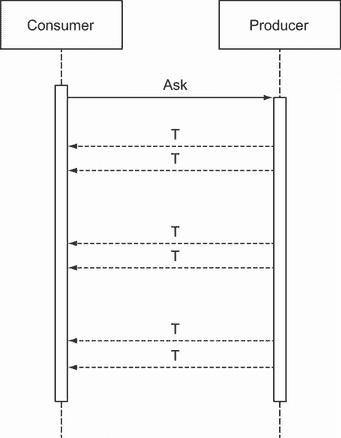

# 16 使用异步计算

本章涵盖

+   使用 `Task` 来表示异步计算

+   顺序和并行地组合异步操作

+   与异步序列一起工作

在当今分布式应用程序的世界中，许多操作都是异步执行的。一个程序可以开始一些相对耗时的操作，例如从另一个应用程序请求数据，但它不会空闲等待该操作完成。相反，它会继续做其他工作，一旦收到数据就恢复操作。

异步操作无疑是当今程序员的日常工作。我之所以等到本书的后期才处理这个问题，是因为它增加了一个我希望推迟以使之前提出的思想更易于理解的复杂性层次。

在 C# 中，异步操作使用 `Task` 来表示，在本章中，你将看到 `Task<T>` 与其他容器（如 `Option<T>`、`Try<T>` 等）并没有太大的不同。虽然 `Task<T>` 表示一个异步交付的单个值，但 `IAsyncEnumerable<T>` 是语言中最近添加的一个用于表示异步交付值序列的新增功能。我将在本章的第二部分讨论这一点。

## 16.1 异步计算

在本节中，我将首先介绍异步的需求以及我们如何使用 `Task` 来模拟值的异步交付。然后你会看到 `Task<T>` 只是 `T` 的另一个容器，因此支持像 `Map` 和 `Bind` 这样的操作。然后我们将讨论与 `Task` 一起工作时经常出现的一些常见问题：组合多个异步操作、处理失败、执行多次重试以及并行运行任务。

`Task` 和 `ValueTask`

BCL 还包括 `ValueTask`，它是一个值类型，在用法上与 `Task` 类似。建议在以下情况下异步方法返回 `ValueTask` 而不是 `Task`：

+   它在热点路径上被调用，因此性能至关重要。

+   它可能涉及异步操作，但通常同步完成；例如，从文件或远程 API 读取并缓存检索到的数据的方法。

在这种情况下，使用 `ValueTask` 更有效率，因为你没有在堆上分配 `Task`。在本章的目的上，当你发现提到 `Task` 时，这个想法也适用于 `ValueTask`。要了解更多关于 `ValueTask` 以及它与 `Task` 的区别，请访问 [`youtu.be/fj-LVS8hqIE`](https://youtu.be/fj-LVS8hqIE)，听听其创造者 Stephen Toub 的介绍。

### 16.1.1 异步的需求

有些操作比其他操作耗时更长——长得多！典型的计算机指令执行所需的时间在纳秒级别，而像从文件系统读取或发起网络请求这样的 I/O 操作所需的时间在毫秒或甚至秒级别。

为了更好地理解差异有多大，让我们将事物放大到更符合人类的情况：如果一个内存中的指令，比如加法运算，需要大约一秒钟，那么典型的 I/O 操作将需要数月或数年。在现实生活中，你可以在水冷却器旁等待几秒钟，直到你的杯子被填满，但你不会在银行等待数周，直到你的抵押贷款申请被处理。相反，你会提交你的申请，回到你的日常生活中，并期待在未来的某个时刻收到结果通知。


图 16.1 当一个操作可以快速完成时，我们愿意等待操作完成，停止其他工作。这就是同步代码的工作方式。


图 16.2 当我们发起一个需要很长时间才能完成的操作时，我们继续做其他工作，期待在操作完成时得到通知。这就是异步代码的工作方式。

这就是异步计算背后的思想：启动一个耗时较长的操作，继续做其他工作，然后在操作完成时返回。

### 16.1.2 使用 Task 表示异步操作

自从 C# 4 以来，处理异步计算的主要工具是基于任务的异步模式（TAP）。我假设你已经在某种程度上熟悉它；如果不是，你可以在网上找到大量的文档。简而言之，它包括以下内容：

+   使用`Task`和`Task<T>`来表示异步操作。

+   使用`await`关键字等待`Task`，这样就可以在异步操作完成的同时释放当前线程去做其他工作。

例如，在第 15.1 节中，我们讨论了一个从网络获取外汇汇率的程序。下面的列表显示了执行网络请求的实际代码，我之前省略了它。

列表 16.1 在网络调用完成时阻塞当前线程

```
public static decimal GetRate(string ccyPair)
{
   Task<string> request = new HttpClient()
      .GetStringAsync(UriFor(ccyPair));

   string body = request.Result;         ❶

   var response = JsonSerializer.Deserialize<Response>(body, opts);
   return response.ConversionRate;
}

record Response(decimal ConversionRate);

const string ApiKey = "1a2419e081f5940872d5700f";

static string UriFor(string ccyPair)
{
   var (baseCcy, quoteCcy) = ccyPair.SplitAt(3);
   return $"https://v6.exchangerate-api.com/v6/{ApiKey}"
      + $"/pair/{baseCcy}/{quoteCcy}";
}

static readonly JsonSerializerOptions opts = new()
   { PropertyNamingPolicy = new SnakeCaseNamingPolicy() };
```

❶ 调用`Result`会阻塞线程直到操作完成。

让我们通过`GetRate`的代码来了解远程 API 调用。我们调用`UriFor`来计算检索所需外汇汇率的 URI，然后使用`HttpClient`执行 API 查询。

当在结果`Task`上调用`Result`时，当前线程会暂停并等待从远程 API 接收响应。然后它将响应体反序列化为适当的类型，并提取所需的汇率。

在等待响应到达时阻塞是简单的控制台应用程序可以接受的，但对于大多数现实世界的应用程序来说，无论是客户端还是服务器，这都是不可接受的。在等待网络调用完成时没有必要阻塞线程。

你可以将`GetRate`重构为异步执行请求，如下面的列表所示。

列表 16.2 使用`Task`表示异步操作

```
public static async Task<decimal>           ❶
   GetRateAsync(string ccyPair)             ❷
{
   Task<string> request = new HttpClient()
      .GetStringAsync(UriFor(ccyPair));

   string body = await request;             ❸

   var response = JsonSerializer.Deserialize<Response>(body, opts);
   return response.ConversionRate;
}
```

❶ 该方法具有`async`修饰符并返回一个`Task`。

❷ 按照惯例，方法名带有`Async`后缀。

❸ `await` 会在操作完成之前释放当前线程。

注意变化：

+   方法现在返回的不是 `decimal`，而是一个 `Task<decimal>`。

+   `await` 暂停当前上下文（释放线程以执行其他工作），当异步操作完成且其结果可用时，上下文会恢复。

+   当你在方法体中使用 `await` 时，必须标记方法为 `async`。¹

+   按照惯例，返回 `Task` 的方法以 `Async` 后缀命名。²

到目前为止，没有惊喜。现在让我们从更函数式的方法来看 `Task<T>`。

### 16.1.3 将 `Task` 作为未来值的容器

从我们在本书中构建的视角来看，将 `Task<T>` 视为 `T` 的另一个容器是很自然的。如果 `Option<T>` 可以被视为可能包含 `T` 的盒子，而 `Func<T>` 可以被视为可以运行以获取 `T` 的容器，那么 `Task<T>` 可以被视为一个容器，其中 `T` 将在未来的某个时刻实现。因此，`Task<T>` 是一个添加异步效应的构造。

注意：再次强调，非泛型的 `Task` 和泛型的 `Task<T>` 之间存在令人烦恼的二分法，分别代表产生 `void` 和 `T` 的异步操作。

在本章中，我将始终使用一个返回值（至少是 `Unit`），所以即使我为了简洁而写 `Task`，你也应该将其理解为 `Task<T>`。

为了将 `Task` 作为容器的想法放入代码中，我定义了它的 `Return`、`Map` 和 `Bind` 函数。这些函数有效地使 `Task<T>` 成为 `T` 上的单子，它们的实现如下所示。

列表 16.3 以 `await` 的方式定义 `Map` 和 `Bind`

```
public static Task<T> Async<T>(T t)
   => Task.FromResult(t);

public static async Task<R> Map<T, R>
   (this Task<T> task, Func<T, R> f)
   => f(await task);
public static async Task<R> Bind<T, R>
   (this Task<T> task, Func<T, Task<R>> f)
    => await f(await task);
```

我将使用 `Async` 作为 `Task` 的 `Return` 函数，它将 `T` 提升到 `Task<T>`。这仅仅是 .NET 的 `Task.FromResult` 方法的简写。

注意如何轻松地使用 `await` 关键字来定义 `Map` 和 `Bind`。为什么这么容易呢？记住，`Map` 会从容器中提取内部值（值），应用给定的函数，并将结果重新包装回容器中。但正是这种解包和包装正是 `await` 语言特性所做的事情：它提取 `Task` 的内部值（操作完成时返回的值），当方法中包含 `await` 时，其结果会自动包装在一个 `Task` 中。³ 对于 `Map` 来说，剩下的就是将给定的函数应用到等待的值上。

`Bind` 类似。它等待给定的 `Task<T>`，当它完成时，结果 `T` 可以提供给绑定的函数。这反过来又返回一个 `Task<R>`，在获得所需的结果类型 `R` 之前，也必须等待它。

我按照同样的方式实现了 `Task` 的 LINQ 查询模式，因此你可以使用 LINQ 简述重写 `GetRateAsync` 函数，如下所示。

列表 16.4 使用 `Task` 的 LINQ 简述

```
public static Task<decimal> GetRateAsync(string ccyPair) =>
   from body in new HttpClient().GetStringAsync(UriFor(ccyPair))
   let response = JsonSerializer.Deserialize<Response>(body, opts)
   select response.ConversionRate;
```

在列表 16.4 的 LINQ 表达式中，`from`子句取`Task`的内部值并将其绑定到变量`body`（更普遍地，当你看到像`from s in m`这样的子句时，你可以将其读作，“提取`m`的内部值并将其称为`s`，然后……”）；这正是`await`所做的。区别在于`await`是针对`Task`的，而 LINQ 表达式可以与任何单子一起使用。

将此与列表 16.2 进行比较，你会发现它执行了相同的操作。此外，请注意，`async`修饰符已消失，因为方法体不包含`await`运算符。

当然，一旦你实现了`Bind`/`SelectMany`，你就可以用它来组合多个异步操作。以下列表演示了这一点；为了获得最佳性能，它使用`GetStreamAsync`而不是`GetStringAsync`，`GetStreamAsync`产生一个可以由反序列化器异步消耗的流。

列表 16.5 使用 LINQ 表达式链式执行异步操作

```
public static Task<decimal> GetRateAsync(string ccyPair) =>
   from str in new HttpClient()
      .GetStreamAsync(UriFor(ccyPair))
   from response in JsonSerializer
      .DeserializeAsync<Response>(str, opts)
   select response.ConversionRate;
```

这是利用异步性最多且避免在内存中存储响应（在处理大型有效负载时这将是不高效的）的版本。请注意，需要两个`from`子句，因为我们现在有两个异步操作（如果未使用 LINQ 表达式，则对应于两个`await`运算符的出现）。

惰性与异步计算的比较

惰性和异步计算都允许你编写“在未来运行”的代码。也就是说，在某个时刻，你的程序定义了如何处理由惰性计算`Func<T>`或异步计算`Task<T>`返回的值`T`，但那些指令随后在稍后的时间执行。

这两个之间也有重要的区别。从定义计算的代码的角度来看

+   创建一个惰性计算（如`Func`、`Try`、`StatefulComputation`等）不会开始计算。实际上，它什么也不做（没有副作用）。

+   创建`Task`启动一个异步计算。

从消耗计算结果的代码的角度来看

+   消耗惰性值的代码“决定”何时运行计算，获取计算值。

+   消耗异步值的代码无法控制何时将接收到计算值。

### 16.1.4 处理失败

我提到你可以将`Task<T>`视为一个添加异步效果的构造。事实上，它还捕获错误处理。因为异步操作通常是 I/O 操作，所以出错的可能性很高。幸运的是，`Task<T>`也通过`Status`和`Exception`属性提供错误处理。

这很重要。想象一下，你有一个同步计算，并使用`Exceptional<T>`来模拟可能失败的计算。如果你现在想使计算异步，你不需要`Task<Exceptional<T>>`，只需要`Task<T>`。

为了看看如何组合各种异步计算的一些示例，让我们看看检索汇率场景的一些稍微复杂的变化。

想象一下，如果你的公司已经购买了 CurrencyLayer 的订阅，这是一家通过 API 提供高质量汇率数据的公司（即，与市场相比延迟较短的 数据）。如果由于某种原因，调用 CurrencyLayer 的 API 失败，你希望回退到 RatesAPI，这是我们迄今为止一直在使用的。首先，假设你定义了两个封装 API 访问的类：

```
public static class CurrencyLayer
{
   public static Task<decimal> GetRateAsync(string ccyPair) => //...
}
public static class RatesApi
{
   public static Task<decimal> GetRateAsync(string ccyPair) => //...
}
```

`CurrencyLayer`的实现与`RatesApi`类似，但它被调整为适应 CurrencyLayer 的 API，该 API 返回具有不同结构的数据。有趣的部分是结合两次对`GetRateAsync`的调用。对于这类任务，你可以使用`OrElse`函数，它接受一个任务和一个在任务失败时使用的回退（这个想法与第十四章中为`Option`定义的`OrElse`函数类似）：

```
public static Task<T> OrElse<T>
   (this Task<T> task, Func<Task<T>> fallback)
   => task.ContinueWith(t =>
         t.Status == TaskStatus.Faulted
            ? fallback()
            : Async(t.Result)
      )
      .Unwrap();           ❶
```

❶ 将`Task<Task<T>>`扁平化为`Task<T>`

注意到`OrElse`假设`Task`要么失败要么成功。在现实中，C#的`Task`也支持取消，但这个特性很少使用，并且会使 API 变得复杂，所以在这里我不会处理取消。你可以如下使用`OrElse`：

```
CurrencyLayer.GetRateAsync(ccyPair)
   .OrElse(() => RatesApi.GetRateAsync(ccyPair))
```

结果是一个新的`Task`，如果操作成功，则返回 CurrencyLayer 返回的值，否则返回 RatesAPI 返回的值。

当然，总是有可能两个调用都失败——比如说，网络断开。因此，我们还需要一个函数来指定任务失败时要执行的操作。我将称之为`Recover`：

```
public static Task<T> Recover<T>
(
   this Task<T> task,
   Func<Exception, T> fallback
)
=> task.ContinueWith(t =>
   t.Status == TaskStatus.Faulted
      ? fallback(t.Exception)
      : t.Result);
```

你可以如下使用`Recover`：

```
RatesApi
   .GetRateAsync("USDEUR")
   .Map(rate => $"The rate is {rate}")
   .Recover(ex => $"Error fetching rate: {ex.Message}")
```

`Recover`通常在工作流的末尾使用，以指定如果在某个地方发生错误时要执行的操作。你可以像使用`Match`处理`Option`或`Either`一样使用`Recover`。但是`Match`是同步的；`Task`没有可以匹配的内容，因为其状态直到未来某个时刻才可用，所以技术上`Recover`更像是故障情况下的`Map`（你可以通过查看其签名来确认这一点）。

定义一个同时处理成功和失败情况的`Map`的重载也是合理的：

```
public static Task<R> Map<T, R>
(
   this Task<T> task,
   Func<Exception, R> Faulted,
   Func<T, R> Completed
)
=> task.ContinueWith(t =>
   t.Status == TaskStatus.Faulted
      ? Faulted(t.Exception)
      : Completed(t.Result));
```

这可以如下使用：

```
RatesApi.GetRateAsync("USDEUR").Map(
   Faulted: ex => $"Error fetching rate: {ex.Message}",
   Completed: rate => $"The rate is {rate}")
```

### 16.1.5 货币转换的 HTTP API

让我们通过编写一个允许客户端将一种货币的金额转换为另一种货币的 API 端点来将这些内容全部组合起来。与该 API 的示例交互如下：

```
$ curl http://localhost:5000/convert/1000/USD/to/EUR -s
896.9000

$ curl http://localhost:5000/convert/1000/USD/to/JPY -s
103089.0000

$ curl http://localhost:5000/convert/1000/XXX/to/XXX -s
{"message":"An unexpected error has occurred"}
```

你可以通过调用类似“convert/1000/USD/to/EUR”的 API 来找出 1,000 美元相当于多少欧元。以下是实现方式：

```
Task<IResult> Convert
(
   decimal amount,
   string baseCcy,
   string quoteCcy
)
=> RatesApi.GetRateAsync(baseCcy + quoteCcy)
   .OrElse(() => CurrencyLayer.GetRateAsync(baseCcy + quoteCcy))   ❶
    .Map(rate => amount * rate)                                    ❷
    .Map
   (
      Faulted: ex => StatusCode(500),                              ❸
       Completed: result => Ok(result)
   );

app.MapGet("convert/{amount}/{baseCcy}/to/{quoteCcy}", Convert);
```

❶ 回退到二级 API。

❷ 执行汇率转换。

❸ 在失败的情况下指定要执行的操作

当应用程序收到请求时，它调用 CurrencyLayer API 以获取相关汇率。如果失败，它调用 RatesAPI。一旦它有了汇率，它就使用它来计算目标货币中的等价金额。最后，它将成功的结果映射到 200，失败映射到 500。

你可能记得在第八章中提到，一旦你进入了特权世界，你应该尽可能长时间地留在那里。对于`Task`来说，这一点尤其正确：处于`Task`的世界意味着编写将在未来运行的代码，因此在这种情况下离开特权世界意味着阻塞线程并等待未来追上。我们几乎从不希望这样做。

注意，处理请求的方法返回一个`Task<IResult>`：ASP.NET 在`Task`运行完成时向客户端发送响应，你不需要担心这将在何时发生。在这种情况下，你*永远*不需要离开`Task`的特权世界。

### 16.1.6 如果失败，尝试更多几次

当远程操作（如对 HTTP API 的调用）失败时，失败的原因通常是瞬时的：可能是有连接故障，或者远程服务器正在重启。换句话说，一次失败的操作，如果在几秒或几分钟后再尝试可能会成功。

当操作失败时需要重试的需求，在处理你无法控制的第三方 API 时是一个常见的要求。以下列表展示了一个简单而优雅的解决方案，它执行异步操作，如果失败则重试指定次数。

列表 16.6 使用指数退避重试

```
public static Task<T> Retry<T>
   (int retries, int delayMillis, Func<Task<T>> start)
   => retries <= 0
      ? start()                                                ❶
      : start().OrElse(() =>
         from _ in Task.Delay(delayMillis)                     ❷
         from t in Retry(retries - 1, delayMillis * 2, start)  ❷
         select t);
```

❶ 最后一次尝试

❷ 如果尝试失败，等待一段时间然后重试。

要使用它，只需将执行远程操作的功能包装在`Retry`函数的调用中：

```
Retry(10, 1000, () => RatesApi.GetRateAsync("GBPUSD"))
```

这指定了操作最多重试 10 次，尝试之间的初始延迟为 1 秒。最后一个参数是要执行的操作，它以懒加载的方式指定，因为调用函数会启动任务。

注意，`Retry`是递归的：如果操作失败，它将等待指定的间隔，然后重试相同的操作，减少剩余的重试次数，并将等待的间隔加倍（一种称为*指数退避*的重试策略）。

### 16.1.7 并行运行异步操作

因为`Task`用于表示耗时操作，所以当你可能时并行执行它们是很自然的。

假设你想检查不同航空公司提供的价格。假设你有一些封装访问航空公司 API 的类，每个类都实现了`Airline`接口：

```
interface Airline
{
   Task<Flight> BestFare(string origin, string dest, DateTime departure);
}
```

`BestFare`可以为你获取给定路线和日期上最便宜的航班。航班详情通过远程 API 查询，因此结果自然被封装在`Task`中。

现在想象一下，如果我们回到了 90 年代，你想要用最少的钱环游欧洲。你需要查看市场上仅有的两家低成本航空公司：EasyJet 和 Ryanair。然后你可以找到在给定日期两个机场之间提供的最佳价格，如下所示：

```
Airline ryanair;
Airline easyjet;

Task<Flight> BestFareM(string origin, string dest, DateTime departure)
   => from r in ryanair.BestFare(origin, dest, departure)
      from e in easyjet.BestFare(origin, dest, departure)
      select r.Price < e.Price ? r : e;
```

这确实可行，但并非最佳方案。因为 LINQ 查询是单子（monadic）的，`easyjet.BestFare` 将仅在 `ryanair.BestFare` 完成后调用（你很快就会明白原因）。但为什么要等待呢？毕竟，这两个调用是完全独立的，所以我们没有理由不能并行执行这两个调用。

你可能还记得第十章中提到的，当你有独立的计算时，你可以使用应用（applicatives）。下面的列表展示了为 `Task` 定义的 `Apply`，它再次在 `await` 的层面上被相当简单实现。

列表 16.7 `Apply` 对 `Task` 的实现

```
public static async Task<R> Apply<T, R>
   (this Task<Func<T, R>> f, Task<T> arg)
   => (await f)(await arg);

public static Task<Func<T2, R>> Apply<T1, T2, R>
   (this Task<Func<T1, T2, R>> f, Task<T1> arg)
   => Apply(f.Map(F.Curry), arg);
```

就像其他容器一样，重要的重载是第一个（其中一元函数被封装在容器中），而更多参数的重载可以通过对函数进行柯里化（currying）来定义。就像 `Map` 和 `Bind` 一样，实现只是简单地使用 `await` 关键字来引用 `Task` 的内部值。`Apply` 等待封装的函数，等待封装的参数，并将函数应用于参数。结果自动封装在一个任务中，这是使用 `await` 的结果。

下面的列表展示了如何使用 `Apply` 更高效地找到更便宜的票价。

列表 16.8 使用 `Apply` 并行执行两个 `Task`

```
Task<Flight> BestFareA(string origin, string dest, DateTime departure)
{
   var pickCheaper = (Flight l, Flight r)
      => l.Price < r.Price ? l : r;

   return Async(pickCheaper)
      .Apply(ryanair.BestFare(origin, dest, departure))
      .Apply(easyjet.BestFare(origin, dest, departure));
}
```

在这个版本中，对 `BestFare` 的两次调用是独立启动的，因此它们并行运行。`BestFareA` 完成所需的总时间由 API 调用所需时间较长的一方决定——而不是它们的总和。

要更好地理解为什么 `Apply` 会并行运行任务，而 `Bind` 会顺序运行，请查看以下列表，它展示了 `Bind` 和 `Apply` 并列的情况。

列表 16.9 `Bind` 顺序运行任务，`Apply` 并行运行

```
public static async Task<R> Bind<T, R>
   (this Task<T> task, Func<T, Task<R>> f)
    => await f(await task);

public static async Task<R> Apply<T, R>
   (this Task<Func<T, R>> f, Task<T> arg)
   => (await f)(await arg);
```

`Bind` 首先等待给定的 `Task<T>` 完成，然后才评估启动第二个任务的函数。它顺序运行任务，并且不能做其他事，因为需要 `T` 的值来创建第二个任务。

另一方面，`Apply` 接受两个 `Task`，这意味着两个任务都已经启动。考虑到这一点，让我们重新审视这段代码：

```
Async(PickCheaper)
   .Apply(ryanair.BestFare(origin, dest, departure))
   .Apply(easyjet.BestFare(origin, dest, departure));
```

当你第一次调用 `Apply`（使用 Ryanair 任务）时，它会*立即*返回一个新的 `Task`，而不等待 Ryanair 任务完成（这是 `Apply` 内部 `await` 的行为）。然后程序立即继续创建 EasyJet 任务。因此，两个任务并行运行。换句话说，`Bind` 和 `Apply` 之间的行为差异是由它们的签名决定的：

+   使用 `Bind` 时，必须等待第一个 `Task` 完成，才能创建第二个任务，因此它应该在创建 `Task` 依赖于另一个返回值时使用。

+   使用 `Apply` 时，两个任务都由调用者提供，因此你应该在任务可以独立启动时使用它。

如果你有不止两家，而是一长串低成本航空公司要比较，就像今天这样呢？为了应对这个更复杂的场景，我们需要一个新的工具：`Traverse`，我们将在第 17.1 节中看到。但首先，我们将通过查看异步值的序列来结束这一章。

## 16.2 异步流

`Task<T>` 适用于建模需要一些时间才能交付单个 `T` 的操作，允许你编写异步代码而不增加过多的复杂性。然而，我们经常有返回的不是单个 `T`，而是多个 `T` 的操作，这些 `T` 可以单独或批量交付，项目或批量之间有相对较长的时间间隔。以下是一些例子：

+   *从分页 API 中检索多页内容。* 每页通过单个异步操作检索，包含一定数量的资源，但你需要检索多页才能获取所需的所有资源。

+   *读取文件。* 你可以异步逐行读取文件内容，而不是将整个文件内容读入内存；这允许你在文件的其他部分仍在读取时开始处理已读取的行。

+   *从云托管数据库中检索数据。*

就像任何长时间运行的操作一样，我们不希望等待请求的值被交付。相反，我们希望在异步请求启动后立即释放调用线程，如图 16.3 所示。



图 16.3 异步序列。信息消费者请求一些数据，信息生产者以非微不足道的延迟异步返回这些数据。

我们可以将此类场景建模为 *异步流*——异步交付的值流。这些值通过 `IAsyncEnumerable<T>` 接口表示，C# 8 引入了用于创建和消费 `IAsyncEnumerable` 的专用语法。

`IAsyncEnumerable` 类似于 `Task`（因为它提供了异步性）和 `IEnumerable`（因为它提供了聚合）。如果你愿意，它结合了这两种效果。表 16.1 展示了这些不同抽象之间的关系。

表 16.1 `IAsyncEnumerable` 与其他抽象的比较

|  | 同步 | 异步 |
| --- | --- | --- |
| **单个值** | `T` | `Task<T>` |
| **多个值** | `IEnumerable<T>` | `IAsyncEnumerable<T>` |

因此，你可能会问，“`IAsyncEnumerable<T>` 与 `Task<IEnumerable<T>>` 有何不同？”关键在于，使用 `Task<IEnumerable<T>>` 时，你必须等待包含的 `Task` 完成，才能消费得到的 `T`。而使用 `IAsyncEnumerable<T>`，另一方面，你可以在接收到 `T` 后立即开始消费，无需等待流的结束。让我们探讨一些具体的场景。

### 16.2.1 将文件作为异步流读取

想象你正在电子商务领域工作，需要跟踪每个产品在仓库中的可用库存数量。业务的物流方面使用了一个过时的协议：仓库的库存配送记录为逗号分隔值（CSV）文件，每天结束时上传。你必须编写一个从 CSV 文件中读取（每一行代表特定产品的库存配送）并相应更新电子商务数据库的过程。

由于从文件中读取相对较慢，将其建模为异步操作是自然的；此外，你可以逐行读取文件内容。这比将大文件的全部内容存储在内存中更有效。因此，你可以使用`IAsyncEnumerable`，如下面的列表所示。

列表 16.10 将文件内容作为异步字符串流读取

```
using System.Collections.Generic;
using System.IO;

static async IAsyncEnumerable<string> ReadLines(string path)
{
   using StreamReader reader = File.OpenText(path);
   while (!reader.EndOfStream)
      yield return await reader.ReadLineAsync();
}
```

注意，为了生成一个`IAsyncEnumerable`，你需要结合使用`yield return`（就像使用`IEnumerable`一样）和`await`。实际上，每次你有一个需要重复调用的异步操作（返回`Task<T>`的方法，例如这里的`ReadLineAsync`）时，你可以考虑使用`IAsyncEnumerable<T>`。现在我们有了字符串的异步流，我们可以使用每一行来填充一个数据对象（我将称之为`Delivery`），并使用它来更新数据库：

```
record Delivery(long ArticleID, int Quantity);    ❶

static Delivery Parse(string s)                   ❷
{
   string[] ss = s.Split(',');
   return new(long.Parse(ss[0]), int.Parse(ss[1]));
}

static void UpdateDb(Delivery r) => // ...        ❸
```

❶ 模拟一个配送

❷ 从文件中的一行填充一个`Delivery`

❸ 使用配送信息更新数据库

在这些构建块就绪之后，我们可以编写一个程序，使用 CSV 文件中的值来更新数据库：

```
public static async Task Main()
{
   await foreach (var line in ReadLines("warehouse.csv"))   ❶
   {
      Delivery d = Parse(line);                             ❷
      UpdateDb(d);                                          ❸
   }
}
```

❶ 消费 CSV 文件的行流

❷ 将每一行解析为`Delivery`

❸ 将`Delivery`保存到数据库中

注意，在这里我们使用`await foreach`来消费`IAsyncEnumerable`中的值。这与使用`foreach`消费`IEnumerable`中的元素类似。

### 16.2.2 函数式消费异步流

我希望你现在正在想，“但我们绝不想使用`foreach`来显式地遍历集合中的元素；相反，我们想使用`Map`或 LINQ 表达式来将每一行转换为`Delivery`，并使用`ForEach`来更新数据库！”

当然，你可能会认为这是我在整本书中一直在遵循的方法。唯一的缺点是，必须在`IAsyncEnumerable`上的相关扩展方法通过引用`System.Interactive.Async`包来导入。一旦设置了此引用，你就可以像以下列表所示那样重写程序。 

列表 16.11 利用`System.Interactive.Async`中的扩展方法

```
using System.Linq;                              ❶

public static async Task Main()
   => await ReadDeliveries("warehouse.csv")
      .ForEachAsync(UpdateDb);                  ❷

static IAsyncEnumerable<Delivery> ReadDeliveries(string path)
   => from line in ReadLines(path)              ❸
      select Parse(line);                       ❸
```

❶ `IAsyncEnumerable`的扩展在这个命名空间中。

❷ 对流中的每个元素执行副作用

❸ 对流中的每个元素应用一个函数

在这里，我们使用 LINQ 理解将每个异步传递的字符串转换为 `Delivery`，并使用 `ForEachAsync` 来更新数据库。为什么它被称为 `ForEachAsync` 而不是仅仅 `ForEach`？因为它仅在流中的所有值都已被处理时完成，它返回一个 `Task`，并且对于返回 `Task` 的操作，惯例是使用 `Async` 后缀。

注意，我已经将 `UpdateDb` 定义为同步的。在实际操作中，你可能会将此操作也异步化；在这种情况下，它将返回一个 `Task` 而不是 `void`。然后你需要按以下方式修改程序，使用 `ForEachAwaitAsync` 而不是 `ForEachAsync`：

```
public static async Task Main()
   => await ReadDeliveries("warehouse.csv")
      .ForEachAwaitAsync(UpdateDbAsync);

static Task UpdateDbAsync(Delivery r) => // ...
```

### 16.2.3 从多个流中消费数据

到目前为止，你已经看到了如何定义异步流以及如何使用 `Select`（无论是直接使用还是通过包含单个 `from` 子句的 LINQ 理解）来消费其值进行数据转换（直接或通过 LINQ 理解），以及使用 `ForEachAsync` 或 `ForEachAwaitAsync` 来执行副作用。接下来，我们将探讨使用包含多个 `from` 子句的 LINQ 理解。正如你在第 10.4 节中了解到的，这相当于 `SelectMany`，本质上就是 `Bind`。

想象一下，你的客户不仅有，而且有几个仓库。他们都会在一天结束时将各自的 CSV 文件上传到目录中，因此你的程序需要更改以处理多个文件。这个更改相当简单。不是获取文件路径，`ReadDeliveries` 可以获取目录路径并处理该目录中存在的所有文件：

```
static IAsyncEnumerable<Delivery> ReadDeliveries(string dir)
   => from path in Directory.EnumerateFiles(dir).ToAsyncEnumerable()
      from line in ReadLines(path)
      select Parse(line);
```

就这样！只需一行更改。`EnumerateFiles` 返回一个 `IEnumerable<string>`。这需要提升为 `IAsyncEnumerable<string>`，以便可以在处理每个文件生成的流中使用 LINQ 理解。请注意，文件将按顺序处理；因此，结果流将在移动到第二个文件之前包含来自第一个文件的所有交付，依此类推。

### 16.2.4 使用异步流进行聚合和排序

异步流非常强大，因为它们允许你在流结束之前开始消费流中的值。在我们的例子中，这意味着你可以在读取 CSV 文件的同时开始更新数据库。在某些场景中，这可以给你带来巨大的效率提升。

现在想象一下，仓库在一天中会收到几批货物，可能包括几个相同产品的交付，因此 CSV 文件可能包含几个相同产品 ID 的条目。如果是这种情况，你希望对该产品执行单个数据库更新。然后你的代码需要按以下方式更改：

```
public static async Task Main()
   => await ReadDeliveries("warehouse.csv")
      .GroupBy(r => r.ProductID)
      .SelectAwait(async grp => new Delivery(grp.Key
         , await grp.SumAsync(r => r.Quantity)))
      .ForEachAwaitAsync(UpdateDbAsync);
```

这里关键点是你在流中按产品 ID 对元素进行分组；这是通过`GroupBy`完成的，就像你会用`IEnumerable`做的那样。在每个分组内部，然后计算所有数量的总和以创建每个产品的单个`Delivery`。但请注意，你不能像在`IEnumerable`上使用`Sum`那样使用`Sum`；相反，你必须使用`SumAsync`，它返回一个`Task`（因为你必须等待接收所有项目，然后才能计算它们的总和）。

因此，尽管代码是正确的，但你可能会注意到我们实际上失去了一些异步操作的优势。我们需要等待所有元素接收完毕才能计算它们的总和或其他聚合操作。因此，在这种情况下，`IAsyncEnumerable`最终并不比`Task<IEnumerable>`更好。如果你想要排序的值，情况也是如此。

## 摘要

+   `Task<T>`表示一个异步交付`T`的计算。

+   应该在底层操作可能具有显著延迟的情况下使用`Task`，例如大多数 I/O 操作。

+   返回`Task`的函数可以用`Map`、`Bind`和其他几个组合子来组合，以指定错误处理或多次重试。

+   如果`Task`是独立的，它们可以并行运行。你可以将`Task`用作应用，并通过`Apply`组合几个`Task`来并行运行它们。

+   `IAsyncEnumerable<T>`表示一个异步交付的`T`序列。

+   使用`System.Interactive.Async`中的扩展方法来处理`IAsyncEnumerable`；这也包括 LINQ 查询模式的实现。

+   请记住，一些异步流的操作，如排序和聚合，需要流中的所有元素，因此会失去使用异步流获得的某些效率。

* * *

¹ 这有点遗憾，因为`async`增加了噪声，尤其是在 lambda 中使用时。严格来说，这不是必需的：可以设计不使用`async`的语言语法；然而，它被添加是为了使语言与最初添加到语言中的`await`保持向后兼容。

²我对这种命名约定有强烈的反对意见。这是微软在`async`的早期提出的。一方面，你不会给返回字符串的方法加上特殊的`-Str`后缀，对吧？那么为什么要在`Task`上这样做呢？我认为这种约定的背后想法是，为了在同时公开相同操作的同步和异步版本的 API 中方便区分。但这导致了糟糕的设计：如果一个方法应该是异步的，那么使用同步版本是不理想的。API 应该通过只公开异步版本来鼓励做正确的事情。如果两种版本都公开了，那么，如果有什么不同的话，同步版本应该带有`-Sync`后缀，这将像眼中钉一样突出。好的设计使得做正确的事情变得容易，所以强迫异步版本使用更长、更嘈杂的名称是糟糕的设计。不幸的是，这种约定已经足够普及，以至于被认为是标准。

`await`不仅与`Task`一起使用，还可以与任何*可等待的*（任何定义了返回`INotifyCompletion`的`GetAwaiter` [实例或扩展]方法的值）一起使用。
