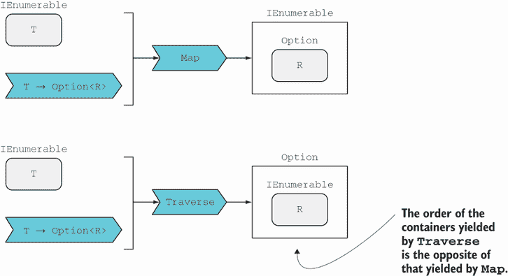

# 17 可穿越和堆叠的单子

本章涵盖

+   可穿越的：处理升序类型列表

+   组合不同单子的效果

到目前为止，在本书中，你已经看到了许多不同的容器，它们为底层值添加了一些效果——`Option` 用于可选性，`IEnumerable` 用于聚合，`Task` 用于异步，等等。随着我们的容器列表不断增长，我们不可避免地会遇到组合不同容器的问题：

+   如果你有一个想要执行的 `Task` 列表，你如何将它们组合成一个在所有操作完成后完成的单个 `Task`？

+   如果你有一个 `Task<Validation<T>>` 类型的值，你如何用类型为 `T` `→` `Task<R>` 的函数以最少的噪音来组合它？

本章将为你提供组合不同容器效果的工具，并展示如何避免过多的嵌套容器。

## 17.1 可穿越的：处理升序值列表

`Traverse` 是 FP 中稍微有些神秘的核函数之一，它允许你处理升序值列表。通过一个例子来接近它可能最容易。

想象一个简单的命令行应用程序，它读取用户输入的以逗号分隔的数字列表，并返回所有给定数字的总和。我们可以从这里开始：

```
using Double = LaYumba.Functional.Double;    ❶
using String = LaYumba.Functional.String;    ❷

var input = Console.ReadLine();

var nums = input.Split(',')  // Array<string>
   .Map(String.Trim)         // IEnumerable<string>
   .Map(Double.Parse);       // IEnumerable<Option<double>>
```

❶ 提供了一个返回 `Option` 的函数来解析 `double`

❷ 提供了一个静态的 `Trim` 函数

我们将输入字符串分割成字符串数组，并使用 `Trim` 移除任何空白。然后我们可以将解析函数 `Double.Parse` 映射到这个列表上，该函数的签名是 `string` `→` `Option<double>`。结果，我们得到一个 `IEnumerable<Option<double>>`。

而实际上，我们真正想要的是一个 `Option<IEnumerable<double>>`，如果 *任何* 数字解析失败，它应该是 `None`。在这种情况下，我们可以警告用户更正他们的输入。¹ 我们看到 `Map` 产生了一个类型，其效果是按照与我们需要的相反的顺序堆叠的。

这是一个相当常见的场景，因此有一个名为 `Traverse` 的特定函数来处理它，而 `Traverse` 定义的类型被称为 *可穿越的*。图 17.1 展示了 `Map` 和 `Traverse` 之间的关系。



图 17.1 比较 `Map` 和 `Traverse`

让我们推广可穿越的概念：

+   我们有一个 `T` 的可穿越结构，所以让我们用 `Tr<T>` 来表示这一点。在这个例子中，它是 `IEnumerable<string>`。

+   我们有一个跨越世界的函数，`f` `:` `T` `→` `A<R>`，其中 `A` 至少是一个应用。在这个例子中，它是 `Double.Parse`，它具有类型 `string` `→` `Option<double>`。

+   我们希望得到一个 `A<Tr<R>>`。

`Traverse` 的一般签名是这个形式

```
Tr<T> → (T → A<R>) → A<Tr<R>>
```

对于这个例子，它是

```
IEnumerable<T> → (T → Option<R>) → Option<IEnumerable<R>>
```

### 17.1.1 使用单子 Traverse 验证值列表

让我们看看如何根据前面的签名实现`Traverse`。如果你查看签名中的顶级类型，你会发现我们从一个列表开始，最终得到一个单一值。记住，我们使用`Aggregate`将列表缩减为一个单一值，这在第 9.6 节中已经介绍过。

`Aggregate`接受一个累加器和减法函数，该函数将列表中的每个元素与累加器组合。如果列表为空，则返回累加器作为结果。这很简单；我们只需创建一个空的`IEnumerable`，并使用`Some`将其提升到`Option`，如下列所示。

列表 17.1 返回`Option`的`Traverse`的单调函数

```
public static Option<IEnumerable<R>> Traverse<T, R>
(
   this IEnumerable<T> ts,
   Func<T, Option<R>> f
)
=> ts.Aggregate
(
   seed: Some(Enumerable.Empty<R>()),    ❶
   func: (optRs, t) =>
      from rs in optRs                   ❷
      from r in f(t)                     ❸
      select rs.Append(r)                ❹
);
```

❶ 如果可遍历的为空，则提升一个空实例

❷ 从`Option`中提取累积的`R`列表

❸ 将函数应用于当前元素，并从结果`Option`中提取值

❹ 将值追加到列表中，并将结果列表提升到`Option`

现在，让我们看看减法函数——这是有趣的部分。它的类型是

```
Option<IEnumerable<R>> → T → Option<IEnumerable<R>>
```

当我们将函数`f`应用于值`t`时，我们得到一个`Option<R>`。之后，我们必须满足以下签名：

```
Option<IEnumerable<R>> → Option<R> → Option<IEnumerable<R>>
```

让我们暂时简化一下，从每个元素中移除`Option`：

```
IEnumerable<R> → R → IEnumerable<R>
```

现在很明显，问题是将单个`R`追加到`IEnumerable<R>`中，得到一个包含所有已遍历元素的`IEnumerable<R>`。追加应该在提升的`Option`世界中发生，因为所有值都被包裹在`Option`中。正如你在第十章中学到的，我们可以在提升的世界中以适用性或单调的方式应用函数。这里我们使用单调流程。

现在你已经看到了`Traverse`的定义，让我们回到用户输入的逗号分隔数字列表解析的场景。以下列表显示了我们可以如何使用`Traverse`实现这一点。

列表 17.2 安全解析并求和逗号分隔的数字列表

```
using Double = LaYumba.Functional.Double;
using String = LaYumba.Functional.String;

var input = Console.ReadLine();
var result = Process(input);
Console.WriteLine(result);

static string Process(string input)
   => input.Split(',')        // Array<string>
      .Map(String.Trim)       // IEnumerable<string>
      .Traverse(Double.Parse) // Option<IEnumerable<double>>
      .Map(Enumerable.Sum)    // Option<double>
      .Match
      (
         () => "Some of your inputs could not be parsed",
         (sum) => $"The sum is {sum}"
      );
```

在前面的列表中，顶级语句执行 I/O，而所有逻辑都在`Process`函数中。让我们测试它以查看行为：

```
Process("1, 2, 3")
// => "The sum is 6"

Process("one, two, 3")
// => "Some of your inputs could not be parsed"
```

### 17.1.2 使用适用性遍历收集验证错误

让我们改进错误处理，以便我们可以告诉用户哪些值是错误的。为此，我们需要`Validation`，它可以包含一个错误列表。这意味着我们需要一个`Traverse`的实现，它接受一个值列表和一个返回`Validation`的函数。这如下列所示。

列表 17.3 返回`Validation`的`Traverse`的单调函数

```
public static Validation<IEnumerable<R>> TraverseM<T, R>
(
   this IEnumerable<T> ts,
   Func<T, Validation<R>> f
)
=> ts.Aggregate
(
   seed: Valid(Enumerable.Empty<R>()),
   func: (valRs, t) => from rs in valRs
                       from r in f(t)
                       select rs.Append(r)
);
```

此实现与返回`Option`的函数实现（列表 17.1）类似，除了签名和使用的`Return`函数是`Valid`而不是`Some`。这种重复是由于缺少同时适用于`Option`和`Validation`的通用抽象。²

注意，我之所以将函数命名为`TraverseM`（对于 monadic），是因为实现是 monadic 的。如果一个项目验证失败，验证函数将不会对后续的任何项目进行调用。

如果我们想要累积错误，我们应该使用 applicative flow（如果你需要回顾为什么是这样，请参阅第 10.5 节）。因此，我们可以定义`TraverseA`（对于 applicative），使用相同的签名但使用 applicative flow，如下列所示。

列表 17.4 使用返回`Validation`的函数的`Applicative `Traverse`

```
static Func<IEnumerable<T>, T, IEnumerable<T>> Append<T>()
   => (ts, t) => ts.Append(t);

public static Validation<IEnumerable<R>> TraverseA<T, R>
(
   this IEnumerable<T> ts,
   Func<T, Validation<R>> f
)
=> ts.Aggregate
(
   seed: Valid(Enumerable.Empty<R>()),                     ❶
   func: (valRs, t) =>
      Valid(Append<R>())                                   ❷
         .Apply(valRs)                                     ❸
         .Apply(f(t))                                      ❹
);

public static Validation<IEnumerable<R>> Traverse<T, R>
   (this IEnumerable<T> list, Func<T, Validation<R>> f)
   => TraverseA(list, f);                                  ❺
```

❶ 如果可遍历的是空的，则提升一个空实例

❷ 提升特定于`R`的`Append`函数

❸ 应用到累加器

❹ 将`f`应用于当前元素；结果`Validation`中包裹的`R`是`Append`的第二个参数。

❺ 对于`Validation`，`Traverse`应默认为 applicative 实现。

`TraverseA`的实现类似于`TraverseM`，不同之处在于在 reducer 函数中，追加是通过 applicative 而不是 monadic flow 完成的。因此，验证函数`f`对`ts`中的每个`T`都会被调用，所有验证错误都会累积在结果`Validation`中。

因为这是我们通常希望`Validation`具有的行为，所以我将`Traverse`定义为指向 applicative 实现`TraverseA`，但如果你想要短路行为，仍然有`TraverseM`的空间。

下面的列表显示了重构后使用`Validation`的程序。

列表 17.5 安全解析和求和逗号分隔的数字列表

```
static Validation<double> Validate(string s)
   => Double.Parse(s).Match
   (
      () => Error($"'{s}' is not a valid number"),
      (d) => Valid(d)
   );

static string Process(string input)
   => input.Split(',')        // Array<string>
      .Map(String.Trim)       // IEnumerable<string>
      .Traverse(Validate)     // Validation<IEnumerable<double>>
      .Map(Enumerable.Sum)    // Validation<double>
      .Match
      (
         errs => string.Join(", ", errs),
         sum => $"The sum is {sum}"
      );
```

列表仅显示了`Process`（顶级语句与之前相同）的更新实现。如果我们测试这个增强的实现，我们现在会得到以下结果：

```
Process("1, 2, 3")
// => "The sum is 6"

Process("one, two, 3")
// => "'one' is not a valid number, 'two' is not a valid number"
```

如您所见，在第二个示例中，随着我们遍历输入列表，验证错误已经累积。如果我们使用 monadic 实现`TraverseM`，我们只会得到第一个错误。

### 17.1.3 将多个验证器应用于单个值

前面的示例演示了如何将单个验证函数应用于要验证的值列表。那么，当你有一个要验证的单个值和多个验证函数时怎么办？

我们在第 9.6.3 节中处理了这样的场景，其中有一个请求对象要验证，以及一个验证器列表，每个验证器都检查某些有效性条件是否得到满足。作为提醒，我们定义了一个`Validator`委托来捕获执行验证的函数：

```
// T => Validation<T>
public delegate Validation<T> Validator<T>(T t);
```

挑战在于编写一个单一的`Validator`函数，结合多个`Validator`的验证，收集所有错误。我们不得不跳过几个障碍来定义一个具有此行为的`HarvestErrors`函数（列表 9.22）。

现在您已经了解了如何使用返回`Validation`的函数与`Traverse`一起使用，我们可以将`HarvestErrors`重写得更简洁，如下列所示。

列表 17.6 从多个验证器中聚合错误

```
public static Validator<T> HarvestErrors<T>
   (params Validator<T>[] validators)
   => t
   => validators
      .Traverse(validate => validate(t))
      .Map(_ => t);
```

在这里，`Traverse` 返回一个 `Validation<IEnumerable<T>>`，收集所有错误。如果没有错误，类型为 `IEnumerable<T>` 的内部值将包含与验证器数量相同数量的输入值 `t`。随后的 `Map` 调用将忽略这个 `IEnumerable` 并用正在验证的原始对象替换它。以下是在实践中使用 `HarvestErrors` 的一个示例：

```
Validator<string> ShouldBeLowerCase
   = s => (s == s.ToLower())
      ? Valid(s)
      : Error($"{s} should be lower case");

Validator<string> ShouldBeOfLength(int n)
   => s => (s.Length == n)
      ? Valid(s)
      : Error($"{s} should be of length {n}");

Validator<string> ValidateCountryCode
   = HarvestErrors(ShouldBeLowerCase, ShouldBeOfLength(2));

ValidateCountryCode("us")
// => Valid(us)

ValidateCountryCode("US")
// => Invalid([US should be lower case])

ValidateCountryCode("USA")
// => Invalid([USA should be lower case, USA should be of length 2])
```

### 17.1.4 使用 Traverse 与 Task 等待多个结果

`Traverse` 与 `Task` 的工作方式与与 `Validation` 的工作方式相似。我们可以定义 `TraverseA`，它使用应用流并并行运行所有任务，`TraverseM`，它使用单调流并顺序运行任务，以及默认为 `TraverseA` 的 `Traverse`，因为并行运行独立异步操作通常是首选的。给定一个长时间运行的操作列表，我们可以使用 `Traverse` 获取一个单一的 `Task`，我们可以使用它来等待所有结果。

在第 16.1.7 节中，我们讨论了比较两家航空公司的航班价格。使用 `Traverse`，我们能够处理航空公司列表。想象一下，每个航空公司的航班可以通过返回 `Task<IEnumerable<Flight>>` 的方法进行查询，而我们想要获取给定日期和路线上的所有航班，并按价格排序：

```
interface Airline
{
   Task<IEnumerable<Flight>> Flights
      (string origin, string destination, DateTime departure);
}
```

我们如何获取所有航空公司的所有航班？注意如果我们使用 `Map` 会发生什么：

```
IEnumerable<Airline> airlines;

IEnumerable<Task<IEnumerable<Flight>>> flights =
   airlines.Map(a => a.Flights(from, to, on));
```

我们最终得到一个 `IEnumerable<Task<IEnumerable<Flight>>>`。这根本不是我们想要的！

使用 `Traverse`，相反，我们将得到一个 `Task<IEnumerable<IEnumerable<Flight>>>`，一个当所有航空公司都被查询（如果任何查询失败则失败）时完成的单一任务。任务的内部值是一个列表的列表（每个航空公司一个列表），然后可以将其展平和排序，以获取按价格排序的结果列表：

```
async Task<IEnumerable<Flight>> Search(IEnumerable<Airline> airlines
   , string origin, string dest, DateTime departure)
{
   var flights = await airlines
      .Traverse(a => a.Flights(origin, dest, departure));
   return flights.Flatten().OrderBy(f => f.Price);
}
```

`Flatten` 只是一个方便函数，它使用恒等函数调用 `Bind`，因此将嵌套的 `IEnumerable` 转换为包含所有航空公司航班的单个列表。然后，这个列表按价格排序。

大多数时候，你希望有并行行为，所以我定义了 `Traverse` 与 `TraverseA` 相同。另一方面，如果你有 100 个任务，第二个任务失败，那么单调遍历将帮助你避免在应用遍历中使用时启动的 98 个任务。因此，你选择的实现取决于用例，这也是为什么包括两者的原因。

让我们看看这个示例的最后一个变体。在现实生活中，你可能不希望搜索失败，如果第三方 API 的数十个查询中的一个失败。想象一下，你想要显示可用的最佳结果，就像许多价格比较网站一样。如果提供商的 API 不可用，该提供商的结果将不可用，但我们仍然希望看到其他所有提供商的结果。

变更很简单！我们可以使用第 16.1.4 节中展示的 `Recover` 函数，这样每个查询在远程查询失败时都会返回一个空的航班列表：

```
async Task<IEnumerable<Flight>> Search(IEnumerable<Airline> airlines
   , string origin, string dest, DateTime departure)
{
   var flights = await airlines
      .Traverse(a => a.Flights(origin, dest, departure)
                      .Recover(ex => Enumerable.Empty<Flight>()));

   return flights.Flatten().OrderBy(f => f.Price);
}
```

在这里，我们有一个函数，它并行查询多个 API，忽略任何失败，并将所有成功的结果汇总到一个按价格排序的单个列表中。我认为这是一个很好的例子，说明了如何通过组合核心函数如`Traverse`、`Bind`等，以少量代码和努力来指定丰富的行为。

### 17.1.5 为单值结构定义 Traverse

到目前为止，你已经看到了如何使用`Traverse`与`IEnumerable`以及返回`Option`、`Validation`、`Task`或任何其他应用函数。实际上，`Traverse`更加通用。`IEnumerable`并不是唯一的可遍历结构；你可以为书中看到的大多数结构定义`Traverse`。如果我们采取一种从细节到整体的方法，我们可以将`Traverse`视为一种工具，它以与执行`Map`相反的方式堆叠效果：

```
Map      : Tr<T> → (T → A<R>) → Tr<A<R>>
Traverse : Tr<T> → (T → A<R>) → A<Tr<R>>
```

如果我们有一个返回应用`A`的函数，`Map`返回一个内部有`A`的类型，而`Traverse`返回一个外部有`A`的类型。

例如，在第八章中，我们有一个场景，我们使用`Map`将返回`Validation`的函数与返回`Exceptional`的函数组合起来。代码是这样的：

```
Func<MakeTransfer, Validation<MakeTransfer>> validate;
Func<MakeTransfer, Exceptional<Unit>> save;

public Validation<Exceptional<Unit>> Handle(MakeTransfer request)
   => validate(request).Map(save);
```

如果出于某种原因，我们想要返回一个`Exceptional<Validation<Unit>>`，那会怎样呢？好吧，现在你知道了这个技巧：只需将`Map`替换为`Traverse`！

```
public Exceptional<Validation<Unit>> Handle(MakeTransfer request)
   => validate(request).Traverse(save);
```

但我们能否使`Validation`可遍历呢？答案是肯定的。记住，我们可以将`Option`视为一个最多只有一个元素的列表。对于`Either`、`Validation`和`Exceptional`也是同样的道理：成功情况可以被视为一个包含单个元素的遍历结构；失败情况则为空。

在这种情况下，我们需要一个定义`Traverse`的函数，它接受一个`Validation`和一个返回`Exceptional`的函数。下面的列表显示了实现。

列表 17.7 使 `Validation` 可遍历

```
public static Exceptional<Validation<R>> Traverse<T, R>
(
   this Validation<T> valT,
   Func<T, Exceptional<R>> f
)
=> valT.Match
(
   Invalid: errs => Exceptional(Invalid<R>(errs)),
   Valid: t => f(t).Map(Valid)
);
```

基本情况是如果`Validation`是`Invalid`；这与空列表的情况类似。在这里，我们创建一个所需输出类型的价值，*保留*验证错误。如果`Validation`是`Valid`，这意味着我们应该“遍历”它包含的单个元素，命名为`t`。我们将返回`Exception`的函数`f`应用于它，以获得`Exceptional<R>`，然后我们`Map``Valid`函数于其上，将内部值`r`提升到`Validation<R>`，从而得到所需的输出类型，`Exceptional<Validation<R>>`。

你可以遵循这个模式来为其他单值或无值结构定义`Traverse`。注意，一旦你定义了`Traverse`，那么当你有，比如说，一个`Validation<Exceptional<T>>`并且想要反转效果顺序时，你只需使用带有恒等函数的`Traverse`即可。

总结来说，`Traverse` 不仅对处理提升值列表很有用，而且在更一般的情况下，无论何时你有堆叠效应，`Traverse` 都是你可以使用的工具之一，以确保类型不会占上风。

## 17.2 结合异步性和验证（或任何其他两个单子效应）

大多数企业应用程序都是分布式的，依赖于多个外部系统，因此大部分代码都是异步运行的。如果你想使用 `Option` 或 `Validation` 这样的结构，很快你就会处理 `Task<Option<T>>`、`Task<Validation<T>>`、`Validation<Task<T>>` 等等。

### 17.2.1 堆叠单子的难题

这些嵌套类型可能难以处理。当你在一个单子内部工作时，例如 `Option`，一切都很正常，因为你可以使用 `Bind` 来组合多个返回 `Option` 的计算。但是，如果你有一个返回 `Option<Task<T>>` 的函数，另一个函数的类型是 `T` `→` `Option<R>`，你该如何组合它们？你将如何使用一个 `Option<Task<T>>` 与一个类型为 `T` `→` `Task<Option<R>>` 的函数？

我们可以更普遍地将其称为堆叠单子的难题。为了说明这个问题以及如何解决它，让我们回顾第十三章中的一个例子。以下列表显示了处理 API 请求进行转账的端点的骨架版本。

列表 17.8 `MakeTransfer` 命令处理程序的骨架

```
public static void ConfigureMakeTransferEndpoint
(
   WebApplication app,
   Func<Guid, AccountState> getAccount,
   Action<Event> saveAndPublish
)

=> app.MapPost("/Transfer/Make", (MakeTransfer cmd) =>   ❶
{
   var account = getAccount(cmd.DebitedAccountId);       ❷

   var (evt, newState) = account.Debit(cmd);             ❸

   saveAndPublish(evt);                                  ❹

   return Ok(new { newState.Balance });                  ❺
});
```

❶ 处理接收到的命令

❷ 检索账户

❸ 执行状态转换；返回一个包含事件和新状态的元组

❹ 持久化事件并将其发布给感兴趣的各方

❺ 向客户端返回有关新状态的信息

上述代码作为大纲。接下来，你将看到如何添加异步性、错误处理和验证。

首先，我们将注入一个新的依赖项来对 `MakeTransfer` 命令进行验证。其类型将是 `Validator<MakeTransfer>`，这是一个具有以下签名的委托：

```
MakeTransfer → Validation<MakeTransfer>
```

接下来，我们需要修改现有依赖项的签名。当我们调用 `getAccount` 来检索账户的当前状态时，该操作将击中数据库。我们希望使其异步，因此结果类型应该被包装在 `Task` 中。此外，连接到数据库时可能会发生错误。幸运的是，`Task` 已经捕获了这一点。最后，还有账户可能不存在（对于给定的 ID 没有记录任何事件）的可能性，因此结果也应该被包装在 `Option` 中。完整的签名将是

```
getAccount : Guid → Task<Option<AccountState>>
```

保存和发布事件也应异步进行，因此签名应该是

```
saveAndPublish : Event → Task
```

最后，请记住 `Account.Debit` 也返回其结果被包装在 `Validation` 中：

```
Account.Debit :
   AccountState → MakeTransfer → Validation<(Event, AccountState)>
```

现在，让我们编写一个带有所有这些效应的命令处理程序的骨架：

```
public static void ConfigureMakeTransferEndpoint
(
   WebApplication app,
   Validator<MakeTransfer> validate,
   Func<Guid, Task<Option<AccountState>>> getAccount,
   Func<Event, Task> saveAndPublish
)
=> app.MapPost("/Transfer/Make", (MakeTransfer transfer) =>
{
   Task<Validation<AccountState>> outcome = // ...

   return outcome.Map
   (
      Faulted: ex => StatusCode(StatusCodes.Status500InternalServerError),
      Completed: val => val.Match
      (
         Invalid: errs => BadRequest(new { Errors = errs }),
         Valid: newState => Ok(new { Balance = newState.Balance })
      )
   );
});
```

到目前为止，我们已经列出了带有新签名的依赖项，确定了主工作流程将返回一个 `Task<Validation<AccountState>>`（因为将有一些异步操作，并且将有一些验证），并将其可能的状态映射到适当填充的 HTTP 响应。现在才是真正的任务：我们如何组合所需的函数？

### 17.2.2 减少效果的数量

首先，我们需要几个适配器。注意，`getAccount` 返回一个 `Option`（包裹在一个 `Task` 中），这意味着我们应该考虑没有找到账户的情况。如果没有账户意味着什么？这意味着命令被错误地填充，因此我们可以将 `None` 映射到一个带有适当错误的 `Validation`。

`LaYumba.Functional` 定义了 `ToValidation`，这是一个自然转换，它“提升”一个 `Option` 到一个 `Validation`。它使用 `Option` 的内部值将 `Some` 映射到 `Valid`，并使用提供的 `Error` 将 `None` 映射到 `Invalid`：

```
public static Validation<T> ToValidation<T>
   (this Option<T> opt, Error error)
   => opt.Match
   (
      () => Invalid(error),
      (t) => Valid(t)
   );
```

在 `getAccount` 的情况下，返回的 `Option` 被包裹在一个 `Task` 中，这样我们就不直接应用 `ToValidation`，而是使用 `Map`：

```
Func<Guid, Task<Option<AccountState>>> getAccount;

Func<Guid, Task<Validation<AccountState>>> getAccountVal
   = id => getAccount(id)
      .Map(opt => opt.ToValidation(Errors.UnknownAccountId(id)));
```

至少现在我们只处理两个单子：`Task` 和 `Validation`。

第二，`saveAndPublish` 返回一个 `Task`，它没有内部值，所以它不会很好地组合。让我们编写一个适配器，它返回 `Task<Unit>` 代替：

```
Func<Event, Task> saveAndPublish;

Func<Event, Task<Unit>> saveAndPublishF
   = async e =>
   {
      await saveAndPublish(e);
      return Unit();
   };
```

让我们再次看看我们必须组合的函数，以计算工作流程的结果：

```
validate        : MakeTransfer → Validation<MakeTransfer>
getAccountVal   : Guid → Task<Validation<AccountState>>
Account.Debit   : AccountState → MakeTransfer
                  → Validation<(Event, AccountState)>
saveAndPublishF : Event → Task<Unit>
```

如果我们一路使用 `Map`，我们将得到一个结果类型为 `Validation<Task<Validation<Validation<Task<Unit>>>>>`。我们可以尝试使用复杂的 `Traverse` 调用组合来改变单子的顺序，以及 `Bind` 来扁平化它们。说实话，我试了。这花了大约半小时的时间来弄清楚，结果是晦涩的，不是你愿意经常重构的东西！

我们必须寻找更好的方法。理想情况下，我们希望编写如下内容：

```
from tr in validate(transfer)
from acc in GetAccount(tr.DebitedAccountId)
from result in Account.Debit(acc, tr)
from _ in SaveAndPublish(result.Event)
select result.NewState
```

然后，我们将有一些底层的 `Select` 和 `SelectMany` 实现来确定如何组合类型。不幸的是，这不能以足够通用的方式实现：添加过多的 `SelectMany` 重载将导致重载解析失败。好消息是我们可以有一个接近的近似。你将在下面看到这一点。

### 17.2.3 带有单子堆栈的 LINQ 表达式

我们可以实现 `Bind` 和 LINQ 查询模式，针对特定的单子堆栈；在这种情况下，`Task<Validation<T>>`。³ 这允许我们在 LINQ 表达式中组合返回 `Task<Validation<>>` 的几个函数。考虑到这一点，我们可以通过以下规则将现有函数适配到这种类型：

+   如果我们有一个 `Task<Validation<T>>`（或返回这种类型的函数），那么就没有什么要做的。这就是我们正在工作的单子。

+   如果我们有一个 `Validation<T>`，我们可以使用 `Async` 函数将其提升到 `Task`，从而获得一个 `Task<Validation<T>>`。

+   如果我们有一个 `Task<T>`，我们可以将 `Valid` 函数映射到它上面，再次获得 `Task<Validation<T>>`。

+   如果我们有一个 `Validation<Task<T>>`，我们可以使用恒等函数调用 `Traverse` 来交换容器。

因此，我们之前的查询需要按以下方式修改：

```
from tr in Async(validate(transfer))                ❶
from acc in GetAccount(tr.DebitedAccountId)         ❷
from result in Async(Account.Debit(acc, tr))        ❶
from _ in SaveAndPublish(result.Event).Map(Valid)   ❸
select result.NewState;
```

❶ 使用 `Async` 将 `Validation` 提升到 `Task<Validation<>>`

❷ `GetAccount` 返回一个 `Task<Validation<>>`，这是我们正在使用的单子栈。

❸ 使用 `Map(Valid)` 将 `Task` 转换为 `Task<Validation<>>`

只要为 `Task<Validation<T>>` 定义了适当的 `Select` 和 `SelectMany` 实现，这就会起作用。正如你所看到的，生成的代码仍然相当干净且易于理解和重构。我们只需添加几个对 `Async` 和 `Map(Valid)` 的调用，以使类型对齐。下面的列表显示了命令处理器的完整实现，重构后包括异步和验证。

列表 17.9 命令处理器，包括异步和验证

```
public static void ConfigureMakeTransferEndpoint
(
   WebApplication app,
   Validator<MakeTransfer> validate,
   Func<Guid, Task<Option<AccountState>>> getAccount,
   Func<Event, Task> saveAndPublish
)
{
   var getAccountVal = (Guid id) => getAccount(id)
         .Map(opt => opt.ToValidation(Errors.UnknownAccountId(id)));

   var saveAndPublishF = async (Event e) 
      => { await saveAndPublish(e); return Unit(); };

   app.MapPost("/Transfer/Make", (MakeTransfer transfer) =>
   {
      Task<Validation<AccountState>> outcome =
         from tr in Async(validate(transfer))
         from acc in getAccountVal(tr.DebitedAccountId)
         from result in Async(Account.Debit(acc, tr))
         from _ in saveAndPublishF(result.Event).Map(Valid)
         select result.NewState;

      return outcome.Map
      (
         Faulted: ex => StatusCode(StatusCodes.Status500InternalServerError),
         Completed: val => val.Match
         (
            Invalid: errs => BadRequest(new { Errors = errs }),
            Valid: newState => Ok(new { Balance = newState.Balance })
         )
      );
   });
}
```

让我们看看代码。首先，作为工作流程一部分需要完成的操作被注入为依赖项。接下来，我们有一些适配函数，用于将 `Option` 转换为 `Validation` 和将 `Task` 转换为 `Task<Unit>`。然后，我们配置处理传输请求的端点。在这里，我们使用 LINQ 表达式来组合工作流程中的不同操作。最后，我们将结果结果转换为表示我们希望返回的 HTTP 响应的对象。

正如你在本章中看到的，虽然单子在这个单一单子类型的环境中很棒，易于使用，但当需要组合多个单子效应时，事情会变得更加复杂。请注意，这不仅仅是在 C# 中如此，甚至在函数式语言中也是如此。即使在 Haskell 中，单子无处不在，堆叠的单子通常是通过相当笨拙的 *单子转换器* 来处理的。一个更有前景的方法被称为 *可组合效应*，它在一种相当小众的函数式语言 Idris 中具有一等支持。可能未来的编程语言不仅会有针对单子的优化语法，如 LINQ，还会有针对单子栈的优化语法。

作为一项实际指南，请记住，组合多个单子会增加复杂性，并限制不同单子的嵌套层数，使其符合你的实际需求。例如，一旦我们在前面的示例中将 `Option` 转换为 `Validation` 来简化事情，我们只需处理两个堆叠的单子而不是三个。同样，如果你有一个 `Task<Try<T>>`，你可能可以将其缩减为 `Task<T>`，因为 `Task` 可以捕获在运行 `Try` 时抛出的任何异常。最后，如果你发现自己总是使用两个单子的堆栈，你可以编写一个新的类型，将这两个效应封装到该单个类型中。例如，`Task` 封装了异步和错误处理。

## 摘要

+   如果你有两个单子，`A` 和 `B`，你可能希望将它们堆叠成 `A<B<T>>` 这样的值来组合这两个单子的效果。

+   你可以使用 `Traverse` 来反转堆栈中单子的顺序。

+   为这样的堆栈实现 LINQ 查询模式可以让你相对容易地组合 `A`、`B` 和 `A<B<>>`。

+   仍然，堆叠的单子往往比较繁琐，所以请尽量少用。

* * *

¹ 你可能还记得在第六章中，我们可以使用 `Bind` 而不是 `Map` 来过滤掉所有的 `None` 值，并且只累加成功解析的数字。这在当前场景中并不理想：我们可能会默默地移除用户可能错误输入的值，从而得到一个错误的结果。

² 关于这一点的原因在第六章中进行了讨论，在“为什么函子不是一个接口？”的侧边栏中。

³ 我不会展示实现代码，它包含在代码示例中。这确实是库代码，不是库用户应该关心的代码。你也许还会问是否每个单子堆栈都需要实现，确实如此，考虑到我们在书中一直遵循的模式化方法。
