# 18 数据流和响应式扩展

本章涵盖

+   使用 `IObservable` 来表示数据流

+   创建、转换和组合 `IObservable`

+   了解何时应该使用 `IObservable`

如果你曾经去过像华尔街或金丝雀码头这样的金融中心，你可能见过一个 *股票行情板*，一个显示最广泛交易的股票最新交易价格的发光板。这是一个很好的 *数据流* 的表示：随时间传递的相关值的流。

交易员（无论是人类还是算法）都会关注价格，以便他们可以 *做出反应*：如果某只股票的价格上升到或下降到某个水平，他们可能会根据他们的投资策略决定买入或卖出。本质上，这就是 *响应式编程* 的工作方式：你定义并消费数据流，可能以有趣的方式转换数据流中的数据，并定义你的程序应该如何对所消费的数据做出反应。

例如，如果你家里有物联网设备，你可能会有广播某些参数（如房间亮度或温度）的传感器，以及响应这些参数变化的设备（调节窗户百叶或空调）。

或者，在一个像我在第十三章中描述的事件源系统中，你可以将事件作为流发布，并定义对那些事件的下游处理，以便在每次交易时重新计算账户余额，并在余额变为负数时向账户持有人发送通知。

在本章中，你将学习如何使用 `IObservable` 接口来建模数据流，并使用响应式扩展（Rx）来创建、转换和组合 `IObservable`。我们还将讨论哪些场景从使用 `IObservable` 中受益。

Rx 是一组用于处理 `IObservable` 的库，就像 LINQ 提供了用于处理 `IEnumerable` 的实用工具一样。Rx 是一个丰富的框架，因此本章的范围无法涵盖其全面内容。相反，我们将仅查看一些基本功能和 `IObservable` 的应用，以及它与我们之前所讨论的其他抽象之间的关系。

## 18.1 使用 IObservable 表示数据流

如果你将数组视为空间（内存中的空间）中值的序列，那么你可以将 `IObservable` 视为时间中的值的序列：

+   使用 `IEnumerable`，你可以随意枚举其值。

+   使用 `IObservable`，你可以观察值随它们到来。

就像我们在第十六章中讨论的 `IAsyncEnumerable` 一样，`IObservable` 在包含多个值方面类似于 `IEnumerable`，而在值异步传递方面类似于 `Task`。表 18.1 展示了 `IObservable` 与其他抽象之间的关系。

表 18.1 `IObservable` 与其他抽象的比较

|  | 同步 | 异步 |
| --- | --- | --- |
| **单个值** | `T` | `Task<T>` |
| **多个值** | `IEnumerable<T>` | `IAsyncEnumerable<T>` | `IObservable<T>` |

`IObservable` 因此比 `IEnumerable` 和 `Task` 都更通用。你可以将 `IEnumerable` 视为 `IObservable` 的一个特例，它立即产生所有值，而你可以将 `Task` 视为 `IObservable` 的另一个特例，它只产生单个值。`IObservable` 和 `IAsyncEnumerable` 之间的区别是什么，为什么我们需要两者？

+   `IAsyncEnumerable` 以消费者为中心：消费数据的组件请求生产者一些数据，并返回一个异步值流——数据由消费者“拉取”。消费者与生产者交互，因此与 `IAsyncEnumerable` 一起工作的库被称为 *交互式扩展（Interactive Extensions）*（Ix）。这些包命名为 `System.Interactive.*`。（`IAsyncEnumerable` 本身包含在 `System.Collections.Generic` 命名空间中的 BCL 中。）

+   `IObservable` 以生产者为中心：消费者订阅数据，数据由生产者“推送”出来。消费者仅仅对收到的值做出“反应”；因此，与 `IObservable` 一起工作的库被称为 *响应式扩展（Reactive Extensions）*（Rx）。这些包命名为 `System.Reactive.*`。（`IObservable` 本身包含在 `System` 命名空间中的 BCL 中。）

注意：Rx 和 Ix 都由 .NET 基金会维护；它们是开源的，托管在 [`github.com/dotnet/reactive`](https://github.com/dotnet/reactive)。

Rx 已经存在很多年了（Rx 的实现不仅限于 .NET，还有许多其他语言），因此你可以利用更多的资源和专业知识。相比之下，异步流和 Ix 是最近才加入的；然而，由于 C# 8 通过 `yield return` 和 `await` 关键字（我们在第十六章中看到）提供了原生语言支持，因此创建和消费它们感觉更容易。

### 18.1.1 时间序列的值

通过 *宝石图（marble diagrams）* 是了解 `IObservable` 的最简单方式。图 18.1 展示了一些示例。每个 `IObservable` 都用一个箭头表示时间，用宝石表示 `IObservable` 产生的值。

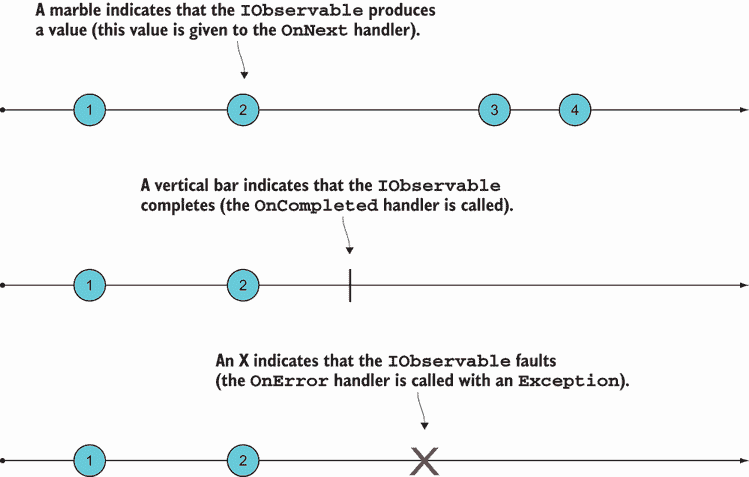

图 18.1 宝石图提供了一种直观理解 `IObservable` 的方法。

该图像说明 `IObservable` 可以产生三种不同类型的消息：

+   `OnNext` 信号表示新的值，所以如果你的 `IObservable` 表示事件流，当事件准备好被消费时，`OnNext` 将被触发。这是 `IObservable` 最重要的消息，通常也是你唯一感兴趣的消息。

+   `OnCompleted` 信号表示 `IObservable` 已完成，并将不再产生更多值。

+   `OnError` 信号表示发生了错误，并提供相关的 `Exception`。

`IObservable` 协议

`IObservable` 协议指定 `IObservable` 应根据以下语法产生消息：

```
OnNext* (OnCompleted|OnError)?
```

也就是说，一个 `IObservable` 可以产生任意数量的 `T`（`OnNext`），可能后跟一个表示成功完成（`OnCompleted`）或错误（`OnError`）的单个值。这意味着在完成方面有三种可能性。一个 `IObservable` 可以

+   永不完成

+   正常完成，带有完成消息

+   异常完成；在这种情况下，它产生一个 `Exception`

一个 `IObservable` *永远*不会在完成之后产生任何值，无论它是正常完成还是出错完成。

### 18.1.2 订阅 IObservable

观察-*ables* 与观察-*ers* 一起工作。简单来说，

+   观察者产生值

+   观察者消费它们

如果你想要消费 `IObservable` 产生的消息，你可以创建一个观察者并通过 `Subscribe` 方法将其与 `IObservable` 关联起来。最简单的方法是提供一个回调，该回调处理 `IObservable` 产生的值，如下所示：

```
using System;                 ❶
using System.Reactive.Linq;   ❷

IObservable<int> nums = //...

nums.Subscribe(Console.WriteLine);
```

❶ 展示了 `IObservable` 接口

❷ 展示了下面的 `Subscribe` 扩展方法

当我说 `nums` “产生”一个 `int` 值时，我真正想说的是它调用给定的函数（在这种情况下，`Console.WriteLine`）并传递该值。前面代码的结果是当 `nums` 产生一个 `int` 值时，它会被打印出来。

我觉得命名有点令人困惑；你可能会期望一个 `IObservable` 有一个 `Observe` 方法，但相反，它被称作 `Subscribe`。基本上，你可以把它们看作同义词：观察者是一个订阅者，为了观察一个 `IObservable`，你需要订阅它。

那么 `IObservable` 可以产生的其他类型消息是什么？你也可以为这些消息提供处理程序。例如，下面的列表显示了一个便利方法 `Trace`，它将一个观察者附加到一个 `IObservable` 上；这个观察者简单地在每个 `IObservable` 信号时打印诊断消息。我们稍后会使用这个方法进行调试。

列表 18.1 订阅 `IObservable` 产生的消息

```
using static System.Console;

public static IDisposable Trace<T>
   (this IObservable<T> source, string name)
   => source.Subscribe
   (
      onNext: t => WriteLine($"{name} -> {t}"),
      onError: ex => WriteLine($"{name} ERROR: {ex.Message}"),
      onCompleted: () => WriteLine($"{name} END")
   );
```

`Subscribe` 实际上接受三个处理程序（所有都是可选参数）来处理 `IObservable<T>` 可以产生的不同消息。为什么处理程序是可选的应该很清楚：如果你不期望 `IObservable` 任何时候都会完成，就没有必要提供 `onComplete` 处理程序。

订阅的一个更面向对象的选择是使用 `IObserver` 接口调用 `Subscribe`，这个接口出人意料地暴露了 `OnNext`、`OnError` 和 `OnCompleted` 方法。¹

注意，`Subscribe` 返回一个 `IDisposable`（订阅）。通过释放它，你可以取消订阅。

在本节中，你看到了围绕 `IObservable` 的基本概念和术语。这需要吸收很多内容，但不用担心，随着你看到一些示例，事情会变得清晰。以下是一些需要记住的基本思想：

+   可观察对象产生值；观察者消费它们。

+   你可以通过使用 `Subscribe` 将一个观察者与一个可观察对象关联起来。

+   一个可观察对象通过调用观察者的 `OnNext` 处理程序来产生一个值。

## 18.2 创建 `IObservables`

你现在知道如何通过订阅 `IObservable` 来消费流中的数据。但你是如何首先获得一个 `IObservable` 的呢？`IObservable` 和 `IObserver` 接口包含在 .NET Standard 中，但如果你想要创建或对 `IObservable`s 执行许多其他操作，你通常会使用通过安装 `System.Reactive` 包的响应式扩展 (Rx)。²

创建 `IObservable`s 的推荐方法是使用静态 `Observable` 类中包含的几个专用方法之一；我们将在下面看看。我建议你在可能的情况下始终在 REPL 中跟随。

### 18.2.1 创建一个计时器

可以用一个每隔固定时间发出信号的 `IObservable` 来模拟计时器。我们可以用以下这样的宝石图来表示它：

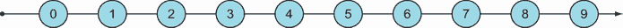

这是一种开始实验 `IObservable`s 的好方法，因为它简单但确实包含了时间的元素。以下列表中的代码使用 `Observable.Interval` 创建了一个计时器。

列表 18.2 创建每秒发出信号的 `IObservable`

```
using System.Reactive.Linq;

var oneSec = TimeSpan.FromSeconds(1);
IObservable<long> ticks = Observable.Interval(oneSec);
```

在这里，我们定义 `ticks` 为一个 `IObservable`，它将在一秒后开始发出信号，产生一个每秒递增的 `long` 计数器值，从 0 开始。注意我说的是“将开始”发出信号？结果 `IObservable` 是惰性的，所以除非有订阅者，实际上什么都不会发生。如果没有人听，为什么要说话呢？

如果我们想看到一些有形的结果，我们需要订阅 `IObservable`。我们可以使用之前定义的 `Trace` 方法来做这件事：

```
ticks.Trace("ticks");
```

在这个阶段，你将开始在控制台看到以下消息依次出现，每秒一条：

```
ticks -> 0
ticks -> 1
ticks -> 2
ticks -> 3
ticks -> 4
...
```

因为这个 `IObservable` 从不完成，你将不得不重置 REPL 来停止噪音——抱歉！

### 18.2.2 使用 `Subject` 来告诉 `IObservable` 它何时应该发出信号

创建一个 `IObservable` 的另一种方式是通过实例化一个 `Subject`。`Subject` 是一个 `IObservable`，你可以命令式地告诉它产生一个值，然后它会反过来将其推送到它的观察者。例如，以下列表显示了一个程序，它将控制台输入转换为由 `Subject` 信号化的值。

列表 18.3 将用户输入建模为流

```
using System.Reactive.Subjects;
using static System.Console;

var inputs = new Subject<string>();           ❶

using (inputs.Trace("inputs"))                ❷
{
   for (string input; (input = ReadLine()) != "q";)
      inputs.OnNext(input);                   ❸

   inputs.OnCompleted();                      ❹
}                                             ❺
```

❶ 创建一个 `Subject`

❷ 订阅到 `Subject`

❸ 告诉 `Subject` 产生一个值，并将其推送到其观察者

❹ 告诉 `Subject` 发出完成信号

❺ 离开 `using` 块将释放订阅。

每当用户输入一些输入时，代码通过调用其 `OnNext` 方法将该值推送到 `Subject`。当用户输入“q”时，代码退出 `for` 循环并调用 `Subject` 的 `OnCompleted` 方法，表示流已结束。在这里，我们已经使用列表 18.1 中定义的 `Trace` 方法订阅了输入流，因此对于每个用户输入，我们都会打印出诊断消息。

与程序的交互看起来像这样（用户输入以粗体显示）：

```
hello
inputs -> hello
world
inputs -> world
q
inputs END
```

避免使用`Subject`

`Subject`对于演示目的很有用，但它以命令式方式工作（你告诉`Subject`何时触发），这与 Rx 的*响应式*哲学（你指定在发生某些事情时如何响应）有些相悖。

因此，建议尽可能避免使用`Subject`，而改用其他方法，例如`Observable.Create`，你将在下一节中看到。

作为练习，尝试使用`Observable.Create`重写列表 18.3 中的代码，以创建用户输入的`IObservable`。

### 18.2.3 从基于回调的订阅创建`IObservables`

如果你的系统订阅了外部数据源，例如消息队列、事件代理或发布/订阅，你可以将该数据源建模为`IObservable`。

例如，Redis 可以用作发布/订阅。Redis 的 API 公开了一个`Subscribe`方法，允许你注册一个回调，该回调接收在给定频道上发布到 Redis 的消息（Redis 频道只是一个字符串；它允许订阅者指定他们感兴趣的哪些消息）。以下列表显示了如何使用`Observable.Create`创建一个在从 Redis 接收到消息时发出信号的`IObservable`。

列表 18.4：从发布到 Redis 的消息创建`IObservable`

```
using StackExchange.Redis;
using System.Reactive.Linq;

ConnectionMultiplexer redis
   = ConnectionMultiplexer.Connect("localhost");

IObservable<RedisValue> RedisNotifications
(
   RedisChannel channel
)
=> Observable.Create<RedisValue>(observer =>                    ❶
{
   var sub = redis.GetSubscriber();
   sub.Subscribe(channel, (_, val) => observer.OnNext(val));    ❷
   return () => sub.Unsubscribe(channel);                       ❸
});
```

❶ `Create`接受一个观察者，所以给定的函数只有在订阅时才会被调用。

❷ 从基于回调的`Subscribe`实现转换为由`IObservable`产生的值

❸ 返回一个在订阅被释放时将被调用的函数

前面的方法返回一个`IObservable`，它产生从给定频道接收到的 Redis 上的值。你可以这样使用它：

```
RedisChannel weather = "weather";

var weatherUpdates = RedisNotifications(weather);         ❶
weatherUpdates.Subscribe(
   onNext: val => WriteLine($"It's {val} out there"));    ❷

redis.GetDatabase(0).Publish(weather, "stormy");          ❸
// prints: It's stormy out there                          ❸
```

❶ 获取一个在天气频道发布消息时发出信号的`IObservable`

❷ 订阅到`IObservable`

❸ 发布一个值会导致`weatherUpdates`发出信号；因此调用`onNext`处理程序。

你可能会问，“我们到底获得了什么？”毕竟，我们本可以使用 Redis 的`Subscribe`方法注册一个回调来处理消息；相反，我们现在有一个`IObservable`，需要`Subscribe`到它来处理消息。关键是，有了`IObservable`，我们可以利用 Rx 中包含的许多操作符（我们将在第 18.3 节中讨论）以及调度器（用于优化性能，但超出了本章的范围）。

### 18.2.4 从更简单的结构创建`IObservables`

我说过`IObservable<T>`比一个值`T`、一个`Task<T>`或一个`IEnumerable<T>`更通用，所以让我们看看每个这些如何提升为`IObservable`。如果你想要将其中一个较不强大的结构与`IObservable`结合使用，这会很有用。

`Return`允许你将单个值提升到类似这样的`IObservable`：

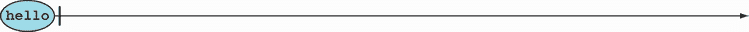

即，它立即产生值然后完成。这里有一个例子：

```
IObservable<string> justHello = Observable.Return("hello");
justHello.Trace("justHello");

// prints: justHello -> hello
//         justHello END
```

`Return` 接收一个值 `T` 并将其提升到 `IObservable<T>`。这是第一个 `Return` 函数实际上被命名为 `Return` 的容器！

让我们看看如何从一个单个异步值——一个 `Task` 创建 `IObservable`。这里，我们有一个看起来像这样的 `IObservable`：

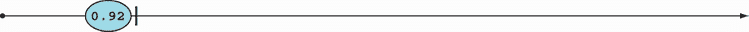

经过一段时间，我们将得到一个单一值，紧接着是完成信号的信号。在代码中，它看起来像这样：

```
Observable.FromAsync(() => RatesApi.GetRateAsync("USDEUR"))
   .Trace("singleUsdEur");
// prints: singleUsdEur -> 0.92
//         singleUsdEur END
```

最后，从 `IEnumerable` 创建的 `IObservable` 看起来像这样：

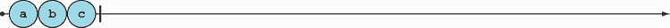

即，它立即产生 `IEnumerable` 中的所有值并完成：

```
IEnumerable<char> e = new[] { 'a', 'b', 'c' };
IObservable<char> chars = e.ToObservable();
chars.Trace("chars");

// prints: chars -> a
//         chars -> b
//         chars -> c
//         chars END
```

你现在已经看到了创建 `IObservable` 的许多方法，但不是全部。你可能会以其他方式创建 `IObservable`；例如，在 GUI 应用程序中，你可以使用 `Observable.FromEvent` 和 `FromEventPattern` 将鼠标点击等事件转换为事件流。

现在你已经了解了如何创建和订阅 `IObservable`，让我们继续探讨最迷人的领域：转换和组合不同的流。

## 18.3 转换和组合数据流

使用流的强大之处在于你可以以多种方式组合它们，并基于现有的流定义新的流。你处理的是整个流，而不是流中的单个值（就像在大多数事件驱动设计中那样）。

Rx 提供了许多函数（通常称为 *算子*）以各种方式转换和组合 `IObservable`。我将讨论最常用的几个，并添加一些我自己的算子。你会认识到函数式 API 的典型特征：纯净性和可组合性。

### 18.3.1 流转换

你可以通过以某种方式转换现有的可观察对象来创建新的可观察对象。其中最简单的操作是映射。这是通过 `Select` 方法实现的，它（就像任何其他容器一样）通过将给定的函数应用于流中的每个元素，如图 18.2 所示。

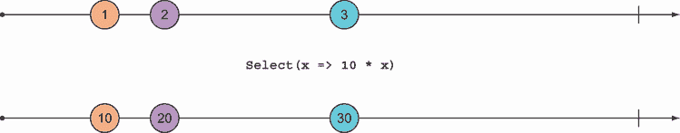

图 18.2 `Select` 将函数映射到流上。

这里有一些创建计时器并在其上映射简单函数的代码：

```
var oneSec = TimeSpan.FromSeconds(1);
var ticks = Observable.Interval(oneSec);

ticks.Select(n => n * 10)
   .Trace("ticksX10");
```

我们在最后一行使用 `Trace` 方法附加了一个观察者，因此前面的代码将导致以下消息每秒打印一次：

```
ticksX10 -> 0
ticksX10 -> 10
ticksX10 -> 20
ticksX10 -> 30
ticksX10 -> 40
...
```

因为 `Select` 遵循 LINQ 查询模式，我们可以用 LINQ 写出相同的内容：

```
from n in ticks select n * 10
```

使用 `Select`，我们可以用可观察对象的形式重写我们的简单程序，该程序检查汇率（首次在列表 15.1 中介绍）：

```
public static void Main()
{
   var inputs = new Subject<string>();            ❶

   var rates =
      from pair in inputs                         ❷
      select RatesApi.GetRateAsync(pair).Result;  ❷

   using (inputs.Trace("inputs"))                 ❸
   using (rates.Trace("rates"))                   ❸
       for (string input; (input = ReadLine().ToUpper()) != "Q";)
         inputs.OnNext(input);
}
```

❶ 用户输入的值流

❷ 将用户输入映射到相应的检索值

❸ 订阅两个流以产生调试消息

在这里，`inputs` 代表用户输入的货币对流，而在 `rates` 中，我们将这些对映射到从网络检索到的相应值。我们使用常规的 `Trace` 方法订阅这两个可观察对象，因此与该程序的交互可能如下：

```
eurusd
inputs -> EURUSD
rates -> 1.0852
chfusd
inputs -> CHFUSD
rates -> 1.0114
```

然而，请注意，在代码中，我们有一个阻塞调用到 `Result`。在实际应用中，我们不想阻塞一个线程，那么我们如何避免这种情况呢？

我们看到，一个 `Task` 可以很容易地提升为 `IObservable`。如果我们将获取每个远程 API 的速率的 `Task` 提升为 `IObservable` 而不是等待其结果，那么我们得到一个 `IObservable` 的 `IObservable`s。听起来熟悉吗？`Bind`！我们可以使用 `SelectMany` 来代替 `Select`，它将结果扁平化为单个 `IObservable`。因此，我们可以将 `rates` 流的定义重写如下：

```
var rates = inputs.SelectMany
   (pair => Observable.FromAsync(() => RatesApi.GetRateAsync(pair)));
```

`Observable.FromAsync` 将 `GetRateAsync` 返回的 `Task` 提升为 `IObservable`，`SelectMany` 将所有这些 `IObservable`s 扁平化为单个 `IObservable`。

由于总是可以将 `Task` 提升为 `IObservable`，因此 `SelectMany` 存在一个重载，它正是这样做的（这与我们在第 6.5 节中如何重载 `Bind` 以与 `IEnumerable` 和返回 `Option` 的函数一起工作类似）。这意味着我们可以避免显式调用 `FromAsync` 并返回一个 `Task`。此外，我们可以使用 LINQ 查询：

```
var rates =
   from pair in inputs
   from rate in RatesApi.GetRateAsync(pair)
   select rate;
```

因此修改后的程序与之前的工作方式相同，但没有阻塞调用 `Result`。

`IObservable` 还支持许多由 `IEnumerable` 支持的其他操作，例如使用 `Where` 过滤、`Take`（获取前 *n* 个值）、`Skip`、`First` 等。

### 18.3.2 合并和分区流

此外，还有许多运算符允许您将两个流合并为一个。例如，`Concat` 产生一个 `IObservable` 的所有值，然后是另一个 `IObservable` 中的所有值，如图 18.3 所示。

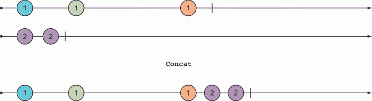

图 18.3 `Concat` 等待一个 `IObservable` 完成，然后从另一个 `IObservable` 产生元素。

例如，在我们的汇率查找中，我们有一个名为 `rates` 的可观察对象，其中包含检索到的汇率。如果我们想要一个包含程序应输出到控制台的所有消息的可观察对象，这必须包括检索到的汇率，但还必须包括一个初始消息，提示用户输入。我们可以使用 `Return` 将此单个消息提升到 `IObservable`，然后使用 `Concat` 将它与其他消息组合起来：

```
IObservable<decimal> rates = //...

IObservable<string> outputs = Observable
   .Return("Enter a currency pair like 'EURUSD', or 'q' to quit")
   .Concat(rates.Select(Decimal.ToString));
```

实际上，为 `IObservable` 提供起始值的需求如此普遍，以至于有一个专门的功能——`StartWith`。前面的代码等同于以下内容：

```
var outputs = rates.Select(Decimal.ToString)
   .StartWith("Enter a currency pair like 'EURUSD', or 'q' to quit");
```

而 `Concat` 在从右侧可观察对象产生值之前等待左侧 `IObservable` 完成，如图 18.4 所示。

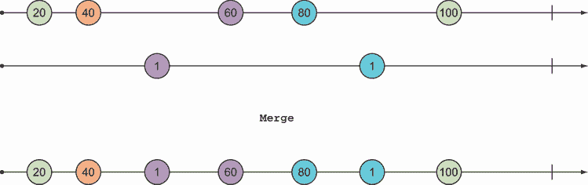

图 18.4 `Merge` 将两个 `IObservable` 合并成一个。

例如，如果您有一个包含有效值和错误消息的流，您可以使用 `Merge` 将它们组合如下：

```
IObservable<decimal> rates = //...
IObservable<string> errors = //...

var outputs = rates.Select(Decimal.ToString)
   .Merge(errors);
```

正如您可能想要合并来自不同流的值一样，相反的操作——根据某些标准对流进行分区——也是非常有用的。图 18.5 说明了这一点。

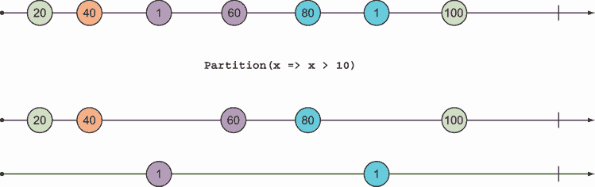

图 18.5 根据谓词分区 `IObservable`

`Partition` 返回一对 `IObservable`，因此您可以像这样解构它：

```
var (evens, odds) = ticks.Partition(x => x % 2 == 0);
```

将 `IObservable` 的值进行分区大致相当于处理单个值时的 `if` 语句，因此当您有一个根据某些条件想要以不同方式处理的值流时，它是有用的。例如，如果您有一个消息流和一些验证标准，您可以将流分为两个流，一个是有效消息流，另一个是无效消息流，并相应地处理它们。

### 18.3.3 使用 IObservable 进行错误处理

在使用 `IObservable` 进行错误处理时，其工作方式可能与您预期的不同。在大多数程序中，未捕获的异常要么导致整个应用程序崩溃，要么导致单个消息/请求的处理失败，而后续请求则正常工作。为了说明在 Rx 中事情是如何不同工作的，考虑我们查找汇率的程序版本：

```
var inputs = new Subject<string>();

var rates =
   from pair in inputs
   from rate in RatesApi.GetRateAsync(pair)
   select rate;

var outputs = from r in rates select r.ToString();

using (inputs.Trace("inputs"))
using (rates.Trace("rates"))
using (outputs.Trace("outputs"))
   for (string input; (input = ReadLine().ToUpper()) != "Q";)
      inputs.OnNext(input);
```

该程序捕获了三个流，每个流都依赖于另一个（`outputs` 是基于 `rates` 定义的，而 `rates` 是基于 `inputs` 定义的，如图 18.6 所示），我们使用 `Trace` 打印所有这些流的诊断信息。


图 18.6 三 `IObservable` 之间的简单数据流

现在看看如果您通过传递无效的货币对来破坏程序会发生什么：

```
eurusd
inputs -> EURUSD
rates -> 1.0852
outputs -> 1.0852
chfusd
inputs -> CHFUSD
rates -> 1.0114
outputs -> 1.0114
xxx
inputs -> XXX
rates ERROR: Input string was not in a correct format.
outputs ERROR: Input string was not in a correct format.
chfusd
inputs -> CHFUSD
eurusd
inputs -> EURUSD
```

这表明一旦 `rates` 发生错误，它就不再发出信号。这种行为符合 `IObservable` 协议的指定（参见关于“`IObservable` 协议”的侧边栏）。因此，所有下游的部分也都“死亡”。但是，失败的 `IObservable` 上游部分是正常的：`inputs` 仍在发出信号，就像任何其他以 `inputs` 为定义的 `IObservable` 一样。

为了防止您的系统进入这种状态，即数据流的一个分支死亡，而剩余的图仍然保持运行，您可以使用您学到的函数式错误处理技术。

以下列表显示了 `LaYumba.Functional` 中包含的辅助函数 `Safely` 的实现，该函数允许您安全地将返回 `Task` 的函数应用于流中的每个元素。结果是两个流：一个成功计算值的流和一个异常流。

列表 18.5 安全执行 `Task` 并返回两个流

```
public static (IObservable<R> Completed, IObservable<Exception> Faulted)
   Safely<T, R>(this IObservable<T> ts, Func<T, Task<R>> f)
   => ts
      .SelectMany(t => f(t).Map(
         Faulted: ex => ex,                                           ❶
         Completed: r => Exceptional(r)))                             ❶
      .Partition();

static (IObservable<T> Successes, IObservable<Exception> Exceptions)  ❷
   Partition<T>(this IObservable<Exceptional<T>> excTs)               ❷
{
   bool IsSuccess(Exceptional<T> ex)
      => ex.Match(_ => false, _ => true);

   T ExtractValue(Exceptional<T> ex)
      => ex.Match(_ => default, t => t);

   Exception ExtractException(Exceptional<T> ex)
      => ex.Match(exc => exc, _ => default);

   var (ts, errs) = excTs.Partition(IsSuccess);
   return
   (
      Successes: ts.Select(ExtractValue),
      Exceptions: errs.Select(ExtractException)
   );
}
```

❶ 将每个 `Task<R>` 转换为 `Task<Exceptional<R>>` 以获取 `Exceptional` 流

❷ 将 `Exceptional` 流分区为成功计算值和异常

对于给定流中的每个`T`，我们应用返回`Task`的函数`f`。然后，我们使用第 16.1.4 节中定义的二进制重载的`Map`将每个结果`Task<R>`转换为`Task<Exceptional<R>>`。这就是我们获得安全性的地方：而不是一个在访问时抛出异常的内值`R`，我们有一个处于适当状态的`Exceptional<R>`。`SelectMany`消除了流中的`Task`，并返回一个`Exceptional`的流。然后我们可以将它们分为成功和异常。

在此基础上，我们可以重构我们的程序以更优雅地处理错误：

```
var (rates, errors) = inputs.Safely(RatesApi.GetRateAsync);
```

### 18.3.4 整合一切

以下列表展示了你在本节中学到的各种技术。它显示了重构以安全处理错误且没有调试信息的汇率查找程序。

列表 18.6 重构以安全处理错误的程序

```
public static void Main()
{
   var inputs = new Subject<string>();

   var (rates, errors) = inputs.Safely(RatesApi.GetRateAsync);

   var outputs = rates
      .Select(Decimal.ToString)
      .Merge(errors.Select(ex => ex.Message))
      .StartWith("Enter a currency pair like 'EURUSD', or 'q' to quit");

   using (outputs.Subscribe(WriteLine))
      for (string input; (input = ReadLine().ToUpper()) != "Q";)
         inputs.OnNext(input);
}
```

图 18.7 中的数据流图显示了涉及的各个`IObservable`以及它们之间的依赖关系。

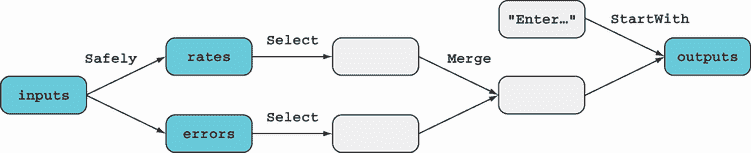

图 18.7 具有处理错误单独分支的数据流

注意`Safely`如何允许我们创建两个分支，每个分支都可以独立处理，直到获得两种情况的一致表示，然后它们可以合并。

这个程序很好地说明了使用`IObservable`s 的程序通常由三个部分组成：

+   *设置数据源*——在我们的例子中，这由`inputs`捕获。

+   *处理数据*——这是你使用`Select`、`Merge`等函数的地方。

+   *消费结果*——观察者消费最下游的`IObservable`s（在这种情况下，`outputs`）以执行副作用。

## 18.4 实现跨越多个事件的逻辑

到目前为止，我主要致力于让你熟悉`IObservable`s 以及可以与它们一起使用的许多运算符。为此，我使用了像汇率查找这样的熟悉例子。毕竟，既然你可以将任何值`T`、`Task<T>`或`IEnumerable<T>`提升为`IObservable<T>`，你几乎可以用`IObservable`s 来编写所有代码！但你应该这样做吗？

当然，答案可能不是。`IObservable`和 Rx 真正发光的领域是当你可以使用它们来编写无需任何显式状态操作的状态程序时。通过*状态程序*，我指的是事件不是独立处理的程序；过去的事件会影响如何处理新事件。在本节中，你将看到一些这样的例子。

### 18.4.1 检测按键序列

在某个时候，你可能编写了一个事件处理器，它监听用户的按键并基于按下的键和键修饰符执行一些操作。基于回调的方法对于许多情况来说是满意的，但如果你想监听特定的按键序列怎么办？例如，假设你想在用户按下组合键 Alt-K-B 时实现某些行为。

在这种情况下，按下 Alt-B 应该导致不同的行为，这取决于它是否被先前的 Alt-K 短时间内跟随，因此按键不能独立处理。如果你有一个基于回调的机制来处理单个按键事件，那么当用户按下 Alt-K 时，你实际上需要启动一个状态机，然后等待可能跟随的 Alt-B，如果在规定时间内没有收到 Alt-B，则回退到之前的状态。这实际上相当复杂！

使用 `IObservable`，这个问题可以更优雅地解决。假设我们有一个按键事件的流，`keys`。我们正在寻找两个事件——Alt-K 和 Alt-B，它们在同一个流中快速连续发生。为了做到这一点，我们需要探索如何将一个流与自身组合。考虑以下图表：

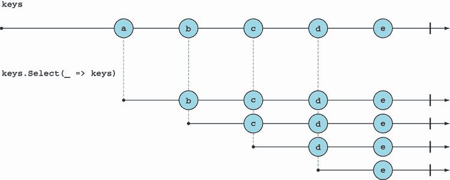

理解这个图表非常重要。表达式 `keys.Select(_ => keys)` 产生一个新的 `IObservable`，它将 `keys` 产生的每个值映射到 `keys` 本身。因此，当 `keys` 产生第一个值“a”时，这个新的 `IObservable` 产生一个包含 `keys` 中所有后续值的 `IObservable`。当 `keys` 产生第二个值“b”时，这个新的 `IObservable` 产生另一个包含“b”之后所有值的 `IObservable`，依此类推。³

查看类型也可以帮助澄清这一点：

```
keys                   : IObservable<KeyInfo>
_ => keys              : KeyInfo → IObservable<KeyInfo>
keys.Select(_ => keys) : IObservable<IObservable<KeyInfo>>
```

如果我们使用 `SelectMany` 代替，所有这些值都会被展平到一个单一的流中：

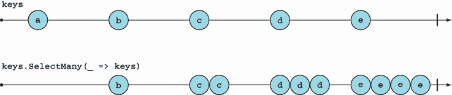

当然，如果我们正在寻找两个连续的按键，我们不需要*所有*跟随一个项目的值，只需要下一个。而不是将每个值映射到整个 `IObservable`，让我们使用 `Take` 减少到第一个项目：


我们越来越接近了。现在，让我们进行以下更改：

+   而不是忽略当前值，将其与下一个值配对。

+   使用 `SelectMany` 获取平展的 `IObservable`。

+   使用 LINQ 语法。

结果表达式将 `IObservable` 中的每个值与其之前发出的值配对：


这是一个相当有用的函数，我将称之为 `PairWithPrevious`。我们稍后会使用它。

但对于这个特定的场景，我们只想在时间上足够接近的情况下创建对。这可以通过使用 `Take` 的重载来实现，它接受一个 `Timespan` 作为以下列表所示。

列表 18.7 检测用户按下 Alt-K-B 键序列

```
IObservable<ConsoleKeyInfo> keys = //...
var halfSec = TimeSpan.FromMilliseconds(500);

var keysAlt = keys
   .Where(key => key.Modifiers.HasFlag(ConsoleModifiers.Alt));

var twoKeyCombis =
   from first in keysAlt                         ❶
   from second in keysAlt.Take(halfSec).Take(1)  ❶
   select (First: first, Second: second);        ❶

var altKB =
   from pair in twoKeyCombis
   where pair.First.Key == ConsoleKey.K
      && pair.Second.Key == ConsoleKey.B
   select Unit();
```

❶ 对于任何按键，将其与在半秒内发生的下一个按键配对

如你所见，解决方案简单而优雅。你可以应用这种方法来识别事件序列中的更复杂模式——而无需显式跟踪状态和引入副作用！

你可能也已经意识到，提出这样的解决方案并不一定容易。熟悉 `IObservable` 及其众多操作符需要一段时间，并且需要理解如何使用它们。

### 18.4.2 对多个事件源做出反应

假设我们有一个以欧元计价的银行账户，我们希望跟踪其美元价值。余额的变化和汇率的变化都会导致美元余额的变化。为了对来自不同流的变动做出反应，我们可以使用 `CombineLatest`，它在一个 `IObservable` 信号时获取两个可观察对象的最新值，如图 18.8 所示。

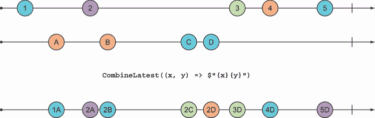

图 18.8 `CombineLatest` 在两个 `IObservable` 中的任何一个发出信号时都会发出信号。

其用法如下：

```
IObservable<decimal> balance = //...
IObservable<decimal> eurUsdRate = //...

var balanceInUsd = balance.CombineLatest(eurUsdRate
   , (bal, rate) => bal * rate);
```

这可行，但它没有考虑到汇率比账户余额波动性更大的事实。事实上，如果汇率来自外汇市场，每秒钟可能会有数十或数百次微小的变动！显然，对于想要关注其财务状况的私人客户来说，不需要这么详细的程度。对汇率每一次变动做出反应会向客户发送大量不想要的提醒。

这是一个 `IObservable` 产生过多数据的例子（请参阅“背压”侧边栏）。为此，我们可以使用 `Sample` 操作符，它接受一个充当数据源的 `IObservable`，以及另一个表示何时产生值的 `IObservable`。`Sample` 在图 18.9 中展示。

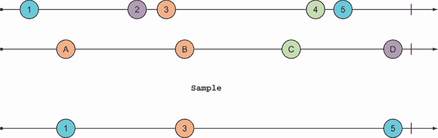

图 18.9 `Sample` 在采样流信号时产生源流的值。

在这个场景中，我们可以创建一个每 10 分钟发出信号的 `IObservable`，并使用它来采样汇率流，如下所示。

列表 18.8 每 10 分钟从 `IObservable` 中采样一个值

```
IObservable<decimal> balance = //...
IObservable<decimal> eurUsdRate = //...

var tenMins = TimeSpan.FromMinutes(10);
var sampler = Observable.Interval(tenMins);
var eurUsdSampled = eurUsdRate.Sample(sampler);

var balanceInUsd = balance.CombineLatest(eurUsdSampled
   , (bal, rate) => bal * rate);
```

这是我们逻辑跨越多个事件场景的另一个例子，使用 Rx 操作符 `CombineLatest` 和 `Sample` 允许我们在不显式保持任何状态的情况下编码此逻辑。

背压：当 `IObservable` 产生数据过快时

当你迭代 `IEnumerable` 或 `IAsyncEnumerable` 中的项时，你是在“拉取”或请求项，因此你可以根据自己的节奏处理它们。使用 `IObservable` 时，项是“推”给你的（消费代码）。如果一个 `IObservable` 产生的值比订阅的观察者能够消费的更快，这可能会导致过度的 *背压*，从而对你的系统造成压力。

为了缓解背压，Rx 提供了几个操作符：

+   `Throttle`

+   `Sample`

+   `Buffer`

+   `Window`

+   `Debounce`

每个都有不同的行为和几个重载，所以我们不会详细讨论它们。重点是，使用这些算子，你可以轻松地声明式地实现逻辑，例如，“我想每次以 10 个批次的数量消费项目”，或者“如果一系列值快速连续到达，我只想要消费最后一个”。在基于回调的解决方案中实现这种逻辑，其中每个值都是独立接收的，你需要手动保持一些状态。

### 18.4.3 当账户透支时通知

对于一个最终的、更面向业务的例子，想象一下在 BOC 应用程序的环境中，我们消费了影响银行账户的所有交易的流，并且我们希望在账户余额变为负数时向客户发送通知。

账户余额是所有影响它的交易的总和，因此在任何时候，给定一个账户过去 `Transaction` 的列表，你可以使用 `Aggregate` 计算其当前余额。

对于 `IObservable`，有一个 `Aggregate` 函数；它等待 `IObservable` 完成，并将它产生的所有值聚合成一个单一值。但这并不是我们需要的：我们不想等待流完成，而是每次接收到一个新的 `Transaction` 时都重新计算余额。为此，我们可以使用 `Scan`（见图 18.10），它与 `Aggregate` 类似，但会聚合所有之前的值以及每次产生的新值。

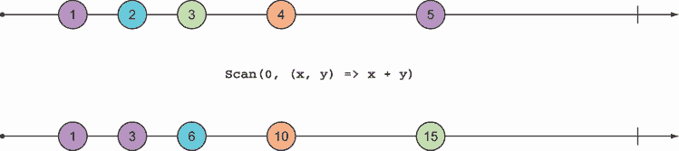

图 18.10 `Scan` 聚合到目前为止产生的所有值。

因此，我们可以有效地使用 `Scan` 来保持状态。给定影响银行账户的 `Transaction` 的 `IObservable`，我们可以使用 `Scan` 来累加所有过去交易的数量，在账户余额发生变化时，获得一个发出新余额信号的 `IObservable`：

```
IObservable<Transaction> transactions = //...
decimal initialBalance = 0;

IObservable<decimal> balance = transactions.Scan(initialBalance
   , (bal, trans) => bal + trans.Amount);
```

现在我们有一个表示账户当前余额的值流，我们需要单独识别哪些余额变化会导致账户“陷入赤字”，从正数变为负数。

为了做到这一点，我们需要查看余额的变化，我们可以使用 `PairWithPrevious` 来做到这一点，它同时发出当前值和之前发出的值。你已经在 18.4.1 节中看到了 `PairWithPrevious` 的实现，但这里再次提供以供参考：

```
// ----1-------2---------3--------4------>
//
//            PairWithPrevious
//
// ------------(1,2)-----(2,3)----(3,4)-->
//
public static IObservable<(T Previous, T Current)>
   PairWithPrevious<T>(this IObservable<T> source)
   => from first in source
      from second in source.Take(1)
      select (Previous: first, Current: second);
```

这是许多可以基于现有操作定义的自定义操作示例之一。前面的代码片段还展示了如何使用 ASCII 珠石图来记录你的代码。

我们可以使用 `PairWithPrevious` 来发出当账户余额变为负数时的信号：

```
IObservable<Unit> dipsIntoTheRed =
   from bal in balance.PairWithPrevious()
   where bal.Previous >= 0
      && bal.Current < 0
   select Unit();
```

现在让我们使事情更接近现实世界。如果你的系统接收到了一个交易流，这可能会包括所有账户的交易。因此，我们必须按账户 ID 对它们进行分组，以便正确计算余额。`GroupBy` 对于 `IObservable` 的工作方式与 `IEnumerable` 类似，但它返回一个流流。

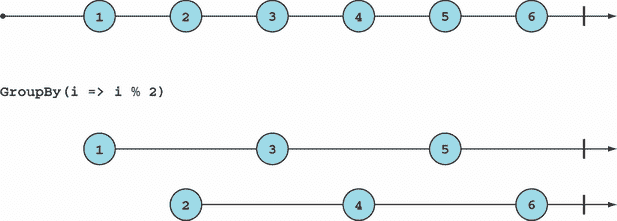

以下列表展示了如何适应逻辑，假设有一个所有账户的初始交易流。

列表 18.9 当账户透支时发出信号

```
IObservable<Transaction> transactions = //...    ❶

IObservable<Guid> dipsIntoRed = transactions
   .GroupBy(t => t.AccountId)                    ❷
   .Select(DipsIntoTheRed)                       ❸
   .MergeAll();                                  ❹

static IObservable<Guid> DipsIntoTheRed
   (IGroupedObservable<Guid, Transaction> transactions)
{
   Guid accountId = transactions.Key;
   decimal initialBalance = 0;

   var balance = transactions.Scan(initialBalance
      , (bal, trans) => bal + trans.Amount);

   return from bal in balance.PairWithPrevious()
          where bal.Previous >= 0
             && bal.Current < 0
          select accountId;                     ❺
}

public static IObservable<T> MergeAll<T>
   (this IObservable<IObservable<T>> source)
   => source.SelectMany(x => x);
```

❶ 包含所有账户的交易

❷ 按账户 ID 分组

❸ 发出特定账户透支的信号

❹ 将结果扁平化为单个可观察对象

❺ 发出违规账户的 ID

现在我们从所有账户的交易流开始，最终得到一个 `Guid` 流，该流会在任何账户出现透支时发出信号，包括标识违规账户的 `Guid`。注意这个程序是如何有效地跟踪所有账户的余额，而无需我们进行任何显式的状态操作。

## 18.5 你应该在何时使用 IObservable？

在本章中，你已经看到了如何使用 `IObservable` 来表示数据流，以及如何使用 Rx 创建和操作 `IObservable`s。Rx 有许多细节和特性我们还没有讨论，但我们已经涵盖了足够的内容，让你开始使用 `IObservable`s 并根据需要进一步探索 Rx 的特性。⁴

正如你所看到的，拥有一个能够捕获数据流的抽象，使你能够检测模式并指定跨越同一流中多个事件或不同流的事件的逻辑。这就是我建议使用 `IObservable` 的地方。其逆命题是，如果你的事件可以独立处理，那么你可能不应该使用 `IObservable`s，因为使用它们可能会降低你代码的可读性。

需要记住的一个重要事情是，由于 `OnNext` 没有返回值，`IObservable` 只能向下推送数据，而永远不会接收任何数据。因此，`IObservable`s 最好组合成 *单向数据流*。例如，如果你从队列中读取事件并将一些数据写入数据库作为结果，`IObservable` 就是一个很好的选择；同样，如果你有一个通过 WebSockets 与网络客户端通信的服务器，客户端和服务器之间以发送和忘记的方式交换消息，`IObservable` 同样适用。

另一方面，`IObservable`s 并不适合像 HTTP 这样的请求-响应模型。你可以将接收到的请求建模为一个流，并计算一个响应流，但你将无法轻松地将这些响应与原始请求关联起来。

最后，如果你有无法用 Rx 的操作符捕获的复杂同步模式，并且需要更精细地控制消息的顺序和处理方式，你可能会发现 `System.DataFlow` 命名空间（基于内存队列）中的构建块更合适。

## 摘要

+   `IObservable<T>` 表示 `T` 的 *流*，即时间序列中的值序列。

+   `IObservable` 根据语法产生消息

    ```
    OnNext* (OnCompleted|OnError)?.
    ```

+   使用 `IObservable`s 编写程序涉及三个步骤：

    +   使用 `System.Reactive.Linq .Observable` 中的方法创建 `IObservable`s。

    +   使用 Rx 或您可能定义的其他运算符转换和组合 `IObservable`。

    +   订阅并消费 `IObservable` 生成的值。

+   使用 `Subscribe` 将观察者关联到 `IObservable`。

+   通过处置 `Subscribe` 返回的订阅来移除观察者。

+   将副作用（在观察者中）与逻辑（在流转换中）分离。

+   在决定是否使用 `IObservable` 时，请考虑以下因素：

    +   `IObservable` 允许您指定跨越多个事件的逻辑。

    +   `IObservable` 适用于建模单向数据流。

* * *

`IObserver` 是在 `IObservable` 接口中声明的方法。接受回调的重载是一个扩展方法。

² Rx 包含几个库。主要库 `System.Reactive` 打包了您最常需要的包：`System.Reactive.Interfaces`、`System.Reactive.Core`、`System.Reactive.Linq` 和 `System.Reactive.PlatformServices`。还有几个在其他更专业场景中很有用的包，例如如果您正在使用 Windows forms。

假设 `keys` 是一个 `IEnumerable`，那么 `keys.Select(_ => keys)` 会是什么样子：对于每个值，你都会获取整个 `IEnumerable`。最终，你会得到一个包含 `keys` 的 *n* 个副本的 `IEnumerable`（*n* 是 `keys` 的长度）。由于 `IObservable` 中存在时间元素，所以当你说“给我 `keys`”时，你实际上得到的是 `keys` 将在未来产生的所有值。

⁴ 为了让您了解未涵盖的内容，还有许多其他运算符以及 Rx 的重要实现细节：调度器（确定如何调度对观察者的调用）、*热* 与 *冷* 观察者（并非所有观察者都是懒加载的），以及具有不同行为的 `Subject` 等。
