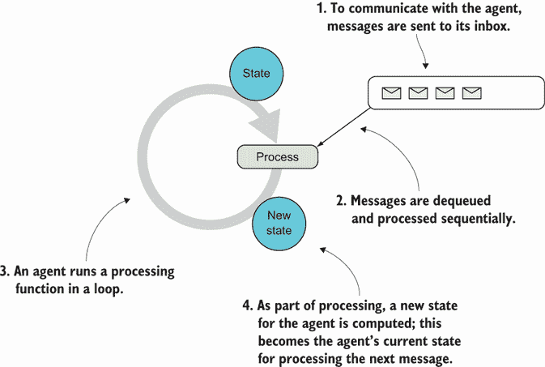
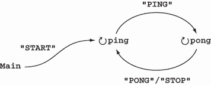
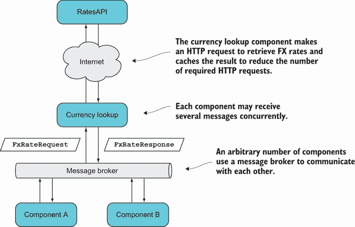
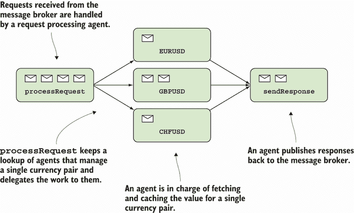

# 19 基于消息传递的并发简介

本章涵盖了

+   为什么有时需要共享可变状态

+   理解基于消息传递的并发

+   使用 C#进行代理编程

+   将基于代理的实现隐藏在传统的 API 后面

每个经验丰富的开发者都有一些亲身经历，了解处理死锁和竞态条件等问题的难度。这些是可能在涉及共享可变状态（即，在并发执行的进程之间）的并发程序中出现的难题。

这就是为什么，在这本书的整个过程中，你已经看到了许多如何在不依赖共享可变状态的情况下解决问题的例子。实际上，我的建议是尽可能避免共享可变状态，而函数式编程（FP）提供了一个很好的范式来实现这一点。

在本章中，你将了解为什么有时无法避免共享可变状态，以及有哪些策略可以同步对共享可变状态的访问。然后我们将专注于这些策略之一：*基于代理的并发*，这是一种依赖于代理之间消息传递的并发编程风格，这些代理“拥有”一些它们以单线程方式访问的状态。使用代理编程在 F#程序员中很受欢迎，但你将看到它在 C#中也是完全可以实现的。

## 19.1 需要共享可变状态

在设计并行算法时，通常可以避免共享可变状态。例如，如果你有一个计算密集型问题，你希望并行化，你通常可以将数据集或任务分解成这样的方式，即几个线程独立地计算一个中间结果。因此，这些线程可以在不需要共享任何状态的情况下完成他们的工作。另一个线程可以通过组合所有中间结果来计算最终结果。

然而，避免共享可变状态并不总是可能的。尽管在并行计算的情况下通常可以实现，但如果并发源是多线程，那就困难得多。例如，想象一个多线程应用程序，比如一个在多个线程上处理请求的服务器，它需要执行以下操作：

+   保持一个应用程序范围内的计数器，以便可以生成唯一的、*顺序的*账户号码。

+   在内存中缓存一些资源以提高效率。

+   表示现实世界中的实体，如待售的商品、交易、合同等，确保在收到两个购买同一（唯一、现实世界）商品的并发请求时，不会重复出售。

在这种情况下，对于服务器应用程序使用的许多线程之间共享可变状态基本上是必需的。为了防止并发访问导致数据不一致，你需要确保状态不能被不同线程同时访问（或者至少，不能被更新）。也就是说，你需要对共享可变状态进行*同步*访问。

在主流编程中，这种同步通常是通过锁来实现的。*锁*定义了代码的关键部分，一次只能由一个线程进入。当一个线程进入关键部分时，它会阻止其他线程进入。函数式程序员倾向于避免使用锁，而转而采用替代技术：

+   *比较并交换（CAS）*——CAS 允许你原子地读取和更新单个值，这可以在 C#中使用`Interlocked.CompareExchange`方法完成。

+   *软件事务内存（STM）*——STM 允许你在事务中更新可变状态，这为这些更新如何发生提供了一些有趣的保证：

    +   *每个线程都在隔离中执行事务。* 它看到的是一个不受其他线程上并发发生的事务影响的程序状态视图。

    +   *然后事务原子性地提交。* 要么将事务中的所有更改保存，要么一个都不保存。¹

    +   *冲突的事务不一定失败。* 如果一个事务因为另一个并发事务中做出的冲突更改而失败，它可以带着对数据的全新视图重新尝试。

+   *消息传递并发*——这种方法的理念是设置轻量级进程，它们拥有某些可变状态的独占所有权。进程之间的通信是通过消息传递进行的，进程按顺序处理消息，从而防止对它们状态的并发访问。这种方法的两种主要实现是：

    +   *actor 模型*——这种模型最著名的是在爱立信与 Erlang 语言结合下实现的，但其他语言，包括 C#，也有许多实现。在这个模型中，进程被称为*actor*，它们可以分布在不同进程和机器上。

    +   *基于代理的并发*——这是受到 actor 模型的启发，但它要简单得多，因为称为*代理*的进程只存在于一个应用程序中。

CAS 只允许你处理单个值，因此它为非常有限数量的场景提供了一个有效的解决方案。

STM 是进程内并发的 重要范式，它在 Clojure 和 Haskell 开发者中尤其受欢迎，因为这些语言提供了引人注目且经过实战检验的 STM 实现。如果你想在 C#中探索这个范式，language-ext 包含了 `Atom` 和 `Ref` 的实现，这些是允许你原子地更新线程间共享数据的原语。²

在本章的其余部分，我将专注于消息传递并发，特别是基于代理的并发。你将在以后看到代理和 actor 在更多细节上的区别。让我们首先从将消息传递并发作为一个编程模型来探讨。

## 19.2 理解消息传递并发

您可以将代理（或演员；基本思想是相同的）视为一个拥有某些可变状态的独占所有权的进程。演员之间的通信是通过消息传递进行的，这样状态就永远不会从代理外部被访问。此外，传入的消息是顺序处理的，这样就不会发生并发状态更新。

图 19.1 说明了代理：一个在循环中运行的进程。它有一个消息队列，其中消息被排队，它还有一些状态。当消息被出队并处理时，代理通常会执行以下操作之一：

+   执行副作用

+   向其他代理发送消息

+   创建其他代理

+   计算其新状态



图 19.1 一个代理由一个消息收件箱和一个处理循环组成。

新状态将在下一次迭代中用作当前状态，当处理以下消息时。

让我们从我刚才描述的理想化、几乎是伪代码的代理实现开始。仔细查看以下列表中的代码，看看每个部分如何对应于图 19.1 中的描述。

列表 19.1 代理的理想化实现

```
public sealed class Agent<State, Msg>
{
   BlockingCollection<Msg> inbox                     ❶
      = new BlockingCollection<Msg>(new ConcurrentQueue<Msg>());

   public void Tell(Msg message)                     ❷
      => inbox.Add(message);                         ❷

   public Agent                                      ❸
   (
      State initialState,
      Func<State, Msg, State> process
   )
   {
      void Loop(State state)
      {
         Msg message = inbox.Take();                 ❹
         State newState = process(state, message);   ❺
         Loop(newState);                             ❻
      }

      Task.Run(() => Loop(initialState));            ❼
   }
}
```

❶ 使用并发队列作为消息收件箱

❷ 将消息告诉代理只是将消息入队。

❸ 通过提供初始状态和处理函数创建代理

❹ 一旦可用就出队消息

❺ 处理消息，确定代理的新状态

❻ 使用新状态进行循环

❼ 演员在自己的进程中运行。

这里有一些有趣的事情要注意。首先，请注意，只有两个公共成员，因此只能允许与代理进行两种交互：

+   您可以创建（或*启动*）一个代理。

+   您可以告诉它一个消息，这只是在代理的收件箱中入队消息。

您可以从这些原始操作定义更复杂的交互。

让我们现在看看处理循环，它在`Loop`函数中编码。这从收件箱中取出第一条消息（或等待直到有消息可用）并使用代理的处理函数及其当前状态进行处理。这产生了代理的新状态，该状态用于下一次循环的执行。

注意，除了在调用给定的处理函数时可能发生的任何副作用之外，实现是无副作用的。状态变化是通过始终将状态作为`Loop`函数的参数传递来捕获的（这是您在 15 章中已经看到的技术）。

注意，此实现假定`State`必须是一个不可变类型；否则，它可能被`process`函数共享并在代理处理循环的范围之外任意更新。因此，状态只“看起来”是可变的，因为每次调用`Loop`时都使用状态的新版本。

最后，花点时间看看构造函数的签名。它让你想起了什么吗？与 `Enumerable.Aggregate` 进行比较。你能看出它基本上是相同的吗？代理的当前状态是它迄今为止接收到的所有消息的归约结果，使用初始状态作为累加器值，处理函数作为归约器。这是对代理接收到的消息流进行的时间折叠。

这种实现是优雅的，并且在一个具有尾调用消除的语言中会工作得很好。但在 C# 中，这个特性并不存在，因此我们需要做一些修改以实现栈安全。此外，我们还可以通过使用 .NET 中的现有功能来放弃许多底层细节。我们将在下一部分查看这一点。

### 19.2.1 在 C# 中实现代理

.NET 包含一个名为 `MailboxProcessor` 的代理实现，但它是为 F# 设计的，从 C# 使用起来有些尴尬。尽管前面的实现对于理解这个想法很有用，但它并不是最优的。相反，在接下来的示例中，我将使用一个更实用的代理实现，它包含在 `LaYumba.Functional` 中，并在下面的列表中展示。

列表 19.2 基于 `Dataflow.ActionBlock` 的代理实现

```
using System.Threading.Tasks.Dataflow;

public interface Agent<Msg>
{
   void Tell(Msg message);
}

class StatefulAgent<State, Msg> : Agent<Msg>
{
   private State state;
   private readonly ActionBlock<Msg> actionBlock;

   public StatefulAgent
   (
      State initialState,
      Func<State, Msg, State> process
   )
   {
      state = initialState;

      actionBlock = new ActionBlock<Msg>(msg =>
      {
         var newState = process(state, msg);   ❶
         state = newState;                     ❷
      });
   }

   public void Tell(Msg message)
      => actionBlock.Post(message);            ❸
}
```

❶ 使用当前状态处理消息

❷ 将结果分配给存储的状态

❸ 消息的排队和处理由 `ActionBlock` 管理。

在这里，我已经将递归调用（可能导致栈溢出）替换为一个单例可变变量 `state`，它跟踪代理的状态，并在处理每个消息时重新分配。尽管这是一个副作用，但消息是顺序处理的，因此防止了并发写入。

我还通过使用 .NET 的 `Dataflow` 库中的构建块之一 `ActionBlock` 来放弃了管理队列和过程的细节。`ActionBlock` 包含一个缓冲区（默认情况下，大小无界），充当代理的收件箱，并且只允许固定数量的线程进入该块（默认情况下，单个线程），确保消息顺序处理。

`State` 应仍然是一个不可变类型（否则，如前所述，它可能被 `process` 函数共享并在 `ActionBlock` 的作用域之外被修改）。如果观察到这一点，代码是线程安全的。

从客户端代码的角度来看，没有任何变化：我们仍然只有两个具有与之前相同签名的公共成员。`Agent<Msg>` 接口的原因有两个：

+   从客户端代码消耗代理的角度来看，你只能向它传递消息，因此通过使用接口，我们避免了暴露状态的类型参数。毕竟，状态类型是代理的实现细节。

+   你可以设想其他实现，例如无状态代理或持久化状态的代理。

最后，这里有一些方便的方法，可以轻松创建代理：

```
public static class Agent
{
   public static Agent<Msg> Start<State, Msg>
      ( State initialState
      , Func<State, Msg, State> process)
      => new StatefulAgent<State, Msg>(initialState, process);

   public static Agent<Msg> Start<Msg>(Action<Msg> action)
      => new StatelessAgent<Msg>(action);
}
```

第一个重载简单地使用给定的参数创建一个代理。第二个接受一个动作并用于创建一个*无状态代理*：一个按顺序处理消息但不保留任何状态的代理。（实现是微不足道的，因为它只是创建了一个带有给定`Action`的`ActionBlock`）。我们还可以定义具有异步处理函数/动作的代理；为了简洁起见，我省略了重载，但完整的实现可以在代码示例中找到。接下来，我们将开始使用代理。

### 19.2.2 开始使用代理

让我们看看一些使用代理的简单示例。我们将构建几个简单的代理，它们以图 19.2 所示的方式交互。



图 19.2 通过交换消息的代理之间的简单交互

我们将从一个非常简单、无状态的代理开始，该代理接收类型为`string`的消息并将其打印出来。你可以在 REPL 中跟随：

```
Agent<string> logger = Agent.Start((string msg) => WriteLine(msg));

logger.Tell("Agent X");
// prints: Agent X
```

接下来，让我们定义与`logger`和彼此交互的`ping`和`pong`代理：

```
Agent<string> ping, pong = null;

ping = Agent.Start((string msg) =>
{
   if (msg == "STOP") return;

   logger.Tell($"Received '{msg}'; Sending 'PING'");
   Task.Delay(500).Wait();
   pong.Tell("PING");
});

pong = Agent.Start(0, (int count, string msg) =>
{
   int newCount = count + 1;
   string nextMsg = (newCount < 5) ? "PONG" : "STOP";

   logger.Tell($"Received '{msg}' #{newCount}; Sending '{nextMsg}'");
   Task.Delay(500).Wait();
   ping.Tell(nextMsg);

   return newCount;
});

ping.Tell("START");
```

在这里，我们定义了两个额外的代理。`ping`是无状态的；它向`logger`代理发送消息，并向`pong`代理发送 PING 消息，除非它被告知的消息是 STOP，在这种情况下，它什么都不做。代理根据消息有不同的行为是很常见的，也就是说，将消息解释为命令。

现在，让我们看看一个有状态的代理：`pong`。实现与`ping`非常相似。它向`ping`发送 PONG，但它还保持一个计数器作为状态。计数器在每次消息后递增，并在五条消息后，代理发送一个 STOP 消息。

当我们在最后一行向`ping`发送初始的 START 消息时，整个 ping-pong 过程就开始了。运行程序会导致以下内容被打印出来：

```
Received 'START'; Sending 'PING'
Received 'PING' #1; Sending 'PONG'
Received 'PONG'; Sending 'PING'
Received 'PING' #2; Sending 'PONG'
Received 'PONG'; Sending 'PING'
Received 'PING' #3; Sending 'PONG'
Received 'PONG'; Sending 'PING'
Received 'PING' #4; Sending 'PONG'
Received 'PONG'; Sending 'PING'
Received 'PING' #5; Sending 'STOP'
```

现在你已经看到了一些简单的代理交互，是时候转向更接近现实世界需求的内容了。

### 19.2.3 使用代理处理并发请求

让我们回顾一下提供汇率的服务场景。该服务应从汇率 API 检索汇率并将其缓存。我们在第 15.1 节中看到了一个简单的实现，但那里的交互是通过命令行进行的，因此请求必然是一个接一个地到来。

让我们改变一下。让我们想象该服务是更大系统的一部分，并且其他组件可能通过消息代理请求汇率，如图 19.3 所示。



图 19.3 一个可能同时接收多个请求的系统

组件通过通过消息代理发送消息来相互通信。要与货币查找服务通信，定义了以下消息：

```
record FxRateRequest
(
   string CcyPair,     ❶
   string Sender       ❷
 );

record FxRateResponse
(
   string CcyPair,
   decimal Rate,
   string Recipient    ❷
);
```

❶ 正在请求汇率的货币对

❷ 发送者和接收者字段允许消息代理正确路由消息。

我们假设消息代理是多线程的，因此我们的服务可以在同一时间接收来自不同线程的多个请求。

在这种情况下，线程间共享状态是一个要求：如果我们为每个线程有一个不同的缓存，那将是不理想的。因此，我们需要一些同步来确保我们不执行不必要的远程查找，并且缓存更新不会导致竞争条件。

接下来，我们将看到如何使用代理来实现这一点。首先，我们需要一些设置代码，定义与消息代理的交互。这显示在列表 19.3 中。请注意，代码并不特定于任何特定的消息代理；我们只需要能够订阅它以接收请求并使用它来发送响应。（代码示例包括一个使用 Redis 作为其底层传输的`MessageBroker`实现。）

列表 19.3 设置与消息代理的交互

```
public static void SetUp(MessageBroker broker)
{
   Agent<FxRateResponse> sendResponse = Agent.Start(
      (FxRateResponse res) => broker.Send(res.Recipient, res));      ❶

   Agent<FxRateRequest> processRequest
      = StartReqProcessor(sendResponse);                             ❷

   broker.Subscribe<FxRateRequest>("FxRates", processRequest.Tell);  ❸
}
```

❶ 发送响应的代理

❷ 处理请求并使用先前定义的代理发送响应的代理

❸ 当收到请求时，将其传递给处理代理

从底部开始，我们订阅接收在“FxRates”频道上广播的请求，提供一个回调来处理请求。这个回调（将在多个线程上调用）只是简单地将请求传递给上一行定义的处理代理。因此，尽管请求是在多个线程上接收的，但它们将立即排队在处理代理的收件箱中并按顺序处理。

这是否意味着处理现在是单线程的，我们就失去了多线程的任何好处？不一定！如果处理代理做了所有的处理，那确实是这样。相反，让我们采取更细粒度的方法：我们可以为每个货币对有一个代理负责获取和存储其特定对的汇率。请求处理代理将只负责管理这些按货币对划分的代理并将工作委托给它们，如图 19.4 所示。



图 19.4 显示代理之间并行工作的分解

现在让我们看看代理的定义。以下列表显示了高级代理，它处理传入的请求并启动低级的按货币对划分的代理，将工作委托给它们。

列表 19.4 一个协调代理将请求路由到每个货币对的代理

```
using CcyAgents = System.Collections.Immutable
   .ImmutableDictionary<string, Agent<string>>;

static Agent<FxRateRequest> StartReqProcessor
   (Agent<FxRateResponse> sendResponse)

   => Agent.Start(CcyAgents.Empty
      , (CcyAgents state, FxRateRequest request) =>
   {
      string ccyPair = request.CcyPair;

      Agent<string> agent = state
         .Lookup(ccyPair)
         .GetOrElse(() => StartAgentFor(ccyPair, sendResponse));   ❶

      agent.Tell(request.Sender);                                  ❷
      return state.Add(ccyPair, agent);
   });
```

❶ 如果需要，为请求的货币对启动一个新的代理

❷ 将请求传递给负责该对的代理

如您所见，请求处理代理持有的是代理的缓存，而不是值，每个货币对一个代理。它根据需要启动这些代理，并将请求转发给它们。

这种解决方案的好处是，对于一种货币的请求，例如 GBPUSD，不会影响另一种货币的请求，例如 EURUSD。另一方面，如果你同时收到多个 GBPUSD 的请求，只有一次远程请求会被用来获取该汇率，而其他请求将被排队。

最后，以下列表提供了管理单一货币对汇率的代理的定义。

列表 19.5 管理单一货币对汇率的代理

```
static Agent<string> StartAgentFor
(
   string ccyPair,
   Agent<FxRateResponse> sendResponse
)
=> Agent.Start<Option<decimal>, string>
(
   initialState: None,
   process: async (optRate, recipient) =>
   {
      decimal rate = await optRate.Map(Async)
         .GetOrElse(() => RatesApi.GetRateAsync(ccyPair));   ❶

      sendResponse.Tell(new FxRateResponse                   ❷
      (
         CcyPair: ccyPair,
         Rate: rate,
         Recipient: recipient
      ));

      return Some(rate);                                     ❸
   }
);
```

❶ 如果需要，从远程 API 获取速率

❷ 发送响应

❸ 代理的新状态

这个代理的状态是单一对的汇率；它被包裹在一个`Option`中，因为当代理首次创建时，它还没有可用的汇率。在收到请求后，代理决定是否需要远程查找（你可以轻松地改进这一点，如果缓存的值已过期，则获取汇率）。

为了使例子简单，我避免了过期问题和错误处理的问题。我还假设向消息代理发送请求是一个具有最小延迟的“发送并忘记”操作，因此可以有一个单独的代理执行它。

例子中的主要观点是，使用具有消息顺序处理的代理可以非常高效。然而，这确实需要从我们在本书中追求的函数式方法以及传统的使用锁的方法进行思维上的转变。

### 19.2.4 代理与演员

代理和演员密切相关。在两种情况下，单个线程按顺序处理消息并与其他演员/代理通过发送消息进行通信。也存在一些重要的区别：

+   *代理在单个进程中运行，而演员是为分布式系统设计的。在我们迄今为止看到的例子中，对代理的引用指的是当前进程中的特定实例。另一方面，对演员的引用是位置透明的；当你有一个演员的引用时，该演员可能正在同一进程中运行，也可能在另一个进程中运行，可能在远程机器上。代理的引用是一个指针，而演员的引用是演员模型实现用来在进程间路由消息的 ID。*

+   *演员模型实现旨在具有容错性。例如，Erlang 包括*监督者*：监控受监督演员并在他们失败时采取行动的演员。常规演员处理快乐路径，而监督者负责恢复，从而提高系统的鲁棒性。代理没有这样的对应物。*

+   *代理（或演员）的状态应该是不可变的，并且永远不会在代理的作用域之外共享。然而，在我们的代理实现中，没有任何阻止一个缺乏经验的开发者创建一个状态可变的代理并将该可变状态传递给其他组件，从而允许从代理的作用域之外改变该状态。对于演员，消息是序列化的，因此这种情况不应发生。*

如您所见，尽管代理和演员背后的基本思想相同，但演员模型更为丰富和复杂。您只有在需要跨不同应用程序或机器协调并发操作时才应考虑使用演员模型；否则，运营和设置成本将是不合理的，您应该依靠代理。

虽然我能够用几行代码实现一个演员，但实现演员模型要复杂得多。因此，如果您想使用演员，您可能会使用几个 .NET 演员模型实现之一：

+   *奥尔良* ([`github.com/dotnet/orleans`](https://github.com/dotnet/orleans)) 是微软对演员模型的实现。它具有明显的面向对象的感觉。其背后的哲学是，经验较少的开发者可以像与本地对象交互一样与演员（称为 *grains*）交互，而无需接触任何特定于演员模型的额外复杂性。奥尔良负责管理粒子的生命周期，这意味着其状态自动保存在内存中或持久化到存储中。持久化可以到各种媒体，包括 SQL Server 和 Azure 上的云存储。

+   *Akka.NET* ([`getakka.net/`](http://getakka.net/)) 是 Scala 开发者中流行的 Akka 框架的社区驱动移植。它早于奥尔良，并且对其消息驱动特性更为明确，因此入门门槛更高。为演员的状态传输和持久化提供了各种选项。

+   *echo* ([`github.com/louthy/echo-process`](https://github.com/louthy/echo-process)) 是最接近 Erlang 的 .NET 实现，由保罗·劳斯开发。它在语法和配置方面都是最轻量级的选项：您可以使用与代理相同的函数创建一个演员（称为 *process*），或者您可以使用基于接口的方法（如果您需要处理不同类型的消息，这种方法读起来更自然）。开箱即用，echo 只支持跨应用程序域的消息传递和通过 Redis 的持久化，但您可以实现适配器以针对不同的基础设施。

所有这些演员模型实现不仅在术语上不同，而且在重要的技术细节上也有所不同，因此很难提供一个对 *演员模型* 的描述而不针对某个特定实现。这就是我选择用一个简单的代理实现来展示消息传递并发基本思想的原因之一。您可以将这些原则应用到基于演员的编程中，但您需要学习其他原则，例如使用监督器进行错误处理以及特定实现提供的消息传递保证。

## 19.3 功能性 API，基于代理的实现

基于代理的编程甚至是函数式编程吗？尽管代理和演员是在函数式语言的环境中开发的（记住，在我们的理想化实现中，代理是无副作用的），但基于代理的编程与你在本书中看到的函数式技术截然不同：

+   你告诉代理一个消息，这通常被解释为命令，因此语义是命令式的。

+   代理通常会对另一个代理执行副作用或发送消息，而这个代理随后会执行副作用。

+   最重要的是，告诉代理一个消息不会返回数据，因此你不能像使用函数那样将告诉操作组合成管道。

+   FP 将逻辑与数据分离；代理包含数据以及在处理函数中至少一些逻辑。

因此，基于代理的编程“感觉”与你在本书中看到的 FP 不同，因此关于基于代理的并发是否实际上是函数式技术是有争议的。如果你认为它不是（正如我倾向于认为的那样），那么你必须得出结论，FP 在某些类型的并发（共享可变状态无法避免）方面并不擅长，并且需要用不同的范式来补充，如基于代理的编程或演员模型。

使用代理，可以轻松地编程**单向数据流**：数据始终向前流动（流向下一个代理），并且永远不会返回数据。面对这种情况，我们有两种选择：

+   **接受单向数据流的理念，并以这种方式编写应用程序**。在这种方法中，如果你有客户端连接到服务器，你不会使用像 HTTP 这样的请求-响应模型，而是使用基于消息的协议，如 WebSockets 或消息代理。这是一个可行的方案，特别是如果你的领域足够以事件驱动，你已经有了一个消息基础设施。

+   **在更传统的 API 后面隐藏代理特定的细节**。这表明代理应该能够对消息发送者返回响应。在这种方法中，代理被用作并发原语，是实现细节（就像锁一样），并且不应该决定程序的设计。我们将在下一节探讨这种方法。

### 19.3.1 代理作为实现细节

我们首先需要的是从代理那里获得回复的方法，一种“返回值”的形式。想象一下，发送者创建了一个包含它可以等待的处理器的消息。然后，它将消息告诉代理，代理在该处理器上发出信号，使其对发送者可用。有了这个，我们就可以在“一次性发送”的`Tell`协议之上实现双向通信。

`TaskCompletionSource` 提供了适合此目的的句柄：发送者可以创建一个 `TaskCompletionSource`，将其添加到消息负载中，并等待其 `Task`。代理将在准备好时完成其工作并在 `TaskCompletionSource` 上设置结果。对于每个你想要响应的消息手动做这件事将是繁琐的，所以相反，我在我的 `LaYumba.Functional` 库中包含了一个增强的代理，它负责所有这些连接。我不会在这里包含实现细节，但接口定义如下：

```
public interface Agent<Msg, Reply>
{
   Task<Reply> Tell(Msg message);
}
```

注意，这是一个全新的接口，它有两个通用参数：代理接受的消息类型以及它回复的类型。向这个代理发送类型为 `Msg` 的消息将返回一个 `Task<Reply>`。要启动这种类型的代理，我们将使用一个类型为

```
State → Msg → (State, Reply)
```

或者它的异步版本

```
State → Msg → Task<(State, Reply)>
```

这是一个函数，它根据代理的当前状态和接收到的消息，不仅计算代理的新状态，还计算要返回给发送者的回复。

让我们看看一个简单的例子——一个保持计数器并可以被指示增加计数器的代理，它还返回计数器的新的值：

```
var counter = Agent.Start(0
   , (int state, int msg) =>
   {
      var newState = state + msg;
      return (newState, newState);   ❶
    });
```

❶ 返回要存储的新状态和回复给发送者

你现在可以这样消费这个代理：

```
var newCount = await counter.Tell(1);
newCount // => 1
newCount = await counter.Tell(1);
newCount // => 2
```

注意，`Tell` 返回一个 `Task<int>`，所以调用者可以像任何异步函数一样等待回复。本质上，你可以使用这个代理作为线程安全、有状态、异步的 `Msg` `→` `Reply` 类型的函数版本：

+   *线程安全* 因为它内部使用一个 `ActionBlock`，一次处理一个消息

+   *有状态的* 因为代理保持的状态可能会因为处理消息而改变

+   *异步* 因为你的消息可能需要等待代理处理其队列中的其他消息

这意味着，与使用锁相比，你不仅获得了安全性（没有死锁），还获得了性能（锁会阻塞当前线程，而 `await` 则释放线程去做其他工作）。

### 19.3.2 在传统 API 后面隐藏代理

现在我们已经建立了一种双向通信机制，我们可以通过隐藏基于代理编程的细节来改进 API。例如，在计数器的例子中，我们可以定义一个 `Counter` 类，如下所示。

列表 19.6 在公共 API 后面隐藏基于代理的实现

```
public sealed class Counter
{
   readonly Agent<int, int> counter =           ❶
      Agent.Start(0, (int state, int msg) =>
         {
            var newState = state + msg;
            return (newState, newState);
         });

   public Task<int> IncrementBy(int amount)     ❷
      => counter.Tell(amount);
}
```

❶ 代理是实现细节。

❷ `Counter` 的公共接口

现在，`Counter` 的消费者可以无忧无虑地不知道其基于代理的实现。典型的交互方式如下：

```
var counter = new Counter();
var newCount = counter.IncrementBy(10);
await newCount // => 10
```

## 19.4 LOB 应用中的消息传递并发

在 LOB 应用程序中，需要同步访问某些共享状态通常是由于应用程序中的实体代表现实世界实体，我们需要确保并发访问不会使它们处于无效状态或以其他方式破坏业务规则。例如，对特定商品的两次并发购买请求不应导致该商品被卖两次。同样，多人游戏中的并发移动不应导致游戏处于无效状态。

让我们看看这在我们的银行场景中会如何展开。我们需要确保当不同的交易（借记、贷记、转账）同时发生时，它们不会使账户处于无效状态。这意味着我们需要同步对账户数据的访问吗？不一定！让我们看看如果我们不对并发采取任何特殊措施会发生什么。

想象一个余额为 1,000 元的账户。一个自动的直接借记付款发生，导致账户被扣除 800 元。同时，请求转账 200 元，以便 200 元的金额也被扣除。如果我们使用本书中迄今为止所示的事件溯源方法，我们得到以下结果：

+   直接借记请求导致事件的创建，记录了 800 元的借记，调用者将收到一个余额为 200 元的更新状态。

+   转账请求同样导致事件的创建，记录了 200 元的借记，调用者将收到一个余额为 800 元的更新状态。

+   当账户下次加载时，其状态是从所有过去的事件中计算出来的，以确保其状态将正确地有一个余额为 0。

+   随着新事件的发布，任何订阅更新的客户端都可以反映这些状态变化。（例如，在发起转账请求的客户端设备上，当直接借记发生时，可以通知用户账户余额始终是最新的。）

简而言之，如果你使用不可变对象和事件溯源，你不会因为并发更新而导致不一致的数据；这是事件溯源的一个重要好处。

现在让我们用一个新的业务需求丰富这个场景。每个账户都分配了一个最大允许的透支额，这意味着账户余额永远不会低于一定金额。现在想象我们有以下情况：

+   余额为 1,000 元，最大透支额为 500 元的账户

+   800 元的直接借记付款

+   同时，还有一个 800 元的转账请求

如果你没有同步对账户数据的访问，两个请求都将成功，导致账户透支 600 元，这违反了我们的业务要求，即透支额不应超过 500 元。为了强制执行最大允许的透支额，我们需要同步修改账户余额的操作执行，因此在这种情况下，并发请求中的一个应该失败。接下来，你将看到如何使用 actor 来实现这一点。

### 19.4.1 使用代理同步访问账户数据

为了确保账户数据不会被不同的请求同时影响，我们可以为每个账户关联一个代理。请注意，代理足够轻量级，因此可以拥有数千甚至数百万个。另外请注意，我假设有一个单独的服务器进程，通过该进程可以影响账户。如果不是这种情况，您需要使用 actor 模型实现，但以下实现的精髓仍然有效。

要将代理与账户关联，我们将定义一个具有基于代理实现的`AccountProcess`类。这意味着我们现在使用三个类来表示账户：

+   `AccountState`—一个记录，表示在特定时间点账户的状态

+   `Account`—一个只包含用于计算状态转换的纯函数的静态类

+   `AccountProcess`—一个基于代理的实现，用于跟踪账户的当前状态并处理影响账户状态的任何命令

您在第十三章中看到了`Account`和`AccountState`的实现，这些不需要更改。下面的列表显示了`AccountProcess`的实现。

列表 19.7 顺序处理影响账户的命令

```
using Result = Validation<(Event Event, AccountState NewState)>;

public class AccountProcess
{
   Agent<Command, Result> agent;

   public AccountProcess
   (
      AccountState initialState,
      Func<Event, Task<Unit>> saveAndPublish
   )
   => this.agent = Agent.Start(initialState
      , async (AccountState state, Command cmd) =>
      {
         Result result = cmd switch
         {
            MakeTransfer transfer => state.Debit(transfer),        ❶
            FreezeAccount freeze => state.Freeze(freeze),          ❶
         };

         await result.Traverse(tpl => saveAndPublish(tpl.Event));  ❷
         var newState = result
            .Map(tpl => tpl.NewState)
            .GetOrElse(state);

         return (newState, result);
      });

   public Task<Result> Handle(Command cmd)
      => agent.Tell(cmd);                                          ❸
}
```

❶ 使用纯函数来计算命令的结果

❷ 在块内持久化事件，这样代理就不会在未持久化的状态下处理新的消息

❸ 所有命令都排队并顺序处理。

`AccountProcess`的每个实例内部都包含一个代理，这样就可以顺序处理影响账户的所有命令。让我们看看代理的主体：首先，我们根据命令和当前状态计算命令的结果。这是使用纯、静态函数完成的。

记住，结果是包含结果`Event`和新的账户状态的`Validation`。如果结果是`Valid`，我们继续保存和发布创建的事件（检查作为`Traverse`的一部分进行）。

需要注意的是，持久化发生在处理函数内部。也就是说，代理在成功持久化代表其当前状态转换的事件之前，不应更新其状态并开始处理新的消息。（否则，持久化事件可能会失败，导致代理的状态与持久化事件捕获的状态不匹配。）

最后，我们返回账户的更新状态（用于处理后续命令）和命令的结果。这个结果包括新的状态和创建的事件，封装在一个`Validation`中。这使得将请求的成功和结果细节发送回客户端变得容易。

注意代理（和 actor）如何结合状态、行为和持久性（因此，它们被标记为“比对象更面向对象”）。在这个实现中，我注入了一个用于持久化事件的函数，而大多数 actor 模型的实现包括一些可配置的机制来持久化 actor 的状态。

### 19.4.2 维护账户注册表

现在我们有一个可以以线程安全的方式处理特定账户命令的`AccountProcess`。但是 API 端点的代码如何获取相关账户的`AccountProcess`实例？我们如何确保我们不会意外地为同一账户创建两个`AccountProcess`？

我们需要一个单一的应用程序范围注册表，用于存储所有活动的`AccountProcess`。它需要管理它们的创建并通过 ID 提供服务，以便处理客户端请求的代码可以通过提供请求中包含的账户 ID 简单地获取一个`AccountProcess`。

Actor 模型实现中内置了这样的注册表，允许你将任何特定的 actor 注册到任意 ID。在我们的案例中，我们将构建自己的简单注册表。以下列表展示了第一次尝试这样做的方法。

列表 19.8 存储和管理`AccountProcess`的创建

```
using AccountsCache = ImmutableDictionary<Guid, AccountProcess>;

public class AccountRegistry
{
   Agent<Guid, Option<AccountProcess>> agent;

   public AccountRegistry
   (
      Func<Guid, Task<Option<AccountState>>> loadState,
      Func<Event, Task<Unit>> saveAndPublish
   )
   => this.agent = Agent.Start
   (
      initialState: AccountsCache.Empty,
      process: async (AccountsCache cache, Guid id) =>
      {
         if (cache.TryGetValue(id, out AccountProcess account))
            return (cache, Some(account));

         var optAccount = await loadState(id);                         ❶

         return optAccount.Map(accState =>
         {
            AccountProcess account = new(accState, saveAndPublish);    ❷
            return (cache.Add(id, account), Some(account));
         })
         .GetOrElse(() => (cache, None));
      }
   );

   public Task<Option<AccountProcess>> Lookup(Guid id)
      => agent.Tell(id);
}
```

❶ 如果请求的`AccountProcess`不在缓存中，则从数据库加载当前状态

❷ 使用检索到的状态创建`AccountProcess`

在这个实现中，我们有一个单独的代理来管理一个缓存，其中保存了所有活动的`AccountProcess`实例。如果找不到给定 ID 的`AccountProcess`，则从数据库中检索账户的当前状态，用于创建一个新的`AccountProcess`，并将其添加到缓存中。请注意，像往常一样，`loadState`函数返回一个`Task<Option<AccountState>>`，以承认该操作是异步的，并且可能找不到给定 ID 的数据。

在继续阅读之前，再次审视一下实现。你能看到这种方法的任何问题吗？让我们看看：在代理体内部完成从数据库加载账户状态；这是有必要的吗？这意味着读取账户*x*的状态将阻塞对账户*y*感兴趣的另一个线程。这肯定不是最优的！

### 19.4.3 代理不是对象

这是一种常见的学校男孩错误，当你开始习惯使用代理或 actor 进行编程时。尽管代理和 actor 类似于对象，但你不能把它们当作对象来考虑。列表 19.8 中的错误是我们从概念上赋予代理提供请求的`AgentProcess`的责任，这导致了一个次优解。

相反，代理应该只负责管理一些状态。所讨论的代理管理一个字典，因此我们可以调用它来查找一个条目，或者添加一个新条目，但前往数据库检索数据是一个相对较慢的操作，这与直接管理`AgentProcess`的缓存无关。

考虑到这一点，让我们考虑一个替代方案。一个想要获取账户 ID 的`AgentProcess`的线程应该做以下事情：

1.  要求代理查找 ID。

1.  如果没有存储`AgentProcess`，则从数据库中检索账户的状态（这次耗时操作将在调用线程上完成，因此不会影响代理）。

1.  要求代理使用给定的状态和 ID 创建并注册一个新的`AgentProcess`。

这意味着我们可能需要访问代理两次，因此我们需要两种不同的消息类型来指定我们想要代理做什么。下面的列表显示了可以定义不同类型的消息来传达调用者的意图。

列表 19.9 不同的消息类型传达调用者的意图

```
public class AccountRegistry
{
   abstract record Msg(Guid Id);
   record LookupMsg(Guid Id) : Msg(Id);
   record RegisterMsg(Guid Id, AccountState AccountState) : Msg(Id);
}
```

我将这些消息类型定义为内部类，因为它们仅在`AccountRegistry`类内部使用，用于与其代理通信。

我们现在可以定义`Lookup`方法，它构成了`AccountRegistry`的公共 API（因此，在调用者的线程上执行），如下所示：

```
public class AccountRegistry
{
   Agent<Msg, Option<Account>> agent;
   Func<Guid, Task<Option<AccountState>>> loadState;

   public Task<Option<Account>> Lookup(Guid id)
      => agent
         .Tell(new LookupMsg(id))                                   ❶
         .OrElse(() =>
            from state in loadState(id)                             ❷
            from account in agent.Tell(new RegisterMsg(id, state))  ❸
            select account);
}
```

❶ 告诉代理查找给定的 ID

❷ 如果查找失败，则在调用线程中加载状态。

❸ 告诉代理使用给定的状态和 ID 注册一个新的进程

它首先要求代理查找 ID；如果查找失败，则从数据库中检索状态。请注意，这是在调用线程上完成的，这样代理就可以自由地处理其他消息。最后，向代理发送第二条消息，要求它使用给定的账户状态和 ID 创建并注册一个`AccountProcess`。

注意，所有操作都在`Task<Option<>>`堆栈内发生，因为这是`loadState`和`Tell`返回的类型。即使是这里的`OrElse`也会解析为我在`Task<Option<T>>`上定义的重载，如果`Task`失败或内部`Option`为`None`，则执行给定的回退函数。

需要展示的只剩下代理的修订版定义，该定义在`AccountRegistry`的构造函数中开始。下面的列表展示了这一点。

列表 19.10 存储账户`AccountProcess`注册表的代理

```
using AccountsCache
   = ImmutableDictionary<Guid, Agents.Account>;

public class AccountRegistry
{
   Agent<Msg, Option<Account>> agent;
   Func<Guid, Task<Option<AccountState>>> loadState;

   public AccountRegistry
   (
      Func<Guid, Task<Option<AccountState>>> loadState,
      Func<Event, Task<Unit>> saveAndPublish
   )
   {
      this.loadState = loadState;

      this.agent = Agent.Start
      (
         initialState: AccountsCache.Empty,
         process: (AccountsCache cache, Msg msg)
            => msg switch                                      ❶
         {
            LookupMsg m => (cache, cache.Lookup(m.Id)),

            RegisterMsg m => cache.Lookup(m.Id).Match
            (
               Some: acc => (cache, Some(acc)),                ❷
               None: () =>
               {
                  AccountProcess acc                           ❸
                     = new(m.AccountState, saveAndPublish);    ❸
                  return (cache.Add(m.Id, acc), Some(acc));    ❸
               }
            )
         }
      );
   }

   public Task<Option<Account>> Lookup(Guid id) => // as above...
}
```

❶ 代理使用模式匹配根据发送给它的消息执行不同的操作。

❷ 一个边缘情况，其中两个并发请求都加载了账户状态

❸ 创建并注册一个新的`AccountProcess`

这个实现稍微复杂一些，但更高效，这个例子给了我们机会看到使用代理编程时的一个常见陷阱：即在不需要严格同步访问代理状态的情况下，在代理的主体中执行昂贵的操作。

另一方面，在两种提出的实现中，一旦创建了`AccountProcess`，它就永远不会终止；它将事件持久化到数据库中，以保持存储版本与内存状态同步，但我们最多只从数据库中读取一次。这是好事还是坏事？这取决于你最终在内存中会有多少数据以及你有多少可用内存。这可能是巨大的优化，因为访问内存数据比访问数据库快得多。将所有数据保持在内存中是 actor 模型的一个大优势：因为 actor 可以跨机器分布，你可以使用的内存量没有实际限制，并且访问内存（即使是通过网络）比访问本地数据库要快得多。

### 19.4.4 将所有内容组合在一起

在放置了之前的构建块之后，让我们看看我们的 API 端点实现是如何变化的：

```
public static void ConfigureMakeTransferEndpoint
(
   WebApplication app,
   Validator<MakeTransfer> validate,
   AccountRegistry accounts                       ❶
)
{
   var getAccountVal = (Guid id)                  ❷
      => accounts
         .Lookup(id)
         .Map(opt => opt.ToValidation(Errors.UnknownAccountId(id)));

   app.MapPost("/Transfer/Make", (MakeTransfer transfer) =>
   {
      Task<Validation<AccountState>> outcome =
         from cmd in Async(validate(transfer))
         from acc in getAccountVal(cmd.DebitedAccountId)
         from result in acc.Handle(cmd)           ❸
         select result.NewState;

      return outcome.Map(
        Faulted: ex => StatusCode(500),
        Completed: val => val.Match(
           Invalid: errs => BadRequest(new { Errors = errs }),
           Valid: newState => Ok(new { Balance = newState.Balance })));
   });
}
```

❶ 通过账户 ID 获取`AccountProcess`是必需的

❷ 从`Task<Option<>`到`Task<Validation<>`的变化

❸ `AccountProcess`处理命令，更新账户状态并持久化/发布相应的事件。

端点实现依赖于`Validator`来验证命令，并依赖于`AccountRegistry`来检索相关账户的`AccountProcess`。

与第十三章中的版本相比，主要的变化是，`result`元组仅用于反馈，而持久化和发布事件发生在`AccountProcess`的`Handle`方法中。正如你所看到的，这是防止对账户状态进行并发修改所必需的，这可能会违反诸如限制账户最大透支等业务规则。

我没有包括读取和写入存储中事件的功能实现，因为它们非常特定于技术，并且不涉及任何特别有趣的逻辑。

你现在已经看到了处理货币转移的端到端解决方案的所有主要组件，这些解决方案增加了对账户状态同步访问的约束。

## 摘要

+   同时访问的共享可变状态可能会引起困难的问题。

+   因此，在可能的情况下，你应该完全避免共享可变状态。在并行处理场景中，这通常是这种情况。

+   在其他类型的并发中，特别是在需要模拟现实世界实体的多线程应用程序中，通常需要共享可变状态。

+   访问共享可变状态必须进行序列化，以避免对数据进行不一致的更改。这可以通过使用锁来实现，也可以通过使用无锁技术来实现。

+   消息传递并发是一种技术，通过限制状态修改到拥有某些状态独占所有权的进程（actor/agents）来避免使用锁，他们可以单线程地访问这些状态，以响应发送给他们的消息。

+   一个 actor/agent 是一个轻量级进程，具有

    +   一个收件箱，其中发送给它的消息会被排队

    +   它具有排他所有权的某些状态

    +   一个处理循环，在其中它按顺序处理消息，采取诸如创建与其他代理通信、改变其状态和执行副作用等行动

+   代理和演员在本质上相似，但存在重要的区别：

    +   演员（Actors）是分布式的，而代理（Agents）是局部于单个进程的。

    +   与代理不同，演员模型包括错误处理机制，如*监督者*（supervisors），当被监督的演员失败时，它们会采取行动。

+   消息传递并发与其他 FP 技术感觉相当不同，主要是因为 FP 通过组合函数工作，而演员/代理倾向于以“发射并遗忘”的方式工作。

+   可以使用基于代理或演员的底层实现来编写高级功能 API。

* * *

¹ 实际上，有几种不同的策略可以用来实现具有不同特性的 STM。一些实现还强制执行*一致性*，这意味着可以强制执行事务不能违反的守恒性。原子性、一致性和隔离性听起来熟悉吗？这是因为它们是许多数据库保证的 ACID 属性中的三个——最后一个属性是*持久性*，当然，它不适用于 STM，因为它专门涉及内存数据。

² 我已经在前言中提到了 language-ext，这是一个 C#的功能库。代码可在[`github.com/louthy/language-ext`](https://github.com/louthy/language-ext)找到，并且对于一些展示如何使用 STM 特性的基本代码示例，请参阅[`github.com/louthy/language-ext/wiki/Concurrency`](https://github.com/louthy/language-ext/wiki/Concurrency)。
