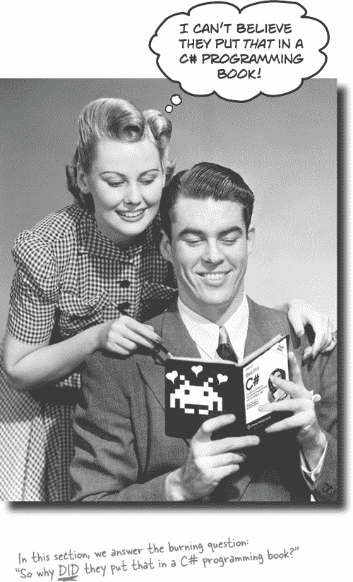

# 第一章：简介：如何使用本书

# 这本书适合谁？

如果你能对所有以下问题回答“是”：

1.  你想学习**C#**（并在学习过程中掌握一些游戏开发和 Unity 的知识）吗？

1.  你喜欢摆弄吗？你是通过实践学习，而不仅仅是阅读学习吗？

1.  你更喜欢**有趣和刺激的对话**，而不是**干燥**、**枯燥**、**学术化的演讲**吗？

这本书适合你。

## 谁应该避免阅读这本书？

如果你对以下任何一个问题回答“是”：

1.  你更对理论感兴趣还是实践？

1.  做项目和编写代码的想法让你感到无聊并有点焦躁吗？

1.  你**害怕尝试不同的东西**吗？你认为像开发这样严肃的主题需要一直很严肃吗？

你可能会考虑先尝试另一本书。

# 我们知道你在想什么。

“这怎么可能是一本严肃的 C#编程书？”

“这些图形是怎么回事？”

“我真的可以*通过这种方式*学习吗？”

# 我们知道你的大脑在想什么。

你的大脑渴望新奇。它总是在搜索、扫描，*等待*一些不寻常的东西。它就是这样建立的，并且帮助你保持生机。

那么你的大脑会怎么处理所有例行、普通、正常的事情？它尽可能地阻止它们干扰大脑的*真正*工作——记录*重要*的事情。它不会费力保存无聊的事情；它们永远无法通过“这显然不重要”的过滤器。

你的大脑如何*知道*什么是重要的？假设你出去远足一天，老虎突然跳到你面前。你的头脑和身体会发生什么？

神经元发射。情绪高涨。*化学物质激增*。

这就是你的大脑如何知道……

**这一定很重要！不要忘记它！**

但想象一下，你在家里，或者在图书馆。这是一个安全、温暖、没有老虎的地方。你正在学习。为考试做准备。或者尝试学习一些你的老板认为会花费一周，最多十天的技术主题。

只有一个问题。你的大脑试图帮你一把。它试图确保这显然不重要的内容不会占用稀缺的资源。这些资源最好用来存储真正重要的东西。比如老虎。比如火灾的危险。比如你绝不应该在 Facebook 页面上发布那些“派对”照片。

而且没有简单的方法告诉你的大脑，“嘿，大脑，非常感谢你，但无论这本书有多无聊，我现在情绪上的震动有多少，我真的*想*让你保留这些内容。”

# 元认知：思考思维

如果你真的想学习，并且希望更快更深入地学习，请注意你的注意力如何分配。思考你的思维方式。学习你的学习方式。

大多数人在成长过程中并没有接受关于元认知或学习理论的课程。我们*期望*学习，但很少*教*我们如何学习。

但我们假设如果你拿着这本书，你真的想学习如何在 C#中构建程序。而且你可能不想花很多时间在上面。如果你想要运用你在这本书中读到的内容，你需要*记住*你读到的内容。而为此，你必须*理解*它。为了从这本书，或*任何*书籍或学习经历中获得最大的收益，要对你的大脑负责。你的大脑对*这*内容的反应。

窍门在于让你的大脑把你正在学习的新材料视为非常重要。对你的健康至关重要。和老虎一样重要。否则，你将面临一个持续战斗的局面，你的大脑会尽其所能防止新内容留下来。

**那么，你究竟如何让大脑把 C#看待得像饥饿的老虎呢？**

有慢慢来的，单调乏味的方式，还有更快、更有效的方式。慢的方式是关于纯粹的重复。你显然知道，即使是最枯燥的话题，只要你不停地把同样的东西敲打到你的大脑里，你也*能*学习和记住。通过足够的重复，你的大脑会说：“这并不*感觉*重要，但他们一遍又一遍地看着同样的东西，所以我想这一定很重要。”

更快的方法是进行***任何增加大脑活动***的活动，特别是不同*类型*的大脑活动。上一页的内容是解决方案的重要组成部分，它们都被证明能帮助你的大脑更好地运作。例如，研究表明，将文字*置于*它们所描述的图片中（而不是放在页面的其他位置，如标题或正文中）会让你的大脑试图理解文字和图片之间的关系，这会导致更多的神经元兴奋。更多的神经元兴奋 = 更多大脑*注意*到这是值得关注的事物，并有可能记录下来。

会话风格有助于人们更多关注，因为人们认为自己在进行对话，因为他们期望跟随并保持他们的一端。令人惊讶的是，你的大脑并不一定*在乎*这个“对话”是你和一本书之间的！另一方面，如果写作风格是正式和枯燥的，你的大脑会感知到与你在一个被动参与者的房间里上课时的感觉是一样的。没必要保持清醒。

但图片和会话风格只是开始。

# 这是我们所做的事情

我们使用了***图片***，因为你的大脑更适合视觉而不是文本。对于你的大脑来说，一张图片确实*价值千言万语*。当文本和图片共同工作时，我们将文本*嵌入*到图片中，因为你的大脑在文本在其所指的事物内部时更有效地工作，而不是在标题或文本中埋藏起来。

我们使用了***冗余性***，以*不同*的方式和不同的媒体类型重复相同的内容，并涉及*多种感官*，以增加内容编码到大脑的多个区域的机会。

我们以***意想不到***的方式使用概念和图片，因为你的大脑更适合新奇感，并且我们使用带有*一些*情感*内容*的图片和想法，因为你的大脑更容易注意到情绪的生物化学。引发你*感受*到某种情感的事物更容易被记住，即使这种感觉只是一点***幽默***、***惊讶***或***兴趣***。

我们采用了个性化的、***对话式的风格***，因为你的大脑在认为你在进行对话而不是 passively listening to a presentation 时更容易集中注意力。即使在*阅读*时，你的大脑也会如此。

我们包含了数十种***活动***，因为你的大脑更容易通过***做***事情而不是*阅读*事情来学习和记忆更多内容。我们制作了难度适中但可行的纸上谜题和编程练习，因为大多数人*更喜欢*这样。

*我们使用了* ***多种学习风格***，因为*你*可能更喜欢逐步的步骤，而其他人则希望先了解整体大局，还有人只是想看一个例子。但不论你的学习偏好如何，*每个人*都会因为以多种方式呈现相同内容而受益。

我们包含了适合***你大脑两侧***的内容，因为你能够激活更多的大脑部位，学习和记忆的可能性更高，也能够保持更长时间的专注。因为经常激活一侧大脑意味着另一侧有机会休息，你在学习中可以更有效率更长时间。

并且我们包含了故事和练习，呈现***多种观点***，因为你的大脑在被迫做出评估和判断时更容易进行深入学习。

我们包括了***挑战***，带有练习题，并提出了***问题***，这些问题并不总是有直接的答案，因为你的大脑被调整为在努力*做某事时*学习和记住。想想看——你不能仅仅通过在健身房看别人来使你的*身体*保持良好状态。但我们尽力确保当你努力工作时，你在做*正确的*事情。确保你不会因为难以理解的例子、难以解析的术语或过于简洁的文本而消耗额外的神经元。

我们使用了***人物***。在故事中、例子中、图片中等，因为，嗯，因为*你是*一个人。你的大脑对*人物*的关注比对*事物*的关注更多。

* *# 这里是你可以做的事情来驯服你的大脑

所以，我们做好了自己的部分。剩下的就看你了。这些技巧是一个起点；倾听你的大脑，找出对你有效和无效的东西。尝试新的事物。

###### 注意

把这个剪下来贴在你的冰箱上。

1.  **放慢速度。你理解得越多，需要记忆的就越少。**

    不要只是*阅读*。停下来思考。当书问你一个问题时，不要直接跳到答案。想象有人真的在*问这个问题。你迫使大脑深入思考的程度越深，学习和记忆的机会就越大。

***做练习题。写下你自己的笔记。***

    我们把它们放进去了，但如果我们替你做了，那就像是让别人帮你做锻炼一样。不要只是*看*练习题。**用铅笔写**。有足够的证据表明，在学习过程中进行体育活动可以增加学习效果。

    **阅读“没有愚蠢问题”的部分。**

    这意味着所有这些。它们不是可选的侧边栏——***它们是核心内容的一部分！***不要跳过它们。

    +   **把这个作为你上床前最后阅读的东西。或者至少是最后的挑战性任务。**

    学习的一部分（特别是长期记忆的转移）发生在你放下书后。你的大脑需要自己的时间进行更多的加工。如果在这段加工时间内添加了新内容，你刚学到的一些东西可能会丢失。

    +   **喝水。大量喝水。**

    你的大脑在液体中的环境中效果最佳。脱水（在你感到口渴之前可能会发生）会降低认知功能。

    +   **大声谈论它。**

    说话会激活大脑的不同部分。如果你试图理解某事，或增加以后记忆的机会，大声说出来。更好的是，试着向别人大声解释。你会更快地学习，并可能会发现你在阅读时未曾意识到的想法。

    +   **倾听你的大脑。**

    注意你的大脑是否开始超负荷。如果发现自己开始浅尝辄止或者忘记刚读的内容，那么是休息时间了。一旦超过某个点，通过试图塞更多内容来学得更快，并可能会损害学习过程。

    +   **感受一下。**

    你的大脑需要知道这*很重要*。参与故事情节。为照片编写你自己的标题。对一句糟糕的笑话嘟囔，*总比一无所获好*。

    ** **多写代码！**

    只有一种方法可以*真正*学会 C#，那就是**大量编写代码**。这正是本书的贯穿始终。编码是一种技能，要想掌握好它，就必须多加练习。每章都有练习题让你解决问题，千万不要只是跳过它们——很多学习过程都发生在解决问题时。如果卡住了，不要害怕**偷看解决方案**！我们每个练习都附上了解答，是有原因的：有时候小问题会让你卡住。但在查看解答之前，请尝试自己解决问题。确保在继续本书的下一部分之前，问题已经解决并且运行正常。

**# 自述

这是一次学习经历，而不是一本参考书。我们有意删除了所有可能妨碍你学习的内容。第一次阅读时，你需要从头开始，因为本书假设你已经看过并学习了某些内容。

**这些活动是** *必不可少* **的。**

这些谜题和活动不是附加内容；它们是本书核心内容的一部分。其中一些是为了帮助记忆，一些是为了理解，还有一些是为了帮助你应用所学的知识。***不要跳过书面问题。*** 游泳谜题是唯一*不必*做的事情，但它们有助于让你的大脑思考复杂的逻辑谜题——而且绝对是加快学习过程的好方法。

**冗余是有意而重要的。**

Head First 系列书籍的一个显著区别在于，我们希望你*真正*理解它。我们希望你完成本书时记住所学的东西。大多数参考书没有保持和回忆作为目标，但本书关注*学习*，因此你会看到一些相同的概念多次出现。

**做所有的练习！**

我们写作本书时做出的一个重要假设是你想学习如何使用 C#进行编程。因此，我们知道你想马上动手，并且直接进入代码。我们通过在每章节中加入练习机会，为你提供了很多锻炼技能的机会。我们标记了一些为“*动手来吧！*”—当你看到这样的标记时，意味着我们将带领你完成解决特定问题的所有步骤。但当你看到带有跑鞋标志的练习时，这意味着我们留下了很大一部分问题让你自己解决，同时我们也提供了我们想到的解决方案。不要害怕查看解决方案——**这不是作弊**！但如果你首先尝试解决问题，你会学到更多。

我们还包括了本书中所有练习解决方案的源代码。你可以在我们的 GitHub 页面找到全部内容：[`github.com/head-first-csharp/fourth-edition`](https://github.com/head-first-csharp/fourth-edition)。

**“脑力挑战”问题没有答案。**

对于其中一些问题，没有正确答案；对于其他问题，你决定你的答案是否正确是学习过程的一部分。在一些“脑力挑战”问题中，你会找到一些提示，指导你朝正确的方向前进。

**我们的目标是 C# 8.0、Visual Studio 2019 和 Visual Studio 2019 for Mac。**

本书旨在帮助你学习 C#。微软的开发和维护 C#语言的团队发布了语言的更新版本。**C# 8.0** 是本书生产期间的当前版本。我们也非常依赖 Visual Studio，微软的集成开发环境（IDE），作为学习、教学和探索 C#的工具。本书中的截图是使用生产时可用的**Visual Studio 2019 及其 Mac 版最新版本**进行的。我们在#开始使用 C#构建项目中提供了安装 Visual Studio 的说明，以及在*Visual Studio for Mac 学习指南*附录中提供了安装 Visual Studio for Mac 的说明。

我们正处于即将发布的 C# 9.0 的前夕。它带来了一些很棒的新功能！本书核心学习的 C#特性将保持不变，因此你可以在未来的 C#版本中使用本书。微软维护 Visual Studio 和 Visual Studio for Mac 的团队定期发布更新，*极少情况下*这些更改会影响本书中的截图。

本书中的 Unity 实验室部分针对**Unity 2020.1**，这是本书生产期间可用的最新版本。我们在第一个 Unity 实验室中提供了安装 Unity 的说明。

# 技术审查团队

丽莎·凯尔纳

林赛·比达

Tatiana Mac

Ashley Godbold

虽然没有图片（但同样了不起的是）来自第三版和第二版的审稿人：Rebeca Dunn-Krahn、Chris Burrows、Johnny Halife 和 David Sterling。

第一版的作者还包括：Jay Hilyard、Daniel Kinnaer、Aayam Singh、Theodore Casser、Andy Parker、Peter Ritchie、Krishna Pala、Bill Meitelski、Wayne Bradney、Dave Murdoch，特别是 Bridgette Julie Landers。

特别感谢我们的优秀读者们——特别是 Alan Ouellette、Jeff Counts、Terry Graham、Sergei Kulagin、Willian Piva 和 Greg Combow——他们在阅读我们的书时发现了问题，并且感谢 Mohawk College 的 Joe Varrasso 教授早早采纳了我们的书作为他的课程教材。

非常感谢大家！！

***“如果我看得更远，那是因为我站在巨人的肩膀上。” – 艾萨克·牛顿***

您正在阅读的这本书几乎没有任何错误，这要归功于我们杰出的技术审稿团队——这些善良的巨人们借给了我们他们的肩膀。对审阅团队：我们对你们所做的工作感激不尽。非常感谢！

**Lindsey Bieda** 是一名居住在宾夕法尼亚州匹兹堡的软件工程师。她拥有的键盘可能比任何人都多。在她不编码时，她喜欢与她的猫 Dash 一起玩耍和喝茶。她的项目和碎碎念可以在 [rarlindseysmash.com](http://rarlindseysmash.com) 找到。

**Tatiana Mac** 是一位独立的美国工程师，直接与组织合作，建立清晰而一致的产品和设计系统。她相信无障碍、性能和包容的三位一体可以在数字和物理社交景观中共同改善。当她关注伦理时，她认为技术人员可以解构排斥性系统，支持面向社区的包容系统。

###### 注意

在这件事上我们完全同意 Tatiana 的观点！

**Ashley Godbold** 是一位程序员、游戏设计师、作家、艺术家、数学家、教师和妈妈。她全职担任大型零售商的软件工程教练，并经营一家小型独立游戏工作室 Mouse Potato Games。她是 Unity 认证讲师，教授计算机科学、数学和游戏开发课程。她著有《掌握 Unity 2D 游戏开发（第二版）》和《掌握 Unity UI 开发》，并创作了名为《Unity 2D 游戏编程》和《入门 Unity 2D 游戏开发》的视频课程。

我们还特别要感谢 **Lisa Kellner** ——这已经是她为我们审阅的第 12 本书了。*非常感谢你！*

我们还要特别感谢**Joe Albahari**和**Jon Skeet**，因为他们在第一版的技术指导和仔细周到的审查方面给予了不可思议的支持，这确实为我们多年来与这本书取得的成功打下了基础。我们从您的建议中受益匪浅——事实上，比当时我们意识到的要多得多。

# 致谢

***我们的编辑:***

首先和最重要的是，我们要感谢我们了不起的编辑**Nicole Taché**，感谢你为这本书所做的一切。你为我们完成这本书出版作出了巨大贡献，并给出了大量宝贵的反馈。非常感谢你！

Nicole Taché

***O’Reilly 团队:***

Katherine Tozer

我们想要感谢 O’Reilly 的许多人，希望我们没有遗漏任何人。首先、最后，也永远如此，我们要感谢**Mary Treseler**，她从最初就与我们一同在 O’Reilly 的旅程中。特别感谢制作编辑**Katherine Tozer**，索引员**Joanne Sprott**，以及**Rachel Head**的锐利校对——他们所有人都帮助我们在创纪录的时间内将这本书从生产到印刷。衷心感谢**Amanda Quinn**，**Olivia MacDonald**和**Melissa Duffield**，因为他们在推动整个项目进展中起到了关键作用。还要向我们在 O’Reilly 的其他朋友大声致敬：**Andy Oram**，**Jeff Bleiel**，**Mike Hendrickson**，当然还有**Tim O’Reilly**。如果你现在正在阅读这本书，那么你可以感谢业内最佳的宣传团队：**Marsee Henon**，**Kathryn Barrett**，以及 Sebastopol 的其他出色人士。

我们还要向一些我们喜爱的 O’Reilly 作者们表示敬意：

+   **Dr. Paris Buttfield-Addison**，**Jon Manning** 和 **Tim Nugent**，他们的书*Unity Game Development Cookbook*简直令人惊叹。我们急切期待来自 Paris 和 Jon 的*Head First Swift*。

+   **Joseph Albahari** 和 **Eric Johannsen**，他们撰写了不可或缺的*C# 8.0 in a Nutshell*。

## 最后...

非常感谢**Cathy Vice**（Indie Gamer Chick 的知名人物），因为她在我们的书中使用了关于癫痫的惊人文章，在癫痫倡导方面做出了很大贡献。同时也要*感谢* **Patricia Aas**，因为她在我们的 Code Kata 附录中使用了她关于学习 C# 作为第二语言的出色视频，并且对如何帮助高级学习者使用这本书给出了宝贵的反馈。

Jon Galloway

谢谢我们的朋友们在微软的帮助***非常大***，在这本书中，你们的支持简直令人惊叹。我们非常感激来自 Visual Studio for Mac 团队的**多米尼克·纳霍斯**（恭喜有宝宝！），**乔丹·马蒂森**，和**约翰·米勒**，以及对于启动我们整个合作关系起到关键作用的**科迪·拜尔**。感谢**大卫·斯特林**对第三版的精彩审阅，以及**伊莫·兰德沃斯**帮助我们确定本版需要覆盖的主题。特别感谢**马兹·托尔格森**，C#语言的项目经理，在过去几年里给予我们的所有精彩指导和建议。你们都太棒了。

我们特别感谢为整本书提供了大量精彩 Blazor 项目代码的**乔恩·加洛维**。乔恩是.NET 社区团队的高级项目经理。他共同撰写了几本关于.NET 的书籍，帮助组织了.NET 社区直播，还共同主持了*Herding Code*播客节目。非常感谢你！

# O’Reilly 在线学习

40 多年来，O’Reilly Media 一直致力于为公司提供技术和商业培训、知识和洞察力，帮助它们取得成功。

我们独特的专家和创新者网络通过书籍、文章和我们的在线学习平台分享他们的知识和专业知识。O’Reilly 的在线学习平台提供即时访问的实时培训课程、深入学习路径、交互式编码环境，以及来自 O’Reilly 和 200 多家其他出版商的大量文本和视频。更多信息，请访问[`oreilly.com`](http://oreilly.com)。
