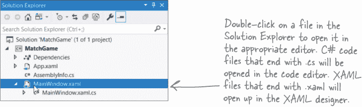
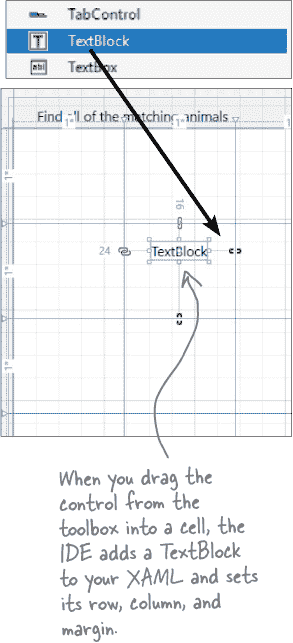
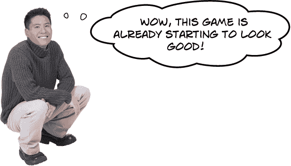
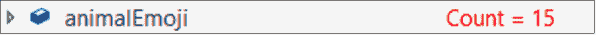
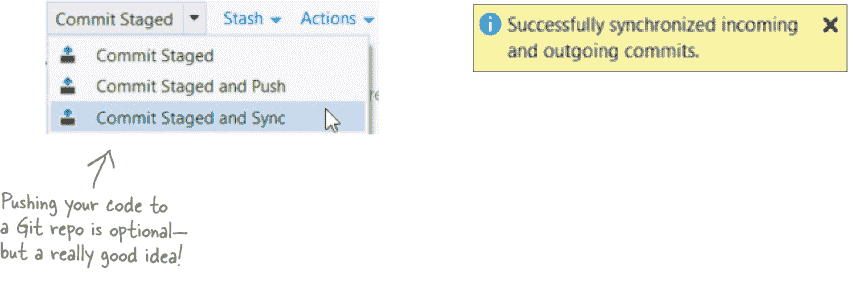

# 第一章。用 C#开始构建：*快速构建一些伟大的东西……*


**想立即构建出色的应用程序吗？**

使用 C#，你拥有一个**现代编程语言**和一个**有价值的工具**在你的指尖。而且有了**Visual Studio**，你拥有一个**令人惊叹的开发环境**，具有高度直观的功能，使编码变得尽可能简单。Visual Studio 不仅是一个编写代码的好工具，它还是一个探索 C#的**非常有价值的学习工具**。听起来吸引人吗？翻页吧，让我们开始编码吧。

# 为什么你应该学习 C#

C#是一种简单、现代的语言，让你可以做很多令人惊讶的事情。当你学习 C#时，你不仅仅是在学习一门语言。C#为你打开了整个.NET 世界，这是一个非常强大的开源平台，可以构建各种应用程序。

## Visual Studio 是你进入 C#的门户

如果你还没有安装 Visual Studio 2019，现在就是时候了。访问[`visualstudio.microsoft.com`](https://visualstudio.microsoft.com/)并**下载 Visual Studio Community 版**。（如果已经安装，请运行 Visual Studio Installer 更新已安装的选项。）

###### 注意

确保你正在安装 Visual Studio，而不是安装 Visual Studio Code。

Visual Studio Code 是一个了不起的开源跨平台代码编辑器，但它没有像 Visual Studio 那样专门针对.NET 开发。这就是为什么我们可以在本书中始终使用 Visual Studio 作为学习和探索的工具。

## 如果你在 Windows 上……

确保选中安装支持.NET Core 跨平台开发和.NET 桌面开发的选项。但不要勾选*使用 Unity 进行游戏开发*选项——稍后在本书中你将会进行 Unity 的 3D 游戏开发，但你需要单独安装 Unity。


## 如果你在 Mac 上……

下载并运行 Visual Studio for Mac 安装程序。确保勾选.NET Core 目标。


###### 注意

你也可以在 Windows 上进行 ASP.NET 项目！只需在安装 Visual Studio 时确保勾选“ASP.NET 和 Web 开发”选项。

**本书中大多数项目都是.NET Core 控制台应用程序，在 Windows 和 Mac 上都可以运行。一些章节有特定项目——比如本章后面的动物匹配游戏——这些是 Windows 桌面项目。对于这些项目，请使用 ASP.NET Core Blazor 项目附录。它提供了一个*完整替代*的#start_building_with_chash_build_somethin，以及其他 WPF 项目的 ASP.NET Core Blazor 版本。**

# Visual Studio 是一个编写代码和探索 C#的工具

你可以使用记事本或其他文本编辑器编写你的 C#代码，但有更好的选择。一个**集成开发环境（IDE）**——简称***集成开发环境***——是一个文本编辑器、视觉设计工具、文件管理器、调试器……它就像是一个多功能工具，可以满足你编写代码的所有需求。

这些只是 Visual Studio 帮助您完成的一些事情：

1.  **快速构建应用程序。** C# 语言灵活且易学，Visual Studio IDE 通过自动完成大量手动工作，使其更容易。以下是 Visual Studio 为您做的一些事情：

    +   管理您所有的项目文件

    +   使得编辑项目代码变得更加容易

    +   管理项目的图形、音频、图标和其他资源

    +   通过逐行调试来帮助你调试代码

        

1.  **设计一个外观出色的用户界面。** Visual Studio IDE 中的可视化设计器是其中一个最易于使用的设计工具。它为您做了很多工作，以至于您会发现为您的程序创建用户界面是开发 C# 应用程序中最令人满意的部分之一。您可以构建完整功能的专业程序，而无需花费数小时调整用户界面（除非您愿意）。

1.  **构建视觉上令人惊叹的程序。** 当您**结合 C# 和 XAML**，用于设计 WPF 桌面应用程序用户界面的视觉标记语言时，您正在使用最有效的工具之一来创建视觉程序…… 您将使用它来构建看起来既好看又能正常运行的软件。

    ###### 注意

    如果您使用的是 Visual Studio for Mac，您将构建相同外观的应用程序，但是不是使用 XAML，而是通过将 C# 与 HTML 结合使用。

    ###### 注意

    Visual Studio 是一个令人惊叹的开发环境，但我们也将把它作为一个学习工具来探索 C#。

    ###### 注意

    **任何 WPF 的用户界面**(或**UI**)都是使用 XAML 构建的（XAML 代表可扩展应用标记语言）。Visual Studio 让使用 XAML 变得非常容易。

1.  **学习和探索 C# 和 .NET。** Visual Studio 是一个世界级的开发工具，但幸运的是，它也是一个很棒的学习工具。***我们将使用 IDE 探索 C#***，这让我们快速掌握重要的编程概念*。

    ###### 注意

    在本书中我们经常将 Visual Studio 简称为“IDE”。

# 在 Visual Studio 中创建您的第一个项目

学习 C# 最好的方法是开始编写代码，所以我们将使用 Visual Studio **创建一个新项目**……并立即开始编写代码！

1.  **创建一个新的控制台应用程序 (.NET Core) 项目。**

    启动 Visual Studio 2019。当它首次启动时，会显示一个“创建新项目”的窗口，其中有几个不同的选项。选择**创建一个新项目**。如果您关闭了该窗口也不必担心——您可以通过选择“文件”>>“新建”>>“项目”来随时再次打开它。

    

    点击**控制台应用程序 (.NET Core)**项目类型，然后点击**下一步**按钮。

    

    将项目命名为**MyFirstConsoleApp**，然后点击**创建**按钮。

    

    ###### 注意

    *如果您使用的是**Visual Studio for Mac**，本项目的代码——以及本书中的所有.NET Core 控制台应用程序项目——都将是相同的，但一些 IDE 功能将会有所不同。请参阅* **Visual Studio for Mac 学习指南** *附录，以获取本章的 Mac 版本。*

1.  **查看您的新应用程序的代码。**

    当 Visual Studio 创建一个新项目时，它会为您提供一个可以构建的起点。一旦完成为应用程序创建新文件，它应该会打开一个名为*Program.cs*的文件，并显示以下代码：

    

1.  **运行你的新应用。**

    Visual Studio 为您创建的应用程序已经准备就绪。在 Visual Studio IDE 的顶部找到带有绿色三角形和您的应用程序名称的按钮，然后单击它：

    

1.  **查看您程序的输出。**

    当您运行程序时，**Microsoft Visual Studio 调试控制台窗口**将弹出并显示程序的输出：

    

学习一门语言的最佳方式是大量编写代码，所以你将在本书中构建许多程序。其中许多将是.NET Core 控制台应用项目，所以让我们仔细看看你刚刚做了什么。

窗口顶部是程序的**输出**：

**Hello World!**

然后有一个换行，接着是一些额外的文字：

```cs
C:\*path-to-your-project-folder*\MyFirstConsoleApp\MyFirstConsoleApp\bin\Debug\
netcoreapp3.1\MyFirstConsoleApp.exe (process *####*) exited with code 0.
To automatically close the console when debugging stops, enable Tools->
Options->Debugging->Automatically close the console when debugging stops.
Press any key to close this window . . .
```

您将在每个调试控制台窗口的底部看到相同的消息。您的程序打印了一行文本（`**Hello World!**`），然后退出。Visual Studio 会保持输出窗口打开，直到您按键关闭它，以便在窗口消失之前查看输出。

按下一个键来关闭窗口。然后再次运行您的程序。这是您在整本书中构建的所有.NET Core 控制台应用程序的运行方式。

# 让我们来构建一个游戏！

您已经构建了您的第一个 C#应用程序，这太棒了！现在您已经做到了，让我们构建一些稍微复杂的东西。我们将构建一个**动物匹配游戏**，玩家将看到一个包含 16 只动物的网格，并需要点击成对的动物使它们消失。


###### 注意

WPF 项目的 Mac 版本使用 ASP.NET Core。您也可以在 Windows 上构建 ASP.NET Core 项目。

## 您的动物匹配游戏是一个 WPF 应用程序。

如果您只需要输入和输出文本，控制台应用非常适合。如果您想要一个显示在窗口中的可视应用程序，则需要使用不同的技术。这就是为什么您的动物匹配游戏将是一个**WPF 应用**。WPF（或 Windows Presentation Foundation）允许您创建可以在任何 Windows 版本上运行的桌面应用程序。本书的大多数章节将包含一个 WPF 应用程序。这个项目的目标是介绍 WPF，并为您提供构建视觉上令人惊叹的桌面应用程序以及控制台应用程序的工具。

> **完成这个项目时，你将更加熟悉在本书中学习和探索 C#所依赖的工具。**

# 这是您将构建游戏的方式

本章的其余部分将引导您逐步构建动物匹配游戏，您将分阶段完成：

1.  首先，您将在 Visual Studio 中创建一个新的桌面应用程序项目。

1.  然后您将使用 XAML 来构建窗口。

1.  你将编写 C# 代码，向窗口添加随机动物表情符号。

1.  游戏需要让用户点击一对表情符号以进行匹配。

1.  最后，通过添加计时器使游戏变得更加刺激。

###### 注意

这个项目可能需要 15 分钟到一小时不等，具体取决于您的输入速度。我们在不感到匆忙的情况下学得更好，所以请给自己充足的时间。


###### 注意

请注意在整本书中散布的“游戏设计……及以上”元素。我们将使用游戏设计原则作为学习和探索重要编程概念和想法的方法，这些概念和想法适用于任何类型的项目，而不仅仅是视频游戏。

# 在 Visual Studio 中创建一个 WPF 项目

继续**启动 Visual Studio 2019 的新实例**并创建一个新项目：

###### 注意

我们已经完成了您在本章开头创建的控制台应用程序项目，因此可以随时关闭该 Visual Studio 实例。


我们将构建我们的游戏作为一个使用 WPF 的桌面应用程序，因此**选择 WPF 应用程序（.NET Core）**并点击“下一步”：


Visual Studio 将要求你配置你的项目。**将项目名称设为 MatchGame**（如果愿意，也可以更改位置以创建项目）：


点击“创建”按钮。Visual Studio 将创建一个名为 MatchGame 的新项目。

## Visual Studio 为您创建了一个项目文件夹，其中包含许多文件

一旦您创建了新项目，Visual Studio 就会添加一个名为 MatchGame 的新文件夹，并填充所有项目所需的文件和文件夹。您将对其中的两个文件 *MainWindow.xaml* 和 *MainWindow.xaml.cs* 进行更改。


**如果您在此项目中遇到任何问题，请访问我们的 GitHub 页面并查找指向视频演示的链接：[`github.com/head-first-csharp/fourth-edition`](https://github.com/head-first-csharp/fourth-edition)。**

调整您的 IDE 以匹配下面的屏幕截图。首先，通过在“解决方案资源管理器”窗口中双击打开 *MainWindow.xaml*，然后从“视图”菜单中选择 *工具箱* 和 *错误列表* 窗口。您实际上可以根据它们的名称和常识来了解许多这些窗口和文件的用途！花点时间并**填写每个空白处**——试着填写有关 Visual Studio IDE 的每个部分的说明。我们已经开始了一个示例来帮助您入手。看看您是否能对其他部分进行合理猜测。


 **磨尖你的铅笔解决方案**

我们已经填写了关于 Visual Studio C# IDE 不同部分的注解。你可能写下了一些不同的东西，但希望你能够理解每个窗口和 IDE 部分的基本用途。如果你的答案与我们略有不同，不要担心！你将有很多机会练习使用 IDE。

*还有一个快速提醒：我们将在本书中——包括本页——**交替使用**“Visual Studio”和“IDE”这两个术语。*


# 使用 XAML 设计你的窗口

现在 Visual Studio 已经为你创建了一个 WPF 项目，是时候开始使用**XAML**了。

XAML 代表**可扩展应用程序标记语言**，这是一种非常灵活的标记语言，C#开发人员用来设计用户界面。你将使用两种不同类型的代码构建应用程序。首先，你将使用 XAML 设计用户界面（UI）。然后，你将添加 C#代码来使游戏运行。

如果你曾经使用 HTML 设计网页，那么你会发现 XAML 有很多相似之处。这里是一个在 XAML 中布局小窗口的快速示例：


当 WPF **渲染**（或在屏幕上绘制）这个窗口时，它看起来像这样。它绘制了一个窗口，有两个可见的**控件**，一个显示文本的 TextBlock 控件和一个用户可以点击的 Button 控件。它们使用不可见的 StackPanel 控件布局，导致它们在彼此之上渲染。看一下窗口截图中的控件，然后回到 XAML，找到`TextBlock`和`Button`标签。


# 设计你的游戏窗口

你需要一个具有图形用户界面的应用程序，用来使游戏运行，还需要一个可执行文件来运行。听起来工作量很大，但是在本章的其余部分，你将完成所有这些，并且最终，你将能够熟练使用 Visual Studio 设计出漂亮的 WPF 应用程序。

这是我们将要创建的应用程序窗口的布局：


# 使用 XAML 属性设置窗口大小和标题

让我们开始为你的动物配对游戏构建用户界面。你要做的第一件事是让窗口变窄并更改其标题。你还将熟悉 Visual Studio 的 XAML 设计器，这是一个用于为应用程序设计出漂亮用户界面的强大工具。

1.  **选择主窗口。**

    双击解决方案资源管理器中的*MainWindow.xaml*。

    

    一旦这样做，Visual Studio 将在 XAML 设计器中打开它。

    

1.  **改变窗口的大小。**

    将鼠标移到 XAML 编辑器，并点击 XAML 代码的前八行中的任意位置。一旦你这样做，你应该看到窗口的属性显示在属性窗口中。

    展开布局部分，**将宽度更改为 400**。设计窗格中的窗口会立即变窄。仔细看 XAML 代码 —— 现在宽度属性是 400。

    

1.  **更改窗口标题。**

    在 `Window` 标签的末尾找到这行 XAML 代码：

    ```cs
    Title="MainWindow" Height="450" Width="400">
    ```

    并将标题更改为 **查找所有匹配的动物**，使其看起来像这样：

    ```cs
    Title="Find all of the matching animals" Height="450" Width="400">
    ```

    您将在属性窗口的常见部分看到更改 —— 更重要的是，窗口的标题栏现在显示新文本。

> **当您修改 XAML 标记中的属性时，更改会立即显示在属性窗口中。当您使用属性窗口修改 UI 时，IDE 会更新 XAML。**


# 向 XAML 网格添加行和列

或许看起来你的主窗口是空的，但是仔细看看 XAML 底部。注意到有一个带有 `<`**Grid**`>` 的行，后面是一个带有 `</`**Grid**`>` 的行？你的窗口实际上有一个 **grid** —— 只是因为它没有任何行或列而看不见。让我们继续添加一行。

将鼠标移动到设计器窗口的左侧。当光标上出现加号时，点击鼠标以添加一行。

###### 注意

**你的 WPF 应用程序的 UI 是由按钮、标签和复选框等控件构建的。网格是一种特殊的控件 —— 被称为容器 —— 它可以包含其他控件。它使用行和列来定义布局。**


您将看到一个数字后跟一个星号，并且窗口上出现了一条水平线。您刚刚在网格中添加了一行！现在添加行和列：

+   重复四次以添加总共五行。

+   将鼠标悬停在窗口顶部并点击以添加四列。您的窗口应该看起来像下面的屏幕截图（但您的数字可能不同 —— 没关系）。


###### 注意

这些“**注意事项**”元素提醒您关于重要但通常令人困惑的事项，可能会使您出错或减慢速度。

# 使行和列大小相等

当我们的游戏显示玩家要匹配的动物时，我们希望它们均匀间隔。每个动物都将包含在网格中的单元格中，而网格将根据窗口的大小自动调整大小，因此我们需要所有行和列的大小相同。幸运的是，XAML 让我们非常容易调整行和列的大小。**单击 XAML 编辑器中的第一个 `RowDefinition` 标签**，以在属性窗口中显示其属性：


转到属性窗口，并**点击右侧的方形**到 Height 属性，然后从弹出菜单中选择**重置**。等等，等一下！当您这样做时，设计师中的行消失了。好吧，实际上，它并没有完全消失——它只是变得非常窄。继续**为所有行重置 Height 属性**。然后**为所有列重置 Width 属性**。您的网格现在应该有四个大小相等的列和五个大小相等的行。


# 将一个 TextBlock 控件添加到您的网格中

WPF 应用程序使用**TextBlock 控件**来显示文本，我们将使用它们来显示要查找和匹配的动物。让我们在窗口中添加一个。

在工具箱中展开 Common WPF Controls 部分，**将一个 TextBlock 拖放到第二列第二行的单元格中**。IDE 将在`Grid`开始和结束标签之间添加一个`TextBlock`标记：

```cs
<TextBlock Text="*TextBlock*"
   HorizontalAlignment="*Left*" VerticalAlignment="*Center*"
   Margin="*560,0,0,0*" TextWrapping="*Wrap*" />
```

这个 TextBlock 的 XAML 具有五个属性：

+   `Text` 告诉 TextBlock 在窗口中显示什么文本。

+   `HorizontalAlignment` 将文本左对齐、右对齐或居中。

+   `VerticalAlignment` 将其对齐到其框的顶部、中部或底部。

+   `Margin` 设置其与其容器顶部、侧面或底部的偏移量。

+   `TextWrapping` 告诉它是否添加换行符以包装文本。



***你的属性可能以不同的顺序***排列，并且 Margin 属性将具有不同的数字，因为它们取决于您在单元格中拖动的位置。所有这些属性都可以使用 IDE 的属性窗口进行修改或重置。

我们希望每个动物都居中。**单击设计师中的标签**，然后转到属性窗口并单击来展开**布局部分**。点击水平和垂直对齐属性的**中心**，然后使用窗口右侧的方形**重置 Margin 属性**。


我们还希望动物更大，因此在属性窗口中**展开 Text 部分**并将字体大小更改为**36 px**。然后转到 Common 部分，并将 Text 属性更改为`?`以显示问号。


**点击属性窗口顶部的搜索框**，然后键入单词`wrap`以查找匹配的属性。使用窗口右侧的方形来重置 TextWrapping 属性。


###### 注意

您将在整本书中看到许多这样的练习。它们为您提供了锻炼编码技能的机会。并且查看解决方案总是可以的！


# 现在，您可以开始为您的游戏编写代码了。

您已经完成了设计主窗口的工作——至少足够使您的游戏的下一部分开始运行。现在是时候添加 C#代码使您的游戏运行了。


# 生成一个方法来设置游戏

现在用户界面已经设置好了，是时候开始为游戏编写代码了。您将通过**生成一个方法**（就像您之前看到的 Main 方法一样），然后向其中添加代码。

1.  **在编辑器中打开 MainWindow.xaml.cs。**

    在解决方案资源管理器中单击 *MainWindow.xaml* 旁边的三角形  ，然后双击 *MainWindow.xaml.cs* 以在 IDE 的代码编辑器中打开它。您会注意到该文件中已经有了一些代码。Visual Studio 将帮助您向其中添加一个方法。

    

1.  **生成一个名为 SetUpGame 的方法。**

    找到您打开的代码的这一部分：

    ###### 注意

    如果您还不完全明白方法是什么，没关系。

    ###### 注意

    

    每当您看到灯泡图标时，它都在告诉您选择的代码有一个快速操作可用，这意味着 Visual Studio 可以为您自动化任务。您可以单击灯泡图标，或按 Alt+Enter 或 Ctrl+.（句号）来查看可用的快速操作。

1.  **尝试运行您的代码。**

    点击 IDE 顶部的按钮启动程序，就像您之前在控制台应用程序中做的那样。

    

    哎呀，出了些问题。它没有显示窗口，而是**抛出了一个异常**：

    

    看起来似乎有些东西出了问题，但这实际上正是我们预期会发生的！IDE 暂停了您的程序，并突出显示了最近运行的代码行。仔细看看它：

    ```cs
    throw new NotImplementedException();
    ```

    IDE 生成的方法确实告诉 C#抛出了一个异常。仔细看看异常消息：

    ```cs
    System.NotImplementedException: 'The method or operation is not implemented.'
    ```

    实际上这是有道理的，因为**你需要实现这个方法**，这是 IDE 生成的。如果你忘记实现它，异常会提醒你还有工作要做。如果你生成了很多方法，这种提醒就非常有用！

    在工具栏中点击方形的停止调试按钮  （或者从调试菜单中选择停止调试（F5））以停止程序，这样您就可以完成实现 SetUpGame 方法的工作。

###### 注意

当您使用 IDE 运行应用程序时，停止调试按钮会立即退出它。

# 完成您的 SetUpGame 方法

您将 SetUpGame 方法放在 `public MainWindow()` 方法中，因为该方法中的所有内容将在应用程序启动时立即调用。

###### 注意

这是一个特殊的方法，称为构造函数，您将在 #encapsulation_keep_your_privateshellippr 中学习更多关于它的工作原理。

1.  **开始向 SetUpGame 方法添加代码。**

    您的 SetUpGame 方法将获取八对动物表情字符，并将它们随机分配给 TextBlock 控件，以便玩家进行匹配。因此，您的方法首先需要这些表情符号的列表，IDE 将帮助您编写相关代码。选择 IDE 添加的 `throw` 语句，并将其删除。然后将光标放在该语句的位置，输入 `List`。IDE 将弹出一个以`List`开头的一堆关键字的 IntelliSense 窗口：

    

    从 IntelliSense 弹出窗口中选择 `List`。然后输入 `<str` —— 将会弹出另一个匹配关键字的 IntelliSense 窗口：

    

    选择 `string`。完成代码行的输入，但**暂时不要按 Enter 键**：

    

1.  **向您的列表添加值。**

    您的 C# 语句还没有完成。确保光标放在行末的 `)` 后面，然后键入开括号 `{` —— IDE 将为您添加闭括号，并将光标放在两个括号之间。**按 Enter 键** —— IDE 将自动为您添加换行：

    

1.  **完成您的方法。**

    现在**添加方法的其余部分** —— 要*小心*处理句点、括号和大括号：

    

    红色波浪线下的 `mainGrid` 表示 IDE 指出存在错误：因为在代码中找不到这个名称的任何东西，您的程序将无法构建。**返回 XAML 编辑器**，点击 `<Grid>` 标签，然后转到属性窗口，在名称框中输入 `mainGrid`。

    检查 XAML —— 您将在网格顶部看到 `<Grid x:Name="mainGrid">`。现在您的代码中不应该有任何错误。如果有错误，***请仔细检查每一行*** —— 很容易漏掉一些细节。

    ###### 注意

    如果在运行游戏时出现异常，请确保 animalEmoji 列表中确实有 8 对表情符号，并且在您的 XAML 中有 16 个 `<TextBlock ... />` 标签。

# 运行您的程序

点击 IDE 工具栏中的  按钮以启动程序。一个窗口将弹出，显示您的八对动物在随机位置上的状态：


当您的程序正在运行时，IDE 进入调试模式：开始按钮被灰色的“继续”按钮取代，工具栏中出现**调试控制** ，其中包括暂停、停止和重新启动程序的按钮。

通过点击窗口右上角的 `X` 按钮或调试控件中的方形停止按钮来停止程序运行。多次运行程序 —— 动物将每次都被重新排列。



###### 注意

**您已为下一步骤做好了准备。**

当你构建一个新的游戏时，你不仅仅是在写代码。你也在运行一个项目。一个非常有效的运行项目的方式是逐步构建它，沿途检查确保事情朝着正确的方向发展。这样你就有很多机会改变方向。

###### 注意

这里有另一个纸笔练习。做完它们绝对是值得的，因为它们会帮助你更快地掌握重要的 C# 概念。


###### 注意

**提高你的代码理解能力将使你成为一名更好的开发者。**

纸笔练习是**不可选的**。它们让你的大脑以不同的方式吸收信息。但它们做的更重要的事情是给了你***犯错误的机会***。犯错误是学习的一部分，我们都犯了很多错误（甚至你可能在这本书中找到一两个错别字！）。没有人一开始就写出完美的代码——真正优秀的程序员总是假设他们今天写的代码明天可能需要改变。事实上，在本书的后面你会学到关于*重构*的内容，即在编写代码之后改进它的编程技术。

###### 注意

我们将添加类似这样的项目总结，快速概述你迄今为止见过的许多想法和工具。

# 将你的新项目添加到源代码控制

在这本书中，你将会构建很多不同的项目。如果有一种简单的方式来备份它们并在任何地方访问它们，那将会多么棒！如果你犯了一个错误——如果你能够轻松地回滚到代码的早期版本，那不是非常方便吗？那么，你真是幸运！这正是 **源代码控制** 所做的事情：它为你提供了一种简单的方式来备份你所有的代码，并跟踪你所做的每一个更改。Visual Studio 让你可以轻松地将你的项目添加到源代码控制中。

**Git** 是一种流行的版本控制系统，Visual Studio 将会把你的源代码发布到任何一个 Git **仓库**（或 **repo**）。我们认为 **GitHub** 是使用最简单的 Git 提供商之一。你需要一个 GitHub 账号来向其推送代码，所以如果你还没有账号，请立即访问 [`github.com`](https://github.com) 创建一个。

在 IDE 底部的状态栏中找到 **添加到源代码控制**：


点击它——Visual Studio 将提示你将代码添加到 Git 中：


**点击 Git。** Visual Studio 可能会提示你输入你的姓名和电子邮件地址。然后它应该在状态栏中显示如下内容：


现在你的代码已经在源代码控制下。现在将鼠标悬停在  上：


IDE 告诉你有两个 **提交** —— 或者说是你的代码的保存版本 —— 没有被推送到电脑外的位置。

当你将项目添加到源代码控制时，IDE 会在与 Solution Explorer 相同的面板中打开 **Team Explorer 窗口**。（如果看不到，请从“视图”菜单中选择。）Team Explorer 帮助你管理源代码控制。你将使用它来发布你的项目到 **远程存储库**。

当你有本地更改时，你将使用 Team Explorer 将它们推送到远程存储库。为此，请在 Team Explorer 窗口中点击 **发布到 GitHub** 按钮。


###### 注意

**Git 是一个开源的版本控制系统。像 GitHub 这样的多个第三方服务提供了 Git 服务（例如为代码提供存储空间和访问权限）。你可以访问 [`git-scm.com`](https://git-scm.com) 了解更多关于 Git 的信息。**


###### 注意

**前往** [`github.com/head-first-csharp/fourth-edition`](https://github.com/head-first-csharp/fourth-edition) **查看和下载本项目以及本书中所有其他项目的完整代码。**


# 下一个构建游戏的步骤是处理鼠标点击

现在游戏显示了供玩家点击的动物，我们需要添加使游戏运行的代码。玩家将按对点击动物。玩家首先点击的动物消失。如果玩家点击的第二个动物与第一个匹配，则第二个动物也消失。如果不匹配，则第一个动物重新出现。我们将通过添加一个 **事件处理程序** 来实现所有这些功能，这只是当应用程序中发生某些操作（如鼠标点击、双击、窗口调整大小等）时调用的方法的名称。


# 使你的 TextBlocks 响应鼠标点击

你的 SetUpGame 方法会更改 TextBlocks 以显示动物表情符号，这样你就看到了你的代码如何修改应用程序中的控件。现在你需要编写反向操作的代码，即你的控件需要调用你的代码，而 IDE 可以帮助你。

返回到 XAML 编辑器窗口，**点击第一个** `**TextBlock**` **标签** —— 这将导致 IDE 在设计器中选择它，以便你可以编辑其属性。然后转到属性窗口并点击事件处理程序按钮 ()。**事件处理程序** 是当应用程序发生特定事件时调用的方法。这些事件包括按键、拖放、窗口调整大小，当然还有鼠标移动和点击。滚动属性窗口并查看 TextBlock 可为其添加事件处理程序的不同事件名称。**在名为 MouseDown 的事件右侧的框内双击。**


IDE 在 MouseDown 框中填写了一个方法名 TextBlock_MouseDown，并且 TextBlock 的 XAML 现在有了 MouseDown 属性：

```cs
<TextBlock Text="?" FontSize="36" HorizontalAlignment="Center" 
      VerticalAlignment="Center" MouseDown="TextBlock_MouseDown"/>
```

你可能没有注意到，因为 IDE 还向代码后台添加了一个新方法——即与 XAML 代码结合的代码——并立即切换到 C# 编辑器显示它。你可以通过在 XAML 编辑器中右键点击 TextBlock_MouseDown 并选择“查看代码”来随时跳转回去。这是它添加的方法：


每当玩家点击 TextBlock 时，应用程序将自动调用 TextBlock_MouseDown 方法。现在我们只需要为其添加代码。然后我们需要连接所有其他 TextBlock，以便它们也调用它。

###### 注意

**事件处理程序是应用程序响应鼠标点击、键盘按键或窗口调整等事件时调用的方法。**

# 添加 TextBlock_MouseDown 代码

现在你已经阅读了 TextBlock_MouseDown 的代码，是时候将其添加到你的程序中了。接下来要做的是：

1.  在 IDE 为你添加的 TextBlock_MouseDown 方法的第一行之前，添加前两行代码，分别是 `lastTextBlockClicked` 和 `findingMatch`，确保将它们放在 SetUpGame 结束的右花括号和 IDE 刚刚添加的新代码之间。

1.  **填写** TextBlock_MouseDown 的代码。在等号（=）和双等号（==）之间要特别小心——这是你将在下一章中学到的一个重要区别。

在 IDE 中看起来是这样的：


# 让其余的 TextBlock 调用同一个 MouseDown 事件处理程序

目前只有第一个 TextBlock 的 MouseDown 事件与事件处理程序关联。让我们也将其他 15 个 TextBlock 与它关联起来。你*可以*通过在设计器中选择每个文本块并在 MouseDown 旁边输入 TextBlock_MouseDown 来完成。我们已经知道这只是向 XAML 代码添加一个属性，所以让我们采取一种捷径。

1.  **选择 XAML 编辑器中的最后 15 个 TextBlock。**

    转到 XAML 编辑器，在第二个 `TextBlock` 标签的左侧点击，然后向下拖动到 TextBlocks 的末尾，位于闭合 `</``**Grid**``>` 标签的上方。现在应该已选择了最后 15 个 TextBlock（但不包括第一个）。

1.  **使用快速替换添加 MouseDown 事件处理程序。**

    从编辑菜单选择“**查找和替换 >> 快速替换**”。搜索 `/>` 并替换为 `MouseDown="``*TextBlock_MouseDown*``"/>`——确保在 `MouseDown` 前有一个空格，并且搜索范围是 *选择*，这样只会向选定的 TextBlock 添加属性。

    

1.  **对所有选定的 15 个 TextBlock 运行替换。**

    点击“**全部替换**”按钮（）以向 TextBlocks 添加 MouseDown 属性——它应告诉你已替换了 15 处。仔细检查 XAML 代码，确保它们每个都有一个与第一个 TextBlock 中完全匹配的 MouseDown 属性。

    确保方法在 C# 编辑器中现在显示 **16 个引用**（选择“从构建菜单中构建解决方案”以更新它）。如果看到 17 个引用，则意外地将事件处理程序附加到了 Grid 上。绝对不要这样做——如果这样做，当您单击动物时会出现异常。

运行您的程序。现在，您可以点击动物对使它们消失。您点击的第一个动物将消失。如果您点击其匹配项，该项也将消失。如果点击一个不匹配的动物，则第一个动物将再次出现。当所有动物都消失时，请重新启动或关闭程序。

###### 注意

当您看到脑力元素时，请花一分钟真正思考它所问的问题。


# 通过添加一个计时器来完成游戏

如果玩家可以尝试打败他们的最佳时间，我们的动物匹配游戏将更加令人兴奋。我们将添加一个 **计时器**，它通过反复调用方法在固定时间间隔后“tick”。


> 
> 
> **计时器“tick”每次间隔调用方法。您将使用一个计时器，该计时器在玩家开始游戏时开始，并在匹配到最后一个动物时结束。**

# 向您的游戏代码中添加一个计时器

1.  在 *MainWindow.xaml.cs* 文件的顶部附近找到 `namespace` 关键字，并在其下直接添加以下代码行：`using System.Windows.Threading;`

    ```cs
     namespace MatchGame
     {
        using System.Windows.Threading;
    ```

    ###### 注意

    **添加这个！**

1.  找到 `*public partial class MainWindow*` 并在左花括号 `**{**` 后立即添加以下代码：

    ```cs
    public partial class MainWindow : Window
    {
        DispatcherTimer timer = new DispatcherTimer();
        int tenthsOfSecondsElapsed;
        int matchesFound;
    ```

    ###### 注意

    您将添加这三行代码来创建一个新的计时器，并添加两个字段来跟踪经过的时间和玩家找到的匹配数。

1.  我们需要告诉我们的计时器多频繁“tick”，以及调用什么方法。在调用 SetUpGame 方法的行的开头点击，将编辑器的光标移动到那里。按 Enter 键，然后在下面屏幕截图中以 `**timer.**` 开头的两行代码：

    

1.  按 Tab 键。IDE 将完成代码行并添加 Timer_Tick 方法：

    

1.  Timer_Tick 方法将更新一个跨越整个网格底部行的 TextBlock。以下是设置方法：

    +   将一个 **TextBlock** 拖放到左下方的正方形中。

    +   使用 Properties 窗口顶部的 **Name box** 为其命名为 `**timeTextBlock.**`

    +   重设其 **margins**，将其 **居中** 在单元格中，并将 **FontSize** 属性设置为 36px，**Text** 属性设置为“已经过时间”（就像您对其他控件所做的一样）。

    +   找到 **ColumnSpan** 属性并将其设置为 4。

    +   添加名为 TimeTextBlock_MouseDown 的 **MouseDown 事件处理程序**。

        

    下面是 XAML 的外观，请仔细比较它与 IDE 中的代码：

    ```cs
    <TextBlock x:Name="*timeTextBlock* "Text="*Elapsed time*" FontSize="*36*"
        HorizontalAlignment="*Center*" VerticalAlignment="*Center*"
        Grid.Row="*4*" Grid.ColumnSpan="*4*" MouseDown="*TimeTextBlock_MouseDown*"/>
    ```

1.  当你添加了 `MouseDown` 事件处理程序时，Visual Studio 在代码后台创建了一个名为 `TimeTextBlock_MouseDown` 的方法，就像其他的 `TextBlock` 一样。将以下代码添加到其中：

    ```cs
    private void TimeTextBlock_MouseDown(object sender, MouseButtonEventArgs e)
    {
        if (matchesFound == 8)
        {
            SetUpGame();
        }
    }
    ```

    ###### 注意

    如果已经找到了所有 8 对匹配项，这将重置游戏（否则不执行任何操作，因为游戏仍在运行）。

1.  现在你已经拥有完成 `Timer_Tick` 方法所需的一切内容，该方法会更新新的 `TextBlock`，显示经过的时间，并在玩家找到所有匹配项后停止计时器：

    ```cs
    private void Timer_Tick(object sender, EventArgs e)
    {
        tenthsOfSecondsElapsed++;
        timeTextBlock.Text = (tenthsOfSecondsElapsed / 10F).ToString("0.0s");
        if (matchesFound == 8)
        {
            timer.Stop();
            timeTextBlock.Text = timeTextBlock.Text + " - Play again?";
        }
    }
    ```

    ***但这里有些不对劲。*** 运行你的代码……哎呀！你得到了一个**异常**。

    我们即将修复这个问题，但首先要仔细查看 IDE 中的错误消息和突出显示的行。

    ***你能猜到是什么导致了这个错误吗？***


# 使用调试器来解决异常。

你可能之前听过“bug”这个词。你可能曾经在过去对你的朋友说过这样的话：“那个游戏真的很有 bug，有很多故障。”每个 bug 都有一个解释——你程序中的每件事都有原因——但并不是每个 bug 都容易追踪。

***理解 bug 是修复 bug 的第一步。*** 幸运的是，Visual Studio 调试器是一个很好的工具。（这就是为什么它被称为调试器：它是帮助你摆脱 bug 的工具！）

1.  **重新启动你的游戏几次。**

    首先要注意的是，你的程序总是抛出相同类型和相同消息的异常：

    

    如果将异常窗口移开，你会发现它总是停在同一行上：

    

    这个异常是**可复现的**：你可以可靠地使程序抛出完全相同的异常，并且你已经非常清楚问题所在。

1.  **在抛出异常的那一行添加断点。**

    再次运行你的程序，使其在异常处中断。在停止它之前，从调试菜单中选择**切换断点（F9）**。一旦你这样做，该行将被标记为红色，并且左边的边距旁边将出现一个红点。现在**再次停止你的应用程序** —— 突出显示和点仍将存在：

    

    ***你刚刚在该行上设置了断点。*** 现在每次执行该行代码时，你的程序都会中断。现在试一下。再次运行你的应用程序。程序将在该行处中断，但这次*不会抛出异常*。按继续。它再次在该行上中断。再次按继续。它又中断了。继续进行，直到看到异常。现在停止你的应用程序。

1.  **收集证据，以便找出问题的原因。**

    当你运行应用程序时，是否在 Locals 窗口中注意到任何有趣的内容？重新启动它，并且非常注意 `animalEmoji` 变量。第一次应用程序中断时，你应该在 Locals 窗口中看到这个：

    

    按下继续。看起来计数从 16 减少到 15：

    

    应用程序将随机从`animalEmoji`列表中添加表情符号到 TextBlocks 中，然后从列表中移除它们，因此其计数每次应减少 1。一切顺利，直到`animalEmoji`列表为空（所以 Count 为 0），然后你会收到异常。所以这是一个证据！另一个证据是这发生在`**foreach 循环**`中。最后一个证据是***这一切都是在我们向窗口添加一个新的 TextBlock 之后开始的***。

    **是时候戴上你的福尔摩斯帽子了。你能找出是什么导致了异常吗？**

1.  **找出实际导致错误的原因。**

    你的程序崩溃的原因是它试图从`animalEmoji`列表中获取下一个表情符号，但列表为空，这导致它抛出 ArgumentOutOfRange 异常。是什么导致它耗尽了要添加的表情符号？

    在你最近做出最新更改之前，你的程序运行正常。然后你添加了一个 TextBlock…然后它停止工作了。就在遍历所有 TextBlock 的循环中。一个线索…非常非常有趣。

    

    因此，当你运行你的应用程序时，***对于窗口中的每个 TextBlock，它都会在这一行中断***。所以在前 16 个 TextBlock 中，一切都很顺利，因为集合中有足够的表情符号：

    

    但现在窗口底部有一个新的 TextBlock，它第 17 次崩溃了——由于`**animalEmoji**`集合中只有 16 个表情符号，现在它是空的：

    

    所以在你做出更改之前，你有 16 个 TextBlock 和一个包含 16 个表情符号的列表，所以刚好有足够的表情符号添加到每个 TextBlock 中。现在你有 17 个 TextBlock，但仍然只有 16 个表情符号，所以你的程序耗尽了要添加的表情符号…然后它抛出异常。

1.  **修复这个 bug。**

    由于异常是因为在遍历 TextBlocks 的循环中我们正在耗尽 emoji，我们可以通过跳过我们刚刚添加的 TextBlock 来修复它。我们可以通过检查 TextBlock 的名称来做到这一点，并跳过显示时间的那个。再次切换以移除断点，或者从调试菜单中选择**删除所有断点（Ctrl+Shift+F9）**。

    

# 添加剩余的代码并完成游戏

你还需要做一件事。你的 TimeTextBlock_MouseDown 方法检查 matchesFound 字段，但这个字段从未在任何地方设置过。因此，在 foreach 循环的右大括号后立即在 SetUpGame 方法中添加这三行代码：

```cs
             animalEmoji.RemoveAt(index);
          }
       }
       timer.Start();
       tenthsOfSecondsElapsed = 0;
       matchesFound = 0;
   }
```

###### 注意

在 SetUpGame 方法的最后添加这三行代码，以启动计时器并重置字段。

然后在 TextBlock_MouseDown 的 if/else 的中间块中添加这个语句：

```cs
else if (textBlock.Text == lastTextBlockClicked.Text)
{
    matchesFound++;
    textBlock.Visibility = Visibility.Hidden;
    findingMatch = false;
}
```

###### 注意

添加这行代码，每当玩家成功找到一对匹配项时，将 matchesFound 增加一。

现在你的游戏有一个计时器，当玩家完成匹配动物时停止计时，游戏结束时可以点击它再玩一次。***你已经在 C#中构建了你的第一个游戏。恭喜！***


###### 注意

**去** [`github.com/head-first-csharp/fourth-edition`](https://github.com/head-first-csharp/fourth-edition) **查看和下载本项目及本书中所有其他项目的完整代码。**

# 在源代码控制中更新你的代码

现在你的游戏已经启动运行，现在是把你的更改推送到 Git 的绝佳时机，而 Visual Studio 使这一切变得非常简单。你只需要*暂存*你的提交，输入提交消息，然后同步到远程仓库。


1.  从提交下拉菜单中选择 **提交已暂存项并同步**（就在提交消息框的下面）。同步可能需要几秒钟时间，然后你会在 Team Explorer 窗口看到成功消息。

    


**每当你有一个大项目时，将其分解成更小的部分总是一个好主意。**

你可以培养的最有用的编程技能之一是能够看待一个庞大而困难的问题，并将其分解为更小、更容易的问题。

在一个大项目开始时很容易感到不知所措，并想：“哇，这个项目真的好大啊！”但如果你能找到一个小片段可以开始工作，那么你就能够着手了。一旦完成了这个片段，你可以继续下一个小片段，然后是另一个，再然后是另一个。随着你构建每个片段，你会在项目进展中学到更多。

# 更好的条件语句……

你的游戏非常不错！但每个游戏——事实上，几乎每个程序——都可以改进。这里有一些我们认为可以使游戏变得更好的想法：

+   添加不同种类的动物，这样每次显示的都不一样。

+   记录玩家的最佳时间，以便他们可以尝试超越它。

+   让计时器倒计时而不是计时上升，这样玩家就有限定的时间。

###### 注意

我们是认真的——花几分钟时间去做这件事。退后一步，思考一下你刚刚完成的项目，这是将学到的经验教训牢固地印在你的大脑中的好方法。

###### 注意

只是一个快速提醒：在本书中，我们会经常将 Visual Studio 称为“IDE”。


