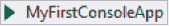
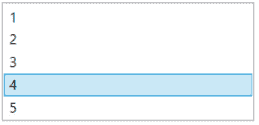
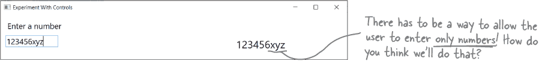
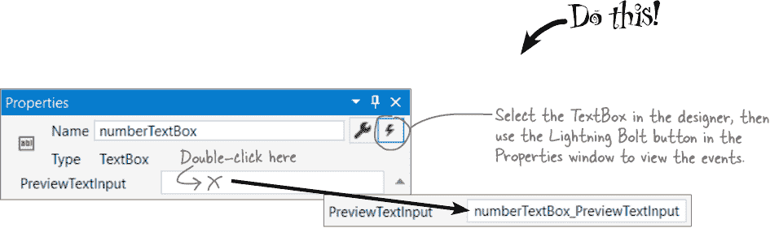

# Chapter 2\. 深入 C#：*语句、类和代码*


**你不只是一个 IDE 用户。你是一个**开发者**。**

使用 IDE 可以完成大量工作，但它的能力有限。Visual Studio 是有史以来最先进的软件开发工具之一，但**强大的集成开发环境**仅仅是一个开始。现在是时候**深入研究 C# 代码**了：它的结构是怎样的，它如何工作，以及如何掌控它……因为你可以让你的应用程序做任何事情，没有限制。

（顺便说一句，无论你喜欢哪种键盘，你都可以成为**真正的开发者**。唯一需要做的就是**编写代码**！）

# 让我们仔细查看控制台应用程序的文件。

在上一章中，你创建了一个名为 MyFirstConsoleApp 的新 .NET Core 控制台应用程序项目。这样做时，Visual Studio 创建了两个文件夹和三个文件。


让我们仔细看看它创建的 Program.cs 文件。在 Visual Studio 中打开它：


+   文件顶部是一个 `**using 指令**`。在所有的 C# 代码文件中，你都会看到类似这样的 `using` 行。

+   在 `using` 指令之后就是 `namespace` **关键字**。你的代码位于 MyFirstConsoleApp 命名空间中。紧接着是一个左花括号 `**{**`，文件的末尾是右花括号 `**}**`。在这些花括号之间的所有内容都属于这个命名空间。

+   在命名空间内部是一个**类**。你的程序有一个名为 Program 的类。在类声明之后是一个左花括号，与文件倒数第二行的右花括号成对出现。

+   在你的类内部是一个名为 Main 的**方法**——同样是一对括号及其内容。

+   你的方法只有一个**语句**：`Console.WriteLine("Hello World!");`

## 一个语句执行一个单一动作。

每个方法都由像你的 Console.WriteLine 语句那样的**语句**组成。当程序调用一个方法时，它会依次执行每个语句，直到语句用完或者遇到一个 `**return**` 语句时结束，程序的执行会恢复到最初调用该方法的语句之后。

# 两个类可以在同一个命名空间（和文件）中。

看看 PetFiler2 程序的这两个 C# 代码文件。它们包含三个类：Dog 类、Cat 类和 Fish 类。由于它们都在同一个 PetFiler2 命名空间中，所以在 Dog.Bark 方法中可以调用 Cat.Meow 和 Fish.Swim ***而无需添加*** `using` ***指令***。


一个类也可以跨多个文件，但在声明时需要使用 `partial` 关键字。不管不同的命名空间和类如何分布在文件中，它们在运行时的行为都是相同的。


**IDE 帮助你正确构建代码。**

很久以前，程序员们不得不使用简单的文本编辑器，如 Windows 记事本或 macOS TextEdit 来编辑他们的代码。事实上，一些他们的功能当时可能是尖端的（比如搜索和替换，或者记事本的 Ctrl+G 用于“转到行号”）。我们不得不使用许多复杂的命令行应用程序来构建、运行、调试和部署我们的代码。

多年来，微软（以及许多其他公司和许多个人开发者）找到了如何添加*`许多`*有用功能，如错误高亮显示、智能感知、所见即所得的点击拖放窗口 UI 编辑、自动生成代码等等。

经过多年的发展，Visual Studio 现在是有史以来最先进的代码编辑工具之一。幸运的是，它也是一个***学习和探索 C#和应用开发的绝佳工具***。

# 语句是你的应用程序的构建块

你的应用由类组成，这些类包含方法，方法包含语句。所以，如果我们想要构建能做很多事情的应用程序，我们将需要一些**不同类型的语句**来使它们运行。你已经看到了一种类型的语句：

```cs
   Console.WriteLine("Hello World!");
```

这是一个调用方法的**语句**，具体来说是 Console.WriteLine 方法，它将一行文本打印到控制台。我们还将在本章和整本书中使用几种其他类型的语句。例如：

|  | 我们使用变量和变量声明让我们的应用存储和处理数据。 |
| --- | --- |
|  | 许多程序使用数学，所以我们使用数学运算符来加法、减法、乘法、除法等等。 |
|  | 条件语句让我们的代码在选择选项时执行一个代码块或另一个代码块。 |
|  | 循环让我们的代码重复执行相同的块，直到满足条件为止。 |

# 你的程序使用变量来处理数据

每个程序，无论大小，都与数据一起工作。有时数据是文档的形式，或者是视频游戏中的图像，或者是社交媒体更新，但它们都只是数据。这就是**变量**的用武之地。变量是程序用来存储数据的工具。


## 声明你的变量

每当你**声明**一个变量时，你告诉你的程序它的*`类型`*和它的*`名称`*。一旦 C#知道你的变量类型，如果你尝试做一些毫无意义的事情，比如从`48353`中减去`"Fido"`，它将生成错误并阻止你的程序构建。以下是声明变量的方式：


> **每当你的程序需要处理数字、文本、真/假值或任何其他类型的数据时，你将使用变量来跟踪它们。**

## 变量是可变的

一个变量在程序运行时会在不同的时间点等于不同的值。换句话说，变量的值***变化***。（这就是为什么“变量”是个好名字的原因。）这非常重要，因为这个想法是你将写的每个程序的核心。假设你的程序将变量`myHeight`设置为 63：

```cs
 int myHeight = 63;
```

在代码中出现`myHeight`时，C#将把它替换为它的值 63。然后，稍后，如果你将其值更改为 12：

```cs
 myHeight = 12;
```

C#将从那时起用 12 替换`myHeight`（直到再次设置）——但变量仍然称为`myHeight`。

## 在使用变量之前，你需要为它们赋值。

尝试在你的新控制台应用程序的“Hello World”语句下方输入这些语句：

```cs
 string z;
 string message = "The answer is " + z;
```

***快点！***

现在就试试看。你会收到一个错误，IDE 将拒绝构建你的代码。这是因为它检查每个变量，确保在使用之前你已经为它赋了值。确保你不会忘记为变量赋值的最简单方法是将声明变量和赋值的语句结合起来：


## 几个有用的类型

每个变量都有一个类型，告诉 C#它可以保存什么类型的数据。我们将详细讨论 C#中许多不同的类型，暂时我们将集中讨论三种最流行的类型。`int`保存整数（或整数），`string`保存文本，`bool`保存**布尔值**true/false。

###### 注意

变量，名词。

一个很可能改变的元素或特征。*如果气象学家不必考虑那么多**变量**，预测天气会容易得多。*

> 如果你写了一个使用未赋值的变量的代码，你的代码将无法构建。通过将变量声明和赋值合并为一个语句，可以轻松避免此错误。

###### 注意

一旦为变量赋了一个值，该值可以更改。因此，在声明变量时赋予一个初始值没有任何不利之处。

# 生成一个新的方法来处理变量

在上一章中，你学到了 Visual Studio 将**为你生成代码**。当你编写代码时，这是非常有用的，***它也是一个非常宝贵的学习工具***。让我们在你学到的基础上进一步学习并仔细看看生成方法。

***快点！***

1.  **在你的新的 MyFirstConsoleApp 项目中添加一个方法。**

    **打开上一章创建的控制台应用程序项目**。IDE 创建了一个只有一个语句的 Main 方法：

    ```cs
    Console.WriteLine("Hello World!");
    ```

    替换这个语句来调用一个方法：

    ```cs
    OperatorExamples();
    ```

1.  **让 Visual Studio 告诉你哪里出错了。**

    一旦你完成替换语句，Visual Studio 会在你的方法调用下绘制一条红色波浪线。将鼠标悬停在其上。IDE 将显示一个弹出窗口：

    

    Visual Studio 告诉您两件事情：有一个问题——您正在尝试调用一个不存在的方法（这将阻止您的代码构建）——以及它有一个潜在的修复方法。

1.  **生成 OperatorExamples 方法**。

    在 **Windows** 上，弹出窗口告诉您按下 Alt+Enter 或 Ctrl+. 来查看潜在的修复方法。在 **macOS** 上，它有一个 “显示潜在修复” 的链接——按 Option+Return 来查看潜在修复方法。所以，请继续按下其中任何一个键组合（或点击弹出窗口左侧的下拉菜单）。

    

    这个 IDE 提供了一个解决方案：它会在您的程序类中生成一个名为 OperatorExamples 的方法。点击“预览更改”显示一个窗口，其中包含 IDE 的潜在修复方案——添加一个新方法。然后点击“应用”将该方法添加到您的代码中。

# 添加使用运算符的代码到您的方法中

一旦您在变量中存储了一些数据，您可以做什么？如果它是一个数字，您可能想要添加或乘以它。如果它是一个字符串，您可能想要将它与其他字符串一起连接。这就是运算符发挥作用的地方。这里是您的新 OperatorExamples 方法的方法体。**将此代码添加到您的程序**，并阅读 `**注释**` 以了解它使用的运算符。


```cs
private static void OperatorExamples()
{
  // This statement declares a variable and sets it to 3
  int width = 3;

  // The ++ operator increments a variable (adds 1 to it)
  width++;

  // Declare two more int variables to hold numbers and
  // use the + and * operators to add and multiply values
  int height = 2 + 4;
  int area = width * height;
  Console.WriteLine(area);

  // The next two statements declare string variables
  // and use + to concatenate them (join them together)
  string result = "The area";
  result = result + " is " + area;
  Console.WriteLine(result);

  // A Boolean variable is either true or false
  bool truthValue = true;
  Console.WriteLine(truthValue);
}
```

###### 注意

字符串变量用于保存文本。当您使用 + 运算符连接字符串时，它们会被合并在一起，所以添加 “abc” + “def” 的结果是一个字符串 “abcdef” 。当您像这样连接字符串时，它被称为串联。

# 使用调试器观察您的变量变化

当您之前运行程序时，它是在 **调试器** 中执行的——这是一个非常有用的工具，用于理解您的程序如何工作。您可以使用 **断点** 在程序执行到达某些语句时暂停，并添加 **监视** 来查看变量的值。让我们使用调试器来看看您的代码运行情况。我们将使用调试器的这三个特性，您将在工具栏中找到：


如果您进入一个您不期望的状态，只需使用重新启动按钮 () 重新启动调试器。

***就这样！***

1.  **添加断点并运行您的程序。**

    将鼠标光标放在您添加到程序 Main 方法中的方法调用上，并从调试菜单中选择 **切换断点 (F9)**。现在该行应该看起来像这样：

    

    ###### 注意

    **Mac 上的调试快捷键是 Step Over (), Step In (), 和 Step Out ()。屏幕看起来可能有点不同，但调试器的操作方式完全相同，就像您在 *Mac 学习指南* 的 #start_building_with_chash_build_somethin 中看到的那样。**

    然后按下  按钮在调试器中运行程序，就像您之前所做的那样。

1.  **进入该方法。**

    调试器在调用 OperatorExamples 方法的语句处停止。

    

    **按下 *Step Into (F11)* ——调试器会跳进方法，然后在执行第一条语句之前停下来。

1.  **检查 width 变量的值。**

    当你 **逐步执行代码** 时，调试器在执行每条语句后会暂停。这使你有机会检查变量的值。将鼠标悬停在 `width` 变量上。

    

    IDE 显示一个弹出窗口，显示变量的当前值 ——目前为 0。现在 **按下 Step Over (F10)** ——执行跳过注释到第一个语句，该语句现在已突出显示。我们希望执行它，所以 **再次按下 Step Over (F10)**。再次悬停在 `width` 上。现在它的值为 3。

1.  **Locals 窗口显示变量的值。**

    你声明的变量是 **局部** 的，即它们只存在于该方法内部，并且只能被方法中的语句使用。当 Visual Studio 调试时，在底部的 IDE 中的 Locals 窗口显示它们的值。

    

1.  **为 height 变量添加 Watch。**

    调试器的一个非常有用的功能是 **Watch 窗口**，通常与底部的 Locals 窗口在同一面板中。当你将鼠标悬停在变量上时，可以通过右键单击弹出窗口中的变量名称并选择添加 Watch 来添加 Watch。将鼠标悬停在 `height` 变量上，然后右键单击并选择 **Add Watch** 菜单。

    

    现在你可以在 Watch 窗口中看到 `height` 变量。

    

    > **调试器是 Visual Studio 中最重要的功能之一，它是理解程序运行方式的强大工具。**

1.  **逐步执行方法的其余部分。**

    逐步执行 OperatorExamples 中的每个语句。当你逐步执行方法时，注意 Locals 或 Watch 窗口，并观察值随着变化而变化。在 **Windows** 上，在 Console.WriteLine 语句之前和之后按下 **Alt+Tab** 切换到调试控制台查看输出。在 **macOS** 上，你会在终端窗口中看到输出，所以不需要切换窗口。

# 使用运算符处理变量

一旦你有了变量中的数据，你要怎么处理它？嗯，大多数时候你会希望你的代码根据这些值执行某些操作。这就是 **等式运算符**、**关系运算符** 和 **逻辑运算符** 变得重要的地方：

**等式运算符**

== 运算符比较两个值，如果它们相等则返回 true。

!= 运算符与 == 非常类似，不同之处在于比较的两个值不相等时返回 true。

**关系运算符**

使用 > 和 < 比较数字，查看一个变量中的数字是大于还是小于另一个变量中的数字。

你还可以使用`>=`来检查一个值是否大于或等于另一个，使用`<=`来检查它是否小于或等于另一个。

**逻辑运算符**

你可以使用&&运算符进行***和***和||运算符进行***或***将个别条件测试组合成一个长测试。

这里是如何检查`i`是否等于 3***或者***`j`是否小于 5 的方式：`(i == 3) || (j < 5)`

###### 注意

**使用运算符比较两个 int 变量**

你可以通过使用比较运算符来检查变量的值进行简单测试。这是如何比较两个 int 变量 x 和 y 的方式：

```cs
 x < y (less than)
 x > y (greater than)
 x == y (equals - and yes, with two equals signs)
```

这些是你最常使用的。

# “if”语句做出决策

使用`**if**` **语句**告诉你的程序只有当你设置的**条件**（或不是）为真时才执行某些操作。`if`语句***测试条件***并在测试通过时执行代码。许多`if`语句检查两个事物是否相等。这时你使用`==`运算符。这与单等号（=）运算符不同，后者用于设置值。


## 如果/否则语句在条件不为真时也会执行某些操作。

`**if/else**` **语句**就像它听起来的那样：如果条件为真，则执行一件事情***否则***执行另一件事情。一个`if/else`语句是一个`if`语句，后面跟着`**else**` **关键字**，然后是第二组要执行的语句。如果测试为真，则程序执行第一组大括号之间的语句。否则，它执行第二组大括号之间的语句。


# 循环一遍又一遍地执行一个操作

这里有大多数程序（*`尤其是`* 游戏！）的一个奇特之处：它们几乎总是涉及重复执行某些操作。这就是**循环**的用途——它告诉你的程序在某个条件为真或假时继续执行某一组语句。


## while 循环在条件为真时不断地执行循环语句

在**while 循环**中，只要括号内的条件为真，大括号内的所有语句都会执行。

```cs
while (x > 5)
{
  // Statements between these brackets will
  // only run if x is greater than 5, then
  // will keep looping as long as x > 5
}
```

## do/while 循环运行语句，然后检查条件

**do/while** 循环与 while 循环几乎一样，只有一个区别。while 循环首先进行测试，然后仅在测试为真时运行其语句。do/while 循环先运行语句，***然后***进行测试。因此，如果需要确保循环至少运行一次，do/while 循环是一个不错的选择。

```cs
do
{
  // Statements between these brackets will run
  // once, then keep looping as long as x > 5
} while (x > 5);
```

## for 循环在每次循环后运行一个语句。

**for 循环**在每次执行循环后运行一个语句。


###### 注意

**for 语句的各个部分称为** 初始化器 **（int i = 0），条件测试 **（i < 8），和** 迭代器 **（i = i + 2）。每次通过一个 for 循环（或任何循环）都称为** 迭代。

**条件测试始终在每次迭代开始时运行，并且迭代器始终在迭代结束时运行。**

###### 注意

当你使用 for 片段时，按 Tab 键可以在 i 和 length 之间切换。如果你改变变量 i 的名称，片段会自动更改另外两次出现的名称。

###### 注意

当我们给你提供纸和笔的练习时，通常会在下一页给出答案。

# 使用代码片段来帮助编写循环

**这样做！**

你将在本书中编写大量的循环，Visual Studio 可以通过**片段**或简单的代码模板来帮助提高效率。让我们使用片段向你的 OperatorExamples 方法中添加一些循环。

如果你的代码仍在运行，请从调试菜单中选择**停止调试（Shift+F5）**（或者点击工具栏上的停止按钮 ）。然后找到`Console.WriteLine(area);`这一行，在分号后面点击，然后按几次 Enter 添加额外的空格。现在开始你的片段。**输入** `**while**` **并按两次 Tab 键**。IDE 会向你的代码添加一个 while 循环的模板，条件测试被突出显示：


输入`**area < 50**` ——IDE 将用文本替换`true`。按 Enter 完成片段。然后在括号之间添加两个语句：

```cs
    while (area < 50)
    {
           height++;
           area = width * height;

    }
```

###### 注意

IDE 提示：括号

如果你的括号不匹配，你的程序将无法构建，这会导致令人沮丧的错误。幸运的是，IDE 可以帮助解决这个问题！将光标放在括号上，IDE 会突出显示其匹配项。

接下来，使用`**do/while**` **循环片段**在你刚刚添加的 while 循环后立即添加另一个循环。输入`**do**` **并按两次 Tab 键**。IDE 会添加此片段：


输入`area > 25`并按 Enter 完成片段。然后在括号之间添加两个语句：

```cs
    do
    {
        width--;
        area = width * height;

    } while (area > 25);
```

现在，**使用调试器**真正了解这些循环的工作方式：

1.  点击循环体上方的一行，并从调试菜单中选择**切换断点（F9）**以添加断点。然后运行你的代码，按下**F5**跳转到新的断点。

1.  使用**逐步执行（F10）**来逐步执行这两个循环。观察局部窗口中`height`、`width`和`area`值的变化。

1.  停止程序，然后将 while 循环测试更改为`**area < 20**`，以使两个循环的条件都为假。再次调试程序。while 先检查条件并跳过循环，但 do/while 会执行一次后再检查条件。

一些关于 C#代码有用的事项

+   **不要忘记，你所有的语句都需要以分号结束。**

    ```cs
    name = "Joe";
    ```

+   **通过在代码行前加两个斜杠来为你的代码添加注释。**

    ```cs
    // this text is ignored
    ```

+   **使用 /* 和 */ 来开始和结束包含换行符的注释。**

    ```cs
    /* this comment
     * spans multiple lines */
    ```

+   **变量是由*类型*后跟*名称*声明的。**

    ```cs
    int weight;
    // the variable's type is int and its name is weight
    ```

+   **大多数时候，额外的空白是可以接受的。**

    ```cs
    So this:      int      j      =            1234       ;
    Is exactly the same as this: int j = 1234;
    ```

+   **If/else, while, do, and for are all about testing conditions.**

    到目前为止，我们看到的每个循环只要条件为真就会继续运行。

    

**然后你的循环就会永远运行下去。**

每次程序运行条件测试时，结果要么是`**true**`，要么是`**false**`。如果是`**true**`，那么程序将再次通过循环。每个循环都应该有一些代码，如果运行足够多次，应该会导致条件测试最终返回`**false**`。如果没有，那么循环将一直运行，直到您关闭程序或关闭计算机！

###### 注意

有时这被称为**无限循环**，在编写代码时肯定会有使用它的时候。


**当然！每个程序都有其自身的机制。**

在软件设计的每个层次都存在着机制。在视频游戏的背景下讨论和理解它们会更容易。我们将利用这一点来帮助您更深入地理解机制，这对于设计和构建任何类型的项目都是非常有价值的。

这里有一个例子。游戏的机制决定了游戏的难易程度。使 Pac Man 更快或鬼魂更慢，游戏会变得更容易。这并不一定使游戏变得更好或更糟——只是不同而已。猜猜？同样的想法也适用于您如何设计您的类！您可以将***您如何设计方法和字段***看作是类的机制。关于如何将代码分解为方法或何时使用字段的选择会使它们更易于使用或更难以使用。

# 控件驱动您的用户界面的机制

在上一章中，您使用了 TextBlock 和 Grid **控件**来构建一个游戏。但是有很多不同的控件可以使用，您选择使用哪些控件会真正改变您的应用程序。听起来奇怪吗？实际上与我们在游戏设计中做选择的方式非常相似。如果您设计一个需要随机数生成器的桌面游戏，您可以选择使用骰子、旋转器或卡片。如果您设计一个平台游戏，您可以选择让您的玩家跳跃、双重跳跃、墙壁跳跃或飞行（或在不同时间做不同的事情）。对于应用程序也是如此：如果您设计一个需要用户输入数字的应用程序，您可以从不同的控件中选择让他们这样做——***而这种选择会影响用户体验应用程序的方式***。


+   文本框允许用户输入任何想要的文本。但我们需要一种方法来确保他们只输入数字，而不是任意文本。

    

+   **单选按钮**允许您限制用户的选择。如果需要，您可以将其用于数字，并且可以选择如何布局它们。

    

+   此页面上的其他控件可以用于其他类型的数据，但**滑块**专门用于选择数字。电话号码也只是数字而已，所以*`从技术上讲`*，你可以使用滑块来选择电话号码。你觉得这是个好选择吗？

    

+   **列表框**为用户提供了从项目列表中选择的方式。如果列表很长，它会显示滚动条，以便用户更容易找到项目。

    

+   **组合框**结合了列表框和文本框的行为。它看起来像一个普通的文本框，但当用户点击它时，会在其下弹出一个列表框。

    

###### 注意

**控件是常见的用户界面（UI）组件，是您的 UI 的构建块。您所做的有关使用哪些控件的选择会改变应用程序的机制。**

###### 注意

我们可以借鉴视频游戏中的机制概念来了解我们的选择，这样我们可以为任何我们自己的应用程序做出出色的选择——不仅仅是游戏。


**本章的其余部分包含了一个为 Windows 构建 WPF 桌面应用程序的项目。前往 Visual Studio for Mac 学习指南获取相应的 macOS 项目。**

# 创建一个 WPF 应用程序以实验控件

如果你填写了网页上的表单，你就会看到我们刚才展示的这些控件（即使你不知道它们的官方名称）。现在让我们**创建一个 WPF 应用程序**来练习使用这些控件。这个应用程序非常简单——它唯一的功能就是让用户选择一个数字，并显示所选择的数字。

***一定要这样做！***


**“早存，多存。”**

这是一个旧说法，来自视频游戏没有自动保存功能的时代，当时您必须将这些东西插入计算机以备份项目……但这仍然是个好建议！Visual Studio 使得将项目添加到源代码控制并保持更新变得轻松——所以您始终可以回顾您所取得的所有进展。


# 向您的应用程序添加一个 TextBox 控件

**TextBox 控件**为用户提供了一个输入文本的框，所以让我们将其添加到您的应用程序中。但我们不只是想要一个没有标签的 TextBox，所以我们首先会添加一个**Label 控件**（它与 TextBlock 很相似，但专门用于为其他控件添加标签）。

1.  **从工具箱拖动一个 Label 到网格的左上角单元格。**

    这与你在 #start_building_with_chash_build_somethin 中向你的动物匹配游戏添加 TextBlock 控件的方法完全相同，只是这次你要用 Label 控件来做。无论你把它拖到单元格的哪个位置，只要它在左上角的单元格里就行了。

1.  **设置 Label 的文本大小和内容。**

    当选中标签控件时，转到属性窗口，展开文本部分，并将字体大小设置为`**18px**`。然后展开常规部分，并将内容设置为文本`输入一个数字`。

    

1.  **将标签拖到单元格的左上角。**

    在设计师中单击标签并将其拖动到左上角。当距左侧或顶部单元格墙壁 10 像素时，您将看到灰色条出现，并且它将捕捉到 10 像素的边距。

    现在，您窗口的 XAML 应包含一个标签控件：

    ```cs
    <Label Content="*Enter a number*" FontSize="*18*" Margin="*10,10,0,0*" HorizontalAlignment="*Left*" VerticalAlignment="*Top*"/>
    ```

    

1.  **将一个文本框拖到网格的左上角单元格中。**

    您的应用程序将拥有一个文本框，位于标签的正下方，以便用户可以输入数字。将其拖动到左侧并放置在标签的下方 - 相同的灰色条将出现以使其在标签的下方具有 10 像素的左边距。将其名称设置为`**numberTextBox**`，字体大小设置为`**18px**`，文本设置为`**0**`。

    

    现在运行您的应用程序。糟糕！出了点问题 — 它抛出了一个异常。

    

    查看 IDE 底部。它有一个自动窗口，显示您定义的任何变量。

    所以到底发生了什么 — ***更重要的是，我们如何修复它？***

###### 注意

将 XAML 中的 TextBlock 标签移动到文本框上方，使 TextBlock 首先初始化。

# 添加 C#代码来更新 TextBlock

在#start_building_with_chash_build_somethin 中，您添加了**事件处理程序** — 当某个事件**触发**时调用的方法（有时我们称事件为**触发**或**激发**）— 来处理动物匹配游戏中的鼠标点击。现在我们将向代码后台添加一个事件处理程序，每当用户在文本框中输入文本并将该文本复制到您添加到小练习中的右上角单元格中的 TextBlock 时调用。

###### 注意

**当您双击文本框控件时，IDE 会添加一个处理 TextChanged 事件的事件处理程序，每当用户更改其文本时调用此事件处理程序。双击其他类型的控件可能会添加其他事件处理程序 — 而在某些情况下（例如 TextBlock），则根本不会添加任何事件处理程序。**

1.  **双击文本框控件以添加方法。**

    双击文本框后，IDE 会**自动添加一个 C#事件处理方法**，连接到其 TextChanged 事件。它会生成一个空方法，并赋予一个名称，该名称由控件名称（`numberTextBox`）后跟下划线和所处理事件的名称组成 — `numberTextBox_TextChanged`：

    ```cs
    private void numberTextBox_TextChanged(object sender, TextChangedEventArgs e)
    {

    }
    ```

1.  **添加代码到新的 TextChanged 事件处理程序中。**

    任何时候用户在文本框中输入文本，我们希望应用程序将其复制到你添加到网格右上角单元格中的文本块中。因为你给文本块命名为 `number`，并且你还给文本框命名为 `numberTextBox`，你只需要一行代码来复制其内容：

    ```cs
    private void numberTextBox_TextChanged(object sender, TextChangedEventArgs e)
    {
        number.Text = numberTextBox.Text;
    }
    ```

    ###### 注意

    这行代码将文本块中的文本设置为与文本框中的文本相同，任何时候用户改变文本框中的文本，它都会被调用。

1.  **运行你的应用程序并尝试文本框。**

    使用“开始调试”按钮（或从调试菜单中选择“开始调试（F5）”）启动你的应用程序，就像你在 #start_building_with_chash_build_somethin 中做动物匹配游戏一样。（如果运行时工具出现，你可以像在 #start_building_with_chash_build_somethin 中那样禁用它们。）在文本框中输入任何数字，它都会被复制。

    

    但是有些问题 —— 你可以输入任何文本到文本框中，而不仅仅是数字！

    

# 添加一个只允许数字输入的事件处理程序

当你在 #start_building_with_chash_build_somethin 中给你的文本块添加了鼠标按下事件时，你使用了属性窗口右上角的按钮在属性和事件之间切换。现在你会做同样的事情，但这次你会使用**预览文本输入事件**只接受由数字组成的输入，并拒绝任何不是数字的输入。

如果你的应用程序当前正在运行，请停止它。然后进入设计器，点击文本框选择它，切换到属性窗口以显示其事件。向下滚动并**双击预览文本输入旁边的框**，让 IDE 生成一个事件处理程序方法。



你的新事件处理程序方法将有一个语句：

```cs
private void numberTextBox_PreviewTextInput(object sender, TextCompositionEventArgs e)
{
    e.Handled = !int.TryParse(e.Text, out int result);
}
```

###### 注意

你会在书后面详细了解 `int.TryParse`，现在只需按照这里显示的方式输入代码。

这是这个事件处理程序的工作原理：

1.  当用户输入文本到文本框中时，事件处理程序会被调用，但在文本框更新之前。

1.  它使用了一个特殊的方法叫做 `int.TryParse` 来检查用户输入的文本是否为数字。

1.  如果用户输入了一个数字，它会将 `e.Handled` 设置为 `true`，这告诉 WPF 忽略该输入。

在运行代码之前，请回到 XAML 标签查看文本框：

```cs
 <TextBox x:Name="*numberTextBox*" FontSize="*18*" Margin="*10,49,0,0*" Text="*0*" Width="*120*"
          HorizontalAlignment="*Left*" TextWrapping="*Wrap*" VerticalAlignment="*Top*"
          TextChanged="*numberTextBox_TextChanged*"
          PreviewTextInput="***numberTextBox_PreviewTextInput***"/>
```

现在它连接了两个事件处理程序：文本更改事件连接到一个名为 `numberTextBox_TextChanged` 的事件处理程序方法，紧接着下面的预览文本输入事件连接到一个名为 `numberTextBox_PreviewTextInput` 的方法。

# 在网格的底部行添加滑块

让我们在底部行添加两个滑块，然后连接它们的事件处理程序以更新右上角的文本块。

1.  **向你的应用程序添加一个滑块。**

    从工具箱中拖动一个滑块到右下角的单元格中。将其拖动到单元格的左上角，并使用灰色条形调整其左侧和顶部边距为 10。

    

    使用属性窗口的常用部分将 AutoToolTipPlacement 设置为`**TopLeft**`，将 Maximum 设置为`**5**`，将 Minimum 设置为`**1**`。给它命名为`**smallSlider**`。然后双击滑块，添加这个事件处理程序：

    ```cs
    private void smallSlider_ValueChanged(
            object sender, RoutedPropertyChangedEventArgs<double> e)
    {
        number.Text = smallSlider.Value.ToString("0");
    }
    ```

    ###### 注意

    Slider 控件的值是带有小数点的分数。这个“0”将其转换为整数。

1.  **添加一个荒谬的滑块以选择电话号码。**

    有句老话说：*“只是因为一个想法很糟糕，也许还很愚蠢，并不意味着你不应该去做它。”* 所以让我们做一些有点愚蠢的事情：添加一个滑块以选择电话号码。

    

    将另一个滑块拖入底行。使用属性窗口的布局部分**重置其宽度**，将其 ColumnSpan 设置为`**2**`，将所有边距设置为`**10**`，将其垂直对齐设置为`**Center**`，水平对齐设置为`**Stretch**`。然后使用常用部分将 AutoToolTipPlacement 设置为`**TopLeft**`，Minimum 设置为`**1111111111**`，Maximum 设置为`**9999999999**`，Value 设置为`**7183876962**`。给它命名为`**bigSlider**`。然后双击它，添加这个 ValueChanged 事件处理程序：

    

# 添加 C#代码以使其余控件工作

你希望应用程序中的每个控件都执行相同的操作：更新右上角单元格中的 TextBlock，以显示所选数字。因此，当你选中单选按钮或从 ListBox 或 ComboBox 中选择项目时，TextBlock 会更新为你选择的值。

1.  **为第一个 RadioButton 控件添加一个 Checked 事件处理程序。**

    双击第一个 RadioButton。IDE 将添加一个名为 RadioButton_Checked 的新事件处理程序方法（因为你从未给控件命名，它只是使用控件类型生成方法）。添加以下代码行：

    ```cs
    private void RadioButton_Checked(
            object sender, RoutedEventArgs e)
    {
        if (sender is RadioButton radioButton) {
        number.Text = radioButton.Content.ToString();
        }
    }
    ```

1.  **使其他 RadioButton 使用相同的事件处理程序。**

    仔细查看你刚修改的 RadioButton 的 XAML。IDE 添加了属性`Checked="RadioButton_Checked"` ——这与其他事件处理程序的连接方式完全相同。**将此属性复制到其他 RadioButton 标签**，使它们都具有相同的 Checked 属性——***现在它们都连接到同一个 Checked 事件处理程序***。你可以使用属性窗口中的事件视图来检查每个 RadioButton 是否正确连接。

    

1.  **使 ListBox 更新右上角单元格中的 TextBlock。**

    在你进行练习时，你将 ListBox 命名为`myListBox`。现在，你将添加一个事件处理程序，每当用户选择项目时都会触发该处理程序，并使用该名称获取用户选择的数字。

    双击 ListBox **下方**的空白处，使 IDE 添加一个 SelectionChanged 事件的事件处理程序方法。在其中添加以下语句：

    ###### 注意

    确保您点击列表项下方的空白处。如果您点击一个项目，它将为该项目添加一个事件处理程序，而不是为整个 ListBox 添加。

    ```cs
    private void myListBox_SelectionChanged(
            object sender, SelectionChangedEventArgs e)
    {
      if (myListBox.SelectedItem is ListBoxItem listBoxItem) {
          number.Text = listBoxItem.Content.ToString();
      }
    }
    ```

1.  **使只读组合框更新 TextBlock。**

    双击只读 ComboBox 以使 Visual Studio 添加一个 SelectionChanged 事件的事件处理程序，每当在 ComboBox 中选择一个新项目时，该事件都会触发。这里的代码——与 ListBox 的代码非常相似：

    ```cs
    private void readOnlyComboBox_SelectionChanged(
            object sender, SelectionChangedEventArgs e)
    {
        if (readOnlyComboBox.SelectedItem is ListBoxItem listBoxItem)
            number.Text = listBoxItem.Content.ToString();
    }
    ```

    ###### 注意

    您还可以使用属性窗口添加 SelectionChanged 事件。如果您意外地这样做了，您可以点击“撤销”（但确保您在两个文件中都这样做）。

1.  **使可编辑的组合框更新 TextBlock。**

    可编辑的组合框类似于 ComboBox 和 TextBox 的混合体。您可以从列表中选择项目，但也可以输入自己的文本。因为它像一个 TextBox 一样工作，我们可以添加一个 PreviewTextInput 事件处理程序，以确保用户只能输入数字，就像我们对 TextBox 做的那样。事实上，您可以**重用您已经为 TextBox 添加的相同事件处理程序**。

    转到可编辑 ComboBox 的 XAML，在闭合角标 `**>**` 前面放置光标，**开始输入 *PreviewTextInput***。 IntelliSense 窗口将弹出以帮助您完成事件名称。然后 **添加一个等号**—一旦您这样做，IDE 将提示您选择一个新的事件处理程序或选择您已添加的一个。选择现有的事件处理程序。

    

    之前的事件处理程序使用列表项来更新 TextBlock。但用户可以在可编辑的 ComboBox 中输入任何文本，所以这次您将**添加一种不同类型的事件处理程序**。

    再次编辑 XAML，在 `ComboBox` 下方添加一个新的标签。这次，**输入** `**TextBoxBase**`。—一旦你输入句点，自动完成将会给出建议。选择 **TextBoxBase.TextChanged** 并输入一个等号。现在从下拉菜单中选择 <新事件处理程序>。

    

    IDE 将在代码后台添加一个新的事件处理程序。这是它的代码：

    ```cs
    private void editableComboBox_TextChanged(object sender, TextChangedEventArgs e)
    {
        if (sender is ComboBox comboBox)
            number.Text = comboBox.Text;
    }
    ```

    ***现在运行你的程序。所有控件都应该工作。干得好！***


**控件为您的用户提供了灵活性，使事情变得更加简单。**

在构建应用程序的用户界面（UI）时，你需要做出很多选择：使用哪些控件，每个控件放置在哪里，如何处理它们的输入。选择一个控件而不是另一个会向用户传达关于如何使用你的应用程序的*`隐含`*信息。例如，当你看到一组单选按钮时，你知道你需要从一个有限的选择集中选择一个，而可编辑的组合框则告诉你几乎没有限制的选择。因此，不要把 UI 设计看作是做出“对”或“错”的选择。相反，把它看作是让用户尽可能轻松使用你的途径。
