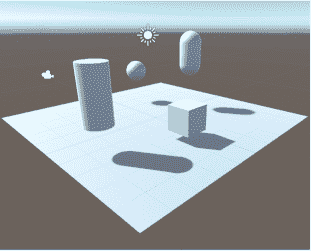

# Unity 实验室#1：探索 C#与 Unity

欢迎来到您的第一个**Head First C# Unity Lab**。编写代码是一种技能，就像任何其他技能一样，通过**练习和实验**来提高。Unity 将是一个非常有价值的工具。

Unity 是一个跨平台的游戏开发工具，您可以用它制作专业质量的游戏、模拟等。同时，这也是一个学习 C#工具和理念的有趣而令人满足的方式，这本书中您将会学到这些。我们设计了这些简短而有针对性的实验室，以**巩固**您刚刚学到的概念和技术，帮助您磨练 C#技能。

这些实验室是可选的，但是它们是宝贵的练习——**即使您不打算使用 C#来制作游戏**。

在这个第一个实验室中，您将开始使用 Unity，并对 Unity 编辑器有所了解，并开始创建和操作 3D 形状。

# Unity 是一个强大的游戏设计工具

欢迎来到 Unity 的世界，这是一个完整的系统，用于设计专业质量的游戏——包括二维（2D）和三维（3D）游戏，以及模拟、工具和项目。Unity 包括许多强大的功能，包括...

**跨平台游戏引擎**

**游戏引擎**负责显示图形，追踪 2D 或 3D 角色，检测它们的碰撞，使它们表现得像真实世界的物体，并且还有许多其他功能。Unity 将为您在本书中构建的 3D 游戏完成所有这些工作。

**强大的 2D 和 3D 场景编辑器**

您将在 Unity 编辑器中花费大量时间。它让您可以编辑充满 2D 或 3D 对象的关卡，并提供工具，用于为您的游戏设计完整的世界。Unity 游戏使用 C#来定义其行为，并且 Unity 编辑器与 Visual Studio 集成，为您提供无缝的游戏开发环境。

###### 注意

虽然这些 Unity 实验室将集中在 Unity 中的 C#开发上，但如果您是视觉艺术家或设计师，Unity 编辑器还具有许多专为您设计的艺术友好型工具。在这里查看它们：[`unity3d.com/unity/features/editor/art-and-design`](https://unity3d.com/unity/features/editor/art-and-design)。

**游戏创作生态系统**

除了作为一个强大的游戏创建工具之外，Unity 还具有一个生态系统，帮助您构建和学习。Unity 的学习页面（[`unity.com/learn`](https://unity.com/learn)）提供宝贵的自学资源，而 Unity 论坛（[`forum.unity.com`](https://forum.unity.com)）则帮助您与其他游戏设计师联系并提问。Unity 资源商店（[`assetstore.unity.com`](https://assetstore.unity.com)）提供免费和付费的资源，如角色、形状和特效，可以用于您的 Unity 项目中。

**我们的 Unity 实验室将集中于使用 Unity 作为探索 C#的工具，并通过您在本书中学到的 C#工具和理念进行实践。**

*`Head First C#`* Unity 实验室专注于**以开发者为中心的学习路径**。这些实验室的目标是帮助您快速掌握 Unity，采用与*`Head First C#`*全书一脉相承的大脑友好、及时学习方法，***让您能够有针对性地、有效地练习 C# 的思想和技术***。

# 下载 Unity Hub

**Unity Hub** 是一个帮助您管理 Unity 项目和 Unity 安装的应用程序，也是创建新 Unity 项目的起点。首先从 [`store.unity.com/download`](https://store.unity.com/download) 下载 Unity Hub，然后安装并运行它。

Unity Hub 允许您在同一台计算机上安装多个版本的 Unity，因此您应该安装与我们用来构建这些实验室的相同版本。**点击官方发布版本**，安装以***Unity 2020.1***开头的最新版本——这是我们在这些实验室中使用的版本。安装完成后，请确保它已设置为首选版本。

Unity 安装程序可能会提示您安装不同版本的 Visual Studio。您也可以在同一台计算机上安装多个版本的 Visual Studio，但如果您已经安装了一个版本的 Visual Studio，Unity 安装程序就不需要再添加另一个版本了。

您可以在此处详细了解如何在 Windows、macOS 和 Linux 上安装 Unity Hub：[`docs.unity3d.com/2020.1/Documentation/Manual/GettingStartedInstallingHub.html`](https://docs.unity3d.com/2020.1/Documentation/Manual/GettingStartedInstallingHub.html)。

###### 注意

Unity Hub 可让您在同一台计算机上安装多个 Unity 版本。因此，即使有更新版本的 Unity 可用，您也可以使用 Unity Hub 安装我们在 Unity 实验室中使用的版本。

# 使用 Unity Hub 创建新项目

在 Unity Hub 中的项目页面上单击  按钮以创建新的 Unity 项目。命名为***Unity Lab 1***，确保选择了 3D 模板，并检查是否将其创建在一个合理的位置（通常是您的主目录下的 Unity Projects 文件夹）。

单击“创建项目”以创建包含 Unity 项目的新文件夹。创建新项目时，Unity 会生成许多文件（就像 Visual Studio 为您创建新项目时所做的那样）。Unity 可能需要一两分钟来创建您的新项目的所有文件。

# 将 Visual Studio 设为 Unity 脚本编辑器

Unity 编辑器与 Visual Studio IDE 配合得非常紧密，使得编辑和调试游戏代码变得非常简单。因此，我们首先要确保 Unity 已经与 Visual Studio 连接好。从“编辑”菜单中选择“首选项”（或者在 Mac 上从 Unity 菜单中选择），打开 Unity 首选项窗口。在左侧点击“外部工具”，在“外部脚本编辑器”窗口中**选择 Visual Studio**。

*在某些旧版本的 Unity 中，您可能会看到一个 **Editor Attaching** 复选框 —— 如果有，请确保它被选中（这样可以让您在 IDE 中调试 Unity 代码）。*

好了！您已经准备好开始构建您的第一个 Unity 项目了。

> 您可以使用 Visual Studio 来调试 Unity 游戏中的代码。只需在 Unity 的偏好设置中选择 Visual Studio 作为外部脚本编辑器。

# 掌控 Unity 布局

Unity 编辑器就像是您 Unity 项目中除了 C# 以外的所有部分的 IDE。您将使用它来处理场景、编辑 3D 形状、创建材质等等。就像在 Visual Studio 中一样，Unity 编辑器中的窗口和面板可以以许多不同的布局重新排列。

找到窗口顶部附近的 Scene 选项卡。单击选项卡并拖动它以分离窗口：

尝试将其停靠在其他面板内或旁边，然后将其拖动到编辑器中间使其成为浮动窗口。

# 选择 Wide 布局以与我们的截图匹配

我们选择了 Wide 布局，因为它在这些实验室的截图中表现良好。找到布局下拉菜单，选择 Wide，这样您的 Unity 编辑器看起来就像我们的一样。

###### 注意

**Scene 视图是您创建的世界的主要交互视图。您将用它来定位 3D 形状、摄像机、灯光以及游戏中的所有其他对象。**

这是 Wide 布局下您的 Unity 编辑器应该呈现的样子：

# 您的场景是一个 3D 环境

一旦您启动编辑器，您就在编辑一个 **场景**。您可以将场景视为 Unity 游戏中的关卡。在 Unity 中的每个游戏由一个或多个场景组成。每个场景都包含一个独立的 3D 环境，具有自己的灯光、形状和其他 3D 对象。创建项目时，Unity 添加了一个名为 SampleScene 的场景，并将其存储在名为 *`**SampleScene.unity**`* 的文件中。

通过从菜单中选择 **GameObject >> 3D Object >> Sphere**，向您的场景添加一个球体：

在您的场景窗口中将会出现一个球体。您在场景窗口看到的一切都是从 **Scene 视图相机** 的视角显示的，它“看”着场景并捕捉其所见。

# Unity 游戏由 GameObject 构建

当您向场景添加一个球体时，您创建了一个新的 **GameObject**。GameObject 是 Unity 中的基本概念。在您的 Unity 游戏中，每个物品、形状、角色、光线、摄像机和特效都是 GameObject。游戏中使用的任何场景、角色和道具都由 GameObject 表示。

在这些 Unity 实验室中，您将使用不同类型的 GameObject 构建游戏，包括：

> GameObject 是 Unity 中的基本对象，组件是它们行为的基本构建块。检视器窗口显示了您场景中每个 GameObject 及其组件的详细信息。

每个 GameObject 包含一些**组件**，提供其形状、设置其位置，并赋予其所有行为。例如：

+   *Transform components*确定 GameObject 的位置和旋转。

+   *Material components*改变 GameObject 的**渲染**方式——或者说改变 Unity 绘制 GameObject 的方式——通过改变颜色、反射、光滑度等。

+   *Script components*使用 C#脚本确定 GameObject 的行为。

###### 注意

渲染，动词。

以艺术方式代表或描绘。

*米开朗基罗**渲染**他最喜欢的模型时比他的其他任何图纸都更详细。

# 使用 Move Gizmo 移动你的游戏对象

Unity 编辑器顶部的工具栏允许你选择 Transform 工具。如果未选择 Move 工具，请按下其按钮进行选择。

Move 工具允许你使用**Move Gizmo**在 3D 空间中移动 GameObject。你应该看到红色、绿色和蓝色的箭头以及一个立方体出现在窗口中间。这就是 Move Gizmo，你可以用它来移动选定的对象在场景中。

将鼠标光标移到 Move Gizmo 中心的立方体上——注意，当你将鼠标光标移动到立方体上时，立方体的每个面都会亮起？点击左上角的面并拖动球体。你在移动球体在 X-Y 平面上。

###### 注意

当你点击 Move Gizmo 中间的立方体的左上角面时，它的 X 和 Y 箭头会亮起，你可以在场景中的 X-Y 平面上拖动你的球体。

**在场景中移动你的球体**，感受 Move Gizmo 的工作原理。点击并拖动每个箭头，分别沿每个平面拖动。尝试点击 Scene Gizmo 中的立方体的每个面，以在所有三个平面上移动它。注意随着球体远离你（或者说场景相机），它变小，靠近时变大。

> Move Gizmo 允许你沿着场景中的任意轴或平面移动游戏对象。

# Inspector 显示了你的 GameObject 的组件

当你在 3D 空间中移动你的球体时，请注意**Inspector 窗口**，如果你使用宽布局，则在 Unity 编辑器的右侧。浏览 Inspector 窗口——你会看到你的球体有四个标记为 Transform、Sphere（Mesh Filter）、Mesh Renderer 和 Sphere Collider 的组件。

每个 GameObject 都有一组组件，提供其行为的基本构建块，并且每个 GameObject 都有一个**Transform 组件**，驱动其位置、旋转和缩放。

当你使用 Move Gizmo 在 X-Y 平面上拖动球体时，你可以看到 Transform 组件中位置行的 X 和 Y 数字发生变化。

###### 注意

**如果你不小心取消选择了一个游戏对象，只需再次点击它。如果它在场景中不可见，你可以在层次结构窗口中选择它，该窗口显示场景中的所有游戏对象。当你将布局重置为宽时，层次结构窗口位于 Unity 编辑器的左下角。**

尝试点击移动 Gizmo 立方体的其他两个面，然后拖动来在 X-Z 和 Y-Z 平面上移动球体。接着点击红色、绿色和蓝色箭头，沿着 X、Y 或 Z 轴拖动球体。当你移动球体时，你会看到 Transform 组件中的 X、Y 和 Z 值发生变化。

现在按住**Shift 键**将 Gizmo 中间的立方体转换为正方体。点击并拖动该正方体，在与场景视图相平行的平面上移动球体。

一旦你完成了对 Move Gizmo 的实验，使用球体的 Transform 组件上下文菜单将组件重置为其默认值。点击 Transform 面板顶部的**上下文菜单按钮** ()，然后从菜单中选择重置。

位置将重置为[0, 0, 0]。

**你可以在 Unity 手册中了解更多关于工具及其如何用于定位游戏对象的信息。点击帮助 >> Unity 手册并搜索“定位游戏对象”页面。**

**经常保存你的场景！使用文件 >> 保存或 Ctrl+S / S 来立即保存当前场景。**

# 将材质添加到你的球体游戏对象中。

Unity 使用**材质**来提供颜色、图案、纹理和其他视觉效果。你的球体现在看起来相当无聊，因为它只有默认材质，这导致 3D 对象呈现为普通的米白色。让我们让它看起来像一个台球。

1.  **选择球体。**

    当球体被选中时，你可以在检视器窗口中看到它的材质作为一个组件：

    

    我们将通过添加一个**纹理**来使你的球体更有趣——这只是一个简单的图像文件，包裹在一个 3D 形状周围，就像你在橡胶片上打印了这张图片并将其拉伸到你的物体上一样。

1.  **前往我们在 GitHub 上的台球纹理页面。**

    去[`github.com/head-first-csharp/fourth-edition`](https://github.com/head-first-csharp/fourth-edition)并点击*Billiard Ball Textures*链接浏览一个完整的台球纹理文件夹。

1.  **下载 8 球的纹理。**

    点击文件*8 Ball Texture.png*查看 8 球的纹理。这是一个普通的 1200 × 600 PNG 图像文件，你可以在你喜爱的图像查看器中打开。

    

    将文件下载到计算机上的一个文件夹中。

    *(你可能需要右键点击下载按钮来保存文件，或者点击下载以打开并保存它，这取决于你的浏览器。)*

1.  **将 8 球纹理图像导入到你的 Unity 项目中。**

    在项目窗口中的 Assets 文件夹上右键，选择“导入新资源...”并导入纹理文件。当你点击项目窗口中的 Assets 文件夹时，现在应该能看到它。

    

1.  将纹理添加到你的球体。

    现在你只需拿这个纹理并“包裹”在你的球体上。点击项目窗口中的 8 号球纹理以选中它。一旦选中，将其拖动到你的球体上。

    

现在你的球体看起来像一个 8 号球。检视器显示 8 号球游戏对象。现在它有一个新的材质组件：

Unity 是真正“掌握”C#的好方法。

编程是一种技能，你写 C#代码的练习越多，编码能力就会越好。这就是为什么我们在整本书中专门设计了 Unity 实验室，来帮助你练习 C#技能，并巩固每章节所学的 C#工具和概念。随着你写更多的 C#代码，你会变得越来越好，这是成为优秀 C#开发者的一种非常有效的方式。神经科学告诉我们，当我们进行实验时，我们学习得更有效，所以我们设计这些 Unity 实验室时提供了许多实验选项，并建议你如何发挥创造力并继续进行每个实验。

但是，Unity 给了我们更重要的机会，帮助理解重要的 C#概念和技术。当你学习一门新的编程语言时，看到它如何在许多不同的平台和技术上运行是非常有帮助的。这就是为什么我们在主章节材料中同时包括了控制台应用和 WPF 应用，有些情况下甚至让你使用两种技术构建相同的项目。加入 Unity，让你获得第三种视角，这真的能加速你对 C#的理解。

# 旋转你的球体

在工具栏中点击“旋转工具”。你可以使用 Q、W、E、R、T 和 Y 键快速切换变换工具——按 E 和 W 切换旋转工具和移动工具。

1.  点击球体。Unity 将显示一个带有红、蓝和绿圆圈的线框球体旋转操作器。点击红圈并拖动它以绕 X 轴旋转球体。

    

1.  点击并拖动绿色和蓝色圆圈以绕 Y 轴和 Z 轴旋转。外部的白色圆圈使球体沿着从场景视图摄像机出来的轴旋转。观察检视器窗口中的旋转数值变化。

    

1.  打开检视器窗口中变换面板的上下文菜单。点击“重置”，就像之前一样操作。这将把变换组件中的所有内容重置为默认值——在这种情况下，将把你的球体旋转恢复为[0, 0, 0]。

    

    **现在使用 文件 >> 保存 或 Ctrl+S / S 来保存场景。早保存，经常保存！**

# 使用 Hand 工具和 Scene Gizmo 移动 Scene 视图相机。

使用鼠标滚轮或轨迹板上的滚动功能进行缩放，并在 Move 和 Rotate Gizmos 之间切换。注意到球体的大小变化，但 Gizmos 不变。编辑器中的 Scene 窗口显示虚拟**相机**视图，并且滚动功能缩放该相机。

按 Q 键选择**Hand 工具**，或从工具栏中选择它。你的光标将变成手型。

###### 注意

按住 Alt 键（Mac 上为 Option 键）并拖动，Hand 工具将变成眼睛并围绕窗口中心旋转视图。

Hand 工具通过改变场景相机的位置和旋转来在场景周围移动。选择 Hand 工具后，你可以在场景中的任何地方点击以进行平移。

当选择 Hand 工具时，你可以通过**点击和拖动**来***平移***场景相机，并且你可以通过按住**Alt（或 Option）并拖动**来***旋转***它。使用**鼠标滚轮**进行缩放。按住**右键**允许你使用 W-A-S-D 键在场景中***飞行***。

当你旋转场景相机时，注意 Scene 窗口右上角的**Scene Gizmo**。Scene Gizmo 总是显示相机的方向 —— 在使用 Hand 工具移动 Scene 视图相机时，检查它。点击 X、Y 和 Z 锥体可将相机捕捉到一个轴上。

*Unity 手册提供了关于导航场景的绝佳提示：* [`docs.unity3d.com/Manual/SceneViewNavigation.html`](https://docs.unity3d.com/Manual/SceneViewNavigation.html)。

# 发挥创造力！

我们设计这些 Unity 实验室，为你提供一个**自主实验 C# 的平台**，因为这是成为优秀 C# 开发者的最有效途径。在每个 Unity 实验室结束时，我们将为你提供一些可以尝试的建议。在进入下一章之前，花些时间尝试一下你刚刚学到的一切。

+   在你的场景中再添加几个球体。尝试使用其他台球球形图。你可以从与 *8 Ball Texture.png* 相同的位置下载它们。

+   尝试通过选择 GameObject >> 3D Object 菜单中的 Cube、Cylinder 或 Capsule 添加其他形状。

+   尝试使用不同的图像作为纹理。看看当你将它们用于创建纹理并添加到不同形状时，人物或风景照片会发生什么。

+   你能否通过形状、纹理和灯光创建一个有趣的 3D 场景？

> 编写的 C# 代码越多，你就越能掌握它。这是成为优秀 C# 开发者的最有效方式。我们设计这些 Unity 实验室，为你提供实践和实验的平台。
