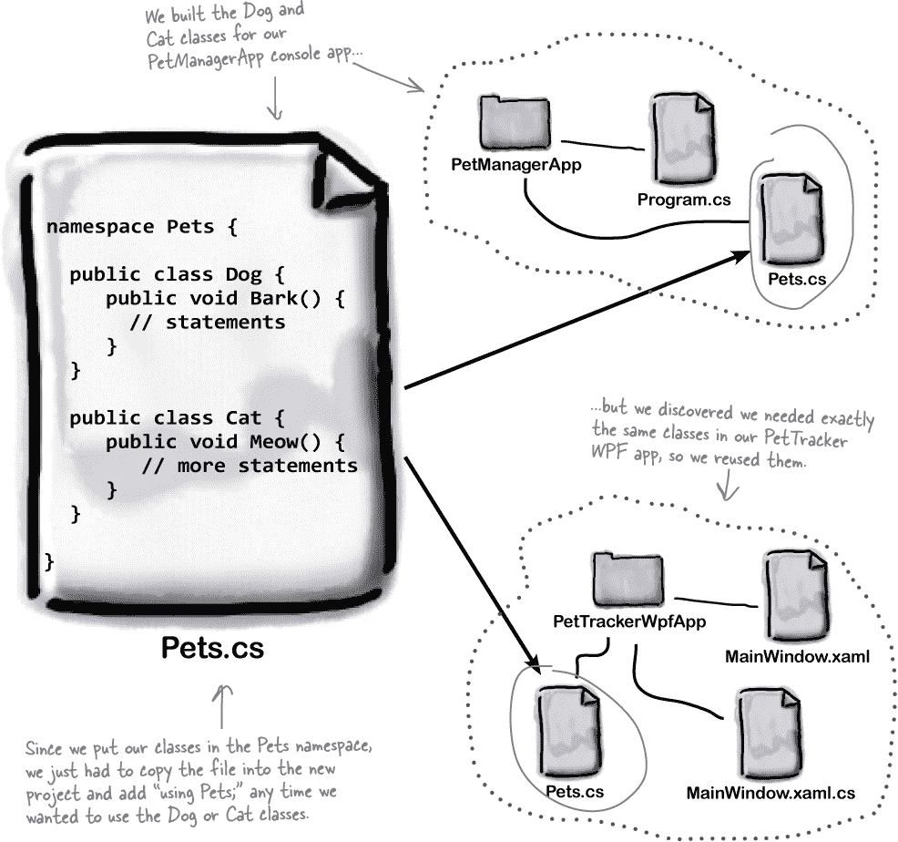
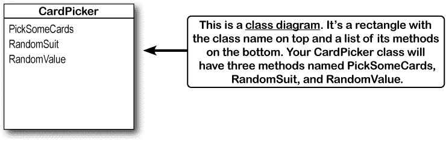
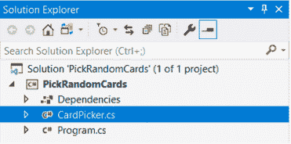
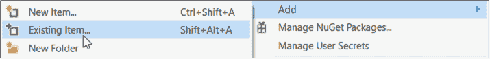
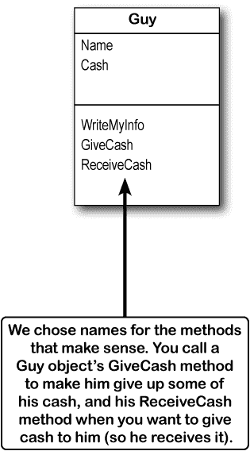
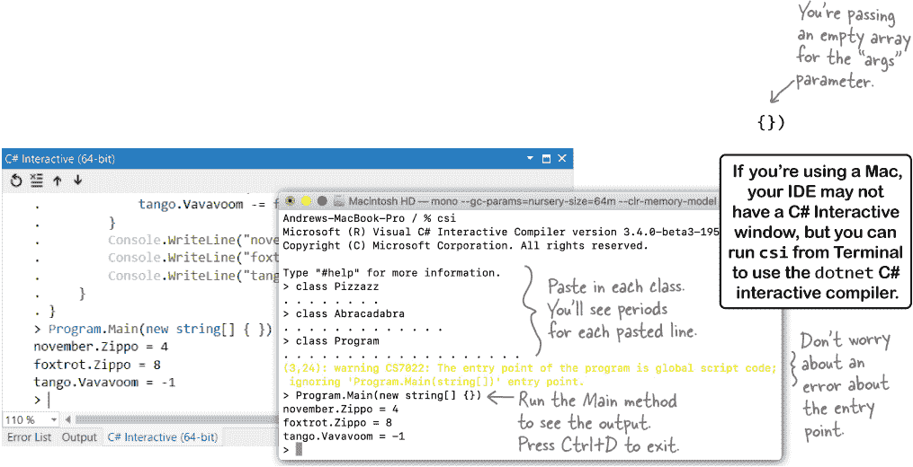

# 第五章：对象...定位：*让代码变得有意义*


**你编写的每个程序都解决一个问题。**

当你构建一个程序时，首先考虑你的程序应该解决的问题总是个好主意。这就是为什么对象非常有用。它们允许你根据解决问题的方式来组织你的代码，这样你可以花时间思考你需要解决的问题，而不是陷入编写代码的细节中。当你正确使用对象，并真正考虑如何设计它们时，你最终会得到易于编写、阅读和修改的代码。

# 如果代码有用，它会被重用

开发人员自编程早期以来就一直在重用代码，而且很容易理解为什么会这样。如果你为一个程序编写了一个类，并且有另一个需要执行完全相同操作的程序，那么在新程序中重用相同的类是有意义的。



# 一些方法接受参数并返回一个值

你已经看到了一些执行任务的方法，比如在#start_building_with_chash_build_somethin 中的 SetUpGame 方法，它设置了你的游戏。方法不仅仅可以这样做：它们可以使用**参数**获取输入，对输入进行处理，然后生成具有**返回值**的输出，该返回值可以被调用方法使用的语句所使用。


参数是方法用作输入的值。它们被声明为包含在方法声明中的变量（在括号之间）。返回值是在方法内部计算或生成的值，并发送回调用该方法的语句。返回值的类型（如*string*或*int*）称为**返回类型**。如果一个方法有返回类型，则必须使用`**return**` **语句**。

这是一个具有两个 int 参数和一个 int 返回类型的方法的示例：


该方法接受名为`**factor1**`和`**factor2**`的两个**参数**。它使用乘法运算符`*****`来计算结果，并使用`**return**`关键字返回结果。

此代码调用 Multiply 方法，并将结果存储在名为`**area**`的变量中：


# 让我们构建一个挑选卡片的程序

在本章的第一个项目中，你将构建一个名为 PickRandomCards 的.NET Core 控制台应用程序，该程序允许你随机选择扑克牌。下面是它的结构：


你的 PickSomeCards 方法将使用字符串值来表示扑克牌。如果你想挑选五张牌，你可以像这样调用它：

```cs
      string[] cards = PickSomeCards(5);
```

`**cards**` 变量有一种您还没见过的类型。方括号 `**[]**` 表示它是一个**字符串数组**。数组允许您使用单个变量存储多个值——在本例中，是带有纸牌的字符串。这里是 PickSomeCards 方法可能返回的字符串数组示例：

```cs
{ "10 of Diamonds", 
  "6 of Clubs", 
  "7 of Spades",
  "Ace of Diamonds", 
  "Ace of Hearts" }
```

###### 注意

这是一个包含五个字符串的数组。您的卡片选择器应用程序将创建类似这样的数组来表示随机选择的卡片。


生成数组后，您将使用一个 `**foreach**` 循环将其写入控制台。

# 创建您的 PickRandomCards 控制台应用程序

**做这个！**

让我们利用您迄今学到的知识来创建一个选择随机卡片的程序。打开 Visual Studio 并 **创建一个名为 PickRandomCards 的新控制台应用程序项目**。您的程序将包括一个名为 CardPicker 的类。以下是显示其名称和方法的类图：



在解决方案资源管理器中右键单击 PickRandomCards 项目，选择 Windows 中的 **添加 >> Class…**（或 macOS 中的 **添加 >> New Class…**）来弹出菜单。Visual Studio 将提示您输入一个类名——选择 *CardPicker.cs*。


Visual Studio 将在您的项目中创建一个名为 CardPicker 的全新类：



您的新类是空的——它以类 `**CardPicker**` 和一对花括号开始，但里面什么都没有。**添加一个名为 PickSomeCards 的新方法**。您的类应该如下所示：


# 完成您的 PickSomeCards 方法

**现在做这个！**

1.  ***您的 PickSomeCards 方法需要一个返回语句，让我们添加一个。*** 继续填写方法的其余部分——现在它使用了一个 `**return**` 语句来返回字符串数组值，错误消失了：

    ```cs
    class CardPicker
    {
         public static string[] PickSomeCards(int numberOfCards)
         {
             string[] pickedCards = new string[numberOfCards];
             for (int i = 0; i < numberOfCards; i++)
             {
                  pickedCards[i] = RandomValue() + " of " + RandomSuit();
             }
             return pickedCards;
         }
    }
    ```

    ###### 注意

    通过返回与方法的返回类型匹配的值，您使红色波浪线错误消失了。

1.  ***生成缺失的方法。*** 现在您的代码由于缺少 RandomValue 或 RandomSuit 方法而出现不同的错误。像在 #start_building_with_chash_build_somethin 中一样生成这些方法。在代码编辑器左侧边缘使用快速操作图标——单击它时，您将看到生成这两个方法的选项：

    

    继续生成它们。您的类现在应该有 RandomValue 和 RandomSuit 方法：

    ```cs
    class CardPicker
    {
        public static string[] PickSomeCards(int numberOfCards)
        {
            string[] pickedCards = new string[numberOfCards];
            for (int i = 0; i < numberOfCards; i++)
            {
                pickedCards[i] = RandomValue() + " of " + RandomSuit();
            }
            return pickedCards;
        }
        private static string RandomValue()
        {
            throw new NotImplementedException();
        }
        private static string RandomSuit()
        {
            throw new NotImplementedException();
        }
    }
    ```

    ###### 注意

    您使用 IDE 生成了这些方法。如果它们不按顺序排列也没关系——类中方法的顺序无关紧要。

1.  ***使用* *return*** ***语句来构建您的 RandomSuit 和 RandomValue 方法。***

    一个方法可以有多个 `**return**` 语句，当执行其中一个语句时，它立即返回，并且*不会执行* *方法中的任何其他语句*。

    这是一个利用返回语句的程序示例。想象一下，你正在制作一个卡牌游戏，需要方法来生成随机的卡牌花色或值。我们将从创建一个随机数生成器开始，就像我们在第一章的动物匹配游戏中使用的那样。将其添加到类声明的下面：

    ```cs
     class CardPicker
     {
         static Random random = new Random();
    ```

    现在，在你的 RandomSuit 方法中添加代码，利用 `**return**` 语句尽快停止执行方法。随机数生成器的 Next 方法可以接受两个参数：`**random.Next(1, 5)**` 返回的数字至少为 1，但小于 5（换句话说，从 1 到 4 的随机数）。你的 RandomSuit 方法将使用这个来选择一个随机的纸牌花色：

    

    这是一个生成随机值的 RandomValue 方法。看看你能否弄清楚它是如何工作的：

    ```cs
         private static string RandomValue()
         {
             int value = random.Next(1, 14);
             if (value == 1) return "Ace";
             if (value == 11) return "Jack";
             if (value == 12) return "Queen";
             if (value == 13) return "King";
             return value.ToString();
         }
    ```

    ###### 注

    **注意我们为什么返回 `value.ToString()` 而不只是 `value`？因为 `value` 是一个整数变量，但 RandomValue 方法声明为字符串返回类型，所以我们需要将 `value` 转换为字符串。你可以为任何变量或值添加 `**.ToString()**` 来将其转换为字符串。**

    > 返回语句会导致你的方法立即停止并返回到调用它的语句。

# 你完成的 CardPicker 类

这是你完成的 CardPicker 类的代码。它应该位于与项目名称匹配的命名空间中：


###### 注

**当你在编写程序的 Main 方法时，请看一下它的返回类型。你觉得那里在发生什么？**

# 安娜正在开发她的下一个游戏


认识一下安娜。她是一名独立游戏开发者。她的上一款游戏销售了成千上万份，现在她正在着手她的下一款游戏。


安娜已经开始着手一些**原型**。她一直在编写 alien enemies 的代码，这是游戏中一个激动人心的部分，玩家需要在外星人搜索他们的藏身处时逃脱。安娜编写了几种定义敌人行为的方法：搜索玩家被发现的最后位置，一段时间后放弃搜索（如果找不到玩家），并在敌人靠近时捕获玩家。


## 安娜的游戏正在演变中…

人类对抗外星人的想法挺不错的，但安娜并不完全确定她想要走这个方向。她还在考虑一个海洋游戏，玩家必须躲避海盗。或者可能是一个设定在诡异农场上的僵尸生存游戏。在这三个想法中，她认为敌人会有不同的图形，但它们的行为可以由相同的方法驱动。


**…那么安娜如何让自己更轻松一些呢？**

安娜不确定游戏应该朝哪个方向发展，所以她想制作几个不同的原型，并希望它们所有的敌人代码都一样，包括 SearchForPlayer、StopSearching、SpottedPlayer、CommunicatePlayerLocation 和 CapturePlayer 方法。她的工作任务很多。


# 为一个经典游戏建立一个纸板原型

纸板原型在你开始构建游戏之前，帮助你理清游戏运作方式的非常有用，这能够节省很多时间。有一个快速的开始方法——你只需要一些纸和一支笔或铅笔。首先选择你最喜欢的经典游戏。平台游戏特别适合，所以我们选择了有史以来**最受欢迎、最能被认出来**的经典视频游戏之一……但你可以选择任何你喜欢的游戏！接下来该做什么，看这里。

**画这个！**

1.  **在一张纸上画背景。** 通过创建背景开始你的原型。在我们的原型中，地面、砖块和管道不会移动，所以我们在纸上画了它们。我们还在顶部添加了得分、时间和其他文本。

1.  **撕下小纸片并画出移动的部分。** 在我们的原型中，我们分别在不同的纸片上画了角色、食人花、蘑菇、火焰花和硬币。如果你不是艺术家，没关系！只需画出简单的人物和粗略的形状。别人永远不会看到这些！

1.  **“玩”这个游戏。** 这是有趣的部分！尝试模拟玩家移动。在页面上拖动玩家。让非玩家角色也移动。花几分钟玩游戏，然后回到你的原型，看看是否能尽可能精确地重现动作。（一开始可能会感觉有点奇怪，但没关系！）

    


**是的！纸板原型是任何项目的一个很好的第一步。**

如果你正在开发桌面应用程序、移动应用程序或任何其他具有用户界面的项目，制作一个纸板原型是一个很好的开始方式。有时候你需要创建几个纸板原型才能掌握窍门。这就是为什么我们从一个经典游戏的纸板原型开始……因为这是学习如何制作纸板原型的一个很好的方式。**原型设计是任何类型开发者的一项非常有价值的技能，不仅仅是游戏开发者。**

###### 注

“游戏设计与更多”部分中的所有工具和想法都是重要的编程技能，不仅限于游戏开发，但我们发现当你首次尝试用游戏时，它们更容易学习。

# 接下来：构建你的卡片选择应用程序的 WPF 版本

在下一个项目中，你将构建一个名为 PickACardUI 的 WPF 应用程序。以下是它的外观：


你的 PickACardUI 应用程序将允许你使用一个滑块控件选择要随机选取的卡片数量。当你选择了卡片数量后，点击按钮即可将它们添加到一个列表框中。

窗口的布局如下：


###### 注意

**我们不会一直提醒您将项目添加到源代码控制，但我们仍然认为创建一个 GitHub 账户并将所有项目发布到其中是一个非常好的主意！**


###### 注意

本书中所有 WPF 项目都有 ASP.NET Core 版本，其中包含来自 Visual Studio for Mac 的屏幕截图。

###### 注意

**转到 Visual Studio for Mac 学习指南，了解此项目的 Mac 版本。**

# StackPanel 是一个容器，可以堆叠其他控件

您的 WPF 应用程序将使用一个 Grid 来布局其控件，就像您在匹配游戏中使用的一样。在开始编写代码之前，让我们仔细看看网格的左上角单元格中的两个控件：


那么我们怎样才能把它们像那样叠放在一起？我们***可以***尝试把它们放在网格的同一个单元格中：

```cs
   <Grid>
       <Label HorizontalAlignment="*Center*" VerticalAlignment="*Center*" Margin="*20*"
           Content="How many cards should I pick?" FontSize="20"/>
       <Slider VerticalAlignment="*Center*" Margin="*20*"
           Minimum="1" Maximum="15" Foreground="Black"
           IsSnapToTickEnabled="True" TickPlacement="BottomRight" />
   </Grid>
```

###### 注意

这是 Slider 控件的 XAML。当您组合表单时，我们将更仔细地看一下它。

但这只会导致它们重叠在一起：


这就是**StackPanel 控件**的作用。StackPanel 是一个容器控件，就像 Grid 一样，它的工作是容纳其他控件并确保它们在窗口中放置在正确的位置。虽然 Grid 允许您将控件排列在行和列中，但 StackPanel 允许您将控件***在水平或垂直堆栈中排列***。

让我们使用相同的 Label 和 Slider 控件，但这次使用 StackPanel 来布局它们，以便 Label 堆叠在 Slider 上。请注意，我们将对齐和边距属性移到了 StackPanel 上——我们希望面板本身居中，并且周围有一些边距：

```cs
 <StackPanel HorizontalAlignment="*Center*" VerticalAlignment="*Center*" Margin="*20*" >
     <Label Content="*How many cards should I pick?*" FontSize="*20*" />
     <Slider Minimum="*1*" Maximum="*15*" Foreground="*Black*" IsSnapToTickEnabled="*True*" TickPlacement="*BottomRight*" />
 </StackPanel>
```

StackPanel 将使单元格中的控件看起来符合我们的要求：


> ***这就是项目的工作方式。现在让我们开始构建它！***

# 在新的 WPF 应用程序中重用您的 CardPicker 类

如果您为一个程序编写了一个类，通常会希望在另一个程序中使用相同的行为。这就是使用类的一个重要优势之一，它们使得**重用**您的代码更加容易。让我们为您的卡片选择器应用程序提供一个全新的用户界面，但通过重用您的 CardPicker 类来保持相同的行为。

***重用这个！***

1.  **创建一个名为 PickACardUI 的新 WPF 应用程序。**

    您将完全按照创建动物匹配游戏时使用的步骤来完成您的应用程序#start_building_with_chash_build_somethin：

    +   打开 Visual Studio 并创建一个新项目。

    +   选择**WPF 应用程序（.NET Core）**。

    +   将您的新应用程序命名为**PickACardUI**。Visual Studio 将创建该项目，并添加带有命名空间 PickACardUI 的*MainWindow.xaml*和*MainWindow.xaml.cs*文件。

1.  **添加您为控制台应用程序项目创建的 CardPicker 类。**

    右键单击项目名称，从菜单中选择**添加 >> 现有项…**。

    

    导航到包含你的控制台应用程序的文件夹，选择 *CardPicker.cs* 将它添加到你的项目中。你的 WPF 项目现在应该有一个来自你的控制台应用程序的 *CardPicker.cs* 文件的副本。

1.  **更改 CardPicker 类的命名空间。**

    双击解决方案资源管理器中的 *CardPicker.cs*。它仍然带有控制台应用程序的命名空间。**将命名空间更改**以匹配你的项目名称。IntelliSense 弹出窗口将建议 PickACardUI 命名空间 — **按 Tab 键接受建议**：

    

    现在你的 CardPicker 类应该在 PickACardUI 命名空间中：

    ```cs
    namespace PickACardUI
    {
        class CardPicker
        {
    ```

    ***恭喜，你已经重用了你的 CardPicker 类！*** 你应该在解决方案资源管理器中看到这个类，并且你可以在你的 WPF 应用程序的代码中使用它。

# 使用 Grid 和 StackPanel 布局主窗口

回到#start_building_with_chash_build_somethin，你使用了 Grid 布局你的动物匹配游戏。花几分钟翻回到你布局网格的章节，因为你将使用相同的方法来布局你的窗口。

1.  **设置行和列。** 按照#start_building_with_chash_build_somethin 的相同步骤来 **添加两行和两列** 到你的网格中。如果步骤正确，你应该看到这些行和列的定义就在 XAML 中 `<Grid>` 标签下面：

    ```cs
     <Grid.RowDefinitions>
         <RowDefinition/>
         <RowDefinition/>
     </Grid.RowDefinitions>
     <Grid.ColumnDefinitions>
         <ColumnDefinition/>
         <ColumnDefinition/>
     </Grid.ColumnDefinitions>
    ```

    ###### 注意

    你可以使用 Visual Studio 的设计器添加两个相等的行和两个相等的列。如果遇到问题，可以直接在编辑器中输入 XAML 代码。

1.  **添加 StackPanel。** 在可视化 XAML 设计器中使用空的 StackPanel 有点困难，因为很难点击，所以我们将在 XAML 代码编辑器中完成这个任务。**双击工具箱中的 StackPanel**，将一个空的 StackPanel 添加到网格中。你应该看到：

    ```cs
           </Grid.ColumnDefinitions>

           <StackPanel/>

        </Grid>

    </Window>
    ```

    

1.  **设置 StackPanel 的属性。** 当你在工具箱中双击 StackPanel 时，它添加了***一个没有属性的 StackPanel***。默认情况下它位于网格的左上角单元格中，所以现在我们只需要设置它的对齐和边距。**在 XAML 编辑器中点击 StackPanel 标签**来选择它。一旦在代码编辑器中选中它，你会在属性窗口中看到它的属性。将垂直和水平对齐设置为 `**Center**`，并将所有边距设置为 `**20**`。

    

    现在你的 XAML 代码中应该有这样一个 StackPanel：

    ```cs
    <StackPanel HorizontalAlignment="*Center*" VerticalAlignment="*Center*" Margin="*20*" />
    ```

    ###### 注意

    这意味着所有的边距都设置为 20。你可能还会看到 Margin 属性设置为 “20, 20, 20, 20” — 它的意思是一样的。

# 布局你的 Card Picker 桌面应用程序窗口

布局新卡片选择器应用程序的窗口，使其左侧有用户控件，并在右侧显示选择的卡片。您将在左上角单元格中使用 **StackPanel**。它是一个 **容器**，意味着它包含其他控件，就像 Grid 一样。但是它不是将控件放在单元格中，而是垂直或水平地堆叠它们。一旦您的 StackPanel 布局完成，其中包含一个 Label 和一个 Slider，您将添加 ListBox 控件，就像您在#dive_into_chash_statementscomma_classesc 中使用的那个一样。

1.  **向 StackPanel 添加标签和滑块。**

    ***设计它！***

    StackPanel 是一个容器。当 StackPanel 不包含任何其他控件时，*您无法在设计器中看到它*，这使得很难将控件拖放到其上。幸运的是，向其中添加控件与设置其属性一样快速。**点击 StackPanel 以选中它。**

    

    选中 StackPanel，**在工具箱中双击 Label**，将一个新的标签控件 *放置在 StackPanel 内部*。标签将出现在设计器中，并在 XAML 代码编辑器中会出现一个`**Label**`标记。

    接下来，在工具箱中展开*所有 WPF 控件*部分，并**双击滑块**。现在您的左上角单元格应该有一个 StackPanel，其中包含一个在顶部堆叠的标签和一个滑块。

1.  **设置标签和滑块控件的属性。**

    现在，您的 StackPanel 已经有了一个标签和一个滑块，您只需要设置它们的属性：

    +   在设计器中点击标签。展开“通用”部分，在属性窗口中将其内容设置为`**我应该选择多少张卡片？**`—然后展开“文本”部分，将其字体大小设置为`**20px**`。

    +   按 Esc 键取消选择 Label，然后在设计器中**点击滑块**以选中它。使用属性窗口顶部的名称框将其名称更改为`**numberOfCards**`。

    +   展开“布局”部分，使用方形（）重置宽度。

    +   展开“通用”部分，并将其最大属性设置为`**15**`，最小属性设置为`**1**`，自动工具提示放置设置为`**TopLeft**`，刻度放置设置为`**BottomRight**`。然后点击插入点（）展开“布局”部分，并显示其他属性，包括 IsSnapToTickEnabled 属性。将其设置为`**True**`。

    +   让刻度线更易于看见。在属性窗口中展开“笔刷”部分，**点击前景右侧的大矩形**—这将让您使用颜色选择器选择滑块的前景颜色。点击 R 框，并将其设置为`**0**`，然后将 G 和 B 也设置为`**0**`。前景框现在应该是黑色，滑块下的刻度线应该是黑色的。

    XAML 应该如下所示——如果您在设计器中遇到问题，可以直接编辑 XAML：

    ```cs
    <StackPanel HorizontalAlignment="*Center*" VerticalAlignment="*Center*" Margin="*20*">
        <Label Content="*How many cards should I pick?*" FontSize="*20*"/>
        <Slider x:Name="*numberOfCards*" Minimum="*1*" Maximum="*15*" TickPlacement="*BottomRight*" IsSnapToTickEnabled="*True*" AutoToolTipPlacement="*TopLeft*" Foreground="*Black*"/>
    </StackPanel>
    ```

1.  **向左下角单元格添加一个按钮。**

    从工具箱拖动一个按钮到网格的左下角，并设置其属性：

    +   展开通用部分并将其内容属性设置为`**Pick some cards**`。

    +   展开文本部分并将其字体大小设置为`**20px**`。

    +   展开布局部分。重置其边距、宽度和高度。然后将其垂直和水平对齐设置为`**Center**`（ 和 ）。

        你的按钮控件的 XAML 应该如下所示：

        ```cs
        <Button Grid.Row="*1*" Content="*Pick some cards*" FontSize="*20*"
                HorizontalAlignment="*Center*" VerticalAlignment="*Center*" />
        ```

1.  **添加一个 ListBox，占据窗口右半部分并跨两行。**

    将一个 ListBox 控件拖到右上角的单元格中，并设置其属性：

    +   使用属性窗口顶部的名称框，将 ListBox 的名称设置为`**listOfCards**`。

    +   展开文本部分并将其字体大小设置为`**20px**`。

    +   展开布局部分。将其边距设置为`**20**`，就像你在 StackPanel 控件中所做的一样。确保其宽度、高度、水平对齐和垂直对齐被重置。

    +   确保行设置为 0，并设置列为 1。然后**将 RowSpan 设置为 2**，使 ListBox 占据整个列并跨越两行：

        

        你的 ListBox 控件的 XAML 应该如下所示：

        ```cs
        <ListBox x:Name="*listOfCards*" Grid.Column="*1*" Grid.RowSpan="*2*"
                 FontSize="*20*" Margin="20,20,20,20"/>
        ```

        ###### 注

        如果这个值只是“20”而不是“20, 20, 20, 20”，那意思是一样的。

1.  **设置窗口标题和大小。**

    当你创建一个新的 WPF 应用程序时，Visual Studio 会创建一个主窗口，宽度为 450 像素，高度为 800 像素，标题为“主窗口”。让我们调整它的大小，就像你在动物配对游戏中所做的一样：

    +   在设计器中点击窗口的标题栏以选择窗口。

    +   使用布局部分将宽度设置为`**300**`。

    +   使用通用部分将标题设置为`**Card Picker**`。

    滚动到 XAML 编辑器的顶部，查看`**Window**`标记的最后一行。你应该看到这些属性：

    ```cs
                    Title="*Card Picker*" Height="*300*" Width="*800*"
    ```

1.  **为你的按钮控件添加一个 Click 事件处理程序。**

    **代码后端** ——连接到你的 XAML 的*MainWindow.xaml.cs*中的 C#代码——由一个方法组成。在设计器中双击按钮——IDE 将添加一个名为 Button_Click 的方法，并将其设置为 Click 事件处理程序，就像在#start_building_with_chash_build_somethin 中所做的那样。这是你的新方法的代码：

    ```cs
    private void Button_Click(object sender, RoutedEventArgs e)
    {
        string[] pickedCards = CardPicker.PickSomeCards((int)numberOfCards.Value);
        listOfCards.Items.Clear();
        foreach (string card in pickedCards)
        {
            listOfCards.Items.Add(card);
        }
    }
    ```

    > 与你的 XAML 窗口连接的 C#代码，包含事件处理程序，称为代码后端。

    **现在运行你的应用程序。** 使用滑块选择随机选取的卡片数量，然后按按钮将它们添加到 ListBox 中。***干得好！***

    

## Ana 的原型看起来很棒…

Ana 发现，无论她的玩家是被外星人、海盗、僵尸还是邪恶的杀人小丑追逐，她都可以使用与她的 Enemy 类相同的方法来使它们工作。她的游戏开始形成。


## …但如果她想要多于一个敌人呢？

而这很棒...直到 Ana 想要更多的敌人，这是她早期原型中的全部内容。她应该怎么做才能在游戏中添加第二或第三个敌人呢？

Ana *可能* 将 Enemy 类的代码复制并粘贴到另外两个类文件中。然后她的程序可以使用方法同时控制三个不同的敌人。从技术上讲，我们正在重复使用代码...对吗？

嘿，Ana，你觉得这个主意怎么样？


**维护三份相同代码真的很混乱。**

许多你需要解决的问题需要一种方式来多次表示一个 ***事物***。在这种情况下，它是游戏中的一个敌人，但它可能是音乐播放器应用中的歌曲，或者社交媒体应用中的联系人。它们都有一个共同点：无论处理多少这样的事物，它们总是需要以相同的方式对待相同类型的事物。让我们看看能否找到一个更好的解决方案。

# Ana 可以使用对象来解决她的问题

**对象** 是 C# 中用来处理一堆相似事物的工具。Ana 可以仅编写一次 Enemy 类，并在程序中*任意次数*使用它。


# 使用类来构建对象

类就像对象的蓝图。如果你想在郊区住宅开发中建造五座相同的房子，你不会让建筑师绘制五套相同的蓝图。你只需使用一个蓝图来建造五座房子。


> **类定义其成员，就像蓝图定义房屋的布局一样。你可以使用一个蓝图制作任意数量的房屋，也可以使用一个类制作任意数量的对象。**

## 对象从其类中获取其方法

一旦你建立了一个类，你可以使用 `**new**` 语句从中创建任意数量的对象。这样做时，类中的每个方法都成为对象的一部分。


# 当你从一个类创建一个新对象时，它被称为该类的一个实例

使用 **`new` 关键字** 创建对象。你只需一个变量来使用它。使用类作为变量类型来声明该变量，所以不是用 int 或 bool，而是像 House 或 Enemy 这样的类。

###### 注

实例，名词。

一个例子或某事物的一个发生。*IDE 的搜索替换功能找到每个 **实例** 单词并将其更改为另一个。*


**是的！你已经在自己的代码中创建了实例。**

回到你的动物匹配程序，找到这行代码：

```cs
 Random random = new Random();
```

你创建了 Random 类的一个实例，然后调用了它的 Next 方法。现在看看你的 CardPicker 类，找到 `**new**` 语句。你一直在使用对象！

# 为 Ana 提供的更好解决方案...由对象提供

Ana 使用对象来重用 Enemy 类中的代码，避免了在项目中到处复制代码的混乱。她是这样做的。

1.  Ana 创建了一个名为`**enemies**`的**Enemy 数组**存储的 Level 类，就像你用字符串数组存储卡片和动物表情符号一样。

    

1.  她使用了一个循环调用`**new**`语句为关卡创建 Enemy 类的新实例，并将它们添加到一个敌人数组中。

    

1.  她在每帧更新期间调用每个 Enemy 实例的方法来实现敌人的行为。

    

**当你创建一个类的新实例时，称为实例化该类。**


**没错，我们确实没有。**

一些游戏原型非常简单，而另一些则更加复杂，但复杂的程序 ***遵循与简单程序相同的模式***。Ana 的游戏程序就是一个使用对象的现实生活示例。这不仅适用于游戏开发！无论你构建什么类型的程序，你都会像 Ana 在她的游戏中那样使用对象。Ana 的例子只是把这个概念引入你的大脑的起点。在本章的其余部分，我们将给你 ***更多的例子*** —— 而这个概念如此重要，我们在未来的章节中也会再次讨论它。

## 理论与实践

谈到模式，这是本书中会反复出现的模式。我们会在几页内介绍一个概念或思想（比如对象），使用图片和简短的代码片段来演示这个想法。这是你有机会退后一步，试着理解发生的事情，而不必担心让程序工作。


# 一个实例使用字段来跟踪事物

你已经看到类可以包含字段以及方法。我们刚刚看到你如何在 CardPicker 类中使用`**static**`关键字声明一个字段：

```cs
 static Random random = new Random();
```

如果你去掉`**static**`关键字会发生什么？然后这个字段就成为了 **实例字段**，每次实例化类时，新创建的实例 *得到它自己的副本*。

###### 注意

有时候人们认为“实例化”这个词听起来有点奇怪，但是当你想想它的意思时就会明白。

当我们想要在类图中包含字段时，我们会在框中画一条水平线。字段在线上方，而方法在线下方。


## 方法是对象做什么的。字段是对象知道什么的。

当 Ana 的原型创建了三个 Enemy 类的实例时，每个对象都用于跟踪游戏中的不同敌人。每个实例都保留相同数据的单独副本：在 enemy2 实例上设置字段不会对 enemy1 或 enemy3 实例产生任何影响。


> 对象的行为由其方法定义，并使用字段来跟踪其状态。


**是的！这就是为什么你在声明中使用了 `**static**` 关键字。**

再看一下你的 CardPicker 类的前几行：

```cs
class CardPicker
{
    static Random random = new Random();
    public static string PickSomeCards(int numberOfCards)
```

当你使用 `**static**` 关键字在类中声明字段或方法时，你不需要该类的实例来访问它。你只需像这样调用你的方法：

```cs
    CardPicker.PickSomeCards(numberOfCards)
```

这是如何调用静态方法的。如果从 PickSomeCards 方法声明中去掉 `**static**` 关键字，那么你需要创建一个 CardPicker 的实例才能调用该方法。除此之外，静态方法和对象方法一样：它们可以接受参数、返回值，并且存在于类中。

当字段是静态的**时，只有一个副本，它被所有实例共享**。因此，如果你创建了多个 CardPicker 实例，它们将共享同一个*random*字段。你甚至可以将**整个类**标记为静态，那么所有成员**必须**也是静态的。如果你尝试向静态类添加非静态方法，你的程序将无法构建。

> 当字段是静态的时候，只有一个副本被所有实例共享。

###### 注意

`*=` 操作符告诉 C# 使用操作符左侧的内容与右侧的内容相乘，因此这将更新 Height 字段。

# 感谢记忆

当你的程序创建一个对象时，它会存放在计算机内存的一部分，称为**堆**。当你的代码使用 `**new**` 语句创建一个对象时，C# 立即在堆中预留空间来存储该对象的数据。


**当程序创建一个新对象时，它被添加到堆中。**

# 你的程序在想什么

让我们仔细看看“磨砺你的铅笔”练习中的程序，从 Main 方法的第一行开始。实际上这是**两个语句**合并成一个：


接下来，让我们仔细看看每组语句执行后堆的样子：


# 有时代码会很难阅读

你可能没有意识到，但你在不断地做出关于如何组织你的代码的选择。你是使用一个方法来完成某件事吗？你把它分成多个方法了吗？你甚至需要一个新的方法吗？你对方法的选择可以使你的代码更加直观——或者如果不小心的话，会变得更加混乱。

这是一个运行制造巧克力棒机器的控制程序中的一小段精简代码：

```cs
    int t = m.chkTemp();
    if (t > 160) {
       T tb = new T();
       tb.clsTrpV(2);
       ics.Fill();
       ics.Vent();
       m.airsyschk();
    }
```

## 极其精简的代码可能会特别棘手

再看一眼那段代码。你能弄清楚它是做什么的吗？如果你无法弄清楚，别难过——它确实非常难读！以下是几个原因：

+   我们可以看到几个变量名：`**tb**`, `**ics**`, `**m**`。这些名字太糟糕了！我们不知道它们具体做什么。那个 T 类是用来干嘛的？

+   `chkTemp` 方法返回一个整数……但它是干什么的？也许我们可以猜测它可能与检查某物的温度有关？

+   `clsTrpV` 方法有一个参数。我们知道这个参数应该是什么吗？为什么是 2？那个 160 的数字是干什么用的？


**C# 和 .NET 无处不在……真的是无处不在**。

你玩过树莓派吗？它是一款单板低成本电脑，类似它的计算机可以在各种机械中找到。借助 Windows IoT（物联网），您的 C#代码可以在这些设备上运行。有一个免费的原型版本，所以您随时可以开始玩硬件。

您可以在这里了解更多关于.NET IoT 应用的信息：[`dotnet.microsoft.com/apps/iot`](https://dotnet.microsoft.com/apps/iot)。

## 大多数代码并不附带手册

这些声明并不为您提供任何有关代码为何这样做的提示。在这种情况下，程序员因为能够将所有内容放入一个方法中而感到满意。但尽可能使代码尽可能紧凑并不是真正有用的！让我们将其拆分为方法以使其更易读，并确保类名给出有意义的名称。

我们将从搞清楚代码的预期功能开始。幸运的是，我们知道这段代码是嵌入式系统的一部分，或者是较大电气或机械系统的控制器。而且我们碰巧有这段代码的文档——特别是当程序员最初构建系统时使用的手册。


我们可以将代码与告诉我们代码预期功能的手册进行比较。添加注释绝对可以帮助我们理解它预期做什么：

```cs
/* This code runs every 3 minutes to check the temperature.
 * If it exceeds 160C we need to vent the cooling system.
 */
int t = m.chkTemp();
if (t > 160) {
   // Get the controller system for the turbines
   T tb = new T();

   // Close throttle valve on turbine #2
   tb.clsTrpV(2);

   // Fill and vent the isolation cooling system
   ics.Fill();
   ics.Vent();

   // Initiate the air system check
   m.airsyschk();
}
```

###### 注

在某些地方为代码添加额外的换行可以使其更易读。

# 使用直观的类和方法名称

那来自手册的页面使我们更容易理解了代码。它还为我们提供了一些使代码更易于理解的好建议。让我们先看一下前两行代码：

```cs
/* This code runs every 3 minutes to check the temperature.
 * If it exceeds 160C we need to vent the cooling system.
 */
int t = m.chkTemp();
if (t > 160) {
```

我们添加的注释解释了很多。现在我们知道为什么条件测试将变量`**t**`与 160 比较——手册说明，任何高于 160°C 的温度意味着牛轧糖太热了。原来`**m**`是一个控制糖果制造机的类，具有用于检查牛轧糖温度和检查空气系统的静态方法。

将温度检查放入一个方法中，并选择使类和方法名称显而易见其目的。我们将这前两行移到一个方法中，该方法返回布尔值，如果牛轧糖太热则返回 true，否则返回 false：

```cs
/// <summary>
/// If the nougat temperature exceeds 160C it's too hot.
/// </summary>
public bool IsNougatTooHot() {
   int temp = CandyBarMaker.CheckNougatTemperature();
   if (temp > 160) {
     return true;
   } else {
     return false;
   }
}
```

###### 注

当我们将类重命名为“CandyBarMaker”，方法重命名为“CheckNougatTemperature”时，代码开始变得更易理解。

###### 注

注意看，CandyBarMaker 中的 C 是大写的吗？如果我们总是以大写字母开头来命名类名，以小写字母开头来命名变量，那么当您调用静态方法时与使用实例时，就更容易区分了。

您注意到方法上面的特殊`///`注释了吗？这被称为*XML 文档注释*。IDE 使用这些注释向您显示方法的文档，就像您使用 IntelliSense 窗口查找 Random 类中的方法时看到的文档一样。

如果 nougat 太热，手册上说要做什么？它告诉我们执行糖果隔离冷却系统（或 CICS）vent 过程。因此，让我们再做一个方法，并为 T 类（控制涡轮）和 ics 类（控制隔离冷却系统，并有两个静态方法填充和 vent 系统）选择一个明显的名称，并在一些简短的 XML 文档中结束：

```cs
/// <summary>
/// Perform the Candy Isolation Cooling System (CICS) vent procedure.
/// </summary>
public void DoCICSVentProcedure() {
   TurbineController turbines = new TurbineController();
   turbines.CloseTripValve(2);
   IsolationCoolingSystem.Fill();
   IsolationCoolingSystem.Vent();
   Maker.CheckAirSystem();
}
```

###### 注意

当您的方法声明为 void 返回类型时，这意味着它不返回任何值，也不需要 return 语句。在上一章中编写的所有方法都使用了 void 关键字！

现在我们有了 IsNougatTooHot 和 DoCICSVentProcedure 方法，我们可以***将原来令人困惑的代码重写为单一方法***—并且我们可以为它取一个能清楚地表明其功能的名称：

```cs
/// <summary>
/// This code runs every 3 minutes to check the temperature.
/// If it exceeds 160C we need to vent the cooling system.
/// </summary>
public void ThreeMinuteCheck() {
   if (IsNougatTooHot() == true) {
   DoCICSVentProcedure();
   }
}
```

现在代码更加直观了！即使您不知道如果 nougat 太热，CICS vent 过程需要运行，**代码正在做什么也更加明显**。


###### 注意

**使用类图来规划您的类**

类图是在开始编写代码之前设计您的代码的有价值工具。在图表的顶部写类的名称。然后在底部的框中写每个方法。现在您可以一眼看到类的所有部分—这是您首次发现可能使您的代码难以使用或理解的问题的机会。


**没错。当您改变代码的结构而不改变其行为时，这被称为**重构。

优秀的开发人员编写的代码尽可能易于理解，即使在很长一段时间后再次查看也是如此。注释可以帮助，但没有什么比为您的方法、类、变量和字段选择直观名称更好的了。

通过考虑您的代码构建的问题，您可以使代码更易于阅读和编写。如果您为您的方法选择了对理解该问题的人有意义的名称，那么您的代码将更容易解释和开发。无论我们如何精心计划我们的代码，我们几乎永远不会一开始就完全正确。

这就是为什么***高级开发人员不断重构他们的代码***。他们会将代码移到方法中，并赋予它们有意义的名称。他们会重命名变量。每当他们看到不完全明显的代码时，他们会花几分钟来重构它。他们知道现在花时间做这些事情是值得的，因为这会使他们在一小时（或一天、一个月或一年！）后更容易添加更多的代码。

# 构建一个类来与一些家伙一起工作

乔和鲍勃经常互相借钱。让我们创建一个类来跟踪他们各自有多少现金。我们将从概述我们将构建的内容开始。

1.  **我们将创建两个“Guy”类的实例。**

    我们将使用两个 Guy 变量称为`**joe**`和`**bob**`来跟踪我们的每个实例。在它们创建后，堆看起来是这样的：

    

1.  **我们将设置每个 Guy 对象的 Cash 和 Name 字段。**

    这两个对象代表不同的家伙，每个人都有自己的名字和口袋里的现金数量。每个家伙都有一个 Name 字段来跟踪他的名字，以及一个 Cash 字段来记录他口袋里的钱数。

    

1.  **我们将添加方法来给和接收现金。**

    我们将通过调用他的 GiveCash 方法使一个家伙从口袋里给现金（并减少他的 Cash 字段），该方法将返回他给出的现金量。我们将通过调用他的 ReceiveCash 方法使他接收现金并将其添加到他的口袋中（增加他的 Cash 字段），该方法将返回他接收的现金量。

    

```cs
class Guy
{
    public string Name;
    public int Cash;

    /// <summary>
    /// Writes my name and the amount of cash I have to the console.
    /// </summary>
    public void WriteMyInfo()
    {
        Console.WriteLine(Name + " has " + Cash + " bucks.");
    }
    /// <summary>
    /// Gives some of my cash, removing it from my wallet (or printing
    /// a message to the console if I don't have enough cash).
    /// </summary>
    /// <param name="amount">Amount of cash to give.</param>
    /// <returns>
    /// The amount of cash removed from my wallet, or 0 if I don't
    /// have enough cash (or if the amount is invalid).
    /// </returns>
    public int GiveCash(int amount)
    {
        if (amount <= 0)
        {
            Console.WriteLine(Name + " says: " + amount + " isn't a valid amount");
            return 0;
        }
        if (amount > Cash)
        {
            Console.WriteLine(Name + " says: " +
                "I don't have enough cash to give you " + amount);
            return 0;
        }
        Cash -= amount;
        return amount;
    }
    /// <summary>
    /// Receive some cash, adding it to my wallet (or printing
    /// a message to the console if the amount is invalid).
    /// </summary>
    /// <param name="amount">Amount of cash to give.</param>
    public void ReceiveCash(int amount)
    {
        if (amount <= 0)
        {
            Console.WriteLine(Name + " says: " + amount + " isn't an amount I'll take");
        }
        else
        {
            Cash += amount;
        }
    }
}
```

###### 注意

Name 和 Cash 字段跟踪这个家伙的名字和他口袋里有多少现金。

###### 注意

有时候，您想要要求一个对象执行一个任务，比如将其描述打印到控制台上。

###### 注意

GiveCash 和 ReceiveCash 方法验证它们被要求给出或接收的金额是否有效。这样一来，您就不能要求一个家伙接收一个负数，这会导致他损失现金。

**将此代码中的注释与 Guy 对象的类图和插图进行比较。如果一开始有些地方不太明白，请花时间真正理解它。**

# 有一种更简单的方法来使用 C#初始化对象

几乎每个您创建的对象都需要以某种方式初始化。Guy 对象也不例外——在设置其 Name 和 Cash 字段之前它是无用的。初始化字段是如此常见，以至于 C#为您提供了一个快捷方式，称为**对象初始化器**。IDE 的智能感知将帮助您完成它。

您即将进行一个练习，创建两个 Guy 对象。您***可以***使用一个`**new**`语句和两个更多的语句来设置它的字段：

```cs
joe = new Guy();
joe.Name = "Joe";
joe.Cash = 50;
```

***而是***，输入这个：`**Guy joe = new Guy() {**`

> 对象初始化器可以节省您的时间，使您的代码更加紧凑和易于阅读……而且 IDE 可以帮助您编写它们。

一旦您添加左花括号，IDE 将弹出 IntelliSense 窗口，显示您可以初始化的所有字段：


选择 Name 字段，将其设置为 50，并添加逗号：

```cs
Guy joe = new Guy() { Cash = 50,
```

现在键入一个空格，另一个 IntelliSense 窗口将弹出，显示剩余的字段设置：


设置 Name 字段并添加分号。现在您有一个初始化对象的单个语句：

```cs
Guy joe = new Guy() { Cash = 50, Name = "Joe" };
```

###### 注意

这个新声明与页面顶部的三行代码执行相同的操作，但更简洁易读。


###### 注意

**首先，它将调用每个 Guy 对象的 WriteMyInfo 方法。然后，它将从输入读取一个金额，并询问要将现金给谁。它将调用一个 Guy 对象的 GiveCash 方法，然后调用另一个 Guy 对象的 ReceiveCash 方法。直到用户输入空行为止，它将继续执行。**

###### 注意

**在开始下一部分练习之前，请确保第一部分运行良好，并理解发生了什么。花几分钟使用调试器逐步执行程序，确保您真正理解。**

# 使用 C# 交互窗口运行 C# 代码

如果您只想运行一些 C# 代码，不必总是在 Visual Studio 中创建新项目。任何输入到**C# 交互窗口**的 C# 代码都会立即运行。您可以通过选择“视图 >> 其他窗口 >> C# 交互”来打开它。现在尝试一下，并**粘贴来自练习解决方案的代码**。您可以输入此代码并按 Enter 键运行它：`**Program.Main(new string[]**`



您也可以从命令行运行交互式的 C# 会话。在 Windows 上，搜索“开始”菜单以获取**开发人员命令提示符**，启动它，然后输入`**csi**`。在 macOS 或 Linux 上，运行`**csharp**`以启动 Mono C# Shell。在这两种情况下，您都可以直接将前面练习中的 Pizzazz、Abracadabra 和 Program 类粘贴到提示符中，然后运行`**Program.Main(new string[] {})**`来运行您的控制台应用程序的入口点。
