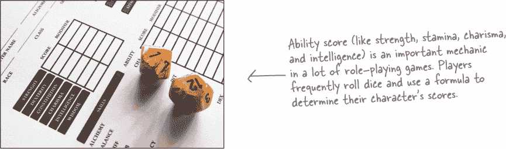
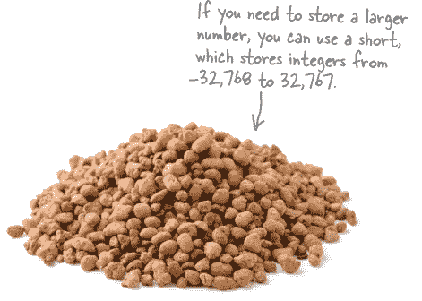
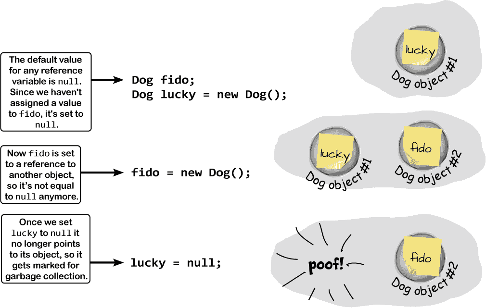

# 第六章：类型和引用：*获取引用*


**没有数据，你的应用程序还能是什么？** 想想看。没有数据，你的程序……嗯，实际上很难想象没有数据写代码。你需要**用户提供的信息**，然后用它来查找或生成新信息返回给他们。事实上，编程中几乎所有的工作都涉及以某种方式**处理数据**。在本章中，你将深入了解 C#的**数据类型**和**引用**，看看如何在程序中处理数据，甚至学习更多关于**对象**的知识（*猜猜看……对象也是数据！*）

# 欧文需要我们的帮助！

欧文是一名游戏主持人——一个非常出色的游戏主持人。他每周在自己家里组织一群人玩各种不同的角色扮演游戏（或者 RPG），像所有优秀的游戏主持人一样，他非常努力地为玩家们保持趣味性。


## 叙事、幻想和机制

欧文是一个特别优秀的叙述者。在过去几个月里，他为他的队伍创造了一个复杂的幻想世界，但他对他们正在玩的游戏机制并不满意。

***我们能找到一种方法帮助欧文改进他的角色扮演游戏吗？***



# 角色卡在纸上存储不同类型的数据

如果你玩过角色扮演游戏，你一定见过角色卡：一张详细记录角色细节、统计数据、背景信息以及其他任何关于角色的笔记的页面。如果你想制作一个类来保存角色卡，你会使用什么类型作为字段？


# 变量的类型决定了它可以存储什么类型的数据。

C#内置了许多**类型**，你会用它们来存储许多不同种类的数据。你已经见过一些最常见的，比如 int、string、bool 和 float。还有一些你还没见过的，它们也会非常有用。

这里有一些你会经常使用的类型。


+   **int** 可以存储从–2,147,483,648 到 2,147,483,647 的任何**整数**。整数没有小数点。


+   **float** 可以存储从±1.5 × 10^(–45)到±3.4 × 10³⁸的**实数**，精度高达 8 位有效数字。


+   **string** 可以存储任意长度的文本（包括空字符串`""`）。


+   **double** 可以存储从±5.0 × 10^(–324)到±1.7 × 10³⁰⁸的**实数**，精度高达 16 位有效数字。当你在处理 XAML 属性时，这是一个非常常见的类型。


+   **bool** 是布尔值——它只能是 true 或 false。你会用它来表示只有两种选项的任何东西：它要么是一种东西，要么是另一种东西，但没有其他的选项。

# C#有几种用于存储整数的类型

C# 有几种不同的整数类型，以及 int。这可能看起来有点奇怪（双关）。为什么有这么多不带小数点的数字类型？对于本书中的大多数程序来说，使用 int 还是 long 并不重要。如果你要编写一个必须跟踪成千上万个整数值的程序，那么选择像 byte 这样的较小整数类型而不是像 long 这样的更大类型可以节省大量内存。

+   ***byte*** 可以存储介于 0 到 255 之间的任何**整数**。

+   ***sbyte*** 可以存储从 –128 到 127 的任何**整数**。

+   ***short*** 可以存储从 –32,768 到 32,767 的任何**整数**。

+   ***long*** 可以存储从 –9,223,372,036,854,775,808 到 9,223,372,036,854,775,807 的任何**整数**。

###### 注意

注意我们说的是“整数”，而不是“整数”？我们尽量小心——我们的高中数学老师总是告诉我们，整数是可以不带分数写出来的任何数字，而整数从 0 开始，不包括负数。



你注意到 byte 只存储正数，而 sbyte 存储负数了吗？它们都有 256 个可能的值。区别在于，像 short 和 long 一样，sbyte 可以有一个负号——这就是为什么它们被称为**有符号**类型（sbyte 中的“s”表示有符号）。就像 byte 是 sbyte 的**无符号**版本一样，还有以“u”开头的 short、int 和 long 的无符号版本：

+   ***ushort*** 可以存储从 0 到 65,535 的任何**整数**。

+   ***uint*** 可以存储从 0 到 4,294,967,295 的任何**整数**。

+   ***ulong*** 可以存储从 0 到 18,446,744,073,709,551,615 的任何**整数**。


## 用于存储非常巨大和非常微小数字的类型

有时浮点数并不够精确。信不信由你，有时候 10³⁸ 不够大，而 10^(-45) 不够小。很多为金融或科学研究编写的程序经常遇到这些问题，所以 C# 提供了不同的**浮点类型**来处理巨大和微小的值：

+   ***float*** 可以存储从 ±1.5 × 10^(-45) 到 ±3.4 × 10³⁸ 的任何数字，具有 6–9 个有效数字。

+   ***double*** 可以存储从 ±5.0 × 10^(-324) 到 ±1.7 × 10³⁰⁸ 的任何数字，具有 15–17 个有效数字。

+   ***decimal*** 可以存储从 ±1.0 × 10^(-28) 到 ±7.9 × 10²⁸ 的任何数字，具有 28–29 个有效数字。当你的程序**需要处理货币或货币**时，始终应该使用 decimal 来存储数字。

###### 注意

**decimal** 类型具有更高的精度（更多有效数字），这就是为什么它适用于金融计算。

# 让我们来谈谈字符串

你已经写了处理**字符串**的代码。那么，字符串到底是什么？

在任何.NET 应用程序中，字符串都是一个对象。它的完整类名是 System.String——换句话说，类名是 String，它位于 System 命名空间中（就像你之前使用的 Random 类一样）。当你使用 C#的**string**关键字时，你正在使用 System.String 对象。实际上，你可以在到目前为止你写的任何代码中用**System.String**替换**string**关键字，它仍然能够工作！（**string**关键字称为*别名*——在你的 C#代码中，**string**和**System.String**意味着相同的东西。）

对于字符串还有两个特殊值：一个空字符串，“”（或者一个没有字符的字符串），和一个 null 字符串，或者一个根本没有设置为任何值的字符串。我们将在本章后面更多地讨论 null。

字符串由字符组成——具体来说，是 Unicode 字符（你将在本书后面学到更多）。有时候你需要存储单个字符，比如`**Q**`或`**j**`或`**$**`，这时你会使用**char**类型。char 的字面值总是在单引号内（'`**x**``'`，'`**3**``'`）。你也可以在引号内包含**转义序列**（例如`'`**\n**`'`表示换行，`'`**\t**`'`表示制表符）。你可以在 C#代码中使用两个字符来编写转义序列，但是你的程序会将每个转义序列存储为单个字符在内存中。

最后，还有一个重要的类型：**object**。如果一个变量的类型是 object，***你可以给它赋任何值***。**object**关键字也是一个别名——它和**System.Object**是一样的。

# 字面值是直接写入你的代码中的值

一个**字面值**是你在代码中直接写入的数值、字符串或其他固定值。你已经使用了大量的字面值——这里是你使用的一些数字、字符串和其他字面值的例子：

```cs
    int number = 15;
    string result = "the answer";
    public bool GameOver = false;
    Console.Write("Enter the number of cards to pick: ");
    if (value == 1) return "Ace";
```

###### 注意

你能在你之前章节中编写的代码中找到所有的字面值吗？最后一条语句有两个字面值。

所以当你键入**int i = 5;**时，**5**是一个字面值。

## 使用后缀为你的字面值指定类型

当你在 Unity 中添加了像这样的语句时，你可能会对**F**感到困惑：

```cs
    InvokeRepeating("AddABall", 1.5F, 1);
```

你是否注意到，如果在字面值 1.5F 和 0.75F 中不加上 F，你的程序将无法构建？这是因为**字面值有类型**。每个字面值都会自动分配一个类型，而 C#有关于如何组合不同类型的规则。你可以亲自看看它是如何工作的。将以下行添加到任何 C#程序中：

```cs
    int wholeNumber = 14.7;
```

当你尝试构建你的程序时，IDE 会在错误列表中显示这个错误：


IDE 告诉你的是字面值 14.7 有一个类型——它是 double 类型。你可以使用后缀来改变它的类型——尝试在末尾加上 F 将其改为 float（14.7F），或者加上 M 将其改为 decimal（14.7M——M 实际上代表“货币”）。错误信息现在说无法转换为 float 或 decimal。添加 D（或者完全不加后缀）错误就消失了。

> **C#假设没有后缀的整数字面值（例如 371）是 int 类型，带有小数点的（例如 27.4）是 double 类型。**

###### 注意

如果您真的想使用保留的关键字作为变量名，请在其前面加上@，但这是编译器允许您接近保留字的最近方式。如果您愿意，也可以用非保留名称做这个。

# 变量就像一个带走的数据杯

您的所有数据都占用内存空间。（还记得上一章的堆吗？）因此，每当在程序中使用字符串或数字时，您都需要考虑需要多少空间。这就是您使用变量的原因之一。它们让您在内存中预留足够的空间来存储数据。

###### 注意

并非所有数据最终都会在堆上结束。值类型通常将其数据保存在称为堆栈的内存的另一个部分中。您将在本书后面详细了解这一点。

想象一个变量就像是一个杯子，你把数据放进去。C#使用各种不同类型的杯子来存储不同类型的数据。就像咖啡店里不同大小的杯子一样，变量也有不同大小。


## 使用 Convert 类来探索位和字节

***转换这个！***

您一直听说编程是关于 1 和 0。.NET 有一个**静态 Convert 类**，用于在不同的数值数据类型之间进行转换。让我们使用它来看看位和字节如何工作的示例。

位是单个的 1 或 0。字节是 8 位，所以字节变量存储一个 8 位数，这意味着它是一个可以用最多 8 位表示的数字。这是什么样子？让我们使用 Convert 类将一些二进制数转换为字节：

```cs
 Convert.ToByte("10111", 2) // returns 23
 Convert.ToByte("11111111", 2); // returns 255
```

###### 注意

Convert.ToByte 的第一个参数是要转换的数字，第二个是其进制。二进制数是基数 2。

字节可以存储 0 到 255 之间的数字，因为它们使用 8 位内存——8 位数字是二进制数 0 到 11111111（或十进制 0 到 255）。

short 是一个 16 位值。让我们使用 Convert.ToInt16 将二进制值 111111111111111（15 个 1）转换为 short。int 是一个 32 位值，所以我们将使用 Convert.ToInt32 将 31 个 1 转换为 int：

```cs
 Convert.ToInt16("111111111111111", 2); // returns 32767
 Convert.ToInt32("1111111111111111111111111111111", 2); // returns 2147483647
```

# 其他类型也有不同的大小

具有小数位的数字与整数存储方式不同，不同的浮点类型占用不同数量的内存。您可以使用**float**处理大多数具有小数位的数字，它是存储小数的最小数据类型。如果需要更精确，请使用**double**。如果您编写的是一个存储货币值的财务应用程序，您应该始终使用**decimal**类型。

哦，还有一件事：***不要用 double 来处理货币或货币，只用 decimal***。


我们已经谈到字符串，所以你知道 C# 编译器还可以处理**字符和非数字类型**。char 类型用于存储一个字符，而 string 用于“串”在一起的多个字符。字符串对象没有固定大小——它会扩展以容纳所需存储的数据量。布尔数据类型用于存储 true 或 false 值，就像你为你的 `**if**` 语句使用的那样。


> 不同的浮点类型占用不同的内存：float 最小，decimal 最大。

# 5 磅的袋子装下了 10 磅的数据


当你将变量声明为一种类型时，C# 编译器**分配**（或保留）所有存储最大值所需的内存。即使值远远不接近你声明的类型的上界，编译器也会看到它的杯子，而不是内部的数字。因此，这不会起作用：

```cs
 int leaguesUnderTheSea = 20000;
 short smallerLeagues = leaguesUnderTheSea;
```

20,000 可以毫无问题地放入一个 `short` 类型中。但是因为 `**leaguesUnderTheSea**` 被声明为一个 int，C# 会看到它是一个 int 大小，并认为它太大，无法放入一个 short 容器。编译器不会在你飞行时进行这些转换。你需要确保你使用正确的类型来处理数据。


# 强制转换允许你复制那些 C# 不能自动转换为另一种类型的值

让我们看看当你尝试将一个小数值分配给一个整型变量时会发生什么。

***这样做！***

1.  创建一个新的控制台应用程序项目，并将此代码添加到 Main 方法中：

    ```cs
          float myFloatValue = 10;
          int myIntValue = myFloatValue;
          Console.WriteLine("myIntValue is " + myIntValue);
    ```

    ###### 注意

    **隐式转换意味着 C# 有一种方式可以自动将一个值转换为另一种类型而不丢失信息。**

1.  试着编译你的程序。你应该会遇到与之前看到的相同的 CS0266 错误：

    

    仔细观察错误消息的最后几句话：“你缺少一个强制转换？”这是 C# 编译器为你提供的非常有用的提示，告诉你如何解决这个问题。

1.  通过**强制转换**将小数转换为整型来消除错误。你这样做的方法是添加你想要转换的类型的括号：`**(int)**`。一旦你将第二行更改为看起来像这样，你的程序就会编译并运行：

    

    ###### 注意

    **当你将一个浮点值强制转换为整型时，它会将值向下取整到最接近的整数。**

## 发   那么，发生了什么？

C# 编译器不会允许你将一个值分配给一个变量，如果它的类型错误——即使这个变量可以很好地容纳这个值！事实证明，大量的错误都是由于类型问题引起的，而**编译器正在帮助**通过引导你朝正确方向迈进。当你使用强制转换时，你基本上是在告诉编译器，你知道类型不同，并承诺在这个特定实例中，将数据塞入新的变量是可以的。

## 当你强制转换一个值太大的时候，C# 会调整它以适应它的新容器

你已经看到了十进制可以转换为整数。其实*任何*数字都可以转换为*任何其他*数字。但这并不意味着***数值***在转换过程中保持不变。假设你有一个整数变量设置为 365。如果你将它转换为字节变量（最大值为 255），不会报错，而是将数值**环绕**。256 转换为字节将具有值为 0，25 将转换为 1，258 为 2，以此类推，直到 365，最终变为**109**。一旦再次达到 255，转换值将“环绕”回零。

如果您使用+（或`*****`，`**/**`或`**-**`）来连接两种不同的数值类型，运算符会**自动将**较小的类型转换为较大的类型。这里有一个例子：

```cs
 int myInt = 36;
 float myFloat = 16.4F;
 myFloat = myInt + myFloat;
```

由于整数可以容纳在浮点数中，但浮点数不能容纳在整数中，因此+运算符在将`**myInt**`添加到`**myFloat**`之前将`**myInt**`转换为浮点数。

###### 注意

**您可以在此处阅读有关不同 C#值类型的更多信息——这值得一看：** [`docs.microsoft.com/zh-cn/dotnet/csharp/language-reference/keywords/value-types`](https://docs.microsoft.com/zh-cn/dotnet/csharp/language-reference/keywords/value-types)。


**是的！当您连接字符串时，C#会转换值。**

当您使用+运算符将字符串与另一个值组合时，称为**连接**。当您将字符串与 int、bool、float 或其他值类型连接时，它会自动转换该值。这种转换与强制转换不同，因为在底层它实际上调用了值的 ToString 方法……并且.NET 保证的一件事情是**每个对象都有一个 ToString 方法**，用于将其转换为字符串（但这取决于各个类是否能够产生有意义的字符串）。

###### 注意

请自行**测试**！

如何“环绕”转换数字并没有什么神秘的——您可以自己做。只需打开任何带有 Mod 按钮的计算器应用程序（执行模数计算——有时在科学模式下），并计算 365 Mod 256。

# C#会自动进行一些转换

有两个重要的转换不需要您进行强制转换。第一个是在使用算术运算符时自动进行的转换，就像这个例子中所示：


C#另一种自动为您转换类型的方式是当您使用+运算符**连接**字符串（这意味着将一个字符串粘贴到另一个字符串的末尾，就像您一直在使用的消息框一样）。当您使用+将字符串与另一种类型连接时，它会自动为您转换数字为字符串。这里有一个例子——尝试将这些行添加到任何 C#程序中。前两行没问题，但第三行无法编译：

```cs
   long number = 139401930;
   string text = "Player score: " + number;
   text = number;
```

在第三行上，C#编译器会给您报错：


ScoreText.text 是一个字符串字段，因此当你使用 + 运算符连接一个字符串时，它会正常分配值。但是当你尝试直接将`**x**`赋给它时，它无法自动将长整型值转换为字符串。你可以通过调用它的 ToString 方法将其转换为字符串。

# 调用方法时，参数需要与参数类型兼容

在上一章中，你使用 Random 类来从 1 到（但不包括）5 中选择一个随机数，用来选择一张扑克牌的花色：

```cs
 int value = random.Next(1, 5);
```

尝试将第一个参数从`**1**`更改为`**1.0**`：


你正在向一个期望接收整数值的方法传递一个双精度浮点数文字。所以你不应该对编译器无法构建你的程序感到惊讶——相反，它会显示一个错误：


有时候 C# 可以自动进行转换。它不知道如何将双精度浮点数转换为整数（例如将 1.0 转换为 1），但它确实知道如何将整数转换为双精度浮点数（例如将 1 转换为 1.0）。更具体地说：

+   C# 编译器知道如何将整数转换为浮点类型。

+   它知道如何将一个整数类型转换为另一个整数类型，或将一个浮点类型转换为另一个浮点类型。

+   但是它只能在要转换的类型大小与或小于要转换为的类型时进行这些转换。因此，它可以将整数转换为长整数或浮点数转换为双精度浮点数，但它无法将长整数转换为整数或双精度浮点数转换为浮点数。

但 Random.Next 并不是唯一一个如果你试图向其传递类型与参数不匹配的变量将会得到编译器错误的方法。*所有*方法都会这样做，***甚至是你自己写的方法***。将此方法添加到控制台应用程序：

```cs
public int MyMethod(bool add3) {
   int value = 12;

   if (add3) 
      value += 3;
   else 
      value -= 2;

   return value;

}
```

> **当编译器给出“无效参数”错误时，意味着你试图调用一个方法，并且变量类型与方法参数不匹配。**

尝试传递一个字符串或长整数给它——你将会得到一个 CS1503 错误，告诉你它无法将参数转换为布尔值。有些人很难记住**参数和参数的区别**。因此，为了明确起见：

**参数是你在方法中定义的内容。参数是你传递给它的内容。你可以将一个字节参数传递给具有整数参数的方法。**

## 欧文不断改进他的游戏…

优秀的游戏主持人致力于为玩家创造最佳体验。欧文的玩家们即将开始一场全新的战役，使用全新的角色，他认为对他们的能力值分配公式进行一些调整可能会让事情更有趣。


## …但是试错方法可能会耗费时间。

欧文一直在尝试调整能力值计算的方法。他相当确定自己的公式大部分是正确的——但他真的很想调整这些数字。


Owen 喜欢总体公式：4d6 掷骰、除法、减法、向下取整、使用最小值……但他不确定实际数字是否正确。


# 让我们帮助 Owen 实验能力分数

在下一个项目中，你将构建一个 .NET Core 控制台应用程序，Owen 可以使用它测试不同值的能力分数公式，以查看它们如何影响结果分数。这个公式有**四个输入**：*起始的 4d6 掷骰结果*，被这个结果除的*除数*值，要加到这个除法结果的*添加量*值，以及如果结果太小要使用的*最小值*。

Owen 将每个四个输入都输入到应用程序中，并且应用程序将使用这些输入计算能力分数。他可能希望测试一系列不同的值，因此我们将通过重复要求新值来使用应用程序，直到他退出应用程序为止，同时跟踪每次迭代中使用的值，并使用这些先前的输入作为下一次迭代的**默认值**。

当 Owen 运行应用程序时，它看起来是这样的：


**这个项目比你之前构建的控制台应用程序要大一点，因此我们将分几步来解决它。首先，你将磨一磨你的铅笔，理解计算能力分数的代码，然后进行一个练习，为应用程序编写其余的代码，最后你将揭开代码中的一个错误。*让我们开始吧！***

# 使用 C# 编译器找到有问题的代码行

创建一个名为 AbilityScoreTester 的新 .NET Core 控制台应用程序项目。然后**添加 AbilityScoreCalculator 类**并使用“磨笔刀”练习中的代码。如果你正确输入了代码，你应该会看到一个 C# 编译器错误：


每当 C# 编译器给出错误时，请仔细阅读。它通常会有一个提示，可以帮助你找到问题的根源。在这种情况下，它确切地告诉我们出了什么问题：它无法在没有强制转换的情况下将 double 转换为 int。`**divided**`变量被声明为 double，但是 C# 不允许你将其添加到像 AddAmount 这样的 int 字段中，因为它不知道如何进行转换。

当 C# 编译器询问“你是否缺少一个强制类型转换？”时，它实际上是在提示你，在将双精度变量`**divided**`加到整型字段 AddAmount 之前，你需要显式地进行强制类型转换。

## 添加一个强制类型转换以使 AbilityScoreCalculator 类编译通过...

现在你知道问题出在哪里了，你可以**添加一个强制类型转换**来修复 AbilityScoreCalculator 中有问题的代码行。这是生成“无法隐式转换类型”错误的代码行：

```cs
   int added = AddAmount += divided;
```

它导致该错误，因为`**AddAmount += divided**`***返回一个 double 值***，无法赋给 int 变量`**added**`。

你可以通过将`**divided**`**强制转换为一个 int**来修复它，这样将它添加到 AddAmount 就会返回另一个 int。修改代码行以将`**divided**`更改为`**(int)**``**divided**`：


添加该转换还解决了欧文能力评分公式的缺失部分：

**向最近的整数舍入*

当你将双精度数强制转换为整数时，C# 会将其向下舍入——例如 `**(int)19.7431D**` 给了我们 `**19**`。通过添加该转换，你正在添加能力评分公式中缺失的步骤。

## …但是仍然存在一个 bug！

我们还没有完成！你解决了编译器错误，所以现在项目可以构建了。但是尽管 C# 编译器会接受它，***仍然存在一个问题***。你能发现那行代码中的 bug 吗？

###### 注意

看起来我们还不能填写“磨你的铅笔”答案！


**欧文，你是对的。代码中有一个 bug。**

欧文想尝试不同的值来使用他的能力评分公式，所以我们使用循环使应用程序一遍又一遍地请求这些值。

为了让欧文更容易一次只更改一个值，我们在应用程序中包含了一个功能，记住他输入的最后值，并将它们作为默认选项呈现出来。我们通过在内存中保持 AbilityScoreCalculator 类的实例，并在每次`**while**`循环的迭代中更新其字段来实现该功能。

但是应用程序出了些问题。它记住了大部分的值，但对于“添加数量”的默认值记住了错误的数字。在第一次迭代中，欧文输入了 5，但它给了他 10 作为默认选项。然后他输入了 7，但它给了 12 作为默认值。出了什么问题？

## 现在我们终于可以修复欧文的 bug

现在你知道发生了什么，你可以**修复 bug**——结果证明只需要做一个非常小的改变。你只需将语句更改为使用 + 而不是 +=：

```cs
int added = AddAmount + (int)divided;
```

###### 注意

将 += 更改为 + 以防止这行代码更新“添加”的变量并修复 bug。就像福尔摩斯会说的，“这是基本的。”

###### 注意

现在我们找到了问题，我们终于可以提供“磨你的铅笔”解决方案了。


###### 注意

试试这个！

尝试将这个 `**if/else**` 语句添加到控制台应用程序中：


接下来，**将浮点文字更改为双精度数**（记住，诸如 0.1 的文字默认为双精度数）：


这真的很奇怪。警告移到了`**if**`语句的第一行。尝试运行程序。等等，那不可能对！它向控制台打印了 `**They aren't equal**`。0.1 + 0.2 怎么会不等于 0.3？

现在再做一件事。将 0.3 更改为 0.30000000000000004（在 3 和 4 之间有 15 个零）。现在它再次打印 `**They’re equal**`。所以显然 0.1D 加上 0.2D 等于 0.30000000000000004D。

###### 注意

等等，什么？！


###### 注意

**没错。十进制比双精度数或浮点数具有更高的精度，因此它避免了 0.30000000000000004 问题。**

一些浮点数类型——不仅在 C#中，在大多数编程语言中！——可能会给你带来***罕见***的奇怪错误。这太奇怪了！0.1 + 0.2 怎么会是 0.30000000000000004 呢？

事实证明，有一些数字无法被双精度浮点数准确表示——这与它们以二进制数据（在内存中的 0 和 1）存储方式有关。例如，`.1D`并不是*确切*的`.1`。尝试将`**.1D * .1D**`相乘——你得到的是 0.010000000000000002，而不是 0.01。但是`**.1M * .1M**`会得到正确的答案。这就是为什么浮点数和双精度浮点数在许多场景中非常有用（比如在 Unity 中定位游戏对象）。如果你需要更严格的精度——比如财务应用程序处理金钱——那么应该使用十进制类型。

# 使用引用变量来访问你的对象

当你创建一个新对象时，你使用`**new**`语句来实例化它，比如在上一章的程序末尾中使用的`**new Guy()**`——`**new**`语句在堆上创建了一个新的 Guy 对象。但是你仍然需要一种方式来*访问*该对象，这就是`**joe**`这样的变量发挥作用的地方：`**Guy joe = new Guy()**`。让我们深入了解一下这其中的具体情况。

`**new**`语句创建实例，但仅仅创建实例是不够的。***你需要一个对象的引用***。因此，你创建了一个**引用变量**：一个 Guy 类型的变量，例如`**joe**`。因此，`**joe**`是你创建的新 Guy 对象的一个引用。每当你想使用特定的 Guy 时，你可以通过名为`**joe**`的引用变量来引用它。

当你有一个对象类型的变量时，它是一个引用变量：指向特定对象的引用。我们来确保术语使用正确，因为我们会经常用到。我们将使用上一章节“Joe 和 Bob”程序的前两行：


## 引用就像对象的便利贴

在你的厨房里，你可能有盐和糖的容器。如果你交换它们的标签，可能会让人觉得很恶心——尽管你改变了标签，但容器里的内容还是一样的。***引用就像标签。*** 你可以移动标签并将其指向不同的东西，但真正决定方法和数据可用性的是**对象**本身，而不是引用本身——你可以像复制值一样**复制引用**。


> **引用就像是你的代码用来谈论特定对象的标签。你可以用它来访问字段和调用对象的方法。**

我们在那个对象上贴了很多便利贴！在这种情况下，有很多不同的引用指向同一个 Guy 对象——因为很多不同的方法用它来做不同的事情。每个引用在其上下文中都有一个不同的名称，这是有意义的。

这就是为什么有***多个引用指向同一个实例***非常有用。所以你可以说`**Guy dad = joe**`，然后调用`**dad.GiveCash()**`（这是 Joe 的孩子每天都在做的事）。如果你想编写与对象一起工作的代码，你需要一个指向该对象的引用。如果没有这个引用，你就无法访问对象。

## 如果没有更多的引用，你的对象将被垃圾回收

如果一个对象的所有标签都被移除，程序将无法再访问该对象。这意味着 C#可以标记该对象进行**垃圾回收**。这时，C#会清除任何未被引用的对象，并回收这些对象占用的内存，以便程序使用。

1.  **这里有一些创建对象的代码。**

    简要回顾一下我们讨论的内容：当使用`**new**`语句时，你在告诉 C#创建一个对象。当你把像`**joe**`这样的引用变量赋给该对象时，就像是在它上面贴了一张新的便签。

    ```cs
       Guy joe = new Guy() { Cash = 50, Name = "Joe" };
    ```

    

1.  **现在让我们创建我们的第二个对象。**

    一旦我们这样做了，我们将有两个 Guy 对象实例和两个引用变量：一个变量（`**joe**`）指向第一个 Guy 对象，另一个变量（`**bob**`）指向第二个。

    ```cs
       Guy bob = new Guy() { Cash = 100, Name = "Bob" };
    ```

    

1.  **让我们把对第一个 Guy 对象的引用改为指向第二个 Guy 对象。**

    仔细看看当你创建一个新的 Guy 对象时你在做什么。你正在取一个变量，并使用=赋值运算符来设置它——在这种情况下，设置为`**new**`语句返回的引用。这种赋值之所以有效，是因为**你可以像复制值一样复制引用**。

    所以让我们继续复制那个值：

    ```cs
     joe = bob;
    ```

    这告诉 C#让`**joe**`指向与`**bob**`指向的同一个对象。现在`**joe**`和`**bob**`变量**都指向同一个对象**。

    

1.  **再也没有指向第一个 Guy 对象的引用了……所以它被垃圾回收了。**

    现在`joe`指向与`bob`相同的对象，不再有指向原来的`Guy`对象的引用了。那么会发生什么？C#标记该对象进行垃圾回收，并***最终***将其销毁。噗——它消失了！

    ###### 注意

    CLR 跟踪每个对象的所有引用，当最后一个引用消失时，它标记为可删除。但它可能有其他事情要做，所以对象可能会保留几毫秒甚至更长时间！

    

> **要使对象保留在堆中，必须引用它。当对对象的最后一个引用消失后一段时间，该对象也会消失。**


# 多个引用及其副作用

当你开始移动引用变量时，你必须小心。很多时候，看起来你只是将一个变量指向一个不同的对象。在这个过程中，你可能会移除对另一个对象的所有引用。这不是件坏事，但可能不是你打算的。看一看：

1.  ```cs
    Dog rover = new Dog();
    rover.Breed = "Greyhound";
    ```

    

1.  ```cs
    Dog fido = new Dog();
    fido.Breed = "Beagle";
    Dog spot = rover;
    ```

    

1.  ```cs
    Dog lucky = new Dog();
    lucky.Breed = "Dachshund";
    fido = rover;
    ```

    

## 两个引用意味着可以改变同一个对象的数据的两个变量

除了失去对象的所有引用外，当你有多个引用指向一个对象时，你可能会无意中改变该对象。换句话说，一个引用可能会***改变***该对象，而另一个引用则***不知道***发生了什么变化。让我们看看这是如何工作的。

***做这个！***


现在，继续运行你的程序。这是你将看到的：

```cs
You pressed 4
My name is Lucinda
My ears are 4321 inches tall.

You pressed 1
Calling lloyd.WhoAmI()
My name is Lucinda
My ears are 4321 inches tall.

You pressed 2
Calling lucinda.WhoAmI()
My name is Lucinda
My ears are 4321 inches tall.
```

###### 注意

程序正常运行... 直到按下 4。一旦这样做，按 1 或 2 打印相同的输出 - 按 3 交换引用不再起作用。

在按下 4 并运行你添加的新代码之后，`**lloyd**`和 lucinda 变量都**包含对第二只大象对象的相同引用**。按 1 调用 lloyd.WhoAmI 将打印与按 2 调用`**lucinda**`.WhoAmI 完全相同的消息。交换它们不会有任何差别，因为你在交换两个相同的引用。

# 对象使用引用来彼此交谈

到目前为止，你已经看到表单通过使用引用变量调用它们的方法和检查它们的字段来与对象交谈。对象也可以使用引用调用彼此的方法。事实上，没有什么是表单可以做而你的对象不能做的，因为**你的表单只是另一个对象**。当对象彼此交谈时，它们拥有的一个有用关键字是`**this**`。任何时候一个对象使用`**this**`关键字，它都在引用自己 - 它是一个指向调用它的对象的引用。让我们通过修改大象类以便实例可以调用彼此的方法来看看它是什么样子。


1.  **添加一个让大象听到消息的方法。**

    让我们向大象类添加一个方法。它的第一个参数是另一个大象对象发送的消息。第二个参数是发送消息的大象对象：

    ***做这个！***

    ```cs
     public void HearMessage(string message, Elephant whoSaidIt) {
          Console.WriteLine(Name + " heard a message");
          Console.WriteLine(whoSaidIt.Name + " said this: " + message);
     }
    ```

    当它被调用时，它看起来是这样的：

    ```cs
     lloyd.HearMessage("Hi", lucinda);
    ```

    我们调用了`**lloyd's**` HearMessage 方法，并传递了两个参数：字符串`**"Hi"**`和 Lucinda 对象的引用。该方法使用其`**whoSaidIt**`参数来访问传入的任何大象的 Name 字段。

1.  **添加一个让大象发送消息的方法。**

    现在让我们向大象类添加一个 SpeakTo 方法。它使用一个特殊的关键字：`**this**`。这是一个让对象获取对自己的引用的关键字。

    ```cs
    public void SpeakTo(Elephant whoToTalkTo, string message) {
        whoToTalkTo.HearMessage(message, this);
    }
    ```

    ###### 注意

    大象的 SpeakTo 方法使用“this”关键字将自己的引用发送给另一个大象。

    让我们更仔细地看看发生了什么。

    当我们调用卢辛达对象的 SpeakTo 方法时：

    ```cs
     lucinda.SpeakTo(lloyd, "Hi, Lloyd!");
    ```

    它这样调用了 Lloyd 对象的 HearMessage 方法：

    ```cs
    whoToTalkTo.HearMessage("Hi, Lloyd!", this);
    ```

    ###### 注意

    卢辛达使用 whoToTalkTo（它引用了 Lloyd）来调用 HearMessage。

    ###### 注意

    this 被替换为对卢辛达对象的引用。

    ###### 注意

    ```cs
    *[a reference to Lloyd]*.HearMessage("Hi, Lloyd!", [*a reference to Lucinda*]);
    ```

1.  **调用新方法。**

    在 Main 方法中再添加一个 `**else if**` 块，让卢辛达对象向 Lloyd 对象发送一条消息：

    ```cs
    else if (input == '4')
    {
        lloyd = lucinda;
        lloyd.EarSize = 4321;
        lloyd.WhoAmI();
    }
    else if (input == '5')
    {
        lucinda.SpeakTo(lloyd, "Hi, Lloyd!");
    }
    else
    {
        return;
    }
    ```

    现在运行你的程序并按 5\. 你应该看到以下输出：

    ```cs
    You pressed 5
    Lloyd heard a message
    Lucinda said this: Hi, Lloyd!
    ```

1.  **使用调试器理解正在发生的事情。**

    在你刚刚添加到 Main 方法的语句上设置一个断点：

    

    1.  运行你的程序并按 5。

    1.  当它触发断点时，使用调试 >> 逐步进入（F11）来进入 SpeakTo 方法。

    1.  添加一个监视器来显示你所处的“大象”对象的名称。你当前位于“卢辛达”对象内部，这是有道理的，因为主方法调用了 lucinda.SpeakTo。

    1.  悬停在行尾的 `**this**` 关键字上并展开它。这是对卢辛达对象的引用。

        

        悬停在 `**whoToTalkTo**` 上并展开它 —— 它是对 Lloyd 对象的引用。

    1.  SpeakTo 方法只有一条语句 —— 它调用 whoToTalkTo.HearMessage。进入它。

    1.  现在你应该位于 HearMessage 方法内部。再次检查你的监视器 —— 现在 Name 字段的值是“Lloyd” —— 卢辛达对象调用了 Lloyd 对象的 HearMessage 方法。

    1.  悬停在 `**whoSaidIt**` 上并展开它。这是对卢辛达对象的引用。

完成代码的逐步执行。花几分钟真正理解发生了什么。

> **“this” 关键字让对象获得对自身的引用。**

# 数组保存多个值

###### 注意

字符串和数组不同于本章中看到的其他数据类型，因为它们是唯一没有固定大小的数据类型（想一想这个）。

如果你必须跟踪大量相同类型的数据，比如价格列表或一组狗，你可以用一个 **数组**。数组的特殊之处在于它是作为一个对象对待的**一组变量**。数组为你提供了一种存储和修改多个数据而无需单独跟踪每个变量的方法。当你创建一个数组时，你像声明任何其他变量一样，使用一个名称和一个类型 —— 但是 **类型后面跟着方括号**：

```cs
bool[] myArray;
```

使用 `**new**` 关键字创建数组。让我们创建一个有 15 个布尔元素的数组：

```cs
myArray = new bool[15];
```

使用方括号设置数组中的一个值。该语句通过使用方括号并指定 **索引** 4，将 `**myArray**` 的第五个元素的值设置为 `**true**`。它是第五个，因为第一个是 `**myArray[0]**`，第二个是 `**myArray[1]**`，依此类推：

```cs
myArray[4] = false;
```

## 像普通变量一样使用数组中的每个元素

###### 注意

**使用`new`关键字来创建数组，因为它是一个对象——所以数组变量是一种引用变量。在 C#中，数组是从零开始的，这意味着第一个元素的索引是 0。**

当你使用数组时，首先需要**声明一个引用变量**指向数组。然后你需要使用`**new**`语句**创建数组对象**，指定你想要的数组大小。然后你可以**设置数组中的元素**。下面是一个声明并填充数组的示例代码——以及在执行时堆上的情况。数组中的第一个元素的**索引**是 0。

```cs
**// declare a new 7-element decimal array**
decimal[] prices = new decimal[7];
prices[0] = 12.37M;
prices[1] = 6_193.70M;
**// we didn't set the element**
**// at index 2, it remains**
**// the default value of 0**
prices[3] = 1193.60M;
prices[4] = 58_000_000_000M;
prices[5] = 72.19M;
prices[6] = 74.8M;
```


# 数组可以包含引用变量

就像你创建数字或字符串数组一样，你也可以创建一个**对象引用的数组**。数组并不关心它们存储的变量类型；这由你决定。所以你可以有一个 int 数组，或者一个 Duck 对象数组，都没有问题。

下面是创建七个 Dog 变量数组的代码。初始化数组的行仅创建引用变量。由于只有两行`**new Dog()**`，实际只创建了两个 Dog 类的实例。

> **当你设置或检索数组中的元素时，方括号中的数字称为索引。数组中的第一个元素的索引是 0。**


###### 注意

数组的长度

你可以使用数组的 Length 属性来查找数组中的元素数量。所以如果你有一个名为“prices”的数组，那么你可以使用 prices.Length 来查找它的长度。如果数组中有七个元素，那么它将给出 7——这意味着数组元素从 0 到 6 编号。

# null 意味着引用指向空值

还有一个重要的关键字，你会在处理对象时使用它。当你创建一个新的引用并且没有设置它时，它有一个值。它最初被设置为`**null**`，这意味着**它没有指向任何对象**。让我们仔细看看这个：



###### 注意

**是的。null 关键字非常有用。**

在典型程序中，你会看到`**null**`被使用的几种方式。最常见的方式是确保一个引用指向一个对象：

```cs
 **if (lloyd == null) {**
```

如果`**lloyd**`引用被设置为`**null**`，那个测试将返回`**true**`。

另一种你会看到`**null**`关键字的用法是当你***希望***你的对象被垃圾收集时。如果你有一个对象的引用并且你完成了对对象的使用，将引用设置为`**null**`将立即将其标记为可回收（除非它在其他地方有其他引用）。

###### 注意

如果你从未玩过 Go Fish，请花几分钟阅读规则。我们稍后会用到它们！

**即使我们不为视频游戏编写代码，我们仍然可以从桌面游戏中学到很多。**

很多我们的程序依赖于**随机数**。例如，你已经使用了 Random 类为几个应用程序生成随机数。我们大多数人在真实世界中并没有太多真正的随机数经验……除非我们玩游戏。掷骰子、洗牌、旋转转盘、抛硬币……这些都是**随机数生成器**的绝佳示例。Random 类是.NET 的随机数生成器——你将在许多程序中使用它，而你在玩桌面游戏时积累的随机数使用经验将使你更容易理解它的工作原理。


1.  **创建一个新的控制台应用**—所有这些代码都将放在 Main 方法中。首先创建一个 Random 的新实例，生成一个随机整数，并将其写入控制台：

    ```cs
     Random random = new Random();
     int randomInt = random.Next();
     Console.WriteLine(randomInt);
    ```

    指定一个**最大值**来获取从 0 到最大值（但不包括最大值）的随机数。最大值为 10 将生成从 0 到 9 的随机数：

    ```cs
     int zeroToNine = random.Next(10);
     Console.WriteLine(zeroToNine);
    ```

1.  现在**模拟掷骰子**。你可以指定一个最小值和一个最大值。最小值为 1，最大值为 7 将生成从 1 到 6 的随机数：

    ```cs
     int dieRoll = random.Next(1, 7);
     Console.WriteLine(dieRoll);
    ```

    

1.  **NextDouble 方法**生成随机的双精度值。将鼠标悬停在方法名上可以看到工具提示——它生成从 0.0 到 1.0 的浮点数：

    ```cs
     double randomDouble = random.NextDouble();
    ```

    

    你可以使用**乘以一个随机双精度数**来生成更大的随机数。所以，如果你想要一个从 1 到 100 的随机双精度值，就将随机双精度数乘以 100：

    ```cs
     Console.WriteLine(randomDouble * 100);
    ```

    使用**强制类型转换**将随机双精度数转换为其他类型。试着运行这段代码多次——你会看到浮点数和十进制值之间的微小精度差异。

    ```cs
     Console.WriteLine((float)randomDouble * 100F);
     Console.WriteLine((decimal)randomDouble * 100M);
    ```

1.  使用最大值为 2 来**模拟抛硬币**。这将生成一个随机值，要么是 0，要么是 1。使用特殊的**Convert 类**，它有一个静态的 ToBoolean 方法，可以将其转换为布尔值：

    ```cs
     int zeroOrOne = random.Next(2);
     bool coinFlip = Convert.ToBoolean(zeroOrOne);
     Console.WriteLine(coinFlip);
    ```

# 欢迎来到 Sloppy Joe's Budget House o' Discount Sandwiches！

Sloppy Joe 有一堆肉、大量面包和比你能摇动的棍子更多的调味品。但他没有菜单！你能建立一个每天为他制作新的*随机*菜单的程序吗？当然可以……借助**新的 WPF 应用**、一些数组和几种有用的新技术。

###### 注意

去做这件事！

1.  **向项目添加一个新的 MenuItem 类，并添加其字段。**

    看一下类图。它有四个字段：一个 Random 的实例和三个数组，用来保存各种三明治的部分。这些数组字段使用了**集合初始化器**，通过将项放在大括号内来定义数组中的项目。

    

    ```cs
    class MenuItem
    {
        public Random Randomizer = new Random();

        public string[] Proteins = { "Roast beef", "Salami", "Turkey",
                    "Ham", "Pastrami", "Tofu" };
        public string[] Condiments = { "yellow mustard", "brown mustard",
                    "honey mustard", "mayo", "relish", "french dressing" };
        public string[] Breads = { "rye", "white", "wheat", "pumpernickel", "a roll" };

               public string Description = "";
               public string Price;
    }
    ```

1.  **将 GenerateMenuItem 方法添加到 MenuItem 类中。**

    此方法使用了你已经多次见过的 Random.Next 方法，从 Proteins、Condiments 和 Breads 字段的数组中随机选择项目，并将它们连接成一个字符串。

    ```cs
    public void Generate()
    {
        string randomProtein = Proteins[Randomizer.Next(Proteins.Length)];
        string randomCondiment = Condiments[Randomizer.Next(Condiments.Length)];
        string randomBread = Breads[Randomizer.Next(Breads.Length)];
        Description = randomProtein + " with " + randomCondiment + " on " + randomBread;

        decimal bucks = Randomizer.Next(2, 5);
        decimal cents = Randomizer.Next(1, 98);
        decimal price = bucks + (cents * .01M);
       Price = price.ToString("c");
    }
    ```

    ###### 注意

    **该方法通过将两个随机整数转换为小数，生成介于 2.01 和 5.97 之间的随机价格。仔细看看最后一行——它返回** `**price.ToString("c")**`。ToString 方法的参数是一个格式。在这种情况下，`**"c"**` **格式告诉 ToString 使用本地货币格式化值：如果你在美国，你会看到$；在英国，你会得到£；在欧盟，你会看到€等。**

    ###### 注意

    **前往 Visual Studio for Mac 学习者指南，了解该项目的 macOS 版本。**

1.  **创建 XAML 以布局窗口。**

    你的应用程序将在窗口中显示随机菜单项，其中包含两列：一列宽的用于菜单项，一列窄的用于价格。网格中的每个单元格都有一个 TextBlock 控件，其 FontSize 设置为`**18px**`，除了底部行，它只有一个右对齐的 TextBlock，跨越了两列。窗口的标题是“欢迎来到 Sloppy Joe's Budget House o’ Discount Sandwiches！”它的高度为`**350**`，宽度为`**550**`。网格有一个边距为`**20**`。

    我们在前两个 WPF 项目中学到的 XAML 基础上构建。您可以在设计器中布局它，手动输入它，或者两者兼而有之。

    

1.  **为您的 XAML 窗口添加代码后台。**

    菜单是由一个名为 MakeTheMenu 的方法生成的，你的窗口在调用 InitializeComponent 后立即调用它。它使用一个 MenuItem 类的数组来生成菜单中的每一项。我们希望前三个项目是普通菜单项。接下来的两个只在贝果上提供。最后一个是特殊项目，具有自己的一套成分。

    

1.   **运行您的程序，看看新生成的随机菜单。**

哦...出了点问题。菜单上的价格都一样，并且菜单项很奇怪——前三个都一样，接下来两个也是，而且它们似乎都有相同的蛋白质。出了什么问题？

###### 注意

如果您的计算机速度足够快，则您的程序可能不会遇到此问题。如果在较慢的计算机上运行它，您将看到它。

.NET 的 Random 类实际上是一个**伪随机数**生成器，这意味着它使用数学公式生成一系列数字，可以通过特定的统计测试来验证其随机性。这使得它们足够好用于我们构建的任何应用（但不要将其作为依赖真正随机数的安全系统的一部分！）。这就是为什么这个方法叫做 Next —— 你得到的是序列中的下一个数字。公式从一个“种子值”开始——它使用该值找到序列中的下一个值。当你创建 Random 的一个新实例时，它使用系统时钟来“种子”公式，但你也可以提供自己的种子。试试使用 C# 交互窗口多次调用 `**new**` `**Random(12345).Next();**`。你告诉它使用相同的种子值（12345）创建一个新的 Random 实例，因此 Next 方法每次都会给你相同的“随机”数。

当你看到一堆不同的 Random 实例给出相同的值时，那是因为它们的种子值接近，系统时钟没有改变时间，所以它们都有相同的种子值。那么我们怎么解决这个问题呢？通过将 Randomizer 字段设置为静态，这样所有的 MenuItem 就共享一个 Random 实例：

```cs
public **static** Random Randomizer = new Random();
```

再次运行你的程序——现在菜单将被随机化。


