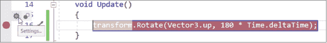
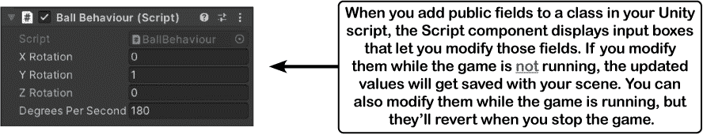
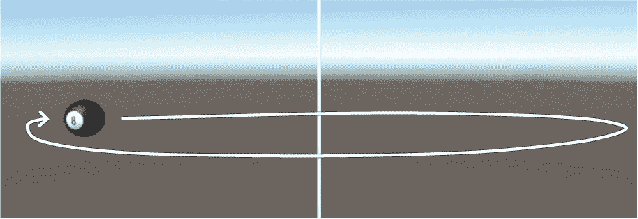

# 第七章：Unity 实验室 #2：为 Unity 编写 C# 代码

Unity 不仅是一个强大的跨平台引擎和编辑器，用于构建 2D 和 3D 游戏和模拟。它还是一个**很好的练习编写 C# 代码的方式**。

在上一个 Unity 实验室中，你学会了如何在 Unity 和你的 3D 空间中导航，并开始创建和探索游戏对象。现在是时候写一些代码来控制你的游戏对象了。那个实验室的整个目标是让你熟悉 Unity 编辑器（并提供一个简单的方法，以便在需要时提醒自己如何在其中导航）。

在这个 Unity 实验室中，你将开始编写代码来控制你的游戏对象。你将编写 C# 代码来探索你在其余 Unity 实验室中将使用的概念，首先是添加一个方法来旋转你在上一个 Unity 实验室中创建的 8 球游戏对象。你还将开始在 Unity 中使用 Visual Studio 调试器来解决游戏中的问题。

# C# 脚本为你的游戏对象添加行为

现在你可以向场景中添加一个游戏对象了，你需要一种方法来让它做些事情。这就是你的 C# 技能发挥作用的地方。Unity 使用**C# 脚本**来定义游戏中所有内容的行为。

这个 Unity 实验室将介绍一些工具，这些工具将帮助你处理 C# 和 Unity。你将构建一个简单的“游戏”，实际上只是一些视觉效果：你将让你的 8 球在场景中飞来飞去。首先去 Unity Hub 并**打开你在第一个 Unity 实验室中创建的相同项目**。


在这个 Unity 实验室中你将做什么：

1.  **将 C# 脚本附加到你的游戏对象上。** 你将向你的球体游戏对象添加一个脚本组件。当你添加它时，Unity 将为你创建一个类。你将修改这个类以驱动 8 球球体的行为。

1.  **使用 Visual Studio 编辑脚本。** 记得如何设置 Unity 编辑器的偏好设置，使 Visual Studio 成为脚本编辑器吗？这意味着你只需在 Unity 编辑器中双击脚本，它就会在 Visual Studio 中打开。

1.  **在 Unity 中玩你的游戏。** 屏幕顶部有一个播放按钮。当你按下它时，它会开始执行场景中附加到游戏对象的所有脚本。你将使用该按钮来运行你添加到球体的脚本。

    

1.  **使用 Unity 和 Visual Studio 一起调试你的脚本。** 当你试图追踪你的 C# 代码中的问题时，你已经看到 Visual Studio 调试器是多么有价值。Unity 和 Visual Studio 无缝协作，因此你可以添加断点，使用本地变量窗口，并在游戏运行时使用 Visual Studio 调试器中的其他熟悉工具。

# 向你的游戏对象添加一个 C# 脚本

Unity 不仅仅是一个用于构建 2D 和 3D 游戏的惊人平台。许多人还将它用于艺术作品、数据可视化、增强现实等等。作为一个学习 C# 的人，对你来说尤为宝贵，因为你可以编写代码来控制 Unity 游戏中的一切。这使得 Unity **成为学习和探索 C# 的绝佳工具**。

现在就开始使用 C# 和 Unity 吧。确保选择了 Sphere GameObject，然后在检查器窗口底部点击“添加组件”按钮。


当你点击它时，Unity 弹出一个窗口，显示可以添加的所有不同类型的组件——而且有***很多***种。**选择“新建脚本”**来为你的 Sphere GameObject 添加一个新的 C# 脚本。系统会提示你输入一个名称。**把你的脚本命名为** `**BallBehaviour**`。


点击“创建并添加”按钮来添加这个脚本。你会在检查器窗口中看到一个名为 *Ball Behaviour (Script)* 的组件出现。


你也会在项目窗口中看到这个 C# 脚本。


###### 注意

**项目窗口以文件夹视图显示你的项目。你的 Unity 项目由文件组成：媒体文件、数据文件、C# 脚本、纹理等等。Unity 将这些文件称为资产。当你在资产内右键单击导入纹理时，项目窗口显示了一个名为 Assets 的文件夹，所以 Unity 将其添加到了那个文件夹中。**

###### 注意

你有没有注意到，在你把 8 球纹理拖到球体上时，项目窗口里会出现一个叫做 Materials 的文件夹？

# 编写 C# 代码来旋转你的球体

在第一个实验中，你告诉 Unity 使用 Visual Studio 作为其外部脚本编辑器。所以现在**双击你的新的 C# 脚本**。这样做时，***Unity 将会在 Visual Studio 中打开你的脚本***。你的 C# 脚本包含一个名为 BallBehaviour 的类，其中有两个空方法分别称为 Start 和 Update：

```cs
using System.Collections;
using System.Collections.Generic;
using UnityEngine;

public class BallBehaviour : MonoBehaviour
{
    // Start is called before the first frame update
    void Start()
    {

    }
    // Update is called once per frame
    void Update()
    {

    }
}
```

###### 注意

**通过在 Hierarchy 窗口中点击它来在 Visual Studio 中打开你的 C# 脚本，该窗口显示了当前场景中每个 GameObject 的列表。当 Unity 创建你的项目时，它添加了一个名为 SampleScene 的场景，并包含一个摄像机和一个灯光。你向其中添加了一个球体，所以你的 Hierarchy 窗口将显示所有这些内容。**

###### 注意

如果 Unity 没有启动 Visual Studio 并在其中打开你的 C# 脚本，回到 Unity 实验 1 的开始，确保你遵循了设置外部工具偏好的步骤。

这是一行代码，可以使你的球体旋转。**将其添加到你的 Update 方法中**：

```cs
 transform.Rotate(Vector3.up, 180 * Time.deltaTime);
```

现在**回到 Unity 编辑器**，点击工具栏中的播放按钮来启动你的游戏： 


# 添加一个断点并调试你的游戏

让我们来调试你的 Unity 游戏。首先，如果游戏仍在运行，请**停止游戏**（通过再次点击播放按钮）。然后切换到 Visual Studio，并在你添加到 Update 方法的行上**添加一个断点**。



现在找到 Visual Studio 顶部的启动调试器按钮：

+   在 Windows 上看起来是这样的————或者从菜单选择 Debug >> Start Debugging (F5)

+   在 macOS 上看起来是这样的————或者选择 Run >> Start Debugging ()

点击那个按钮**启动调试器**。现在切换回 Unity 编辑器。如果这是你第一次调试这个项目，Unity 编辑器将弹出一个带有以下按钮的对话框窗口：


按下“启用本次会话的调试”按钮（或者如果你想要避免弹出窗口再次出现，按“为所有项目启用调试”）。Visual Studio 现在已经***连接到*** Unity，这意味着它可以调试你的游戏。

现在在 Unity 中**按下播放按钮**启动你的游戏。由于 Visual Studio 已连接到 Unity，它会立即在你添加的断点上***中断***，就像你设置的任何其他断点一样。

###### 注意

恭喜，你现在正在调试一个游戏！

# 使用命中计数跳过帧

有时，在你的断点停止之前让游戏运行一段时间是很有用的。例如，你可能希望在你的断点命中之前让游戏生成并移动其敌人。让我们告诉你的断点每 500 帧暂停一次。你可以通过向你的断点添加一个**命中计数条件**来实现这一点：

+   在 Windows 上，右键点击行左侧的断点点 ()，从弹出菜单中选择**条件**，从下拉菜单中选择*Hit Count*和*Is a multiple of*，并在框中输入 500：

    

+   在 macOS 上，右键点击断点点 ()，从菜单中选择**编辑断点…**，然后从下拉菜单中选择*When hit count is a multiple of*，并在框中输入 500：

    

现在，断点只会在 Update 方法运行 500 次——或者每 500 帧——时暂停游戏。所以如果你的游戏以 60 FPS 运行，那么当你按下继续按钮后，游戏将在再次中断前运行约 8 秒多一点。**按下 Continue，然后切换回 Unity**，观察球旋转直到断点再次触发。

# 使用调试器理解 Time.deltaTime

在 Unity Labs 项目中，你将会经常使用 Time.deltaTime。让我们利用你的断点并使用调试器来真正理解这个值的含义。

当你的游戏在 Visual Studio 的断点上暂停时，**悬停在 Time.deltaTime** 上可以看到自上一帧以来经过的秒数的分数（你需要把鼠标光标放在`**deltaTime**`上）。然后通过右键菜单选择 Time.deltaTime 并选择添加监视来**添加一个监视**。


**继续调试**（在 Windows 上是 F5，在 macOS 上），就像你调试其他应用程序一样），以恢复你的游戏。球体将再次开始旋转，再过 500 帧后，断点将再次触发。你可以每次运行 500 帧游戏。每次断点中断时，都要注意观察监视窗口。


**停止调试**（在 Windows 上是 Shift+F5，在 macOS 上）来停止你的程序。然后**再次开始调试**。由于你的游戏仍在运行，当你重新连接 Visual Studio 到 Unity 时，断点将继续工作。完成调试后，**再次切换你的断点**，这样 IDE 将继续跟踪它，但不会在命中时中断。**再次停止调试**以从 Unity 中分离出来。

返回 Unity 并**停止你的游戏**—并保存它，因为播放按钮不会自动保存游戏。

###### 注意

Unity 中的播放按钮用于启动和停止游戏。即使游戏停止，Visual Studio 也会保持与 Unity 的连接。

# 添加一个圆柱来显示 Y 轴的位置

你的球体正在场景的中心围绕 Y 轴旋转。让我们添加一个非常高和非常细的圆柱以使其可见。通过从 GameObject 菜单选择*3D 对象 >> 圆柱*来***创建一个新的圆柱***。确保在 Hierarchy 窗口中它被选中，然后查看 Inspector 窗口并检查 Unity 是否在位置（0, 0, 0）处创建它—如果没有，请使用上下文菜单（）来重置它。

让我们使圆柱高而细。从工具栏选择 Scale 工具：要么点击它（），要么按下 R 键。你应该会看到 Scale Gizmo 出现在你的圆柱上：


将绿色立方体点击并拖拽向上，沿 Y 轴拉长你的圆柱。然后点击红色立方体并向圆柱拉伸，使其沿 X 轴变得非常狭窄，接着再用蓝色立方体也使其沿 Z 轴变得非常狭窄。在改变圆柱尺寸时，请观察检视器中的 Transform 面板—Y 轴将变大，而 X 和 Z 的值将变得更小。


**点击 Transform 面板中的 Scale 行中的 X 标签并上下拖动。**确保你点击实际的 X 标签，在输入框左侧。当你点击标签时，它会变蓝色，并且 X 值周围会出现蓝色框。随着你拖动鼠标，框中的数字会上下移动，场景视图会根据你的更改更新比例。在拖动时仔细观察—比例可以是正数和负数。

现在**选择 X 框中的数字并键入.1**—圆柱变得非常细。按 Tab 键，然后键入 20，再次按 Tab 键并键入.1，最后按 Enter 键。


现在你的球体中有一个穿过的非常长的圆柱，显示 Y 轴，其中 Y = 0。


# 为你的类添加字段以存储旋转角度和速度。

在#objectshellipget_orientedexclamation_mar 中，你学习了 C# 类如何拥有**字段**来存储方法可以使用的值。让我们修改你的代码来使用字段。在类声明后的第一个左花括号`**{:**`后立即添加这四行：

```cs
public class BallBehaviour : MonoBehaviour
{
    public float XRotation = 0;
    public float YRotation = 1;
    public float ZRotation = 0;
    public float DegreesPerSecond = 180;
```

###### 注意

**这些字段就像你在#objectshellipget_orientedexclamation_mar 和#types_and_references_getting_the_referen 项目中添加的字段一样。它们是变量，用于跟踪它们的值——每次调用 Update 时，它们会重复使用相同的字段。**

XRotation、YRotation 和 ZRotation 字段分别包含一个介于 0 和 1 之间的值，你将它们结合起来创建一个**向量**，确定球体旋转的方向：

```cs
 new Vector3(XRotation, YRotation, ZRotation)
```

DegreesPerSecond 字段包含每秒旋转的角度数，你将像以前一样将其乘以 Time.deltaTime。**修改你的 Update 方法以使用这些字段。** 这段新代码创建了一个名为`**axis**`的 Vector3 变量，并将其传递给 transform.Rotate 方法：

```cs
 void Update()
 {
     Vector3 axis = new Vector3(XRotation, YRotation, ZRotation);
     transform.Rotate(axis, DegreesPerSecond * Time.deltaTime);
 }
```

在层次视图窗口中选择球体。你的字段现在显示在脚本组件中。当脚本组件渲染字段时，它在大写字母之间添加空格，以便更容易阅读。



再次运行你的游戏。***当游戏运行时***，在层次视图窗口中选择球体，并将每秒度数更改为 360 或 90——球体开始以两倍或一半的速度旋转。停止你的游戏——字段将重置为 180。

当游戏停止时，使用 Unity 编辑器将 X Rotation 字段更改为 1，将 Y Rotation 字段更改为 0。开始你的游戏——球体将远离你旋转。在游戏运行时点击 X Rotation 标签并上下拖动以更改值。一旦数字变为负数，球体开始朝你旋转。再次使它为正数，它将远离你旋转。


# 使用 Debug.DrawRay 探索三维向量的工作原理

**向量**是一个具有**长度**（或大小）和**方向**的值。如果你在数学课上学过向量，你可能见过很多像这样的二维向量图示：


这在理智层面上并不难理解。但是，即使我们上过涵盖向量的数学课程，我们也并不总是对向量如何工作有一个***直观***的理解，尤其是在三维空间中。这里是我们可以使用 C# 和 Unity 作为学习和探索工具的另一个领域。

# 使用 Unity 可视化三维向量

你将要为你的游戏添加代码，帮助你真正理解三维向量的工作原理。首先，仔细查看你的 Update 方法的第一行：

```cs
 Vector3 axis = new Vector3(XRotation, YRotation, ZRotation);
```

这行代码告诉我们关于向量的什么？

+   **它有一个类型：Vector3**。每个变量声明都以一个类型开头。不再使用 string、int 或 bool，而是声明为 Vector3 类型。这是 Unity 用于 3D 向量的类型。

+   **它有一个变量名：** `**axis**`。

+   **它使用 `new` 关键字创建 Vector3**。它使用 XRotation、YRotation 和 ZRotation 字段创建一个具有这些值的向量。

那么这个 3D 向量是什么样子呢？我们无需猜测 —— 我们可以使用 Unity 提供的有用的调试工具之一来为我们绘制这个向量。**在您的 Update 方法末尾添加这行代码：**

```cs
   void Update()
   {
       Vector3 axis = new Vector3(XRotation, YRotation, ZRotation);
       transform.Rotate(axis, DegreesPerSecond * Time.deltaTime);
       Debug.DrawRay(Vector3.zero, axis, Color.yellow);
   }
```

Debug.DrawRay 方法是 Unity 提供的特殊方法，帮助您调试游戏。它绘制一条射线 —— 一种从一个点到另一个点的向量，并接受其起始点、终点和颜色参数。有一个注意点：***射线只出现在场景视图中***。Unity 的 Debug 类中的方法设计成不会干扰您的游戏。它们通常只影响游戏与 Unity 编辑器的交互方式。

# 运行游戏以在场景视图中看到射线

现在再次运行游戏。在 Game 视图中看不到任何不同，因为 Debug.DrawRay 是一个用于调试的工具，不会对游戏玩法产生任何影响。使用 Scene 选项卡**切换到场景视图**。您可能还需要通过选择布局下拉菜单中的 Wide 来**重置 Wide 布局**。


现在您又回到了熟悉的场景视图。按以下步骤来真正了解 3D 向量的工作原理：

+   使用 Inspector 来**修改 BallBehaviour 脚本的字段**。将 X Rotation 设置为 0，Y Rotation 设置为 0，**Z Rotation 设置为 3**。现在，您应该看到一个黄色射线直接从 Z 轴出来，球体围绕其旋转（请记住，射线只会显示在场景视图中）。

    

+   将 Z 旋转设置回 3\. 拖动 X 旋转和 Y 旋转的值，看看它们对射线的影响。确保每次更改后重置 Transform 组件。

+   使用 Hand 工具和 Scene Gizmo 来获得更好的视图。单击 Scene Gizmo 上的 X 锥体，将其设置为从右侧查看。继续单击 Scene Gizmo 上的锥体，直到您从正面看到视图。很容易迷失方向 —— 您可以**重置 Wide 布局**以回到熟悉的视图。

# 为射线添加持续时间以留下轨迹

您可以向 Debug.DrawRay 方法调用添加第四个参数，指定射线在屏幕上停留的秒数。添加 **.5f** 使每条射线在屏幕上停留半秒钟：

```cs
 Debug.DrawRay(Vector3.zero, axis, Color.yellow, .5f);
```

现在再次运行游戏并切换到场景视图。现在，当您上下拖动数字时，将会看到留下一串射线。这看起来非常有趣，但更重要的是，它是一个很好的可视化 3D 向量的工具。


# 围绕场景中的一个点旋转您的球体

你的代码调用 transform.Rotate 方法来使你的球围绕其中心旋转，从而改变其 X、Y 和 Z 旋转值。**在层次结构窗口中选择 Sphere 并将其 X 位置更改为 5**在 Transform 组件中。然后**使用 BallBehaviour Script 组件中的上下文菜单（）**来重置其字段。再次运行游戏——现在球将位于位置（5, 0, 0）并围绕自己的 Y 轴旋转。


让我们修改 Update 方法，使用不同类型的旋转。现在我们将使球围绕场景中心点（0, 0, 0）旋转，使用**transform.RotateAround 方法**，它会使一个 GameObject 围绕场景中的一个点旋转。（这与你之前使用的 transform.Rotate 方法不同，后者使一个 GameObject 围绕其中心旋转。）它的第一个参数是要围绕的点。我们将使用**Vector3.zero**作为该参数，这是写`**new Vector3(0, 0, 0)**`的快捷方式。

###### 注意

这个新的 Update 方法使球围绕场景中点（0, 0, 0）旋转。

这是新的 Update 方法：

```cs
void Update()
{
    Vector3 axis = new Vector3(XRotation, YRotation, ZRotation);
    transform.RotateAround(Vector3.zero, axis, DegreesPerSecond * Time.deltaTime);
    Debug.DrawRay(Vector3.zero, axis, Color.yellow, .5f);
}
```

现在运行你的代码。这次它会使球围绕中心点画一个大圆：



# 使用 Unity 更仔细地查看旋转和向量

在本书的其余部分中，你将会使用 Unity Labs 处理 3D 对象和场景。即使我们中的许多人花费大量时间玩 3D 视频游戏，也不完全了解向量和 3D 对象的工作原理，以及如何在 3D 空间中移动和旋转。幸运的是，Unity 是一个很好的工具，可以**探索 3D 对象的工作原理**。让我们立即开始实验。

当你的代码运行时，尝试更改参数以实验旋转：

+   **切换回场景视图**，这样你就可以看到 Debug.DrawRay 在 BallBehaviour.Update 方法中呈现的黄色射线。

+   使用层次结构窗口**选择 Sphere**。你应该在检视器窗口中看到它的组件。

+   在 Script 组件中将**X Rotation、Y Rotation 和 Z Rotation 值**更改为**10**，这样你就会看到向量呈现为一条长射线。使用手动工具（Q）旋转场景视图，直到你能清楚地看到射线。

+   使用 Transform 组件的上下文菜单（）来**重置 Transform 组件**。由于球体的中心现在位于场景中的零点（0, 0, 0），它将围绕自己的中心旋转。

+   然后在 Transform 组件中将 X 位置更改为**2**。现在球应该围绕该向量旋转。当它飞过时，你会看到球在 Y 轴圆柱上投下阴影。

    

尝试**重复最后三个步骤**，使用不同的 X、Y 和 Z 旋转值，每次重置 Transform 组件，以便从一个固定点开始。然后尝试点击旋转字段标签并上下拖动它们——看看你是否能感受到旋转的工作原理。

> 通过修改 GameObject 的属性，Unity 是探索 3D 对象工作原理的绝佳工具，可以实时观察效果。

# 多发挥创意！

这是你**通过 C#和 Unity 自行实验**的机会。你已经了解了如何将 C#与 Unity 游戏对象结合起来的基础知识。花点时间玩转一下你在前两个 Unity 实验中学到的不同 Unity 工具和方法。以下是一些想法：

+   向场景中添加立方体、圆柱体或胶囊体。将新的脚本附加到它们上——确保每个脚本都有一个唯一的名称！——并使它们以不同的方式旋转。

+   尝试将旋转的游戏对象放置在场景中不同的位置。看看你能否从多个旋转的游戏对象中制造出有趣的视觉图案。

+   尝试向场景中添加一个光源。当你使用`transform.rotateAround`来围绕各个轴旋转新的光源时会发生什么？

+   这是一个快速的编码挑战：尝试使用`+=`来向你的`BallBehaviour`脚本中的一个字段添加值。确保将该值乘以`Time.deltaTime`。尝试添加一个**if**语句，如果字段变得太大，将其重置为 0。

###### 注意

在运行代码之前，尝试弄清楚它的作用。它表现得符合你的预期吗？试图预测你添加的代码将如何作用是提高 C#技能的一个好方法。

> 抽出时间来尝试你刚学到的工具和技术。这是利用 Unity 和 Visual Studio 进行探索和学习的绝佳方式。
