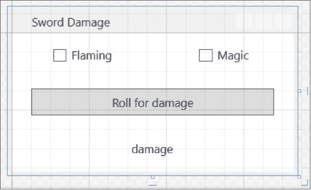
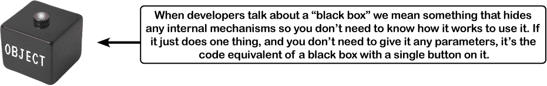

# 第八章：封装：*保护您的私人信息……私密*


**是否曾经希望拥有更多的隐私？**

有时你的对象也有同样的感受。就像你不希望任何你不信任的人读你的日记或翻阅你的银行对账单一样，好的对象不让***其他***对象查看它们的字段。在本章中，您将学习到**封装**的力量，这是一种编程方式，可以帮助您编写灵活、易于使用且难以被误用的代码。您将**使您对象的数据私有**，并添加**属性**以保护数据的访问方式。

# 让我们帮助 Owen 掷骰子计算伤害

Owen 对他的能力分数计算器感到非常满意，他想要创建更多他可以用于游戏的 C#程序，而你将帮助他。在他目前玩的游戏中，每次有剑攻击时，他会掷骰子并使用一个计算伤害的公式。Owen 在他的游戏主控笔记本中记录了剑伤害公式的工作方式。

这里有一个名为**SwordDamage**的类，用于进行计算。仔细阅读代码——你即将创建一个应用程序来使用它。


# 创建一个控制台应用程序来计算伤害

让我们为 Owen 构建一个控制台应用程序，使用 SwordDamage 类。它将在控制台上打印一个提示，询问用户是否指定剑是魔法的和/或燃烧的，然后进行计算。以下是应用程序的输出示例：


**是的！我们可以构建一个使用相同类的 WPF 应用程序。**

让我们找一个方法来在一个 WPF 应用程序中**重用**SwordDamage 类。对我们来说，第一个挑战是如何提供一个*直观*的用户界面。一把剑可以是魔法的、燃烧的、两者兼有，或者都不是，所以我们需要弄清楚如何在 GUI 中处理这个问题——而且有很多选择。我们可以使用四个选项的单选按钮或下拉列表，就像控制台应用程序提供了四个选项一样。但是，我们认为使用**复选框**会更清晰、更明显。

在 WPF 中，CheckBox 使用 Content 属性在框的右侧显示标签，就像 Button 使用 Content 属性显示文本一样。我们有 SetMagic 和 SetFlaming 方法，因此我们可以使用 CheckBox 控件的**Checked 和 Unchecked 事件**，让您指定在用户选中或取消选中框时调用的方法。

**前往 Visual Studio for Mac 学习指南，查看该项目的 Mac 版本。**

# 设计一个 WPF 版本的伤害计算器的 XAML

**创建一个新的 WPF 应用程序**，并将主窗口标题设置为`**剑伤害**`，高度设置为`**175**`，宽度设置为`**300**`。向网格添加三行两列。顶部行应包含两个标签为 Flaming 和 Magic 的 CheckBox 控件，中间行应包含一个标签为“掷骰子计算伤害”的 Button 控件，该按钮跨越两列，底部行应包含一个跨越两列的 TextBlock 控件。

###### 注意

***做这个！***



这是 XAML——你肯定可以使用设计师来构建你的表单，但你也应该学会手动编辑 XAML：


###### 注意

**将 CheckBox 控件的名称命名为`magic`和`flaming`，将 TextBlock 控件的名称命名为`damage`。确保这些名称在 XAML 中的`x:Name`属性中正确显示。**

# WPF 伤害计算器的代码后台

**将这段代码后台添加到你的 WPF 应用中。它创建了 SwordDamage 和 Random 的实例，并使 CheckBox 和按钮计算伤害：**

***做这个！***

```cs
public partial class MainWindow : Window
{
    Random random = new Random();
    SwordDamage swordDamage = new SwordDamage();
    public MainWindow()
    {
        InitializeComponent();
        swordDamage.SetMagic(false);
        swordDamage.SetFlaming(false);
        RollDice();
    }
    public void RollDice()
    {
        swordDamage.Roll = random.Next(1, 7) + random.Next(1, 7) + random.Next(1, 7);
        DisplayDamage();
    }
    void DisplayDamage()
    {
        damage.Text = "Rolled " + swordDamage.Roll + " for " + swordDamage.Damage + " HP";
    }
    private void Button_Click(object sender, RoutedEventArgs e)
    {
        RollDice();
    }
    private void Flaming_Checked(object sender, RoutedEventArgs e)
    {
        swordDamage.SetFlaming(true);
        DisplayDamage();
    }
    private void Flaming_Unchecked(object sender, RoutedEventArgs e)
    {
        swordDamage.SetFlaming(false);
        DisplayDamage();
    }
    private void Magic_Checked(object sender, RoutedEventArgs e)
    {
        swordDamage.SetMagic(true);
        DisplayDamage();
    }
    private void Magic_Unchecked(object sender, RoutedEventArgs e)
    {
        swordDamage.SetMagic(false);
        DisplayDamage();
    }
}
```

###### 注意

**仔细阅读这段代码。在运行之前，你能发现任何错误吗？**

# 桌游谈话（或许是…骰子讨论？）

游戏之夜！欧文的整个游戏派对来了，他即将展示他全新的剑伤害计算器。让我们看看效果如何。


**杰登：** 欧文，你在说什么？

**欧文：** 我在说这个新应用将会自动计算剑的伤害…

**马修：** 因为掷骰子实在是太，太难了。

**杰登：** 别开玩笑了，大家。让我们给它一个机会。

**欧文：** 谢谢，杰登。这正是个完美的时机，因为布兰妮刚刚用她的火焰魔法剑攻击了狂暴的牛人。来吧，布兰妮。试试看。

**布兰妮：** 好的。我们刚刚启动了这个应用。我勾选了“魔法”框框。看起来它保存了一个旧掷骰子结果，让我再次点击“掷骰子”来重新计算，然后…

**杰登：** 等等，这不对。现在你掷了 14 点，但仍显示 3 点 HP。再点击一次。掷了 11 点，造成 3 点 HP。再多点几次。9 点、10 点、5 点，都只给 3 点 HP。欧文，怎么回事？

**布兰妮：** 嘿，它有点儿用。如果你点击“掷骰子”，然后多次勾选框框，最终会给出正确的答案。看起来我掷了 10 点，造成 22 点 HP 损伤。

**杰登：** 你说得对。我们只需按照一个**非常具体的顺序**点击。*首先*点击掷骰子，*然后*勾选正确的框框，*最好*两次检查“Flaming”框框。

**欧文：** 你说得对。如果我们**完全按照这个顺序**做，程序就能正常运行。但如果我们按其他顺序做，它就会出错。好吧，我们可以处理这个。

**马修：** 或者…也许我们可以用真正的骰子来做事情呢？


# 让我们试着修复这个 bug

当你运行程序时，它做的第一件事是什么？让我们仔细看看 MainWindow 类顶部的这个方法与窗口的代码后台：


当一个类有构造函数时，当创建该类的新实例时，它是第一件被运行的事情。当你的应用程序启动并创建 MainWindow 的一个实例时，首先初始化字段，包括创建一个新的 SwordDamage 对象，然后调用构造函数。所以程序在显示窗口之前就调用了 RollDice，并且每次点击 roll 时我们都会看到问题，所以也许我们可以通过在 RollDice 方法中插入一个解决方案来修复这个问题。**对 RollDice 方法进行以下更改**：


现在**测试你的代码**。运行程序并点击按钮几次。到目前为止一切顺利——数字看起来是正确的。现在**选中“魔法”复选框**并再次点击按钮几次。好的，看起来我们的修复起作用了！还有一件事需要测试。**选中“燃烧”复选框**并点击按钮，然后……***糟糕！***还是不起作用。点击按钮时，它执行了 1.75 的魔法倍增器，但没有增加额外的 3 点 HP 用于燃烧。你仍然需要勾选和取消勾选“燃烧”复选框才能得到正确的数字。所以程序仍然有问题。


**在尝试修复 bug 之前，始终思考是什么导致了 bug。**

当代码出现问题时，**立即开始编写更多代码来尝试修复**确实非常诱人。这样做可能会让你觉得自己在迅速采取行动，但很容易只是添加更多有错误的代码。花点时间弄清楚真正引起 bug 的原因总是更安全的，而不是仅仅尝试插入一个快速修复。

# 使用 Debug.WriteLine 打印诊断信息

在过去的几章中，你使用调试器来追踪错误，但这并不是开发人员发现代码问题的唯一方法。事实上，当专业开发人员试图追踪其代码中的错误时，他们最常做的事情之一是**添加打印输出行的语句**，这正是我们将要做的，用来追踪这个 bug。

通过选择“视图”菜单中的“输出”（Ctrl+O W），在 Visual Studio 中**打开输出窗口**。从 WPF 应用程序中调用 Console.WriteLine 所打印的任何文本将显示在此窗口中。你应该仅在*用户应该看到的显示输出*时使用 Console.WriteLine。而在仅为调试目的打印输出行时，应使用**Debug.WriteLine**。Debug 类位于 System.Diagnostics 命名空间中，因此首先在 SwordDamage 类文件的顶部添加一个 `using` 行：

```cs
    using System.Diagnostics;
```

接下来，在 CalculateDamage 方法的末尾**添加一个 Debug.WriteLine 语句**：

```cs
 public void CalculateDamage()
 {
 Damage = (int)(Roll * MagicMultiplier) + BASE_DAMAGE + FlamingDamage;
        Debug.WriteLine($"CalculateDamage finished: {Damage} (roll: {Roll})");
 }
```

现在在 SetMagic 方法的末尾再添加一个 Debug.WriteLine 语句，并在 SetFlaming 方法的末尾再添加一个。它们应该与 CalculateDamage 中的语句相同，只是在输出时打印“SetMagic”或“SetFlaming”，而不是“CalculateDamage”：

```cs
 public void SetMagic(bool isMagic)
 {
 // the rest of the SetMagic method stays the same
        Debug.WriteLine($"SetMagic finished: {Damage} (roll: {Roll})");
    }
 public void SetFlaming(bool isFlaming)
 {
 // the rest of the SetFlaming method stays the same
        Debug.WriteLine($"SetFlaming finished: {Damage} (roll: {Roll})");
 }
```

###### 注意

**现在你的程序将向输出窗口打印有用的诊断信息。**

###### 注意

不需要设置任何断点，您可以追踪此错误。这是开发人员经常做的事情……所以你也应该学会这样做！

###### 注意

**Debug.WriteLine** **是你开发工具箱中最基本且最有用的调试工具之一！有时，在代码中找出错误的最快方法是策略性地添加 Debug.WriteLine 语句，以提供重要线索，帮助你破解问题。**


**人们不会总是按照你的预期方式使用你的类。**

大多数时候使用你的类的“人”是你自己！今天你可能正在编写一个类，明天或下个月你就会使用它。幸运的是，C#为你提供了一种强大的技术，确保你的程序始终正确运行——即使人们做了你从未想过的事情。它被称为**封装**，对于处理对象非常有帮助。封装的目标是限制对类“内部”数据的访问，以便所有类成员都**安全**且**难以误用**。这使你能够设计类，使其更难以被错误使用——这是预防像你在剑伤害计算器中追查出的错误的***绝佳方法***。

# 很容易意外地误用你的对象

Owen 的应用程序遇到问题，因为我们假设 CalculateDamage 方法会计算伤害。事实证明直接调用该方法是**不安全的**，因为它会替换 Damage 值并擦除已经完成的任何计算。相反，我们需要让 SetFlaming 方法为我们调用 CalculateDamage——但**甚至这也不够**，因为我们还必须确保先始终调用 SetMagic。因此，尽管 SwordDamage 类在技术上**可以**工作，但是当代码以意外的方式调用它时会引发问题。

**SwordDamage 类的** ***预期使用方式*****

SwordDamage 类为应用程序提供了一种良好的方法来计算剑的总伤害。它所需做的就是设置 Roll，然后调用 SetMagic 方法，最后调用 SetFlaming 方法。如果按照这个顺序进行操作，Damage 字段将被计算后更新。但这不是应用程序做的事情。


**SwordDamage 类的** ***实际使用方式*****

相反，它设置了 Roll 字段，然后调用了 SetFlaming，将火焰剑的额外伤害添加到 Damage 字段中。然后调用 SetMagic，最后调用 CalculateDamage，这将重置 Damage 字段并丢弃额外的火焰伤害。


# 封装意味着将类中的一些数据保持私有

有一种方法可以避免滥用对象的问题：确保只有一种方法可以使用你的类。C#通过让你将一些字段声明为`**private**`来帮助你做到这一点。到目前为止，你只看到了公共字段。如果你有一个具有公共字段的对象，任何其他对象都可以读取或更改该字段。如果将其设置为私有字段，那么**该字段只能从该** **对象内部访问**（或者由同一类的另一个实例*访问*）。


###### 注意

**通过将 CalculateDamage 方法***私有化***，我们防止应用程序意外调用它并重置 Damage 字段。将参与计算的字段更改为私有，可以防止应用程序干扰计算。当你将一些数据私有化，然后编写代码来使用这些数据时，这被称为*封装*。当一个类保护其数据并提供安全使用且难以滥用的成员时，我们称其为*良好封装*。**

# 使用封装来控制对类方法和字段的访问

当你将所有字段和方法都设置为公共时，任何其他类都可以*访问*它们。你的类所做的一切以及所知道的一切都成为程序中每个其他类的开放书籍……你刚刚看到这可能导致你的程序以你从未预料过的方式运行。

这就是为什么`public`和`private`关键字被称为**访问修饰符**：它们修改对类成员的访问。封装让你控制在类内部分享什么和保留什么私有。让我们看看这是如何工作的。

1.  超级间谍赫伯特·琼斯是一位***1960 年代间谍游戏中的秘密特工对象***，在苏联作为卧底特工捍卫生命、自由和追求幸福。他的对象是 SecretAgent 类的一个实例。

    

1.  约翰斯特工有一个计划，可以帮助他躲避敌方特工。他添加了一个 AgentGreeting 方法，该方法以密码作为参数。如果他没有得到正确的密码，他只会透露他的化名，Dash Martin。

    

1.  看起来这是保护特工身份的绝佳方法，对吧？只要调用它的特工对象没有正确的密码，特工的姓名就是安全的。

    

# 但是 RealName 字段真的受到保护吗？

只要敌人不知道任何 SecretAgent 对象的密码，特工的真实姓名就是安全的。对吧？但如果这些数据被保存在公共字段中，那就没有任何好处。


# 私有字段和方法只能从同一类的实例中访问

一个对象可以访问另一个对象的私有字段存储的数据的唯一方法是使用公共字段和方法来返回数据。敌对特工和盟友特工需要使用`AgentGreeting`方法，但是友好的间谍，也就是`SecretAgent`的实例，可以看到一切……因为**任何类都可以** **看到同一类的其他实例中的私有字段**。


> **一个对象可以访问另一个不同类对象中的私有字段存储的数据的唯一方法是使用返回数据的公共方法。**

****

**因为有时候你希望你的类把信息隐藏起来不让程序的其他部分看到。**

许多人第一次接触封装时可能会觉得有点奇怪，因为隐藏一个类的字段、属性或方法不让另一个类看到这个概念有些违反直觉。有一些非常好的理由让你考虑应该向程序的其他部分公开什么信息。

> 封装意味着一个类隐藏信息不让另一个类看到。它帮助你预防程序中的错误。** **# 为什么要封装？想象一个对象就像是一个黑盒子……

有时候你会听到程序员把一个对象称为“黑盒子”，这是一个很好的思考方式。当我们说某物是黑盒子时，我们的意思是我们可以看到它的行为，但我们无法知道它是如何运作的。

当你调用一个对象的方法时，你并不真正关心这个方法是如何工作的——至少现在不关心。你关心的是它能够接受你给出的输入并做正确的事情。



你*可以*包含更多的控件，比如显示盒子内部情况的窗口，以及能够操纵它内部的旋钮和开关。但如果它们对你的系统没有任何用处，那它们对你毫无好处，只会带来问题。

## 封装使你的类……

+   **更易于使用**

    你已经知道类使用字段来跟踪它们的状态。许多类使用方法来更新这些字段——其他类永远不会调用的方法。有一个类有字段、方法和属性，其他类永远不会调用。如果你把这些成员设为私有，那么当你需要使用这个类时，它们就不会显示在 IntelliSense 窗口中。IDE 中减少杂乱将使你的类更易于使用。

+   **更不容易出错**

    Owen 的程序中出现的 bug 就是因为应用程序直接访问一个方法而不是让类中的其他方法调用它。如果那个方法是私有的，我们本可以避免这个 bug。

+   **灵活**

    许多时候，你会想回头去添加一些你之前写的程序的功能。如果你的类被良好封装，那么以后你就会准确知道如何使用它们并在其上添加功能。

## 关于封装类的几个想法。

+   **你的类中所有东西都是公开的吗？** 如果你的类除了公共字段和方法外什么都没有，你可能需要多花点时间考虑封装。

+   **思考字段和方法被错误使用的可能性。** 如果它们没有被正确设置或调用会出现什么问题？

+   **哪些字段在设置时需要进行处理或计算？** 这些是封装的首选对象。如果以后有人编写了一个方法来更改其中任何一个值，可能会对程序正在尝试完成的工作造成问题。

    

+   **只有在需要时才将字段和方法设为公开。** 如果你没有理由声明某些东西为公开，就别声明 —— 通过将程序中的所有字段设为公开，你可能会使事情变得非常混乱。但也不要仅仅将所有东西设为私有。花点时间前期考虑哪些字段确实需要公开，哪些不需要，可以为你节省后续大量的时间。


**确实！区别在于良好封装的类设计方式可以防止 bug 并且更易于使用。**

将一个封装良好的类变成封装不良的类很容易：执行搜索并替换，将每个`private`改为`public`。

关于`private`关键字有个有趣的地方：你通常可以对任何程序执行搜索并替换，它仍然能够编译并以完全相同的方式工作。这就是为什么当一些程序员刚开始接触封装时，会感到有点困难的原因之一。

***当你回头看那些很久没碰的代码时，很容易忘记最初的使用意图。这就是封装可以极大简化你生活的地方！***

到目前为止，这本书一直在讲述如何使程序**做事情** —— 执行某些行为。封装有些不同。它不会改变你的程序行为方式。它更多地关注编程的“国际象棋”方面：通过在设计和构建类时隐藏某些信息，你为它们以后的互动设定了一种策略。策略越好，你的程序**越灵活和可维护**，也能避免更多的 bug。

###### 注意

就像国际象棋一样，封装策略几乎是无穷无尽的！

> 如果你今天很好地封装了你的类，那么明天重用它们将变得更加容易。


# 使用封装来改进 SwordDamage 类。

我们刚刚讨论了一些关于封装类的好主意。让我们看看是否可以开始将这些想法应用到 SwordDamage 类中，以防止它在任何包含它的应用程序中被混淆、误用和滥用。

## SwordDamage 类的每个成员都是公开的吗？

是的，确实如此。四个字段（Roll、MagicMultiplier、FlamingDamage 和 Damage）是公共的，还有三个方法（CalculateDamage、SetMagic 和 SetFlaming）。我们应该考虑一下封装的问题。

## 字段或方法是否被误用？

当然。在伤害计算器应用程序的第一个版本中，我们在应该只让 SetFlaming 方法调用它时调用了 CalculateDamage。即使我们试图修复它，也因为调用顺序错误而失败。

## 在设置字段后是否需要进行计算？

当然。在设置 Roll 字段后，我们真的希望实例立即计算伤害。

## 那么哪些字段和方法确实需要是公共的？

这是一个很棒的问题。花点时间思考答案。我们会在本章末尾解决这个问题。

> **将类的成员设置为私有可以防止其他类以意外的方式调用其公共方法或更新其公共字段导致的错误。**

# 封装可以保护你的数据安全

我们已经看到了`private`关键字**保护了类成员不被直接访问**，这可以防止其他类以我们未预料的方式调用方法或更新字段—就像你在 Hi-Lo 游戏中的 GetPot 方法只给了私有的 pot 字段只读访问权限，而只有 Guess 或 Hint 方法可以修改它一样。下一个类的工作方式完全相同。

## 让我们在一个类中使用封装

**让我们为一个彩弹枪类创建一个 PaintballGun**，用于彩弹竞技场视频游戏。玩家可以随时拿起彩弹弹夹并重新装弹，因此我们希望这个类能够跟踪玩家拥有的总弹球数*以及*当前加载的弹球数。我们将添加一个方法来检查枪是否已空并需要重新装弹。我们还希望它能够跟踪弹夹的大小。任何时候玩家获得更多弹药，我们希望枪能自动重新装满弹夹，因此我们会提供一个设置弹球数量并调用 Reload 方法的方法来确保始终发生这种情况。


# 编写一个控制台应用程序来测试 PaintballGun 类

***要做这件事！***

让我们尝试一下我们的新 PaintballGun 类。**创建一个新的控制台应用程序**并将 PaintballGun 类添加到其中。这是 Main 方法—它使用一个循环调用类中的各种方法：

```cs
static void Main(string[] args)
{
   PaintballGun gun = new PaintballGun();
   while (true)
   {
      Console.WriteLine($"{gun.GetBalls()} balls, {gun.GetBallsLoaded()} loaded");
      if (gun.IsEmpty()) Console.WriteLine("WARNING: You’re out of ammo");
      Console.WriteLine("Space to shoot, r to reload, + to add ammo, q to quit");
      char key = Console.ReadKey(true).KeyChar;
      if (key == ’ ’) Console.WriteLine($"Shooting returned {gun.Shoot()}");
      else if (key == ’r’) gun.Reload();
      else if (key == ’+’) gun.SetBalls(gun.GetBalls() + PaintballGun.MAGAZINE_SIZE);
      else if (key == ’q’) return;
  }

}
```

###### 注意

现在应该非常熟悉了，一个带有循环的控制台应用程序测试一个类的实例。确保你能阅读代码并理解其工作原理。

## 我们的类封装得很好，但是……

这个类运行良好，我们封装得也很好。**balls 字段是受保护的**：它不允许设置负数的球，并且与 ballsLoaded 字段保持同步。Reload 和 Shoot 方法的工作正常，看起来没有明显的*显而易见的*方法我们可能会意外地误用这个类。

但是请仔细看一下 Main 方法中的这一行：

```cs
       else if (key == ’+’) gun.SetBalls(gun.GetBalls() + PaintballGun.MAGAZINE_SIZE);
```

坦率地说，这比一个字段要逊色。如果还有一个字段，我们可以使用+=运算符将其增加到弹匣大小。封装很棒，但我们不希望它让我们的类变得烦人或难以使用。

***有没有办法保持 balls 字段受保护，但仍然能方便地使用+=？***

# 属性使封装更容易

到目前为止，你已经学到了两种类成员，方法和字段。还有第三种类成员可以帮助你封装类：它们是**属性**。属性是一个类成员，在使用时看起来像字段，但在运行时像方法一样工作。

声明属性的方式与字段相同，具有类型和名称，但不是以分号结束，而是后跟花括号。在这些花括号内是**属性访问器**，或者返回或设置属性值的方法。有两种类型的访问器：

+   一个**获取属性访问器**，通常简称为**get 访问器**或**getter**，用于返回属性的值。它以`**get**`关键字开头，后跟着一个花括号内的方法。该方法必须返回与属性声明中类型匹配的值。

+   一个**设置属性访问器**，通常简称为**set 访问器**或**setter**，用于设置属性的值。它以`**set**`关键字开头，后跟着一个花括号内的方法。在方法内部，`**value**`关键字是一个只读变量，包含正在设置的值。

属性通常会获取或设置一个**后备字段**，这是我们通过属性来限制访问的私有字段。

## 用属性替换 GetBalls 和 SetBalls 方法

***替换这个！***

这是来自你的 PaintballGun 类的 GetBalls 和 SetBalls 方法：

```cs
    public int GetBalls() { return balls; }
    public void SetBalls(int numberOfBalls)
    {
        if (numberOfBalls > 0)
            balls = numberOfBalls;
        Reload();

    }
```

让我们用一个属性替换它们。**删除两个方法**。然后**添加这个 Balls 属性**：


# 修改你的 Main 方法以使用 Balls 属性

现在你已经用一个名为 Balls 的单一属性替换了 GetBalls 和 SetBalls 方法，你的代码将无法再构建。你需要更新 Main 方法以使用 Balls 属性而不是旧的方法。

在这个 Console.WriteLine 语句中调用了 GetBalls 方法：

***更新这个！***

```cs
  Console.WriteLine($"{gun.GetBalls()} balls, {gun.GetBallsLoaded()} loaded");
```

**替换** `**GetBalls()**` **为** `**Balls**`——这样做后，这条语句将像以前一样工作。让我们来看看使用了 GetBalls 和 SetBalls 的另一个地方：

```cs
  else if (key == ’+’) gun.SetBalls(gun.GetBalls() + PaintballGun.MAGAZINE_SIZE);
```

那是一行混乱且笨拙的代码。属性真的很有用，因为它们像方法一样工作，但你可以像使用字段一样使用它们。所以让我们像使用字段一样使用 Balls 属性——**用使用+=运算符的这条语句替换那行代码**：


这是更新后的 Main 方法：

```cs
static void Main(string[] args)
{
 PaintballGun gun = new PaintballGun();
 while (true)
 {
 Console.WriteLine($"{gun.Balls} balls, {gun.GetBallsLoaded()} loaded");
 if (gun.IsEmpty()) Console.WriteLine("WARNING: You’re out of ammo");
 Console.WriteLine("Space to shoot, r to reload, + to add ammo, q to quit");
 char key = Console.ReadKey(true).KeyChar;
 if (key == ’ ’) Console.WriteLine($"Shooting returned {gun.Shoot()}");
 else if (key == ’r’) gun.Reload();
 else if (key == ’+’) gun.Balls += PaintballGun.MAGAZINE_SIZE;
 else if (key == ’q’) return;
 }

}
```

## 调试你的 PaintballGun 类以理解属性的工作原理

使用调试器真正了解您的新 Ball 属性的工作方式：

+   在 get 访问器的大括号内部（`return balls;`）放置一个断点。

+   在 set 访问器的第一行（`if (value > 0)`）上再放一个断点。

+   在 Main 方法的顶部放置一个断点并开始调试。逐个跳过每个语句。

+   当您跳过 Console.WriteLine 时，调试器将在 getter 中断点处停止。

+   继续逐步执行方法。当您执行+=语句时，调试器将在 setter 中断点处停止。为背景字段**balls**和`**value**`关键字添加一个监视器。

# 自动实现的属性简化了您的代码

***添加这个！***

使用属性的一个非常常见的方法是创建一个背景字段并为其提供 get 和 set 访问器。让我们创建一个新的 BallsLoaded 属性，**使用现有的 ballsLoaded 字段**作为背景字段：

```cs
    private int ballsLoaded = 0;
    public int BallsLoaded {
       get { return ballsLoaded; }
       set { ballsLoaded = value; }

    }
```

###### 注意

**此属性使用私有**背景字段**。其 getter 返回字段中的值，其 setter 更新字段。**

现在您可以**删除 GetBallsLoaded 方法**并修改您的 Main 方法以使用属性：

```cs
 Console.WriteLine($"{gun.Balls} balls, {gun.BallsLoaded} loaded");
```

再次运行您的程序。它应该仍然以完全相同的方式工作。

## 使用 prop 代码片段创建自动实现的属性

一个**自动实现的属性**——有时称为**自动属性**或**自动化属性**——是一个具有返回背景字段值的 getter 和更新它的 setter 的属性。换句话说，它的工作原理就像您刚刚创建的 BallsLoaded 属性一样。有一个重要的区别：当您创建自动属性***时，不需要定义背景字段***。相反，C#编译器会为您创建背景字段，更新它的唯一方法是使用 get 和 set 访问器。

Visual Studio 为创建自动属性提供了一个非常有用的工具：一个**代码片段**，或者说是一个小型、可重用的代码块，IDE 会自动插入它。让我们用它来创建一个名为 BallsLoaded 的自动属性。

1.  **删除 BallsLoaded 属性和背景字段。** 删除您添加的 BallsLoaded 属性，因为我们将用自动实现的属性替换它。然后删除 ballsLoaded 背景字段（`private int ballsLoaded = 0;`），因为每次创建自动属性时，C#编译器都会为您生成一个隐藏的背景字段。

1.  **告诉 IDE 启动 prop 代码片段。** 将光标放在字段原来的位置，然后**键入** `**prop**` **并** **按两次 Tab 键**告诉 IDE 启动代码片段。它会将以下行添加到您的代码中：

    

    该片段是一个模板，允许您编辑其部分——prop 片段允许您编辑类型和属性名称。按一次 Tab 键切换到属性名称，然后**将名称更改为** `**BallsLoaded**` 并按 Enter 键以完成片段

    ```cs
    public int BallsLoaded { get; set; }
    ```

    ###### 注意

    **你不必为自动属性声明后备字段，因为 C# 编译器会自动创建它。**

1.  **修复类的其余部分。** 由于你移除了 ballsLoaded 字段，你的 PaintballGun 类不再编译。这有一个快速的修复方案——代码中 ballsLoaded 字段出现了五次（一次在 IsEmpty 方法中，两次在 Reload 和 Shoot 方法中）。将它们改为 **B**allsLoaded——现在你的程序又可以工作了。

# 使用私有 setter 来创建一个只读属性

让我们再来看一下你刚刚创建的自动属性：

```cs
 public int BallsLoaded { get; set; }
```

这绝对是一个很好的替代方案，用一个带有 get 和 set 访问器的属性来更新后备字段。它比 ballsLoaded 字段和 GetBallsLoaded 方法更易读，并且代码更少。所以这是一种进步，对吧？

但是有一个问题：***我们破坏了封装性***。私有字段和公共方法的整个目的是使装载的球数只读。Main 方法很容易设置 BallsLoaded 属性。我们将字段设为私有，并创建了一个公共方法来获取值，以便只能从 PaintballGun 类内部进行修改。

## 将 BallsLoaded 的 setter 设为 private

幸运的是，我们有一个快速的方法来重新使 PaintballGun 类良好封装。当你使用属性时，你可以在 `get` 或 `set` 关键字前放置一个访问修饰符。

你可以创建一个**只读属性**，通过将其 set 访问器设为 `**private**`，使其不能被其他类设置。事实上，对于普通属性，你可以完全省略 set 访问器，但对于自动属性来说不行，否则你的代码将无法编译。

因此，让我们 **将 set 访问器设为 private**：

```cs
 public int BallsLoaded { get; private  set; }
```

###### 注意

你可以通过将其 setter 设为 private 来将自动属性设为只读。

现在 BallsLoaded 字段是一个**只读属性**。它可以在任何地方读取，但只能从 PaintballGun 类内部更新。PaintballGun 类再次良好封装。

# 如果我们想要改变弹夹大小怎么办？

现在，PaintballGun 类使用一个 `const` 来表示弹夹大小：

```cs
   public const int MAGAZINE_SIZE = 16;
```

***替换这个！***

如果我们希望游戏在实例化枪支时设置弹夹大小怎么办？让我们 **用属性来替换它**。

1.  **移除 MAGAZINE_SIZE 常量并用一个只读属性来替换它。**

    ```cs
        public int MagazineSize { get; private set; }
    ```

1.  **修改 Reload 方法以使用新的属性。**

    ```cs
     if (balls > MagazineSize
    )        BallsLoaded = MagazineSize;
    ```

1.  **修复在 Main 方法中添加弹药的那一行。**

    ```cs
     else if (key == ’+’) gun.Balls += gun.MagazineSize;
    ```

## 但是有一个问题……我们如何初始化 MagazineSize？

以前，MAGAZINE_SIZE 常量设置为 16。现在我们用自动属性替换它了，如果需要，我们可以像字段一样在声明的末尾添加赋值来初始化为 16：

```cs
  public int MagazineSize { get; private set; } = 16;
```

但是如果我们希望游戏能够指定弹夹中的球数呢？也许大多数枪支都是生成时已经装载好的，但在某些快速袭击级别中，我们希望某些枪支生成时未装载，这样玩家需要在开火前进行装填。***我们该怎么做？***

# 使用带参数的构造函数来初始化属性

在本章前面你看到，可以用构造函数或对象首次实例化时调用的特殊方法来初始化对象。构造函数就像任何其他方法一样——这意味着它们可以有**参数**。我们将使用带参数的构造函数来初始化属性。

你刚才在问答环节中创建的构造函数看起来是这样的：`**public ConstructorTest()**`。那是一个**无参数构造函数**，所以就像任何没有参数的方法一样，声明以`()`结尾。现在让我们向 PaintballGun 类添加一个带参数的构造函数。以下是要添加的构造函数：


出问题了—一旦你添加了构造函数，IDE 就会告诉你 Main 方法出错了：


***你认为我们需要做什么来修复这个错误？***

# 当你使用“new”关键字时，需要指定参数。

当你添加了构造函数，IDE 告诉你 Main 方法在`**new**`语句（`**PaintballGun gun = new PaintballGun()**`）上有错误。以下是该错误的样子：


阅读错误文本——它告诉你出了什么问题。现在你的构造函数接受参数，因此需要参数。重新输入`new`语句，IDE 将精确告知你需要添加的内容：


到目前为止，你一直在使用`new`来创建类的实例。到目前为止，你所有的类都有无参数构造函数，因此你从未需要提供任何参数。

现在你有了一个带参数的构造函数，像任何带参数的方法一样，它要求你指定与这些参数匹配的类型的参数。

让我们修改你的 Main 方法，**向 PaintballGun 构造函数传递参数**。

***修改这个！***

1.  **添加你在 #types_and_references_getting_the_referen 为 Owen 的能力得分计算器编写的 ReadInt 方法。**

    你需要从某处获取构造函数的参数。你已经有一个非常好的方法提示用户输入 int 值，所以在这里重用它是有道理的。

1.  **添加代码以从控制台输入读取值。**

    现在你已经从 #types_and_references_getting_the_referen 添加了 ReadInt 方法，可以使用它来获取两个 int 值。将以下四行代码添加到你的 Main 方法顶部：

    ```cs
    int numberOfBalls = ReadInt(20, "Number of balls");
    int magazineSize = ReadInt(16, "Magazine size");

    Console.Write($"Loaded [false]: ");
    bool.TryParse(Console.ReadLine(), out bool isLoaded);
    ```

    ###### 注意

    **如果 TryParse 无法解析该行，它将使用默认值留下 isLoaded，对于布尔值，默认值是 false。**

1.  **更新新语句以添加参数。**

    现在你已经有了与构造函数参数类型匹配的变量值，可以更新`**new**`语句将它们作为参数传递给构造函数：

    PaintballGun gun = new PaintballGun(`**numberOfBalls, magazineSize, isLoaded**`);

1.  **运行你的程序。**

    现在运行你的程序。它将提示你输入球的数量、弹夹大小以及枪是否装载。然后它将创建一个新的 PaintballGun 实例，将你的选择作为参数传递给它的构造函数。

## 一些关于方法和属性的有用事实

+   **你的类中每个方法都有一个独特的签名。**

    方法的第一行包含访问修饰符、返回值、名称和参数，称为方法的 **签名**。属性也有签名——由访问修饰符、类型和名称组成。

+   **你可以在对象初始化器中初始化属性。**

    你之前使用过对象初始化器：

    ```cs
    Guy joe = new Guy() { Cash = 50, Name = "Joe" };
    ```

    你也可以在对象初始化器中指定属性。如果这样做，构造函数会首先运行，然后设置属性。并且你只能在对象初始化器中初始化公共字段和属性。

+   **每个类都有一个构造函数，即使你没有自己添加。**

    CLR 需要一个构造函数来实例化一个对象——这是 .NET 工作幕后机制的一部分。所以如果你的类中没有添加构造函数，C# 编译器会自动为你添加一个无参构造函数。

+   **你可以通过添加私有构造函数阻止其他类实例化这个类。**

有时候你需要非常谨慎地控制对象的创建方式。一种方法是将构造函数设为私有——这样它只能从类的内部调用。花点时间试试：

```cs
class NoNew {
   private NoNew() { Console.WriteLine("I’m alive!"); }
   public static NoNew CreateInstance() { return new NoNew(); }
}
```

将 NoNew 类添加到控制台应用程序中。如果你尝试在 Main 方法中添加 new NoNew();，C# 编译器会给出错误（"*NoNew.NoNew() 由于其保护级别而不可访问*"），但 NoNew.CreateInstance 方法可以正常创建一个新实例。

###### 注意

现在是讨论视频游戏美学的好时机。如果你仔细想想，封装其实并没有给你提供一种你以前不能做到的方法。没有属性、构造函数和私有方法，你仍然可以写出相同的程序——但它们看起来会完全不同。因为编程并不全是让你的代码做些不同的事情。通常，它是让你的代码以更好的方式做同样的事情。当你思考美学时，请考虑这一点。它们不会改变游戏的行为方式，但会改变玩家对游戏的思考和感受。

###### 注意

一些开发者在阅读有关美学的内容时确实持怀疑态度，因为他们认为只有游戏的机制才重要。这里有一个快速的思维实验来展示美学有多么重要。假设你有两款具有完全相同机制的游戏。它们之间只有一个微小的差异。在一个游戏中，你要踢开巨石来拯救一个村庄。在另一个游戏中，你要踢开小狗和小猫，因为你是一个可怕的人。即使这两款游戏在其他方面完全相同，它们也是两款非常不同的游戏。这就是美学的力量。

###### 注意

**前往** Visual Studio for Mac 学习指南 **查看此练习的 macOS 版本。**
