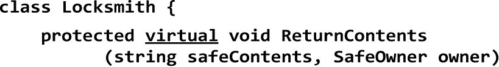
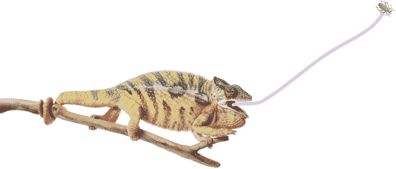
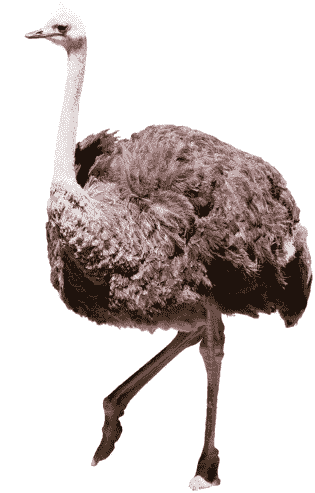
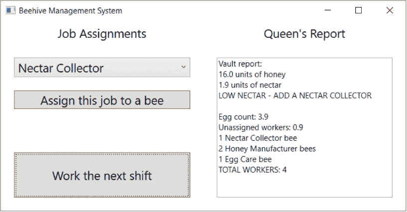
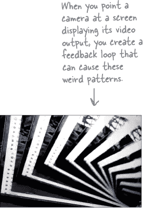

# 第六章。继承：*你的对象家族树*


**有时候，你确实想要像你的父母一样。** 是否遇到过一个几乎完全符合你所需类的类？是否发现自己想着如果能稍微***改变一些东西***，那个类就完美了？通过**继承**，您可以**扩展**现有类，以便您的新类获得其所有行为——同时具备灵活性，可以对其行为进行更改，以便根据需要进行定制。继承是 C#语言中最强大的概念和技术之一：借助它，您可以**避免重复的代码，更贴近模拟现实世界**，并最终获得**更易于维护**和**更少错误**的应用程序。

***这样做！***

+   *箭头的基础伤害是 1D6 点数乘以 0.35HP。*

+   *对于魔法箭，基础伤害乘以 2.5HP。*

+   *火焰箭增加额外的 1.25HP。*

+   *结果四舍五入**向上**取最近的整数 HP。*

# 计算更多武器的伤害

更新后的剑伤害计算器在游戏之夜上大获成功！现在 Owen 想要所有武器的计算器。让我们从箭头的伤害计算开始，它使用 1d6 点数。让我们**创建一个新的 ArrowDamage 类**来使用 Owen 游戏大师笔记本中箭头公式计算箭头伤害。

ArrowDamage 中的大部分代码与 SwordDamage 类中的代码***几乎相同***。这是我们启动新应用程序所需做的事情。

1.  **创建一个新的.NET 控制台应用程序项目。** 我们希望它能够同时进行剑和箭的计算，因此**向项目中添加 SwordDamage 类**。

1.  **创建一个 ArrowDamage 类，完全复制 SwordDamage 的代码。** 创建一个名为 ArrowDamage 的新类，然后**复制所有代码从 SwordDamage 并粘贴**到新的 ArrowDamage 类。然后更改构造函数名称为 ArrowDamage 以便程序构建。

1.  **重构常量。** 箭头伤害公式的基础和火焰伤害有不同的值，因此让我们将 BASE_DAMAGE 常量重命名为 BASE_MULTIPLIER，并更新常量值。我们认为这些常量使代码更易于阅读，因此也添加一个 MAGIC_MULTIPLIER 常量：

    

    ###### 注意

    ArrowDamage

    掷

    魔法

    火焰

    伤害

1.  **修改 CalculateDamage 方法**。现在，您唯一需要做的就是更新 CalculateDamage 方法，以便它执行正确的计算：

    

# 使用 switch 语句匹配多个候选人

让我们更新我们的控制台应用程序，询问用户是要计算箭头还是剑的伤害。我们将请求一个键，并使用静态的**Char.ToUpper** **方法**将其转换为大写：


我们***可以***使用`if/else`语句来做这个：

```cs
if (weaponKey == ’S’) { /* calculate sword damage */ }
else if (weaponKey == ’A’) { /* calculate arrow damage */ }
else return;
```

这就是我们到目前为止处理输入的方式。将一个变量与许多不同的值进行比较是一种非常常见的模式，你会一遍又一遍地看到它。这种情况非常普遍，以至于 C#有一种专门为这种情况设计的特殊语句。`switch` **语句**让你以一种简洁易读的方式比较一个变量与许多值。下面是一个`**switch**` **语句**，它与上面的`if/else`语句完全相同：


# 还有一件事...我们能计算匕首的伤害吗？还有狼牙棒？还有法杖？以及...

我们为剑和箭伤害制作了两个类。但是如果有三种其他武器呢？还是四种？还是 12 种？如果你必须维护该代码并稍后进行更改呢？如果你必须对五个或六个***紧密相关的***类进行***完全相同的更改***会怎样呢？如果你不断进行更改会怎样呢？错误肯定会发生——更新五个类而忘记更改第六个太容易了。


**你是对的！在不同的类中重复相同的代码是低效且容易出错的。**

幸运的是，C#给了我们一种更好的方式来构建彼此相关并共享行为的类：***继承***。

# 当你的类使用继承时，你只需要编写一次你的代码

你的 SwordDamage 和 ArrowDamage 类有很多相同的代码并非巧合。当你编写 C#程序时，通常会创建代表现实世界中事物的类，而这些事物通常彼此相关。你的类具有**相似的代码**，因为它们在现实世界中代表的事物——来自同一角色扮演游戏的两个相似计算——具有**相似的行为**。


当你有两个类是更一般的东西的具体情况时，你可以设置它们**继承**自相同的类。当你这样做时，它们中的每一个都是相同**基类**的**子类**。


# 通过从一般开始并变得更具体来构建你的类模型

当你   当你构建一组代表事物的类（特别是现实世界中的事物）时，你正在构建一个**类模型**。现实世界的事物通常处于从更一般到更具体的**层次结构**中，而你的程序也有自己的**类层次结构**，也是这样的。在你的类模型中，层次结构下面的类**继承**自上面的类。


# 你会如何设计一个动物园模拟器？

狮子、老虎和熊...哦，我的上帝！还有，河马、狼，偶尔也会有狗。你的工作是设计一个模拟动物园的应用程序。（不要太兴奋——我们不打算真的编写代码，只是设计代表动物的类。我们打赌你已经在考虑如何在 Unity 中完成这个任务了！）

我们已经得到了将在程序中出现的一些动物的列表，但不是所有动物。我们知道每个动物将由一个对象表示，并且这些对象将在模拟器中移动，执行每个特定动物编程的操作。

更重要的是，我们希望程序易于其他程序员维护，这意味着如果他们想要将新动物添加到模拟器中，他们需要能够稍后添加自己的类。

***让我们从为我们所知道的动物建立一个类模型开始。***

那么第一步是什么呢？在我们谈论**具体**的动物之前，我们需要找出它们共同拥有的**普遍**特征——所有动物都具备的抽象特征。然后我们可以将这些特征构建成一个基类，所有动物类都可以从中继承。

###### 注意

**术语“父类”、“超类”和“基类”通常可以互换使用。同样，“扩展”和“继承”这两个术语意思相同。“子类”也可以是一个动词。**

###### 注意

有些人使用术语“基类”来特指继承树顶部的类...但不是最顶部，因为每个类都继承自 Object 或 Object 的子类。

1.  **寻找动物共有的特征。**

    看看这六种动物。狮子、河马、老虎、猞猁、狼和狗有什么共同之处？它们如何相关联？您需要弄清它们的关系，以便能够提出包含它们所有的类模型。

    

1.  **构建一个基类，为动物提供它们共同拥有的一切。**

    基类中的字段、属性和方法将为所有继承它的动物提供一个共同的状态和行为。它们都是动物，因此将基类称为 Animal 是有道理的。

    您已经知道我们应该避免重复代码：这很难维护，并且总是会带来后续的头疼。因此，让我们为 Animal 基类选择您**只需编写一次**的字段和方法，并且每个动物子类都可以继承它们。让我们从公共属性开始：

    +   图片：指向图像文件的路径。

    +   食物：这种动物吃的食物类型。目前只能有两个值：肉和草。

    +   饥饿：表示动物饥饿水平的整数。它会随着动物吃饭的时间（和数量）而改变。

    +   边界：指向一个存储了围栏高度、宽度和位置的类的引用。

    +   位置：动物站立的 X 和 Y 坐标。

    另外，Animal 类还有四种动物可以继承的方法：

    +   发出声音：让动物发出声音的方法。

    +   进食：当动物遇到它们喜欢的食物时的行为。

    +   睡觉：让动物躺下来小睡的方法。

    +   游荡：使动物在它们的圈舍里四处游荡的方法。

        

# 不同的动物有不同的行为

狮子吼，狗叫，至于*我们*所知，河马根本不会发出任何声音。所有从 Animal 继承的类都将具有 MakeNoise 方法，但每个方法的工作方式都不同，并且具有不同的代码。当子类更改继承的方法的行为时，我们称其**覆盖**该方法。

###### 注意

仅因为一个属性或方法在 Animal 基类中，这并不意味着每个子类都必须以相同的方式使用它……或根本不使用！

1.  **弄清楚每种动物在 Animal 类做得不同或根本不做的事情。**

    每种动物都需要进食，但狗可能会小口吃肉，而河马则会大口吃草。那种行为的代码会是什么样子呢？狗和河马都会覆盖 Eat 方法。河马的方法会让它每次调用时消耗大约 20 磅的干草。另一方面，狗的 Eat 方法会减少动物园的食物供应一罐 12 盎司的狗粮。

    ###### 注意

    *所以，当你有一个子类继承自一个基类时，它**必须**继承所有基类的行为……但是你可以**修改**它们在子类中的执行方式，所以它们不是完全相同的。这就是覆盖的意义。*

    

1.  **寻找有很多共同点的类。**

    狗和狼看起来不是很相似吗？它们都是食肉动物，可以肯定的是，如果你观察它们的行为，它们有很多共同点。它们可能吃同样的食物，以相同的方式睡觉。那么山猫、老虎和狮子呢？事实证明，它们三者在它们的栖息地中的移动方式完全相同。可以肯定的是，你可以创建一个通用的 Feline 类，位于 Animal 和这三个猫科动物类之间，有助于防止它们之间的重复代码。

    

1.  **完成你的类层次结构。**

    现在你知道如何组织动物了，你可以添加 Feline 和 Canine 类。

    当你创建类时，使得顶部有一个基类，下面有子类，而这些子类有它们自己的子类从它们那里继承时，你建立的就是一个**类层次结构**。这不仅仅是为了避免重复代码，尽管这显然是合理层次结构的一个很大好处。这种层次结构的一个好处是代码更容易理解和维护。当你查看动物园模拟器代码，看到在 Feline 类中定义了一个方法或属性，你就*立刻知道*这是所有猫共享的东西。你的层次结构成为了一张地图，帮助你在程序中找到方向。

    

# 每个子类都扩展了它的基类

您不受限于子类从其基类继承的方法...但您已经知道了这一点！毕竟，您一直在构建自己的类。当您修改一个类以使其继承成员——我们很快就会在 C#代码中看到！——您所做的就是获取您已经构建的类，并通过添加基类中的所有字段、属性和方法来***扩展***它。所以如果你想为 Dog 添加一个 Fetch 方法，那是很正常的。它不会继承或覆盖任何东西——只有 Dog 类会有该方法，并且它不会出现在 Wolf、Canine、Animal、Hippo 或任何其他类中。


## C#总是调用最具体的方法

如果你告诉你的 Dog 对象漫游，只有一个方法可以调用——在 Animal 类中的方法。那么告诉你的 Dog 发出声音呢？调用哪个 MakeNoise？

嗯，弄清楚这个并不太难。Dog 类中的方法告诉你狗怎么发出声音。如果它在 Canine 类中，它告诉你所有犬类动物如何做到这一点。如果它在 Animal 类中，那么它是一个描述行为的行为，非常普遍，适用于每一种动物。所以如果你让你的 Dog 发出声音，首先 C#会查找 Dog 类中特别适用于狗的行为。如果 Dog 没有 MakeNoise 方法，它会检查 Canine，然后检查 Animal。

# 任何地方可以使用基类，你可以使用它的子类之一代替

继承中最有用的一件事情之一是**扩展**一个类。所以如果你的方法接受一个 Bird 对象，那么你可以传递一个 Woodpecker 的实例。该方法只知道它有一个鸟。它不知道它有什么种类的鸟，所以它只能要求它做所有鸟都能做的事情：它可以要求鸟走路和下蛋，但它不能要求它用嘴巴敲木头，因为只有啄木鸟有这种行为——而该方法不知道它具体是啄木鸟，只知道它是一个更一般的 Bird。它***只能访问它知道的类中的字段、属性和其他方法***。


# 使用冒号扩展基类

当你编写一个类时，你使用**冒号 (:)** 来让它继承自一个基类。这使得它成为一个子类，并给它**所有的字段、属性和方法**，来自于它继承的类。这个 Bird 类是 Vertebrate 的一个子类：


# 我们知道继承将基类的字段、属性和方法添加到子类中...

我们已经看到，当一个子类需要继承基类的***所有***方法、属性和字段时。


## ...但有些鸟不会飞！

如果你的基类有一个方法，你的子类需要***修改***，你会怎么做？


###### 注意

**糟糕——我们有了一个问题。企鹅是鸟类，而鸟类有一个名为 Fly 的方法，但我们不希望我们的企鹅飞行。如果企鹅试图飞行，显示一个警告将是很好的。**


# 子类可以重写方法来更改或替换它继承的成员

有时你有一个子类，你希望从基类继承*大多数*行为，但*不是全部*。当你想要改变类继承的行为时，你可以**重写方法或属性**，用同名的新成员替换它们。

当你**重写一个方法**时，你的新方法需要与它覆盖的基类方法具有完全相同的签名。对于企鹅来说，这意味着它需要被称为 Fly，返回 void，并且没有参数。

###### 注意

覆盖，动词。

to use authority to replace, reject, or cancel. *一旦她成为 Dynamco 的总裁，她可以**override**糟糕的管理决策。*

1.  **在基类方法中添加 virtual 关键字。**

    子类只能在一个标有`virtual`关键字的方法上重写它。在 Fly 方法声明中添加`virtual`告诉 C#，Bird 类的子类可以重写 Fly 方法。

    

1.  **在子类的同名方法上添加 override 关键字。**

    子类的方法将需要与基类完全相同的签名——相同的返回类型和参数——并且你将需要在声明中使用`**override**`关键字。现在，当 Penguin 对象调用其 Fly 方法时，会打印警告。

    


# 一些成员只在子类中实现

到目前为止，我们所见过的所有代码都是从对象外部访问子类的成员——就像你刚刚编写的代码中 Main 方法调用 LayEggs 一样。继承真正发挥作用的地方是基类**使用子类中实现的方法或属性**。这里有一个例子。我们的动物园模拟器有自动售货机，让游客购买苏打水、糖果和饲料，以供宠物区的动物食用。


VendingMachine 是所有售货机的基类。它有分发物品的代码，但这些物品未定义。检查游客是否放入正确金额的方法始终返回 false。为什么？因为它们**将在子类中实现**。以下是在宠物区分发动物饲料的子类：


# 使用调试器来理解重写的工作原理

让我们使用调试器来看看当我们创建一个 AnimalFeedVendingMachine 的实例并要求它分发一些饲料时究竟会发生什么。**创建一个新的 Console App 项目**，然后按照以下步骤操作。

***调试一下这个！***

1.  **添加 Main 方法**。以下是该方法的代码：

    ```cs
    class Program
    {
        static void Main(string[] args)
        {
            VendingMachine vendingMachine = new AnimalFeedVendingMachine();
            Console.WriteLine(vendingMachine.Dispense(2.00M));
        }
    }
    ```

1.  **添加 VendingMachine 和 AnimalFeedVendingMachine 类。** 一旦它们被添加，尝试将这行代码添加到 Main 方法中：

    ```cs
        vendingMachine.CheckAmount(1F);
    ```

    由于 `protected` 关键字，您将收到编译器错误，因为只有 VendingMachine 类或其子类可以访问其受保护的方法。

    

    删除该行以使您的代码构建。

1.  **在 Main 方法的第一行设置一个断点。** 运行程序。当它触发断点时，使用“逐行执行”（F10）逐行执行每行代码。以下是发生的情况：

    +   它创建 AnimalFeedVendingMachine 的实例并调用其 Dispense 方法。

    +   该方法仅在基类中定义，因此调用 VendingMachine.Dispense。

    +   VendingMachine.Dispense 的第一行调用受保护的 CheckAmount 方法。

    +   CheckAmount 在 AnimalFeedVendingMachine 子类中被覆盖，这导致 VendingMachine.Dispense 调用 AnimalFeedVendingMachine 中定义的 CheckAmount 方法。

    +   这个版本的 CheckAmount 返回 true，因此 Dispense 返回 Item 属性。AnimalFeedVendingMachine 也覆盖了此属性，它返回“一把动物饲料。”

    ###### 注意

    您一直在使用 Visual Studio 调试器来查找代码中的错误。它也是学习和探索 C# 的好工具，就像在这个“Debug this！”中一样，您可以探索覆盖的工作方式。您能想到更多实验覆盖子类的方法吗？


**有一个重要的原因需要使用 virtual 和 override！**

`virtual` 和 `override` 关键字不仅仅是装饰。它们在程序运行中真正起到作用。`virtual` 关键字告诉 C# 成员（如方法、属性或字段）可以被扩展——没有它，你根本无法覆盖它。`override` 关键字告诉 C# 你正在扩展该成员。如果在子类中省略 `override` 关键字，你实际上是创建了一个完全无关的方法，只是恰巧有相同的名称。

听起来有点奇怪，对吧？但实际上是有道理的——真正理解 `virtual` 和 `override` 如何工作的最佳方法就是编写代码。因此，让我们构建一个真实的示例来进行实验。

> **当子类覆盖其基类中的方法时，总是调用在子类中定义的更具体版本，即使它是由基类中的方法调用的。**

# 构建一个应用程序来探索 virtual 和 override

在 C#中，继承的一个非常重要的部分是扩展类成员。这就是子类可以从基类继承某些行为，但需要在需要的地方重写某些成员的地方——这就是`virtual`和`override`关键字的用途。`virtual`关键字确定哪些类成员可以被扩展。当你想扩展一个成员时，***必须***使用`override`关键字。让我们创建一些类来实验`virtual`和`override`。你将创建一个代表包含贵重珠宝的保险柜的类——为了一些狡猾的小偷来偷取珠宝。


1.  **创建一个新的控制台应用程序并添加 Safe 类。**

    这是 Safe 类的代码：

    

1.  **为拥有保险柜的人添加一个类。**

    保险柜的主人有些健忘，偶尔会忘记他们极为安全的保险柜密码。添加一个 SafeOwner 类来代表他们：

    ```cs
    class SafeOwner
    {
        private string valuables = "";
        public void ReceiveContents(string safeContents)
        {
            valuables = safeContents;
            Console.WriteLine($"Thank you for returning my {valuables}!");
        }
    }
    ```

1.  **添加一个能够挑锁的 Locksmith 类。**

    如果一个保险柜的主人雇佣专业的锁匠来打开他们的保险柜，他们期望那位锁匠安全无恙地归还里面的内容。这正是 Locksmith.OpenSafe 方法所做的事情：

    ###### 注意

    锁匠的 OpenSafe 方法挑锁、打开保险柜，然后调用 ReturnContents 将贵重物品安全地归还给主人。

    ```cs
    class Locksmith
    {
        public void OpenSafe(Safe safe, SafeOwner owner)
        {
            safe.PickLock(this);
            string safeContents = safe.Open(Combination);
            ReturnContents(safeContents, owner);
        }
        public string Combination { private get; set; }
        protected void ReturnContents(string safeContents, SafeOwner owner)
        {
            owner.ReceiveContents(safeContents);
        }
    }
    ```

    

1.  **添加一个想要窃取贵重物品的 JewelThief 类。**

    糟糕。看起来有个窃贼——更糟糕的是，他是一个高技能的锁匠，能够打开保险柜。添加这个扩展 Locksmith 的 JewelThief 类：

    ###### 注意

    JewelThief 扩展了 Locksmith 并继承了 OpenSafe 方法和 Combination 属性，但其 ReturnContents 方法窃取了珠宝而不是归还它们。聪明！

    ```cs
    class JewelThief : Locksmith
    {
        private string stolenJewels;
        protected void ReturnContents(string safeContents, SafeOwner owner)
        {
            stolenJewels = safeContents;
            Console.WriteLine($"I’m stealing the jewels! I stole: {stolenJewels}");
        }
    }
    ```

1.  **添加一个主方法，让珠宝窃贼偷走宝石。**

    现在是大抢劫的时候了！在这个主方法中，珠宝窃贼潜入房屋，并使用其继承的 Locksmith.OpenSafe 方法来获取保险柜的密码。**你认为它运行时会发生什么？**

    ```cs
    static void Main(string[] args)
    {
        SafeOwner owner = new SafeOwner();
        Safe safe = new Safe();
        JewelThief jewelThief = new JewelThief();
        jewelThief.OpenSafe(safe, owner);
        Console.ReadKey(true);
    }
    ```

# 子类可以隐藏基类中的方法

现在运行 JewelThief 程序。你应该看到以下内容：

**感谢您归还我的珍贵宝石！**

你是否预期程序的输出会有所不同？也许是这样的：

```cs
I’m stealing the jewels! I stole: precious jewels
```

看起来 JewelThief 对象表现得就像 Locksmith 对象一样！那么发生了什么？

## 隐藏方法与重写方法

JewelThief 对象在调用其 ReturnContents 方法时表现得像 Locksmith 对象一样，是因为 JewelThief 类声明了其 ReturnContents 方法的方式。在你编译程序时得到的警告信息中有一个重要的提示：


由于 JewelThief 类继承自 Locksmith 并用自己的方法替换了 ReturnContents 方法，看起来像是 JewelThief 覆盖了 Locksmith 的 ReturnContents 方法—但实际上并非如此。你可能期望 JewelThief 覆盖该方法（我们稍后会讨论），但实际上 JewelThief 是在隐藏它。

###### 注意

JewelThief

*Locksmith.* ReturnContents

*JewelThief.* ReturnContents

这有很大的不同。当子类***隐藏***一个方法时，它替换（技术上来说是重新声明）其基类中***同名的方法***。所以现在我们的子类实际上有两种不同的方法，它们共享一个名称：一个是从基类继承的，另一个是在该类中定义的全新方法。

## 当你隐藏方法时，请使用 `new` 关键字

仔细看看那个警告信息。当然，我们知道我们*应该*读取我们的警告，但有时我们不会...对吧？这一次，确实读一下它说了什么：`**如果打算隐藏，请使用 new 关键字**`。

因此，回到你的程序并添加 `new` 关键字：

```cs
new public void ReturnContents(Jewels safeContents, Owner owner)
```

一旦在 JewelThief 类的 ReturnContents 方法声明中加入了 `new` 关键字，警告信息就会消失—但是你的代码仍然不会按照你的期望行动！

它仍然调用了 Locksmith 类中定义的 ReturnContents 方法。为什么？因为 ReturnContents 方法正是**由 Locksmith 类定义的一个方法**—具体来说，是在 Locksmith.OpenSafe 内部调用，即使这是由 JewelThief 对象发起的。如果 JewelThief 只是隐藏了 Locksmith 的 ReturnContents 方法，那么它自己的 ReturnContents 方法将永远不会被调用。

> 如果子类只是添加了一个与基类中方法同名的方法，它只会隐藏基类方法而不是覆盖它。

## 使用不同的引用来调用隐藏方法

现在我们知道 JewelThief 只是***隐藏***了 ReturnContents 方法（与***覆盖***不同）。这导致它在像 Locksmith 对象一样被调用时表现得像一个 Locksmith 对象。JewelThief 继承了 Locksmith 的一个版本的 ReturnContents，并定义了第二个版本，这意味着有两个同名方法。这意味着你的类需要**两种不同的调用方式**。

有两种不同的调用 ReturnContents 方法的方式。如果你有一个 JewelThief 的实例，你可以使用 JewelThief 的引用变量来调用新的 ReturnContents 方法。如果你使用 Locksmith 的引用变量来调用它，它将调用隐藏的 Locksmith ReturnContents 方法。

这是如何工作的：

###### 注意

```cs
// The JewelThief subclass hides a method in the Locksmith base class,
// so you can get different behavior from the same object based on the
// reference you use to call it!

// Declaring your JewelThief object as a Locksmith reference causes it to
// call the base class ReturnContents() method.
Locksmith calledAsLocksmith = new JewelThief();
calledAsLocksmith.ReturnContents(safeContents, owner);

// Declaring your JewelThief object as a JewelThief reference causes it to
// call JewelThief’s ReturnContents() method instead, because it hides
// the base class’s method of the same name.
JewelThief calledAsJewelThief = new JewelThief();
calledAsJewelThief.ReturnContents(safeContents, owner);
```

###### 注意

**你能想出如何使 JewelThief 覆盖 ReturnContents 方法而不仅仅是隐藏它吗？在阅读下一节之前，看看你能否做到！**

# 使用 override 和 virtual 关键字来继承行为

我们真的希望我们的 JewelThief 类始终使用自己的 ReturnContents 方法，无论如何调用它。这通常是我们期望继承工作的方式：子类可以 **重写** 基类的方法，使得调用子类中的方法。首先在声明 ReturnContents 方法时使用 `override` 关键字：  


但这还不是你需要做的一切。如果只是在类声明中添加 `override` 关键字，你会得到一个编译器错误：


再次，仔细观察并阅读错误信息。JewelThief 无法重写继承的成员 ReturnContents **因为它在 Locksmith 中没有标记** `virtual, abstract` 或 `override`。好的，这是一个我们可以通过快速更改来修复的错误。用 `virtual` 关键字标记 Locksmith 的 ReturnContents 方法：



现在重新运行你的程序。这是我们一直在寻找的输出结果：


**没错。大多数情况下你会想要重写方法，但隐藏它们也是一种选择。**

当你在一个扩展基类的子类中工作时，你更有可能使用重写而不是隐藏。所以当你看到关于隐藏方法的编译器警告时，要注意！确保你真的想隐藏该方法，而不是只是忘记使用 `virtual` 和 `override` 关键字。如果你总是正确使用 `virtual`、`override` 和 `new` 关键字，你就不会再遇到这样的问题了！

> 如果你想在基类中重写一个方法，总是使用 `virtual` 关键字进行标记，并且每次你想在子类中重写方法时都使用 `override` 关键字。如果不这样做，你可能会意外隐藏方法。

# 子类可以使用 base 关键字访问其基类

即使在基类中重写了方法或属性，有时你仍然希望访问它。幸运的是，我们可以使用 `base` 关键字来访问基类的任何成员。

1.  **所有动物都吃东西，所以 Vertebrate 类有一个以 Food 对象为参数的 Eat 方法。**

    ```cs
    class Vertebrate {
       public virtual void Eat(Food morsel) {
          Swallow(morsel);
          Digest();
       }
    }
    ```

    

1.  **变色龙通过用舌头捕食来进食。因此，Chameleon 类继承自 Vertebrate 但重写了 Eat 方法。**

    

1.  **我们可以使用 `base` 关键字调用被重写的方法，而不是复制代码。现在我们可以访问旧版本和新版本的 Eat 方法。**

    

# 当一个基类有构造函数时，你的子类需要调用它。

让我们回到你用 Bird、Pigeon、Ostrich 和 Egg 类编写的代码。我们想要添加一个 BrokenEgg 类扩展 Egg，并且让鸽子产下的蛋中有 25% 是破损的。在 Pigeon.LayEgg 中，用这个 `if/else` 语句替换掉原来的 `new` 语句，来创建一个新的 Egg 或 BrokenEgg 实例：

***添加这个！***

```cs
    if (Bird.Randomizer.Next(4) == 0)
        eggs[i] = new BrokenEgg(Bird.Randomizer.NextDouble() * 2 + 1, "white");
    else
        eggs[i] = new Egg(Bird.Randomizer.NextDouble() * 2 + 1, "white");
```

现在我们只需要一个扩展 Egg 的 BrokenEgg 类。让我们使它与 Egg 基类相同，只是它有一个构造函数，用来向控制台输出一条消息，告诉我们一个蛋是破碎的：

```cs
class BrokenEgg : Egg
{
    public BrokenEgg()
    {
        Console.WriteLine("A bird laid a broken egg");
    }
}
```

继续并**进行这两个更改**到你的 Egg 程序。

哎呀—看起来那些新代码行引起了编译器错误：

+   第一个错误出现在你创建一个新的 BrokenEgg 的那一行：*CS1729 – ’BrokenEgg’没有包含一个接受 2 个参数的构造函数*

+   第二个错误在 BrokenEgg 构造函数中：*CS7036 – 没有提供与’Egg.Egg(double, string)’的必需形式参数’size’对应的参数*

这是另一个很好的机会***阅读这些错误***并找出哪里出错了。第一个错误非常清楚：创建 BrokenEgg 实例的语句试图传递两个参数给构造函数，但 BrokenEgg 类只有一个无参数的构造函数。因此，请**向构造函数添加参数**：

```cs
public BrokenEgg(double size, string color)
```

这解决了第一个错误—现在 Main 方法编译得很好。其他错误呢？

让我们分析一下那个错误说了什么：

+   它在*Egg.Egg(double, string)*上抱怨—这是指 Egg 类的构造函数。

+   它说了些关于*参数’大小’*的东西，这是 Egg 类需要的，以便设置其 Size 属性。

+   但是*没有提供参数*，因为仅仅修改 BrokenEgg 构造函数以接受与参数相匹配是不够的。它还需要**调用基类构造函数**。

修改 BrokenEgg 类以**使用`base`关键字调用基类构造函数：**

```cs
public BrokenEgg(double size, string color): base(size, color)
```

现在你的代码编译了。尝试运行它—现在当鸽子下蛋时，大约四分之一的蛋在实例化时会打印关于破碎的消息（但之后，其余的输出与之前相同）。

###### 注意


**轻松回到旧项目。**

你可以通过从文件菜单中选择*最近的项目和解决方案*（Windows）或*最近的解决方案*（Mac）来让 IDE 加载以前的项目。

# 子类和基类可以有不同的构造函数

当我们修改 BrokenEgg 以调用基类构造函数时，我们使其构造函数与 Egg 基类中的构造函数匹配。如果我们想让所有破碎的蛋的大小为零，并且颜色以“破碎”开头，**修改实例化 BrokenEgg 的语句**以只接受颜色参数：

```cs
 if (Bird.Randomizer.Next(4) == 0)
 eggs[i] = new BrokenEgg("white");
 else
 eggs[i] = new Egg(Bird.Randomizer.NextDouble() * 2 + 1, "white");
```

***修改这个！***

当你做出这些更改时，你会再次得到“必需形式参数”编译器错误—这是有道理的，因为 BrokenEgg 构造函数有两个参数，但你只传递了一个参数。

通过**修改 BrokenEgg 构造函数以接受一个参数**来修复你的代码：


现在再次运行你的程序。在鸽子构造函数的 for 循环中，BrokenEgg 构造函数仍然会将其消息写入控制台，但现在它还会导致 Egg 初始化其 Size 和 Color 字段。当 Main 方法中的 foreach 循环将 egg.Description 写入控制台时，它会为每个破碎的蛋写入这条消息：

```cs
Press P for pigeon, O for ostrich:
p
How many eggs should it lay? 7
A bird laid a broken egg
A bird laid a broken egg
A bird laid a broken egg
A 2.4cm white egg
A 0.0cm broken White egg
A 3.0cm white egg
A 1.4cm white egg
A 0.0cm broken White egg
A 0.0cm broken White egg
A 2.7cm white egg
```

###### 注意

你知道鸽子通常只产下一到两个蛋吗？你会如何修改 Pigeon 类以考虑这一点？



# 是时候为 Owen 完成工作了

本章中你做的第一件事是修改为 Owen 构建的伤害计算器，以便为剑或箭进行伤害掷骰。它起作用了，你的 SwordDamage 和 ArrowDamage 类封装良好。但除了几行代码外，***这两个类是相同的***。你已经学会了在不同类中重复代码是低效和容易出错的，特别是如果你想继续扩展程序以添加更多不同种类武器的类。现在你有了一个解决这个问题的新工具：**继承**。所以现在是时候完成伤害计算器应用程序了。你将分两步完成：首先你会在纸上设计新的类模型，然后你会在代码中实现它。

**在编写代码之前在纸上构建你的类模型有助于更好地理解问题，从而更有效地解决它。**


# 当你的类尽可能少地重叠时，这是一个重要的设计原则，称为关注点分离。

如果你今天设计好你的类，以后修改起来会更容易。想象一下，如果你有十几个不同的类来计算不同武器的伤害。如果你想将 Magic 从布尔值更改为整数，这样你就可以拥有具有附魔奖励的武器（如+3 魔法权杖或+1 魔法匕首）会怎样？通过继承，你只需更改超类中的 Magic 属性。当然，你必须修改每个类的 CalculateDamage 方法，但这将是更少的工作量，而且不会有遗漏修改其中一个类的危险。（这在专业软件开发中*经常发生！*）

这是**关注点分离**的一个例子，因为每个类只包含解决程序解决的问题的一个特定部分的代码。只涉及剑的代码放在 SwordDamage 中，只涉及箭的代码放在 ArrowDamage 中，而只涉及它们之间共享的代码放在 WeaponDamage 中。

当你设计类时，关注点分离是你应该考虑的首要事项之一。如果一个类似乎在做两件不同的事情，试着看看是否可以将其拆分为两个类。


**当你的类封装良好时，它会使你的代码更容易修改。**

如果你认识一个专业的开发者，问问他们在过去一年中工作中最让他们烦恼的事情是什么。他们很可能会谈到不得不修改一个类，但为了做到这一点，他们必须更改另外两个类，这就需要三个其他的更改，而且很难跟踪所有的更改。在设计类时考虑封装是避免陷入这种情况的好方法。

## 使用调试器真正理解这些类如何工作。

本章中最重要的一个概念之一是，当你扩展一个类时，你可以重写它的方法，从而对它的行为做出相当大的改变。使用调试器真正理解它是如何工作的：

+   在调用 CalculateDamage 的 Roll、Magic 和 Flaming setter 行上设置断点。

+   在 WeaponDamage.CalculateDamage 中添加一个 Console.WriteLine 语句。*这个语句永远不会被调用*。

+   运行你的程序。当它命中任何断点时，使用**Step Into**进入 CalculateDamage 方法。***它将进入子类*** —— WeaponDamage.CalculateDamage 方法从未被调用。

做这个！

###### 注意

我们即将讨论游戏设计的一个重要元素：动态性。实际上，它是一个如此重要的概念，以至于它超越了游戏设计。事实上，你几乎可以在任何类型的应用程序中找到动态性。

###### 注意

一开始，动态性可能感觉像一个非常抽象的概念！在本章后面的时间里我们会更多地讨论它 —— 但现在，在你编写下一个项目时，请记住所有与动态性相关的内容。


**视频游戏** *是* 严肃的生意。

视频游戏行业每年在全球范围内都在增长，并雇佣成千上万的人，这是一个有才华的游戏设计师可以进入的行业！有一个完整的**独立游戏开发者**生态系统，他们个人或小团队构建和销售游戏。

但你是对的 —— C# 是一门严肃的语言，它被用于各种严肃的非游戏应用程序。事实上，虽然 C#是游戏开发人员喜爱的语言之一，但它也是许多不同行业中的企业中最常见的语言之一。

所以，对于下一个项目，让我们通过构建一个***严肃的商业应用程序***来练习继承。

###### 注意

前往 Visual Studio for Mac 学习指南，查看该项目的 Mac 版本。

# 构建一个蜂箱管理系统。

***蜂王需要你的帮助！*** 她的蜂箱失控了，她需要一个程序来帮助管理她的蜜生产业务。她有一个满是工人的蜂箱，以及一大堆需要在蜂箱周围完成的工作，但不知何故，她失去了对哪只蜜蜂正在做什么以及她是否有足够的蜜能力来完成这些工作的控制。你需要建立一个**蜂箱管理系统**来帮助她跟踪她的工人。以下是它的工作原理。


1.  **皇后分配工作给她的工人们。**

    工人们可以做三种不同的工作。**采蜜蜂**飞出去将花蜜带回蜂箱。**制蜜蜂**把花蜜转化为蜜，蜜蜂吃以维持工作。最后，蜂王不断产卵，**蛋护理**蜜蜂确保它们成为工人。

1.  **当所有工作都分配完毕，就是工作的时候了。**

    皇后分配工作完成后，她会通过在她的蜂箱管理系统应用程序中点击“开始下一个班次”按钮，告诉蜜蜂们去工作，这将生成一个班次报告，告诉她分配到每个工作的蜜蜂数量以及蜜罐中花蜜和蜜的状态。

    

1.  就像所有的业务领袖一样，皇后专注于**增长**。蜂箱业务是一项艰苦的工作，她用工蜂的总人数来衡量她的蜂箱。你能帮助皇后继续增加工蜂吗？她能在蜜用尽之前让蜂箱增长到多大？

# 蜂箱管理系统类模型

这里是你将为蜂箱管理系统构建的类。有一个带有基类和四个子类的继承模型，一个静态类来管理驱动蜂箱业务的蜜和花蜜，以及具有主窗口代码后台的`MainWindow`类。


###### 注意


**这个类模型只是一个开始。我们将提供更多细节，以便您编写代码。**

仔细检查这个类模型。它包含了即将构建的应用程序的大量信息。接下来，我们将为您提供编写这些类所需的所有细节。

# 皇后类：她如何管理工蜂

当你**按下按钮来开始下一个班次**时，按钮的点击事件处理程序调用了皇后对象的`WorkTheNextShift`方法，该方法继承自蜜蜂基类。接下来会发生以下事情：

+   `Bee.WorkTheNextShift`调用`HoneyVault.ConsumeHoney(HoneyConsumed)`，使用`CostPerShift`属性（每个子类使用不同值进行覆盖）来确定她需要多少蜜来工作。

+   `Bee.WorkTheNextShift`接着调用`DoJob`，皇后也对此进行了重写。

+   `Queen.DoJob`会向她的私人蛋字段添加 0.45 个蛋（使用一个名为`EGGS_PER_SHIFT`的常量）。`EggCare`蜜蜂将调用她的`CareForEggs`方法，这会减少蛋的数量并增加未分配工人的数量。

+   然后它使用 foreach 循环调用每个工作人员的 WorkTheNextShift 方法。

+   每个未分配的工作人员每个班次消耗蜂蜜。常量 HONEY_PER_UNASSIGNED_WORKER 跟踪每个工作人员每班次消耗的蜂蜜量。

+   最后，它调用它的 UpdateStatusReport 方法。

当您**按下按钮分配工作**给一只蜜蜂时，事件处理程序调用女王对象的 AssignBee 方法，该方法接受一个字符串作为工作名称（您将从 jobSelector.text 中获取该名称）。它使用`switch`语句来创建适当的 Bee 子类的新实例，并将其传递给 AddWorker，所以确保您在 Queen 类中**添加 AddWorker 方法**。


###### 注意

**Array 实例的长度在其生命周期中不能被更改。这就是为什么 C#有这个有用的静态**Array.Resize 方法。它实际上不会调整数组的大小。相反，它会创建一个新数组，并将旧数组的内容复制到新数组中。请注意它如何使用 ref 关键字——我们将在本书的后面学到更多关于它的知识。**

```cs
/// <summary>
/// Expand the workers array by one slot and add a Bee reference.
/// </summary>
/// <param name="worker">Worker to add to the workers array.</param>
private void AddWorker(Bee worker)
{
    if (unassignedWorkers >= 1)
    {
        unassignedWorkers--;
        Array.Resize(ref workers, workers.Length + 1);
        workers[workers.Length - 1] = worker;
    }
}
```

###### 注意

要将新工作人员添加到女王的工作人员数组中，您需要使用这个 AddWorker 方法。它调用 Array.Resize 来扩展数组，然后将新工作人员 Bee 添加到数组中。

# UI：为主窗口添加 XAML

创建一个名为**蜂巢管理系统**的新 WPF 应用程序。主窗口采用一个网格布局，`Title="蜂巢管理系统" Height="325" Width="625"`。它使用了您在前几章中使用过的相同的 Label、StackPanel 和 Button 控件，并引入了两个新控件。作业分配下拉列表是一个**ComboBox**控件，允许用户从一个选项列表中进行选择。女王报告下的状态报告显示在一个**TextBox**控件中。


###### 注意

不要被这个练习的长度所吓倒或者感到不知所措！只需将其分解为小步骤。一旦开始工作，您会发现这都是您学到的东西的复习。


**好吧，你们猜对了。是的，这是一个游戏。**

具体来说，这是一个**资源管理游戏**，或者一个重点放在收集、监控和使用资源上的游戏。如果您玩过像 SimCity 这样的模拟游戏或者像文明这样的策略游戏，您将会认识到资源管理是游戏的重要部分，您需要资源如金钱、金属、燃料、木材或水来运营一个城市或建立一个帝国。

**资源管理游戏是实验***机制、动态和美学***关系的绝佳方式：

+   **机制**很简单：玩家分配工作人员，然后启动下一个班次。然后每只蜜蜂要么添加花蜜，要么减少花蜜/增加蜂蜜，要么减少卵/增加工作人员。卵数增加，并显示报告。

+   **美学**更加复杂。玩家感受到当蜜或花蜜水平下降时的压力，并显示低水平警告时的兴奋。当他们做出选择并影响游戏时感到满足——然后再次感到压力，因为数字停止增加并开始再次减少。

+   游戏由**动态**驱动。没有任何代码使蜂蜜或花蜜稀缺——它们只是被蜜蜂和蛋消耗。

###### 注：

真的花一分钟思考这个，因为它触及到动态本质。你看到如何在其他类型的程序中使用其中一些想法，而不仅仅是游戏吗？

# 反馈驱动你的蜂巢管理游戏。

让我们花几分钟真正了解这款游戏是如何运作的。花蜜转化比对你的游戏有很大影响。如果你改变常数，它可能会对游戏玩法产生很大影响。如果只需少量蜂蜜即可将蛋转化为工蜂，游戏会变得非常容易。如果需要很多，游戏会变得更加困难。但是如果你查看类，你不会找到困难设置。在任何类上都没有困难字段。你的女王不会获得特殊的力量来帮助游戏变得更容易，或者艰难的敌人或 boss 战来增加难度。换句话说，没有明确创建蛋或工蜂数量与游戏难度之间关系的***代码***。那么究竟发生了什么？

你可能之前玩过**反馈**。在你的手机和电脑之间启动一个视频通话。将手机靠近电脑扬声器，你会听到嘈杂的回声。将相机对准电脑屏幕，你会看到屏幕的图像在图像的屏幕中，如果你倾斜手机，它将变成一个疯狂的图案。这就是反馈：你正在将实时视频或音频输出反馈到输入中。视频通话应用程序的代码中没有专门生成那些疯狂声音或图像的部分。相反，它们是从反馈中**出现**的。



## 工人和蜂蜜处于反馈循环中。

你的蜂巢管理游戏是基于一系列**反馈循环**：许多小循环，在游戏的各个部分相互作用。例如，蜂蜜生产商向金库中添加蜂蜜，蜂蜜被蜜蜂消耗，蜜蜂再制造更多的蜂蜜。


这只是一个反馈循环。在你的游戏中有许多不同的反馈循环，它们使整个游戏变得更加复杂、更加有趣，希望是更加有趣的。


# 蜂巢管理系统是一种回合制的……现在让我们将其转换为实时。

**回合制游戏**是将游戏流程分解为若干部分的游戏——在蜂巢管理系统的情况下，分解为轮次。只有当您点击按钮时，下一个轮次才会开始，因此您可以随意分配工人。我们可以使用一个`DispatcherTimer`（就像您在#start_building_with_chash_build_somethin 中使用的那个）将其**转换为实时游戏**，而且只需几行代码即可实现。

1.  **在您的 MainWindow.xaml.cs 文件顶部添加一个 using 行。**

    我们将使用一个`DispatcherTimer`来强制游戏每隔一秒半进行下一轮操作。`DispatcherTimer`位于`System.Windows.Threading`命名空间中，因此您需要将以下`using`行添加到您的*MainWindow.xaml.cs*文件顶部：

    ```cs
    using System.Windows.Threading;
    ```

    ###### 注意

    **您在#start_building_with_chash_build_somethin 中使用了一个`DispatcherTimer`为您的动物匹配游戏添加了一个计时器。这段代码与您在#start_building_with_chash_build_somethin 中使用的代码非常相似。花几分钟回顾一下那个项目，以便提醒自己`DispatcherTimer`的工作原理。**

1.  **添加一个私有字段，引用一个`DispatcherTimer`。**

    现在您需要创建一个新的`DispatcherTimer`。将其放在 MainWindow 类的顶部作为一个私有字段：

    ```cs
    private DispatcherTimer timer = new DispatcherTimer();
    ```

1.  **使计时器调用“工作轮次”按钮的 Click 事件处理方法。**

    我们希望计时器能够推动游戏向前发展，因此如果玩家不足够快地点击按钮，它将自动触发下一轮操作。首先添加以下代码：

    

现在运行游戏。每隔 1.5 秒钟就会开始一个新的轮次，无论您是否点击按钮。这对机制来说是一个小变化，但它***显著改变了游戏的动态***，从而在美学上产生了巨大差异。由您决定游戏是作为回合制还是实时模拟更好。


**是的！计时器改变了机制，从而改变了动态，进而影响了美学。**

让我们花一分钟思考一下这个反馈循环。机制的变化（每隔 1.5 秒自动点击“进行下一轮操作”按钮的计时器）创造了一个全新的动态：玩家必须在一定时间内做出决策，否则游戏会替他们做出决策。这增加了压力，对某些玩家来说提供了令人满意的肾上腺素冲击，但对其他玩家来说只是造成了压力——美学发生了变化，对一些人来说使游戏更有趣，但对其他人来说则没那么有趣。

但是您只向游戏中添加了半打行代码，而且其中没有包括“做出这个决定，否则”的逻辑。这是计时器和按钮如何协同工作所**衍生出的**行为的一个例子。

###### 注意

这里也有一个反馈环路。随着玩家感受到更大的压力，他们会做出更糟糕的决策，改变游戏……美学反过来影响了机制。


**反馈环路和新兴行为是重要的编程概念。**

我们设计这个项目是为了让你练习继承，*同时*让你探索和实验**新兴**行为。这种行为不仅来自于你的对象单独做什么，还来自于***对象之间如何相互作用***。游戏中的常数（如花蜜转换比）是这种新兴互动的重要组成部分。当我们创建这个练习时，我们从一些初始值开始设置这些常数，然后通过微小的调整来调整它们，直到我们得到一个不完全处于**平衡**状态的系统——这是一种一切都完美平衡的状态——所以玩家需要继续做出决策，以尽可能地延长游戏时间。这一切都受到蛋、工人、花蜜、蜂蜜和女王之间的反馈环路的驱动。

###### 注意

尝试用这些反馈环路进行实验。例如，每班增加更多的蛋或者用更多的蜜开始蜂巢，游戏会变得更容易。继续吧，试试看！你可以通过对几个常数进行小的修改来改变整个游戏的感觉。

# 有些类永远不应该被实例化

还记得我们的动物园模拟器类层次结构吗？你肯定会实例化一堆河马、狗和狮子。那么 Canine 和 Feline 类呢？动物类呢？事实证明，**有些类根本不需要被实例化**……实际上，*如果它们被实例化了，就毫无意义*。

听起来奇怪吗？事实上，这种情况经常发生——事实上，你在本章早些时候创建了几个类，它们永远不应该被实例化。


```cs
class Bird
{
    public static Random Randomizer = new Random();
    public virtual Egg[] LayEggs(int numberOfEggs)
    {
        Console.Error.WriteLine
             ("Bird.LayEggs should never get called");
        return new Egg[0];
    }
}
```


```cs
class WeaponDamage
{
     /* ... code for the properties ... */  }
    protected virtual void CalculateDamage()
    {
        /* the subclass overrides this */ 
    }
    public WeaponDamage(int startingRoll)
    {
        roll = startingRoll;
        CalculateDamage();
    }
}
```

###### 注意

**你的 Bird 类很小——它只有一个共享的 Random 实例和一个 LayEggs 方法，只存在于子类可以覆盖它的情况下。你的 WeaponDamage 类要大得多——它有很多属性。它还有一个 CalculateDamage 类，供子类覆盖，它从它的 WeaponDamage 方法调用。**


```cs
class Bee
{
    public virtual float CostPerShift { get; }
    public string Job { get; private set; }
    public Bee(string job)
    {
        Job = job;
    }
    public void WorkTheNextShift()
    {
        if (HoneyVault.ConsumeHoney(CostPerShift))
        {
            DoJob();
        }
    }
    protected virtual void DoJob() { /* the subclass overrides this */  }
}
```

###### 注意

**Bee 类有一个 WorkTheNextShift 方法，消耗蜜然后做蜜蜂应该做的工作——因此它期望子类覆盖 DoJob 方法来实际执行工作。**

# 抽象类是一个有意不完整的类

很常见的情况是有一个类具有“占位符”成员，期望子类来实现。它可以位于层次结构的顶部（例如 Bee、WeaponDamage 或 Bird 类）或中间（例如动物园模拟器类模型中的 Feline 或 Canine）。它们利用 C#总是调用最具体方法的特性，例如 WeaponDamage 调用仅在 SwordDamage 或 ArrowDamage 中实现的 CalculateDamage 方法，或者 Bee.WorkTheNextShift 依赖于子类来实现 DoJob 方法。

C#专门为此构建了一个工具：**抽象类**。这是一个故意不完整的类，其中的空类成员作为子类实现的占位符。要使一个类成为抽象类，需在类声明中添加`abstract`关键字。以下是关于抽象类的重要内容。

+   **抽象类的工作方式与普通类完全相同。**

    定义抽象类与定义普通类几乎完全相同。它有字段和方法，可以像普通类一样继承其他类。几乎没有什么新的东西需要学习。

+   **抽象类可以具有不完整的“占位符”成员。**

    抽象类可以包含需要由继承类实现的属性和方法声明。具有声明但没有语句或方法体的方法称为**抽象方法**，而仅声明其访问器而不定义其方法体的属性称为**抽象属性**。扩展抽象类的子类必须实现所有抽象方法和属性，除非它们本身也是抽象的。

+   **只有抽象类可以拥有抽象成员。**

    如果你在一个类中放置了抽象方法或属性，则必须将该类标记为抽象，否则你的代码将无法编译。稍后你将了解如何将类标记为抽象。

+   **抽象类不能被实例化。**

    抽象的反义词是**具体**。具体方法是有方法体的方法，到目前为止你所使用的所有类都是具体类。抽象类和具体类最大的不同之处在于你不能使用`new`关键字创建抽象类的实例。如果尝试这样做，C#在编译代码时会报错。

    现在试试吧！**创建一个新的控制台应用程序**，添加一个空的抽象类，并尝试实例化它：

    


**因为你希望提供部分代码，但仍然要求子类填写其余的代码。**

有时候当你创建不应该被实例化的对象时***会发生糟糕的事情***。类图顶部的类通常有一些字段，它期望其子类设置。例如，Animal 类可能有一个依赖于名为 HasTail 或 Vertebrate 的布尔值的计算，但它本身无法设置这些值。***以下是一个创建该类时出现问题的快速示例...***

***做这个！***

```cs
class PlanetMission
{
    protected float fuelPerKm;
    protected long kmPerHour;
    protected long kmToPlanet;
    public string MissionInfo()
    {
        long fuel = (long)(kmToPlanet * fuelPerKm);
        long time = kmToPlanet / kmPerHour;
        return $"We’ll burn {fuel} units of fuel in {time} hours";
    }
}
class Mars : PlanetMission
{
    public Mars()
    {
        kmToPlanet = 92000000;
        fuelPerKm = 1.73f;
        kmPerHour = 37000;
    }
}
class Venus : PlanetMission
{
    public Venus()
    {
        kmToPlanet = 41000000;
        fuelPerKm = 2.11f;
        kmPerHour = 29500;
    }
}
class Program
{
    public static void Main(string[] args)
    {
        Console.WriteLine(new Venus().MissionInfo());
        Console.WriteLine(new Mars().MissionInfo());
        Console.WriteLine(new PlanetMission().MissionInfo());
    }
}
```

**在运行此代码之前，你能猜到它会打印什么到控制台吗？**


# 正如我们所说，有些类永远不应该被实例化。

尝试运行 PlanetMission 控制台应用程序。它表现如你所期望的吗？它在控制台打印了两行：

```cs
We’ll burn 86509992 units of fuel in 1389 hours
We’ll burn 159160000 units of fuel in 2486 hours
```

但然后它抛出了一个异常。

所有问题都始于你创建 PlanetMission 类的实例。它的 FuelNeeded 方法期望子类设置字段。当它们没有设置时，它们会得到它们的默认值——零。当 C#试图将一个数字除以零时……


## 解决方案：使用一个抽象类

当你将一个类标记为`abstract`时，C#不会让你编写代码来实例化它。那么这如何解决这个问题呢？就像古话说的那样——预防胜于治疗。在 PlanetMission 类声明中添加`abstract`关键字：


一旦你做出这个改变，编译器就会给你一个错误：


你的代码根本编译不了——没有编译的代码就没有异常。这与你在#封装 _ 保持您的私人信息中使用`private`关键字的方式非常相似，或者在本章早些时候使用`virtual`和`override`关键字一样。使一些成员私有并不会改变行为。它只是防止你的代码在违反封装性时编译。`abstract`关键字的工作方式也相同：你永远不会因为实例化抽象类而得到异常，因为 C#编译器*根本不允许你首先实例化它*。

> 当你在类声明中添加 abstract 关键字时，每当你试图创建该类的实例时，编译器都会给出一个错误。

# 一个抽象方法没有方法体

你构建的 Bird 类从来就不是用来实例化的。这就是为什么如果程序试图实例化它并调用其 LayEggs 方法，它会使用 Console.Error 输出错误消息：

```cs
class Bird
{
    public static Random Randomizer = new Random();
    public virtual Egg[] LayEggs(int numberOfEggs)
    {
        Console.Error.WriteLine
             ("Bird.LayEggs should never get called");
        return new Egg[0];
    }
}
```

由于我们根本不希望实例化 Bird 类，让我们在其声明中添加`abstract`关键字。但这还不够——不仅应该禁止实例化这个类，而且我们希望**要求**每个扩展 Bird 的子类**必须覆盖**LayEggs 方法。

这正是当你在类成员中添加`abstract`关键字时发生的情况。一个**抽象方法**只有一个类声明，但是***没有方法体***，必须由任何扩展抽象类的子类实现。方法的**方法体**是在声明之后的大括号之间的代码，这是抽象方法不能拥有的。

回到你之前的鸟项目，用这个抽象类**替换 Bird 类**：


```cs
abstract class Bird
{
    public static Random Randomizer = new Random();
    public abstract Egg[] LayEggs(int numberOfEggs);
}
```

你的程序仍然像之前一样运行！但尝试在 Main 方法中添加这一行：

```cs
Bird abstractBird = new Bird();
```

你会得到一个编译器错误：


尝试给 LayEggs 方法添加一个方法体：

```cs
    public abstract Egg[] LayEggs(int numberOfEggs)
    {
        return new Egg[0];
    }
```

你会得到一个不同的编译器错误：


> **如果一个抽象类有虚拟成员，每个子类必须覆盖所有这些成员。**

# 抽象属性的工作方式就像抽象方法一样

让我们回到我们之前示例中的 Bee 类。我们已经知道我们不希望这个类可以被实例化，所以让我们修改它将其变成一个抽象类。我们可以通过在类声明中添加`abstract`修饰符，并将 DoJob 方法改为没有方法体的抽象方法来实现：

```cs
abstract class Bee
{
   /* the rest of the class stays the same */
   protected abstract void DoJob();
}
```

但还有另一个虚拟成员——它不是一个方法。它是 CostPerShift 属性，Bee.WorkTheNextShift 方法调用它来计算蜜蜂本班次需要多少蜂蜜：

```cs
   public virtual float CostPerShift { get; }
```

我们在#encapsulation_keep_your_privateshellippr 中学到，属性实际上只是被称为字段的方法。使用`abstract` **关键字创建抽象属性**，就像创建方法一样：

```cs
   public abstract float CostPerShift { get; }
```

抽象属性可以有获取器、设置器或两者。抽象属性中的设置器和获取器**不能有方法体**。它们的声明看起来像自动属性——但它们不是，因为它们根本没有实现。与抽象方法一样，抽象属性是必须由任何扩展它们的子类实现的属性的占位符。

这里是完整的抽象 Bee 类，包括抽象方法和属性：

```cs
abstract class Bee
{
    public abstract float CostPerShift { get; }
    public string Job { get; private set; }

    public Bee(string job)
    {
        Job = job;
    }

    public void WorkTheNextShift()
    {
        if (HoneyVault.ConsumeHoney(CostPerShift))
        {
            DoJob();
        }
    }

    protected abstract void DoJob();
}
```

***替换这里！***

**在你的蜂箱管理系统应用中用这个新的抽象类替换 Bee 类**。它仍然可以工作！但是现在，如果你尝试用`new Bee()`来实例化 Bee 类，你会得到一个编译器错误。更重要的是，***如果你扩展了 Bee 却忘记了实现 CostPerShift，你会得到一个错误***。


**这是你第一次读你为之前的练习编写的代码吗？**

回顾之前编写的代码可能会感觉有点奇怪，但这实际上是许多开发者的做法，你应该逐渐习惯这种习惯。你发现了第二次写代码时会有不同的想法吗？有没有改进或修改的地方？花时间重构你的代码总是一个好主意。这就是你在这个练习中做的：改变代码结构而不修改其行为。***这就是重构。***


**听起来不错！但有个问题。**

如果 C#允许你从多个基类继承，那将会引发一系列问题。当一个语言允许一个子类从两个基类继承时，这被称为**多重继承**。如果 C#支持多重继承，你将会陷入一个被称为“大胖子类难题”的困境中…

*致命的死亡菱形*

###### 注意

那就是它的真名！有些开发者只是称之为“菱形问题”。


**在一个疯狂的世界里，假设 C# 允许多重继承。让我们玩一场“假设”游戏，看看会发生什么。**

***如果……*** 你有一个名为 Appliance 的类，其中有一个名为 TurnOn 的抽象方法呢？

***如果……*** 它有两个子类：Oven 有一个温度属性，Toaster 有一个面包片数属性呢？

***如果……*** 你想创建一个继承了温度和面包片数的 ToasterOven 类呢？

***如果……*** C# 支持多重继承，那你就可以这么做？

那么就只剩下一个问题了……

***ToasterOven 继承了哪个 TurnOn？***

它会从 Oven 那里得到版本吗？还是从 Toaster 那里得到版本呢？

***没有办法知道！***

**这就是为什么 C# 不允许多重继承的原因。**


