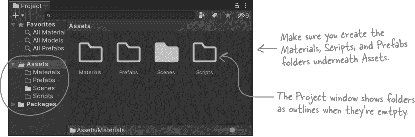
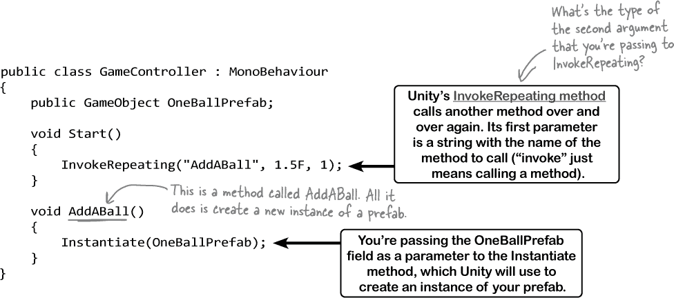

# 第十章：Unity 实验室 #3：GameObject 实例

C#是一种面向对象的语言，因为这些 Head First C# Unity 实验室**都是关于练习编写 C#代码**，所以这些实验室将专注于创建对象。

自从你了解了 `**new**` 关键字以来，你一直在 C#中创建对象（详见 #objectshellipget_orientedexclamation_mar）。在这个 Unity 实验室中，你将**创建 Unity GameObject 的实例**并在一个完整的工作游戏中使用它们。这是编写 Unity 游戏的绝佳起点。

接下来两个 Unity 实验室的目标是**创建一个简单的游戏**，使用你上次实验中熟悉的台球。在这个实验中，你将建立在你对 C#对象和实例的理解上，开始构建游戏。你将使用一个**预制件**——Unity 用来创建 GameObject 实例的工具，来创建大量的 GameObject 实例，并使用脚本使你的 GameObject 在游戏的 3D 空间中飞来飞去。

# 让我们在 Unity 中构建一个游戏吧！

Unity 的核心是构建游戏。因此，在接下来的两个 Unity 实验室中，你将运用你在 C#中学到的知识来构建一个简单的游戏。以下是你将要创建的游戏：

###### 注意

当你启动游戏时，场景会慢慢填满台球。玩家需要不断点击它们使它们消失。一旦场景中有 15 个球，游戏就结束了。

让我们开始吧。首先要做的是设置你的 Unity 项目。这一次我们将文件稍微整理一下，所以你会为你的材料和脚本创建单独的文件夹，并且为预制件再创建一个文件夹（稍后在实验中你会了解）：

1.  在开始之前，请关闭任何已打开的 Unity 项目。同时关闭 Visual Studio——Unity 会为你打开它。

1.  **创建一个新的 Unity 项目**，使用 3D 模板，就像你之前在 Unity 实验室中做的那样。给它一个名称，以帮助你记住它属于哪些实验（“Unity Labs 3 和 4”）。

1.  选择宽屏布局以便你的屏幕与截图匹配。

1.  在 **Assets** 文件夹下创建一个名为 ***Materials*** 的文件夹。在项目窗口中右键点击 **Assets** 文件夹，选择 **Create >> Folder**。将其命名为 ***Materials***。

1.  在 **Assets** 文件夹下创建另一个名为 ***Scripts*** 的文件夹。

1.  在 **Assets** 文件夹下创建另一个名为 ***Prefabs*** 的文件夹。

# 在 **Materials** 文件夹内创建一个新的材质。

双击你的新 **Materials** 文件夹来打开它。你将在这里创建一个新的材质。

前往[`github.com/head-first-csharp/fourth-edition`](https://github.com/head-first-csharp/fourth-edition)，并点击球材质链接（就像你在第一个 Unity 实验中所做的那样），将***1 Ball Texture.png***下载到计算机上的一个文件夹中，然后将其拖到你的材质文件夹中——就像你在第一个 Unity 实验中下载的文件一样，但这次将其拖到你刚刚创建的材质文件夹中，而不是父级 Assets 文件夹中。

现在你可以创建新的材质了。在项目窗口中右键点击材质文件夹，选择**创建 >> 材质**。将你的新材质命名为**1 Ball**。你会在项目窗口的材质文件夹中看到它。

###### 注意

在之前的 Unity 实验中，我们使用了一个纹理，或者说 Unity 可以包裹在游戏对象周围的位图图像文件。当你将纹理拖放到球体上时，Unity 会自动创建一个材质，这就是 Unity 用来跟踪关于如何渲染游戏对象的信息的方式，可以引用到一个纹理。这次你要手动创建材质。和上次一样，你可能需要在 GitHub 页面上点击下载按钮来下载纹理 PNG 文件。

确保在材质窗口中选择了 1 Ball 材质，这样它就会显示在检视器中。点击*1 Ball Texture*文件，并**将其拖放到 Albedo 标签左侧的框中**。

现在你应该在检视器中 Albedo 标签左侧的框中看到一个小小的 1 Ball 纹理图像。

现在当它包裹在一个球体周围时，你的材质看起来像一个台球。

# 在场景中的随机位置生成一个台球。

创建一个名为 OneBallBehaviour 的新球体游戏对象：

+   从游戏对象菜单中选择 3D 对象 >> 球体来**创建一个球体**。

+   将你的新**1 Ball 材质**拖到球上，使其看起来像一个台球。

+   接下来，**右键点击你在项目窗口中创建的脚本文件夹**，然后**创建一个新的 C#脚本**，命名为 OneBallBehaviour。

+   **将脚本拖放到层次视图中的球体上**。选择球体，并确保检视器窗口中显示了名为“One Ball Behaviour”的脚本组件。

双击你的新脚本以在 Visual Studio 中进行编辑。***添加与 BallBehaviour 中使用的相同代码***，然后**注释掉 Update 方法中的 Debug.DrawRay 行**。

现在你的 OneBallBehaviour 脚本应该是这样的：

现在修改 Start 方法，在创建时将球移动到一个随机位置。你可以通过设置**transform.position**来实现这一点，它可以改变场景中游戏对象的位置。下面是将球放置在随机点的代码—**将其添加到你的 OneBallBehaviour 脚本的 Start 方法中**：

**使用 Unity 中的播放按钮来运行你的游戏。** 现在应该会有一个球围绕 Y 轴在一个随机点上旋转。停止并重新开始游戏几次。每次球应该在场景中的不同点生成。

# 使用调试器理解 Random.value

你已经多次在 .NET System 命名空间中使用了 Random 类。你用它在动物匹配游戏中散布动物 #start_building_with_chash_build_somethin，以及在随机选择卡牌 #objectshellipget_orientedexclamation_mar。这个 Random 类与以前的不同—试着在 Visual Studio 中将鼠标悬停在 Random 关键字上。

你可以从代码中看出，这个新 Random 类与之前使用的不同。之前你调用 Random.Next 来获取一个随机值，而且那个值是一个整数。这段新代码使用了 **Random.value**，但那不是一个方法—实际上它是一个属性。

使用 Visual Studio 调试器来查看这个新 Random 类给出的各种值。点击“Attach to Unity”按钮  （在 Windows 上）， （在 macOS 上），将 Visual Studio 与 Unity 连接起来。然后在你添加到 Start 方法中的代码行上**添加一个断点**。

###### 注意

Unity 可能会提示你启用调试，就像在上一个 Unity 实验室中一样。

现在返回 Unity 并**开始你的游戏**。一旦按下播放按钮，游戏应该会中断。将鼠标悬停在 Random.value 上—确保它悬停在 `value` 上。Visual Studio 将在工具提示中显示它的值：

保持 Visual Studio 连接到 Unity，然后回到 Unity 编辑器并**停止你的游戏**（在 Unity 编辑器中，不是在 Visual Studio 中）。再次启动你的游戏。多试几次。每次都会得到一个不同的随机值。这就是 UnityEngine.Random 的工作原理：每次访问其 value 属性时，它会给你一个新的介于 0 和 1 之间的随机值。

按下继续 () 来恢复你的游戏。它应该会继续运行—断点只在 Start 方法中，每个 GameObject 实例仅调用一次，因此不会再次断开。然后返回 Unity 并停止游戏。

###### 注意

**当 Visual Studio 附加到 Unity 时，你无法在其中编辑脚本，所以点击方形停止调试按钮来将 Visual Studio 调试器与 Unity 分离。**

# 将你的 GameObject 转换为一个 prefab

在 Unity 中，一个 **prefab** 是一个可以在场景中实例化的 GameObject。在过去的几章中，你一直在处理对象实例，并通过实例化类来创建对象。Unity 允许你利用对象和实例，这样你可以构建重复使用相同 GameObject 的游戏。让我们把你的一个球 GameObject 变成一个 prefab。

GameObjects 有名称.. 将你的 GameObject 的名称更改为*OneBall*。首先**选择你的球**，通过在层次视图窗口或场景中单击它。然后使用检视器窗口**将其名称更改为 OneBall**。

现在你可以将你的 GameObject 转换成预制件。**从层次视图窗口将 OneBall 拖放到预制文件夹中**。

OneBall 现在应该出现在你的预制文件夹中。注意***现在在层次视图窗口中，OneBall 变成了蓝色***。这表示它现在是一个预制件——Unity 将其变为蓝色以告诉你，在你的层次结构中有一个预制件的实例。对于某些游戏来说这很好，但对于这个游戏来说，我们希望所有的球都是由脚本创建的实例。

在层次视图窗口中右键单击 OneBall**并从场景中删除 OneBall GameObject**。现在你只能在项目窗口中看到它，而不是在层次窗口或场景中看到。

###### 注意

**你一直在保存场景吗？尽早保存，经常保存！**

# 创建一个控制游戏的脚本

游戏需要一种方法来将球添加到场景中（并最终跟踪分数，以及游戏是否结束）。

在项目窗口的 Scripts 文件夹上右键单击**创建一个名为 GameController 的新脚本**。你的新脚本将使用在任何 GameObject 脚本中都可用的两种方法：

+   **Instantiate 方法创建一个 GameObject 的新实例。** 当你在 Unity 中实例化 GameObject 时，通常不会像在#dive_into_chash_statementscomma_classesc 中看到的那样使用`new`关键字。相反，你将使用 Instantiate 方法，你会在 AddABall 方法中调用它。

+   **InvokeRepeating 方法一遍又一遍地调用脚本中的另一个方法。** 在这种情况下，它将等待一秒半，然后每秒调用一次 AddABall 方法，直到游戏结束。

这是它的源代码：

# 将脚本附加到主摄像机上

你的新 GameController 脚本需要附加到一个 GameObject 才能运行。幸运的是，主摄像机只是另一个 GameObject——它恰好是一个带有摄像机组件和音频监听器组件的对象——所以让我们将你的新脚本附加到它上面。**从项目窗口的 Scripts 文件夹中拖拽你的 GameController 脚本**到层次视图窗口中的主摄像机上。

###### 注意

**你已经学习了在#encapsulation_keep_your_privateshellippr 中公共与私有字段的区别。当脚本类有一个公共字段时，Unity 编辑器会在检视器中的脚本组件中显示该字段。它在大写字母之间添加空格，以便更容易阅读其名称。**

查看检视器 —— 你会看到一个脚本的组件，与任何其他 GameObject 一样。这个脚本有一个***名为 OneBallPrefab 的公共字段***，所以 Unity 在脚本组件中显示它。

OneBallPrefab 字段仍然显示 None，所以我们需要设置它。**将 OneBall 从 Prefabs 文件夹中拖到 One Ball Prefab 标签旁边的框中**。

现在 GameController 的 OneBallPrefab 字段包含了一个***对 OneBall 预制体的引用***：

回到代码，**仔细查看 AddABall 方法**。它调用 Instantiate 方法，并将 OneBallPrefab 字段作为参数传递给它。你刚刚设置了该字段，使其包含你的预制体。因此，每当 GameController 调用其 AddABall 方法时，它将***创建 OneBall 预制体的一个新实例***。

# 按下播放按钮来运行你的代码

你的游戏已经准备好运行了。附加到 Main Camera 的 GameController 脚本将等待 1.5 秒，然后每秒实例化一个 OneBall 预制体。每个实例化的 OneBall 的 Start 方法将其移动到场景中的随机位置，并且其 Update 方法将每 2 秒围绕 Y 轴旋转，使用 OneBallBehaviour 的字段（就像上次实验中一样）。观察当游戏区域慢慢填满旋转的球时：

###### 注意

**Unity 在每帧之前调用每个 GameObject 的 Update 方法。这被称为更新循环。**

###### 注意

当你在代码中实例化 GameObjects 时，它们会在你运行游戏时显示在层次视图中。

# 在层次视图中观察实例的动态

飞行在场景中的每个球都是 OneBall 预制体的一个实例。每个实例都有其自己的 OneBallBehaviour 类的实例。你可以使用层次视图来跟踪所有的 OneBall 实例 —— 每创建一个，层次视图就会添加一个 “OneBall(Clone)” 条目。

**点击任何一个 OneBall(Clone) 项**来在检视器中查看它。当它旋转时，你会看到它的 Transform 值发生变化，就像上次实验中一样。

###### 注意

我们在 Unity 实验室中包含了一些编码练习。它们和书中其他地方的练习一样 —— 记住，偷看解决方案并不算作弊。

# 使用检视器来操作 GameObject 实例

运行你的游戏。一旦实例化了几个球，点击暂停按钮 —— Unity 编辑器将跳回到场景视图。点击层次视图中的 OneBall 实例中的任何一个来选择它。Unity 编辑器会在场景视图中用轮廓线标出它，以显示你选择的对象。进入检视器窗口的 Transform 组件，并**将其 Z 缩放值设置为 4**，使球拉伸。

再次启动你的模拟 —— 现在你可以追踪修改的是哪个球了。尝试像上次实验中那样更改它的 DegreesPerSecond、XRotation、YRotation 和 ZRotation 字段。

当游戏运行时，在游戏视图和场景视图之间切换。即使对于使用 Instantiate 方法创建的 GameObject 实例（而不是添加到层级窗口中的实例），你也可以在场景视图中**在游戏运行时**使用 Gizmo 工具。

尝试点击工具栏顶部的 Gizmos 按钮以切换它们的显示。你可以在游戏视图中打开 Gizmos，并且可以在场景视图中关闭它们。

# 使用物理来防止球体重叠

你有没有注意到偶尔一些球会彼此重叠？

Unity 有一个强大的**物理引擎**，你可以用它让你的 GameObject 表现得像真实的实体——而实体形状不会重叠。要防止重叠，你只需要告诉 Unity 你的 OneBall 预制体是一个实体对象。

停止你的游戏，然后**在项目窗口中点击“OneBall”预制体**以选择它。然后在检查器中滚动到底部找到“添加组件”按钮：

点击按钮弹出组件窗口。**选择 Physics**查看物理组件，然后**选择 Rigidbody**添加组件。

###### 注意

在你运行物理实验时，这里有一个伽利略会欣赏的实验。尝试在游戏运行时勾选“使用重力”框。新创建的球会开始下落，偶尔会碰到另一个球并把它撞开。

再次运行游戏——现在你不会看到球体重叠。偶尔会有一个球体创建在另一个球体之上。当发生这种情况时，新球体会把旧球体撞开。

**让我们进行一个小的物理实验**，证明这些球现在真的是刚性的。启动游戏，然后一旦创建了两个以上的球就暂停游戏。转到层级窗口。如果看起来像这样：

当你编辑预制体时——点击层级窗口右上角的后退箭头（）返回场景（你可能需要再次展开 SampleScene）。

+   按住 Shift 键，点击层级窗口中的第一个 OneBall 实例，然后点击第二个实例，这样前两个 OneBall 实例就被选择了。

+   你会在 Transform 面板的位置框中看到短线（）。将位置设置为（0，0，0）同时设置两个 OneBall 实例的位置。

+   使用 Shift-click 选择任何其他 OneBall 实例，右键点击，**选择删除**以将它们从场景中删除，只留下两个重叠的球体。

+   恢复游戏——现在球体不能重叠了，所以它们会旁边旋转。

    

###### 注意

**在 Unity 和 Visual Studio 中停止游戏并保存场景。早保存，频繁保存！**

###### 注意

**在游戏运行时，您可以使用层级窗口删除场景中的游戏对象。**

# 充满创意！

你已经完成了游戏的一半！你将在下一个 Unity 实验室完成它。与此同时，这是一个练习你**纸上原型**技能的绝佳机会。在本 Unity 实验室开始时，我们已经为您介绍了游戏的描述。试着创建一个纸上原型游戏。您能想出让它更有趣的方法吗？

