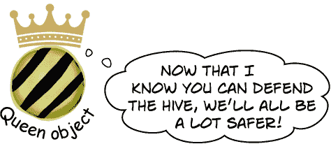

# 第七章：接口、转换和“is”：*使类们信守它们的承诺*


**需要一个对象来做特定的工作吗？使用接口。** 有时，您需要根据它们**能够做什么**而不是它们从哪些类继承而来来对对象进行分组，这就是**接口**的用武之地。您可以使用接口来定义**特定的工作**。任何实现接口的类的实例都*保证能够执行该工作*，无论它们与其他类的关系如何。为了使一切正常运行，任何实现接口的类都必须承诺*履行其所有义务*...否则编译器将削减其膝盖，明白吗？

# 蜂巢正在遭受攻击！

敌方蜂巢正在试图占领女王的领土，并不断派遣敌蜜蜂来攻击她的工作人员。因此，她添加了一个名为 HiveDefender 的新的精英蜜蜂子类来保卫蜂巢。


## 因此，我们需要一个 DefendHive 方法，因为敌人随时可能发动攻击。

我们可以通过扩展 Bee 类将 HiveDefender 子类添加到 Bee 类层次结构中，重写其 CostPerShift 以表示每个防御者每个班次消耗的蜂蜜量，并重写 DoJob 方法以飞到敌方蜂巢并攻击敌蜜蜂。

但敌蜜蜂随时可能攻击。我们希望防御者能够在***无论他们当前是否在执行正常工作***的情况下保护蜂巢。

因此，除了 DoJob 之外，我们还将向任何能够保卫蜂巢的蜜蜂添加 DefendHive 方法——不仅仅是精英的 HiveDefender 工作人员，而是她们的任何能够拿起武器保护她们女王的姐妹们。女王将在她发现自己的蜂巢受到攻击时调用她工作人员的 DefendHive 方法。


# 我们可以使用 casting 来调用 DefendHive 方法...

当您编写 Queen.DoJob 方法时，使用 foreach 循环来获取`workers`数组中的每个蜜蜂引用，然后使用该引用调用 worker.DoJob。如果蜂巢遭受攻击，女王将希望调用她的防御者们的 DefendHive 方法。因此，我们将为她提供一个 HiveUnderAttack 方法，每当蜂巢受到敌蜜蜂攻击时调用，她将使用 foreach 循环命令她的工作人员保卫蜂巢，直到所有攻击者都离开为止。

但出现了问题。女王可以使用蜜蜂引用来调用 DoJob，因为每个子类都重写了 Bee.DoJob，但她不能使用 Bee 引用来调用 DefendHive 方法，因为该方法不是 Bee 类的一部分。那么她如何调用 DefendHive 呢？

由于 DefendHive 仅在每个子类中定义，我们需要使用`casting`将 Bee 引用转换为正确的子类，以便调用其 DefendHive 方法。

```cs
public void HiveUnderAttack() {
    foreach (Bee worker in workers) {
        if (EnemyHive.AttackingBees > 0) {
            if (worker.Job == "Hive Defender") {
                HiveDefender defender = (HiveDefender) worker;
                defender.DefendHive();
            } else if (worker.Job == "Nectar Defender") {
                NectarDefender defender = (NectarDefender) defender;
                defender.DefendHive();
            }
        }
    }
}
```

## ...但如果我们添加更多可以防御的蜜蜂子类呢？

一些蜜制品制造商和鸡蛋护理蜜蜂也想站出来保护蜂巢。这意味着我们将需要向她的 HiveUnderAttack 方法添加更多的`else`块。

***这变得很复杂。*** Queen.DoJob 方法非常简单——一个非常短的 foreach 循环，利用 Bee 类模型调用了子类中实现的特定版本的 DoJob 方法。我们不能对 DefendHive 这样做，因为它不是 Bee 类的一部分——而且我们也不想添加它，因为并非所有蜜蜂都能保卫蜂巢。***有没有更好的方法让无关的类执行相同的工作？***


# 一个接口定义了类必须实现的方法和属性...

**接口**的工作方式就像抽象类：你使用抽象方法，然后使用冒号（:）使类实现该接口。

因此，如果我们想要将防御者添加到蜂巢中，我们可以有一个名为 IDefend 的接口。它看起来像这样。它使用`**interface**` **关键字**定义接口，并包含一个名为 Defend 的抽象方法。接口中的所有成员默认都是公共和抽象的，因此 C#简化了事务，让您***省略`public`和`abstract`关键字：***


任何实现了 IDefend 接口的类**必须包含一个 Defend 方法**，其声明与接口中的声明相匹配。如果不匹配，编译器将报错。

## ...但一个类可以实现的接口数量没有限制

我们刚刚说过，你使用冒号（:）使一个类实现一个接口。如果该类已经使用冒号扩展了一个基类怎么办？没问题！**一个类可以实现许多不同的接口，即使它已经扩展了一个基类：**


现在我们有了一个既可以像 NectarCollector 一样工作，又可以保卫蜂巢的类。NectarCollector 扩展了 Bee，所以如果你**使用一个 Bee 引用**，它就像一个 Bee：

```cs
    Bee worker = new NectarCollector();
    Console.WriteLine(worker.Job);
    worker.WorkTheNextShift();
```

但如果你**使用一个 IDefend 引用**，它就像一个蜂巢防御者：

```cs
    IDefend defender = new NectarCollector();
    defender.Defend();
```

###### 注意

**当一个类实现一个接口时，它必须包含接口内列出的所有方法和属性，否则代码将无法编译。**

# 接口让无关的类执行相同的工作

接口可以是帮助你设计易于理解和构建的 C#代码的强大工具。首先要考虑的是**类需要执行的具体任务**，因为这正是接口的目的所在。


那么这对女王有什么帮助呢？IDefender 接口完全存在于 Bee 类层次结构之外。因此，我们可以添加一个知道如何保卫蜂巢的 NectarDefender 类，***它仍然可以扩展 NectarCollector***。女王可以保留她所有防御者的数组：

```cs
IDefender[] defenders = new IDefender[2];
defenders[0] = new HiveDefender();
defenders[1] = new NectarDefender();
```

这让她很容易召集她的防御者：

```cs
private void DefendTheHive() {
  foreach (IDefender defender in defenders)
  {
     defender.Defend();
  }
}
```

而且由于它存在于 Bee 类模型之外，我们可以***不修改任何现有代码***来实现这一点。



###### 注意


**我们将为您提供许多接口的示例。**

如果你对接口的工作方式及其使用方式仍有些困惑？别担心——这很正常！语法非常简单直接，但其中还有很多微妙之处。所以我们会花更多时间来讲解接口...并且我们会给你很多例子和大量的练习。

# 练习使用接口

理解接口的最佳方法是开始使用它们。继续 **创建一个新的控制台应用** 项目。

***这样做！***

1.  **添加 Main 方法。** 这是一个名为 TallGuy 的类的代码，以及调用其 TalkAboutYourself 方法的 Main 方法的代码。这里没有新东西——我们马上会用到它：

    ```cs
    class TallGuy {
        public string Name;
        public int Height;

        public void TalkAboutYourself() {
            Console.WriteLine($"My name is {Name} and I’m {Height} inches tall.");
        }
    }
    class Program
    {
        static void Main(string[] args)
        {
            TallGuy tallGuy = new TallGuy() { Height = 76, Name = "Jimmy" };
            tallGuy.TalkAboutYourself();
        }
    }
    ```

1.  **添加一个接口。** 我们将使 TallGuy 实现一个接口。向你的项目中添加一个新的 IClown 接口：在“解决方案资源管理器”中右键单击项目，选择“添加 >> 新建项目...（Windows）或添加 >> 新建文件...（Mac）”，选择“接口”。确保它的名字是 *IClown.cs*。IDE 将创建一个包含接口声明的接口。添加一个 Honk 方法：

    ```cs
    interface IClown
    {
        void Honk();
    }
    ```

    ###### 注意

    你不需要在接口内部添加 “public” 或 “abstract”，因为它自动将每个属性和方法设为公共和抽象。

1.  **尝试编写其余的 IClown 接口部分。** 在进行下一步之前，看看是否能创建剩余的 IClown 接口部分，并修改 TallGuy 类以实现此接口。除了不带任何参数的 void 方法 Honk 外，你的 IClown 接口还应该有一个只读的字符串属性 FunnyThingIHave，该属性有一个 get 访问器但没有 set 访问器。

1.  **这是 IClown 接口的样子。** 你弄对了吗？如果你把 Honk 方法放在第一位也没关系——接口成员的顺序不重要，就像类中的顺序一样。

    ```cs
    interface IClown
    {
        string FunnyThingIHave { get; }
        void Honk();
    }
    ```

    ###### 注意

    IClown 接口要求任何实现它的类具有一个 void 方法 Honk 和一个名为 FunnyThingIHave 的字符串属性，该属性具有 get 访问器。

1.  **修改 TallGuy 类，使其实现 IClown 接口。** 记住，冒号操作符后面总是跟着要继承的基类（如果有的话），然后是一系列以逗号分隔的要实现的接口。由于没有基类，只需实现一个接口，声明看起来像这样：

    ```cs
    class TallGuy: IClown
    ```

    然后确保类的其余部分保持不变，包括两个字段和方法。从 IDE 的“生成”菜单中选择“生成解决方案”来编译和构建程序。你会看到两个错误：

    

1.  **通过添加缺失的接口成员来修复错误。** 一旦添加了接口中定义的所有方法和属性，错误就会消失。所以继续实现接口。添加一个只读的字符串属性 FunnyThingIHave，其 get 访问器总是返回字符串 “big shoes”。然后添加一个 Honk 方法，将 “Honk honk!” 写入控制台。

    下面是实现的样子：

    

1.  **现在你的代码将会编译。** 更新你的 Main 方法，以便打印 TallGuy 对象的 FunnyThingIHave 属性，然后调用它的 Honk 方法：

    ```cs
    static void Main(string[] args) {
        TallGuy tallGuy = new TallGuy() { Height = 76, Name = "Jimmy" };
        tallGuy.TalkAboutYourself();
        Console.WriteLine($"The tall guy has {tallGuy.FunnyThingIHave}");
        tallGuy.Honk();
    }
    ```


今晚的讨论：**抽象类和接口就“谁更重要”这个紧迫问题发生争执。**

| **抽象类：** | **接口：** |
| --- | --- |
| 我觉得很明显，在我们两个中间谁更重要。程序员需要我来完成他们的工作。面对现实吧，你远远不及我。 |  |
|  | 不错，这肯定会很有意思。 |
| 你真的以为你比我更重要吗？你甚至不使用真正的继承——你只被实现。 |  |
|  | 太好了，又来了。“接口不使用真正的继承。”“接口只实现。”这简直是无知。实现和继承一样好。事实上，它更好！ |
| 更好了吗？你疯了。我比你灵活得多。当然，我不能被实例化——但你也不行。不像你，我有继承的**强大力量**。那些扩展你的可怜家伙根本不能利用`virtual`和`override`！ |  |
|  | 是吗？如果你想要一个类从你***和***你的朋友继承，**你不能从两个类继承**。你必须选择要从哪个类继承。这简直是无礼！一个类可以实现的接口数没有限制。说到灵活性！通过我，程序员可以让一个类做任何事情。 |
| **抽象类：** | **接口：** |
| 你可能夸大了自己的力量。 | 真的吗？那好，让我们考虑一下我对使用我的开发人员有多有力。我全靠工作——当他们得到一个接口的引用时，根本不需要知道对象内部正在发生什么。 |
| 你认为那是好事吗？哈！当你使用我和我的子类时，你完全知道我们所有人内部都发生了什么。我可以处理所有子类需要的任何行为，他们只需继承它。透明性是一种强大的东西，小子！ | 十有八九，程序员想要确保一个对象具有特定的属性和方法，但并不关心它们是如何实现的。 |
| 真的吗？我怀疑，程序员总是关心他们的属性和方法。 | 好的，当然。最终。但是想想有多少次你看到程序员编写一个方法，只需一个具有某个方法的对象，此时方法的具体实现并不重要——只需它存在即可。所以轰！程序员只需使用一个接口。问题解决！ |
| 是的，当然，告诉程序员他们不能编码。 | 哎呀，你真是让人***气愤至极！*** |

# 你不能实例化一个接口，但可以引用一个接口。

假设您需要一个具有 Defend 方法的对象，以便您可以在循环中使用它来保护蜂巢。任何实现 IDefender 接口的对象都可以。它可以是一个 HiveDefender 对象，一个 NectarDefender 对象，甚至是一个 HelpfulLadyBug 对象。只要它实现了 IDefender 接口，就保证它有一个 Defend 方法。您只需调用它。

这就是**接口引用**的用处。您可以使用一个引用来引用实现您需要的接口的对象，您始终可以确保它具有适合您目的的正确方法——即使您对它了解不多。

## 如果您尝试实例化一个接口，您的代码将无法构建

您可以创建一个 IWorker 引用数组，但是您不能实例化一个接口。您*可以*将这些引用指向实现 IWorker 的类的新实例。现在您可以拥有一个包含许多不同类型对象的数组！

如果您尝试实例化一个接口，编译器会抱怨。


您不能使用`new`关键字与接口一起使用，这是有道理的——方法和属性没有任何实现。如果您可以从接口创建对象，它怎么知道如何行为？

## 使用界面引用您已经拥有的对象

所以你不能实例化一个接口...但是你可以使用接口来做一个引用变量，并用它来引用实现了接口的对象。

还记得如何将老虎引用传递给期望动物的任何方法吗？因为老虎扩展了动物？好吧，这也是一样的——您可以在期望 IDefender 的任何方法或语句中使用实现 IDefender 的类的实例。


这些都是普通的`new`语句，就像您在本书的大部分部分中一直使用的那样。唯一的区别是您使用 IDefender 类型的变量引用它们。


###### 注意

**输出**

**5 法案**

**7 个小丑**

**2016 年的 7 月**


# 接口引用是普通的对象引用

您已经了解了对象如何存储在堆中。当您使用接口引用时，这只是引用您已经使用的相同对象的另一种方式。让我们更详细地看看如何使用接口来引用堆中的对象。

1.  **我们将像往常一样创建对象。**

    这里是一些创建蜜蜂的代码：它创建了 HiveDefender 的一个实例和 NectarDefender 的一个实例——这两个类都实现了 IDefender 接口。

    ```cs
    HiveDefender bertha = new HiveDefender();
    NectarDefender gertie = new NectarDefender();
    ```

    

1.  **接下来我们将添加 IDefender 引用。**

    您可以像使用任何其他引用类型一样使用接口引用。这两个语句使用接口来创建对现有对象的**新引用**。您只能将接口引用指向实现它的类的实例。

    ```cs
    IDefender def2 = gertie;
    IDefender captain = bertha;
    ```

    

1.  **接口引用会使对象保持活动状态。**

    当没有引用指向一个对象时，它就消失了。并没有规定这些引用都必须是同一类型！接口引用在跟踪对象以避免被垃圾回收时和其他对象引用一样好用。

    

1.  **像使用任何其他类型一样使用接口。**

    你可以用`new`语句创建一个新对象，并将其直接分配给一个接口引用变量，一行代码搞定。你可以**使用接口创建数组**，这些数组可以引用任何实现了接口的对象。

    ```cs
    IDefender[] defenders = new IDefender[3];
    defenders[0] = new HiveDefender();
    defenders[1] = bertha;
    defenders[2] = captain;
    ```

# RoboBee 4000 可以完成工蜂的工作，而不使用宝贵的蜂蜜。

上个季度的蜜蜂业务蓬勃发展，女王有足够的预算购买了最新的蜂箱技术：RoboBee 4000。它可以完成三只不同蜜蜂的工作，最重要的是它不消耗任何蜂蜜！虽然这不算是环保，因为它使用的是燃气。那么我们如何使用接口将 RoboBee 整合到蜂箱的日常业务中呢？


```cs
class Robot
{
   public void ConsumeGas() {
     // Not environmentally friendly
   }
}
class RoboBee4000 : Robot, IWorker
{
   public string Job {
     get { return "Egg Care"; }
   }
   public void WorkTheNextShift()
   {
     // Do the work of three bees!
   }
}
```

###### 注意

让我们仔细看看类图，看看我们如何使用接口将 RoboBee 类集成到蜂巢管理系统中。记住，我们用虚线表示对象实现了接口。


现在我们只需要修改蜂巢管理系统，在需要引用工作者时都使用 IWorker 接口，而不是抽象的 Bee 类。

> **公共接口中的一切都自动是公共的，因为你会用它来定义任何实现它的类的公共方法和属性。**

# IWorker 的 Job 属性是一个 hack。

蜂巢管理系统使用 Worker.Job 属性如下：`if (worker.Job == job)`

有点奇怪吧？对我们来说确实如此。我们认为这是一个**hack**，或者说是一个笨拙、不优雅的解决方案。我们为什么认为 Job 属性是一个 hack 呢？想象一下，如果你出现了这样的拼写错误：

```cs
class EggCare : Bee {
   public EggCare(Queen queen) : base("Egg C**ra**e")

   // Oops! Now we’ve got a bug in the EggCare class,
   // even though the rest of the class is the same.
}
```

###### 注意

我们把“Egg Care”拼错了——这是任何人都可能犯的错误！你能想象这个简单拼写错误会导致多难以追踪的 bug 吗？

现在代码没有办法判断 Worker 引用是否指向 EggCare 的实例。这将是一个非常难以修复的恶心 bug。所以我们知道这段代码容易出错……但它为什么是一个 hack 呢？

我们谈论了**关注点分离**：解决特定问题的所有代码应该放在一起。Job 属性***违反了关注点分离原则***。如果我们有一个 Worker 引用，我们不应该需要检查一个字符串来确定它是否指向一个 EggCare 对象或一个 NectarCollector 对象。Job 属性对于 EggCare 对象返回“Egg Care”，对于 NectarCollector 对象返回“Nectar Collector”，仅用于检查对象的类型。但我们已经跟踪了这个信息：***它就是对象的类型***。


**没错！C#提供了处理类型的工具。**

你永远不需要像“Egg Care”或“Nectar Collector”这样的字符串来跟踪类的类型属性，C#提供了工具，让你可以检查对象的类型。

# 使用“is”来检查对象的类型

如何消除 Job 属性的 hack？目前女王有她的`workers`数组，这意味着她只能获取到 IWorker 引用。她使用 Job 属性来区分哪些工人是 EggCare 工人，哪些是 NectarCollector 工人：

```cs
foreach (IWorker worker in workers) {
if (worker.Job == "Egg Care") {
    WorkNightShift((EggCare)worker);
}

void WorkNightShift(EggCare worker) {
   // Code to work the night shift
}
```

我们刚刚看到，如果我们意外地输入“Egg Crae”而不是“Egg Care”，那段代码将会彻底失败。如果你意外地将 HoneyManufacturer 的 Job 设置为“Egg Care”，你将会得到一个 InvalidCastException 错误。如果编译器能在我们编写这些代码时就检测到这些问题，就像我们使用私有或抽象成员一样检测其他类型的问题一样，那将是非常好的。


C#给了我们一个工具来做到这一点：我们可以使用`**is**` **关键字**来检查对象的类型。如果你有一个对象引用，你可以**使用`is`来找出它是否是特定类型的：**

```cs
  objectReference is ObjectType newVariable
```

如果 objectReference 指向的对象的类型是 ObjectType，那么它返回 true，并创建一个名为`newVariable`的新引用，该引用具有该类型。

因此，如果女王想找到所有的 EggCare 工人，并让他们进行夜班工作，她可以使用`is`关键字：

```cs
  foreach (IWorker worker in workers) {
      if (worker is EggCare eggCareWorker) {
          WorkNightShift(eggCareWorker);
      }
  }
```

此循环中的 if 语句使用`is`来检查每个 IWorker 引用。仔细观察条件测试：

```cs
    worker is EggCare eggCareWorker
```

如果`worker`变量引用的对象是一个 EggCare 对象，那么该测试将返回 true，并且`is`语句将该引用分配给一个新的名为`eggCareWorker`的 EggCare 变量。这与强制转换类似，但`is`语句**安全地执行强制转换**。

> **is 关键字在对象匹配类型时返回 true，并且可以声明一个具有对该对象引用的变量。**

# 使用“is”来访问子类中的方法

让我们把我们到目前为止讨论的一切汇总到一个新项目中，通过创建一个简单的类模型，Animal 在顶部，Hippo 和 Canine 类扩展 Animal，以及一个扩展 Canine 的 Wolf 类。

***做这个！***

创建一个新的控制台应用程序，并**添加这些 Animal、Hippo、Canine 和 Wolf 类**到其中：


###### 注：

**在#inheritance_your_objectapostrophes_famil 我们学习到，我们可以使用不同的引用调用同一对象的不同方法。当你没有使用 override 和 virtual 关键字时，如果你的引用变量是 Locksmith 类型，它调用 Locksmith.ReturnContents，但如果是 JewelThief 类型，它调用 JewelThief.ReturnContents。我们在这里做了类似的事情。**

接下来，填写 Main 方法。它的作用如下：

+   它创建了一个 Hippo 和 Wolf 对象的数组，然后使用 foreach 循环遍历每个对象。

+   它使用 Animal 引用调用 MakeNoise 方法。

+   如果是 Hippo，Main 方法调用其 Hippo.Swim 方法。

+   如果是 Wolf，Main 方法调用其 Wolf.HuntInPack 方法。

问题在于，如果你有一个 Animal 引用指向一个 Hippo 对象，你不能使用它来调用 Hippo.Swim：

```cs
    Animal animal = new Hippo();
    animal.Swim(); // <-- this line will not compile!
```

你的对象是 Hippo 并不重要。如果你使用 Animal 变量，你只能访问 Animal 的字段、方法和属性。

幸运的是，有一种方法可以解决这个问题。 如果你完全确定你有一个 Hippo 对象，那么你可以将你的 Animal 引用转换为 Hippo——然后你可以访问它的 Hippo.Swim 方法：

```cs
    Hippo hippo = (Hippo)animal;
    hippo.Swim(); // It’s the same object, but now you can call the Hippo.Swim method.
```

这是**使用**`**is**` **keyword** **调用 Hippo.Swim 或 Wolf.HuntInPack 的 Main 方法**：


###### 注意

**花几分钟时间，使用调试器真正理解这里发生了什么。在 foreach 循环的第一行设置断点；添加`animal, hippo`和`wolf`的监视器；并逐步执行。**

# 如果我们希望不同的动物能够游泳或者群体狩猎怎么办？

你知道狮子是群体猎手吗？还是老虎会游泳？那狗呢，它们既群体狩猎又游泳？如果我们想要将 Swim 和 HuntInPack 方法添加到我们动物园模拟器模型中所有需要它们的动物中，那么 foreach 循环将变得越来越长。

在基类中定义抽象方法或属性并在子类中重写它的美妙之处在于**你不需要知道任何关于子类的信息**就可以使用它。你可以添加所有想要的 Animal 子类，这个循环仍然有效：

```cs
foreach (Animal animal in animals) {
    animal.MakeNoise();
}
```

**MakeNoise 方法将始终由对象实现。**

实际上，你可以把它看作是一个**合同**，编译器强制执行。

###### 注意

**那么是否有办法将 HuntInPack 和 Swim 方法也像契约一样对待，这样我们就可以用更一般的变量来使用它们——就像我们对 Animal 类所做的那样？**


# 使用接口来处理执行相同工作的类

有游泳的类有一个 Swim 方法，有群体狩猎的类有一个 HuntInPack 方法。好的，这是一个良好的开端。现在我们想写能够处理游泳或群体狩猎对象的代码——这就是接口发挥作用的地方。让我们使用`**interface**` **keyword**来定义两个接口，并**add an abstract member**到每个接口：


***Add this!***

接下来，**使 Hippo 和 Wolf 类实现这些接口**，只需在每个类声明的末尾添加一个接口。像扩展类时一样使用**冒号**（:)来实现一个接口。如果已经扩展了一个类，只需在超类之后添加一个逗号，然后是接口名。然后，你只需确保类**实现了所有接口成员**，否则会得到编译器错误。

```cs
    class Hippo : Animal, ISwimmer {
 /* The code stays exactly the same - it MUST include the Swim method */
    }

    class Wolf : Canine, IPackHunter {
 /* The code stays exactly the same - it MUST include the HuntInPack method */
    }
```

## 使用“is”关键字来检查 Animal 是否是游泳者或群体猎手

你可以使用`**is**` **关键字**来检查特定对象是否实现了接口——无论该对象实现了哪些其他类。如果 animal 变量引用了一个实现了 ISwimmer 接口的对象，那么`animal is ISwimmer`将返回 true，并且你可以安全地将其转换为 ISwimmer 引用以调用其 Swim 方法：


# 使用“is”安全地导航你的类层次结构

在替换蜜蜂管理系统中的 Bee 为 IWorker 时，你能否使其抛出 InvalidCastException？***以下是它抛出异常的原因***。

 **你可以安全地将 NectarCollector 引用转换为 IWorker 引用**。

所有 NectarCollectors 都是 Bees（即它们扩展了 Bee 基类），所以你始终可以使用=运算符将 NectarCollector 的引用赋给 Bee 变量。

```cs
  HoneyManufacturer lily = new HoneyManufacturer();
  Bee hiveMember = lily;
```

并且由于 Bee 实现了 IWorker 接口，所以你也可以安全地将其转换为 IWorker 引用。

```cs
  HoneyManufacturer daisy = new HoneyManufacturer();
  IWorker worker = daisy;
```

这些类型转换是安全的：它们永远不会抛出 IllegalCastException，因为它们只能将更具体的对象分配给具有更一般类型的变量*在同一类层次结构中*。

 **你不能安全地将 Bee 引用转换为 NectarCollector 引用**。

你不能安全地反向操作——将 Bee 转换为 NectarCollector——因为并非所有 Bee 对象都是 NectarCollector 的实例。HoneyManufacturer*绝对不是* NectarCollector。所以这个：

```cs
  IWorker pearl = new HoneyManufacturer();
  NectarCollector irene = (NectarCollector)pearl;
```

是一种试图将对象转换为不匹配其类型的变量的**无效转换**。

 **“is”关键字让你可以安全地转换类型**。

幸运的是，**`is`关键字比用括号进行转换更安全**。它允许你检查类型是否匹配，并且只有在类型匹配时才将引用转换为新变量。

```cs
  if (pearl is NectarCollector irene) {
     /* Code that uses a NectarCollector object */
  }
```

这段代码永远不会抛出 InvalidCastException，因为它只有在`pearl`是 NectarCollector 时才会执行使用 NectarCollector 对象的代码。

# C#还有另一种安全类型转换的工具：**“as”关键字**

C#为安全转换提供了另一种工具：**`as`关键字**。它也执行安全类型转换。以下是其工作原理。假设你有一个名为`pearl`的 IWorker 引用，并且你想将其安全地转换为 NectarCollector 变量`irene`。你可以这样安全地将其转换为 NectarCollector：

```cs
 NectarCollector irene = pearl as NectarCollector;
```

如果类型兼容，此语句将`irene`变量设置为引用与`pearl`变量相同的对象。如果对象的类型与变量的类型不匹配，它不会抛出异常。而是将变量设置为`null`，您可以使用`if`语句检查：

```cs
 if (irene != null) {
    /* Code that uses a NectarCollector object */
 }
```

# 使用向上转型和向下转型在类层次结构中向上和向下移动

类图通常将基类放在顶部，其子类放在其下方，它们的子类依次排列。在图表中，类越高抽象性越强；类越低具体性越强。“抽象高，具体低”并非一成不变的规则，这是一个让我们一眼看清楚我们类模型工作原理的**约定**。

在#inheritance_your_objectapostrophes_famil 中，我们讨论了如何始终可以使用子类替代它继承的基类，但不能总是可以使用基类替代扩展它的子类。您还可以以另一种方式考虑这个问题：从某种意义上讲，您正在**向上或向下移动**类层次结构。例如，如果您从这开始：

```cs
   NectarCollector ida = new NectarCollector();
```

您可以使用=运算符来执行普通赋值（用于超类）或转型（用于接口）。这就像***向上移动***类层次结构。这被称为**向上转型**：

```cs
  // Upcast the NectarCollector to a Bee
  Bee beeReference = ida;

  // This upcast is safe because all Bees are IWorkers
  IWorker worker = (IWorker)beeReference;
```

通过使用`is`运算符可以安全地***向下移动***类层次结构。这被称为**向下转型**：

```cs
 // Downcast the IWorker to NectarCollector
  if (worker is NectarCollector rose) { /* code that uses the rose reference */ }
```


# 快速的向上转型示例

如果您正在努力找出如何每个月削减能源账单，您并不真的关心每个家电做什么——您只关心它们消耗的电力。因此，如果您正在编写一个程序来监控您的电力消耗，您可能只会编写一个 Appliance 类。但是，如果您需要区分咖啡机和烤箱，您就必须构建一个类层次结构，并将特定于咖啡机或烤箱的方法和属性添加到您的 CoffeeMaker 和 Oven 类中，它们将继承自具有它们共同方法和属性的 Appliance 类。

然后，您可以编写一个方法来监控功耗：


如果您想要使用该方法监控咖啡机的功耗，您可以创建一个 CoffeeMaker 的实例并直接将其引用传递给该方法：


# 向上转型将您的 CoffeeMaker 转换为一个 Appliance

当你用子类替换基类——比如用咖啡机替换家电，或者用河马替换动物——这被称为**向上转型**。在构建类层次结构时，这是一个非常强大的工具。向上转型的唯一缺点是，你只能使用基类的属性和方法。换句话说，当你把咖啡机当作家电时，你不能让它制作咖啡或加水。你可以判断它是否插上电源，因为这是你可以对任何家电做的事情（这就是为什么 PluggedIn 属性属于家电类的原因）。

1.  **让我们创建一些对象。**

    让我们像往常一样创建咖啡机和烤箱类的实例：

    ```cs
      CoffeeMaker misterCoffee = new CoffeeMaker();
      Oven oldToasty = new Oven();
    ```

    ###### 注意

    **你不需要将这段代码添加到应用中——只需阅读代码并开始了解向上转型和向下转型的工作原理。你将在本书的后续章节中获得大量实践。**

1.  **如果我们想要创建一个家电数组怎么办？**

    你不能把咖啡机放入一个 Oven[]数组中，也不能把烤箱放入一个 CoffeeMaker[]数组中。但是你***可以***把它们都放入一个 Appliance[]数组中：

    ```cs
      Appliance[] kitchenWare = new Appliance[2];
      kitchenWare[0] = misterCoffee;
      kitchenWare[1] = oldToasty;
    ```

    ###### 注意

    你可以使用向上转型创建一个可以容纳咖啡机和烤箱的家电数组。

1.  **但你不能把任何家电都当作烤箱来对待。**

    当你有一个家电的引用时，你只能访问与家电相关的方法和属性。通过家电引用，即使你知道它实际上是一个咖啡机，你也**不能**使用咖啡机的方法和属性。所以这些语句将正常工作，因为它们把一个咖啡机对象当作家电来对待：

    

    你的代码不会编译，并且 IDE 会显示错误：

    

    一旦你从子类向基类向上转型，你只能访问与你用来访问对象的引用匹配的方法和属性。


# 向下转型将你的家电转换回咖啡机。

向上转型是一个很好的工具，因为它让你可以在任何需要家电的地方使用咖啡机或烤箱。但是它有一个很大的缺点——如果你使用一个指向咖啡机对象的家电引用，你只能使用属于家电的方法和属性。这就是**向下转型**的用武之地：这是如何将你的**之前向上转型的引用**重新改回的方法。你可以使用`**is**`关键字来判断你的家电是否真的是一个咖啡机，如果是，你可以将它转换回咖啡机。

1.  **我们将从已经向上转型的咖啡机开始。**

    这是我们使用的代码：

    ```cs
      Appliance powerConsumer = new CoffeeMaker();
      powerConsumer.ConsumePower();
    ```

1.  **如果我们想把家电转换回咖啡机怎么办？**

    假设我们正在构建一个应用程序，该应用程序查找一个家电引用数组，以便让我们的咖啡机开始冲泡。我们不能只使用我们的家电引用调用咖啡机方法：

    ```cs
      Appliance someAppliance = appliances[5];
      someAppliance.StartBrewing()
    ```

    那个语句无法编译 —— 因为 StartBrewing 是 CoffeeMaker 的成员，但您正在使用 Appliance 引用。

    

1.  **但既然我们知道它是咖啡机，让我们像使用咖啡机一样使用它。**

    `is` 关键字是第一步。一旦确定你有一个指向 CoffeeMaker 对象的 Appliance 引用，就可以使用 `**is**` 进行向下转型。这样可以使用 CoffeeMaker 类的方法和属性。由于 CoffeeMaker 继承自 Appliance，它仍然具有其 Appliance 的方法和属性。

    ```cs
      if (someAppliance is CoffeeMaker javaJoe) {
         javaJoe.StartBrewing();
      }
    ```

    

# 向上转型和向下转型也适用于接口

接口在向上转型和向下转型中表现非常出色。让我们为任何可以加热食物的类添加一个 ICooksFood 接口。接下来，我们将添加一个 Microwave 类——Microwave 和 Oven 都实现了 ICooksFood 接口。现在，对 Oven 对象的引用可以是 ICooksFood 引用、Microwave 引用或 Oven 引用。这意味着我们有三种不同类型的引用可以指向一个 Oven 对象，每种引用根据其类型可以访问不同的成员。幸运的是，IDE 的 IntelliSense 可以帮助您确切地了解每种引用可以做什么和不能做什么：

```cs
Oven misterToasty = new Oven();
misterToasty.
```


###### 注意

一旦输入点，IntelliSense 窗口将弹出一个列表，列出您可以使用的所有成员。`misterToasty` 是指向 Oven 对象的 Oven 引用，因此它可以访问所有方法和属性。这是最具体的类型，因此您只能将其指向 Oven 对象。


要访问 ICooksFood 接口成员，请将其转换为 ICooksFood 引用：

```cs
if (misterToasty is ICooksFood cooker) {
    cooker.
```


###### 注意

`cooker` 是指向同一 Oven 对象的 ICooksFood 引用。它只能访问 ICooksFood 成员，但也可以指向 Microwave 对象。

这是我们之前使用过的同一个 Oven 类，因此它也扩展了 Appliance 基类。如果使用 Appliance 引用访问对象，您只能看到 Appliance 类的成员：

```cs
if (misterToasty is Appliance powerConsumer)
    powerConsumer.
```


###### 注意

`powerConsumer` 是一个 Appliance 引用。它只允许您访问 Appliance 的公共字段、方法和属性。它比 Oven 引用更一般（所以如果需要，您可以将其指向 CoffeeMaker 对象）。

###### 注意

指向同一对象的三个不同引用可以根据引用的类型访问不同的方法和属性。

# 接口可以继承其他接口

正如我们提到的，当一个类从另一个类继承时，它会获取基类中的所有方法和属性。**接口继承**更简单。由于任何接口中都没有实际的方法体，因此您无需担心调用基类的构造函数或方法。继承的接口**累积了它们扩展的所有成员**。

那么代码是什么样子的呢？让我们添加一个从 IWorker 继承的 IDefender 接口：


当一个类实现一个接口时，它必须实现该接口中的每个属性和方法。如果该接口又继承自另一个接口，则还需要实现*那些*属性和方法。因此，任何实现 IDefender 的类不仅必须实现所有 IDefender 成员，还必须实现所有 IWorker 成员。以下是包含 IWorker 和 IDefender 的类模型，以及**两个单独的层次结构**来实现它们。


**绝对！将字段设置为只读有助于防止错误。**

返回到 ScaryScary.scaryThingCount 字段——IDE 在字段名的前两个字母下面放置了点。将鼠标悬停在点上即可弹出窗口：


按 Ctrl+. 弹出操作列表，并选择“**添加 readonly 修饰符**”将 `readonly` **关键字**添加到声明中：


现在该字段只能在声明时或在构造函数中设置。如果您尝试在方法的任何其他位置更改其值，将收到编译器错误：


`readonly` 关键字……这只是 C# 帮助您保持数据安全的另一种方式。

> **接口引用只知道在接口中定义的方法和属性。**

###### 注释

查看字典中的“implement”一词——其中一个定义是“将决定、计划或协议付诸实施”。

**实际上，您可以通过包含静态成员和默认实现来向接口添加代码。**


接口不仅仅是确保实现它们的类包含某些成员。当然，这是它们的主要任务。但接口也可以包含代码，就像您用来创建类模型的其他工具一样。

向接口添加代码的最简单方法是添加**静态方法、属性和字段**。它们的工作方式与类中的静态成员完全相同：可以存储任何类型的数据，包括对对象的引用，并且可以像调用任何其他静态方法一样调用它们：`Interface.MethodName();`

你还可以通过为方法添加**默认实现**在你的接口中包含代码。要添加默认实现，只需在接口的方法中添加一个方法体。这个方法不是对象的一部分——这不同于继承——你只能使用接口引用来访问它。它可以调用对象实现的方法，只要它们是接口的一部分。

# 接口可以拥有静态成员

每个人都喜欢看到过多的小丑挤进一个小小的小丑车里！因此让我们更新 IClown 接口，添加生成小丑车描述的静态方法。这是我们将要添加的内容：

+   我们将使用随机数，因此我们将添加一个对 Random 实例的静态引用。目前它只需要在 IClown 中使用，但我们很快也会在 IScaryClown 中使用它，所以去标记它为`protected`。

+   只有挤满小丑的小丑车才有趣，所以我们将添加一个带有私有静态后备字段的静态 int 属性，并且只接受大于 10 的值。

+   一个名为 ClownCarDescription 的方法返回描述小丑车的字符串。


这是代码——它使用了一个静态字段、属性和方法，就像你在类中看到的那样：


现在你可以更新 Main 方法来访问静态 IClown 成员：

```cs
static void Main(string[] args)
{

   IClown.CarCapacity = 18;
   Console.WriteLine(IClown.ClownCarDescription());

   // the rest of the Main method stays the same
}
```

###### 注意

**尝试向你的接口添加一个私有字段。你可以添加一个——但只能是静态的！如果去掉静态关键字，编译器会告诉你接口不能包含实例字段。**

这些静态接口成员的行为与你在前几章中使用的静态类成员完全相同。公共成员可以从任何类中使用，私有成员只能从 IClown 内部使用，而受保护的成员可以从 IClown 或任何扩展它的接口中使用。

# 默认实现为接口方法提供了方法体

到目前为止你在接口中看到的所有方法——除了静态方法——都是抽象的：它们没有方法体，因此任何实现该接口的类必须为该方法提供实现。

但你也可以为你的接口方法提供一个**默认实现**。这里是一个例子：


你可以调用默认实现——但你**必须使用接口引用**来进行调用：

```cs
    IWorker worker = new NectarCollector();
    worker.Buzz();
```

但这段代码不会编译——它会给你一个错误*“‘NectarCollector’ does not contain a definition for ‘Buzz’”*：

```cs
    NectarCollector pearl = new NectarCollector();
    pearl.Buzz();
```

原因是当接口方法具有默认实现时，这使其成为一个虚方法，就像您在类中使用的方法一样。任何实现接口的类都可以选择实现该方法。虚方法与接口一样***附属***。像任何其他接口实现一样，它不会被继承。这是一件好事——如果一个类从它实现的每个接口中继承了默认实现，那么如果其中两个接口具有相同名称的方法，该类将遇到死亡之钻石的问题。

###### 注意

您可以使用逐字字符串文字创建包含换行符的多行字符串。它们与字符串插值非常搭配——只需在开头添加 $。

# 添加一个带有默认实现的 ScareAdults 方法

当涉及到模拟可怕小丑时，我们的 IScaryClown 接口是最先进的。但是有一个问题：它只有一个用于惊吓小孩的方法。如果我们希望我们的小丑也能吓到成年人，怎么办？

我们***可以***向 IScaryClown 接口添加一个抽象的 ScareAdults 方法。但是，如果我们已经有数十个实现了 IScaryClown 接口的类呢？如果其中大多数类都对 ScareAdults 方法的同一实现非常满意呢？这就是默认实现真正有用的地方。默认实现允许您向已经在使用中的接口添加一个方法，而**无需更新任何实现它的类**。向 IScaryClown 添加一个带有默认实现的 ScareAdults 方法：


***添加这个！***

仔细观察 ScareAdults 方法的工作方式。该方法只有两个语句，但它们包含了很多内容。让我们逐步分解正在发生的事情：

+   Console.WriteLine 语句使用了带有字符串插值的逐字文字。文本以 `$@` 开头，告诉 C# 编译器两件事：`$` 告诉它使用字符串插值，`@` 告诉它使用逐字文字。这意味着字符串将包括三个换行符。

+   该文字使用字符串插值调用 `r`andom.Next(4, 10)，它使用 IScaryClown 从 IClown 继承的私有静态 random 字段。

+   本书贯穿始终的是，当存在静态字段时，意味着该字段只有一个副本。因此，IClown 和 IScaryClown 共享一个 Random 的实例。

+   ScareAdults 方法的最后一行调用 ScareLittleChildren。该方法在 IScaryClown 接口中是抽象的，因此它将调用实现 IScaryClown 接口的类中 ScareLittleChildren 的版本。

+   这意味着 ScareAdults 将调用在实现 IScaryClown 接口的任何类中定义的 ScareLittleChildren 版本。

通过修改 Main 方法中 `if` 语句后的代码块调用 ScareAdults 而不是 ScareLittleChildren 来调用您的新默认实现：

```cs
 if (fingersTheClown is IScaryClown iScaryClownReference)
 {
        iScaryClownReference.ScareAdults();
 }
```


**C# 开发人员 *经常* 使用接口，特别是在使用库、框架和 API 时。**

开发人员总是站在巨人的肩膀上。你已经读了这本书的一半，在前半部分，你编写了打印文本到控制台的代码，绘制带有按钮的窗口，并渲染了 3D 对象。你不需要编写代码来逐个输出字节到控制台，或者绘制线条和文本以显示窗口中的按钮，也不需要执行显示球体所需的数学计算 —— 你利用了其他人编写的代码：

+   你已经使用过像 .NET Core 和 WPF 这样的**框架**。

+   你已经使用过像 Unity 脚本 API 这样的**API**。

+   这些框架和 API 包含**类库**，你可以在代码顶部使用 `using` 指令访问它们。

当你使用库、框架和 API 时，经常会使用接口。自己看看：打开一个 .NET Core 或 WPF 应用程序，在任何方法中点击，然后键入 `**I**` 弹出 IntelliSense 窗口。任何旁边有  符号的潜在匹配项都是接口。这些都是你可以用来与框架一起工作的接口。


###### 注意

**没有 Mac 上等效的功能可以替代下一个讨论的 WPF 特性，因此 Visual Studio for Mac 学习指南跳过了这部分。**

# 数据绑定会自动更新 WPF 控件。

这里有一个真实世界使用接口的绝佳例子：**数据绑定**。数据绑定是 WPF 中非常有用的功能，它允许你设置控件，使它们的属性根据对象中的属性自动设置，并且当该属性更改时，你的控件属性也会自动保持更新。


下面是修改蜂箱管理系统的步骤概述 —— 我们将在接下来详细介绍它们：

1.  **修改 Queen 类以实现 INotifyPropertyChanged 接口。**

    这个接口让 Queen 可以宣布状态报告已更新。

1.  **修改 XAML 以创建 Queen 的实例。**

    我们将把 TextBox.Text 属性绑定到 Queen 的 StatusReport 属性。

1.  **修改代码后端，使“queen”字段使用我们刚刚创建的 Queen 实例。**

    现在，MainWindow.xaml.cs 中的 queen 字段有一个字段初始化器，其中包含一个 `new` 语句以创建 Queen 的实例。我们将修改它以使用我们用 XAML 创建的实例。


# 修改蜂箱管理系统以使用数据绑定

你只需要做一些修改，就可以在你的 WPF 应用程序中添加数据绑定。

***做这个！***

1.  **修改 Queen 类以实现 INotifyPropertyChanged 接口。**

    更新 Queen 类声明以使其实现 INotifyPropertyChanged。该接口位于 System.ComponentModel 命名空间中，因此你需要在类顶部添加一个 `using` 指令：

    ```cs
    using System.ComponentModel;
    ```

    现在可以在类声明的末尾添加 `INotifyPropertyChanged`。IDE 会在其下面绘制一个红色的波浪线——这是你预期的，因为你还没有通过添加其成员来实现接口。

    

    按 Alt+Enter 或 Ctrl+. 显示潜在的修复选项，并从上下文菜单中选择“实现接口”。IDE 将向你的类中添加一行代码，其中包含了 `**event keyword**`，这是你尚未见过的：

    ```cs
    public event PropertyChangedEventHandler PropertyChanged;
    ```

    但猜猜？你以前使用过事件！你在 #start_building_with_chash_build_somethin 中使用的 DispatchTimer 有一个 Tick 事件，而 WPF Button 控件有一个 Click 事件。***现在你的 Queen 类有一个 PropertyChanged 事件。*** 任何用于数据绑定的类都会触发——或**调用**——其 PropertyChanged 事件，以通知 WPF 属性已更改。

    你的 Queen 类需要像 DispatchTimer 在间隔上触发其 Tick 事件和 Button 在用户单击时触发其 Click 事件一样触发其事件。因此，**添加此 OnPropertyChanged 方法**：

    ```cs
        protected void OnPropertyChanged(string name)
        {
            PropertyChanged?.Invoke(this, new PropertyChangedEventArgs(name));
        }
    ```

    现在只需**修改 UpdateStatusReport 方法**以调用 OnPropertyChanged：

    ```cs
     private void UpdateStatusReport()
     {
     StatusReport = $"Vault report:\n{HoneyVault.StatusReport}\n" +
     $"\nEgg count: {eggs:0.0}\nUnassigned workers: {unassignedWorkers:0.0}\n" +
     $"{WorkerStatus("Nectar Collector")}\n{WorkerStatus("Honey Manufacturer")}" +
     $"\n{WorkerStatus("Egg Care")}\nTOTAL WORKERS: {workers.Length}";
            OnPropertyChanged("StatusReport");
     }
    ```

    ###### 注意

    你向 Queen 类添加了一个事件，并添加了一个使用 ?. 运算符来调用该事件的方法。目前你需要知道关于事件的就这些——在本书的结尾，我们将为你提供一个可下载的章节，进一步教授你有关事件的知识。

1.  **修改 XAML 以创建 Queen 的一个实例。**

    你使用了 `new` 关键字创建对象，并使用了 Unity 的 Instantiate 方法。XAML 为你提供了另一种创建类的新实例的方式。**将这段代码添加到你的 XAML**，就在 `<Grid>` 标签的上面：

    

    接下来，**修改** `<Grid>` **标签**以添加 DataContext 属性：

    ```cs
    <Grid DataContext="{StaticResource queen}">
    ```

    最后，**向** `<TextBox>` **标签添加一个 Text 属性**，将其绑定到 Queen 的 StatusReport 属性：

    ```cs
    <TextBox Text="{Binding StatusReport, Mode=OneWay}"
    ```

    现在每当 Queen 对象调用其 PropertyChanged 事件时，TextBox 将自动更新。

1.  **修改代码后台以使用窗口资源中的 Queen 实例。**

    现在 *MainWindow.xaml.cs* 中的 queen 字段具有一个字段初始化程序，其中包含一个 `new` 语句以创建 Queen 的一个实例。我们将修改它，以使用我们在 XAML 中创建的实例。

    首先，注释掉（或删除）设置 statusReport.Text 的三个行的出现。一个在 MainWindow 构造函数中，另外两个在 Click 事件处理程序中：

    ```cs
    // statusReport.Text = queen.StatusReport;
    ```

    接下来，修改 Queen 字段声明，从末尾移除字段初始化程序（`new Queen();`）：

    ```cs
    private readonly Queen queen;
    ```

    最后，修改构造函数以如下方式设置 queen 字段：

    

    这段代码使用了一个名为 Resources 的**字典**。（这是对字典的一个预览！你将在下一章学习到它们。）现在运行你的游戏。它的工作方式与之前完全相同，但现在 TextBox 在 Queen 更新状态报告时会自动更新。

    ###### 注意

    **恭喜！你刚刚使用接口为你的 WPF 应用添加了数据绑定。**

# 多态性意味着一个对象可以具有多种形式

每当你用 RoboBee 替代 IWorker，或用 Wolf 替代 Animal，甚至在配方中用老佛蒙特切达干酪代替仅仅要求奶酪的情况下，你正在使用**多态性**。这就是你进行向上转型或向下转型的情况。它将一个对象用在期望其他东西的方法或语句中。

## 保持对多态性的关注！

在整个过程中，你一直在使用多态性——我们只是没有用这个词来描述它。在接下来的几章中编写代码时，请留意你使用它的许多不同方式。

这里列出了你将使用多态性的四种典型方式。我们提供了每种方式的示例，尽管你不会在练习中看到这些特定的行。一旦你在本书后面章节的练习中编写了类似的代码，请回到这一页并**在下面的列表中打勾确认**：


> **当你拿一个类的实例并将其用在期望不同类型的语句或方法中，比如父类或实现类的接口时，你就在使用多态性。**

###### 注意

当你将数据和代码合并到类和对象中时，这个想法在最初提出时是革命性的——但这就是你迄今为止一直在构建所有 C#程序的方式，所以你可以将其视为普通的编程。


**你是一个面向对象的程序员。**

你所做的事有一个名字。它被称为**面向对象编程**，或者 OOP。在像 C#这样的语言出现之前，人们在编写他们的代码时不使用对象和方法。他们只使用函数（在非面向对象程序中称为方法），这些函数都在一个地方——就像每个程序只是一个有静态方法的大静态类一样。这使得创建能够模拟它们解决的问题的程序变得更加困难。幸运的是，你永远不必在没有 OOP 的情况下编写程序，因为它是 C#的核心部分。

## 面向对象编程的四个核心原则

当程序员谈论面向对象编程时，他们指的是四个重要原则。现在它们应该对你来说非常熟悉了，因为你已经在使用每一个。我们刚刚告诉过你多态性，你将在#encapsulation_keep_your_privateshellippr 和#inheritance_your_objectapostrophes_famil 中认识到前三个原则：**继承，抽象**和**封装**。


