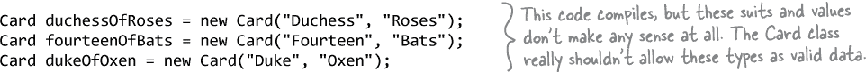
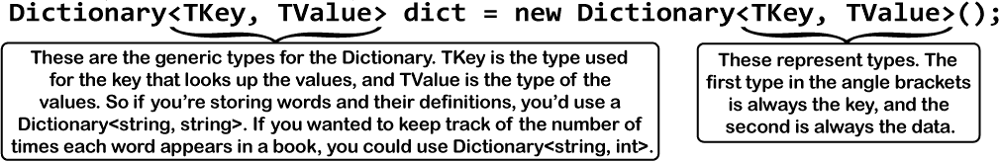
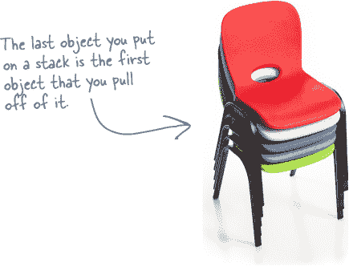

# 第十二章：枚举和集合：*组织您的数据*


**数据并不总是那么整洁和整齐。**

在现实世界中，您不会收到整齐的小数据片段。不，您的数据会以**大量、堆和成群**的方式出现。您将需要一些非常强大的工具来组织所有这些数据，这就是**枚举**和**集合**发挥作用的地方。枚举是一种类型，让您定义用于对数据进行分类的有效值。集合是特殊的对象，可以存储许多值，让您**存储、排序和管理**程序需要处理的所有数据。这样，您可以花时间考虑编写处理数据的程序，而让集合为您跟踪数据。

# 字符串并不总是适用于存储数据的类别

接下来几章，我们将使用扑克牌进行工作，因此让我们构建一个我们将使用的`Card`类。首先，创建一个新的`Card`类，其中包含一个构造函数，允许您传递花色和值，并将它们存储为字符串：

```cs
class Card
{
    public string Value { get; set; }
    public string Suit { get; set; }
    public string Name { get { return $"{Value} of {Suit}"; } }

    public Card(string value, string suit)
    {
        Value = value;
        Suit = suit;
    }
}
```


看起来不错。我们可以创建一个`Card`对象并像这样使用它：

```cs
Card aceOfSpades = new Card("Ace", "Spades");
Console.WriteLine(aceOfSpades);  // prints Ace of Spades
```

但是有个问题。使用字符串来保存花色和值可能会产生一些意想不到的结果：



我们***可以***向构造函数添加代码来检查每个字符串，并确保它是有效的花色或值，并通过抛出异常来处理不良输入。这是一个有效的方法——当然，前提是您正确处理异常。

但是***如果*** C# 编译器能够自动检测到这些无效值，那不是很棒吗？如果编译器能够在您运行代码之前确保所有卡片都是有效的，会怎么样？好吧，猜猜看：它***会***做到！您需要做的就是**枚举**可以使用的值。


# 枚举允许您使用一组有效的值

**枚举**或**枚举类型**是一种数据类型，仅允许该数据片段的某些值。因此，我们可以定义一个名为`Suits`的枚举，并定义允许的花色：


## 枚举定义了一个新类型

当您使用`enum`关键字时，您正在**定义一个新类型**。以下是有关枚举的一些有用信息：

> **枚举允许您定义一个新类型，该类型仅允许特定的一组值。不属于枚举的任何值都将使代码崩溃，这可以防止以后的错误。**

 **您可以将枚举用作变量定义中的类型，就像您使用字符串、整数或任何其他类型一样：**

```cs
Suits mySuit = Suits.Diamonds;
```

 **由于枚举是一种类型，您可以使用它来创建数组：**

```cs
Suits[] myVals= new Suits[3] { Suits.Spades, Suits.Clubs, mySuit };
```

 **使用 == 来比较枚举值。这里有一个接受`Suit`枚举作为参数，并使用==检查它是否等于`Suits.Hearts`的方法：**


 **但你不能随意为枚举创造一个新值。如果这样做，程序将无法编译——这意味着你可以避免一些讨厌的错误：**

```cs
IsItAHeart(Suits.Oxen);
```

如果你使用不属于枚举的值，编译器会报错：


# 枚举让你用名称表示数字

有时候，如果你有数字的名称，使用数字会更容易。你可以为枚举值分配数字，并使用名称来引用它们。这样，你的代码中就不会有大量未解释的数字漂来漂去了。这是一个枚举，用于跟踪狗比赛中技巧的得分：


###### 注意

你可以将整数转换为枚举，也可以将（基于整数的）枚举转换回整数。

有些枚举使用不同类型，如 byte 或 long（像下面这个）。你可以将它们转换为它们的类型，而不是 int。

这是一个使用`TrickScore`枚举的方法片段的摘录，通过将其转换为和从整数值中：


你可以将枚举转换为数字并进行计算。你甚至可以将其转换为字符串——枚举的`ToString`方法会返回带有成员名称的字符串：


如果你没有为名称分配任何数字，列表中的项目将默认分配值。第一个项目将被分配为 0 值，第二个为 1 值，依此类推。但如果你想为枚举器中的一个使用非常大的数字会发生什么？枚举中数字的默认类型是 int，所以你需要使用冒号（:)）运算符指定你需要的类型，就像这样：


# 我们可以使用数组来创建一副牌...

如果你想创建一个表示一副牌的类会怎样？它需要一种方法来跟踪牌组中的每张牌，并且需要知道它们的顺序。`Cards`数组会起作用——牌组中的顶部牌的值为 0，下一张牌为 1，依此类推。这是一个起点——一个初始带有完整 52 张牌的牌组：


## ...但如果你想做更多呢？

想象一下你可能需要用一副牌做的所有事情。如果你玩一种纸牌游戏，你通常需要改变牌的顺序，并从牌组中添加和删除牌。但你用数组却很难做到这一点。例如，再看一下《蜜蜂管理系统》练习中的`AddWorker`方法：


你必须使用`Array.Resize`将数组长度调整长，然后将工作者添加到末尾。这是一项很大的工作。

# 与数组一起工作可能会很麻烦

对于存储固定值或引用的数组来说，这没问题。一旦你需要移动数组元素或添加超出数组容量的元素，情况就开始变得有点棘手。以下是使用数组时可能会遇到的一些问题。

每个数组都有一个长度。除非你重新调整数组的大小，否则该长度不会改变，因此你需要知道长度才能使用它。假设你想要使用数组来存储 Card 的引用。如果你想要存储的引用数量少于数组的长度，你可以使用空引用来保持某些数组元素为空。


你需要跟踪数组中保存的卡片数量。你可以添加一个 int 字段 —— 也许你会称之为 cardCount，用来保存数组中最后一张卡片的索引。因此，你的三张卡片数组长度为 7，但你会将 cardCount 设置为 3。


现在情况变得复杂了。添加一个 Peek 方法很容易，它只返回卡堆顶的引用，这样你就可以查看卡堆顶部了。如果你想添加一张卡片怎么办？如果 cardCount 小于数组的长度，你可以把卡片放在该索引处，并将 cardCount 加 1。但如果数组已满，你就需要创建一个新的更大的数组，并将现有的卡片复制到新数组中。移除一张卡片很简单 —— 但在从 cardCount 中减去 1 之后，你需要确保将移除的卡片的数组索引设为 `null`。如果你需要从列表中间移除一张卡片怎么办？如果你移除卡片 4，你需要将卡片 5 移回来替换它，然后移动 6，再移动 7...哇，这多么混乱啊！

###### 注意

#inheritance_your_objectapostrophes_famil 中的 AddWorker 方法使用了 Array.Resize 方法来执行此操作。

# 列表使得存储任何类型的集合变得容易

C# 和 .NET 拥有处理添加和移除数组元素时遇到的所有棘手问题的 **集合** 类。最常见的集合类型是 List<T>。一旦创建了 List<T> 对象，就可以轻松地添加项目、从列表中任何位置移除项目、查看项目，甚至将项目从列表中的一个位置移动到另一个位置。以下是列表的工作原理。

###### 注意

在本书中，我们有时会在提到 List 时省略 <T>。当你看到 List 时，请想到 List<T>。

1.  **首先创建一个新的 List<T> 实例。** 请记住，每个数组都有一个类型 —— 你不只是有一个数组，你有一个 int 数组、一个 Card 数组等等。列表也是如此。当你使用 `new` 关键字创建它时，你需要在尖括号（<>）中指定列表将要保存的对象或值的类型：

    ```cs
    List<Card> cards = new List<Card>();
    ```

    

1.  **现在您可以添加到您的 List<T> 中。** 一旦您有一个 List<T> 对象，只要这些对象与您创建 List<T> 时指定的类型*多态*，就可以添加任意数量的项目到其中——这意味着它们可以分配给该类型（包括接口、抽象类和基类）。

    ```cs
    cards.Add(new Card(Values.King, Suits.Diamonds));
    cards.Add(new Card(Values.Three, Suits.Clubs));
    cards.Add(new Card(Values.Ace, Suits.Hearts));
    ```

    

# 列表比数组更灵活

List 类内置于 .NET Framework 中，它允许您执行许多对象操作，这些操作是使用普通数组无法完成的。查看一些您可以使用 List<T> 完成的操作。


# 让我们构建一个存储鞋子的应用程序

现在是看看列表（List）如何运作的时候了。让我们构建一个 .NET Core 控制台应用程序，提示用户添加或移除鞋子。以下是运行应用程序的示例，添加两只鞋子，然后将它们移除：

我们将从一个 Shoe 类开始，用于存储鞋子的样式和颜色。然后我们将创建一个名为 ShoeCloset 的类，该类使用 List<Shoe> 存储鞋子，并具有 AddShoe 和 RemoveShoe 方法，这些方法提示用户添加或移除鞋子。

***一定要这样做！***

1.  **添加一个用于鞋子样式的枚举。** 一些鞋子是运动鞋，其他的是凉鞋，所以枚举是有意义的：

    

1.  **添加 Shoe 类。** 它使用 Style 枚举表示鞋子样式和一个字符串表示鞋子颜色，其工作方式与我们之前在本章创建的 Card 类相似：

    ```cs
    class Shoe
    {
        public Style Style { 
           get; private set; 
        }
        public string Color { 
           get; private set;
        }
        public Shoe(Style style, string color)
        {
            Style = style;
            Color = color;
        }
        public string Description
        {
            get { return $"A {Color} {Style}"; }
        }
    }
    ```

    

    ```cs
    The shoe closet is empty.
    ```

    

    ```cs
    Press ’a’ to add or ’r’ to remove a shoe: a
    Add a shoe
    Press 0 to add a Sneaker
    Press 1 to add a Loafer
    Press 2 to add a Sandal
    Press 3 to add a Flipflop
    Press 4 to add a Wingtip
    Press 5 to add a Clog
    Enter a style: 1
    Enter the color: black

    The shoe closet contains:
    Shoe #1: A black Loafer
    ```

    ###### 注意

    按‘a’键添加鞋子，然后选择鞋子类型并输入颜色。

    ```cs
    Press ’a’ to add or ’r’ to remove a shoe: a
    Add a shoe
    Press 0 to add a Sneaker
    Press 1 to add a Loafer
    Press 2 to add a Sandal
    Press 3 to add a Flipflop
    Press 4 to add a Wingtip
    Press 5 to add a Clog
    Enter a style: 0
    Enter the color: blue and white

    The shoe closet contains:
    Shoe #1: A black Loafer
    Shoe #2: A blue and white Sneaker
    ```

    ###### 注意

    按‘r’键移除鞋子，然后输入要移除的鞋子编号。

    ```cs
    Press ’a’ to add or ’r’ to remove a shoe: r
    Enter the number of the shoe to remove: 2
    Removing A blue and white Sneaker

    The shoe closet contains:
    Shoe #1: A black Loafer

    Press ’a’ to add or ’r’ to remove a shoe: r
    Enter the number of the shoe to remove: 1
    Removing A black Loafer

    The shoe closet is empty.

    Press ’a’ to add or ’r’ to remove a shoe:
    ```

    

1.  **ShoeCloset 类使用 List<Shoe> 来管理其鞋子。** ShoeCloset 类有三个方法——PrintShoes 方法将鞋子列表打印到控制台，AddShoe 方法提示用户向衣柜添加鞋子，RemoveShoe 方法提示用户移除鞋子：

    

1.  **添加具有入口点的 Program 类。** 注意它并没有做很多事情？这是因为所有有趣的行为都封装在 ShoeCloset 类中：

    

1.  **运行您的应用程序并重现示例输出。** 尝试调试应用程序，并开始熟悉如何使用列表。现在无需记住任何东西——您将有足够的练习！

# 通用集合可以存储任何类型

您已经看到列表可以存储字符串或鞋子。您还可以创建整数或任何其他对象的列表。这使得列表成为**通用集合**。创建新的列表对象时，将其绑定到特定类型：可以有整数列表、字符串列表或鞋子对象列表。这样可以轻松使用列表——一旦创建了列表，就始终知道其中的数据类型。

但是“泛型”到底意味着什么？让我们使用 Visual Studio 探索泛型集合。打开 *ShoeCloset.cs* 并将鼠标悬停在 `List` 上：


> **泛型集合可以容纳任何类型的对象，并且提供一致的一组方法来处理集合中的对象，无论它持有什么类型的对象。**

有几点需要注意：

+   List 类位于命名空间 System.Collections.Generic——这个命名空间中有几个泛型集合类（这就是为什么你需要那个 `using` 行）。

+   描述中说 List 提供了“搜索、排序和操作列表的方法”。你在 ShoeCloset 类中使用了其中一些方法。

+   最上面一行说 `List<T>`，最下面一行说 `T is Shoe`。这就是泛型的定义方式——它表明 List 可以处理任何类型，但对于这个特定的列表，该类型是 Shoe 类。

## 泛型列表使用 <尖括号> 来声明。

当你声明一个列表时——不管它保存什么类型的对象——你总是以相同的方式声明它，使用 <尖括号> 来指定列表中存储的对象类型。

你经常会看到泛型类（不仅仅是 List）这样写：List<T>。这样你就知道这个类可以接受任何类型。


# 集合初始化器类似于对象初始化器。

在需要创建列表并立即添加多个项目时，**C#** 提供了一种简便的快捷方式以减少输入量。当你创建一个新的 List 对象时，可以使用**集合初始化器**来提供初始的项目列表。它会在列表创建后立即添加这些项目。


> **集合初始化器通过允许你同时创建列表并添加初始项目，使得你的代码更加紧凑。**

# 让我们创建一个 Duck 列表。

***就这样！***

这里有一个 Duck 类，用于跟踪你的许多邻里鸭子。（你*确实*收集鸭子，对吧？） **创建一个新的控制台应用项目** 并添加一个新的 Duck 类和 KindOfDuck 枚举。


## 这是你的 Duck 列表的初始化器。

你有六只鸭子，所以你会创建一个具有六个语句的 List<Duck>，每个语句在初始化器中创建一个新的 Duck，使用对象初始化器来设置每个 Duck 对象的 Size 和 Kind 字段。确保这个 `**using directive**` 在 *Program.cs* 的顶部：

```cs
using System.Collections.Generic;
```

然后将这个 **PrintDucks 方法添加到你的 Program 类中**：

```cs
public static void PrintDucks(List<Duck> ducks)
{
    foreach (Duck duck in ducks) {
        Console.WriteLine($"{duck.Size} inch {duck.Kind}");
    }
}
```

最后，在 *Program.cs* 的 **Main** 方法中添加这段代码来创建一个 Duck 列表，然后打印它们：

```cs
List<Duck> ducks = new List<Duck>() {
    new Duck() { Kind = KindOfDuck.Mallard, Size = 17 },
    new Duck() { Kind = KindOfDuck.Muscovy, Size = 18 },
    new Duck() { Kind = KindOfDuck.Loon, Size = 14 },
    new Duck() { Kind = KindOfDuck.Muscovy, Size = 11 },
    new Duck() { Kind = KindOfDuck.Mallard, Size = 14 },
    new Duck() { Kind = KindOfDuck.Loon, Size = 13 },
};

PrintDucks(ducks);
```

###### 注意

**运行你的代码——它将在控制台打印出一堆 Duck。**

# 列表很容易，但是排序可能有些棘手。

想要排序数字或字母并不难。但是如何对两个单独的对象进行排序，特别是它们有多个字段的情况下呢？在某些情况下，您可能希望按照“名称”字段的值对对象进行排序，而在其他情况下，可能根据“身高”或“出生日期”来排序对象才更合理。有很多种排序方法，而列表支持所有这些方法。


## 列表知道如何对自己进行排序

每个列表都有一个**排序方法**，可以重新排列列表中的所有项目，使它们按顺序排列。列表已经知道如何对大多数内置类型和类进行排序，并且可以轻松地教会它们如何对您自己的类进行排序。

###### 注意

从技术上讲，不是列表 List<T>知道如何对自己进行排序。这是 IComparer<T>对象的工作，您马上就会了解到它的工作原理。


# IComparable<Duck>帮助列表排序它的鸭子

如果您有一个数字列表并调用其排序方法，它将首先将最小的数字排序，然后是最大的。列表如何知道如何对鸭子对象进行排序呢？我们告诉列表(List.Sort)鸭子类可以进行排序——通常我们用接口*来表示一个类能够完成某个任务。

> **通过使其实现 IComparable<T>并添加 CompareTo 方法，您可以使任何类与列表的内置排序方法配合使用。**

List.Sort 方法知道如何对实现了 IComparable<T>接口的任何类型或类进行排序。该接口只有一个成员——名为 CompareTo 的方法。Sort 使用对象的 CompareTo 方法将其与其他对象进行比较，并使用其返回值（一个整数）来确定哪个对象排在前面。

## 对象的 CompareTo 方法将其与另一个对象进行比较

为了让我们的列表对象具有对鸭子进行排序的能力，一种方法是**修改鸭子类以实现 IComparable<Duck>**并添加其唯一的成员，即接受鸭子引用作为参数的 CompareTo 方法。

通过实现 IComparable<Duck>更新项目的鸭子类，以便根据鸭子的大小进行排序：


**在调用 PrintDucks 之前的 Main 方法的最后添加这行代码**。这告诉您的鸭子列表对自己进行排序。现在它在将鸭子打印到控制台之前按大小对它们进行排序：


# 使用 IComparer 告诉列表如何排序

您的鸭子类实现了 IComparable，所以 List.Sort 知道如何对鸭子对象列表进行排序。但是，如果您想以不同于通常方式的方式对它们进行排序怎么办？或者，如果您想对不实现 IComparable 的对象类型进行排序怎么办？那么您可以将一个**比较器对象**作为参数传递给 List.Sort，以提供不同的排序方式。请注意 List.Sort 的重载方式：


List.Sort 还有一个重载版本，**它接受一个 IComparer<T> 的引用**，其中 T 将被你列表的泛型类型替换（因此对于 List<Duck>，它接受一个 IComparer<Duck> 参数，对于 List<string>，它是一个 IComparer<string>，等等）。你将传递一个实现接口的对象的引用，我们知道这意味着：它 *完成特定的工作*。在这种情况下，这个工作是比较列表中项目对以告诉 List.Sort 如何排序它们的顺序。

IComparer<T> 接口只有一个成员，一个名为 Compare 的方法。它与 IComparable<T> 中的 CompareTo 方法完全相同：它接受两个对象参数 `x` 和 `y`，如果 `x` 在 `y` 之前则返回正值，如果 `x` 在 `y` 之后则返回负值，如果它们相同则返回零。

## 向你的项目中添加一个 IComparer

**将 DuckComparerBySize 类添加到你的项目中**。它是一个比较器对象，你可以将其作为参数传递给 List.Sort，以使其按大小排序你的鸭子。

IComparer 接口位于 System.Collections.Generic 命名空间中，因此如果你将此类添加到新文件中，请确保它有正确的 `using` 指令：

```cs
using System.Collections.Generic;
```

这是比较器类的代码：


###### 注意

**你能想出如何修改 DuckComparerBySize 使其按从大到小排序鸭子吗？**

###### 注意

**比较器对象是一个类的实例，该类实现了 IComparer<T>，你可以将其作为引用传递给 List.Sort。它的 Compare 方法的工作方式与 IComparable<T> 接口中的 CompareTo 方法完全相同。当 List.Sort 比较其元素以对其进行排序时，它将一对对象传递给你的比较器对象的 Compare 方法，因此你的列表将根据你实现的比较器不同而不同排序。**

# 创建你的比较器对象的一个实例

当你想使用 IComparer<T> 进行排序时，你需要创建一个实现它的类的新实例——在本例中是 Duck。这就是比较器对象，它将帮助 List.Sort 弄清楚如何对其元素进行排序。与任何其他（非静态）类一样，在使用之前你需要实例化它：


## 多个 IComparer 实现，多种排序对象的方式

你可以创建多个具有不同排序逻辑的 IComparer<Duck> 类来以不同方式排序鸭子。然后，当你需要以特定方式排序时，你可以使用你想要的比较器。这里是另一个添加到你的项目中的鸭子比较器实现：


返回并修改你的程序，使用这个新的比较器。现在它在打印之前按种类对鸭子进行排序。

```cs
IComparer<Duck> kindComparer = new DuckComparerByKind();
ducks.Sort(kindComparer);
PrintDucks(ducks);
```

# 比较器可以进行复杂的比较

为你的鸭子创建一个单独的排序类的一个优势是，你可以在该类中构建更复杂的逻辑，并且你可以添加帮助确定列表排序方式的成员。


# 重写 ToString 方法让对象描述自己

每个对象都有一个叫做 ToString 的**方法，将它转换为字符串**。你已经用过它了—任何时候你在字符串插值中使用 `{花括号}`，它都会调用花括号内部的 ToString 方法—而且 IDE 也会利用它。当你创建一个类时，它会继承自 Object 的 ToString 方法，Object 是所有其他类扩展的顶级基类。

Object.ToString 方法打印**完全限定的类名**，或者命名空间后跟一个句点再跟类名。由于在编写本章时我们使用了命名空间 DucksProject，我们的 Duck 类的完全限定类名是 DucksProject.Duck：


IDE 也会调用 ToString 方法—例如，当你查看或检查一个变量时：


嗯，这并不像我们希望的那样有用。你可以看到列表中有六个 Duck 对象。如果你展开一个 Duck，你可以看到它的 Kind 和 Size 值。如果你一次能看到所有这些对象，那不是更方便吗？

## 覆盖 ToString 方法以在 IDE 中查看你的 Duck 对象

幸运的是，ToString 是 Object 的虚方法，是每个对象的基类。所以你只需要**重写 ToString 方法**—当你这样做时，你会立即在 IDE 的 Watch 窗口中看到结果！打开你的 Duck 类，并开始通过输入 `**override**` 来添加一个新方法。一旦你加入一个空格，IDE 将会显示你可以重写的方法：


**点击 ToString()** 告诉 IDE 添加一个新的 ToString 方法。替换内容使其看起来像这样：

```cs
public override string ToString()
{
    return $"A {Size} inch {Kind}";
}
```

运行你的程序并再次查看列表。现在 IDE 会显示 Duck 对象的内容。


# 更新你的 foreach 循环，让你的 Duck 和 Card 对象自己写入控制台

你已经看到两个不同的程序示例，它们循环遍历对象列表，并调用 Console.WriteLine 来打印列表中每个对象的内容—就像这个 foreach 循环一样，它会打印 List<Card> 中的每个 Card：

```cs
    foreach (Card card in cards)
    {
        Console.WriteLine(card.Name);
    }
```

PrintDucks 方法对 List 中的 Duck 对象做了类似的事情：

```cs
    foreach (Duck duck in ducks) {
        Console.WriteLine($"{duck.Size} inch {duck.Kind}");
    }
```

这是对对象的一个非常常见的操作。现在你的 Duck 有了一个 ToString 方法，你的 PrintDucks 方法应该利用它。使用 IDE 的 IntelliSense 来浏览 Console.WriteLine 方法的重载—特别是这一个：


你可以将任何对象传递给 Console.WriteLine，它会调用它的 ToString 方法。所以你可以用调用这个重载的方法来替换 PrintDucks 方法：

```cs
     public static void PrintDucks(List<Duck> ducks) {
         foreach (Duck duck in ducks) {
             Console.WriteLine(duck);
         }
     }
```

**用这个方法替换 PrintDucks 方法**，然后再次运行你的代码。它将打印相同的输出。如果你想要为你的 Duck 对象添加比如 Color 或者 Weight 属性，你只需要更新 ToString 方法，一切使用它的地方（包括 PrintDucks 方法）都将反映这些变更。

## 也为你的 Card 对象添加一个 ToString 方法

你的 Card 对象已经有一个返回卡片名称的 Name 属性：

```cs
    public string Name { get { return $"{Value} of {Suit}"; } }
```

这正是它的 ToString 方法应该做的事情。所以，在 Card 类中添加一个 ToString 方法：

```cs
    public override string ToString() 
    {
        return Name;
    }
```

###### 注：

**我们决定让 ToString 方法调用 Name 属性。你认为我们做对了吗？删除 Name 属性并将其代码移到 ToString 方法中会更好吗？当你回头修改代码时，你必须做出这样的选择 —— 并不总是明显哪个选择最好。**

现在，使用 Card 对象的程序将更容易调试。

# 你可以使用 IEnumerable<T> 向上转型整个列表。

记得你可以将任何对象向上转型为其超类吗？嗯，当你有一个对象列表时，你可以一次性将整个列表向上转型。这就叫做**协变**，你只需要一个 IEnumerable<T> 接口的引用。

让我们看看这是如何运作的。我们将从本章一直使用的 Duck 类开始。然后我们将添加一个它将扩展的 Bird 类。Bird 类将包括一个静态方法，用于迭代 Bird 对象的集合。我们能够让它与 Duck 的 List 一起工作吗？


> **由于所有的 Duck 都是 Bird，协变允许我们将 Duck 集合转换为 Bird 集合。如果你必须将 List<Duck> 传递给只接受 List<Bird> 的方法，这将非常有用。**

***去做这件事！***

1.  **创建一个新的控制台应用程序项目。** 添加一个基类 Bird（用于 Duck 扩展）和一个 Penguin 类。我们将使用 ToString 方法来轻松查看每个类的区别。

    

1.  **将你的 Duck 类添加到应用程序中。** 修改它的声明**使其扩展 Bird**。你还需要**添加此章节前面的 KindOfDuck 枚举**：

    

1.  **创建 List<Duck> 集合。** 请继续在你的 Main 方法中**添加这段代码** ——它是本章前面的代码，再加上一行将其向上转型为 List<Bird>：

    

    啊哦 —— 那段代码编译不通过。错误信息告诉你不能将 Duck 集合转换为 Bird 集合。让我们尝试将 `ducks` 赋值给一个 List<Bird>：

    

    哎呀，这没用。我们得到了一个不同的错误，但它仍然说我们无法转换类型：

    

    这是有道理的 —— 这就像安全向上转型与向下转型一样，你在 #inheritance_your_objectapostrophes_famil 中学到的：我们可以使用赋值运算符来进行向下转型，但我们需要使用 `is` 关键字来安全地向上转型。那么我们如何安全地将 List<Duck> 向上转型为 List<Bird>？

1.  **使用协变让你的鸭子飞走。** 这就是**协变**的作用：你可以***使用赋值将你的 List<Duck>向上转型为 IEnumerable<Bird>***。一旦你得到了你的 IEnumerable<Bird>，你可以调用它的 ToList 方法将其转换为 List<Bird>。你需要在文件顶部添加 using `System.Collections.Generic`; 和 using `System.Linq`;：

    

# 使用字典来存储键和值

列表就像一个长长的页面，上面写满了名字。如果你还想要，对于每个名字，一个地址呢？或者对于`garage`列表中的每辆车，你想要关于那辆车的详细信息？你需要另一种.NET 集合：一个**字典**。字典让你取一个特殊的值——**键**——并将该键与一堆数据——**值**——关联起来。还有一件事：一个特定的键在任何字典中**只能出现一次**。


这是如何在 C#中声明.NET 字典：



让我们看看字典的实际应用。这是一个小型控制台应用程序，使用 Dictionary<string, string>来跟踪几个朋友的最喜爱的食物：


# 字典功能概述

字典和列表很像。这两种类型都灵活地让你处理许多数据类型，并且都带有许多内置功能。以下是你可以用字典做的基本事情。

+   **添加一个项目。**

    你可以使用方括号的**索引器**向字典中添加一个项目：

    ```cs
    Dictionary<string, string> myDictionary = new Dictionary<string, string>();
    myDictionary["some key"] = "some value";
    ```

    你也可以使用**Add 方法**向字典中添加一个项目：

    ```cs
    Dictionary<string, string> myDictionary = new Dictionary<string, string>();
    myDictionary.Add("some key", "some value");
    ```

+   **使用键查找值。**

    你将使用字典中最重要的功能是**使用索引器查找值**——这是有道理的，因为你将这些值存储在字典中，以便使用它们的唯一键查找它们。这个例子展示了一个 Dictionary<string, string>，所以我们将使用一个字符串键查找值，并且字典返回一个字符串值：

    ```cs
    string lookupValue = myDictionary["some key"];
    ```

+   **移除一个项目。**

    就像列表一样，你可以使用**Remove 方法**从字典中移除一个项目。你只需要传递给 Remove 方法的是要移除的键值：

    ```cs
    myDictionary.Remove("some key");
    ```

+   **获取键的列表。**

    你可以通过其**Keys 属性**获取字典中所有键的列表，并使用`foreach`循环遍历它。下面是这样做的样子：

    ```cs
    foreach (string key in myDictionary.Keys) { ... };
    ```

    ###### 注意

    Keys 是你的字典对象的一个属性。这个特定的字典有字符串键，所以 Keys 是一个字符串集合。

+   **计算字典中的对数。**

    **Count 属性**返回字典中键/值对的数量：

    ```cs
    int howMany = myDictionary.Count;
    ```

###### 注意

键在字典中是唯一的；任何键只出现一次。值可以出现任意次数——两个键可以有相同的值。这样，当你查找或移除一个键时，字典知道要移除什么。

## 你的键和值可以是不同类型的

字典非常灵活！它们可以容纳几乎任何东西，不仅仅是值类型，而是***任何类型的对象***。这里有一个存储整数作为键和 Duck 对象引用作为值的字典的示例：

```cs
Dictionary<int, Duck> duckIds = new Dictionary<int, Duck>();
duckIds.Add(376, new Duck() { Kind = KindOfDuck.Mallard, Size = 15 });
```

###### 注意

当您为对象分配唯一的 ID 号码时，看到一个将整数映射到对象的字典是很常见的。

# 构建一个使用字典的程序

这是一个快速应用程序，纽约洋基棒球迷会喜欢的。当一名重要球员退役时，球队会退役球员的球衣号码。**创建一个新的控制台应用程序**，查找一些穿过著名号码的洋基球员以及这些号码何时被退役。这里有一个类来跟踪退役的棒球球员：

***做这个！***

```cs
class RetiredPlayer
{
    public string Name { get; private set; }
    public int YearRetired { get; private set; }

    public RetiredPlayer(string player, int yearRetired)
    {
        Name = player;
        YearRetired = yearRetired;
    }
}
```

这里有一个带有 Main 方法的 Program 类，将退役球员添加到字典中。我们可以使用球衣号码作为字典的键，因为它是**唯一的**——一旦球衣号码被退役，球队***永远不会再使用它***。这在设计使用字典的应用程序时是需要考虑的重要事项：您绝不希望发现您的键并不像您想象的那样唯一！

###### 注意

**约基·贝拉曾经是纽约洋基队的#8 号球员，而卡尔·里普肯·朱尓是巴尔的摩金莺的#8 号球员。但在字典中，您可以有重复的值，但每个键必须是唯一的。您能想到一种方法来存储多个球队的退役号码吗？**


# 还有更多的集合类型...

列表和字典是.NET 中最常用的两种集合类型之一。列表和字典非常灵活——你可以以任意顺序访问它们中的任何数据。但有时你使用集合来表示现实世界中需要按特定顺序访问的一堆东西。您可以使用**队列或堆栈**来限制代码访问集合中的数据。它们是像 List<T>一样的泛型集合，但特别擅长确保按照特定顺序处理数据。

###### 注意

还有其他类型的集合，但这些是你最有可能接触到的。

**当您存储的第一个对象将是您要使用的第一个对象时，请使用队列：**

+   汽车沿单向街道行驶

+   排队等候的人

+   等待客服支持电话的客户

+   其他任何按先来先服务处理的事物

###### 注意

队列是先进先出的，这意味着您放入队列的第一个对象是您取出并使用的第一个对象。

**当您总是想使用最近存储的对象时，请使用堆栈：**

+   家具装载到移动卡车的后面

+   一个书堆，你希望先读最近添加的那本书

+   登机或离开飞机的人

+   一堆啦啦队员，顶上的人必须先下来...想象一下，如果底下的人先走了会是什么情况！

###### 注意

**栈**是后进先出：进入栈的第一个对象是最后一个出栈的对象。

## 泛型.NET 集合实现 IEnumerable

几乎每个大型项目都会包含某种通用集合，因为程序需要存储数据。当您在现实世界中处理类似的事物组时，它们几乎总是自然地归类到与这些种类的集合相对应的一类中。无论您使用哪种集合类型——List、Dictionary、Stack 或 Queue，您总是可以使用 foreach 循环，因为它们都实现了 IEnumerable<T>接口。

> **队列就像一个允许您将对象添加到末尾并使用位于开头的对象的列表。栈只允许您访问您放入其中的最后一个对象。**

###### 注意

您可以使用 foreach 枚举堆栈或队列，因为它们实现了**IEnumerable!**

# 队列是 FIFO—先进先出

**队列**很像列表，但不能随意在任何索引处添加或删除项目。要将对象添加到队列中，您需要进行**入队**操作。这将对象添加到队列的末尾。您可以从队列的前端**出队**第一个对象。这样做时，该对象从队列中移除，并且队列中其余对象向前移动一个位置。


# **栈**是 LIFO—后进先出

**栈**与队列非常相似，但有一个很大的区别。您需要**推**每个项目到栈上，当您想从栈中取出一个项目时，您需要**弹**一个项目。当您从栈中弹出一个项目时，您得到的是最近推入栈中的项目。这就像一个叠盘子、杂志或任何其他东西的栈一样——您可以把东西放在栈的顶部，但在获取其下面的内容之前，您需要把它拿掉。



**当您使用队列或栈时，您并不会失去任何东西。**

将队列对象复制到列表对象非常容易。将列表复制到队列，队列复制到堆栈也同样容易……事实上，您可以从任何实现 IEnumerable<T>接口的其他对象创建列表、队列或堆栈。您只需使用允许您将要从中复制的集合作为参数传递的重载构造函数。这意味着您可以灵活方便地使用最适合您需要的集合来表示数据。（但请记住，您正在进行复制，这意味着您正在创建一个全新的对象并将其添加到堆中。）


