# 第十四章：Unity 实验室＃4：用户界面

在上一个 Unity 实验室中，你开始构建一个游戏，使用预制体来创建在游戏的 3D 空间中随机点出现并绕圈飞行的 GameObject 实例。这个 Unity 实验室继续了上一个实验室的工作，允许你应用你在 C#中学到的关于界面的知识等等。

到目前为止，你的程序是一个有趣的视觉模拟。这个 Unity 实验室的目标是**完成游戏的构建**。游戏从零分开始。台球将开始出现并在屏幕上飞动。当玩家点击一个球时，分数会增加 1 分并且球会消失。越来越多的球会出现；一旦屏幕上有 15 个球在飞动，游戏就会结束。为了使你的游戏运行起来，玩家需要一种启动游戏的方式，并且在游戏结束后能够再次玩游戏，并且他们希望在点击球时能看到自己的得分。因此，你将在屏幕角落添加一个显示分数的**用户界面**，并显示一个按钮来启动新游戏。

# 添加一个在玩家点击球时增加分数的功能

你有一个非常有趣的模拟器。现在是将其转变成游戏的时候了。在 GameController 类中**添加一个新字段**来跟踪分数 —— 你可以将其添加在 OneBallPrefab 字段的下方：

```cs
    public int Score = 0;
```

接下来，**在 GameController 类中添加一个名为 ClickedOnBall 的方法**。每次玩家点击一个球时，该方法将被调用：

```cs
    public void ClickedOnBall()
    {
        Score++;
    }
```

Unity 使得你的 GameObject 能够很容易地响应鼠标点击和其他输入。如果你在一个脚本中添加一个名为 OnMouseDown 的方法，Unity 将在每次点击附加到它的 GameObject 时调用该方法。**将此方法添加到 OneBallBehaviour 类中**：

```cs
    void OnMouseDown()
    {
        GameController controller = Camera.main.GetComponent<GameController>();
        controller.ClickedOnBall();
        Destroy(gameObject);
    }
```

OnMouseDown 方法的第一行获取 GameController 类的实例，第二行调用它的 ClickedOnBall 方法，该方法增加其 Score 字段。

现在运行你的游戏。点击层级中的 Main Camera 并观察检查器中的 Game Controller（脚本）组件。点击一些旋转的球 —— 它们会消失，而得分会增加。

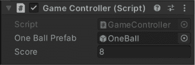

# 给你的游戏添加两种不同的模式

启动你最喜欢的游戏。你是不是立刻投入到了动作中？可能不是 —— 你可能在看起始菜单。有些游戏允许你暂停动作来查看地图。许多游戏允许你在移动玩家和使用库存之间切换，或者在玩家死亡时显示无法中断的动画。这些都是**游戏模式**的例子。

> **你将为你的游戏添加两种模式。你已经有“运行”模式了，现在只需要添加一个“游戏结束”模式。**

让我们为你的台球游戏添加两种不同的模式：

+   **模式＃1：游戏正在运行。** 球正在被添加到场景中，点击它们会使它们消失并增加分数。

+   **模式＃2：游戏结束。** 球不再添加到场景中，点击它们不会有任何效果，并显示“游戏结束”横幅。

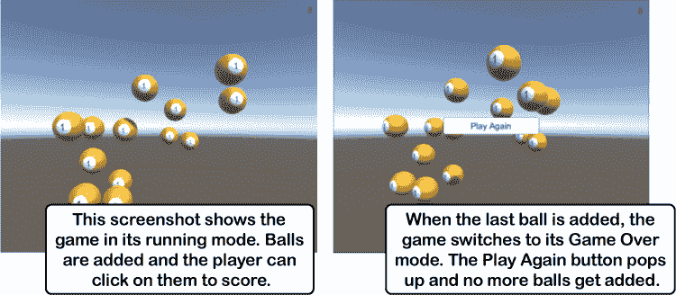

这是你将两种游戏模式添加到游戏中的方法：

1.  ***使 GameController.AddABall 注意游戏模式。***

    你的新改进的 AddABall 方法将检查游戏是否结束，只有在游戏未结束时才会实例化一个新的 OneBall 预制件。

1.  ***使 OneBallBehaviour.OnMouseDown 仅在游戏运行时起作用。***

    当游戏结束时，我们希望游戏不再响应鼠标点击。玩家应该只能看到已经添加的球继续在周围旋转，直到游戏重新开始。

1.  ***使 GameController.AddABall 在球太多时结束游戏。***

    AddABall 还会增加其 NumberOfBalls 计数器，每添加一个球，该计数器将增加 1。如果值达到 MaximumBalls，它会将 GameOver 设置为 true，以结束游戏。

###### 注意

**在这个实验中，你将逐步构建这个游戏，并进行途中的更改。你可以从书本的 GitHub 存储库下载每个部分的代码：[`github.com/head-first-csharp/fourth-edition`](https://github.com/head-first-csharp/fourth-edition)。**

# 向你的游戏中添加游戏模式

修改你的 GameController 和 OneBallBehaviour 类，通过使用布尔字段来追踪游戏是否结束，**为你的游戏添加模式**。

1.  ***使 GameController.AddABall 注意游戏模式。***

    我们希望 GameController 知道游戏处于什么模式。当我们需要追踪对象知道的信息时，我们使用字段。因为有两种模式——运行和游戏结束——我们可以使用布尔字段来追踪模式。**在你的 GameController 类中添加 GameOver 字段**：

    ```cs
        public bool GameOver = false;
    ```

    当游戏运行时，游戏应仅向场景中添加新球。修改 AddABall 方法，添加一个`if`语句，仅在 GameOver 不为真时调用 Instantiate：

    ```cs
         public void AddABall()
          {
             if (!GameOver)
             {
                 Instantiate(OneBallPrefab);
             }
         }
    ```

    现在可以测试一下。启动游戏，然后在层次视图窗口中**点击主摄像机**。

    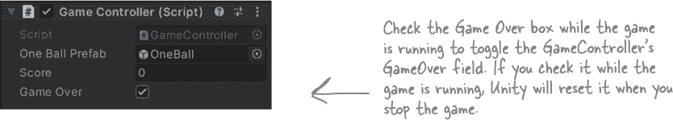

    通过取消脚本组件中的复选框来设置 GameOver 字段。直到再次勾选该框，游戏才会停止添加球。

1.  ***使 OneBallBehaviour.OnMouseDown 仅在游戏运行时起作用。***

    你的 OnMouseDown 方法已经调用了 GameController 的 ClickedOnBall 方法。现在，**修改 OneBallBehaviour 中的 OnMouseDown**方法，也使用 GameController 的 GameOver 字段：

    ```cs
         void OnMouseDown()
         {
             GameController controller = Camera.main.GetComponent<GameController>();
            if (!controller.GameOver)
            {
                controller.ClickedOnBall();
                Destroy(gameObject);
            }
         }
    ```

    再次运行你的游戏，并测试只有在游戏未结束时球消失并且分数上升。

1.  ***使 GameController.AddABall 在球太多时结束游戏。***

    游戏需要跟踪场景中球的数量。我们将通过向 GameController 类添加两个字段来实现这一点，以跟踪当前球的数量和最大球的数量：

    ```cs
        public int NumberOfBalls = 0;
        public int MaximumBalls = 15;
    ```

    每当玩家点击球时，球的 OneBallBehaviour 脚本会调用 GameController.ClickedOnBall 来增加（加 1 到）分数。让我们也减少（从中减 1）NumberOfBalls：

    ```cs
         public void ClickedOnBall()
         {
             Score++;
             NumberOfBalls--;
         }
    ```

    现在 **修改 AddABall 方法**，只有在游戏运行时才添加球，并且如果场景中球太多则结束游戏：

    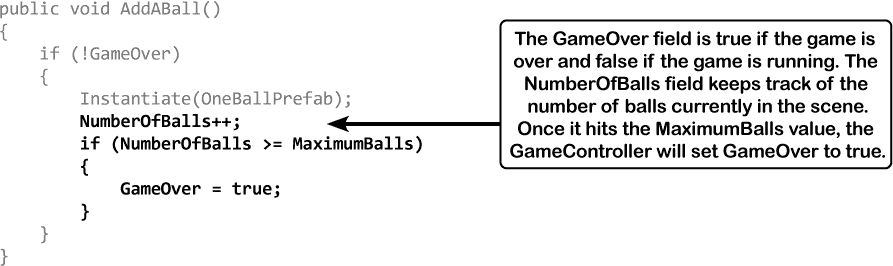

    现在通过运行游戏并在 Hierarchy 窗口点击 Main Camera 来再次测试游戏。游戏应该正常运行，但一旦 NumberOfBalls 字段等于 MaximumBalls 字段时，AddABall 方法将其 GameOver 字段设置为 true 并结束游戏。

    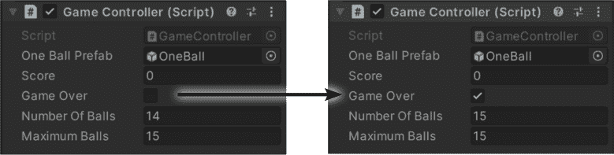

    一旦这种情况发生，点击球不会有任何作用，因为 OneBallBehaviour.OnMouseDown 检查 GameOver 字段，仅在 GameOver 为 false 时增加分数并销毁球。

    > **您的游戏需要跟踪其游戏模式。字段是实现这一点的好方法。**

# 为您的游戏添加一个 UI

几乎任何你能想到的游戏 —— 从 Pac Man 到 Super Mario Brothers 到 Grand Theft Auto 5 到 Minecraft —— 都包含了一个 **用户界面（或 UI）**。一些游戏，如 Pac Man，有一个非常简单的 UI，只显示得分、最高分、剩余生命和当前级别。许多游戏特别在游戏机制中加入了复杂的 UI（比如武器轮让玩家快速切换武器）。让我们为您的游戏添加一个 UI。

**从 GameObject 菜单选择 *UI >> Text*，以向游戏的 UI 添加一个 2D Text GameObject。这将在 Hierarchy 中添加一个 Canvas，并在该 Canvas 下添加一个 Text：**

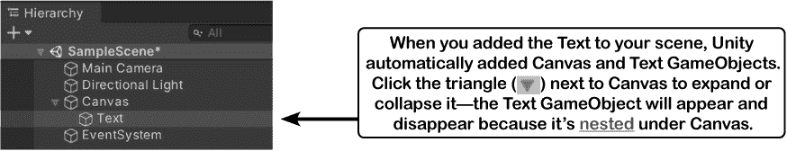

在 Hierarchy 窗口双击 Canvas 以聚焦它。它是一个二维矩形。点击它的 Move Gizmo 并在场景中拖动它。它不会移动！刚添加的 Canvas 将始终显示，按照屏幕大小缩放，并位于游戏中其他所有内容的前面。

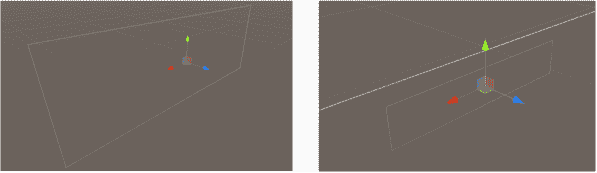

###### 注意

在 Hierarchy 中注意到了 EventSystem 吗？Unity 在创建 UI 时会自动添加它。它管理鼠标、键盘和其他输入，并将它们发送回 GameObjects —— 所有这些都是自动完成的，因此您不需要直接与它交互。

然后双击 Text 以聚焦它 —— 编辑器会放大，但默认文本（“New Text”）将会是反向的，因为 Main Camera 正对着 Canvas 的后面。

###### 注意

Canvas 是一个二维 GameObject，可让您布置游戏的用户界面。您游戏的 Canvas 将有两个嵌套的 GameObjects：刚添加的 Text GameObject 将位于右上角显示分数，还有一个 Button GameObject 允许玩家开始新游戏。

# 使用 2D 视图来操作 Canvas

Scene 窗口顶部的 **2D 按钮** 切换 2D 视图的开和关：

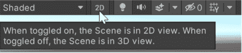

点击 2D 视图 —— 编辑器会转到正面显示 Canvas。在 Hierarchy 窗口双击 Text 以放大它。

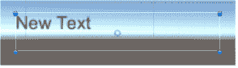

###### 注意

使用鼠标滚轮在 2D 视图中进行缩放

点击 2D 按钮可在 2D 和 3D 视图之间切换。再次点击可返回 3D 视图。

# 设置在 UI 中显示分数的文本

您的游戏 UI 将包含一个 Text GameObject 和一个 Button。每个 GameObject 都将**锚定**在 UI 的不同部分。例如，显示分数的 Text GameObject 将显示在屏幕的右上角（无论屏幕大小如何）。

点击 Hierarchy 窗口中的 Text 以选择它，然后查看 Rect Transform 组件。我们希望文本显示在右上角，因此**点击 Rect Transform 面板中的锚点框**。

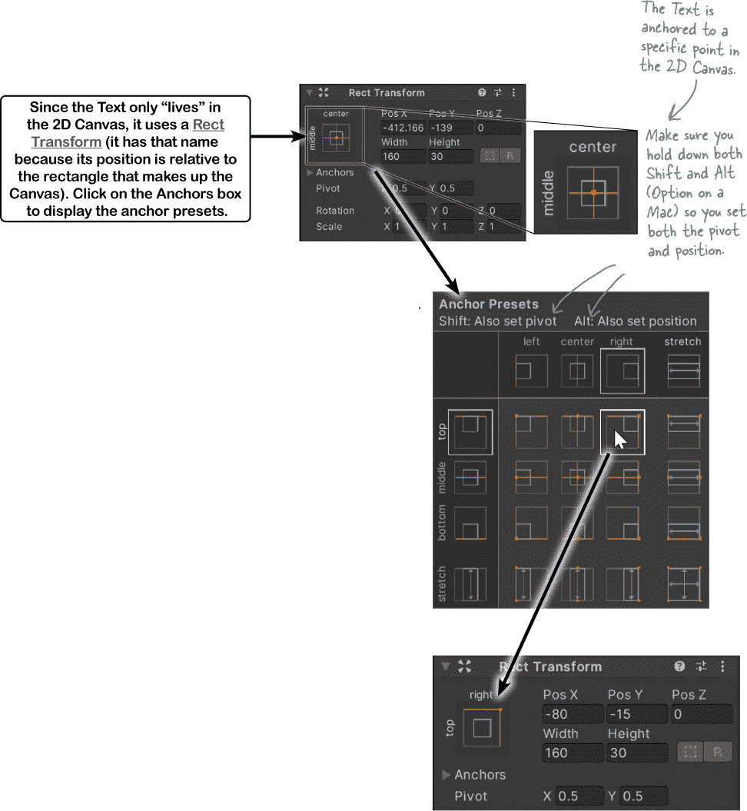

锚点预设窗口允许您将 UI GameObject 锚定到 Canvas 的各个部分。**按住 Alt 和 Shift**（或 Mac 上的 Option+Shift），然后**选择右上角的锚点预设**。再次单击与打开锚点预设窗口相同的按钮。现在文本位于 Canvas 的右上角——再次双击它以放大查看。


让我们在文本的上方和右侧添加一点空间。返回到 Rect Transform 面板，将 Pos X 和 Pos Y 都设置为-10，以便将文本定位在距右上角左 10 个单位和下 10 个单位的位置。然后将 Text 组件上的 Alignment 设置为 right，并使用检查器顶部的框**将游戏对象的名称更改为** `**Score**`。

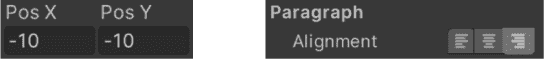

您的新文本现在应该显示在 Hierarchy 窗口中，并带有名称 Score。它现在应该右对齐，文本边缘与 Canvas 边缘之间有一小段距离。


# 添加一个调用方法以启动游戏的按钮

当游戏处于“游戏结束”模式时，它将显示一个标有“Play Again”的按钮，该按钮调用一个方法以重新启动游戏。**向您的 GameController 类添加一个空的 StartGame 方法**（稍后我们将添加其代码）：

```cs
    public void StartGame()
    {
 // We’ll add the code for this method later
    }
```

**点击 Hierarchy 窗口中的 Canvas**以将焦点放在它上面。然后从 GameObject 菜单中选择 UI >> Button 添加一个按钮。由于您已经专注于 Canvas，Unity 编辑器将添加新的 Button 并将其锚定到 Canvas 的中心。您注意到 Hierarchy 中的 Button 旁边有一个三角形吗？展开它——它下面嵌套了一个 TextGameObject。点击它并将其文本设置为`Play Again`。

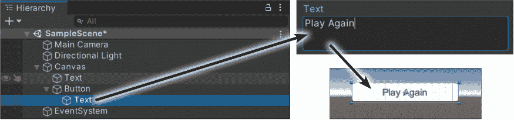

按钮设置好后，我们只需让它在附加到主摄像机上的 GameController 对象上调用 StartGame 方法。UI 按钮只是一个带有 Button 组件的游戏对象，您可以使用检查器中的其 On Click()框来将其连接到事件处理程序方法。点击 On Click()框底部的按钮添加事件处理程序，然后**将主摄像机拖放到 None（Object）框上**。

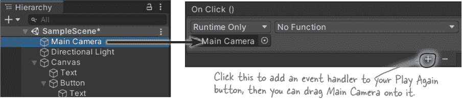

现在按钮知道要使用哪个游戏对象作为事件处理程序。点击下拉菜单，选择**GameController >> StartGame**。现在当玩家按下按钮时，它将调用附加到主摄像机的 GameController 对象上的 StartGame 方法。

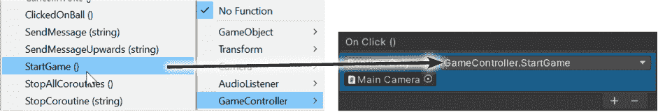

# 使“再玩一次”按钮和得分文本起作用

你游戏的 UI 将会像这样工作：

+   游戏从游戏结束模式开始。

+   点击“再玩一次”按钮开始游戏。

+   屏幕右上角的文本显示当前得分。

你将在代码中使用 Text 和 Button 类。它们位于 UnityEngine.UI 命名空间中，所以**在 GameController 类的顶部添加这个** `**using 语句**`：

```cs
using UnityEngine.UI;
```

现在你可以在你的 GameController 中添加 Text 和 Button 字段（就在 OneBallPrefab 字段的上方）：

```cs
    public Text ScoreText;
    public Button PlayAgainButton;
```

在层次视图中**点击主摄像机**。**将文本游戏对象**从层次结构中拖出，并***放置到***脚本组件的得分文本字段上，**然后将按钮游戏对象** *放置到*“再玩一次”按钮字段上。

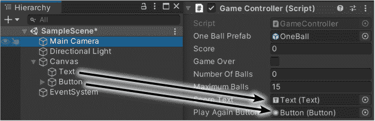

回到你的 GameController 代码，并**将 GameController 字段的默认值设置为 true**：

```cs
    public bool GameOver = true;
```

###### 注意

将这个从 false 修改为 true。

现在回到 Unity，并检查检视器中的脚本组件。

***等等，出了点问题！***


Unity 编辑器仍然显示未选中游戏结束复选框，它没有改变字段值。确保勾选复选框，这样你的游戏将从游戏结束模式开始：


现在游戏将以游戏结束模式开始，玩家可以点击“再玩一次”按钮开始游戏。

# 完成游戏的代码

主摄像机附加的 GameController 对象在其 Score 字段中跟踪得分。**在 GameController 类中添加一个 Update 方法**来更新 UI 中的得分文本：

```cs
    void Update()
    {
        ScoreText.text = Score.ToString();
    }
```

接下来，**修改你的 GameController.AddABall 方法**以在游戏结束时启用“再玩一次”按钮：

```cs
    if (NumberOfBalls >= MaximumBalls)
    {
        GameOver = true;
        PlayAgainButton.gameObject.SetActive(true);
    }
```

###### 注意

**每个游戏对象都有一个叫做 gameObject 的属性，让你可以操作它。你将使用它的 SetActive 方法来使“再玩一次”按钮可见或不可见。**

还有最后一件事要做：让你的 StartGame 方法起作用，以便启动游戏。它需要做几件事情：销毁当前场景中正在飞行的任何球，禁用“再玩一次”按钮，重置得分和球的数量，并设置模式为“运行”。你已经知道如何做大部分的事情了！你只需要找到球以便销毁它们。**点击项目窗口中的 OneBall 预制体并设置它的标签**：

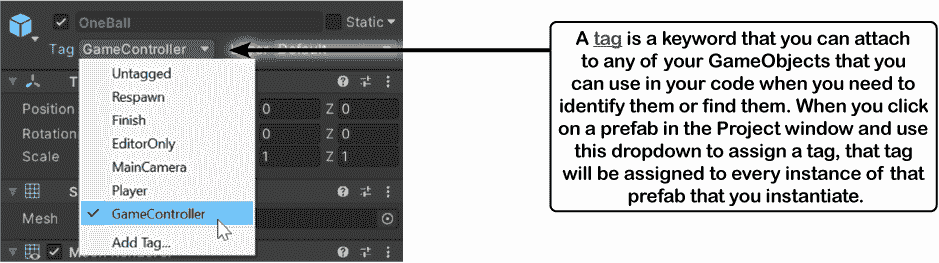

现在你已经准备好填写你的 StartGame 方法了。它使用 foreach 循环来查找和销毁上一场游戏中剩余的任何球，隐藏按钮，重置得分和球的数量，并改变游戏模式：

```cs
     public void StartGame()
     {
        foreach (GameObject ball in GameObject.FindGameObjectsWithTag("GameController"))
        {
            Destroy(ball);
        }
        PlayAgainButton.gameObject.SetActive(false);
        Score = 0;
        NumberOfBalls = 0;
        GameOver = false;
     }
```

现在运行你的游戏。它从“游戏结束”模式开始。按下按钮开始游戏。每次点击球时，分数都会增加。当第 15 个球被实例化时，游戏结束，再次出现“再玩一次”按钮。

###### 注意

**你注意到了吗，*你并没有对 GameController 类做任何更改吗？*那是因为你没有改变 GameController 管理 UI 或游戏模式等功能。如果你可以通过修改一个类而不触及其他类来进行修改，那可能是你设计类的良好标志。**

# 发挥创造力！

你能找到改善游戏并练习编写代码的方法吗？以下是一些建议：

+   游戏太简单了吗？太难了吗？尝试更改你在 GameController.Start 方法中传递给 InvokeRepeating 的参数。尝试将它们作为字段。还可以玩弄 MaximumBalls 值。这些值的小改变可能会对游戏玩法产生很大影响。

+   我们为所有台球提供了纹理映射。尝试添加具有不同行为的不同球。使用比例尺使一些球变大或变小，并更改它们的参数以使它们移动得更快或更慢，或者移动方式不同。

+   你能想出如何制作一个“流星”球，它在一个方向上飞行得很快，如果玩家点击它的话，价值很高吗？怎么样制作一个“突然死亡”8 号球，它会立即结束游戏？

+   修改你的 GameController.ClickedOnBall 方法，使其接受一个分数参数，而不是增加分数字段并添加传递的值。尝试为不同的球赋予不同的值。

***如果你修改了 OneBallBehaviour 脚本中的字段，请不要忘记重置 OneBall 预制件的脚本组件！否则，它会记住旧值。***

> **你练习编写 C#代码的次数越多，就会越容易。发挥创造力来制作你的游戏是一个很好的练习机会！**
