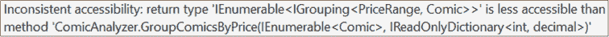
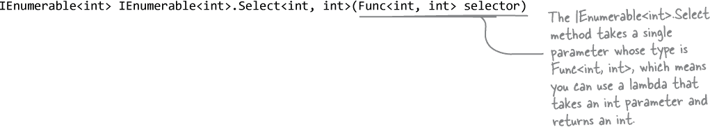

# 第十四章：LINQ 和 lambda：*掌控你的数据*


**这是一个数据驱动的世界……我们都需要知道如何在其中生存。**

已经过去了你可以无需处理大量数据就能编程数天、甚至数周的时代。今天，***一切都与数据有关***，而这正是**LINQ**发挥作用的地方。LINQ 是 C#和.NET 的特性，不仅让你以直观的方式**查询**.NET 集合中的数据，还能让你**分组数据**并**合并来自不同数据源的数据**。你将添加**单元测试**以确保你的代码按照你想要的方式工作。一旦你掌握了将数据整理成可管理的块的窍门，你可以使用**lambda 表达式**重构你的 C#代码，使其更具表现力。

# Jimmy 是“超级队长”卡通迷中的铁杆粉丝…

认识一下 Jimmy，他是“超级队长”漫画、图像小说和周边的热情收藏家之一。他知道所有关于队长的冷知识，他拥有所有电影的道具，他还有一个只能用“惊人”来形容的漫画收藏。


# …但他的收藏物到处都是

Jimmy 可能充满热情，但他并不是一个特别有条理的人。他试图追踪他收藏的最珍贵的“皇冠明珠”漫画，但他需要帮助。你能帮 Jimmy 建立一个管理他漫画的应用程序吗？


# 使用 LINQ 查询你的集合

在这一章中，你将学习**LINQ**（或称**语言集成查询**）。LINQ 将非常有用的类和方法与直接内置在 C#中的强大功能结合起来，所有这些都是为了帮助你处理数据序列，就像 Jimmy 的漫画书收藏一样。

让我们使用 Visual Studio 开始探索 LINQ。创建一个新的控制台应用程序（.NET Core）项目，并将其命名为***LinqTest***。添加这段代码，当你到达最后一行时，请**加上一个句号**并查看智能感知窗口：


让我们使用一些新方法来完成你的控制台应用程序：

```cs
            IEnumerable<int> firstAndLastFive = numbers.Take(5).Concat(numbers.TakeLast(5));
            foreach (int i in firstAndLastFive)
            {
                Console.Write($"{i} ");
            }
        }
    }
}
```

现在运行你的应用程序。它会在控制台打印出这一行文本：

```cs
1 2 3 4 5 95 96 97 98 99
```

那么你刚刚做了什么？

> **LINQ（或语言集成查询）是 C#特性和.NET 类的结合，帮助你处理数据序列。**

# LINQ 可以与任何 IEnumerable<T>一起工作

当你在代码中添加了`using System.Linq;`指令后，你的 List<int>突然“超级强大”起来——一堆 LINQ 方法立即出现在它上面。你可以对***任何*** ***实现 IEnumerable<T>的类***做同样的事情。

当一个类实现 IEnumerable<T>时，该类的任何实例都是一个**序列**：

+   从 1 到 99 的数字列表就是一个序列。

+   当你调用其 Take 方法时，它返回一个包含前五个元素的序列的引用。

+   当你调用其 TakeLast 方法时，它返回另一个包含五个元素的序列。

+   当你使用 Concat 将两个包含五个元素的序列合并时，它创建了一个新的包含 10 个元素的序列，并返回对该新序列的引用。

> **任何实现 IEnumerable 接口的对象都是一个你可以在 LINQ 中使用的序列。在该序列上执行操作按顺序称为枚举该序列。**

## LINQ 方法枚举你的序列

你已经知道`foreach`循环可以处理 IEnumerable 对象。想想`foreach`循环的工作原理：


当方法按顺序遍历序列中的每个项时，这被称为**枚举**序列。这也是 LINQ 方法的工作方式。

###### 注意

**实现 IEnumerable 接口的对象可以被枚举。这就是实现 IEnumerable 接口的对象所做的工作。**

###### 注意

**如果你想找到 Jimmy 收藏中从第 118 期开始的前 30 期问题，你会怎么做？LINQ 提供了一个非常有用的方法来帮助你。静态的 Enumerable.Range 方法生成一个整数序列。调用 Enumerable.Range(8, 5)会返回一个以 8 开头的 5 个数字序列：8, 9, 10, 11, 12。**


###### 注意

**在本练习中的 LINQ 方法具有能够清楚表明其功能的名称。一些 LINQ 方法，如 Sum、Min、Max、Count、First 和 Last，返回单个值。Sum 方法将序列中的值相加。Average 方法返回它们的平均值。Min 和 Max 方法返回序列中的最小值和最大值。First 和 Last 方法则按其字面意义执行操作。**

**其他 LINQ 方法，如 Take、TakeLast、Concat、Reverse（反转序列的顺序）和 Skip（跳过序列中的前几个元素），返回另一个序列。**

# LINQ 的查询语法

到目前为止你看到的 LINQ 方法可能不足以单独回答关于数据的问题，或者说 Jimmy 关于他的漫画收藏的问题。

这就是**LINQ 声明式查询语法**的用武之地。它使用特殊关键字，包括`where`、`select`、`groupby`和`join`，直接在你的代码中构建**查询**。

## LINQ 查询由各种子句构建而成

让我们构建一个查询，找出 int 数组中小于 37 的数字，并按升序排列这些数字。它使用四个**子句**告诉它要查询哪个对象，如何确定选择哪些成员，如何对结果进行排序，以及如何返回结果。

###### 注意

**LINQ 查询适用于序列或实现 IEnumerable<T>的对象。LINQ 查询以 from 子句开始：**

```cs
from (variable) in (sequence)
```

**它告诉查询执行对哪个序列，并为正在查询的每个元素分配一个名称。这就像`foreach`循环的第一行：它声明了一个变量，在遍历分配给该序列中每个元素时使用。因此：**

```cs
from v in values
```

**按顺序遍历`values`数组中的每个元素，将数组中的第一个值赋给 v，然后第二个，第三个，依此类推。**


**LINQ 不仅适用于数字，它也适用于对象。**

当吉米看着堆积如山的杂乱漫画时，他可能看到的是纸张、墨水和一团糟。而我们开发者看到的是另一番景象：**大量的数据**只等待整理。我们如何在 C# 中组织漫画数据？和我们组织纸牌、蜜蜂或者 Sloppy Joe 菜单上的物品一样：我们创建一个类，然后使用集合来管理这个类。因此，帮助吉米的所有我们需要的就是一个 Comic 类，以及一些代码来帮助我们给他的收藏带来一些理性。LINQ 将帮助我们！

# LINQ 适用于对象

吉米想知道他一些珍藏漫画的价值，所以他雇了一位专业的漫画评估师为他每一本漫画评估价格。结果表明，他的一些漫画价值不菲！让我们使用集合来为他管理这些数据。

***就这样！***

1.  **创建一个新的控制台应用程序并添加一个 Comic 类。**

    使用两个自动属性来表示名称和期号：

    

1.  **添加一个包含吉米目录的 List。**

    为 Comic 类添加这个静态 Catalog 字段。它返回一个序列，其中包含吉米珍藏的漫画：

    

1.  **使用一个 Dictionary 来管理价格。**

    添加一个静态的 Comic.Prices 字段——它是一个 Dictionary<int, decimal>，让你可以通过漫画的期号查找每本漫画的价格（使用你在 #enums_and_collections_organizing_your_da 学到的字典的集合初始化语法）。请注意，我们使用了 **IReadOnlyDictionary 接口** 进行封装——它是一个仅包含读取值方法的接口（这样我们就不会意外更改价格）：

    

    ###### 注意

    **我们使用 Dictionary 来存储漫画的价格。我们本可以在 Comic 类中包括一个名为 Price 的属性。但我们决定将漫画和价格信息分开。这是因为收藏品的价格随时会变动，但名称和期号将始终不变。你认为我们做出了正确的选择吗？**

# 使用 LINQ 查询来完成吉米的应用程序

我们之前使用了 LINQ 声明查询语法来创建一个查询，其中包括四个子句：一个 `from` 子句创建一个范围变量，一个 `where` 子句只包括小于 37 的数字，一个 `orderby` 子句按降序对它们进行排序，以及一个 `select` 子句确定包含在结果序列中的元素。

让我们在 Main 方法中**添加一个 LINQ 查询**，它的工作方式完全相同——只是使用 Comic 对象而不是 int 值，因此它将按价格> 500 的顺序逆序打印漫画列表到控制台上。我们将从两个 `using` 声明开始，这样我们就可以使用 IEnumerable<T> 和 LINQ 方法。查询将返回一个 IEnumerable<Comic>，然后使用 `foreach` 循环来迭代它并输出结果。

1.  **修改 Main 方法以使用 LINQ 查询。**

    这是整个 Program 类的代码，包括你需要添加到顶部的 `using` 指令：

    

    **输出：**

    ```cs
    Hippie Madness (misprinted) is worth $13,525.00
    Johnny America vs. the Pinko is worth $3,600.00
    Woman's Work is worth $650.00
    ```

1.  **使用 `descending` 关键字可以使你的 orderby 子句更易读。**

    你的 `orderby` 子句使用减号来对漫画价格进行排序前的取反，导致查询按降序排序。但是在阅读代码并尝试理解其工作原理时，很容易无意中忽略这个减号。幸运的是，有另一种方法可以获得相同的结果。删除减号并在子句末尾**添加 `descending` 关键字**：

    

# 使用 `var` 关键字可以让 C# 自动推断变量类型。

我们刚刚看到，当我们对 `select` 子句进行了小改动时，查询返回的序列类型也发生了变化。当它是 `select comic;` 时，返回类型是 IEnumerable<Comic>。当我们将其改为 `select $"{comic} is worth {Comic.Prices[comic.Issue]:c}";` 时，返回类型变为了 IEnumerable<string>。在使用 LINQ 时，这种情况经常发生——你会不断地微调你的查询。很多时候并不明确它们确切的返回类型。有时候回过头去更新所有的声明会变得很烦人。

幸运的是，C# 给了我们一个非常有用的工具，帮助保持变量声明简单和易读。你可以用 `var` **关键字** 替换任何变量声明。所以你可以用 `var` 替换下列任何声明：

```cs
IEnumerable<int> numbers = Enumerable.Range(1, 10);
string s = $"The count is {numbers.Count()}";
IEnumerable<Comic> comics = new List<Comic>();
IReadOnlyDictionary<int, decimal> prices = Comic.Prices;
```

###### 注意

当你使用 var 关键字时，你告诉 C# 使用隐式类型的变量。我们在 #enums_and_collections_organizing_your_da 中也看到过同样的词——implicit——当我们讨论协变时。它意味着 C# 能够自行推断类型。

使用这些声明，它们确实做了完全相同的事情：

```cs
var numbers = Enumerable.Range(1, 10);
var s = $"The count is {numbers.Count()}";
var comics = new List<Comic>();
var prices = Comic.Prices;
```

而且你无需改动任何代码。只需用 `var` 替换类型，一切都能正常工作。

## 使用 `var` 时，C# 会自动推断变量的类型。

继续吧，现在就试一试。注释掉你刚写的 LINQ 查询的第一行，然后用 `var` 替换 IEnumerable<Comic>：


IDE 推断出了 mostExpensive 变量的类型——它是一种我们以前没见过的类型。还记得在 #interfacescomma_castingcomma_and_quotati 里我们讨论过接口如何扩展其他接口吗？IOrderedEnumerable 接口是 LINQ 的一部分——它用于表示*排序*序列——并且它扩展了 IEnumerable<T> 接口。试着将 `orderby` 子句注释掉并将鼠标悬停在 mostExpensive 变量上——你会发现它变成了 IEnumerable<Comic>。这是因为 C# 查看代码以***推断用 var 声明的任何变量的类型***。


**你真的可以在变量声明中使用 var。**

而且，确实如此简单。很多 C# 开发者几乎总是使用`var`声明局部变量，并且仅在使代码更易读时包含类型。只要你在同一语句中声明并初始化变量，就可以使用`var`。

但是在使用`var`时有一些重要的限制。例如：

+   你只能使用`var`一次声明一个变量。

+   你不能在声明中使用正在声明的变量。

+   你不能将其声明为`null`。

如果你创建一个名为`var`的变量，你将无法再将其用作关键字：

+   你绝对不能使用`var`来声明字段或属性——你只能在方法内部使用它作为局部变量。

+   如果你坚持这些基本规则，你几乎可以在任何地方使用`var`。

**所以当你在#types_and_references_getting_the_referen 中这样做时：**

```cs
int hours = 24;
short RPM = 33;
long radius = 3;
char initial = 'S';
int balance = 345667 - 567;
```

**或者在#inheritance_your_objectapostrophes_famil 中这样做：**

```cs
SwordDamage swordDamage = new SwordDamage(RollDice(3));
ArrowDamage arrowDamage = new ArrowDamage(RollDice(1));
```

**或者在#enums_and_collections_organizing_your_da 中的这种情况：**

```cs
List<Card> cards = new List<Card>();
```

**你本可以这样做：**

```cs
var hours = 24;
var RPM = 33;
var radius = 3;
var initial = 'S';
var balance = 345667 - 567;
```

**或者这样做：**

```cs
var swordDamage = new SwordDamage(RollDice(3));
var arrowDamage = new ArrowDamage(RollDice(1));
```

**或者这样做：**

```cs
var cards = new List<Card>();
```

**......而且你的代码将完全相同。**

**但是你不能使用`var`声明字段或属性：**

```cs
class Program
{
   static var random = new Random(); // this will cause a compiler error

   static void Main(string[] args)
   {
```

# LINQ 是多才多艺的。

使用 LINQ，你不仅可以从集合中提取一些项目，还可以在返回它们之前修改这些项目。一旦生成了一组结果序列，LINQ 提供了一堆方法来处理它们。从顶到底，LINQ 提供了你管理数据所需的工具。让我们快速回顾一下我们已经看到的一些 LINQ 特性。

+   **修改从查询返回的每个项目。**

    此代码将一个字符串添加到字符串数组的每个元素末尾。它不会改变数组本身，而是创建一个新的修改后字符串序列。

    

+   **对序列执行计算。**

    你可以单独使用 LINQ 方法来获取关于数字序列的统计信息。

    ###### 注意

    **静态的 String.Join 方法将一个序列中所有项目连接为一个字符串，指定用于它们之间的分隔符。**

    ```cs
    var random = new Random();
    var numbers = new List<int>();
    int length = random.Next(50, 150);
    for (int i = 0; i < length; i++)
        numbers.Add(random.Next(100));

    Console.WriteLine($@"Stats for these {numbers.Count()} numbers:
    The first 5 numbers: {String.Join(", ", numbers.Take(5))}
    The last 5 numbers: {String.Join(", ", numbers.TakeLast(5))}
    The first is {numbers.First()} and the last is {numbers.Last()}
    The smallest is {numbers.Min()}, and the biggest is {numbers.Max()}
    The sum is {numbers.Sum()}
    The average is {numbers.Average():F2}");
    ```

    

# LINQ 查询在访问其结果之前不会运行。

当你在代码中包含 LINQ 查询时，它使用**延迟评估**（有时称为惰性评估）。这意味着直到你的代码执行一个使用查询结果的语句之前，LINQ 查询实际上不会进行枚举或循环。这听起来有点奇怪，但当你看到它实际运行时就会更有意义。**创建一个新的控制台应用程序**，并添加以下代码：

***就这样！***


###### 注意

**你是否收到了奇怪的编译器错误？确保将两个 using 指令添加到你的代码中！**

```cs
    class PrintWhenGetting
    {
        private int instanceNumber;
        public int InstanceNumber
        {
            set { instanceNumber = value; }
            get
            {
                Console.WriteLine($"Getting #{instanceNumber}");
                return instanceNumber;
            }
        }
    }

    class Program
    {
        static void Main(string[] args)
        {
            var listOfObjects = new List<PrintWhenGetting>();
            for (int i = 1; i < 5; i++)
                listOfObjects.Add(new PrintWhenGetting() { InstanceNumber = i });

            Console.WriteLine("Set up the query");
            var result =
                from o in listOfObjects
                select o.InstanceNumber;

            Console.WriteLine("Run the foreach");
            foreach (var number in result)
                Console.WriteLine($"Writing #{number}");
        }
    }
```

现在运行你的应用程序。注意打印 `"Set up the query"` 的 Console.WriteLine 在 get 访问器执行之前***之前***运行。这是因为直到 foreach 循环才会执行 LINQ 查询。


如果你需要立即执行查询，可以通过调用需要枚举整个列表的 LINQ 方法来**立即执行**，例如 ToList 方法，将其转换为 List<T>。添加此行，并更改 foreach 以使用新的列表：

```cs
        var immediate = result.ToList();

 Console.WriteLine("Run the foreach");
 foreach (var number in **immediate)**
 Console.WriteLine($"Writing #{number}");
```

再次运行应用程序。这次你会看到在开始执行 foreach 循环之前调用了 get 访问器——这是有道理的，因为 ToList 需要访问序列中的每个元素才能将其转换为 List。像 Sum、Min 和 Max 这样的方法也需要访问序列中的每个元素，因此当你使用它们时，也会强制 LINQ 立即执行。

# 使用 group 查询将你的序列分成组

有时你确实希望对数据进行切分和切块。例如，Jimmy 可能希望按照漫画出版的年代对其进行分组。或者他可能想按价格（便宜的放在一个集合中，昂贵的放在另一个集合中）分开它们。有很多理由你可能想要将数据分组在一起。这就是 **LINQ group 查询** 很有用的地方。

***分组数据！***


1.  **创建一个新的控制台应用程序并添加卡片类和枚举。**

    创建一个**名为 *CardLinq* 的新 .NET Core 控制台应用程序**。然后转到解决方案资源管理器面板，在项目名称上右键单击，选择添加 >> 现有项（或在 Mac 上选择添加 >> 现有文件）。导航到你保存的来自#enums_and_collections_organizing_your_da 的“Two Decks”项目所在的文件夹。添加带有**Suit 和 Value 枚举**的文件，然后添加**Deck、Card 和 CardComparerByValue 类**。

    ###### 注意

    **你在可下载的“Two Decks”项目的末尾创建了 Deck 类，在#enums_and_collections_organizing_your_da 中。**

    确保**修改每个文件中的命名空间**以匹配 *Program.cs* 中的命名空间，以便你的 Main 方法可以访问你添加的类。

1.  **使用 IComparable<T> 使你的 Card 类可排序。**

    我们将使用 LINQ 的 `orderby` 子句对组进行排序，因此我们需要使 Card 类可排序。幸运的是，这与 List.Sort 方法完全相同，你在#interfacescomma_castingcomma_and_quotati 中学到过。修改你的 Card 类以**扩展 IComparable 接口**：

    

1.  **修改 Deck.Shuffle 方法以支持方法链。**

    Shuffle 类用于洗牌。要使其支持方法链，只需修改以返回刚刚被洗牌的 Deck 实例的引用：

    

1.  **使用带有 group...by 子句的 LINQ 查询，按花色分组卡片。**

    主方法将通过洗牌整副牌随机取出 16 张牌，然后使用 LINQ 的 Take 方法取出前 16 张牌。然后它将使用带有`group...by` **子句**的 LINQ 查询将整副牌分成较小的序列，每个序列对应 16 张牌中的一种花色：

    

###### 注意

**group...by 子句创建实现 IGrouping 接口的一系列组。IGrouping 扩展 IEnumerable 并且仅添加一个成员：一个名为 Key 的属性。因此，每个组都是其他序列的序列——在这种情况下，它是卡片序列的一个组，其中键是卡片的花色（来自`Suits`枚举）。每个组的完整类型是 IGrouping<Suits, Card>，这意味着它是卡片序列的序列，每个序列都以其花色作为键。**

# 使用 join 查询合并来自两个序列的数据

每位好的收藏家都知道，关键评价对价值有很大影响。Jimmy 一直在跟踪两个大型漫评聚合网站，MuddyCritic 和 Rotten Tornadoes 的评审分数。现在他需要将它们与他的收藏匹配起来。他将如何做呢？

LINQ 来拯救！它的`join`关键字允许你使用单个查询**结合来自两个序列的数据**。它通过比较一个序列中的项与第二个序列中它们匹配的项来实现。 （LINQ 足够聪明，能够高效地执行此操作——除非必须比较每对项。）最终结果将组合每个匹配的一对项。

1.  查询将从通常的`from`子句开始。但是在接下来不是添加用于确定结果的条件，而是添加：

    ```cs
    join name in collection
    ```

    `join`子句告诉 LINQ 枚举两个序列以匹配每对成员。它在每次迭代中将`name`分配给从已连接集合中拉出的成员。你将在`where`子句中使用该名称。

    

1.  接下来你会加上`**on**`子句，告诉 LINQ 如何将这两个集合匹配在一起。接着是第一个集合中你要匹配的成员的名称，后面是`**equals**`和第二个集合中要匹配的成员的名称。

1.  你将像往常一样继续 LINQ 查询，使用`**where**`和`**orderby**`子句。你可以用正常的`**select**`子句完成它，但通常希望返回的结果从一个集合中提取一些数据，从另一个集合中提取其他数据。

结果是一系列对象，这些对象具有 Comic 的 Name 和 Issue 属性，但具有 Review 的 Critic 和 Score 属性。结果不能是 Comic 对象的序列，但也不能是 Review 对象的序列，因为两个类都没有所有这些属性。结果是一种不同类型：***匿名类型***。

# 使用 new 关键字创建匿名类型

从#objectshellipget_orientedexclamation_mar 开始，你一直在使用`new`关键字创建对象的实例。每次使用时，你都包含一个类型（因此语句`new Guy();`创建类型为 Guy 的实例）。你还可以使用`new`关键字而不带类型来创建一个**匿名类型**。这是一个完全有效的类型，具有只读属性，但没有名称。我们从将 Jimmy 的漫画与评论连接的查询中返回的类型就是匿名类型。你可以通过使用对象初始化程序为匿名类型添加属性。下面是其示例：

```cs
public class Program
{
    public static void Main()
    {
        var whatAmI = new { Color = "Blue", Flavor = "Tasty", Height = 37 };
        Console.WriteLine(whatAmI);
    }
}
```

尝试将其粘贴到新的控制台应用程序中并运行它。你将看到以下输出：

```cs
{ Color = Blue, Flavor = Tasty, Height = 37 }
```

现在将鼠标悬停在 IDE 中的`whatAmI`上，并查看 IntelliSense 窗口：


###### 注意

**我们刚刚看到的将 Jimmy 的漫画与评论连接起来的 LINQ 查询返回了一个匿名类型。稍后的章节中，你将把该查询添加到应用程序中。**

`whatAmI`变量是引用类型，就像任何其他引用一样。它指向堆上的一个对象，你可以使用它来访问该对象的成员——在本例中是其两个属性：

```cs
Console.WriteLine($"My color is {whatAmI.Color} and I’m {whatAmI.Flavor}");
```

除了它们没有名称外，匿名类型和任何其他类型都一样。


**没错！你使用`var`来声明匿名类型。**

实际上，这是`var`关键字的最重要用途之一。


# 单元测试帮助确保你的代码正常工作

我们在给你的代码中故意留了一个 bug……但这是应用程序中*唯一*的 bug 吗？编写代码时很容易出现不符合预期的情况。幸运的是，我们有一种方法可以找到 bug 并加以修复。**单元测试**是*自动化*测试，可以帮助确保代码按预期工作。每个单元测试是一个方法，用于确保代码的特定部分（即被测试的“单元”）是否正常工作。如果方法运行时未抛出异常，则测试通过；如果抛出异常，则测试失败。大多数大型程序都有一套涵盖大部分或全部代码的**测试套件**。

Visual Studio 内置了单元测试工具，帮助你编写测试并跟踪测试通过或失败的情况。本书中的单元测试将使用**MSTest**，这是由 Microsoft 开发的单元测试框架（意味着它是一组类，为你提供编写单元测试的工具）。

###### 注意

Visual Studio 还支持在 NUnit 和 xUnit 两种流行的开源单元测试框架中编写单元测试，这两种框架均适用于 C#和.NET 代码。

## Visual Studio for Windows 有一个测试资源管理器窗口

通过选择***View >> Test Explorer***从主菜单栏打开测试资源管理器窗口。左侧显示单元测试，右侧显示最近运行的结果。工具栏有按钮用于运行所有测试、运行单个测试和重复上次运行。


###### 注意

**当您向解决方案添加单元测试时，您可以通过点击“运行所有测试”按钮**`运行`**您的测试。您可以通过选择“测试 >> 调试所有测试”在 Windows 上调试您的单元测试，并在 Mac 上通过在单元测试工具窗口中点击“调试所有测试”来调试。**


## Visual Studio for Mac 拥有单元测试工具窗口。

通过选择 ***视图 >> 工具窗口 >> 单元测试*** 打开单元测试面板。它有运行或调试您的测试的按钮。运行单元测试时，IDE 会在测试结果工具窗口中显示结果（通常在 IDE 窗口底部）。


###### 注意

回到 #objectshellipget_orientedexclamation_mar 您了解到原型，或者可以玩、测试、学习和改进的游戏的早期版本，以及这个想法如何适用于任何类型的项目，而不仅仅是游戏。测试软件的概念有时可能显得有点抽象。考虑游戏开发人员如何测试他们的游戏可以帮助我们习惯这个想法，并使测试的概念更加直观。

###### 注意

大多数开发团队尝试在每次提交之前自动化尽可能多的测试。这样，他们就知道在修复错误或添加新功能时是否无意中引入了 bug。

# 在 Jimmy 的漫画收藏应用程序中添加一个单元测试项目。

1.  **添加一个新的 MSTest (.NET Core) 项目。**

    在解决方案资源管理器中右键单击解决方案名称，然后选择 **添加 >> 新项目...** 从菜单栏。确保选择 **MSTest 测试项目 (.NET Core)**：在 Windows 上使用“搜索模板”框搜索 MSTest；在 macOS 下选择“Web 和控制台”下的“测试”以查看项目模板。将项目命名为 *JimmyLinqUnitTests*。

1.  **在现有项目上添加依赖项。**

    您将为 ComicAnalyzer 类编写单元测试。当您在同一解决方案中有两个不同的项目时，它们是 *独立的*——默认情况下，一个项目中的类不能使用另一个项目中的类——因此，您需要设置依赖关系以让您的单元测试使用 ComicAnalyzer。

    展开解决方案资源管理器中的 JimmyLinqUnitTests 项目，然后右键单击依赖项并选择 **添加引用...** 从菜单中选择检查您为练习创建的 JimmyLinq 项目。

    

1.  **使您的 ComicAnalyzer 类公开。**

    当 Visual Studio 添加单元测试项目时，它会创建一个名为 UnitTest1 的类。编辑 *UnitTest1.cs* 文件，并尝试在命名空间内添加 `using JimmyLinq;` 指令：

    

    哦，有些问题——IDE 不允许你添加该指令。原因是 JimmyLinq 项目没有公共类、枚举或其他成员。尝试修改 `Critics` 枚举以使其公开 (`**public enum Critics**`)，然后返回并尝试添加 `using` 指令。现在你可以添加它了！IDE 看到 JimmyLinq 命名空间有公共成员，并将其添加到弹出窗口中。

    现在将 ComicAnalyzer 声明更改为公共：`**public static class ComicAnalyzer**`

    ***哎呀，出错了。*** 你收到了一堆“不一致的可访问性”编译器错误吗？

    

    问题在于 ComicAnalyzer 是公共的，但它公开了没有访问修饰符的成员，这使得它们 `**internal**` ——因此，解决方案中的其他项目无法看到它们。 **在 JimmyLinq 项目中的每个类和枚举上添加 `public` 访问修饰符**。现在你的解决方案将再次构建成功。

# 编写你的第一个单元测试

IDE 向你的新 MSTest 项目中添加了一个名为 UnitTest1 的类。将该类（以及文件）重命名为 ComicAnalyzerTests。该类包含一个名为 TestMethod1 的测试方法。接下来，给它起一个非常描述性的名称：将方法重命名为 ComicAnalyzer_Should_Group_Comics。这是你的单元测试类的代码：


###### 注意

**当你在 IDE 中运行单元测试时，它会查找任何带有 `[TestClass]` 的类。这称为属性。测试类包含测试方法，必须使用 `[TestMethod]` 属性进行标记。**

**MSTest 单元测试使用 Assert 类，该类具有你可以用来检查代码行为的静态方法。此单元测试使用 Assert.AreEqual 方法。它接受两个参数，预期结果（你认为代码应该做什么）和实际结果（它实际上做了什么），如果它们不相等则抛出异常。**

**此测试设置了一些非常有限的测试数据：三部漫画的序列和一个包含三个价格的字典。然后调用 GroupComicsByPrice，并使用 Assert.AreEqual 来验证结果是否与我们预期的一致。**

通过选择 **测试 >> 运行所有测试**（Windows）或 **运行 >> 运行单元测试**（Mac）来运行你的测试。IDE 将弹出一个测试资源管理器窗口（Windows）或测试结果面板（Mac），显示测试结果：

```cs
Test method JimmyLinqUnitTests.ComicAnalyzerTests.ComicAnalyzer_Should_Group_Comics threw exception:
System.Collections.Generic.KeyNotFoundException: The given key ‘2’ was not present in the dictionary.
```

这是一个 **失败的单元测试** 结果。在 Windows 中，查找  图标或在 Visual Studio for Mac 窗口底部查看  消息，这是你查看失败单元测试计数的方法。

***你期待该单元测试失败吗？你能弄清楚测试出了什么问题吗？***

# 为 GetReviews 方法编写一个单元测试

GroupComicsByPrice 方法的单元测试使用了 MSTest 的静态 Assert.AreEqual 方法来检查预期值与实际值。GetReviews 方法*返回一个字符串序列*，而不是单个值。我们*可以*使用 Assert.AreEqual 来比较该序列中的单个元素，就像我们在最后两个断言中所做的那样，使用 LINQ 方法如 First 来获取特定元素……但那会需要大量的代码。

幸运的是，MSTest 有一种更好的比较集合的方法：**CollectionAssert 类**有用于比较预期结果与实际集合结果的静态方法。因此，如果你有一个包含预期结果的集合和一个包含实际结果的集合，你可以像这样进行比较：

```cs
   CollectionAssert.AreEqual(expectedResults, actualResults);
```

如果预期结果和实际结果不匹配，测试将失败。继续**添加这个测试**以验证 ComicAnalyzer.GetReviews 方法：

```cs
[TestMethod]
public void ComicAnalyzer_Should_Generate_A_List_Of_Reviews()
{
    var testReviews = new[]
    {
        new Review() { Issue = 1, Critic = Critics.MuddyCritic, Score = 14.5},
        new Review() { Issue = 1, Critic = Critics.RottenTornadoes, Score = 59.93},
        new Review() { Issue = 2, Critic = Critics.MuddyCritic, Score = 40.3},
        new Review() { Issue = 2, Critic = Critics.RottenTornadoes, Score = 95.11},
    };

    var expectedResults = new[]
    {
        "MuddyCritic rated #1 ‘Issue 1’ 14.50",
        "RottenTornadoes rated #1 ‘Issue 1’ 59.93",
        "MuddyCritic rated #2 ‘Issue 2’ 40.30",
        "RottenTornadoes rated #2 ‘Issue 2’ 95.11",
    };

    var actualResults = ComicAnalyzer.GetReviews(testComics, testReviews).ToList();
    CollectionAssert.AreEqual(expectedResults, actualResults);
}
```

现在重新运行你的测试。你应该会看到两个单元测试通过。

# 编写单元测试以处理边界情况和奇怪的数据

在现实世界中，数据通常是混乱的。例如，我们从未准确告诉你评论数据应该是什么样子的。你见过评论分数在 0 到 100 之间。你以为这些是唯一允许的值吗？在现实世界中，确实有一些评论网站是这样操作的。如果我们得到一些奇怪的评论分数——比如负数、非常大的数或者零怎么办？如果一个评审人为同一个问题给出多个评分怎么办？即使这些事情*本不应该*发生，它们*可能*会发生。

我们希望我们的代码**健壮**，这意味着它能很好地处理问题、失败，特别是坏的输入数据。因此，让我们构建一个单元测试，向 GetReviews 传递一些奇怪的数据，并确保它不会出问题：


###### 注意

总是抽出时间为边界情况和奇怪的数据编写单元测试——把它们看作“必需”而不是“可有”的测试。单元测试的目的是尽可能广泛地捕捉错误，这些类型的测试对此非常有效。

> **添加处理边界情况和奇怪数据的单元测试非常重要。它们可以帮助你发现你代码中否则无法找到的问题。**


**当你编写单元测试时，实际上你的项目会更快。**

我们是认真的！也许你觉得写*更多代码*却花费*更少时间*有些反直觉，但是如果你习惯于编写单元测试，你的项目将会更加顺利，因为你能早期发现并修复 Bug。在本书的前八个半章节中，你已经写了大量代码，这意味着你几乎肯定不得不追踪并修复过代码中的 Bug。当你修复这些 Bug 时，是否需要同时修复项目中的其他代码？当我们发现意外 Bug 时，通常必须停下手头的工作来追踪和修复它，这样来回切换—丢失思路，不得不打断工作流—可能会减慢工作速度。单元测试帮助你早期发现这些 Bug，在它们干扰你工作之前。

***还在疑惑什么时候应该编写单元测试吗？我们在章节末尾包含了一个可下载的项目来帮助解答这个问题。***

# 使用 => 运算符创建 Lambda 表达式

***我们在章节开头留下了你的疑问。*** 还记得我们让你在 Comic 类中添加的神秘行吗？在这里又是一次：

```cs
    public override string ToString() => $"{Name} (Issue #{Issue})";
```

你在整章中一直在使用 ToString 方法—你知道它能工作。如果我们要求你按照迄今为止编写方法的方式来重写该方法，你可能会写出这样的代码：

```cs
    public override string ToString() {
        return $"{Name} (Issue #{Issue})";
    }
```

基本上你是对的。那到底发生了什么？那个 => 运算符到底是什么？

你在 ToString 方法中使用的 => 运算符是**Lambda 运算符**。你可以使用 => 定义**Lambda 表达式**，或者在单个语句中定义的*匿名函数*。Lambda 表达式看起来像这样：

```cs
    (input-parameters) => expression;
```

Lambda 表达式分为两部分：

+   `input-parameters` 部分是一个参数列表，就像你在声明方法时使用的那样。如果只有一个参数，可以省略括号。

+   `expression` 是任何 C# 表达式：可以是插值字符串，使用运算符的语句，方法调用—基本上你放在语句中的任何东西。

Lambda 表达式起初可能看起来有些奇怪，但它们只是使用*同样熟悉的 C# 表达式*的另一种方式，这些表达式你在整本书中都在使用—就像 Comic.ToString 方法一样，无论你是否使用 Lambda 表达式，它都能正常工作。


**是的！你可以使用 Lambda 表达式重构许多方法和属性。**

在本书中，你已经编写了很多仅包含一个语句的方法。你可以将其中大部分重构为使用 Lambda 表达式。在许多情况下，这可以使你的代码更易于阅读和理解。Lambda 给你提供了选择—你可以决定何时使用它们来改进你的代码。

# Lambda 测试驱动


让我们试用一下 Lambda 表达式，这为我们提供了一种全新的编写方法的方式，包括返回值或者带参数的方法。

1.  **创建一个新的控制台应用**。添加这个带有 Main 方法的 Program 类：

    ```cs
    class Program
    {
        static Random random = new Random();
        static double GetRandomDouble(int max)
        {
            return max * random.NextDouble();
        }
        static void PrintValue(double d)
        {
            Console.WriteLine($"The value is {d:0.0000}");
        }
        static void Main(string[] args)
        {
            var value = Program.GetRandomDouble(100);
            Program.PrintValue(value);
        }
    }
    ```

    

    运行几次。每次它都会打印一个不同的随机数，例如：`The value is 37.8709`

1.  使用 => 运算符**重构 GetRandomDouble 和 PrintValue 方法**：

    

    再次运行你的程序——它应该像以前一样打印不同的随机数。

    在我们进行最后一次重构之前，**悬停在随机字段**上并查看 IntelliSense 弹出窗口：

    

1.  **修改随机字段**以使用 lambda 表达式：

    ```cs
     static Random random **=>** new Random();
    ```

    程序仍然以相同的方式运行。现在再次**悬停在随机字段**上：

    

    等一下——random 不再是一个字段了。将它改成 lambda 表达式将它变成了一个属性！这是因为**lambda 表达式总是像方法一样工作**。所以当 random 是一个字段时，它在类构造时被实例化一次。当你把=改成=>并将其转换为 lambda 时，它变成了一个方法——这意味着每次访问属性时都会创建一个新的 Random 实例。

# 使用 lambda 重构小丑

回到 #interfacescomma_castingcomma_and_quotati，你创建了一个名为 IClown 的接口，有两个成员：

***去做吧！***


你修改了这个类来实现该接口：

```cs
class TallGuy {
    public string Name;
    public int Height;

    public void TalkAboutYourself() {
        Console.WriteLine($"My name is {Name} and I’m {Height} inches tall.");
    }
}
```

让我们再做同样的事情——但这次我们将使用 lambda 表达式。**创建一个新的控制台应用程序项目**，并添加 IClown 接口和 TallGuy 类。然后修改 TallGuy 以实现 IClown：

```cs
class TallGuy : IClown {
```

现在打开快速操作菜单，选择**“实现接口。”**IDE 将填写所有接口成员，使它们像使用生成方法时一样抛出 NotImplementedExceptions。


让我们重构这些方法，使它们能够像以前一样完成相同的工作，但现在使用 lambda 表达式：

```cs
    public string FunnyThingIHave => "big red shoes";
    public void Honk() => Console.WriteLine("Honk honk!");
```


现在添加与你在 #interfacescomma_castingcomma_and_quotati 中使用的相同的 Main 方法：

```cs
 TallGuy tallGuy = new TallGuy() { Height = 76, Name = "Jimmy" };
 tallGuy.TalkAboutYourself();
 Console.WriteLine($"The tall guy has {tallGuy.FunnyThingIHave}");
 tallGuy.Honk();
```

运行你的应用程序。TallGuy 类的工作方式与 #interfacescomma_castingcomma_and_quotati 中一样，但现在我们已经重构了它的成员，使用 lambda 表达式使得它更加紧凑。

***我们认为经过改进的 TallGuy 类更容易阅读。你觉得呢？***


> **你可以使用 => 运算符创建一个具有 get 访问器执行 lambda 表达式的属性。**

# 使用 ?: 运算符让你的 lambda 表达式做出选择

如果你希望你的 lambda 做更多的事情怎么办？如果它们能做出决策就好了……这就是**条件运算符**（有些人称之为**三元运算符**）派上用场的地方。它的工作方式如下：

```cs
    condition ? consequent : alternative;
```

刚开始可能看起来有点奇怪，所以让我们看一个示例。首先，?: 运算符并不局限于 lambda 表达式——你可以在任何地方使用它。从 AbilityScoreCalculator 类中的 `if` 语句中取这个 `if` 语句：


注意如何将 Score 设置为 ?: 表达式的结果。?: 表达式**返回一个值**：它检查*条件*（added < Minimum），然后返回*结果*（Minimum）或*替代项*（added）。

当你有一个看起来像 `if/else` 语句的方法时，你可以**使用 ?: 来将其重构为 lambda**。例如，从 PaintballGun 类中的方法获取：


让我们将其重写为更简洁的 lambda 表达式：

注意细微的变化——在 `if/else` 版本中，BallsLoaded 属性是在 then 和 else 语句中设置的。我们改为使用条件运算符来检查 balls 是否符合 MAGAZINE_SIZE 并返回正确的值，并使用该返回值设置 BallsLoaded 属性。

# Lambda 表达式和 LINQ

将此小型 LINQ 查询添加到任何 C# 应用程序中，然后将鼠标悬停在代码中的 `select` 关键字上：


IDE 弹出一个工具提示窗口，就像你悬停在方法上时一样***。让我们更仔细地看一看第一行，显示了方法声明：



我们可以从该方法声明中学到一些东西：

+   IEnumerable<int>.Select 方法返回一个 IEnumerable<int>。

+   它接受一个类型为 Func<int, int> 的单一参数。

## 使用带有 Func 参数的方法的 lambda 表达式

当一个方法接受一个 Func<int, int> 参数时，你可以**使用一个接受 int 参数并返回 int 值的 lambda 表达式来调用它**。因此，你可以像这样重构 select 查询：

```cs
 var array = new[] { 1, 2, 3, 4 };
 var result = array.Select(i => i * 2);
```

前往——尝试在控制台应用程序中自己尝试。添加一个 foreach 语句来打印输出：

```cs
foreach (var i in result) Console.WriteLine(i);
```

当你打印重构后的查询结果时，你会得到序列 { 2, 4, 6, 8 }，与你在重构之前使用 LINQ 查询语法获得的结果完全相同。

# LINQ 查询可以编写为链式 LINQ 方法

从之前的 LINQ 查询中获取这个 LINQ 查询，**将其添加到一个应用程序**中，以便我们可以探索更多的 LINQ 方法：

```cs
       int[] values = new int[] { 0, 12, 44, 36, 92, 54, 13, 8 };
       IEnumerable<int> result =
                  from v in values
                  where v < 37
                  orderby -v
                  select v;
```

## OrderBy LINQ 方法对序列进行排序

悬停在 `**orderby**` 关键字上，并查看其参数：


当你在 LINQ 查询中使用 `orderby` 子句时，它调用一个 LINQ OrderBy 方法对序列进行排序。在这种情况下，我们可以传递一个带有 int 参数的 lambda 表达式**返回排序键**，或者实现了 IComparer 的任何值（必须实现 IComparer），以便它可以用来对结果进行排序。

## Where LINQ 方法从序列中提取一个子集

现在将鼠标悬停在 LINQ 查询中的 `**where**` 关键字上：


`where` 子句在 LINQ 查询中调用一个 LINQ Where 方法，该方法可以使用返回布尔值的 lambda 表达式。***Where 方法针对序列中的每个元素调用该 lambda 表达式***。如果 lambda 表达式返回 true，则将该元素包含在结果中。如果 lambda 表达式返回 false，则将该元素移除。

# 使用 => 运算符创建 switch 表达式

自从#inheritance_your_objectapostrophes_famil 以来，您一直在使用 `switch` 语句来检查变量是否符合多个选项。这是一个非常有用的工具……但您是否注意到了它的局限性？例如，尝试添加一个针对变量的 case：

```cs
   case myVariable:
```

您将收到一个 C# 编译器错误：*需要常量值*。这是因为您只能在您一直在使用的 `switch` 语句中使用常量值，例如文字常量和使用 `const` 关键字定义的变量。

但是，`=>` 运算符改变了一切，它让您可以创建 **switch 表达式**。它们与您一直在使用的 `switch` 语句类似，但它们是*表达式*，会返回一个值。switch 表达式以要检查的值开头，后跟关键字 `switch`，然后是一系列用逗号分隔的*switch arm*，在花括号内。每个 switch arm 使用 => 运算符根据表达式检查值。如果第一个 arm 不匹配，则移动到下一个 arm，返回匹配 arm 的值。


假设您正在开发一个需要根据花色分配特定分数的纸牌游戏，其中黑桃值为 6，红心值为 4，其他牌值为 2。您可以编写如下的 `switch` 语句：


此 `switch` 语句的整个目的是使用 case 来设置 `score` 变量——我们的许多 `switch` 语句都是这样工作的。我们可以使用 => 运算符创建一个执行相同操作的 switch 表达式：


# 探索 Enumerable 类

我们已经使用序列一段时间了。我们知道它们可以与 `foreach` 循环和 LINQ 一起使用。但究竟是什么使序列运行起来？让我们深入探讨一下。我们将从 **Enumerable 类** 开始——具体来说，是它的三个静态方法，Range、Empty 和 Repeat。您已经在本章的早些时候看到了 Enumerable.Range 方法。让我们使用 IDE 发现其他两种方法的工作原理。键入 `**Enumerable**`。，然后将鼠标悬停在 IntelliSense 弹出窗口中的 Range、Empty 和 Repeat 上，以查看它们的声明和注释。


## Enumerable.Empty 创建任何类型的空序列

有时候，您需要向接受 IEnumerable<T> 的方法传递一个空序列（例如，在单元测试中）。在这些情况下，**Enumerable.Empty 方法**非常方便：

```cs
var emptyInts = Enumerable.Empty<int>(); // an empty sequence of ints
var emptyComics = Enumerable.Empty<Comic>(); // an empty sequence of Comic references
```

## Enumerable.Repeat 重复一个值多次

假设你需要一个包含 100 个 `3s`、12 个 “yes” 字符串或者 83 个相同匿名对象的序列。你会惊讶地发现这种情况经常发生！你可以使用 **Enumerable.Repeat 方法**来做到这一点——它返回一个重复值的序列：

```cs
var oneHundredThrees = Enumerable.Repeat(3, 100);
var twelveYesStrings = Enumerable.Repeat("yes", 12);
var eightyThreeObjects = Enumerable.Repeat(
    new { cost = 12.94M, sign = "ONE WAY", isTall = false }, 83);
```

## 那么，究竟什么是 IEnumerable<T>？

我们已经使用 IEnumerable<T> 一段时间了。我们还没有真正回答可枚举序列到底是什么的问题。理解某个东西的一个真正有效的方法是从头开始构建它，所以让我们通过从头开始构建一些序列来完成本章。

# 手动创建一个可枚举序列

假设我们有一些体育运动：

```cs
   enum Sport { Football, Baseball, Basketball, Hockey, Boxing, Rugby, Fencing }
```

显然，我们可以创建一个新的 List<Sport> 并使用集合初始化器来填充它。但是为了探索序列如何工作，我们将手动构建一个。让我们创建一个名为 ManualSportSequence 的新类，并使其实现 IEnumerable<Sport> 接口。它只有两个成员，返回一个 IEnumerator：


好的，那么 IEnumerator 是什么？它是一个接口，允许你枚举一个序列，逐个遍历序列中的每个项目。它有一个属性，Current，返回当前正在枚举的项目。它的 MoveNext 方法移动到序列中的下一个元素，如果序列已经耗尽，则返回 false。在调用 MoveNext 后，Current 返回下一个元素。最后，Reset 方法将序列重置回起始状态。一旦你有了这些方法，你就有了一个可枚举序列。


所以让我们实现一个 IEnumerator<Sport>：


这就是我们创建自己的 IEnumerable 所需的全部内容。继续——试试吧。**创建一个新的控制台应用程序**，添加 ManualSportSequence 和 ManualSportEnumerator，然后在 `foreach` 循环中枚举这个序列：

```cs
    var sports = new ManualSportSequence();
    foreach (var sport in sports)
        Console.WriteLine(sport);
```

# 使用 `yield return` 来创建你自己的序列

C# 提供了一种更容易创建可枚举序列的方法：`**yield return**` 语句。`yield return` 语句是一种全自动枚举器创建器。理解它的一个好方法是看一个例子。让我们使用 **多项目解决方案**，这样你就能更多地练习一下。

**将新的控制台应用程序项目添加到你的解决方案中** —— 这与你之前在章节中添加 MSTest 项目时所做的操作一样，只不过这次不是选择 MSTest 项目类型，而是选择你在书中大多数项目中使用的相同控制台应用程序项目类型。然后，在解决方案下右键单击项目，选择 “Set as startup project.” 当你在 IDE 中启动调试器时，它将运行新项目。你也可以右键单击解决方案中的任何项目并运行或调试它。

这是新控制台应用程序的代码：


运行应用程序 —— 它会打印出四行：`apples`、`oranges`、`bananas` 和 `unicorns`。那么这是如何工作的呢？

## 使用调试器探索 yield return

在 `Main` 方法的第一行设置一个断点，然后启动调试器。然后使用**逐步执行**（F11 / ）逐行调试代码，直到进入迭代器：

+   进入代码，并一直步进直到到达 `SimpleEnumerable` 方法的第一行。

+   再次进入该行。它的作用就像是一个 `return` 语句，将控制权返回给调用它的语句——在本例中，回到了 `foreach` 语句，后者调用 `Console.WriteLine` 输出 `apples`。

+   再向前迈出两步。你的应用程序将回到 `SimpleEnumerable` 方法，但***跳过方法的第一条语句***，直接进入第二行：

    

+   继续步进。应用程序返回到 `foreach` 循环，然后回到方法的***第三行***，然后返回到 `foreach` 循环，再回到方法的***第四行***。

因此，`yield return` 使一个方法**返回一个可枚举序列**，每次调用时返回序列中的下一个元素，并跟踪它返回的位置，以便可以从上次离开的地方继续执行。

# 使用 `yield return` 重构 `ManualSportSequence`

你可以通过**使用 `yield return` 实现 `GetEnumerator` 方法**来创建自己的 `IEnumerable<T>`。例如，这里有一个 `BetterSportSequence` 类，它与 `ManualSportSequence` 做的事情完全一样。这个版本更加紧凑，因为它在其 `GetEnumerator` 实现中使用了 `yield return`：


继续**添加新的控制台应用程序项目到你的解决方案**。添加这个新的 `BetterSportSequence` 类，并修改 `Main` 方法来创建它的实例并枚举序列。

## 为 `BetterSportSequence` 添加一个索引器

你已经看到可以在方法中使用 `yield return` 创建 `IEnumerator<T>`。你还可以用它创建实现 `IEnumerable<T>` 的类。为序列创建单独的类的一个优点是，你可以添加一个**索引器**。你已经使用过索引器——任何时候使用方括号 `[]` 从列表、数组或字典中检索对象（如 `myList[3]` 或 `myDictionary["Steve"]`），你都在使用索引器。索引器只是一个方法。它看起来很像属性，只是它有一个命名参数。

IDE 有一个***特别有用的代码片段***，帮助你添加索引器。输入 `**indexer**`，然后按两次 Tab 键，IDE 将自动为你添加索引器的框架。

这是 `SportCollection` 类的索引器：

```cs
    public Sport this[int index] {
        get => (Sport)index;
    }
```

使用 `[3]` 调用索引器返回值 `Hockey`：

```cs
    var sequence = new BetterSportSequence();
    Console.WriteLine(sequence[3]);
```

当你使用片段创建索引器时，请仔细查看——它允许你设置类型。你可以定义一个接受不同类型（包括字符串和对象）的索引器。虽然我们的索引器只有一个 getter，但你也可以包含一个 setter（就像你用来在列表中设置项目的 setter 一样）。

# 集合交叉


[EclipseCrossword.com](http://EclipseCrossword.com)

**Across**

1\. 使用 var 关键字声明一个 _____ 类型的变量

7\. 一个集合 _____ 结合声明和要添加的项

9\. 当你有大量关于奇怪数据和边界情况的测试时，你试图让你的代码成为什么样子

11\. 返回序列中最后元素的 LINQ 方法

12\. 后进先出（LIFO）集合

18\. 返回序列中第一个元素的 LINQ 方法

19\. 具有多个不同参数的构造函数的方法

20\. 告诉你可以使用 lambda 的参数类型

21\. 当对整个列表进行上转型时，你利用了什么

22\. 当你调用 myArray[3] 时所使用的东西

25\. 当你在类或接口定义中看到 <T> 时，T 被替换成什么

32\. 创建匿名对象所使用的关键字

33\. 只允许特定值的数据类型

34\. 可以存储任何类型的集合类型

35\. 所有序列都实现的接口

36\. 条件运算符 ?: 的另一个名称

**Down**

1\. 如果你想对 List 进行排序，其成员需要实现这个

2\. 按顺序存储项目的集合类

3\. 存储键和值的集合

4\. 告诉 List.Sort 如何对其项进行排序的内容

**Down**

5\. 括号中应填写的内容：( _____ ) => expression;

6\. 你不能使用 var 关键字声明其中一个的类型

8\. 在多项目解决方案中不能被其他项目访问的类的访问修饰符

10\. => 操作符创建的表达式类型

13\. 将一个序列的元素追加到另一个序列末尾的 LINQ 方法

14\. 每个集合都有的方法，用于向其中添加新元素

15\. 在一个类中返回该类类型的方法可以做什么

16\. 当 IDE 告诉你这个时，你正在查看哪种类型：`’a’ is a new string Color, int Height`

17\. 对象的命名空间后跟一个点，再跟类名，就是完全 _____ 类名

23\. 意味着直到访问其结果才运行 LINQ 查询的评估类型

24\. 在 LINQ 查询中对结果进行排序的子句

26\. 在 LINQ 查询的 from 子句中创建的变量类型

27\. 返回包含多个相同元素序列的 Enumerable 方法

28\. 在 LINQ 查询中确定要使用的输入元素的子句

29\. 合并两个序列数据的 LINQ 查询

30\. 先进先出（FIFO）集合

31\. switch 表达式没有但 switch 语句有的关键字

# 集合交叉解决方案


