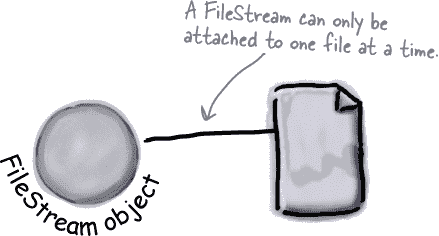
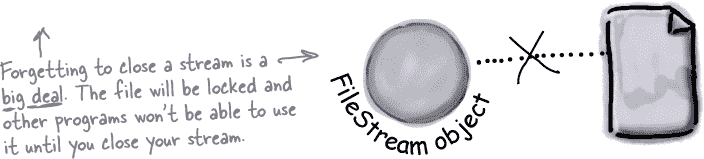
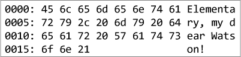
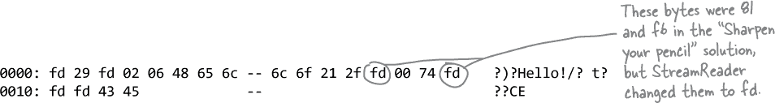

# 第十五章：读写文件：*为我保存最后一个字节！*


**有时坚持一下是值得的。**

到目前为止，您所有的程序都相当短暂。它们启动，运行一段时间，然后关闭。但这通常不够，特别是当您处理重要信息时。您需要能够**保存您的工作**。在本章中，我们将学习如何**将数据写入文件**，然后如何从文件中**读取这些信息**。您将了解**流**的概念，以及如何使用**序列化**将对象存储到文件中，深入探讨**十六进制**、**Unicode**和**二进制数据**的实际比特和字节。

# .NET 使用流来读取和写入数据。

**流**是 .NET Framework 用来将数据输入和输出到程序的方式。每当您的程序读取或写入文件、通过网络连接到另一台计算机，或者通常做任何需要**发送或接收字节**的操作时，您都在使用流。有时您会直接使用流，有时间接使用。即使在使用不直接暴露流的类时，在幕后它们几乎总是在使用流。

> **每当您需要从文件读取数据或向文件写入数据时，都会使用一个 Stream 对象。**

###### 注意

**假设您有一个简单的应用程序需要从文件中读取数据。最基本的方法之一是使用 `Stream` 对象。**


###### 注意

**如果您的应用程序需要将数据写入文件，则可以使用另一个 `Stream` 对象。**


# 不同的流读取和写入不同的内容。

每个流都是**抽象 Stream 类**的子类，有许多不同的流子类执行不同的功能。我们将集中讨论读写常规文件，但是在本章中学到的有关流的知识也可以应用于压缩或加密文件，或者根本不使用文件的网络流。


## 流可执行的操作：

1.  **向流中写入数据。**

    您可以通过流的**Write 方法**将数据写入流中。

1.  **从流中读取数据。**

    您可以使用**Read 方法**从文件、网络、内存或几乎任何其他位置使用流获取数据。即使是***非常大***的文件，即使它们太大而无法放入内存中，您也可以使用流读取数据。

1.  **在流中更改位置。**

    大多数流支持`**Seek 方法**`，允许您在流中找到位置，以便在特定位置读取或插入数据。然而，并非每个 Stream 类都支持 Seek，这是有道理的，因为在某些流数据源中无法回溯。

> **流允许您读取和写入数据。根据您处理的数据类型选择适当的流类型。**

# FileStream 在文件中读取和写入字节。

当程序需要向文件写入几行文本时，需要执行很多操作：

1.  创建一个新的 FileStream 对象，并告诉它写入文件。

    

1.  FileStream 会连接到一个文件。

    

1.  流将字节写入文件，所以你需要将要写入的字符串转换为字节数组。

    

1.  调用流的 Write 方法并传递字节数组。

    

1.  关闭流以便其他程序能够访问文件。

    

# 在三个简单步骤中向文件写入文本

C# 提供了一个方便的类叫做**StreamWriter**，它为你简化了这些操作。你只需要创建一个新的 StreamWriter 对象并给它一个文件名。它会***自动***创建一个 FileStream 并打开文件。然后你可以使用 StreamWriter 的 Write 和 WriteLine 方法将所有内容写入你想要的文件中。

> **StreamWriter 会为你自动创建和管理一个 FileStream 对象。**

1.  **使用 StreamWriter 的构造函数来打开或创建文件。**

    你可以将文件名传递给 StreamWriter 的构造函数。这样做时，写入器会自动打开文件。StreamWriter 还有一个重载的构造函数，可以让你指定它的*追加*模式：传递`true`告诉它将数据添加到现有文件的末尾（或追加），传递`false`告诉流删除现有文件并创建一个同名的新文件。

    ```cs
    var writer = new StreamWriter("toaster oven.txt", true);
    ```

    

1.  **使用 Write 和 WriteLine 方法来写入文件。**

    这些方法的工作方式与控制台类似：Write 写入文本，WriteLine 写入文本并在末尾添加换行。

    ```cs
    writer.WriteLine($"The {appliance} is set to {temp} degrees.");
    ```

    

1.  **调用 Close 方法释放文件。**

    如果你保持流处于打开状态并连接到一个文件中，那么它会锁定该文件，其他程序将无法使用它。所以一定要确保始终关闭你的文件！

    ```cs
    writer.Close();
    ```

# 骗子启动了另一个毒计划

Objectville 的居民长久以来一直生活在对奇才队长的宿敌骗子的恐惧中。现在他正在使用 StreamWriter 实施另一个邪恶计划。让我们看看发生了什么。创建一个新的控制台应用项目并**添加此 Main 代码**，从一个 `using` 声明开始，因为 StreamWriter 在**System.IO 命名空间**中：

###### 注意

**StreamWriter 的 Write 和 WriteLine 方法的工作方式与控制台的类似：Write 写入文本，WriteLine 写入文本并换行。这两个类都支持像这样的 {花括号}。**

```cs
sw.WriteLine("Clone #{0} attacks {1}",
          number, location);
```

**当你在文本中包含 {0} 时，它会被字符串后的第一个参数替换；{1} 被第二个参数替换，{2} 被第三个参数替换，依此类推。**


###### 注意

骗子是奇才队长的宿敌，一个阴影般的超级恶棍，企图统治 Objectville。


这是它写入到 *secret_plan.txt* 中的输出：

**输出**

```cs
How I'll defeat Captain Amazing
Another genius secret plan by The Swindler
I'll unleash my army of clones upon the citizens of
Objectville.
Clone #1 attacks the mall
Clone #2 attacks downtown
Clone #3 attacks the mall
Clone #4 attacks downtown
Clone #5 attacks the mall
```

# StreamWriter 磁铁


糟糕！这些磁铁原本很好地排列在冰箱上，用于 Flobbo 类的代码，但有人猛地关上了门，它们全部掉了下来。你能重新排列它们，使得 Main 方法产生下面的输出吗？

```cs
static void Main(string[] args) {
    Flobbo f = new Flobbo("blue yellow");
    StreamWriter sw = f.Snobbo();
    f.Blobbo(f.Blobbo(f.Blobbo(sw), sw), sw);
}
```

**我们增加了一个额外的挑战。**

Blobbo 方法似乎有些奇怪。看看它在前两个磁铁中有两个不同的声明？我们定义 Blobbo 作为**重载方法**——就像你在前几章中使用的重载方法一样，每个都有自己的参数。


# StreamWriter 磁铁解决方案


你的任务是从磁铁中构建 Flobbo 类，以创建所需的输出。

```cs
static void Main(string[] args) {
    Flobbo f = new Flobbo("blue yellow");
    StreamWriter sw = f.Snobbo();
    f.Blobbo(f.Blobbo(f.Blobbo(sw), sw), sw);
}
```


###### 注意

**只是提醒：我们在这些谜题中故意选择了奇怪的变量名和方法，因为如果我们使用真正好的名字，那么这些谜题就太容易了！在你的代码中不要使用这样的名字，好吗？**

# 使用 StreamReader 来读取文件

让我们用**StreamReader**来阅读骗子的秘密计划，这个类很像 StreamWriter——不过不是写文件，而是在构造函数中创建一个 StreamReader，并传递文件名。它的 ReadLine 方法返回一个包含文件中下一行的字符串。你可以编写一个循环，从中读取行，直到其 EndOfStream 字段为 true——那时就读完了所有行。添加这个控制台应用程序，使用 StreamReader 来读取一个文件，同时使用 StreamWriter 来写入另一个文件：

###### 注意

**StreamReader 是一个从流中读取字符的类，但它本身不是流。当你将文件名传递给它的构造函数时，它会为你创建一个流，并在调用其 Close 方法时关闭它。它还有一个重载的构造函数，它接受一个流的引用。**


###### 注意

**输出**

```cs
To: CaptainAmazing@objectville.net
From: Commissioner@objectville.net
Subject: Can you save the day... again?

We've discovered the Swindler's terrible plan:
The plan -> How I'll defeat Captain Amazing
The plan -> Another genius secret plan by The Swindler
The plan -> I'll unleash my army of clones upon the citizens of Objectville.
The plan -> Clone #1 attacks the mall
The plan -> Clone #2 attacks downtown
The plan -> Clone #3 attacks the mall
The plan -> Clone #4 attacks downtown
The plan -> Clone #5 attacks the mall

Can you help us?
```

# 数据可以通过多个流传输

在.NET 中使用流的一个巨大优势是，你可以让数据通过多个流传输到最终目的地。在.NET Core 中的众多流类型之一是 CryptoStream 类。这允许你在做任何其他操作之前对数据进行加密。所以，不是将纯文本写入普通的文本文件：


骗子可以**链接多个流**，并在将文本通过 CryptoStream 对象写入其输出之前通过它加密：


> **你可以链接流。一个流可以写入另一个流，后者可以写入另一个流...最终通常以网络或文件流结束。**

# 水池拼图


你的***任务***是从池中的代码片段中选取并将它们放入 Pineapple、Pizza 和 Party 类的空白行中。你可以多次使用同一段代码片段，而且不需要使用所有的片段。你的***目标***是使程序将五行内容写入名为 *order.txt* 的文件中，如输出框中所示。


# 池子谜题解决方案


# 使用静态的 File 和 Directory 类来处理文件和目录。

类似于 StreamWriter，File 类创建的流使你能够在后台处理文件。你可以使用它的方法来执行大多数常见操作，而不必首先创建 FileStreams。Directory 类允许你处理整个目录中的文件。

## 使用静态的 File 类可以做的事情：

1.  **查找文件是否存在。**

    你可以使用 File.Exists 方法来检查文件是否存在。如果存在，则返回 true；否则返回 false。

1.  **从文件中读取和写入。**

    你可以使用 File.OpenRead 方法从文件获取数据，或者使用 File.Create 或 File.OpenWrite 方法向文件写入数据。

1.  **向文件追加文本。**

    File.AppendAllText 方法允许你向已创建的文件追加文本。即使在方法运行时文件不存在，它也会创建该文件。

1.  **获取文件的信息。**

    File.GetLastAccessTime 和 File.GetLastWriteTime 方法返回文件上次访问和修改的日期和时间。


## 使用静态的 Directory 类可以做的事情：

1.  **创建一个新目录。**

    使用 Directory.CreateDirectory 方法创建一个目录。你只需提供路径即可，此方法会完成其余工作。

1.  **获取目录中文件的列表。**

    你可以使用 Directory.GetFiles 方法创建一个目录中文件的数组；只需告诉方法你想知道哪个目录，它会完成其余工作。

1.  **删除一个目录。**

    需要删除一个目录吗？调用 Directory.Delete 方法。

# IDisposable 确保对象被正确关闭

很多 .NET 类实现了一个非常有用的接口叫做 IDisposable。它**只有一个成员**：一个叫做 Dispose 的方法。每当一个类实现 IDisposable，它告诉你有一些重要的事情需要它自己关闭，通常是因为它**分配了资源**，直到你告诉它放弃这些资源为止。Dispose 方法就是告诉对象释放这些资源的方式。

## 使用 IDE 探索 IDisposable

你可以在 IDE 中使用“Go To Definition”功能（Mac 上称为“Go to Declaration”）来查看 IDisposable 的定义。转到项目中的类并在其中的任何位置键入 `IDisposable`。然后右键单击它，并从菜单中选择“Go To Definition”。它会在新的标签页中打开代码。展开所有代码，你将看到以下内容：


# 使用语句避免文件系统错误

在整章中，我们一直强调需要**关闭你的流**。这是因为当程序员处理文件时，一些最常见的 bug 是由于流未正确关闭而引起的。幸运的是，C#为你提供了一个很好的工具来确保这种情况永远不会发生：IDisposable 和 Dispose 方法。当你**在`using`语句中包装你的流代码**时，它会自动为你关闭流。你只需用`using`语句声明你的流引用，后面跟着一个使用该引用的代码块（在花括号内）。这样做时，C#会在代码块运行完毕后**自动调用 Dispose 方法**。

###### 注意

这些“using”语句与你代码顶部的不同。


###### 注意

**这个`using`语句声明了一个变量`sw`，它引用一个新的 StreamWriter，并后面跟着一个代码块。在代码块中的所有语句执行完毕后，using 块会自动调用 sw.Dispose。**

## 对多个对象使用多个 using 语句

你可以将`using`语句堆叠在一起，不需要额外的花括号或缩进：

```cs
using (var reader = new StreamReader("secret_plan.txt"))
using (var writer = new StreamWriter("email.txt"))
{
     // statements that use reader and writer
}
```

###### 注意

**每个流都有一个 Dispose 方法来关闭流。当你在 using 语句中声明你的流时，它总是会被关闭！这很重要，因为一些流*直到关闭时*才会写入它们的所有数据。**

> **当你在 using 块中声明一个对象时，该对象的 Dispose 方法会被自动调用。**

# 使用 MemoryStream 将数据流向内存

我们一直在使用流来读取和写入文件。如果你想从文件中读取数据，然后做些什么呢？你可以使用**MemoryStream**，它通过在内存中存储数据来跟踪所有流向它的数据。例如，你可以创建一个新的 MemoryStream，并将其作为参数传递给 StreamWriter 的构造函数，然后使用 StreamWriter 写入的任何数据都会发送到该 MemoryStream。你可以使用**MemoryStream.ToArray 方法**检索这些数据，它会以字节数组的形式返回所有已经流向它的数据。

## 使用 Encoding.UTF8.GetString 将字节数组转换为字符串

对于字节数组，你最常见的操作之一就是将它们转换为字符串。例如，如果你有一个名为 bytes 的字节数组，这是一种转换为字符串的方法：


下面是一个小型控制台应用程序，它使用复合格式化将数字写入 MemoryStream，然后将其转换为字节数组，最后转换为字符串。只有一个问题…… ***它不起作用！***

**创建一个新的控制台应用程序**，并将此代码添加到其中。你能找出问题并修复它吗？

***一定要这样做！***


###### 注意

**这个应用程序无法工作！当你运行它时，它应该向控制台写入一行文本，但实际上什么都没写。我们会解释出了什么问题，但在我们解释之前，先看看你能不能自己找到答案。**

***这里有一个提示：你能找出流何时关闭吗？***

**Q:** 为什么在“磨砺你的铅笔”练习中的文件名字符串前面要加上@符号？

**A:** 因为如果我们不这样做，字符串“C:\\SYP”中的\S 将被解释为无效的转义序列并抛出异常。当你向程序添加一个字符串文字时，编译器会将像\n 和\r 这样的转义序列转换为特殊字符。Windows 文件名中包含反斜杠字符，但 C#字符串通常使用反斜杠来开始转义序列。如果在字符串前面加上@，它告诉 C#不要解释转义序列。它还告诉 C#包含换行符在你的字符串中，所以你可以在字符串中间按 Enter 键，它会把那部分作为换行符包含在输出中。

**Q:** 那么转义序列到底是什么？

**A:** 转义序列是一种在字符串中包含特殊字符的方法。例如，\n 是换行符，\t 是制表符，\r 是回车符，或者说是 Windows 回车的一半（在 Windows 文本文件中，行必须以\r\n 结束；对于 macOS 和 Linux，行只需以\n 结束）。如果需要在字符串中包含引号，可以使用\"，它不会结束字符串。如果要在字符串中使用实际的反斜杠而不让 C#解释它作为转义序列的开头，只需使用两个反斜杠：\\。

###### 注意

我们给了你一个机会自己解决这个问题。这是我们是如何修复它的。


**存储对象到文件中有一种更简单的方法。它叫做序列化。**

**序列化**意味着将对象的整个状态写入到文件或字符串中。**反序列化**意味着从该文件或字符串中读取对象的状态。因此，不必一行一行地费力写出每个字段和值到文件中，你可以通过将对象序列化到流中来轻松地保存对象。***序列化***对象就像**将其展平**，以便你可以将其放入文件中。另一方面，***反序列化***对象就像将其从文件中取出并**膨胀**一样。

###### 注意

好吧，坦白说：还有一个名为 Enum.Parse 的方法，它将字符串“Spades”转换为枚举值 Suits.Spades。它甚至有一个伴侣方法 Enum.TryParse，它的工作方式就像你在本书中一直使用的 int.TryParse 方法一样。但是在这里序列化更加合理。你很快就会了解更多...

# 当对象被序列化时会发生什么？

看起来似乎要对一个对象进行某种神秘的操作，才能将其从堆中复制到文件中，但实际上这并不复杂。

1.  **堆上的对象**

    

    当你创建一个对象的实例时，它有一个**状态**。一个对象“知道”的一切是使一个类的一个实例与同一类的另一个实例不同的东西。

1.  **对象已序列化**

    

    当 C#序列化一个对象时，它**保存对象的完整状态**，以便稍后可以在堆上重新创建一个完全相同的实例（对象）。

    

1.  **以及后来...**

    以后——也许是几天后，在另一个程序中——你可以回到文件并**反序列化**它。这会将原始类从文件中取回，并**完全恢复**它，所有字段和值都完好无损。

    

# 但一个对象的状态到底是什么？需要保存什么？

我们已经知道**一个对象将其状态存储在其字段和属性中**。因此，当一个对象被序列化时，每个值都需要保存到文件中。

当你有更复杂的对象时，序列化就变得有趣起来。字符、整数、双精度和其他值类型有可以直接写入文件的字节。如果一个对象有一个实例变量是对象*引用*呢？如果一个对象有五个实例变量是对象引用呢？如果这些对象实例变量本身有实例变量呢？

花一分钟时间考虑一下。一个对象的哪一部分可能是唯一的？考虑一下需要恢复什么才能获得与保存的对象完全相同的对象。堆上的所有内容都必须写入文件中。

###### 注意

Brain Barbell 就像是“增强版”的 Brain Power。花几分钟时间认真思考一下这个。

# 当一个对象被序列化时，它所引用的所有对象也会被序列化...

...以及所有它们所引用的对象，以及所有那些其他对象所引用的对象，依此类推。别担心——听起来可能很复杂，但这一切都会自动发生。C#从你想要序列化的对象开始，并查看其字段中的其他对象。然后对每个对象执行相同的操作。每个对象都会被写入文件，连同 C#重新构建对象时所需的所有信息。

###### 注意

**一组通过引用相互连接的对象有时被称为图。**


# 使用 JsonSerialization 来序列化你的对象

你不仅仅局限于读写文本行到你的文件中。你可以使用**JSON 序列化**让你的程序***复制整个对象***到字符串（然后你可以将其写入文件！）并读取它们回来...所有这些只需几行代码！让我们看看这是如何工作的。首先**创建一个新的控制台应用程序。**

***做这个！***

1.  **为你的对象图设计一些类。**

    将这个`HairColor`枚举和这些 Guy、Outfit 和 HairStyle 类添加到你的新控制台应用程序中：

    ```cs
    class Guy {
        public string Name { get; set; }
        public HairStyle Hair { get; set; }
        public Outfit Clothes { get; set; }
        public override string ToString() => $"{Name} with {Hair} wearing {Clothes}";
    }

    class Outfit {
        public string Top { get; set; }
        public string Bottom { get; set; }
        public override string ToString() => $"{Top} and {Bottom}";
    }

    enum HairColor { 
       Auburn, Black, Blonde, Blue, Brown, Gray, Platinum, Purple, Red, White 
    }

    class HairStyle {
        public HairColor Color { get; set; }
        public float Length { get; set; }
        public override string ToString() => $"{Length:0.0} inch {Color} hair";
    }
    ```

1.  **创建一个要序列化的对象图。**

    现在创建一个小的对象图来序列化：一个新的 List<Guy> 指向几个 Guy 对象。将以下代码添加到你的 Main 方法中。它使用集合初始化器和对象初始化器来构建对象图：

    ```cs
    static void Main(string[] args) {
        var guys = new List<Guy>() {
           new Guy() { Name = "Bob", Clothes = new Outfit() { Top = "t-shirt", Bottom = "jeans" },
              Hair = new HairStyle() { Color = HairColor.Red, Length = 3.5f }
           },
           new Guy() { Name = "Joe", Clothes = new Outfit() { Top = "polo", Bottom = "slacks" },
              Hair = new HairStyle() { Color = HairColor.Gray, Length = 2.7f }
           },
        };
    }
    ```

    

1.  **使用 JsonSerializer 将对象序列化为字符串。**

    首先，在你的代码文件顶部添加一个 `using` 指令：

    ```cs
    using System.Text.Json;
    ```

    现在你可以用一行代码**序列化整个图形**：

    ```cs
        var jsonString = JsonSerializer.Serialize(guys);
        Console.WriteLine(jsonString);
    ```

    再次运行你的应用程序，并仔细观察它打印到控制台的内容：

    ```cs
    [{"Name":"Bob","Hair":{"Color":8,"Length":3.5},"Clothes":{"Top":"t-shirt","Bot
    tom":"jeans"}},{"Name":"Joe","Hair":{"Color":5,"Length":2.7},"Clothes":{"Top":
    "polo","Bottom":"slacks"}}]
    ```

    这就是你的对象图 **序列化为 JSON**（有些人发音为“Jason”，其他人发音为“JAY-sahn”）。它是*一种人类可读的数据交换格式*，这意味着它是一种使用字符串存储复杂对象的方式，人们可以理解。因为它是人类可读的，你可以看到它包含图的所有部分：名称和衣服被编码为字符串（“Bob”，“t-shirt”），枚举被编码为它们的整数值。

1.  **使用 JsonSerializer 将 JSON 反序列化为一个新的对象图。**

    现在我们有了一个包含对象图的 JSON 序列化的字符串，我们可以进行反序列化。这意味着使用它来创建新的对象。JsonSerializer 也让我们可以用一行代码完成这个操作。在 Main 方法中添加以下代码：

    ```cs
    var copyOfGuys = JsonSerializer.Deserialize<List<Guy>>(jsonString);
    foreach (var guy in copyOfGuys)
        Console.WriteLine("I deserialized this guy: {0}", guy);
    ```

    再次运行你的应用程序。它会将从 JSON 字符串中反序列化的人物输出到控制台：

    ```cs
    I deserialized this guy: Bob with 3.5 inch Red hair wearing t-shirt and jeans
    I deserialized this guy: Joe with 2.7 inch Gray hair wearing polo and slacks
    ```

###### 注意

**当你使用 JsonSerializer 将对象图序列化为 JSON 时，它生成了（在某种程度上）可读的文本表示形式的数据。**

# JSON 只包含数据，不包括特定的 C# 类型。

当你浏览 JSON 数据时，你会看到对象中可读的版本的数据：像“Bob”和“slacks”这样的字符串，像 8 和 3.5 这样的数字，甚至是列表和嵌套对象。当你查看 JSON 数据时，你看不到什么？JSON **不包括类型的名称**。查看 JSON 文件，你不会看到 Guy、Outfit、HairColor 或 HairStyle 等类的名称，甚至连 int、string 或 double 等基本类型的名称也不会看到。这是因为 JSON 只包含数据，而 JsonSerializer 将尽力将数据反序列化为它发现的任何属性。

让我们来测试一下。向你的项目添加一个新类：


然后再次运行你的代码。由于 JSON 只包含对象列表，JsonSerializer.Deserialize 将乐意将它们放入栈（或队列、数组或其他集合类型）。由于 Dude 公开了与数据匹配的 Name 和 Hair 属性，它将填充任何可以找到的数据。这是它打印到输出的内容：

```cs
Next dude: Joe with 2.7 inch Gray hair hair
Next dude: Bob with 3.5 inch Red hair hair
```

###### 注意

还有一件事！我们向你展示了如何使用 JsonSerializer 进行基本的序列化。你只需要了解它的另外几点内容。

# 接下来：我们将深入研究我们的数据。

你已经写了很多代码，使用了像 int、bool 和 double 这样的值类型，并创建了存储数据的字段对象。现在是时候从更低的角度来看待事物了。本章的其余部分都是关于通过理解 C# 和 .NET 用于表示数据的实际字节来更好地了解你的数据。

这是我们将要做的事情。


> **我们将探讨 C# 字符串如何使用 Unicode 编码——.NET 使用 Unicode 存储字符和文本。**


> **我们将把值写入二进制数据，然后读取它们，看看写入了哪些字节。**



> **我们将构建一个十六进制转储程序，让我们更仔细地查看文件中的位和字节。**

###### 注意

辅助功能通常是事后加入的，但如果从一开始就考虑这些事情，你的游戏——以及任何其他类型的程序！——会更加出色。

# C# 字符串使用 Unicode 编码

你自从在 IDE 开始时键入了`"Hello, world!"`以来，一直在使用字符串。因为字符串如此直观，我们并没有真正需要解剖它们并弄清楚它们如何运作。但是请问自己……***究竟什么是字符串？***

C# 字符串是 **只读的字符集合**。因此，如果你实际查看存储在内存中的字符串，“Elephant”将被存储为字符‘E’、‘l’、‘e’、‘p’、‘h’、‘a’、‘n’和‘t’。现在问问自己……***究竟什么是字符？***

char 是用 **Unicode** 表示的字符。Unicode 是用于 **编码** 字符的行业标准，或将它们转换为字节，以便存储在内存中、通过网络传输、包含在文档中或几乎任何其他你想做的事情——并且你保证总是获得正确的字符。

特别是当你考虑到有多少字符时，这点尤为重要。Unicode 标准支持超过 150 个 **脚本**（特定语言的字符集），包括不仅限于拉丁文（包括 26 个英文字母和变体如 é 和 ç，还有全球许多语言使用的脚本。支持的脚本列表不断增长，Unicode 联盟每年都在添加新的（这是当前的列表：[`www.unicode.org/standard/supported.html`](http://www.unicode.org/standard/supported.html)）。


Unicode 还支持另一组非常重要的字符：**emoji**。从眨眼笑脸 () 到广受欢迎的一堆大便 () ，所有的 emoji 都是 Unicode 字符。


**每个 Unicode 字符（包括 emoji）都有一个称为代码点的唯一编号**。

Unicode 字符的编号称为**代码点**。你可以在这里下载所有 Unicode 字符的列表：[`www.unicode.org/Public/UNIDATA/UnicodeData.txt`](https://www.unicode.org/Public/UNIDATA/UnicodeData.txt)。

那是一个包含每个 Unicode 字符一行的大文本文件。下载它并搜索“ELEPHANT”，你会找到以这种方式开始的行：`1F418;ELEPHANT`。数字 1F418 代表一个**十六进制**（或**十六进制**）值。十六进制值用数字 0 到 9 和字母 A 到 F 编写，通常在处理 Unicode 值（以及一般的二进制值）时，使用十六进制比使用十进制更方便。在 C#中，你可以通过在开头加上 0x 来创建十六进制文字，就像这样：0x1F418。

1F418 是大象表情符号的***UTF-8*** **代码点**。UTF-8 是将字符编码为 Unicode（或表示为数字）的最常见方式。它是一种可变长度编码，使用 1 到 4 字节。在这种情况下，它使用 3 字节：0x01（或 1）、0xF4（或 244）和 0x18（或 24）。

但这不是 JSON 序列化器打印的内容。它打印了一个更长的十六进制数：D83DDC18。这是因为**C# char 类型使用*UTF-16***，它使用由一个或两个 2 字节数字组成的代码点。大象表情符号的 UTF-16 代码点是 0xD83D 0xDC18。UTF-8 比 UTF-16 更受欢迎，特别是在 Web 上，因此当你查找代码点时，更有可能找到 UTF-8 而不是 UTF-16。

> **UTF-8 是大多数网页和许多系统使用的可变长度编码。它可以使用 1、2、3 或更多字节存储字符。UTF-16 是一个固定长度编码，总是使用一个或两个 2 字节数字。.NET 将 char 值存储在内存中作为 UTF-16 值。**

# Visual Studio 非常适合处理 Unicode

让我们使用 Visual Studio 来查看 IDE 如何处理 Unicode 字符。你在#start_building_with_chash_build_somethin 中看到了可以在代码中使用表情符号。让我们看看 IDE 还能处理什么。进入代码编辑器并输入以下代码：

```cs
    Console.WriteLine("Hello ");
```

如果你使用的是 Windows，打开字符映射应用程序。如果你使用的是 Mac，按下 Ctrl--空格来弹出字符查看器。然后搜索希伯来字母*辉* ()并复制到剪贴板。


把光标放在空格和引号之间的字符串末尾，然后粘贴你复制到剪贴板上的*辉*字符。嗯，看起来有些奇怪：


你注意到光标位于粘贴字母的*左侧*吗？好的，让我们继续。不要在 IDE 中点击任何地方——保持光标所在的位置，然后切换到字符映射或字符查看器中搜索希伯来字母拉梅德 ()。切换回 IDE——确保光标仍然位于辉的左侧——并粘贴拉梅德进去：


当你粘贴了 lamed 时，IDE 将其添加到 shin 的左侧。现在搜索希伯来字母 vav（`I`）和 final mem（）。将它们粘贴到 IDE 中——它会将它们插入到光标的左侧：


IDE 知道***希伯来语从右向左读***，因此它会相应地行为。点击选择语句开头附近的文本，并慢慢将光标向右拖动以选择`Hello`，然后是。当选择到希伯来字母时，请仔细观察会发生什么。它跳到 shin（）然后从右向左选择——这正是希伯来读者期望它做的。

# .NET 使用 Unicode 来存储字符和文本

用于存储文本和字符的两个 C#类型——string 和 char——将它们的数据作为 Unicode 保存在内存中。当这些数据作为字节写入文件时，每个 Unicode 数都被写入文件。让我们来感受一下 Unicode 数据如何写入文件。**创建一个新的控制台应用。**我们将使用 File.WriteAllBytes 和 File.ReadAllBytes 方法开始探索 Unicode。

***做这个！***

1.  **将普通字符串写入文件并读取它。**

    将以下代码添加到 Main 方法中——它使用 File.WriteAllText 将字符串“Eureka！”写入名为*eureka.txt*的文件（所以你需要`using System.IO;`）。然后创建一个新的字节数组称为`eurekaBytes`，将文件读入其中，并打印出它读取的所有字节：

    

    你会看到这些字节被写入输出：`69 117 114 101 107 97 33`。最后一行调用了 Encoding.UTF8.GetString 方法，它将 UTF-8 编码的字节数组转换为字符串。现在在 Notepad（Windows）或 TextEdit（Mac）中**打开文件**。它说“Eureka！”

1.  **然后添加代码以将字节写成十六进制数。**

    当你编码数据时，你经常会使用十六进制，所以现在让我们这样做。在 Main 方法的末尾添加此代码，使用`{0:x2}`来**格式化每个字节为十六进制数**：

    ```cs
    foreach (byte b in eurekaBytes)
        Console.Write("{0:x2} ", b);
    Console.WriteLine();
    ```

    ###### 注意

    十六进制使用数字 0 到 9 和字母 A 到 F 来表示基数为 16 的数字，所以 6B 等于 107。

    这告诉 Write 将参数 0（打印字符串后的第一个参数）打印为两个字符的十六进制代码。因此，它以十六进制而不是十进制写出相同的七个字节：`45 75 72 65 6b-61 21`。

1.  **修改第一行，写希伯来字母“”而不是“Eureka！”**

    你刚刚使用了 Character Map（Windows）或 Character Viewer（Mac）将希伯来文本  添加到另一个程序。**注释掉 Main 方法的第一行，并用以下代码替换它**，该代码将  而不是“Eureka！”写入文件。我们添加了一个额外的 Encoding.Unicode 参数，以便写入 UTF-16（Encoding 类位于 System.Text 命名空间中，因此还要在顶部添加`using System.Text;`）：

    

    现在再次运行代码，并仔细观察输出：`ff fe e9 05 dc 05 d5 05 dd 05`。前两个字符是“FF FE”，这是 Unicode 表示我们将有一个 2 字节字符的方式。其余的字节是希伯来字母 —— 但它们是反向的，所以 U+05E9 显示为`**e9 05**`。现在在记事本或 TextEdit 中打开文件，确保它看起来正确。

1.  **使用 JsonSerializer 探索 UTF-8 和 UTF-16 代码点。**

    当你序列化大象表情符号时，JsonSerializer 生成了`\uD83D\uDC18` —— 我们现在知道这是 4 字节 UTF-16 代码点的十六进制表示。现在让我们试试希伯来字母 shin。在你的应用程序顶部添加`using System.Text.Json;`，然后添加这一行：

    

    再次运行你的应用程序。这一次它打印了一个值，有两个十六进制字节，“\u05E9” —— 这是希伯来字母 shin 的 UTF-16 代码点。它也是相同字母的 UTF-8 代码点。

    等等——我们了解到大象表情符号的 UTF-8 代码点是`0x1F418`，与 UTF-16 代码点（0xD83D 0xDC18）***不同***。发生了什么事？

    原来大多数具有 2 字节 UTF-8 代码点的字符在 UTF-16 中具有相同的代码点。一旦达到需要三个或更多字节的 UTF-8 值——包括本书中使用的熟悉表情符号——它们就不同了。所以尽管希伯来字母 shin 在 UTF-8 和 UTF-16 中都是 0x05E9，大象表情符号在 UTF-8 中是 0x1F418，在 UTF-16 中是 0xD8ED 0xDC18。

    

1.  **使用 Unicode 转义序列进行编码** 。

    在你的 Main 方法中添加这些行，使用 UTF-16 和 UTF-32 转义序列将大象表情符号写入两个文件：

    ```cs
    File.WriteAllText("elephant1.txt", "\uD83D\uDC18");
    File.WriteAllText("elephant2.txt", "\U0001F418");
    ```

    再次运行你的应用程序，然后在记事本或 TextEdit 中打开这两个文件。你应该看到正确的字符被写入文件。

    ###### 注意

    **你使用 UTF-16 和 UTF-32 转义序列来创建你的表情符号，但 WriteAllText 方法却写入了一个 UTF-8 文件。你在步骤 1 中使用的 Encoding.UTF8.GetString 方法将 UTF-8 编码的数据转换回字符串。**

# C#可以使用字节数组来移动数据

因为所有的数据最终都以**字节**编码，所以把文件想象成一个**大字节数组**是有意义的……而且你已经知道如何读取和写入字节数组。


# 使用 BinaryWriter 写入二进制数据

###### 注意

StreamWriter 也对数据进行编码。它专门处理文本和文本编码——默认为 UTF-8。

您***可以***将所有字符串、字符、整数和浮点数编码为字节数组，然后再将它们写入文件，但这将变得非常繁琐。这就是为什么 .NET 给您提供了一个非常有用的类叫做 **BinaryWriter**，它**自动编码您的数据**并将其写入文件。您只需创建一个 FileStream 并将其传递给 BinaryWriter 的构造函数（它们都在 System.IO 命名空间中，所以您需要 `using System.IO;`）。然后，您可以调用其方法将数据写出。让我们练习使用 BinaryWriter 将二进制数据写入文件。

***就这样！***

1.  首先创建一个控制台应用程序并设置一些要写入文件的数据：

    

1.  要使用 BinaryWriter，首先需要使用 File.Create 打开一个新流：

    ```cs
      using (var output = File.Create("binarydata.dat"))
      using (var writer = new BinaryWriter(output))
      {
    ```

1.  现在只需调用其 Write 方法。每次执行此操作时，它都会将包含传递给它作为参数的数据的编码版本的新字节添加到文件的末尾：

    

1.  现在使用之前用于读取您刚刚写入的文件的相同代码：

    ```cs
      byte[] dataWritten = File.ReadAllBytes("binarydata.dat");
      foreach (byte b in dataWritten)
          Console.Write("{0:x2} ", b);
      Console.WriteLine(" - {0} bytes", dataWritten.Length);
    ```

    在下面的空白处写下输出。您能**找出每个 writer.Write(...) 语句对应的字节吗**？我们在与每个语句对应的字节组下面放置了括号，以帮助您确定文件中哪些字节对应于应用程序写入的数据。

# 使用 BinaryReader 读取数据

BinaryReader 类的工作方式与 BinaryWriter 类似。您创建一个流，将 BinaryReader 对象附加到该流，然后调用其方法……但读取器**不知道文件中的数据是什么**！它没有办法知道。您的浮点值 491.695F 被编码为 d8 f5 43 45。这些字节也可以作为一个完全有效的`int`——1,140,185,334——所以您需要告诉 BinaryReader 究竟从文件中读取哪些类型。将以下代码添加到您的程序中，并让它读取您刚刚写入的数据。

###### 注意

不要轻信我们的话。用调用 ReadInt32 替换读取浮点数的那一行。（您需要将 floatRead 的类型更改为 int。）然后，您可以亲自看看它从文件中读取了什么。

1.  首先设置 FileStream 和 BinaryReader 对象：

    ```cs
    using (var input = File.OpenRead("binarydata.dat"))
    using (var reader = new BinaryReader(input))
    {
    ```

1.  您通过调用 BinaryReader 的不同方法告诉它要读取什么类型的数据：

    

1.  现在将从文件中读取的数据写入控制台：

    ```cs
         Console.Write("int: {0}  string: {1}  bytes: ", intRead, stringRead);
         foreach (byte b in byteArrayRead)
             Console.Write("{0} ", b);
         Console.Write(" float: {0}  char: {1} ", floatRead, charRead);
      }
    ```

    这是打印到控制台的输出：

    ```cs
      int: 48769414  string: Hello!  bytes: 47 129 0 116  float: 491.695  char: E
    ```

###### 注意

**如果您要写入仅包含低编号 Unicode 字符的字符串（如拉丁字母），则每个字符写入一个字节。如果有高编号字符（如表情符号），则每个字符将使用两个或更多字节进行编写。**

# 十六进制转储可以让您查看文件中的字节

**十六进制转储**是文件内容的*十六进制*视图，是程序员深入查看文件内部结构的常见方式。

Hex（十六进制）原来是在文件中显示字节的便捷方式。一个字节在十六进制中占用两个字符：字节的范围是从 0 到 255，或者在十六进制中是 00 到 ff。这使您可以在非常小的空间中查看大量数据，并且以一种易于识别模式的格式呈现。将二进制数据显示为每行 8、16 或 32 字节很有用，因为大多数二进制数据倾向于以 4、8、16 或 32 个字节的块来处理，就像 C#中的所有类型一样（例如，int 占用 4 个字节）。十六进制转储让您可以准确查看这些值由什么组成。

## 如何制作一些普通文本的十六进制转储

从一些使用拉丁字符的熟悉文本开始：

```cs
When you have eliminated the impossible, whatever remains, however
improbable, must be the truth. - Sherlock Holmes
```

首先，将文本分成 16 字符段，从第一个 16 个字符开始：`When you have el`

接下来，将文本中的每个字符转换为其 UTF-8 代码点。由于所有拉丁字符都具有***1 字节***的 UTF-8 代码点，每个字符将以从 00 到 7F 的两位十六进制数字表示。我们的每行转储看起来将是这样的：


重复，直到您在文件中转储了每个 16 字符段：

```cs
     0000: 57 68 65 6e 20 79 6f 75 -- 20 68 61 76 65 20 65 6c    When you have el
     0010: 69 6d 69 6e 61 74 65 64 -- 20 74 68 65 20 69 6d 70    iminated the imp
     0020: 6f 73 73 69 62 6c 65 2c -- 20 77 68 61 74 65 76 65    ossible, whateve
     0030: 72 20 72 65 6d 61 69 6e -- 73 2c 20 68 6f 77 65 76    r remains, howev
     0040: 65 72 20 69 6d 70 72 6f -- 62 61 62 6c 65 2c 20 6d    er improbable, m
     0050: 75 73 74 20 62 65 20 74 -- 68 65 20 74 72 75 74 68    ust be the truth
     0060: 2e 20 2d 20 53 68 65 72 -- 6c 6f 63 6b 20 48 6f 6c    . - Sherlock Hol
     0070: 6d 65 73 0a             --                            mes.
```

这就是我们的转储结果。各种操作系统都有许多不同的十六进制转储程序，每个程序的输出略有不同。我们特定的十六进制转储格式中，每行表示生成它的输入中的 16 个字符，每行开头有偏移量，每个字符的文本在行尾。其他十六进制转储应用程序可能会以不同方式显示内容（例如，呈现转义序列或以十进制显示值）。

> **十六进制转储是文件或内存中数据的十六进制视图，是帮助您调试二进制数据的非常有用的工具。**

# 使用 StreamReader 构建一个十六进制转储程序

让我们构建一个十六进制转储应用程序，它从文件中使用 StreamReader 读取数据，并将其转储到控制台上。我们将利用 StreamReader 中的**ReadBlock 方法**，它会读取一个字符块到 char 数组中：您可以指定要读取的字符数，它将读取指定数量的字符，或者如果文件中剩余的字符少于要求的数量，则读取剩余的所有字符。由于我们每行显示 16 个字符，因此我们将读取 16 个字符的块。

**创建一个名为 HexDump 的新控制台应用程序**。在添加代码之前，**运行该应用程序**以创建带有二进制文件的文件夹。使用记事本或 TextEdit 创建一个名为*textdata.txt*的文本文件，向其中添加一些文本，并将其放在与二进制文件相同的文件夹中。

下面是 Main 方法内部的代码——它读取*textdata.txt*文件并将十六进制转储写入控制台。确保在顶部添加`using System.IO;`。

###### 注意

**ReadBlock 方法从其输入中读取下一个字符，并将其读入字节数组（有时称为缓冲区）。它会阻塞，这意味着它会继续执行，并且只有在读取完您请求的所有字符或者没有更多数据可读时才会返回。**


# 使用 Stream.Read 从流中读取字节

对于文本文件，十六进制转储程序工作得很好——但存在问题。**复制你用 BinaryWriter 写入的*binarydata.dat*文件**到与你的应用程序相同的文件夹中，然后更改应用程序以读取它：

```cs
    using (var reader = new StreamReader("binarydata.dat"))
```

现在再次运行你的应用程序。这次它打印出了其他内容——但不完全正确：



文本字符（“Hello`!`”）看起来没问题。但是与“磨练你的铅笔”解决方案的输出进行比较——字节并不完全正确。看起来它用不同的字节 fd 替换了一些字节（86、e8、81、f6、d8 和 f5）。这是因为**StreamReader 用于读取文本文件**，所以它只读取**7 位值**，或者说最多 127 的字节值（十六进制 7F，或二进制中的 1111111）。

所以让我们做得对——通过***直接从流中读取字节***。修改`using`块以使用**File.OpenRead**，它打开文件并**返回一个 FileStream**。你将使用流的 Length 属性继续读取，直到读取文件中的所有字节，并使用其 Read 方法将下一个 16 个字节读入字节数组缓冲区：


其余的代码与设置`bufferContents:`行除外。

```cs
    // Write the actual characters in the byte array
    var bufferContents = Encoding.UTF8.GetString(buffer);
```

你在本章前面使用过 Encoding 类将字节数组转换为字符串。这个字节数组每个字符包含一个字节，这意味着它是一个有效的 UTF-8 字符串。这意味着你可以使用 Encoding.UTF8.GetString 来转换它。由于 Encoding 类在 System.Text 命名空间中，你需要在文件顶部添加`using System.Text;`。

现在再次运行你的应用程序。这次它打印出正确的字节而不是将它们改变为 fd：


还有一件事我们可以做来清理输出。许多十六进制转储程序会在输出中将非文本字符替换为点。**在`for`循环的末尾添加这一行：**

```cs
   if (buffer[i] < 0x20 || buffer[i] > 0x7F) buffer[i] = (byte)’.’;
```

现在再次运行你的应用程序——这次问号被点替换为点：

```cs
    0000: 86 29 e8 02 06 48 65 6c -- 6c 6f 21 2f 81 00 74 f6    .)...Hello!/..t.
    0010: d8 f5 43 45             --                            ..CE
```

# 修改你的十六进制转储程序以使用命令行参数

大多数十六进制转储程序是从命令行运行的实用程序。你可以通过将文件名作为**命令行参数**传递给十六进制转储器来转储文件，例如：`C:\> HexDump myfile.txt`

让我们修改十六进制转储程序以使用命令行参数。当你创建控制台应用程序时，C#将命令行参数作为**`args`字符串数组**传递给 Main 方法：

```cs
   static void Main(string[] args)
```

我们将修改 Main 方法以打开文件并从流中读取其内容。**File.OpenRead 方法**接受文件名作为参数，打开它以便读取，并返回一个带有文件内容的流。

更改 Main 方法中的这些行：


现在让我们通过**更改调试属性**来在 IDE 中使用命令行参数来传递给程序。在解决方案中**右键单击项目**，然后：

+   ***在 Windows 上，*** 选择属性，然后点击调试，在应用程序参数框中输入要转储的文件名（可以是完整路径或者二进制文件夹中文件的名称）。

+   ***在 macOS 上，*** 选择选项，展开运行 >> 配置，点击默认，然后在参数框中输入文件名。

###### 注意

确保您右键单击项目，而不是解决方案。

现在，当您调试应用程序时，其 `args` 数组将包含您在项目设置中设置的参数。***确保在设置命令行参数时指定有效的文件名。***

## 从命令行运行您的应用程序

您还可以从命令行运行应用程序，用文件名（可以是完整路径或当前目录中的文件名）替换 `[filename]`：

+   ***在 Windows 上，*** Visual Studio 会在 bin\Debug 文件夹下生成一个可执行文件（与您放置文件以读取的位置相同），因此您可以直接从该文件夹运行可执行文件。打开命令窗口，**`cd`** 到 bin\Debug 文件夹，并运行 `HexDump [filename].`

+   ***在 Mac 上，*** 您需要**构建一个独立的应用程序**。打开一个终端窗口，进入项目文件夹，并运行以下命令：`dotnet publish -r osx-x64.`

    输出将包含类似于这样的一行：`HexDump -> /path-to-binary/osx-x64/publish/`

    打开一个终端窗口，`cd` 到打印的完整路径，并运行 `./HexDump [filename].`
