# Unity 实验室#5：射线投射

当您在 Unity 中设置场景时，您正在为游戏中的角色创建一个虚拟的 3D 世界，使它们可以在其中移动。但在大多数游戏中，游戏中的大部分事物并不直接由玩家控制。那么这些对象如何在场景中找到它们的路？

实验五和六的目标是让您熟悉 Unity 的**寻路和导航系统**，这是一个复杂的 AI 系统，让您可以创建能够在您创建的世界中找到路的角色。在这个实验中，您将使用 GameObject 构建场景，并使用导航将角色移动到周围。

您将使用**射线投射**编写响应场景几何的代码，**捕捉输入**并用它将一个 GameObject 移动到玩家点击的点。同样重要的是，您将**练习编写包括类、字段、引用等在内的 C#代码**，这些都是我们讨论过的主题。

# 创建一个新的 Unity 项目并开始设置场景

*开始之前，请关闭任何打开的 Unity 项目。同时关闭 Visual Studio——我们将让 Unity 来打开它。使用 3D 模板创建一个新的 Unity 项目，将布局设置为 Wide，使其与我们的截图匹配，并起一个名字，比如**Unity Labs 5 and 6**，以便您以后可以回来查看。*

首先创建一个玩家将要在其中导航的游戏区域。在层级窗口中右键单击，并**创建一个 Plane**（GameObject >> 3D Object >> Plane）。将您的新 Plane GameObject 命名为*Floor*。

右键单击项目窗口中的 Assets 文件夹，**创建一个名为 Materials 的文件夹**。然后在您创建的新 Materials 文件夹上右键单击，并选择**创建 >> Material**。将新材质命名为*FloorMaterial*。现在，让我们保持这个材质简单——我们只需使它成为一种颜色。在项目窗口中选择 Floor，然后单击检视器中 Albedo 词右侧的白色框。


在颜色窗口中，使用外环选择地面的颜色。我们在截图中使用了一个颜色，编号为 4E51CB，您可以将其输入到十六进制框中。

将**项目窗口中的材料拖到层级窗口中的 Plane GameObject**上。您的地面平面现在应该是您选择的颜色。

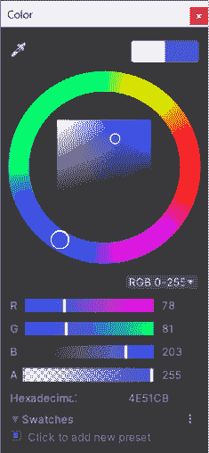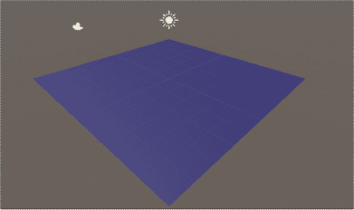

###### 注意

仔细思考并猜一下。然后使用检视器窗口尝试各种 Y 比例值，看看平面是否按照您的预期行动。（别忘了把它们设回来！）

###### 注意

**平面是一个平方形的平面对象，长宽为 10 个单位（在 X-Z 平面），高度为 0 个单位（在 Y 平面）。Unity 创建它，使得平面的中心点位于 (0,0,0)。这个平面的中心点决定了它在场景中的位置。和其他对象一样，你可以通过检视器或工具来移动它的位置和旋转。你也可以改变它的比例，但因为它没有高度，你只能改变 X 和 Z 的比例—任何放入 Y 比例的正数都会被忽略。**

**使用 3D 对象菜单创建的对象（平面、球体、立方体、圆柱体以及其他几个基本形状）被称为基本对象。你可以通过从帮助菜单打开 Unity 手册并搜索“基本和占位对象”帮助页面来了解更多信息。现在花一分钟打开这个帮助页面。阅读它对于平面、球体、立方体和圆柱体的介绍。**

# 设置摄像机

在最近的两个 Unity 实验中，你学到了 GameObject 本质上是组件的“容器”，而主摄像机只有三个组件：一个 Transform，一个 Camera，和一个 Audio Listener。这很合理，因为摄像机所需做的就是位于某个位置并记录它所看到和听到的内容。查看检视器窗口中摄像机的 Transform 组件。

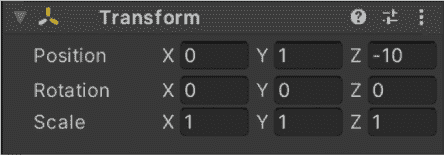

注意位置是 (0, 1, –10)。点击位置行中的 Z 标签并向上或向下拖动。你会看到摄像机在场景窗口中前后移动。仔细观察摄像头前方的方框和四条线。它们代表摄像机的**视口**，或者玩家屏幕上可见的区域。

**使用移动工具（W）和旋转工具（E）移动摄像机并在场景中旋转它**，就像你在场景中操作其他 GameObject 一样。摄像机预览窗口会实时更新，显示摄像机所见的内容。移动摄像机时保持关注摄像机预览。地面将会随着摄像机视角的改变而移动。

使用检视器窗口中的上下文菜单重置主摄像机的 Transform 组件。注意***这不会将摄像机重置到原始位置***—它会将摄像机的位置和旋转都重置为 (0, 0, 0)。你会看到摄像机与场景窗口中的平面相交。

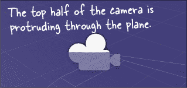

现在让我们把摄像机直接对准地面。首先点击旋转旁边的 X 标签并上下拖动。你会看到摄像机预览中的视口移动。现在在检视器窗口中将摄像机的 X 旋转设置为 90 度，以使其直接朝下。

你会注意到在摄像机预览中再也看不到任何内容，这很合理，因为摄像机直接看向无限薄的平面下方。**点击 Transform 组件中的 Y 位置标签并向上拖动**，直到在摄像机预览中看到整个平面。

现在在层次视图中**选择 Floor**。注意到摄像机预览消失了—只有在选择摄像机时才会出现。你也可以在场景和游戏窗口之间切换，看看摄像机的视角。

使用平面的 Transform 组件在检视器窗口中，**将 Floor GameObject 的缩放设置为 (4, 1, 2)**，使其长度为宽度的两倍。由于平面宽度和长度均为 10 单位，这个缩放将使其长度为 40 单位，宽度为 20 单位。平面将完全填满视口，因此将摄像机沿 Y 轴向上移动，直到整个平面都能看到。

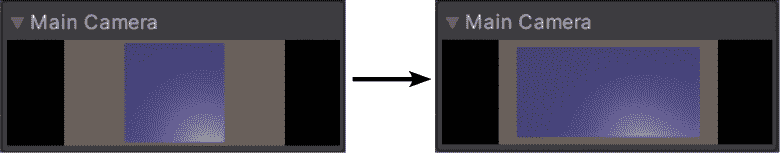

###### 注意

你可以在场景和游戏窗口之间切换，看看摄像机的视角。

# 创建一个玩家的 GameObject

你的游戏需要一个玩家来控制。我们将创建一个简单的类人形玩家，它有一个圆柱体作为身体和一个球体作为头部。确保你没有选择任何对象，通过点击层次视图中的场景（或空白处）。

**创建一个 Cylinder GameObject**（3D Object >> Cylinder）— 你将在场景中央看到一个圆柱体。将其名称改为 *Player*，然后从上下文菜单中**选择 Reset**，以确保其具有所有默认值。接下来，**创建一个 Sphere GameObject**（3D Object >> Sphere）。将其名称改为 *Head*，并重置其 Transform 组件。它们将分别在层次视图中各占一行。

但我们不想要分开的 GameObject，我们希望有一个由单个 C# 脚本控制的单一 GameObject。这就是为什么 Unity 引入了**父子关系**的概念。在层次视图中点击 Head，然后**将其拖动到 Player 上**。这样 Player 就成为了 Head 的父对象。现在 Head GameObject 被**嵌套**在 Player 下面。

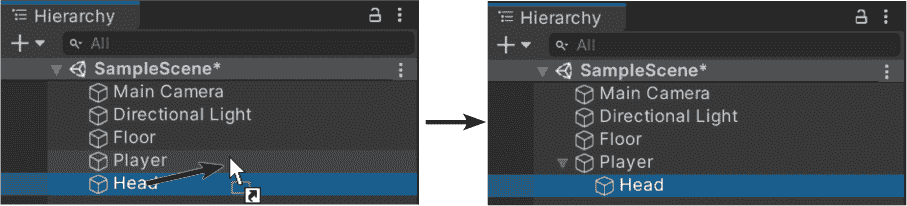

在层次视图中选择 Head。它像你创建的所有其他球体一样被创建在 (0, 0, 0)。你可以看到球体的轮廓，但由于被平面和圆柱体遮挡住了，看不到球体本身。使用检视器窗口中的 Transform 组件，**将球体的 Y 位置更改为 1.5**。现在球体出现在圆柱体上方，正好是玩家头部的位置。

现在在层次视图中选择 Player。由于其 Y 位置为 0，柱体的一半被平面遮挡住了。**将其 Y 位置设置为 1**。柱体突出平面上方。注意头部球体也随之移动了。移动 Player 会导致头部也跟随移动，因为移动父 GameObject 会同时移动其子对象—事实上，*任何*对其 Transform 组件的更改都会自动应用到子对象上。如果你缩放它，其子对象也会缩放。

切换到游戏窗口—你的玩家位于游戏区域中央。

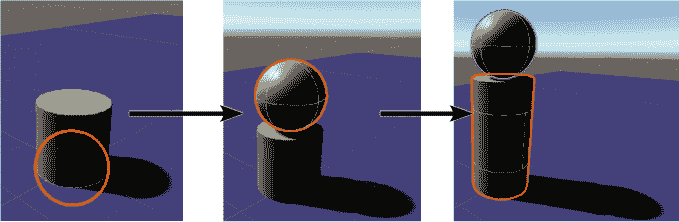

###### 注意

当你修改一个有嵌套子对象的 GameObject 的 Transform 组件时，子对象也会随之移动、旋转和缩放。

# 介绍 Unity 的导航系统

视频游戏中的最基本事情之一是移动东西。玩家、敌人、角色、物品、障碍物……所有这些东西都可以移动。这就是为什么 Unity 配备了一个复杂的基于人工智能的导航和路径查找系统，以帮助 GameObjects 移动到您的场景中。我们将利用导航系统使玩家朝一个目标移动。

Unity 的导航和路径查找系统允许您的角色智能地在游戏世界中找到自己的路。要使用它，您需要设置基本组件，以告诉 Unity 玩家可以去哪里：

+   首先，你需要告诉 Unity 你的角色可以去哪里。你可以通过**设置 NavMesh 来完成这一点**，其中包含场景中可行走区域的所有信息：坡度、楼梯、障碍物，甚至称为离网链接的点，它们允许你设置特定的玩家操作，如打开门。

+   其次，您**为需要导航的任何 GameObject 添加导航网格代理组件**。此组件自动移动 GameObject，使用其 AI 找到到目标的最有效路径并避免障碍物，选项 ally 和其他导航网格代理。

+   对于 Unity 来说，导航复杂的 NavMeshes 需要大量计算。正因为如此，Unity 有一个烘焙功能，让你提前设置 NavMesh，并预先计算（或烘焙）几何细节，以使代理工作更高效。

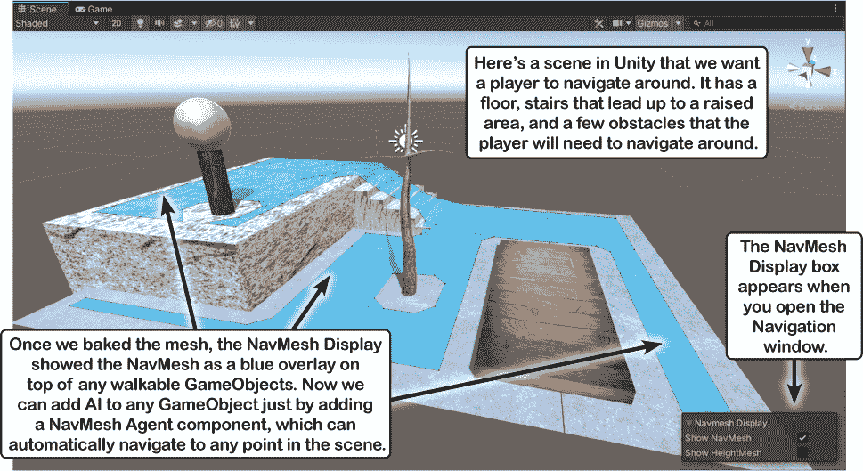

###### 注意

Unity 提供了一个复杂的 AI 导航和路径查找系统，可以实时移动 GameObjects 周围的场景，通过找到避免障碍物的有效路径。

# 设置 NavMesh

让我们设置一个仅包含地板平面的导航网格。我们将在“导航”窗口中执行此操作。**选择 AI >> 导航从窗口菜单中添加导航窗口**到你的 Unity 工作区。它应该显示为与“检查器”窗口同一面板中的标签。然后使用导航窗口**标记地面 GameObject“导航静态”和“可行走：”**

+   在导航窗口顶部按**“对象”按钮**。

+   在层   **选择“地板平面”** 在“层次结构”窗口中。

+   检查**“导航静态”复选框**。这告诉 Unity 在烘焙 NavMesh 时包含地板。

+   从“导航区域”下拉菜单中选择“可行走”。这告诉 Unity 地板平面是任何具有导航网格代理的 GameObject 可以导航的表面。

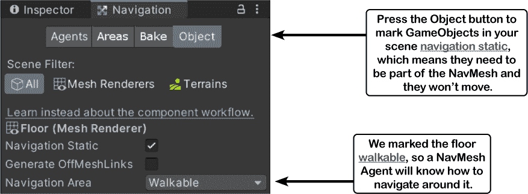

由于游戏中唯一可以行走的区域就是地板，所以在对象部分，我们已经完成了。如果场景中有很多可行走的表面或不可行走的障碍物，每个单独的 GameObject 需要被适当地标记。

在导航窗口顶部按**“烘焙”按钮**查看烘焙选项。

现在在导航窗口的底部**点击*其他* Bake 按钮**。它会短暂地变成取消，然后切换回 Bake。你注意到场景窗口有什么变化了吗？在检查器和导航窗口之间来回切换。当导航窗口处于活动状态时，场景窗口显示 NavMesh 显示，并在标记为导航静态和可行走的游戏对象上显示蓝色的叠加层。在这种情况下，它突出显示了您标记为导航静态和可行走的平面。

现在你的 NavMesh 已经设置好了。

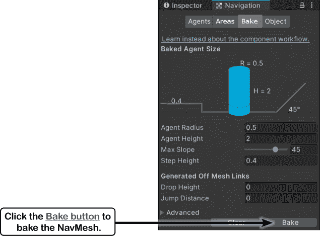

# 使你的玩家自动导航播放区域

让我们给 Player GameObject 添加一个 NavMesh Agent。在 Hierarchy 窗口中**选择 Player**，然后返回 Inspector 窗口，点击**添加组件**按钮，并选择**Navigation >> NavMesh Agent**来添加 NavMesh Agent 组件。圆柱体的身体高 2 个单位，球形头部高 1 个单位，所以你希望你的代理高度为 3 个单位——所以将高度设置为 3。现在 NavMesh Agent 已经准备好在 NavMesh 中移动 Player GameObject 了。

**创建一个脚本文件夹，并添加名为*MoveToClick.cs*的脚本**。这个脚本将允许您点击播放区域，并告诉 NavMesh Agent 将游戏对象移动到该位置。您在#encapsulation_keep_your_privateshellippr 中了解了私有字段。这个脚本将使用一个字段来存储对 NavMeshAgent 的引用，以便 GameObject 的代码可以告诉代理去哪里，因此您将调用 GetComponent 方法来获取该引用，并将其保存在名为**私有 NavMeshAgent 字段**的`agent`中：

```cs
agent = GetComponent<NavMeshAgent>();
```

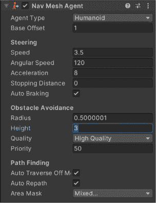

导航系统使用 UnityEngine.AI 命名空间中的类，因此您需要将此`using`行添加到*MoveToClick.cs*文件的顶部：

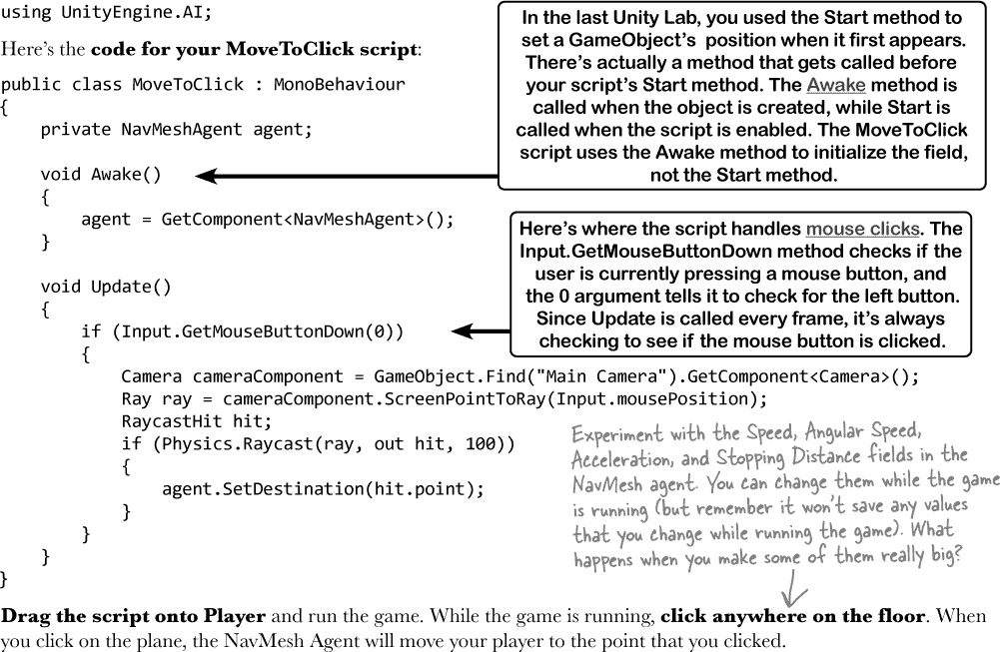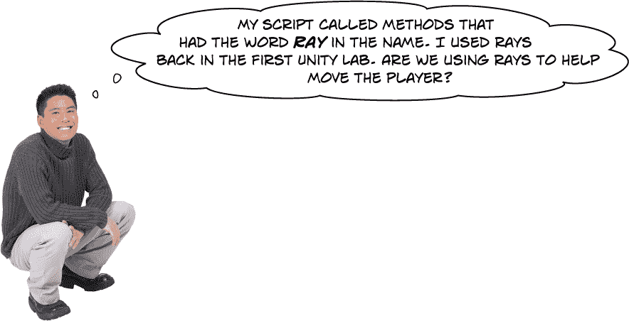

**是的！我们正在使用一个非常有用的工具，称为射线投射。**

在第二个 Unity 实验室中，您使用 Debug.DrawRay 探索了如何通过绘制从（0, 0, 0）开始的射线来工作的 3D 向量。您的 MoveToClick 脚本的 Update 方法实际上做了类似的事情。它使用**Physics.Raycast 方法**“投射”一条射线——就像您用来探索向量的那条射线一样——它从相机开始，经过用户单击的点，并**检查射线是否击中地板**。如果是，则 Physics.Raycast 方法会提供击中地板的位置。然后脚本设置 NavMesh Agent 的**destination 字段**，这会导致 NavMesh Agent**自动将玩家移动**到该位置。
