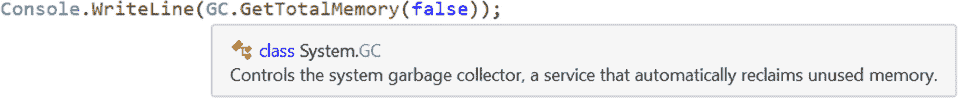
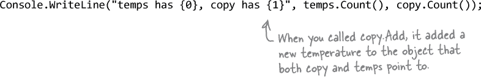
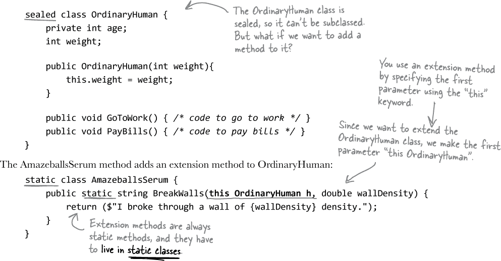

# 第十一章。卓越队长：*对象的死亡*


# 一个对象的生命周期

这里是我们对对象生命周期的快速回顾：

+   当你创建一个对象时，CLR（运行您的.NET 应用程序并管理内存）在堆上为其分配足够的内存，堆是您计算机内存的一部分，专门用于对象及其数据。

+   它被一个引用“保持活动”，可以存储在变量中，集合中，或者另一个对象的属性或字段中。

+   可以有很多引用指向同一个对象，就像你在#types_and_references_getting_the_referen 中看到的那样，当你把`lloyd`和`lucinda`引用变量指向同一个 Elephant 实例时。

+   当您取消对 Elephant 对象的最后一个引用时，CLR 会标记它进行垃圾收集。

+   最终 CLR 移除了 Elephant 对象并回收了内存，以便用于稍后您的程序将要创建的新对象实例。

现在我们将更详细地探讨所有这些点，编写一些小程序来展示垃圾收集的工作原理。

但在我们开始实验垃圾收集之前，我们需要退一步。您之前学到，对象被“标记”为垃圾收集，但实际上对象的移除可以随时发生（或永远不会！）。我们需要一种方法来知道何时对象已经被垃圾收集，并且一种强制垃圾收集发生的方法。因此，这就是我们的起点。


# 使用 GC 类（慎用）来强制垃圾收集

.NET 提供了一个控制垃圾收集器的**GC 类**。我们将使用它的静态方法，比如 GetTotalMemory，它返回一个*大致*的堆上当前*被认为*分配的字节数：



您可能会想：“为什么是*大致*的？*被认为*分配的意思是什么？垃圾收集器怎么可能不知道到底分配了多少内存？”这反映了垃圾收集的基本规则之一：您绝对可以 100%依赖垃圾收集，但***有很多未知和近似之处***。

在本章中，我们将使用几个 GC 函数：

+   GC.GetTotalMemory 返回当前*被认为*在堆上分配的字节数。

+   GC.GetTotalAllocatedBytes 返回自程序启动以来大约分配的字节数。

+   GC.Collect 强制垃圾收集器立即回收所有未引用的对象。

关于这些方法只有一件事：我们正在用它们来学习和探索，但除非你***真的***知道你在做什么，**不要在真实项目的代码中调用 GC.Collect**。.NET 垃圾收集器是一个精心调试的工程组件。一般来说，当确定何时收集对象时，它比我们聪明，并且我们应该信任它来完成它的工作。

# 你最后的机会去执行一些操作……你对象的终结器。

有时你需要确保在对象被垃圾收集之前发生一些事情，比如**释放非托管资源**。

你对象中的一个特殊方法称为**终结器**，它允许你编写当你的对象被销毁时始终执行的代码。它无论如何都会最后执行。

让我们通过终结器做一些实验。**创建一个新的控制台应用程序**，并添加带有终结器的这个类：

###### 注意

**一般来说，你不会为仅拥有托管资源的对象编写终结器。到目前为止，在本书中遇到的所有内容都是由 CLR 管理的。但是有时程序员需要访问不在 .NET 命名空间中的 Windows 资源。例如，如果你在互联网上找到带有 `[DllImport]` 的声明，你可能正在使用非托管资源。而其中一些非 .NET 资源可能会在系统中保持不稳定，如果它们没有被“清理掉”。这就是终结器的作用。**


# 什么时候确切地运行终结器？

你对象的终结器在所有引用消失之后，**但在**对象被垃圾收集之前运行。垃圾收集仅在**所有**对对象的引用消失后发生，但并不总是在最后一个引用消失后*立即*发生。

假设你有一个有引用的对象。CLR 发送垃圾收集器开始工作，它检查你的对象。但由于有对你对象的引用，垃圾收集器忽略它并继续。你的对象继续在内存中存在。

然后，发生了一些事情。持有对*你的*对象的最后一个引用的对象移除了该引用。现在你的对象在内存中，没有引用。它无法被访问。它基本上是一个**无用的对象**。

但有一件事：***垃圾收集是 CLR 控制的***，而不是你的对象。因此，如果垃圾收集器在几秒钟，甚至几分钟内没有再次启动，你的对象仍然存在于内存中。它无法使用，但它还没有被垃圾收集。**并且对象的终结器（尚未）无法运行。**

最后，CLR 再次发送垃圾收集器。它检查你的对象，发现没有引用，然后运行终结器……可能是在最后一个对对象的引用被移除或更改后的几分钟。现在它已经被终结，你的对象已经死了，收集器将其丢弃。

## 你可以建议 .NET 执行垃圾回收。

.NET 确实让你***建议***进行垃圾收集是个好主意。**大多数情况下，你不会使用这个方法，因为垃圾收集已调整为响应 CLR 中的许多条件，直接调用*并不是一个好主意***。但只是为了看看终结器是如何工作的，你可以自己调用垃圾收集，使用 GC.Collect。

但要小心。该方法并不***强制***CLR 立即垃圾回收事物。它只是说，“尽快进行垃圾收集。”

**一个对象的生命和死亡...一个时间表**

1.  **你的对象正在堆上过着它最好的生活。另一个对象引用它，使其保持存活状态。**

    

1.  **另一个对象更改它的引用，所以现在没有其他对象引用你的对象。**

    

1.  **CLR 标记你的对象进行垃圾收集。**

    

1.  **最终，垃圾收集器运行对象的终结器并从堆中移除对象。**

###### 注意

我们正在使用 GC.Collect 作为学习工具来帮助你理解垃圾收集的工作原理。你绝对不应该在非玩具程序中使用它（除非你真正理解.NET 中的垃圾收集工作原理比本书深入讨论的更多）。


# 终结器不能依赖其他对象。

当你编写一个终结器时，你不能依赖它在任何特定时间运行。即使你调用了 GC.Collect，你只是***建议***垃圾收集器运行。这并不保证会立即发生。而且一旦发生，你无法知道对象收集的顺序。

那在实际应用中意味着什么呢？想想如果你有两个对象彼此引用。如果首先收集对象＃1，那么对象＃2 对它的引用指向一个不再存在的对象。但如果首先收集对象＃2，那么对象＃1 的引用是无效的。这意味着***你不能依赖于对象终结器中的引用***。这意味着试图在终结器中执行依赖于引用有效性的操作是一个非常糟糕的主意。

## 不要为序列化使用终结器。

序列化真的是一个很好的例子，你**不应该在终结器内部执行它**。如果你的对象引用了一堆其他对象，序列化依赖于***所有***这些对象仍然存在于内存中...以及所有这些对象引用的对象，以此类推。因此，如果在进行垃圾收集时尝试序列化，你可能会因为一些对象在终结器运行之前被收集了而**丢失**程序的关键部分。

幸运的是，C#为我们提供了一个非常好的解决方案：IDisposable。任何可能修改你的核心数据或依赖于其他对象存在于内存中的事情都应该作为 Dispose 方法的一部分而不是终结器的一部分。

有些人喜欢把终结器看作是 Dispose 方法的一种故障安全机制。这是有道理的——你在 Clone 对象中看到，仅仅因为你实现了 IDisposable，并不意味着对象的 Dispose 方法会被调用。但你需要小心——如果你的 Dispose 方法依赖于堆上的其他对象，那么在终结器中调用 Dispose 可能会导致问题。解决这个问题的最佳方法是，确保**始终使用`using`语句**来创建 IDisposable 对象。

**从相互引用的两个对象开始。**


**如果堆上的所有其他对象删除对对象＃1 和＃2 的引用，它们都将被标记为收集。**


**如果对象＃1 先被收集，那么当 CLR 运行对象＃2 的终结器时，它的数据将不可用。**


**另一方面，对象＃2 可能在对象＃1 之前消失。你无法知道顺序。**


**这就是为什么一个对象的终结器不能依赖于堆上任何其他对象仍然存在。**


今晚的辩论：**Dispose 方法和终结器争夺谁对你，作为 C#开发者更有价值**。

| **Dispose：** | **Finalizer：** |
| --- | --- |
| 老实说，我被邀请来这里有点惊讶。我以为编程界已经达成共识。我的意思是，作为 C#工具，我显然比你更有价值。真的，你相当脆弱。你甚至不能依赖于其他对象在你被调用时仍然存在。相当不稳定，不是吗？ | 对不起？真是滑稽。我“脆弱”？好吧。嗯，我本来不想降到这种水平，但既然我们已经这么做了……至少我不需要一个接口才能开始工作。没有 IDisposable 接口，嗯，面对现实吧……你只是另一个无用的方法而已。 |
| 之所以有一个特定的接口**因为**我如此重要。事实上，它里面只有一个方法！ | 对，对……继续骗自己吧。如果有人在实例化对象时忘记使用`using`语句会发生什么？那时你就会不见踪影了。 |
| 好吧，你说得对，程序员需要知道他们将需要我，要么直接调用我，要么使用`using`语句调用我。但他们总是知道我何时运行，并且可以利用我来做任何需要清理对象后的工作。我功能强大、可靠且易于使用。我是三重威胁。而你呢？没有人确切知道你何时运行，或者当你最终决定出现时应用程序的状态如何。 | 但如果你需要在对象被垃圾收集之前的最后一刻做些事情，没有我是不可能的。我可以释放网络资源和 Windows 句柄以及其他可能会导致应用程序出问题的任何东西。我可以确保你的对象更优雅地处理被丢弃的情况，这一点不容小觑。句柄是你的程序在绕过.NET 和 CLR 直接与 Windows 交互时使用的。由于.NET 不知道它们，因此不能为你清理它们。 |
| 你以为你很厉害，因为你总是与 GC 一起运行，但至少我可以依赖其他对象。 | 是的，朋友，但我总是运行。你需要别人来帮你运行。我不需要任何人或任何东西！ |


# 结构体看起来像一个对象...

我们一直在谈论堆，因为那是你的对象所在的地方。但这不是对象居住的唯一内存部分。在.NET 中我们还没有多谈到的一种类型是*结构体*，我们将用它来探索 C#中生命和死亡的另一个方面。结构体简称为**结构**，结构体看起来很像对象。它们有字段和属性，就像对象一样。你甚至可以将它们传递给以对象类型参数为参数的方法：


## ...但并不是一个对象。

但结构体***不是***对象。它们*可以*有方法和字段，但是它们*不能*有终结器。它们也不能从类或其他结构体继承，或者有类或结构体从它们继承—你可以在结构体的声明中使用冒号:运算符，但只能跟着一个或多个接口。


###### 注

**所有结构体都扩展自 System.ValueType，而 System.ValueType 又扩展自 System.Object。这就是为什么每个结构体都有一个 ToString 方法—它从 Object 那里继承而来。但这是结构体被允许做的唯一继承。**

> **对象的力量在于它们通过继承和多态来模仿现实世界的行为。**
> 
> **结构体最适合用于存储数据，但继承和引用的缺失可能是一个严重的限制。**

# 值被复制；引用被赋值

我们已经看到引用对于垃圾收集是多么重要——重新分配最后一个引用给一个对象，它就会被标记为待收集。但我们也知道，这些规则对于值来说并不完全合理。如果我们想更好地了解对象和值在 CLR 内存中是如何存活和死亡的，我们需要更仔细地看一看值和引用：它们如何相似，更重要的是，它们如何不同。

你已经知道一些类型如何与其他类型不同。一方面，你有像 int、bool 和 decimal 这样的**值类型**。另一方面，你有像 List、Stream 和 Exception 这样的**对象**。它们的工作方式并不完全相同，是吧？

当你使用等号将一个值类型变量设置为另一个时，它**复制了值**，之后这两个变量不再连接到彼此。另一方面，当你使用等号与引用时，你所做的是**指向同一个对象的两个引用**。

+   变量声明和赋值在值类型和对象类型中的工作方式相同：

    

+   但是一旦你开始赋值，你就能看到它们之间的不同。所有值类型都通过复制来处理。这是一个例子——这应该是熟悉的内容：

    

    这里的输出显示`fifteenMore`和`howMany`实际上***没有***连接：

+   但正如我们所知，当涉及到对象时，你是在赋予引用而不是值：

    

因此，改变列表意味着两个引用都看到更新，因为它们都指向同一个列表对象。通过写一行输出来验证这一点：



这里的输出表明`copy`和`temps`实际上指向***同一个***对象：

```cs
temps has 3, copy has 3
```

# 结构体是值类型；对象是引用类型

让我们更仔细地看看结构体的工作原理，这样你就可以开始理解何时可能需要使用结构体而不是对象。当你创建一个结构体时，你正在创建一个**值类型**。这意味着当你使用等号将一个结构体变量设置为另一个时，你在新变量中创建了一个全新的*副本*。因此，即使结构体*看起来*像一个对象，它并不像一个对象那样行事。

***就这样！***

1.  **创建一个名为 Dog 的结构体。**

    这是一个简单的结构体，用来追踪一只狗。它看起来就像一个对象，但实际上不是。将其添加到一个**新的控制台应用程序中：**

    ```cs
      public struct Dog {

        public string Name { get; set; }
        public string Breed { get; set; }

        public Dog(string name, string breed) {
          this.Name = name;
          this.Breed = breed;
        }

        public void Speak() {
            Console.WriteLine("My name is {0} and I’m a {1}.", Name, Breed);
        }
      }
    ```

1.  **创建一个名为 Canine 的类。**

    制作一份完全相同的 Dog 结构体的副本，除了用 class 替换 struct，然后用 Canine 替换 Dog。不要忘记重命名 Dog 的构造函数。现在你将拥有一个几乎完全等同于 Dog 结构体的 Canine *类*，你可以玩弄一下。

1.  **添加一个 Main 方法来创建一些 Dog 和 Canine 数据的副本。**

    这是 Main 方法的代码：

    ```cs
      Canine spot = new Canine("Spot", "pug");
      Canine bob = spot;
      bob.Name = "Spike";
      bob.Breed = "beagle";
      spot.Speak();
      Dog jake = new Dog("Jake", "poodle");
      Dog betty = jake;
      betty.Name = "Betty";
      betty.Breed = "pit bull";
      jake.Speak();
    ```

1.  **在运行程序之前……**

    写下你认为在运行这段代码时将会被输出到控制台的内容：

    ...................................................................................

    ...................................................................................


## 这就是发生的事情......

`bob` 和 `spot` 引用都指向同一个对象，因此它们都更改了相同的字段并访问了相同的 Speak 方法。但是结构体不是这样工作的。当您创建`betty`时，您复制了`jake`中的数据。这两个结构体是完全独立的。


###### 注意

**当您将一个结构体设置为另一个结构体时，您正在创建数据内部的一个新的复制。这是因为结构体是一个值类型（而不是对象或引用类型）。**

# 栈 vs. 堆：更多关于内存的信息

让我们快速回顾一下结构体与对象的区别。您已经看到，只需使用等号就可以制作结构体的新副本，而这是您无法用对象做到的。但背后的真正情况又是怎样的呢？

CLR 将数据分为内存的两个地方：堆和栈。您已经知道对象存储在**堆**上。CLR 还保留了另一个内存部分称为`栈`，用于存储您在方法中声明的局部变量和传递给这些方法的参数。您可以将栈视为一堆可以放置值的槽。当调用方法时，CLR 会向栈顶添加更多槽。当方法返回时，它的槽会被移除。


**了解通过值复制的结构体与通过引用复制的对象之间的不同是非常重要的。**

有时您需要编写一个方法，可以接受值类型***或者***引用类型 —— 也许是可以处理 Dog 结构体或 Canine 对象的方法。如果您发现自己处于这种情况下，可以使用`object`关键字：

```cs
   public void WalkDogOrCanine(object getsWalked) { ... }
```

如果您向此方法发送一个结构体，该结构体会被**包装**成一个特殊的“包装器”对象，使其可以存储在堆上。当包装器在堆上时，您无法对结构体做太多操作。您需要“拆包”结构体才能处理它。幸运的是，当您将一个对象设置为值类型或将值类型传递给一个期望对象的方法时，所有这些操作都会*自动*发生。

###### 注意

您还可以使用“is”关键字来查看一个对象是否是被装箱并放置在堆上的结构体或任何其他值类型。

1.  这是在您创建一个对象变量并将其设置为 Dog 结构体后，栈和堆看起来的样子。

    ```cs
    Dog sid = new Dog("Sid", "husky");
    WalkDogOrCanine(sid);
    ```

    

1.  如果您想要**解包对象**，您只需要将其强制转换为正确的类型，它会自动解包。`is`关键字对结构体也可以正常工作，但要小心，因为`as`关键字不适用于值类型。

    ```cs
    if (getsWalked is Dog doggo) doggo.Speak();
    ```

    


###### 注意

**打开 Unity 项目并悬停在 Vector3 上——它是一个 struct。垃圾收集（或 GC）可能会严重降低应用程序的性能，而游戏中的许多对象实例可能会触发额外的 GC 并降低帧速率。游戏通常会使用大量向量。将它们设为 struct 意味着它们的数据保存在堆栈上，因此即使创建数百万个向量也不会导致额外的 GC，从而降低游戏的运行速度。**

# 使用`out`参数使方法返回多个值

谈到参数和参数，还有几种将值传递到程序中的方法。它们都涉及向方法声明中添加**修饰符**。其中一种常见的方法是使用**`out`修饰符**指定输出参数。你已经多次见过`out`修饰符——每次调用 int.TryParse 方法时都会用到它。你也可以在自己的方法中使用`out`修饰符。创建一个新的控制台应用程序，并将这个空方法声明添加到表单中。注意这两个参数上的`out`修饰符：

***做这个！***


###### 注意

**通过使用 out 参数，一个方法可以返回多个值。**

仔细看看这两个错误：

+   *‘half’ 输出参数必须在控制离开当前方法之前赋值*

+   *‘twice’ 输出参数必须在控制离开当前方法之前赋值*

每当使用`out`参数时，你***总是***需要在方法返回之前设置它，就像你总是需要在方法声明中使用`return`语句一样。

这是应用程序的所有代码：


当你运行应用程序时，看看它是什么样子：

```cs
Enter a number: 17
Outputs: plus one = 18, half = 8.50, twice = 34
```

# 使用`ref`修饰符进行引用传递

你一直见过的一件事是，每次你把 int、double、struct 或任何其他值类型传递给一个方法时，你都在把该值的副本传递给该方法。这有一个名称：**按值传递**，这意味着参数的整个值都会被复制。

但是还有另一种将参数传递给方法的方式，称为**按引用传递**。你可以使用`**ref**`关键字允许方法直接使用传递给它的参数。与`out`修饰符一样，当声明方法和调用方法时都需要使用`**ref**`。无论是值类型还是引用类型，通过`ref`参数传递给方法的任何变量都将直接被该方法改变。

要查看它是如何工作的，请创建一个新的控制台应用程序，其中包含这个 Guy 类和这些方法：

###### 注意

在底层，一个“out”参数就像一个“ref”参数，唯一的区别是它在进入方法之前不需要被赋值，但在方法返回之前必须被赋值。


# 使用可选参数来设置默认值

很多时候，你的方法将会以相同的参数被多次调用，但是偶尔会改变。如果你能设置一个*默认值*，那么当调用方法时只需要在参数不同的时候指定它就足够了。

这正是**可选参数**的作用。你可以通过在方法声明中使用等号后跟该参数的默认值来指定一个可选参数。你可以拥有任意数量的可选参数，但所有的可选参数都必须在必需参数之后。

这是一个使用可选参数检查某人是否发烧的方法示例：


此方法有两个可选参数：`tooHigh` 的默认值为 99.5，`tooLow` 的默认值为 96.5。调用 CheckTemperature 时只传递一个参数将使用这两个参数的默认值。如果你传递两个参数，它将使用第二个参数作为 `tooHigh` 的值，但仍然使用 `tooLow` 的默认值。你可以指定所有三个参数来为所有三个参数传递值。

如果你想使用一些（但不是所有）默认值，你可以使用**命名参数**来仅传递你想传递的那些参数的值。你只需要给出每个参数的名称，后跟一个冒号和它的值。如果你使用多个命名参数，请确保用逗号分隔它们，就像任何其他参数一样。

**将 CheckTemperature 方法添加到控制台应用程序**，然后添加这个 Main 方法：

```cs
static void Main(string[] args)
{
    // Those values are fine for your average person
    CheckTemperature(101.3);

    // A dog’s temperature should be between 100.5 and 102.5 Fahrenheit
    CheckTemperature(101.3, 102.5, 100.5);

    // Bob’s temperature is always a little low, so set tooLow to 95.5
    CheckTemperature(96.2, tooLow: 95.5);
}
```

它打印出这个输出，根据可选参数的不同值而有不同的工作方式：

```cs
Uh-oh 101.3 degrees F -- better see a doctor!
101.3 degrees F - feeling good!
96.2 degrees F - feeling good!
```

> **在希望方法具有默认值时，请使用可选参数和命名参数。**

# 空引用不指向任何对象。

当你创建一个新的引用并且没有设置它的值时，它有一个值。它最初设置为`**null**`，这意味着它不指向任何东西。让我们来实验一下空引用。

***就这样吧！***

1.  **创建一个新的控制台应用程序**，并添加你用来实验 `ref` 关键字的 Guy 类。

1.  然后**添加以下代码**，创建一个新的 Guy 对象，但是*不设置其 Name 属性*：

    ```cs
    static void Main(string[] args)
    {
        Guy guy;
        guy = new Guy() { Age = 25 };
        Console.WriteLine("guy.Name is {0} letters long", guy.Name.Length);
    }
    ```

1.  **在 Main 方法的最后一行上设置断点**，然后调试你的应用程序。

    当它遇到断点时，**悬停在`guy`上**以检查其属性值：

    

    ###### 注意

    String 是一个引用类型。由于你没有在 Guy 对象中设置它的值，所以它仍然保持默认值：null。

1.  **继续运行代码。** Console.WriteLine 尝试访问 guy.Name 属性引用的 String 对象的 Length 属性，并抛出异常：

    

    ###### 注意

    **当 CLR 抛出 NullReferenceException（开发人员通常称之为 NRE）时，它告诉你它试图访问对象的成员，但用于访问该成员的引用为 null。开发人员尽量避免空引用异常。**

# 非可空引用类型帮助你避免 NRE

避免空引用异常（或者 NRE）的最简单方法是**设计代码以使引用不能为 null**。幸运的是，C#编译器为此提供了一个非常有用的工具。在 Guy 类的顶部添加以下代码——可以放在命名空间声明的内部或外部：

```cs
#nullable enable
```

以#开头的行是一个**指令**，或者说是告诉编译器设置特定选项的一种方式。在这种情况下，它告诉编译器将任何引用视为**非可空引用类型**。一旦添加了该指令，Visual Studio 会在 Name 属性下方绘制一个警告波浪线。将鼠标悬停在属性上以查看警告：


C#编译器做了一件非常有趣的事情：它使用了*流分析*（或者说一种分析代码中各种路径的方法）来确定***Name 属性有可能被赋予空值***。这意味着你的代码可能会抛出 NullReferenceException。

你可以通过在类型后添加`?`字符来强制 Name 属性成为**可空引用类型**，从而消除警告。


但是虽然这样可以消除错误消息，却并不能真正防止任何异常。

## 使用封装来防止属性为空

回到#encapsulation_keep_your_privateshellippr，你学习了如何使用封装来保持类成员不受无效值的影响。因此，将 Name 属性设为私有，然后添加一个构造函数来设置其值：


一旦封装了 Name 属性，就可以防止其被设置为`null`，这样警告就消失了。

# 空合并运算符 ?? 对空值有帮助

有时候无法避免与空值一起工作。例如，你已经学习了如何使用 StringReader 从字符串中读取数据，详见#reading_and_writing_files_save_the_last。创建一个新的控制台应用程序，并添加以下代码：


运行代码——你会得到一个 NRE。我们能做些什么来解决这个问题？

## ?? 检查 null 并返回替代值

防止访问（或者**解引用**）空引用的一种方法是使用**空合并运算符** **??** 来评估可能为空的表达式——在本例中是调用 stringReader.ReadLine，并在其为空时返回替代值。修改`using`块的第一行，在行末添加`?? String.Empty`：


一旦添加了这个，警告就会消失。这是因为 null 合并运算符告诉 C#编译器执行 stringReader.ReadLine；如果返回的值不为 null，则使用它，但如果为 null，则使用您提供的值（在本例中为空字符串）。

## ??=仅在变量为 null 时赋值

当您处理 null 值时，编写代码检查值是否为 null 并将其赋予非 null 值以避免 NRE 是非常常见的。例如，如果您想要修改程序以打印第一行代码，您可能会编写如下代码：

```cs
     if (nextLine == null)
         nextLine = "(the first line is null)";

     // Code that works with nextLine and needs it to be non-null
```

你可以使用**null 赋值** **??=**运算符重写该条件语句：

```cs
        nextLine ??= "(the first line was empty)";
```

??=运算符检查表达式左侧的变量、属性或字段（在本例中是 nextLine），看看它是否为 null。如果是，该运算符将右侧表达式的值赋给它。如果不是，则保留原值。

# 可空值类型可以是 null...并且可以安全处理

当你声明一个 int、bool 或其他值类型时，如果没有指定值，CLR 会为它分配一个默认值，如 0 或 true。但假设你正在编写代码来存储调查数据，其中有一个可选的是/否问题。如果需要表示可能为 true 或 false，或者根本没有值的布尔值，该怎么办？

这就是**可空值类型**非常有用的地方。可空值类型可以具有值或设置为 null。它利用了一个泛型结构 Nullable<T>，可以用来***包装***一个值（或包含该值并提供成员以访问和处理它）。如果将可空值类型设置为 null，则它没有值——Nullable<T>为您提供了方便的成员，让您*即使在这种情况下*也可以安全地使用它。

您可以像这样声明一个可空布尔值：

```cs
    Nullable<bool> optionalYesNoAnswer = null;
```

C#还有一个快捷方式——对于值类型 T，您可以像这样声明 Nullable<T>：**T?**。

```cs
    bool? anotherYesNoAnswer = false;
```

可空类型`Nullable<T>`结构有一个名为 Value 的属性，用于获取或设置值。bool?将具有 bool 类型的值，int?将具有 int 类型的值，等等。它们还有一个名为 HasValue 的属性，如果值不为 null 则返回 true。

您始终可以将值类型转换为可空类型：

```cs
    int? myNullableInt = 9321;
```

并且您可以使用其方便的 Value 属性获取值：

```cs
    int = myNullableInt.Value;
```


但是 Value 调用最终只是使用`(int)myNullableInt`将值强制转换，如果值为 null，它将引发 InvalidOperationException。这就是为什么 Nullable<T>还有一个 HasValue 属性，如果值不为 null 则返回 true，否则返回 false。您还可以使用方便的 GetValueOrDefault 方法，如果 Nullable 没有值，则安全地返回默认值。您可以选择传递一个默认值来使用，或者使用类型的正常默认值。

# “Captain” Amazing...not so much

到目前为止，您应该对不那么强大、更疲惫的“Captain Amazing”发生了什么有了相当好的了解。事实上，那根本不是 Captain Amazing，而是一个装箱结构：


> **结构体对封装可能是有价值的，因为返回结构体的只读属性总是生成它的新副本。**

# 池子拼图

你的 **任务** 是从池子中取出片段，并将它们放入代码的空白行中。你**可以**多次使用相同的片段，而且你不需要使用所有的片段。你的**目标**是在执行此应用程序时，使代码将下面显示的输出写入控制台。


# 池子拼图解


# 扩展方法向**现有的类**添加新行为

有时你需要扩展一个无法继承的类，比如封闭类（许多 .NET 类都是封闭的，所以你无法从它们继承）。而 C# 给了你一个灵活的工具：**扩展方法**。当你将一个具有扩展方法的类添加到你的项目中时，它会**添加新的方法，这些方法出现在已经存在的类上**。你所需做的就是创建一个静态类，并添加一个静态方法，该方法以该类的实例作为其第一个参数，使用 `this` 关键字。

###### 注意

记住来自 #interfacescomma_castingcomma_and_quotati 的封闭修饰符吗？它是你设置一个无法被扩展的类的方法。

所以假设你有一个封闭的 OrdinaryHuman 类：



一旦 AmazeballsSerum 类被添加到项目中，OrdinaryHuman 就会获得一个 BreakWalls 方法。因此，现在你的 Main 方法可以使用它：

```cs
static void Main(string[] args){
    OrdinaryHuman steve = new OrdinaryHuman(185);
    Console.WriteLine(steve.BreakWalls(89.2));
}
```

就是这样！你所需做的就是将 AmazeballsSerum 类添加到你的项目中，突然间每个 OrdinaryHuman 类都会得到一个全新的 BreakWalls 方法。

###### 注意

**当程序创建 OrdinaryHuman 类的实例时，只要 AmazeballsSerum 类存在于项目中，就可以直接访问 BreakWalls 方法。继续，试试看吧！创建一个新的控制台应用程序，并将这两个类和 Main 方法添加进去。调试进入 BreakWalls 方法，看看发生了什么。**

***嗯... 书中稍早我们通过向我们的代码顶部添加 `using` 指令来“神奇地”向类添加了方法。你还记得那是在哪里吗？***

###### 注意

关于扩展方法还有一点需要记住：通过创建扩展方法，你不会访问类的任何内部内容，因此它仍然像一个局外人一样工作。


**是的！LINQ 是基于扩展方法的。**

除了扩展类之外，你还可以扩展**接口**。你所需做的就是在扩展方法的第一个参数的 `this` 关键字之后使用一个接口名称。扩展方法将被添加到**实现该接口的每个类**中。这正是 .NET 团队在创建 LINQ 时所做的——所有 LINQ 方法都是 IEnumerable<T> 接口的静态扩展方法。

它的工作原理如下。当你在代码顶部添加`using System.Linq;`时，它会让你的代码“看到”一个名为 System.Linq.Enumerable 的静态类。你已经使用了它的一些方法，比如 Enumerable.Range，但它还有扩展方法。去 IDE 中输入`Enumerable.First`，然后查看声明。它以`(extension)`开头，告诉你它是一个扩展方法，它的第一个参数使用了`this`关键字，就像你写的扩展方法一样。对于每个 LINQ 方法，你会看到相同的模式。


# 扩展基本类型：字符串

让我们通过扩展 String 类来探索扩展方法的工作原理。**创建一个新的控制台应用程序项目**，并添加一个名为*HumanExtensions.cs*的文件。

做这个！

1.  **将所有扩展方法放在单独的命名空间中。**

    将你所有的扩展方法放在一个不同的命名空间中是一个好主意。这样，你就不会在其他程序中使用它们时遇到麻烦。为你的方法设置一个静态类来存放：

    

1.  **创建静态扩展方法，并将其第一个参数定义为 this，然后是你要扩展的类型。**

    当你声明一个扩展方法时，你需要知道的两件主要事情是，方法必须是静态的，并且它将扩展的类作为它的第一个参数：

    

1.  **完成扩展方法。**

    这个方法检查字符串是否包含单词“Help!”——如果包含，那么这个字符串就是一个求助呼叫，每个超级英雄都会答应：

    

1.  **使用你的新 IsDistressCall 扩展方法。**

    在你的 Program 类文件顶部添加`using AmazingExtensions;`。然后在类中添加代码，创建一个字符串并调用它的 IsDistressCall 方法。你会在 IntelliSense 窗口中看到你的扩展方法：

    

# 扩展磁铁


排列磁铁以产生此输出：

**一个铜板生更多的铜板**


# 扩展磁铁解决方案


你的工作是排列磁铁以产生此输出：

**一个铜板生更多的铜板**


