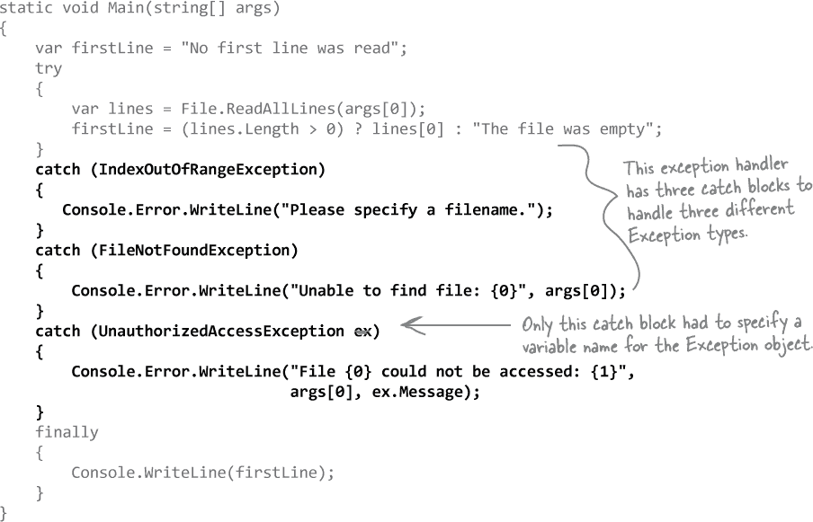

# 第十二章\. 异常处理：*处理异常开始变得老套*


**程序员不应该成为消防员。**

你努力工作，浏览技术手册和一些引人入胜的*Head First*图书，最终成为你职业生涯的顶峰。但你仍然在半夜因为**程序崩溃**或**行为不符合预期**而接到恐慌的电话。没有什么能像修复一个奇怪的错误那样让你从编程状态中脱颖而出...但是通过**异常处理**，你可以编写代码来**处理出现的问题**。更重要的是，你甚至可以为这些问题做好准备，并在问题发生时**保持系统运行**。

# 你的十六进制转储程序从命令行读取文件名

在 #reading_and_writing_files_save_the_last 结尾，你构建了一个十六进制转储程序，该程序使用命令行参数转储任何文件。你使用 IDE 中的项目属性设置调试器的参数，并学习了如何从 Windows 命令提示符或 macOS Terminal 窗口调用它。


## 但是如果你给 HexDump 一个无效的文件名会发生什么？

当你修改你的 HexDump 应用程序以使用命令行参数时，我们要求你务必指定一个有效的文件名。当你提供一个无效的文件名时会发生什么？尝试再次从命令行运行你的应用程序，但这次给它传递参数 **`invalid-filename`**。现在它***抛出一个异常***。


使用项目设置将程序的参数设置为一个无效的文件名，并在 IDE 的调试器中运行应用程序。现在你会看到它抛出一个异常，类名相同（System.IO.FileNotFoundException），并显示类似的“找不到文件”的消息。


###### 注意

**实际上，你不会连续遇到所有这些异常 —— 程序会抛出第一个异常然后停止。只有在修复第一个异常后才会遇到第二个异常。**

# 当你的程序抛出一个异常时，CLR 会生成一个异常对象

你一直在研究 CLR 在程序中告诉你出了问题的方式：一个**异常**。当你的代码中发生异常时，会创建一个对象来表示这个问题。这就是——毫不奇怪——异常。

例如，假设你有一个包含四个项目的数组，然后你尝试访问第 16 个项目（由于我们是以零为基础的，所以索引是 15）：


###### 注意

ex-cep-tion，名词。

一个被排除在一般声明之外或不遵循规则的人或物。*尽管杰米通常讨厌花生酱，他们对帕克的花生酱夹心薄片**做了个例外**。*

当 IDE 因为代码抛出异常而停止时，你可以通过在 Locals 窗口中**展开`$exception`**来查看异常的详细信息。Locals 窗口显示当前范围内的所有变量（这意味着当前语句可以访问它们）。

CLR 会创建一个对象，因为它想要提供有关引发异常的所有信息。你可能需要修复代码，或者只需对程序中的特定情况进行一些更改。

这个特定的异常是**IndexOutOfRangeException**，它告诉你问题所在：你正在尝试访问数组中超出范围的索引。你还可以获取有关问题发生位置的详细信息，这使得跟踪和解决问题变得更容易（即使你的代码有数千行）。

# 所有的异常对象都继承自 System.Exception

.NET 有许多不同的异常可能需要报告。由于许多异常具有许多相似的特征，因此继承起了作用。.NET 定义了一个基类叫做 Exception，所有特定的异常类型都从这个基类继承。

Exception 类有几个有用的成员。Message 属性存储了关于出错原因的易读信息。StackTrace 告诉你在异常发生时正在执行的代码以及导致异常的过程。（还有其他的，但我们首先使用这些。）


**没错。异常是一个非常有用的工具，可以帮助你找到代码行为不符合预期的地方。**

很多程序员第一次看到异常时会感到沮丧。但是异常是非常有用的，你可以利用它们来优化你的程序。当你看到异常时，它提供了很多线索，帮助你找出代码为什么会以你意料之外的方式反应。这对你有好处：它让你知道程序必须处理的新情况，并为你提供了**解决问题的机会**。

> **异常主要是帮助你找到并修复代码表现出意料之外行为的情况。**

# 有一些文件你是无法转储的

在#linq_and_lambdas_get_control_of_your_dat 中，我们讨论了如何使你的代码更加**健壮**，以便处理不良数据、格式错误的输入、用户错误和其他意外情况。如果没有通过命令行传递文件或文件不存在，则倒置 stdin 是使十六进制转储器更加健壮的一个很好的起点。

但是还有一些情况需要我们处理吗？例如，如果文件存在但不可读怎么办？让我们看看如果我们移除文件的读取权限，然后尝试读取会发生什么：

+   ***在 Windows 上：*** 在 Windows 资源管理器中右键点击文件，转到安全选项卡，然后点击编辑以修改权限。勾选所有的拒绝框。

    

+   ***在 Mac 上：*** 在终端窗口中，切换到包含要转储文件的文件夹，并运行以下命令，将`binarydata.dat`替换为你的文件名：`chmod 000 binarydata.dat.`

现在你已经从文件中删除了读取权限，尝试再次运行你的应用程序，可以在 IDE 中或从命令行中执行。

你会看到一个异常—堆栈跟踪显示**`using`语句调用了 GetInputStream 方法**，最终导致 FileStream 抛出了 System.UnauthorizedAccessException 异常：

```cs
C:\HexDump\bin\Debug\netcoreapp3.1>hexdump binarydata.dat
Unhandled exception. System.UnauthorizedAccessException: Access to the path ’C:\HexDump\bin\Debug\
netcoreapp3.1\binarydata.dat’ is denied.
   at System.IO.FileStream.ValidateFileHandle(SafeFileHandle fileHandle)
   at System.IO.FileStream.CreateFileOpenHandle(FileMode mode, ..., FileOptions options)
   at System.IO.FileStream..ctor(String path, ..., Int32 bufferSize, FileOptions options)
   at System.IO.FileStream..ctor(String path, FileMode mode, FileAccess access, FileShare share)
   at System.IO.File.OpenRead(String path)
   at HexDump.Program.GetInputStream(String[] args) in C:\HexDump\Program.cs:line 14
   at HexDump.Program.Main(String[] args) in C:\HexDump\Program.cs:line 20
```


**实际上，对此是*有*办法的。**

是的，用户确实经常出错。他们会向你的程序提供糟糕的数据，奇怪的输入，点击你甚至不知道存在的东西。这是生活的一部分，但这并不意味着你无法应对。C#为你提供了非常有用的**异常处理工具**，帮助你使程序更加健壮。因为虽然你*不能*控制用户如何使用你的应用程序，但你*可以*确保他们这样做时你的应用程序不会崩溃。

# 当你想调用的方法存在风险时会发生什么？

用户是不可预测的。他们会将各种奇怪的数据输入到你的程序中，并以你意想不到的方式点击东西。这没问题，因为你可以通过添加**异常处理**来处理代码抛出的异常，从而执行特殊的代码。

1.  **假设你的程序中调用的方法接受用户输入。**

    

1.  **那个方法可能会在运行时出现风险。**

    

1.  **你需要知道你调用的方法是有风险的。**

    

    ###### 注意

    如果你能想出一种避免抛出异常的风险较小的方法，那就是最好的结果！但有些风险是无法避免的，这时候你就需要这样做。

1.  **然后，如果异常发生，你可以编写代码来*处理*异常。务必做好准备，以防万一。**

    

# 使用 try 和 catch 处理异常

当你在代码中添加异常处理时，你会使用`try`和`catch`关键字创建一个代码块，该代码块在抛出异常时执行。

你的*try/catch*代码基本上告诉 C#编译器：“**试试**这段代码，如果出现异常，**用**这段*其他*代码**捕获**它。”你试图的代码部分是`try`**块**，处理异常的部分称为`catch`**块**。在`catch`块中，你可以做一些事情，比如打印友好的错误消息，而不是让程序停止运行。

让我们再来看看 HexDump 场景中堆栈跟踪的最后三行，帮助我们确定在哪里放置我们的异常处理代码：

```cs
   at System.IO.File.OpenRead(String path)
   at HexDump.Program.GetInputStream(String[] args) in Program.cs:line 14
   at HexDump.Program.Main(String[] args) in Program.cs:line 20
```

`UnauthorizedAccessException`是由调用`File.OpenRead`的`GetInputStream`中的那一行引起的。由于我们无法阻止该异常，让我们修改`GetInputStream`以使用*try/catch*块：


在我们的异常处理程序中保持简单。首先，我们使用 Console.Error 写入了一行到错误输出(stderr)，告知用户发生了错误，然后我们回退到从标准输入读取数据，以便程序仍然执行某些操作。注意`catch`块中有一个`return`语句。该方法返回一个流，因此如果处理异常，则仍需要返回一个流；否则，您将会得到“not all code paths return a value”编译器错误。

# 使用调试器跟踪 try/catch 流程

异常处理的重要部分是，当`try`块中的语句抛出异常时，块中的其余代码会被**短路**。程序立即跳转到`catch`块中的第一行。让我们使用 IDE 的调试器来探索这是如何工作的。

***调试这个！***

1.  将您的 HexDump 应用程序中的 GetInputStream 方法替换为我们刚刚展示的方法，以处理 UnauthorizedAccessException。

1.  修改项目选项，将参数设置为包含不可读文件的路径。

1.  在 GetInputStream 的第一条语句上设置断点，然后开始调试您的项目。

1.  当程序运行到断点时，跳过接下来的几个语句，直到到达`File.OpenRead`。继续执行——应用程序跳转到`catch`块的第一行。

    

1.  继续逐步执行`catch`块的其余部分。它将向控制台写入一行，然后返回 Console.OpenStandardInput 并恢复 Main 方法。

# 如果您有代码始终需要运行，请使用 finally 块

当程序抛出异常时，可能会发生几件事情。如果异常***未***被处理，程序将停止处理并崩溃。如果异常***被***处理，代码将跳转到`catch`块。那么`try`块中的其余代码呢？如果您正在关闭流或清理重要资源怎么办？该代码需要运行，即使发生异常，否则程序状态将混乱。这就是您将使用`**finally 块**`的地方。它位于`try`和`catch`之后。`**finally**`块始终运行，无论是否抛出异常。让我们使用调试器来探索`finally`块的工作原理。

***调试这个！***

1.  **创建一个新的控制台应用程序项目。**

    在文件顶部添加`using System.IO;`，然后添加以下`Main`方法：

    

    ###### 注意

    您将在 Locals 窗口中看到异常，就像您之前看到的那样。

1.  **在 Main 方法的第一行添加断点。**

    调试你的应用程序并逐步执行它。`try`块中的第一行尝试访问`args[0]`，但由于您没有指定任何命令行参数，`args`数组为空，它会抛出一个异常——具体来说，是`System.IndexOutOfRangeException`，并显示消息*“Index was outside the bounds of the array.”* 在打印消息后，它**执行** `**finally**` **块**，然后程序退出。

1.  **设置一个带有有效文件路径的命令行参数。**

    使用项目属性向应用程序传递命令行参数。给它一个有效文件的完整路径。确保文件名中没有空格，否则应用程序会将其解释为两个参数。再次调试你的应用程序——在完成`try`块后，它**执行** `**finally**` **块**。

1.  **设置一个带有无效文件路径的命令行参数。**

    返回到项目属性，更改命令行参数，将应用程序命名为不存在的文件。再次运行你的应用程序。这次它捕获了不同的异常：`System.IO.FileNotFoundException`。然后它**执行** `**finally**` **块**。

# 通用异常捕获处理 System.Exception

你刚刚让你的控制台应用程序抛出了两种不同类型的异常——一个是**IndexOutOfRangeException**，另一个是**FileNotFoundException**，它们都被处理了。仔细看一下`catch`块：

```cs
    catch (Exception ex)
```

这是一个**通用异常捕获**：`catch`块后的类型指示要处理的异常类型，由于所有异常都扩展自`System.Exception`类，指定`Exception`作为类型告诉`try/catch`块捕获任何异常。

## 避免使用多个`catch`块来捕获所有异常

尽量预料代码可能抛出的具体异常并处理它们是更好的做法。例如，我们知道如果没有指定文件名，此代码可能抛出`IndexOutOfRangeException`异常，如果找到无效文件，则可能抛出`FileNotFoundException`异常。我们还在本章的前面看到，尝试读取一个不可读文件会导致 CLR 抛出`UnauthorizedAccessException`。您可以通过在代码中添加多个`catch`块来处理这些不同类型的异常：



现在你的应用程序会根据处理的异常不同写入不同的错误消息。注意，前两个`catch`块**未指定变量名**（如`ex`）。只有在需要使用异常对象时才需要指定变量名。

# 池谜题

你的***任务***是从池中取出代码片段，并将它们放入程序中的空白行中。你可以多次使用相同的片段，而且不需要使用所有的片段。你的***目标***是使程序产生下面的输出。


# 池谜题解决方案


**未处理的异常会上升。**

信不信由你，留下未处理的异常确实非常有用。现实生活中的程序具有复杂的逻辑，当程序出现问题时，特别是在程序深处发生问题时，正确恢复通常很困难。通过仅处理特定异常并避免使用捕获所有异常的处理程序，你可以让意外的异常“冒泡上浮”：而不是在当前方法中处理它们，它们会被调用堆栈中下一个语句捕获。预期和处理你期望的异常，并让未处理的异常冒泡上浮，是构建更健壮应用程序的一个很好方法。

有时候重新抛出异常是有用的，这意味着你在方法中处理异常但仍然将其上抛给调用它的语句。重新抛出异常只需在`catch`块中调用`throw;`，它捕获的异常将立即上抛：


###### 注意

职业提示：许多 C#编程工作面试都会问到你如何在构造函数中处理异常。

# 使用合适的异常处理情况

当你使用集成开发环境（IDE）生成一个方法时，它会添加以下代码：

```cs
   private void MyGeneratedMethod()
   {
       throw new NotImplementedException();
   }
```

**NotImplementedException** 用于任何未实现的操作或方法。它是一种很好的方法来添加占位符 —— 一旦你看到它，你就知道有需要编写的代码。这只是.NET 提供的众多异常之一。

选择正确的异常可以使你的代码更易读，并使异常处理更清晰和更健壮。例如，一个验证其参数的方法中的代码可以抛出 ArgumentException，它有一个重载的构造函数，用于指定造成问题的参数。考虑一下 Guy 类，它在#objectshellipget_orientedexclamation_mar 中返回，具有一个 ReceiveCash 方法，检查`amount`参数以确保接收到正数金额。这是一个很好的机会来抛出 ArgumentException：


花点时间查看一下.NET API 中的异常列表 —— 你可以在代码中抛出其中任何一个：[`docs.microsoft.com/en-us/dotnet/api/system.systemexception`](https://docs.microsoft.com/en-us/dotnet/api/system.systemexception)。

## 捕获扩展自 System.Exception 的自定义异常

有时候你希望程序因为运行时可能发生的特殊情况而抛出异常。让我们回到从#objectshellipget_orientedexclamation_mar 开始的 Guy 类。假设你在一个应用程序中使用它，这个应用程序绝对依赖于 Guy 始终具有正数金额。你可以添加一个扩展自 System.Exception 的自定义异常：


现在你可以抛出这个新异常，并像处理任何其他异常一样捕获它：


# 异常磁铁


安排磁铁，使应用程序将以下输出写入控制台：

**当它解冻时它抛出。**

```cs
class Program {
   public static void Main(string[] args) {
       Console.Write("when it ");
       ExTestDrive.Zero("yes");
       Console.Write(" it ");
       ExTestDrive.Zero("no");
       Console.WriteLine(".");
   }
}

class MyException : Exception { } 
```


# 异常磁铁解决方案


安排磁铁，使应用程序将以下输出写入控制台：

**当它解冻时它抛出。**

```cs
class Program {
   public static void Main(string[] args) {
       Console.Write("when it ");
       ExTestDrive.Zero("yes");
       Console.Write(" it ");
       ExTestDrive.Zero("no");
       Console.WriteLine(".");
   }
}
```


# 异常过滤器帮助你创建精确的处理程序

假设我们正在建立一个设定在 20 世纪 30 年代经典黑手党犯罪地带的游戏，我们有一个 LoanShark 类需要使用 Guy.GiveCash 方法从 Guy 的实例中收集现金，并且使用老式黑手党风格的方式处理任何 OutOfCashException。

问题是，每个放高利贷的人都知道一个黄金法则：不要试图向大黑手党老板收钱。这就是**异常过滤器**可以派上用场的地方。异常过滤器使用`when`关键字告诉你的异常处理程序仅在特定条件下捕获异常。

这是一个异常过滤器如何工作的示例：


**构建尽可能精确的异常处理程序总是更好的。**

异常处理远不止打印通用错误消息那么简单。有时你希望对不同的异常做不同的处理——就像十六进制转储器从 FileNotFoundException 和 UnauthorizedAccessException 中不同处理一样。总是要为***意外情况***做计划。有时可以预防这些情况，有时希望处理它们，有时希望异常上升至上层。这里的一个重要教训是，处理意外情况没有一种“一刀切”的方法，这也是为什么 IDE 不只是在`try/catch`块中包裹所有内容。

###### 注

这就是为什么有那么多继承自 Exception 的类，也是为什么你甚至可能想要编写自己的类来继承 Exception 的原因。

# 史上最糟糕的 catch 块：万能加注释

如果你愿意，`catch`块会让你的程序继续运行。异常被抛出，你捕捉异常，而不是关闭并给出错误消息，你继续进行。但有时候，这并不是件好事。

看看这个`Calculator`类，它似乎总是表现得很奇怪。发生了什么？


## 应该处理你的异常，而不是掩埋它们

仅仅因为你可以让程序继续运行，并不意味着你已经*处理*了你的异常。在上面的代码中，计算器不会崩溃……至少在 Divide 方法中不会。如果其他代码调用了该方法，并尝试打印结果呢？如果除数为零，那么该方法可能返回一个不正确（且意外的）值。

不要仅仅添加评论并隐藏异常，你需要**处理异常**。如果你无法处理问题，***不要留下空的或注释掉的`catch`块！***那只会让其他人更难追踪问题所在。最好让程序继续抛出异常，因为这样更容易找出问题所在。

###### 注意

请记住，当你的代码无法处理异常时，异常会沿调用堆栈向上冒泡。让异常冒泡是一种完全有效的处理异常的方式，在某些情况下，这比使用空的 catch 块来隐藏异常更合理。

# 临时解决方案是可以接受的（暂时的）

有时你会发现问题，并且知道这是一个问题，但不确定该怎么办。在这些情况下，你可能希望记录问题并注明正在发生的情况。虽然这不如处理异常好，但比什么都不做要好。

这里是计算器问题的临时解决方案：

###### 注意

...但在现实生活中，“临时”解决方案往往会变成永久性解决方案的不良习惯。

###### 注意

**花点时间思考一下这个`catch`块。如果`StreamWriter`无法写入到 C:\Logs\文件夹会发生什么？你可以嵌套另一个`try/catch`块来减少风险。你能想到更好的解决方案吗？**


**处理异常并不总是意味着修复异常。**

让程序崩溃永远不是好事。更糟糕的是，如果不知道程序为何崩溃或它对用户数据造成了什么影响。这就是为什么你需要确保始终处理你能预测到的错误，并记录你无法预测到的错误。虽然日志对于追踪问题很有用，但在首次出现问题之前预防问题是更好、更永久的解决方案。
