# Unity 实验室#6 场景导航

在上一个 Unity 实验室中，你创建了一个带有地板（一个平面）和玩家（一个球体嵌套在圆柱体下）的场景，并使用了 NavMesh、NavMesh Agent 和射线投射让你的玩家根据鼠标点击在场景中移动。

现在我们将继续上一个 Unity 实验室的工作。这些实验室的目标是让你熟悉 Unity 的**寻路和导航系统**，这是一个复杂的 AI 系统，可以让你创建能够在你创建的世界中找到路的角色。在这个实验室中，你将使用 Unity 的导航系统使你的游戏对象在场景中自动移动。

在此过程中，你将学习到一些有用的工具：你将创建一个更复杂的场景，并烘焙一个 NavMesh 以让一个代理人在其中导航，你将创建静态和移动障碍物，而且最重要的是，你将**得到更多编写 C#代码的实践**。

# 让我们继续上一个 Unity 实验室的工作

在上一个 Unity 实验室中，你通过一个球形头部嵌套在圆柱体身体下创建了一个玩家。然后，你添加了 NavMesh Agent 组件，用于使玩家在场景中移动，使用射线投射来找到玩家点击的地板上的点。在这个实验室中，你将继续上一个实验室的工作。你将向场景中添加游戏对象，包括楼梯和障碍物，以便观察 Unity 的导航 AI 如何处理它们。然后，你将添加一个移动障碍物，真正测试 NavMesh Agent 的性能。

现在，打开你在上一个 Unity 实验室结尾保存的 Unity 项目。如果你一直在保存 Unity 实验室以便一口气做完，那么你现在可能已经准备好立即开始了！但如果不是，请花几分钟再翻阅一下上一个 Unity 实验室，并查看你为其编写的代码。

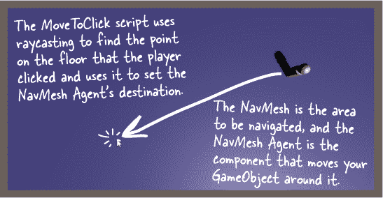

###### 注意

如果你正在使用我们的书籍，因为你正在准备成为一名专业开发者，那么能够回顾和重构你旧项目中的代码是一个非常重要的技能——不仅仅是为了游戏开发！

# 向你的场景添加一个平台

让我们通过一些对 Unity 导航系统的实验来进行一些试验。为了帮助我们做到这一点，我们将添加更多的游戏对象来建立一个带有楼梯、斜坡和障碍物的平台。这是它将会看起来的样子：

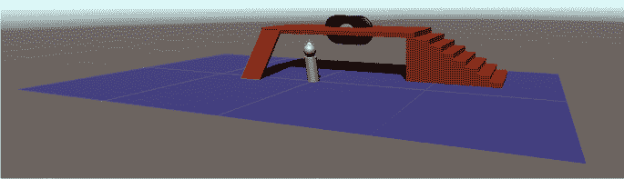

如果我们切换到**等距**视图或者不显示透视的视图，更容易看清楚正在发生的事情。在**透视**视图中，远处的物体看起来较小，而近处的物体看起来较大。在等距视图中，无论物体距离摄像机有多远，它们始终保持相同大小。

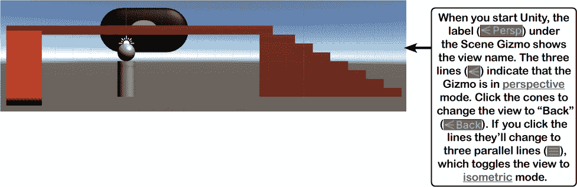

###### 注意

**有时，如果切换到等距视图，你能更容易地看到场景中正在发生的事情。如果你迷失了视角，你可以随时重置布局。**

**将 10 个游戏对象** 添加到你的场景中。在你的材质文件夹中创建一个名为 *Platform* 的新材质，使用 Albedo 颜色 CC472F，并将其添加到除了障碍物之外的所有游戏对象上，障碍物则使用来自第一个 Unity 实验室的 **名为 *8 Ball* 的新材质**，并且带有 8 Ball 纹理映射。这张表展示了它们的名称、类型和位置：

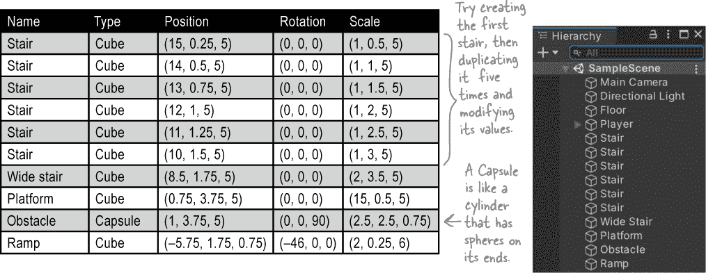

# 使用烘焙选项使平台可行走

使用 Shift+点击选择你在场景中添加的所有新游戏对象，然后使用 Control+点击（或者在 Mac 上使用 Command+点击）取消选择障碍物。转到导航窗口并点击对象按钮，然后 **通过** 勾选导航静态并设置导航区域为可行走来 **使它们全部可以行走**。通过选择障碍物，点击导航静态，并将导航区域设置为不可行走来 **使障碍物游戏对象不可行走**。

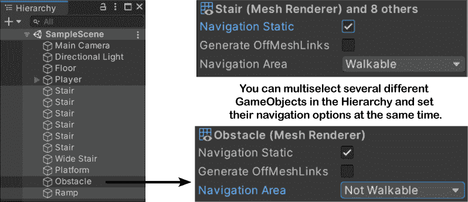

现在按照之前使用的相同步骤来 **烘焙 NavMesh**：点击导航窗口顶部的烘焙按钮切换到烘焙视图，然后点击底部的烘焙按钮。

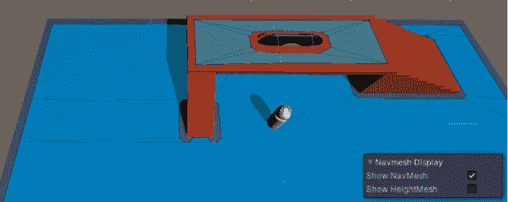

看起来好像奏效了！NavMesh 现在显示在平台的顶部，并且障碍物周围有空间。试着运行游戏。点击平台的顶部看看会发生什么。

嗯，等等。事情并没有按我们预期的方式运行。当你点击平台顶部时，玩家却在其***下方***。如果你仔细观察在导航窗口查看时显示的 NavMesh，你会发现它周围有楼梯和坡道的空间，但实际上并没有将它们包含在 NavMesh 中。玩家无法到达你点击的点，所以 AI 尽其所能靠近该点。

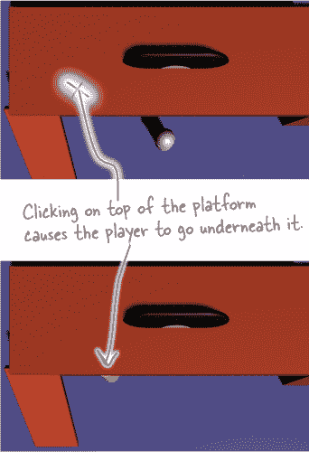

# 在你的 NavMesh 中包括楼梯和坡道

一个不能将你的玩家上下坡或楼梯的 AI 不会很智能。幸运的是，Unity 的路径 finding 系统可以处理这两种情况。我们只需要在烘焙 NavMesh 时对选项进行一些小的调整。让我们从楼梯开始。返回到烘焙窗口并注意步高的默认值是 0.4。仔细查看你的台阶测量值 —— 它们都是 0.5 单位高。因此，为了告诉导航系统包括高度为 0.5 单位的台阶，**将步高改为 0.5**。你会看到图表中的台阶图片变高，上面的数字从默认的 0.4 改变为 0.5。

我们仍然需要将坡道包含在 NavMesh 中。当你为平台创建游戏对象时，将坡道的 X 旋转设置为 -46，这意味着它是一个 46 度的斜坡。最大坡度设置默认为 45，这意味着它只会包括最多 45 度的坡道、山坡或其他斜坡。所以 **将最大坡度更改为 46**，然后 **再次烘焙 NavMesh**。现在它将包括坡道和楼梯。

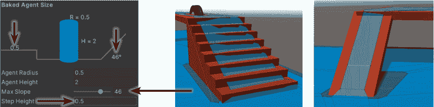

启动你的游戏，测试一下你的新 NavMesh 更改。

# 修复 NavMesh 中的高度问题

现在我们控制了摄像机，可以清楚地看到平台下面发生了什么问题。启动游戏，然后旋转摄像机并放大视角，以清晰查看障碍物在平台下方的情况。点击障碍物一侧的地面，然后点击另一侧。看起来玩家直接穿过了障碍物！而且还穿过了坡道的尽头。

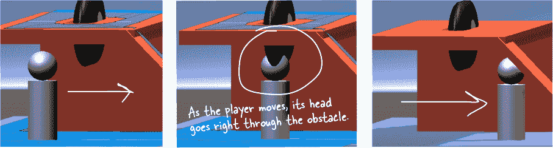

但如果你把玩家移回平台顶部，它会很好地避开障碍物。出了什么问题？

仔细观察障碍物上下的 NavMesh 部分。注意它们之间有什么区别吗？

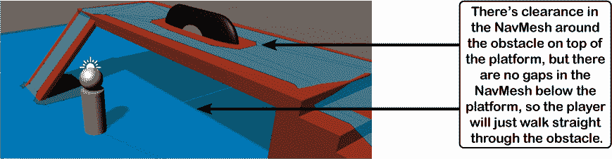

回到上一个实验的部分，那里你设置了 NavMesh Agent 组件，具体来说是设置了高度为 3。现在你只需要对 NavMesh 做同样的设置。返回导航窗口的烘焙选项，**将代理高度设置为 3，然后重新烘焙你的网格**。

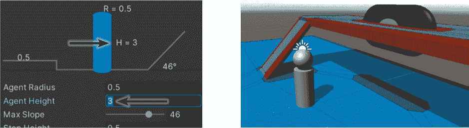

这在障碍物下面的 NavMesh 中创建了一个缺口，并扩展了坡道下面的空隙。现在玩家在平台下移动时既不会撞到障碍物也不会撞到坡道。

# 添加一个 NavMesh 障碍物

你已经在平台中间添加了一个静态障碍物：你创建了一个拉长的胶囊并标记为不可行走，当你烘焙 NavMesh 时，围绕障碍物有一个空洞，所以玩家必须绕过它。如果你想要一个移动的障碍物呢？试试移动障碍物——NavMesh 不会改变！它仍然在障碍物*原来的位置*创建了一个空洞，而不是它当前所在的位置。如果重新烘焙，它只会在障碍物新位置周围创建一个空洞。要添加一个移动的障碍物，给游戏对象添加一个**NavMesh 障碍组件**。

现在就来做吧。**向场景中添加一个立方体**，位置为（-5.75, 1, -1），缩放为（2, 2, 0.25）。为它创建一个新的材质，颜色设为深灰色（333333），并命名你的新游戏对象为*移动障碍物*。这将充当坡道底部的一种门，可以向上移动以让玩家通过，或向下以阻挡玩家。

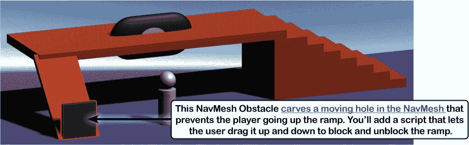

我们只需要再做一件事。在检视器窗口底部点击“添加组件”按钮，选择导航 >> Nav Mesh Obstacle，为你的立方体游戏对象**添加 NavMesh 障碍组件**。

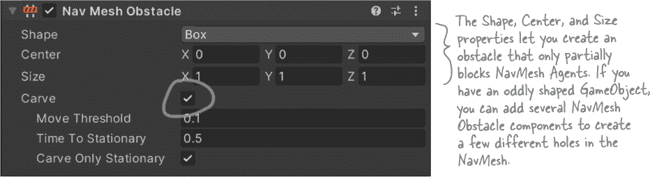

如果你保留所有选项的默认设置，你将得到一个 NavMesh 代理无法穿过的障碍物。相反，代理会撞上它并停下来。**勾选雕刻框**——这会导致障碍物***在 NavMesh 中创建一个随着 GameObject 移动的移动洞口***。现在你的移动障碍物 GameObject 可以阻止玩家在斜坡上下移动。由于 NavMesh 的高度设置为 3，如果障碍物低于地面 3 单位，它将在其下创建一个 NavMesh 中的洞口。如果它的高度超过这个高度，洞口就会消失。

###### 注意

**Unity 手册详细且易读地解释了各种组件。点击检视器中 Nav Mesh 障碍物面板顶部的打开参考按钮（）以打开手册页面。花点时间阅读它——它很好地解释了这些选项。**

# 添加一个脚本来上下移动障碍物

此脚本使用**OnMouseDrag**方法。它的工作方式类似于你在上一个实验中使用的 OnMouseDown 方法，只是当 GameObject 被拖动时调用它。

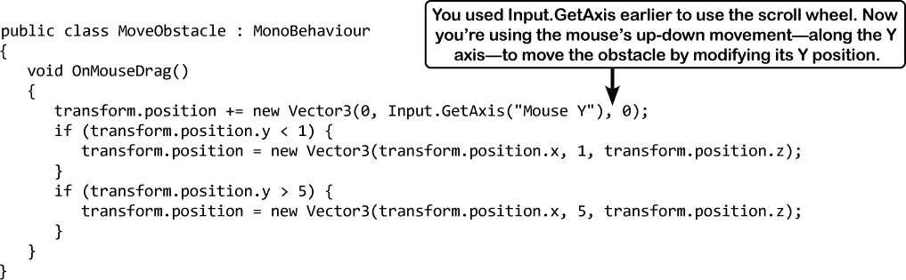

###### 注意

**第一个 if 语句阻止块移动到地板下方，第二个阻止它移动太高。你能搞清楚它们是如何工作的吗？**

**将你的脚本拖放到移动障碍物 GameObject 上**并运行游戏——哎呀，出了些问题。你可以点击并拖动障碍物上下移动，但这也会移动玩家。通过**给 GameObject 添加标签**来修复这个问题。

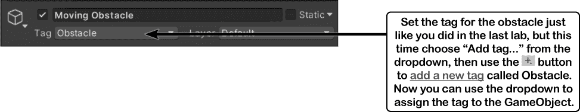

然后**修改你的 MoveToClick 脚本**以检查标签：

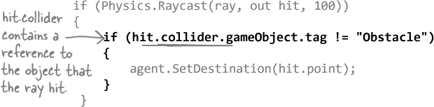

再次运行你的游戏。如果你点击障碍物，你可以拖动它上下移动，并且当它碰到地面或者高度过高时会停下来。在其他任何地方点击，玩家会像以前一样移动。现在你可以**尝试使用 NavMesh 障碍物选项进行实验**（如果你减少玩家的 NavMesh 代理速度会更容易）：

+   开始你的游戏。在层级窗口中点击*移动障碍物*，然后**取消勾选雕刻选项**。将你的玩家移到斜坡顶部，然后点击斜坡底部—玩家将会撞到障碍物并停下。拖动障碍物向上移动，玩家将继续移动。

+   现在**勾选雕刻框**并尝试同样的操作。当你上下移动障碍物时，玩家将重新计算其路线，绕开障碍物的长路，实时改变航线。

# 发挥创意！

你能找到改进游戏并练习编写代码的方法吗？以下是一些创意建议帮助你：

+   扩展场景——添加更多的斜坡、楼梯、平台和障碍物。寻找使用材料的创意方式。搜索网络以找到新的纹理地图。让它看起来有趣！

+   当玩家按住 Shift 键时使 NavMesh 代理移动更快。在脚本参考中搜索“KeyCode”以找到左/右 Shift 键的代码。

+   你在上次实验中使用了 OnMouseDown、Rotate、RotateAround 和 Destroy。看看你能否使用它们创建旋转或在点击时消失的障碍物。

+   我们实际上还没有一个游戏，只是一个在场景中导航的玩家。你能找到方法**把你的程序变成一个计时障碍课程**吗？

***你已经掌握了足够的 Unity 知识来开始构建有趣的游戏——这是一个很好的练习方式，让你可以不断提高作为开发者的水平。***

> **这是你实验的机会。发挥你的创造力是快速提升编码技能的有效方式。**

# 可下载的练习：动物匹配老板战

如果你玩过很多视频游戏（我们非常确定你玩过！），那么你一定经历过很多老板战——那些在关卡或章节结束时，你要面对比你之前见过的更大更强的对手的战斗。在本书结束前，我们为你准备了最后一个挑战——把它看作是*Head First C#*的老板战。

在#start_building_with_chash_build_somethin 中，你构建了一个动物匹配游戏。这是一个很好的开始，但缺少了一些东西。你能想出如何将你的动物匹配游戏变成记忆游戏吗？去我们的 GitHub 页面下载这个项目的 PDF 文件——或者如果你想在困难模式下进行这场老板战斗，就直接开始尝试看看你是否能独自完成。

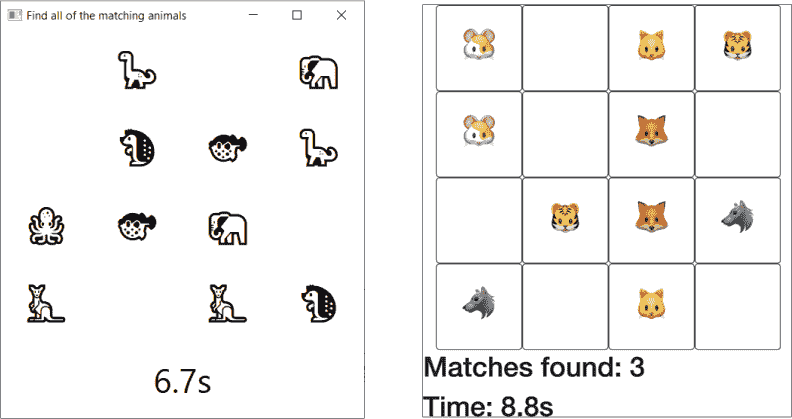

**这里有更多的可下载材料！书籍已经结束，但我们可以继续学习。我们为重要的 C#主题准备了更多可下载材料。我们还通过额外的 Unity 实验室甚至是一个 Unity 老板战继续 Unity 学习路径。**

**我们希望你学到了很多——更重要的是，我们希望你的 C#学习之旅才刚刚开始。优秀的开发者永远不会停止学习。**

**请访问我们的 GitHub 页面获取更多信息：[`github.com/head-first-csharp/fourth-edition`](https://github.com/head-first-csharp/fourth-edition)。**

# 感谢阅读我们的书！

为自己喝彩吧——这是一个真正的成就！我们希望这段旅程对你和我们一样有意义，并且希望你享受沿途编写的所有项目和代码。

# 但是等等，还有更多！你的旅程才刚刚开始……

在一些章节中，我们提供了一些额外的项目，你可以从我们的 GitHub 页面下载：[`github.com/head-first-csharp/fourth-edition`](https://github.com/head-first-csharp/fourth-edition)。

###### 注

检查这些优秀的 C#和.NET 资源！

连接到.NET 开发者社区：[`dotnet.microsoft.com/platform/community`](https://dotnet.microsoft.com/platform/community)。

观看直播和与构建.NET 和 C#的团队交流：[`dotnet.microsoft.com/platform/community/standup`](https://dotnet.microsoft.com/platform/community/standup).

在文档中了解更多信息：[`docs.microsoft.com/en-us/dotnet`](https://docs.microsoft.com/en-us/dotnet).

GitHub 页面包含**大量额外资料**。仍有更多知识可以学习，更多项目可以实施！

***继续你的 C#学习之旅***，下载 PDF 继续*Head First C#*的故事，并涵盖**C#的基本主题**，包括：

+   事件处理程序

+   委托

+   MVVM 模式（包括复古街机游戏项目）

+   ***......还有更多！***

当你在这里时，还有**更多关于 Unity 的学习**。你可以下载：

+   此书中所有 Unity 实验室的 PDF 版本

+   ***还有更多的 Unity 实验室***，涵盖物理学、碰撞等内容！

+   一个**Unity 实验室的老板战**，以测试你的 Unity 开发技能

+   一个完整的**Unity 实验室项目**，从头开始创建游戏

# 还可以查看这些由我们的朋友和同事撰写的基础（和令人惊叹！）书籍，这些书籍也由 O’REILLY 出版。

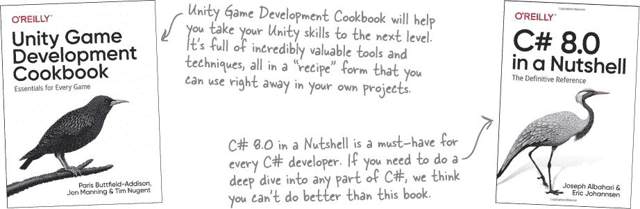
