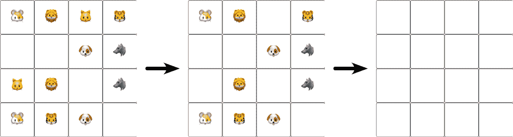
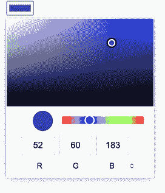
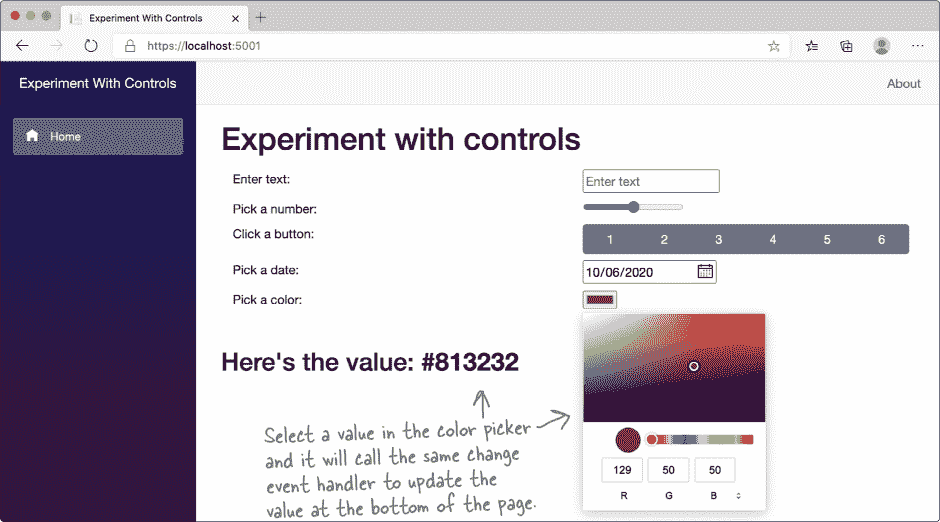

# 附录 A. ASP.NET Core Blazor 项目：*Visual Studio for Mac 学习指南*


**你的 Mac 是 C# 和 .NET 世界的一流公民。**

我们在编写 *Head First C#* 时考虑了我们的 Mac 读者，这就是为什么我们为你们专门创建了这个特别的 **学习指南**。本书中的大多数项目都是 .NET Core 控制台应用程序，可以在 **Windows 和 Mac** 上运行。一些章节有一个使用桌面 Windows 应用程序技术构建的项目。这个学习指南为所有这些项目提供了 **替代方案**，包括一个 *完整替代 #start_building_with_chash_build_somethin*，使用 **C# 创建 Blazor WebAssembly 应用程序**，这些应用程序在浏览器中运行，与 Windows 应用程序等效。你将使用 **Visual Studio for Mac** 来完成所有这些工作，这是一个编写代码的好工具，也是探索 C# 的 **宝贵学习工具**。让我们立即开始编码吧！

# 为什么你应该学习 C#

C# 是一种简单、现代的语言，让你可以做很多令人惊讶的事情。当你学习 C# 时，你不仅仅是在学习一种语言。C# 开启了 .NET 的整个世界，这是一个非常强大的开源平台，用于构建各种应用程序。

## Visual Studio 是你进入 C# 的大门

如果你还没有安装 Visual Studio 2019，现在就是时候了。

前往 [`visualstudio.microsoft.com`](https://visualstudio.microsoft.com) 并 **下载 Visual Studio for Mac**。（如果已安装，请运行 Visual Studio for Mac 安装程序以更新已安装的选项。）

## 安装 .NET Core

一旦下载了 Visual Studio for Mac 安装程序，请运行它以安装 Visual Studio。确保已选中 **.NET Core** 目标。


###### 注意

确保你安装的是 Visual Studio for Mac，而不是 Visual Studio Code。

###### 注意

Visual Studio Code 是一个令人惊叹的开源、跨平台代码编辑器，但它并不像 Visual Studio 那样专为 .NET 开发量身定制。这就是为什么在本书中我们可以使用 Visual Studio 作为学习和探索工具。

## 你也可以使用 Visual Studio for Windows 来构建 Blazor Web 应用程序

*Head First C#* 中的大多数项目都是 .NET Core 控制台应用程序，你可以使用 macOS 或 Windows 创建这些应用程序。有些章节还包括一个使用 Windows Presentation Foundation (WPF) 构建的 Windows 桌面应用项目。由于 WPF 是一种仅适用于 Windows 的技术，我们编写了这个 *Visual Studio for Mac 学习指南*，以便你可以使用 Web 技术—具体来说是 ASP.NET Core Blazor WebAssembly 项目—在 Mac 上创建等效的项目。

如果你是 Windows 用户，并想学习使用 Blazor 构建丰富的 Web 应用程序，那么你很幸运！***你可以使用 Windows 的 Visual Studio 来完成本指南中的项目***。前往 Visual Studio 安装程序，并确保选择了**“ASP.NET 和 Web 开发”选项**。虽然你的 IDE 截图可能与本指南中的不完全相同，但所有的代码都是一样的。

# Visual Studio 是一个编写代码和探索 C#的工具

你可以使用 TextEdit 或其他文本编辑器来编写你的 C#代码，但有一个更好的选择。一个**IDE**——这是***集成开发环境***的缩写——是一个文本编辑器、视觉设计器、文件管理器、调试器……它就像一个你需要编写代码所需的多功能工具。

这些只是 Visual Studio 帮助你完成的一些事情：

1.  **快速构建应用程序。** C#语言灵活且易于学习，而 Visual Studio IDE 通过自动完成大量手动工作，使得学习变得更加容易。以下只是 Visual Studio 为你做的一些事情：

    +   管理所有你的项目文件

    +   简化编辑项目代码的过程

    +   跟踪你项目的图形、音频、图标和其他资源

    +   通过逐行调试来帮助你调试代码

        

1.  **编写和运行你的 C#代码。** Visual Studio IDE 是目前为止使用最简单的编写代码工具之一。微软开发团队在使你编写代码的工作尽可能简单方面投入了大量的工作。

1.  **构建视觉效果出色的 Web 应用程序。** 在这本 Visual Studio for Mac 学习指南中，你将构建能在浏览器中运行的 Web 应用程序。你将使用**Blazor**，这是一种使用 C#构建交互式 Web 应用程序的技术。当你**结合 C#与 HTML 和 CSS**时，你将拥有一个强大的 Web 开发工具包。

1.  **学习和探索 C#与.NET。** Visual Studio 不仅是一个世界级的开发工具，还是一个出色的学习工具。***我们将使用 IDE 来探索 C#***，这将使我们更快速地掌握重要的编程概念。

    ###### 注意

    在本书中，我们经常将 Visual Studio 简称为“IDE”。

    > **Visual Studio 是一个令人惊叹的开发环境，但我们还将把它作为学习工具来探索 C#。**

# 在 Visual Studio for Mac 中创建你的第一个项目

学习 C#的最佳方式是开始编写代码，因此我们将使用 Visual Studio 来**创建一个新项目**……并立即开始编写代码！

###### 注意

***执行此操作！***

###### 注意

**当你看到“Do this!”（或“Now do this!”或“Debug this!”等），前往 Visual Studio 并跟着操作。我们会告诉你确切的操作步骤，并指出需要注意的示例中的内容，以便让你得到最大的收益。**

1.  **创建一个新的控制台项目。**

    启动 Visual Studio 2019 for Mac。当它启动时，会显示一个窗口，让你创建一个新项目或打开一个现有项目。**点击“新建”**来创建一个新项目。如果你不小心关闭了窗口，别担心——你可以通过选择*文件 >> 新建解决方案...*（）菜单项来重新打开它。

    

    **从左侧面板选择.NET**，然后选择**控制台项目**：

    

1.  **将项目命名为 MyFirstConsoleApp。**

    在“项目名称”框中输入**MyFirstConsoleApp**，然后点击**创建按钮**来创建项目。

    

1.  **查看你的新应用的代码。**

    当 Visual Studio 创建一个新项目时，它会为你提供一个可以构建的起点。一旦它完成创建应用程序的新文件，它会打开并显示一个名为*Program.cs*的文件，其中包含以下代码：

    

# 使用 Visual Studio IDE 探索你的应用程序

1.  **探索 Visual Studio IDE——以及它为你创建的文件。**

    当你创建新项目时，Visual Studio 会自动为你创建几个文件，并将它们捆绑成一个**解决方案**。IDE 左侧的解决方案窗口显示这些文件，解决方案（MyFirstConsoleApp）位于顶部。解决方案包含一个与解决方案同名的**项目**。

    

1.  **运行你的新应用。**

    Visual Studio for Mac 为你创建的应用程序已经准备就绪。在 Visual Studio IDE 的顶部找到“运行”按钮（带有“播放”三角形）。**点击该按钮**来运行你的应用程序：

    

1.  **查看你程序的输出。**

    当你运行程序时，**终端窗口**会出现在 IDE 底部，并显示程序的输出：

    

    学习一门语言的最佳方法是大量编写代码，所以你将在这本书中构建许多程序。其中许多将是控制台应用程序项目，所以让我们更仔细地看看你刚刚做了什么。

    终端窗口顶部显示着**程序的输出：**

    ```cs
    Hello World!
    ```

    点击代码中的任何位置来隐藏终端窗口。然后再次按下底部的按钮来重新打开它——你会看到程序的相同输出。IDE 在你的应用程序退出后会自动隐藏终端窗口。

    按下运行按钮再次运行你的程序。然后从运行菜单中选择“开始调试”，或者使用其快捷键（）。这是你在整本书中运行所有控制台应用程序项目的方式。

# 让我们来构建一个游戏！

你已经构建了你的第一个 C# 应用程序，这太棒了！既然你已经做到了，那么让我们构建一个稍微复杂一点的东西。我们将创建一个**动物配对游戏**，玩家会看到一个包含 16 只动物的网格，需要点击成对的动物使它们消失。


## 你的动物配对游戏是一个 Blazor WebAssembly 应用程序

如果你只需要输入和输出文本，控制台应用程序非常适合。如果你想要一个显示在浏览器页面上的视觉应用程序，你需要使用不同的技术。这就是为什么你的动物匹配游戏将是一个**Blazor WebAssembly 应用程序**。Blazor 让你可以创建可以在任何现代浏览器中运行的丰富 Web 应用程序。本书的大部分章节将涉及到一个 Blazor 应用程序。这个项目的目标是向你介绍 Blazor，并为你提供构建丰富 Web 应用程序以及控制台应用程序的工具。

###### 注意

**在你的 C#学习工具箱中，构建不同类型的项目是一个重要的工具。我们在本书的 Mac 项目中选择了 Blazor，因为它为您提供了设计可以在任何现代浏览器上运行的丰富 Web 应用程序的工具。**

**但是 C#不仅仅适用于 Web 开发和控制台应用程序！在这本 Mac 学习指南中的每个项目都有一个相应的 Windows 项目。**

**你是 Windows 用户，但仍然想学习 Blazor 并使用 C#构建 Web 应用程序吗？那么你很幸运！本 Mac 学习指南中的所有项目也可以在 Visual Studio for Windows 中完成。**

> **完成这个项目后，您将更加熟悉本书中学习和探索 C#所依赖的工具。**

# 下面是如何构建你的游戏的方法

本章的其余部分将指导你逐步构建你的动物匹配游戏，你将在一系列单独的部分完成：

1.  首先，您将在 Visual Studio 中创建一个新的 Blazor WebAssembly App 项目。

1.  然后，您将布置页面，并编写 C#代码来洗牌动物。

1.  游戏需要让用户点击一对表情符号来匹配它们。

1.  你将编写更多的 C#代码来检测玩家何时赢得游戏。

1.  最后，通过添加计时器使游戏更加令人兴奋。

###### 注意

这个项目可能需要 15 分钟到一个小时不等的时间，具体取决于您打字的速度。我们在不感到赶时间的情况下学得更好，所以请给自己足够的时间。


###### 注意

请注意，书中散布的这些“游戏设计...以及更多”元素。我们将使用游戏设计原则作为学习和探索重要编程概念和想法的途径，这些概念和想法适用于任何类型的项目，而不仅仅是视频游戏。

# 在 Visual Studio 中创建一个 Blazor WebAssembly App

构建游戏的第一步是在 Visual Studio 中创建一个新项目。

1.  从菜单中选择**文件 >> 新建解决方案... ()**以打开新项目窗口。这与您开始 Console App 项目的方式相同。

    

    在左侧的“Web 和 Console”下点击**App**，然后选择**Blazor WebAssembly App**并点击**下一步**。

1.  IDE 将会给你一个带有选项的页面。

    

    将所有选项保持默认值并点击**下一步**。

    

    **如果您在这个项目中遇到任何问题，请访问我们的 GitHub 页面，并寻找视频教程链接：**

    [`github.com/head-first-csharp/fourth-edition`](https://github.com/head-first-csharp/fourth-edition)

1.  输入 **BlazorMatchGame** 作为项目名称，就像您的控制台应用程序一样。

    

    然后**单击创建**以创建项目解决方案。

    

1.  IDE 将创建一个新的 BlazorMatchGame 项目，并显示其内容，就像您的第一个控制台应用程序一样。**展开解决方案窗口中的 Pages 文件夹**以查看其内容，然后**双击 *Index.razor*** 以在编辑器中打开它。

    

# 在浏览器中运行您的 Blazor Web 应用程序

运行 Blazor Web 应用程序时，有两部分：一个**服务器**和一个**Web 应用程序**。Visual Studio 通过一个按钮同时启动它们。

###### 注意

***就这样！***

1.  **选择要运行您的 Web 应用程序的浏览器。**

    在 Visual Studio IDE 顶部找到三角形形状的运行按钮：

    

    应调试>旁边列出您的默认浏览器。单击浏览器名称以查看已安装浏览器的下拉列表，并**选择 Microsoft Edge 或 Google Chrome** 中的任一浏览器。

1.  **运行您的 Web 应用程序。**

    单击**运行按钮**启动您的应用程序。您也可以从运行菜单中选择**开始调试 **。IDE 首先会打开一个生成输出窗口（底部，就像打开终端窗口一样），然后是一个应用程序输出窗口。之后，它将弹出一个运行您的应用程序的浏览器。

    

1.  **将 *Index.razor* 中的代码与浏览器中看到的内容进行比较。**

    您的浏览器中的 Web 应用程序有两部分：左侧有导航菜单，其中包含指向不同页面（主页、计数器和获取数据）的链接，右侧显示一个页面。将 *Index.razor* 文件中的 HTML 标记与浏览器中显示的应用程序进行比较。

    

1.  **将“Hello, world!”更改为其他内容。**

    更改 *Index.razor* 文件的第三行，使其显示其他内容：

    ```cs
    <h1>Elementary, my dear Watson.</h1>
    ```

    现在返回浏览器并重新加载页面。等一下，什么都没变化 - 它仍然显示“Hello, world！”这是因为您更改了代码，***但您从未更新服务器。***

    **单击**停止按钮 或从运行菜单中选择**停止 **。现在返回并重新加载浏览器 - 由于您已停止应用程序，它会显示“网站无法访问”的页面。

    **重新启动您的应用程序**，然后在浏览器中重新加载页面。现在您将看到更新后的文本。

    

    **是否有额外的浏览器实例打开？每次运行 Blazor Web 应用程序时，Visual Studio 都会打开一个新的浏览器。养成在停止应用程序（）之前关闭浏览器（）的习惯。**


# 现在，您已准备好开始为游戏编写代码了。

你创建了一个新的应用程序，Visual Studio 为你生成了一堆文件。现在是时候添加 C#代码来让你的游戏开始运行（以及 HTML 标记来使它看起来正确）。


## 你的动物配对游戏页面布局是如何工作的

你的动物配对游戏按网格布局排列——或者说看起来是这样。实际上，它由 16 个正方形按钮组成。如果你把浏览器变得非常窄，它们将重新排列成一个长列。


你将通过创建一个宽度为 400 像素的容器来布置页面（当浏览器处于默认缩放时，CSS“像素”为 1/96 英寸），其中包含 100 像素宽的按钮。我们将提供所有输入到 IDE 的 C#和 HTML 代码。**请注意这段代码**，很快将其添加到您的项目***中***—通过将 C#代码与 HTML 混合，实现了“魔法”：


# Visual Studio 帮助你编写 C#代码

Blazor 让你创建丰富、交互式的应用程序，结合了 HTML 标记和 C#代码。幸运的是，Visual Studio IDE 有很多有用的功能帮助你编写这些 C#代码。

1.  **向*Index.razor*文件添加 C#代码。**

    首先**在*Index.razor*文件末尾添加一个@code 块**。（暂时保留文件的现有内容—稍后将删除它们。）转到文件的最后一行，键入`@code {`。IDE 会为您填写右大括号`}`。按 Enter 在两个括号之间添加一行：

    

1.  **使用 IDE 的 IntelliSense 窗口帮助你编写 C#代码。**

    将光标定位在`{`大括号之间的行上，并键入字母`**L**`。IDE 将弹出一个**IntelliSense 窗口**，显示自动完成建议。从弹出窗口中选择`List<>`：

    

    IDE 将填写`List`。添加一个**尖括号**（大于号）—IDE 将自动填写闭合尖括号，并将光标定位在它们之间。

1.  **开始创建一个列表来存储你的动物表情符号。**

    **输入 s**来显示另一个 IntelliSense 窗口：

    

    选择`string`—IDE 会在括号之间添加它。按下**右箭头然后空格键**，然后**输入** `animalEmoji = new`。再次按下空格键以弹出另一个 IntelliSense 窗口。**按 Enter**选择选项中的默认值，`List<string>`。

    

    现在你的代码应该看起来像这样：`List<string> animalEmoji = new List<string>`

1.  **完成创建动物表情符号的列表。**

    首先**在*Index.razor*文件末尾添加一个`@code`块**。转到最后一行，键入**`@code {.`** IDE 会为您填写右大括号`}`。按 Enter 在两个大括号之间添加一行，然后：

    +   键入一个**开括号**（左圆括号）—IDE 将填写右圆括号。

    +   **按右箭头**移动到括号后面。

    +   输入一个 **左大括号 {**—IDE 将自动添加右大括号。

    +   按 Enter 在括号之间添加一行，然后在右括号后添加一个**分号 ;**。

    您的 *Index.razor* 文件底部的最后六行现在应该如下所示：

    

1.  **使用字符查看器输入表情符号。**

    接下来，选择 Edit >> Emoji & Symbols ( 空格) 从菜单中打开 macOS 字符查看器。将光标放在引号之间，然后在字符查看器中搜索“dog”：

    

    您的 *Index.razor* 文件底部的最后六行现在应该如下所示：

    

# 完成您的表情符号列表并在应用程序中显示它

您刚刚将一只狗表情符号添加到您的 `animalEmoji` 列表中。现在通过在第二个引号后添加逗号、空格、另一个引号、另一只狗表情符号和逗号，再添加一个**第二只狗表情符号**：


现在在其后**添加第二行**，与之前完全相同，只是用一对狼表情符号替换狗表情符号。然后再添加六行，每行分别包含一对牛、狐狸、猫、狮子、老虎和仓鼠表情符号。您现在的 `animalEmoji` 列表中应该有八对表情符号：


## 替换页面的内容

**删除页面顶部的这些行**：


然后将光标放在页面的第三行上，并**输入** `<st`—IDE 将弹出 IntelliSense 窗口：


从列表中选择 **`style`**，然后**输入 >**。IDE 将添加一个闭合的 *HTML 标签*：**`<style></style>`**

将光标放在 `<style>` 和 `</style>` 之间，按 Enter，然后**仔细输入以下所有代码**。确保您的应用程序中的代码与其完全匹配。


转到下一行，使用 IntelliSense **输入一个开放和闭合的 <div> 标签**，就像之前使用 `<style>` 一样。然后**仔细输入下面的代码**，确保完全匹配：


###### 注

**确保在运行应用程序时它看起来像这张屏幕截图一样。一旦看到这个界面，您就知道已经输入了所有代码而没有任何拼写错误。**

# 将动物随机排序以创建一个新的顺序

如果动物对都排在一起，我们的匹配游戏将会太简单。让我们添加 C# 代码来打乱动物的顺序，以便每次玩家重新加载页面时它们都会以不同的顺序出现。

1.  将光标放在底部 *Index.razor* 附近的右大括号 `}` 上方的分号 `;` 后面，按 Enter 两次。然后像之前一样使用 IntelliSense 弹出窗口输入以下行代码：

    ```cs
        List<string> shuffledAnimals = new List<string>();
    ```

1.  下一步 **输入 `protected override`** （IntelliSense 可以自动完成这些关键字）。一旦输入并键入空格，您将看到 IntelliSense 弹出窗口—从列表中**选择 OnInitialized()**：

    

    IDE 将填充一个名为 OnInitialized 的**方法**的代码（我们将在#dive_into_chash_statementscomma_classesc 中更多地讨论方法）：

    

1.  **用`SetUpGame()`替换`base.OnInitialized()`**，这样你的方法看起来像这样：

    ```cs
        protected override void OnInitialized()
        {
            SetUpGame();
        }
    ```

    然后**在你的 OnInitialized 方法下面添加这个 SetUpGame 方法**——再次，智能感知窗口将帮助你正确地完成它：

    

    当你在 SetUpGame 方法中输入代码时，你会注意到 IDE 弹出许多智能感知窗口，帮助你更快地输入代码。你使用 Visual Studio 编写 C#代码的次数越多，这些窗口就会变得越有帮助——最终你会发现它们显著加快速度。现在，利用它们来避免输入拼写错误——你的代码需要***与我们的代码完全匹配***，否则你的应用程序将无法运行。

1.  滚动回到 HTML 并找到这段代码：`@foreach (var animal in animalEmoji)`

    **双击`animalEmoji`**来选择它，然后**输入 s**。IDE 将弹出一个智能感知窗口。从列表中选择`shuffledAnimals`：

    

    现在**再次运行你的应用程序**。你的动物应该被洗牌，所以它们是随机顺序的。在浏览器中**重新加载页面**——它们将以不同的顺序重新洗牌。每次重新加载，它都会重新洗牌动物。

    

    ###### 注意

    **再次确保当你运行时你的应用程序看起来像这个截图。一旦它这样做了，你就会知道你输入了所有的代码而没有任何拼写错误。在你的游戏在重新加载浏览器页面时每次都在重新洗牌之前不要继续。**

# 你正在调试你的游戏

当你点击运行按钮  或选择从运行菜单中选择开始调试  来启动程序运行时，你就把 Visual Studio 置于**调试模式**。

当你看到工具栏中出现**调试控件**时，你可以知道你正在调试一个应用程序。开始按钮已被方形的停止按钮  替换，选择要启动的浏览器的下拉菜单变灰，还出现了一组额外的控件。

将鼠标悬停在暂停执行按钮上以查看其工具提示：


你可以通过点击停止按钮或从运行菜单中选择停止  来停止你的应用程序。


**你已经为接下来要添加的部分做好了准备。**

当你构建一个新游戏时，你不仅仅是在编写代码。你也在运行一个项目。一个非常有效的运行项目的方式是逐步构建它，沿途检查确保事情朝着良好的方向发展。这样你就有很多机会改变方向。

###### 注意

这是一个纸笔练习。把所有这些练习都做完绝对值得，因为它们将帮助你更快地掌握重要的 C#概念。


**提高你的代码理解能力将使你成为一个更好的开发者。**

铅笔和纸上的练习**不是可选的**。它们让你的大脑以不同的方式吸收信息。但更重要的是：它们给了你**犯错**的机会。犯错是学习的一部分，我们都犯过很多错误（你甚至可能在这本书中找到一两个拼写错误！）。没有人第一次写出完美的代码 —— 真正优秀的程序员总是假设他们今天写的代码可能明天就需要修改。事实上，书中的后面部分会介绍*重构*，即改进已编写代码的编程技术。

###### 注意

我们将添加类似这样的项目要点，以快速总结你到目前为止看到的许多想法和工具。

# 将你的新项目添加到源代码控制中

在这本书中，你将建立许多不同的项目。如果有一种简单的方法可以备份它们并随时访问它们，那不是很好吗？如果你犯了错误，如果你能方便地回滚到以前的代码版本，那不是非常方便吗？好吧，你很幸运！这正是**源代码控制**做的事情：它为你提供了一种简单的方法来备份你的所有代码，并跟踪你所做的每一个更改。Visual Studio 让你很容易地将你的项目添加到源代码控制中。

**Git**是一个流行的版本控制系统，而 Visual Studio 会将你的源代码发布到任何 Git **存储库**（或**repo**）。我们认为**GitHub**是使用最简单的 Git 提供者之一。你需要一个 GitHub 账号来向其推送代码，所以如果你还没有，请访问[`github.com`](https://github.com)并创建。

设置好你的 GitHub 账号后，你可以使用 IDE 的内置版本控制功能。从菜单中选择**版本控制 >> 发布到版本控制...** 来打开克隆存储库窗口：


###### 注意

**Visual Studio for Mac 文档完整介绍了在 GitHub 上创建项目并从 Visual Studio 发布的步骤。它包括了为在 GitHub 上创建远程仓库和直接从 Visual Studio 向 Git 发布项目提供逐步说明。我们认为将所有*Head First C#*项目发布到 GitHub 是一个好主意，这样你以后可以轻松地返回到它们。[`docs.microsoft.com/en-us/visualstudio/mac/set-up-git-repository`](https://docs.microsoft.com/en-us/visualstudio/mac/set-up-git-repository)。**


# 添加 C#代码来处理鼠标点击

你有带有随机动物表情符号的按钮。现在你需要点击它们时让它们做一些事情。操作方式如下：


# 给你的按钮添加点击事件处理程序

当你点击一个按钮时，它需要做一些事情。在网页中，点击是一个**事件**。网页还有其他事件，比如当页面完成加载时，或者当输入框发生变化时。一个**事件处理程序**是一段在特定事件发生时执行的 C# 代码。我们将添加一个事件处理程序来实现按钮的功能。

## 这是事件处理程序的代码

将这段代码添加到你的 Razor 页面底部，就在底部的 `**}**` 上方：


## 将你的事件处理程序连接到按钮上

现在你只需要修改按钮，使其在点击时调用 ButtonClick 方法：


###### 注意

**当我们要求你在代码块中更新一个内容时，我们可能会使其余的代码变得浅一些，并使你修改的部分变为粗体。**

###### 注意

**哎呀——这段代码中有一个 bug！你能找出来吗？我们将在下一节追踪并修复它。**

# 测试你的事件处理程序

再次运行你的应用程序。当它启动时，通过单击按钮来测试你的事件处理程序，然后再单击带有匹配表情符号的按钮。它们应该都会消失。


依次单击另一个，然后再依次单击另一个。你应该能够继续单击成对，直到所有按钮都变空。恭喜，你找到了所有的配对！



## 但是如果你连续点击同一个按钮会发生什么？

在浏览器中重新加载页面以重置游戏。但这一次，而不是找到一对，**连续点击两次同一个按钮**。等等——***游戏中有一个 bug！*** 它本应忽略点击，但实际上像你找到了一对一样。


# 使用调试器来解决问题

你可能以前听过“bug”这个词。你甚至可能曾经对你的朋友说过类似的话：“那个游戏有很多 bug，有这么多故障。”每个 bug 都有一个解释——你程序中的每件事都有其原因——但不是每个 bug 都容易追踪。

***理解 bug 是修复它的第一步。*** 幸运的是，Visual Studio 调试器是一个很好的工具。(这就是为什么它被称为调试器：它是帮助你消除 bug 的工具！)

1.  **考虑一下出了什么问题。**

    首先要注意的是，你的 bug 是**可复现的**：每次你连续单击相同的按钮两次时，它总是像你点击了一个匹配的对。

    第二件需要注意的事情是，你对 bug 的位置有一个**相当好的想法**。问题只发生在你添加了处理 Click 事件的代码之后，所以那是一个很好的起点。

1.  **为你刚刚编写的 Click 事件处理程序的代码添加断点。**

    点击 ButtonClick 方法的第一行，然后从菜单中选择 Run >> Toggle Breakpoint ()。该行将改变颜色，并在左边缘看到一个点：

    

# 继续调试你的事件处理程序

现在你的断点已经设置好了，使用它来了解代码的运行情况。

1.  **点击一个动物以触发断点。**

    如果你的应用程序已经在运行，请停止它并关闭所有浏览器窗口。然后再次**运行你的应用程序**并**点击任何一个动物按钮**。Visual Studio 应该弹出到前景。你切换了断点的行应该现在以不同的颜色高亮显示：

    

    将鼠标移动到方法的第一行，该行以`private void`开头，并**将光标悬停在 animal 上**。将弹出一个小窗口，显示你点击的动物：

    

    按下**Step Over**按钮或选择 Run >> Step Over ()菜单。高亮将移动到`**{**`行。再次跨过以将高亮移至下一个语句：

    

    再次跨过一次以执行该语句，然后悬停在`lastAnimalFound`上：

    

    你刚刚跨过的声明将`lastAnimalFound`的值设为与`animal`相匹配。

    ***这就是代码如何跟踪玩家点击的第一个动物。***

1.  **继续执行。**

    按下**Continue Execution**按钮或选择 Run >> Continue Debugging ()菜单。切换回浏览器 - 你的游戏将继续进行直到再次触发断点。

1.  **点击配对中的相匹配动物。**

    找到具有匹配表情符号的按钮并**点击它**。IDE 将触发断点并再次暂停应用程序。按下**Step Over** - 它会跳过第一个块并跳转到第二个：

    

    **悬停在`lastAnimalFound`和`animal`上** — 它们应该都有相同的表情符号。这就是事件处理程序知道你找到匹配项的方式。**再跨过三次**：

    

    现在**悬停在`shuffledAnimals`上**。你会看到弹出窗口中有几个项目。点击`shuffledAnimals`旁边的三角形以展开它，然后**展开** `_items` 以查看所有动物：

    

    再次按下**Step Over**以执行从列表中移除匹配项的语句。然后**再次悬停在** `**shuffledAnimals**` **上** 并查看它的项目。现在匹配表情符号的位置有两个（*null*）值：

    

    **我们已经筛选了大量证据并收集了一些重要线索。你认为问题的根源是什么？**

# 追踪引起问题的错误...

那么如果你两次点击相同的动物按钮会发生什么呢？让我们找出来！**重复刚才做过的步骤**，但这次**两次点击相同的动物**。观察当你到达步骤时发生了什么。

悬停在`animal`和`lastAnimalFound`上，就像之前一样。它们是相同的！这是因为事件处理程序***没有办法区分不同按钮上相同的动物***。

## ...并修复错误！

现在我们知道是什么导致了这个错误，我们知道如何修复它：给事件处理程序一种区分两个具有相同表情符号按钮的方法。

首先，**对 ButtonClick 事件处理程序进行这些更改**（确保不会漏掉任何更改）：


然后用另一种循环替换`foreach 循环`，即`for`循环——这个 for 循环计算动物的数量：


现在再次通过应用程序进行调试，就像之前一样。这次当你两次点击相同的动物时，它会跳到事件处理程序的末尾。***错误已修复！***


# 当玩家赢得比赛时，添加重置游戏的代码

游戏进行得很顺利——你的玩家从一个充满动物的网格开始匹配，他们可以点击成对的动物，当它们匹配时它们会消失。但是当所有匹配项都被找到时会发生什么？我们需要一种重置游戏的方式，让玩家有第二次机会。


###### 注意

当你看到脑力元素时，花一分钟时间真正思考它问的问题。


# 通过添加计时器完成游戏

如果玩家可以尝试击败他们的最佳时间，你的动物匹配游戏将会更加令人兴奋。我们将添加一个**计时器**，通过重复调用方法在固定间隔后“滴答”。


###### 注意

**计时器通过反复调用方法以固定间隔“滴答”。你将使用一个计时器，当玩家开始游戏时启动，最后一个动物匹配时结束。**

# 在你游戏的代码中添加一个计时器

***添加这个！***

1.  首先找到*Index.razor*文件的顶部这一行：`@page "/"`

    **在下面添加这行代码** —— 你需要它来在你的 C#代码中使用计时器：

    ```cs
    @using System.Timers
    ```

1.  **你需要更新 HTML 标记以显示时间。将其添加到练习中第一个添加的代码块的下面：**

    ```cs
     </div>
     <div class="row">
     <h2>Matches found: @matchesFound</h2>
     </div>
        <div class="row">
            <h2>Time: @timeDisplay</h2>
        </div>
    </div>
    ```

1.  你的页面需要一个计时器。它还需要跟踪经过的时间：

    ```cs
    List<string> shuffledAnimals = new List<string>();
    int matchesFound = 0;
    Timer timer;
    int tenthsOfSecondsElapsed = 0;
    string timeDisplay;
    ```

1.  你需要告诉计时器每隔多久“滴答”一次以及调用什么方法。你将在 OnInitialized 方法中做这些，这个方法在页面加载后调用一次：

    ```cs
    protected override void OnInitialized()
    {
        timer = new Timer(100);
        timer.Elapsed += Timer_Tick;

     SetUpGame();
    }
    ```

1.  当你设置游戏时重置计时器：

    ```cs
    private void SetUpGame()
    {
     Random random = new Random();
     shuffledAnimals = animalEmoji
     .OrderBy(item => random.Next())
     .ToList();
     matchesFound = 0;
        tenthsOfSecondsElapsed = 0;
    }
    ```

1.  你需要停止并重新启动计时器。在 ButtonClick 方法的顶部附近添加这行代码来在玩家点击第一个按钮时启动计时器：

    ```cs
    if (lastAnimalFound == string.Empty)
    {
     // First selection of the pair. Remember it.
     lastAnimalFound = animal;
     lastDescription = animalDescription;

        timer.Start();
    }
    ```

    最后，在 ButtonClick 方法的更深处添加这两行代码来停止计时器，并在玩家找到最后一对匹配后显示“再玩一次？”消息：

    ```cs
    matchesFound++;
    if (matchesFound == 8)
    {
        timer.Stop();
        timeDisplay += " - Play Again?";

     SetUpGame();
    }
    ```

1.  最后，你的计时器需要知道每次滴答时该做什么。就像按钮有 Click 事件处理程序一样，计时器有 Tick 事件处理程序：每次计时器滴答时执行的方法。

    **将此代码添加到页面的最底部**，就在闭合大括号 `}` 的上方：

    ```cs
    private void Timer_Tick(Object source, ElapsedEventArgs e)
    {
        InvokeAsync(() =>
        {
            tenthsOfSecondsElapsed++;
            timeDisplay = (tenthsOfSecondsElapsed / 10F)
                .ToString("0.0s");
            StateHasChanged();
        });
    }
    ```

###### 注意

**当玩家点击第一个动物时计时器开始计时，并且当找到最后一对匹配时停止。这并不会从根本上改变游戏的运行方式，但会让游戏更加令人兴奋。**

# 清理导航菜单

你的游戏正在运行！但是你是否注意到你的应用中还有其他页面？尝试在左侧导航菜单中点击“Counter”或“Fetch data”。在创建 Blazor WebAssembly 应用程序项目时，Visual Studio 添加了这些额外的示例页面。你可以安全地将它们移除。

首先，展开**wwwroot 文件夹**并编辑*index.html*。找到以`<title>`开头的行并**修改它**，使其看起来像这样：`<title> 动物配对游戏 </title>`

接下来，展开解决方案中的**Shared 文件夹**，并**双击 *NavMenu.razor***。找到这一行：

```cs
 <a class="navbar-brand" href="">BlazorMatchGame</a> 
```

并**用这个替换它：**

```cs
 <a class="navbar-brand" href="">Animal Matching Game</a>
```

然后**删除这些行：**


最后，按住 （Command 键）并**点击以多选这些文件**在解决方案窗口中：在 Pages 文件夹中的***Counter.razor***和***FetchData.razor***，在 Shared 文件夹中的***SurveyPrompt.razor***，以及在 wwwroot 文件夹中的**整个 sample-data**文件夹。一旦它们全部选择完毕，右键单击其中一个并从菜单中**选择删除**（图标）来删除它们。

***现在你的游戏完成了！***


**每当你有一个大项目时，将其拆分成小部分总是一个好主意。**

你可以培养的最有用的编程技能之一是能够看待一个庞大而困难的问题，并将其分解成更小、更容易解决的问题。

在开始一个大项目时很容易感到不知所措，然后想，“哇，这太大了！”但如果你能找到一个小部分可以着手，然后你就可以开始了。完成了那一部分后，你可以继续下一个小部分，然后下一个，再下一个。随着每个部分的建设，你会在途中了解更多关于你的大项目的信息。

# 更好的建议...

你的游戏做得相当不错！但每个游戏——事实上，几乎每个程序——都可以改进。以下是我们考虑到的一些可以让游戏变得更好的建议：

+   添加不同种类的动物，这样每次不会出现相同的动物。

+   记录玩家的最佳时间，这样他们可以尝试超越它。

+   让计时器倒计时而不是计时上升，这样玩家就有限定的时间了。

###### 注意

我们是认真的——花几分钟时间去做这件事。退后一步，思考一下你刚刚完成的项目，这是将学到的经验融入你的大脑的好方法。


# *来自#dive_into_chash_statementscomma_classesc* 深入学习 C#

###### 注意

这是#dive_into_chash_statementscomma_classesc 中 Windows 桌面项目的 Blazor 版本。

###### 注意

**#dive_into_chash_statementscomma_classesc 的最后一部分是一个 Windows 项目，用于尝试不同类型的控件。我们将使用 Blazor 来构建一个类似的项目，以尝试 Web 控件。**

# 控件驱动用户界面的机制

在上一章中，你使用了按钮**控件**来制作了一个游戏。但是有很多不同的方式可以使用控件，而你选择使用哪些控件会真正改变你的应用。听起来很奇怪吗？其实这与我们在游戏设计中做选择的方式非常相似。如果你设计一个需要随机数生成器的桌面游戏，你可以选择使用骰子、旋转器或者卡片。如果你设计一个平台游戏，你可以选择让你的玩家跳跃、双重跳跃、墙壁跳跃或者飞行（或者在不同时间做不同的事情）。对应用程序也是一样的：如果你设计一个用户需要输入数字的应用程序，你可以选择不同的控件让他们这样做 —— ***而这个选择会影响用户体验应用程序的方式***。


+   **文本框** 允许用户输入任何文本。但我们需要一种方法来确保他们只输入数字，而不是任意文本。

    

+   **滑块** 专门用于选择数字。电话号码也只是数字，所以从技术上讲，你可以使用滑块来选择电话号码。你认为这是一个好的选择吗？

    

+   **选择器** 是专门设计用来从列表中选择特定类型值的控件。例如，**日期选择器** 允许你通过选择年、月和日来指定日期，而 **颜色选择器** 则允许你使用色谱滑块或其数值来选择颜色。

    

+   **单选按钮** 允许你限制用户的选择。它们通常看起来像有点的圆圈，但你也可以将它们样式化成普通按钮的样子。

    

# 创建一个新的 Blazor WebAssembly 应用程序项目

在此***Visual Studio for Mac 学习指南*** 的前面，你为你的动物匹配游戏创建了一个 Blazor WebAssembly 应用程序项目。你也将为这个项目做同样的事情。

***这里是创建 Blazor WebAssembly 应用程序项目、更改主页标题文本和删除 Visual Studio 创建的额外文件的简洁步骤集。我们不会在本指南的每个附加项目中重复这些步骤 —— 你应该能够对所有未来的 Blazor WebAssembly 应用程序项目都使用相同的指令。***

1.  **创建一个新的 Blazor WebAssembly 应用程序项目。**

    要么启动 Visual Studio 2019 for Mac，或者从菜单中选择 *File >> New Solution...*（）来**打开新项目窗口。点击 New** 创建一个新项目。将其命名为 **ExperimentWithControlsBlazor**。

1.  **更改标题和导航菜单。**

    在动物匹配游戏项目的结尾，您修改了标题和导航栏文本。对于此项目，也要执行相同的操作。展开 **wwwroot 文件夹** 并编辑 *Index.html*。找到以 `<title>` 开头的行，并**修改它**，使其看起来像这样：`<title> **Experiment with Controls** </title>`

    在解决方案中扩展 **Shared 文件夹** 并**双击 *NavMenu.razor*。** 找到这一行：

    ```cs
       <a class="navbar-brand" href="">ExperimentWithControlsBlazor</a>
    ```

    并**用此代码替换它**：

    ```cs
       <a class="navbar-brand" href="">Experiment With Controls</a>
    ```

1.  **删除额外的导航菜单选项及其对应的文件。**

    这就像您在动物匹配游戏项目的结尾所做的那样。**双击 *NavMenu.razor* 并删除这些行：**

    

    然后按住 （Command 键），并**单击以多选这些文件**在解决方案窗口中：在 Pages 文件夹中的 ***Counter.razor*** 和 ***FetchData.razor***，在 Shared 文件夹中的 ***SurveyPrompt.razor***，以及 wwwroot 文件夹中的 **entire sample-data** 文件夹。一旦它们都被选中，右键单击其中一个文件，然后从菜单中选择 **Delete**（  ）来删除它们。

# 创建一个带有滑块控件的页面

您的许多程序都需要用户输入数字，而输入数字的最基本控件之一是**滑块**，也称为**范围输入**。让我们创建一个新的 Razor 页面，使用滑块来更新一个值。

1.  **替换 Index.razor 页面。**

    打开 *Index.razor* 并**用此 HTML 标记替换**其所有内容：

    

1.  **运行您的应用程序。**

    运行您的应用程序，就像您在 #start_building_with_chash_build_somethin 中所做的那样。将 HTML 标记与浏览器中显示的页面进行比较 - 将各个 `<div>` 块与页面上显示的内容匹配起来。

    

1.  **将 C# 代码添加到您的页面中。**

    返回到 *Index.razor* 并在文件底部**添加此 C# 代码**：

    

1.  **将您的范围控件连接到刚刚添加的 Change 事件处理程序。**

    为您的范围控件添加一个 `@onchange` 属性：

    

# 向您的应用程序添加一个文本输入

该项目的目标是尝试不同类型的控件，因此让我们添加一个**文本输入控件**，使用户可以在应用程序中输入文本并在页面底部显示。

1.  **向您页面的 HTML 标记中添加一个文本输入控件。**

    **添加一个** `**<input ... />**` **标签**，几乎与您为滑块添加的标签相同。唯一的区别在于，您将 `type` 属性设置为 `"text"` 而不是 `"range"`。以下是 HTML 标记：

    

    **再次运行你的应用程序** —— 现在它有一个文本输入控件。无论你输入什么文本，它都会显示在页面底部。尝试修改文本，然后移动滑块，然后再次修改文本。每次修改控件时，页面底部的值都会更改。

    

1.  **添加一个仅接受数值的事件处理方法。**

    如果你只想从用户那里接受数值输入，那该怎么办？**在 Razor 页面底部的大括号之间添加此方法：**

    

1.  **更改文本输入框以使用新的事件处理程序方法。**

    修改你的文本控件的 `@onchange` 属性，以调用新的事件处理程序：

    ```cs
     <input type="text" placeholder="Enter text"
     @onchange="UpdateNumericValue" />
    ```

    现在尝试将文本输入到文本输入框中 —— 除非你输入的文本是整数值，否则它不会更新页面底部的值。


# 为你的应用添加颜色选择器和日期选择器

选择器只是不同类型的输入。**日期选择器**的输入类型是 `"date"`，**颜色选择器**的输入类型是 `"color"` — 除此之外，这些输入类型的 HTML 标记是相同的。

修改你的应用程序，**添加一个日期选择器和一个颜色选择器**。这是 HTML 标记 — 将它添加到包含显示值的 `<div>` 标记的上方：



###### 注意

**这就是项目的结尾 — 做得很棒！你可以在结尾处继续学习 #dive_into_chash_statementscomma_classesc，在那里有一个坐在椅子上思考的人，他在想：用户有很多不同的选择数字的方式！**

# 来自 #objectshellipget_orientedexclamation_mar 的对象…… 以获取方向！

###### 注意

这是 Windows 桌面项目在 #objectshellipget_orientedexclamation_mar 的 Blazor 版本。

###### 注意

**在 #objectshellipget_orientedexclamation_mar 的中途，有一个项目，你将构建一个 Windows 版本的卡片选择器应用程序。我们将使用 Blazor 来构建同样功能的基于 Web 的版本。**

# 接下来：构建你的卡片选择应用的 Blazor 版本

在接下来的项目中，你将构建一个名为 PickACardBlazor 的 Blazor 应用程序。它将使用滑块来让你选择随机抽取的卡片数量，并在列表中显示这些卡片。以下是它的外观：


## 在一个新的 Blazor 应用中重用你的 CardPicker 类

***重用这个！***

如果你已经为一个程序编写了一个类，你通常会希望在另一个程序中使用相同的行为。这就是使用类的一个重要优势 — 它们使得代码**重用**更加容易。让我们为你的卡片选择器应用程序设计一个闪亮的新用户界面，但通过重用你的 CardPicker 类来保持相同的行为。

1.  **创建一个名为 PickACardBlazor 的新 Blazor WebAssembly 应用项目。**

    你将按照创建动物匹配游戏中使用的完全相同的步骤来创建你的应用程序#start_building_with_chash_build_somethin：

    +   打开 Visual Studio 并创建一个新项目。

    +   选择**Blazor WebAssembly App**，就像你之前在其他 Blazor 应用程序中做的那样。

    +   给你的新应用程序取名为**PickACardBlazor**。Visual Studio 将创建该项目。

1.  **添加 CardPicker 类，该类是你为控制台应用程序项目创建的。**

    右键单击项目名称，然后从菜单中选择**添加 >> 现有文件...**：

    

    转到包含你的控制台应用程序的文件夹，然后**单击*CardPicker.cs***将其添加到你的项目中。Visual Studio 会询问你是否要复制、移动或链接文件。告诉 Visual Studio**复制文件**。你的项目现在应该有来自控制台应用程序的*CardPicker.cs*文件的副本。

1.  **更改 CardPicker 类的命名空间。**

    **双击*CardPicker.cs***在解决方案窗口中。它仍然具有来自控制台应用程序的命名空间。**更改命名空间**以匹配你的项目名称：

    

    ***恭喜，你已经重用了你的 CardPicker 类！*** 你应该在解决方案窗口中看到这个类，并且可以在你的 Blazor 应用程序的代码中使用它。

# 页面使用行和列布局。

在#start_building_with_chash_build_somethin 和#dive_into_chash_statementscomma_classesc 中使用 HTML 标记来创建行和列，而这个新应用程序也是如此。下面是显示应用程序布局的图片：


# 滑块使用数据绑定来更新一个变量。

页面底部的代码将从一个名为`numberOfCards`的变量开始：

```cs
@code {
    int numberOfCards = 5;
```

你*可以*使用事件处理程序来更新`numberOfCards`，但是 Blazor 有更好的方法：**数据绑定**，它允许你设置输入控件以自动更新你的 C#代码，并且可以自动将你的 C#代码的值插入页面中。

下面是页眉、范围输入和显示其值的文本的 HTML 标记：


仔细查看`<input>`标签的属性。`min`和`max`属性限制输入值为 1 到 15 之间。`**@bind**`属性设置数据绑定，因此每当滑块更改时，Blazor 会自动更新`numberOfCards`。

`<input>`标签后面是`<div class="col-2">**@numberOfCards</div>**`—这段标记添加了文本（`ml-2`在左边距添加了空间）。这也使用数据绑定，但是反向操作：每当`numberOfCards`字段更新时，Blazor 会自动更新该`<div>`标签内的文本。

###### 注意

**这就是项目的结束——干得好！你可以回到#objectshellipget_orientedexclamation_mar 并在标题为“Ana's prototypes look great...”的部分继续。**

# 来自#types_and_references_getting_the_referen 类型和引用

###### 注意

这是 Windows 桌面项目的 Blazor 版本，位于#types_and_references_getting_the_referen。

**在#types_and_references_getting_the_referen 的结尾有一个 Windows 项目。我们将构建其 Blazor 版本。**

## 欢迎来到 Sloppy Joe's Budget House o' Discount Sandwiches！

Sloppy Joe 有一堆肉，一大堆面包，比你能想象的调味品还多。但他没有菜单！你能建立一个每天为他制作新的*随机*菜单的程序吗？你绝对可以……通过一个**新的 Blazor WebAssembly 应用程序项目**，一些数组和一些有用的新技术。

***做这个！***


1.  **向你的项目添加一个新的 MenuItem 类，并添加其字段。**

    看一看类图。它有六个字段：一个 Random 实例，三个数组来保存各种三明治部件，以及用于保存描述和价格的字符串字段。数组字段使用**集合初始化器**，让你可以通过将项目放在大括号内来定义数组中的项目。

    ```cs
    class MenuItem
    {
        public Random Randomizer = new Random();
        public string[] Proteins = { "Roast beef", "Salami", "Turkey",
                "Ham", "Pastrami", "Tofu" };
        public string[] Condiments = { "yellow mustard", "brown mustard",
               "honey mustard", "mayo", "relish", "french dressing" };
        public string[] Breads = { "rye", "white", "wheat", "pumpernickel", "a roll" };

        public string Description = "";
        public string Price;
    }
    ```

1.  **将 Generate 方法添加到 MenuItem 类中。**

    此方法使用了你多次看到的 Random.Next 方法，从 Proteins、Condiments 和 Breads 字段的数组中随机选择项目，并将它们连接成一个字符串。

    ```cs
        public void Generate()
        {
            string randomProtein = Proteins[Randomizer.Next(Proteins.Length)];
            string randomCondiment = Condiments[Randomizer.Next(Condiments.Length)];
            string randomBread = Breads[Randomizer.Next(Breads.Length)];
            Description = randomProtein + " with " + randomCondiment + " on " + randomBread;

            decimal bucks = Randomizer.Next(2, 5);
            decimal cents = Randomizer.Next(1, 98); 
            decimal price = bucks + (cents * .01M);
            Price = price.ToString("c");
        }
    ```

    ###### 注意

    **Generate 方法通过将两个随机整数转换为小数来生成介于 2.01 到 5.97 之间的随机价格。仔细看最后一行——它返回`price.ToString("c")`。ToString 方法的参数是一个格式。在这种情况下，`"c"`格式告诉 ToString 使用本地货币格式化值：如果你在美国，你会看到$；在英国，你会看到£；在欧盟，你会看到€等等。**

1.  **将页面布局添加到你的 Index.razor 文件中。**

    菜单页面由一系列 Bootstrap 行组成，每个菜单项一个。每行有两列，`col-9`显示菜单项描述，`col-3`显示价格。页面底部有最后一行，`col-6`居中显示鳄梨酱。

    

###### 注意

**项目结束了！在#types_and_references_getting_the_referen 的最后的项目符号处继续。**
