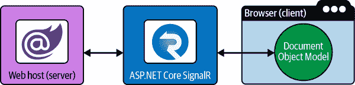

# 第一章：闪耀进入 Blazor

Node.js 重塑了现代 Web 应用程序开发的世界。它的成功部分归功于 JavaScript 的流行，当然还有 JavaScript 现在在客户端和服务器上的运行，这都要归功于 Node。这也是为什么 Blazor 会如此成功——现在使用 WebAssembly，C#可以在浏览器中运行。对于.NET 开发者来说，这是一个巨大的潜力，因为今天已经存在许多 C#服务器应用程序。对于.NET 开发者来说，有很多机会使用 Blazor 创建令人惊叹的用户体验。

第一次，.NET 开发者可以利用他们现有的 C#技能来构建各种 Web 应用程序。这模糊了后端和前端开发者之间的界限，并扩展了 Web 应用程序的开发。在现代 Web 应用程序开发中，您希望您的应用程序在桌面和移动浏览器上都具有响应性。现代 Web 应用程序比其前身更加复杂和内容丰富，并拥有实时 Web 功能、渐进式 Web 应用（PWA）功能以及精美编排的用户交互。

在本章中，您将了解.NET Web 应用程序开发的起源以及 Blazor 的诞生。您将探索单页应用程序（SPA）框架的变体，并了解.NET 如何在 Web 生态系统中巩固其地位。我将回答您可能会有的许多关于*为什么*Blazor 是一个可行选项的问题，并讨论其托管模型。最后，您将首次了解 Learning Blazor 示例应用程序。本书将使用此示例应用程序，在每章中演示 Blazor 的各种功能并使用该应用程序进行跟随学习。

# Blazor 的起源

1996 年，微软的 Active Server Pages（ASP）首次提供了用于动态 Web 页面的服务器端脚本语言和引擎。随着.NET Framework 的发展，诞生了 ASP.NET，并随之出现了 ASP.NET Web Forms（WebForms）。WebForms 被许多人使用，他们享受.NET 所能实现的一切。

当 ASP.NET 模型视图控制器（MVC）于 2006 年首次发布时，它使 WebForms 显得迟缓。MVC 使 ASP.NET 开发者更接近少抽象的 Web 开发。通过更接近 Web 标准，MVC 引入了 ASP.NET 的模型-视图-控制器模式，帮助解决了管理 ASP.NET 后台状态的问题。当时，这是开发者社区的一大痛点。开发者不喜欢 WebForms 为页面上所有控件以及`<form>`提交数据带来的额外状态。WebForms 通过 ViewState 和其他状态机制制造了状态保持，这与 HTTP 的本质相矛盾。MVC 专注于可测试性，强调开发的可持续性。这是从 WebForms 到 MVC 的范式转变。

2010 年，Razor 视图引擎被引入作为 ASP.NET MVC 中多种视图引擎选项之一。Razor 是一种将 HTML 和 C#融合的标记语法，用于模板化。作为 MVC 的附带产品，ASP.NET Web API 因其强大的功能而受到欢迎，开发者们也开始接受将其作为构建基于.NET 的 HTTP 服务的标准。与此同时，Razor 视图引擎在演化、加强和成熟。

最终，基于 MVC 作为基础的 Razor 视图引擎进入了舞台。ASP.NET Core 的创新使这一切成为可能。团队对*性能作为特性*的迫切推动在[TechEmpower 基准结果](https://oreil.ly/Ff8lV)中可见，ASP.NET Core 继续领先。Kestrel 是跨平台的 Web 服务器，已默认包含在 ASP.NET Core 项目模板中。截至 2022 年，它是目前速度最快的 Web 服务器之一，能够每秒处理超过 400 万次请求。

ASP.NET Core 为现代开发中所期望的所有基本要素（但不限于依赖注入、强类型配置、功能丰富的日志记录、本地化、身份验证、授权和托管）提供了一流的支持。Razor 页面更加倾向于真正的组件，并构建在 Web API 基础设施之上。

在 Razor 页面之后，出现了 Blazor，这个名称是通过结合“browser”和“Razor”得到灵感而起。Blazor（是不是个聪明的名字？）是.NET 的首个单页面应用（SPA）框架。Blazor 利用 WebAssembly（Wasm），这是一种面向堆栈的虚拟机的二进制指令格式。[WebAssembly](https://webassembly.org)被设计为编程语言的可移植编译目标，能够在客户端和服务器应用程序中部署。WebAssembly 使得.NET Web 应用能够与基于 JavaScript 的 SPA 框架真正竞争。这是 C#在客户端浏览器中运行，利用 WebAssembly 和 Mono .NET 运行时。

根据 Steve Sanderson 的说法，他创建 Blazor 是因为他受到在 WebAssembly 上运行.NET 的启发。当他发现了 Dot Net Anywhere (DNA)，一个可轻松编译为 Web­Assembly 的替代.NET 运行时，并且使用了[Emscripten](https://emscripten.org)，这是一个专注于速度、体积和 Web 平台的完整编译器工具链时，他有了突破。

这就是引导.NET 在浏览器中运行而无需插件的首个工作原型之一的路径。在 Steve Sanderson 展示了这个在浏览器中运行的令人惊叹的.NET 应用程序后，其他微软利益相关者开始支持这个想法。这将.NET 推向生态系统的一个更高级别，并使其更接近我们今天所知的 Blazor。

现在我们已经讨论了 Blazor 的产生过程，让我们谈谈它如何使应用程序焕发生机以及它们可以被托管的不同方式。

# Blazor 的托管方式

Blazor 有三种主要的托管模型：Blazor Server、Blazor WebAssembly 和 Blazor Hybrid。虽然本书涵盖了 Blazor WebAssembly，但 Blazor Server 和 Blazor Hybrid 也是其有效的替代方法。

## Blazor Server

使用 Blazor Server 时，当客户端浏览器向 Web 服务器发出初始请求时，服务器执行.NET 代码以动态生成 HTML 响应。返回 HTML 并根据 HTML 文档中指定的内容进行后续请求以获取 CSS 和 JavaScript。一旦脚本加载并运行，使用 ASP.NET Core SignalR 连接实现客户端路由和其他 UI 更新。ASP.NET Core SignalR 提供客户端和服务器之间的双向通信，实时发送消息。此技术用于在客户端浏览器上更新文档对象模型（DOM）而无需页面刷新。

使用 Blazor Server 作为主机模型的优势远远超过 Blazor WebAssembly：

+   由于应用程序在服务器上呈现，下载大小比 Blazor WebAssembly 小。

+   组件代码不会提供给客户端，只提供生成的 HTML 和一些用于与服务器通信的 JavaScript。

+   在 Blazor Server 主机模型中存在服务器功能，因为应用程序在技术上在服务器上运行。

对于有关 Blazor Server 的更多信息，请参阅微软的[“ASP.NET Core Blazor Hosting Models”文档](https://oreil.ly/rwMaU)。

图 1-1 显示了服务器和客户端。服务器是 Blazor 代码运行的地方，由运行在.NET 上的 Razor 组件组成。客户端负责呈现 HTML。客户端 JavaScript 向服务器通信用户交互，服务器执行逻辑后发送一系列 HTML 更改（增量）列表返回客户端以更新其视图。



###### 图 1-1\. Blazor Server 主机模型

## Blazor WebAssembly

使用 Blazor WebAssembly 时，当客户端浏览器向 Web 服务器发出初始请求时，服务器返回一个静态 HTML 视图，显示应用程序如果已运行时将显示给用户的内容；这使用户能更快地看到首次渲染，并允许搜索引擎爬取应用程序的内容。当用户查看静态渲染的内容时，用于在客户端内运行应用程序所需的资源会在后台下载。作为 Blazor WebAssembly 应用程序的 HTML 的一部分，会有一个请求*blazor.webassembly.js*文件的`<link>`元素。该文件执行并开始加载 WebAssembly，充当从服务器请求.NET 二进制文件的引导程序。一旦您的应用程序在本地下载并在浏览器内运行，对 DOM 的更改（例如从 API 调用检索新数据值）会导致页面更新。这在“App Startup and Bootstrapping”中有详细描述。

###### 警告

注意托管模型是很重要的。使用 Blazor WebAssembly 托管时，所有的 C#代码都在客户端执行。这意味着应避免使用任何需要服务器端功能的代码，也应避免使用密码、API 密钥或其他机密信息。

使用 Blazor WebAssembly 托管模型时，可以选择创建 Blazor ASP.NET Core 托管应用程序或作为一组静态文件发布的独立应用程序（显然，这不支持服务器端预渲染以及改进的用户体验）。使用 ASP.NET Core *托管* 解决方案，ASP.NET Core 负责为应用程序提供服务，并在客户端/服务器架构中提供 Web API。本书的应用程序采用*独立*模型，并部署到 Azure Static Web Apps。换句话说，该应用程序作为一组静态文件提供服务。用于驱动应用程序的数据可作为几个 Web API 端点使用，这些端点可以部署为容器或具有监控的简单容错传递 API。我们还使用 Azure Functions 作为本地、当前和最新天气数据的无服务器架构。

图 1-2 仅显示客户端。在这种情况下，客户端负责所有内容，站点可以静态提供服务。


###### 图 1-2\. Blazor WebAssembly 托管模型

使用独立方法，利用 Azure Functions 的无服务器云功能非常有帮助。微服务功能，例如 ASP.NET Core Web API 和 Blazor WebAssembly 独立场景，能够很好地协同工作，并一起作为 Azure Static Web Apps 部署的理想目标。静态网页服务器提供静态文件，这比计算请求并动态渲染 HTML 再返回响应要少计算成本。

###### 注意

虽然本书专注于开发以静态文件托管的 Blazor WebAssembly 应用程序，但重要的是要注意这并不是唯一的选择。我更倾向于开发以静态方式托管的 Blazor WebAssembly 应用程序。有关托管模型的更多信息，请参阅微软的[“ASP.NET Core Blazor Hosting Models”文档](https://oreil.ly/xuL8J)。

使用 Blazor WebAssembly 托管模型，您可以编写在其中运行的 C# 代码。使用 WebAssembly，“二进制指令格式”意味着我们在讨论字节码。WebAssembly 位于“基于堆栈的虚拟机”之上。指令被添加（推入）到堆栈中，而结果则从堆栈中移除（弹出）。WebAssembly 是一个“可移植的编译目标”。这意味着可以使用 C、C++、Rust、C# 和其他非传统的 web 编程语言，将它们编译为 WebAssembly。这导致了基于 WebAssembly 的二进制文件，这些文件符合开放标准，但来自于 JavaScript 以外的编程语言。

## Blazor 混合模式

Blazor 混合模式超出了本书的范围。它的目的是为桌面和移动设备创建本地客户端体验，并且与 .NET 多平台应用程序 UI（MAUI）兼容良好。有关 Blazor 混合模式的更多信息，请参阅 Microsoft 的[“ASP.NET Core Blazor 混合”文档](https://oreil.ly/pubzs)。

# 重新定义单页面应用程序

Blazor 是目前唯一基于 .NET 的单页面应用程序框架。不能过分强调可以使用 .NET 来编写单页面应用程序的事实。还有许多流行的 JavaScript 单页面应用程序框架，包括（但不限于）以下内容：

+   [Angular](https://angular.io)

+   [React](https://reactjs.org)

+   [VueJS](https://vuejs.org)

+   [Svelte](https://svelte.dev)

所有这些*都*基于 JavaScript，而 Blazor 则不是。这个列表是不详尽的——还有许多基于 JavaScript 的单页面应用程序框架，甚至还有更多非单页面应用程序的 JavaScript 框架！JavaScript 已经统治着浏览器作为 Web 的唯一编程语言超过 20 年了。它是一种非常灵活的编程语言，也是世界上最受欢迎的语言之一。在其初期，这种语言是由 Brendan Eich 在几周内原型化的——自那以后，它的进展令人惊讶。

Stack Overflow 进行了一项专业开发者年度调查，在 2021 年，超过 58,000 名专业开发者和超过 83,000 名总开发者投票，JavaScript 被选为最常用的编程语言。这标志着 JavaScript 连续第九年成为最常用的编程语言。¹ 紧随其后的是 HTML/CSS。如果将这些总数结合起来，Web 应用平台有着坚实的未来。

JavaScript 的一个认为的劣势是缺乏明确的类型，开发人员必须要么进行防御性编码，要么面对运行时错误的潜在后果。帮助解决这个问题的一种方法是使用 TypeScript。

TypeScript 是由 Anders Hejlsberg 创建的（他也是 C# 的首席架构师、Turbo Pascal 的首席工程师和 Delphi 的首席架构师——他是一位编程语言天才！）。TypeScript 提供了一种类型系统，使语言服务能够推断出您代码的意图。

使用 TypeScript，您可以使用所有最新的 ECMAScript 标准和原型功能编写通用类型安全代码。最棒的部分是，您的代码向后兼容到 ES3。TypeScript 是 JavaScript 的超集，这意味着任何有效的 JavaScript 也是有效的 TypeScript。TypeScript 提供静态类型（类型系统）和强大的语言服务，为您喜爱的 IDE 提供功能。这使得使用 JavaScript 编程更少出错，这一点不能被低估。TypeScript 更像是一种开发工具，而不是一种编程语言，但它拥有令人难以置信的语言特性。当它编译时，所有的类型都消失了，你只剩下 JavaScript。试着把 TypeScript 看作是一种使调试和重构变得更加轻松和可靠的方式。使用 TypeScript，您拥有全球最先进的流分析工具之一，以及比单独使用 JavaScript 更先进的语言特性。所有的 Web 开发人员都知道，Angular 在基于 JavaScript 的单页面应用的流行度上与 React 不相上下，这一点不足为奇。我认为 Angular 的许多竞争优势直接与更早采用 TypeScript 有关，比 React 更早。

Blazor 不同于基于 JavaScript 的单页面应用（SPA），它建立在 .NET 之上。尽管 TypeScript 可以帮助开发人员更高效地使用 JavaScript，但 Blazor 未来光明的一个主要原因是其与 C# 的互操作性。长期以来，C# 提供了大部分 TypeScript 提供给 JavaScript 开发的优点，并且更多。C# 不仅拥有出色的类型系统，而且在编译时更擅长捕获错误。TypeScript 的静态类型系统是“鸭子类型”的（如果看起来像鸭子、听起来像鸭子，那就像鸭子一样对待），而 C# 则拥有严格的类型系统，确保传递的对象是鸭子类型的实例。C# 一直优先考虑开发者体验，包括流分析、语句完成、功能丰富的生态系统和可靠的重构。C# 是一种现代的、面向对象的、类型安全的编程语言，不断发展和成熟，进一步扩展其能力。它是开源的，新功能经常受到开发者社区的启发和影响，有时甚至是由其开发。

话虽如此，Blazor 也能与 JavaScript 进行互操作。您可以从 Blazor 代码调用 JavaScript，也可以从 JavaScript 代码调用 .NET 代码。这是一个利用现有 JavaScript 实用功能和 JavaScript API 的有用特性。

# 为什么选择 Blazor

有一些有趣的新场景是特定于 WebAssembly 的，这些场景仅仅依靠 JavaScript 是无法实现的。很容易想象，通过 WebAssembly，应用程序可以通过网络传输到您的浏览器，用于更复杂和资源密集型的使用场景。如果您之前没有听说过 AutoCAD，它是一款建筑师、工程师和建筑专业人士依赖的计算机辅助设计软件，用于创建二维和三维图纸。它是一个桌面应用程序，但想象一下能够在网页浏览器中本地运行这样的程序。想象一下音频和视频编辑，在浏览器中运行或播放强大且资源消耗大的游戏。WebAssembly 确实让我们重新想象了一下网络。整体上，Web 应用程序平台可能是下一代软件开发的交付机制。Web 应用程序开发平台在互联网数据处理和摄入系统方面表现出色，因为它们与世界的连接性。Web 应用程序开发平台作为一种媒介，连接了开发者的想象力和用户的需求。

开发者可以继续将他们的 C# 和 Razor 技能扩展到单页应用程序开发中，而不必学习额外的语言和渲染框架。之前不太愿意编写单页应用程序的 C# 开发者现在转而从 MVC 到单页应用程序，仅仅是因为“这更像是 C#”。此外，代码共享的潜力也很大。与其确保您的 C# API 合同在服务器上与您的 TypeScript 定义手动保持同步，不如简单地使用同一个合同文件，以及所有的 `DataAnnotation` 验证器。

在未来几年，我相信我们将会看到越来越多基于 WebAssembly 的应用程序。Blazor WebAssembly 将成为 .NET 的首选解决方案。

## .NET 在浏览器中的潜力

在大学毕业后的第一份开发者工作中，我是一个团队中最初级的开发者，其他团队成员都是开发主管或架构师。我清楚地记得自己独自坐在一个立方体农场中，周围的立方体都是空的，但周围的办公室都是满的。

我曾在汽车行业工作，我们正在实施一种称为车载诊断（OBD）协议的低级通信标准。我们使用 .NET 的 `SerialPort` 类来完成这项工作。我们正在编写应用程序，用于对车辆排放进行状态测试。在美国，大多数州要求一定年龄的车辆进行年度排放测试，以确保其能够注册。其核心思想相当简单：评估车辆的各种状态。例如，车辆可能具有硬件触发状态变化，这些状态通过固件传播，每根导线传输信息随其发生。OBD 系统位于车载计算机中，可以将此信息传递给相关方。例如，您的“发动机故障”指示灯就是来自 OBD 系统的诊断代码。

这些应用程序主要是作为 Windows Forms（WinForms）应用程序构建的，也有一些 Web 服务应用程序。但这意味着该应用程序仅限于.NET Framework 和 Windows 系统，换句话说，它不是跨平台的。当时，应用程序必须与各种 Web 服务通信以持久化数据并获取查找数据点。在当时，想象将这样的应用程序编写并部署为 Web 应用程序是不可想象的；它必须是 Windows 上的 WinForms 应用程序。

现在，然而，很容易想象这个应用程序会被重写为一个使用 Blazor WebAssembly 的 Web 应用程序。Mono .NET 运行时使得编写跨平台的.NET 应用程序成为可能。

尝试想象一下，如何可能在 Blazor WebAssembly 中实现与我们在 WinForms 中使用的相同的.NET `SerialPort`对象。相应的实现可以假设依赖于 WebAssembly 与本地 JavaScript Web Serial API 的交互操作。这种跨平台功能已经在其他实现中存在，比如在 Blazor WebAssembly 中的.NET `HttpClient`。通过 Blazor WebAssembly，我们的编译目标是 WebAssembly，而 Mono 运行时的实现是`fetch` Web API。您看，.NET 现在将整个 Web 作为其游乐场。

## .NET 就在这里

WebAssembly 受到所有主要浏览器的支持，覆盖了近 95%的用户，根据[“Can I Use *WebAssembly*？”网页](https://oreil.ly/ixdKk)。这是 Web 的未来，您将继续看到开发者使用这项技术构建应用程序。

.NET 并没有消失。微软继续以令人惊讶的速度前进，发布节奏可预测且深远。Web 开发者社区非常强大，整个软件开发行业都认为 ASP.NET Core 是现代和企业友好的 Web 应用程序开发平台之一。JavaScript 仍然是必不可少的，但从您的角度来看，它被弱化了，因为 WebAssembly 今天依赖于它们并且它们之间的配合非常好。[WebAssembly 网站声明](https://oreil.ly/EKjC7)：“预计 JavaScript 和 WebAssembly 将以多种配置一起使用。”

## 熟悉度

如果您是 C#开发者，太好了！如果您是 JavaScript 开发者，太棒了！把这些现有技能带到桌面上，Blazor 将与这两组镜头感觉非常熟悉。这样，您可以继续使用您的 HTML 和 CSS 技能以及您喜爱的 CSS 库，并且可以自由地与现有的 JavaScript 包顺畅工作。但是 JavaScript 开发在您的视角中被弱化了，因为您将会用 C#编码。C#来自微软，并且深受.NET 开发者社区的影响。在我看来，C#是最好的编程语言之一。

如果你来自 Web 开发背景，你很可能已经习惯了客户端路由、事件处理、某种形式的 HTML 模板化以及组件编写。你所热爱的关于 Web 开发的一切依然是 Blazor 开发的重点。Blazor 开发是简单且直观的。此外，Blazor 为 JavaScript 和 CSS 提供了各种隔离模型。你可以将 JavaScript 和 CSS 限定到单独的组件中。你也可以继续使用你喜爱的 CSS 预处理器。你完全可以选择任何你喜欢的 CSS 框架。

## 安全和可靠

在 WebAssembly 出现之前很久以前，还有另一种基于 Web 的技术我不得不提及。Microsoft Silverlight 是由 .NET Framework 提供支持的插件。Silverlight 是一种用于编写和运行丰富 Web 应用程序的应用程序框架。Silverlight 依赖于已经废弃的 Netscape 插件应用程序接口（NPAPI）。插件架构证明是一个安全问题，所有主流浏览器开始逐步停止支持 NPAPI。这导致了 Silverlight 的衰落，但请放心：WebAssembly *不是* 基于插件的架构。

###### 注意

WebAssembly 的安全性与 JavaScript 一样可靠。WebAssembly 在与所有基于浏览器的 JavaScript 执行环境相同的安全沙箱中运行。因此，WebAssembly 的安全上下文与 JavaScript 完全相同。

## 代码重用

SPA 开发者多年来一直在与困难作斗争。这些开发者使用定义特定形状负载的 Web API 端点。消费端代码（SPA 应用程序）必须模拟相同的形状；然而，由于 API 可以随时更改响应的形状，这是容易出错的。客户端需要知道这些更改何时发生，并做出调整，这是一件很繁琐的事情！Blazor 可以通过将 .NET Web API 中的模型与 Blazor 客户端应用程序共享来缓解这一问题。我无法过分强调这一点的重要性。通过从类库中与服务器和客户端共享模型，就像是一举两得。

作为一个既构建 API 又在客户端应用程序中使用它们的开发者，我认为同步模型定义的行为带来了极大的烦恼。我称之为“同步疲劳”。同步疲劳严重影响开发者，他们对手动映射服务器和客户端模型感到沮丧。当你不得不映射不同语言的类型系统时，这一点尤为明显——那绝对不是一件有趣的事情。这个问题也存在于后端开发中，从存储介质（如文件系统或数据库）读取数据。将数据库中存储的内容的形状映射为与 .NET 对象匹配的形状是一个已解决的问题；对象关系映射器（ORM）为我们做到了这一点。

多年来，我依赖工具帮助捕捉常见错误，例如服务器改变 API 端点数据结构的形式导致客户端应用程序崩溃。当然，你可以尝试使用 API 版本控制，但坦率地说，这也有其自身的复杂性。工具支持显然是不够的，防止同步疲劳非常困难。偶尔会出现一些奇思妙想来应对这些问题，但你必须问自己：“有没有更好的方法？”答案是：“有，在 Blazor 中有！”

整个 .NET 库可以在服务器端和客户端场景中共享和使用。利用现有的逻辑、功能和能力使开发者能够更专注于创新，因为他们不需要重新发明轮子。开发者也不必浪费时间在服务器和客户端浏览器之间手动映射模型。你可以利用通用的扩展方法、模型和实用函数，这些都可以轻松封装、测试和共享。单单这一点就有一个隐含的、可能不太明显的优点。你看，一个团队可以同时编写客户端、服务器和抽象层。这使得应用开发过程中的快速创新成为可能，因为有如此多的通用代码可以重复使用和共享。可以把这看作是全球各地多个团队编写大量应用的情况，其中至少一个团队依赖另一个团队的输出。这是一个常见的开发问题领域，在这个领域中一个团队依赖于另一个团队的输出是不必要的，因为 Blazor 就是全部由 C# 编写的！

## 工具支持

作为开发者，在选择工具时我们有很多选择。选择正确的工具与完成工作本身同样重要。你不会用螺丝刀去敲钉子，对吧？开发团队的生产力始终是应用开发中的一个重要关注点。如果你的团队在完成常见编程任务时手忙脚乱或者遇到困难，整个项目最终可能会失败。在 Blazor 开发中，你可以使用如下经过验证的开发工具：

+   Visual Studio

+   Visual Studio for Mac

+   Visual Studio Code

依据你的操作系统可能会有所不同。在 Windows 上，Visual Studio 是非常好的。在 macOS 上，使用 Visual Studio Code 可能会更容易些。JetBrains 的 Rider 是另一个出色的 .NET 开发环境。关键在于作为开发者，你有很多非常好的选择。无论你选择哪个集成开发环境（IDE），它都需要与 .NET 生态系统良好配合。现代化的集成开发环境（IDE）提升了开发者的生产力。C# 由 Roslyn（.NET 编译平台）支持，虽然这些对开发者来说是不透明的，但我们享受到了诸如以下特性的便利：

语句完成（IntelliSense）

当您输入时，IDE 显示所有适用且上下文相关的成员的选择列表，提供语义指南和更快速的代码发现能力。通过三斜杠注释启用的开发者文档进一步促进代码理解和可读性。

AI 辅助的 IntelliSense（AI、IntelliCode）

当您输入时，IDE 根据从 GitHub 上所有 100+ 星级开源代码库学习到的模型驱动预测为您提供代码完成建议。

GitHub Copilot（AI 配对程序员）

当您输入时，IDE 建议整行或函数，其训练基于数十亿行公共代码。

重构

快速可靠地确保消费引用的更新，在解决方案中更改方法签名、成员名称和类型，以及添加增强源代码执行、性能、可读性和最新 C# 特性的 C# 现代化工作。

内置和可扩展的代码分析器

检测源代码中的常见陷阱或错误，并迅速通过警告、建议甚至错误点亮开发者体验。换句话说，写出优秀的代码。

代码生成器

一个代码生成器的例子是使用记录类型自动生成相等性实现；这项技术使得重新想象可能性成为了现实。

您还可以利用 .NET CLI，这是一个用于开发 .NET 工作负载的跨平台工具链。它公开了许多命令，如 `new`（模板化）、`build`、`restore`、`publish`、`run`、`test`、`pack` 和 `migrate`。

## 开源软件

Blazor 完全是在开放中开发的，作为 [ASP.NET Core GitHub 仓库](https://oreil.ly/4YS3Z) 的一部分。

开源软件开发是现代软件工程的未来。事实上，这并不是真的 *全新*；只是自 2014 年 3 月起对 .NET 新鲜。随着 .NET 基金会的诞生，开发者们在公开协商的开放标准和最佳实践下进行协作。创新是唯一前进的道路，尤其是在项目经历公众审查和自然秩序的情况下。

对我来说，仅仅将 .NET 描述为开源是不够的。让我与你分享更多关于真正价值主张的见解，以及为什么这一点如此重要。我见证了 .NET API 的开发，从最初的构想到最终成果——这个过程非常成熟且已被充分确立。这同样适用于 Blazor，因为它是 .NET 开源项目族的一部分。

与典型项目不同，开源项目完全在公开环境中开发供公众查看。在 .NET 中，它始于早期讨论，然后一个想法浮出水面。使用 GitHub 问题起草一个 [ASP.NET Core `api-suggestion` label](https://oreil.ly/0zKRz)。从建议开始，在经过讨论和审核后，它转变为提议。包含提议的问题过渡到 [ASP.NET Core `api-ready-for-review` label](https://oreil.ly/ajkuM)。该问题记录了提议所期望的一切内容：问题陈述、使用案例、参考语法、建议的 API 表面区域、示例用法，甚至链接到原始讨论和想法的评论。

潜在的 API 通常包括讨价还价、推理和谈判。在每个人都认为这是一个好提议之后，一份草案将与参加公共 API 设计审查会议的一组人员最终确定。官方的 .NET API 设计审查会议按照每周的日程安排进行直播，同时邀请开发者社区成员分享他们的想法。作为审查的一部分，会记录笔记并应用 GitHub 标签，假设它获得通过，相关的 .NET API 将被编码为代码片段。最后，它移动到 [ASP.NET Core `api-approved` label](https://oreil.ly/TYc05)。

从这里开始，这个问题作为满足提议的拉取请求的参考点。一个开发者拿起这个问题，实现 API，编写单元测试，并创建一个拉取请求（PR）。PR 经过审查后合并，API 必须进行文档化、传播、捕捉和报告破坏性更改、推广、分享、分析等。

所有这些都是为了单个 .NET API，而 .NET API 的数量达到数万个。凭借所有构建现代应用程序开发最佳平台的 .NET 贡献者的力量，您可以放心！

软件开发行业对开源软件开发非常青睐。对我来说，能够看到一个功能是如何被架构化、设计和实现的是一个改变游戏规则的能力。发布问题、提议功能、进行开放讨论、维护自动状态更新的看板式项目、与开发团队和其他人合作，以及创建拉取请求等能力，使这款软件变得*以社区为中心*。这最终无疑会使产品更加出色！

# 使用 .NET CLI 创建你的第一个 Blazor 应用程序

言归正传，让我们跳入并让你使用 .NET CLI 制作你的第一个 Blazor 应用程序。.NET CLI 跨平台，在 Windows、Linux 和 macOS 上均可使用。安装 .NET SDK，其中包括 .NET CLI 和运行时 - [可以免费下载](https://oreil.ly/zWMCk)。安装 .NET 6.0，因为这是一个 LTS 版本。使用 .NET CLI，你可以创建许多 .NET 工作负载。要创建新的 Blazor WebAssembly 应用程序，请打开终端并运行以下命令：

```cs
dotnet new blazorwasm -o FirstApp
```

`dotnet new`命令将基于模板创建一个新的 Blazor WebAssembly 应用程序。

###### 提示

您可以使用许多其他模板。.NET 是免费的、开源的，并且非常棒。有关其他模板，请参阅 Microsoft 的[.NET 默认模板列表 `dotnet new`](https://oreil.ly/Lg1Nk)。

它将输出项目到新创建的*FirstApp*目录。您应该会看到类似以下的命令输出：

```cs
The template "Blazor WebAssembly App" was created successfully.
This template contains technologies from parties other than Microsoft,
see https://aka.ms/aspnetcore/6.0-third-party-notices for details.
```

该模板应用程序包括一个单独的 C#文件、几个 Razor 文件、CSS 文件和一个 index.html 文件。此应用程序具有一些页面、基本导航、数据绑定、事件处理和典型 Blazor 应用程序开发的其他常见方面。接下来，您需要更改目录。使用`cd`命令并传递目录名称：

```cs
cd FirstApp
```

## 构建应用程序

一旦您进入新应用程序的目录，模板可以使用以下命令编译：

```cs
dotnet build
```

在应用程序编译完成（成功执行`build`）后，您应该会看到类似以下的命令输出：

```cs
Microsoft (R) Build Engine version 17.0.0+c9eb9dd64 for .NET
Copyright (C) Microsoft Corporation. All rights reserved.

  Determining projects to restore...
  All projects are up-to-date for restore.
  FirstApp -> ..\FirstApp\bin\Debug\net6.0\FirstApp.dll
  FirstApp (Blazor output) -> ..\FirstApp\bin\Debug\net6.0\wwwroot

Build succeeded.
    0 Warning(s)
    0 Error(s)

Time Elapsed 00:00:04.20
```

## 安装开发者证书

如果这是您第一次构建和运行 ASP.NET Core 应用程序，您需要信任`localhost`的开发者自签名证书。可以通过运行以下命令来完成此操作：

```cs
dotnet dev-certs https --trust
```

当提示时，回答“是”来安装证书。

###### 提示

如果您没有安装和信任开发者证书，您将收到一个警告，因为该站点未受保护而必须接受。如果您在 macOS 上运行，您可能需要输入密码（两次）来接受该证书。

## 运行应用程序

要运行模板应用程序，请使用以下命令：

```cs
dotnet run
```

命令输出将类似于以下内容，并且其中一行输出将显示应用程序托管的位置：

```cs
..\FirstApp> dotnet run
Building...
info: Microsoft.Hosting.Lifetime[14]
      Now listening on: https://localhost:7024
info: Microsoft.Hosting.Lifetime[14]
      Now listening on: http://localhost:5090
info: Microsoft.Hosting.Lifetime[0]
      Application started. Press Ctrl+C to shut down.
info: Microsoft.Hosting.Lifetime[0]
      Hosting environment: Development
info: Microsoft.Hosting.Lifetime[0]
      Content root path: ../repos/FirstApp
```

`localhost` URL 是当前设备主机名加上一个随机可用的端口号。使用`https://`协议导航到该 URL：在我的示例中，`https://localhost:7024`（您的可能会有所不同）。应用程序将启动，并且您将能够与完全功能的 Blazor WebAssembly 应用程序模板进行交互，如图 1-3 所示。


###### 图 1-3\. 第一个 Blazor 模板应用程序

要停止应用程序运行，请结束终端会话。在停止应用程序运行后，您可以关闭您的 IDE。这个 Blazor WebAssembly 模板是[非常完善文档化](https://oreil.ly/qVd9M)，并且展示了其所示功能的局限性。

现在您知道如何开始创建您的应用程序了，您可能会问：“我应该把我的代码放在哪里？” 我很高兴您问到了。

# 代码必须存活下去

代码只有在存储位置良好时才能发挥作用。如果您的代码只存在于您的计算机上，那么它将永远留在那里。它不会去任何其他地方，这真是一件遗憾的事情。GitHub 提供了使用 Git 进行版本控制的托管解决方案，它是其类别中的最佳选择。请原谅我有所偏见。

本书的所有源代码都可以在[GitHub](https://oreil.ly/learning-blazor-code)找到。如果您想在代码中跟随阅读，可以使用以下[git CLI](https://oreil.ly/7AMOX)命令在本地机器上克隆存储库：

```cs
git clone https://github.com/IEvangelist/learning-blazor.git
```

###### 提示

此命令将克隆存储库到名为*learning-blazor*的新目录中。新目录是从执行此命令的根目录开始的。有关克隆存储库的更多信息，请参阅 Git 的[`git clone`文档](https://oreil.ly/fdnIo)。

克隆仓库后，您可以在您喜欢的 IDE 中打开解决方案文件或根目录。您可以在开始阅读书籍之前本地运行应用程序以便进行探索。您需要阅读[入门](https://oreil.ly/jPOjv) Markdown 文件。

或者，您可以访问实时站点以探索其功能。使用您喜欢的 Web 浏览器导航到[*https://webassemblyof.net*](https://webassemblyof.net)。如果您有 Twitter、Google 或 GitHub 帐户，您可以登录到站点并探索应用程序。如果您没有这些帐户之一，或者您不愿意使用它们登录，您可以注册一个帐户。唯一的要求是您提供一个可以验证的有效电子邮件地址。将发送验证电子邮件到您提供的地址，并创建一个在登录时使用的密码。在下一节中，您将了解如何对这些代码进行版本控制。

为了代码的持续存在，我们需要版本控制。我们的 Blazor 应用可以使用 GitHub Actions 构建、测试、分析、源代码生成、打包和部署我们需要的任何内容。GitHub Actions 在第五章和第九章中更详细地探讨。GitHub Actions 每月免费提供高达 2,000 分钟和 500 MB 的存储空间。GitHub Actions 的创建非常有趣，对于自动化流程非常强大。通过 GitHub Action Marketplace，您可以发现发布的操作，可以在工作流中使用。GitHub Action 工作流定义为包含运行组合 GitHub Actions 的指令的 YAML 文件。例如，每当代码推送到我的 GitHub 仓库的`main`分支时，将触发构建验证。构建验证定义在名为*.github/workflows/build-validation.yml*的 YAML 文件中：

```cs
name: Build Validation

on:
  push:
    branches: [ main ]
    paths-ignore:
    - '**.md'
  pull_request:
    types: [opened, synchronize, reopened, closed]
    branches:
      - main  # only ran on the main branch

env:
  TEST_USERNAME: ${{ secrets.TEST_USERNAME }}
  TEST_PASSWORD: ${{ secrets.TEST_PASSWORD }}

jobs:
  build:
    name: build
    runs-on: ubuntu-latest

    steps:
    - uses: actions/checkout@v2

    - name: Setup .NET 6.0
      uses: actions/setup-dotnet@v1
      with:
        dotnet-version: 6.0.x

    - name: Install dependencies
      run: dotnet restore

    - name: Build
      run: |
        dotnet build --configuration Release --no-restore

    - uses: actions/setup-node@v1
      name: 'Setup Node'
      with:
        node-version: 18
        cache: 'npm'
        cache-dependency-path: subdir/package-lock.json

    - name: 'Install Playwright browser dependencies'
      run: |
        npx playwright install-deps

    - name: Test
      run: |
        dotnet test --no-restore --verbosity normal
```

从持续集成和持续部署（CI/CD）的角度来看，这非常强大。

上述 GitHub 工作流具有以下特点：

+   其`name`为“Build”。

+   它在将任何文件更改集中的文件以*.cs*、*.css*、*.json*、*.razor*或*.csproj*结尾时触发`main`分支上的`push`事件。

+   它定义了一个单一的`build`作业，运行在最新版本的 Ubuntu 上。`build`作业定义了几个`steps`：

    +   检查触发运行的特定提交的存储库。

    +   在执行环境的上下文中设置.NET 6.0。

    +   通过`dotnet restore`安装依赖项。

    +   使用`dotnet build`编译代码。

    +   使用`dotnet test`测试代码。

能看到一个简单的 Blazor 应用程序运行是很酷的，但如果我告诉你，你可以使用[Telerik Blazor REPL](https://oreil.ly/y22J4)来更深入地了解 Blazor，你会怎么想呢？Blazor REPL（读取-求值-打印-循环）是一个在线程序，允许你在浏览器中编写 Blazor 代码并立即编译和运行它。这是学习 Blazor 的一个很好的方式，因为它提供了一个交互式的方式来探索代码，并加快了快速开发的反馈循环。

这只是应用程序 GitHub 存储库中的几个示例之一。作为与示例应用程序同步的开发人员，了解涉及的所有移动部件非常重要。您将了解源代码的所有内容。在此过程中，您还将学习代码如何部署和托管以及数据流的一般流程。接下来，我们将高层次地概述应用程序的架构。

# 浏览“学习 Blazor”示例应用程序

在本书中，我们将与学习 Blazor 模型应用程序一起工作。学习的最佳方法是亲自动手并实际操作。该应用程序将通过提供解决各种问题的示例来进行教学。学习 Blazor 模型应用程序利用微服务架构。如果没有某种有意义或实际数据，该应用程序将毫无吸引力。虽然讨论所有尖端技术非常令人兴奋，但如果示例源代码缺乏现实世界的吸引力，则远不及此。

正如我所说的，我们将在接下来的章节中逐个项目进行介绍，但是让我们先大致了解一下这些项目是如何运作和组合在一起的。这也应该让你对 Blazor 的各种可能有个概念，并激发你编写自己的应用程序。

如图 1-4 所示，该应用程序的架构设计如下：所有客户端必须通过认证提供程序请求访问所有 API。一旦认证成功，客户端就可以访问 Web.Api 和 Web.PwnedApi。这些 API 依赖于其他服务和 API，如 Twitter、ASP.NET Core SignalR、逻辑应用和内存缓存。它们都是共享资源组的一部分，还包括 Azure 静态 Web 应用程序。作为开发人员，当您将更改推送到 GitHub 存储库时，将有条件触发各种 GitHub Actions，这些操作将最新代码部署到相应的 Azure 资源中。有关各项目的更多信息，请参阅附录。示例应用程序针对 .NET 6 并使用 C# 10。


###### 图 1-4\. 架构图

# 摘要

我们在本章涵盖了大量内容。我们讨论了 Blazor 和.NET Web 应用开发的起源。从语言的角度来看，我们比较了 JavaScript 单页应用和.NET 的差异。我解释了为什么你会选择 Blazor 而不是其他任何单页应用。你从模板创建了你的第一个 Blazor 应用，并且介绍了本书中 Learning Blazor 模型应用的整体架构。在下一章中，我们将深入探讨该应用的源代码，并开始讨论 Blazor 应用的启动过程。

¹ “Stack Overflow Developer Survey 2021,” Stack Overflow, [*https://oreil.ly/bngvt*](https://oreil.ly/bngvt).
